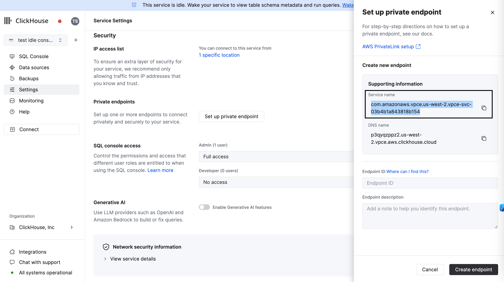
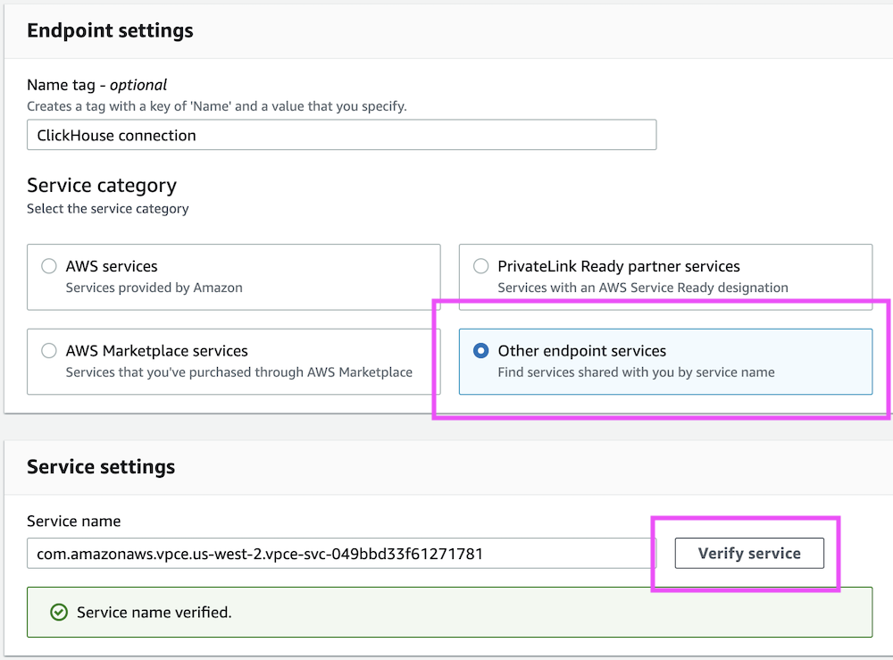
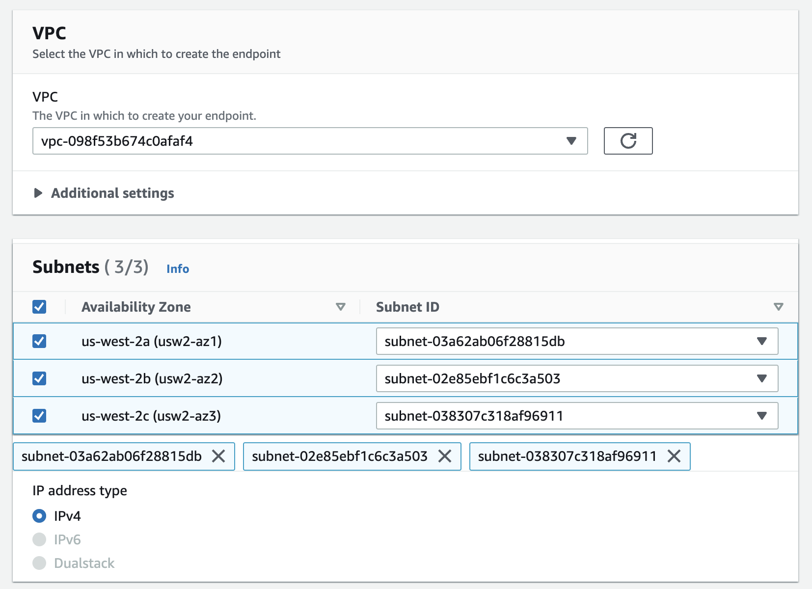
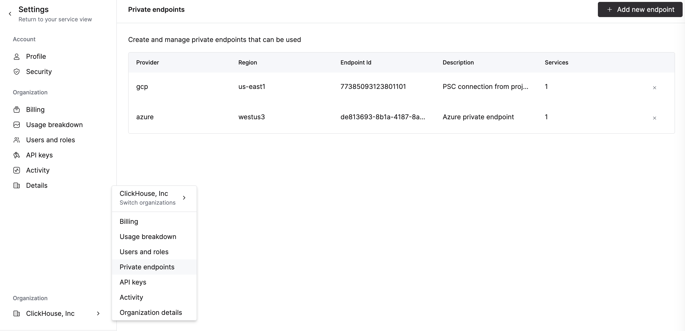
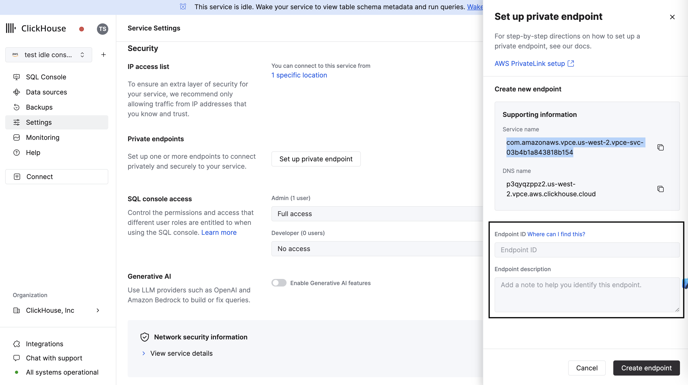
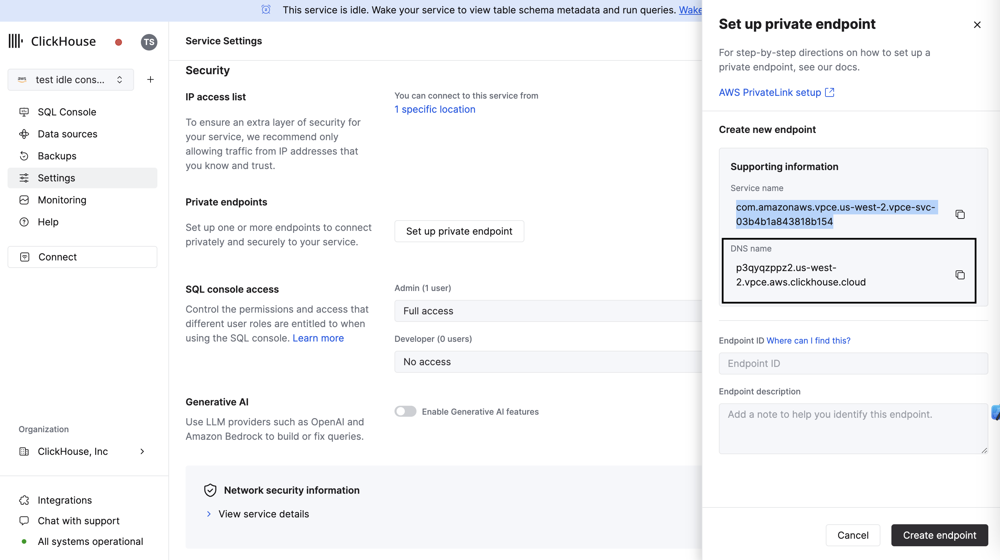

# AWS PrivateLink

[AWS PrivateLink](https://aws.amazon.com/privatelink/) を使用して、VPC、AWS サービス、お客様のオンプレミスシステム、および ClickHouse Cloud との間でインターネットを通さずに接続を提供することができます。このドキュメントは、AWS PrivateLink を使用して ClickHouse Cloud に接続する方法を説明します。AWS PrivateLink アドレス以外のアドレスからの ClickHouse Cloud サービスへのアクセスを無効にするには、ClickHouse Cloud の [IP アクセスリスト](https://clickhouse.com/docs/ja/cloud/security/setting-ip-filters) を使用します。

:::note 本番環境でのみ利用可能
AWS PrivateLink は ClickHouse Cloud 本番サービスでのみ利用可能です。開発サービスはサポートしていません。
:::

AWS PrivateLink を有効にするには、以下の手順を完了してください。
1. エンドポイントサービス名を取得します。
2. サービスエンドポイントを作成します。
3. エンドポイント ID を ClickHouse Cloud 組織に追加します。
4. エンドポイント ID をサービスの許可リストに追加します。

AWS PrivateLink の完全な Terraform 例については、[こちら](https://github.com/ClickHouse/terraform-provider-clickhouse/tree/main/examples/PrivateLink)をご参照ください。

## 前提条件

始める前に必要なもの：

1. AWS アカウント。
2. プライベートリンクを作成および管理するための必要な権限を持つ API キー。

## 手順

以下の手順に従って、ClickHouse Cloud を AWS PrivateLink に接続します。

### エンドポイントサービス名の取得

#### オプション 1: ClickHouse Cloud コンソール

ClickHouse Cloud コンソールで、PrivateLink を介して接続したいサービスを開き、**Settings** メニューを開きます。**Set up private endpoint** ボタンをクリックします。Private Link のセットアップに使用する **Service name** をコピーします。



#### オプション 2: API

コマンドを実行する前に、以下の環境変数を設定します。

```shell
REGION=<AWS のフォーマットを使用したリージョンコード>
PROVIDER=aws
KEY_ID=<キー ID>
KEY_SECRET=<キー シークレット>
ORG_ID=<ClickHouse 組織 ID>
SERVICE_NAME=<ClickHouse サービス名>
```

リージョン、プロバイダー、およびサービス名でフィルタリングして、目的のインスタンス ID を取得します。

```shell
export INSTANCE_ID=$(curl --silent --user ${KEY_ID:?}:${KEY_SECRET:?} \
https://api.clickhouse.cloud/v1/organizations/$ORG_ID/services | \
jq ".result[] | select (.region==\"${REGION:?}\" and .provider==\"${PROVIDER:?}\" and .name==\"${SERVICE_NAME:?}\") | .id " -r)
```

Private Link 構成のための AWS Service Name を取得します。

```bash
curl --silent --user ${KEY_ID:?}:${KEY_SECRET:?} \
https://api.clickhouse.cloud/v1/organizations/${ORG_ID:?}/services/${INSTANCE_ID:?}/privateEndpointConfig | \
jq .result
```

このコマンドを実行すると、次のような結果が返されます。

```result
{
    ...
    "endpointServiceId": "com.amazonaws.vpce.yy-xxxx-N.vpce-svc-xxxxxxxxxxxx",
    ...
}
```

`endpointServiceId` をメモして、[手順 2 に進みます](#create-a-service-endpoint)。

### サービスエンドポイントの作成

次に、前のステップで取得した `endpointServiceId` を使用してサービスポイントを作成します。

#### オプション 1: AWS コンソール

AWS コンソールを開き、**VPC** → **Endpoints** → **Create endpoints** に進みます。

**Other endpoint services** を選択し、前のステップで取得した `endpointServiceId` を使用します。完了したら、**Verify service** をクリックします。



次に、VPC とサブネットを選択します。



オプションとして、セキュリティグループ/タグを割り当てます。

:::note ポート
セキュリティグループでポート `8443` と `9440` が許可されていることを確認してください。
:::

VPC エンドポイントを作成した後、`Endpoint ID` の値をメモしてください。これは次のステップで必要になります。


#### オプション 2: AWS CloudFormation

正しいサブネット ID、セキュリティグループ、および VPC ID を使用するようにしてください。

```response
Resources:
  ClickHouseInterfaceEndpoint:
    Type: 'AWS::EC2::VPCEndpoint'
    Properties:
      VpcEndpointType: Interface
      PrivateDnsEnabled: false
      ServiceName: <use endpointServiceId from 'Obtain AWS Service Name for Private Link' step>
      VpcId: vpc-vpc_id
      SubnetIds:
        - subnet-subnet_id1
        - subnet-subnet_id2
        - subnet-subnet_id3
      SecurityGroupIds:
        - sg-security_group_id1
        - sg-security_group_id2
        - sg-security_group_id3
```

#### オプション 3: Terraform

```json
resource "aws_vpc_endpoint" "this" {
  vpc_id            = var.vpc_id
  service_name      = "<use endpointServiceId from 'Obtain AWS Service Name for Private Link' step>"
  vpc_endpoint_type = "Interface"
  security_group_ids = [
    var.security_group_id1,var.security_group_id2, var.security_group_id3,
  ]
  subnet_ids          = [var.subnet_id1,var.subnet_id2,var.subnet_id3]
  private_dns_enabled = false
}
```

#### エンドポイントのプライベート DNS 名を変更する

このステップでは、プライベート DNS ゾーン `<region code>.vpce.aws.clickhouse.cloud` の構成を AWS VPC に注入します。

:::note DNS リゾルバー
独自の DNS リゾルバーを使用している場合は、`<region code>.vpce.aws.clickhouse.cloud` の DNS ゾーンを作成し、ワイルドカードレコード `*.<region code>.vpce.aws.clickhouse.cloud` をエンドポイント ID IP アドレスにポイントします。
:::

#### オプション 1: AWS コンソール

**VPC Endpoints** に移動して、VPC エンドポイントを右クリックし、**Modify private DNS name** を選択します。


開いたページで、**Enable private DNS names** を選択します。


#### オプション 2: AWS CloudFormation

`CloudFormation` テンプレートを更新し、`PrivateDnsEnabled` を `true` に設定します。

```json
PrivateDnsEnabled: true
```

変更を適用します。

#### オプション 3: Terraform

- Terraform コード内の `aws_vpc_endpoint` リソースを変更し、`private_dns_enabled` を `true` に設定します。

```json
private_dns_enabled = true
```

変更を適用します。

### エンドポイント ID を ClickHouse Cloud 組織に追加

#### オプション 1: ClickHouse Cloud コンソール

組織にエンドポイントを追加するには、[サービスの許可リストにエンドポイント ID を追加](#add-endpoint-id-to-services-allow-list)のステップに進んでください。ClickHouse Cloud コンソールでサービス許可リストに `Endpoint ID` を追加すると、自動的に組織にも追加されます。

エンドポイントを削除するには、**Organization details -> Private Endpoints** を開き、削除ボタンをクリックしてエンドポイントを削除します。



#### オプション 2: API

コマンドを実行する前に、以下の環境変数を設定します。

```bash
PROVIDER=aws
KEY_ID=<キー ID>
KEY_SECRET=<キー シークレット>
ORG_ID=<please set ClickHouse 組織 ID>
ENDPOINT_ID=<前のステップからのエンドポイント ID>
REGION=<リージョンコード, AWS フォーマットを使用してください>
```

前のステップからのデータを使用して `VPC_ENDPOINT` 環境変数を設定します。

エンドポイントを追加するには、次のコマンドを実行します。

```bash
cat <<EOF | tee pl_config_org.json
{
  "privateEndpoints": {
    "add": [
      {
        "cloudProvider": "aws",
        "id": "${ENDPOINT_ID:?}",
        "description": "An aws private endpoint",
        "region": "${REGION:?}"
      }
    ]
  }
}
EOF

curl --silent --user ${KEY_ID:?}:${KEY_SECRET:?} \
-X PATCH -H "Content-Type: application/json" \
https://api.clickhouse.cloud/v1/organizations/${ORG_ID:?} \
-d @pl_config_org.json
```

エンドポイントを削除するには、次のコマンドを実行します。

```bash
cat <<EOF | tee pl_config_org.json
{
  "privateEndpoints": {
    "remove": [
      {
        "cloudProvider": "aws",
        "id": "${ENDPOINT_ID:?}",
        "region": "${REGION:?}"
      }
    ]
  }
}
EOF

curl --silent --user ${KEY_ID:?}:${KEY_SECRET:?} \
-X PATCH -H "Content-Type: application/json" \
https://api.clickhouse.cloud/v1/organizations/${ORG_ID:?} \
-d @pl_config_org.json
```

### エンドポイント ID をサービスの許可リストに追加

#### オプション 1: ClickHouse Cloud コンソール

ClickHouse Cloud コンソールで、PrivateLink を介して接続したいサービスを開き、**Settings** に移動してください。[前の](#create-a-service-endpoint) ステップで取得した `Endpoint ID` を入力します。

:::note
既存の PrivateLink 接続からアクセスを許可したい場合は、既存のエンドポイントドロップダウンメニューを使用してください。
:::



### オプション 2: API

PrivateLink を使用して利用できるようにするインスタンスごとに、エンドポイント ID を許可リストに追加する必要があります。

コマンドを実行する前に、以下の環境変数を設定します。

```bash
PROVIDER=aws
KEY_ID=<キー ID>
KEY_SECRET=<キー シークレット>
ORG_ID=<please set ClickHouse 組織 ID>
ENDPOINT_ID=<前のステップからのエンドポイント ID>
INSTANCE_ID=<インスタンス ID>
```

許可リストにエンドポイント ID を追加するには：

```bash
cat <<EOF | tee pl_config.json
{
  "privateEndpointIds": {
    "add": [
      "${ENDPOINT_ID:?}"
    ]
  }
}
EOF

curl --silent --user ${KEY_ID:?}:${KEY_SECRET:?} \
-X PATCH -H "Content-Type: application/json" \
https://api.clickhouse.cloud/v1/organizations/${ORG_ID:?}/services/${INSTANCE_ID:?} \
-d @pl_config.json | jq
```

許可リストからエンドポイント ID を削除するには：

```bash
cat <<EOF | tee pl_config.json
{
  "privateEndpointIds": {
    "remove": [
      "${ENDPOINT_ID:?}"
    ]
  }
}
EOF

curl --silent --user ${KEY_ID:?}:${KEY_SECRET:?} \
-X PATCH -H "Content-Type: application/json" \
https://api.clickhouse.cloud/v1/organizations/${ORG_ID:?}/services/${INSTANCE_ID:?} \
-d @pl_config.json | jq
```

### PrivateLink を使用してインスタンスに接続する

Private Link フィルターが構成された各インスタンスには、パブリックエンドポイントとプライベートエンドポイントがあります。PrivateLink を使用してサービスに接続するには、プライベートエンドポイントの `privateDnsHostname` を使用する必要があります。

:::note
プライベート DNS ホスト名は、AWS VPC からのみ利用可能です。ローカルマシンから DNS ホストを解決しようとしないでください。
:::

#### プライベート DNS ホスト名の取得

##### オプション 1: ClickHouse Cloud コンソール

ClickHouse Cloud コンソールで、**Settings** に移動します。**Set up private endpoint** ボタンをクリックします。開いたフライアウトで、**DNS Name** をコピーします。



##### オプション 2: API

コマンドを実行する前に、以下の環境変数を設定します。

```bash
KEY_ID=<キー ID>
KEY_SECRET=<キー シークレット>
ORG_ID=<please set ClickHouse 組織 ID>
INSTANCE_ID=<インスタンス ID>
```

次のコマンドを実行します：

```bash
curl --silent --user ${KEY_ID:?}:${KEY_SECRET:?} \
https://api.clickhouse.cloud/v1/organizations/${ORG_ID:?}/services/${INSTANCE_ID:?}/privateEndpointConfig | \
jq .result
```

これは次のような出力を返します：

```result
{
  "endpointServiceId": "com.amazonaws.vpce.yy-xxxx-N.vpce-svc-xxxxxxxxxxxx",
  "privateDnsHostname": "xxxxxxx.yy-xxxx-N.vpce.aws.clickhouse.cloud"
}
```

この例では、ホスト名 `xxxxxxx.yy-xxxx-N.vpce.aws.clickhouse.cloud` への接続は PrivateLink へルーティングされますが、`xxxxxxx.yy-xxxx-N.aws.clickhouse.cloud` はインターネットを経由してルーティングされます。

## トラブルシューティング

### 1 つのリージョンに複数の PrivateLink

同じ AWS リージョン内で 2 つ以上の AWS Private Link を必要とする場合、次の点に注意してください：ClickHouse では、リージョンレベルで VPC エンドポイントサービスを提供しています。1 つの VPC に 2 つ以上の VPC エンドポイントをセットアップすると、AWS VPC の観点からは、1 つの AWS Private Link を使用していることになります。同じリージョン内で 2 つ以上の AWS Private Link を構成する必要がある場合は、1 つの VPC に 1 つの VPC エンドポイントを作成し、ClickHouse に依頼して同じ VPC エンドポイント ID を同じ AWS リージョン内のすべての ClickHouse サービスに設定してください。

### プライベートエンドポイントへの接続がタイムアウトする

- VPC エンドポイントにセキュリティグループをアタッチしてください。
- エンドポイントにアタッチされたセキュリティグループの `インバウンド` ルールを確認し、ClickHouse のポートを許可してください。
- 接続テストに使用した VM にアタッチされたセキュリティグループの `アウトバウンド` ルールを確認し、ClickHouse のポートへの接続を許可してください。

### プライベートホスト名: ホストのアドレスが見つからない

- "Private DNS names" オプションが有効になっていることを確認してください。詳細は[ステップ](#modify-private-dns-name-for-endpoint)をご確認ください。

### ピアによる接続のリセット

- エンドポイント ID がサービス許可リストに追加されていない可能性があります。[ステップ](#add-endpoint-id-to-services-allow-list)をご確認ください。

### エンドポイントフィルターの確認

コマンドを実行する前に、以下の環境変数を設定します。

```bash
KEY_ID=<キー ID>
KEY_SECRET=<キー シークレット>
ORG_ID=<please set ClickHouse 組織 ID>
INSTANCE_ID=<インスタンス ID>
```

次のコマンドを実行します：

```shell
curl --silent --user ${KEY_ID:?}:${KEY_SECRET:?} \
-X GET -H "Content-Type: application/json" \
https://api.clickhouse.cloud/v1/organizations/${ORG_ID:?}/services/${INSTANCE_ID:?} | \
jq .result.privateEndpointIds
```

### リモートデータベースへの接続

仮に、ClickHouse Cloud で [MySQL](../../sql-reference/table-functions/mysql.md) や [PostgreSQL](../../sql-reference/table-functions/postgresql.md) テーブル関数を使用して、Amazon Web Services (AWS) VPC にホストされているデータベースに接続しようとしているとします。この接続を安全に有効にするために AWS PrivateLink を使用することはできません。PrivateLink は片方向、一方向の接続です。内部ネットワークまたは Amazon VPC が安全に ClickHouse Cloud に接続することはできますが、ClickHouse Cloud から内部ネットワークに接続することはできません。

[AWS PrivateLink ドキュメント](https://docs.aws.amazon.com/whitepapers/latest/building-scalable-secure-multi-vpc-network-infrastructure/aws-privatelink.html)によると：

> AWS PrivateLink を使用して、クライアント/サーバー設定で、消費者 VPC がプロバイダー VPC にある特定のサービスまたは一連のインスタンスに一方向のアクセスを許可したい場合に使用します。消費者 VPC のクライアントだけが、サービスプロバイダー VPC のサービスに接続を開始できます。

これを実現するために、ClickHouse Cloud から内部/プライベートなデータベースサービスへの接続を許可するように AWS セキュリティグループを設定してください。ClickHouse Cloud のリージョンにおける[デフォルトの送信元 IP アドレス](https://clickhouse.com/docs/ja/manage/security/cloud-endpoints-api)と、[利用可能な静的 IP アドレス](https://api.clickhouse.cloud/static-ips.json)を確認してください。
