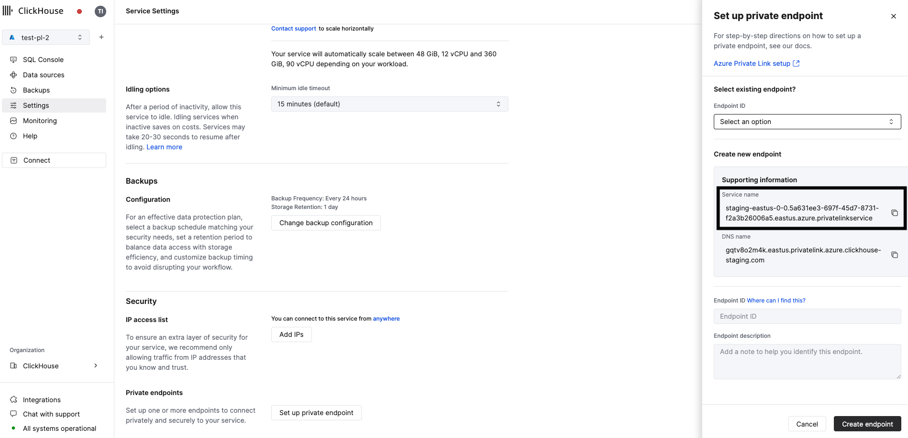
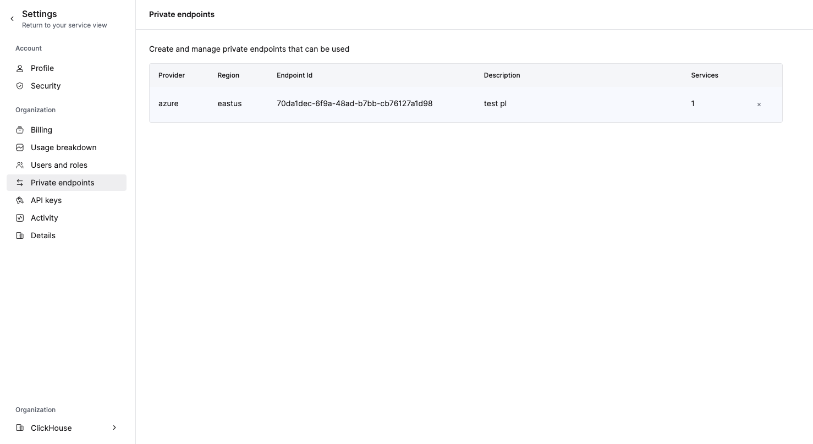
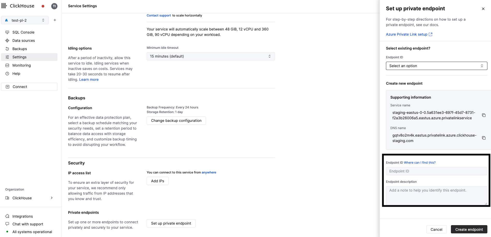
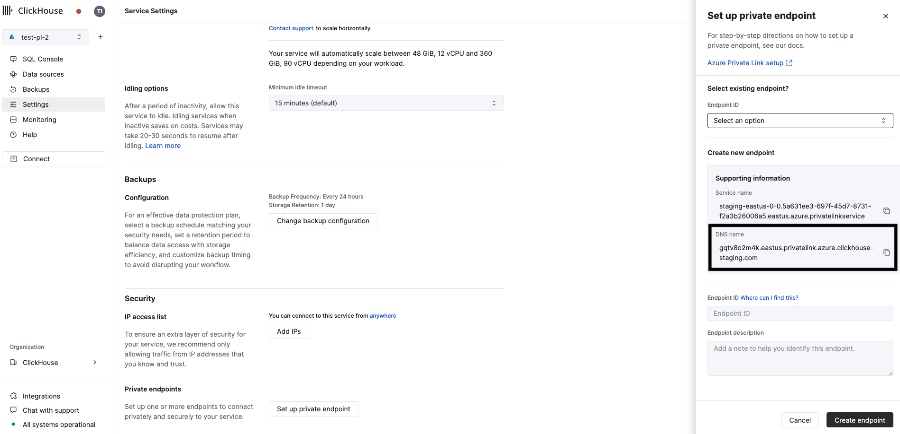

# Azure Private Link

:::note
Azure Private LinkはClickHouse Cloudの**Production**サービスでのみ有効にできます。**Development**サービスはサポートされていません。
:::

このガイドは、Azure Private Linkを使用して、Azure（顧客所有およびMicrosoftパートナーサービスを含む）とClickHouse Cloudの間に仮想ネットワークを介したプライベート接続を提供する方法を示しています。Azure Private Linkはネットワークアーキテクチャを簡素化し、Azure内のエンドポイント間のデータの公開インターネットへの露出を排除することで接続を保護します。


AWSやGCPとは異なり、AzureはPrivate Linkを介したクロスリージョン接続をサポートしています。これにより、複数のリージョンにデプロイされたClickHouseサービス間での接続を確立することができます。

:::note
リージョン間トラフィックには追加料金がかかる場合があります。最新のAzureドキュメントをご確認ください。
:::

Azure Private Linkを有効にするには、以下の手順を完了してください。

1. Private LinkのためのAzure接続エイリアスを取得する
1. Azureでプライベートエンドポイントを作成する
1. ClickHouse Cloud組織にプライベートエンドポイントGUIDを追加する
1. サービスの許可リストにプライベートエンドポイントGUIDを追加する
1. Private Linkを使用してClickHouse Cloudサービスにアクセスする

Azure Private Linkの完全なTerraform例は[こちら](https://github.com/ClickHouse/terraform-provider-clickhouse/tree/main/examples/PrivateLinkAzure)をご覧ください。

## Private Link用のAzure接続エイリアスを取得する

### オプション 1: ClickHouse Cloudコンソール

ClickHouse Cloudコンソールで、PrivateLink経由で接続したいサービスを開き、**Settings**メニューを開きます。**Set up private endpoint**ボタンをクリックします。このステップで設定するために使用する**Service name**をコピーします。



### オプション 2: API

開始する前に、ClickHouse Cloud APIキーが必要です。[新しいキーを作成](https://clickhouse.com/docs/ja/cloud/manage/openapi)するか、既存のキーを使用してください。Private Link構成を管理するには**Admin**キーが必要になります。

APIキーを入手したら、コマンドを実行する前に次の環境変数を設定してください。

```bash
REGION=<region code, use Azure format>
PROVIDER=azure
KEY_ID=<Key ID>
KEY_SECRET=<Key secret>
ORG_ID=<set ClickHouse organization ID>
```

リージョンからインスタンスIDを取得します。

指定されたリージョンに少なくとも1つのClickHouse Cloudサービスがデプロイされている必要があります。

```bash
curl --silent --user ${KEY_ID:?}:${KEY_SECRET:?} https://api.clickhouse.cloud/v1/organizations/${ORG_ID:?}/services | jq ".result[] | select (.region==\"${REGION:?}\" and .provider==\"${PROVIDER:?}\") | .id " -r | head -1 | tee instance_id
```

前のステップで受け取ったIDを使用して`INSTANCE_ID`環境変数を作成します。

```bash
INSTANCE_ID=$(cat instance_id)
```

Azure接続エイリアスとPrivate DNSホスト名を取得します。

```bash
curl --silent --user ${KEY_ID:?}:${KEY_SECRET:?} https://api.clickhouse.cloud/v1/organizations/${ORG_ID:?}/services/${INSTANCE_ID:?}/privateEndpointConfig | jq  .result 
{
  "endpointServiceId": "production-westus3-0-0.63c890a9-4d32-48cc-a08c-8cd92dfb1ad3.westus3.azure.privatelinkservice",
  ...
}
```

`endpointServiceId`をメモしておいてください。次のステップで使用します。

## Azureでプライベートエンドポイントを作成する {#create-private-endpoint-in-azure}

このセクションでは、Azureでプライベートエンドポイントを作成します。AzureポータルまたはTerraformのいずれかを使用できます。

### オプション 1: Azure Portalを使用してAzureでプライベートエンドポイントを作成

Azureポータルで、**Private Link Center → Private Endpoints**を開きます。


**Create**ボタンをクリックしてプライベートエンドポイント作成ダイアログを開きます。


---

次の画面で、次のオプションを指定します。

- **Subscription** / **Resource Group**: プライベートエンドポイント用にAzureサブスクリプションとリソースグループを選択してください。
- **Name**: **Private Endpoint**の名前を設定します。
- **Region**: Private Linkを介してClickHouse Cloudと接続するVNETがデプロイされているリージョンを選択します。

上記のステップを完了したら、**Next: Resource**ボタンをクリックします。


---

**Connect to an Azure resource by resource ID or alias**オプションを選択します。

**Resource ID or alias**として、[Private Link用のAzure接続エイリアスを取得](#obtain-azure-connection-alias-for-private-link)ステップで取得した**endpointServiceId**を使用します。

**Next: Virtual Network**ボタンをクリックします。


---

- **Virtual network**: Private Linkを使用してClickHouse Cloudと接続したいVNETを選択します。
- **Subnet**: プライベートエンドポイントが作成されるサブネットを選択します。

オプション: 

- **Application security group**: ASGをプライベートエンドポイントにアタッチし、ネットワークセキュリティグループでプライベートエンドポイントへの/からのネットワークトラフィックをフィルタリングするために使用できます。

**Next: DNS**ボタンをクリックします。


**Next: Tags**ボタンをクリックします。

---


タグをプライベートエンドポイントにアタッチすることができます（任意）。

**Next: Review + create**ボタンをクリックします。

---


最後に、**Create**ボタンをクリックします。


作成されたプライベートエンドポイントの**Connection status**は**Pending**状態になります。このプライベートエンドポイントをサービス許可リストに追加すると**Approved**状態に変更されます。

プライベートエンドポイントに関連したネットワークインターフェースを開き、次のステップで必要になる**Private IPv4 address**（この例では10.0.0.4）をコピーします。


### オプション 2: Terraformを使用してAzureでプライベートエンドポイントを作成する

Terraformを使用してプライベートエンドポイントを作成するための以下のテンプレートを使用します。

```json
resource "azurerm_private_endpoint" "example_clickhouse_cloud" {
  name                = var.pe_name
  location            = var.pe_location
  resource_group_name = var.pe_resource_group_name
  subnet_id           = var.pe_subnet_id

  private_service_connection {
    name                              = "test-pl"
    private_connection_resource_alias = "<data from 'Obtain Azure connection alias for Private Link' step>"
    is_manual_connection              = true
  }
}
```

### プライベートエンドポイントresourceGuidの取得 {#obtaining-private-endpoint-resourceguid}

Private Linkを使用するためには、プライベートエンドポイント接続GUIDをサービス許可リストに追加する必要があります。

プライベートエンドポイントリソースGUIDはAzureポータルでのみ表示されます。前のステップで作成したプライベートエンドポイントを開き、**JSON View**をクリックします。


`resourceGuid`フィールドを見つけ、この値をコピーします。


## Private LinkのためのDNSの設定

Private Linkを介してリソースにアクセスするために、プライベートDNSゾーン (`${location_code}.privatelink.azure.clickhouse.cloud`) を作成し、それをVNETにアタッチする必要があります。

### Private DNSゾーンを作成

**オプション 1: Azureポータルを使用**

[Azure Portalを使用してAzureプライベートDNSゾーンを作成する](https://learn.microsoft.com/en-us/azure/dns/private-dns-getstarted-portal)ためのガイドに従ってください。

**オプション 2: Terraformを使用**

Private DNSゾーンを作成するための以下のTerraformテンプレートを使用します。

```json
resource "azurerm_private_dns_zone" "clickhouse_cloud_private_link_zone" {
  name                = "${var.location}.privatelink.azure.clickhouse.cloud"
  resource_group_name = var.resource_group_name
}
```

### ワイルドカードDNSレコードを作成

ワイルドカードレコードを作成し、プライベートエンドポイントにポイントします。

**オプション 1: Azureポータルを使用**

1. MyAzureResourceGroupリソースグループを開き、`${region_code}.privatelink.azure.clickhouse.cloud`プライベートゾーンを選択します。
2. **+ Record set**を選択します。
3. **Name**に`*`を入力します。
4. **IP Address**にプライベートエンドポイントのIPアドレスを入力します。
5. **OK**を選択します。


**オプション 2: Terraformを使用**

ワイルドカードDNSレコードを作成するための以下のTerraformテンプレートを使用します。

```json
resource "azurerm_private_dns_a_record" "example" {
  name                = "*"
  zone_name           = var.zone_name
  resource_group_name = var.resource_group_name
  ttl                 = 300
  records             = ["10.0.0.4"]
}
```

### 仮想ネットワークリンクを作成

プライベートDNSゾーンを仮想ネットワークにリンクするために、仮想ネットワークリンクを作成する必要があります。

**オプション 1: Azureポータルを使用**

[プライベートDNSゾーンに仮想ネットワークをリンクする](https://learn.microsoft.com/en-us/azure/dns/private-dns-getstarted-portal#link-the-virtual-network)ためのガイドに従ってください。

**オプション 2: Terraformを使用**

仮想ネットワークをプライベートDNSゾーンにリンクするための以下のTerraformテンプレートを使用します。

```json
resource "azurerm_private_dns_zone_virtual_network_link" "example" {
  name                  = "test"
  resource_group_name   = var.resource_group_name
  private_dns_zone_name = var.zone_name
  virtual_network_id    = var.virtual_network_id
}
```

### DNS設定の検証

westus3.privatelink.azure.clickhouse.cloudドメイン内の任意のレコードはプライベートエンドポイントIPにポイントされるべきです（この例では10.0.0.4）。

```bash
nslookup instance-id.westus3.privatelink.azure.clickhouse.cloud.
Server:		127.0.0.53
Address:	127.0.0.53#53

Non-authoritative answer:
Name:	instance-id.westus3.privatelink.azure.clickhouse.cloud
Address: 10.0.0.4
```

## ClickHouse Cloud組織にプライベートエンドポイントGUIDを追加する

### オプション 1: ClickHouse Cloudコンソール

組織にエンドポイントを追加するには、[Add the Private Endpoint GUID to your service(s) allow list](#add-private-endpoint-guid-to-services-allow-list)ステップに進んでください。ClickHouse Cloudコンソールを使用してサービス許可リストに`Private Endpoint GUID`を追加すると、それが組織にも自動的に追加されます。

エンドポイントを削除するには、**Organization details -> Private Endpoints**を開き、削除ボタンをクリックしてエンドポイントを削除します。



### オプション 2: API

コマンドを実行する前に次の環境変数を設定してください。

```bash
PROVIDER=azure
KEY_ID=<Key ID>
KEY_SECRET=<Key secret>
ORG_ID=<set ClickHouse organization ID>
ENDPOINT_ID=<Private Endpoint resourceGuid>
REGION=<region code, use Azure format>
```

[プライベートエンドポイントresourceGuidの取得](#obtaining-private-endpoint-resourceguid)ステップからのデータを使用して`VPC_ENDPOINT`環境変数を設定します。

プライベートエンドポイントを追加するために次のコマンドを実行します。

```bash
cat <<EOF | tee pl_config_org.json
{
  "privateEndpoints": {
    "add": [
      {
        "cloudProvider": "azure",
        "id": "${ENDPOINT_ID:?}",
        "description": "Azure private endpoint",
        "region": "${REGION:?}"
      }
    ]
  }
}
EOF
```

また、プライベートエンドポイントを削除するために次のコマンドを実行することもできます。

```bash
cat <<EOF | tee pl_config_org.json
{
  "privateEndpoints": {
    "remove": [
      {
        "cloudProvider": "azure",
        "id": "${ENDPOINT_ID:?}",
        "region": "${REGION:?}"
      }
    ]
  }
}
EOF
```

プライベートエンドポイントを追加または削除した後、それを組織に適用するために次のコマンドを実行します。

```bash
curl --silent --user ${KEY_ID:?}:${KEY_SECRET:?} -X PATCH -H "Content-Type: application/json" https://api.clickhouse.cloud/v1/organizations/${ORG_ID:?} -d @pl_config_org.json
```

## サービスの許可リストにプライベートエンドポイントGUIDを追加する {#add-private-endpoint-guid-to-services-allow-list}

デフォルトでは、プライベートリンク接続が承認され確立されている場合でも、ClickHouse Cloudサービスはプライベートリンク接続を介して利用可能ではありません。プライベートリンクを使用して利用可能とするためには、各サービスに対してプライベートエンドポイントGUIDを明示的に追加する必要があります。

### オプション 1: ClickHouse Cloudコンソール

ClickHouse Cloudコンソールで、PrivateLink経由で接続したいサービスを開き、**Settings**に移動します。[前の](#obtaining-private-endpoint-resourceguid)ステップで取得した`Endpoint ID`を入力します。

:::note
既存のPrivateLink接続からのアクセスを許可する場合は、既存のエンドポイントのドロップダウンメニューを使用してください。
:::



### オプション 2: API

コマンドを実行する前に次の環境変数を設定してください。

```bash
PROVIDER=azure
KEY_ID=<Key ID>
KEY_SECRET=<Key secret>
ORG_ID=<set ClickHouse organization ID>
ENDPOINT_ID=<Private Endpoint resourceGuid>
INSTANCE_ID=<Instance ID>
```

プライベートリンクを使用して利用可能にしたい各サービスで実行します。

サービス許可リストにプライベートエンドポイントを追加するために次のコマンドを実行します。

```bash
cat <<EOF | tee pl_config.json
{
  "privateEndpointIds": {
    "add": [
      "${ENDPOINT_ID:?}"
    ]
  }
}
EOF
```

また、サービス許可リストからプライベートエンドポイントを削除するために次のコマンドを実行することもできます。

```bash
cat <<EOF | tee pl_config.json
{
  "privateEndpointIds": {
    "remove": [
      "${ENDPOINT_ID:?}"
    ]
  }
}
EOF
```

サービス許可リストにプライベートエンドポイントを追加または削除した後、それを組織に適用するために次のコマンドを実行します。

```bash
curl --silent --user ${KEY_ID:?}:${KEY_SECRET:?} -X PATCH -H "Content-Type: application/json" https://api.clickhouse.cloud/v1/organizations/${ORG_ID:?}/services/${INSTANCE_ID?} -d @pl_config.json | jq
```

## Private Linkを使用してClickHouse Cloudサービスにアクセスする

プライベートリンクが有効になっている各サービスには、パブリックエンドポイントとプライベートエンドポイントがあります。Private Linkを使用して接続するには、`privateDnsHostname`というプライベートエンドポイントを使用する必要があります。

:::note
プライベートDNSホスト名はAzure VNETからのみ利用可能です。Azure VNET外のマシンからDNSホストを解決しようとしないでください。
:::

### プライベートDNSホスト名の取得

#### オプション 1: ClickHouse Cloudコンソール

ClickHouse Cloudコンソールで、**Settings**に移動します。**Set up private endpoint**ボタンをクリックします。開かれたフライアウトで、**DNS Name**をコピーします。



#### オプション 2: API

コマンドを実行する前に次の環境変数を設定してください。

```bash
KEY_ID=<Key ID>
KEY_SECRET=<Key secret>
ORG_ID=<set ClickHouse organization ID>
INSTANCE_ID=<Instance ID>
```

次のコマンドを実行します。

```bash
curl --silent --user ${KEY_ID:?}:${KEY_SECRET:?} https://api.clickhouse.cloud/v1/organizations/${ORG_ID:?}/services/${INSTANCE_ID:?}/privateEndpointConfig | jq  .result 
```

次のような応答を受けるはずです。

```response
{
  ...
  "privateDnsHostname": "xxxxxxx.<region code>.privatelink.azure.clickhouse.cloud"
}
```

この例では、`xxxxxxx.region_code.privatelink.azure.clickhouse.cloud`ホスト名への接続はPrivate Linkにルーティングされます。一方、`xxxxxxx.region_code.azure.clickhouse.cloud`はインターネットを介してルーティングされます。

`privateDnsHostname`を使用して、プライベートリンクを介してClickHouse Cloudサービスに接続します。

## トラブルシューティング

### DNS設定のテスト

`${region_code}.privatelink.azure.clickhouse.cloud.`ゾーン内のすべてのDNSレコードは[Azureでプライベートエンドポイントを作成](#create-private-endpoint-in-azure)ステップからの内部IPアドレスにポイントされる必要があります。この例では、リージョンは`westus3`です。

次のコマンドを実行します。

```bash
nslookup abcd.westus3.privatelink.azure.clickhouse.cloud.
```

次のような応答を受けるはずです。

```response
Non-authoritative answer:
Name:	abcd.westus3.privatelink.azure.clickhouse.cloud
Address: 10.0.0.4
```

### ピアによる接続リセット

おそらく、プライベートエンドポイントGUIDがサービス許可リストに追加されていません。[サービスの許可リストにプライベートエンドポイントGUIDを追加する](#add-private-endpoint-guid-to-services-allow-list)ステップに再度取り組んでください。

### プライベートエンドポイントがPending状態

おそらく、プライベートエンドポイントGUIDがサービス許可リストに追加されていません。[サービスの許可リストにプライベートエンドポイントGUIDを追加する](#add-private-endpoint-guid-to-services-allow-list)ステップに再度取り組んでください。

### 接続のテスト

Private Link経由で接続に問題がある場合は、`openssl`を使用して接続を確認します。Private Linkエンドポイントのステータスが`Accepted`であることを確認してください。

OpenSSLは接続可能であるはずです（出力にCONNECTEDが表示されます）。`errno=104`は予期されたものです。

```bash
openssl s_client -connect abcd.westus3.privatelink.azure.clickhouse.cloud.cloud:9440
```

```response
# highlight-next-line
CONNECTED(00000003)
write:errno=104
---
no peer certificate available
---
No client certificate CA names sent
---
SSL handshake has read 0 bytes and written 335 bytes
Verification: OK
---
New, (NONE), Cipher is (NONE)
Secure Renegotiation IS NOT supported
Compression: NONE
Expansion: NONE
No ALPN negotiated
Early data was not sent
Verify return code: 0 (ok)
```

### プライベートエンドポイントフィルターの確認

コマンドを実行する前に次の環境変数を設定してください。

```bash
KEY_ID=<Key ID>
KEY_SECRET=<Key secret>
ORG_ID=<please set ClickHouse organization ID>
INSTANCE_ID=<Instance ID>
```

プライベートエンドポイントフィルターを確認するために次のコマンドを実行します。

```bash
curl --silent --user ${KEY_ID:?}:${KEY_SECRET:?} -X GET -H "Content-Type: application/json" https://api.clickhouse.cloud/v1/organizations/${ORG_ID:?}/services/${INSTANCE_ID:?} | jq .result.privateEndpointIds
[]
```

## 詳細情報

Azure Private Linkの詳細については、[azure.microsoft.com/en-us/products/private-link](https://azure.microsoft.com/en-us/products/private-link)をご覧ください。
