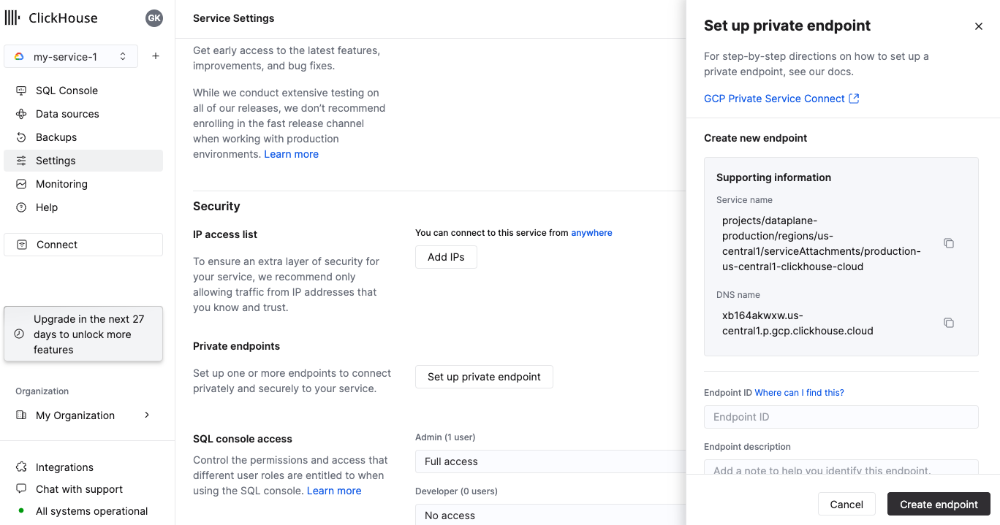
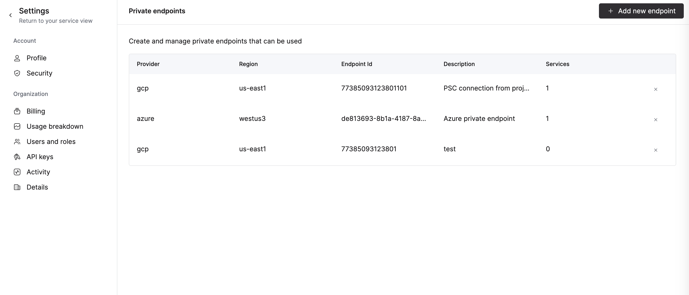
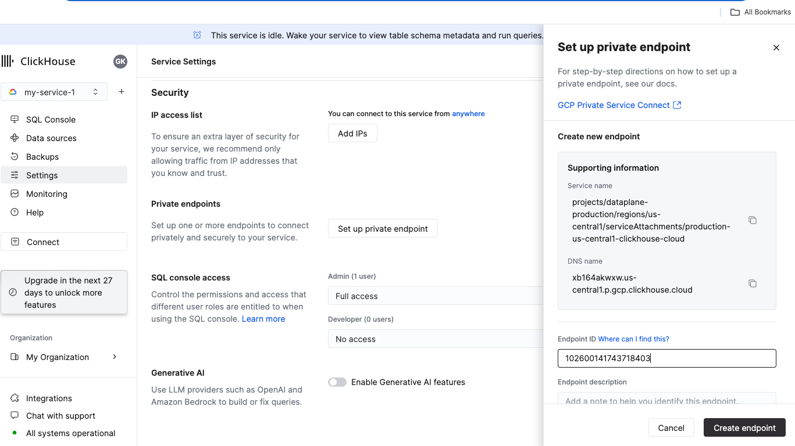
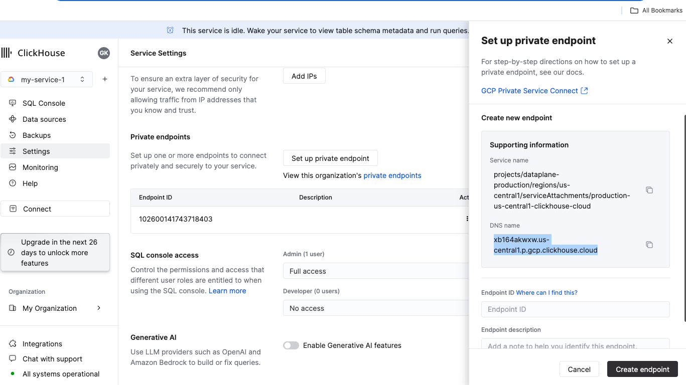

## Private Service Connect

Private Service Connect (PSC) は、Google Cloud のネットワーク機能であり、消費者が自分の仮想プライベートクラウド (VPC) ネットワーク内で管理サービスにプライベートにアクセスできるようにします。同様に、管理サービスの提供者は、これらのサービスを独自の別の VPC ネットワークにホストし、消費者にプライベート接続を提供できます。

サービス提供者は、Private Service Connect サービスを作成することで、消費者に自分のアプリケーションを公開します。サービス消費者は、これらの Private Service Connect タイプのいずれかを通じて、直接そのサービスにアクセスします。


:::important
デフォルトでは、PSC 接続が承認され確立されていても、ClickHouse サービスは Private Service 接続からは利用できません。インスタンスレベルで PSC ID を許可リストに明示的に追加する必要があります。[ステップ](#add-endpoint-id-to-services-allow-list)を完了してください。
:::

:::note
GCP Private Service Connect は ClickHouse Cloud Production サービスでのみ有効にできます。
:::

リージョン間の接続はサポートされていません。提供者と消費者のリージョンは同じでなければなりません。PSC レベルでグローバルアクセスを有効にすれば、自分の VPC 内の他のリージョンからでも接続できるようになります（以下を参照）。

このプロセスは以下の4つのステップに分かれています：

1. Private Service Connect用のGCPサービスアタッチメントを取得します。
1. サービスエンドポイントを作成します。
1. Endpoint ID を ClickHouse Cloud 組織に追加します。
1. Endpoint ID をサービスの許可リストに追加します。

:::note
以下の例では、次の事項を使用します：
 - GCP リージョン: `us-central1`
 - GCP プロジェクト (顧客のGCPプロジェクト): `my-gcp-project`
 - 顧客のGCPプロジェクト内のGCPプライベートIPアドレス: `10.128.0.2`
 - 顧客のGCPプロジェクト内のGCP VPC: `default`
 
以下に、ClickHouse Cloud サービス内で Private Service Connect を設定する方法を示すコード例を示します。
:::

## はじめに

ClickHouse Cloud サービスに関する情報を取得する必要があります。ClickHouse Cloud コンソールまたは ClickHouse API を通じてこれを行うことができます。ClickHouse API を使用する場合、以下の環境変数を設定してから進めてください：

```bash
export REGION=us-central1
export PROVIDER=gcp
export KEY_ID=<Key ID>
export KEY_SECRET=<Key secret>
export ORG_ID=<ClickHouse organization ID>
export INSTANCE_ID=$(curl --silent --user ${KEY_ID:?}:${KEY_SECRET:?} "https://api.clickhouse.cloud/v1/organizations/${ORG_ID:?}/services" | jq ".result[] | select (.region==\"${REGION:?}\" and .provider==\"${PROVIDER:?}\") | .id " -r | head -1)
```
:::note
 - 自身のOrganization IDはClickHouseコンソール (Organization -> Organization Details)から取得可能です。
 - [新しいキーを作成](https://clickhouse.com/docs/ja/cloud/manage/openapi)するか、既存のものを使用できます。
:::

## GCP サービスアタッチメントと Private Service Connect 用の DNS 名を取得する

### オプション 1: ClickHouse Cloud コンソール

ClickHouse Cloud コンソールで、Private Service Connect 経由で接続したいサービスを開き、**設定** メニューを開きます。**プライベートエンドポイントを設定する** ボタンをクリックします。**サービス名** (`endpointServiceId`) と **DNS 名** (`privateDnsHostname`) をメモしておいてください。次のステップで使用します。



### オプション 2: API 

:::note
このステップを実行するために、少なくとも1つのインスタンスがリージョン内でデプロイされている必要があります。
:::

GCP サービスアタッチメントと Private Service Connect 用の DNS 名を取得します：

```bash
curl --silent --user ${KEY_ID:?}:${KEY_SECRET:?} "https://api.clickhouse.cloud/v1/organizations/${ORG_ID:?}/services/${INSTANCE_ID:?}/privateEndpointConfig" | jq  .result 
{
  "endpointServiceId": "projects/.../regions/us-central1/serviceAttachments/production-us-central1-clickhouse-cloud",
  "privateDnsHostname": "xb164akwxw.us-central1.p.gcp.clickhouse.cloud"
}
```

`endpointServiceId` と `privateDnsHostname` をメモしておいてください。次のステップで使用します。

## サービスエンドポイントを作成する

このセクションでは、サービスエンドポイントを作成します。

### Private Service Connection の追加

まず最初に、Private Service Connection を作成します。

#### オプション 1: Google Cloud コンソールを使用する

Google Cloud コンソールで、**Network services -> Private Service Connect** に移動します。


**Connect Endpoint** ボタンをクリックして、Private Service Connect 作成ダイアログを開きます。

- **Target**: **Published service** を使用してください
- **Target service**: [Private Service Connect 用の GCP サービスアタッチメント取得](#obtain-gcp-service-attachment-for-private-service-connect) ステップの **endpointServiceId** を使用してください。
- **Endpoint name**: PSC の **Endpoint name** 名を設定します。
- **Network/Subnetwork/IP address**: 接続に使用するネットワークを選択してください。Private Service Connect エンドポイントの IP アドレスを新規作成するか既存のものを使用します。例では、名前 **your-ip-address** でIPアドレス `10.128.0.2` を事前に作成して割り当てています。
- エンドポイントを任意のリージョンから利用可能にするには、**Enable global access** チェックボックスを有効にすることができます。


**ADD ENDPOINT** ボタンを使って PSC エンドポイントを作成します。

接続が承認されると、**Status** 列が **Pending** から **Accepted** に変わります。


***PSC Connection ID*** をコピーします。この ID を次のステップで ***Endpoint ID*** として使用します。

#### オプション 2: Terraform を使用する

```json
provider "google" {
  project = "my-gcp-project"
  region  = "us-central1"
}

variable "region" {
  type    = string
  default = "us-central1"
}

variable "subnetwork" {
  type = string
  default = "https://www.googleapis.com/compute/v1/projects/my-gcp-project/regions/us-central1/subnetworks/default"
}

variable "network" {
  type = string
  default = "https://www.googleapis.com/compute/v1/projects/my-gcp-project/global/networks/default"
}

resource "google_compute_address" "psc_endpoint_ip" {
  address      = "10.128.0.2"
  address_type = "INTERNAL"
  name         = "your-ip-address"
  purpose      = "GCE_ENDPOINT"
  region       = var.region
  subnetwork   = var.subnetwork
}

resource "google_compute_forwarding_rule" "clickhouse_cloud_psc" {
  ip_address            = google_compute_address.psc_endpoint_ip.self_link
  name                  = "ch-cloud-${var.region}"
  network               = var.network
  region                = var.region
  load_balancing_scheme = ""
  # service attachment
  target = "https://www.googleapis.com/compute/v1/$TARGET" # 以下のノートを参照
}

output "psc_connection_id" {
  value       = google_compute_forwarding_rule.clickhouse_cloud_psc.psc_connection_id
  description = "インスタンスレベルで許可リストにGCP PSC接続IDを追加します。"
}
```

:::note
TARGET - [Private Service Connect 用の GCP サービスアタッチメント取得](#obtain-gcp-service-attachment-for-private-service-connect) ステップでの **endpointServiceId** を使用してください。
:::

## DNS の設定

Google Cloud コンソールを使用するものと `gcloud` CLI を使用するものの2つのオプションがあります。

### オプション 1: Google Cloud コンソールを使用する

- **Supported regions** からプライベート DNS ゾーンを作成します。
- **Network services -> Cloud DNS** を開きます。
- **Create Zone** を選択します：


ゾーンタイプダイアログで以下を設定します：

- ゾーンタイプ: **Private**
- ゾーン名: 適切なゾーン名を入力します。
- DNS 名: **Supported regions** テーブルの **Private DNS domain** 列をリージョンに合わせて使用します。
- ネットワーク: ClickHouse Cloud に PSC を使って接続する予定のネットワークに DNS ゾーンをアタッチします。


#### プライベート DNS ゾーンでの DNS レコードの作成

[Private Service Connection の追加](#adding-a-private-service-connection) ステップで作成した IP アドレスを指すように設定します。


### オプション 2: `gcloud` CLI を使用する

#### DNS ゾーンの作成

```bash
gcloud dns \
  --project=my-gcp-project \
  managed-zones create ch-cloud-us-central1 \
  --description="Private DNS zone for PSC" \
  --dns-name="us-central1.p.gcp.clickhouse.cloud." \
  --visibility="private" \
  --networks="https://www.googleapis.com/compute/v1/projects/my-gcp-project/global/networks/default"
```

#### DNS レコードの作成

```bash
gcloud dns \
  --project=my-gcp-project \
  record-sets create $DNS_RECORD \
  --zone="ch-cloud-us-central1" \
  --type="A" \
  --ttl="300" \
  --rrdatas="10.128.0.2"
```
:::note
DNS_RECORD - [Private Service Connect 用の GCP サービスアタッチメント取得](#obtain-gcp-service-attachment-for-private-service-connect) ステップでの **privateDnsHostname** を使用します。
:::

### オプション 3: Terraform を使用する

```json
variable "ch_dns_record" {
  type    = string
  default = "$DNS_NAME" # 以下のノートを参照
}

resource "google_dns_managed_zone" "clickhouse_cloud_private_service_connect" {
  description   = "Private DNS zone for accessing ClickHouse Cloud using Private Service Connect"
  dns_name      = "${var.region}.p.gcp.clickhouse.cloud."
  force_destroy = false
  name          = "clickhouse-cloud-private-service-connect-${var.region}"
  visibility    = "private"
}

resource "google_dns_record_set" "psc_dns_record" {
  managed_zone = google_dns_managed_zone.clickhouse_cloud_private_service_connect.name
  name         = "${var.ch_dns_record}"
  type         = "A"
  rrdatas      = [google_compute_address.psc_endpoint_ip.address]
}
```

:::note
DNS_NAME - [Private Service Connect 用の GCP サービスアタッチメント取得](#obtain-gcp-service-attachment-for-private-service-connect) ステップでの **privateDnsHostname** を使用します。
:::

## DNS 設定の確認

DNS_RECORD - [Private Service Connect 用の GCP サービスアタッチメント取得](#obtain-gcp-service-attachment-for-private-service-connect) ステップでの **privateDnsHostname** を使用します。

```bash
ping $DNS_RECORD
```

## Endpoint ID を ClickHouse Cloud 組織に追加する

### オプション 1: ClickHouse Cloud コンソール

組織にエンドポイントを追加するには、[サービスの許可リストに Endpoint ID を追加](#add-endpoint-id-to-services-allow-list) ステップに進みます。ClickHouse Cloud コンソールを使用して許可リストに `PSC Connection ID` を追加すると、組織にも自動的に追加されます。

エンドポイントを削除するには、**Organization details -> Private Endpoints** を開き、削除ボタンをクリックしてエンドポイントを削除します。



### オプション 2: API

コマンドを実行する前に次の環境変数を設定します：

`ENDPOINT_ID` を、[Private Service Connection の追加](#adding-a-private-service-connection) ステップでの **Endpoint ID** の値に置き換えます。

エンドポイントを追加するには、以下を実行します：

```bash
cat <<EOF | tee pl_config_org.json
{
  "privateEndpoints": {
    "add": [
      {
        "cloudProvider": "gcp",
        "id": "${ENDPOINT_ID:?}",
        "description": "A GCP private endpoint",
        "region": "${REGION:?}"
      }
    ]
  }
}
EOF
```

エンドポイントを削除するには、以下を実行します：

```bash
cat <<EOF | tee pl_config_org.json
{
  "privateEndpoints": {
    "remove": [
      {
        "cloudProvider": "gcp",
        "id": "${ENDPOINT_ID:?}",
        "region": "${REGION:?}"
      }
    ]
  }
}
EOF
```

組織に Private Endpoint を追加/削除します：

```bash
curl --silent --user ${KEY_ID:?}:${KEY_SECRET:?} -X PATCH -H "Content-Type: application/json" https://api.clickhouse.cloud/v1/organizations/${ORG_ID:?} -d @pl_config_org.json
```

## サービスの許可リストに Endpoint ID を追加する

Private Service Connect を使用できるようにするには、各インスタンスに Endpoint ID を許可リストに追加する必要があります。

:::note
このステップは開発サービスには実行できません。
:::

### オプション 1: ClickHouse Cloud コンソール

ClickHouse Cloud コンソールで、Private Service Connect 経由で接続したいサービスを開き、**設定** に移動します。[Private Service Connection の追加](#adding-a-private-service-connection) ステップから取得した `Endpoint ID` を入力します。**エンドポイントの作成** をクリックします。

:::note
既存の Private Service Connect 接続からのアクセスを許可する場合は、既存のエンドポイントドロップダウンメニューを使用してください。
:::




### オプション 2: API

コマンドを実行する前に次の環境変数を設定します：

[Private Service Connection の追加](#adding-a-private-service-connection) ステップでの **Endpoint ID** の値に **ENDPOINT_ID** を置き換えます。

Private Service Connect を使用できるようにする各サービスに対して実行します。 

追加：

```bash
cat <<EOF | tee pl_config.json
{
  "privateEndpointIds": {
    "add": [
      "${ENDPOINT_ID}"
    ]
  }
}
EOF
```

削除：

```bash
cat <<EOF | tee pl_config.json
{
  "privateEndpointIds": {
    "remove": [
      "${ENDPOINT_ID}"
    ]
  }
}
EOF
```

```bash
curl --silent --user ${KEY_ID:?}:${KEY_SECRET:?} -X PATCH -H "Content-Type: application/json" https://api.clickhouse.cloud/v1/organizations/${ORG_ID:?}/services/${INSTANCE_ID:?} -d @pl_config.json | jq
```

## Private Service Connect を使用したインスタンスへのアクセス

Private Service Connect フィルターが設定された各インスタンスには、パブリックエンドポイントとプライベートエンドポイントの2つのエンドポイントがあります。Private Service Connect を使用して接続するには、プライベートエンドポイントを使用する必要があります。[Private Service Connect 用の GCP サービスアタッチメント取得](#obtain-gcp-service-attachment-for-private-service-connect) ステップでの **endpointServiceId** を参照してください。

:::note
プライベートDNSホスト名はGCP VPC内からのみ利用可能です。GCP VPC外のマシンからDNSホストを解決しようとしないでください。
:::

### プライベートDNSホスト名の取得

#### オプション 1: ClickHouse Cloud コンソール

ClickHouse Cloud コンソールで、**設定** に移動します。**プライベートエンドポイントを設定する** ボタンをクリックします。開かれたパネルで **DNS 名** をコピーします。




#### オプション 2: API

```bash
curl --silent --user $KEY_ID:$KEY_SECRET https://api.clickhouse.cloud/v1/organizations/$ORG_ID/services/$INSTANCE_ID/privateEndpointConfig | jq  .result 
```

```response
{
  ...
  "privateDnsHostname": "xxxxxxx.<region code>.p.gcp.clickhouse.cloud"
}
```

この例では、`xxxxxxx.yy-xxxxN.p.gcp.clickhouse.cloud` ホスト名への接続が Private Service Connect にルーティングされます。一方、`xxxxxxx.yy-xxxxN.gcp.clickhouse.cloud` はインターネット経由でルーティングされます。

## トラブルシューティング

### DNS 設定のテスト

DNS_NAME - [Private Service Connect 用の GCP サービスアタッチメント取得](#obtain-gcp-service-attachment-for-private-service-connect) ステップでの **privateDnsHostname** を使用します。

```bash
nslookup $DNS_NAME
```

```response
Non-authoritative answer:
...
Address: 10.128.0.2
```

### Connection reset by peer

- 最も可能性が高いのは、サービス許可リストに Endpoint ID が追加されていない場合です。[サービスの許可リストに Endpoint ID を追加](#add-endpoint-id-to-services-allow-list) ステップを再確認してください。

### 接続テスト

PSCリンクを使用して接続する際に問題がある場合は、`openssl` を使用して接続をテストしてください。Private Service Connect エンドポイントのステータスが `Accepted` であることを確認してください：

OpenSSL は接続できるはずです（出力に CONNECTED が表示されます）。`errno=104` は予期されたものです。

DNS_NAME - [Private Service Connect 用の GCP サービスアタッチメント取得](#obtain-gcp-service-attachment-for-private-service-connect) ステップでの **privateDnsHostname** を使用します。

```bash
openssl s_client -connect ${DNS_NAME}:9440
```

```response
# highlight-next-line
CONNECTED(00000003)
write:errno=104
---
no peer certificate available
---
No client certificate CA names sent
---
SSL handshake has read 0 bytes and written 335 bytes
Verification: OK
---
New, (NONE), Cipher is (NONE)
Secure Renegotiation IS NOT supported
Compression: NONE
Expansion: NONE
No ALPN negotiated
Early data was not sent
Verify return code: 0 (ok)
```

### エンドポイントフィルターの確認

#### REST API

```bash
curl --silent --user ${KEY_ID:?}:${KEY_SECRET:?} -X GET -H "Content-Type: application/json" "https://api.clickhouse.cloud/v1/organizations/${ORG_ID:?}/services/${INSTANCE_ID:?}" | jq .result.privateEndpointIds
[
  "102600141743718403"
]
```

### リモートデータベースへの接続

MySQL](../../sql-reference/table-functions/mysql.md) または [PostgreSQL](../../sql-reference/table-functions/postgresql.md) テーブル関数を使用して、ClickHouse Cloud からGCPにホストされたデータベースに接続しようとしているとします。GCP PSC はこの接続を安全に有効にするために使用できません。PSC は一方向で、単方向接続です。内部ネットワークやGCP VPCが ClickHouse Cloud に安全に接続できるようにしますが、ClickHouse Cloud から内部ネットワークに接続することはできません。

[GCP Private Service Connect ドキュメント](https://cloud.google.com/vpc/docs/private-service-connect) によると：

> サービス指向の設計: プロデューサーサービスは、消費者VPCネットワークに単一の IP アドレスを公開するロードバランサーを通じて公開されます。プロデューサーサービスにアクセスする消費者トラフィックは単方向であり、ピアリングされたVPCネットワーク全体にアクセスするのではなく、サービスIPアドレスのみにアクセスできます。

このためには、ClickHouse Cloud から内部/プライベートデータベースサービスへの接続を許可するように GCP VPC のファイアウォールルールを構成してください。ClickHouse Cloud リージョンの[デフォルトのEgress IPアドレス](https://clickhouse.com/docs/ja/manage/security/cloud-endpoints-api)と利用可能な[静的 IP アドレス](https://api.clickhouse.cloud/static-ips.json)を確認してください。

## 詳細情報

詳細な情報については、[cloud.google.com/vpc/docs/configure-private-service-connect-services](https://cloud.google.com/vpc/docs/configure-private-service-connect-services) を参照してください。
