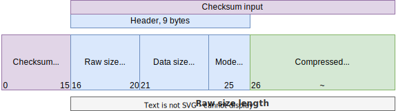

# 圧縮モード

ClickHouseプロトコルは、チェックサム付きで**データブロック**の圧縮をサポートしています。どのモードを選ぶか迷った場合は、`LZ4`を使用してください。

:::tip
使用可能な[カラム圧縮コーデック](/docs/ja/sql-reference/statements/create/table.md/#column-compression-codecs)について詳しく学び、テーブル作成時またはその後に指定してください。
:::

## モード

| 値     | 名前               | 説明                                          |
|--------|--------------------|----------------------------------------------|
| `0x02` | [None](#none-mode) | 圧縮なし、チェックサムのみ                   |
| `0x82` | LZ4                | 非常に高速で、良好な圧縮                     |
| `0x90` | ZSTD               | Zstandard、かなり高速で最良の圧縮             |

LZ4とZSTDは同じ作者によって作られていますが、異なるトレードオフがあります。
[Facebookのベンチマーク](https://facebook.github.io/zstd/#benchmarks)からのデータ：

| 名前                 | 比率  | エンコーディング | デコーディング   |
|----------------------|-------|------------------|------------------|
| **zstd** 1.4.5 -1    | 2.8   | 500 MB/s        | 1660 MB/s       |
| **lz4** 1.9.2        | 2.1   | 740 MB/s        | 4530 MB/s       |

## ブロック

| フィールド        | 型      | 説明                                                    |
|-------------------|---------|--------------------------------------------------------|
| checksum          | uint128 | (ヘッダー + 圧縮データ)の[ハッシュ](../native-protocol/hash.md) |
| raw_size          | uint32  | ヘッダーなしの生データサイズ                            |
| data_size         | uint32  | 非圧縮データサイズ                                      |
| mode              | byte    | 圧縮モード                                              |
| compressed_data   | binary  | 圧縮データのブロック                                    |

ヘッダーは(raw_size + data_size + mode)で構成され、生データサイズは(ヘッダー + 圧縮データ)の長さになります。

チェックサムは`hash(header + compressed_data)`で、[ClickHouse CityHash](../native-protocol/hash.md)を使用しています。

## Noneモード

*None*モードが使用されている場合、`compressed_data`は元のデータと同じです。圧縮を行わないモードは、チェックサムによって追加のデータ整合性を確保するのに有用であり、ハッシュ処理のオーバーヘッドはごくわずかです。
