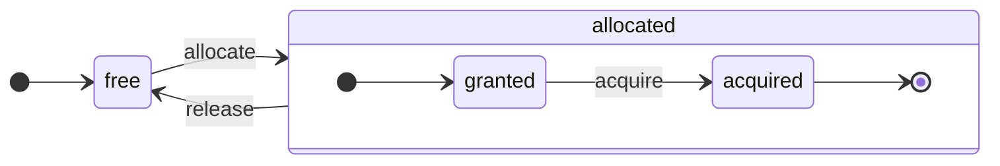

# ClickHouseアーキテクチャの概要

ClickHouseは真の列指向DBMSです。データはカラム単位で保存され、配列（ベクトルまたはカラムのチャンク）の実行中に処理されます。
可能な限り、個々の値ではなく配列に対する操作が行われます。これを「ベクトル化クエリ実行」と呼び、実際のデータ処理のコストを下げるのに役立ちます。

> このアイデアは新しいものではありません。`APL`（1957年のプログラミング言語）に遡り、その後継として`A +`（APL方言）、`J`（1990）、`K`（1993）、および`Q`（Kx Systemsのプログラミング言語、2003）があります。配列プログラミングは科学データ処理で使用されています。関係データベースでも新しいアイデアではありません：例えば、`VectorWise`システム（Actian CorporationによるActian Vector Analytical Databaseとしても知られています）で使用されています。

クエリ処理を加速するためのアプローチには、ベクトル化クエリ実行と実行時コード生成の2つがあります。後者はすべての間接参照と動的ディスパッチを取り除きます。これらの方法のいずれも、もう一方よりも必ずしも優れているわけではありません。実行時コード生成は多くの操作を融合し、CPUの実行ユニットとパイプラインを完全に活用する場合により効果的です。ベクトル化クエリ実行は一時的なベクトルをキャッシュに書き込み、それを読み戻す必要があるため、実用的でない場合があります。一時データがL2キャッシュに収まらない場合、これが問題になります。しかし、ベクトル化クエリ実行は、CPUのSIMD機能をより簡単に利用できます。[友人による研究論文](http://15721.courses.cs.cmu.edu/spring2016/papers/p5-sompolski.pdf)によれば、両方のアプローチを組み合わせる方が良いと示されています。ClickHouseはベクトル化クエリ実行を使用し、実行時コード生成のための限定的な初期サポートがあります。

## カラム {#columns}

`IColumn`インターフェースは、メモリ内のカラム（実際にはカラムのチャンク）を表すために使用されます。このインターフェースは、さまざまな関係演算子の実装を支援するメソッドを提供します。ほぼすべての操作はイミュータブルです：元のカラムを変更せず、新しいものを作成します。例えば、`IColumn :: filter`メソッドはフィルタバイトマスクを受け取ります。これは`WHERE`と`HAVING`の関係演算子で使用されます。追加の例：`ORDER BY`をサポートするための`IColumn :: permute`メソッド、`LIMIT`をサポートするための`IColumn :: cut`メソッド。

さまざまな`IColumn`実装（`ColumnUInt8`、`ColumnString`など）は、カラムのメモリレイアウトを担当します。メモリレイアウトは通常、連続した配列です。カラムの整数型の場合、`std :: vector`のように、ただ1つの連続した配列です。`String`や`Array`カラムの場合、すべての配列要素を連続して配置する1つのベクトルと、各配列の先頭へのオフセットを持つ2番目のベクトルが存在します。また、`ColumnConst`はメモリに1つの値だけを保存し、カラムのように見えます。

## フィールド {#field}

それでも、個々の値を操作することも可能です。個々の値を表すために、`Field`が使用されます。`Field`は`UInt64`、`Int64`、`Float64`、`String`、および`Array`の区別された共用体に過ぎません。`IColumn`には、`n`番目の値を`Field`として取得するための`operator []`メソッドと、`Field`をカラムの末尾に追加するための`insert`メソッドがあります。これらのメソッドは、個々の値を表すテンポラリの`Field`オブジェクトを扱う必要があるため、非常に効率的ではありません。もっと効率的なメソッドとして`insertFrom`や`insertRangeFrom`などがあります。

`Field`には、特定のテーブルのデータ型に関する十分な情報はありません。例えば、`UInt8`、`UInt16`、`UInt32`、および`UInt64`はすべて`Field`内では`UInt64`で表されます。

## リーキー抽象 {#leaky-abstractions}

`IColumn`はデータの一般的な関係変換のメソッドを持っていますが、すべてのニーズを満たすわけではありません。例えば、`ColumnUInt64`には2つのカラムを合計するメソッドがなく、`ColumnString`には部分文字列検索を実行するためのメソッドがありません。これらの無数のルーチンは、`IColumn`の外部で実装されています。

カラム上のさまざまな関数は、`Field`値を抽出するために`IColumn`メソッドを使用して一般的に非効率的な方法で実装されるか、特定の`IColumn`実装内のデータの内部メモリレイアウトを知っていて特殊な方法で実装されます。これは特定の`IColumn`型にキャスト関数を実装し、内部表現を直接扱うことによって実現されます。例えば、`ColumnUInt64`には内部配列へのリファレンスを返す`getData`メソッドがあり、別のルーチンがその配列を直接読み取ったり埋めたりします。効率的な特殊化を可能にするための「リーキー抽象」があります。

## データ型 {#data_types}

`IDataType`はシリアル化および逆シリアル化に責任を負います。これにより、カラムのチャンクまたは個々の値をバイナリまたはテキスト形式で読み書きできます。`IDataType`はテーブル内のデータ型に直接対応しています。例えば、`DataTypeUInt32`、`DataTypeDateTime`、`DataTypeString`などがあります。

`IDataType`と`IColumn`は互いにゆるく関連しています。異なるデータ型が、同じ`IColumn`実装によってメモリ上で表されることがあります。例えば、`DataTypeUInt32`と`DataTypeDateTime`は、どちらも`ColumnUInt32`または`ColumnConstUInt32`で表されます。さらに、同じデータ型が異なる`IColumn`実装によって表されることもあります。例えば、`DataTypeUInt8`は`ColumnUInt8`や`ColumnConstUInt8`によって表されることがあります。

`IDataType`はメタデータのみを保持します。例としては、`DataTypeUInt8`は何も保持しておらず（仮想ポインタ`vptr`を除く）、`DataTypeFixedString`は`N`（固定サイズ文字列のサイズ）だけを保持します。

`IDataType`はさまざまなデータフォーマットのためのヘルパーメソッドを持っています。例として、クォートの可能性を考慮して値をシリアル化する方法、JSONのために値をシリアル化する方法、およびXML形式の一部として値をシリアル化する方法があります。データフォーマットとの直接の対応はありません。例えば、異なるデータフォーマット`Pretty`と`TabSeparated`は、`IDataType`インターフェースの`serializeTextEscaped`ヘルパーメソッドを共有して使用します。

## ブロック {#block}

`Block`はメモリ内でテーブルのサブセット（チャンク）を表すコンテナです。それは単に3つ組（`IColumn, IDataType, カラム名`）のセットです。クエリ実行中、データは`Block`として処理されます。`Block`を持っている場合、データ（`IColumn`オブジェクト内に）も持ち、タイプに関する情報（`IDataType`内）があり、カラムがどのように処理されるかを教えます。そしてカラム名もあります。それは、もとのテーブルからのカラム名か、計算結果を一時的に取得するために割り当てられた人工的な名前です。

ブロック内でカラムに関数を計算する場合、結果を含む別のカラムをブロックに追加し、関数の引数用のカラムには触れません。操作はイミュータブルです。後で不要なカラムはブロックから削除できますが、変更はされません。これは共通部分式の消去に便利です。

ブロックは処理されたデータチャンクごとに作成されます。注意すべきは、同じタイプの計算では異なるブロックでもカラム名とタイプが同じであるため、カラムデータだけが変化します。ブロックデータはブロックヘッダーから分離する方が良いです。小さなブロックサイズは、`shared_ptr`のコピーやカラム名の一時文字列のオーバーヘッドが高いです。

## プロセッサ

記述は[https://github.com/ClickHouse/ClickHouse/blob/master/src/Processors/IProcessor.h](https://github.com/ClickHouse/ClickHouse/blob/master/src/Processors/IProcessor.h)を参照してください。

## フォーマット {#formats}

データフォーマットはプロセッサで実装されています。

## I/O {#io}

バイト指向の入出力には、`ReadBuffer`と`WriteBuffer`の抽象クラスがあります。これらはC++の`iostream`の代わりに使用されます。心配しないでください：成熟したC++プロジェクトは、良い理由で常に`iostream`以外の何かを使用しています。

`ReadBuffer`と`WriteBuffer`は、単なる連続したバッファとそのバッファ内の位置を指すカーソルです。実装はバッファのメモリを保持する場合としない場合があります。バッファを次のデータで満たすため（`ReadBuffer`の場合）またはどこかにバッファをフラッシュするため（`WriteBuffer`の場合）の仮想メソッドがあります。仮想メソッドはあまり呼ばれません。

`ReadBuffer`/`WriteBuffer`の実装はファイルとファイル記述子、ネットワークソケットで動作するためや、圧縮を実装するために使用されます（`CompressedWriteBuffer`は別のWriteBufferで初期化され、そこにデータを書き込む前に圧縮を行います）他の目的のために使用されます–名前`ConcatReadBuffer`、`LimitReadBuffer`、および`HashingWriteBuffer`はそれ自体を物語っています。

Read/WriteBuffersはバイトを扱うだけです。入力/出力のフォーマットを支援するために、`ReadHelpers`および`WriteHelpers`ヘッダーファイルからの関数があります。例えば、小数形式で数値を書くためのヘルパーがあります。

結果セットを`JSON`形式で標準出力に書き込むときに何が起こるかを見てみましょう。
結果セットは、プルクエリパイプラインからフェッチされる準備が整っています。
まず、標準出力にバイトを書き込むために`WriteBufferFromFileDescriptor(STDOUT_FILENO)`を作成します。
次に、クエリパイプラインの結果を`JSON`形式で標準出力に行を出力する`JSONRowOutputFormat`に接続します。
これは`complete`メソッドを介して行うことができ、プルクエリパイプラインを完了したクエリパイプラインに変換します。
内部的には、`JSONRowOutputFormat`はさまざまなJSONデリミタを書き込み、`IDataType::serializeTextJSON`メソッドを`IColumn`と行番号の参照として呼び出します。したがって、`IDataType::serializeTextJSON`は`WriteHelpers.h`からのメソッドを呼び出します：例えば数値タイプの`writeText`や`DataTypeString`の`writeJSONString`です。

## テーブル {#tables}

`IStorage`インターフェースはテーブルを表します。そのインターフェースの異なる実装は異なるテーブルエンジンです。例としては、`StorageMergeTree`、`StorageMemory`などです。これらのクラスのインスタンスは、ただテーブルを表します。

`IStorage`の主要なメソッドは、`read`と`write`です。他にも`alter`、`rename`、`drop`があります。`read`メソッドは次の引数を受け取ります：テーブルから読み取るカラムのセット、考慮する`AST`クエリ、および望ましいストリームの数です。そして`Pipe`を返します。

ほとんどの場合、読み取りメソッドはテーブルから指定されたカラムを読むだけの責任があります。それ以外のデータ処理はパイプラインの他の部分で行われ、`IStorage`の責任範囲外です。

しかし、顕著な例外があります：

- ASTクエリは`read`メソッドに渡され、テーブルエンジンがインデックス使用を推論し、テーブルからより少ないデータを読み取るために使用できます。
- 時には、テーブルエンジンが特定のステージまでデータを自分で処理することができます。例えば、`StorageDistributed`はリモートサーバにクエリを送り、データを処理して異なるリモートサーバからマージできるステージまで要求し、その前処理されたデータを返すことができます。その後、クエリインタプリタがデータ処理を完了します。

テーブルの`read`メソッドは、通常は複数の`Processor`で構成される`Pipe`を返します。これらのプロセッサは、並行してテーブルを読むことができます。
次に、これらのプロセッサをさまざまな他の変換（式の評価やフィルタリングなど）に接続できます。これらは独立して計算されます。
そして、それらの上に`QueryPipeline`を作成し、`PipelineExecutor`を介して実行します。

また、`TableFunction`があります。これらは`FROM`句で使用するために一時的な`IStorage`オブジェクトを返す関数です。

テーブルエンジンの実装方法を簡単に知るためには、`StorageMemory`や`StorageTinyLog`のような単純なものを見てください。

> `IStorage`の`read`メソッドの結果として、`QueryProcessingStage`—ストレージ内で既に計算されたクエリの部分についての情報を返します。

## パーサ {#parsers}

クエリは手書きの再帰型下降法のパーサによって解析されます。例えば、`ParserSelectQuery`はクエリのさまざまな部分のための基礎的なパーサを再帰的に呼び出します。パーサは`AST`を生成します。`AST`はノードとして表現され、これは`IAST`のインスタンスです。

> パーサジェネレータは歴史的な理由から使用されていません。

## インタプリタ {#interpreters}

インタプリタは、ASTからクエリ実行パイプラインを作成する責任があります。単純なインタプリタ（`InterpreterExistsQuery`や`InterpreterDropQuery`）と、より高度な`InterpreterSelectQuery`があります。

クエリ実行パイプラインは、特定のタイプの列セットのチャンクを消費し、生成できるプロセッサの組み合わせです。
プロセッサはポートを介して通信し、複数の入力ポートと複数の出力ポートを持つことがあります。
詳細な説明は[src/Processors/IProcessor.h](https://github.com/ClickHouse/ClickHouse/blob/master/src/Processors/IProcessor.h)にあります。

例えば、`SELECT`クエリのインタプリタの結果は、結果セットから読み取る特別な出力ポートがある「プルクエリパイプライン」です。
`INSERT`クエリの結果は、挿入用のデータを書き込む入力ポートを持つ「プッシュクエリパイプライン」です。
`INSERT SELECT`クエリのインタプリタの結果は、入力または出力を持たず、同時に`SELECT`から`INSERT`にデータをコピーする「完了したクエリパイプライン」です。

`InterpreterSelectQuery`はクエリアナリシスと変換のために`ExpressionAnalyzer`と`ExpressionActions`の仕組みを使用します。これは、ほとんどのルールベースのクエリ最適化が行われる場所です。`ExpressionAnalyzer`はかなり複雑で、クエリ変換と最適化を個別のクラスに抽出し、クエリのモジュール変換を可能にするために書き直す必要があります。

インタプリタに存在する問題を解決するために、新しい`InterpreterSelectQueryAnalyzer`が開発されました。これは`ExpressionAnalyzer`を使用しない`InterpreterSelectQuery`の新しいバージョンであり、`AST`と`QueryPipeline`の間に`QueryTree`という追加の抽象化層を導入します。これはプロダクションでの使用に完全に準備されていますが、念のためその`enable_analyzer`設定を`false`に設定することでオフにすることができます。

## 関数 {#functions}

通常の関数と集約関数があります。集約関数については次のセクションを参照してください。

通常の関数は行数を変更しません。各行を独立して処理するように動作します。実際には、関数は個々の行のためではなく、ベクトル化クエリ実行を実現するために`Block`のデータのために呼び出されます。

いくつかの雑多な関数があります。[blockSize](../sql-reference/functions/other-functions.md#blocksize-function-blocksize)、[rowNumberInBlock](../sql-reference/functions/other-functions.md#rownumberinblock-function-rownumberinblock)、および[runningAccumulate](../sql-reference/functions/other-functions.md#runningaccumulate-runningaccumulate)などがあり、ブロック処理を利用し、行の独立性に違反します。

ClickHouseは強力な型付けを持っているため、暗黙の型変換はありません。関数が特定の型の組み合わせをサポートしていない場合、例外をスローします。しかし、関数は多くの異なる型の組み合わせに対してオーバーロードされて動作することがあります。例えば、`plus`関数（`+`演算子を実装するための）は、任意の数値型の組み合わせで動作します：`UInt8` + `Float32`、`UInt16` + `Int8`など。また、いくつかの可変的な関数は任意の数の引数を受け取ります。例えば`concat`関数です。

関数を実装することはやや不便かもしれません。なぜなら、関数はサポートされるデータ型とサポートされる`IColumns`を明示的にディスパッチするためです。例えば、`plus`関数は各数値型の組み合わせと定数または非定数の左および右の引数に対してC++テンプレートのインスタンス化によるコード生成を持っています。

ランタイムコード生成を実装してテンプレートコードの肥大化を避けるには優れた場所です。また、乗算加算を融合させた関数や一つのループ反復で複数の比較を行うことが可能になります。

ベクトル化クエリ実行のため、関数はショートサーキットされません。例えば、`WHERE f(x) AND g(y)`と書くと、両方の側が計算され、`f(x)`がゼロである行でも計算されます（ただし、`f(x)`がゼロ定数式でない限り）。しかし、`f(x)`条件の選択性が高く、`f(x)`の計算が`g(y)`よりもはるかに安い場合、マルチパス計算を実装した方が良いです。最初に`f(x)`を計算し、次にその結果でカラムをフィルタリングし、フィルタリングされた小さいデータチャンクのためにのみ`g(y)`を計算します。

## 集約関数 {#aggregate-functions}

集約関数は状態を保持する関数です。渡された値をいくつかの状態に蓄積し、その状態から結果を取得することができます。これらは`IAggregateFunction`インターフェースで管理されます。状態は非常に単純（`AggregateFunctionCount`の状態は単一の`UInt64`値です）な場合もありますし、非常に複雑（`AggregateFunctionUniqCombined`の状態は線形配列、ハッシュテーブル、そして`HyperLogLog`確率データ構造の組み合わせです）な場合もあります。

状態は`Arena`（メモリプール）に割り当てられます。これは高いカーディナリティの`GROUP BY`クエリを実行する際に複数の状態を処理するためです。状態には非自明なコンストラクタとデストラクタがある場合があります。例えば、複雑な集約状態は自分自身で追加のメモリを割り当てることができます。これは、状態を作成し破棄する際の注意が必要であり、所有権の適切な引き継ぎと破棄順序が必要です。

集約状態は、分散クエリ実行中にネットワークを介して渡したり、RAMが不足してディスクに書き込むためにシリアル化および逆シリアル化することができます。それらは、`DataTypeAggregateFunction`を持つテーブルに保存してデータのインクリメンタル集約を可能にすることもできます。

> 集約関数状態のシリアル化されたデータ形式は、現在バージョン管理されていません。集約状態が一時的にしか保持されない場合、これは問題ではありません。しかし、私たちにはインクリメンタル集約のための`AggregatingMergeTree`テーブルエンジンがあり、すでにプロダクションで使用されています。それが、将来的にシリアル化形式を変更する際に、このような形式互換性が必要になる理由です。

## サーバ {#server}

サーバは異なるインターフェースを実装しています：

- 任意の外部クライアント用のHTTPインターフェース。
- ネイティブなClickHouseクライアントや分散クエリ実行中のクロスサーバ通信用のTCPインターフェース。
- レプリケーションのためのデータ転送用のインターフェース。

内部的には、ただのプリミティブなマルチスレッドサーバで、コルーチンやファイバーはありません。サーバは単純なクエリを高率に処理するためではなく、比較的少ない量の複雑なクエリを処理し、それぞれが分析のために膨大なデータを処理できるように設計されています。

サーバはクエリ実行に必要な環境を持つ`Context`クラスを初期化します：利用可能なデータベースのリスト、ユーザーとアクセス権限、設定、クラスタ、プロセスリスト、クエリログなどです。インタプリタはこの環境を使用します。

サーバTCPプロトコルは、後方および前方互換性を完全に維持します：古いクライアントは新しいサーバと通信でき、新しいクライアントは古いサーバと通信できます。しかし、永遠にそれを維持し続けたくはないので、私たちは約1年後に古いバージョンのサポートを削除しています。

:::note
ほとんどの外部アプリケーションに対しては、HTTPインターフェースの使用をお勧めします。これはシンプルで使いやすいです。TCPプロトコルは内部データ構造とより厳密にリンクされており、データブロックを渡すために内部形式を使用し、圧縮データの独自のフレームを使用します。このプロトコルのCライブラリをリリースしていません。これはClickHouseのコードベースのほとんどをリンクする必要があるため、実用的ではありません。
:::

## 設定 {#configuration}

ClickHouseサーバはPOCO C++ライブラリをベースにしており、その構成を表すために`Poco::Util::AbstractConfiguration`を使用します。構成は`Poco::Util::ServerApplication`クラスによって保持され、これを`DaemonBase`クラスが継承し、それがさらに`DB::Server`クラスにより継承され、clickhouse-server自体を実装しています。そのため、構成は`ServerApplication::config()`メソッドでアクセスできます。

構成は複数のファイルから（XMLまたはYAML形式で）読み取られ、`ConfigProcessor`クラスによって単一の`AbstractConfiguration`にマージされます。構成はサーバの起動時に読み込まれ、その後、構成ファイルの更新、削除または追加がある場合には再読み込みされます。`ConfigReloader`クラスは、これらの変更の定期的な監視と再読み込み手続きを担当します。`SYSTEM RELOAD CONFIG`クエリも構成を再読み込みさせるトリガーになります。

`Server`以外のクエリやサブシステムには構成が`Context::getConfigRef()`メソッドを使ってアクセス可能です。サーバを再起動せずに構成をリロードできるサブシステムは、`Server::main()`メソッド内のリロードコールバックに登録する必要があります。新しい構成にエラーがある場合、多くのサブシステムは新しい構成を無視し、警告メッセージをログに記録し、以前に読み込まれた構成で動作を続行します。`AbstractConfiguration`の性質上、特定のセクションへの参照を渡すことはできないため、通常は`String config_prefix`が使用されます。

## スレッドとジョブ {#threads-and-jobs}

クエリを実行し、副作用を行うためにClickHouseは、スレッドプールからスレッドを割り当て、頻繁なスレッドの作成と破棄を避けます。目的とジョブの構造に応じて選ばれるいくつかのスレッドプールがあります：
  * クライアントセッションのためのサーバプール。
  * 一般的なジョブ、バックグラウンド活動、スタンドアロンのスレッドのためのグローバルスレッドプール。
  * 主に何らかのIOでブロックされCPU負荷が少ないジョブのためのIOスレッドプール。
  * 定期的なタスクのためのバックグラウンドプール。
  * ステップに分割できるプリエンプタブルなタスクのためのプール。

サーバプールは`Server::main()`メソッドで定義された`Poco::ThreadPool`クラスのインスタンスです。最大で`max_connection`スレッドを持つことができます。それぞれのスレッドは1つのアクティブな接続に専念しています。

グローバルスレッドプールは`GlobalThreadPool`シングルトンクラスです。これからスレッドを割り当てるには`ThreadFromGlobalPool`を使用します。これは`std::thread`に似たインターフェースを持っており、グローバルプールからスレッドをプルし、必要な初期化をすべて行います。以下の設定で構成されます：
  * `max_thread_pool_size` - プール内スレッド数の制限。
  * `max_thread_pool_free_size` - 新しいジョブを待つアイドルスレッド数の制限。
  * `thread_pool_queue_size` - スケジュールされたジョブ数の制限。

グローバルプールはユニバーサルであり、以下に説明するすべてのプールはその上に実装されています。これはプールの階層として考えることができます。特定のプールは`ThreadPool`クラスを使用してグローバルプールからそのスレッドを取得します。そのため、特定のプールの主な目的は、同時ジョブの数に制限を適用し、ジョブのスケジュールを行うことです。スレッドプールのスレッド数より多くのジョブがスケジュールされている場合は、`ThreadPool`が優先順位付きのキューにジョブを蓄積します。それぞれのジョブには整数の優先度があります。デフォルトの優先度はゼロです。優先度の値が高いジョブは、優先度の値が低いジョブより先に開始されます。しかし、すでに実行されているジョブの間には違いはなく、そのため優先度は主にプールが過負荷状態であるときに重要です。

IOスレッドプールは、`IOThreadPool::get()`メソッドでアクセス可能なプレーンな`ThreadPool`として実装されています。これは、`max_io_thread_pool_size`、`max_io_thread_pool_free_size`、および`io_thread_pool_queue_size`設定と同様に構成されます。IOスレッドプールの主な目的は、グローバルプールをIOジョブで消耗させないようにし、それがクエリのためにCPUを完全に活用できないことを避けることです。S3へのバックアップは多くのIO操作を行うため、インタラクティブなクエリへの影響を避けるために別の`BackupsIOThreadPool`があり、`max_backups_io_thread_pool_size`、`max_backups_io_thread_pool_free_size`、および`backups_io_thread_pool_queue_size`設定で構成されます。

定期的なタスク実行のために`BackgroundSchedulePool`クラスがあります。`BackgroundSchedulePool::TaskHolder`オブジェクトを使用してタスクを登録することができ、プールは2つのジョブが同時に実行されないことを保証します。タスク実行を特定の将来の瞬間に延期したり、一時的にタスクを非アクティブ化することもできます。グローバル`Context`はこれを異なる目的でいくつかのインスタンスを提供します。一般的な目的のタスクには`Context::getSchedulePool()`が使用されます。

プリエンプタブルなタスクのための特化したスレッドプールもあります。そのような`IExecutableTask`タスクは、ステップと呼ばれるジョブの順序付けられたシーケンスに分割できます。短いタスクが長いタスクより優先されるようにスケジュールするために`MergeTreeBackgroundExecutor`が使用されます。名前が示すように、バックグラウンドでのMergeTree関連の操作、例えばマージやミューテーション、フェッチ、ムーブのために使用されます。プールのインスタンスは`Context::getCommonExecutor()`およびそれに類似するメソッドで使用可能です。

どのプールをジョブに使用するかに関係なく、開始時にこのジョブのために`ThreadStatus`インスタンスが作成されます。これにはすべてのスレッド固有の情報（スレッドID、クエリID、パフォーマンスカウンター、リソース消費量など）が含まれます。ジョブはローカルスレッドポインタによって`CurrentThread::get()`呼び出しでこれにアクセスします。そのため、すべての関数にこれを渡す必要はありません。

スレッドがクエリ実行に関連している場合、`ThreadStatus`に添付される最も重要なものはクエリコンテキスト`ContextPtr`です。すべてのクエリには、サーバプール内のマスタースレッドがあります。マスタースレッドは`ThreadStatus::QueryScope query_scope(query_context)`オブジェクトを保持することでアタッチメンを行います。マスタースレッドはまた、`ThreadGroupStatus`オブジェクトで表されるスレッドグループを作成します。このクエリ実行中に割り当てられるすべての追加スレッドは`CurrentThread::attachTo(thread_group)`呼び出しでそのスレッドグループに添付されます。スレッドグループはプロファイルイベントカウンタの集約し、単一タスクに専用された全スレッドによるメモリ消費を追跡するのに使用されます（詳細は`MemoryTracker`および`ProfileEvents::Counters`クラスを参照してください）。

## 同時実行制御 {#concurrency-control}

並列実行可能なクエリは、`max_threads`設定を使用して制限されます。この設定のデフォルト値は、単一クエリがすべてのCPUコアを最大限に活用できるように選択されています。しかし、複数の同時実行クエリがあり、それぞれがデフォルトの`max_threads`設定値を使用する場合はどうでしょうか？その場合、クエリはCPUリソースを共有します。OSは、新規スレッドを頻繁に切り替えることで公平性を保証しますが、これにはそれなりのパフォーマンスペナルティがあります。`ConcurrencyControl`はこのペナルティを処理し、多くのスレッドの割り当てを避けることに役立ちます。スロットの概念が導入されています。スロットは同時実行性の単位です：スレッドクエリを実行するためには、事前にスロットを取得し、スレッドを停止したらそれを解放する必要があります。スロットの数はサーバで全体に制限されています。合計スロット数を超えた場合には、複数の同時実行クエリがCPUスロットを競争します。`ConcurrencyControl`は、この競争を公平に解決するためにCPUスロットのスケジューリングを行う責任があります。

それぞれのスロットは、以下の状態を持つ独立した状態機械として見ることができます：
 * `free`: スロットは任意のクエリが割り当てるために利用可能です。
 * `granted`: スロットは特定のクエリによって`allocated`されますが、まだスレッドに獲得されていません。
 * `acquired`: スロットは特定のクエリによって`allocated`され、スレッドによって獲得されます。

注：`allocated`されたスロットは`granted`と`acquired`の2つの異なる状態にあることがあります。前者は移行状態であり、実際にはスロットがクエリに割り当てられた瞬間からそのクエリのいずれかのスレッドによってアップスケーリング手続きが実行される瞬間までの短い状態です。

`ConcurrencyControl`のAPIは以下の機能で構成されています：
1. クエリのためのリソース割り当てを作成：`auto slots = ConcurrencyControl::instance().allocate(1, max_threads);`。少なくとも1つのスロットを割り当て、最大で`max_threads`のスロットを割り当てます。最初のスロットは即座に許可されますが、残りのスロットは後で許可される場合があります。そのため限度は柔軟です。なぜなら、すべてのクエリは少なくとも1つのスレッドを取得します。
2. それぞれのスレッドは割り当てからスロットを獲得する必要があります：`while (auto slot = slots->tryAcquire()) spawnThread([slot = std::move(slot)] { ... });`。
3. スロットの全体数を更新します：`ConcurrencyControl::setMaxConcurrency(concurrent_threads_soft_limit_num)`。サーバ再起動せずに実行中に行うことができます。

このAPIにより、クエリは少なくとも1つのスレッドで開始し（CPU圧力がある場合）、その後`max_threads`までスケールアップできます。

## 分散クエリ実行 {#distributed-query-execution}

クラスターセットアップでのサーバーは主に独立しています。クラスターの1つまたはすべてのサーバーに`Distributed`テーブルを作成できます。`Distributed`テーブルはデータ自体を保存せず、クラスター内の複数ノードのすべてのローカルテーブルへの「ビュー」を提供します。`Distributed`テーブルからSELECTすると、そのクエリを再書き込みし、負荷分散設定に応じてリモートノードを選択し、クエリを送信します。`Distributed`テーブルは、リモートサーバにクエリを送信し、異なるサーバからの中間結果をマージできる段階まで処理させ、次に中間結果を受け取り、それをマージします。分散テーブルはできるだけ多くの作業をリモートサーバに分配し、ネットワーク上で中間データをあまり送信しません。

INまたはJOIN句内のサブクエリを持ち、それぞれが`Distributed`テーブルを使用する場合、物事はより複雑になります。これらのクエリの実行には異なる戦略があります。

分散クエリ実行のためのグローバルクエリプランはありません。各ノードはそのタスクのためのローカルクエリプランのみを持っています。私たちは、リモートノードにクエリを送信し、次に結果をマージするシンプルなワンパス分散クエリ実行のみを持っています。しかし、これだけでは、高カーディナリティの`GROUP BY`を持つ複雑なクエリやJOINのための多量の一時データを持つクエリには実現可能ではありません。そのような場合、サーバー間でデータを「再シャッフル」する必要があり、追加の調整が必要です。ClickHouseはそのようなクエリ実行をサポートしておらず、このための作業が必要です。

## MergeTree {#merge-tree}

`MergeTree`は主キーでインデックスを付けることをサポートするストレージエンジンのファミリーです。主キーはカラムまたは式の任意のタプルにすることができます。`MergeTree`テーブル内のデータは「パーツ」に保存されます。各パーツは主キー順にデータを保存するため、データは主キータプルにより辞書順に整列されています。すべてのテーブルカラムは、これらのパーツの中の個別の`column.bin`ファイルに保存されます。ファイルは圧縮されたブロックで構成されています。各ブロックは、通常、未圧縮データの64 KBから1 MBの範囲で、平均値サイズに依存します。ブロックはカラム値を連続して一つずつ配置されています。カラム値は各カラムで同じ順序にあり（主キーが順序を定義しています）、多くのカラムを反復するときに対応する行の値が得られます。

主キー自体は「スパース」です。これは、各行を指すのではなく、データのいくつかの範囲だけを指します。`primary.idx`と呼ばれる別のファイルには、N番目の行ごとに主キーの値が記録されています。ここでNは`index_granularity`（通常、N = 8192）と呼ばれます。また、各カラムには、データファイル内の各N番目の行へのオフセットを持つ`column.mrk`ファイルがあります。各マークはペアであり、ファイル内の圧縮ブロックの先頭へのオフセットと、デコンプレッションされたブロックにおけるデータの最初へのオフセットです。通常、圧縮ブロックはマークと整合されており、デコンプレッションされたブロック内のオフセットはゼロです。`primary.idx`のデータは常にメモリに存在し、`column.mrk`ファイルのデータはキャッシュされます。

`MergeTree`内のパーツから何かを読み取ろうとすると、`primary.idx`データを見て、要求されたデータを含む可能性のある範囲を見つけ、次に`column.mrk`データを見て、それらの範囲を読み始める場所のオフセットを計算します。スパースのため、余計なデータが読み取られるかもしれません。ClickHouseは、シンプルなポイントクエリの高負荷に適していません。なぜなら、各キーのために`index_granularity`行を持つ全範囲が読み取られる必要があり、各カラムのために圧縮ブロック全体がデコンプレッションされる必要があるからです。私たちは、単一のサーバで数兆行を管理し、索引のための目立たないメモリ消費を可能にするために索引をスパースにしました。また、主キーがスパースであるため、一意ではありません：テーブルへのINSERT時にはキーが存在するかどうかを確認できません。テーブル内に同じキーを持つ多くの行がある場合があります。

`MergeTree`にデータを挿入すると、そのバッチが主キー順に並べ替えられ、新しいパーツを形成します。バックグラウンドスレッドがいくつかのパーツを選び、それらを単一のソートされたパーツに統合する作業を定期的に行い、パーツの数を比較的低く保ちます。これは`MergeTree`と呼ばれる理由です。もちろん、マージは「書き込み増幅」につながります。すべてのパーツは不変であり：作成され、削除されるだけで修正されません。SELECTが実行されるときは、テーブルのスナップショット（パーツのセット）が保持されます。マージ後、障害発生後のリカバリーを容易にするために一時的に古いパーツも保持されており、マージされたパーツが壊れていると見なされる場合は、そのソースパーツで置き換えることができます。

`MergeTree`はLSMツリーではありません。なぜなら、MEMTABLEおよびLOGを含まないためです。挿入されたデータはファイルシステムに直接書き込みます。この動作により、MergeTreeはバッチでデータを挿入するのにより適します。したがって、頻繁に少量の行を挿入するのはMergeTreeには理想的ではありません。例えば、数行を1秒ごとに挿入することは可能ですが、1秒に千回行うことはMergeTreeに最適ではありません。しかし、小規模な挿入を克服するための非同期挿入モードがあります。私たちは、私たちのアプリケーションでバッチでデータをすでに挿入しているため、簡潔さのためにこの方法を取りました

背景合併中に追加作業を行うMergeTreeエンジンもあります。例としては、`CollapsingMergeTree`や`AggregatingMergeTree`があります。これらは特別な更新サポートとして扱うことができます。これらは実際には更新ではなく、ユーザーは通常、背景合併が実行される時間を制御できず、`MergeTree`テーブル内のデータはほとんどの場合、完全に合併された形式ではなく、複数のパーツで保存されています。

## レプリケーション {#replication}

ClickHouseのレプリケーションはテーブルごとに設定できます。単一サーバでいくつかのレプリケートされたテーブルとレプリケートされていないテーブルを持つことができ、異なる方法でレプリケートされたテーブルも持つことができます。例えば、二重レプリケーションを持つテーブルと三重レプリケーションを持つ別のテーブルです。

レプリケーションは、`ReplicatedMergeTree`ストレージエンジンで実装されています。`ZooKeeper`内のパスはストレージエンジンのパラメータとして指定されます。同じ`ZooKeeper`パスを持つすべてのテーブルはお互いのレプリカになり、データを同期し、一貫性を保ちます。レプリカはテーブルの作成または削除で動的に追加および削除できます。

レプリケーションは、非同期のマルチマスター方式を使用します。`ZooKeeper`とのセッションを持つ任意のレプリカにデータを挿入でき、そのデータは他のすべてのレプリカに非同期でレプリケートされます。ClickHouseはUPDATEをサポートしていないため、レプリケーションは競合しません。デフォルトでは、挿入のクォーラムによる確認がないため、新しく挿入されたデータはノードの障害が発生した場合に失われる可能性があります。挿入クォーラムは、`insert_quorum`設定を使用して有効にできます。

レプリケーションのメタデータはZooKeeperに格納されます。実行するアクションのリストレプリケーションログがあります。アクションは、パーツの取得、パーツのマージ、パーティションの削除などです。各レプリカは、レプリケーションログをキューにコピーし、キューからアクションを実行します。例えば、挿入時には「パーツを取得」アクションがログに作成され、すべてのレプリカはそのパーツをダウンロードします。マージは、すべてのレプリカでバイト一致の結果を得るために調整されています。すべてのパーツはすべてのレプリカで同じようにマージされます。リーダーの一つは最初に新しいマージを開始し、「マージパーツ」アクションをログに書き込みます。複数のレプリカ（またはすべて）が同時にリーダーになることができます。レプリカがリーダーにならないように、`merge_tree`設定の`replicated_can_become_leader`を使用して防ぐことができます。リーダーは背景合併のスケジュールを担当します。

レプリケーションは物理的です：クエリではなく、圧縮された部分だけがノード間で転送されます。マージは通常、ネットワークコストを削減し、ネットワーク増幅を回避するために各レプリカで独立して処理されます。レプリケーションの遅れが大きい場合に限り、大きくマージされたパーツがネットワーク内で送信されます。

また、各レプリカはその状態をZooKeeperにセットされ、それらのチェックサムも含まれる。ローカルファイルシステムでの状態がZooKeeperでの参照状態と異なる場合、そのレプリカは他のレプリカから欠落したり破壊されたパーツをダウンロードして一貫性を回復します。予期しない、もしくは破損したデータがローカルファイルシステム上にある場合、ClickHouseはそれを削除せず、別のディレクトリに移動し忘れます。

:::note
ClickHouseクラスターは独立したシャードで構成されており、それぞれのシャードにはレプリカがあります。クラスターは**エラスティック**ではないため、新しいシャードを追加しても、シャード間でデータが自動的に再分散されません。代わりに、クラスターの負荷が均等に調整されると想定されます。小さなクラスター、例えば10ノード程度ではこの実装はコントロールがしやすいですが、プロダクションで使用する数百ノードのクラスターに対して、このアプローチは大きな欠点になります。クラスター全体に広がり、自動的にクラスター間で分割しバランスされる動的にレプリケートされるリージョンを持つテーブルエンジンを実装する必要があります。
:::
