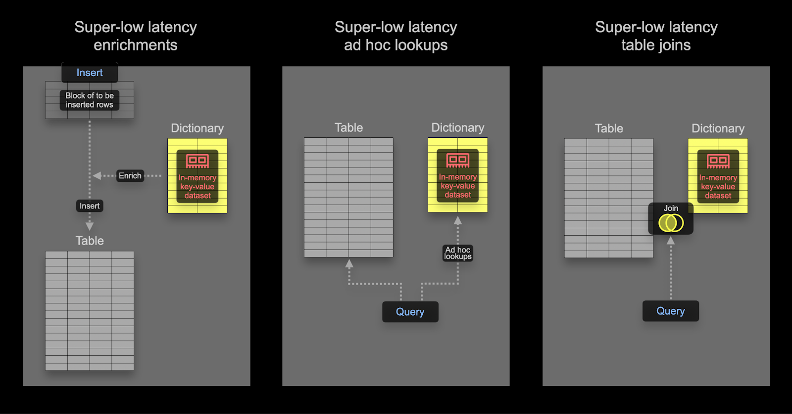

# Dictionary

ClickHouseのDictionaryは、さまざまな[内部および外部ソース](/ja/sql-reference/dictionaries#dictionary-sources)からデータをインメモリの[キー-バリュー](https://en.wikipedia.org/wiki/Key%E2%80%93value_database)形式で表現し、超低レイテンシーのクエリ検索に最適化します。

Dictionaryは以下の用途に役立ちます：
- 特に`JOIN`を使用するクエリのパフォーマンスを向上させる
- インジェストプロセスを遅らせることなく、取り込んだデータをその場で豊かにする



## Dictionaryを利用してJOINを高速化する

Dictionaryは特定の種類の`JOIN`、すなわち結合キーが基底のキー-バリューストレージのキー属性と一致する必要がある[`LEFT ANY`型](/ja/sql-reference/statements/select/join#supported-types-of-join)の速度を向上させるために使用できます。


この場合、ClickHouseはDictionaryを利用して[Direct Join](https://clickhouse.com/blog/clickhouse-fully-supports-joins-direct-join-part4#direct-join)を実行できます。これはClickHouseの最速のJOINアルゴリズムであり、右テーブルの[テーブルエンジン](/ja/engines/table-engines)が低レイテンシーのキー-バリューリクエストをサポートする場合に適用されます。ClickHouseには3つのこの要件を満たすテーブルエンジンがあります：[Join](/ja/engines/table-engines/special/join)（基本的に事前計算されたハッシュテーブル）、[EmbeddedRocksDB](/ja/engines/table-engines/integrations/embedded-rocksdb)、および[Dictionary](/ja/engines/table-engines/special/dictionary)です。以下ではDictionaryを利用する方法を説明しますが、メカニズムはこれら3つのエンジンで同じです。

直接結合アルゴリズムは、右テーブルがDictionaryでサポートされ、結合されるデータがすでに低レイテンシーのキー-バリューデータ構造の形式でメモリに存在していることを要求します。

### 例

StackOverflowのデータセットを使用して、次の質問に答えます：
*Hacker Newsで最も議論を呼んでいるSQLに関する投稿は何ですか？*

議論を呼ぶ投稿とは、賛成票と反対票が似た数であるものと定義します。この絶対差を計算し、0に近い値ほど論争の的になっています。投稿には少なくとも10以上の賛成票と反対票がある必要があると仮定します。投票されない投稿はそれほど議論の的になっていません。

データが正規化された状態で、このクエリは`posts`と`votes`テーブルを使用した`JOIN`を要求します：

```sql
WITH PostIds AS
(
   	 SELECT Id
   	 FROM posts
   	 WHERE Title ILIKE '%SQL%'
)
SELECT
    Id,
    Title,
    UpVotes,
    DownVotes,
    abs(UpVotes - DownVotes) AS Controversial_ratio 
FROM posts
INNER JOIN
(
    SELECT
   	 PostId,
   	 countIf(VoteTypeId = 2) AS UpVotes,
   	 countIf(VoteTypeId = 3) AS DownVotes
    FROM votes
    WHERE PostId IN (PostIds)
    GROUP BY PostId
    HAVING (UpVotes > 10) AND (DownVotes > 10)
) AS votes ON posts.Id = votes.PostId
WHERE Id IN (PostIds)
ORDER BY Controversial_ratio ASC
LIMIT 1

Row 1:
──────
Id:              	25372161
Title:           	How to add exception handling to SqlDataSource.UpdateCommand
UpVotes:         	13
DownVotes:       	13
Controversial_ratio: 0

1 rows in set. Elapsed: 1.283 sec. Processed 418.44 million rows, 7.23 GB (326.07 million rows/s., 5.63 GB/s.)
Peak memory usage: 3.18 GiB.
```

>**`JOIN`の右側に小さなデータセットを使用する**：このクエリは必要以上に冗長に見えるかもしれませんが、`PostId`でのフィルタリングを外部およびサブクエリの両方で行っています。これはクエリ応答時間を速くするためのパフォーマンス最適化です。最適なパフォーマンスを得るためには、常に`JOIN`の右側が小さなセットであり、可能な限り小さくすることを確認してください。JOINパフォーマンスを最適化し、使用可能なアルゴリズムを理解するためのヒントについては、[このブログ記事シリーズ](https://clickhouse.com/blog/clickhouse-fully-supports-joins-part1)をお勧めします。

このクエリは速いですが、良好なパフォーマンスを実現するために私たちがJOINを慎重に書くことに依存しています。理想的には、投稿を「SQL」を含むものだけにフィルタリングし、そのサブセットのブログに対して`UpVote`と`DownVote`のカウントを確認し、我々の指標を計算するのが望ましいでしょう。

#### Dictionaryの適用

これらの概念を説明するために、投票データに対してDictionaryを使用します。Dictionaryは通常メモリ内に保持されます（[ssd_cache](/ja/sql-reference/dictionaries#ssd_cache)は例外です）、したがってデータのサイズに注意を払う必要があります。我々の`votes`テーブルサイズを確認します：

```sql
SELECT table,
	formatReadableSize(sum(data_compressed_bytes)) AS compressed_size,
	formatReadableSize(sum(data_uncompressed_bytes)) AS uncompressed_size,
	round(sum(data_uncompressed_bytes) / sum(data_compressed_bytes), 2) AS ratio
FROM system.columns
WHERE table IN ('votes')
GROUP BY table

┌─table───────────┬─compressed_size─┬─uncompressed_size─┬─ratio─┐
│ votes │ 1.25 GiB    	│ 3.79 GiB      	│  3.04 │
└─────────────────┴─────────────────┴───────────────────┴───────┘
```

Dictionary内にデータを非圧縮で保存するため、すべてのカラムを（しませんが）Dictionaryに保存するならば、少なくとも4GBのメモリが必要です。Dictionaryはクラスタ全体でレプリケートされるため、このメモリ量は*各ノード*ごとに予約する必要があります。

> 以下の例では、DictionaryのデータはClickHouseテーブルから取得されています。これがDictionaryの最も一般的なソースを表していますが、[複数のソース](/ja/sql-reference/dictionaries#dictionary-sources)がサポートされています。これにはファイル、http、Postgresを含むデータベースが含まれ、その中には小さなデータセットが完全に更新される理想的な方法として自動的にリフレッシュされ、直接JOINに利用されるものもあります。

Dictionaryには、ルックアップが実行される主キーが必要です。これはトランザクションデータベースの主キーと概念的に同一であり、一意である必要があります。先ほどのクエリでは、結合キーである`PostId`でのルックアップが必要です。Dictionaryは`votes`テーブルから`PostId`ごとの賛成票と反対票の合計を含めてオリジナルにする必要があります。このDictionaryデータを取得するためのクエリは次の通りです：

```sql
SELECT PostId,
   countIf(VoteTypeId = 2) AS UpVotes,
   countIf(VoteTypeId = 3) AS DownVotes
FROM votes
GROUP BY PostId
```

Dictionaryを作成するための以下のDDLが必要です - クエリの使用に注意してください： 

```sql
CREATE DICTIONARY votes_dict
(
  `PostId` UInt64,
  `UpVotes` UInt32,
  `DownVotes` UInt32
)
PRIMARY KEY PostId
SOURCE(CLICKHOUSE(QUERY 'SELECT PostId, countIf(VoteTypeId = 2) AS UpVotes, countIf(VoteTypeId = 3) AS DownVotes FROM votes GROUP BY PostId'))
LIFETIME(MIN 600 MAX 900)
LAYOUT(HASHED())

0 rows in set. Elapsed: 36.063 sec.
```

> セルフマネージドのOSSでは、上記のコマンドをすべてのノードで実行する必要があります。ClickHouse Cloudでは、Dictionaryは自動的にすべてのノードにレプリケートされます。上記は64GBのRAMを持つClickHouse Cloudノードで実行され、ロードするのに36秒かかります。

Dictionaryが消費するメモリを確認する：

```sql
SELECT formatReadableSize(bytes_allocated) AS size
FROM system.dictionaries
WHERE name = 'votes_dict'

┌─size─────┐
│ 4.00 GiB │
└──────────┘
```

特定の`PostId`の賛成票と反対票を取得するには、単純な`dictGet`関数を使用できます。以下には投稿`11227902`の値を取得します：

```sql
SELECT dictGet('votes_dict', ('UpVotes', 'DownVotes'), '11227902') AS votes

┌─votes──────┐
│ (34999,32) │
└────────────┘
```

これを前のクエリで利用して、JOINを削除できます：

```sql
WITH PostIds AS
(
    	SELECT Id
    	FROM posts
    	WHERE Title ILIKE '%SQL%'
)
SELECT Id, Title,
	dictGet('votes_dict', 'UpVotes', Id) AS UpVotes,
	dictGet('votes_dict', 'DownVotes', Id) AS DownVotes,
	abs(UpVotes - DownVotes) AS Controversial_ratio
FROM posts
WHERE (Id IN (PostIds)) AND (UpVotes > 10) AND (UpVotes > 10)
ORDER BY Controversial_ratio ASC
LIMIT 3

3 rows in set. Elapsed: 0.551 sec. Processed 119.64 million rows, 3.29 GB (216.96 million rows/s., 5.97 GB/s.)
Peak memory usage: 552.26 MiB.
```

このクエリは単純であるだけでなく、2倍以上速くなりました。更に最適化されたクエリにするために、10票以上の賛成票と反対票を持つ投稿のみをDictionaryにロードし、事前計算された議論値を保存するだけです。

## クエリ時のエンリッチメント

Dictionariesはクエリ時に値をルックアップするために使用できます。これらの値は結果に含めることも、集計に使用することもできます。ユーザーIDをその場所にマッピングするDictionaryを作成したとしましょう：

```sql
CREATE DICTIONARY users_dict
(
  `Id` Int32,
  `Location` String
)
PRIMARY KEY Id
SOURCE(CLICKHOUSE(QUERY 'SELECT Id, Location FROM stackoverflow.users'))
LIFETIME(MIN 600 MAX 900)
LAYOUT(HASHED())
```

このDictionaryを使用して投稿の結果を豊かにすることができます：

```sql
SELECT
	Id,
	Title,
	dictGet('users_dict', 'Location', CAST(OwnerUserId, 'UInt64')) AS location
FROM posts
WHERE Title ILIKE '%clickhouse%'
LIMIT 5
FORMAT PrettyCompactMonoBlock

┌───────Id─┬─Title─────────────────────────────────────────────────────────┬─Location──────────────┐
│ 52296928 │ Comparision between two Strings in ClickHouse             	│ Spain             	│
│ 52345137 │ How to use a file to migrate data from mysql to a clickhouse? │ 中国江苏省Nanjing Shi │
│ 61452077 │ How to change PARTITION in clickhouse                     	│ Guangzhou, 广东省中国 │
│ 55608325 │ Clickhouse select last record without max() on all table  	│ Moscow, Russia    	│
│ 55758594 │ ClickHouse create temporary table                         	│ Perm', Russia     	│
└──────────┴───────────────────────────────────────────────────────────────┴───────────────────────┘

5 rows in set. Elapsed: 0.033 sec. Processed 4.25 million rows, 82.84 MB (130.62 million rows/s., 2.55 GB/s.)
Peak memory usage: 249.32 MiB.
```

以前のJOINの例と同様に、同じDictionaryを使ってどこからの投稿が最も多いかを効率的に確認できます：

```sql
SELECT
	dictGet('users_dict', 'Location', CAST(OwnerUserId, 'UInt64')) AS location,
	count() AS c
FROM posts
WHERE location != ''
GROUP BY location
ORDER BY c DESC
LIMIT 5

┌─location───────────────┬──────c─┐
│ India              	│ 787814 │
│ Germany            	│ 685347 │
│ United States      	│ 595818 │
│ London, United Kingdom │ 538738 │
│ United Kingdom     	│ 537699 │
└────────────────────────┴────────┘

5 rows in set. Elapsed: 0.763 sec. Processed 59.82 million rows, 239.28 MB (78.40 million rows/s., 313.60 MB/s.)
Peak memory usage: 248.84 MiB.
```

## インデックス時のエンリッチメント

上の例では、クエリ時にDictionaryを使用してJOINを削除しましたが、DictionaryはINSERT時に行をエンリッチするためにも使用できます。これは通常、エンリッチメント値が変更されず、Dictionaryを作成するために使用する外部ソースに存在する場合に適しています。この場合、行をINSERT時にエンリッチすることで、クエリ時のDictionaryへのルックアップを回避できます。

Stack Overflowのユーザーの`Location`（実際には変わる）は決して変更しないと仮定します - 特に`users`テーブルの`Location`カラムです。投稿テーブルでLocationごとに分析クエリを実行したいと仮定します。投稿テーブルには`UserId`があります。

ユーザーIDから場所へのマッピングを提供するDictionaryを作成します。これは`users`テーブルにバックされています：

```sql
CREATE DICTIONARY users_dict
(
    `Id` UInt64,
    `Location` String
)
PRIMARY KEY Id
SOURCE(CLICKHOUSE(QUERY 'SELECT Id, Location FROM users WHERE Id >= 0'))
LIFETIME(MIN 600 MAX 900)
LAYOUT(HASHED())
```

> `Id < 0`のユーザーを除外し、`Hashed`字典タイプを使用可能にしています。`Id < 0`のユーザーはシステムユーザーです。

投稿テーブルに対してINSERT時にこのDictionaryを利用するには、スキーマを修正する必要があります：

```sql
CREATE TABLE posts_with_location
(
    `Id` UInt32,
    `PostTypeId` Enum8('Question' = 1, 'Answer' = 2, 'Wiki' = 3, 'TagWikiExcerpt' = 4, 'TagWiki' = 5, 'ModeratorNomination' = 6, 'WikiPlaceholder' = 7, 'PrivilegeWiki' = 8),
     …
    `Location` MATERIALIZED dictGet(users_dict, 'Location', OwnerUserId::'UInt64')
)
ENGINE = MergeTree
ORDER BY (PostTypeId, toDate(CreationDate), CommentCount)
```

この例では、`Location`は`MATERIALIZED`カラムとして宣言されています。これは、`INSERT`クエリの一部として値が提供される可能性があり、常に計算されることを意味します。

> ClickHouseはまた、[`DEFAULT`カラム](/ja/sql-reference/statements/create/table#default_values)もサポートしています（値は挿入されるか、提供されていない場合は計算されます）。

テーブルをポピュレートするために、通常の`INSERT INTO SELECT`をS3から使用できます：

```sql
INSERT INTO posts_with_location SELECT Id, PostTypeId::UInt8, AcceptedAnswerId, CreationDate, Score, ViewCount, Body, OwnerUserId, OwnerDisplayName, LastEditorUserId, LastEditorDisplayName, LastEditDate, LastActivityDate, Title, Tags, AnswerCount, CommentCount, FavoriteCount, ContentLicense, ParentId, CommunityOwnedDate, ClosedDate FROM s3('https://datasets-documentation.s3.eu-west-3.amazonaws.com/stackoverflow/parquet/posts/*.parquet')

0 rows in set. Elapsed: 36.830 sec. Processed 238.98 million rows, 2.64 GB (6.49 million rows/s., 71.79 MB/s.)
```

これで、最も多くの投稿がどの場所から来ているかを確認できます：

```sql
SELECT Location, count() AS c
FROM posts_with_location
WHERE Location != ''
GROUP BY Location
ORDER BY c DESC
LIMIT 4

┌─Location───────────────┬──────c─┐
│ India                  │ 787814 │
│ Germany                │ 685347 │
│ United States          │ 595818 │
│ London, United Kingdom │ 538738 │
└────────────────────────┘

4 rows in set. Elapsed: 0.142 sec. Processed 59.82 million rows, 1.08 GB (420.73 million rows/s., 7.60 GB/s.)
Peak memory usage: 666.82 MiB.
```

## 高度なDictionaryトピック

### Dictionary`LAYOUT`の選択

`LAYOUT`句はDictionaryの内部データ構造を制御します。いくつかのオプションが存在し、[こちら](/ja/sql-reference/dictionaries#ways-to-store-dictionaries-in-memory)にドキュメント化されています。正しいレイアウトを選ぶためのヒントは[こちら](https://clickhouse.com/blog/faster-queries-dictionaries-clickhouse#choosing-a-layout)で見つけることができます。

### Dictionaryのリフレッシュ

Dictionaryには`LIFETIME`として`MIN 600 MAX 900`を指定しています。LIFETIMEはDictionaryの更新間隔を指し、ここでの値は600から900秒のランダムな間隔で周期的にリロードされます。このランダムな間隔は、多数のサーバー上で更新する際のDictionaryソースの負荷を分散するために必要です。更新中でも古いバージョンのDictionaryは依然としてクエリ可能で、最初のロードのみがクエリをブロックします。`(LIFETIME(0))`を設定すると、Dictionaryの更新が防止されます。Dictionaryは`SYSTEM RELOAD DICTIONARY`コマンドを使用して強制的にリロードすることができます。

ClickHouseやPostgresのようなデータベースソースの場合、Dictionaryが本当に変更された場合のみ（クエリの応答により判断されます）更新するようにクエリを設定することが可能で、周期的な間隔よりも効率的です。詳細は[こちら](/ja/sql-reference/dictionaries#refreshing-dictionary-data-using-lifetime)で確認できます。

### 他のDictionaryタイプ

ClickHouseは[階層型](/ja/sql-reference/dictionaries#hierarchical-dictionaries)、[ポリゴン型](/ja/sql-reference/dictionaries#polygon-dictionaries)および[正規表現](/ja/sql-reference/dictionaries#regexp-tree-dictionary)Dictionaryもサポートしています。

### 詳細な読み物

- [クエリを加速するためのDictionaryの使用](https://clickhouse.com/blog/faster-queries-dictionaries-clickhouse)
- [Dictionaryの高度な設定](/ja/sql-reference/dictionaries)
