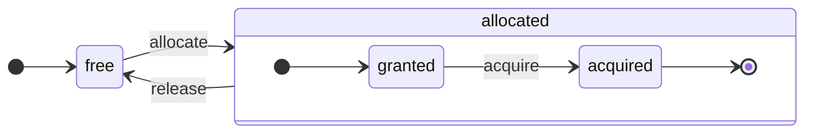

ClickHouse は真のカラム指向 DBMS です。データはカラム単位で格納され、実行時には配列 (ベクトル、またはカラムの chunk) 単位で処理されます。
可能な限り、操作は個々の値ではなく配列に対して実行されます。
これは「ベクトル化クエリ実行」と呼ばれ、実際のデータ処理コストの削減に役立ちます。

この考え方は新しいものではありません。
その起源は `APL` (プログラミング言語、1957年) と、その系譜にある `A +` (APL の方言) 、`J` (1990年) 、`K` (1993年) 、`Q` (Kx Systems のプログラミング言語、2003年) にさかのぼります。
配列プログラミングは、科学データ処理で利用されています。また、この考え方はリレーショナルデータベースの世界でも新しいものではありません。たとえば、`VectorWise` システム (Actian Corporation の Actian Vector Analytic Database としても知られています) でも使われています。

クエリ処理を高速化するアプローチには、ベクトル化クエリ実行とランタイムコード生成という2つがあります。後者では、あらゆる間接参照と動的ディスパッチが取り除かれます。この2つのアプローチのどちらかが、常にもう一方より優れているわけではありません。ランタイムコード生成は、多くの操作を融合することで、CPU の実行ユニットやパイプラインを最大限に活用できる場合に有利です。一方、ベクトル化クエリ実行は、一時的なベクトルを cache に書き込み、再度読み出す必要があるため、実用面で不利になることがあります。特に、一時データが L2 cache に収まらない場合は問題になります。しかし、ベクトル化クエリ実行は CPU の SIMD 機能をより簡単に活用できます。私たちの友人が執筆した [研究論文](http://15721.courses.cs.cmu.edu/spring2016/papers/p5-sompolski.pdf) では、この2つのアプローチを組み合わせるのが最善であることが示されています。ClickHouse はベクトル化クエリ実行を採用しており、ランタイムコード生成についても限定的ながら初期サポートを備えています。

  ## カラム

`IColumn` インターフェイスは、メモリ上でカラム (実際にはカラムの chunk) を表現するために使用されます。このインターフェイスは、さまざまな関係演算子を実装するための補助メソッドを提供します。ほぼすべての操作はイミュータブルです。つまり、元のカラムを変更せず、変更後の新しいカラムを作成します。たとえば、`IColumn :: filter` メソッドはフィルタ用のバイトマスクを受け取ります。これは `WHERE` および `HAVING` 関係演算子で使用されます。ほかにも、`ORDER BY` をサポートする `IColumn :: permute` メソッドや、`LIMIT` をサポートする `IColumn :: cut` メソッドがあります。

さまざまな `IColumn` 実装 (`ColumnUInt8`、`ColumnString` など) は、カラムのメモリレイアウトを担当します。メモリレイアウトは通常、連続した配列です。整数型のカラムでは、これは `std :: vector` のような単一の連続配列です。`String` および `Array` カラムでは、2 つのベクターになります。1 つはすべての配列要素を連続して格納するもので、もう 1 つは各配列の先頭へのオフセットを格納するものです。また、メモリ上には 1 つの値だけを保持しながら、カラムのように見える `ColumnConst` もあります。

  ## Field

とはいえ、個々の値を扱うことも可能です。個々の値を表すには、`Field` を使用します。`Field` は、`UInt64`、`Int64`、`Float64`、`String`、`Array` からなる判別付きユニオンにすぎません。`IColumn` には、n 番目の値を `Field` として取得する `operator []` メソッドと、`Field` をカラムの末尾に追加する `insert` メソッドがあります。これらのメソッドは、個々の値を表す一時的な `Field` オブジェクトを扱う必要があるため、あまり効率的ではありません。より効率的なメソッドとして、`insertFrom`、`insertRangeFrom` などがあります。

`Field` には、テーブルの具体的なデータ型に関する情報が十分に含まれていません。たとえば、`UInt8`、`UInt16`、`UInt32`、`UInt64` は、いずれも `Field` では `UInt64` として表現されます。

  ## リーキーな抽象化

`IColumn` には、データに対する一般的なリレーショナル変換のためのメソッドがありますが、それだけですべてのニーズを満たせるわけではありません。たとえば、`ColumnUInt64` には 2 つのカラムの合計を計算するメソッドがなく、`ColumnString` には部分文字列検索を行うメソッドがありません。このような無数の処理は、`IColumn` の外部で実装されています。

カラムに対するさまざまな処理は、`IColumn` のメソッドを使って `Field` の値を取り出し、汎用的だが非効率な方法で実装することもできますし、特定の `IColumn` 実装におけるデータの内部メモリレイアウトに関する知識を利用して、特化した方法で実装することもできます。これは、関数を特定の `IColumn` 型にキャストし、内部表現を直接扱うことで実現されます。たとえば、`ColumnUInt64` には内部配列への参照を返す `getData` メソッドがあり、その後は別の処理がその配列を直接読み取ったり書き込んだりします。こうしたさまざまな処理を効率よく特化できるようにするため、「リーキーな抽象化」が使われています。

  ## データ型

`IDataType` は、シリアライゼーションとデシリアライゼーション、つまりカラムの chunk や個々の値をバイナリ形式またはテキスト形式で読み書きする役割を担います。`IDataType` は、テーブル内のデータ型に直接対応します。たとえば、`DataTypeUInt32`、`DataTypeDateTime`、`DataTypeString` などがあります。

`IDataType` と `IColumn` は、互いに緩やかに関連しているだけです。異なるデータ型が、メモリ上では同じ `IColumn` 実装で表現されることがあります。たとえば、`DataTypeUInt32` と `DataTypeDateTime` はどちらも `ColumnUInt32` または `ColumnConstUInt32` で表現されます。さらに、同じデータ型が異なる `IColumn` 実装で表現されることもあります。たとえば、`DataTypeUInt8` は `ColumnUInt8` または `ColumnConstUInt8` で表現できます。

`IDataType` はメタデータのみを保持します。たとえば、`DataTypeUInt8` は (仮想ポインタ `vptr` を除いて) 何も保持せず、`DataTypeFixedString` は `N` (固定長文字列のサイズ) だけを保持します。

`IDataType` には、さまざまなデータフォーマット向けの補助メソッドがあります。たとえば、必要に応じてクォートしながら値をシリアライズするメソッド、JSON 用に値をシリアライズするメソッド、XML フォーマットの一部として値をシリアライズするメソッドなどです。データフォーマットと直接対応しているわけではありません。たとえば、異なるデータフォーマットである `Pretty` と `TabSeparated` でも、`IDataType` インターフェイスの同じ `serializeTextEscaped` 補助メソッドを使用できます。

  ## Block

`Block` は、メモリ上の table の一部 (`chunk`) を表すコンテナーです。これは単に `(IColumn, IDataType, column name)` という 3 つ組の集合です。クエリ実行中、データは `Block` 単位で処理されます。`Block` があれば、データ (`IColumn` オブジェクト内) と、そのカラムをどのように扱うかを示す型情報 (`IDataType` 内) 、そしてカラム名があることになります。カラム名は、table の元のカラム名である場合もあれば、計算の一時結果を得るために割り当てられた人工的な名前である場合もあります。

ブロック内のカラムに対して何らかの関数を計算する際は、その結果を格納する別のカラムをブロックに追加します。また、操作は不変であるため、関数の引数となるカラムには手を加えません。後で不要になったカラムはブロックから削除できますが、変更はできません。これは共通部分式の排除に便利です。

ブロックは、処理されるデータの各 `chunk` ごとに作成されます。同じ種類の計算では、異なるブロック間でもカラム名と型は同じままで、変わるのはカラムデータだけであることに注意してください。ブロックサイズが小さいと、shared&#95;ptr のコピーやカラム名のための一時文字列によるオーバーヘッドが大きくなるため、ブロックデータはブロックヘッダーから分離したほうが適切です。

  ## プロセッサ

説明については、[https://github.com/ClickHouse/ClickHouse/blob/master/src/Processors/IProcessor.h](https://github.com/ClickHouse/ClickHouse/blob/master/src/Processors/IProcessor.h) を参照してください。

  ## フォーマット

データフォーマットは、プロセッサによって実現されています。

  ## I/O

バイト指向の入出力には、`ReadBuffer` と `WriteBuffer` という抽象クラスがあります。これらは C++ の `iostream` の代わりに使用されます。心配はいりません。成熟した C++ プロジェクトでは、もっともな理由から `iostream` 以外の仕組みを使うのが一般的です。

`ReadBuffer` と `WriteBuffer` は、連続したバッファと、そのバッファ内の位置を指すカーソルから成ります。実装によっては、バッファ用メモリを所有する場合もしない場合もあります。後続のデータでバッファを埋めるための仮想メソッド (`ReadBuffer` の場合) と、バッファの内容をどこかにフラッシュするための仮想メソッド (`WriteBuffer` の場合) があります。これらの仮想メソッドが呼び出されることはまれです。

`ReadBuffer`/`WriteBuffer` の実装は、ファイル、ファイルディスクリプタ、ネットワークソケットを扱うためや、圧縮を実装するため (`CompressedWriteBuffer` は別の `WriteBuffer` で初期化され、そこへデータを書き込む前に圧縮を行います) 、そのほかさまざまな用途で使われます。`ConcatReadBuffer`、`LimitReadBuffer`、`HashingWriteBuffer` といった名前を見れば、その役割はおおよそわかるでしょう。

Read/WriteBuffer が扱うのはバイトだけです。入出力のフォーマットを補助するために、`ReadHelpers` と `WriteHelpers` のヘッダーファイルには各種関数が用意されています。たとえば、数値を 10 進形式で書き出すヘルパーがあります。

では、結果セットを `JSON` フォーマットで stdout に書き出したい場合に何が起こるのかを見てみましょう。
取得可能な状態の結果セットが、pulling モードの `QueryPipeline` に用意されているとします。
まず、stdout にバイトを書き出すために `WriteBufferFromFileDescriptor(STDOUT_FILENO)` を作成します。
次に、その `WriteBuffer` で初期化された `JSONRowOutputFormat` にクエリパイプラインの結果を接続し、行を `JSON` フォーマットで stdout に書き出します。
これは `complete` メソッドで実行でき、このメソッドは pulling モードの `QueryPipeline` を completed `QueryPipeline` に変換します。
内部では、`JSONRowOutputFormat` がさまざまな JSON の区切り文字を書き出し、`IColumn` への参照と行番号を引数として `IDataType::serializeTextJSON` メソッドを呼び出します。すると `IDataType::serializeTextJSON` は `WriteHelpers.h` のメソッドを呼び出します。たとえば、数値型には `writeText`、`DataTypeString` には `writeJSONString` が使われます。

  ## テーブル

`IStorage` インターフェイスはテーブルを表します。このインターフェイスの各実装が、それぞれ異なるテーブルエンジンに対応します。たとえば `StorageMergeTree` や `StorageMemory` などがあります。これらのクラスのインスタンスは、そのままテーブルです。

`IStorage` の主要なメソッドは `read` と `write` で、このほかに `alter`、`rename`、`drop` などがあります。`read` メソッドは、次の引数を受け取ります。テーブルから読み取るカラムの集合、考慮対象の `AST` クエリ、そして必要なストリーム数です。戻り値は `Pipe` です。

ほとんどの場合、`read` メソッドの責務は、テーブルから指定されたカラムを読み取ることだけであり、それ以降のデータ処理は担当しません。
後続のデータ処理はすべてパイプラインの別の部分で扱われ、`IStorage` の責務の範囲外です。

ただし、注目すべき例外があります。

* `AST` クエリは `read` メソッドに渡されるため、テーブルエンジンはそれを使って索引の利用方法を判断し、テーブルから読み取るデータ量を減らすことができます。
* 場合によっては、テーブルエンジン自体が特定の段階までデータを処理できることもあります。たとえば `StorageDistributed` は、リモートサーバーにクエリを送信し、異なるリモートサーバーからのデータをマージできる段階まで処理するよう依頼したうえで、その前処理済みデータを返すことができます。その後の処理はクエリインタープリタが完了します。

テーブルの `read` メソッドは、複数の `Processors` で構成される `Pipe` を返すことができます。これらの `Processors` は、テーブルから並列にデータを読み取ることができます。
その後、これらのプロセッサを、さまざまな変換 (式の評価やフィルタリングなど) に接続できます。これらは独立して計算できます。
さらに、その上に `QueryPipeline` を作成し、`PipelineExecutor` で実行できます。

`TableFunction` もあります。これらは、クエリの `FROM` 句で使用する一時的な `IStorage` オブジェクトを返す関数です。

テーブルエンジンの実装方法を手早く把握したい場合は、`StorageMemory` や `StorageTinyLog` のような単純なものを見るとよいでしょう。

> `read` メソッドの結果として、`IStorage` は `QueryProcessingStage` を返します。これは、クエリのどの部分がストレージ内部ですでに計算済みかを示す情報です。

  ## パーサー

手書きの再帰下降パーサーでクエリを解析します。たとえば、`ParserSelectQuery` はクエリのさまざまな部分に対応する下位パーサーを再帰的に呼び出すだけです。パーサーは `AST` を生成します。`AST` はノードとして表現され、各ノードは `IAST` のインスタンスです。

> パーサージェネレーターは、歴史的な経緯により使用されていません。

  ## インタープリタ

インタープリタは、AST からクエリ実行パイプラインを作成する役割を担います。`InterpreterExistsQuery` や `InterpreterDropQuery` のようなシンプルなインタープリタもあれば、より高度な `InterpreterSelectQuery` もあります。

クエリ実行パイプラインは、chunk (特定の型を持つカラムの集合) を消費・生成できるプロセッサを組み合わせたものです。
プロセッサはポートを介して通信し、複数の入力ポートと複数の出力ポートを持つことができます。
より詳しい説明は [src/Processors/IProcessor.h](https://github.com/ClickHouse/ClickHouse/blob/master/src/Processors/IProcessor.h) を参照してください。

たとえば、`SELECT` クエリを解釈した結果は、結果セットを読み取るための特別な出力ポートを持つ「pulling」`QueryPipeline` になります。
`INSERT` クエリの結果は、挿入するデータを書き込むための入力ポートを持つ「pushing」`QueryPipeline` になります。
また、`INSERT SELECT` クエリを解釈した結果は、入力も出力も持たないものの、`SELECT` から `INSERT` へ同時にデータをコピーする「completed」`QueryPipeline` になります。

`InterpreterSelectQuery` は、クエリ解析と変換のために `ExpressionAnalyzer` と `ExpressionActions` の仕組みを使用します。ルールベースのクエリ最適化の大半はここで実行されます。`ExpressionAnalyzer` はかなり複雑で整理されておらず、書き直すべきです。さまざまなクエリ変換や最適化は個別のクラスに切り出し、クエリをモジュール単位で変換できるようにする必要があります。

インタープリタに存在する問題に対処するため、新しい `InterpreterSelectQueryAnalyzer` が開発されました。これは `InterpreterSelectQuery` の新しいバージョンで、`ExpressionAnalyzer` を使用せず、`AST` と `QueryPipeline` の間に `QueryTree` と呼ばれる追加の抽象化レイヤーを導入します。これは本番環境で完全に利用可能ですが、念のため `enable_analyzer` 設定の値を `false` に設定すれば無効にできます。

  ## 関数

通常の関数と集約関数があります。集約関数については、次の節を参照してください。

通常の関数は行数を変えません。つまり、各行を独立して処理しているかのように動作します。実際には、関数は個々の行に対して呼び出されるのではなく、ベクトル化クエリ実行を実現するために、データの`Block`単位で呼び出されます。

[blockSize](/ja/sql-reference/functions/other-functions#blockSize)、[rowNumberInBlock](/ja/sql-reference/functions/other-functions#rowNumberInBlock)、[runningAccumulate](/ja/sql-reference/functions/other-functions#runningAccumulate)のように、ブロック処理を利用して行の独立性を破る、その他の関数もいくつかあります。

ClickHouseは強い型付けを採用しているため、暗黙的な型変換はありません。関数が特定の型の組み合わせをサポートしていない場合は、例外をスローします。一方で、関数はさまざまな型の組み合わせに対応できるように (オーバーロードして) 実装できます。たとえば、`plus`関数 (`+`演算子を実装するもの) は、任意の数値型の組み合わせで動作します。`UInt8` + `Float32`、`UInt16` + `Int8` などです。また、`concat`関数のように、任意個の引数を受け取れる可変長関数もあります。

関数の実装は、対応するデータ型と対応する`IColumns`を関数側で明示的に振り分ける必要があるため、やや面倒になることがあります。たとえば、`plus`関数には、数値型の各組み合わせに加え、左引数と右引数が定数か非定数かという各組み合わせごとに、C++テンプレートのインスタンス化によって生成されたコードがあります。

ここは、テンプレートコードの肥大化を避けるために実行時コード生成を実装するのに最適な箇所です。また、fused multiply-add のような融合関数を追加したり、1回のループ反復で複数の比較を行ったりすることも可能になります。

ベクトル化クエリ実行の都合上、関数は短絡評価されません。たとえば、`WHERE f(x) AND g(y)`と書いた場合、`f(x)`がゼロである行でも、両方が計算されます (`f(x)`がゼロの定数式である場合を除く) 。ただし、`f(x)`条件の選択性が高く、`f(x)`の計算が`g(y)`より大幅に低コストであるなら、多段階で計算するほうが適しています。まず`f(x)`を計算し、次にその結果でカラムを絞り込み、その後、より小さく絞り込まれたデータのchunkに対してのみ`g(y)`を計算します。

  ## 集約関数

集約関数は状態を持つ関数です。渡された値をある状態に蓄積し、その状態から結果を取得できるようにします。これらは `IAggregateFunction` インターフェイスで管理されます。状態は比較的単純な場合もあり (`AggregateFunctionCount` の状態は単一の `UInt64` 値にすぎません) 、かなり複雑な場合もあります (`AggregateFunctionUniqCombined` の状態は、線形配列、ハッシュテーブル、`HyperLogLog` という確率的データ構造の組み合わせです) 。

高カーディナリティの `GROUP BY` クエリを実行する際に複数の状態を扱うため、状態は `Arena` (メモリプール) ではなく `アリーナ` に割り当てられます。状態は、単純ではないコンストラクタやデストラクタを持つことがあります。たとえば、複雑な集約状態はそれ自体で追加のメモリを確保することがあります。そのため、状態の生成と破棄、さらに所有権の受け渡しや破棄順序を適切に扱うには注意が必要です。

集約状態は、分散クエリ実行中にネットワーク越しに受け渡したり、RAM が不足している場合にディスクへ書き込んだりするために、シリアライズおよびデシリアライズできます。さらに、`DataTypeAggregateFunction` を使ってテーブルに保存し、データのインクリメンタル集約を可能にすることもできます。

> 集約関数の状態のシリアライズ済みデータのフォーマットは、現時点ではバージョン化されていません。集約状態が一時的に保存されるだけであれば問題ありません。しかし、インクリメンタル集約のための `AggregatingMergeTree` テーブルエンジンがあり、すでに本番環境で利用されています。そのため、将来いずれかの集約関数のシリアライズフォーマットを変更する際には、後方互換性が必要になります。

  ## サーバー

サーバーは、複数の異なるインターフェイスを実装しています。

* 任意の外部クライアント向けの HTTP インターフェイス。
* ネイティブの ClickHouse クライアントおよび分散クエリ実行時のサーバー間通信向けの TCP インターフェイス。
* レプリケーションのためにデータを転送するインターフェイス。

内部的には、コルーチンやファイバーを持たない、単純なマルチスレッドサーバーにすぎません。サーバーは、単純なクエリを高頻度で処理するのではなく、比較的低頻度の複雑なクエリを処理するように設計されているため、それぞれのクエリで分析向けに膨大な量のデータを処理できます。

サーバーは、クエリ実行に必要な環境、つまり利用可能なデータベースの一覧、ユーザーとアクセス権、設定、クラスター、プロセスリスト、クエリログなどを含む `Context` クラスを初期化します。インタープリタはこの環境を使用します。

サーバーの TCP プロトコルについては、完全な後方互換性と前方互換性を維持しています。つまり、古いクライアントは新しいサーバーと通信でき、新しいクライアントは古いサーバーと通信できます。ただし、これを永続的に維持するつもりはないため、古いバージョンのサポートはおよそ 1 年後に削除しています。

:::note
ほとんどの外部アプリケーションでは、シンプルで使いやすいため、HTTP インターフェイスの使用を推奨します。TCP プロトコルは内部のデータ構造とより密接に結び付いています。これは、データの block を受け渡すために内部フォーマットを使用し、圧縮データには独自の framing を使用するためです。
:::

  ## 設定

ClickHouse Server は POCO C++ Libraries をベースとしており、設定の表現には `Poco::Util::AbstractConfiguration` を使用します。設定は `DaemonBase` クラスの継承元である `Poco::Util::ServerApplication` クラスによって保持され、さらに `DaemonBase` クラスは clickhouse-server 自体を実装する `DB::Server` クラスの継承元でもあります。したがって、config には `ServerApplication::config()` メソッドを使ってアクセスできます。

Config は複数のファイル (XML または YAML フォーマット) から読み込まれ、`ConfigProcessor` クラスによって 1 つの `AbstractConfiguration` にマージされます。設定はサーバー起動時に読み込まれ、その後も config ファイルのいずれかが更新、削除、または追加された場合に再読み込みできます。`ConfigReloader` クラスは、これらの変更を定期的に監視し、再読み込み処理も担当します。`SYSTEM RELOAD CONFIG` クエリでも config の再読み込みがトリガーされます。

クエリおよび `Server` 以外のサブシステムでは、config には `Context::getConfigRef()` メソッドを使用してアクセスできます。サーバーを再起動せずに自身の config を再読み込みできるすべてのサブシステムは、`Server::main()` メソッド内の reload callback に自身を登録する必要があります。なお、新しい config にエラーがある場合、ほとんどのサブシステムはその新しい config を無視し、警告メッセージをログに記録したうえで、以前に読み込まれた config を使い続けます。`AbstractConfiguration` の性質上、特定のセクションへの参照を渡すことはできないため、通常は代わりに `String config_prefix` を使用します。

  ### コンテキスト

ClickHouse は、コンテキストの階層を通じて設定を管理します。

* **グローバルコンテキスト** - 設定ファイルで定義されるサーバー全体の設定
* **セッションコンテキスト** - profile、ユーザー設定、SET コマンドによるユーザーセッション設定
* **クエリコンテキスト** - SETTINGS clause によるクエリレベルの設定
* **バックグラウンドコンテキスト** - &#39;background&#39; profile で定義される、バックグラウンド操作 (Mutate、Merge) 向けのサーバー全体の設定

操作 (クエリ、mutations など) をスケジューリングする際、server は次の順序で設定をマージして個別のコンテキストを構築します (後の項目が前の項目を上書きします) 。

1. グローバルデフォルト
2. グローバル設定
3. profile 設定 (`<profiles>` セクション)
4. ユーザー設定 (`<users>` セクション)
5. セッション設定 (SET コマンド)
6. クエリ設定 (SETTINGS clause)

:::note
バックグラウンド操作は、グローバル設定と &#39;background&#39; profile 設定で構成できます。この場合、セッション設定とクエリ設定は効果を持ちません。明示的な設定が指定されていない場合、その設定はグローバルコンテキストから継承されます。こうした操作のデフォルトの profile 名は &#39;background&#39; で、`background_profile` server setting によって上書きできます。
:::

  ## スレッドとジョブ

ClickHouse は、クエリを実行したり付随する処理を行ったりする際に、スレッドの頻繁な生成と破棄を避けるため、いずれかのスレッドプールからスレッドを割り当てます。スレッドプールはいくつかあり、ジョブの目的や構造に応じて使い分けられます。

* 受信したクライアントセッション向けのサーバープール。
* 汎用ジョブ、バックグラウンド処理、スタンドアロンスレッド向けのグローバルスレッドプール。
* 主に何らかの I/O 待ちでブロックされ、CPU 負荷が高くないジョブ向けの I/O スレッドプール。
* 定期タスク向けのバックグラウンドプール。
* ステップに分割可能なプリエンプティブタスク向けのプール。

サーバープールは、`Server::main()` メソッドで定義される `Poco::ThreadPool` クラスのインスタンスです。保持できるスレッド数は最大 `max_connection` です。各スレッドは 1 つのアクティブな connection に専有されます。

グローバルスレッドプールは `GlobalThreadPool` シングルトンクラスです。ここからスレッドを割り当てるには `ThreadFromGlobalPool` を使用します。これは `std::thread` に似たインターフェイスを持ちますが、グローバルプールからスレッドを取得し、必要な初期化をすべて行います。設定には次の settings を使用します。

* `max_thread_pool_size` - プール内のスレッド数の上限。
* `max_thread_pool_free_size` - 新しいジョブを待機するアイドルスレッド数の上限。
* `thread_pool_queue_size` - スケジュールされたジョブ数の上限。

グローバルプールは universal であり、以下で説明するすべてのプールはその上に実装されています。これはプールの階層と考えることができます。各 specialized pool は `ThreadPool` クラスを使ってグローバルプールからスレッドを取得します。したがって specialized pool の主な役割は、同時実行できるジョブ数に上限を設け、ジョブをスケジューリングすることです。プール内のスレッド数を超えるジョブがスケジュールされると、`ThreadPool` は優先度付きの queue にジョブをためます。各ジョブは整数の優先度を持ち、既定値は 0 です。優先度の高いジョブは、低いジョブより先に開始されます。ただし、すでに実行中のジョブ同士には差がないため、優先度が意味を持つのは pool が overloaded の場合だけです。

I/O スレッドプールは、`IOThreadPool::get()` メソッドからアクセスできる単純な `ThreadPool` として実装されています。これは `max_io_thread_pool_size`、`max_io_thread_pool_free_size`、`io_thread_pool_queue_size` settings により、グローバルプールと同じ方法で設定されます。I/O スレッドプールの主な目的は、I/O ジョブによってグローバルプールが枯渇するのを防ぐことです。そうしないと、クエリが CPU を十分に活用できなくなるおそれがあります。S3 への Backup では大量の I/O 操作が発生するため、対話型クエリへの影響を避ける目的で、`max_backups_io_thread_pool_size`、`max_backups_io_thread_pool_free_size`、`backups_io_thread_pool_queue_size` settings で設定される専用の `BackupsIOThreadPool` も用意されています。

定期タスクの実行には `BackgroundSchedulePool` クラスがあります。`BackgroundSchedulePool::TaskHolder` オブジェクトを使ってタスクを登録でき、プールは同じタスクが同時に 2 つのジョブを実行しないよう保証します。また、タスクの実行を将来の特定時点まで延期したり、一時的に無効化したりすることもできます。グローバルな `Context` は、用途別にこのクラスのインスタンスをいくつか提供します。汎用タスクには `Context::getSchedulePool()` を使用します。

プリエンプティブタスク向けの specialized thread pools もあります。この種の `IExecutableTask` タスクは、steps と呼ばれる順序付きのジョブ列に分割できます。こうしたタスクを、短いタスクが長いタスクより優先されるようにスケジュールするために `MergeTreeBackgroundExecutor` が使用されます。名前のとおり、これは merges、mutations、fetches、moves など、MergeTree 関連のバックグラウンド操作に使われます。プールのインスタンスは `Context::getCommonExecutor()` などの同様のメソッドで利用できます。

ジョブにどのプールが使われる場合でも、開始時にはそのジョブ用の `ThreadStatus` インスタンスが作成されます。これは thread id、query id、performance counters、resource consumption など、スレッドごとのあらゆる情報を保持します。ジョブは `CurrentThread::get()` 呼び出しにより thread local pointer 経由でこれにアクセスできるため、すべての関数に渡す必要はありません。

スレッドがクエリ実行に関係している場合、`ThreadStatus` に紐付けられる最も重要なものは、クエリコンテキストである `ContextPtr` です。すべてのクエリはサーバープール内に自身のマスタースレッドを持ちます。マスタースレッドは `ThreadStatus::QueryScope query_scope(query_context)` オブジェクトを保持することでこの紐付けを行います。さらに、マスタースレッドは `ThreadGroupStatus` オブジェクトで表されるスレッドグループを作成します。このクエリ実行中に追加で割り当てられた各スレッドは、`CurrentThread::attachTo(thread_group)` 呼び出しによってそのスレッドグループに紐付けられます。スレッドグループは、単一のタスクに専属するすべてのスレッドについて、profile event counters を集計し、メモリ消費を追跡するために使われます (詳しくは `MemoryTracker` および `ProfileEvents::Counters` クラスを参照してください) 。

  ## 同時実行制御

並列化可能なクエリは、自身の実行を制限するために `max_threads` 設定を使用します。この設定のデフォルト値は、単一のクエリがすべての CPU コアを最大限効率よく使えるように選ばれています。では、複数の同時実行クエリがあり、それぞれがデフォルトの `max_threads` 設定値を使う場合はどうなるでしょうか。その場合、クエリ同士で CPU リソースを共有することになります。OS はスレッドを絶えず切り替えることで公平性を保ちますが、これには一定の性能上のペナルティがあります。`ConcurrencyControl` は、このペナルティに対処し、過剰な数のスレッドが割り当てられるのを防ぐのに役立ちます。設定 `concurrent_threads_soft_limit_num` は、ある種の CPU 負荷制御を適用する前に、割り当て可能な同時実行スレッド数を制限するために使われます。

CPU `slot` の概念が導入されています。スロットは同時実行の単位です。スレッドを実行するには、クエリが事前にスロットを取得し、スレッドの停止時にそれを解放する必要があります。スロット数はサーバー全体でグローバルに制限されています。必要なスロット数の合計がスロット総数を超える場合、複数の同時実行クエリが CPU スロットを奪い合うことになります。`ConcurrencyControl` は、この競合を公平に CPU スロットをスケジューリングすることで解決する役割を担います。

各スロットは、次の状態を持つ独立したステートマシンと見なせます。

* `free`: スロットは空いており、どのクエリにも割り当て可能です。
* `granted`: スロットは特定のクエリに `allocated` されていますが、まだどのスレッドにも取得されていません。
* `acquired`: スロットは特定のクエリに `allocated` されており、スレッドによって取得されています。

`allocated` されたスロットは、`granted` と `acquired` という 2 つの異なる状態を取り得ることに注意してください。前者は遷移状態であり、本来は短時間しか続かないはずです (スロットがクエリに割り当てられた瞬間から、そのクエリのいずれかのスレッドによってスケールアップ処理が実行される時点まで) 。

`ConcurrencyControl` のAPIは、次の関数で構成されています。

1. クエリ用のリソース割り当てを作成します: `auto slots = ConcurrencyControl::instance().allocate(1, max_threads);`。これにより、少なくとも1つ、最大で `max_threads` 個のスロットが割り当てられます。最初のスロットは即座に付与されますが、残りのスロットは後から付与される場合があることに注意してください。したがって、この制限はソフトです。すべてのクエリが少なくとも1つのスレッドを取得できるためです。
2. 各スレッドでは、割り当てからスロットを取得する必要があります: `while (auto slot = slots->tryAcquire()) spawnThread([slot = std::move(slot)] { ... });`。
3. スロットの総数を更新します: `ConcurrencyControl::setMaxConcurrency(concurrent_threads_soft_limit_num)`。これは、サーバーを再起動せずに実行時に変更できます。

このAPIにより、クエリは少なくとも1つのスレッドで開始でき (CPUに負荷がかかっている場合でも) 、その後 `max_threads` までスケールアップできます。

  ## 分散クエリ実行

クラスター構成では、各サーバーは基本的に独立しています。クラスター内の1台またはすべてのサーバーに `Distributed` テーブルを作成できます。`Distributed` テーブル自体はデータを保存せず、クラスター内の複数ノード上にあるローカルテーブル全体に対する「ビュー」を提供するだけです。`Distributed` テーブルに対して SELECT を実行すると、そのクエリが書き換えられ、負荷分散設定に従ってリモートノードが選択され、そこにクエリが送信されます。`Distributed` テーブルは、異なるサーバーからの中間結果をマージできる段階までクエリを処理するよう、リモートサーバーに要求します。その後、中間結果を受け取ってマージします。分散テーブルは、可能な限り多くの処理をリモートサーバー側に分散し、ネットワーク経由で送信する中間データをできるだけ少なくするようにします。

IN 句や JOIN 句にサブクエリがあり、そのそれぞれで `Distributed` テーブルを使用している場合、状況はさらに複雑になります。こうしたクエリの実行には、いくつか異なる戦略があります。

分散クエリ実行には、グローバルなクエリプランはありません。各ノードは、自身が担当する処理についてローカルなクエリプランを持ちます。現状あるのは、単純な1パスの分散クエリ実行だけです。つまり、リモートノードにクエリを送信し、その後で結果をマージします。しかし、カーディナリティの高い `GROUP BY` や、JOIN のために大量の一時データが発生する複雑なクエリでは、これは現実的ではありません。そのような場合は、サーバー間でデータを「再シャッフル」する必要があり、そのためには追加の協調が必要です。ClickHouse はこの種のクエリ実行をサポートしておらず、今後対応していく必要があります。

  ## Merge tree

`MergeTree` は、主キーによる索引をサポートするストレージエンジンファミリーです。主キーには、カラムや式の任意のタプルを指定できます。`MergeTree` テーブルのデータは「パーツ」に格納されます。各パーツは主キー順にデータを格納するため、データは主キータプルに従って辞書順に並びます。テーブルのすべてのカラムは、これらのパーツ内でそれぞれ別個の `column.bin` ファイルに保存されます。ファイルは圧縮ブロックで構成されます。各ブロックは通常、値の平均サイズに応じて、64 KB から 1 MB の非圧縮データになります。ブロックは、カラムの値が連続して並んだものです。各カラムの値の順序は同じです (その順序は主キーで定義されます) 。そのため、多数のカラムをたどると、対応する行の値を取得できます。

主キー自体は「スパース」です。つまり、すべての行を直接指すのではなく、データの一部の範囲だけを指します。別個の `primary.idx` ファイルには、N 行ごとの主キーの値が格納されます。この N は `index_granularity` と呼ばれます (通常、N = 8192) 。また、各カラムには「マーク」を格納する `column.mrk` ファイルがあります。これはデータファイル内の N 行ごとのオフセットです。各マークは 2 つの値の組で、1 つは圧縮ブロック先頭へのファイル内オフセット、もう 1 つは展開後ブロック内のデータ先頭へのオフセットです。通常、圧縮ブロックはマークに揃えられるため、展開後ブロック内のオフセットはゼロです。`primary.idx` のデータは常にメモリ上にあり、`column.mrk` ファイルのデータはキャッシュされます。

`MergeTree` のパーツから何かを読み取るときは、まず `primary.idx` のデータを見て、要求されたデータを含む可能性のある範囲を特定し、次に `column.mrk` のデータを見て、それらの範囲をどこから読み始めるかのオフセットを計算します。スパースであるため、余分なデータを読み取ることがあります。ClickHouse は、単純なポイントクエリが高負荷で発生する用途には向いていません。各キーについて `index_granularity` 行を含む範囲全体を読み取る必要があり、さらに各カラムについて圧縮ブロック全体を展開しなければならないためです。索引をスパースにしたのは、索引のメモリ消費を目立たせることなく、1 台のサーバーで数兆行を扱えるようにする必要があるからです。また、主キーはスパースであるため一意ではありません。`INSERT` 時に、そのキーがテーブル内に存在するかどうかを確認することはできません。1 つのテーブルに同じキーを持つ行が多数存在する可能性があります。

大量のデータを `MergeTree` に `INSERT` すると、そのデータ群は主キー順にソートされ、新しいパーツになります。バックグラウンドスレッドが定期的にいくつかのパーツを選択し、それらを 1 つのソート済みパーツにマージして、パーツ数を比較的少なく保ちます。これが `MergeTree` と呼ばれる理由です。もちろん、マージは「書き込み増幅」を引き起こします。すべてのパーツは不変で、作成と削除はされますが、変更はされません。SELECT が実行されると、テーブルのスナップショット (パーツの集合) が保持されます。マージ後もしばらくは古いパーツを保持しており、障害発生後の復旧を容易にしています。そのため、マージ済みパーツが壊れている可能性があると判断した場合は、その元になったパーツで置き換えることができます。

`MergeTree` は LSM tree ではありません。MEMTABLE や LOG を持たず、挿入されたデータは直接ファイルシステムに書き込まれるからです。この動作により、MergeTree はデータをバッチで挿入する用途により適しています。したがって、少量の行を頻繁に挿入するのは、MergeTree にとって理想的ではありません。たとえば、1 秒あたり数行であれば問題ありませんが、これを 1 秒あたり 1000 回行うのは MergeTree にとって最適ではありません。ただし、この制限を克服するために、小規模な INSERT 向けの非同期 INSERT モードがあります。私たちがこのような方式にしたのは、単純さを優先したことと、アプリケーション側ですでにデータをバッチで挿入しているためです

バックグラウンドマージ中に追加の処理を行う MergeTree エンジンもあります。例として `CollapsingMergeTree` や `AggregatingMergeTree` があります。これは、更新に対する特別なサポートとみなすことができます。ただし、これらは本当の更新ではないことに注意してください。通常、ユーザーはバックグラウンドマージがいつ実行されるかを制御できず、また `MergeTree` テーブル内のデータは、完全にマージされた形ではなく、ほとんど常に複数のパーツに分かれて保存されているからです。

  ## レプリケーション

ClickHouse のレプリケーションは、テーブル単位で設定できます。同じサーバー上で、レプリケートテーブルと非レプリケートテーブルを混在させることも可能です。また、テーブルごとに異なる方式でレプリケーションを構成することもでき、たとえばあるテーブルは 2 要素レプリケーション、別のテーブルは 3 要素レプリケーションにするといったこともできます。

レプリケーションは `ReplicatedMergeTree` ストレージエンジンで実装されています。`ZooKeeper` 内のパスは、ストレージエンジンのパラメーターとして指定します。`ZooKeeper` で同じパスを持つすべてのテーブルは互いにレプリカとなり、データを同期して一貫性を維持します。レプリカは、テーブルを作成または削除するだけで動的に追加・削除できます。

レプリケーションでは、非同期のマルチマスター方式を採用しています。`ZooKeeper` とのセッションを持つ任意のレプリカにデータを挿入でき、そのデータは他のすべてのレプリカへ非同期にレプリケーションされます。ClickHouse は UPDATE をサポートしていないため、レプリケーションで競合は発生しません。既定では insert に対するクォーラム確認がないため、1 つのノードで障害が発生すると、挿入直後のデータが失われる可能性があります。insert クォーラムは `insert_quorum` 設定で有効にできます。

レプリケーション用のメタデータは ZooKeeper に保存されます。そこには、実行すべき actions を記録したレプリケーションログがあります。actions には、パーツの取得、パーツのマージ、パーティションの drop などがあります。各レプリカはレプリケーションログを自身の queue にコピーし、その queue から actions を実行します。たとえば INSERT 時には、ログに「そのパーツを取得する」という action が作成され、各レプリカがそのパーツをダウンロードします。マージは、各レプリカでバイト単位で完全に同一の結果を得るために、レプリカ間で調整されます。すべてのパーツは、すべてのレプリカで同じ方法でマージされます。leader の 1 つが最初に新しいマージを開始し、「パーツをマージする」actions をログに書き込みます。複数のレプリカ (あるいはすべて) が同時に leader になることもできます。`merge_tree` 設定の `replicated_can_become_leader` を使うと、レプリカが leader になるのを防げます。leader はバックグラウンドマージのスケジューリングを担当します。

レプリケーションは物理的に行われます。ノード間で転送されるのはクエリではなく、圧縮済みのパーツだけです。ほとんどの場合、マージはネットワーク増幅を避けてネットワークコストを抑えるため、各レプリカで独立して処理されます。大きなマージ済みパーツがネットワーク経由で送信されるのは、レプリケーションラグが大きい場合だけです。

さらに、各レプリカは、パーツの集合とその checksums として自身の状態を ZooKeeper に保存します。local filesystem 上の状態が ZooKeeper の参照状態と食い違った場合、レプリカは他のレプリカから欠落または破損したパーツをダウンロードして整合性を復元します。local filesystem に予期しないデータや破損したデータがある場合、ClickHouse はそれを削除せず、別の directory に移動して認識しないものとして扱います。

:::note
ClickHouse クラスターは独立した分片で構成され、各分片はレプリカで構成されます。このクラスターは**弾力的ではない**ため、新しい分片を追加しても、分片間でデータが自動的に再配置されることはありません。代わりに、クラスターの負荷は不均等になることを前提に調整する必要があります。この実装により、より細かな制御が可能になり、数十ノード規模の比較的小さなクラスターでは問題ありません。しかし、私たちが production で運用している数百ノード規模のクラスターでは、この方式は大きな欠点になります。クラスター全体にまたがり、動的にレプリケーションされるリージョンを持ち、それらを自動的に分割してクラスター間でバランスできるテーブルエンジンを実装すべきです。
:::