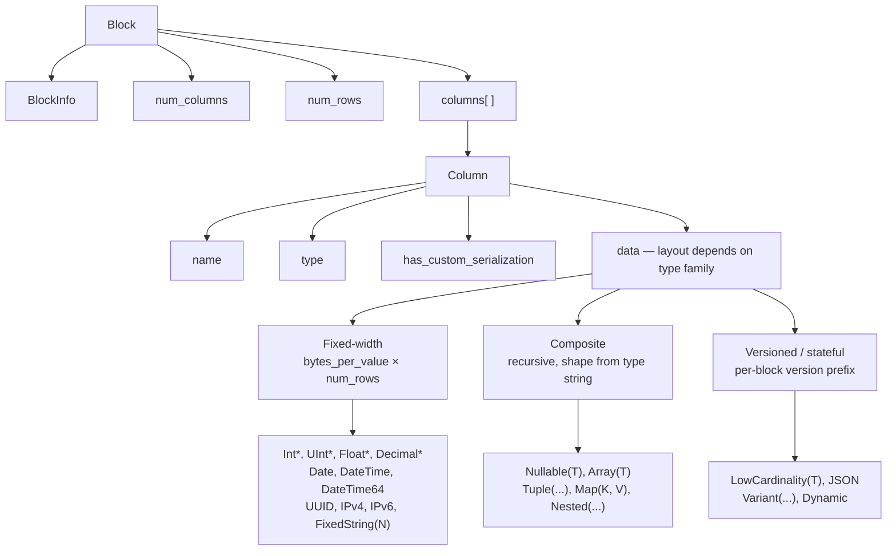
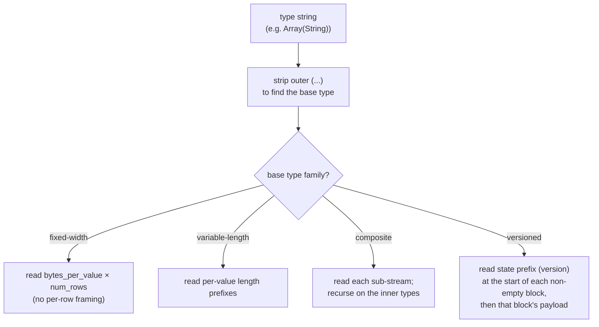
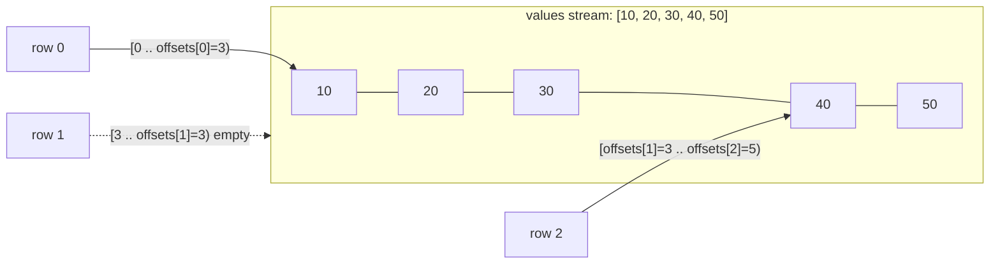
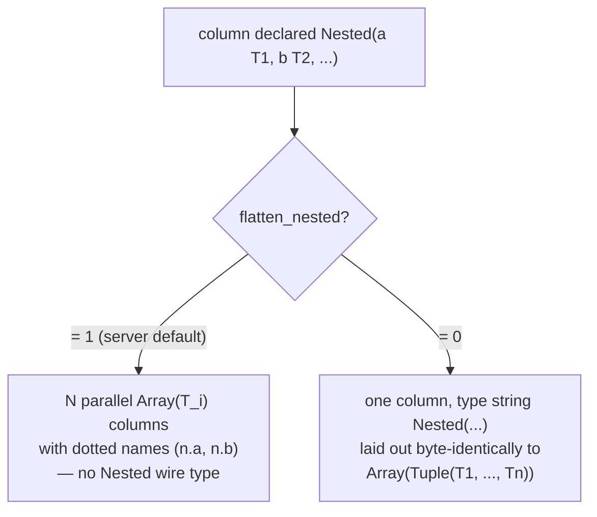
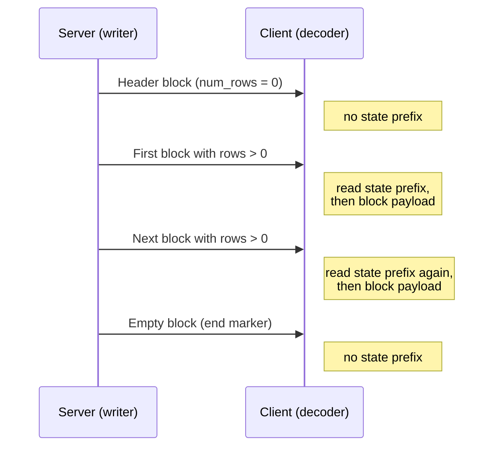
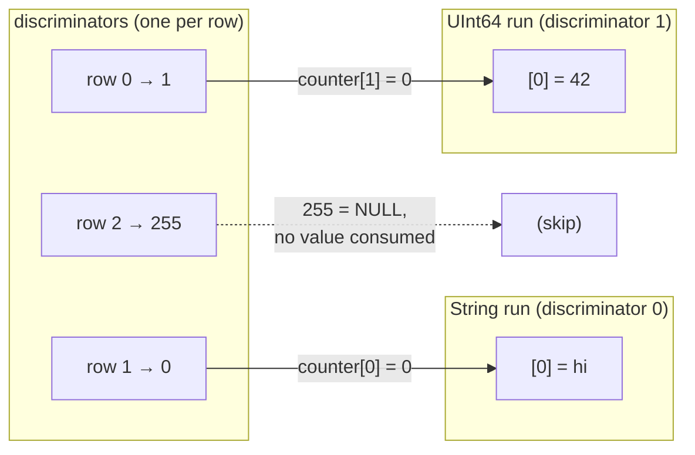
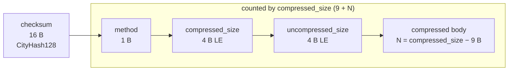

Native フォーマットは、ClickHouse が表形式データをやり取りする際に使用する列指向のワイヤ形式です。主に次の箇所で使われます。

* [ネイティブ TCP プロトコル](/ja/interfaces/specs/NativeProtocol) における `Data`、`Totals`、`Extremes`、`Log`、`ProfileEvents` パケットのボディ (`TableColumns` パケットは Native ブロックでは**ありません**。これは 2 つのバイナリ文字列を保持するため、そのレイアウトは [ネイティブプロトコル仕様](/ja/interfaces/specs/NativeProtocol) に属します) 。
* HTTP 経由の `SELECT ... FORMAT Native` の出力。
* `INTO OUTFILE ... FORMAT Native` で書き出されるファイルエクスポート。
* サーバー間レプリケーションのペイロード。

このページでは、Block 内のバイト列、つまり列指向ペイロードと、それを構成する各カラムの型エンコーディングについて説明します。パケットのフレーミング、接続状態、バージョンネゴシエーションについては、[ネイティブプロトコル仕様](/ja/interfaces/specs/NativeProtocol) を参照してください。

複数バイトの整数フィールドは、すべてリトルエンディアンです。符号付き整数には 2 の補数表現が使われます。

:::tip
`Native` フォーマットのユーザー向け概要 (`curl` の例付き) については、[Native フォーマットのページ](/ja/interfaces/formats/Native) を参照してください。この仕様は、より低レベルなワイヤ形式のリファレンスです。
:::

<div id="overview">
  ## 概要
</div>

wire上で行を運ぶものは、すべて **Block** です。これは、行をカラムごとに格納した自己記述型の chunk です。まずカラム 1 のすべての値が並び、次にカラム 2 のすべての値が続き、以降も同様です。Block が保持するのは、クエリが参照するカラムだけであり、テーブル全体ではありません。

カラムの `data` は、その型が属する *family* に応じて配置されます。デコーダの複雑さが低いものから高いものの順に並べると、*family* は次のとおりです。



* **Fixed-width** 型では、`data` は `bytes_per_value × num_rows` の生バイトとして配置され、行ごとのフレーミングはありません。
* **複合** 型 (`Nullable`, `Array`, `Tuple`, `Map`, `Nested`) は、型文字列から完全に導出可能な再帰的構造を持ち、バージョンプレフィックスもブロック間の状態もありません。
* **Versioned / stateful** 型 (`LowCardinality`, `JSON`, `Variant`, `Dynamic`) では、空でない各ブロックの先頭にシリアライゼーションバージョン / state prefix が付きます。`Native` ワイヤでは、このプレフィックスと任意の Dictionary はいずれも**ブロック単位**です。つまり、このフォーマットはブロック*間*では状態を保持しません (writer はブロックごとに新しいシリアライゼーション状態を作成し、`low_cardinality_max_dictionary_size = 0` を設定します) 。ブロック間の状態は MergeTree のオンディスクに関するものであり、Native のワイヤレイアウトの話ではありません。

<div id="wire-primitives">
  ## ワイヤ形式の基本型
</div>

Native フォーマット は、4つの基本エンコーディングを土台としています。

| 基本型     | サイズ                  | 説明                          |
| ------- | -------------------- | --------------------------- |
| VarUInt | 1–10 B               | LEB-128 可変長符号なし整数           |
| 固定幅整数   | 1, 2, 4, 8, 16, 32 B | リトルエンディアン、符号付きは 2 の補数       |
| String  | 可変                   | VarUInt の長さプレフィックス + 生のバイト列 |
| Bool    | 1 B                  | `0x00` = false、0 以外 = true  |

<div id="varuint">
  ### VarUInt
</div>

LEB-128 エンコーディングを使用する可変長の符号なし整数です。各バイトは、位置 0～6 に 7 ビットのデータビット、位置 7 に 1 ビットの継続ビットを持ちます。継続ビットは、後続のバイトがある場合は `1`、最後のバイトでは `0` になります。

| 値の範囲            | バイト数  |
| --------------- | ----- |
| 0 – 127         | 1     |
| 128 – 16383     | 2     |
| 16384 – 2097151 | 3     |
| UInt64 の全範囲では最大 | 最大 10 |

値 `300` のエンコード:

```text
300 = 0b100101100

Byte 0: 0xAC = 0b10101100   (data: 0101100, continuation: 1)
Byte 1: 0x02 = 0b00000010   (data: 0000010, continuation: 0)
```

バイト列 `0xAC 0x02` をデコードすると:

```text
Byte 0: data = 0x2C, continuation = 1 → accumulator = 0x2C, shift = 7
Byte 1: data = 0x02, continuation = 0 → accumulator = (0x02 << 7) | 0x2C = 300
```

<div id="fixed-width-integers">
  ### 固定長整数
</div>

| 型       | バイト | エンコーディング               |
| ------- | --- | ---------------------- |
| UInt8   | 1   | 生バイト                   |
| UInt16  | 2   | リトルエンディアン              |
| UInt32  | 4   | リトルエンディアン              |
| UInt64  | 8   | リトルエンディアン              |
| UInt128 | 16  | リトルエンディアン              |
| UInt256 | 32  | リトルエンディアン              |
| Int8    | 1   | 生バイト、2 の補数             |
| Int16   | 2   | リトルエンディアン、2 の補数        |
| Int32   | 4   | リトルエンディアン、2 の補数        |
| Int64   | 8   | リトルエンディアン、2 の補数        |
| Int128  | 16  | リトルエンディアン、2 の補数        |
| Int256  | 32  | リトルエンディアン、2 の補数        |
| Float32 | 4   | IEEE 754 単精度、リトルエンディアン |
| Float64 | 8   | IEEE 754 倍精度、リトルエンディアン |

たとえば、UInt32 の値 `1` は `01 00 00 00` としてエンコードされ、Int32 の値 `-1` は `FF FF FF FF` としてエンコードされます。

<div id="string">
  ### String
</div>

長さをプレフィックスとして持つバイト列:

```text
[VarUInt: byte_length] [byte_length bytes: raw value]
```

バイト列は、有効な UTF-8 である必要はありません。空文字列は `0x00` 1 バイトとしてエンコードされ、文字列には埋め込み NUL を含む任意のバイト値を含められます。文字列 `"ab"` は `02 61 62` としてエンコードされます。デコードするには、まず VarUInt の長さ (`2`) を読み取り、続いてその長さ分のバイトを読み取ります。

<div id="bool">
  ### Bool
</div>

1バイトです。`0x00` は false、0 以外の値は true です (正規形は `0x01`) 。

<div id="block-and-column-structure">
  ## Blockとカラムの構造
</div>

<div id="block-wire-layout">
  ### Blockのワイヤレイアウト
</div>

```text
[BlockInfo]               metadata (only on the TCP Data-packet path; see below)
[VarUInt: num_columns]    number of columns in this block
[VarUInt: num_rows]       number of rows in this block
[Column × num_columns]    column entries, omitted when num_columns = 0
```

`BlockInfo` プレフィックスの有無はチャネルによって異なります。これは、writer が *リビジョン* をパラメータに取るためです (詳しい説明と、`client_protocol_version` が出力時にのみ関係することについては、[プロトコルリビジョンと Native フォーマット](#protocol-revision) を参照してください) 。

* **native TCP プロトコル** では、サーバーは接続時にネゴシエートされたリビジョン (大きな値、つまり `DBMS_TCP_PROTOCOL_VERSION`。`src/Core/ProtocolDefines.h` を参照) でブロックを書き込みます。`BlockInfo` は、そのリビジョンが `0` より大きい場合に書き込まれますが、実際の接続では常にそうなります。各カラムの `has_custom_serialization` バイト ([カラムのワイヤレイアウト](#column-wire-layout) を参照) は、リビジョン `54454` 以上で書き込まれます。
* `Native` *出力フォーマット* — HTTP 経由の `SELECT ... FORMAT Native`、`INTO OUTFILE ... FORMAT Native`、および `clickhouse-client` が生成する `Native` フォーマット — は、*デフォルトでは* リビジョン `0` でシリアライズされます。リビジョン `0` では、`BlockInfo` プレフィックスと `has_custom_serialization` バイトはどちらも省略されるため、ブロックは単に `num_columns`、`num_rows`、および各カラムだけになります。

  HTTP では、このリビジョンは固定ではありません。クライアントは `?client_protocol_version=<n>` クエリパラメータでこの値を引き上げることができ、サーバーはその値をレスポンスのシリアライゼーションリビジョンとして使用します。

  十分に大きい値を指定すると、HTTP 出力には `BlockInfo` プレフィックス (リビジョンが `0` より大きい場合に書き込まれる) と `has_custom_serialization` バイト (リビジョン `54454` 以上で書き込まれる) が含まれ、TCP の場合とまったく同じになります。したがって、すべての HTTP `FORMAT Native` ペイロードがリビジョン `0` であるとはクライアント側で想定してはいけません。

言い換えると、このセクションで `BlockInfo` プレフィックスから始まるバイト列の例は、TCP Data-パケットのペイロードを示しています。同じクエリでも、`FORMAT Native` で出力すると、それらと並べて示されている短い形式になります。

<div id="blockinfo">
  ### BlockInfo
</div>

BlockInfo は一連のフィールドで構成され、各フィールドの先頭には VarUInt のフィールド ID が付き、最後はフィールド ID `0` で終端されます。ワイヤ形式は**自己記述的ではありません**。フィールド ID 自体には値の長さや型の情報が含まれないため、reader は遭遇しうる各フィールド ID の型をあらかじめ把握している必要があります。ClickHouse の reader は、未知のフィールド ID を破損データとみなし、例外 (`UNKNOWN_BLOCK_INFO_FIELD`) を送出します。前方互換性は代わりにプロトコルのリビジョンで処理されます。送信側は、ネゴシエートされたリビジョンがそのフィールドの最小リビジョン以上である場合にのみそのフィールドを書き込むため、古い receiver が未知のフィールドを受け取ることはありません。

| フィールド ID | フィールド                            | 型          | 最小リビジョン | 説明                                                           |
| -------- | -------------------------------- | ---------- | ------- | ------------------------------------------------------------ |
| 1        | is&#95;overflows                 | UInt8      | 0       | GROUP BY によるオーバーフローブロック。オーバーフローではないブロックでは `0`。               |
| 2        | bucket&#95;number                | Int32      | 0       | 集約バケット。バケット化されていないブロックでは `-1`。                               |
| 3        | out&#95;of&#95;order&#95;buckets | Int32 のリスト | 54480   | 分散集約中に遅延したバケット。VarUInt の件数に続けて、その件数分の `Int32` 値としてエンコードされます。 |
| 0        | (終端)                             | —          | —       | BlockInfo の終端。常に必須です。                                        |

フィールド `1` と `2` の最小リビジョンは `0` であるため、`BlockInfo` が書き込まれる場合は常に含まれます。フィールド `3` は、リビジョン `54480` 以上でのみ書き込まれます。一般的なケース (リビジョンが `54480` 未満) のワイヤレイアウト:

```text
[VarUInt: 1] [UInt8: is_overflows]
[VarUInt: 2] [Int32: bucket_number]
[VarUInt: 0]
```

<div id="column-wire-layout">
  ### カラムのワイヤレイアウト
</div>

1 つの Block 内では、カラムは `num_columns` 回現れます。

| # | フィールド                            | 型                                 | 条件                                      | 説明                                                                                                                                                                                                             |
| - | -------------------------------- | --------------------------------- | --------------------------------------- | -------------------------------------------------------------------------------------------------------------------------------------------------------------------------------------------------------------- |
| 1 | name                             | String                            | 常に                                      | カラム名                                                                                                                                                                                                           |
| 2 | type                             | String *または* binary type encoding | 常に                                      | 既定では ClickHouse の type string (例: `"UInt64"`、`"Array(String)"`&quot;`）です。`output&#95;format&#95;native&#95;encode&#95;types&#95;in&#95;binary&#95;format = 1&#96; の場合は、binary type encoding になります (下記の注記を参照) 。 |
| 3 | has&#95;custom&#95;serialization | UInt8                             | feature `CUSTOM_SERIALIZATION` (v54454) | `0` = 既定、`1` = カスタム (この後に kind&#95;stack が続く)                                                                                                                                                                  |
| 4 | kind&#95;stack                   | bytes                             | field 3 = `1` のとき                       | 既定以外のシリアライゼーション (スパースなど) を表す UInt8 enum の 1 バイト値です (下記参照) 。値が `COMBINATION` の場合は、その後に VarUInt の個数と、その個数分の追加の kind バイトが続きます。`Tuple` (および要素レベルのシリアライゼーション情報を持つその他の複合型) の場合、payload は再帰的です。詳細は下記を参照してください。        |
| 5 | data                             | bytes                             | 常に                                      | `num_rows` のすべての行に対するカラム値です。レイアウトは型ごとに異なります。詳しくは [data types](#data-types) を参照してください。スパースカラムについては下記を参照してください。                                                                                                  |

デコーダは `type` string に基づいて振り分けを行います。type string には括弧付きのパラメータが含まれていることが多く、デコーダは基本型を見つけるために `(...)` の接尾辞を取り除き、その後でサイズ、scale、または内部型の判定に必要なパラメータをパースします。ネストした型を含むパラメータリスト (たとえば `Array` の中に `Tuple` がある場合) をパースするには、単純に `,` で分割するのではなく、括弧のネストを追跡できる深さ対応のカンマ分割が必要です。

:::note Binary type encoding
`type` フィールドがテキストの `String` になるのは既定モードの場合だけです。クエリ設定 `output_format_native_encode_types_in_binary_format = 1` を設定すると、このフィールドは代わりに **binary type encoding** になります。これは [data type binary encoding](/ja/sql-reference/data-types/data-types-binary-encoding) に記載されているものと同じ、タグベースのエンコーディングです。また、フラット化された `Dynamic` の型リストでも、型ごとの名前に同じバイナリエンコーディングが使われます。field 2 を常に長さプレフィックス付き文字列として読み取るデコーダは、最初のバイナリ型タグを文字列長として解釈して同期がずれてしまうため、ストリームでどのモードが使われているかを把握している必要があります。
:::



<div id="kind-stack-and-sparse-encoding">
  #### kind_stack とスパースエンコーディング
</div>

`kind_stack` バイトは、カラムごとの非デフォルトなシリアライゼーションを表します。

| Byte   | Name                         | Meaning                                             | Wire impact on `data`                                          |
| ------ | ---------------------------- | --------------------------------------------------- | -------------------------------------------------------------- |
| `0x00` | DEFAULT                      | デフォルトのシリアライゼーション                                    | `has_custom = 0` と同一                                           |
| `0x01` | SPARSE                       | スパースシリアライゼーション (v54465+)                            | オフセットストリーム + 非デフォルト値。詳細は以下                                     |
| `0x02` | DETACHED                     | 並列ブロックマーシャリング (v54478+) により `ColumnBLOB` でラップされたカラム | 事前にマーシャリングされたブロブ: `VarUInt size` + そのサイズ分のバイト列。詳細は以下           |
| `0x03` | DETACHED&#95;OVER&#95;SPARSE | `ColumnBLOB` でラップされたスパースカラム                         | `DETACHED` と同じブロブペイロード。詳細は以下                                   |
| `0x04` | REPLICATED                   | 繰り返し値に対する Dictionary 形式 (v54482+)                   | 索引ストリーム + 密にエンコードされた要素値。詳細は以下                                  |
| `0x05` | COMBINATION                  | 複数 kind のスタック                                       | 後続に VarUInt `count` と、さらに `count` 個の kind バイトが続く — 詳細は以下の注記を参照 |

**`COMBINATION` ペイロードでは別の enum を使います。** 上の 5 行は *compact* な 1 バイトコードです。`COMBINATION` (`0x05`) は、それらで表せない任意のスタックに対する汎用エスケープで、後続に `VarUInt` の `count`、続いて `count` 個の 1 バイトエントリが入ります。これらのエントリは表の compact コード **ではなく**、生の `ISerialization::Kind` 値です。

| Byte   | Nested `Kind` |
| ------ | ------------- |
| `0x00` | DEFAULT       |
| `0x01` | SPARSE        |
| `0x02` | DETACHED      |
| `0x03` | REPLICATED    |

これらのバイト値は compact コードとは異なります。`REPLICATED` はこのネストされた enum では `0x03` ですが、compact コードでは `0x04` です。また、`DETACHED_OVER_SPARSE` に対応するエントリはなく、この組み合わせは `SPARSE`、`DETACHED` という 2 つの連続したエントリとして表されます。ネストされたバイトに対して compact テーブルを使い続けるデコーダは、`0x03`/`0x04` の対応を誤り、同期がずれます。

`count` は、すべてのスタックの先頭にある `DEFAULT` エントリを **含む** スタック全体の長さです。compact コードはすでに 1 エントリおよび 2 エントリのすべてのスタックをカバーしているため、`COMBINATION` の `count` は常に 3 以上です。

**`Tuple` カラムに対する再帰的な `kind_stack`。** 上記の `kind_stack` ペイロードは、1 つのカラム自身のシリアライゼーション情報を表すバイト (または `COMBINATION` シーケンス) です。`Tuple` は `SerializationInfoTuple` を持ち、まずタプル自身の kind-stack ペイロードを書き込み、その後で各要素について完全な kind-stack ペイロードを順番に 1 つずつ書き込みます。デコーダも同じ再帰構造でこれを読み戻します。したがって、`Tuple(A, B, C)` の field-4 のバイト列は `[tuple_kind][A_kind][B_kind][C_kind]` となり、各要素のペイロードは、その要素が再び複合型であればそれ自体も再帰的です。`has_custom_serialization` バイト (field 3) は、タプル自身の情報 *またはいずれかの要素の* 情報が非デフォルトであればセットされます。そのため、sparse、replicated、detached のいずれかの特殊な要素を 1 つだけ持つ `Tuple` であっても、kind-stack ペイロードはトリガーされます。`Tuple` に対して先頭の単一の enum バイトしか読まないデコーダは、そこで早く読み終えてしまい、残りの要素 kind バイトをカラムデータとして誤って解釈します。

**スパースのワイヤ形式。** `kind_stack = 0x01` の場合、カラム `data` は 2 つのストリームとして、単一の共有 TCP ストリーム上に連続して書き込まれます。

1. **オフセットストリーム** — `VarUInt` の数列。各値 `v` は次のいずれかです。
   * 位置 62 の上位ビットがクリアされた `v`: `(v & 0x3FFFFFFFFFFFFFFF)` = 次の明示的な非デフォルト値の前にあるデフォルト位置の数。その非デフォルト位置は `cursor + group_size` で、ここで `cursor` は現在の位置です。その後、`cursor` は `group_size + 1` だけ進みます。
   * bit 62 がセットされた `v` (`END_OF_GRANULE_FLAG`): フラグをクリアした値 = 最後の非デフォルト値の後ろにある末尾のデフォルト位置の数。これがそのブロックにおけるオフセットストリームの終端を示します。
2. **値ストリーム** — 内部型で密にエンコードされた `count` 個の非デフォルト値。ここで `count` は、上で読み取った非 EOG の `VarUInt` の個数です。

デコーダは、明示されていない各位置を内部型のデフォルト値 (整数型と Float では `0`、`String` では `""`、`Date` では `0` 日など) で補完することで、`num_rows` 個のエントリからなる密なカラムを再構築します。

スパースな `Nullable(T)` カラムは特別なケースです。というのも、`Nullable(T)` のデフォルト値は **NULL** だからです。スパースエンコーディングでは、通常の `Nullable` の null マップストリームは完全に省略されます。offset ストリームはデフォルト以外、つまり非 NULL の位置を示し、values ストリームにはそれらの非 NULL 値だけが `T` として密に格納され、明示されていない各位置は NULL として再構築されます。したがって、デコーダは values ストリーム内に null マップを探しては*ならず*、またギャップを値が存在する `0` で補完しても*なりません*。補完するのは NULL です。

**Replicated ワイヤ形式。** `kind_stack = 0x04` の場合、カラム `data` は辞書です。つまり、重複しない要素値のリストと、そのリストへの行ごとの索引からなります (`LowCardinality` と同じルックアップ構造です) 。内部型自体が versioned である場合、たとえば `LowCardinality(T)` では、その state prefix がインデックスストリームより**先に**最初に書き込まれます。replicated シリアライゼーションは、`num_rows` を書き込む前にプレフィックスフェーズを内部型に委譲します。プレフィックスが空の内部型 (リーフ型および通常の複合型) は、ここでは何のバイト列も追加しません。

```text
[inner type's state prefix]              empty for leaf inners; e.g. LowCardinality version (Int64 = 1)
[VarUInt num_rows]
[UInt8  size_of_indexes_type]            width of each index: 1, 2, 4, or 8 bytes
[indexes: num_rows × size_of_indexes_type bytes]
[VarUInt num_elements]
[elements: num_elements dense inner-type values]
```

デコーダは、各出力行 `i` に対して `elements[indexes[i]]` を選ぶことで、密なカラムを再構築します。複合的な内部型は再帰的に処理されます。要素リストはまず内部型側で実体化され、その後インデックスで参照されます。サポートされる内部型には、末端型、`Nullable(T)`、`Array(T)`、`Tuple(...)`、`Map(K, V)`、`Nested(...)` (各フィールドは `Array` のように展開) 、および `LowCardinality(T)` (共有 Dictionary は保持され、要素ごとのキーだけがインデックス参照される) が含まれます。

**Detached のワイヤ形式。** `DETACHED` (`0x02`) と `DETACHED_OVER_SPARSE` (`0x03`) は実際にワイヤ上に現れます。つまり、純粋に内部用というわけではありません。TCP パスでは、圧縮が有効で、かつネゴシエートされたリビジョンが少なくとも `DBMS_MIN_REVISON_WITH_PARALLEL_BLOCK_MARSHALLING` (v54478) の場合、カラムは次の 3 段階を経ます。

1. 対象となる各カラム (`const` ではなく、`Tuple` でもなく、かつ複数行を含むブロック内にあるもの) は、メインスレッドとは別スレッドであらかじめマーシャリングおよび圧縮されたカラムを保持する `ColumnBLOB` でラップされます。
2. `DETACHED` が、ラップされたカラムの kind スタックに追加されます。
3. カラム `data` は、ブロブサイズを表す `VarUInt` に続けて、ちょうどそのサイズ分のブロブバイト列として書き込まれます。

ラップされたカラムがスパースだった場合、そのスタックは `{DEFAULT, SPARSE, DETACHED}` となり、`DETACHED_OVER_SPARSE` としてシリアライズされます。このようなカラムをデコードするクライアントは、ブロブ長とバイト列を読み取り、その後ブロブを解凍して内部カラムのペイロードを復元します (圧縮の項にある [`ColumnBLOB` 注記](#compression-negotiation) を参照) 。

<div id="block-variants">
  ### Block バリアント
</div>

Data ファミリーのすべてのパケットは、同じ Block ワイヤ形式を共有します。各バリアントの違いは、カラム数と行数だけです。

| バリアント        | num&#95;columns | num&#95;rows | 目的                                      |
| ------------ | --------------- | ------------ | --------------------------------------- |
| Header block | N &gt; 0        | 0            | 結果のスキーマ (カラム名 + 型) を通知します。              |
| Result block | N &gt; 0        | M &gt; 0     | 実際の結果行です。                               |
| Empty block  | 0               | 0            | センチネル — クライアント側では入力の終端、サーバー側では境界マーカーです。 |

<div id="byte-level-examples">
  ### バイトレベルの例
</div>

このセクションの例はすべて **TCP Data-packet path** から取られているため、`BlockInfo` プレフィックスと `has_custom_serialization` バイトが含まれています。`FORMAT Native` では同じブロックはより短くなるため、必要に応じて対応する短縮形も示しています。

空のブロック (BlockInfo あり) 、合計 8 バイト:

```text
01 00                   BlockInfo: field_id=1, is_overflows=0
02 FF FF FF FF          BlockInfo: field_id=2, bucket_number=-1
00                      BlockInfo terminator
00                      num_columns = 0
00                      num_rows = 0
```

`SELECT 1` のheader blockは、型が `UInt8` で名前が `"1"` のカラムが1つあり、行数は0であることを示します。プロトコル ≥ 54454 では、`has_custom_serialization` バイトが含まれます:

```text
01 00                   BlockInfo: is_overflows = 0
02 FF FF FF FF          BlockInfo: bucket_number = -1
00                      BlockInfo terminator
01                      num_columns = 1
00                      num_rows = 0
01 "1"                  Column[0].name = "1"
05 "UInt8"              Column[0].type = "UInt8"
00                      Column[0].has_custom_serialization = 0
                        Column[0].data: no bytes (num_rows = 0)
```

同じクエリの結果ブロック (1 行の場合) :

```text
01 00                   BlockInfo: is_overflows = 0
02 FF FF FF FF          BlockInfo: bucket_number = -1
00                      BlockInfo terminator
01                      num_columns = 1
01                      num_rows = 1
01 "1"                  Column[0].name = "1"
05 "UInt8"              Column[0].type = "UInt8"
00                      Column[0].has_custom_serialization = 0
01                      Column[0].data: one UInt8 byte = 1
```

`FORMAT Native` (リビジョン `0`) では、同じ結果ブロックには `BlockInfo` も `has_custom_serialization` バイトもなく、`SELECT 1 FORMAT Native` は 11 バイトです:

```text
01                      num_columns = 1
01                      num_rows = 1
01 "1"                  Column[0].name = "1"
05 "UInt8"              Column[0].type = "UInt8"
01                      Column[0].data: one UInt8 byte = 1
```

(ヘッダーのみのブロックのような0行の結果では、`FORMAT Native` では一切バイトが生成されません。出力フォーマットは空のブロックを出力しないためです。)

<div id="protocol-revision">
  ## プロトコルリビジョンとNativeフォーマット
</div>

Nativeのバイトストリームの形を何よりも左右するのは、その writer と reader が使用する**プロトコルリビジョン**です。リビジョンはバイト列そのものには含まれておらず、つまり伝送されるデータ上にリビジョン用のフィールドはありません。それでも、いくつかの機能が現れるかどうかを左右します。そのため、デコーダがペイロードを解析するには、その前にそのペイロードがどのリビジョンで書き込まれたものかを把握している必要があります。リビジョンはストリームに含まれないため、reader と writer は別の方法でこれを取り決めなければなりません。

これは単一の `UInt64` であり、`NativeWriter` と `NativeReader` はどちらもこれをコンストラクター引数として受け取ります。writer 側ではこれを `client_revision` と呼び、reader 側では `server_revision` と呼びますが、値は同じです。この release が認識している最新のリビジョンは `DBMS_TCP_PROTOCOL_VERSION` です (`src/Core/ProtocolDefines.h` を参照) 。

<div id="what-the-revision-gates">
  ### リビジョンで切り替わるもの
</div>

各機能には `DBMS_MIN_REVISION_WITH_*` というしきい値があります。writer は自身のリビジョンがそのしきい値に達して初めてその機能を出力し、reader もまったく同じ条件でそれを読み取ります。つまり両者は常に足並みがそろう設計で、どちらか一方でもリビジョンを誤ると同期が崩れます。Native フォーマット で重要になるゲートは次のとおりです。

| Feature                               | Threshold constant                                                 | Revision | しきい値未満の場合の影響                                                                                                                                                       |
| ------------------------------------- | ------------------------------------------------------------------ | -------- | ------------------------------------------------------------------------------------------------------------------------------------------------------------------ |
| `BlockInfo` prefix                    | (任意の値 `> 0`)                                                       | `1`      | [`BlockInfo`](#blockinfo) プレフィックスは完全に省略され、block は単に `num_columns`、`num_rows`、columns だけになります。                                                                      |
| `has_custom_serialization` byte       | `DBMS_MIN_REVISION_WITH_CUSTOM_SERIALIZATION`                      | `54454`  | カラムごとの [`has_custom_serialization`](#column-wire-layout) byte は省略され、すべてのカラムでデフォルトのシリアライゼーションが使われます (スパース、replicated、detached の各形式はありません) 。                         |
| on the wire の `LowCardinality`        | `DBMS_MIN_REVISION_WITH_LOW_CARDINALITY_TYPE`                      | `54405`  | 特別扱いで、単純なしきい値未満ルールには**従いません**。`LowCardinality(T)` が基本型 `T` に剥がされるのは、リビジョンが *0 以外* かつ `54405` 未満の場合、または別途 stripping が強制された場合だけです。リビジョン `0` では保持されます。以下の注記を参照してください。 |
| V2 `Dynamic` / `JSON` シリアライゼーション      | `DBMS_MIN_REVISION_WITH_V2_DYNAMIC_AND_JSON_SERIALIZATION`         | `54473`  | `Dynamic` および `JSON`/`Object` は、V2 ではなく V1 シリアライゼーション (`max_dynamic_*` parameter 付き) を使用します。                                                                       |
| aggregate-function のバージョニング           | `DBMS_MIN_REVISION_WITH_AGGREGATE_FUNCTIONS_VERSIONING`            | `54452`  | `AggregateFunction` state は埋め込みバージョンなしで書き込まれます。                                                                                                                    |
| `BlockInfo` 内の `out_of_order_buckets` | `DBMS_MIN_REVISION_WITH_OUT_OF_ORDER_BUCKETS_IN_AGGREGATION`       | `54480`  | `BlockInfo` field ID `3` は書き込まれません ([BlockInfo](#blockinfo) を参照) 。                                                                                                 |
| 並列 block marshalling (`DETACHED`)     | `DBMS_MIN_REVISON_WITH_PARALLEL_BLOCK_MARSHALLING`                 | `54478`  | カラムが `ColumnBLOB` でラップされることはなく、`DETACHED` / `DETACHED_OVER_SPARSE` kind も現れません ([kind&#95;stack](#kind-stack-and-sparse-encoding) を参照) 。                           |
| `DateTime(tz)` 型 parameter            | `DBMS_MIN_REVISION_WITH_TIME_ZONE_PARAMETER_IN_DATETIME_DATA_TYPE` | `54337`  | timezone parameter は `type` string から削除され、`DateTime('UTC')` は単なる `DateTime` として通知されます。                                                                             |

つまり、リビジョン `0` はほぼすべてに対して最も保守的なエンコードになります。stream には `BlockInfo` が含まれず、`has_custom_serialization` byte もなく、`Dynamic`/`JSON` は V1、aggregate-function のバージョンもなく、timezone parameter が落とされた素の `DateTime` になります。

唯一の例外が `LowCardinality` で、しかも重要な例外です。writer のチェックは `remove_low_cardinality || (client_revision && client_revision < DBMS_MIN_REVISION_WITH_LOW_CARDINALITY_TYPE)` です。ポイントは先頭の `client_revision &&` にあります。リビジョンがちょうど `0` のとき、この条件全体は短絡評価で false になります。

したがって、リビジョン `0` では — `FORMAT Native` のデフォルトですが — `LowCardinality(T)` は**剥がされません**。その type string と block ごとの state prefix は stream に残り、リビジョン `0` の reader はそれらをそのまま読み戻します。stripping が起きるのは、0 以外のリビジョンで `54405` 未満の場合か、リビジョンに関係なく強制された場合だけです。

その強制を行うのが `remove_low_cardinality` flag です。`FORMAT Native` 出力ではこれが設定されることはありませんが、native TCP 経路では `low_cardinality_allow_in_native_format = 0` のときに設定されます (デフォルトは `1`) 。言い換えると、この setting は native TCP の出力は変えますが、`FORMAT Native` には何の影響もありません。

実務上の要点は次のとおりです。デフォルトの `FORMAT Native` stream には正当に `LowCardinality` が含まれ得るため、リビジョン `0` では存在しない機能として扱わないでください。

<div id="revision-per-channel">
  ### データの伝送経路によってリビジョンがどこで決まるか
</div>

同じ Native のバイト列でも、ネイティブTCPプロトコル、HTTP リクエスト、またはディスク上のファイルなど、異なる経路でやり取りされます。経路ごとに、リビジョンの決まり方は異なります。1 つ注意点があります。読み取り側と書き込み側は別々に設定されるため、結果として異なるリビジョンになることがあります。

<div id="revision-tcp">
  #### ネイティブTCPプロトコル — ネゴシエートされる双方向
</div>

[native TCP protocol](/ja/interfaces/specs/NativeProtocol) では、リビジョンは Hello ハンドシェイクで決まります。クライアントは `DBMS_TCP_PROTOCOL_VERSION` を送り、サーバーは自身の値を返します。その後は、それぞれの側が**相手側が通知したリビジョン**でシリアライズします。つまり、サーバーは `client_tcp_protocol_version` から `NativeReader`/`NativeWriter` を構築し、クライアントは受け取った `server_revision` を使います。明示的な `min` はありませんが、どちらの側も未実装の機能は送出できないため、各方向は実質的に 2 つのピアのうち古いほうに上限を制約されます。

両方のピアが同じ最新のビルドであれば、双方向とも同じリビジョン (`DBMS_TCP_PROTOCOL_VERSION`、`src/Core/ProtocolDefines.h` を参照) になり、すべてのゲートが有効になります。これは一般的なケースですが、保証されているわけではありません。バージョンが混在する場合やサードパーティのピアでは、双方向で異なるリビジョンになることがあるため、ゲートは方向ごとに読む必要があります。`BlockInfo` はゼロ以外の任意のリビジョンで存在しますが、それ以外のもの (`has_custom_serialization` を含む) は、その方向の実効リビジョンがそれぞれのしきい値に達して初めて現れます。たとえば、`54454` 未満のリビジョンを通知するピアは、`has_custom_serialization` バイトを送信も受信もしません。

<div id="revision-output">
  #### `FORMAT Native` 出力 — 既定ではリビジョン 0、HTTP 経由では引き上げ可能
</div>

`Native` の*出力*フォーマットは、既定でリビジョン **`0`** です。これは、HTTP 経由の `SELECT ... FORMAT Native`、`INTO OUTFILE ... FORMAT Native`、および `clickhouse-client` が書き出す `Native` 出力に当てはまります。いずれの場合も、出力ファクトリーは `FormatSettings::client_protocol_version` をそのまま `NativeWriter` に渡します。

ただし、HTTP では既定値がそれですべてというわけではありません。クライアントは `?client_protocol_version=<n>` クエリパラメータでこの値を引き上げることができます。HTTP ハンドラーはこれを SQL 設定ではなく予約済みパラメータとして扱います。これがクエリコンテキストに入り、フォーマット層がそれを `FormatSettings` にコピーします。十分に高い値を設定すると、HTTP の `FORMAT Native` 出力にも、TCP 経路と同様に `BlockInfo` プレフィックスと `has_custom_serialization` バイトが含まれるようになります。したがって、HTTP の `FORMAT Native` ペイロードが常にリビジョン `0` だとは考えないでください。ファイルへのエクスポートやローカルの `clickhouse-client` 出力にはそのような調整手段はなく、`0` のままです。

<div id="revision-input">
  #### `FORMAT Native` 入力 — 常にリビジョン 0
</div>

`Native` *入力*フォーマットは逆です。**リビジョン `0` にハードコード**されており、`client_protocol_version` は一切考慮されません。`INSERT ... FORMAT Native` のボディをパースする場合でも、`Native` ファイルを読み込む場合でも、`NativeReader` はリテラル `0` で構築されるため、`BlockInfo` プレフィックスを想定せず、`has_custom_serialization` バイトも読み取らず、常にデフォルトのシリアライゼーションを前提とします。

したがって、`client_protocol_version` は出力専用です。`INSERT ... FORMAT Native` リクエストに高い `?client_protocol_version=` (たとえば `DBMS_TCP_PROTOCOL_VERSION`) を付けても、ボディの読み取り方には何の影響もありません — ボディは依然としてリビジョン `0` でなければなりません。`BlockInfo` プレフィックスや `has_custom_serialization` バイトを含むボディを渡すと、reader は同期を失い、成功した insert ではなく、パース error (`INCORRECT_DATA` または `CANNOT_READ_ALL_DATA`) として返されます。

<div id="revision-round-trip">
  ### 往復変換時の注意点
</div>

`FORMAT Native` では、両端でリビジョン `0` を使うのが安全で、これが既定の動作です。リビジョン `0` の `SELECT ... FORMAT Native` で書き出したデータは、そのまま `INSERT ... FORMAT Native` に問題なく読み戻せます。

問題になるのは、意図的に出力リビジョンを引き上げた場合だけです。`?client_protocol_version=<large>` を付けた `SELECT ... FORMAT Native` は、`BlockInfo` と `has_custom_serialization` のバイトを含むストリームを生成しますが、リビジョン `0` の入力経路ではそれらを読み戻せません。こうしたデータを往復変換する必要がある場合は、生成元の `SELECT` で `client_protocol_version` を付けないようにするか、`FORMAT Native` ではなく ネイティブTCPプロトコル経由でデータを移動してください。この場合、各方向でハンドシェイクによりネゴシエートされたリビジョンが使われます。

| Channel                                                     | Write revision                        | Read revision                              | `BlockInfo` / custom serialization                                    |
| ----------------------------------------------------------- | ------------------------------------- | ------------------------------------------ | --------------------------------------------------------------------- |
| Native TCP Data packet                                      | ピアが通知したリビジョン (方向ごと)                   | ピアが通知したリビジョン (方向ごと)                        | リビジョンが `> 0` なら常に `BlockInfo`、`≥ 54454` なら `has_custom_serialization` |
| `SELECT ... FORMAT Native` over HTTP                        | `client_protocol_version` (既定値は `0`)  | 該当なし                                       | `client_protocol_version` を引き上げた場合のみ                                  |
| `INSERT ... FORMAT Native` over HTTP                        | 該当なし                                  | `0` (固定。`client_protocol_version` は無視される)  | 読み取られない                                                               |
| `INTO OUTFILE` / file / `clickhouse-client` `FORMAT Native` | `0`                                   | `0`                                        | なし (ただし `LowCardinality` は維持されます — 上の注記を参照)                           |

:::note プロトコルのリビジョンとシリアル化バージョン
プロトコルのリビジョンと[シリアル化バージョン](#serialization-version-concept)を混同しないでください。ここでのリビジョンは connection または request 全体に適用されるもので、バイト列には現れません。シリアル化バージョンはカラムごとで、[versioned types](#versioned-types) によって運ばれ、空でないすべての block に書き込まれます。リビジョンは、その機能自体が存在するかどうかを決めます。シリアル化バージョンは、versioned なカラムの中で、その型に対してどのエンコーディングのバリアントが続くかを選びます。
:::

<div id="data-types">
  ## データ型
</div>

このセクションでは、Native format がカラムの `data` に保持できる型の wire encoding について説明します。これらの型は、デコーダの複雑さが増す順に 4 つのファミリーに分類されます。2 つの型 — `AggregateFunction(func, ...)` と `QBit(T, N[, stride])` — は有効な `Native` のカラム型ですが、関数固有または型固有のペイロードを持つため、ここでの対象外です。そのため、本来は別名と誤解される可能性がある箇所では、以下で明示しています。

| Family           | Section                        | Streams per column | Cross-block state                                          |
| ---------------- | ------------------------------ | ------------------ | ---------------------------------------------------------- |
| 固定幅              | [固定幅型](#fixed-width-types)     | 1 つ                | なし                                                         |
| 可変長              | [可変長型](#variable-length-types) | 1 つ                | なし                                                         |
| 複合 (固定形状)        | [複合型](#composite-types)        | 複数                 | なし                                                         |
| バージョン付き / ステートフル | [バージョン付き型](#versioned-types)   | 複数                 | Native wire 上ではなし — ブロックごとの state prefix があり、各ブロックで新しくなります |

<div id="fixed-width-types">
  ### 固定長型
</div>

各値は常に一定のバイト数を占有します。`M` 行のカラムは、ワイヤ上でちょうど `bytes_per_row × M` バイトを占め、区切り文字やパディングなしでそのまま連結されます。

| 型文字列         | Bytes per value | Logical value                                                                  | Wire encoding                                    |
| ------------------- | --------------- | ------------------------------------------------------------------------------ | ------------------------------------------------ |
| `UInt8`             | 1               | 符号なし 8 ビット整数                                                                   | 生バイト                                             |
| `UInt16`            | 2               | 符号なし 16 ビット整数                                                                  | リトルエンディアン                                        |
| `UInt32`            | 4               | 符号なし 32 ビット整数                                                                  | リトルエンディアン                                        |
| `UInt64`            | 8               | 符号なし 64 ビット整数                                                                  | リトルエンディアン                                        |
| `UInt128`           | 16              | 符号なし 128 ビット整数                                                                 | リトルエンディアン                                        |
| `UInt256`           | 32              | 符号なし 256 ビット整数                                                                 | リトルエンディアン                                        |
| `Int8`              | 1               | 符号付き 8 ビット整数 (2 の補数)                                                           | 生バイト                                             |
| `Int16`             | 2               | 符号付き 16 ビット整数 (2 の補数)                                                          | リトルエンディアン                                        |
| `Int32`            | 4               | 符号付き 32 ビット整数 (2 の補数)                                                          | リトルエンディアン                                        |
| `Int64`             | 8               | 符号付き 64 ビット整数 (2 の補数)                                                          | リトルエンディアン                                        |
| `Int128`            | 16              | 符号付き 128 ビット整数 (2 の補数)                                                         | リトルエンディアン                                        |
| `Int256`            | 32              | 符号付き 256 ビット整数 (2 の補数)                                                         | リトルエンディアン                                        |
| `Float32`           | 4               | IEEE 754 単精度                                                                   | リトルエンディアン                                        |
| `Float64`           | 8               | IEEE 754 倍精度                                                                   | リトルエンディアン                                        |
| `BFloat16`          | 2               | IEEE 754 `Float32` の上位 16 ビット                                                  | リトルエンディアン                                        |
| `Bool`              | 1               | `0x00` = false、`0x01` = true                                                   | 生バイト                                             |
| `Date`              | 2               | `1970-01-01` からの日数                                                             | リトルエンディアン UInt16                                 |
| `Date32`            | 4               | `1970-01-01` からの日数 (符号付き。1970 年以前も可)                                           | リトルエンディアン Int32                                  |
| `DateTime`          | 4               | 秒単位の Unix timestamp                                                            | リトルエンディアン UInt32                                 |
| `DateTime(tz)`      | 4               | `DateTime` と同じ。タイムゾーンはメタデータ                                                    | リトルエンディアン UInt32                                 |
| `DateTime64(s)`     | 8               | スケール `s` のティック (epoch からの 10^-s 秒)                                             | リトルエンディアン Int64                                  |
| `DateTime64(s, tz)` | 8               | `DateTime64(s)` と同じ。タイムゾーンはメタデータ                                               | リトルエンディアン Int64                                  |
| `Time`              | 4               | 秒単位の符号付き時間長                                                                    | リトルエンディアン Int32                                  |
| `Time64(s)`         | 8               | スケール `s` のティック単位の符号付き時間長                                                       | リトルエンディアン Int64                                  |
| `Interval<Unit>`    | 8               | 符号付きの個数。単位は 型文字列 に含まれる                                                  | リトルエンディアン Int64                                  |
| `UUID`              | 16              | 128 ビット識別子                                                                     | バイトスワップした 2 つの LE UInt64 半分 ([UUID](#uuid) を参照)  |
| `IPv4`              | 4               | IPv4 address                                                                   | リトルエンディアン UInt32                                 |
| `IPv6`              | 16              | IPv6 address                                                                   | ネットワークバイトオーダー、スワップなし                             |
| `Enum8`             | 1               | 符号付き 8 ビット (variant 索引)                                                        | 生バイト                                             |
| `Enum16`            | 2               | 符号付き 16 ビット (variant 索引)                                                       | リトルエンディアン                                        |
| `Decimal(P, S)`     | 4 / 8 / 16 / 32 | 符号付き整数としての `value × 10^S`。幅は P に依存 (≤9 → 4 B、≤18 → 8 B、≤38 → 16 B、≤76 → 32 B)  | リトルエンディアンの符号付き整数                                 |

<div id="integer-types">
  #### 整数型
</div>

`UInt8`–`UInt256` および `Int8`–`Int256` は、整数値を直接表すバイナリエンコーディングです。デコーダは `bytes_per_row × num_rows` バイトを読み取り、型に従って解釈します。

`[1, 256, 65536]` を保持する `UInt32` カラム:

```text
01 00 00 00              row 0: 1
00 01 00 00              row 1: 256
00 00 01 00              row 2: 65536
```

`[-1, 42]` を格納する `Int32` カラム:

```text
FF FF FF FF              row 0: -1
2A 00 00 00              row 1: 42
```

<div id="float32-and-float64">
  #### Float32 と Float64
</div>

標準的な IEEE 754 のバイナリ浮動小数点数です。4 バイトの単精度 (`binary32`) と 8 バイトの倍精度 (`binary64`) があり、いずれもリトルエンディアンです。NaN、±Infinity、±0.0、非正規化数はいずれも、正規化されることなく往復変換されます。

`Float32` の値 `1.5` (`0x3FC00000`):

```text
00 00 C0 3F              little-endian IEEE 754
```

`Float64` 値 `1.5` (`0x3FF8000000000000`) :

```text
00 00 00 00 00 00 F8 3F  little-endian IEEE 754
```

<div id="bfloat16">
  #### BFloat16
</div>

brain-floating-point 形式です。IEEE 754 `Float32` の上位 16 ビット、つまり符号 1 ビット、指数 8 ビット、仮数 7 ビットで構成されます。各値は 2 バイトのリトルエンディアンで、生の 16 ビットパターンを保持します。数値を復元するには、パターンを上位半分に配置し、下位半分をゼロにしたうえで (`bits << 16` を `Float32` として reinterpret して) 、`Float32` に拡張し直します。こうして拡張された値は、`Float32` と同じテキストフォーマットに従います。

`BFloat16` の値 `1.5` (パターンは `0x3FC0`、`Float32` `0x3FC00000` の上位半分) :

```text
C0 3F                    little-endian, widens to Float32 1.5
```

<div id="bool-type">
  #### Bool
</div>

`UInt8`とワイヤ形式で互換性があり、1行あたり1バイトです。`0x00` = false、`0x01` = true。on the wireの型文字列は文字どおり`Bool` (`UInt8`ではなく) なので、型文字列に基づいて振り分けを行うデコーダでは、これを別個に認識する必要があります。

`Bool`カラム `[true, false, true]`:

```text
01 00 01
```

<div id="date-and-date32">
  #### Date と Date32
</div>

どちらも、Unix epoch `1970-01-01` からの経過日数を整数でエンコードします。どちらにも時刻の部分はありません。

| 型        | バイト数 | エンコーディング         | 範囲                           |
| -------- | ---- | ---------------- | ---------------------------- |
| `Date`   | 2    | リトルエンディアン UInt16 | `1970-01-01` から `2149-06-06` |
| `Date32` | 4    | リトルエンディアン Int32  | 広い符号付き範囲、1970年以前も可           |

`Date` の値 `1970-01-02` (1日) :

```text
01 00                    UInt16 LE = 1
```

`Date32` の値 `1900-01-01` (-25567日) ：

```text
21 9C FF FF              Int32 LE = -25567
```

<div id="datetime">
  #### DateTime
</div>

`UInt32` とワイヤ形式で互換性があり、秒単位の Unixタイムスタンプを表す 4 バイトのリトルエンディアンです。この型は `DateTime` または `DateTime('Timezone')` として現れることがあります。タイムゾーンは表示にのみ影響し、ワイヤ上の値には含まれません。タイムゾーンのパラメータが異なる 2 つの `DateTime` カラムでも、同じ時点であれば同一のバイト列になります。デコーダは `(...)` のパラメータ接尾辞を取り除き、そのカラムを `UInt32` として処理します。

`DateTime('UTC')` の値 `2024-03-15 14:30:00 UTC` (タイムスタンプ `1710513000`) :

```text
68 5B F4 65              UInt32 LE = 1710513000
```

<div id="datetime64">
  #### DateTime64(scale[, timezone])
</div>

8 バイトの リトルエンディアン Int64 で、Unix epoch からの `10^-scale` 秒単位の ティック を表します。`scale` パラメータ (0～9) は型文字列に含まれ、時間単位を設定します。

| Scale | Tick size     | Common name |
| ----- | ------------- | ----------- |
| 0     | 1 second      | seconds     |
| 3     | 1 millisecond | ms          |
| 6     | 1 microsecond | µs          |
| 9     | 1 nanosecond  | ns          |

この型は `DateTime64(s)` (暗黙的なサーバー既定の timezone) または `DateTime64(s, 'TimezoneName')` (明示的な timezone、表示のみ) として表されます。負の値は epoch より前の ティック を表します。

`DateTime64(3, 'UTC')` の値 `2024-01-15 12:30:45.123 UTC` (1705321845123 ms) :

```text
83 51 1A 0D 8D 01 00 00  Int64 LE = 1705321845123
```

`DateTime64(0)` の値 `2024-01-15 12:30:45 UTC` (1705321845 s):

```text
75 25 A5 65 00 00 00 00  Int64 LE = 1705321845
```

<div id="time-and-time64">
  #### Time と Time64(scale)
</div>

時刻の一点ではなく、時計上の経過時間を表します。`Time` は符号付きの秒数で、4 バイトのリトルエンディアン Int32 です。`Time64(scale)` は、指定された小数スケール (0～9) での符号付き tick 数で、8 バイトのリトルエンディアン Int64 です。wire shape は `DateTime64` と同じです。

テキスト形式は `[-]HH:MM:SS[.fraction]` ですが、`DateTime` と異なり、時フィールドは **24 時間ごとに折り返されません**。これは合計時間数を表すため、23 を超えることがあります。表示上の値の絶対値は `999:59:59` (`3599999` Seconds) が上限で、これを超える値は小数部を 0 にした上限値 (`999:59:59.000`) として表示されます。`CAST` でも格納値はこの範囲に収まるように丸められますが、演算によって範囲外の値が生成されることがあり、その場合に丸められるのは表示時のみです。いずれも wire bytes には影響せず、そこには単純な符号付き整数が入ります。

`Time` の値 `45296` (`12:34:56`) :

```text
F0 B0 00 00              Int32 LE = 45296
```

`Time64(3)` の値 `45296789` ティック (`12:34:56.789`) :

```text
95 2C B3 02 00 00 00 00  Int64 LE = 45296789
```

:::note
`Time` と `Time64` は実験的な機能であり、server で `allow_experimental_time_time64_type = 1` を設定する必要があります。
:::

<div id="interval">
  #### Interval
</div>

`Interval<Unit>` — `IntervalSecond`、`IntervalMinute`、`IntervalHour`、`IntervalDay`、`IntervalWeek`、`IntervalMonth`、`IntervalQuarter`、`IntervalYear`、`IntervalNanosecond` など。どの単位でも wire encoding は共通で、個数は符号付き 8 バイト リトルエンディアン Int64 として表現されます。単位は **型文字列** に**のみ**含まれ、wire bytes にも、単なる整数であるテキスト表現にも影響しません。すべての単位は単一のデコーダ経路で処理されます。

`IntervalDay` の値 `5`:

```text
05 00 00 00 00 00 00 00  Int64 LE = 5
```

<div id="uuid">
  #### UUID
</div>

1つの値あたり16バイト。wire encoding は、標準的な16バイトのビッグエンディアン表現では**ありません**。8バイトごとの各半分が、それぞれ独立してバイト逆順になります。

論理モデルは、`xxxxxxxx-xxxx-xxxx-xxxx-xxxxxxxxxxxx` という canonical なテキスト形式の128ビット Identifier で、バイトは慣例的にビッグエンディアンで表記されます。wire model では、この canonical な16バイトを2つの8バイト半分に分割し、それぞれの半分をリトルエンディアンで書き込みます。

* Wire bytes 0..7 = canonical bytes 0..7 を逆順にしたもの。
* Wire bytes 8..15 = canonical bytes 8..15 を逆順にしたもの。

UUID `550e8400-e29b-41d4-a716-446655440000`:

```text
Canonical bytes (16):    55 0E 84 00 E2 9B 41 D4  A7 16 44 66 55 44 00 00

Wire bytes:
D4 41 9B E2 00 84 0E 55  high half byte-reversed
00 00 44 55 66 44 16 A7  low half byte-reversed
```

nil UUID (すべてゼロ) は、どちらの表現でも同じように表示されます。

<div id="ipv4-and-ipv6">
  #### IPv4 と IPv6
</div>

関連はありますが、エンコード方式が異なる 2 つのアドレス型です。

`IPv4` は 4 バイトで、正規の 32 ビットアドレスを保持するリトルエンディアンの UInt32 としてエンコードされます (`a.b.c.d` に対する値は `(a << 24) | (b << 16) | (c << 8) | d`) 。wire bytes は、ネットワークバイトオーダーのバイト列を逆順にしたものです。

`192.168.1.10` (正規の 32 ビット値 `0xC0A8010A`) :

```text
0A 01 A8 C0              Little-endian UInt32
```

`IPv6` は 16 バイトで、**swap なしでネットワークバイトオーダーのまま**書き込まれます。バイトオーダーは `inet_pton(AF_INET6, ...)` と同じです。

`2001:db8::1`:

```text
20 01 0D B8 00 00 00 00  network bytes 0..7
00 00 00 00 00 00 00 01  network bytes 8..15
```

この非対称性は意図的なものです。IPv4 は算術処理やコンパクトな範囲クエリのために `u32` として格納される一方、IPv6 は多くのネットワーク API で一般的なネットワークバイトオーダーのレイアウトを維持します。

<div id="enum8-and-enum16">
  #### Enum8 と Enum16
</div>

それぞれ `Int8` および `Int16` とワイヤ形式で互換性があり、1行あたり 1 バイトまたは 2 バイトです。16 ビット版は 2 の補数のリトルエンディアンです。完全なバリアントの対応関係は型文字列に含まれます:

```text
Enum8('active' = 1, 'inactive' = 2, 'banned' = -1)
Enum16('a' = 1, 'b' = 30000)
```

デコーダは `(...)` のパラメータ接尾辞を取り除き、`Int8` / `Int16` としてディスパッチすることがあります。ワイヤ上のバイト列は単なる整数の索引です。ラベルを表示するクライアントは、型文字列から `'name' = value` のマップを解析して取り出し、それをカラムと一緒に保持します。整数だけではラベルを復元できません。テキスト指向の出力では、索引ではなくラベル (`active`) が表示され、enum が複合型の中にネストされている場合は単一引用符付き (`'active'`) で表示されます。マップは整数カラムから復元できないため、`Array(Enum8(...))` や `Map(Enum16(...), V)` のようなネストされた enum では保持しておく必要があります。

`Enum8('active' = 1, 'inactive' = 2)` のカラム `[active, inactive, active]`:

```text
01 02 01
```

`Enum16(...)` の値 `30000`:

```text
30 75                    Int16 LE = 30000
```

<div id="decimal">
  #### Decimal(P, S)
</div>

10 の累乗でスケーリングされた符号付き整数です。整数のバイト幅は **精度** `P` で決まり、**スケール** `S` は負の**指数** (小数点以下の桁数) です。どちらも型文字列に含まれます。

| 精度 (P)      | 基になる整数 | バイト |
| ----------- | ------ | --- |
| 1 ≤ P ≤ 9   | Int32  | 4   |
| 10 ≤ P ≤ 18 | Int64  | 8   |
| 19 ≤ P ≤ 38 | Int128 | 16  |
| 39 ≤ P ≤ 76 | Int256 | 32  |

wire encoding では、基になる整数はリトルエンディアンの 2 の補数で表現され、論理的な 10 進数の値は `wire_integer × 10^(-S)` になります。

ClickHouse は、型がどのように宣言されていても、常に `Decimal(P, S)` を出力します。`Decimal32(S)`、`Decimal64(S)` などは、wire 上ではすべて `Decimal(P, S)` に正規化されます (`P` には、その幅に対応する自然な最大値である 9、18、38、76 が設定されます) 。`Decimal(P, S)` だけを認識するデコーダで、サーバーが出力するすべての表記を扱えます。

`Decimal(9, 4)` の値 `123.4567` → 基になる整数 `1234567`:

```text
87 D6 12 00              Int32 LE = 1234567
```

`Decimal(18, 1)` の値 `-1.5` → 内部整数 `-15`:

```text
F1 FF FF FF FF FF FF FF  Int64 LE = -15
```

`Decimal(38, 4)` の値 `123.4567` (全16バイト) :

```text
87 D6 12 00 00 00 00 00 00 00 00 00 00 00 00 00
```

<div id="nothing">
  #### Nothing
</div>

`Nothing` 型は値をまったく持ちません。実際には、`Nullable(Nothing)` の内部型としてのみ現れます。つまり、取りうる有効な値が「値がないこと」しかない `SELECT NULL` のような式に対してサーバーが返す型です。概念的には単位型です。

on the wire では、これは **各行につきちょうど 1 バイトのプレースホルダー** を占有します。サーバーは ASCII 文字 `'0'` (`0x30`) を出力しますが、デシリアライザはそのバイトを無視します。内容は undefined であり、デコーダは特定の値を前提にしてはなりません。書き込まれるバイト数は `num_rows × 1` なので、カラムヘッダーの `num_rows` だけで読み取るべき量が完全に決まります。

この 1 行 1 バイトにより、Block の不変条件は保たれます。すべてのカラムの長さは `num_rows` から導き出せるため、デコーダはセルごとの長さプレフィックスなしで先へ読み進められます。外側の `Nullable` は常にすべての位置を NULL として返すため、プレースホルダーの内容が参照されることはありません。

3 行 (すべて NULL) の `Nullable(Nothing)` カラム:

```text
01 01 01                 null map: 1, 1, 1 (three NULLs)
30 30 30                 Nothing placeholder bytes (one per row)
```

null-map プレフィックスは標準的な `Nullable` フレーミングです ([Nullable](#nullable)を参照) 。内側の 3 バイトは `Nothing` のペイロードで、デコーダはこれを読み飛ばします。

<div id="variable-length-types">
  ### 可変長型
</div>

各値には、転送時の表現にそれぞれ長さが含まれます。

<div id="string-type">
  #### String
</div>

型文字列: `String`。`String` カラムは、長さプレフィックス付きバイト列が `num_rows` 個並んだシーケンスです:

```text
[VarUInt: byte_length] [byte_length bytes: raw value]
[VarUInt: byte_length] [byte_length bytes: raw value]
...
```

行の間には、長さプレフィックス以外の区切りはなく、行ごとの状態もありません。空文字列は `0x00` 1 バイトで表されます。ClickHouse の `String` はテキスト指向ではなくバイト指向です。UTF-8 の妥当性は保証されず、値には埋め込み NUL を含む任意のバイトを含めることができます。UTF-8 文字列型を対象とするデコーダは、読み取り時に検証を行うか、生のバイト列を呼び出し元に渡します。カラムが消費する総バイト数は、すべての行についての `Σ (varuint_size(len_i) + len_i)` です。

3 つの文字列 `["ab", "", "c"]` からなるカラム (合計 6 バイト) :

```text
02 61 62                 row 0: length 2, "ab"
00                       row 1: length 0, empty
01 63                    row 2: length 1, "c"
```

<div id="fixedstring">
  #### FixedString(N)
</div>

型文字列: `FixedString(N)`。ここで `N` は正の整数です (例: `FixedString(16)`) 。このカラムは長さプレフィックスや区切りなしで、正確に `N × num_rows` の生のバイト列になります。デコーダは型文字列から `N` を解析し、各行についてそのバイト数を読み取ります。

SQL で `N` バイトより短い値を insert すると (例: `CAST('abc' AS FixedString(5))`) 、サーバーは宣言された長さに達するまで右側を NUL バイト (`0x00`) で埋めます。これらの padding バイトは格納される値の一部であり、on the wire でもそのまま送信されます。トリミングはクライアント側の責務です。`String` と同様に、`FixedString(N)` はテキストというよりバイト配列に近い型であり、通常は固定幅の識別子、アドレスのバイト列、またはハッシュダイジェストに使用されます。

2 つの `FixedString(3)` の値 `["abc", "de\0"]` (合計 6 バイト) :

```text
61 62 63                 row 0: 3 bytes, "abc"
64 65 00                 row 1: 3 bytes, "de" + NUL padding
```

比較対象の 2 つの文字列型:

| プロパティ         | `String`       | `FixedString(N)`       |
| ------------- | -------------- | ---------------------- |
| 行ごとの長さプレフィックス | あり (VarUInt)   | なし                     |
| 行サイズ          | 可変             | 常に `N` バイト             |
| カラムの合計バイト数    | 可変             | `N × num_rows`         |
| NUL バイト埋め     | 該当なし           | サーバーにより右側が埋められる        |
| UTF-8 を前提とする  | 通常はそうだが、強制ではない | しない (raw bytes として扱う)  |
| 型パラメータ        | なし             | 整数 `N` が必須             |

<div id="composite-types">
  ### 複合型
</div>

複合型は 1 つ以上の内部型を包む型で、共通の wire モデル、つまり **1 カラムあたり複数ストリーム** を持ちます。1 つの論理カラムは、独立して読み取れる 2 つ以上のバイト列としてエンコードされ、それらを連結した形になります。

これらには、共通する 3 つの構造的な性質があります。

* **スキーマごとに shape が固定される。** 構造は、デコード時の 型文字列 だけで完全に決まります。`Array(UInt32)` のストリームレイアウトは、block が変わっても常に同じです。
* **独自の version prefix を持たない。** 複合ラッパー自体は version byte を追加しません。その framing (offsets、null-map、要素ストリーム) は、ClickHouse の release をまたいでも安定しています。これは *wrapper* にだけ当てはまる点に注意してください。内部の versioned type については、下の prefix-phase の注記を参照してください。
* **独自の cross-block state を持たない。** ラッパーの framing は block ごとに完全に self-describing であり、cross-block state に関する問題がある場合は、ラッパーではなく内部の versioned type に起因します。

複合型は再帰的です。つまり、内部型自体がさらに複合型であることもあります。

**データストリームの前にあるプレフィックスフェーズ。** カラムの読み取りは、次の順序で 2 つのフェーズに分かれます。まず **state prefix** フェーズ、次に **データストリームフェーズ** です。複合ラッパー自体には独自の prefix bytes はありませんが、自身のデータストリームを書き出す前に、内部シリアライゼーションの prefix phase を *委譲* します。`SerializationArray` は配列 offsets を書き出す前に内部型の prefix phase を実行し、`Tuple`、`Map`、`Nested`、`Nullable` も要素シリアライゼーションを通じて同様に動作します (`Nullable` は null map の前に内部 prefix を実行します) 。

そのため、複合型が [versioned/stateful type](#versioned-types) (`LowCardinality`、`Variant`、`Dynamic`、`JSON`) を包む場合は、その内部型の version/state prefix が *最初に* 出力され、ラッパーの offsets や要素 payload より前に置かれます。たとえば `Array(LowCardinality(String))` のレイアウトは、`[LowCardinality state prefix]` → `[array offsets]` → `[flattened LowCardinality element payload]` であり、offsets-first にはなりません。

内部 prefix phase を実行する前に offsets を読み取るデコーダは、`LowCardinality`、`Variant`、`Dynamic`、`JSON` を含む複合型で同期がずれます。すべての内部型が単純な leaf、または別の non-versioned composite の場合は、prefix phase は bytes を出力しないため、以下の offsets-first の説明がそのまま当てはまります。

<div id="nullable">
  #### Nullable(T)
</div>

型文字列: `Nullable(InnerType)`。例: `Nullable(UInt32)`、`Nullable(String)`、`Nullable(FixedString(16))`、`Nullable(DateTime('UTC'))`。

他の複合型と同様に、`Nullable` は null map を書き込む前に、[プレフィックスフェーズ](#composite-types) を内部のシリアライゼーションに委譲します。内部が versioned の場合は、内部の state prefix が**先に**出力されます。したがって、`Nullable(Tuple(LowCardinality(String)))` は null map ではなく、`LowCardinality` の state prefix で始まります。内部が leaf または別の non-versioned 型である場合、プレフィックスフェーズではバイトは出力されません。

ワイヤレイアウトは、内部のプレフィックスフェーズ (内部が versioned でない限り空) に続いて、2 つの stream を連結したもので、先頭は null-map です:

```text
[inner type's state prefix]   empty for leaf/non-versioned inners; emitted first when the inner is versioned
[null-map stream]             num_rows × UInt8
[values stream]               inner type's encoding for num_rows values
```

null-map は正確に `num_rows` バイトで、各行につき 1 バイトです。

| Byte value                  | Meaning                                        |
| --------------------------- | ---------------------------------------------- |
| `0x00`                      | この行には値があります。                                   |
| non-zero (canonical `0x01`) | 値は NULL です。values stream 内の対応するバイトはプレースホルダーです。 |

values stream には、NULL の位置を含む **すべての** `num_rows` 行について、内部型の標準エンコーディングが格納されます。デコーダは、ストリームを先に進めるために NULL の位置にあるプレースホルダーバイトも読み取る必要がありますが、個々の値を解釈する前に必ず null-map を参照しなければなりません。送信側は NULL の位置に任意のバイトを書き込めるため、デコーダは特定のプレースホルダー値を前提にしてはいけません。

内部型ファミリーごとのプレースホルダー値:

| Inner type family                               | Placeholder at null position |
| ----------------------------------------------- | ---------------------------- |
| Fixed-width (UInt/Int/Float/DateTime/UUID/etc.) | 型の幅ぶん 0 で初期化されたバイト           |
| `String`                                        | 空文字列 — `0x00` バイト 1 つ        |
| `FixedString(N)`                                | `N` 個の 0 バイト                 |
| `Array(T)`                                      | 空の Array — offsets は 0 だけ進む  |
| `Tuple(T1, T2, ...)`                            | 各要素はそれぞれ自身のプレースホルダーを使う       |

`Nullable(T)` は `Array`、`Tuple`、`Map`、`Nested` の内部に現れることがあります。`Array(Nullable(T))` や `Tuple(Nullable(T1), T2)` は一般的な例です。NULL 許容性を入れ子にはできません。`Nullable(Nullable(T))` は server によって拒否されます。

3 行の `[5, NULL, 9]` を持つ `Nullable(UInt8)` (合計 6 バイト) :

```text
00 01 00                 null-map: present, null, present
05 00 09                 values:   5, placeholder, 9
```

3 行の `["hello", NULL, "world"]` を持つ `Nullable(String)` (合計 15 バイト) :

```text
00 01 00                 null-map
05 'h' 'e' 'l' 'l' 'o'   row 0: "hello"
00                       row 1: placeholder (empty string)
05 'w' 'o' 'r' 'l' 'd'   row 2: "world"
```

<div id="array">
  #### Array(T)
</div>

型文字列: `Array(InnerType)`。例: `Array(UInt32)`、`Array(String)`、`Array(Nullable(UInt32))`、`Array(Array(UInt8))`。

ワイヤレイアウトは、内部の [プレフィックスフェーズ](#composite-types) (内部型がバージョン付きでない限り空) に続き、2 つのストリームを連結したもので、最初にオフセットが配置されます:

```text
[inner type's state prefix]   empty for leaf/non-versioned inners; emitted first when the inner is versioned
[offsets stream]              num_rows × UInt64 LE
[values stream]               inner type's encoding for offsets[num_rows - 1] values
```

offsets ストリームは、`num_rows` 個のリトルエンディアンの UInt64 値で正確に構成され、それぞれがその行の要素までを含んだ、values ストリーム内の**累積終了位置**を表します。

* 行 `N` の要素の開始インデックス = `offsets[N - 1]` (`N == 0` の場合は `0`) 。
* 行 `N` の要素の終了インデックス (exclusive)  = `offsets[N]`。
* 行 `N` の要素数 = `offsets[N] - offsets[N - 1]`。

したがって、`offsets[num_rows - 1]` は全行にまたがる要素の総数を表し、values ストリームにはその数だけの内部値が切れ目なく連結されて格納されます。

Offsets は**単調非減少**でなければなりません。連続する offsets が同じであれば空の行を意味し、デコーダは単調でない offsets を破損データとして拒否する必要があります。空のカラム (`num_rows == 0`) では 0 バイトが書き込まれます。つまり、offsets ストリームも values ストリームも存在しません。内部型には、他の複合型を含む任意の型を使用できます。`Array(Array(T))`、`Array(Tuple(...))`、`Array(Nullable(T))` はいずれも有効です。

行が `[[10, 20, 30], [], [40, 50]]` の `Array(UInt32)` (合計 44 バイト) :

```text
Offsets (3 × UInt64 LE = 24 bytes):
03 00 00 00 00 00 00 00      offsets[0] = 3
03 00 00 00 00 00 00 00      offsets[1] = 3 (empty row)
05 00 00 00 00 00 00 00      offsets[2] = 5

Values (5 × UInt32 LE = 20 bytes):
0A 00 00 00                  10
14 00 00 00                  20
1E 00 00 00                  30
28 00 00 00                  40
32 00 00 00                  50
```

各オフセットは、共有値ストリーム内で各行が占める部分の累積的な*終端*を表します。開始位置は1つ前のオフセット (行 0 では `0`) です。連続するオフセットが同じ場合、その行は空です：



`Array(String)` で、行が `[["a", "bb"], []]` の場合 (合計20バイト) :

```text
Offsets (2 × UInt64 LE = 16 bytes):
02 00 00 00 00 00 00 00      offsets[0] = 2
02 00 00 00 00 00 00 00      offsets[1] = 2 (empty row)

Values (2 strings, 4 bytes total):
01 'a'                       row's first string: "a"
02 'b' 'b'                   row's second string: "bb"
```

行 `[[[1,2]], [], [[3], [4,5]]]` を持つ `Array(Array(UInt32))` では、同じ構造が入れ子になっています。

* 外側の offsets: `[1, 1, 3]` — 行 0 には内側の配列が 1 つ、行 1 には 0 個、行 2 には 2 つあります。
* 中間の `Array(UInt32)` は、offsets `[2, 3, 5]` を持つ 3 行としてデコードされます。
* 最も内側の `UInt32` は、5 つの値 `[1, 2, 3, 4, 5]` としてデコードされます。

合計すると、24 (外側のオフセット) + 24 (中間のオフセット) + 20 (値) = 68バイトです。

<div id="tuple">
  #### Tuple(T1, T2, ...)
</div>

型文字列: `Tuple(T1, T2, ..., Tn)`。例: `Tuple(UInt32, String)`, `Tuple(Int32)`, `Tuple(Array(UInt32), String)`, `Tuple(UInt8, Tuple(Int32, String))`。ClickHouse は `Tuple(a UInt32, b String)` による**名前付きタプル**もサポートしています。名前はメタデータにすぎず、ワイヤ形式には影響しません。

ワイヤレイアウトは、要素の[プレフィックスフェーズ](#composite-types) (各 versioned 要素は宣言順にそれぞれの `state prefix` を持ち、versioned でない要素では空) に続いて、宣言順に各要素型ごとに 1 つずつ並ぶ、連結された *N* 個のストリームです。

```text
[element state prefixes]   in declaration order; empty unless an element type is versioned
[stream for T1]    inner T1's encoding for num_rows values
[stream for T2]    inner T2's encoding for num_rows values
 ...
[stream for Tn]    inner Tn's encoding for num_rows values
```

各ストリームは、正確に `num_rows` 個の値をエンコードします。長さのプレフィックスはなく、offsets ストリームもなく、ストリーム間の区切りもありません。空のカラム (`num_rows == 0`) では、各ストリームに 0 バイトが書き込まれます。要素の型には、他の複合型を含め、任意の型を使用できます。たとえば、`Tuple(Tuple(...), ...)`、`Tuple(Array(...), ...)`、`Tuple(Nullable(T1), T2)` はいずれも有効です。

要素数 0 のタプル `Tuple()` も有効です。これは `SELECT tuple()` や `CAST(x AS Tuple())` のような式から生じます。要素ストリームを持たないため、代わりに [Nothing](#nothing) と同様にシリアライズされます。つまり、**行ごとに 1 つのプレースホルダー byte (`0x30`、ASCII の `'0'`)&#x20;**&#x20;が書き込まれ、デシリアライザはそれを破棄します。行数は、`Nothing` とまったく同様に、ブロックヘッダーから取得されます。

3 行 `(1,4), (2,5), (3,6)` を持つ `Tuple(UInt8, UInt8)`:

```text
Element 0 stream (3 × UInt8 = 3 bytes):
01 02 03

Element 1 stream (3 × UInt8 = 3 bytes):
04 05 06
```

このレイアウトは**行優先**ではありません。raw bytes を読み戻すと、要素 0 では `[1, 2, 3]`、要素 1 では `[4, 5, 6]` になります。

`Tuple(UInt32, String)`、2 行 `(10, "a")`、`(20, "bb")` (合計 13 バイト) :

```text
Element 0 stream (2 × UInt32 LE = 8 bytes):
0A 00 00 00                  10
14 00 00 00                  20

Element 1 stream (2 strings, 5 bytes total):
01 'a'                       "a"
02 'b' 'b'                   "bb"
```

<div id="map">
  #### Map(K, V)
</div>

型文字列: `Map(KeyType, ValueType)`。例: `Map(String, UInt32)`、`Map(String, Array(UInt32))`、`Map(UInt8, Tuple(Int32, String))`、`Map(Array(String), Int8)`。ワイヤ形式ではどちらの型にも制限はなく、`K` と `V` には複合型を含む任意のサポート対象型を使用できます。 (使用可能なキー型に関する ClickHouse の SQL レベルの規則は、リリースによって異なってきました。対象の server バージョンについては、SQL ドキュメントを参照してください。)

ワイヤレイアウトは `Array(Tuple(K, V))` とバイト単位で同一であるため、内部の [プレフィックスフェーズ](#composite-types) で始まります (`K` または `V` が versioned でない限り空です) :

```text
[K/V state prefixes]   from the inner Tuple's prefix phase; empty unless K or V is versioned
[offsets stream]    num_rows × UInt64 LE                   ← from Array
[keys stream]       K's encoding for total_pairs values    ┐ from Tuple's
[values stream]     V's encoding for total_pairs values    ┘ per-element streams
```

ここで `total_pairs = offsets[num_rows - 1]` です (`num_rows == 0` の場合は `0`) 。offsets ストリームの意味論は [Array](#array) と同じです。キーと値は位置的に対応しており、ペア `i` は `(keys[i], values[i])` です。

ClickHouse の Map カラムのインメモリ表現はタプルの配列ですが、型システム上では SQL で扱いやすいよう独立した型として表されます (`m['key']`、`mapKeys`、`mapValues`) 。ワイヤ形式はこのストレージ表現をそのままシリアライズしたものなので、`Map` と `Array(Tuple(K, V))` はバイト単位で完全に互換です。

Offsets は単調非減少で、keys と values の両ストリームにはちょうど `total_pairs` 個の値が含まれます。空のカラムは 0 バイトを書き込みます。1 つの行の中ではキーは通常一意ですが、これは意味論上の規則であり、ワイヤ形式で強制されるものではありません。ワイヤ形式では重複するキーも往復変換でき、重複が解決されるのは Map 対応の関数がその行を処理するときの server-side の意味論においてのみです。

2 行 `{1:10, 2:20}`、`{3:30}` を持つ `Map(UInt8, UInt8)` (合計 22 バイト) :

```text
Offsets (2 × UInt64 LE = 16 bytes):
02 00 00 00 00 00 00 00      offsets[0] = 2
03 00 00 00 00 00 00 00      offsets[1] = 3

Keys (3 × UInt8 = 3 bytes):
01 02 03                     keys: 1, 2, 3

Values (3 × UInt8 = 3 bytes):
0A 14 1E                     values: 10, 20, 30
```

キーと値は交互にではなく、別々のストリームに格納されます。ペア `i` は、`keys[i]` と `values[i]` を合わせて読み取ることで復元されます。

1 行 `{'a':1, 'b':2}` を持つ `Map(String, UInt32)` (合計 20 バイト) :

```text
Offsets (1 × UInt64 LE = 8 bytes):
02 00 00 00 00 00 00 00      offsets[0] = 2

Keys (2 strings, 4 bytes total):
01 'a'                       "a"
01 'b'                       "b"

Values (2 × UInt32 LE = 8 bytes):
01 00 00 00                  1
02 00 00 00                  2
```

<div id="nested">
  #### Nested(name1 T1, name2 T2, ...)
</div>

`Nested` の on-wire 表現は、サーバー側の `flatten_nested` 設定によって異なり、2 つのケースに分かれます。



**ケースA: `flatten_nested = 1` (サーバーのデフォルト) 。** テーブルがデフォルト設定で作成された場合、`Nested` は**wire型ではありません**。サーバーはこのカラムを、**ドット付きの名前** (`outer.field1`、`outer.field2` など) を持つ、並列な N 個の `Array(T_i)` カラムとして保存し、表示します。フォーマット層では特に新しい点はなく、ドット付きの各カラムは通常の [Array](#array) です:

```text
DESCRIBE TABLE t   -- t has column n Nested(a UInt8, b String)
id     UInt8
n.a    Array(UInt8)
n.b    Array(String)
```

**ケース B: `flatten_nested = 0`。** テーブルを `flatten_nested = 0` で作成した場合、そのカラムはワイヤ形式上では型文字列 `Nested(name1 T1, name2 T2, ...)` を持つ単一のカラムとして現れ、型文字列の後のレイアウトは **`Array(Tuple(T1, T2, ..., Tn))` とバイト単位で完全に同一** です。これには内部の[プレフィックスフェーズ](#composite-types)も含まれるため、バージョン付きフィールド `T_i` は offsets より先に、まず state prefix を出力します。以下の例では非バージョン付きフィールドを使用しているため、プレフィックスフェーズは空です:

```text
Nested(a UInt8, b String) bytes (after type string):
  02 00 00 00 00 00 00 00       offsets[0] = 2
  03 00 00 00 00 00 00 00       offsets[1] = 3
  0A 14 1E                       UInt8 stream
  01 'x' 01 'y' 01 'z'           String stream

Array(Tuple(a UInt8, b String)) bytes (after type string):
  02 00 00 00 00 00 00 00       offsets[0] = 2
  03 00 00 00 00 00 00 00       offsets[1] = 3
  0A 14 1E                       UInt8 stream
  01 'x' 01 'y' 01 'z'           String stream
```

唯一の違いは、型文字列のテキストだけです。`Nested` はフィールド名 (`a`、`b`) を保持しますが、`Array(Tuple)` ではそれらは名前付きスロットとしては保持されません。

Case B の型文字列は、(name, type) のペアをカンマで区切ったリストです。最初の空白で name とその type が区切られますが、type 自体にはさらに空白、カンマ、括弧が含まれる場合があるため、パースには `Tuple` で使うのと同じ、深さを考慮した分割処理が必要です。ワイヤレイアウト:

```text
[offsets stream]    num_rows × UInt64 LE                       ← from Array
[field1 stream]     T1's encoding for total_elements values    ┐ from Tuple's
[field2 stream]     T2's encoding for total_elements values    │ per-element
 ...                                                            │ streams
[fieldn stream]     Tn's encoding for total_elements values    ┘
```

ここで `total_elements = offsets[num_rows - 1]` (`num_rows == 0` の場合は `0`) となります。オフセットは単調非減少で、各フィールドストリームはちょうど `total_elements` 個の値を保持します。サーバーは `INSERT` 時に、1 つの行内ではすべてのフィールドが同じ数の要素を持つことを保証します。空のカラムは 0 バイトを書き込みます。

2 行 `[(10,'x'),(20,'y')]` と `[(30,'z')]` を持つ `Nested(a UInt8, b String)` (型文字列の後に 25 バイト) :

```text
Offsets (2 × UInt64 LE = 16 bytes):
02 00 00 00 00 00 00 00      offsets[0] = 2
03 00 00 00 00 00 00 00      offsets[1] = 3

Field 'a' stream (3 × UInt8 = 3 bytes):
0A 14 1E                     10, 20, 30

Field 'b' stream (3 strings, 6 bytes):
01 'x' 01 'y' 01 'z'         "x", "y", "z"
```

<div id="type-aliases">
  ### 型の別名
</div>

いくつかの型は純粋な別名です。サーバーはカラムヘッダーでは別名を送りますが、その後に続くバイト列は実体となる型のものです。デコーダは別名をその型に対応付け、同じコーデックを再利用します。新しいワイヤ形式が導入されるわけではありません。

地理型は、ネストされた配列とタプルの別名です。

| 型文字列                         | 実際のワイヤ型                   |
| ---------------------------- | ------------------------- |
| `Point`                      | `Tuple(Float64, Float64)` |
| `Ring`, `LineString`         | `Array(Point)`            |
| `Polygon`, `MultiLineString` | `Array(Ring)`             |
| `MultiPolygon`               | `Array(Polygon)`          |

したがって、`Point` カラムは `Tuple(Float64, Float64)` とまったく同じようにデコードされ (表示は `(1,2)`) 、`Ring` は `Array(Tuple(Float64, Float64))` としてデコードされます (`[(0,0),(1,1)]`) 。以降も同様に、階層に沿って上位の型へと続きます。

`Geometry` も別名ですが、ネストされた配列ではなく [`Variant`](#variant) の別名です。そのペイロードは、上記 6 つの Geo 型からなる variant です。カラムヘッダーには型文字列 `Geometry` だけが入り、variant の内容は**明示されません**。そのため、デコーダ側で自分で展開する必要があります。あらゆる `Variant` と同様に、判別子は Geo の別名の正規名を名前順に並べた順序に従います。`0` = `LineString`、`1` = `MultiLineString`、`2` = `MultiPolygon`、`3` = `Point`、`4` = `Polygon`、`5` = `Ring`。その後、選択された各値は上記の Geo の別名を通じてデコードされます (`NULL` には `Variant` の `NULL` 判別子 `255` が使われます) 。

`SimpleAggregateFunction(func, T)` は、その値型 `T` の別名です。これはすでに確定済みの aggregate 値を格納するため、ワイヤ上の形式も表示も `T` と完全に同じです (`SimpleAggregateFunction(sum, UInt64)` は `UInt64` としてデコードされます) 。このように別名として扱われるのは単一値型の形式だけであり、実体の型自体は複合型である場合もあります。

:::note
関連する 2 つの型は**別名ではありません**。これらは有効な `Native` カラム型です。たとえば、クライアントは `-State` combinator や分散 aggregation から `AggregateFunction` カラムを受け取れます。ただし、どちらもこのページの範囲外となる独自の特殊なペイロードを持ちます。

* `AggregateFunction(func, ...)` は *中間* aggregation state を保持します (確定済みの値ではありません) 。そのバイナリレイアウトは aggregate function とバージョンに固有です。
* `QBit(T, N[, stride])` は、ベクトル検索 workloads 向けに bit planes を転置したベクトルを格納します。その on-wire ストリームレイアウト (group-major の `FixedString` bit-plane streams が `element_size * (N / stride)` 個あり、明示的な `stride` を持つこと) と、その binary type encoding (タグ `0x36`、または `stride != N` の場合は `0x37` `QBitWithStride`) は、[`QBit` data type page](/ja/sql-reference/data-types/qbit) と [binary type encoding](/ja/sql-reference/data-types/data-types-binary-encoding) の reference に記載されています。したがって、`Native` reader はそれらを C++ source から復元する必要はありません。
  :::

<div id="versioned-types">
  ### バージョン付き型
</div>

バージョン付き型は、後続するエンコーディングのどのバリアントが使われるかを示す、on-wire のシリアライゼーションバージョンのプレフィックスを持ちます。また、 (複合型と同様に) 複数のストリームを使用する場合もあります。`Native` wire では、プレフィックスと任意の辞書はブロックごとに存在し、これらの型はブロックをまたいで状態を保持しません (下記の[ブロックごとのプレフィックスに関する注記](#serialization-version-concept)を参照してください) 。ブロック間のシリアライゼーション状態が存在するのは、MergeTree の on-disk ストリーム内のみです。

これらの型は、固定 shape の複合型よりもかなり複雑なため、単純な分析クエリを対象とするクライアントであれば対応を後回しにできます。

<div id="serialization-version-concept">
  #### シリアル化バージョン: 概念
</div>

**シリアル化バージョン** は、型ごと・カラムごとに付与される on-wire のバージョン番号で、送信側がその型のどのエンコーディングバリアントを使っているかを示します。これはカラムの state prefix の先頭に置かれるため、デコーダはまずこれを読み取り、その後のカラム部分に対して適切なパーサーを選択します。

これはプロトコルバージョンとは別物です。

| Dimension | Protocol version    | Serialization version (this section) |
| --------- | ------------------- | ------------------------------------ |
| 範囲        | 接続全体                | 型ごと、カラムごと                            |
| ネゴシエーション  | はい、handshake 時に行われる | いいえ — 送信側が書き込み、受信側が読み取る              |
| 制御対象      | どのパケットレベルの機能が有効か    | 1 つの型でどの wire バリアントを使うか              |
| 読み取り必須    | はい                  | はい、versioned な各カラムで必要                |

ほとんどの versioned 型では、バージョンは他の state prefix データより前に、リトルエンディアンの UInt64 として書き込まれます。一部では VarUInt または UInt8 が使われます。デコーダは最初にバージョンを読み取り、未知の値は拒否します。より大きいバージョン値は、デコーダが理解できない新しい送信側フォーマットを意味し、これを誤ってパースすると後続のすべてのバイトが壊れてしまいます。

state prefix は、**行数が 0 より大きいすべてのブロックの先頭**で、そのブロックの payload の直前に出力されます。

Native writer と reader は、ブロックをまたいでシリアライゼーション状態を**保持しません**。`NativeWriter` は serialize state を毎回新しく作成し、書き込む空でない各カラムブロックごとに state prefix を書き込みます。`NativeReader` も deserialize state を毎回新しく作成し、読み取る空でない各ブロックごとにそれを読み取ります (どちらも `rows == 0` の場合は prefix 全体を完全にスキップします) 。

したがって、header blocks (rows = 0) と空のブロックは何も出力せず、デコーダは空でない各ブロックの先頭で毎回 state prefix を読み直す必要があります。prefix を最初の 1 回しか読まず、後続のブロックを payload のみとして扱うデコーダは、次のブロックの prefix をデータとして読み込んでしまい、同期がずれてしまいます。



<div id="serialization-version-reference">
  #### シリアル化バージョンのリファレンス
</div>

| Type                                                                             | Field width | Value | Name                                   | Meaning                                                             |
| -------------------------------------------------------------------------------- | ----------- | ----- | -------------------------------------- | ------------------------------------------------------------------- |
| **Object** (JSON のベース)                                                           | UInt64 LE   | `0`   | `V1`                                   | 元のエンコーディングです。`max_dynamic_paths` パラメータと動的パスのリストを含みます。               |
|                                                                                  |             | `1`   | `STRING`                               | ネイティブフォーマットの互換性モード — JSON テキストを含む単一の `String` カラムとして Object を送信します。 |
|                                                                                  |             | `2`   | `V2`                                   | `max_dynamic_paths` パラメータを除いた V1 のレイアウトです。                          |
|                                                                                  |             | `3`   | `FLATTENED`                            | ネイティブフォーマットの互換性モード — フラット化されたパス表現です。                                |
|                                                                                  |             | `4`   | `V3`                                   | V2 に、shared-data のシリアル化バージョンのサブフィールドと統計フラグを追加したものです。                |
| **Object shared data** (Object `V3` で使用されるサブストリーム)                               | VarUInt     | `0`   | `MAP`                                  | `Map(String, String)` としてエンコードされた共有データです。                           |
|                                                                                  |             | `1`   | `MAP_WITH_BUCKETS`                     | `MAP` と同じですが、スキャン効率のために N 個の bucket に分割されます。                        |
|                                                                                  |             | `2`   | `ADVANCED`                             | パス / mark / メタデータごとに個別のストリームを持つ compact な granule フォーマットです。         |
| **Dynamic**                                                                      | UInt64 LE   | `1`   | `V1`                                   | 元のエンコーディングです。`max_dynamic_types` と実行時の Variant 型のリストを含みます。          |
|                                                                                  |             | `2`   | `V2`                                   | `max_dynamic_types` パラメータを除いた V1 です。                                |
|                                                                                  |             | `3`   | `FLATTENED`                            | ネイティブフォーマットの互換性モードです。                                               |
|                                                                                  |             | `4`   | `V3`                                   | V2 に、バイナリエンコードされた Variant 型名と空の統計情報のサポートを追加したものです。                  |
| **Variant** discriminator モード                                                    | UInt64 LE   | `0`   | `BASIC`                                | 各行の判別子がそのまま書き込まれます。                                                 |
|                                                                                  |             | `1`   | `COMPACT`                              | granule 内のすべての行で 1 つの判別子を共有する場合、単一の値と granule マーカーだけが書き込まれます。       |
| **Variant** granule フォーマット (モードが `COMPACT` の場合)                                  | UInt8       | `0`   | `PLAIN`                                | granule は異なる判別子を持ちます。                                               |
|                                                                                  |             | `1`   | `COMPACT`                              | granule はすべての行で 1 つの判別子を持ちます。                                       |
| **LowCardinality** キーのシリアル化                                                      | Int64       | `1`   | `sharedDictionariesWithAdditionalKeys` | 現在定義されている唯一のバージョンです。                                                |
| **JSON-as-String** フォールバック (`output_format_native_write_json_as_string` が有効な場合)  | UInt64 LE   | `1`   | `JSONStringSerializationVersion`       | JSON カラムは、このプレフィックスが先頭に付いた `String` カラムとして届きます。                     |

この表について、注目すべき点がいくつかあります。

* **値は連続していません。** `Dynamic` では `1`、`2`、`3`、`4` を使っており、`V3` は `4`、`FLATTENED` は `3` です。数値が大きいほど新しいとは限りません。
* **一部の値はネイティブフォーマット専用です。** `Object::STRING`、`Object::FLATTENED`、`Dynamic::FLATTENED` は、完全な Object/Dynamic を実装していないクライアントとのネイティブプロトコル互換性のために存在します。これらは MergeTree のオンディスクストレージには現れません。
* **`V3` は主にオンディスク向けです。** ネイティブ TCP プロトコルを使うクライアントでは、通常 `V3` (値 `4`) ではなく `FLATTENED` (値 `3`) が見えます。

<div id="lowcardinality">
  #### LowCardinality(T)
</div>

最もシンプルな versioned 型です。`N` 個の内部値を持つカラムを、一意な値の小さな Dictionary と、その Dictionary への `N` 個のインデックスに置き換えます。

型文字列: `LowCardinality(InnerType)`。例: `LowCardinality(String)`, `LowCardinality(FixedString(4))`, `LowCardinality(Nullable(String))`。

```text
[per block with rows > 0]:
  [8 bytes:  Int64 LE state prefix = 1]             ← repeated at the start of every non-empty block
  [8 bytes:  UInt64 LE metadata]                    ← key type code (low byte) + flag bits
  [8 bytes:  UInt64 LE dict_size]                   ← number of dict entries (incl. placeholder slot)
  [N bytes:  dict values]                           ← inner type's encoding for dict_size values
  [8 bytes:  UInt64 LE keys_count]                  ← number of values at this recursive level (see below)
  [K bytes:  keys]                                  ← (1 << key_type_code) bytes per key
```

state prefix (Int64 LE = 1) は、唯一定義されているバージョン `sharedDictionariesWithAdditionalKeys` です。その他の値は予約されています。

ブロックごとのメタデータ UInt64 はビットフィールドです。

| Bit range    | Meaning                                                                                                                                                                                                                                                                                                           |
| ------------ | ----------------------------------------------------------------------------------------------------------------------------------------------------------------------------------------------------------------------------------------------------------------------------------------------------------------- |
| 0..7         | キー型コード: `0` = UInt8、`1` = UInt16、`2` = UInt32、`3` = UInt64。`dict_size` 個のエントリを索引付けできる最小の型が選択されます。                                                                                                                                                                                                                 |
| 8 (`0x100`)  | `NeedGlobalDictionaryBit` — ブロック間で共有される単一の Dictionary。**`Native` format では決して設定されません**。Native writer は `low_cardinality_max_dictionary_size = 0` を使用し、Native reader はこのビットを拒否します (`native_format` は `INCORRECT_DATA` — &quot;cannot use global dictionary&quot; を送出します) 。これは on the wire ではなく、MergeTree のオンディスクストリームに属します。 |
| 9 (`0x200`)  | `HasAdditionalKeysBit` — ブロックが追加の Dictionary キーを持つ場合に設定されます (索引の前に書き込まれます) 。空でない `Native` ブロックでは常に設定されます。                                                                                                                                                                                                                   |
| 10 (`0x400`) | `NeedUpdateDictionary` — ブロックが Dictionary の更新を含む場合に設定されます。空でない `Native` ブロックでは、各ブロックが自己完結した Dictionary を持つため、常に設定されます。                                                                                                                                                                                                                |

各カラムにつき単一の data block を持つ典型的なクエリ応答では、メタデータは `0x600` (HasAdditionalKeys + NeedUpdateDictionary) です。

dict の値は、内部型 T でエンコードされた `dict_size` 個の値です。Dictionary は特別な値のために先頭スロットを予約します。非 Nullable のカラムでは 1 つ予約され (`dict[0]` には内部型のデフォルト値、たとえば `String` なら `""` が入ります) 、実際の異なる値は `dict[1]` から始まります。

`LowCardinality(Nullable(T))` の場合でも、dict は引き続きプレーンな T としてエンコードされます (null-map ストリームはありません) が、**2 つ**のスロットが予約されます。`dict[0]` は NULL マーカー、`dict[1]` は内部型のデフォルト値 (たとえば `String` なら `""`) で、実際の異なる値は `dict[2]` から始まります。NULL 行のキーは `dict[0]` を指し、そのスロットは on the wire では内部型のデフォルトのバイト列として書き込まれます。

キーは dict への索引で、各索引は `1 << key_type_code` バイト (1、2、4、または 8) です。値 `N` は `dict[keys[N]]` として復元されます。

`keys_count` は、必ずしもブロックの行数ではなく、**現在の再帰レベル** での `LowCardinality` 値の数です。トップレベルの `LowCardinality` カラムでは、この 2 つは一致します。しかし、`LowCardinality` が複合型の下位にある場合、この個数は複合型が下に渡すフラット化された値の数になります。たとえば、合計 5 要素を保持する 3 行の `Array(LowCardinality(String))` では、`keys_count` は `3` ではなく `5` です。`Map(K, LowCardinality(V))` ではペアの総数になります。したがって、デコーダはブロックの行数を前提にするのではなく、このフィールドから `keys_count` を取得しなければなりません。このフラット化された個数がゼロの場合、たとえばすべての配列が空のブロックでは、`LowCardinality` の データフェーズ では**何も書き込まれません**。存在するのは state prefix ([複合型のプレフィックスフェーズ](#composite-types) で出力される) だけで、その後にメタデータ、Dictionary、`keys_count` は続きません。

行数が 0 より大きいすべての block の先頭で、state prefix が読み取られます。header blocks (rows = 0) と空の block は、何も出力しません。block 内では、`keys_count` は行数に等しく、`dict_size` は dict stream 内の値の数に等しく、各 key は `1 << key_type_code` バイトに収まります。

:::note
`Native` format では、各 block は**自己完結した block ローカルの Dictionary**を送信し、block をまたぐ dictionary state は存在しません。Native writer は `low_cardinality_max_dictionary_size = 0` を設定するため、`SerializationLowCardinality` が共有 dictionary を構築することはありません。つまり、空でない各 block は、その key を `NeedGlobalDictionaryBit` を unset にした block ローカルの additional key として書き込み (メタデータ `0x600`) 、`native_format` が true の場合、Native reader は `NeedGlobalDictionaryBit` を拒否します。したがって、デコーダは block ごとに dictionary をリセットし、その block に含まれる `dict_size` エントリを読み取る必要があります。前の block の dictionary を引き継ぐと、次の block の key を誤って読み取ってしまいます。 (block をまたいで LC dictionary を永続化するのは MergeTree の on-disk に関する話であり、Native wire layout の話ではありません。)
:::

値 `['a', 'b', 'a', 'c', 'b']` を持つ `LowCardinality(String)`:

```text
01 00 00 00 00 00 00 00      state prefix Int64 = 1
00 06 00 00 00 00 00 00      metadata UInt64 = 0x600
04 00 00 00 00 00 00 00      dict_size = 4
00                           dict[0] = "" (placeholder)
01 'a'                       dict[1] = "a"
01 'b'                       dict[2] = "b"
01 'c'                       dict[3] = "c"
05 00 00 00 00 00 00 00      keys_count = 5
01 02 01 03 02               keys (UInt8): 1, 2, 1, 3, 2
```

再構成すると、`dict[1], dict[2], dict[1], dict[3], dict[2]` = `["a", "b", "a", "c", "b"]` となります。

値が `['a', NULL, '', 'b']` の `LowCardinality(Nullable(String))` では、予約済みスロットの両方、つまり NULL 用の `dict[0]` と空文字列のデフォルト用の `dict[1]` が示されています:

```text
01 00 00 00 00 00 00 00      state prefix Int64 = 1
00 06 00 00 00 00 00 00      metadata UInt64 = 0x600
04 00 00 00 00 00 00 00      dict_size = 4
00                           dict[0] = "" → NULL marker
00                           dict[1] = "" → inner default value
01 'a'                       dict[2] = "a"
01 'b'                       dict[3] = "b"
04 00 00 00 00 00 00 00      keys_count = 4
02 00 01 03                  keys (UInt8): 2, 0, 1, 3
```

復元後は `dict[2]` = `"a"`, `dict[0]` = `NULL`, `dict[1]` = `""`, `dict[3]` = `"b"`、すなわち `["a", NULL, "", "b"]` です。`dict[0]` と `dict[1]` はどちらも wire 上では空のバイト列であり、`NULL` かどうかはバイト列ではなく、キーがスロット `0` を指していることによって決まります。

<div id="json-tier-1-string-fallback">
  #### JSON (Tier 1: 文字列フォールバック)
</div>

ClickHouse の `JSON` 型には複数のワイヤエンコーディングがあります ([シリアル化バージョンのリファレンス](#serialization-version-reference) を参照してください) 。Tier 1 は最も単純な方式で、クエリごとの設定 `output_format_native_write_json_as_string = 1` を有効にすると、サーバーは各 JSON 値をシリアライズ済みのテキストに変換し、そのカラムを state-prefix マーカー付きの `String` として出力します。

型文字列: `JSON`。

```text
[8 bytes:  Int64 LE state prefix = 1]        ← JSONStringSerializationVersion
[per block with rows > 0]:
  [N bytes: String column encoding for num_rows JSON text values]
```

この String fallback の state prefix の値は `1` です。その他の値は、異なる `JSON`/`Object` エンコーディングを表します: `0` = V1, `2` = V2 (native TCP protocol でのデフォルト) , `3` = FLATTENED, `4` = V3 ([シリアル化バージョンのリファレンス](#serialization-version-reference)を参照) 。ここで `1` 以外の値が見えたデコーダは、String fallback を見ているわけではありません。このプレフィックスは、行数が 0 より大きいすべてのブロックの先頭で読み取られ、値ストリームは `num_rows` 行分の標準的な [String](#string-type) カラムです。

`JSON` 値 `'{"a":1}'` (1 行) :

```text
01 00 00 00 00 00 00 00      state prefix Int64 = 1
07 7B 22 61 22 3A 31 7D      String: 7 bytes {"a":1}
```

値はコンパクトな JSON テキスト、つまり `{"a":1}` として出力され、整数は整数のまま維持されます。このテキストは単なる `String` 値であるため、クライアントは JSON を中身を解釈しないまま受け取るだけで、個々のパスやそれぞれの ClickHouse 型は復元できません。パスごとの型を忠実に保持するには、以下の Tier 2 エンコーディングが必要です。

<div id="variant">
  #### Variant(T1, T2, ...)
</div>

判別付きユニオンです。各行には、いずれか1つの Variant 型の値、または NULL が格納されます。すべての行には、その型を選択する1バイトの**グローバル判別子**があり、型ごとの値はその後、Variant 型ごとに連続した領域に密に格納されます。

型文字列: `Variant(T1, T2, ...)`。サーバーは順序を正規化し (Variant 型は名前順にソートされます) 、受信される型文字列にはすでに**グローバル判別子順**で型が並んでいます。判別子 `0` は最初に列挙された型を選択し、`1` は2番目を選択し、以降同様です。`255` (`NULL_DISCRIMINATOR`) は、その行が NULL であることを意味します。Variant の要素が `Nullable` になることはありません。NULL は判別子で表現されるためです。例: `Variant(String, UInt64)`、`Variant(Array(UInt8), String)`。

state prefix には、`UInt64 LE` の discriminator モードが格納されます: `0` = BASIC (各行の判別子をそのまま書き込む) 、`1` = COMPACT (グラニュール単位のランレングスエンコーディング) 。サーバーはデフォルトでネイティブプロトコル上では BASIC を使用します (`use_compact_variant_discriminators_serialization = false`) 。ここで規定されているのは BASIC のみです。

```text
[per block with rows > 0]:
  [8 bytes:  UInt64 LE discriminators mode = 0]    ← state prefix, repeated at the start of every non-empty block;
                                                     followed by each variant element's own state prefix
                                                     (empty for leaf types)
  [num_rows bytes: UInt8 discriminators]           ← one global discriminator per row; 255 = NULL
  [for each variant type i, in declared order]:
    [values for the rows whose discriminator == i] ← dense encoding in type i; count = #rows selecting i
```

再構成するには、型ごとにカウンターを維持しながら、判別子を左から右へ順にたどります。判別子 `d` (≠ 255) を持つ行 `r` は、Variant 型 `d` の value run にあるインデックス `counter[d]` の値を取り、その後 `counter[d]` をインクリメントします。判別子が `255` の行は NULL で、どの run からも値を消費しないため、型ごとのカウンターの合計は非 NULL 行数に等しくなります。

state prefix (モード `UInt64`) は、行数が 0 より大きいすべての block の先頭で読み取られます。header と空の block は何も出力しません。各非 NULL の判別子は Variant 型の数より小さく、Variant 型 `i` はちょうど `count[i]` 行分デコードされます。

:::note
それ自体が Stateful (`LowCardinality`、`Variant`、`Dynamic`、`JSON`) である Variant 要素は、モード `UInt64` の後、要素ごとの state-prefix phase で独自の state prefix を出力します。leaf 型と、単純な composite (leaf 型の `Array`、`Tuple`、`Map`) は state prefix が空で、自由に組み合わせられます。
:::

値が `[42, 'hi', NULL]` の `Variant(String, UInt64)` (canonical order では `String` が `UInt64` より前にソートされるため、判別子 0 = String、1 = UInt64) :

```text
00 00 00 00 00 00 00 00      state prefix: UInt64 discriminators mode = 0 (BASIC)
01 00 FF                     discriminators (3 rows): 1 (UInt64), 0 (String), 255 (NULL)
02 68 69                     String run (1 value): len=2 "hi"
2A 00 00 00 00 00 00 00      UInt64 run (1 value): 42
```

再構築後: 行 0 = UInt64 run[0] = `42`; 行 1 = String run[0] = `"hi"`; 行 2 = NULL。

判別子のストリームが索引であり、各非 NULL の判別子は対応する型の dense run から次の値を取り出します。一方、`255` (NULL) は何も消費しません。この同じ走査で [Dynamic](#dynamic) も再構築できますが、違いは NULL のエンコード方法だけです:



<div id="dynamic">
  #### Dynamic
</div>

値の型が実行時に判明するカラムです。各行には、実行時に決定される型の集合のいずれか 1 つの値、または NULL が入ります。`Variant` とは異なり、型の集合はカラムの型文字列には **含まれず**、state prefix に格納されます。

型文字列: `Dynamic` または `Dynamic(max_types=N)`。`max_types` パラメータは、カラムが追跡する異なる型の数の上限を定めますが、以下のワイヤ形式には影響しません。

`Dynamic` には 4 つのエンコーディングがあります。`V1 = 1`、`V2 = 2`、`FLATTENED = 3`、`V3 = 4` です。server がどれを出力するかは、チャネルとクエリ設定によって決まります。

* `clickhouse-client` および HTTP `FORMAT Native` では、writer のリビジョンは `0` です (`client_protocol_version` で引き上げない限り) 。そのため、デフォルトは **V1** になります。
* ネゴシエートされたリビジョンの native TCP protocol では、デフォルトは **V2** です。`Native` writer では statistics は無効のままなので、デフォルトの `V2` payload には variant ごとの statistics は含まれません。型リストの後には、ネストされた `Variant` prefix と data がそのまま続きます。 (variant ごとの statistics は MergeTree の on-disk に関するものであり、Native wire の一部ではありません。)
* クエリ設定 `output_format_native_use_flattened_dynamic_and_json_serialization = 1` を指定すると、両方を override して、リビジョンに関係なく **FLATTENED (version 3)** が出力されます。

:::note Scope
このページでは **`FLATTENED`** レイアウトのみを規定します。フラットでない `V1`/`V2`/`V3` のバイナリレイアウトは、内部表現 / on-disk 表現 (バイナリでエンコードされた型リスト、variant ごとの statistics) であり、ここでは **規定しません**。このページを使って `Dynamic` をデコードしたい client は、`output_format_native_use_flattened_dynamic_and_json_serialization = 1` を設定して `FLATTENED` を要求する必要があります。以下のレイアウトは、その設定が有効であることを前提としています。バージョンバイトが prefix の先頭にあるため、デコーダは実際に受信したエンコーディングを判別でき、`FLATTENED` のみを実装している場合は `V1`/`V2`/`V3` を拒否できます。
:::

その設定で選択される **FLATTENED (version 3)** レイアウト:

```text
[per block with rows > 0]:
  [8 bytes:  UInt64 LE version = 3]                ← state prefix, repeated at the start of every non-empty block
  [VarUInt num_types]                              ← number of runtime types
  [num_types × type]                               ← type names, in wire order; each a String, or a binary
                                                     type encoding when output_format_native_encode_types_in_binary_format = 1
  [per type: its own state prefix]                 ← empty for leaf types; + indexes-type prefix (empty, integer)
  [num_rows × discriminator]                       ← width by num_types (UInt8 if ≤ 255, else UInt16/32/64);
                                                     NULL discriminator = num_types (one past the last type)
  [for each type i, in wire order]:
    [values for the rows whose discriminator == i] ← dense encoding in type i
```

判別子の幅は、NULL スロットを加えた `num_types` 個の型を参照できる最小の符号なし整数です。`num_types ≤ 255` の場合は `UInt8`、それを超えると `UInt16`、`UInt32`、`UInt64` となります。NULL は判別子の値 `num_types` 自体で、NULL が固定値 `255` である `Variant` とは異なります。再構成は `Variant` と同じ密な走査で行います。型ごとにカウンターを保持し、判別子 `d` を持つ行 `r` (≠ `num_types`) は、型 `d` の連続領域から `counter[d]` の値を取ります。

state prefix (バージョン + 型リスト) は、行数が 0 より大きいすべての block の先頭で読み取られます。header と空の block は何も出力しません。

:::note
シリアライゼーションが Stateful な実行時型 (`LowCardinality`、`Variant`、`Dynamic`、`JSON`) は、型名リストの後ろにネストされた state prefix を持ちます。
:::

実行時の型リストは通常、`Variant` の canonicalization に従います。通常の variant スロットは `DataTypeVariant` の順序 (型名順) で書き込まれるため、wire order は insertion order には従いません。ただし、**常に**全体としてソートされるわけではありません。共有 variant に overflow した型 (たとえば `Dynamic(max_types=N)` の場合) は、通常のスロットの後に最初に現れた順で追加されるため、リストの末尾では型名順が崩れることがあります。したがって、デコーダは送信された型リストを判別子の割り当てにおける正しい基準として扱う必要があり、自分で再ソートしてはなりません。行 `[42::UInt64, "hi", NULL]` の場合、2 つの型は `String` と `UInt64` で、`"String"` は `"UInt64"` より前にソートされるため、判別子は `0` = String、`1` = UInt64、`2` = NULL になります:

```text
03 00 00 00 00 00 00 00      state prefix: UInt64 version = 3 (FLATTENED)
02                           VarUInt num_types = 2
06 53 74 72 69 6E 67         type[0] = "String"
06 55 49 6E 74 36 34         type[1] = "UInt64"
01 00 02                     discriminators (3 rows): 1 (UInt64), 0 (String), 2 (NULL)
02 68 69                     String run (type[0], 1 value): len=2 "hi"
2A 00 00 00 00 00 00 00      UInt64 run (type[1], 1 value): 42
```

復元結果: 行 0 = UInt64 run[0] = `42`; 行 1 = String run[0] = `"hi"`; 行 2 = NULL。型ごとの run は、型リストと同じ wire order で並びます (`String` が `UInt64` より前) 。

<div id="json-tier-2-flattened-object">
  #### JSON (Tier 2: FLATTENED Object)
</div>

よりリッチな JSON エンコーディングです。すべての値をテキストにフラット化する (Tier 1) のではなく、カラムは JSON パスごとに 1 つのサブカラムに分割されます。これは、flattened-serialization フラグがオン (`output_format_native_use_flattened_dynamic_and_json_serialization = 1`) の状態で、Tier 1 のフォールバックを**要求しない** (`output_format_native_write_json_as_string = 0`) 場合に選択されます。このとき、サーバーはシリアライゼーション **バージョン 3** を出力します。

パスには 2 種類あります。

* **Typed paths** は 型文字列 で宣言され、たとえば `JSON(a UInt32, b String)` のように指定し、宣言された型としてデコードされます。ドットを含むパス名は、型文字列 内でバッククォートで囲みます。
* **Dynamic paths** は実行時に検出され、それぞれ [Dynamic](#dynamic) カラムとしてデコードされます。

FLATTENED モードでは、**shared-data カラムはありません** (そのオーバーフロー用ストアは、非フラットな V2/V3 Object エンコーディングに属します) 。すべてのパスは、`num_rows` 個の値を持つフルカラムです。

```text
[per block with rows > 0]:
  -- prefix phase (repeated at the start of every non-empty block):
  [8 bytes:  UInt64 LE version = 3]                ← state prefix
  [VarUInt num_dynamic_paths]
  [num_dynamic_paths × String]                     ← dynamic path names, in wire order
  [per typed path: its column's state prefix]      ← empty for leaf types
  [per dynamic path: a Dynamic state prefix]       ← version + type list (see Dynamic)
  -- data phase:
  [for each typed path:   its column's data]       ← num_rows values in the declared type
  [for each dynamic path: its Dynamic data]        ← num_rows values (discriminators + runs)
```

2フェーズ構造に注目してください。**すべて**のパスの state prefix が最初にあり、その後に **すべて**のパスデータが続きます。したがって、動的パスの `Dynamic` プレフィックス (プレフィックスフェーズ) は、そのデータ (データフェーズ) とは分離されています。state prefix は、行数が 0 より大きいすべてのブロックの先頭で読み取られ、各パスカラム (型付きまたは動的) はいずれも正確に `num_rows` 個の値を保持します。行 `r` のオブジェクトは、各パスのインデックス `r` にある値を読み取って組み立てられます。その行で `Dynamic` 判別子が NULL の動的パスは、キーを一切持ちません。

`JSON` 値 `{"a": 42, "b": "hi"}` (1 行、両方のパスが動的) 。JSON の整数は `Int64` と推論されます:

```text
03 00 00 00 00 00 00 00      version = 3 (Object)
02                           num_dynamic_paths = 2
01 61                        path "a"
01 62                        path "b"
03 00 00 00 00 00 00 00 01 05 49 6E 74 36 34      "a" Dynamic prefix: version 3, 1 type, "Int64"
03 00 00 00 00 00 00 00 01 06 53 74 72 69 6E 67   "b" Dynamic prefix: version 3, 1 type, "String"
00 2A 00 00 00 00 00 00 00   "a" data: discriminator 0, Int64 42
00 02 68 69                  "b" data: discriminator 0, String "hi"
```

<div id="json-non-flat">
  #### 非フラット JSON (V2/V3)
</div>

非フラット化された `Object` エンコーディング (`V1`/`V2`/`V3`) は、MergeTree のオンディスクストレージで使用されるもので、flattened フラグがオフのときに server が wire 上に出力する形式でもあります。具体的には、`V1` は `clickhouse-client` / HTTP `FORMAT Native` (リビジョン `0`) で、`V2` は ネイティブ TCP プロトコル で使われます。これらは shared-data カラムを持ち、このページでは**規定されていません**。また、これらは Native wire 上ではパスごとの統計情報を**持ちません**。`NativeWriter` では統計情報が無効のままになっているため、`Object` structure prefix には統計情報セクションがなく、その直後には typed/dynamic/shared-data のプレフィックスとデータ本体がそのまま続きます。統計情報が現れるのは、それを有効にした MergeTree のオンディスクパスだけです。このページを使って `JSON` カラムをデコードするには、client は文書化されている tier のいずれかを選択する必要があります。[String fallback](#json-tier-1-string-fallback) の場合は `output_format_native_write_json_as_string = 1` を設定し、[FLATTENED Object](#json-tier-2-flattened-object) layout の場合は `output_format_native_use_flattened_dynamic_and_json_serialization = 1` (`output_format_native_write_json_as_string = 0` と併用) を設定します。

<div id="compression-frame">
  ## 圧縮フレーム
</div>

ClickHouse では、`Native` ストリームのカラムデータを内部のフレームフォーマットで圧縮できます。以下の[フレームレイアウト](#frame-format)は**トランスポートに依存しません**。つまり、同じフレームが ネイティブ TCP プロトコル と HTTP の両方で使われます。ただし、圧縮の要求方法と、フレームの外側を構成するものはトランスポートによって異なります。

* **ネイティブ TCP プロトコル.** 圧縮は、[Query パケット](/ja/interfaces/specs/NativeProtocol#query)の `compression` フラグでクエリごとにオプトインして有効化します。有効な場合、各 `Data`、`Totals`、`Extremes`、`Log`、`ProfileEvents` パケットのボディ、つまり `table_name` 文字列より後ろのバイト列が、フレームフォーマットでラップされます。パケットエンベロープ自体、パケットタイプのコード、および `table_name` 文字列は**圧縮されません**。サーバーはそれらを生のストリームに書き込みます。`NativeWriter` が出力する内容はすべて圧縮ストリームに入るため、`BlockInfo` プレフィックスは次元やカラムとともにフレーム内の先頭に置かれます。したがって、クライアントは `BlockInfo` を読み取る前にフレームを展開する必要があります。
* **HTTP.** `SELECT ... FORMAT Native&compress=1` では、`FORMAT Native` のバイトストリーム全体が同じフレームでラップされます (サーバーは同じ内部 `CompressedWriteBuffer` を使用します) 。また、`?decompress=1` では `Native` の*入力*ボディに対して同じフレームを想定し、対応する `CompressedReadBuffer` でそれらをデコードします。この経路には TCP のパケットタイプ、`table_name`、パケットエンベロープはありません。圧縮されたペイロード全体は、単にフレーム化された `Native` ブロックです (`BlockInfo` プレフィックスが存在するのは、ネゴシエートされたリビジョンが `0` より大きい場合のみで、これは上記の非圧縮レイアウトとまったく同じです) 。この内部の `compress`/`decompress` フレーミングは、HTTP のトランスポート圧縮 (`Content-Encoding: gzip`/`zstd`、`enable_http_compression` で有効化) とは別物です。後者は HTTP レイヤーでレスポンスをラップするものであり、以下のフレームフォーマットではありません。

したがって、非圧縮の `FORMAT Native` レイアウトしか実装していないクライアントでも、圧縮された HTTP `Native` レスポンスを読み取る場合や、`decompress=1` のリクエストボディを送信する場合には、このフレームレイヤーを追加で実装する必要があります。

<div id="frame-format">
  ### フレームフォーマット
</div>

```text
[16 bytes: CityHash128 checksum over the 9-byte header + compressed body]
[1 byte:   method]                 ← 0x82 = LZ4, 0x90 = ZSTD, 0x02 = NONE
[4 bytes:  compressed_size LE u32] ← INCLUDES the 9-byte header, EXCLUDES the 16-byte checksum
[4 bytes:  uncompressed_size LE u32]
[N bytes:  compressed body]        ← N = compressed_size - 9
```

フレーム全体のサイズは `16 + compressed_size` = `16 + 9 + body_size` = `25 + body_size` です。ここでは対象となる 2 つの範囲に注意してください。チェックサム は 9 バイトのヘッダーとボディを対象としますが、`compressed_size` に含まれるのはヘッダーとボディであり、チェックサム 自体は **含まれません**。



<div id="method-byte-values">
  ### メソッドのバイト値
</div>

| Byte   | Method | ボディのエンコード                                                                  |
| ------ | ------ | -------------------------------------------------------------------------- |
| `0x02` | NONE   | ボディは生のバイト列です (圧縮なし) 。フレーム自体は引き続き送出され、receiver が チェックサム を検証します。           |
| `0x82` | LZ4    | ボディは **LZ4 block フォーマット** です。*LZ4 フレームフォーマット* ではありません。magic number もありません。 |
| `0x90` | ZSTD   | ボディは生の zstd 単一フレーム stream です (標準の zstd magic number はボディの一部です) 。           |

<div id="checksum">
  ### チェックサム
</div>

ClickHouse では CityHash v1.0.2 (従来のバリアント) を使用しており、現在の Google CityHash は**使用しません**。この 2 つは異なる出力を生成します。

チェックサムは、9 バイトのヘッダー (method + compressed&#95;size + uncompressed&#95;size) に N バイトのボディを加えた範囲、つまりチェックサムの直後からフレーム終端までのすべてのデータに対して計算されます。16 バイトの CityHash128 出力の先頭 8 バイトが下位半分 (LE) 、続く 8 バイトが上位半分 (LE) です。デコーダは、受信したヘッダーとボディに対して CityHash128 を再計算し、その結果を先頭の 16 バイトと照合します。一致しない場合は破損と見なされ、デコーダはエラーになります。

<div id="per-block-boundaries">
  ### ブロックごとの境界
</div>

Block の compressed payload は、必ずしも単一の frame ではなく、**1 つ以上の frame で構成される stream** です。送信側は、シリアライズされた block を `CompressedWriteBuffer` 経由で書き込み、内部 buffer がいっぱいになるたびに (約 1 MB、`DBMS_DEFAULT_BUFFER_SIZE`) frame を出力し、block の flush 時に最後の frame を出力します。そのため、小さい block は 1 つの frame になり、大きい block は連続する複数の frame になります。

この不変条件が成り立つのは一方向だけです。送信側は各 block の終端で compressed buffer を flush するため、**すべての block の終端は frame の境界と一致します**。ただし、逆は成り立ちません。block の途中で buffer がいっぱいになって出力される中間の frame 境界は、block の*途中*にあり、block の境界ではありません。したがって、デコーダは block の終端を見つけるために、block 自身の次元 (`num_columns`/`num_rows`) を使う必要があり、各 frame が 1 つの完全な block だと仮定してはいけません。

受信側は frame を stream として処理します。16 + 9 バイトを読み取り、`compressed_size - 9` バイトのボディを厳密に読み取り、それを厳密に `uncompressed_size` バイトへ展開して、そのバイト列を block デコーダに渡します。デコーダが現在の frame に含まれる量を超えるデータを必要とする場合は、次の frame を取得します。送信側は block ごとに flush するため、block が完全にデコードされた時点で frame buffer は空になり、次の block は新しい frame から始まります。

ネイティブ TCP プロトコル では、packet envelope、つまり packet type の VarUInt と `table_name` 文字列は、compressed payload の外側にある **raw** stream に書き込まれます。frame 化されるのは block 本体 (BlockInfo + columns) だけです。HTTP の `compress`/`decompress` パスにはこのような envelope はなく、stream 全体が frame 化された blocks になります。

<div id="compression-negotiation">
  ### ネゴシエーション
</div>

ネイティブ TCP プロトコルでは、圧縮は接続単位ではなくクエリ単位です。Query パケットの `compression: bool` フィールドは、そのクエリに対してのみ圧縮を要求します。サーバーはこのリクエストに従い、クエリの存続期間中、圧縮された `Data`/`Totals`/`Extremes`/`Log`/`ProfileEvents` のボディを返します (`Log`/`ProfileEvents` は v54481+ のみ) 。また、クライアントから送信される Data ブロック (外部テーブル、空の end-of-data マーカー、INSERT の行) についても、同じ方式でフレーム化されていることを前提とします。同じ接続上でも、後続のクエリでは設定が異なる場合があります。

HTTP では Query パケットは存在しません。`compress=1` クエリパラメータは、そのリクエストに対してフレーム化された出力を選択し、`decompress=1` はリクエストボディがフレーム化されていることを示します。`compress=1` の出力は `network_compression_method` ではなく、サーバーのデフォルト codec (`LZ4`) で書き込まれます。一方、`decompress=1` の reader は各フレームの method byte から codec を取得するため、入力では任意の codec を受け付けます。

:::note
圧縮が有効な場合、サーバーは複数の行を含むブロックについて、カラムを並列 block-marshalling / `ColumnBLOB` パス (`PARALLEL_BLOCK_MARSHALLING`, v54478) 経由で処理することもあります。INSERT data を圧縮する実装では、ストリームの同期ずれを避けるため、このパスを処理できるようにするか、明示的に無効化する必要があります。
:::

<div id="glossary">
  ## 用語集
</div>

**Block** — Native フォーマットにおけるデータ交換の単位です。列指向で格納される、自己記述的な行チャンクです。[block and column structure](#block-and-column-structure) を参照してください。

**BlockInfo** — TCP Data-packet 経路で Block の前に付くメタデータヘッダーです (接続のリビジョンが 0 より大きい場合に書き込まれます) 。リビジョンに応じて有効になる、field ID タグ付きフィールドの列です。`Native` 出力フォーマットでは省略されます。これはリビジョン `0` でシリアライズされるためです。[BlockInfo](#blockinfo) を参照してください。

**Column body** — カラムヘッダー (name、type、has&#95;custom&#95;serialization byte) の後に続く、実際の値を保持する Column のバイト列です。レイアウトは型ごとに異なります。[column wire layout](#column-wire-layout) を参照してください。

**Composite type** — 1 つ以上の inner type から構成される型で、1 カラムあたり複数の stream としてエンコードされます。ワイヤ形式は stable かつ unversioned です。[composite types](#composite-types) を参照してください。

**Dictionary (LowCardinality)** — `LowCardinality(T)` カラムが整数の indices を介して参照する、一意な値の配列です。[LowCardinality](#lowcardinality) を参照してください。

**Empty block** — `num_columns = 0` かつ `num_rows = 0` の Block です。番兵として使われ、client-side の入力終了マーカーおよび server-side の stream 境界マーカーになります。[block variants](#block-variants) を参照してください。

**Header block** — `num_columns > 0` かつ `num_rows = 0` の Block で、クエリ response の最初の Data packet として server から送信されます。結果スキーマを通知します。[block variants](#block-variants) を参照してください。

**Inner type** — composite が内包する型です。`Array(UInt32)` の inner type は `UInt32`、`Nullable(T)` の inner type は `T` です。

**Offsets stream** — `Array`、`Map`、`Nested` が各行の要素境界を区切るために使う、累積終端位置の UInt64 配列です。[Array](#array) を参照してください。

**Placeholder value** — `Nullable(T)` カラムの values stream で、null の位置に書き込まれるバイト列です。デコーダは stream を進めるためにこれを読み取りますが、内容は無視します。[Nullable](#nullable) を参照してください。

**Result block** — 実際のクエリ結果の行を含む、`num_rows > 0` の Block です。[block variants](#block-variants) を参照してください。

**Schema block** — header block の同義語で、INSERT フェーズを説明する際に使われます。この場合、schema block は期待されるカラム構造を client に伝えます。

**Serialization version** — versioned type が後続のエンコードでどの variant を使うかを示すための、型ごとの on-wire バージョン番号です。protocol version とは異なります。[serialization version: concept](#serialization-version-concept) を参照してください。

**State prefix** — versioned type のブロックごとの payload に先行するバイト列です。シリアル化バージョンと、 (LowCardinality の場合は) ブロックごとの dictionary メタデータを保持します。`rows > 0` のすべての block の先頭で出力され、block 間では保持されません。

**Stream** — カラムボディ内の連続したバイト列で、1 つの論理的なサブコンポーネント (null-map、offsets 配列、values stream) をエンコードします。複数 stream を持つ型では、1 カラムあたり 2 つ以上の stream が連結されます。