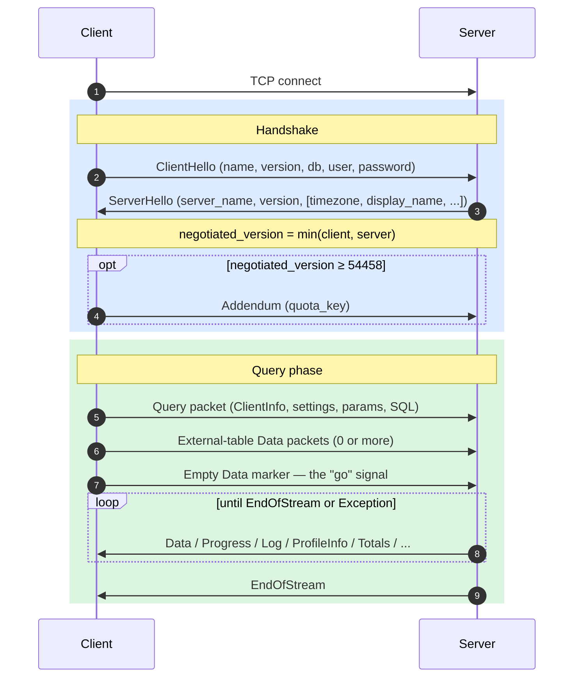
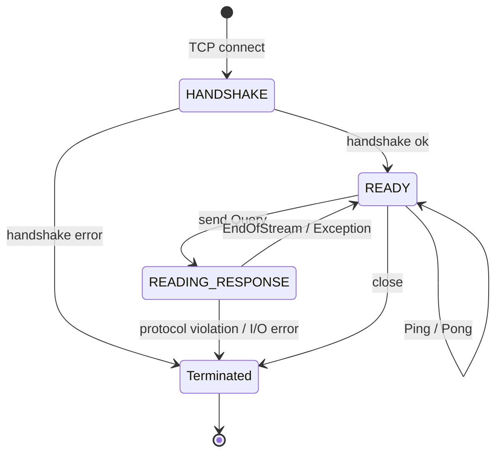
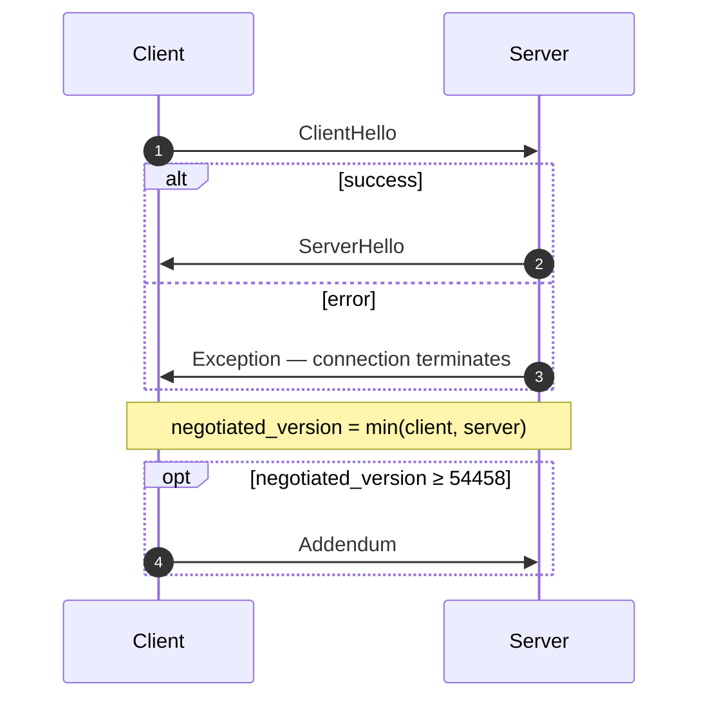
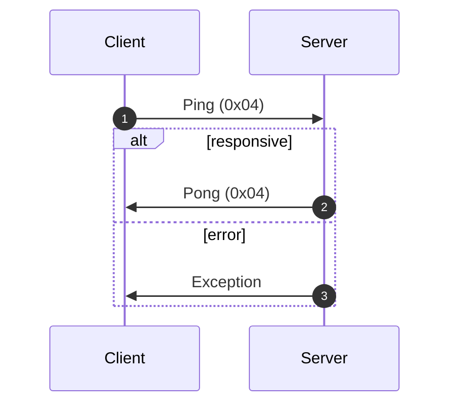
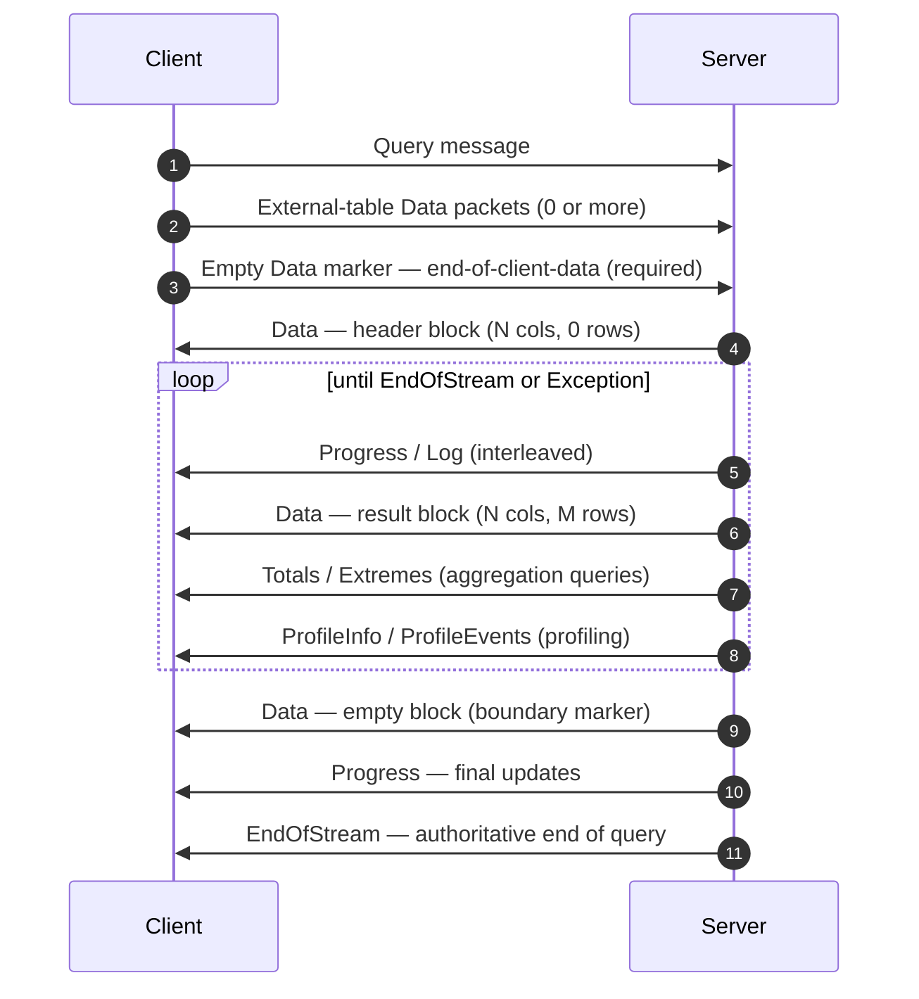
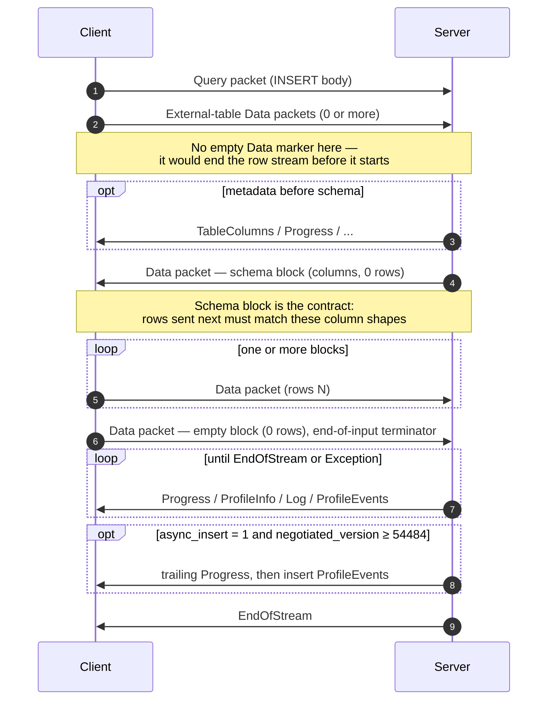
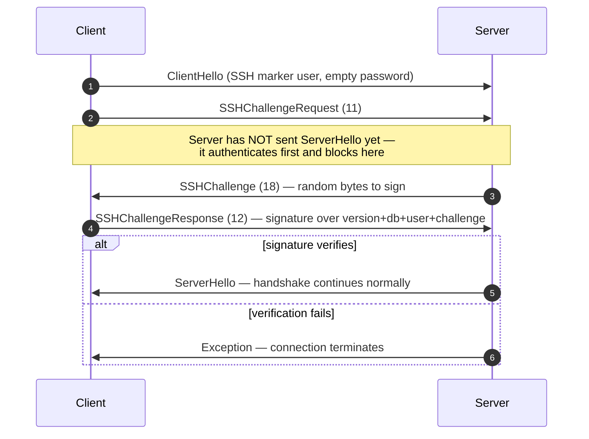

ネイティブプロトコルは、ClickHouse のクライアントとサーバーが TCP 上で使用する、バイナリの接続指向プロトコルです。SQL クエリ、結果データ、`INSERT` のペイロード、実行テレメトリー、エラーシグナルを伝送します。これは、コマンドラインクライアントや C++、および大半のサードパーティ製ネイティブドライバーの基盤となるプロトコルです。

このページでは、プロトコル自体、つまりパケットフレーミング、接続ステートマシン、バージョンネゴシエーション、および `Block` 以外のすべてのメッセージのボディを扱います。`Data` ファミリーのパケット内のバイト列 (`Block`、そのカラム、および型ごとのエンコーディング) は別の話題であり、[Native Format](/ja/interfaces/specs/NativeFormat) の仕様で説明しています。

:::note 関連仕様
このページは対になる仕様の片方であり、対応する [Native Format](/ja/interfaces/specs/NativeFormat) 仕様とあわせて公開されています。2 つの仕様は役割を明確に分担しています。このページが扱うのはパケット層とトランスポート層であり、Native Format 仕様が扱うのは `Data` ファミリーのパケット内のバイト列です。
:::

いくつかの性質は全体を通して共通しています。このプロトコルはバイナリかつ位置依存で、`BlockInfo` 内を除いてフィールドタグは存在しないため、1 バイトでもずれるとそれ以降のすべてが同期しなくなります。ステートフルなプロトコルであり、各 TCP 接続は一度に 1 つのクエリだけを処理します。つまり、マルチプレクシングはありません。固定幅整数はリトルエンディアンです。

<div id="overview">
  ## 概要
</div>

| プロパティ            | 値                                                               |
| ---------------- | --------------------------------------------------------------- |
| Transport        | TCP。必要に応じて TLS でラップ可能                                           |
| Byte order       | 固定幅整数はリトルエンディアン                                                 |
| Encoding         | バイナリかつ位置ベース (`BlockInfo` を除き field tags なし)                     |
| Connection model | ステートフル、同時に 1 つのクエリ、マルチプレクシングなし                                  |
| Versioning       | ハンドシェイク時にネゴシエートされる。個々の機能はバージョンによって制御される                         |
| Data format      | すべての表形式データに [Native Format](/ja/interfaces/specs/NativeFormat) を使用 |

ワイヤ上を流れるすべてのメッセージは `VarUInt` のパケットタイプコードで始まり、その後に、そのコードとネゴシエートされたプロトコルバージョンに応じて形式が決まるボディが続きます。

1 つの接続は 3 つのフェーズを経ます。まず一回限りのハンドシェイクがあり、その後に任意回数の `Ping` または `Query` のやり取りが続き、最後に切断されます。



ネイティブTCPプロトコルでは、SQL 内の `FORMAT` 句に関係なく、表形式データは常に Nativeフォーマットでやり取りされます。これを `RowBinary`、`CSV`、`JSON` などに再フォーマットするのはクライアントの役割であり、Nativeブロックをデコードした後に行われます。 (HTTPインターフェイスは別のコードパスで、こちらは `FORMAT` 句を実際に尊重しますが、HTTP はここでの対象外です。)

<div id="security">
  ## セキュリティ
</div>

<div id="transport-security">
  ### トランスポート セキュリティ (TLS)
</div>

TLS は、プロトコルの下位にあるトランスポート層で動作します。TLS を有効にすると TCP ストリーム全体が暗号化され、TLS を使用しているかどうかにかかわらず、プロトコルメッセージ自体はバイトレベルで完全に同一です。

<div id="authentication">
  ### 認証
</div>

認証は、ハンドシェイク時に [`ClientHello`](#clienthello) メッセージ内で行われます。`user` フィールドと `password` フィールドは平文の文字列として送信されるため、転送中の認証情報はトランスポート層の暗号化 (TLS) によって保護されます。

SSH チャレンジレスポンス認証は、プロトコルバージョン 54466 以降で利用できます。詳しくは [SSH チャレンジレスポンス認証](#ssh-authentication) を参照してください。

<div id="inter-server-secret">
  ### サーバー間シークレット
</div>

分散クエリ実行では、サーバーは共有シークレットを実際にワイヤ上へ送ることなく、それを知っていることを証明して相互に認証します。各 Query は、salt、nonce、設定されたシークレット、およびクエリに基づいて計算された 32 バイトの SHA-256 `auth_hash` を [`Query`](#query) のフィールド 4 に格納し、受信側のサーバーはそれを再計算して照合します。これは `INTERSERVER_SECRET` 機能 (v54441) によって制御されます。外部クライアントはここには常に空文字列を送信します。[サーバー間認証](#inter-server-authentication)を参照してください。

<div id="versioning-and-feature-gates">
  ## バージョニングとフィーチャーゲート
</div>

<div id="version-negotiation">
  ### バージョンネゴシエーション
</div>

ハンドシェイク時に、クライアントとサーバーはそれぞれサポートする最大のプロトコルバージョンを通知します。**ネゴシエートされたバージョン**は、そのうち小さい方です。

```text
negotiated_version = min(client_version, server_version)
```

それ以降のすべてのメッセージでは、ネゴシエートされたバージョンに基づいて、実際に送信されるデータにどのフィールドを含めるかを決定します。

<div id="feature-gates">
  ### 機能ゲート
</div>

機能は、それを導入したプロトコルバージョンによって識別され、ネゴシエートされたバージョンがその番号以上であれば **有効** になります。

:::warning
機能が有効な場合、そのフィールドはワイヤ上に **必ず** 存在していなければなりません。プロトコルは位置に厳密に依存するため、機能ゲートされたフィールドを省略すると、それ以降に続くすべてのフィールドのバイトストリームが破損します。
:::

<div id="feature-table">
  ### 機能一覧
</div>

| 機能                                                      | バージョン | 影響対象                             | ワイヤフォーマットへの影響                                                                                                                                                                                                                                                                                                                                                                                                                                                                                                                                         |
| ------------------------------------------------------- | ----- | -------------------------------- | ----------------------------------------------------------------------------------------------------------------------------------------------------------------------------------------------------------------------------------------------------------------------------------------------------------------------------------------------------------------------------------------------------------------------------------------------------------------------------------------------------------------------------------------------------- |
| BLOCK&#95;INFO                                          | all   | Block                            | すべての Block に BlockInfo プレフィックス (`is_overflows`、`bucket_number`) を追加します。                                                                                                                                                                                                                                                                                                                                                                                                                                                                               |
| CLIENT&#95;INFO                                         | 54032 | Query                            | Query のボディに ClientInfo ブロックを追加します。                                                                                                                                                                                                                                                                                                                                                                                                                                                                                                                    |
| TIMEZONE                                                | 54058 | ServerHello                      | ServerHello に `timezone` フィールドを追加します。                                                                                                                                                                                                                                                                                                                                                                                                                                                                                                                 |
| QUOTA&#95;KEY&#95;IN&#95;CLIENT&#95;INFO                | 54060 | ClientInfo                       | ClientInfo に `quota_key` フィールドを追加します。                                                                                                                                                                                                                                                                                                                                                                                                                                                                                                                 |
| DISPLAY&#95;NAME                                        | 54372 | ServerHello                      | ServerHello に `display_name` フィールドを追加します。                                                                                                                                                                                                                                                                                                                                                                                                                                                                                                             |
| VERSION&#95;PATCH                                       | 54401 | ServerHello, ClientInfo          | 両方に `version_patch` フィールドを追加します。                                                                                                                                                                                                                                                                                                                                                                                                                                                                                                                      |
| SERVER&#95;LOGS                                         | 54406 | Log                              | `send_logs_level` が設定されている場合、サーバーは Log パケットを送信します。                                                                                                                                                                                                                                                                                                                                                                                                                                                                                                    |
| COLUMN&#95;DEFAULTS&#95;METADATA                        | 54410 | TableColumns                     | サーバーは INSERT/input スキーマブロックの前に、カラムのデフォルト値メタデータを含む [`TableColumns`](#tablecolumns) パケット (type 11) を送信することがあります。送信されるのは、ネゴシエートされたバージョンが 54410 以上で、かつ `input_format_defaults_for_omitted_fields` が有効な場合のみです。このバージョン未満ではこのパケットは決して送信されないため、クライアントはこれを待機してはいけません。                                                                                                                                                                                                                                                                                          |
| WRITE&#95;CLIENT&#95;INFO                               | 54420 | Progress                         | Progress に `wrote_rows` と `wrote_bytes` を追加します。 (名前に反して、これは ClientInfo ブロックの有無を制御するものではありません。これを制御するのは `CLIENT_INFO` (v54032) です。)                                                                                                                                                                                                                                                                                                                                                                                                                    |
| SETTINGS&#95;SERIALIZED&#95;AS&#95;STRINGS              | 54429 | Query (settings encoding)        | 常に存在する settings リストが**どのように**エンコードされるかを変更します。settings が送信されるかどうかを制御するものでは**ありません**。v54429+ では各 setting を `(name, flags, value-as-string)` として書き込み、古い peer では flags なしで `(name, type-specific-binary-value)` として書き込みます。[Setting](#setting) を参照してください。                                                                                                                                                                                                                                                                                                  |
| INTERSERVER&#95;SECRET                                  | 54441 | Query                            | Query に inter-server の `auth_hash` フィールドを追加します。これは生の secret ではなく、cluster secret に対するソルト付き SHA-256 です。外部クライアントは空文字列を送信します。[Inter-server authentication](#inter-server-authentication) を参照してください。                                                                                                                                                                                                                                                                                                                                                       |
| OPEN&#95;TELEMETRY                                      | 54442 | ClientInfo                       | ClientInfo に OpenTelemetry のトレースコンテキストを追加します。                                                                                                                                                                                                                                                                                                                                                                                                                                                                                                         |
| DISTRIBUTED&#95;DEPTH                                   | 54448 | ClientInfo                       | ClientInfo に `distributed_depth` フィールドを追加します。                                                                                                                                                                                                                                                                                                                                                                                                                                                                                                         |
| INITIAL&#95;QUERY&#95;START&#95;TIME                    | 54449 | ClientInfo                       | `initial_time` フィールド (Int64、固定幅) を追加します。                                                                                                                                                                                                                                                                                                                                                                                                                                                                                                              |
| PROFILE&#95;EVENTS                                      | 54451 | ProfileEvents                    | サーバーはクエリ実行中に ProfileEvents パケットを送信します。                                                                                                                                                                                                                                                                                                                                                                                                                                                                                                                |
| PARALLEL&#95;REPLICAS                                   | 54453 | ClientInfo                       | ClientInfo に並列レプリカ調整用のフィールドを追加します。                                                                                                                                                                                                                                                                                                                                                                                                                                                                                                                    |
| CUSTOM&#95;SERIALIZATION                                | 54454 | Block (Column)                   | 各カラムの型文字列の後に `has_custom_serialization` バイトを追加します。                                                                                                                                                                                                                                                                                                                                                                                                                                                                                                    |
| ADDENDUM                                                | 54458 | Handshake                        | クライアントは handshake のやり取りの後に addendum (`quota_key`) を送信します。                                                                                                                                                                                                                                                                                                                                                                                                                                                                                             |
| PARAMETERS                                              | 54459 | Query                            | Query のボディにパラメータ一覧を追加します。                                                                                                                                                                                                                                                                                                                                                                                                                                                                                                                             |
| SERVER&#95;QUERY&#95;TIME&#95;IN&#95;PROGRESS           | 54460 | Progress                         | Progress に `elapsed_ns` フィールドを追加します。                                                                                                                                                                                                                                                                                                                                                                                                                                                                                                                  |
| PASSWORD&#95;COMPLEXITY&#95;RULES                       | 54461 | ServerHello                      | ServerHello に、パスワードポリシーの regex パターン一覧と人が読めるメッセージを追加します。                                                                                                                                                                                                                                                                                                                                                                                                                                                                                               |
| INTERSERVER&#95;SECRET&#95;V2                           | 54462 | ServerHello                      | ServerHello に 8 バイトの `UInt64` nonce を追加します。inter-server のクエリ署名に使用され、外部クライアントはこれをデコードして無視します。                                                                                                                                                                                                                                                                                                                                                                                                                                                          |
| TOTAL&#95;BYTES&#95;IN&#95;PROGRESS                     | 54463 | Progress                         | Progress の `total_rows` と `wrote_rows` の間に `total_bytes_to_read` (VarUInt) フィールドを追加します。                                                                                                                                                                                                                                                                                                                                                                                                                                                               |
| TIMEZONE&#95;UPDATES                                    | 54464 | TimezoneUpdate                   | `TimezoneUpdate` サーバーパケット (type 17) を追加します。ボディ: session timezone を保持する単一の `String`。`input` table function の initializer だけが、入力スキーマブロックの直後にこれを送信するため、クライアントは送信する行をサーバーの `session_timezone` でパースします。[TimezoneUpdate](#timezoneupdate) を参照してください。                                                                                                                                                                                                                                                                                                        |
| SPARSE&#95;SERIALIZATION                                | 54465 | Block (Column)                   | サーバーは `has_custom_serialization = 1` を設定し、スパースエンコードされたカラムを出力することがあります。ワイヤフォーマット: 1 バイトの kind (0x01 = SPARSE) 、続いて EOG で終端される VarUInt オフセットストリーム、その後に内側の型で密にエンコードされた非デフォルト値が続きます。[kind&#95;stack and sparse encoding](/ja/interfaces/specs/NativeFormat#kind-stack-and-sparse-encoding) を参照してください。                                                                                                                                                                                                                                                        |
| SSH&#95;AUTHENTICATION                                  | 54466 | Auth flow                        | SSH チャレンジレスポンス認証を追加します。オプトイン方式: クライアントは空の password とともに `" SSH KEY AUTHENTICATION " + <real_user>` 形式の `user` を送信してこれをトリガーします。[SSH challenge-response authentication](#ssh-authentication) を参照してください。                                                                                                                                                                                                                                                                                                                                                 |
| TABLE&#95;READ&#95;ONLY&#95;CHECK                       | 54467 | TablesStatusResponse             | TablesStatusResponse 内の各 table の行に `is_readonly` フラグを追加します。`TablesStatusRequest` を発行しない外部クライアントにはワイヤ上の変更はありません。                                                                                                                                                                                                                                                                                                                                                                                                                                       |
| SYSTEM&#95;KEYWORDS&#95;TABLE                           | 54468 | システムテーブル                         | サーバーは `system.keywords` を生成し、標準の `clickhouse-client` が keyword を自動補完できるようにします。native プロトコルのワイヤ変更はありません。                                                                                                                                                                                                                                                                                                                                                                                                                                               |
| ROWS&#95;BEFORE&#95;AGGREGATION                         | 54469 | ProfileInfo                      | ProfileInfo の末尾に、この順序で `applied_aggregation` (Bool) と `rows_before_aggregation` (VarUInt) を追加します。                                                                                                                                                                                                                                                                                                                                                                                                                                                     |
| CHUNKED&#95;PROTOCOL                                    | 54470 | Connection framing               | パケットごとのチャンク化フレーミングで、すべてのパケットボディをラップします。Addendum でネゴシエートされます。ServerHello は各方向に対するサーバーの希望を保持し、Addendum はクライアントの最終選択を保持します。[chunked framing](#chunked-framing) を参照してください。                                                                                                                                                                                                                                                                                                                                                                                |
| VERSIONED&#95;PARALLEL&#95;REPLICAS&#95;PROTOCOL        | 54471 | ServerHello, Addendum            | 双方が並列レプリカ協調プロトコルのバージョンを `VarUInt` で交換します。ServerHello のフィールドは **`protocol_version` の直後** (`timezone` の前) に配置されます。Addendum のフィールドは chunked-protocol 文字列の後ろに追加されます。現在の値: `8` (`DBMS_PARALLEL_REPLICAS_PROTOCOL_VERSION`)。バージョン `8` では [`MergeTreeAllRangesAnnouncementResponse`](#mergetreeallrangesannouncementresponse) (クライアントパケット `14`) が追加されます。ネゴシエートされた parallel-replicas バージョンが `≥ 8` の場合、イニシエーターは `Default` モード以外のすべての follower announcement に対して、そのストリームの正規のパーツ一覧を返し、フォロワーは読み取りリクエストを発行する前にそれを待機します。`8` 未満では、announcement は fire-and-forget です。 |
| INTERSERVER&#95;EXTERNALLY&#95;GRANTED&#95;ROLES        | 54472 | Query                            | Query ボディに `String external_roles` フィールドが追加され、settings terminator と interserver-secret hash の間に配置されます。外部クライアントは空のロール一覧を送信します (単一バイト `0x00`、つまり String エンベロープ内の VarUInt 0) 。                                                                                                                                                                                                                                                                                                                                                                           |
| V2&#95;DYNAMIC&#95;AND&#95;JSON&#95;SERIALIZATION       | 54473 | Column body                      | サーバーは `Dynamic` および `JSON` カラム型に対して V2 シリアライゼーションを出力できるようになり、どの `state_prefix` バージョンを使うかがこれで決まります。[versioned types](/ja/interfaces/specs/NativeFormat#versioned-types) を参照してください。                                                                                                                                                                                                                                                                                                                                                                        |
| SERVER&#95;SETTINGS                                     | 54474 | ServerHello                      | サーバーは非デフォルト設定を ServerHello の末尾、`nonce` の後ろに一覧として通知します。形式: 空の key で終端される `(key, flags, value)` の組 — Query パケットの settings list と同じです。                                                                                                                                                                                                                                                                                                                                                                                                                   |
| QUERY&#95;AND&#95;LINE&#95;NUMBERS                      | 54475 | ClientInfo                       | ClientInfo の末尾に `script_query_number` (VarUInt) と `script_line_number` (VarUInt) が追加されます。複数文 script のエラー箇所特定のために clickhouse-client が使用します。外部クライアントは `0, 0` を送信します。                                                                                                                                                                                                                                                                                                                                                                                    |
| JWT&#95;IN&#95;INTERSERVER                              | 54476 | ClientInfo                       | ClientInfo の末尾に、JWT の有無を示す UInt8 と、任意の `String jwt` が追加されます。外部クライアント (JWT なし) はバイト `0x00` を送信します。 (C++ では `DBMS_MIN_REVISON_WITH_JWT_IN_INTERSERVER` と綴られています — 定数名のタイプミスに注意してください。)                                                                                                                                                                                                                                                                                                                                                                  |
| QUERY&#95;PLAN&#95;SERIALIZATION                        | 54477 | ServerHello, QueryPlan packet    | ServerHello は server settings の後ろに `VarUInt query_plan_serialization_version` を追加します。また、事前構築済みクエリプランをサーバー間で受け渡しするための `ClientPacket::QueryPlan` (コード `13`) も導入されます — 外部クライアントが送信することはありません。                                                                                                                                                                                                                                                                                                                                                            |
| PARALLEL&#95;BLOCK&#95;MARSHALLING                      | 54478 | Block (Column)                   | サーバーは並列処理のためにカラムを `ColumnBLOB` (インライン圧縮) でラップすることがあります。これは、クエリで圧縮が有効かつ `rows > 1` の場合にのみ適用されます。それ以外では通常のカラムのワイヤ形式が使われます。送信する Query パケットで圧縮を有効にしないクライアントでは、ワイヤ上の変更はありません。                                                                                                                                                                                                                                                                                                                                                                              |
| VERSIONED&#95;CLUSTER&#95;FUNCTION&#95;PROTOCOL         | 54479 | ServerHello                      | ServerHello の末尾に `VarUInt cluster_function_protocol_version` が追加されます。`*Cluster` table functions (`s3Cluster` など) で使用されます。現在の値: `8` (`DBMS_CLUSTER_PROCESSING_PROTOCOL_VERSION`)。バージョン `7` は private-repository の機能 (Iceberg compaction) 用に予約されており、`8` ではサーバー間クラスター read-task ペイロード (`ReadTaskResponse` ボディ。ここでは未規定 — 下記参照) に任意の `read_source_index` が追加されます。外部クライアントはデコードして無視します。                                                                                                                                                                     |
| OUT&#95;OF&#95;ORDER&#95;BUCKETS&#95;IN&#95;AGGREGATION | 54480 | BlockInfo                        | BlockInfo のフィールドタグ付きストリームにフィールド 3 (`out_of_order_buckets: Vec<Int32>`) が追加されます。`[VarUInt count][Int32]*count` としてデコードされます。外部クライアントが自らこれを出力することはありません。デコーダーはサーバーが送信する空でない一覧を読み取ります。                                                                                                                                                                                                                                                                                                                                                                    |
| COMPRESSED&#95;LOGS&#95;PROFILE&#95;EVENTS&#95;COLUMNS  | 54481 | Log, ProfileEvents, TableColumns | サーバーは [`Log`](#log)、[`ProfileEvents`](#profileevents)、[`TableColumns`](#tablecolumns) のパケットボディを [compression frame](/ja/interfaces/specs/NativeFormat#compression-frame) でラップすることがあります。このバージョンでは、3 つのボディはすべて同じ任意圧縮の出力経路を通りますが、実際に compression frame になるのはクエリで `compression = true` の場合だけです。送信する Query パケットで圧縮を有効にしないクライアントでは、ワイヤ上の変更はありません。                                                                                                                                                                                                              |
| REPLICATED&#95;SERIALIZATION                            | 54482 | Block (Column)                   | サーバーは kind&#95;stack `0x04 = REPLICATED` を持つカラムを出力することがあります。これは繰り返し値向けの辞書形式の compact な表現です — [kind&#95;stack and sparse encoding](/ja/interfaces/specs/NativeFormat#kind-stack-and-sparse-encoding) を参照してください。このバージョン未満では、writer は送信前にそのようなカラムを展開していました。索引参照 (各行について `elements[indexes[i]]`) でデコードされます。leaf types に加えて、`Nullable`/`Array`/`Tuple`/`Map`/`Nested`/`LowCardinality` の inner 型をサポートします。                                                                                                                                                     |
| NULLABLE&#95;SPARSE&#95;SERIALIZATION                   | 54483 | Block (Column)                   | スパースシリアライゼーションを `Nullable(T)` と組み合わせます。このバージョン未満では、writer は送信前に Nullable カラムのスパース表現を展開していました。v54483+ ではワイヤデータは sparse-over-Nullable になります。[kind&#95;stack and sparse encoding](/ja/interfaces/specs/NativeFormat#kind-stack-and-sparse-encoding) を参照してください。                                                                                                                                                                                                                                                                                              |
| PROGRESS&#95;IN&#95;ASYNC&#95;INSERT                    | 54484 | Progress (INSERT)                | **非同期** INSERT (`async_insert = 1`) では、insert がフラッシュされると、サーバーは `EndOfStream` の前に追加の [`Progress`](#progress) パケットを送信し、その後にその insert の `ProfileEvents` を送信します。これは *ネゴシエート済み* バージョンが 54484 以上の場合にのみ有効で、それ未満ではサーバーはこの末尾の Progress を省略します。Progress のワイヤ形式自体は変わらず、新しいのは送信される点だけです。実際には、この増分には経過時間が含まれ、書き込まれた行数カウンターは付随する ProfileEvents で報告されます。すでに Progress の割り込みを処理しているクライアントでは、フォーマット変更は不要で、追加の 1 パケットを許容するだけで済みます。                                                                                                                                       |
| CLIENT&#95;AGENT&#95;IN&#95;CLIENT&#95;INFO             | 54485 | ClientInfo                       | ClientInfo の末尾に `client_agent` `String` が追加されます。canonical client は環境から agent 識別子を自動検出します (たとえば `claude-code`、`cursor`、`gemini-cli`、または `AGENT` 変数の値) 。何も検出されない外部クライアントは空文字列を送信します。ネゴシエート済みバージョンが 54485 以上では必須であり、省略すると Query パケットの残り部分との同期がずれます。                                                                                                                                                                                                                                                                                                      |
| INTERNAL&#95;QUERY&#95;FLAG                             | 54486 | ClientInfo                       | ClientInfo の末尾に `is_internal` `UInt8` が追加されます。サーバー内部クエリ (ユーザー発行ではない) には `1` を設定し、リモートクエリにも伝播されるため、それらの `system.query_log` の行は internal としてラベル付けされます。外部クライアントは `0` を送信します。ネゴシエート済みバージョンが 54486 以上では必須であり、省略すると Query パケットの残り部分との同期がずれます。                                                                                                                                                                                                                                                                                                               |

<div id="packet-envelope">
  ## パケットエンベロープ
</div>

送受信のどちらの方向でも、通信されるすべてのメッセージは共通の外側の構造を持ちます：

```text
[VarUInt: packet_type_code]    always encoded as VarUInt
[message body]                 format depends on packet_type_code
```

完全なパケットタイプの表は、[パケットタイプ リファレンス](#packet-type-reference)にあります。

パケットタイプは固定幅のバイトではなく、`VarUInt` です。128 未満の値では `VarUInt` でも同じ 1 バイトになりますが、今後パケットタイプが 128 以上に達しても互換性を保てるよう、実装では `VarUInt` エンコーディングを使用する必要があります。

[メッセージ リファレンス](#message-reference)で扱うのは、各パケットの**ボディ**のみ、つまりパケットタイプコードの後ろに続くバイト列です。フィールド番号は、最初のボディ フィールドを 1 として始まります。

<div id="chunked-framing">
  ### チャンク化フレーミング (v54470+)
</div>

`CHUNKED_PROTOCOL` feature が**ネゴシエート**されると ([ハンドシェイク](#handshake-phase)を参照) 、ワイヤ上のすべてのパケットがチャンク化フレーミングでラップされます。このラップは**方向ごと**に行われます。つまり、client→server と server→client はそれぞれ個別にネゴシエートされるため、異なるモード (チャンク化または非フレーム化) になる場合があります。

パケットごとのワイヤレイアウト:

```text
<chunk>...   one or more chunks; their payloads concatenated form the whole packet
[u32 LE = 0] zero-size terminator marking end of packet
```

各chunkのワイヤレイアウト:

```text
[u32 LE: chunk_size]   chunk_size in [1, UINT32_MAX]
[chunk_size bytes]     packet bytes (see note below)
```

パケットタイプ `VarUInt` は chunked ストリームの**内側**にあります。つまり、フレーミングより前に別個のバイトとして送られるのではなく、パケットのペイロードの先頭バイト (最初の chunk の先頭バイト) です。各パケットの chunk ペイロードは、[packet envelope](#packet-envelope) の完全な `[VarUInt packet_type_code][message body]` 全体です。パケットタイプを chunked ストリームの外側に置く client は、そのタイプバイトを `u32` chunk サイズの先頭バイトとして peer に読ませてしまい、接続の同期を失わせます。

1 つのパケットは、writer の buffer がパケットの途中でいっぱいになった場合、複数の chunk に分割されることがあります。分割位置はどこでもあり得るため、パケットタイプの `VarUInt` の途中にかかることもあります。reader は chunk ペイロードを連結し、末尾の 4 バイトのゼロを透過的なパケット境界として扱います。つまり、それ自体は消費しますが、パケットボディを読んでいる側には渡しません。

ボディを持たないパケットも引き続きラップされます。`Ping` や `Pong` のような 1 バイトのパケットは、chunking のネゴシエーション後は `[u32 size = 1][0x04][u32 0]` になります。このページの他の箇所にある「ワイヤ上では単一バイト」という説明は、いずれも chunking 前の形式を指します。

**ネゴシエーション。** ServerHello と Addendum はそれぞれ 2 つの `String` フィールドを持ち、各方向に 1 つずつ、値は `{"chunked", "notchunked", "chunked_optional", "notchunked_optional"}` から選ばれます。

* `chunked` / `notchunked` は厳格です。その側はその mode を厳密に要求します。
* `_optional` の variant は柔軟で、相手側が選んだどちらの mode でも受け入れます。

各方向の合意値は、ペアごとに次のように計算されます。

| Server pref         | Client pref         | Agreed                                    |
| ------------------- | ------------------- | ----------------------------------------- |
| `*_optional`        | anything            | CLIENT に従う (その `starts_with("chunked")`)  |
| anything            | `*_optional`        | SERVER に従う                                |
| `chunked` strict    | `chunked` strict    | `chunked`                                 |
| `notchunked` strict | `notchunked` strict | `notchunked`                              |
| strict mismatch     | strict mismatch     | **プロトコルエラー** — 接続は必ず切断しなければなりません          |

client 側では、client の SEND preference は server の RECV preference とネゴシエートされ、その逆も同様です。

**タイミング。** ネゴシエーション文字列は、フレーム化されていない wire 上を流れます: ClientHello → ServerHello (server prefs) → Addendum (client のネゴシエート済みの値) 。フレーミングへの切り替えは、Addendum が flush された*後*に送信されるすべてのバイトに適用されます。Addendum 自体、ClientHello、ServerHello は常にフレーム化されません。

<div id="connection-lifecycle">
  ## 接続のライフサイクル
</div>

接続は、常に `HANDSHAKE`、`READY`、`READING_RESPONSE`、または終了の4つの状態のいずれか1つにあります。プロトコルは多重化をサポートしていないため、前のレスポンスを最後まで読み切る前にクライアントが新しいリクエストを送信すると、ワイヤ上のバイト列が入り混じってストリームが破損します。

<div id="states">
  ### 状態
</div>



正常系の遷移は `HANDSHAKE → READY → READING_RESPONSE → READY` と一直線で、`Ping`/`Pong` の自己ループがあり、失敗時のエッジはすべて単一の `Terminated` sink に集約されます。

| State              | Description                                                                                                                                                                                               |
| ------------------ | --------------------------------------------------------------------------------------------------------------------------------------------------------------------------------------------------------- |
| `HANDSHAKE`        | TCP connection が確立された直後の初期状態です。[handshake](#handshake-phase) メッセージのみ有効です。成功すると `READY` に遷移し、失敗すると終了します。                                                                                                   |
| `READY`            | idle 状態です。client は [Ping](#ping-phase)、[Query](#query-phase) の送信、またはクローズを行えます。connection は `READY` のまま無期限に維持される場合があります (`idle_connection_timeout` の制約を受けます。[connection limits](#connection-limits) を参照) 。 |
| `READING_RESPONSE` | client が Query を送信すると、この状態に入ります。`READY` に戻る前に、client は server のレスポンス stream を最後まで完全に読み切る必要があります。この状態で client→server に許可される唯一のパケットは Cancel です (このページでは説明していません) 。                                          |
| Terminated         | 以後は使用できません。client は新しい TCP connection を確立し、handshake をやり直す必要があります。                                                                                                                                        |

<div id="handshake-phase">
  ### ハンドシェイク フェーズ
</div>

認証を行い、プロトコル バージョンをネゴシエートします。これは各接続で、ほかのどの処理よりも前に、必ず 1 回だけ行われます。

TCP 接続が開かれたばかりで、まだメッセージは一切やり取りされていません。フローは次のとおりです。



1. クライアントは、サポートしている最大のプロトコルバージョンを含む [`ClientHello`](#clienthello) を送信します。

2. クライアントはレスポンスを読み取り、パケットタイプごとに処理を振り分けます。

   | パケットタイプ         | 動作                                                                                                             |
   | --------------- | -------------------------------------------------------------------------------------------------------------- |
   | `Hello` (0)     | [`ServerHello`](#serverhello) をデコードします。`negotiated_version = min(client_ver, server_ver)` を計算します。ステップ 3 に進みます。 |
   | `Exception` (2) | [`Exception`](#exception) をデコードします。エラーとして返し、接続を終了します。                                                          |
   | その他             | プロトコル違反です。接続を終了します。                                                                                            |

3. `negotiated_version ≥ 54458` (`ADDENDUM` 機能) の場合、クライアントは [`Addendum`](#addendum) を送信します。この判断は、クライアントが宣言したバージョンではなく、**ネゴシエートされた** バージョンに基づきます。

成功すると接続は `READY` に移行し、エラー時には終了します。

<div id="ping-phase">
  ### Ping フェーズ
</div>

TCP keepalive とは独立した、アプリケーションレベルの liveness チェックです。Ping/Pong の往復が成功すると、TCP 接続が双方向で生きており、サーバーが応答可能であることを確認できます。Ping はステートレスで、どのクエリとも相関付けられていないため、連続する複数の Ping はそれぞれ独立しています。

`READY` から開始すると、フローは次のとおりです。



1. クライアントは [`Ping`](#ping) を送信します。
2. クライアントは応答を読み取ります。

   | パケットタイプ         | アクション                                           |
   | --------------- | ----------------------------------------------- |
   | `Pong` (4)      | liveness を確認します。`READY` に戻ります。                  |
   | `Exception` (2) | [`Exception`](#exception) をデコードし、error として返します。 |
   | anything else   | プロトコル違反。                                        |

<div id="query-phase">
  ### クエリフェーズ
</div>

クライアントは SQL ステートメントを送信し、サーバーは結果のブロックと実行テレメトリーをストリームで返します。レスポンスはパケットの数列で、最後は必ず 1 つの `EndOfStream` または `Exception` で終わります。

`READY` から始まるフローは次のとおりです。



どの時点でもエラーが発生すると、サーバーは `EndOfStream` の代わりに `Exception` を送信し、クエリを終了します。

1. クライアントは、一意の `query_id` (通常は UUID) を付けて [`Query`](#query) を送信します。
2. クライアントは任意の外部テーブルを送信し、その後に空の Data マーカーを送信します。空の Data パケットは `table_name = ""`, `num_columns = 0`, `num_rows = 0` です。サーバーはこのマーカーを受信するまで、クエリの実行を開始しません。
3. クライアントは `READING_RESPONSE` に移行し、書き込みバッファをフラッシュします。
4. クライアントは応答パケットをループで読み取り、タイプごとにディスパッチします。

   | パケットタイプ              | アクション                                                                                                   |
   | -------------------- | ------------------------------------------------------------------------------------------------------- |
   | `Data` (1)           | ブロックをデコードします。最初の Data はスキーマヘッダーで、以降は結果ブロックです (蓄積する) 。空のブロックは境界マーカーです。`num_rows == 0` は**クエリ終了ではありません**。 |
   | `Progress` (3)       | 実行メトリクス。各パケットは前回からの**増分**なので、ローカルで蓄積します。                                                                |
   | `EndOfStream` (5)    | クエリ完了。ループを抜けて `READY` に戻ります。                                                                            |
   | `ProfileInfo` (6)    | 実行後のプロファイリングデータ。                                                                                        |
   | `Totals` (7)         | 集約の totals ブロック (Data と同じワイヤ形式) 。                                                                       |
   | `Extremes` (8)       | 最小値/最大値のブロック (Data と同じワイヤ形式) 。                                                                          |
   | `Log` (10)           | サーバーログの 1 行。                                                                                            |
   | `TableColumns` (11)  | カラムのデフォルト値に関するメタデータ。                                                                                    |
   | `ProfileEvents` (14) | パフォーマンスカウンター。                                                                                           |
   | `Exception` (2)      | デコードしてエラーとして返します。ループを抜けて `READY` に戻ります。                                                                 |
   | anything else        | クエリフェーズ中は想定外です。接続を終了します。                                                                                |

`EndOfStream` または処理された `Exception` を受け取ると、接続は `READY` に戻ります。プロトコル違反または I/O エラーが発生した場合は接続が終了します。

:::note
`num_rows == 0` のケースは、新しい実装でつまずきやすいポイントです。行数 0 のブロックは境界マーカーまたはスキーマヘッダーであり、ストリーム終了のシグナルではありません。応答が終了するのは `EndOfStream` または `Exception` の場合だけです。
:::

<div id="insert-phase">
  ### INSERT フェーズ
</div>

INSERT フェーズは、[クエリフェーズ](#query-phase)に 2 つの追加のやり取りを加えたものです。クライアントは `INSERT` ステートメントを送信し、サーバーはターゲットテーブルを示す **スキーマブロック** を返します。続いてクライアントが行を含む Data パケットをストリームし、その後に空の Data マーカーを送信します。最後に、サーバーは `EndOfStream` または `Exception` を返して完了します。

`READY` から開始すると、SQL は `INSERT INTO <table> [(<cols>)] VALUES` 形式の `INSERT` になります。行データは Data パケットを通じて送られるため、インラインの `VALUES (...)` リテラルは含みません。フローは次のとおりです。



1. クライアントは、`body` に INSERT SQL を設定して [`Query`](#query) を送信します。
2. クライアントは、必要に応じて外部テーブルも送信します (INSERT ではまれです) 。[クエリフェーズ](#query-phase) とは異なり、ここでは空の Data マーカーを**送信しません**。`INSERT` の `Query` パケットは後続データを伴う前提で送信されるため、データ終端を示す空のブロックは手順 5 まで送信を遅らせます。これをスキーマブロックより前に送ると、server はそれを行ストリームの終端として読み取り、0 行のまま INSERT を完了したうえで、最初の実データの行パケットを場違いなトップレベルパケットとして解析してしまいます。
3. クライアントは、スキーマ Data パケットを読むまで、メタデータパケット (TableColumns、Progress、ProfileInfo、Log、ProfileEvents) を読み進めます。これは 0 行ですが、完全なカラム構造 (名前と型) を持つ Block です。スキーマブロックは契約です。次にクライアントが送信する行は、これらのカラムの shape と一致していなければなりません。
4. クライアントはデータブロックを送信します。各ブロックについて、`VarUInt(ClientPacket::Data = 2)` を書き込み、続けて空の external-table 名として `String("")`、その後に Block を書き込みます。カラム型は、位置ごとにスキーマブロックのカラムと一致している必要があります。
5. クライアントは入力終端を示す終端子を送信します。これは空の Block (0 columns、0 rows) を持つ Data パケットです。
6. クライアントは、`EndOfStream` (成功) または `Exception` (失敗) に達するまでレスポンスストリームを読み切ります。

**非同期 INSERT (v54484+) 。** クエリに `async_insert = 1` が含まれている場合、server は行を queue に入れ、batch の一部として flush します。ネゴシエートされた version が 54484 以上 (`PROGRESS_IN_ASYNC_INSERT`) では、flush の完了後、server は追加の [`Progress`](#progress) パケットを送出し、その直後に insert の `ProfileEvents`、さらに `EndOfStream` を送出します。54484 未満では、server はこの末尾の Progress を送出しません。このパケットは通常の `Progress` です。server は書き込み件数を反映する前に query pipeline をリセットするため、この増分に実際に含まれるのは経過時間だけで、書き込まれた行数とバイト数の統計は付随する `ProfileEvents` を通じてクライアントに届きます。手順 6 ですでに途中の Progress を読み切る実装になっているクライアントであれば、追加のパケットをもう 1 つ受け入れるだけで済みます。

接続は、`EndOfStream` または処理済みの `Exception` を受け取ると `READY` に戻ります。プロトコル違反や I/O エラーが発生すると接続は終了します。

<div id="message-reference">
  ## メッセージリファレンス
</div>

フィールドはワイヤ順に記載されています。`Type` カラムでは次を使用します。

* `VarUInt` — 可変長の符号なし整数 ([VarUInt](/ja/interfaces/specs/NativeFormat#varuint) を参照) 。
* `String` — `VarUInt` プレフィックス付きのバイト列 ([String](/ja/interfaces/specs/NativeFormat#string) を参照) 。
* `UInt8`、`Int32` など — 固定幅のリトルエンディアン整数。
* `Bool` — 1 バイトで、`0x00` または `0x01` です。

`Role` カラムは、各フィールドを誰が使用するかを示します。

* **client** — 外部クライアントが設定します。
* **inter-server** — サーバー間通信でのみ意味を持ちます。外部クライアントはデフォルト値を書き込みます。
* **universal** — 両方で使用されます。

これらの表では、パケットタイプコードに続く各パケットのボディのみを記載します。

<div id="clienthello">
  ### ClientHello (パケットタイプ 0)
</div>

Client → Server。TCP接続が確立された後の最初のメッセージです。

| # | フィールド                | 型       | ロール       | 説明                                    |
| - | -------------------- | ------- | --------- | ------------------------------------- |
| 1 | client&#95;name      | String  | universal | クライアント識別子 (例: `"clickhouse-client"`)  |
| 2 | version&#95;major    | VarUInt | universal | クライアントのメジャーバージョン                      |
| 3 | version&#95;minor    | VarUInt | universal | クライアントのマイナーバージョン                      |
| 4 | protocol&#95;version | VarUInt | universal | クライアントがサポートする最大のプロトコルバージョン            |
| 5 | database             | String  | universal | デフォルトデータベース名                          |
| 6 | user                 | String  | universal | 認証用のユーザー名                             |
| 7 | password             | String  | universal | パスワード (平文)                            |

<div id="serverhello">
  ### ServerHello (パケットタイプ 0)
</div>

Server → Client。認証に成功した場合の ClientHello への応答です。

| #  | Field                                          | Type      | Role         | Condition                                                 | Description                                                                                                                                                                                                                                                                                                             |
| -- | ---------------------------------------------- | --------- | ------------ | --------------------------------------------------------- | ----------------------------------------------------------------------------------------------------------------------------------------------------------------------------------------------------------------------------------------------------------------------------------------------------------------------- |
| 1  | server&#95;name                                | String    | universal    | always                                                    | サーバー識別子                                                                                                                                                                                                                                                                                                                 |
| 2  | version&#95;major                              | VarUInt   | universal    | always                                                    | サーバーの major バージョン                                                                                                                                                                                                                                                                                                       |
| 3  | version&#95;minor                              | VarUInt   | universal    | always                                                    | サーバーの minor バージョン                                                                                                                                                                                                                                                                                                       |
| 4  | protocol&#95;version                           | VarUInt   | universal    | always                                                    | サーバーのプロトコルバージョン                                                                                                                                                                                                                                                                                                         |
| 4a | parallel&#95;replicas&#95;protocol&#95;version | VarUInt   | universal    | VERSIONED&#95;PARALLEL&#95;REPLICAS&#95;PROTOCOL (v54471) | サーバーの parallel-replicas coordination protocol version。**ワイヤ上の位置: `protocol_version` の直後**で、`timezone` の前です。現在値: `8`。                                                                                                                                                                                                  |
| 5  | timezone                                       | String    | universal    | TIMEZONE (v54058)                                         | サーバーの timezone (例: `"UTC"`)                                                                                                                                                                                                                                                                                             |
| 6  | display&#95;name                               | String    | universal    | DISPLAY&#95;NAME (v54372)                                 | 人が読めるサーバー名                                                                                                                                                                                                                                                                                                              |
| 7  | version&#95;patch                              | VarUInt   | universal    | VERSION&#95;PATCH (v54401)                                | サーバーの patch バージョン                                                                                                                                                                                                                                                                                                       |
| 8  | proto&#95;send&#95;chunked&#95;srv             | String    | universal    | CHUNKED&#95;PROTOCOL (v54470)                             | サーバーが優先する outbound chunking。`"chunked"`、`"notchunked"`、`"chunked_optional"`、`"notchunked_optional"` のいずれかです。[チャンク化フレーミング](#chunked-framing)を参照してください。**version gate のほうが高いにもかかわらず、ワイヤ上では `password_complexity_rules` より前に配置されます。**                                                                                    |
| 9  | proto&#95;recv&#95;chunked&#95;srv             | String    | universal    | CHUNKED&#95;PROTOCOL (v54470)                             | サーバーが優先する inbound chunking。値の集合はフィールド 8 と同じです。                                                                                                                                                                                                                                                                          |
| 10 | password&#95;complexity&#95;rules              | Rule[]    | universal    | PASSWORD&#95;COMPLEXITY&#95;RULES (v54461)                | サーバーの password policy。`VarUInt count` に続いて `count × Rule` が並びます。詳細は以下を参照してください。                                                                                                                                                                                                                                         |
| 11 | nonce                                          | UInt64    | inter-server | INTERSERVER&#95;SECRET&#95;V2 (v54462)                    | 8 バイトの LE ランダム nonce。サーバーの inter-server query-signing scheme で使用されます。外部クライアントはこれをデコードし (ストリームの整合性を保つため) 、値自体は無視することが推奨されます。                                                                                                                                                                                             |
| 12 | server&#95;settings                            | Setting[] | universal    | SERVER&#95;SETTINGS (v54474)                              | サーバーの非 default 設定の通知。形式: 0 個以上の `(String key, VarUInt flags, String value)` の組で、空の key で終端します。[Query パケットの設定リスト](#setting)と同じです。                                                                                                                                                                                        |
| 13 | query&#95;plan&#95;serialization&#95;version   | VarUInt   | universal    | QUERY&#95;PLAN&#95;SERIALIZATION (v54477)                 | サーバーがサポートする query-plan シリアライゼーション バージョン。外部クライアントはデコードして無視します。                                                                                                                                                                                                                                                           |
| 14 | cluster&#95;function&#95;protocol&#95;version  | VarUInt   | universal    | VERSIONED&#95;CLUSTER&#95;FUNCTION&#95;PROTOCOL (v54479)  | サーバーの `*Cluster` table-function protocol version。現在値: `8`。この値は、inter-server クラスター read-task payload (それ以外は未規定の `ReadTaskResponse` body) 内の追加フィールドを制御します。バージョン `7` は private-repository 機能 (Iceberg compaction) 向けに予約されており、`8` ではオプションの `read_source_index` が追加されます。外部クライアントは cluster read に参加しないため、このフィールドはデコードして無視します。 |

**Rule** — `password_complexity_rules` の要素:

| # | Field   | Type   | Description                            |
| - | ------- | ------ | -------------------------------------- |
| 1 | pattern | String | 準拠した password が一致しなければならない正規表現パターン。    |
| 2 | message | String | password がこのルールを満たさない場合に表示される、人が読める説明。 |

この一覧はサーバー operator の password-policy 設定を反映したもので、あくまで参考情報です。サーバーは handshake 中にこれらのルールを強制しません。password の変更または設定機能を提供するクライアントは、準拠していない password をサーバーに送って往復変換する前に、これらのルールを使ってエラーを示すことができます。

:::note
悪意のある、または設定不備のあるサーバーによる resource 使用量を抑えるため、デコードする `count` は最大 256 エントリ、各 `pattern` および `message` String は最大 4096 バイトに制限してください。`count` が `0` (後続の組なし) のケースは、password policy が設定されていないサーバーで一般的です。
:::

<div id="addendum">
  ### 追補 (パケットタイプなし)
</div>

Client → Server。`ADDENDUM` (v54458) によって有効化され、ハンドシェイクのやり取りが完了した直後に送信されます。これは独立したパケットタイプではなく、各フィールドはパケットタイプを示すバイトのプレフィックスなしで、そのままワイヤ上に送出されます。

| # | Field                                          | Type    | Role      | Condition                                                 | Description                                                                                                                  |
| - | ---------------------------------------------- | ------- | --------- | --------------------------------------------------------- | ---------------------------------------------------------------------------------------------------------------------------- |
| 1 | quota&#95;key                                  | String  | universal | always                                                    | サーバー側の keyed quotas 用リソース QUOTA キーです。keyed quota を使用しないクライアントは空文字列を送信します。                                                    |
| 2 | proto&#95;send&#95;chunked                     | String  | universal | CHUNKED&#95;PROTOCOL (v54470)                             | Client がネゴシエートした Outbound chunking: `"chunked"` または `"notchunked"`。ServerHello の `proto_recv_chunked_srv` を基に決定されます。         |
| 3 | proto&#95;recv&#95;chunked                     | String  | universal | CHUNKED&#95;PROTOCOL (v54470)                             | Client がネゴシエートした Inbound chunking。`proto_send_chunked_srv` を基に決定されます。                                                        |
| 4 | parallel&#95;replicas&#95;protocol&#95;version | VarUInt | universal | VERSIONED&#95;PARALLEL&#95;REPLICAS&#95;PROTOCOL (v54471) | Client がサポートする parallel-replicas 協調プロトコルのバージョン。分散クエリに参加しない外部クライアントであっても、サーバーの互換性チェックが成功するよう、有効なバージョン (現在は `8`) を送信する必要があります。 |

chunked-framing への切り替えは、この追補が flush された *後* に適用されます。つまり、追補自体には framing は適用されません。

<div id="ping">
  ### Ping (パケットタイプ 4)
</div>

クライアント → サーバー。ボディはなく、パケットはチャンク化フレーミング前は 1 バイトの `0x04` のみです。チャンク化がネゴシエートされると、このバイトは chunk の 1 バイトのペイロードになります ([チャンク化フレーミング](#chunked-framing)を参照) 。

<div id="pong">
  ### Pong (パケットタイプ 4)
</div>

サーバー → クライアント。ボディはありません。パケットは、チャンク化フレーミングの前では 1 バイトの `0x04` のみです。チャンク化がネゴシエートされている場合、このバイトは chunk の 1 バイトのペイロードになります ([チャンク化フレーミング](#chunked-framing)を参照) 。

<div id="exception">
  ### Exception (パケットタイプ 2)
</div>

サーバー → クライアント。いずれかのフェーズでサーバーにエラーが発生した場合に送信されます。

| # | Field                     | Type   | Role      | Description                           |
| - | ------------------------- | ------ | --------- | ------------------------------------- |
| 1 | code                      | Int32  | universal | エラーコード                                |
| 2 | name                      | String | universal | Exception クラス (例: `"DB::Exception"`)  |
| 3 | message                   | String | universal | 人間が読めるエラーメッセージ                        |
| 4 | stack&#95;trace           | String | universal | サーバー側のスタックトレース                        |
| 5 | has&#95;nested (obsolete) | Bool   | universal | 廃止された互換性バイト。サーバーは常に `false` を書き込みます   |

<div id="query">
  ### Query (パケットタイプ 1)
</div>

Client → Server。

| #  | フィールド              | 型           | 役割           | 条件                                                        | 説明                                                                                                                                                                                                                                                   |
| -- | ------------------ | ----------- | ------------ | --------------------------------------------------------- | ---------------------------------------------------------------------------------------------------------------------------------------------------------------------------------------------------------------------------------------------------- |
| 1  | query&#95;id       | String      | universal    | always                                                    | 一意のクエリ識別子 (UUID)                                                                                                                                                                                                                                     |
| 2  | client&#95;info    | ClientInfo  | universal    | CLIENT&#95;INFO (v54032)                                  | [ClientInfo](#clientinfo) を参照してください                                                                                                                                                                                                                  |
| 3  | settings           | Setting[]   | universal    | always                                                    | [Setting](#setting) を参照してください。**常に存在します** (空の key で終端) 。バージョンによって変わるのは設定ごとの*エンコーディング*だけです。詳しくは [Setting](#setting) のエンコーディングに関する注記を参照してください。ネゴシエートされたバージョンが `54429` 未満の場合、クライアントはこのフィールドを省略してはいけません。                                                 |
| 3a | external&#95;roles | String      | universal    | INTERSERVER&#95;EXTERNALLY&#95;GRANTED&#95;ROLES (v54472) | 外部から付与されたロール名のシリアライズ済みリスト。空のリストは、byte `0x00` (VarUInt 0) を String エンベロープで包んだものです (ワイヤ上では `[VarUInt 1][0x00]`) 。外部クライアントは常に空を送信します。                                                                                                                   |
| 4  | auth&#95;hash      | String      | inter-server | INTERSERVER&#95;SECRET (v54441)                           | サーバー間認証用のハッシュであり、生のクラスターシークレット**ではありません**。詳しくは下記の [Inter-server authentication](#inter-server-authentication) を参照してください。外部クライアント (およびあらゆる `InitialQuery`) は空文字列を送信します。                                                                               |
| 5  | stage              | VarUInt     | universal    | always                                                    | クエリ処理ステージ。`0` = FetchColumns、`1` = WithMergeableState、`2` = Complete、`3` = WithMergeableStateAfterAggregation、`4` = WithMergeableStateAfterAggregationAndLimit、`7` = QueryPlan。値 `3`/`4` は分散クエリで現れ、`7` はシリアライズ済みクエリプランに対応します。外部クライアントは通常 `2` を送信します。 |
| 6  | compression        | VarUInt     | universal    | always                                                    | 0 = 無効、1 = 有効                                                                                                                                                                                                                                        |
| 7  | query&#95;body     | String      | universal    | always                                                    | SQL テキスト                                                                                                                                                                                                                                             |
| 8  | parameters         | Parameter[] | client       | PARAMETERS (v54459)                                       | [Parameter](#parameter) を参照してください。空の key で終端します。                                                                                                                                                                                                     |

<div id="clientinfo">
  ### ClientInfo (Query に埋め込み)
</div>

クライアント → サーバー。Query のボディ (フィールド 2) に埋め込まれています。`CLIENT_INFO` (v54032) で制御されます。 (ClientInfo 内の一部のフィールドは、以下の各フィールドの注記にあるとおり、以降のバージョンで制御されます。)

| #  | フィールド                                 | 型       | ロール       | 条件                                                        | 説明                                                                                                                                                                                                                                                                                                                                                                                                                                                                                                                                          |
| -- | ------------------------------------- | ------- | --------- | --------------------------------------------------------- | ------------------------------------------------------------------------------------------------------------------------------------------------------------------------------------------------------------------------------------------------------------------------------------------------------------------------------------------------------------------------------------------------------------------------------------------------------------------------------------------------------------------------------------------- |
| 1  | query&#95;kind                        | UInt8   | universal | 常時                                                        | 0 = NoQuery、1 = InitialQuery、2 = SecondaryQuery。外部クライアントは `1` を送ります。                                                                                                                                                                                                                                                                                                                                                                                                                                                                        |
| 2  | initial&#95;user                      | String  | universal | 常に                                                        | クエリを開始したユーザー                                                                                                                                                                                                                                                                                                                                                                                                                                                                                                                                |
| 3  | initial&#95;query&#95;id              | String  | universal | 常に                                                        | 元のクエリ ID                                                                                                                                                                                                                                                                                                                                                                                                                                                                                                                                    |
| 4  | initial&#95;address                   | String  | universal | 常に                                                        | 接続元クライアントのソケットアドレス。サーバーはこの値を名前解決しません (ホスト名やサービス名のルックアップは行いません) 。`SECONDARY_QUERY` の場合 (この値が保持され、たとえば `system.query_log` やサーバー間認証で使用される場合) 、受け付けられる形式は IPv4 `a.b.c.d:port` または角括弧付き IPv6 `[addr]:port` で、host は IP リテラル、port は `0..65535` の 10 進数である必要があります。それ以外の形式 (たとえば `localhost:9000`、`host:http`、`:9000`、または `/tmp/ch.sock` のような UNIX ソケットパス) は `INCORRECT_DATA` で拒否されます。`INITIAL_QUERY` の場合、サーバーはこのフィールドを実際のピアアドレスで上書きするため、どのような値でも受け付けられます (単純な `ip:port` 形式でない値はデフォルトの `0.0.0.0:0` に置き換えられます) 。外部クライアントは自身の `ip:port` を送信する必要があります。 |
| 5  | initial&#95;time                      | Int64   | client    | INITIAL&#95;QUERY&#95;START&#95;TIME (v54449)             | クエリ開始時刻 (マイクロ秒) 。固定幅8バイトで、VarUIntではありません。                                                                                                                                                                                                                                                                                                                                                                                                                                                                                                   |
| 6  | query&#95;interface                   | UInt8   | universal | 常に                                                        | 1 = TCP、2 = HTTP                                                                                                                                                                                                                                                                                                                                                                                                                                                                                                                            |
| 7  | os&#95;user                           | String  | クライアント    | インターフェイス = TCP の場合                                        | OSのユーザー名                                                                                                                                                                                                                                                                                                                                                                                                                                                                                                                                    |
| 8  | client&#95;hostname                   | String  | クライアント    | インターフェイスが TCP の場合                                         | クライアントマシンのホスト名                                                                                                                                                                                                                                                                                                                                                                                                                                                                                                                              |
| 9  | client&#95;name                       | String  | client    | インターフェイスが TCP の場合                                         | クライアントアプリケーション名                                                                                                                                                                                                                                                                                                                                                                                                                                                                                                                             |
| 10 | version&#95;major                     | VarUInt | universal | インターフェイスが TCP の場合                                         | クライアントのメジャーバージョン                                                                                                                                                                                                                                                                                                                                                                                                                                                                                                                            |
| 11 | version&#95;minor                     | VarUInt | universal | インターフェイス = TCP の場合                                        | クライアントのマイナーバージョン                                                                                                                                                                                                                                                                                                                                                                                                                                                                                                                            |
| 12 | protocol&#95;version                  | VarUInt | universal | インターフェイス = TCP の場合                                        | 接続元クライアント自身の TCP プロトコルバージョン (`DBMS_TCP_PROTOCOL_VERSION`) であり、ネゴシエートされたバージョン**ではありません**。ピアのリビジョンは、どのフィールドが含まれるかを決めるだけです。この値はイニシエーターにコンパイル時に組み込まれたバージョンなので、新しいクライアントが古いサーバーと通信する場合、ネゴシエートされたバージョン／サーバーのリビジョンより高くなることがあります。                                                                                                                                                                                                                                                                                                                   |
| 13 | quota&#95;key                         | String  | universal | QUOTA&#95;KEY&#95;IN&#95;CLIENT&#95;INFO (v54060)         | サーバー側のキー付きクォータで使用するリソースクォータキー。キー付きクォータを使用しないクライアントは空文字列を送信します。                                                                                                                                                                                                                                                                                                                                                                                                                                                                              |
| 14 | distributed&#95;depth                 | VarUInt | サーバー間     | DISTRIBUTED&#95;DEPTH (v54448)                            | 分散クエリのネストの深さ。外部クライアントは `0` を送信します。                                                                                                                                                                                                                                                                                                                                                                                                                                                                                                          |
| 15 | version&#95;patch                     | VarUInt | universal | VERSION&#95;PATCH (v54401)、TCP のみ                         | クライアントのパッチバージョン                                                                                                                                                                                                                                                                                                                                                                                                                                                                                                                             |
| 16 | open&#95;telemetry                    |  (以下)   | クライアント    | OPEN&#95;TELEMETRY (v54442)                               | トレースコンテキスト。トレーシングを使用しないクライアントは`0`を送信します。                                                                                                                                                                                                                                                                                                                                                                                                                                                                                                    |
| 17 | collaborate&#95;with&#95;initiator    | VarUInt | サーバー間     | PARALLEL&#95;REPLICAS (v54453)                            | Bool を VarUInt として表します。外部クライアントは `0` を送信します。                                                                                                                                                                                                                                                                                                                                                                                                                                                                                                |
| 18 | count&#95;participating&#95;replicas  | VarUInt | サーバー間通信用  | PARALLEL&#95;REPLICAS (v54453)                            | 外部クライアントからは`0`が送信されます。                                                                                                                                                                                                                                                                                                                                                                                                                                                                                                                      |
| 19 | number&#95;of&#95;current&#95;replica | VarUInt | サーバー間     | PARALLEL&#95;REPLICAS (v54453)                            | 外部クライアントからは `0` が送信されます。                                                                                                                                                                                                                                                                                                                                                                                                                                                                                                                    |
| 20 | script&#95;query&#95;number           | VarUInt | client    | QUERY&#95;AND&#95;LINE&#95;NUMBERS (v54475)               | 複数のステートメントを含むスクリプト内での、1始まりのステートメント位置です。外部クライアントは `0` を送信します。                                                                                                                                                                                                                                                                                                                                                                                                                                                                                |
| 21 | script&#95;line&#95;number            | VarUInt | client    | QUERY&#95;AND&#95;LINE&#95;NUMBERS (v54475)               | ソーススクリプト内の行番号です。1 から始まります。外部クライアントは `0` を送信します。                                                                                                                                                                                                                                                                                                                                                                                                                                                                                             |
| 22 | jwt&#95;present                       | UInt8   | サーバー間     | JWT&#95;IN&#95;INTERSERVER (v54476)                       | `0` = JWT なし、`1` = JWT が続く。JWT 認証を使用しない外部クライアントは `0` を送信します。                                                                                                                                                                                                                                                                                                                                                                                                                                                                                |
| 23 | jwt                                   | String  | サーバー間     | JWT&#95;IN&#95;INTERSERVER (v54476)、jwt&#95;present=1 の場合 | JWTベアラートークン。フィールド22が`1`の場合にのみ存在します。                                                                                                                                                                                                                                                                                                                                                                                                                                                                                                         |
| 24 | client&#95;agent                      | String  | client    | CLIENT&#95;AGENT&#95;IN&#95;CLIENT&#95;INFO (v54485)      | 末尾のフィールド。環境から自動検出されたクライアントツール/エージェントの識別子です (例: `claude-code`、`cursor`、`gemini-cli`、または `AGENT` 環境変数) 。エージェントが検出されなかった外部クライアントは空文字列を送信します。ネゴシエートされたバージョンが 54485 以上の場合、通常の Query パスで存在し (TCP のみに限らず、すべてのインターフェイスで送信されます) 。                                                                                                                                                                                                                                                                                                                    |
| 25 | is&#95;internal                       | UInt8   | クライアント    | INTERNAL&#95;QUERY&#95;FLAG (v54486)                      | 末尾のフィールド。サーバー内部のクエリ (ユーザーが発行したものではない) の場合は `1` で、リモートクエリにも引き継がれ、`system.query_log` では内部クエリとしてラベル付けされます。`query_kind` (フィールド 1) とは独立しています。外部クライアントは `0` を送信します。ネゴシエートされたバージョンが 54486 以上の場合に存在し (TCP のみでなく、すべてのインターフェイスで送信されます) 。                                                                                                                                                                                                                                                                                                              |

:::note インターフェイス依存のレイアウト (フィールド 7–12)
上記のフィールド 7–12 は **TCP** の分岐です。`query_interface` (フィールド 6) が **TCP** では**ない**場合、これらのフィールドは別のワイヤレイアウトに*置き換わります*。単に省略されるだけではないため、デコーダはフィールド 6 に応じて分岐する必要があります。

* `query_interface = 2` (**HTTP**) : 代わりに、サーバーが転送した HTTP リクエスト情報が書き込まれます — `http_method` (`UInt8`) 、`http_user_agent` (`String`) 、続いて `forwarded_for` (`String`、`X_FORWARDED_FOR_IN_CLIENT_INFO` v54443 で制御) と `http_referer` (`String`、`REFERER_IN_CLIENT_INFO` v54447 で制御) です。`os_user`/`client_hostname`/`client_name`/`version_*`/`protocol_version` フィールドは存在しません。
* その他のインターフェイス: TCP フィールド (7–12) も HTTP フィールドも一切書き込まれず、ストリームはそのまま `quota_key` に直接続きます。

この分岐の後、レイアウトは再び合流します。`quota_key` (フィールド 13) と `distributed_depth` (フィールド 14) はすべてのインターフェイスで続き、その後 `version_patch` (フィールド 15) は TCP の場合にのみ書き込まれます。

この分岐が主に重要になるのはサーバー間トラフィックで、起点となるサーバーが、もともと HTTP 経由で到着したクエリを転送する場合です。常に TCP フィールドを読むデコーダは、そのようなパケットを誤って解釈し、`http_method` や `http_user_agent` を `quota_key` として扱ってしまいます。
:::

OpenTelemetry エンコーディング (フィールド 16) :

```text
[UInt8: has_trace]              0 = no trace data follows, 1 = trace data follows
If has_trace == 1:
  [16 bytes: trace_id]          byte-swapped per-8-bytes
  [8 bytes:  span_id]           byte-swapped
  [String:   trace_state]       W3C trace state
  [UInt8:    trace_flags]       W3C trace flags
```

<div id="inter-server-authentication">
  ### サーバー間認証
</div>

Query フィールド 4 (`auth_hash`) は、プロトコル上で共有されるクラスターシークレット**ではありません**。シークレットそのものを送信すると、認証に失敗するだけでなく、シークレットも漏えいしてしまいます。代わりに、サーバー間クライアントとして動作するサーバーは、ソルト付き SHA-256 ハッシュを使ってシークレットを知っていることを証明します。

1. **サーバー間モードに入ります。** 接続するサーバーは、`ClientHello` 内でこれを示します。`user` フィールドにはサーバー間マーカーを入れ、`password` は空にします。続いて、同じ `ClientHello` パケットの一部として、`user`/`password` フィールドの直後にさらに 2 つの文字列、つまりクラスター名と、新たに生成した 32 バイトの `salt` (ランダム値の `encodeSHA256`) を追加します。サーバーは `ServerHello` を送る**前に**この 2 つの文字列を読み取るため、クライアントは最初からそれらを書き込んでおく必要があります。先に `ServerHello` を待つとデッドロックになります。サーバーがそれらを読み取ろうとして待ち状態になるためです。
2. **nonce を取得します。** `INTERSERVER_SECRET_V2` (v54462) がネゴシエートされると、`ServerHello` には 8 バイトの `UInt64` nonce が含まれます。
3. **ハッシュを計算します。** `InitialQuery` 以外のすべての Query パケットで、クライアントはフィールド 4 に `encodeSHA256(salt + nonce + cluster_secret + query + query_id + initial_user + external_roles)` を書き込みます。これは 32 バイトのダイジェストです。 (`nonce` は 10 進文字列形式で、v54462 以上がネゴシエートされた場合にのみ含まれます。`external_roles` は `INTERSERVER_EXTERNALLY_GRANTED_ROLES` (v54472) がネゴシエートされた場合にのみ追加されます。) `InitialQuery` の場合、またはクラスターシークレットが設定されていない場合、クライアントは代わりに空文字列を書き込みます。
4. **検証します。** サーバーはフィールド 4 を 32 バイト上限で読み取り、自身が持つクラスターシークレットを使って同じ連結を再計算します。ダイジェストが一致しない場合、その接続は拒否されます。

外部の (サーバー間ではない) クライアントはこのモードに入ることはなく、常に空の `auth_hash` を送信します。

<div id="setting">
  ### 設定
</div>

Query ボディの設定リスト ([Query](#query) パケットのフィールド 3) にインラインでエンコードされます。このリストは、ネゴシエートされたバージョンに関係なく**常に存在**し、空の key を持つ Setting によって終端されます。つまり、単一の `VarUInt 0` が書かれ、その後に flags や value は続きません。設定ごとのエンコードだけが、`SETTINGS_SERIALIZED_AS_STRINGS` (v54429) で制御されるネゴシエート済みバージョンに依存します。

**v54429+ (`STRINGS_WITH_FLAGS`)** — 各設定は、ここに示す 3 要素で構成されます。

| # | フィールド | 型       | 役割        | 説明                  |
| - | ----- | ------- | --------- | ------------------- |
| 1 | key   | String  | universal | 設定名。空 = リスト終端。      |
| 2 | flags | VarUInt | universal | メタデータのビットフラグ。詳細は以下。 |
| 3 | value | String  | universal | 文字列として表した設定値        |

`key` が空の場合、フィールド 2 と 3 は存在しません。

**Pre-54429 (`BINARY`)** — 各設定は `[String key][type-specific binary value]` です。`flags` フィールドは**書き込まれず**、値は 10 進数やテキスト文字列ではなく、その設定のネイティブなバイナリ形式 (たとえば固定幅整数や長さプレフィックス付き文字列) でエンコードされます。リストは引き続き空の `key` で終端されます。ネゴシエートされたバージョンが `54429` 未満のクライアントは、上記の 3 要素ではなく、このバイナリ形式を読み書きする必要があります。 (ただし、ユーザー定義のカスタム設定は例外で、どちらのエンコーディングでも常に `flags` と文字列値を持ちます。)

`flags` フィールドには、以下が詰め込まれます。

* `0x01` — **Important**: この設定はクエリ結果に影響するため、古いピアに暗黙的に無視されてはなりません。
* `0x02` — **Custom**: ユーザー定義のカスタム設定。
* `0x0c` — 独立したフラグではなく、**2-bit tier** フィールドです: `0x00` = Production、`0x04` = 廃止された、`0x08` = Experimental、`0x0c` = ベータ。2 ビット全体 (`flags & 0x0c`) を確認してください。単純に `flags & 0x04` と判定すると、ベータ (`0x0c`) を廃止されたものと誤分類します。
* `0x80` — **HotReload** (再起動なしで config を再読み込み。flags enum で定義されており、主に協調設定で見られます) 。

<div id="parameter">
  ### パラメータ
</div>

`SELECT {x:UInt64}` のようなパラメータ化クエリで使用するクエリパラメータです。`Custom` フラグ (`0x02`) が設定された [Setting](#setting) と同じ形式でエンコードされ、同様に空のキーで終端されます。

| # | フィールド | 型       | ロール    | 説明                                     |
| - | ----- | ------- | ------ | -------------------------------------- |
| 1 | key   | String  | クライアント | パラメータ名。空 = リストの終端。                     |
| 2 | flags | VarUInt | クライアント | 常に `0x02` (`Custom`)                   |
| 3 | value | String  | クライアント | 文字列としてのパラメータ値。クォートについては下記の注記を参照してください。 |

:::note
パラメータ値は生のリテラルではなく、値の SQL 表現です。文字列型のパラメータは、あらかじめシングルクォートで囲んだ状態で渡す必要があります (たとえば、`{name:String}` の値は `Alice` ではなく `'Alice'` です) 。そうしないと、サーバーの値パーサーで拒否されます。
:::

<div id="data">
  ### Data (パケットタイプ 1 サーバー→クライアント、パケットタイプ 2 クライアント→サーバー)
</div>

双方向で使われます。結果ブロック、INSERT データ、外部テーブル、データ終端マーカーを格納します。

ワイヤ形式は対称で、どちらの方向でも Block の前に `table_name` プレフィックスが含まれます。異なるのはパケットタイプのバイトだけです。

```text
[VarUInt: packet_type]     1 (server→client) or 2 (client→server)
[String:  table_name]      External table name; empty in most cases
[Block]                    See the Native Format spec for the Block layout
```

| フィールド          | 型      | ロール       | 説明                                                                                                                                           |
| -------------- | ------ | --------- | -------------------------------------------------------------------------------------------------------------------------------------------- |
| table&#95;name | String | universal | 外部テーブル名。空 (`""`) が通常のケースで、メインテーブル、クエリ結果、INSERT の行ストリームで使われます。`table_name` が空であることだけでは **データ終端マーカー** を意味しません (通常の INSERT 行パケットも `""` を持ちます) 。 |
| Block body     | —      | —         | [Block とカラムの構造](/ja/interfaces/specs/NativeFormat#block-and-column-structure) を参照してください。                                                        |

**データ終端マーカー** とは、`table_name` に関係なく、Block が空、つまり `0` カラムかつ `0` 行のパケットです。サーバーがクライアントの `Data` パケットを終端として扱うのは、デコードされたブロックが空 (`block.empty()`) の場合だけです。`table_name = ""` でブロックが空でないパケットは、終端ではなく通常の行パケットです。したがって、INSERT の行ストリームは、空でない `Data` ブロックが連続し、最後にそれを終了する 1 つの空の `Data` ブロックが続く形になります。

ブロックのバリアントとその意味については、[Block のバリアント](/ja/interfaces/specs/NativeFormat#block-variants) に記載されています。

<div id="progress">
  ### Progress (パケットタイプ 3)
</div>

Server → Client。クエリ実行中に定期的に送信されます。すべてのフィールドは VarUInt で、各パケットに含まれるのは**直前の `Progress` パケット以降の増分**であり、累積 totals ではありません。送信前に、server は counters を読み取り、それらをアトミックにゼロへリセットしたうえで、`elapsed_ns` を前回送信からの時間 delta として計算します。そのため client は、進行中の totals を得るには連続するパケットを**ローカルで累積する必要があります**。パケットを絶対値として扱うと、複数のパケットが到着した時点で進捗表示が後戻りしたり、少なくカウントされたりします。

| # | Field           | Type    | Role      | Condition                                              | Description                                                                 |
| - | --------------- | ------- | --------- | ------------------------------------------------------ | --------------------------------------------------------------------------- |
| 1 | rows            | VarUInt | universal | always                                                 | 直前のパケット以降に読み取られた行数 (進行中の合計に加算)                                              |
| 2 | bytes           | VarUInt | universal | always                                                 | 直前のパケット以降に読み取られたバイト数 (進行中の合計に加算)                                            |
| 3 | total&#95;rows  | VarUInt | universal | always                                                 | 読み取る推定総行数への増分。累積すること (特定のパケットでは 0 の場合があります)                                 |
| 4 | total&#95;bytes | VarUInt | universal | TOTAL&#95;BYTES&#95;IN&#95;PROGRESS (v54463)           | 読み取る推定総バイト数への増分。累積します。on the wire では `total_rows` と `wrote_rows` の間に配置されます。 |
| 5 | wrote&#95;rows  | VarUInt | universal | WRITE&#95;CLIENT&#95;INFO (v54420)                     | 直前のパケット以降に書き込まれた行数 (INSERT 用) 。累積します                                        |
| 6 | wrote&#95;bytes | VarUInt | universal | WRITE&#95;CLIENT&#95;INFO (v54420)                     | 直前のパケット以降に書き込まれたバイト数 (INSERT 用) 。累積します                                      |
| 7 | elapsed&#95;ns  | VarUInt | universal | SERVER&#95;QUERY&#95;TIME&#95;IN&#95;PROGRESS (v54460) | 直前のパケット以降の経過ナノ秒数 (クエリ時間の合計ではなく delta) 。累積します                                |

<div id="profileinfo">
  ### ProfileInfo (パケットタイプ 6)
</div>

サーバー → クライアント。クエリごとに 1 回、実行の終盤に送信されます。

| # | フィールド                           | 型       | ロール       | 条件                                       | 説明                                                                                                                                                                                               |
| - | ------------------------------- | ------- | --------- | ---------------------------------------- | ------------------------------------------------------------------------------------------------------------------------------------------------------------------------------------------------ |
| 1 | rows                            | VarUInt | universal | 常に                                       | 処理された行の総数                                                                                                                                                                                        |
| 2 | blocks                          | VarUInt | universal | 常に                                       | 処理されたブロックの総数                                                                                                                                                                                     |
| 3 | bytes                           | VarUInt | universal | 常に                                       | 処理されたバイトの総数                                                                                                                                                                                      |
| 4 | applied&#95;limit               | Bool    | universal | 常に                                       | LIMIT 句が適用されたかどうか                                                                                                                                                                                |
| 5 | rows&#95;before&#95;limit       | VarUInt | universal | 常に                                       | LIMIT 適用前の行数                                                                                                                                                                                     |
| 6 | *obsolete*                      | Bool    | universal | 常に                                       | 廃止された互換性バイトです。サーバーはここに常に `true` を書き込み、クライアントは読み取り時にこれを破棄します。これは **「`rows_before_limit` が計算された」** ことを示すフラグでは**ありません**。意味を持つ LIMIT の状態は、フィールド 4 (`applied_limit`) とフィールド 5 の組み合わせです。読み取って無視してください。 |
| 7 | applied&#95;aggregation         | Bool    | universal | ROWS&#95;BEFORE&#95;AGGREGATION (v54469) | GROUP BY が適用されたかどうか                                                                                                                                                                              |
| 8 | rows&#95;before&#95;aggregation | VarUInt | universal | ROWS&#95;BEFORE&#95;AGGREGATION (v54469) | 集約前の行数                                                                                                                                                                                           |

<div id="totals">
  ### Totals (パケットタイプ 7)
</div>

Server → Client。`WITH TOTALS` を指定したクエリに対して送信されます。ワイヤ形式は [Data](#data) と同一で、`table_name` 文字列 (常に空) の後に ブロック が続きます。異なるのはパケットタイプを表すバイトだけです。

```text
[VarUInt: 7]                packet type
[String:  table_name]       always empty
[Block]                     see the Native Format spec
```

<div id="extremes">
  ### Extremes (パケットタイプ 8)
</div>

Server → Client。`extremes` 設定が有効な場合に送信されます。ワイヤ形式は [Data](#data) と同一です。ブロックはちょうど 2 行で構成されており、行 0 には各カラムの最小値が、行 1 には各カラムの最大値が入ります。

```text
[VarUInt: 8]                packet type
[String:  table_name]       always empty
[Block]                     num_rows = 2
```

<div id="log">
  ### Log (パケットタイプ 10)
</div>

サーバー → クライアント。クエリでログキューが有効になっている場合に送信されます (`send_logs_level` 設定。 [ログストリーミング](#log-streaming) を参照) 。

[Data](#data) と同じエンベロープおよびボディのフォーマットです。このブロックでは `num_columns = 8` に固定されており、スキーマもあらかじめ定義されています。各ログ行は 8 つのカラムで構成される 1 行で、1 つの Log パケットに多数の行が含まれることがあります。

```text
[VarUInt: 10]               packet type
[String:  table_name]       always empty
[Block]                     num_columns = 8, num_rows = number of log lines
```

次の 8 つのカラムを、この順序どおりに示します。

| # | Name                            | Type     | Description                                    |
| - | ------------------------------- | -------- | ---------------------------------------------- |
| 1 | event&#95;time                  | DateTime | イベント時刻 (epoch からの秒数)                           |
| 2 | event&#95;time&#95;microseconds | UInt32   | マイクロ秒部分                                        |
| 3 | host&#95;name                   | String   | ログを出力したサーバーのホスト名                               |
| 4 | query&#95;id                    | String   | このログが属するクエリ ID                                 |
| 5 | thread&#95;id                   | UInt64   | OS スレッド ID                                     |
| 6 | priority                        | Int8     | ログレベル (Poco priority: 1 = Fatal, … 8 = Trace)  |
| 7 | source                          | String   | ロガー名                                           |
| 8 | text                            | String   | ログメッセージ本文                                      |

<div id="profileevents">
  ### ProfileEvents (パケットタイプ 14)
</div>

Server → Client。クエリごとのパフォーマンスカウンターを含みます。

エンベロープとボディのフォーマットは [Data](#data) と同じです。ブロックは固定の `num_columns = 6` と事前定義されたスキーマを持ちます。各イベントは 1 行です。

```text
[VarUInt: 14]               packet type
[String:  table_name]       always empty
[Block]                     num_columns = 6, num_rows = number of events
```

6つのカラム:

| # | Name             | Type     | Description                                               |
| - | ---------------- | -------- | --------------------------------------------------------- |
| 1 | host&#95;name    | String   | サーバーのホスト名                                                 |
| 2 | current&#95;time | DateTime | イベントのタイムスタンプ                                              |
| 3 | thread&#95;id    | UInt64   | スレッドID                                                    |
| 4 | type             | Enum8    | イベント種別: 1 = Increment (カウンター) 、2 = Gauge。内部表現は符号付き1バイトです。 |
| 5 | name             | String   | イベント名 (例: `"Query"`、`"NetworkReceiveBytes"`)              |
| 6 | value            | Int64    | カウンター値または Gauge の値                                        |

:::note
`value` カラムの要素型はパケットごとに固定ではありません。古いサーバーでは `UInt64`、新しいサーバーでは `Int64` が出力されます。どちらかの幅を前提にせず、ブロックヘッダーからカラムの型文字列を読み取ってください。
:::

<div id="tablecolumns">
  ### TableColumns (パケットタイプ 11)
</div>

サーバー → クライアント。`COLUMN_DEFAULTS_METADATA` (v54410) によって制御されます。サーバーはカラムのデフォルト値に関するメタデータを伝えるため、`INSERT` スキーマブロックの前にこれを送信しますが、ネゴシエートされたバージョンが 54410 以上 **かつ** `input_format_defaults_for_omitted_fields` 設定が有効な場合に限られます。54410 未満ではこのパケットは送信されないため、古いクライアントはこれを **待ってはいけません** — スキーマ `Data` ブロックが直接届きます。v54410 以降のクライアントは、任意の `TableColumns` が先に来てからスキーマブロックが続く場合と、最初からスキーマブロックが来る場合のどちらにも対応できるようにしておく必要があります。

| # | Field                   | Type   | Role      | Description                                                                    |
| - | ----------------------- | ------ | --------- | ------------------------------------------------------------------------------ |
| 1 | external&#95;table      | String | universal | 外部テーブル名。空の場合 = メインテーブル。                                                        |
| 2 | columns&#95;description | String | universal | テキスト形式のカラム定義。例: `"id Int32, name String DEFAULT ''"`。自由形式のテキストなので、文字列として解析します。 |

:::note v54481+ で圧縮されるボディ
ネゴシエートされたバージョンが 54481 以上 (`COMPRESSED_LOGS_PROFILE_EVENTS_COLUMNS`) の場合、サーバーは **両方** のフィールドを同じオプションの圧縮対応出力パス経由で書き込むため、クエリで `compression = true` のときは `TableColumns` のボディ全体 (`external_table` + `columns_description`) が [圧縮フレーム](/ja/interfaces/specs/NativeFormat#compression-frame) 内に入り、クライアントは対応する展開済みストリームを通してこれを読み取ります。クエリで圧縮を使用しない場合、ボディは上の表のとおり、非圧縮のままそのまま wire 上に送られます。これは `INSERT` スキーマ応答で重要です。クエリ圧縮が有効なときに、`Log` と `ProfileEvents` では圧縮処理を切り替えても `TableColumns` では切り替えないクライアントは、応答を誤って読み取ります。
:::

<div id="timezoneupdate">
  ### TimezoneUpdate (パケットタイプ 17)
</div>

Server → Client 間で、`TIMEZONE_UPDATES` (v54464) によって制御されます。送信されるのは厳密に 1 か所だけで、`input` table function の初期化時です (`INSERT INTO <table> SELECT ... FROM input('<structure>')` 形式のクエリで、クライアントから行をストリーミングします) 。サーバーは、入力スキーマの `Data` ブロック ([INSERT フェーズ](#insert-phase)を参照) を送信した直後に、クエリコンテキストの現在の `session_timezone` を含む `TimezoneUpdate` を送出します。これによりクライアントは、これから送信する行を同じタイムゾーンで parse できます。サーバーは、クエリの途中で任意に実行された `SET session_timezone` の変更に対してこのパケットを送出することは**ありません**。また、後続の結果 ブロック をクライアントがどのタイムゾーンでフォーマットすべきかを伝えるためのものでもありません。

| # | Field    | Type   | Role      | Description                                               |
| - | -------- | ------ | --------- | --------------------------------------------------------- |
| 1 | timezone | String | universal | 新しい session のデフォルトタイムゾーン (例: `"UTC"`、`"Europe/Berlin"`) 。 |

このパケットは 1 回だけ到着し、入力スキーマ ブロック の直後、かつクライアントが行 ブロック の送信を開始する前に送られます。`TimezoneUpdate` を無視するデコーダであっても、wire の整合性を保つため、末尾の `String` は必ず消費しなければなりません。

<div id="ssh-authentication">
  ### SSH チャレンジレスポンス認証 (パケットタイプ 11、12、18)
</div>

`SSH_AUTHENTICATION` (v54466) で制御される、明示的なオプトインが必要な機能です。ClientHello が `user = " SSH KEY AUTHENTICATION " + <real_user>` (先頭と末尾の空白を含む) と `password = ""` を送信すると、接続は SSH フローに入ります。サーバーはこのプレフィックスを読み取り、取り除いて実際のユーザー名を復元し、チャレンジレスポンス方式に切り替えます。

| Packet               | Code | Direction       | Body                                                                        |
| -------------------- | ---- | --------------- | --------------------------------------------------------------------------- |
| SSHChallengeRequest  | 11   | Client → Server |  (ボディなし)                                                                    |
| SSHChallenge         | 18   | Server → Client | `String challenge` — ランダムなバイト列。署名対象の文字列を構成する要素の 1 つです (下記参照)                |
| SSHChallengeResponse | 12   | Client → Server | `String signature` — 以下で定義する連結に対する SSH 署名であり、生の challenge に対するもの**ではありません** |

このフローはパスワード認証の代わりに実行され、チャレンジレスポンスのやり取りは **ServerHello より前に** 行われます。つまり、サーバーは認証が成功するまで Hello 応答を保留します。

1. クライアントは、SSH マーカープレフィックスと空のパスワードを含む ClientHello を送信します。

2. クライアントは `SSHChallengeRequest` (パケット 11) を送信します。この時点ではサーバーは **まだ** ServerHello を送信していません。サーバーはまず認証を処理するため、このパケットを待ってここでブロックします。

3. サーバーはランダムなバイト列を含む `SSHChallenge` (パケット 18) を返します。

4. クライアントは署名対象の文字列を組み立て、生の challenge ではなく **その文字列** に署名してから、署名を含む `SSHChallengeResponse` (パケット 12) を送信します。署名対象のメッセージは、次の 4 つの要素をこの順序どおりに、区切り文字なしでバイト単位に連結したものです。

   ```text
   to_sign = decimal(protocol_version) + default_database + user + challenge
   ```

   | Part                        | Source                                                                                                                                              |
   | --------------------------- | --------------------------------------------------------------------------------------------------------------------------------------------------- |
   | `decimal(protocol_version)` | クライアントのプロトコルバージョンを **10 進 ASCII 文字列** で表したもの (例: `"54466"`) 。VarUInt や固定幅整数ではなく、文字列としてのバージョン番号です。サーバーは `ClientHello` で受信したものと同じプロトコルバージョンを使って検証します。 |
   | `default_database`          | `ClientHello` の `database` フィールド (ない場合は空文字列) 。                                                                                                      |
   | `user`                      | **`" SSH KEY AUTHENTICATION "` のマーカープレフィックスを取り除いた**実際のユーザー名。サーバーがプレフィックスを削除して復元する名前と同一です。                                                           |
   | `challenge`                 | `SSHChallenge` パケットの生の `challenge` バイト列。                                                                                                            |

5. サーバーは、ユーザーに登録された公開鍵を使って署名を検証し、その際に同じ `decimal(protocol_version) + default_database + user + challenge` 文字列を再構築します。成功すると `ServerHello` を送信します。これはパスワードフローと同じ応答で、その後ハンドシェイクは通常どおり継続されます (Addendum など) 。失敗した場合は `Exception` を返して接続を終了します。生の challenge バイト列だけに署名したクライアントは認証に失敗します。



:::note
これはパスワード認証時のハンドシェイクとは逆で、ClientHello の直後に ServerHello が続きます。SSH 認証では、署名の検証が完了するまで ServerHello は返されないため、ServerHello が現れる前に SSH の challenge-response がハンドシェイクの途中に挟み込まれます。
:::

SSH 認証を使用しない外部クライアントは、パケット 11、12、18 を目にすることはありません。ユーザーが username プレフィックスで明示的に有効化しない限り、これらがネットワーク上に現れることはありません。

<div id="mergetreeallrangesannouncementresponse">
  ### MergeTreeAllRangesAnnouncementResponse (パケットタイプ 14)
</div>

Client → Server、inter-server のみ。`parallel_replicas_protocol_version ≥ 8` の場合に有効です ([VERSIONED&#95;PARALLEL&#95;REPLICAS&#95;PROTOCOL](#feature-table) を参照) 。外部クライアントがこのパケットを送信することはありません。

ネゴシエートされた parallel-replicas のバージョンが `≥ 8` の場合、follower の [`MergeTreeAllRangesAnnouncement`](#packet-type-reference) (パケットタイプ `15`、server→client 方向) に対するイニシエーターのリクエスト/レスポンスの流れは次のように変わります。

1. follower は読み取りパイプラインを開き、`MergeTreeAllRangesAnnouncement` をイニシエーターに送信します。
2. **announcement の `mode` が `Default` 以外の場合のみ** (`WithOrder = 1` または `ReverseOrder = 2`。どちらも順序付き並列 read で使用) 、イニシエーターは `MergeTreeAllRangesAnnouncementResponse` を返します。`mode = Default = 0` の場合、イニシエーターは応答せず、follower も待機しません。`Default` mode では各 `MergeTreeReadTaskRequest` ごとに 範囲 が割り当てられるため、事前の パーツ 一覧は不要です。
3. follower は、最初の [`MergeTreeReadTaskRequest`](#packet-type-reference) (server パケット `16` — follower→initiator で送信され、イニシエーターは `MergeTreeReadTaskResponse` (client パケット `10`) を返します) を発行する前に、 (必要な場合は) レスポンスを待機し、返された パーツ 一覧を使って、`#split_i` ストリーム が所有する パーツ のみにソース構築を正確に絞り込みます。

バージョン `8` 未満では、mode に関係なく announcement は fire-and-forget であり、follower はローカルで認識しているすべての パーツ を対象にソースを構築します (従来の動作) 。

<div id="mergetreeallrangesannouncementresponse-body">
  #### ボディ
</div>

| # | フィールド         | 型                                                             | 説明                                                                                                                                                                                                                                                                                                                                           |
| - | ------------- | ------------------------------------------------------------- | -------------------------------------------------------------------------------------------------------------------------------------------------------------------------------------------------------------------------------------------------------------------------------------------------------------------------------------------- |
| 1 | version       | Int64 (little-endian)                                         | 送信側のパラレルレプリカ・プロトコルバージョンです。受信側の TCP リビジョンが `DBMS_MIN_REVISION_WITH_VERSIONED_PARALLEL_REPLICAS_PROTOCOL` (`54471`) 以上の場合は `DBMS_PARALLEL_REPLICAS_PROTOCOL_VERSION` (現在は `8`) となり、それ以外の場合は `DBMS_MIN_SUPPORTED_PARALLEL_REPLICAS_PROTOCOL_VERSION` (`3`) にフォールバックします。受信側は、`DBMS_MIN_SUPPORTED_PARALLEL_REPLICAS_PROTOCOL_VERSION` 未満の値を拒否します。 |
| 2 | parts         | [RangesInDataPartsDescription](#rangesindatapartsdescription) | マージコーディネーターがその announcement に対応するストリームに対して登録した、正規のパーツ集合です。空のリストは、そのストリームがマージコーディネーター上に存在しないことを意味します (たとえば、フォロワーがイニシエーターの作成数を超える分割を過剰に announcement した場合) 。その場合、そのストリームに対応するフォロワーのプールは直ちに完了としてマークされます。                                                                                                                                        |
| 3 | stream&#95;id | String                                                        | このレスポンスが応答する announcement の `stream_id` をそのまま返します (分割トポロジーが使われている場合は、テーブル名に `#split_i` の接尾辞を付けたもの) 。                                                                                                                                                                                                                                         |

<div id="rangesindatapartsdescription">
  #### RangesInDataPartsDescription ボディ
</div>

| # | フィールド | 型                                                                                  | 説明                                                                |
| - | ----- | ---------------------------------------------------------------------------------- | ----------------------------------------------------------------- |
| 1 | count | VarUInt                                                                            | この後に続くパーツディスクリプタの数です。デコーダは、`100'000'000'000` を超える値を不正なものとして拒否します。 |
| 2 | parts | [RangesInDataPartDescription](#rangesindatapartdescription) repeated `count` times | マージコーディネーターへの登録順に並んだディスクリプタです。                                    |

<div id="rangesindatapartdescription">
  #### RangesInDataPartDescription ボディ
</div>

| # | フィールド                          | 型                                       | ゲート                                                                  | 説明                                                                               |
| - | ------------------------------ | --------------------------------------- | -------------------------------------------------------------------- | -------------------------------------------------------------------------------- |
| 1 | info                           | [MergeTreePartInfo](#mergetreepartinfo) | universal                                                            | パーツの識別情報 (パーティション、ブロック範囲、レベル、mutation) 。                                         |
| 2 | ranges                         | [MarkRanges](#markranges)               | universal                                                            | このストリームが提供できる `info` 内のマーク範囲。空のリストは、そのパーツは登録されているものの、現時点では作業が割り当てられていないことを意味します。 |
| 3 | rows                           | VarUInt                                 | universal                                                            | `ranges` がカバーする合計行数。                                                             |
| 4 | projection&#95;name            | String                                  | `DBMS_PARALLEL_REPLICAS_MIN_VERSION_WITH_PROJECTION` (PR v5)         | プライマリパーツの行では空で、それ以外の場合はプロジェクション名です。                                              |
| 5 | min&#95;marks&#95;per&#95;task | VarUInt                                 | `DBMS_PARALLEL_REPLICAS_MIN_VERSION_WITH_MIN_MARKS_PER_TASK` (PR v6) | このパーツについて、フォロワーのプールが 1 つの読み取りタスクにまとめるべきマーク数の下限。                                  |

<div id="mergetreepartinfo">
  #### MergeTreePartInfo ボディ
</div>

| # | フィールド                            | Type                   | 説明                                                                          |
| - | -------------------------------- | ---------------------- | --------------------------------------------------------------------------- |
| 1 | version                          | Int64 (little-endian)  | 常に `DBMS_MERGE_TREE_PART_INFO_VERSION` (`1`) です。デコーダはそれ以外の値を拒否します。          |
| 2 | partition&#95;id                 | String                 | パーティション識別子 (例: パーティション化されていないテーブルでは `"all"`、またはパーティションキーのタプル式を文字列化した値) 。    |
| 3 | min&#95;block                    | Int64 (little-endian)  | この パーツ の block 範囲内の最初の block 番号。                                           |
| 4 | max&#95;block                    | Int64 (little-endian)  | この パーツ の block 範囲内の最後の block 番号 (この値を含む) 。                                 |
| 5 | level                            | UInt32 (little-endian) | マージレベル。                                                                     |
| 6 | mutation                         | Int64 (little-endian)  | この パーツ を生成した mutation のバージョン (mutation が適用されていない場合は `0`) 。                 |
| 7 | use&#95;legacy&#95;max&#95;level | Bool (text)            | 単一の ASCII バイト (`'1'` または `'0'`) としてエンコードされます。パーツ 名のフォーマットとの後方互換性のためのフラグです。 |

<div id="markranges">
  #### MarkRanges ボディ
</div>

| # | フィールド  | 型                                                        | 説明                                                          |
| - | ------ | -------------------------------------------------------- | ----------------------------------------------------------- |
| 1 | size   | UInt64 (リトルエンディアン)                                       | 後続する mark-range ペアの数。注: リトルエンディアンの固定幅で、VarUInt **ではありません**。 |
| 2 | ranges | `size` 回繰り返される `(UInt64 begin, UInt64 end)`、各値はリトルエンディアン | `[begin, end)` の半開 mark インターバル。                             |

<div id="packet-type-reference">
  ## パケットタイプのリファレンス
</div>

<div id="client-to-server">
  ### Client → Server
</div>

| Code | Name                                   | Body format                                                                       | Description                                                                                                                                                                                                                                                    |
| ---- | -------------------------------------- | --------------------------------------------------------------------------------- | -------------------------------------------------------------------------------------------------------------------------------------------------------------------------------------------------------------------------------------------------------------- |
| 0    | Hello                                  | [ClientHello](#clienthello)                                                       | ハンドシェイクの開始                                                                                                                                                                                                                                                     |
| 1    | Query                                  | [Query](#query)                                                                   | クエリ実行リクエスト                                                                                                                                                                                                                                                     |
| 2    | Data                                   | [Data](#data)                                                                     | データブロック (INSERT data、外部テーブル、データ終端マーカー)                                                                                                                                                                                                                         |
| 3    | Cancel                                 | (no body)                                                                         | 実行中のクエリをキャンセル                                                                                                                                                                                                                                                  |
| 4    | Ping                                   | [Ping](#ping)                                                                     | 生存確認                                                                                                                                                                                                                                                           |
| 5    | TablesStatusRequest                    | not specified                                                                     | テーブル状態の確認                                                                                                                                                                                                                                                      |
| 6    | KeepAlive                              | not specified                                                                     | 接続のキープアライブ                                                                                                                                                                                                                                                     |
| 7    | Scalar                                 | not specified                                                                     | スカラーデータブロック                                                                                                                                                                                                                                                    |
| 8    | IgnoredPartUUIDs                       | not specified                                                                     | クエリから除外するパーツ                                                                                                                                                                                                                                                   |
| 9    | ReadTaskResponse                       | not specified                                                                     | S3 クラスター読み取りレスポンス                                                                                                                                                                                                                                              |
| 10   | MergeTreeReadTaskResponse              | not specified                                                                     | 並列読み取りタスクのレスポンス                                                                                                                                                                                                                                                |
| 11   | SSHChallengeRequest                    | [SSH auth](#ssh-authentication)                                                   | SSH 認証 challenge リクエスト                                                                                                                                                                                                                                         |
| 12   | SSHChallengeResponse                   | [SSH auth](#ssh-authentication)                                                   | SSH 認証 challenge レスポンス                                                                                                                                                                                                                                         |
| 13   | QueryPlan                              | not specified                                                                     | クエリプラン                                                                                                                                                                                                                                                         |
| 14   | MergeTreeAllRangesAnnouncementResponse | [MergeTreeAllRangesAnnouncementResponse](#mergetreeallrangesannouncementresponse) | follower の [`MergeTreeAllRangesAnnouncement`](#packet-type-reference) に対するイニシエーターの応答 (`parallel_replicas_protocol_version ≥ 8` の場合に有効。詳細は [VERSIONED&#95;PARALLEL&#95;REPLICAS&#95;PROTOCOL](#feature-table) を参照) 。Inter-server 専用であり、外部 client が送信することはありません。 |

<div id="server-to-client">
  ### サーバー → クライアント
</div>

| コード | 名称                             | ボディ形式                             | 説明                     |
| --- | ------------------------------ | --------------------------------- | ---------------------- |
| 0   | Hello                          | [ServerHello](#serverhello)       | ハンドシェイク応答              |
| 1   | Data                           | [Data](#data)                     | 結果データブロック              |
| 2   | Exception                      | [Exception](#exception)           | エラー                    |
| 3   | Progress                       | [Progress](#progress)             | クエリ実行の進捗               |
| 4   | Pong                           | [Pong](#pong)                     | 生存確認応答                 |
| 5   | EndOfStream                    | (ボディなし)                           | クエリ完了                  |
| 6   | ProfileInfo                    | [ProfileInfo](#profileinfo)       | 実行後のプロファイリングデータ        |
| 7   | Totals                         | [Totals](#totals)                 | GROUP BY WITH TOTALS 行 |
| 8   | Extremes                       | [Extremes](#extremes)             | 最小値/最大値 (2 行ブロック)      |
| 9   | TablesStatusResponse           | 未指定                               | テーブル状態の応答              |
| 10  | Log                            | [Log](#log)                       | クエリ実行ログ行               |
| 11  | TableColumns                   | [TableColumns](#tablecolumns)     | デフォルト値用のカラム定義          |
| 12  | PartUUIDs                      | 未指定                               | 一意のパート ID              |
| 13  | ReadTaskRequest                | 未指定                               | クラスター読み取りタスクのリクエスト     |
| 14  | ProfileEvents                  | [ProfileEvents](#profileevents)   | パフォーマンスカウンター           |
| 15  | MergeTreeAllRangesAnnouncement | 未指定                               | 並列読み取りの初期化             |
| 16  | MergeTreeReadTaskRequest       | 未指定                               | 並列読み取りタスクの割り当て         |
| 17  | TimezoneUpdate                 | [TimezoneUpdate](#timezoneupdate) | サーバータイムゾーンの更新          |
| 18  | SSHChallenge                   | [SSH 認証](#ssh-authentication)     | SSH 認証チャレンジ            |

<div id="configuration">
  ## 設定
</div>

このセクションでは、ネイティブプロトコル接続の挙動を左右する調整項目について説明します。

* [トランスポート層の設定](#transport-layer-settings) — TCP ソケットオプションとタイムアウトです。TCP 接続自体の動作に影響します。
* [アプリケーション層の設定](#application-layer-settings) — [Query パケットの設定リスト](#setting) に含まれるクエリごとの調整項目です。サーバーが通信上で何を送信するか、またそれがどのようにフレーミングされるかに影響します。
* [対象外の設定](#settings-out-of-scope) — プロトコル設定と混同されがちですが、実際には SQL の実行やストレージを制御する設定です。

以下のデフォルト値は最近のサーバーリリースを反映したものです。バージョンやデプロイ環境によって異なる場合があります。

<div id="transport-layer-settings">
  ### トランスポート層の設定
</div>

<div id="socket-options">
  #### ソケットオプション
</div>

| オプション                     | デフォルト                          | 側   | 説明                                                                                                          |
| ------------------------- | ------------------------------ | --- | ----------------------------------------------------------------------------------------------------------- |
| `TCP_NODELAY`             | on                             | 両方  | Nagle アルゴリズムは無効です。小さなパケットは即座に送信されます。                                                                        |
| `SO_KEEPALIVE`            | on (クライアント) 、OS のデフォルト (サーバー)  | 非対称 | カーネルレベルの TCP keepalive probe。`tcp_keep_alive_timeout > 0` の場合、クライアントはこれを明示的に有効にします。サーバーは OS のデフォルト設定を継承します。 |
| `SO_RCVBUF` / `SO_SNDBUF` | OS のデフォルト                      | —   | ソケットのバッファサイズ。プロトコルでは調整されません。                                                                                |

<div id="timeouts">
  #### タイムアウト
</div>

| Setting                                   | Default | Unit | Side   | Description                              |
| ----------------------------------------- | ------- | ---- | ------ | ---------------------------------------- |
| `connect_timeout`                         | 10      | 秒    | クライアント | 初回のTCP接続を確立するためのタイムアウト。                  |
| `handshake_timeout_ms`                    | 10000   | ミリ秒  | クライアント | ハンドシェイク中にServerHelloを受信するためのタイムアウト。      |
| `send_timeout`                            | 300     | 秒    | 両方     | この期間内に1バイトも書き込めない場合、接続は例外を送出します。         |
| `receive_timeout`                         | 300     | 秒    | 両方     | この期間内に1バイトも読み取れない場合、接続は例外を送出します。         |
| `tcp_keep_alive_timeout`                  | 290     | 秒    | クライアント | OSが最初のTCP keepalive probeを送信するまでのアイドル時間。 |
| `receive_data_timeout_ms`                 | 2000    | ミリ秒  | クライアント | レプリカから最初のDataパケットを受信するためのタイムアウト。         |
| `connect_timeout_with_failover_ms`        | 1000    | ミリ秒  | クライアント | レプリカを順に試行する際の、試行ごとの接続タイムアウト。             |
| `connect_timeout_with_failover_secure_ms` | 1000    | ミリ秒  | クライアント | TLS経由でレプリカを順に試行する際の、試行ごとの接続タイムアウト。       |
| `hedged_connection_timeout_ms`            | 50      | ミリ秒  | クライアント | ヘッジドリクエストにおける、試行ごとの接続タイムアウト。             |
| `poll_interval`                           | 10      | 秒    | サーバー   | サーバーのアイドル接続とシャットダウンを確認するループのチェック間隔。      |

タイムアウトは次のように入れ子になっています:

```text
tcp_keep_alive_timeout (290s)
      < receive_timeout (300s)
      < idle_connection_timeout (3600s)
      < tcp_close_connection_after_queries_seconds (0 = unlimited by default)
```

OS の keepalive が最初に働き、カーネルレベルで応答不能なピアをアプリケーションに意識されることなく検出することがあります。次の防御策は、アプリケーションの受信タイムアウトです。アイドルタイムアウトは、長時間未使用の接続を回収する最後の手段です。

<div id="connection-limits">
  #### 接続制限
</div>

| Setting                                      | 既定値     | 単位 | 側    | 説明                                               |
| -------------------------------------------- | ------- | -- | ---- | ------------------------------------------------ |
| `max_connections`                            | 4096    | 件数 | サーバー | 同時実行できる TCP connection の最大数。                     |
| `idle_connection_timeout`                    | 3600    | 秒  | サーバー | アイドル状態の connection を開いたまま維持できる最大時間。              |
| `tcp_close_connection_after_queries_num`     | 0 (無制限) | 件数 | サーバー | 強制的にクローズされるまでに、1 connection で実行できる queries の最大数。 |
| `tcp_close_connection_after_queries_seconds` | 0 (無制限) | 秒  | サーバー | アクティビティの有無にかかわらない、connection の最大総 lifetime。      |

定期的に queries を発行している connection は、無期限に維持できます。1 時間後にクローズされるのはアイドル状態の connection のみで、既定では最大 lifetime は設定されていません。

<div id="application-layer-settings">
  ### アプリケーション層の設定
</div>

これらの設定は、クエリごとに [Query パケットの設定リスト](#setting) で送信されます。これにより、サーバーが通信上で送信する内容や、そのフレーミング方法が変わります。

<div id="compression-settings">
  #### 圧縮
</div>

| 設定                               | デフォルト   | 単位   | 説明                                                                                              |
| -------------------------------- | ------- | ---- | ----------------------------------------------------------------------------------------------- |
| `network_compression_method`     | `"LZ4"` | 文字列  | Query パケットの `compression` フラグが設定されている場合に使用される圧縮コーデック。値: `"LZ4"`, `"LZ4HC"`, `"ZSTD"`, `"NONE"`。 |
| `network_zstd_compression_level` | 1       | 1–15 | `network_compression_method == "ZSTD"` の場合の ZSTD レベル。                                           |

[Query パケット](#query) (フィールド 6) の `compression` フラグは、圧縮の有効/無効を切り替えます。これらの設定では、有効時に使用するコーデックを選択します。

<div id="log-streaming">
  #### ログストリーミング
</div>

| Setting                   | Default   | Unit   | Description                                                                                    |
| ------------------------- | --------- | ------ | ---------------------------------------------------------------------------------------------- |
| `send_logs_level`         | `"fatal"` | string | 最低ログレベル。値: `"none"`, `"fatal"`, `"error"`, `"warning"`, `"information"`, `"debug"`, `"trace"`。 |
| `send_logs_source_regexp` | `""`      | string | ロガーのソースに対する Regex フィルター。空の場合は、すべてのソースが通過します。                                                   |

`send_logs_level` を `"none"` 以外に設定すると、サーバーはクエリ実行中に [Log](#log) パケットを送出します。

<div id="progress-reporting">
  #### Progress の報告
</div>

| Setting             | Default | Unit  | Description                 |
| ------------------- | ------- | ----- | --------------------------- |
| `interactive_delay` | 100000  | マイクロ秒 | 連続する Progress パケット間の目標最小間隔。 |

これは目標とする最小値であり、厳密な最大値ではありません。クエリの処理が十分な速度で進まない場合、サーバーは Progress パケットの送信間隔をこれより長くすることがあります。

<div id="result-envelope">
  #### 結果エンベロープ
</div>

| 設定                     | デフォルト     | 単位                 | 説明                                                                               |
| ---------------------- | --------- | ------------------ | -------------------------------------------------------------------------------- |
| `extremes`             | false     | bool               | true の場合、サーバーは各カラムの最小値/最大値を含む [Extremes](#extremes) パケットを送信します。                  |
| `max_result_rows`      | 0 (無制限)   | count              | 送信される行数の上限です。動作は `result_overflow_mode` で制御されます。                                 |
| `max_result_bytes`     | 0 (無制限)   | uncompressed bytes | 送信される非圧縮バイト数の上限です。動作は `result_overflow_mode` で制御されます。                            |
| `result_overflow_mode` | `"throw"` | string             | `"throw"` は Exception でストリームを終了します。`"break"` は部分的な結果を送信し、その後 EndOfStream を送信します。 |

<div id="async-insert">
  #### 非同期 INSERT
</div>

| 設定                              | デフォルト | 単位      | 説明                                                                     |
| ------------------------------- | ----- | ------- | ---------------------------------------------------------------------- |
| `async_insert`                  | true  | bool    | true の場合、INSERT データはサーバー側でキューに追加され、バッチ処理されます。                          |
| `wait_for_async_insert`         | true  | bool    | true の場合 (`async_insert` が有効なとき) 、サーバーはキュー内のデータがフラッシュされるまでレスポンスを返しません。 |
| `wait_for_async_insert_timeout` | 120   | seconds | サーバーがフラッシュを待機してから応答を返すまでの最大時間です。                                       |

<div id="distributed-tracing">
  #### 分散トレーシング
</div>

| 設定                                      | デフォルト | 単位      | 説明                                              |
| --------------------------------------- | ----- | ------- | ----------------------------------------------- |
| `opentelemetry_start_trace_probability` | 0.0   | 0～1 の確率 | レスポンステレメトリーに OpenTelemetry コンテキストを付与するサーバー側の確率。 |

<div id="settings-out-of-scope">
  ### 対象外の設定
</div>

これらの設定はプロトコルレベルの設定と誤解されることがありますが、実際に制御しているのはワイヤ上の動作ではなく、SQL の実行、ストレージ、または CPU 使用量です。プロトコル実装でこれらを特別に扱う必要はありません。

* `max_threads` — クエリ実行時の並列度。
* `max_memory_usage` — クエリごとのメモリ上限。
* `max_block_size`, `preferred_block_size_bytes` — クエリ処理中の内部的なブロックサイズ。ワイヤ上のブロックはこれらとは独立しています。
* `compile_expressions` — JIT コンパイル。CPU にのみ影響します。
* `async_insert_max_data_size` — サーバー側のキューバッファ。
* `input_format_*` および `output_format_*` のすべての設定。ただし `input_format_native_*` / `output_format_native_*` ファミリーは**除きます** — `native` 以外のものは、他のフォーマット (たとえば HTTP 経由) を選択または調整するものであり、ネイティブプロトコルの `Data` ブロックは変更しません。

例外は `*_native_*` 設定です。これらはネイティブ TCP の `Data` ブロック内のバイト列を変更するため、プロトコル実装では考慮する必要があります。`output_format_native_encode_types_in_binary_format` はカラムの `type` フィールドをテキスト文字列からバイナリの型エンコーディングに切り替え、`output_format_native_write_json_as_string` は `JSON` カラムを `String` として出力し、`output_format_native_use_flattened_dynamic_and_json_serialization` は FLATTENED `Dynamic`/`JSON` レイアウトを選択します。これらはパケットエンベロープではなくブロックのボディに影響するため、[Native Format](/ja/interfaces/specs/NativeFormat) 仕様で定義されています。詳しくは [column wire layout](/ja/interfaces/specs/NativeFormat#column-wire-layout) および [versioned types](/ja/interfaces/specs/NativeFormat#versioned-types) を参照してください。

<div id="glossary">
  ## 用語集
</div>

**Cancel** — 実行中のクエリを中止する、クライアント起点のパケット (タイプ 3) 。このページでは詳細は定義していません。

**End-of-client-data marker** — 入力ストリームを閉じるためにクライアントが送信する空の Data パケット (0 カラム、0 行) 。その位置はクエリの種類によって異なります。

* **通常のクエリ (`SELECT` など) :** Query パケットと外部テーブルの Data パケットを送信した後、「これ以上外部データはない」ことを示すために送信されます。その後、サーバーが実行を開始します。
* **`INSERT`:** クライアントはスキーマ前のマーカーを**送信しません**。まずサーバーがスキーマブロックを送信し、次にクライアントが行 Data block をストリーミングし、最後に空の Data パケットを送信して行ストリームを終了します。スキーマブロックの前に空のマーカーを送信すると、行の即時終了として解釈され、データが失われます。

**Feature** — 特定のプロトコルバージョンで導入された wire-format の変更。ネゴシエートされたバージョンがその feature のバージョン以上であれば有効になります。[versioning and feature gates](#versioning-and-feature-gates) を参照してください。

**Inter-server** — サーバー間の distributed queries でのみ意味を持つフィールドの役割ラベル。外部クライアントはデフォルト値 (通常は空文字列、0、または false) を書き込みます。

**Negotiated version** — `min(client_version, server_version)`。handshake 中に計算されます。connection の存続期間中にどの features が有効かを決定します。

**Packet** — wire message。先頭に VarUInt のパケットタイプ code があり、その後にタイプに応じた形式のボディが続きます。[packet envelope](#packet-envelope) を参照してください。

**Packet type code** — パケットの先頭にある VarUInt で、その形式を識別します。現在は 0–18 の値が割り当てられています。[packet type reference](#packet-type-reference) を参照してください。

**Response stream** — クエリ中にサーバーが出力するパケットの並び。長さは未定で、`EndOfStream` (成功) または `Exception` (失敗) のどちらか 1 つだけで終了します。[query phase](#query-phase) を参照してください。

**Schema block** — クライアントがデータを送信する前に、想定されるカラム構造を通知するため、`INSERT` フェーズ中にサーバーが送信する header block (カラムはあるが 0 行の Block) 。

**設定リスト** — Query ボディ内の `(key, flags, value)` タプル列で、空の key で終了します。クエリごとの application-layer configuration を運びます。[Setting](#setting) を参照してください。

**Stage** — [Query](#query) パケットの VarUInt フィールド (フィールド 5) で、サーバーがクエリをどこまで実行するかを制御します。外部クライアントは通常 `2` (Complete) を送信しますが、distributed queries や serialize 済みの クエリプラン ではより大きい値を使用します。wire 上の値の完全な一覧は [Query](#query) フィールド 5 を参照してください。

**Terminator** — ストリームを終了するパケット。Query の response は `EndOfStream` (成功) または `Exception` (失敗) で終了します。クライアントの入力ストリームは空の Data marker で終了します。