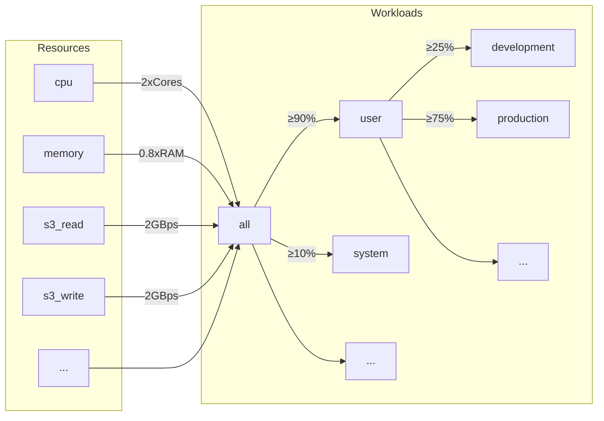
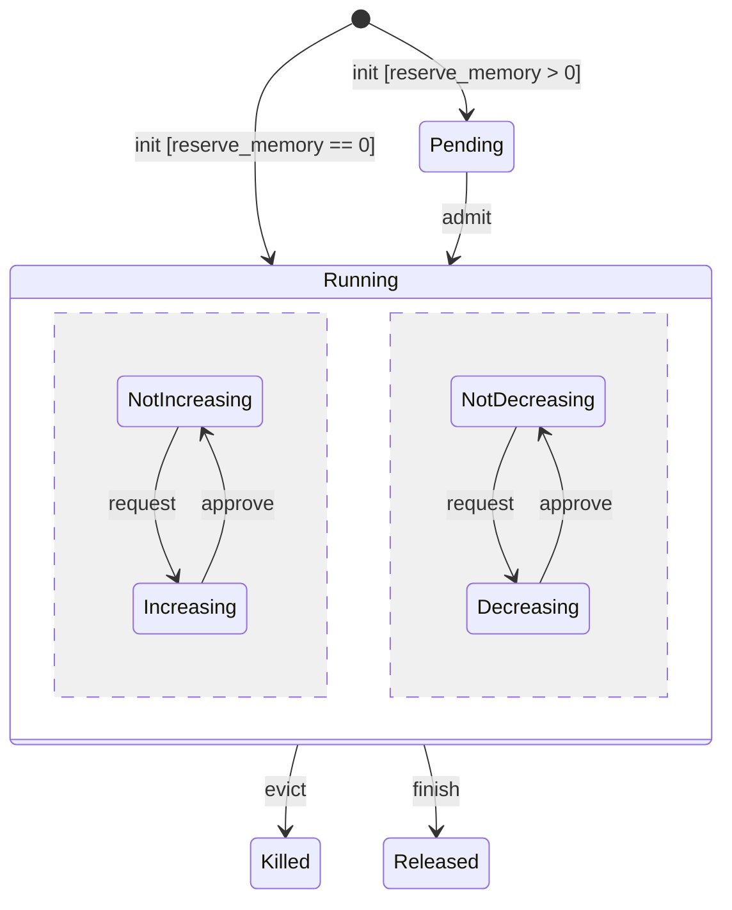
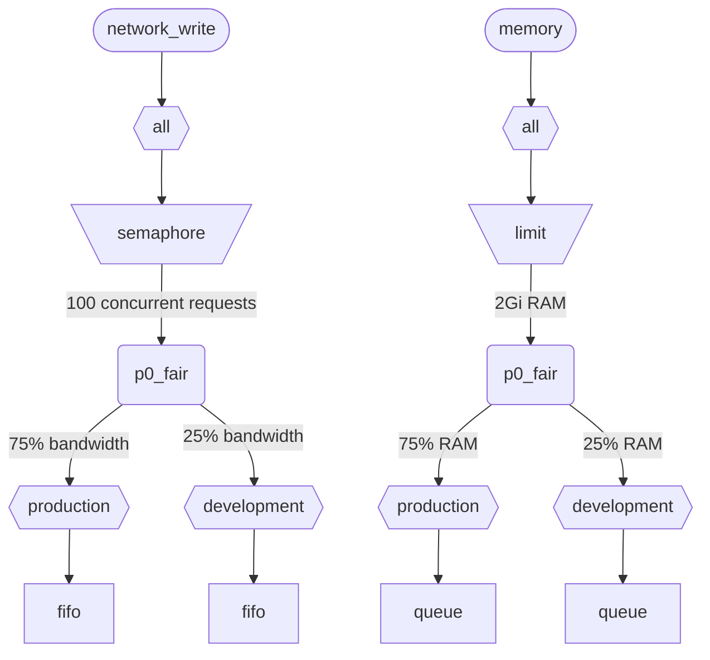

ClickHouse が複数のクエリを同時に実行すると、それらは共有リソース (CPU、メモリ、I/O) を使用します。リソースが異なるワークロード間でどのように利用・共有されるかを制御するために、スケジューリング制約やポリシーを適用できます。すべてのリソースに対して、共通のスケジューリング階層を設定できます。階層のルートは共有リソースを表し、リーフは特定のワークロードを表します。これらのリーフには、特定のクエリやバックグラウンド処理のリソースリクエストと割り当てが保持されます。

<div id="resources">
  ## リソース
</div>

デフォルトでは、ワークロードスケジューリングは無効になっています。これを有効にするには、スケジューリングに使用するリソースと、少なくとも 1 つのワークロードを作成する必要があります。すべてのリソースはそれぞれ独立しており、任意に組み合わせて使用できます。

CPU スケジューリングを有効にするには、MASTER スレッドまたは WORKER スレッド用の CPU リソースを作成する必要があります (詳細は [CPU スケジューリング](#cpu_scheduling) を参照してください) 。

```sql
CREATE RESOURCE cpu (MASTER THREAD, WORKER THREAD)
```

ワークロードでメモリ予約を有効にするには、MEMORY リソースを作成する必要があります (詳しくは[メモリ予約](#memory-reservations)を参照してください) :

```sql
CREATE RESOURCE memory (MEMORY RESERVATION)
```

クエリスロットスケジューリングを有効にするには、QUERY リソースを作成する必要があります (詳しくは[クエリスロットスケジューリング](#query_scheduling)を参照してください) ：

```sql
CREATE RESOURCE query (QUERY)
```

特定のディスクでI/Oスケジューリングを有効にするには、WRITE アクセス用と READ アクセス用の読み取りリソースおよび書き込みリソースを作成する必要があります。

```sql
CREATE RESOURCE resource_name (WRITE DISK disk_name, READ DISK disk_name)
-- or
CREATE RESOURCE read_resource_name (WRITE DISK write_disk_name)
CREATE RESOURCE write_resource_name (READ DISK read_disk_name)
```

1 つのリソースは、任意の数のディスクに対して、READ 専用、WRITE 専用、または READ/WRITE の両方に使用できます。すべてのディスクで 1 つのリソースを使用できる構文もあります:

```sql
CREATE RESOURCE all_io (READ ANY DISK, WRITE ANY DISK);
```

リソースは、共有モードによって分類されます。

* **時間共有リソース** (CPU、I/O、クエリスロット)  - スケジューリング階層のリーフでエンキューされるリソースリクエストを管理します。リクエストは、階層で定義されたポリシーと制約に従ってスケジュールされます。リソースリクエストは、クエリが対応するリソースにアクセスしたときに作成されます。たとえば、クエリがディスクからデータを読み取るときや、処理のために CPU を使用するときには、処理された作業量の各クォンタム、または socket を介して送受信されたバイト数ごとに、リソースリクエストが作成されます。
* **空間共有リソース** (メモリ)  - スケジューリング階層のリーフでリソース割り当てを管理します。割り当ては、実行中または保留中のいずれかになります。保留中の割り当ては、十分な空き容量が解放されるか、別の割り当てが追い出される (強制終了される) までブロックされます。判断は、階層で定義された制限とポリシーに基づいて行われます。割り当てとクエリ (またはバックグラウンド処理) は一対一に対応します。割り当てはクエリの実行開始時に作成され、終了時に解放されます。実行中の割り当ては、そのサイズを動的に増減できます。

<div id="workloads">
  ## ワークロード階層
</div>

ClickHouse では、スケジューリング階層を定義するための便利な SQL 構文が提供されています。すべてのリソースは、共通の WORKLOAD 階層全体で分配されます。分配ルールは特定のリソースに対して一部変更できますが、階層自体は共通です。各 WORKLOAD には、各リソースに必要なスケジューリングノードが用意されます。階層は、任意のワークロードの配下に子ワークロードを作成することで構築できます。ClickHouse は、ワークロード階層に特定の構造や事前定義された構造を強制しません。

以下は、すべてのリソースを &quot;user&quot; ワークロードと &quot;system&quot; ワークロードの間で、それぞれ 90% と 10% の保証付きで分割する階層の例です。ワークロードに定義された重みは max-min fairness に使用されるため、下限としてのベストエフォート保証を与えるだけであり、上限としての制限やクォータを意味するものではない点に注意してください。スケジューリングは各ホストで独立して行われるため、`max_*` 設定で定義された制限はホストごとに適用されます。&quot;user&quot; ワークロードは、そのリソースをさらに &quot;development&quot; ワークロードと &quot;production&quot; ワークロードに分割し、&quot;production&quot; には &quot;development&quot; の 3 倍のリソースが割り当てられます。

```sql
CREATE RESOURCE cpu (MASTER THREAD, WORKER THREAD)
CREATE RESOURCE memory (MEMORY RESERVATION)
CREATE RESOURCE s3_read (READ DISK s3)
CREATE RESOURCE s3_write (WRITE DISK s3)
CREATE WORKLOAD all SETTINGS max_concurrent_threads_ratio_to_cores = 2, max_memory_ratio = 0.8, max_bytes_per_second = '2Gi'
CREATE WORKLOAD user IN all SETTINGS weight = 9
CREATE WORKLOAD system IN all
CREATE WORKLOAD development IN user
CREATE WORKLOAD production IN user SETTINGS weight = 3
```



子を持たないリーフワークロードの名前は、クエリ設定 `SETTINGS workload = 'name'` で使用できます。詳細については、[ワークロードの指定](#workload-markup) を参照してください。

ワークロードをカスタマイズするには、次の設定を使用できます。

* `priority` -  (time-shared のみ) 兄弟ワークロードは静的な値に基づいて処理されます (値が小さいほど優先度が高くなります) 。プリエンプションに影響します。
* `precedence` -  (space-shared のみ) 兄弟ワークロードは静的な値に基づいて受け入れられます (値が小さいほど優先順位が高くなります) 。エビクションと受け入れに影響します。
* `weight` - 同じ静的 `priority` または `precedence` を持つ兄弟ワークロードは、`weight` に応じて公平にリソースを共有します。プリエンプション、エビクション、受け入れに影響します。
* `max_io_requests` - このワークロードにおける同時実行 I/O リクエスト数の上限。
* `max_bytes_inflight` - このワークロードにおける同時実行リクエストの進行中バイト総量の上限。
* `max_bytes_per_second` - このワークロードの読み取りまたは書き込みのバイトレート上限。
* `max_burst_bytes` - スロットリングされることなく、このワークロードが処理できる最大バイト数 (各リソースごとに独立) 。
* `max_concurrent_threads` - このワークロードのクエリに対するスレッド数の上限。
* `max_concurrent_threads_ratio_to_cores` - `max_concurrent_threads` と同じですが、利用可能な CPU コア数に対して正規化されます。
* `max_cpus` - このワークロードでクエリを処理するための CPU コア数の上限。
* `max_cpu_share` - `max_cpus` と同じですが、利用可能な CPU コア数に対して正規化されます。
* `max_burst_cpu_seconds` - `max_cpus` によってスロットリングされることなく、このワークロードが消費できる CPU 秒数の上限。
* `max_memory` - このワークロード用に予約される総メモリ量の上限。

ワークロード設定で指定したすべての上限は、リソースごとに独立しています。たとえば、`max_bytes_per_second = '10Mi'` を持つワークロードには、各読み取りリソースと書き込みリソースにそれぞれ独立した 10 MB/s の帯域幅制限が適用されます。読み取りと書き込みに共通の制限が必要な場合は、READ アクセスと WRITE アクセスに同じリソースを使用することを検討してください。

リソースごとに異なるワークロード階層を指定する方法はありません。ただし、特定のリソースに対して異なるワークロード設定値を指定する方法はあります。

```sql
CREATE OR REPLACE WORKLOAD all SETTINGS max_io_requests = 100, max_bytes_per_second = '1Mi' FOR network_read, max_bytes_per_second = '2Mi' FOR network_write
```

また、別のワークロードから参照されているワークロードやリソースは削除できません。ワークロードの定義を更新するには、`CREATE OR REPLACE WORKLOAD` クエリを使用します。

:::note
ワークロード設定は、適切なスケジューリングノードの集合に変換されます。より低いレベルの詳細については、スケジューリングノードの[型とオプション](#hierarchy)の説明を参照してください。
:::

<div id="workload-markup">
  ## ワークロードの指定
</div>

異なるワークロードを区別するために、クエリには設定 `workload` を指定できます。`workload` が設定されていない場合は、値 &quot;default&quot; が使用されます。settings profiles を使って別の値を指定することもできます。ユーザーからのすべてのクエリに `workload` 設定の固定値を付与したい場合は、設定の制約を使って `workload` を定数にできます。

:::warning
クエリ設定 `workload` が参照できるのは、リーフワークロード (つまり、子ワークロードを持たないワークロード) のみです。
:::

```sql
SELECT count() FROM my_table WHERE value = 42 SETTINGS workload = 'production'
SELECT count() FROM my_table WHERE value = 13 SETTINGS workload = 'development'
```

バックグラウンド処理には `workload` 設定を割り当てることができます。マージとミューテーションでは、それぞれ `merge_workload` および `mutation_workload` サーバー設定が使用されます。これらの値は、特定のテーブルでは `merge_workload` および `mutation_workload` の MergeTree 設定で上書きすることもできます。

<div id="cpu_scheduling">
  ## CPU スケジューリング
</div>

ワークロードの CPU スケジューリングを有効にするには、CPU リソースを作成し、同時実行するスレッド数の上限を設定します。

```sql
CREATE RESOURCE cpu (MASTER THREAD, WORKER THREAD)
CREATE WORKLOAD all SETTINGS max_concurrent_threads = 100
```

ClickHouse server が[複数スレッド](/ja/operations/settings/settings.md#max_threads)で多数の同時実行クエリを処理していて、すべての CPU slot が使用中になると、過負荷状態になります。過負荷状態では、解放された CPU slot はすべて、スケジューリングポリシーに従って適切な workload に再割り当てされます。同じ workload を共有するクエリには、slot がラウンドロビン方式で割り当てられます。別々の workload に属するクエリには、workload ごとに指定された weights、priorities、limits に基づいて slot が割り当てられます。

CPU 時間 は、スレッドがブロックされておらず、CPU 負荷の高い task を実行しているときに消費されます。スケジューリングのため、スレッドは次の 2 種類に区別されます。

* マスタースレッド — クエリや、merge や mutation などのバックグラウンド処理で、最初に動作を開始するスレッドです。
* ワーカースレッド — CPU 負荷の高い task を処理するために、master が追加で生成できるスレッドです。

応答性を高めるために、マスタースレッドとワーカースレッドで別々のリソースを使用することが望ましい場合があります。`max_threads` クエリ設定に大きな値を指定すると、多数のワーカースレッドが CPU resource を容易に占有してしまいます。すると、新たに到着したクエリは CPU slot が空くまで待機することになり、そのマスタースレッドが実行を開始できません。これを避けるには、次の設定を使用できます。

```sql
CREATE RESOURCE worker_cpu (WORKER THREAD)
CREATE RESOURCE master_cpu (MASTER THREAD)
CREATE WORKLOAD all SETTINGS max_concurrent_threads = 100 FOR worker_cpu, max_concurrent_threads = 1000 FOR master_cpu
```

これにより、マスタースレッドとワーカースレッドに個別の制限が設けられます。100 個の worker CPU slots がすべて使用中でも、利用可能な master CPU slots がある限り、新しいクエリはブロックされません。そうしたクエリは、まず 1 つの thread で実行を開始します。その後、worker CPU slots が利用可能になれば、クエリはスケールアップして worker threads を生成できます。一方、このようなアプローチでは、slots の総数は CPU processors の数に制限されないため、同時実行 threads が多すぎるとパフォーマンスに影響します。

マスタースレッドの Concurrency を制限しても、同時実行クエリの数は制限されません。CPU slots はクエリ実行の途中で解放され、他の threads が再取得できる場合があります。たとえば、concurrent master thread limit が 2 であっても、4 つの concurrent queries をすべて並列に実行できます。この場合、各クエリには 1 つの CPU processor の 50% が割り当てられます。同時実行クエリの数を制限するには別のロジックを使用する必要がありますが、現在 workloads ではサポートされていません。

workloads では、スレッドごとに個別の concurrency limits を使用できます:

```sql
CREATE RESOURCE cpu (MASTER THREAD, WORKER THREAD)
CREATE WORKLOAD all
CREATE WORKLOAD admin IN all SETTINGS max_concurrent_threads = 10
CREATE WORKLOAD production IN all SETTINGS max_concurrent_threads = 100
CREATE WORKLOAD analytics IN production SETTINGS max_concurrent_threads = 60, weight = 9
CREATE WORKLOAD ingestion IN production
```

この設定例では、admin 用と production 用に独立した CPU スロットプールを用意します。production プールは analytics とインジェストで共有されます。さらに、production プールが過負荷になると、解放されたスロットのうち 10 個中 9 個が、必要に応じて分析クエリ向けに再スケジュールされます。過負荷時には、インジェスト クエリが受け取れるスロットは 10 個中 1 個だけです。これにより、ユーザー向けクエリのレイテンシーが改善される可能性があります。analytics には 60 本の同時実行スレッドという独自の上限があり、インジェストを処理するために少なくとも 40 本のスレッドを常に確保します。過負荷でないときは、インジェストは 100 本すべてのスレッドを使用できます。

CPU スケジューリングの対象からクエリを外すには、クエリ設定 [use&#95;concurrency&#95;control](/ja/operations/settings/settings.md/#use_concurrency_control) を 0 に設定します。

CPU スケジューリングは、merges と mutations ではまだサポートされていません。

workload に対して公平な割り当てを実現するには、クエリ実行中にプリエンプションとスケールダウンを行う必要があります。プリエンプションは `cpu_slot_preemption` サーバー設定で有効にします。これを有効にすると、各スレッドは定期的に自身の CPU スロットを更新します (`cpu_slot_quantum_ns` サーバー設定に従います) 。CPU が過負荷の場合、この更新によって実行がブロックされることがあります。実行が長時間ブロックされると (`cpu_slot_preemption_timeout_ms` サーバー設定を参照) 、クエリはスケールダウンし、同時実行中のスレッド数が動的に減少します。CPU 時間 の公平性は workloads 間では保証されますが、同じ workload 内のクエリ間では、一部の特殊なケースで損なわれる可能性がある点に注意してください。

:::warning
スロットスケジューリングは [query concurrency](/ja/operations/settings/settings.md#max_threads) を制御する手段を提供しますが、サーバー設定 `cpu_slot_preemption` が `true` に設定されていない限り、公平な CPU 時間 の割り当ては保証されません。これが設定されていない場合、公平性は、競合する workloads 間での CPU スロット割り当て数に基づいて提供されます。これは CPU 秒数が等しくなることを意味しません。プリエンプションがないと CPU スロットが無期限に保持される可能性があるためです。スレッドは開始時にスロットを取得し、処理が完了すると解放します。
:::

:::note
CPU リソースを宣言すると、[`concurrent_threads_soft_limit_num`](server-configuration-parameters/settings.md#concurrent_threads_soft_limit_num) および [`concurrent_threads_soft_limit_ratio_to_cores`](server-configuration-parameters/settings.md#concurrent_threads_soft_limit_ratio_to_cores) 設定の効果は無効になります。代わりに、特定のワークロードに割り当てる CPU 数を制限するために、ワークロード設定 `max_concurrent_threads` が使用されます。従来の動作を実現するには、WORKER THREAD リソースのみを作成し、ワークロード `all` の `max_concurrent_threads` を `concurrent_threads_soft_limit_num` と同じ値に設定したうえで、クエリ設定 `workload = "all"` を使用してください。この構成は、[`concurrent_threads_scheduler`](server-configuration-parameters/settings.md#concurrent_threads_scheduler) 設定を `"fair_round_robin"` にした場合に相当します。
:::

<div id="threads_vs_cpus">
  ## スレッドと CPU
</div>

ワークロードの CPU 消費を制御する方法は 2 つあります。

* スレッド数の制限: `max_concurrent_threads` と `max_concurrent_threads_ratio_to_cores`
* CPU スロットリング: `max_cpus`、`max_cpu_share`、`max_burst_cpu_seconds`

:::warning
CPU スロットリング設定は、`cpu_slot_preemption` サーバー設定が有効な場合にのみ有効で、それ以外の場合は無視されます。
:::

1 つ目は、現在のサーバー負荷に応じて、クエリで生成されるスレッド数を動的に制御する方法です。実質的には、`max_threads` クエリ設定で定められる値を引き下げます。2 つ目は、トークンバケットアルゴリズムを使ってワークロードの CPU 消費をスロットリングする方法です。これはスレッド数そのものには直接影響しませんが、ワークロード内のすべてのスレッドによる CPU の総消費量をスロットリングします。

`max_cpus` と `max_burst_cpu_seconds` によるトークンバケットスロットリングは、次の意味になります。任意の `delta` 秒間において、ワークロード内のすべてのクエリによる CPU の総消費量は、`max_cpus * delta + max_burst_cpu_seconds` CPU 秒を超えることはできません。これにより、長期的な平均消費量は `max_cpus` に制限されますが、短期的にはこの制限を超える場合があります。たとえば、`max_burst_cpu_seconds = 60` かつ `max_cpus=0.001` の場合、スロットリングされることなく、1 スレッドを 60 秒、2 スレッドを 30 秒、または 60 スレッドを 1 秒実行できます。`max_burst_cpu_seconds` のデフォルト値は 1 秒です。値を小さくしすぎると、同時実行スレッドが多い場合に、許可された `max_cpus` 分の CPU コアを十分に使い切れない可能性があります。

CPU スロットを保持しているスレッドは、主に次の 3 つの状態のいずれかになります。

* **Running:** 実際に CPU リソースを消費している状態です。この状態で費やされた時間は、CPU スロットリングの対象として計上されます。
* **Ready:** CPU が使用可能になるのを待っている状態です。この状態で費やされた時間は、CPU スロットリングの対象として計上されません。
* **Blocked:** I/O 操作やその他のブロッキング syscall (例: mutex の待機) を実行している状態です。この状態で費やされた時間は、CPU スロットリングの対象として計上されません。

次に、CPU スロットリングとスレッド数制限を組み合わせた設定例を見てみましょう。

```sql
CREATE RESOURCE cpu (MASTER THREAD, WORKER THREAD)
CREATE WORKLOAD all SETTINGS max_concurrent_threads_ratio_to_cores = 2
CREATE WORKLOAD admin IN all SETTINGS max_concurrent_threads = 2, priority = -1
CREATE WORKLOAD production IN all SETTINGS weight = 4
CREATE WORKLOAD analytics IN production SETTINGS max_cpu_share = 0.7, weight = 3
CREATE WORKLOAD ingestion IN production
CREATE WORKLOAD development IN all SETTINGS max_cpu_share = 0.3
```

ここでは、すべてのクエリで使用できるスレッド総数を、利用可能な CPU 数の 2 倍に制限しています。Admin ワークロードは、利用可能な CPU 数にかかわらず、最大 2 スレッドまでに厳密に制限されます。Admin の優先度は -1 (default の 0 より低い) で、必要に応じて最初に CPU スロットを取得します。Admin がクエリを実行していないときは、CPU リソースは production ワークロードと Development ワークロードの間で分配されます。CPU 時間の保証シェアは weights (4:1) に基づき、production には少なくとも 80% (必要な場合) 、Development には少なくとも 20% (必要な場合) が割り当てられます。weights は保証を表す一方、CPU throttling は上限を定義します。production には制限がなく 100% まで使用できますが、Development には 30% の上限があり、これは他のワークロードからクエリがない場合でも適用されます。Production ワークロードは leaf ではないため、そのリソースは weights (3:1) に従って analytics とインジェストの間で分割されます。つまり、analytics には少なくとも 0.8 * 0.75 = 60% が保証され、さらに `max_cpu_share` に基づいて CPU リソース全体の 70% という上限があります。一方、インジェストには少なくとも 0.8 * 0.25 = 20% が保証され、上限はありません。

:::note
ClickHouse server の CPU 使用率を最大化したい場合は、ルートワークロード `all` に対して `max_cpus` や `max_cpu_share` を使用しないでください。代わりに、`max_concurrent_threads` により大きい値を設定してください。たとえば、8 CPU のシステムでは `max_concurrent_threads = 16` に設定します。これにより、8 本のスレッドが CPU タスクを実行している間、別の 8 本のスレッドで I/O 操作を処理できます。追加のスレッドによって CPU 負荷が発生し、scheduling ルールが確実に適用されるようになります。これに対して、`max_cpus = 8` を設定すると、server は利用可能な 8 CPU を超えて使用できないため、CPU 負荷は決して発生しません。
:::

<div id="memory-reservations">
  ## メモリ予約
</div>

:::note
メモリ予約のスケジューリングは実験的機能です。有効になるのは `MEMORY RESERVATION` リソースが存在する場合のみで、SQL の構文や動作は今後のリリースで変更される可能性があります。なお、現時点ではマージおよびミューテーションはサポートされておらず、実行中のクエリに対するエビクションはベストエフォートで行われます。つまり、即座に適用されるのではなく、クエリの次回のメモリ同期ポイントで反映されます。
:::

ワークロードでメモリ予約を有効にするには、MEMORY RESERVATION リソースを作成し、ワークロード設定を使用して予約される合計メモリに対して少なくとも 1 つの制限を設定します。

```sql
CREATE RESOURCE memory (MEMORY RESERVATION)
CREATE WORKLOAD all SETTINGS max_memory = '2Gi'
```

ClickHouse は、すべてのクエリとバックグラウンド処理のメモリ割り当てを追跡します。割り当てられたバイト数は、スケジューリング階層を通じてルートまで集計されます。各クエリには、それが属するリーフワークロード内に対応する割り当てがあります。クエリの `reserve_memory` 設定が 0 より大きい場合、その割り当ては pending 状態で作成されます。pending の割り当ては、ワークロード階層内で要求された量のメモリを予約します。利用可能なメモリが不足している場合、その割り当ては、十分なメモリが解放されるか、ほかの割り当てが追い出される (killed) まで pending のままです。割り当てが受け入れられると、running になります。running の割り当ては、クエリのメモリ消費量に応じてサイズを動的に増減できます。割り当てのライフサイクルは、次の状態図で表せます。



リーフワークロードの保留中の割り当ては、FIFO 順で受け入れられます。複数のワークロードに保留中の割り当てがある場合は、precedence と weight の設定に従って受け入れられます。precedence が高いワークロードほど先に処理されます。同じ precedence の兄弟ワークロードは、max-min fair 方式で weight に応じてメモリを共有します。つまり、正規化メモリ使用量 (現在の使用量に要求中の増加分を加え、それを weight で割った値) が低いワークロードほど先に処理されます。エビクション時には逆のロジックが適用されます。メモリを解放する必要がある場合は、precedence が低く、正規化メモリ使用量が高いワークロードから先に追い出されます。

time-shared リソースは priority を使用し、space-shared リソースは precedence を使用する点に注意してください。これらは互いに独立した設定であり、異なる値を設定できます。priority が高い場合は非破壊的なプリエンプション (遅延またはスロットリング) を意味し、precedence が高い場合は破壊的なエビクション (エラーで停止) を意味することがあります。たとえば、あるワークロードで CPU scheduling には高い priority を設定しつつ、メモリ予約には他のワークロードと同じ precedence を設定して、他のワークロードを追い出してそれまでの作業を失わせないようにできます。

`max_memory` 制限を持つすべてのワークロードでは、そのサブツリー内で割り当てられるメモリの総量がその制限を超えないことが保証されます。保留中または増加中の割り当てによってその制限を超える場合は、メモリを解放するためにエビクション手順が開始されます。エビクション手順では、終了させる対象が選択されます。キラーと対象の最小共通祖先ワークロードは、次の状況ではエビクションを防ぎます。

* 保留中の割り当ては、同じワークロード内の実行中の割り当てを追い出せません。 (キラーと対象のワークロードが一致するため) 。
* precedence が低い保留中の割り当てが、precedence が高いワークロードを終了させることはありません。
* 保留中の割り当ては、同じ precedence の割り当てを終了させることはできません。同じ precedence の実行中の割り当て同士は、正規化メモリ使用量に基づいて互いを追い出す場合がある点に注意してください。
  エビクションが防がれる場合、または十分なメモリを解放できない場合、新しい割り当ては十分なメモリが解放されるまでブロックされます。これらのルールにより、メモリ逼迫時に過剰なクエリをキューイングできるようになり、MEMORY&#95;LIMIT&#95;EXCEEDED エラーを回避するための便利な手段になります。

:::note
ワークロード制限は、[max&#95;memory&#95;usage](/ja/operations/settings/settings.md#max_memory_usage) クエリ設定のような、メモリ使用量を制限する他の方法とは独立しています。これらを併用することで、メモリ使用量をより適切に制御できます。ワークロードではなくユーザーごとに独立したメモリ制限を設定することも可能です。ただし、この方法は柔軟性に劣り、メモリ予約や保留中クエリのキューイングのような機能は提供しません。[Memory overcommit](settings/memory-overcommit.md) を参照してください。
:::

ワークロード設定 `max_waiting_queries` は、そのワークロードで保留できる割り当て数を制限します。制限に達すると、サーバーは `SERVER_OVERLOADED` エラーを返します。`max_waiting_queries` は子ワークロードには継承されず、リーフワークロードでのみ意味を持つ点に注意してください。

メモリ予約スケジューリングは、マージとミューテーションではまだサポートされていません。

`reserve_memory` 設定が 0 より大きいクエリのみが、メモリ予約を待つ間にブロックされる対象になります。ただし、`reserve_memory` が 0 のクエリもワークロードのメモリフットプリントには計上され、他の保留中または増加中の割り当てのためにメモリを解放する必要がある場合は、追い出されることがあります。適切なワークロードの指定がないクエリは、メモリ予約のスケジューリング対象にならず、スケジューラによって追い出されることもありません。

クエリに対して非弾性的なメモリ予約を行うには、`reserve_memory` と `max_memory_usage` の両方のクエリ設定を同じ値に設定します。この場合、クエリは固定量のメモリを予約し、割り当てを動的に増やすことはできません。なお、弾性的なメモリ予約は、メモリ逼迫がない限り、停止されることなく `reserve_memory` を超えて `max_memory_usage` まで増やせます。ただし、実際の消費量がそれより少ない場合でも、`reserve_memory` 未満に減らすことはできません。

設定例を見てみましょう。

```sql
CREATE RESOURCE memory (MEMORY RESERVATION)
CREATE WORKLOAD all SETTINGS max_memory = '10Gi'
CREATE WORKLOAD system IN all SETTINGS weight = 1
CREATE WORKLOAD user IN all SETTINGS weight = 9
CREATE WORKLOAD production IN user SETTINGS precedence = 1, weight = 3
CREATE WORKLOAD staging IN user SETTINGS precedence = 1, weight = 1
CREATE WORKLOAD testing IN user SETTINGS precedence = 2
```

この例では、すべてのクエリとバックグラウンド処理で確保されるメモリの合計は 10 GiB を超えられません。system ワークロードには少なくとも 1 GiB (10 GiB の 10%) が保証され、user ワークロードには少なくとも 9 GiB (10 GiB の 90%) が保証されます。user ワークロード内では、production ワークロードと staging ワークロードが、同じ優先順位 1 のもとで、重み (3 対 1) に従ってメモリを共有します。testing ワークロードの優先順位は 2 で、production や staging より低くなっています。したがって、testing ワークロードが使用できるのは、production と staging で使われていないメモリだけです。

メモリ逼迫が発生すると、まず testing ワークロードの割り当てが追い出されます。さらにメモリを解放する必要がある場合は、staging ワークロードと production ワークロードがそれぞれの保証量を超えているとき、production ワークロードの割り当てより先に staging ワークロードの割り当てが追い出されます。production と staging の保留中のクエリは、メモリを解放するために testing ワークロードで実行中の割り当てを追い出すことはできますが、互いに同じ優先順位であるため、相手を追い出すことはできない点に注意してください。メモリ逼迫時には、それらはキューで待機します。これにより、同時実行されるクエリが多すぎることによる MEMORY&#95;LIMIT&#95;EXCEEDED エラーをシステムが回避できます。

また、system ワークロードの優先順位は 0 (デフォルト) で、production、staging、testing の各ワークロードより高い点にも注意してください。ただし、これらは兄弟ワークロードではありません。最小共通祖先は workload all であり、その 2 つの子はいずれも同じ優先順位を持ちます。そのため、保留中の system ワークロードはそれらのいずれも追い出せず、逆も同様です。これにより、system の処理が簡単には追い出されないようになっています。

<div id="query_scheduling">
  ## クエリスロットスケジューリング
</div>

ワークロードでクエリスロットスケジューリングを有効にするには、QUERY リソースを作成し、同時実行クエリ数または 1 秒あたりのクエリ数の上限を設定します。

```sql
CREATE RESOURCE query (QUERY)
CREATE WORKLOAD all SETTINGS max_concurrent_queries = 100, max_queries_per_second = 10, max_burst_queries = 20
```

ワークロード設定 `max_concurrent_queries` は、特定のワークロードで同時に実行できるクエリ数を制限します。これは、クエリ設定 [`max_concurrent_queries_for_all_users`](/ja/operations/settings/settings#max_concurrent_queries_for_all_users) およびサーバー設定 [max&#95;concurrent&#95;queries](/ja/operations/server-configuration-parameters/settings#max_concurrent_queries) に相当します。非同期 INSERT クエリと、KILL のような一部の特定のクエリは、この制限の対象には含まれません。

ワークロード設定 `max_queries_per_second` と `max_burst_queries` は、トークンバケットスロットラーを使用して、そのワークロードのクエリ数を制限します。これにより、任意の時間間隔 `T` において、実行を開始する新規クエリ数が `max_queries_per_second * T + max_burst_queries` を超えないことが保証されます。

ワークロード設定 `max_waiting_queries` は、そのワークロードの待機中クエリ数を制限します。上限に達すると、サーバーはエラー `SERVER_OVERLOADED` を返します。`max_waiting_queries` は子ワークロードには継承されず、リーフワークロードでのみ意味を持つ点に注意してください。

:::note
ブロックされたクエリは、すべての制約が満たされるまで無期限に待機し、`SHOW PROCESSLIST` には表示されません。
:::

<div id="workload_entity_storage">
  ## ワークロード と リソース の保存
</div>

すべての ワークロード と リソース の定義は、`CREATE WORKLOAD` および `CREATE RESOURCE` クエリの形で、`workload_path` のディスク、または `workload_zookeeper_path` の ZooKeeper に永続的に保存されます。ノード間の一貫性を確保するには、ZooKeeper への保存を推奨します。あるいは、ディスクストレージとあわせて `ON CLUSTER` 句を使用することもできます。

<div id="config_based_workloads">
  ## 設定ベースのワークロードとリソース
</div>

SQL ベースの定義に加えて、ワークロードとリソースはサーバー設定ファイルであらかじめ定義しておくこともできます。これは、インフラストラクチャによって定められる制限と、顧客が変更できる制限が混在するクラウド環境で特に有用です。設定ベースのエンティティは SQL で定義されたものより優先され、SQL コマンドで変更または削除することはできません。

<div id="config_based_workloads_format">
  ### 設定フォーマット
</div>

```xml
<clickhouse>
    <resources_and_workloads>
        CREATE RESOURCE memory (MEMORY RESERVATION);
        CREATE RESOURCE s3disk_read (READ DISK s3);
        CREATE RESOURCE s3disk_write (WRITE DISK s3);
        CREATE WORKLOAD all SETTINGS max_memory = '2Gi', max_io_requests = 500 FOR s3disk_read, max_io_requests = 1000 FOR s3disk_write, max_bytes_per_second = '1280Mi' FOR s3disk_read, max_bytes_per_second = '3200Mi' FOR s3disk_write;
        CREATE WORKLOAD production IN all SETTINGS weight = 3;
    </resources_and_workloads>
</clickhouse>
```

この設定では、`CREATE WORKLOAD` および `CREATE RESOURCE` 文と同じ SQL 構文を使用します。すべてのクエリは有効である必要があります。

<div id="config_based_workloads_usage_recommendations">
  ### 利用時の推奨事項
</div>

Cloud 環境では、一般的な構成として次のようなものが考えられます。

1. ルートワークロードとネットワーク I/O リソースを構成で定義し、インフラストラクチャの制限を設定する
2. `throw_on_unknown_workload` を設定して、これらの制限を強制する
3. `CREATE WORKLOAD default IN all` を作成し、すべてのクエリに制限を自動的に適用する (`workload` クエリ設定のデフォルト値は &#39;default&#39; であるため)
4. 設定された階層内で、ユーザーが追加のワークロードを作成できるようにする

これにより、すべてのバックグラウンド処理とクエリがインフラストラクチャの制限を遵守しつつ、ユーザー固有のスケジューリングポリシーに対する柔軟性も維持できます。

もう 1 つのユースケースとして、異種混在クラスター内の各ノードに異なる構成を適用する方法もあります。

<div id="strict_resource_access">
  ## 厳格なリソースアクセス
</div>

すべてのクエリにリソーススケジューリングポリシーを確実に適用するために、`throw_on_unknown_workload` というサーバー設定があります。これを `true` に設定すると、すべてのクエリで有効な `workload` クエリ設定の指定が必須になり、指定されていない場合は `RESOURCE_ACCESS_DENIED` 例外が発生します。これを `false` に設定すると、そのようなクエリはリソーススケジューラを使用せず、つまり任意の `RESOURCE` に無制限にアクセスできます。クエリ設定 `use_concurrency_control = 0` を指定すると、クエリは CPU スケジューラを回避し、CPU に無制限にアクセスできます。CPU スケジューリングを強制するには、`use_concurrency_control` を読み取り専用の定数値として固定する設定制約を作成してください。

:::note
`CREATE WORKLOAD default` を実行していない限り、`throw_on_unknown_workload` を `true` に設定しないでください。起動中に `workload` が明示的に設定されていないクエリが実行されると、サーバー起動時の問題につながる可能性があります。
:::

<div id="hierarchy">
  ### スケジューリングノードの階層
</div>

スケジューリングサブシステムの観点では、各リソースはスケジューリングノードの階層として表されます。ClickHouse は、WORKLOAD と RESOURCE の定義に基づいて、必要なスケジューリングノードをすべて自動的に作成します。スケジューリングノードは低レベルの実装の詳細であり、[system.scheduler](/ja/operations/system-tables/scheduler.md)テーブルを通じて参照できます。

```sql
CREATE RESOURCE network_write (WRITE DISK s3)
CREATE RESOURCE memory (MEMORY RESERVATION)
CREATE WORKLOAD all SETTINGS max_io_requests = 100, max_memory = '2Gi'
CREATE WORKLOAD development IN all
CREATE WORKLOAD production IN all SETTINGS weight = 3
```



**時間共有ノードの種類:**

* `inflight_limit` (constraint) - 処理中のインフライト `リクエスト` の数が `max_requests` を超えるか、それらの合計コストが `max_cost` を超えるとブロックします。子は 1 つだけである必要があります。
* `bandwidth_limit` (constraint) - 現在の帯域幅が `max_speed` を超える場合 (0 は無制限) 、またはバーストが `max_burst` を超える場合 (デフォルトでは `max_speed` と同じ) にブロックします。子は 1 つだけである必要があります。
* `fair` (policy) - max-min fairness に従って、子ノードのいずれかから次に処理する `リクエスト` を選択します。子ノードでは `weight` を指定できます (デフォルトは 1) 。
* `priority` (policy) - 静的な優先度に従って、子ノードのいずれかから次に処理する `リクエスト` を選択します (値が小さいほど優先度が高くなります) 。子ノードでは `priority` を指定する必要があります (デフォルトは 0) 。
* `fifo` (queue) - リソース容量を超えた `リクエスト` を保持できる階層のリーフです。

**空間共有ノードの種類:**

* `limit` - 子の割り当ての合計が上限を超えないようにし、必要に応じてサブツリーでエビクション手順を開始します。子は 1 つだけである必要があります。
* `fair_allocation` - max-min fairness に従ってエビクションを行います。保留中の割り当てが実行中の割り当てをエビクションすることはありません。子ノードでは `weight` を指定できます (デフォルトは 1) 。
* `precedence_allocation` - 静的な優先順位に従ってエビクションを行います (値が小さいほど優先順位が高くなります) 。優先順位の高い保留中の割り当ては、優先順位の低い割り当てをエビクションします。子ノードでは `precedence` を指定する必要があります (デフォルトは 0) 。
* `queue` - 実行中および保留中の割り当てを保持できる階層のリーフです。

<div id="deprecated-configuration">
  ## 非推奨のXML構成
</div>

リソースがどのディスクを使用するかを表現する別の方法として、server の `storage_configuration` があります。

特定のディスクに対して I/Oスケジューリングを有効にするには、ストレージ構成で `read_resource` および/または `write_resource` を指定する必要があります。これにより、指定したディスクに対する各読み取りリクエストおよび書き込みリクエストで、どのリソースを使用すべきかを ClickHouse に伝えます。読み取りリソースと書き込みリソースは同じリソース名を参照でき、これはローカルSSD や HDD の場合に便利です。複数の異なるディスクが同じリソースを参照することもでき、これはリモートディスクの場合に便利です。たとえば、&quot;production&quot; ワークロードと &quot;development&quot; ワークロードの間でネットワーク帯域幅を公平に分割できるようにしたい場合です。

例:

```xml
<clickhouse>
    <storage_configuration>
        ...
        <disks>
            <s3>
                <type>s3</type>
                <endpoint>https://clickhouse-public-datasets.s3.amazonaws.com/my-bucket/root-path/</endpoint>
                <access_key_id>your_access_key_id</access_key_id>
                <secret_access_key>your_secret_access_key</secret_access_key>
                <read_resource>network_read</read_resource>
                <write_resource>network_write</write_resource>
            </s3>
        </disks>
        <policies>
            <s3_main>
                <volumes>
                    <main>
                        <disk>s3</disk>
                    </main>
                </volumes>
            </s3_main>
        </policies>
    </storage_configuration>
</clickhouse>
```

サーバー設定オプションは、SQL でリソースを定義する方法よりも優先されることに注意してください。

次の例では、上の図に示した I/O スケジューリングの階層を定義する方法を示します。

```xml
<clickhouse>
    <resources>
        <network_read>
            <node path="/">
                <type>inflight_limit</type>
                <max_requests>100</max_requests>
            </node>
            <node path="/fair">
                <type>fair</type>
            </node>
            <node path="/fair/prod">
                <type>fifo</type>
                <weight>3</weight>
            </node>
            <node path="/fair/dev">
                <type>fifo</type>
            </node>
        </network_read>
        <network_write>
            <node path="/">
                <type>inflight_limit</type>
                <max_requests>100</max_requests>
            </node>
            <node path="/fair">
                <type>fair</type>
            </node>
            <node path="/fair/prod">
                <type>fifo</type>
                <weight>3</weight>
            </node>
            <node path="/fair/dev">
                <type>fifo</type>
            </node>
        </network_write>
    </resources>
</clickhouse>
```

基盤となるリソースの能力を最大限に引き出すには、`inflight_limit` を使用してください。`max_requests` や `max_cost` の値が小さすぎると、リソースを十分に活用できない可能性があります。逆に、大きすぎるとスケジューラ内部のキューが空になり、その結果、サブツリー内でポリシーが無視されることがあります (不公平が生じたり、優先順位が無視されたりします) 。一方、リソースを過度な使用から保護したい場合は、`bandwidth_limit` を使用してください。これは、`duration` 秒間に消費されたリソース量が `max_burst + max_speed * duration` バイトを超えると、スロットリングを行います。同じリソース上に 2 つの `bandwidth_limit` ノードを配置することで、短い時間帯でのピーク帯域幅と、より長い時間帯での平均帯域幅を制限できます。

<div id="workload-classifiers">
  ### 非推奨のワークロード分類器
</div>

ワークロード分類器は、クエリで指定された `workload` を、特定のリソースに対して使用するリーフキューに対応付けるために使用されます。現時点で、ワークロード分類はシンプルで、利用できるのは静的な対応付けのみです。

例:

```xml
<clickhouse>
    <workload_classifiers>
        <production>
            <network_read>/fair/prod</network_read>
            <network_write>/fair/prod</network_write>
        </production>
        <development>
            <network_read>/fair/dev</network_read>
            <network_write>/fair/dev</network_write>
        </development>
        <default>
            <network_read>/fair/dev</network_read>
            <network_write>/fair/dev</network_write>
        </default>
    </workload_classifiers>
</clickhouse>
```

<div id="see-also">
  ## 関連項目
</div>

* [system.scheduler](/ja/operations/system-tables/scheduler.md)
* [system.workloads](/ja/operations/system-tables/workloads.md)
* [system.resources](/ja/operations/system-tables/resources.md)
* [merge&#95;workload](/ja/operations/settings/merge-tree-settings.md#merge_workload) MergeTree 設定
* [merge&#95;workload](/ja/operations/server-configuration-parameters/settings.md#merge_workload) グローバルサーバー設定
* [mutation&#95;workload](/ja/operations/settings/merge-tree-settings.md#mutation_workload) MergeTree 設定
* [mutation&#95;workload](/ja/operations/server-configuration-parameters/settings.md#mutation_workload) グローバルサーバー設定
* [workload&#95;path](/ja/operations/server-configuration-parameters/settings.md#workload_path) グローバルサーバー設定
* [workload&#95;zookeeper&#95;path](/ja/operations/server-configuration-parameters/settings.md#workload_zookeeper_path) グローバルサーバー設定
* [cpu&#95;slot&#95;preemption](/ja/operations/server-configuration-parameters/settings.md#cpu_slot_preemption) グローバルサーバー設定
* [cpu&#95;slot&#95;quantum&#95;ns](/ja/operations/server-configuration-parameters/settings.md#cpu_slot_quantum_ns) グローバルサーバー設定
* [cpu&#95;slot&#95;preemption&#95;timeout&#95;ms](/ja/operations/server-configuration-parameters/settings.md#cpu_slot_preemption_timeout_ms) グローバルサーバー設定