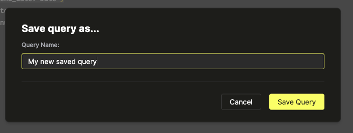
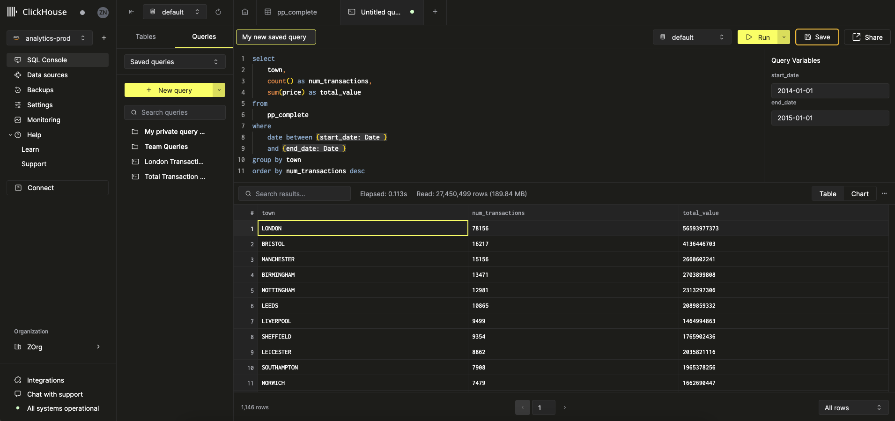
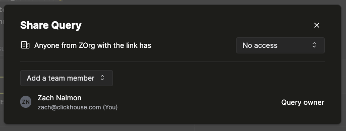
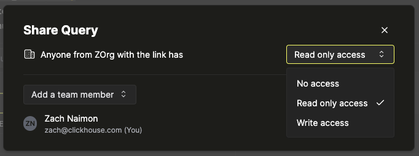
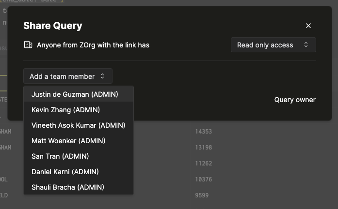
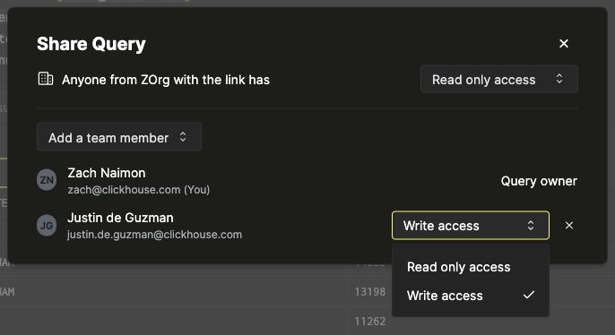
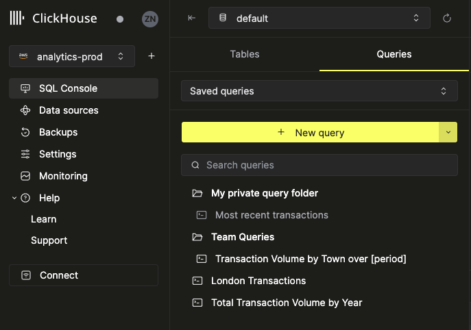

# SQLコンソール

SQLコンソールは、ClickHouse Cloudでデータベースを探索しクエリを実行するための最速かつ最も簡単な方法です。SQLコンソールを使用して以下のことが可能です：
- ClickHouse Cloudサービスに接続
- テーブルデータの表示、フィルタリング、並べ替え
- クエリを実行し、数クリックで結果データを可視化
- チームメンバーとクエリを共有し、より効果的にコラボレーション

## コントロールプレーンからSQLコンソールを開く

SQLコンソールはサービス概要画面から直接開くことができます。「接続」ボタンをクリックし、「SQLコンソールを開く」を選択します。

  

SQLコンソールは新しいタブで開き、サービス認証情報の入力を求められます：

  

認証情報を入力後、「接続」をクリックすると、SQLコンソールが接続と認証を試みます。成功すると、SQLコンソールのインターフェースが表示されます：

  

## 直接SQLコンソールを読み込む

SQLコンソールは https://console.clickhouse.cloud から直接開くこともできます。ClickHouse Cloudアカウントにログインすると、サービス一覧が表示されます。1つ選択し、サービス認証画面でサービス認証情報を入力します：

  

:::note
組織内に1つのサービスしか存在しない場合、SQLコンソールは直ちにサービス認証画面へ移動します。
:::

## サービススイッチャーを使用する

SQLコンソールから直接他のサービスに簡単に切り替えることができます。コンソールの右上隅にあるサービススイッチャーを開き、別のサービスを選択します：

  

### テーブルを探索する

### テーブルリストとスキーマ情報の表示

ClickHouseインスタンスに含まれるテーブルの概要は左のサイドバーにあります。左バーの上部にあるデータベースセレクターを使用して、特定のデータベース内のテーブルを表示します

  

リストのテーブルは展開してカラムとタイプを表示することもできます

  

### テーブルデータを探索する

リストのテーブルをクリックすると、新しいタブで開きます。テーブルビューでは、データを簡単に表示、選択、コピーできます。Microsoft ExcelやGoogle Sheetsなどのスプレッドシートアプリケーションにコピー貼り付けする際に、構造やフォーマットが保持されます。フッターのナビゲーションを使用して、テーブルデータのページを（30行ごとのページネーションで）切り替えることができます。

  

### セルデータの検査

セルインスペクターツールを使用して、単一のセルに含まれる大量のデータを表示できます。セルを右クリックし、「セルを検査」を選択して開きます。インスペクターの内容は、右上隅のコピーアイコンをクリックしてコピーできます。

  

## テーブルのフィルタリングと並べ替え

### テーブルの並べ替え

SQLコンソールでテーブルを並べ替えるには、テーブルを開いてツールバーの「並べ替え」ボタンを選択します。このボタンは、並べ替えを設定するためのメニューを開きます。どのカラムで並べ替えるかを選択し、並べ替えの順序（昇順または降順）を設定できます。「適用」を選択するか、Enterキーを押してテーブルを並べ替えます。

  

SQLコンソールでは、複数の並べ替えをテーブルに追加することもできます。「並べ替え」ボタンを再度クリックして、別の並べ替えを追加します。注意：並べ替えは、並べ替えペインで表示される順序（上から下）で適用されます。並べ替えを削除するには、並べ替えの隣にある「x」ボタンをクリックします。

### テーブルのフィルタリング

SQLコンソールでテーブルをフィルタリングするには、テーブルを開いて「フィルター」ボタンを選択します。並べ替えと同様に、このボタンはフィルターを設定するためのメニューを開きます。どのカラムでフィルタリングするかを選択し、必要な条件を設定します。SQLコンソールは、カラムに含まれるデータのタイプに対応するフィルターオプションをインテリジェントに表示します。

  

フィルターに満足したら、「適用」を選択してデータをフィルタリングします。以下のように追加のフィルターも追加できます。

  

並べ替え機能と同様に、フィルターの隣にある「x」ボタンをクリックして、フィルターを削除します。

### フィルタリングと並べ替えを同時に行う

SQLコンソールでは、テーブルをフィルタリングと並べ替えを同時に行うことができます。上記の手順を使用して、すべての必要なフィルターと並べ替えを追加し、「適用」ボタンをクリックします。

  

### フィルターと並べ替えからクエリを作成する

SQLコンソールは、並べ替えとフィルターをクリック1つで直接クエリに変換することができます。ツールバーから並べ替えとフィルターパラメータを選んで「クエリを作成」ボタンを選択します。「クエリを作成」をクリックすると、新しいクエリタブが開き、テーブルビューに含まれるデータに対応するSQLコマンドが事前入力されます。

  

:::note
「クエリを作成」機能を使用する際に、フィルターと並べ替えは必須ではありません。
:::

クエリの詳細については、(link) クエリドキュメンテーションを参照してください。

## クエリの作成と実行

### クエリの作成

SQLコンソールで新しいクエリを作成する方法は2つあります。
* タブバーの「+」ボタンをクリックする
* 左サイドバーのクエリリストから「新しいクエリ」ボタンを選択する

  

### クエリの実行

クエリを実行するには、SQLエディタにSQLコマンドを入力して「実行」ボタンをクリックするか、ショートカット `cmd / ctrl + enter` を使用します。複数のコマンドを順次書き、実行するには、各コマンドの後にセミコロンを追加する必要があります。

クエリ実行オプション
デフォルトでは、「実行」ボタンをクリックするとSQLエディタに含まれるすべてのコマンドが実行されます。SQLコンソールは他に2つのクエリ実行オプションをサポートしています：
* 選択したコマンドを実行
* カーソル位置のコマンドを実行

選択したコマンドを実行するには、目的のコマンドまたはコマンドシーケンスをハイライトし、「実行」ボタンをクリックする（または `cmd / ctrl + enter` ショートカットを使用する）。選択が存在する場合、SQLエディタのコンテキストメニュー（エディタ内の任意の場所を右クリックして開く）から「選択したものを実行」を選択することもできます。

  

現在のカーソル位置のコマンドを実行するには、以下の2つの方法があります：
* 拡張実行オプションメニューから「カーソルで」を選択する（または対応する `cmd / ctrl + shift + enter` キーボードショートカットを使用する

  

   * SQLエディタのコンテキストメニューから「カーソルで実行」を選択する

  

:::note
カーソル位置にあるコマンドは、実行時に黄色で点滅します。
:::

### クエリのキャンセル

クエリを実行中に、クエリエディタのツールバーの「実行」ボタンが「キャンセル」ボタンに置き換わります。このボタンをクリックするか、`Esc` を押してクエリをキャンセルします。注意：キャンセル後もすでに返された結果は保持されます。

  

### クエリの保存

クエリを保存することで、後から簡単に見つけたり、チームメンバーと共有したりすることができます。SQLコンソールではクエリをフォルダに整理することもできます。

クエリを保存するには、ツールバーの「実行」ボタンの右にある「保存」ボタンをクリックし、目的の名前を入力して「クエリを保存」をクリックします。

:::note
ショートカット `cmd / ctrl + s` を使用することでも、現在のクエリタブでの作業は保存されます。
:::



また、「無題のクエリ」をクリックして名前を設定し、Enterキーを押すことで、クエリの同時命名と保存を行うこともできます：



### クエリの共有

SQLコンソールは、クエリをチームメンバーと簡単に共有することができます。SQLコンソールは4つのアクセスレベルをサポートしており、これらはグローバルにも個別のユーザーごとにも調整可能です：

- 所有者（共有オプションを調整可能）
- 書き込みアクセス
- 読み取り専用アクセス
- アクセスなし

クエリを保存した後、ツールバーの「共有」ボタンをクリックします。共有オプションが表示されるモーダルが表示されます：



サービスにアクセス可能なすべての組織メンバーのクエリアクセスを調整するには、トップラインのアクセスレベルセレクタを調整します：



上記を適用すると、SQLコンソールへのアクセスを持つすべてのチームメンバーはクエリを表示（および実行）できるようになります。

特定のメンバーのクエリアクセスを調整するには、「チームメンバーを追加」セレクターから目的のチームメンバーを選択します：



チームメンバーを選択すると、アクセスレベルセレクターが表示された新しいラインアイテムが出現します：



### 共有されたクエリにアクセスする

クエリが共有された場合、それはSQLコンソール左サイドバーの「クエリ」タブに表示されます：



### クエリへのリンク（パーマリンク）

保存されたクエリはパーマリンクされており、共有されたクエリへのリンクを送信および受信し、直接開くことができます。

クエリにある可能性がある任意のパラメーターの値は、保存されたクエリURLにクエリパラメータとして自動的に追加されます。たとえば、クエリに `{start_date: Date}` と `{end_date: Date}` パラメーターが含まれる場合、パーマリンクは次のようになります：`https://console.clickhouse.cloud/services/:serviceId/console/query/:queryId?param_start_date=2015-01-01&param_end_date=2016-01-01`。

## 高度なクエリ機能

### クエリ結果を検索する

クエリが実行された後、結果ペインの検索入力を使用して返された結果セットを素早く検索できます。この機能は、追加の `WHERE` 句の結果をプレビューしたり、特定のデータが結果セットに含まれていることを確認したりするのに役立ちます。検索入力に値を入力した後、結果ペインが更新され、入力した値に一致するエントリを含むレコードが返されます。この例では、ClickHouseリポジトリの `github_events` テーブルで `alexey-milovidov` のすべてのインスタンスを探します：

  

注意：入力した値に一致するフィールドはすべて返されます。たとえば、上記のスクリーンショットの3番目のレコードは、`actor_login` フィールドで「alexey-milovidov」と一致しませんが、`body` フィールドで一致します：

  

### ページネーション設定の調整

デフォルトでは、クエリ結果ペインはすべての結果レコードを単一のページに表示します。より大きな結果セットのためには、結果をページネーションで表示する方が見やすい場合があります。これは、結果ペインの右下隅にあるページネーションセレクターを使用することで可能です：
  

ページサイズを選択すると、すぐに結果セットにページネーションが適用され、ナビゲーションオプションが結果ペインフッターの中央に表示されます。

  

### クエリ結果データのエクスポート

クエリ結果セットは、SQLコンソールから直接CSV形式で簡単にエクスポートできます。そのためには、結果ペインツールバーの右側にある `•••` メニューを開き、「CSVとしてダウンロード」を選択します。

  

## クエリデータのビジュアライゼーション

データは、チャート形式で表示するとより容易に解釈できることがあります。SQLコンソールからクエリ結果データを使用してビジュアライゼーションを数クリックで迅速に作成できます。例として、NYCタクシーの週ごとの統計を計算するクエリを使用します：

```sql
select
   toStartOfWeek(pickup_datetime) as week,
   sum(total_amount) as fare_total,
   sum(trip_distance) as distance_total,
   count(*) as trip_total
from
   nyc_taxi
group by
   1
order by
   1 asc
```

  

ビジュアライゼーションがないと、これらの結果は解釈が難しいです。それらをチャートに変換しましょう。

### チャートの作成

ビジュアライゼーションの作成を開始するには、クエリ結果ペインツールバーから「チャート」オプションを選択します。チャート設定ペインが表示されます：

  

まず、`week` で `trip_total` を追跡する単純な棒グラフを作成します。これを達成するために、`week` フィールドをx軸に、`trip_total` フィールドをy軸にドラッグします：

  

ほとんどのチャートタイプは、数値軸に複数のフィールドをサポートしています。実演のために、`fare_total` フィールドをy軸にドラッグします：

  

### チャートのカスタマイズ

SQLコンソールは10種類のチャートタイプをサポートしており、チャート設定ペインのチャートタイプセレクターから選択できます。たとえば、前述の棒グラフからエリアチャートに簡単にタイプを変更できます：

  

チャートのタイトルは、データを供給するクエリの名前に一致します。クエリの名前を更新すると、チャートのタイトルも更新されます：

  

より高度なチャートの特性を、チャート設定ペインの「高度な設定」セクションで調整することもできます。まず、次の設定を調整します：
- サブタイトル
- 軸タイトル
- x軸のラベルの向き

これにより、チャートが以下のように更新されます：

  

いくつかのシナリオでは、各フィールドの軸スケールを独立して調整する必要があるかもしれません。これは、チャート設定ペインの「高度な設定」セクションで軸範囲の最小値と最大値を指定することでも可能です。たとえば、上記のチャートは見栄えが良いですが、`trip_total` と `fare_total` フィールドの相関関係を示すために、軸範囲の調整が必要です：

  
