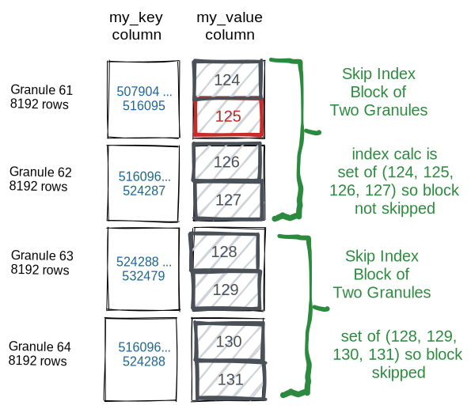
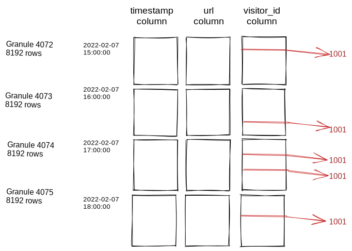

# ClickHouseデータスキッピングインデックスの理解

## はじめに

ClickHouseのクエリパフォーマンスに影響を与える要因は多くあります。ほとんどのシナリオで重要なのは、ClickHouseがクエリWHERE句の条件を評価する際に主キーを使用できるかどうかです。したがって、最も一般的なクエリパターンに適用される主キーを選択することが、効果的なテーブル設計のために不可欠です。

しかし、どんなに慎重に主キーを調整しても、必然的にそれを効率的に使用できないクエリのユースケースが存在します。ユーザーは通常、ClickHouseを使用して時系列データを扱いますが、同じデータを顧客ID、ウェブサイトのURL、製品番号などの他の業務次元に基づいて分析したいと考えることがよくあります。その場合、WHERE句の条件を適用するために各カラム値の全スキャンが必要になるため、クエリのパフォーマンスがかなり悪化する可能性があります。このような場合でも、ClickHouseは相対的に速いですが、数百万または数十億の個々の値を評価することは、主キーに基づくクエリよりもはるかに遅くなります。

伝統的なリレーショナルデータベースでは、この問題に対処する1つの方法として、テーブルに1つ以上の「二次」インデックスを付けることがあります。これは、データベースがディスク上で一致する行をO(log(n))時間で見つけることを可能にするb-tree構造です（nは行数）。しかし、ディスク上に追加する個別の行がないため、このタイプの二次インデックスはClickHouse（または他の列指向データベース）には適用できません。

代わりに、ClickHouseは異なる種類のインデックスを提供しており、特定の状況でクエリの速度を大幅に向上させることができます。これらの構造は「スキップ」インデックスとラベル付けされており、一致しないことが保証されているデータの大きなチャンクの読み込みをClickHouseがスキップできるようにします。

## 基本操作

ユーザーはMergeTreeファミリーのテーブルでのみデータスキッピングインデックスを使用できます。各データスキッピングには4つの主要な引数があります：

- インデックス名。インデックス名は各パーティション内のインデックスファイルの作成に使用されます。また、インデックスをドロップまたはマテリアライズする際のパラメータとして必要です。
- インデックス式。インデックス式はインデックスに格納される値の集合を計算するために使用されます。カラム、単純演算子、および/またはインデックスタイプによって決定された関数のサブセットの組み合わせが可能です。
- TYPE。インデックスタイプは、各インデックスブロックの読み取りと評価をスキップできるかどうかを決定する計算を制御します。
- GRANULARITY。 各インデックス付きブロックは GRANULARITY グラニュールから成ります。たとえば、主テーブルインデックスの粒度が8192行で、インデックスの粒度が4である場合、各インデックス付き「ブロック」は32768行になります。

ユーザーがデータスキッピングインデックスを作成すると、テーブルの各データパートディレクトリに2つの追加ファイルが作成されます。

- `skp_idx_{index_name}.idx`, には順序付けられた式の値が含まれています
- `skp_idx_{index_name}.mrk2`, には関連付けられたデータカラムファイルへの対応するオフセットが含まれています。

クエリを実行して関連するカラムファイルを読み取るときに、WHERE句のフィルター条件の一部がスキップインデックスの式と一致する場合、ClickHouseはインデックスファイルのデータを使用して、関連する各データブロックを処理する必要があるか、（主キーを適用することでブロックがすでに除外されていない限り）バイパスできるかを判断します。非常に簡単な例を挙げると、以下のようなテーブルに予測可能なデータがロードされているとします。

```
CREATE TABLE skip_table
(
  my_key UInt64,
  my_value UInt64
)
ENGINE MergeTree primary key my_key
SETTINGS index_granularity=8192;

INSERT INTO skip_table SELECT number, intDiv(number,4096) FROM numbers(100000000);
```

主キーを使用しない単純なクエリを実行すると、`my_value`カラムの1億エントリすべてがスキャンされます：

```
SELECT * FROM skip_table WHERE my_value IN (125, 700)

┌─my_key─┬─my_value─┐
│ 512000 │      125 │
│ 512001 │      125 │
│    ... |      ... |
└────────┴──────────┘

8192 rows in set. Elapsed: 0.079 sec. Processed 100.00 million rows, 800.10 MB (1.26 billion rows/s., 10.10 GB/s.
```

ここで非常に基本的なスキップインデックスを追加します：

```
ALTER TABLE skip_table ADD INDEX vix my_value TYPE set(100) GRANULARITY 2;
```

通常、スキップインデックスは新たに挿入されたデータにのみ適用されるため、インデックスを追加するだけでは上記のクエリには影響しません。

既存のデータをインデックス化するには、次のステートメントを使用します：

```
ALTER TABLE skip_table MATERIALIZE INDEX vix;
```

新しく作成したインデックスでクエリを再実行します：

```
SELECT * FROM skip_table WHERE my_value IN (125, 700)

┌─my_key─┬─my_value─┐
│ 512000 │      125 │
│ 512001 │      125 │
│    ... |      ... |
└────────┴──────────┘

8192 rows in set. Elapsed: 0.051 sec. Processed 32.77 thousand rows, 360.45 KB (643.75 thousand rows/s., 7.08 MB/s.)
```

1億行の800メガバイトを処理する代わりに、ClickHouseは32,768行の360キロバイトのみを読み取り、分析しました
-- 各8192行の4つのグラニュールです。

より視覚的な形式では、`my_value`が125である4096行がどのように読み取られ選択されたか、そして次の行がディスクからの読み取りなしにスキップされたかを示しています：



クエリを実行する際にtraceを有効にすることでスキップインデックスの使用に関する詳細情報にアクセスできます。
clickhouse-clientから、`send_logs_level`を設定します：

```
SET send_logs_level='trace';
```
これにより、クエリSQLやテーブルインデックスの調整を試みる際に有用なデバッグ情報が提供されます。上記の例では、スキップインデックスが6104のうち6102のグラニュールを削除したことを示しています：

```
<Debug> default.skip_table (933d4b2c-8cea-4bf9-8c93-c56e900eefd1) (SelectExecutor): Index `vix` has dropped 6102/6104 granules.
```

## スキップインデックスタイプ

### minmax

この軽量なインデックスタイプはパラメータを必要としません。各ブロックのインデックス式の最小値と最大値を記録します（式がタプルである場合、タプルの要素の各メンバーの値を個別に記録します）。このタイプは、値で緩やかにソートされる傾向があるカラムに理想的です。このインデックスタイプは通常、クエリ処理中に適用するのに最も費用がかかりません。

このタイプのインデックスは、スカラーまたはタプルの式でのみ正常に機能します。ただし、インデックスが配列またはマップデータ型を返す式には適用されません。

### set

この軽量なインデックスタイプは、ブロックごとに格納される値集合の最大サイズ（0は無制限の個別値を許可）という単一のパラメータを受け取ります。この集合にはブロック内のすべての値が含まれます（値の数がmax_sizeを超える場合は空です）。このインデックスタイプは、各グラニュールセット内で低いカーディナリティ（基本的に「ひとつにまとまっている」）だが、全体では高いカーディナリティのカラムによく適しています。

このインデックスのコスト、パフォーマンス、および効果は、ブロック内のカーディナリティに依存します。各ブロックが大量のユニークな値を含む場合、クエリ条件を大きなインデックスセットに評価するのが非常に高価になるか、max_sizeを超えたためインデックスが空になり適用されないことがあります。

### Bloomフィルタタイプ

*Bloomフィルタ*は、集合のメンバーシップのテストを効率的に行うためのデータ構造で、 false positive（誤って一致と判定する）可能性があります。スキップインデックスの場合、false positiveはわずかに余分なブロックを読み込むだけのデメリットしかないため、大きな問題にはなりません。ただし、false positivesの可能性があるため、インデックスした式がtrueであると予想されるべきです。さもないと、有効なデータがスキップされる可能性があります。

Bloomフィルタは、多数の個別値のテストをより効率的に処理できるため、多くの値をテストする条件式に適しています。特に、Bloomフィルタインデックスは配列に適用でき、配列の各値がテストされ、mapKeysまたはmapValues関数を使用してキーまたは値を配列に変換することでマップに適用されます。

Bloomフィルタに基づくデータスキッピングインデックスには、以下の3種類があります：

* 基本的な**bloom_filter**は、false positive率を0から1の範囲で許可する単一のオプションパラメータを受け取ります（指定しない場合、.025が使用されます）。

* 専用の**tokenbf_v1**。これはBloomフィルタに関連する3つのパラメータを取ります：（1）フィルタのサイズ（バイト単位）（大きなフィルタはfalse positiveが少ないですが、ストレージのコストがかかります）、（2）適用されるハッシュ関数の数（より多くのハッシュ関数はfalse positiveを減少させます）、（3）Bloomフィルタのハッシュ関数のシードです。これらのパラメータがBloomフィルタの機能にどのように影響するかについては、計算機を参照してください。[ここ](https://hur.st/bloomfilter/)をご覧ください。
このインデックスは、String、FixedString、Mapデータ型でのみ機能します。入力式は、非英数字で区切られた文字列に分割されます。たとえば、`This is a candidate for a "full text" search` という列の値は、`This` `is` `a` `candidate` `for` `full` `text` `search` というトークンが含まれます。LIKE、EQUALS、IN、hasToken()などの単語や他の値を長い文字列内で検索するために使用されます。たとえば、アプリケーションログの行の中で少数のクラス名や行番号を検索するのに役立つかもしれません。

* 専用の**ngrambf_v1**。このインデックスはトークンインデックスと同様に機能します。Bloomフィルタ設定の前にn-gramのサイズを表す追加パラメータを取得します。n-gramは任意の文字の長さ`n`の文字列です。`A short string`という文字列でn-gramサイズが4の場合、以下のようにインデックスされます：
  ```
  'A sh', ' sho', 'shor', 'hort', 'ort ', 'rt s', 't st', ' str', 'stri', 'trin', 'ring'
  ```
このインデックスは、特に単語の切れ目がない言語（中国語など）のテキスト検索に有用かもしれません。

## スキップインデックス関数

データスキッピングインデックスの主な目的は、人気のあるクエリによって分析されるデータの量を制限することです。ClickHouseデータの分析特性により、これらのクエリのパターンには多くの場合、機能的な表現が含まれています。そのため、スキップインデックスは一般的な関数と正しく連携する必要があります。これは、次のいずれかの場合に発生する可能性があります：
* データが挿入され、インデックスが機能的な式として定義されている場合（式の結果がインデックスファイルに格納される）、
* クエリが処理され、式が格納されたインデックス値に適用され、ブロックを除外するかどうかを判断する場合。

各タイプのスキップインデックスは、可能な関数サポートのサブセットで機能します。[こちら](https://clickhouse.com/docs/ja/engines/table-engines/mergetree-family/mergetree/#functions-support)に記載されています。一般的に、セットインデックスやBloomフィルタベースのインデックス（もう一つのセットインデックスタイプ）は無秩序で範囲では機能しません。対照的に、minmaxインデックスは範囲で特によく機能します。部分一致関数LIKE、startsWith、endsWith、およびhasTokenの有効性は、使用されるインデックスタイプ、インデックス式、およびデータの特定の形状に依存します。

## スキップインデックス設定

スキップインデックスに適用される設定は2つ存在します。

* **use_skip_indexes**（0または1、デフォルトは1）。すべてのクエリがスキップインデックスを効率的に利用できるわけではありません。特定のフィルタリング条件が
ほとんどの場合全グラニュールを含む可能性がある場合、データスキッピングインデックスを適用することは不要であり、時にはかなりのコストがかかります。スキップインデックスを利用する可能性が低いクエリの場合は、値を
0に設定してください。
* **force_data_skipping_indices**（インデックス名のカンマ区切りリスト）。この設定は、一部の非効率的な
クエリを防ぐために使用できます。テーブルを問い合わせるのがスキップインデックスを使用しない限り高価すぎる場合、この設定を1つ以上のインデックス
名で使用すると、指定されたインデックスを使用しないクエリに対しては例外を返します。これにより、他のリソースを浪費するクエリを
防ぐことができます。

## スキップインデックスのベストプラクティス

スキップインデックスは直感的ではなく、RDMSの領域の行ベースの二次インデックスや文書ストアのインバーテッドインデックスに慣れているユーザーには特にそうです。ClickHouseデータスキッピングインデックスを適用して利益を得るためには、計算コストを相殺するだけのグラニュールの読み取りを避ける必要があります。重要なことは、インデックス付きブロック内に1回でも値が現れる場合、それはブロック全体がメモリに読み込まれ評価されなければならず、インデックスコストが不必要にかかることを意味します。

以下のデータ分布を考えてみましょう：



主/ORDER BY キーが `timestamp` で、`visitor_id` にインデックスがあると仮定します。次のクエリを考えます：

 `SELECT timestamp, url FROM table WHERE visitor_id = 1001`

この種のデータ分布では、伝統的な二次インデックスが非常に有利です。
要求されたvisitor_idを持つ5つの行を見つけるために32768行全体を読む代わりに、二次インデックスにはちょうど5つの行位置が含まれ、ディスクからそれらの5つの行だけが読み込まれます。
ClickHouseのデータスキッピングインデックスでは逆が当てはまります。8192行のスキップ・ブロックの中で要求されたvisitor_idが1つでも見つかるため、visitor_idにインデックスが付いている8192行のすべての値がテストされます。

したがって、ClickHouseのクエリを単にキーとなるカラムにインデックスを追加することで高速化しようとする自然な衝動は、しばしば間違っています。この高度な機能は、他の代替手段、例えば主キーの変更（[主キーの選び方](../best-practices/sparse-primary-indexes.md)を参照）、プロジェクションの利用、またはマテリアライズされたビューを使用するまでは利用するべきではありません。データスキッピングインデックスが適切である場合でも、多くの場合、インデックスとテーブルの両方の慎重な調整が必要になります。

ほとんどの場合、有用なスキップインデックスは、主キーとターゲットの非主カラム/式の強い相関関係を必要とします。
（上記の図のように）相関がなければ、フィルタリング条件が数千の値ブロックの少なくとも1行に一致する可能性が高く、多くのブロックはスキップされません。対照的に、主キー（時間帯のような）の値の範囲が、潜在的なインデックスカラム（テレビ視聴者の年齢）の値と強く関連している場合、minmaxタイプのインデックスが有益である可能性があります。データを挿入する際にこの相関関係を高めることが可能かもしれません。これには、並べ替え/ORDER BYキーに追加のカラムを含める、または主キーと関連する値が挿入時にグループ化されるようにバッチ挿入することが含まれるかもしれません。例えば、サイトIDごとのすべてのイベントをまとめてグループ化して挿入プロセスによって一緒に挿入することができます。これにより、多くのグラニュールが少数のサイトIDのみを含むようになり、特定のサイトID値を検索する際に多くのブロックをスキップできるようになります。

スキップインデックスの良い候補の1つは、高カーディナリティの式で、1つの値がデータ内で比較的スパースである場合です。 1つの例として、APIリクエストにおけるエラーコードを追跡する観測プラットフォームが考えられます。データ内で稀であるエラーコードが特に重要である場合があります。エラーコードカラムに対するセットスキップインデックスを設定することで、エラーを含まないブロックの大部分をバイパスし、エラー中心のクエリを大幅に改善できます。

最後に、主要なベストプラクティスはテスト、テスト、テストです。 b-treeの二次インデックスや文書の検索用インバーテッドインデックスとは異なり、データスキッピングインデックスの動作は容易に予測できません。テーブルに追加することは、データ挿入時および、いくつかの理由で利益を得ないクエリの上での有意義なコストを伴います。常に実世界のデータでテストし、テストには型、粒度サイズ、および他のパラメータのバリエーションを含める必要があります。テストは思考実験だけでは明らかにならないパターンや落とし穴を明らかにすることがよくあります。
