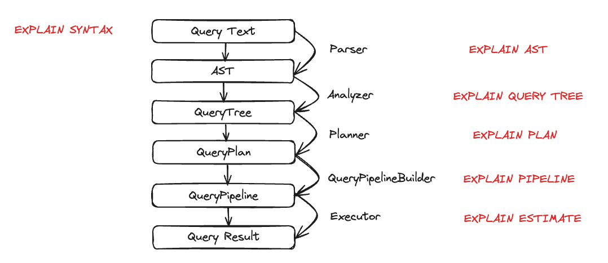
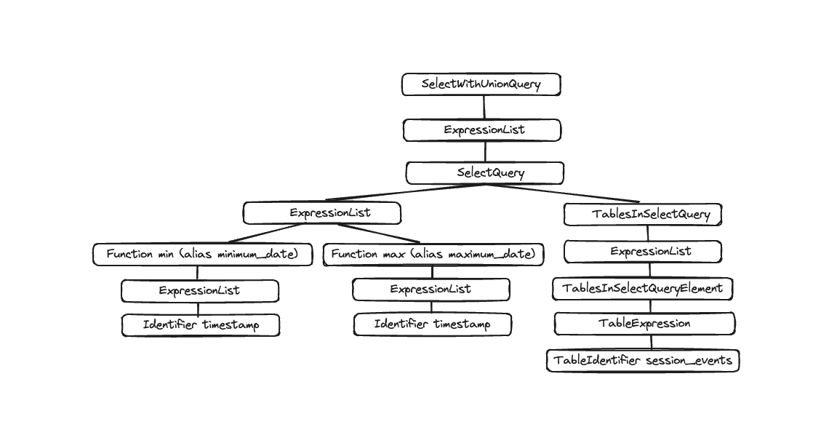
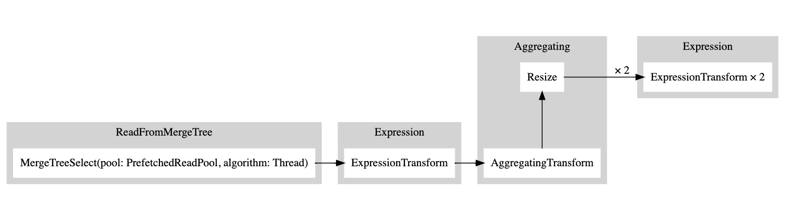
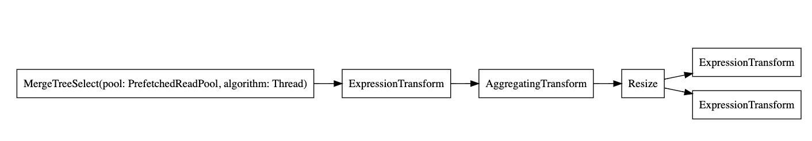
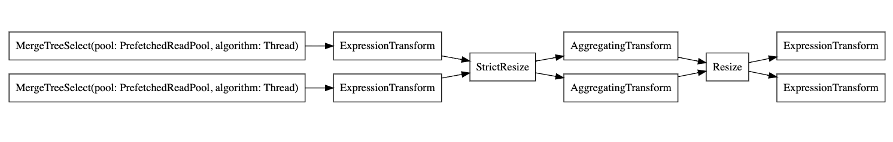

# アナライザーでクエリ実行を理解する

ClickHouseはクエリを非常に迅速に処理しますが、クエリの実行は単純ではありません。`SELECT`クエリがどのように実行されるかを理解してみましょう。これを説明するために、ClickHouseにテーブルにデータを追加します。

```sql
CREATE TABLE session_events(
   clientId UUID,
   sessionId UUID,
   pageId UUID,
   timestamp DateTime,
   type String
) ORDER BY (timestamp);

INSERT INTO session_events SELECT * FROM generateRandom('clientId UUID,
   sessionId UUID,
   pageId UUID,
   timestamp DateTime,
   type Enum(\'type1\', \'type2\')', 1, 10, 2) LIMIT 1000;
```

ClickHouseにデータを追加したので、クエリを実行してその実行を理解したいと思います。クエリの実行は多くのステップに分解されます。クエリ実行の各ステップは、対応する`EXPLAIN`クエリを使用して分析およびトラブルシューティングを行うことができます。これらのステップは以下のチャートにまとめられています。



クエリ実行中の各エンティティの動作を見てみましょう。いくつかのクエリを取り上げ、`EXPLAIN`ステートメントを使用してそれらを調べます。

## パーサー

パーサーの目的はクエリテキストをAST（抽象構文木）に変換することです。このステップは`EXPLAIN AST`を使用して視覚化できます。

```sql
EXPLAIN AST SELECT min(timestamp), max(timestamp) FROM session_events;

┌─explain────────────────────────────────────────────┐
│ SelectWithUnionQuery (children 1)                  │
│  ExpressionList (children 1)                       │
│   SelectQuery (children 2)                         │
│    ExpressionList (children 2)                     │
│     Function min (alias minimum_date) (children 1) │
│      ExpressionList (children 1)                   │
│       Identifier timestamp                         │
│     Function max (alias maximum_date) (children 1) │
│      ExpressionList (children 1)                   │
│       Identifier timestamp                         │
│    TablesInSelectQuery (children 1)                │
│     TablesInSelectQueryElement (children 1)        │
│      TableExpression (children 1)                  │
│       TableIdentifier session_events               │
└────────────────────────────────────────────────────┘
```

出力は以下のように視覚化される抽象構文木です。



各ノードには対応する子ノードがあり、全体の木構造はクエリの全体構造を表しています。これは、クエリ処理を助ける論理構造です。エンドユーザーの観点では（クエリ実行に興味がない限り）それほど役に立ちませんが、このツールは主に開発者によって使用されます。

## アナライザー

<BetaBadge />

ClickHouseには現在、アナライザーのための2つのアーキテクチャがあります。古いアーキテクチャを使用するには、`allow_experimental_analyzer=0`を設定することができます。新しいアーキテクチャを使用したい場合は、`allow_experimental_analyzer=1`を設定してください。新しいアナライザーが一般的に利用可能になったら古いものは廃止されるため、ここでは新しいアーキテクチャのみを説明します。

:::note
新しいアナライザーはベータ版です。新しいアーキテクチャはClickHouseの性能向上に役立つはずですが、クエリ処理ステップの基本要素であるため、いくつかのクエリに悪影響を及ぼす可能性もあります。新しいアナライザーに移行した後、性能の低下、クエリの失敗、または予期しない結果をもたらすクエリが発生する可能性があります。クエリまたはユーザーレベルで`allow_experimental_analyzer`設定を変更することで、古いアナライザーに戻すことができます。あらゆる問題をGitHubにて報告してください。
:::

アナライザーはクエリ実行の重要なステップです。ASTを取得してクエリツリーに変換します。クエリツリーの主な利点は、多くのコンポーネントが解決されることです。例えば、ストレージや、どのテーブルから読むのかがわかります。別名も解決され、異なるデータ型が使用されていることがわかります。これらすべての利点から、アナライザーは最適化を適用できます。これらの最適化は「パス」を通じて機能します。各パスは異なる最適化を探します。パスの一覧は[こちら](https://github.com/ClickHouse/ClickHouse/blob/76578ebf92af3be917cd2e0e17fea2965716d958/src/Analyzer/QueryTreePassManager.cpp#L249)にあります。以前のクエリで実際に確認してみましょう。

```sql
EXPLAIN QUERY TREE passes=0 SELECT min(timestamp) AS minimum_date, max(timestamp) AS maximum_date FROM session_events SETTINGS allow_experimental_analyzer=1;

┌─explain────────────────────────────────────────────────────────────────────────────────┐
│ QUERY id: 0                                                                            │
│   PROJECTION                                                                           │
│     LIST id: 1, nodes: 2                                                               │
│       FUNCTION id: 2, alias: minimum_date, function_name: min, function_type: ordinary │
│         ARGUMENTS                                                                      │
│           LIST id: 3, nodes: 1                                                         │
│             IDENTIFIER id: 4, identifier: timestamp                                    │
│       FUNCTION id: 5, alias: maximum_date, function_name: max, function_type: ordinary │
│         ARGUMENTS                                                                      │
│           LIST id: 6, nodes: 1                                                         │
│             IDENTIFIER id: 7, identifier: timestamp                                    │
│   JOIN TREE                                                                            │
│     IDENTIFIER id: 8, identifier: session_events                                       │
│   SETTINGS allow_experimental_analyzer=1                                               │
└────────────────────────────────────────────────────────────────────────────────────────┘
```

```sql
EXPLAIN QUERY TREE passes=20 SELECT min(timestamp) AS minimum_date, max(timestamp) AS maximum_date FROM session_events SETTINGS allow_experimental_analyzer=1;

┌─explain───────────────────────────────────────────────────────────────────────────────────┐
│ QUERY id: 0                                                                               │
│   PROJECTION COLUMNS                                                                      │
│     minimum_date DateTime                                                                 │
│     maximum_date DateTime                                                                 │
│   PROJECTION                                                                              │
│     LIST id: 1, nodes: 2                                                                  │
│       FUNCTION id: 2, function_name: min, function_type: aggregate, result_type: DateTime │
│         ARGUMENTS                                                                         │
│           LIST id: 3, nodes: 1                                                            │
│             COLUMN id: 4, column_name: timestamp, result_type: DateTime, source_id: 5     │
│       FUNCTION id: 6, function_name: max, function_type: aggregate, result_type: DateTime │
│         ARGUMENTS                                                                         │
│           LIST id: 7, nodes: 1                                                            │
│             COLUMN id: 4, column_name: timestamp, result_type: DateTime, source_id: 5     │
│   JOIN TREE                                                                               │
│     TABLE id: 5, alias: __table1, table_name: default.session_events                      │
│   SETTINGS allow_experimental_analyzer=1                                                  │
└───────────────────────────────────────────────────────────────────────────────────────────┘
```

2つの実行の間に、別名やプロジェクションの解決を見ることができます。

## プランナー

プランナーはクエリツリーを取り、それに基づいてクエリプランを構築します。クエリツリーは特定のクエリで何をしたいかを示し、クエリプランはそれをどのように行うかを示します。追加の最適化がクエリプランの一部として行われます。`EXPLAIN PLAN`または`EXPLAIN`を使用してクエリプランを見ることができます（`EXPLAIN`は`EXPLAIN PLAN`を実行します）。

```sql
EXPLAIN PLAN WITH
   (
       SELECT count(*)
       FROM session_events
   ) AS total_rows
SELECT type, min(timestamp) AS minimum_date, max(timestamp) AS maximum_date, count(*) /total_rows * 100 AS percentage FROM session_events GROUP BY type

┌─explain──────────────────────────────────────────┐
│ Expression ((Projection + Before ORDER BY))      │
│   Aggregating                                    │
│     Expression (Before GROUP BY)                 │
│       ReadFromMergeTree (default.session_events) │
└──────────────────────────────────────────────────┘
```

これが私たちにいくつかの情報を提供していますが、さらに多くの情報を得ることができます。たとえば、プロジェクションを行う必要があるカラムの名前を知りたいかもしれません。その場合、ヘッダーをクエリに追加することができます。

```
EXPLAIN header = 1
WITH (
       SELECT count(*)
       FROM session_events
   ) AS total_rows
SELECT
   type,
   min(timestamp) AS minimum_date,
   max(timestamp) AS maximum_date,
   (count(*) / total_rows) * 100 AS percentage
FROM session_events
GROUP BY type

┌─explain──────────────────────────────────────────┐
│ Expression ((Projection + Before ORDER BY))      │
│ Header: type String                              │
│         minimum_date DateTime                    │
│         maximum_date DateTime                    │
│         percentage Nullable(Float64)             │
│   Aggregating                                    │
│   Header: type String                            │
│           min(timestamp) DateTime                │
│           max(timestamp) DateTime                │
│           count() UInt64                         │
│     Expression (Before GROUP BY)                 │
│     Header: timestamp DateTime                   │
│             type String                          │
│       ReadFromMergeTree (default.session_events) │
│       Header: timestamp DateTime                 │
│               type String                        │
└──────────────────────────────────────────────────┘
```

これで最後のプロジェクションのために作成する必要があるカラム名（`minimum_date`、`maximum_date`、および`percentage`）を知ることができますが、実行する必要があるすべてのアクションの詳細も知りたいかもしれません。これは`actions=1`を設定することで行うことができます。

```sql
EXPLAIN actions = 1
WITH (
       SELECT count(*)
       FROM session_events
   ) AS total_rows
SELECT
   type,
   min(timestamp) AS minimum_date,
   max(timestamp) AS maximum_date,
   (count(*) / total_rows) * 100 AS percentage
FROM session_events
GROUP BY type


┌─explain────────────────────────────────────────────────────────────────────────────────────────────────────────────────────────────────────┐
│ Expression ((Projection + Before ORDER BY))                                                                                                │
│ Actions: INPUT :: 0 -> type String : 0                                                                                                     │
│          INPUT : 1 -> min(timestamp) DateTime : 1                                                                                          │
│          INPUT : 2 -> max(timestamp) DateTime : 2                                                                                          │
│          INPUT : 3 -> count() UInt64 : 3                                                                                                   │
│          COLUMN Const(Nullable(UInt64)) -> total_rows Nullable(UInt64) : 4                                                                 │
│          COLUMN Const(UInt8) -> 100 UInt8 : 5                                                                                              │
│          ALIAS min(timestamp) :: 1 -> minimum_date DateTime : 6                                                                            │
│          ALIAS max(timestamp) :: 2 -> maximum_date DateTime : 1                                                                            │
│          FUNCTION divide(count() :: 3, total_rows :: 4) -> divide(count(), total_rows) Nullable(Float64) : 2                               │
│          FUNCTION multiply(divide(count(), total_rows) :: 2, 100 :: 5) -> multiply(divide(count(), total_rows), 100) Nullable(Float64) : 4 │
│          ALIAS multiply(divide(count(), total_rows), 100) :: 4 -> percentage Nullable(Float64) : 5                                         │
│ Positions: 0 6 1 5                                                                                                                         │
│   Aggregating                                                                                                                              │
│   Keys: type                                                                                                                               │
│   Aggregates:                                                                                                                              │
│       min(timestamp)                                                                                                                       │
│         Function: min(DateTime) → DateTime                                                                                                 │
│         Arguments: timestamp                                                                                                               │
│       max(timestamp)                                                                                                                       │
│         Function: max(DateTime) → DateTime                                                                                                 │
│         Arguments: timestamp                                                                                                               │
│       count()                                                                                                                              │
│         Function: count() → UInt64                                                                                                         │
│         Arguments: none                                                                                                                    │
│   Skip merging: 0                                                                                                                          │
│     Expression (Before GROUP BY)                                                                                                           │
│     Actions: INPUT :: 0 -> timestamp DateTime : 0                                                                                          │
│              INPUT :: 1 -> type String : 1                                                                                                 │
│     Positions: 0 1                                                                                                                         │
│       ReadFromMergeTree (default.session_events)                                                                                           │
│       ReadType: Default                                                                                                                    │
│       Parts: 1                                                                                                                             │
│       Granules: 1                                                                                                                          │
└────────────────────────────────────────────────────────────────────────────────────────────────────────────────────────────────────────────┘
```

これで使用されているすべての入力、関数、エイリアス、データ型を見ることができます。プランナーが適用するいくつかの最適化は[こちら](https://github.com/ClickHouse/ClickHouse/blob/master/src/Processors/QueryPlan/Optimizations/Optimizations.h)に見ることができます。

## クエリパイプライン

クエリパイプラインはクエリプランから生成されます。クエリパイプラインはクエリプランに非常に似ていますが、それが木ではなくグラフであるという点が異なります。ClickHouseがどのようにクエリを実行し、どのリソースが使用されるかを強調表示します。クエリパイプラインを分析することは、入力/出力に関するボトルネックを確認するのに非常に役立ちます。以前のクエリを取り上げ、クエリパイプラインの実行を見てみましょう。

```sql
EXPLAIN PIPELINE
WITH (
       SELECT count(*)
       FROM session_events
   ) AS total_rows
SELECT
   type,
   min(timestamp) AS minimum_date,
   max(timestamp) AS maximum_date,
   (count(*) / total_rows) * 100 AS percentage
FROM session_events
GROUP BY type;

┌─explain────────────────────────────────────────────────────────────────────┐
│ (Expression)                                                               │
│ ExpressionTransform × 2                                                    │
│   (Aggregating)                                                            │
│   Resize 1 → 2                                                             │
│     AggregatingTransform                                                   │
│       (Expression)                                                         │
│       ExpressionTransform                                                  │
│         (ReadFromMergeTree)                                                │
│         MergeTreeSelect(pool: PrefetchedReadPool, algorithm: Thread) 0 → 1 │
└────────────────────────────────────────────────────────────────────────────┘
```

括弧内はクエリプランステップであり、それに続くのはプロセッサーです。これは素晴らしい情報ですが、これはグラフであるため、そのように視覚化できると良いでしょう。設定`graph`を1に設定し、出力フォーマットをTSVに指定することができます。

```sql
EXPLAIN PIPELINE graph=1 WITH
   (
       SELECT count(*)
       FROM session_events
   ) AS total_rows
SELECT type, min(timestamp) AS minimum_date, max(timestamp) AS maximum_date, count(*) /total_rows * 100 AS percentage FROM session_events GROUP BY type FORMAT TSV;
```

```
digraph
{
 rankdir="LR";
 { node [shape = rect]
   subgraph cluster_0 {
     label ="Expression";
     style=filled;
     color=lightgrey;
     node [style=filled,color=white];
     { rank = same;
       n5 [label="ExpressionTransform × 2"];
     }
   }
   subgraph cluster_1 {
     label ="Aggregating";
     style=filled;
     color=lightgrey;
     node [style=filled,color=white];
     { rank = same;
       n3 [label="AggregatingTransform"];
       n4 [label="Resize"];
     }
   }
   subgraph cluster_2 {
     label ="Expression";
     style=filled;
     color=lightgrey;
     node [style=filled,color=white];
     { rank = same;
       n2 [label="ExpressionTransform"];
     }
   }
   subgraph cluster_3 {
     label ="ReadFromMergeTree";
     style=filled;
     color=lightgrey;
     node [style=filled,color=white];
     { rank = same;
       n1 [label="MergeTreeSelect(pool: PrefetchedReadPool, algorithm: Thread)"];
     }
   }
 }
 n3 -> n4 [label=""];
 n4 -> n5 [label="× 2"];
 n2 -> n3 [label=""];
 n1 -> n2 [label=""];
}
```

この出力をコピーし、[ここ](https://dreampuf.github.io/GraphvizOnline)に貼り付けると、次のグラフが生成されます。



白い矩形はパイプラインノードに対応し、灰色の矩形はクエリプランステップに対応します。数字の後に`x`が付くのは、使用されている入力/出力の数を示しています。コンパクト形式で見たくない場合は、`compact=0`を追加することができます。

```sql
EXPLAIN PIPELINE graph = 1, compact = 0
WITH (
       SELECT count(*)
       FROM session_events
   ) AS total_rows
SELECT
   type,
   min(timestamp) AS minimum_date,
   max(timestamp) AS maximum_date,
   (count(*) / total_rows) * 100 AS percentage
FROM session_events
GROUP BY type
FORMAT TSV
```

```
digraph
{
 rankdir="LR";
 { node [shape = rect]
   n0[label="MergeTreeSelect(pool: PrefetchedReadPool, algorithm: Thread)"];
   n1[label="ExpressionTransform"];
   n2[label="AggregatingTransform"];
   n3[label="Resize"];
   n4[label="ExpressionTransform"];
   n5[label="ExpressionTransform"];
 }
 n0 -> n1;
 n1 -> n2;
 n2 -> n3;
 n3 -> n4;
 n3 -> n5;
}
```



なぜClickHouseは複数のスレッドを使用してテーブルから読み取りを行わないのでしょうか？テーブルにデータを追加してみましょう。

```sql
INSERT INTO session_events SELECT * FROM generateRandom('clientId UUID,
   sessionId UUID,
   pageId UUID,
   timestamp DateTime,
   type Enum(\'type1\', \'type2\')', 1, 10, 2) LIMIT 1000000;
```

次に、再度`EXPLAIN`クエリを実行してみましょう。

```sql
EXPLAIN PIPELINE graph = 1, compact = 0
WITH (
       SELECT count(*)
       FROM session_events
   ) AS total_rows
SELECT
   type,
   min(timestamp) AS minimum_date,
   max(timestamp) AS maximum_date,
   (count(*) / total_rows) * 100 AS percentage
FROM session_events
GROUP BY type
FORMAT TSV
```

```
digraph
{
  rankdir="LR";
  { node [shape = rect]
    n0[label="MergeTreeSelect(pool: PrefetchedReadPool, algorithm: Thread)"];
    n1[label="MergeTreeSelect(pool: PrefetchedReadPool, algorithm: Thread)"];
    n2[label="ExpressionTransform"];
    n3[label="ExpressionTransform"];
    n4[label="StrictResize"];
    n5[label="AggregatingTransform"];
    n6[label="AggregatingTransform"];
    n7[label="Resize"];
    n8[label="ExpressionTransform"];
    n9[label="ExpressionTransform"];
  }
  n0 -> n2;
  n1 -> n3;
  n2 -> n4;
  n3 -> n4;
  n4 -> n5;
  n4 -> n6;
  n5 -> n7;
  n6 -> n7;
  n7 -> n8;
  n7 -> n9;
}
```



したがって、エグゼキューターはデータ量が十分でないため、操作を並列化しないことを決定しました。より多くの行を追加すると、エグゼキューターはグラフに示されるように複数のスレッドを使用することを決定しました。

## エグゼキューター

クエリ実行の最後のステップはエグゼキューターによって行われます。クエリパイプラインを取り、それを実行します。`SELECT`、`INSERT`、または`INSERT SELECT`を行うかに応じて、異なるエグゼキューターがあります。
```
