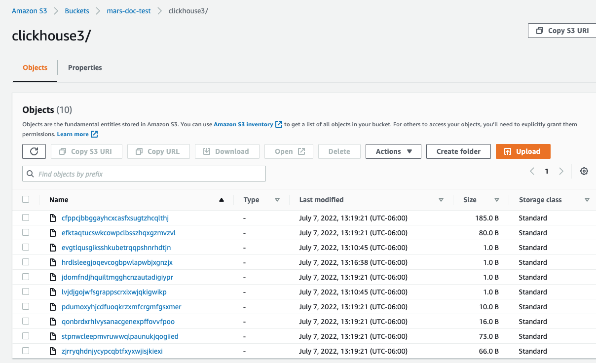

import BucketDetails from '@site/docs/ja/_snippets/_S3_authentication_and_bucket.md';

# ストレージとコンピュートの分離

## 概要

このガイドは、ClickHouseとS3を使用して、ストレージとコンピュートを分離したアーキテクチャを実装する方法を探ります。

ストレージとコンピュートの分離とは、コンピューティングリソースとストレージリソースを独立して管理することを意味します。ClickHouseでは、スケーラビリティ、コスト効率、柔軟性を向上させることができます。必要に応じてストレージとコンピュートリソースを別々にスケールし、パフォーマンスとコストを最適化できます。

ClickHouseにS3をバックエンドとして使用することは、特に「コールド」データのクエリパフォーマンスがあまり重要でないユースケースにおいて有用です。ClickHouseは`S3BackedMergeTree`を使用して、`MergeTree`エンジンのストレージとしてS3をサポートします。このテーブルエンジンは、S3のスケーラビリティとコストの利点を活用しながら、`MergeTree`エンジンのインサートとクエリのパフォーマンスを維持することができます。

ストレージとコンピュートの分離アーキテクチャの実装と管理は、標準のClickHouseデプロイと比較してより複雑であることに注意してください。このガイドで説明するように、セルフマネージド型のClickHouseはストレージとコンピュートの分離を可能にしますが、設定なしでこのアーキテクチャを使用できる[ClickHouse Cloud](https://clickhouse.com/cloud)の利用をお勧めします。これには[`SharedMergeTree`テーブルエンジン](/ja/cloud/reference/shared-merge-tree)を使用してください。

*このガイドは、ClickHouseバージョン22.8以上を使用していることを前提としています。*

:::warning
AWS/GCSライフサイクルポリシーを設定しないでください。これはサポートされておらず、テーブルが破損する可能性があります。
:::

## 1. ClickHouseディスクとしてS3を使用する

### ディスクの作成

ストレージ構成を保存するためにClickHouseの`config.d`ディレクトリに新しいファイルを作成します:

```bash
vim /etc/clickhouse-server/config.d/storage_config.xml
```

次のXMLを新しく作成したファイルにコピーし、データを保存したいAWSのバケット詳細に応じて`BUCKET`、`ACCESS_KEY_ID`、`SECRET_ACCESS_KEY`を置き換えます:

```xml
<clickhouse>
  <storage_configuration>
    <disks>
      <s3_disk>
        <type>s3</type>
        <endpoint>$BUCKET</endpoint>
        <access_key_id>$ACCESS_KEY_ID</access_key_id>
        <secret_access_key>$SECRET_ACCESS_KEY</secret_access_key>
        <metadata_path>/var/lib/clickhouse/disks/s3_disk/</metadata_path>
      </s3_disk>
      <s3_cache>
        <type>cache</type>
        <disk>s3_disk</disk>
        <path>/var/lib/clickhouse/disks/s3_cache/</path>
        <max_size>10Gi</max_size>
      </s3_cache>
    </disks>
    <policies>
      <s3_main>
        <volumes>
          <main>
            <disk>s3_disk</disk>
          </main>
        </volumes>
      </s3_main>
    </policies>
  </storage_configuration>
</clickhouse>
```

S3ディスクの設定をさらに詳細に指定する必要がある場合、例えば`region`を指定したりカスタムHTTP`header`を送信したりする必要がある場合は、関連する設定の一覧を[こちら](/docs/ja/engines/table-engines/mergetree-family/mergetree.md/#table_engine-mergetree-s3)で確認できます。

また、`access_key_id`と`secret_access_key`を以下に置き換えることで、環境変数やAmazon EC2メタデータから資格情報を取得しようとすることもできます:

```bash
<use_environment_credentials>true</use_environment_credentials>
```

設定ファイルを作成した後、ファイルの所有者をclickhouseユーザーとグループに更新する必要があります:

```bash
chown clickhouse:clickhouse /etc/clickhouse-server/config.d/storage_config.xml
```

クリックハウスサーバーを再起動して変更を適用することができます:

```bash
service clickhouse-server restart
```

## 2. S3をバックエンドにしたテーブルを作成

S3ディスクが正しく設定されていることをテストするために、テーブルを作成してクエリを試みます。

新しいS3ストレージポリシーを指定してテーブルを作成します:

```sql
CREATE TABLE my_s3_table
  (
    `id` UInt64,
    `column1` String
  )
ENGINE = MergeTree
ORDER BY id
SETTINGS storage_policy = 's3_main';
```

エンジンを`S3BackedMergeTree`として指定する必要がないことを注意してください。ClickHouseは、テーブルがストレージにS3を使用していると検出すると、エンジンタイプを内部的に自動で変換します。

テーブルが正しいポリシーで作成されたことを確認します:

```sql
SHOW CREATE TABLE my_s3_table;
```

次の結果が表示されるはずです:

```response
┌─statement────────────────────────────────────────────────────
│ CREATE TABLE default.my_s3_table
(
  `id` UInt64,
  `column1` String
)
ENGINE = MergeTree
ORDER BY id
SETTINGS storage_policy = 's3_main', index_granularity = 8192
└──────────────────────────────────────────────────────────────
```

新しいテーブルに行を挿入しましょう:

```sql
INSERT INTO my_s3_table (id, column1)
  VALUES (1, 'abc'), (2, 'xyz');
```

行が挿入されたことを確認しましょう:

```sql
SELECT * FROM my_s3_table;
```

```response
┌─id─┬─column1─┐
│  1 │ abc     │
│  2 │ xyz     │
└────┴─────────┘

2 rows in set. Elapsed: 0.284 sec.
```

AWSコンソールにて、データがS3に正常に挿入された場合、指定されたバケットにClickHouseが新しいファイルを作成したことが確認できるはずです。

すべてが正常に動作した場合、ストレージとコンピュートが分離された状態でClickHouseを使用していることになります！



## 3. フォールトトレランスのためのレプリケーションの実装 (オプション)

:::warning
AWS/GCSライフサイクルポリシーを設定しないでください。これはサポートされておらず、テーブルが破損する可能性があります。
:::

フォールトトレランスを確保するために、複数のAWSリージョンに分散された複数のClickHouseサーバーノードと、それぞれのノードに対するS3バケットを使用することができます。

S3ディスクを用いたレプリケーションは、`ReplicatedMergeTree`テーブルエンジンを使用することで実現できます。詳細は次のガイドを参照してください:
- [S3オブジェクトストレージを使用した2つのAWSリージョン間での単一シャードのレプリケーション](/ja/integrations/s3#s3-multi-region).

## 参考文献

- [SharedMergeTreeテーブルエンジン](/ja/cloud/reference/shared-merge-tree)
- [SharedMergeTree発表ブログ](https://clickhouse.com/blog/clickhouse-cloud-boosts-performance-with-sharedmergetree-and-lightweight-updates)
