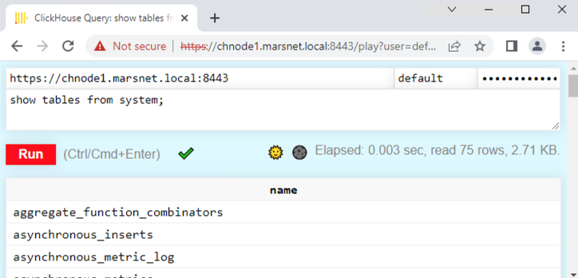

import SelfManaged from '@site/docs/ja/_snippets/_self_managed_only_automated.md';

# SSL-TLSの設定

<SelfManaged />

このガイドでは、ClickHouseをOpenSSL証明書を使用して接続を検証するための簡単で最小限の設定を提供します。このデモンストレーションでは、自己署名の証明局 (CA) 証明書とキーを作成し、適切な設定でノード証明書を使用して接続を行います。

:::note
TLSの実装は複雑であり、完全に安全で堅牢なデプロイメントを確保するためには多くのオプションを考慮する必要があります。これは基本的なSSL/TLSの設定例を含むチュートリアルです。組織内で正しい証明書を生成するためにPKI/セキュリティチームに相談してください。

証明書の使用については、この[基本的なチュートリアル](https://ubuntu.com/server/docs/security-certificates)を参照してください。
:::

## 1. ClickHouse デプロイメントを作成する

このガイドは、Ubuntu 20.04およびDEBパッケージ（aptを使用）を使用してインストールされたClickHouseを以下のホスト上で使用する形で書かれています。ドメインは `marsnet.local` です:

|ホスト |IPアドレス|
|--------|-------------|
|chnode1 |192.168.1.221|
|chnode2 |192.168.1.222|
|chnode3 |192.168.1.223|


:::note
ClickHouseのインストール方法の詳細については、[クイックスタート](/docs/ja/getting-started/install.md)を参照してください。
:::


## 2. SSL 証明書を作成する
:::note
自己署名証明書はデモンストレーション目的のみで使用され、実運用環境では使用しないでください。証明書要求は、組織によって署名され、設定で構成されるCAチェーンを使用して検証されるべきです。ただし、これらの手順は設定を構成およびテストするためのものであり、その後実際に使用される証明書に置き換えることができます。
:::

1. 新しいCAに使用するキーを生成します:
    ```bash
    openssl genrsa -out marsnet_ca.key 2048
    ```

2. 新しい自己署名CA証明書を生成します。以下のコマンドは、CAキーを使用して他の証明書を署名するために使用する新しい証明書を生成します:
    ```bash
    openssl req -x509 -subj "/CN=marsnet.local CA" -nodes -key marsnet_ca.key -days 1095 -out marsnet_ca.crt
    ```

    :::note
    キーとCA証明書はクラスタ外の安全な場所にバックアップしてください。ノード証明書の生成後、キーはクラスタノードから削除してください。
    :::

3. 新しいCA証明書の内容を確認します:
    ```bash
    openssl x509 -in marsnet_ca.crt -text
    ```

4. 各ノードに証明書要求 (CSR) とキーを生成します:
    ```bash
    openssl req -newkey rsa:2048 -nodes -subj "/CN=chnode1" -addext "subjectAltName = DNS:chnode1.marsnet.local,IP:192.168.1.221" -keyout chnode1.key -out chnode1.csr
    openssl req -newkey rsa:2048 -nodes -subj "/CN=chnode2" -addext "subjectAltName = DNS:chnode2.marsnet.local,IP:192.168.1.222" -keyout chnode2.key -out chnode2.csr
    openssl req -newkey rsa:2048 -nodes -subj "/CN=chnode3" -addext "subjectAltName = DNS:chnode3.marsnet.local,IP:192.168.1.223" -keyout chnode3.key -out chnode3.csr
    ```

5. CSRとCAを使用して新しい証明書とキーのペアを作成します:
    ```bash
    openssl x509 -req -in chnode1.csr -out chnode1.crt -CA marsnet_ca.crt -CAkey marsnet_ca.key -days 365 -copy_extensions copy
    openssl x509 -req -in chnode2.csr -out chnode2.crt -CA marsnet_ca.crt -CAkey marsnet_ca.key -days 365 -copy_extensions copy
    openssl x509 -req -in chnode3.csr -out chnode3.crt -CA marsnet_ca.crt -CAkey marsnet_ca.key -days 365 -copy_extensions copy
    ```

6. サブジェクトと発行者が正しいことを確認します:
    ```bash
    openssl x509 -in chnode1.crt -text -noout
    ```

7. 新しい証明書がCA証明書と検証されることを確認します:
    ```bash
    openssl verify -CAfile marsnet_ca.crt chnode1.crt
    chnode1.crt: OK
    ```

## 3. 証明書およびキーを保存するディレクトリを作成および構成する

:::note
これは各ノードで行う必要があります。適切な証明書およびキーを各ホストで使用してください。
:::

1. 各ノードでClickHouseがアクセス可能なディレクトリにフォルダを作成します。デフォルトの構成ディレクトリ（例: `/etc/clickhouse-server`）を推奨します:
    ```bash
    mkdir /etc/clickhouse-server/certs
    ```

2. 各ノードに対応するCA証明書、ノード証明書、およびキーを新しい証明書ディレクトリにコピーします。

3. ClickHouseが証明書を読み取れるように所有者とパーミッションを更新します:
    ```bash
    chown clickhouse:clickhouse -R /etc/clickhouse-server/certs
    chmod 600 /etc/clickhouse-server/certs/*
    chmod 755 /etc/clickhouse-server/certs
    ll /etc/clickhouse-server/certs
    ```

    ```response
    total 20
    drw-r--r-- 2 clickhouse clickhouse 4096 Apr 12 20:23 ./
    drwx------ 5 clickhouse clickhouse 4096 Apr 12 20:23 ../
    -rw------- 1 clickhouse clickhouse  997 Apr 12 20:22 chnode1.crt
    -rw------- 1 clickhouse clickhouse 1708 Apr 12 20:22 chnode1.key
    -rw------- 1 clickhouse clickhouse 1131 Apr 12 20:23 marsnet_ca.crt
    ```

## 4. ClickHouse Keeperを使用して基本的なクラスタを持つ環境を構成する

このデプロイメント環境では、以下のClickHouse Keeper 設定を各ノードで使用します。各サーバーには独自の `<server_id>` が設定されます。（例:  ノード `chnode1` には `<server_id>1</server_id>` など）

:::note
ClickHouse Keeper推奨ポートは `9281` です。ただし、このポートがすでに環境内の他のアプリケーションによって使用されている場合は、ポートを変更できます。

すべてのオプションの詳細については、次を参照してください: https://clickhouse.com/docs/ja/operations/clickhouse-keeper/
:::


1. 次の設定をClickHouseサーバーの `config.xml` の `<clickhouse>` タグ内に追加します

    :::note
    本番環境には、`config.d` ディレクトリに別の `.xml` 設定ファイルを使用することを推奨します。
    詳細については、https://clickhouse.com/docs/ja/operations/configuration-files/ を参照してください。
    :::

    ```xml
    <keeper_server>
        <tcp_port_secure>9281</tcp_port_secure>
        <server_id>1</server_id>
        <log_storage_path>/var/lib/clickhouse/coordination/log</log_storage_path>
        <snapshot_storage_path>/var/lib/clickhouse/coordination/snapshots</snapshot_storage_path>

        <coordination_settings>
            <operation_timeout_ms>10000</operation_timeout_ms>
            <session_timeout_ms>30000</session_timeout_ms>
            <raft_logs_level>trace</raft_logs_level>
        </coordination_settings>

        <raft_configuration>
            <secure>true</secure>
            <server>
                <id>1</id>
                <hostname>chnode1.marsnet.local</hostname>
                <port>9444</port>
            </server>
            <server>
                <id>2</id>
                <hostname>chnode2.marsnet.local</hostname>
                <port>9444</port>
            </server>
            <server>
                <id>3</id>
                <hostname>chnode3.marsnet.local</hostname>
                <port>9444</port>
            </server>
        </raft_configuration>
    </keeper_server>
    ```

2. すべてのノードでkeeper設定をコメント解除し、`<secure>` フラグを1に設定します:
    ```xml
    <zookeeper>
        <node>
            <host>chnode1.marsnet.local</host>
            <port>9281</port>
            <secure>1</secure>
        </node>
        <node>
            <host>chnode2.marsnet.local</host>
            <port>9281</port>
            <secure>1</secure>
        </node>
        <node>
            <host>chnode3.marsnet.local</host>
            <port>9281</port>
            <secure>1</secure>
        </node>
    </zookeeper>
    ```

3. 以下のクラスタ設定を `chnode1` と `chnode2` に更新して追加します。 `chnode3` はClickHouse Keeperのクォーラムに使用されます。

    :::note
    この構成では、1つのサンプルクラスタのみが設定されています。テストサンプルのクラスタは削除するかコメントアウトする必要があります、またはテストされている既存のクラスタが存在する場合、それに対応するポートを更新し、`<secure>` オプションを追加する必要があります。また、`users.xml` ファイルやインストール時に `default` ユーザーにパスワードが設定されていた場合は、`<user` および `<password>` を設定する必要があります。
    :::

    以下の内容は、2つのサーバーに1つのシャードレプリカを持つクラスタを作成します。
    ```xml
    <remote_servers>
        <cluster_1S_2R>
            <shard>
                <replica>
                    <host>chnode1.marsnet.local</host>
                    <port>9440</port>
                    <user>default</user>
                    <password>ClickHouse123!</password>
                    <secure>1</secure>
                </replica>
                <replica>
                    <host>chnode2.marsnet.local</host>
                    <port>9440</port>
                    <user>default</user>
                    <password>ClickHouse123!</password>
                    <secure>1</secure>
                </replica>
            </shard>
        </cluster_1S_2R>
    </remote_servers>
    ```

4. ReplicatedMergeTreeテーブルをテストするためにマクロ値を定義します。 `chnode1` では:
    ```xml
    <macros>
        <shard>1</shard>
        <replica>replica_1</replica>
    </macros>
    ```

    `chnode2` では:
    ```xml
    <macros>
        <shard>1</shard>
        <replica>replica_2</replica>
    </macros>
    ```

## 5. ClickHouse ノード上でSSL-TLSインターフェースを設定する
以下の設定は、ClickHouseサーバーの `config.xml` に構成されています

1.  (オプション) デプロイメントの表示名を設定します:
    ```xml
    <display_name>clickhouse</display_name>
    ```

2. ClickHouseが外部ポートでリッスンするように設定します:
    ```xml
    <listen_host>0.0.0.0</listen_host>
    ```

3. 各ノードで `https` ポートを構成し、`http` ポートを無効にします:
    ```xml
    <https_port>8443</https_port>
    <!--<http_port>8123</http_port>-->
    ```

4. 各ノードでClickHouse NativeのセキュアTCPポートを構成し、デフォルトの非セキュアポートを無効にします:
    ```xml
    <tcp_port_secure>9440</tcp_port_secure>
    <!--<tcp_port>9000</tcp_port>-->
    ```

5. 各ノードで `interserver https` ポートを構成し、デフォルトの非セキュアポートを無効にします:
    ```xml
    <interserver_https_port>9010</interserver_https_port>
    <!--<interserver_http_port>9009</interserver_http_port>-->
    ```

6. OpenSSLを証明書とパスで構成する

    :::note
    各ファイル名とパスは、設定されるノードに合わせて更新する必要があります。
    たとえば、`chnode2` ホストを構成する際には、`<certificateFile>` エントリを `chnode2.crt` に更新します。
    :::

    ```xml
    <openSSL>
        <server>
            <certificateFile>/etc/clickhouse-server/certs/chnode1.crt</certificateFile>
            <privateKeyFile>/etc/clickhouse-server/certs/chnode1.key</privateKeyFile>
            <verificationMode>relaxed</verificationMode>
            <caConfig>/etc/clickhouse-server/certs/marsnet_ca.crt</caConfig>
            <cacheSessions>true</cacheSessions>
            <disableProtocols>sslv2,sslv3</disableProtocols>
            <preferServerCiphers>true</preferServerCiphers>
        </server>
        <client>
            <loadDefaultCAFile>false</loadDefaultCAFile>
            <caConfig>/etc/clickhouse-server/certs/marsnet_ca.crt</caConfig>
            <cacheSessions>true</cacheSessions>
            <disableProtocols>sslv2,sslv3</disableProtocols>
            <preferServerCiphers>true</preferServerCiphers>
            <verificationMode>relaxed</verificationMode>
            <invalidCertificateHandler>
                <name>RejectCertificateHandler</name>
            </invalidCertificateHandler>
        </client>
    </openSSL>
    ```

    詳細については、https://clickhouse.com/docs/ja/operations/server-configuration-parameters/settings/#server_configuration_parameters-openssl を参照してください。


7. 各ノードでSSL用にgRPCを設定する:
    ```xml
    <grpc>
        <enable_ssl>1</enable_ssl>
        <ssl_cert_file>/etc/clickhouse-server/certs/chnode1.crt</ssl_cert_file>
        <ssl_key_file>/etc/clickhouse-server/certs/chnode1.key</ssl_key_file>
        <ssl_require_client_auth>true</ssl_require_client_auth>
        <ssl_ca_cert_file>/etc/clickhouse-server/certs/marsnet_ca.crt</ssl_ca_cert_file>
        <transport_compression_type>none</transport_compression_type>
        <transport_compression_level>0</transport_compression_level>
        <max_send_message_size>-1</max_send_message_size>
        <max_receive_message_size>-1</max_receive_message_size>
        <verbose_logs>false</verbose_logs>
    </grpc>
    ```

    詳細については、https://clickhouse.com/docs/ja/interfaces/grpc/ を参照してください。

8. 少なくとも1つのノードで、接続をSSLで行うためにClickHouseクライアントを設定し、その自身の `config.xml`ファイルを使用して（デフォルトでは`/etc/clickhouse-client/`）:
    ```xml
    <openSSL>
        <client>
            <loadDefaultCAFile>false</loadDefaultCAFile>
            <caConfig>/etc/clickhouse-server/certs/marsnet_ca.crt</caConfig>
            <cacheSessions>true</cacheSessions>
            <disableProtocols>sslv2,sslv3</disableProtocols>
            <preferServerCiphers>true</preferServerCiphers>
            <invalidCertificateHandler>
                <name>RejectCertificateHandler</name>
            </invalidCertificateHandler>
        </client>
    </openSSL>
    ```

6. MySQLおよびPostgreSQLのデフォルトエミュレーションポートを無効にする:
    ```xml
    <!--mysql_port>9004</mysql_port-->
    <!--postgresql_port>9005</postgresql_port-->
    ```

## 6. テスト
1. 各ノード別に一度に起動します:
    ```bash
    service clickhouse-server start
    ```

2. セキュアポートが起動し、リスニングしていることを確認します。各ノードでこの例のようになります:
    ```bash
    root@chnode1:/etc/clickhouse-server# netstat -ano | grep tcp
    ```

    ```response
    tcp        0      0 0.0.0.0:9010            0.0.0.0:*               LISTEN      off (0.00/0/0)
    tcp        0      0 127.0.0.53:53           0.0.0.0:*               LISTEN      off (0.00/0/0)
    tcp        0      0 0.0.0.0:22              0.0.0.0:*               LISTEN      off (0.00/0/0)
    tcp        0      0 0.0.0.0:8443            0.0.0.0:*               LISTEN      off (0.00/0/0)
    tcp        0      0 0.0.0.0:9440            0.0.0.0:*               LISTEN      off (0.00/0/0)
    tcp        0      0 0.0.0.0:9281            0.0.0.0:*               LISTEN      off (0.00/0/0)
    tcp        0      0 192.168.1.221:33046     192.168.1.222:9444      ESTABLISHED off (0.00/0/0)
    tcp        0      0 192.168.1.221:42730     192.168.1.223:9444      ESTABLISHED off (0.00/0/0)
    tcp        0      0 192.168.1.221:51952     192.168.1.222:9281      ESTABLISHED off (0.00/0/0)
    tcp        0      0 192.168.1.221:22        192.168.1.210:49801     ESTABLISHED keepalive (6618.05/0/0)
    tcp        0     64 192.168.1.221:22        192.168.1.210:59195     ESTABLISHED on (0.24/0/0)
    tcp6       0      0 :::22                   :::*                    LISTEN      off (0.00/0/0)
    tcp6       0      0 :::9444                 :::*                    LISTEN      off (0.00/0/0)
    tcp6       0      0 192.168.1.221:9444      192.168.1.222:59046     ESTABLISHED off (0.00/0/0)
    tcp6       0      0 192.168.1.221:9444      192.168.1.223:41976     ESTABLISHED off (0.00/0/0)
    ```

    |ClickHouse ポート |説明|
    |--------|-------------|
    |8443 | https インターフェース|
    |9010 | interserver https ポート|
    |9281 | ClickHouse Keeper セキュアポート|
    |9440 | セキュアNative TCPプロトコル|
    |9444 | ClickHouse Keeper Raftポート |

3. ClickHouse Keeperのヘルスを確認する
典型的な[4文字単語 (4lW)](/docs/ja/guides/sre/keeper/index.md#four-letter-word-commands) コマンドはTLSなしでは `echo` を使用して動作しません。ここでは、`openssl` を使用してコマンドを実行する方法を示します。
   - `openssl` でインタラクティブセッションを開始

  ```bash
  openssl s_client -connect chnode1.marsnet.local:9281
  ```
  ```response
  CONNECTED(00000003)
  depth=0 CN = chnode1
  verify error:num=20:unable to get local issuer certificate
  verify return:1
  depth=0 CN = chnode1
  verify error:num=21:unable to verify the first certificate
  verify return:1
  ---
  Certificate chain
   0 s:CN = chnode1
     i:CN = marsnet.local CA
  ---
  Server certificate
  -----BEGIN CERTIFICATE-----
  MIICtDCCAZwCFD321grxU3G5pf6hjitf2u7vkusYMA0GCSqGSIb3DQEBCwUAMBsx
  ...
  ```

   - opensslセッションで4LWコマンドを送信

  ```bash
  mntr
  ```
  ```response
  ---
  Post-Handshake New Session Ticket arrived:
  SSL-Session:
      Protocol  : TLSv1.3
  ...
  read R BLOCK
  zk_version      v22.7.3.5-stable-e140b8b5f3a5b660b6b576747063fd040f583cf3
  zk_avg_latency  0
  # highlight-next-line
  zk_max_latency  4087
  zk_min_latency  0
  zk_packets_received     4565774
  zk_packets_sent 4565773
  zk_num_alive_connections        2
  zk_outstanding_requests 0
  # highlight-next-line
  zk_server_state leader
  zk_znode_count  1087
  zk_watch_count  26
  zk_ephemerals_count     12
  zk_approximate_data_size        426062
  zk_key_arena_size       258048
  zk_latest_snapshot_size 0
  zk_open_file_descriptor_count   187
  zk_max_file_descriptor_count    18446744073709551615
  # highlight-next-line
  zk_followers    2
  zk_synced_followers     1
  closed
  ```

4. `--secure` フラグとSSLポートを使用してClickHouseクライアントを開始します:
    ```bash
    root@chnode1:/etc/clickhouse-server# clickhouse-client --user default --password ClickHouse123! --port 9440 --secure --host chnode1.marsnet.local
    ClickHouse client version 22.3.3.44 (official build).
    Connecting to chnode1.marsnet.local:9440 as user default.
    Connected to ClickHouse server version 22.3.3 revision 54455.

    clickhouse :)
    ```

5. `https` インターフェースを使用して `https://chnode1.marsnet.local:8443/play` でPlay UIにログインします。

    

    :::note
    ワークステーションからアクセスしており、クライアントマシンのルートCAストアに証明書がない場合、ブラウザは不信召の証明書を表示します。
    公共機関や企業CAから発行された証明書を使用している場合、信頼された状態で表示されるべきです。
    :::

6. レプリケートテーブルを作成します:
    ```sql
    clickhouse :) CREATE TABLE repl_table ON CLUSTER cluster_1S_2R
                (
                    id UInt64,
                    column1 Date,
                    column2 String
                )
                ENGINE = ReplicatedMergeTree('/clickhouse/tables/{shard}/default/repl_table', '{replica}' )
                ORDER BY (id);
    ```

    ```response
    ┌─host──────────────────┬─port─┬─status─┬─error─┬─num_hosts_remaining─┬─num_hosts_active─┐
    │ chnode2.marsnet.local │ 9440 │      0 │       │                   1 │                0 │
    │ chnode1.marsnet.local │ 9440 │      0 │       │                   0 │                0 │
    └───────────────────────┴──────┴────────┴───────┴─────────────────────┴──────────────────┘
    ```

7. `chnode1` に2行追加します:
    ```sql
    INSERT INTO repl_table
    (id, column1, column2)
    VALUES
    (1,'2022-04-01','abc'),
    (2,'2022-04-02','def');
    ```

8. `chnode2` で行を閲覧することによってレプリケーションを確認します:
    ```sql
    SELECT * FROM repl_table
    ```

    ```response
    ┌─id─┬────column1─┬─column2─┐
    │  1 │ 2022-04-01 │ abc     │
    │  2 │ 2022-04-02 │ def     │
    └────┴────────────┴─────────┘
    ```

## まとめ

この記事は、ClickHouse環境がSSL/TLSで構成されるようにすることに焦点を当てています。生産環境の異なる要件に応じて設定は異なる場合があります（たとえば、証明書の検証レベル、プロトコル、暗号など）。しかし、セキュアな接続を構成し実施するために必要な手順を理解することができたはずです。
