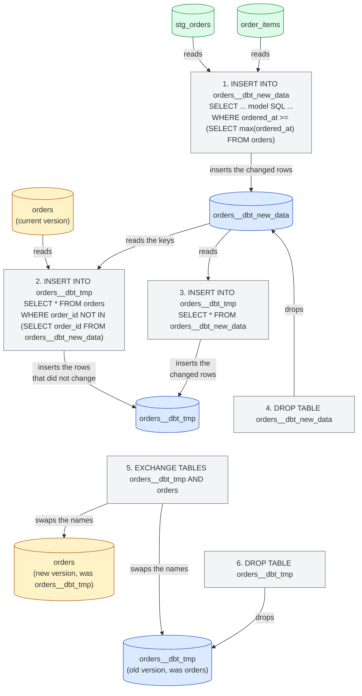
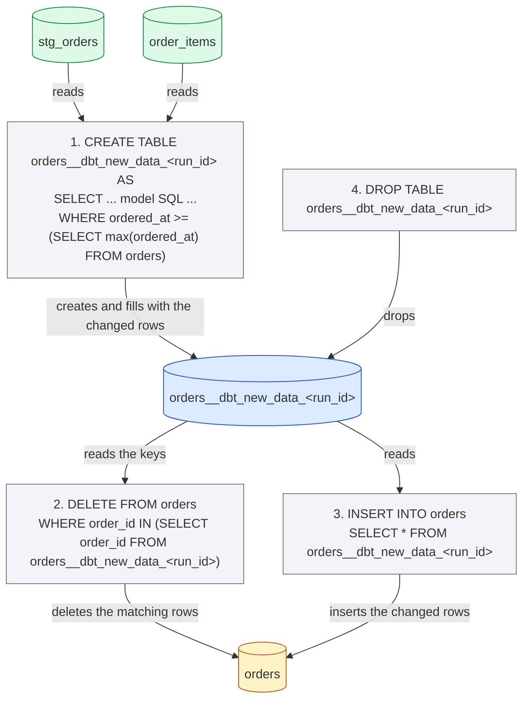
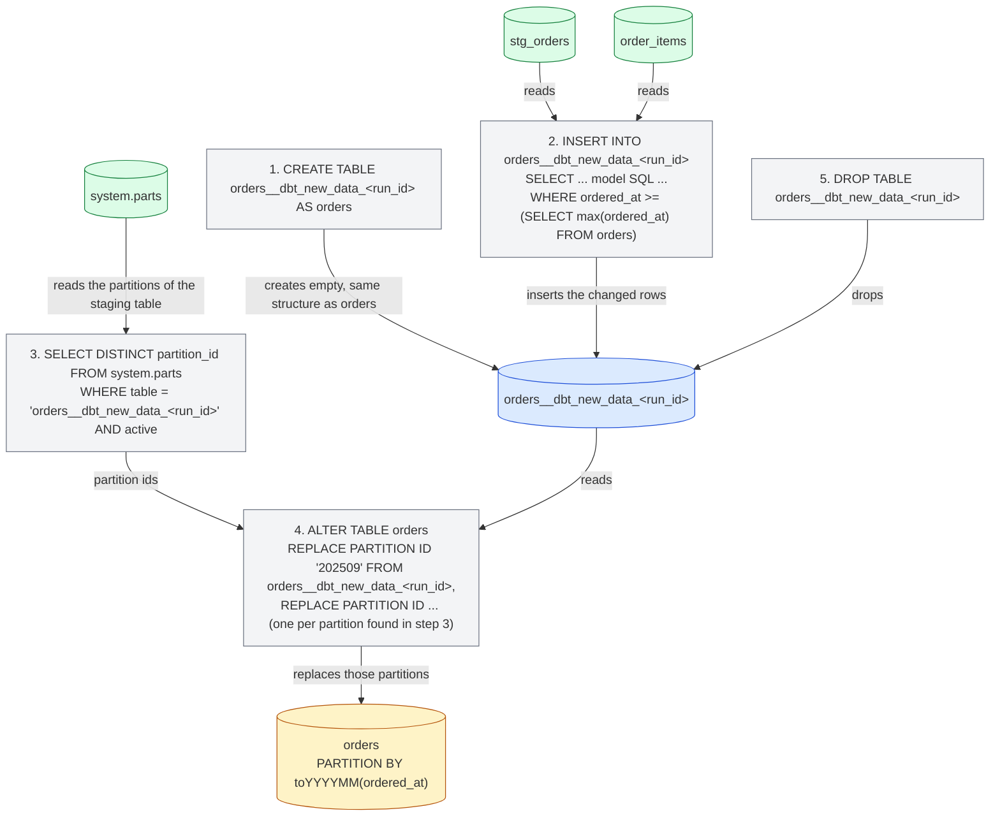

import { ClickHouseSupportedBadge } from "/snippets/ja/components/ClickHouseSupported/ClickHouseSupported.jsx";

<ClickHouseSupportedBadge />

本ガイドでは、dbt Labs の定番サンプルプロジェクトを ClickHouse 向けに移植した [Jaffle Shop for ClickHouse](https://github.com/ClickHouse/jaffle-shop-clickhouse) プロジェクトを題材に、dbt の ClickHouse 固有の部分を解説します。すでにビルドが通る状態のプロジェクトを出発点として、次の内容を扱います。

1. プロジェクトの view や table が ClickHouse 上でどのように作成されるかを理解する。
2. seed でデータを読み込み、ClickHouse の型や table の layout を制御する。
3. table モデルに ClickHouse engine、sorting key、パーティション化を設定する。
4. table を incremental モデルに変更し、incremental strategy を選択する。
5. snapshot を作成する。
6. ClickHouse の materialized view を活用する。

本ガイドは、[ドキュメント](/ja/integrations/connectors/data-ingestion/etl-tools/dbt/index)の他のページや、[Features and configurations](/ja/integrations/connectors/data-ingestion/etl-tools/dbt/features-and-configurations) ページ、[materializations リファレンス](/ja/integrations/connectors/data-ingestion/etl-tools/dbt/materializations)と併せて読むことを想定しています。

## 始める前に {#before-you-start}

まず [ClickHouse/jaffle-shop-clickhouse](https://github.com/ClickHouse/jaffle-shop-clickhouse) の README に従ってください。dbt Core 1.x、dbt OSS、dbt v2、または dbt プラットフォームでプロジェクトをセットアップする方法、接続先をローカルの ClickHouse (docker) または ClickHouse Cloud に設定する方法、`dbt seed` でサンプルデータを読み込む方法、最初の `dbt build` を実行する方法が説明されています。`dbt build` が正常に完了したら、このページに戻って ClickHouse 固有の例と設定を確認してください。

README の手順を終えると、ClickHouse に2つのデータベースができているはずです:

* `raw`: `dbt seed` によって CSV ファイルから読み込まれた6つのソーステーブル (`raw_customers`、`raw_orders`、`raw_items`、`raw_products`、`raw_stores`、`raw_supplies`) 。
* `jaffle_shop` (プロファイルの `schema`) : 6つの staging ビュー (`stg_*`) と7つのマートテーブル (`customers`、`orders`、`order_items`、`products`、`locations`、`supplies`、`metricflow_time_spine`) 。

プロファイルで別の `schema` を使用している場合は、以下のクエリ内の `jaffle_shop` をその値に読み替えてください。

<Note>
  **dbt Core 1.x、dbt OSS、dbt v2、dbt プラットフォーム。** このガイドに登場するコマンドとモデルは、これらのいずれでも同じです。例は、`dbt-clickhouse` 1.10 を使用した dbt Core 1.12 および dbt OSS 2.0 で、ClickHouse 26.8 に対してテストしています。dbt v2 は同じアダプターで動作し、dbt プラットフォームは dbt v2 で動作します。掲載しているコンソール出力は dbt Core 1.x のもので、エンジンによって挙動が異なる数か所については個別に補足しています。v2 アダプターの現在の状況については [dbt OSS、dbt v2、dbt プラットフォームのページ](/ja/integrations/connectors/data-ingestion/etl-tools/dbt/dbt-core-v2-fusion-and-platform) を、dbt プラットフォームを使い始める際は dbt のドキュメントの [Connect ClickHouse](https://docs.getdbt.com/docs/platform/connect-data-platform/connect-clickhouse) を参照してください。
</Note>

dbt コマンド以外の SQL 文はすべて、`clickhouse client`、ClickHouse Cloud の SQL コンソール、またはお好みの SQL クライアントなどから、ClickHouse に対して直接実行することを想定しています。

## プロジェクトのマテリアライズ方法 {#views-and-tables}

Jaffle Shop では、materialization を `dbt_project.yml` で設定しています。staging の model は view、marts は table になります。

```yaml
models:
  jaffle_shop:
    staging:
      +materialized: view
    marts:
      +materialized: table
```

**view** モデルは、実行のたびに `CREATE OR REPLACE VIEW` ステートメントで再作成されます。データを保持しないため構築コストはかかりませんが、そのビューに対するクエリを実行するたびに、モデルの SQL がソーステーブルに対して実行されます。ClickHouse は、モデルのコンパイル済み SQL をビュー定義として保持します。

```sql
SHOW CREATE VIEW jaffle_shop.stg_orders;
```

```response
CREATE VIEW jaffle_shop.stg_orders
(
    `order_id` String,
    `location_id` String,
    `customer_id` String,
    ...
    `ordered_at` DateTime
)
AS WITH
    source AS
    (
        SELECT *
        FROM raw.raw_orders
    ),
    renamed AS
    (
        SELECT
            id AS order_id,
            store_id AS location_id,
            ...
            dateTrunc('day', ordered_at) AS ordered_at
        FROM source
    )
SELECT *
FROM renamed
```

**table** モデルは、実行のたびにゼロから再構築されます。アダプターが新しいテーブルを作成し、モデルのSQLで `INSERT INTO ... SELECT` を実行したうえで、前のバージョンとアトミックに入れ替えます。クエリパフォーマンスはビューよりも大幅に優れていますが、その代わりにストレージを消費し、毎回テーブル全体を再構築するというコストが伴います。dbtが `orders` マート用に作成したテーブルを見てみましょう。

```sql
SHOW CREATE TABLE jaffle_shop.orders;
```

```response
CREATE TABLE jaffle_shop.orders
(
    `order_id` String,
    `location_id` String,
    `customer_id` String,
    ...
    `customer_order_number` UInt64
)
ENGINE = MergeTree
ORDER BY tuple()
SETTINGS replicated_deduplication_window = '0', index_granularity = 8192
```

ここには ClickHouse 固有の点が 2 つあります。この model は table engine を宣言していないため、アダプターは `MergeTree` を使用します。また sorting key も宣言していないため、アダプターは `ORDER BY tuple()` を使用し、その結果データはまったくソートされません。サンプルプロジェクトであれば問題ありませんが、実運用の table では両方を明示的に指定すべきです。次のセクションでは、まさにその作業を行います。[materializations のページ](/ja/integrations/connectors/data-ingestion/etl-tools/dbt/materializations)では、アダプターがサポートするすべての table configuration を一覧しています。

## seed によるデータのロード {#seeds}

Jaffle Shop は dbt の [seeds](https://docs.getdbt.com/docs/build/seeds) を使用して、`seeds/jaffle-data` 内の CSV ファイルから生データをロードします。seed は小規模で静的な参照データ (コードテーブルやマッピング) 向けのものであり、warehouse へのロードを想定したものではありません。このプロジェクトでは、別途インジェスト用のツールを用意しなくてもすぐに始められるようにするため、便宜上 seed を利用しています。そのため、`--vars '{"load_source_data": true}'` を渡さない限り seed は無効化されています。

とはいえ、dbt が ClickHouse のテーブルをどのように作成するのかを学ぶには、seed は依然として適した題材です。dbt は CSV の各カラムに対してカラムの型を推論しますが、推論される型はエンジンによって異なります。

| CSV 値                 | dbt v1     | v2 エンジン         |
| --------------------- | ---------- | --------------- |
| `700`                 | `Int32`    | `Int64`         |
| `0.06`                | `Float32`  | `Float64`       |
| `2024-09-01T15:01:00` | `DateTime` | `DateTime64(6)` |
| `Philadelphia`        | `String`   | `String`        |

型が重要となる場合は、`column_types` で明示的に固定してください。このプロジェクトでは、`dbt_project.yml` 内で `raw_stores` seed の `opened_at` カラムに対してすでにこの指定を行っています。

```yaml
seeds:
  jaffle_shop:
    +schema: raw
    jaffle-data:
      +enabled: "{{ var('load_source_data', false) }}"
      raw_stores:
        +column_types:
          opened_at: DateTime64(3)
```

シードは ClickHouse テーブルの設定である `engine`、`order_by`、`partition_by` も受け付けます。たとえば、`raw_orders` シードを注文時刻でソートし、月単位でパーティション化するには、CSV と同じディレクトリにプロパティファイル `seeds/jaffle-data/_raw_orders.yml` を追加します。

```yaml
seeds:
  - name: raw_orders
    config:
      order_by: (ordered_at, id)
      partition_by: toYYYYMM(ordered_at)
```

<Note>
  これらの ClickHouse の seed 設定は、`dbt_project.yml` の `seeds:` 配下にある `+order_by` や `+engine` キーではなく、プロパティファイルに記述してください。dbt Core 1.x はどちらの形式も受け付けますが、dbt v2 はプロパティファイルでの指定しか認識せず、`dbt_project.yml` 側のキーは `Unrecognized key ... Custom keys must go under +meta` というエラーで拒否されます。
</Note>

この seed を再度ロードし、生成された table を確認します。

```bash
dbt seed --select raw_orders --full-refresh --vars '{"load_source_data": true}'
```

```sql
SHOW CREATE TABLE raw.raw_orders;
```

```response
CREATE TABLE raw.raw_orders
(
    `id` String,
    `customer` String,
    `ordered_at` DateTime,
    `store_id` String,
    `subtotal` Int32,
    `tax_paid` Int32,
    `order_total` Int32
)
ENGINE = MergeTree
PARTITION BY toYYYYMM(ordered_at)
ORDER BY (ordered_at, id)
SETTINGS index_granularity = 8192
```

`dbt seed --full-refresh` はテーブルを削除して再作成するため、本ガイドで後述する materialized view のように、そのテーブルのデータに直接依存するものを構築する前に実行してください。

## ClickHouse 向けにテーブルを設定する {#table-configuration}

まず手をつけるのに適しているのは `orders` マートです。このマートは `customers` マートとプロジェクトのメトリクスの両方から参照されており、タイムスタンプを持つイベント形式のテーブルでもあります。`models/marts/orders.sql` の先頭に `config` ブロックを追加し、エンジン、ソートキー、パーティション化の方式を指定します。

```sql
{{
    config(
        materialized='table',
        engine='MergeTree()',
        order_by='(ordered_at, order_id)',
        partition_by='toYYYYMM(ordered_at)'
    )
}}

with

orders as (

    select * from {{ ref('stg_orders') }}

),
...
```

モデルの残りの部分はそのままです。`materialized='table'` は `dbt_project.yml` が marts に対してすでに指定している内容の繰り返しですが、後でこのモデルをインクリメンタルに切り替えたときにも、モデル自体が設定を自己記述した状態を保てます。このモデルのみを再ビルドします:

```bash
dbt run --select orders
```

```response
1 of 1 START sql table model `jaffle_shop`.`orders` ............................ [RUN]
1 of 1 OK created sql table model `jaffle_shop`.`orders` ....................... [OK in 0.44s]
```

これでテーブルには適切なソートキーが設定され、月ごとに1つのパーティションが作成されるようになりました:

```sql
SHOW CREATE TABLE jaffle_shop.orders;
```

```response
CREATE TABLE jaffle_shop.orders
(
    ...
)
ENGINE = MergeTree
PARTITION BY toYYYYMM(ordered_at)
ORDER BY (ordered_at, order_id)
SETTINGS replicated_deduplication_window = '0', index_granularity = 8192
```

```sql
SELECT partition, sum(rows) AS rows
FROM system.parts
WHERE database = 'jaffle_shop' AND table = 'orders' AND active
GROUP BY partition
ORDER BY partition;
```

```response
┌─partition─┬─rows─┐
│ 202409    │ 1497 │
│ 202410    │ 1698 │
│ 202411    │ 2262 │
...
│ 202508    │ 9389 │
└───────────┴──────┘
```

`engine`、`order_by`、`partition_by` のほかに、テーブル model では `primary_key`、`ttl`、`settings`、`query_settings`、`projections`、`indexes` を指定でき、さらに model contract を通じてカラムに `codec` と `ttl` を設定できます。これらはすべて [materializations のページ](/ja/integrations/connectors/data-ingestion/etl-tools/dbt/materializations)で説明しています。

## インクリメンタルモデルの作成 {#incremental}

62,000 行程度であれば実行のたびに `orders` をゼロから再構築しても問題ありませんが、1 日に数百万行ずつ増えるテーブルではそうはいきません。dbt の [インクリメンタルマテリアライゼーション](https://docs.getdbt.com/docs/build/incremental-models) では、前回の実行以降に変更された行だけが処理されます。`orders` モデルをインクリメンタル化するには、次の 2 点を追加します。

1. **`unique_key`**: 行を識別するカラムで、ここでは `order_id` です。アダプターはこれを使い、再度処理された行を重複させずに置き換えます。
2. **インクリメンタルフィルター**: 処理対象の行だけを選択する `where` 句を `` で囲んだものです。インクリメンタル実行時には適用されますが、テーブルの初回構築時 (または `--full-refresh` による再構築時) には適用されません。注文にはタイムスタンプがあるため、フィルターでは `{{ this }}` 変数を通じて参照したテーブル内の既存の最新値と `ordered_at` を比較します。

`models/marts/orders.sql` を更新し、`config` ブロックとモデルの末尾を次のようにします。

```sql
{{
    config(
        materialized='incremental',
        unique_key='order_id',
        engine='MergeTree()',
        order_by='(ordered_at, order_id)',
        partition_by='toYYYYMM(ordered_at)'
    )
}}

with

orders as (

    select * from {{ ref('stg_orders') }}

),

...

select * from customer_order_count



-- this filter will only be applied on an incremental run
where ordered_at >= (select max(ordered_at) from {{ this }})


```

`stg_orders` は `ordered_at` を日単位に切り捨てるため、フィルターには `>=` を使用します。実行のたびに最新日の全データが再処理されますが、`unique_key` があるため、すでにロード済みの行は重複せずに置き換えられます。これにより、同じ日のうちに遅れて到着した注文も安全に扱えます。

モデルを実行します。テーブルはすでに存在するため、この初回実行もインクリメンタルな実行となり、最新日のデータのみが再処理されます。

```bash
dbt run --select orders
```

```response
1 of 1 START sql incremental model `jaffle_shop`.`orders` ...................... [RUN]
1 of 1 OK created sql incremental model `jaffle_shop`.`orders` ................. [OK in 0.94s]
```

次に、新しいデータを追加します。Jaffle Shop のデータは 2025 年 8 月までで終わっているため、昨日 jaffle を注文した新しい顧客 Clicky McClickHouse を追加してみましょう。raw テーブルに顧客、注文、およびその注文アイテムを挿入します:

```sql
INSERT INTO raw.raw_customers VALUES ('clicky-0001', 'Clicky McClickHouse');

INSERT INTO raw.raw_orders VALUES
    ('clicky-order-0001', 'clicky-0001', now() - INTERVAL 1 DAY,
     '4b6c2304-2b9e-41e4-942a-cf11a1819378', 1100, 66, 1166);

INSERT INTO raw.raw_items VALUES ('clicky-item-0001', 'clicky-order-0001', 'JAF-001');
```

店舗 id は Philadelphia、商品は価格 11.00 の `nutellaphone who dis?` という jaffle、税率は Philadelphia の 6% なので、プロジェクトのデータテストは引き続きパスします。`orders` よりも先に staging のビューと `order_items` テーブルが新しい行を参照できるよう、プロジェクト全体を実行します。

```bash
dbt run
```

```response
...
10 of 13 OK created sql table model `jaffle_shop`.`order_items` ................ [OK in 0.30s]
...
12 of 13 START sql incremental model `jaffle_shop`.`orders` .................... [RUN]
12 of 13 OK created sql incremental model `jaffle_shop`.`orders` ............... [OK in 0.73s]
13 of 13 START sql table model `jaffle_shop`.`customers` ....................... [RUN]
13 of 13 OK created sql table model `jaffle_shop`.`customers` .................. [OK in 0.28s]
```

新しい注文はインクリメンタルテーブルに追加されており、そこから再構築された `customers` マートも新しい顧客を認識しています。

```sql
SELECT order_id, customer_id, ordered_at, order_total, customer_order_number
FROM jaffle_shop.orders
WHERE customer_id = 'clicky-0001';
```

```response
┌─order_id──────────┬─customer_id─┬──────────ordered_at─┬─order_total─┬─customer_order_number─┐
│ clicky-order-0001 │ clicky-0001 │ 2026-09-14 00:00:00 │       11.66 │                     1 │
└───────────────────┴─────────────┴─────────────────────┴─────────────┴───────────────────────┘
```

```sql
SELECT customer_name, count_lifetime_orders, lifetime_spend, customer_type
FROM jaffle_shop.customers
WHERE customer_id = 'clicky-0001';
```

```response
┌─customer_name───────┬─count_lifetime_orders─┬─lifetime_spend─┬─customer_type─┐
│ Clicky McClickHouse │                     1 │          11.66 │ new           │
└─────────────────────┴───────────────────────┴────────────────┴───────────────┘
```

### 内部動作 {#internals}

ClickHouse の query log を見ると、アダプターがインクリメンタルな update のために実行した文を確認できます:

```sql
SELECT event_time, written_rows, tables
FROM system.query_log
WHERE query_kind = 'Insert' AND type = 'QueryFinish'
  AND has(databases, 'jaffle_shop')
  AND event_time > now() - INTERVAL 15 MINUTE
ORDER BY event_time;
```

アダプターのデフォルトのインクリメンタル戦略は次のように動作します。このセクションの図では、テーブルからステートメントへの矢印はそのステートメントがそのテーブルを読み取ることを表し、ステートメントからテーブルへの矢印はそのテーブルへの書き込み、ミューテーション、リネーム、または削除を表します:

1. テーブル `orders__dbt_new_data` が作成され、インクリメンタルフィルターを含むモデルの SQL の結果がそこに挿入されます。上記の実行では 378 行が書き込まれました。すでにロード済みの最新日の 377 件の注文に、新しい 1 件を加えたものです。
2. `orders` と同じ構造のテーブル `orders__dbt_tmp` が作成され、`order_id` が `orders__dbt_new_data` に存在しない `orders` の行がすべてそこにコピーされます。
3. `orders__dbt_new_data` のすべての行が `orders__dbt_tmp` に挿入されます。最新日の行を重複させずに置き換えているのが、このステップ 2 と 3 です。
4. `orders__dbt_new_data` が削除されます。
5. `orders__dbt_tmp` がアトミックな `EXCHANGE TABLES` ステートメントによって `orders` と入れ替えられます(`orders__dbt_backup` への中間的なリネームを経由します)。これにより、`orders` が新しいバージョンを保持することになります。
6. 古いバージョンは削除されます。



ステップ 2 ではテーブル全体をコピーするため、この戦略は非常に大規模な model ではテーブルの再構築と同程度のコストがかかります。[制限事項](/ja/integrations/connectors/data-ingestion/etl-tools/dbt/index#limitations)を参照してください。以下の戦略では、このコピーを回避できます。

### Append 戦略 {#append-strategy}

`append` 戦略では、モデルが選択した行をそのままターゲットテーブルに挿入します。一時テーブルは作成されず、コピーも発生しないため、インクリメンタル実行としては最も低コストです。その代償として、重複排除も一切行われません。インクリメンタルの filter がすでにテーブルに存在する行を選択してしまうと、その行は二重に登録されます。イミュータブルなイベント形式のデータに使用し、filter が本当に新しい行のみを選択するようにしてください。

日単位で切り捨てた `ordered_at` を使う場合は、filter を `>` に切り替えることになります。モデルを次のように変更します。

```sql
{{
    config(
        materialized='incremental',
        incremental_strategy='append',
        unique_key='order_id',
        engine='MergeTree()',
        order_by='(ordered_at, order_id)',
        partition_by='toYYYYMM(ordered_at)'
    )
}}

...



-- this filter will only be applied on an incremental run
where ordered_at > (select max(ordered_at) from {{ this }})


```

2人目の新規顧客 Danny DeBito を追加します。この顧客は本日ブルックリン (税率4%) で jaffle と coffee を含む注文を行っています。

```sql
INSERT INTO raw.raw_customers VALUES ('danny-0001', 'Danny DeBito');

INSERT INTO raw.raw_orders VALUES
    ('danny-order-0001', 'danny-0001', now(),
     '40e6ddd6-b8f6-4e17-8bd6-5e53966809d2', 1900, 76, 1976);

INSERT INTO raw.raw_items VALUES
    ('danny-item-0001', 'danny-order-0001', 'JAF-003'),
    ('danny-item-0002', 'danny-order-0001', 'BEV-004');
```

```bash
dbt run
```

```response
...
12 of 13 START sql incremental model `jaffle_shop`.`orders` .................... [RUN]
12 of 13 OK created sql incremental model `jaffle_shop`.`orders` ............... [OK in 0.11s]
...
```

インクリメンタルモデルは、前回の実行のごくわずかな時間で完了しました。新規顧客はいずれも、テーブル内に注文がちょうど1件あります:

```sql
SELECT order_id, customer_id, ordered_at, order_total, is_food_order, is_drink_order
FROM jaffle_shop.orders
WHERE customer_id IN ('clicky-0001', 'danny-0001')
ORDER BY ordered_at;
```

```response
┌─order_id──────────┬─customer_id─┬──────────ordered_at─┬─order_total─┬─is_food_order─┬─is_drink_order─┐
│ clicky-order-0001 │ clicky-0001 │ 2026-09-14 00:00:00 │       11.66 │             1 │              0 │
│ danny-order-0001  │ danny-0001  │ 2026-09-15 00:00:00 │       19.76 │             1 │              1 │
└───────────────────┴─────────────┴─────────────────────┴─────────────┴───────────────┴────────────────┘
```

query log を見ると違いが分かります。今回 `orders` を操作しているステートメントは、モデルの SQL とインクリメンタル filter を含む単一の `INSERT INTO jaffle_shop.orders ... SELECT ...` だけで、書き込まれた行は 1 行のみです。

<Warning>
  `>` と日単位に切り捨てられた timestamp を使う場合、ロード済みの最新の注文と同じ日の、それより後の時刻に届いた注文は取り込まれません。実際のプロジェクトで `append` 戦略を使う場合は、元の精度の timestamp、または単調増加するインジェスト時刻で filter してください。
</Warning>

### Delete and insert 戦略 {#delete-insert-strategy}

ClickHouse は従来、非同期[ミューテーション](/ja/reference/statements/alter/index)という形でしか更新と削除をサポートしておらず、その機能は限定的でした。ミューテーションは極めて I/O 負荷が高くなることがあるため、原則として使用を避けるべきです。ClickHouse 22.8 で[論理削除](/ja/reference/statements/delete)が、ClickHouse 25.7 で[論理更新](/ja/reference/statements/update)が導入されました。これらを使うと、マテリアライズは非同期に行われるものの、ユーザーから見れば単一の削除文や更新文の結果が即座に反映されます。

`delete+insert` 戦略は論理削除を利用するもので、`incremental_strategy` パラメータで設定します:

```sql
{{
    config(
        materialized='incremental',
        incremental_strategy='delete+insert',
        unique_key='order_id',
        engine='MergeTree()',
        order_by='(ordered_at, order_id)',
        partition_by='toYYYYMM(ordered_at)'
    )
}}
```

この戦略はターゲットテーブルに対して直接操作を行うため、処理が途中で失敗すると、インクリメンタルモデルのデータが不正な状態のまま残る可能性があります。アトミックなスワップは行われません。まとめると次のとおりです。

1. 一時テーブル (`orders__dbt_new_data_<run_id>`) が作成され、モデルが選択した行がそこに挿入されます。
2. 一時テーブルに存在するすべての `order_id` を対象に、`orders` に対して `DELETE` が発行されます。
3. 一時テーブルの行が `orders` に挿入されます。
4. 一時テーブルが削除されます。



### Insert overwrite 戦略 (実験的機能) {#insert-overwrite-strategy}

`insert_overwrite` 戦略はパーティション単位で丸ごと置き換えるため、`orders` の月次パーティションのような `partition_by` の設定が必要です。処理は次の手順で行われます。

1. `orders` と同じ構造のステージングテーブル (`orders__dbt_new_data_<run_id>`) を作成します。
2. モデルが選択した行のみをステージングテーブルに挿入します。
3. ステージングテーブルに存在するパーティションを `system.parts` から一覧します。
4. `ALTER TABLE ... REPLACE PARTITION ... FROM` により、該当するパーティションだけをステージングテーブルの内容で `orders` 内で置き換えます。
5. ステージングテーブルを削除します。

このアプローチには次の利点があります。

* テーブル全体をコピーしないため、デフォルトの戦略よりも高速です。
* INSERT 操作が正常に完了するまで元のテーブルを変更しないため、他の戦略よりも安全です。途中で失敗しても、元のテーブルはそのまま残ります。
* 「パーティションの不変性」というデータエンジニアリングのベストプラクティスに沿っているため、インクリメンタル処理や並列処理、ロールバックなどが容易になります。



[materializations のページ](/ja/integrations/connectors/data-ingestion/etl-tools/dbt/materializations#materialization-incremental)では、`microbatch` 戦略や `on_schema_change` など、インクリメンタル materialization のその他のオプションについて説明しています。

## スナップショットの作成 {#snapshot}

dbt の [スナップショット](https://docs.getdbt.com/docs/build/snapshots) は、可変テーブルの行が時間の経過とともにどのように変化したかを記録するもので、アナリストは過去の任意の時点におけるデータの状態を振り返って確認できます。スナップショットは [タイプ 2 の緩やかに変化する次元](https://en.wikipedia.org/wiki/Slowly_changing_dimension#Type_2:_add_new_row) を実装しており、行の各バージョンは、それが有効であったインターバルとともに保存されます。

`customers` マートは good な候補です。`count_lifetime_orders`、`lifetime_spend`、`customer_type` はいずれも、顧客が再度注文するたびに変化します。続行する前に、`orders` モデルを [インクリメンタルのセクション](#incremental) で説明したデフォルトのインクリメンタル戦略に戻しておきます (`incremental_strategy='append'` を削除し、filter を `>=` に戻します) 。こうすることで、本日これ以降に行われた注文が取り込まれます。

dbt 1.9 以降、snapshot は YAML で定義します。`snapshots/customers_snapshot.yml` を作成します:

```yaml
snapshots:
  - name: customers_snapshot
    relation: ref('customers')
    config:
      unique_key: customer_id
      strategy: check
      check_cols:
        - count_lifetime_orders
        - lifetime_spend
        - customer_type
```

`check` 戦略は、実行ごとに現在の snapshot と source の間で指定したカラムを比較し、いずれかに変更があれば新しいバージョンを記録します。model に信頼できる「最終更新」の timestamp カラムがある場合は、`timestamp` 戦略の方が低コストです。その場合は `strategy: timestamp` と `updated_at: <column>` を設定します。Jaffle Shop の `last_ordered_at` は日単位に切り捨てられているため、同じ日の2回目の注文を検知できません。そのため、この例では `check` を使用しています。

最初のsnapshotを取得します:

```bash
dbt snapshot
```

```response
1 of 1 START snapshot `jaffle_shop`.`customers_snapshot` ....................... [RUN]
1 of 1 OK snapshotted `jaffle_shop`.`customers_snapshot` ....................... [OK in 0.17s]
```

snapshot テーブルは model と同じ場所に作成されます。このプロジェクトの `generate_schema_name` マクロは、production 以外の target ではすべての relation を target スキーマに配置するため、snapshot に指定した `schema` の config が効果を持つのは `prod` target の場合のみです。このテーブルには顧客ごとに 1 行が格納され、dbt の管理用カラムである `dbt_valid_from` と `dbt_valid_to` が含まれます。後者は、その行の現在のバージョンでは `NULL` になります:

```sql
SELECT customer_id, count_lifetime_orders, lifetime_spend, customer_type, dbt_valid_from, dbt_valid_to
FROM jaffle_shop.customers_snapshot
WHERE customer_id IN ('clicky-0001', 'danny-0001')
ORDER BY customer_id, dbt_valid_from;
```

```response
┌─customer_id─┬─count_lifetime_orders─┬─lifetime_spend─┬─customer_type─┬──────dbt_valid_from─┬─dbt_valid_to─┐
│ clicky-0001 │                     1 │          11.66 │ new           │ 2026-09-15 01:15:32 │         ᴺᵁᴸᴸ │
│ danny-0001  │                     1 │          19.76 │ new           │ 2026-09-15 01:15:32 │         ᴺᵁᴸᴸ │
└─────────────┴───────────────────────┴────────────────┴───────────────┴─────────────────────┴──────────────┘
```

Clicky が今日もコーヒーを飲みに戻ってきました。

```sql
INSERT INTO raw.raw_orders VALUES
    ('clicky-order-0002', 'clicky-0001', now(),
     '4b6c2304-2b9e-41e4-942a-cf11a1819378', 600, 36, 636);

INSERT INTO raw.raw_items VALUES ('clicky-item-0002', 'clicky-order-0002', 'BEV-001');
```

model を実行して `orders` と `customers` に新しい注文を反映させ、続いて 2 つ目の snapshot を作成します:

```bash
dbt run
dbt snapshot
```

```response
1 of 1 START snapshot `jaffle_shop`.`customers_snapshot` ....................... [RUN]
1 of 1 OK snapshotted `jaffle_shop`.`customers_snapshot` ....................... [OK in 0.73s]
```

これで Clicky はスナップショット内に 2 行を持つことになります。最初のバージョンは `dbt_valid_to` が設定されてクローズされ、新しいバージョン (注文が 2 件の `returning` 顧客) はオープンな状態です。Danny には変更がないため、その行はそのままです:

```sql
SELECT customer_id, count_lifetime_orders, lifetime_spend, customer_type, dbt_valid_from, dbt_valid_to
FROM jaffle_shop.customers_snapshot
WHERE customer_id IN ('clicky-0001', 'danny-0001')
ORDER BY customer_id, dbt_valid_from;
```

```response
┌─customer_id─┬─count_lifetime_orders─┬─lifetime_spend─┬─customer_type─┬──────dbt_valid_from─┬────────dbt_valid_to─┐
│ clicky-0001 │                     1 │          11.66 │ new           │ 2026-09-15 01:15:32 │ 2026-09-15 01:16:16 │
│ clicky-0001 │                     2 │          18.02 │ returning     │ 2026-09-15 01:16:16 │                ᴺᵁᴸᴸ │
│ danny-0001  │                     1 │          19.76 │ new           │ 2026-09-15 01:15:32 │                ᴺᵁᴸᴸ │
└─────────────┴───────────────────────┴────────────────┴───────────────┴─────────────────────┴─────────────────────┘
```

内部的には、アダプターは新しいバージョンのスナップショットを `customers_snapshot__snapshot_upsert` というテーブルに構築し、`EXCHANGE TABLES` で入れ替えます (サーバーがテーブルの交換に対応していない場合は drop とリネームで代替します) 。このため、読み取り側からは常に以前のバージョンか新しいバージョンのいずれかのスナップショットが見えます。設定のリファレンスについては、[マテリアライゼーションのページの snapshot セクション](/ja/integrations/connectors/data-ingestion/etl-tools/dbt/materializations#snapshot)を参照してください。

## materialized view の利用 {#materialized-views}

ここまでの内容では、新しいデータを model に取り込むために毎回 `dbt run` が必要でした。ClickHouse の [materialized view](/ja/concepts/features/materialized-views/index) はこれとは異なり、insert トリガーとして動作します。ソーステーブルに挿入された行のブロックはその都度 view の `SELECT` によって変換され、ターゲットテーブルへ書き込まれます。スケジューリングは一切不要です。アダプターは `materialized_view` の materialization としてこの機能を提供します。

生データの orders テーブルから直接読み取り、店舗ごと・日ごとの注文数と売上を算出する `models/marts/daily_store_revenue.sql` を作成します:

```sql
{{
    config(
        materialized='materialized_view',
        engine='SummingMergeTree()',
        order_by='(order_date, store_id)'
    )
}}

select
    toDate(ordered_at) as order_date,
    store_id,
    count() as orders,
    sum(order_total) as revenue_cents
from {{ source('ecom', 'raw_orders') }}
group by order_date, store_id
```

`engine` と `order_by` はターゲットテーブルに適用されます。`SummingMergeTree` は、パーツをマージする際に同じソートキーを持つ行の数値カラムを合算します。これは、日ごと・店舗ごとの集計にまさに必要な挙動です。

```bash
dbt run --select daily_store_revenue
```

```response
1 of 1 START sql materialized_view model `jaffle_shop`.`daily_store_revenue` ... [RUN]
1 of 1 OK created sql materialized_view model `jaffle_shop`.`daily_store_revenue`  [OK in 0.25s]
```

アダプターは2つのオブジェクトを作成しました。1つは model と同じ名前のターゲットテーブル、もう1つは `_mv` という接尾辞が付いた materialized view 自体で、`TO` 句でターゲットテーブルを指しています。デフォルト (`catchup=True`) では、ターゲットテーブルに既存の注文データも backfill されます:

```sql
SELECT name, engine
FROM system.tables
WHERE database = 'jaffle_shop' AND name LIKE 'daily_store_revenue%';
```

```response
┌─name───────────────────┬─engine───────────┐
│ daily_store_revenue    │ SummingMergeTree │
│ daily_store_revenue_mv │ MaterializedView │
└────────────────────────┴──────────────────┘
```

```sql
SHOW CREATE TABLE jaffle_shop.daily_store_revenue_mv;
```

```response
CREATE MATERIALIZED VIEW jaffle_shop.daily_store_revenue_mv TO jaffle_shop.daily_store_revenue
(
    `order_date` Date,
    `store_id` String,
    `orders` UInt64,
    `revenue_cents` Int64
)
AS SELECT
    toDate(ordered_at) AS order_date,
    store_id,
    count() AS orders,
    sum(order_total) AS revenue_cents
FROM raw.raw_orders
GROUP BY
    order_date,
    store_id
```

次に、Danny の生データの注文をもう 1 件挿入します。この後 dbt は実行しません:

```sql
INSERT INTO raw.raw_orders VALUES
    ('danny-order-0002', 'danny-0001', now(),
     '40e6ddd6-b8f6-4e17-8bd6-5e53966809d2', 1400, 56, 1456);

INSERT INTO raw.raw_items VALUES ('danny-item-0003', 'danny-order-0002', 'JAF-004');
```

ターゲットテーブルにはすでに反映されています。Brooklyn の本日の注文は 2 件になりました:

```sql
SELECT order_date, store_id, sum(orders) AS orders, sum(revenue_cents) AS revenue_cents
FROM jaffle_shop.daily_store_revenue
WHERE order_date >= yesterday()
GROUP BY order_date, store_id
ORDER BY order_date, store_id;
```

```response
┌─order_date─┬─store_id─────────────────────────────┬─orders─┬─revenue_cents─┐
│ 2026-09-14 │ 4b6c2304-2b9e-41e4-942a-cf11a1819378 │      1 │          1166 │
│ 2026-09-15 │ 40e6ddd6-b8f6-4e17-8bd6-5e53966809d2 │      2 │          3432 │
│ 2026-09-15 │ 4b6c2304-2b9e-41e4-942a-cf11a1819378 │      1 │           636 │
└────────────┴──────────────────────────────────────┴────────┴───────────────┘
```

このクエリが意図的に `sum()` と `GROUP BY` で集計しているのには理由があります。`SummingMergeTree` は、バックグラウンドでパーツがマージされたときにのみ同一キーの行をまとめるため、それまではBrooklynの2件の注文はテーブル上で2行のままです。summing系やaggregating系のエンジンでは、常に読み取り時に集計する (または `FINAL` を使う) ようにしてください。一方、`orders` インクリメンタルモデルの側は、次の `dbt run` までDannyの注文が1件のままです。

2回目以降の `dbt run` ではターゲットテーブルとそのデータは保持され、変更内容が許す場合は `ALTER TABLE ... MODIFY QUERY` によってビュー定義のみが更新されます。そのため、このモデルをプロジェクトに残しておいても問題ありません。`dbt run --full-refresh` はターゲットテーブルを作り直し、再度バックフィルを実行します (`catchup` が `False` の場合を除く) 。残りの内容は[materialized viewのページ](/ja/integrations/connectors/data-ingestion/etl-tools/dbt/materialization-materialized-view)で扱っています。`on_schema_change` によるスキーマ変更、`catchup` によるバックフィルの無効化、リフレッシュ可能なマテリアライズドビュー、複数のビューから同一のターゲットへ書き込む構成、ターゲットテーブルを独立したモデルとして定義する方法などです。

## さらに詳しい情報 {#further-information}

このガイドではdbtのごく一部しか扱っていません。ClickHouse固有ではない事柄については、[dbtドキュメント](https://docs.getdbt.com/docs/introduction)を参照してください。アダプターについては、profileの設定やグローバルな機能を解説した[features and configurations](/ja/integrations/connectors/data-ingestion/etl-tools/dbt/features-and-configurations)ページを、上記で使用したすべての設定については[materializations のページ](/ja/integrations/connectors/data-ingestion/etl-tools/dbt/materializations)を、dbt OSS、dbt v2、またはdbtプラットフォームを利用している場合は[dbt OSS、dbt v2、dbtプラットフォームのページ](/ja/integrations/connectors/data-ingestion/etl-tools/dbt/dbt-core-v2-fusion-and-platform)をご覧ください。[Jaffle Shop for ClickHouse](https://github.com/ClickHouse/jaffle-shop-clickhouse)への新しい例の投稿も歓迎します。