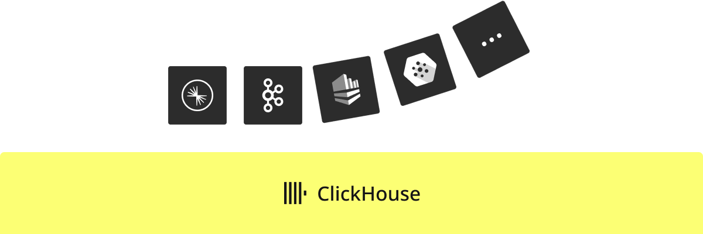
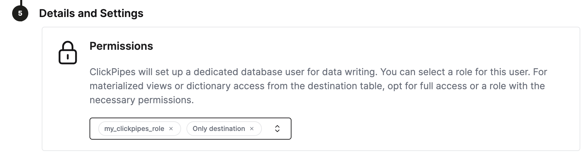

import KafkaSVG from "../../images/logos/kafka.svg";
import ConfluentSVG from "../../images/logos/confluent.svg";
import MskSVG from "../../images/logos/msk.svg";
import AzureEventHubsSVG from "../../images/logos/azure_event_hubs.svg";
import WarpStreamSVG from "../../images/logos/warpstream.svg";
import S3SVG from "../../images/logos/amazon_s3_logo.svg";
import AmazonKinesis from "../../images/logos/amazon_kinesis_logo.svg";
import GCSSVG from "../../images/logos/gcs.svg";

# ClickHouse Cloudとの統合

## はじめに

[ClickPipes](https://clickhouse.com/cloud/clickpipes)は、さまざまなソースからのデータをわずか数クリックで取り込むことを可能にする管理された統合プラットフォームです。最も要求の厳しいワークロード向けに設計されたClickPipesの堅牢でスケーラブルなアーキテクチャは、一貫したパフォーマンスと信頼性を保証します。ClickPipesは、長期的なストリーミングニーズにも、一度きりのデータローディングジョブにも使用できます。

## 対応データソース

|名前|ロゴ|タイプ|ステータス|説明|
|----|----|----|------|-----------|
|Apache Kafka|<KafkaSVG style={{width: '3rem', 'height': '3rem'}} />|ストリーミング|安定|ClickPipesを設定し、Apache KafkaからClickHouse Cloudへストリーミングデータの取り込みを開始します。|
|Confluent Cloud|<ConfluentSVG style={{width: '3rem'}} />|ストリーミング|安定|ConfluentとClickHouse Cloudの直接統合により、両者の組み合わせの力を引き出します。|
|Redpanda||ストリーミング|安定|ClickPipesを設定し、RedPandaからClickHouse Cloudへストリーミングデータの取り込みを開始します。|
|AWS MSK|<MskSVG style={{width: '3rem', 'height': '3rem'}} />|ストリーミング|安定|ClickPipesを設定し、AWS MSKからClickHouse Cloudへストリーミングデータの取り込みを開始します。|
|Azure Event Hubs|<AzureEventHubsSVG style={{width: '3rem'}} />|ストリーミング|安定|ClickPipesを設定し、Azure Event HubsからClickHouse Cloudへストリーミングデータの取り込みを開始します。|
|WarpStream|<WarpStreamSVG style={{width: '3rem'}} />|ストリーミング|安定|ClickPipesを設定し、WarpStreamからClickHouse Cloudへストリーミングデータの取り込みを開始します。|
|Amazon S3|<S3SVG style={{width: '3rem', height: 'auto'}} />|オブジェクトストレージ|安定|ClickPipesを設定し、大量のデータをオブジェクトストレージから取り込みます。|
|Google Cloud Storage|<GCSSVG style={{width: '3rem', height: 'auto'}} />|オブジェクトストレージ|安定|ClickPipesを設定し、大量のデータをオブジェクトストレージから取り込みます。|
|Amazon Kinesis|<AmazonKinesis style={{width: '3rem', height: 'auto'}} />|ストリーミング|安定|ClickPipesを設定し、Amazon KinesisからClickHouse Cloudへストリーミングデータの取り込みを開始します。|

ClickPipesにはさらに多くのコネクタが追加されますので、詳細は[お問い合わせください](https://clickhouse.com/company/contact?loc=clickpipes)。

## 固定IPリスト

以下は、ClickPipesが各地域のKafkaブローカーに接続するために使用する固定NAT IPです。
関連するインスタンスの地域IPをIP許可リストに追加して、トラフィックを許可してください。
インスタンス地域がここにリストされていない場合は、デフォルトの地域にフォールバックします。

- EU地域用の **eu-central-1**
- `us-east-1` インスタンス用の **us-east-1**
- 他のすべての地域用の **us-east-2**

| ClickHouse Cloud 地域 | IPアドレス |
|-----------------------|------------|
| **eu-central-1**      | `18.195.233.217`, `3.127.86.90`, `35.157.23.2`, `18.197.167.47`, `3.122.25.29`, `52.28.148.40` |
| **us-east-2**         | `3.131.130.196`, `3.23.172.68`, `3.20.208.150`, `3.132.20.192`, `18.119.76.110`, `3.134.185.180` |
| **us-east-1**         | `54.82.38.199`, `3.90.133.29`, `52.5.177.8`, `3.227.227.145`, `3.216.6.184`, `54.84.202.92`, `3.131.130.196`, `3.23.172.68`, `3.20.208.150` |

## ClickHouse設定の調整
ClickHouse Cloudは、ほとんどのユースケースに対応するための適切なデフォルトを提供します。ただし、ClickPipesのために特定のClickHouse設定を調整する必要がある場合は、ClickPipes専用のロールを作成することが最も柔軟な解決策です。
ステップ：
1. カスタムロールを作成します `CREATE ROLE my_clickpipes_role SETTINGS ...`。詳細については[CREATE ROLE](/docs/ja/sql-reference/statements/create/role.md)文法を参照してください。
2. ClickPipes作成時の`Details and Settings`ステップで、ClickPipesユーザーにカスタムロールを追加します。

## エラーレポート
ClickPipesは、宛先テーブルの隣に`<destination_table_name>_clickpipes_error`という接尾辞を持つテーブルを作成します。このテーブルには、ClickPipeの操作（ネットワーク、接続性など）からのエラーや、スキーマに適合しないデータが含まれます。エラーテーブルには7日間の[有効期限 (TTL)](https://clickhouse.com/docs/ja/engines/table-engines/mergetree-family/mergetree#table_engine-mergetree-ttl)があります。
ClickPipesが15分間ソースまたは宛先に接続できない場合、ClickPipesインスタンスは停止し、エラーテーブルに適切なメッセージを保存します（ClickHouseインスタンスが利用可能な場合）。

## よくある質問
- **ClickPipesとは何ですか？**

  ClickPipesは、ユーザーがClickHouseサービスを外部データソース、特にKafkaに簡単に接続できるようにするClickHouse Cloudの機能です。Kafka向けのClickPipesを使用することで、ユーザーはClickHouseにデータを継続的にロードし、リアルタイム分析用に利用可能にします。

- **ClickPipesはデータ変換をサポートしていますか？**

  はい、ClickPipesはDDL作成を公開することで基本的なデータ変換をサポートしています。その後、ClickHouse Cloudサービスの宛先テーブルにデータがロードされる際に、ClickHouseの[マテリアライズドビューの機能](https://clickhouse.com/docs/ja/guides/developer/cascading-materialized-views)を活用して、より高度な変換を適用することができます。

- **ClickPipesの使用には追加のコストがかかりますか？**

  現在、ClickPipesは別途請求されていません。ClickPipesを実行すると、他の取り込みワークロードと同様に、宛先ClickHouse Cloudサービスで間接的な計算およびストレージコストが発生する可能性があります。

- **Kafka用のClickPipesを使用する際にエラーや障害を処理する方法はありますか？**

  はい、Kafka用のClickPipesは、Kafkaからデータを消費する際に障害が発生した場合に自動的にリトライします。ClickPipesは、エラーや不正なデータを7日間保持する専用のエラーテーブルの有効化もサポートしています。
