import KafkaSVG from "../../images/logos/kafka.svg";
import ConfluentSVG from "../../images/logos/confluent.svg";
import MskSVG from "../../images/logos/msk.svg";
import AzureEventHubsSVG from "../../images/logos/azure_event_hubs.svg";
import WarpStreamSVG from "../../images/logos/warpstream.svg";

# Kafka と ClickHouse Cloud の統合
## 前提条件
[ClickPipes のイントロダクション](./index.md)を確認してください。

## 初めての Kafka ClickPipe の作成

1. ClickHouse Cloud サービスの SQL コンソールにアクセスします。

  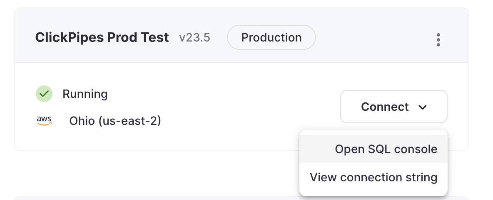

2. 左側のメニューで `Data Sources` ボタンを選択し、「Set up a ClickPipe」をクリックします。

  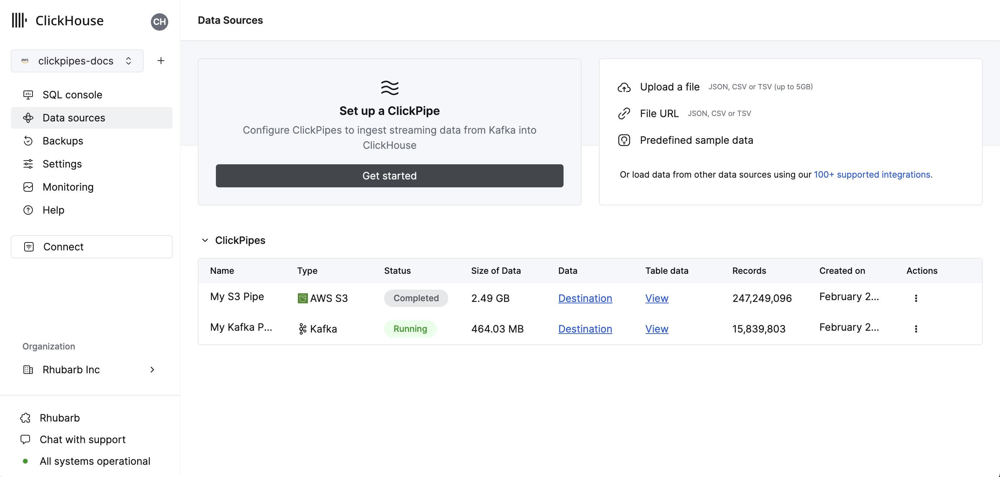

3. データソースを選択します。

  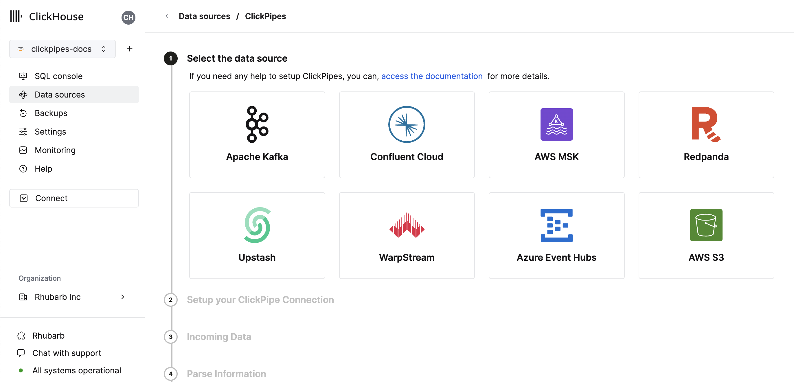

4. フォームに、ClickPipe の名前、説明（オプション）、クレデンシャル、およびその他の接続詳細を入力します。

  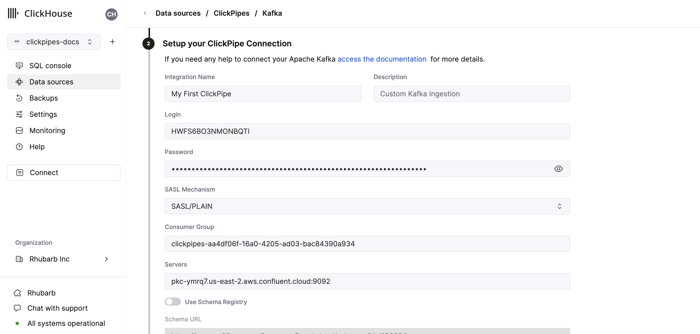

5. スキーマレジストリを設定します。Avro ストリームには有効なスキーマが必要で、JSON にはオプションです。このスキーマは、選択されたトピック上で [AvroConfluent](../../../interfaces/formats.md/#data-format-avro-confluent) を解析したり、JSON メッセージを検証するのに使用されます。
- パースできない Avro メッセージや検証に失敗した JSON メッセージはエラーを生成します。
- スキーマレジストリの「ルート」パス。例えば、Confluent Cloud のスキーマレジストリの URL は HTTPS の URL であり、パスがない形式です。例：`https://test-kk999.us-east-2.aws.confluent.cloud`。ルートパスのみが指定されている場合、スキーマはサンプルされた Kafka メッセージに埋め込まれた ID によってカラム名とタイプを決定します。
- 数値スキーマ ID によるスキーマドキュメントのパス `/schemas/ids/[ID]`。スキーマ ID を使用した完全な URL は、`https://registry.example.com/schemas/ids/1000` のようになります。
- サブジェクト名によるスキーマドキュメントのパス `/subjects/[subject_name]`。オプションで、特定のバージョンは URL に `/versions/[version]` を追加することで参照できます（そうでなければ、ClickPipes は最新バージョンを取得します）。スキーマサブジェクトを使用した完全な URL は、`https://registry.example.com/subjects/events` や `https://registry/example.com/subjects/events/versions/4` のようになります。

すべてのケースで、ClickPipes はメッセージに埋め込まれたスキーマ ID によって示された場合、レジストリから自動的に更新または異なるスキーマを取得します。メッセージが埋め込まれたスキーマ ID なしで書き込まれている場合、特定のスキーマ ID またはサブジェクトを指定して、すべてのメッセージを解析する必要があります。

6. トピックを選択し、UI がそのトピックのサンプルドキュメントを表示します。

  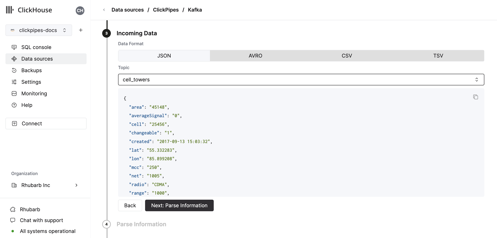

7. 次のステップで、新しい ClickHouse テーブルにデータを取り込むか、既存のものを再利用するかを選択できます。画面の指示に従い、テーブル名、スキーマ、設定を変更します。上部のサンプルテーブルで変更をリアルタイムでプレビューできます。

  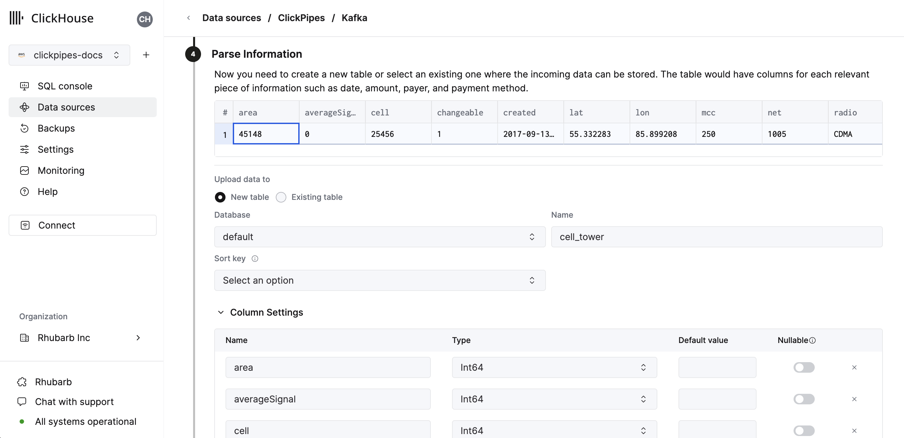

  指定されたコントロールを使用して、高度な設定をカスタマイズすることもできます。

  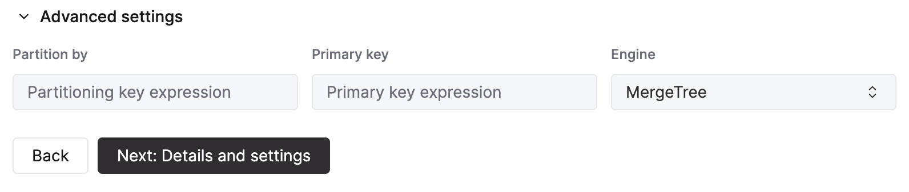

8. あるいは、既存の ClickHouse テーブルにデータを取り込みたい場合、UI はソースから選択した宛先テーブルの ClickHouse フィールドにフィールドをマップすることを許可します。

  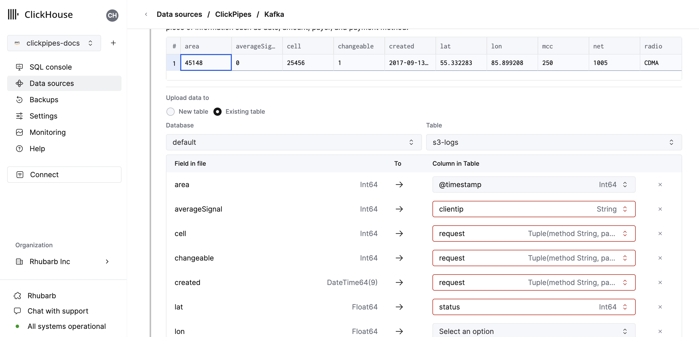

9. 最後に、内部クリックパイプスユーザーの権限を設定できます。

  **権限:** ClickPipes は、宛先テーブルへのデータ書き込みのために専用のユーザーを作成します。この内部ユーザーには、カスタムロールまたは事前定義されたロールのいずれかを選択できます：
    - `Full access`: クラスターへの完全なアクセスを許可します。Materialized View または Dictionary を宛先テーブルで使用する場合に有用です。
    - `Only destination table`: 宛先テーブルのみに `INSERT` 権限があります。

  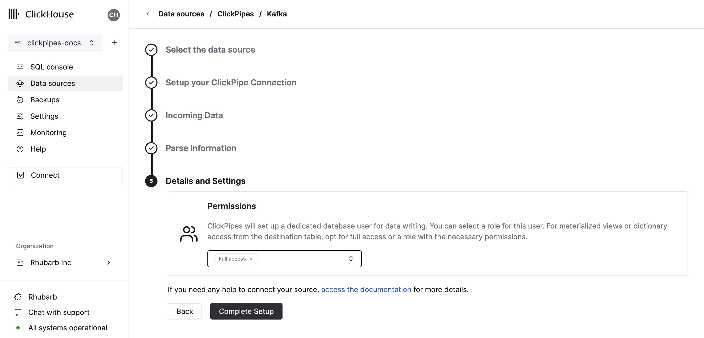

10. 「Complete Setup」をクリックすると、システムは ClickPipe を登録し、それがサマリーテーブルに表示されるようになります。

  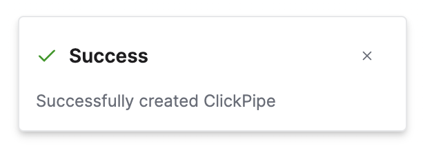

  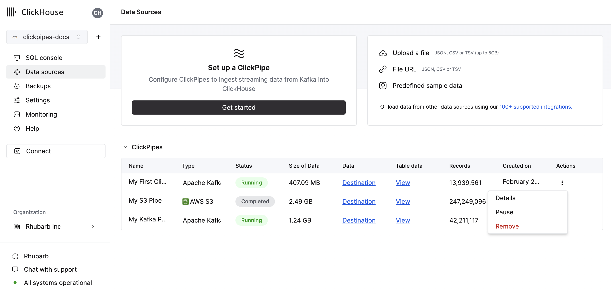

  サマリーテーブルは、ソースまたは ClickHouse の宛先テーブルからサンプルデータを表示するためのコントロールを提供します。

  

  そして、ClickPipe を削除し、取り込みジョブの概要を表示するためのコントロールも提供します。

  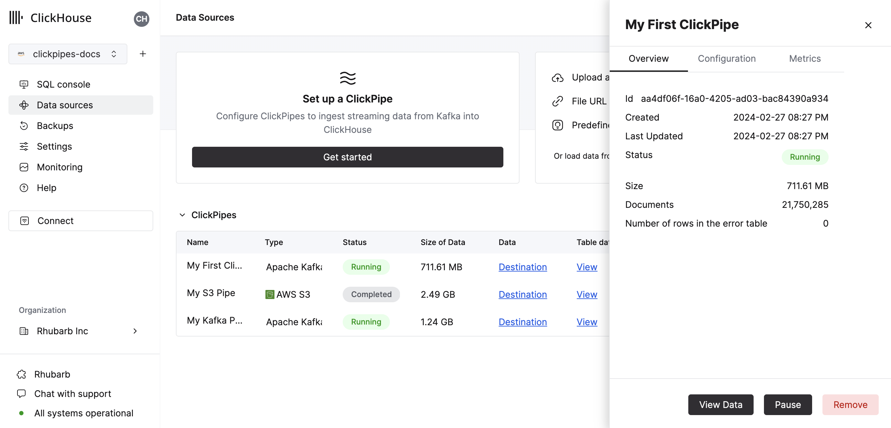

11. **おめでとうございます！** 初めての ClickPipe を設定することができました。これがストリーミング ClickPipe であれば、リモートデータソースからのデータをリアルタイムで継続的に取り込みます。

## 対応データソース

|名前|ロゴ|タイプ|ステータス|説明|
|----|----|----|------|-----------|
|Apache Kafka|<KafkaSVG style={{width: '3rem', 'height': '3rem'}} />|ストリーミング|安定|ClickPipes を設定して、Apache Kafka から ClickHouse Cloud へストリーミングデータを取り込み始めます。|
|Confluent Cloud|<ConfluentSVG style={{width: '3rem'}} />|ストリーミング|安定|Confluent と ClickHouse Cloud のパワーを直接統合により解放します。|
|Redpanda||ストリーミング|安定|ClickPipes を設定して、RedPanda から ClickHouse Cloud へストリーミングデータを取り込み始めます。|
|AWS MSK|<MskSVG style={{width: '3rem', 'height': '3rem'}} />|ストリーミング|安定|ClickPipes を設定して、AWS MSK から ClickHouse Cloud へストリーミングデータを取り込み始めます。|
|Azure Event Hubs|<AzureEventHubsSVG style={{width: '3rem'}} />|ストリーミング|安定|ClickPipes を設定して、Azure Event Hubs から ClickHouse Cloud へストリーミングデータを取り込み始めます。|
|WarpStream|<WarpStreamSVG style={{width: '3rem'}} />|ストリーミング|安定|ClickPipes を設定して、WarpStream から ClickHouse Cloud へストリーミングデータを取り込み始めます。|

ClickPipes に追加のコネクタが追加される予定です。詳細は[こちら](https://clickhouse.com/company/contact?loc=clickpipes)を参照してください。

## 対応するデータフォーマット

対応フォーマットは次の通りです：
- [JSON](../../../interfaces/formats.md/#json)
- [AvroConfluent](../../../interfaces/formats.md/#data-format-avro-confluent)

### 対応データタイプ

現在 ClickPipes で対応している ClickHouse データタイプは次の通りです：

- 基本数値型 - \[U\]Int8/16/32/64 および Float32/64
- 大きな整数型 - \[U\]Int128/256
- Decimal 型
- Boolean
- String
- FixedString
- Date, Date32
- DateTime, DateTime64 (UTC タイムゾーンのみ)
- Enum8/Enum16
- UUID
- IPv4
- IPv6
- すべての ClickHouse LowCardinality 型
- 上記の任意の型（Nullable を含む）をキーと値に使用した Map
- 上記の任意の型（Nullable を含む、1 階層のみ）を要素に使用した Tuple および Array

### Avro
#### 対応する Avro データタイプ

ClickPipes はすべての Avro プリミティブおよび複合型、`time-millis`、`time-micros`、`local-timestamp-millis`、`local_timestamp-micros`、および `duration` を除くすべての Avro 論理型をサポートしています。Avro `record` 型は Tuple に、`array` 型は Array に、`map` は Map（文字列キーのみ）に変換されます。一般的な変換は[こちら](../../../../en/interfaces/formats.md#data-types-matching)で示されています。Avro 数値型については、型変換におけるオーバーフローや精度損失をチェックしないため、正確な型一致をお勧めします。

#### Nullable 型と Avro ユニオン

Avro における Nullable 型は `(T, null)` または `(null, T)` のユニオンスキーマを使用して定義されます。スキーマ推論中、このようなユニオンは ClickHouse の「Nullable」カラムにマップされます。ただし、ClickHouse は `Nullable(Array)`、`Nullable(Map)`、または `Nullable(Tuple)` 型をサポートしていません。これらの型に対する Avro の null ユニオンは、非 Nullable バージョンにマップされます（Avro Record 型は ClickHouse ネームド Tuple にマップされます）。これらの型に対する Avro の "null" は以下のように挿入されます：
- Null Avro 配列には空の Array
- Null Avro Map には空の Map
- Null Avro Record にはすべてがデフォルト/ゼロ値のネームド Tuple

ClickPipes は現在、他の Avro ユニオンを含むスキーマをサポートしていません（これは新しい ClickHouse Variant や JSON データタイプの成熟度によって変わる可能性があります）。Avro スキーマが「非 null」ユニオンを含んでいる場合、ClickPipes は Avro スキーマと Clickhouse カラムタイプ間のマッピングを計算しようとする際にエラーを生成します。

#### Avro スキーマ管理

ClickPipes は、各メッセージ/イベントに埋め込まれたスキーマ ID を使用して、設定済みのスキーマレジストリから動的に Avro スキーマを取得し適用します。スキーマの更新は自動的に検出および処理されます。

現時点で ClickPipes は、[Confluent Schema Registry API](https://docs.confluent.io/platform/current/schema-registry/develop/api.html) を使用するスキーマレジストリとだけ互換性があります。これには Confluent Kafka と Cloud、RedPanda、AWS MSK、および Upstash スキーマレジストリが含まれます。ClickPipes は、AWS Glue スキーマレジストリや Azure スキーマレジストリとは現在互換性がありません（間もなく対応予定）。

取得された Avro スキーマと ClickHouse 宛先テーブル間のマッピングには次のルールが適用されます：
- Avro スキーマに ClickHouse 宛先マッピングに含まれていないフィールドがある場合、そのフィールドは無視されます。
- Avro スキーマに ClickHouse 宛先マッピングに定義されたフィールドが欠けている場合、ClickHouse カラムは 0 や空文字列のような "ゼロ" 値で埋められます。クリックハウスのサーバーデフォルト処理の更新を待っている一時的な制限のため、ClickPipes 挿入のための [デフォルト](https://clickhouse.com/docs/ja/sql-reference/statements/create/table#default) 式は現在評価されていません。
- Avro スキーマフィールドと ClickHouse カラムが互換性がない場合、その行/メッセージの挿入に失敗し、失敗は ClickPipes のエラーテーブルに記録されます。いくつかの暗黙的な変換（数値型間の変換など）はサポートされていますが、すべてではありません（例えば、Avro `record` フィールドは `Int32` ClickHouse カラムに挿入できません）。

## Kafka 仮想カラム

Kafka 互換のストリーミングデータソースに対してサポートされている仮想カラムは次の通りです。新しい宛先テーブルを作成する際には、`Add Column` ボタンを使用して仮想カラムを追加できます。

| 名前           | 説明                                     | 推奨データタイプ |
|----------------|------------------------------------------|------------------|
| _key           | Kafka メッセージキー                     | String           |
| _timestamp     | Kafka タイムスタンプ (ミリ秒精度)         | DateTime64(3)    |
| _partition     | Kafka パーティション                      | Int32            |
| _offset        | Kafka オフセット                         | Int64            |
| _topic         | Kafka トピック                           | String           |
| _header_keys   | レコードヘッダー内のキーの並列配列        | Array(String)    |
| _header_values | レコードヘッダー内の値の並列配列          | Array(String)    |
| _raw_message   | 完全な Kafka メッセージ                  | String           |

_note: `_raw_message` カラムは JSON データにのみ推奨されます。JSON 文字列だけが必要なユースケース（例えば ClickHouse [`JsonExtract*`](https://clickhouse.com/docs/ja/sql-reference/functions/json-functions#jsonextract-functions) 関数を使用してダウンストリームのマテリアライズドビューをポピュレートするなど）では、"非仮想" カラムを全削除することで ClickPipes のパフォーマンスが向上する可能性があります。_

## 制限

- [デフォルト](https://clickhouse.com/docs/ja/sql-reference/statements/create/table#default) はサポートされていません。

## 配信セマンティクス
ClickPipes for Kafka は `少なくとも一度` の配信セマンティクスを提供します（最も一般的に使用されるアプローチの一つとして）。配信セマンティクスについてのフィードバックをお待ちしております [お問い合わせフォーム](https://clickhouse.com/company/contact?loc=clickpipes)。`ちょうど一度` のセマンティクスが必要な場合、公式の [`clickhouse-kafka-connect`](https://clickhouse.com/blog/real-time-event-streaming-with-kafka-connect-confluent-cloud-clickhouse) シンクの使用をお勧めします。

## 認証
Apache Kafka プロトコルのデータソースに対して、ClickPipes は TLS 暗号化を使用した [SASL/PLAIN](https://docs.confluent.io/platform/current/kafka/authentication_sasl/authentication_sasl_plain.html) 認証、および `SASL/SCRAM-SHA-256` と `SASL/SCRAM-SHA-512` をサポートしています。ストリーミングソース（Redpanda、MSK など）により、互換性に基づいてこれらの認証メカニズムのすべてまたは一部が有効になります。他の認証ニーズがある場合は、[フィードバックをお寄せください](https://clickhouse.com/company/contact?loc=clickpipes)。

### IAM
AWS MSK の認証は現在、[SASL/SCRAM-SHA-512](https://docs.aws.amazon.com/msk/latest/developerguide/msk-password.html) 認証のみをサポートしています。

### カスタム証明書
ClickPipes for Kafka は、Kafka ブローカーのカスタム証明書を SASL & パブリック SSL/TLS 証明書でアップロードすることをサポートしています。ClickPipe 設定の SSL 証明書セクションで証明書をアップロードできます。
:::note
SASL と共に SSL 証明書の単一アップロードをサポートしていますが、現時点では SSL with マルチTLS (mTLS) はサポートされていません。
:::

## パフォーマンス

### バッチ処理
ClickPipes は ClickHouse へのデータ挿入をバッチで行います。これは、データベース内にあまり多くのパーツを作成しないようにして、クラスター内でのパフォーマンス問題を防ぐためです。

バッチは以下の基準のいずれかが満たされたときに挿入されます：
- バッチサイズが最大サイズ（100,000 行または 20MB）に達したとき
- バッチが最大時間（5 秒）開かれていたとき

### レイテンシー

レイテンシー（Kafka メッセージが生成されてから ClickHouse で使用可能になるまでの時間）は、さまざまな要因（例：ブローカのレイテンシー、ネットワークレイテンシー、メッセージサイズ/フォーマット）に依存します。上記で説明した[バッチ処理](#Batching)もレイテンシーに影響します。特定の負荷でのレイテンシーを決定するために、特定のユースケースでのテストを常にお勧めします。

ClickPipes はレイテンシーに関する保証を提供していません。特定の低レイテンシー要件がある場合は、[お問い合わせください](https://clickhouse.com/company/contact?loc=clickpipes)。

### スケーリング
ClickPipes for Kafka は水平スケーリングを意図しています。デフォルトでは、2 つのコンシューマーを持つコンシューマーグループを作成します。これを増やすには、[お問い合わせください](https://clickhouse.com/company/contact?loc=clickpipes)。

## よくある質問

### 一般

- **ClickPipes for Kafka はどのように機能しますか？**

  ClickPipes は専用のアーキテクチャを使用して Kafka Consumer API を実行し、指定されたトピックからデータを読み取り、そのデータを特定の ClickHouse Cloud サービス上の ClickHouse テーブルに挿入します。

- **ClickPipes と ClickHouse Kafka テーブルエンジンの違いは何ですか？**

  Kafka テーブルエンジンは、ClickHouse サーバー自身が Kafka に接続し、イベントを取得してローカルに書き込む「プルモデル」を実装する ClickHouse のコア機能です。

  ClickPipes は ClickHouse サービスとは独立して動作する別のクラウドサービスであり、Kafka（または他のデータソース）に接続し、関連 ClickHouse Cloud サービスにイベントをプッシュします。この分離されたアーキテクチャにより、優れた運用の柔軟性、明確な関心の分離、スケーラブルな取り込み、スムーズな障害管理、拡張性などが可能となります。

- **ClickPipes for Kafka を使用する際の要件は何ですか？**

  ClickPipes for Kafka を使用するには、稼働中の Kafka ブローカーと ClickPipes が有効な ClickHouse Cloud サービスが必要です。また、ClickHouse Cloud があなたの Kafka ブローカーにアクセスできることを確認する必要があります。これは、Kafka サイドでのリモート接続を許可し、Kafka 設定で [ClickHouse Cloud Egress IP アドレス](https://clickhouse.com/docs/ja/manage/security/cloud-endpoints-api) をホワイトリストに登録することで実現できます。

- **ClickPipes for Kafka は AWS PrivateLink をサポートしていますか？**

  AWS PrivateLink はサポートされています。詳細は [お問い合わせください](https://clickhouse.com/company/contact?loc=clickpipes)。

- **ClickPipes for Kafka を使用して Kafka トピックにデータを書き込むことはできますか？**

  いいえ、ClickPipes for Kafka は Kafka トピックからデータを読み取るために設計されており、データを書き込むためではありません。Kafka トピックにデータを書き込むには、専用の Kafka プロデューサーを使用する必要があります。

- **ClickPipes は複数のブローカーをサポートしていますか？**

  はい、同じクォーラムの一部であれば、`,`で区切って一緒に設定できます。

### Upstash

- **ClickPipes は Upstash をサポートしていますか？**

  はい。Upstash の Kafka 製品は 2024 年 9 月 11日から6 ヶ月間の廃止期間に入りました。既存の顧客は、ClickPipes ユーザーインターフェースの一般的な Kafka タイルを使用して、既存の Upstash Kafka ブローカーで ClickPipes を引き続き使用することができます。既存の Upstash Kafka ClickPipes は、廃止通知の前には影響されません。廃止期間が終わると、ClickPipe は機能しなくなります。

- **ClickPipes は Upstash スキーマレジストリをサポートしていますか？**

  いいえ。ClickPipes は Upstash Kafka スキーマレジストリと互換性がありません。

- **ClickPipes は Upstash の QStash ワークフローをサポートしていますか？**

  いいえ。QStash ワークフローに Kafka 互換の表面が導入されない限り、Kafka ClickPipes では動作しません。

### Azure EventHubs

- **Azure Event Hubs ClickPipe は Kafka サーフェスなしで動作しますか？**

  いいえ。ClickPipes は Azure Event Hubs で Kafka サーフェスを有効にする必要があります。Kafka プロトコルは、Standard、Premium、Dedicated SKU のみのプライシングティアに対応しています。

- **Azure スキーマレジストリは ClickPipes で動作しますか？**

  いいえ。ClickPipes は現在、Event Hubs スキーマレジストリとは互換性がありません。

- **Azure Event Hubs からデータを取得するためにポリシーにどの権限が必要ですか？**

  トピックをリストし、イベントを取得するには、共有アクセスポリシーに少なくとも「Listen」クレームが必要です。

- **Event Hubs がデータを返さない理由は何ですか？**

 あなたの ClickHouse インスタンスがあなたの Event Hubs 配置と異なる地域または大陸にある場合、ClickPipes のオンボーディング時にタイムアウトが発生し、Event Hub からデータを取得する際にレイテンシーが高くなる可能性があります。ClickHouse Cloud 配置と Azure Event Hubs 配置をクラウド地域が互いに近い場所に配置することは、パフォーマンスに悪影響を及ぼさない最良のプラクティスと考えられています。

- **Azure Event Hubs のためにポート番号を含めるべきですか？**

  はい。ClickPipes は Kafka サーフェス用のポート番号を含めることを期待しており、それは `:9093` であるべきです。

- **Event Hubs のための ClickPipes IP はまだ relevant ですか？**

  はい。Event Hubs インスタンスへのトラフィックを制限する場合、[ドキュメント化された静的 NAT IPs](./index.md) を追加してください。

- **イベントハブの接続文字列か、イベントハブネームスペースの接続文字列ですか？**

  両方とも使用できますが、複数のイベントハブからサンプルを取得するためにネームスペースレベルでの共有アクセスポリシーを使用することをお勧めします。
