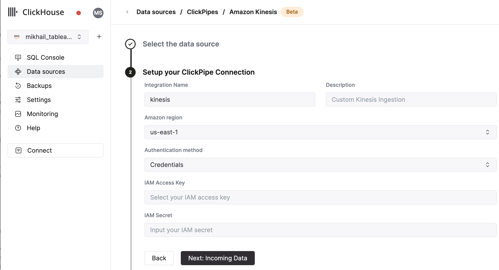
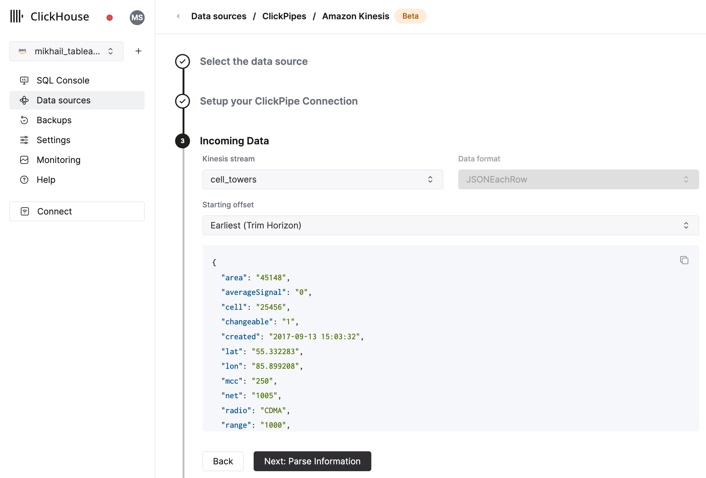

# Amazon KinesisとClickHouse Cloudの統合

## 前提条件

[ClickPipesの紹介](./index.md)に慣れており、[IAM認証情報](https://docs.aws.amazon.com/IAM/latest/UserGuide/id_credentials_access-keys.html)または[IAMロール](https://docs.aws.amazon.com/IAM/latest/UserGuide/id_roles.html)を設定しています。[Kinesis Role-Based Accessガイド](./secure-kinesis.md)に従って、ClickHouse Cloudと連携するロールの設定方法を確認してください。

## 最初のClickPipeを作成する

1. ClickHouse CloudサービスのSQLコンソールにアクセスします。

   

2. 左側のメニューから`Data Sources`ボタンを選択し、「Set up a ClickPipe」をクリックします。

   

3. データソースを選択します。

   

4. 名前、説明（オプション）、IAMロールまたは認証情報、その他の接続詳細を入力してClickPipeのフォームを記入します。

   

5. Kinesis Streamと開始オフセットを選択します。UIは選択したソース（Kafkaトピックなど）のサンプルドキュメントを表示します。また、Kinesisストリームのパフォーマンスと安定性を向上させるためにEnhanced Fan-outを有効にすることができます（Enhanced Fan-outの詳細はこちら[こちら](https://aws.amazon.com/blogs/aws/kds-enhanced-fanout)で確認できます）。

   

6. 次のステップでは、新しいClickHouseテーブルにデータを取り込むか、既存のテーブルを再利用するかを選択できます。画面の指示に従ってテーブル名、スキーマ、および設定を変更します。サンプルテーブルの上部で変更のリアルタイムプレビューを確認できます。

   

   提供されているコントロールを使用して高度な設定をカスタマイズすることもできます。

   

7. あるいは、既存のClickHouseテーブルにデータを取り込むことを選択することもできます。その場合、UIはソースから選択した宛先テーブルのClickHouseフィールドへのフィールドマッピングを許可します。

   

8. 最後に、内部ClickPipesユーザーの権限を設定できます。

   **Permissions:** ClickPipesは宛先テーブルにデータを書き込む専用ユーザーを作成します。この内部ユーザーのためにカスタムロールまたは事前定義されたロールを選択できます：
   - `Full access`: クラスターへの完全アクセスを持つ。これは、Materialized ViewまたはDictionaryを宛先テーブルで使用する場合に有用です。
   - `Only destination table`: 宛先テーブルへの`INSERT`権限のみを持つ。

   

9. 「Complete Setup」をクリックすると、システムはあなたのClickPipeを登録し、要約テーブルに表示されるようになります。

   

   

   要約テーブルには、ClickHouseのソースまたは宛先テーブルからサンプルデータを表示するためのコントロールが含まれています。

   

   さらにClickPipeを削除し、取り込みジョブの要約を表示するためのコントロールもあります。

   

10. **おめでとうございます！** 初めてのClickPipeを正常に設定しました。これがストリーミングClickPipeの場合、リモートデータソースからリアルタイムでデータを連続して取り込むことになります。そうでなければ、バッチを取り込み完了します。

## サポートされているデータフォーマット

サポートされているフォーマットは次の通りです：
- [JSON](../../../interfaces/formats.md/#json)

## サポートされているデータ型

ClickPipesでは、以下のClickHouseデータ型が現在サポートされています：

- 基本数値型 - \[U\]Int8/16/32/64およびFloat32/64
- 大きな整数型 - \[U\]Int128/256
- Decimal型
- ブール型
- String
- FixedString
- Date, Date32
- DateTime, DateTime64（UTCタイムゾーンのみ）
- Enum8/Enum16
- UUID
- IPv4
- IPv6
- すべてのClickHouse LowCardinality型
- Map（上記の型およびNullableを使用したキーおよび値）
- TupleおよびArray（上記の型およびNullableを使用した要素、一段階の深さのみ）

## Kinesis仮想カラム

Kinesisストリームに対してサポートされている仮想カラムは以下の通りです。新しい宛先テーブルを作成する際、`Add Column`ボタンを使用して仮想カラムを追加できます。

| 名前          | 説明                                                            | 推奨データ型         |
|--------------|---------------------------------------------------------------|-----------------------|
| _key         | Kinesis パーティションキー                                      | String                |
| _timestamp   | Kinesis おおよその到着タイムスタンプ（ミリ秒精度）              | DateTime64(3)         |
| _stream      | Kafka ストリーム名                                              | String                |
| _raw_message | 完全な Kinesis メッセージ                                       | String                |

_raw_messageフィールドは、完全なKinesis JSONレコードが必要な場合（例えば、ClickHouseの[`JsonExtract*`](https://clickhouse.com/docs/ja/sql-reference/functions/json-functions#jsonextract-functions)関数を使用して下流のmaterialized viewを埋める場合）に使用できます。このようなパイプでは、すべての「非仮想」カラムを削除することでClickPipesのパフォーマンスを向上させることができます。

## 制限事項

- [DEFAULT](https://clickhouse.com/docs/ja/sql-reference/statements/create/table#default)はサポートされていません。

## パフォーマンス

### バッチング

ClickPipesはデータをバッチでClickHouseに挿入します。これは、データベース内のパーツが多くなりすぎることによってクラスタのパフォーマンスに影響を与えることを避けるためです。

バッチは、以下のいずれかの条件を満たすと挿入されます：
- バッチサイズが最大サイズに達したとき（100,000行または20MB）
- バッチが最大時間（5秒）開かれていたとき

### レイテンシー

レイテンシー（Kinesisメッセージがストリームに送信され、ClickHouseで利用可能になるまでの時間）は、いくつかの要因（例：kinesisのレイテンシー、ネットワークレイテンシー、メッセージサイズ/フォーマット）に依存します。上記のセクションに記載されている[バッチング](#Batching)もレイテンシーに影響します。お客様の特定のユースケースをテストして、期待されるレイテンシーを理解することをお勧めします。

特定の低レイテンシー要件がある場合は、[ここからお問い合わせください](https://clickhouse.com/company/contact?loc=clickpipes)。

### スケーリング

Kinesis向けClickPipesは水平スケーリングを前提に設計されています。デフォルトでは、2つのコンシューマーを作成します。これを増やすには、[こちらからお問い合わせください](https://clickhouse.com/company/contact?loc=clickpipes)。

## 認証

Amazon Kinesisストリームにアクセスするには、[IAM認証情報](https://docs.aws.amazon.com/IAM/latest/UserGuide/id_credentials_access-keys.html)または[IAMロール](https://docs.aws.amazon.com/IAM/latest/UserGuide/id_roles.html)を使用できます。IAMロールの設定方法に関する詳細は、[このガイド](./secure-kinesis.md)を参照して、ClickHouse Cloudと連携するロールの設定方法について確認できます。
