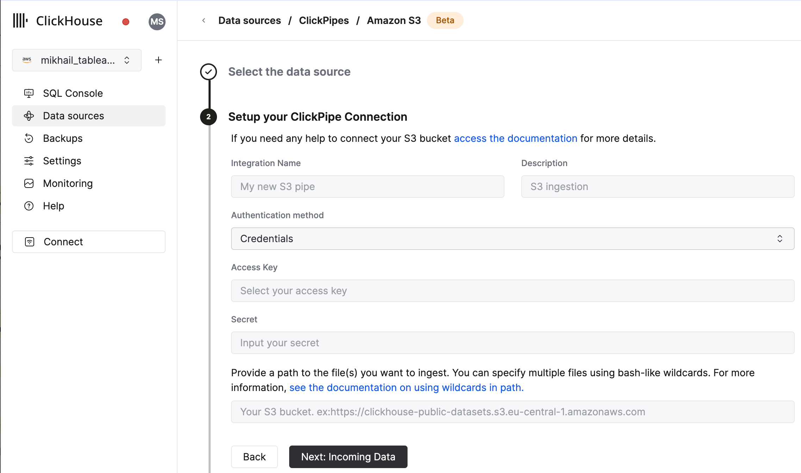
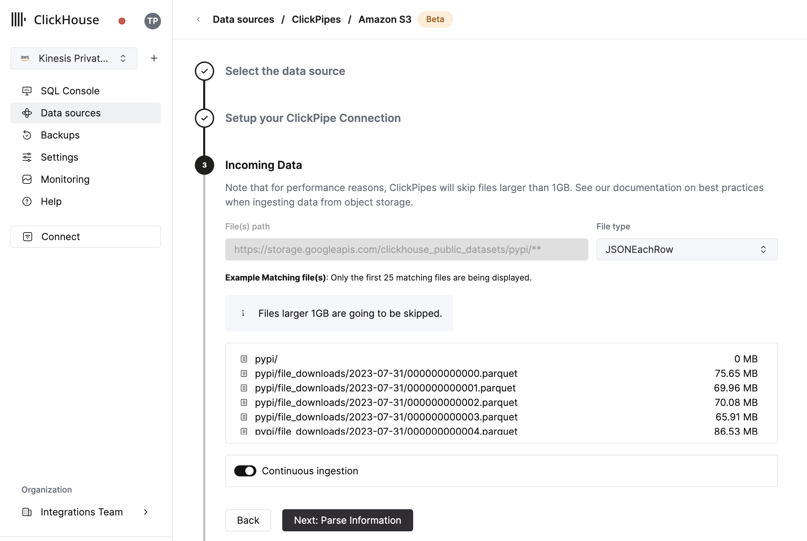

import S3SVG from "../../images/logos/amazon_s3_logo.svg";
import GCSSVG from "../../images/logos/gcs.svg";

# オブジェクトストレージとClickHouse Cloudの統合
## 前提条件
[ClickPipesの紹介](./index.md)を確認していること。

## 初めてのClickPipeの作成

1. ClickHouse Cloud ServiceのSQLコンソールにアクセスします。

  

2. 左側のメニューから`Data Sources`ボタンを選択し、「Set up a ClickPipe」をクリックします。

  

3. データソースを選択します。

  

4. フォームにClickPipeの名前、説明（オプション）、IAMロールまたは資格情報、バケットURLを入力してフォームを記入します。bash風のワイルドカードを使用して複数のファイルを指定できます。詳細については、[パスでのワイルドカードの使用に関する文書](#limitations)を参照してください。

  

5. 指定されたバケット内のファイルのリストがUIに表示されます。データフォーマットを選択し（現在、ClickHouseフォーマットのサブセットをサポートしています）、継続的な取り込みを有効にしたい場合は[以下の詳細](#continuous-ingest)をご覧ください。

  

6. 次のステップでは、新しいClickHouseテーブルにデータを取り込むか、既存のテーブルを再利用するかを選択できます。画面の指示に従って、テーブル名、スキーマ、設定を変更します。サンプルテーブルの上部でリアルタイムの変更プレビューを見ることができます。

  

  提供されたコントロールを使用して、高度な設定をカスタマイズすることもできます。

  

7. あるいは、既存のClickHouseテーブルにデータを取り込むことも選択できます。その場合、UIはソースから選択された宛先テーブルのClickHouseフィールドへフィールドをマッピングする機能を提供します。

  

:::info
[_path]や[_size]のような[仮想カラム](../../sql-reference/table-functions/s3#virtual-columns)をフィールドにマッピングすることもできます。
:::

8. 最後に、内部clickpipesユーザーの権限を設定できます。

  **権限:** ClickPipesは、宛先テーブルにデータを書き込むための専用ユーザーを作成します。この内部ユーザーのロールをカスタムロールまたは以下の事前定義されたロールで選択できます:
    - `Full access`: クラスターへの完全なアクセス権があります。Materialized ViewやDictionaryを宛先テーブルで使用する場合に必要です。
    - `Only destination table`: 宛先テーブルへの`INSERT`権限のみ。

  

9. 「Complete Setup」をクリックすると、システムがあなたのClickPipeを登録し、サマリーテーブルにリストされているのを見ることができます。

  

  

  サマリーテーブルは、ClickHouseのソースまたは宛先テーブルからサンプルデータを表示するコントロールを提供します。

  

  また、ClickPipeを削除し、取り込みジョブのサマリーを表示するコントロールもあります。

  

10. **おめでとうございます！** あなたの初めてのClickPipeを成功裏に設定しました。これがストリーミングClickPipeである場合、それはリモートデータソースからリアルタイムでデータを継続的に取り込みます。それ以外の場合は、バッチを取り込んで完了します。

## サポートされているデータソース

|名前|ロゴ|タイプ|ステータス|説明|
|----|----|----|------|-----------|
|Amazon S3|<S3SVG style={{width: '3rem', height: 'auto'}} />|オブジェクトストレージ|Beta|オブジェクトストレージから大量のデータを取り込むためにClickPipesを設定します。|
|Google Cloud Storage|<GCSSVG style={{width: '3rem', height: 'auto'}} />|オブジェクトストレージ|Beta|オブジェクトストレージから大量のデータを取り込むためにClickPipesを設定します。|

ClickPipesには今後より多くのコネクタが追加される予定です。[こちらからお問い合わせください](https://clickhouse.com/company/contact?loc=clickpipes)で詳細を確認できます。

## サポートされているデータフォーマット

サポートされているフォーマットは次のとおりです:
- [JSON](../../../interfaces/formats.md/#json)
- [CSV](../../../interfaces/formats.md/#csv)
- [Parquet](../../../interfaces/formats.md/#parquet)

## スケーリング

オブジェクトストレージClickPipesは、[設定された縦方向の自動スケーリング設定](/docs/ja/manage/scaling#configuring-vertical-auto-scaling)により決定された最小のClickHouseサービスサイズに基づいてスケーリングされます。ClickPipeのサイズはパイプ作成時に決定され、後続のClickHouseサービス設定の変更はClickPipeのサイズに影響しません。

大規模な取り込みジョブのスループットを増加させるため、ClickPipeを作成する前にClickHouseサービスをスケーリングすることをお勧めします。

## Materialized Views

オブジェクトストレージClickPipesでMaterialized Viewsを使用する場合、作成時に`Full access`権限を選択する必要があります。これが不可能な場合は、パイプが宛先データベースにテーブルおよびMaterialized Viewsを作成できることを確認してください。

オブジェクトストレージClickPipeの実行中に作成されるMaterialized Viewsは、データを取得しません。パイプを停止し再起動することで、パイプがMaterialized Viewsを取得し始めます。以下の[制限](#limitations)を参照してください。

## 制限事項
- 宛先テーブル、そのMaterialized Views（カスケードMaterialized Viewsを含む）、またはMaterialized Viewsのターゲットテーブルの変更は、パイプによって自動的に取得されず、エラーを引き起こす可能性があります。パイプを停止し、必要な変更を加えてからパイプを再起動し、変更を取得し、エラーや再試行による重複データを回避してください。
- GCPまたはAzureにデプロイされたClickHouse Cloudインスタンス用に、S3 ClickPipesのロール認証は利用できません。AWS ClickHouse Cloudインスタンスのみサポートされています。
- ClickPipesは10GB以下のオブジェクトの取り込みのみを試みます。10GBを超えるファイルは、ClickPipes専用のエラーテーブルにエラーを追加します。
- S3 / GCS ClickPipesは、[S3 Table Function](https://clickhouse.com/docs/ja/sql-reference/table-functions/file#globs_in_path)とリスト構文を共有して**いません**。
  - `?` — 任意の1文字に置き換えます。
  - `*` — 空の文字列を含む任意の数の任意の文字に置き換えます。
  - `**` — 空の文字列を含む任意の数の任意の文字に置き換えます。

:::note
これは有効なパスです:

https://datasets-documentation.s3.eu-west-3.amazonaws.com/http/**.ndjson.gz

これは有効なパスではありません。ClickPipesでは`{N..M}`はサポートされていません。

https://datasets-documentation.s3.eu-west-3.amazonaws.com/http/{documents-01,documents-02}.ndjson.gz
:::

## 継続的な取り込み
ClickPipesはS3およびGCSからの継続的な取り込みをサポートしています。有効にすると、ClickPipesは指定されたパスからデータを継続的に取り込み、新しいファイルを30秒ごとにポーリングします。ただし、新しいファイルは最後に取り込まれたファイルよりも辞書順で大きくなければならず、取り込みの順序を定義するように名前が付けられている必要があります。例えば、`file1`、`file2`、`file3`などのファイルは順番に取り込まれます。`file0`のような名前の新しいファイルが追加されても、辞書順で最後に取り込まれたファイルより大きくないため、ClickPipesはそれを取り込みません。

## アーカイブテーブル
ClickPipesは、宛先テーブルの隣に`<clickpipe_id>_archive`の接尾辞を持つテーブルを作成します。このテーブルには、ClickPipeによって取り込まれたすべてのファイルのリストが含まれます。このテーブルは取り込み中のファイルを追跡するために使用され、ファイルが取り込まれたことを確認するために使用できます。アーカイブテーブルには7日の[有効期限](https://clickhouse.com/docs/ja/engines/table-engines/mergetree-family/mergetree#table_engine-mergetree-ttl)があります。

:::note
これらのテーブルはClickHouse Cloud SQLコンソールを使用しても表示されません。HTTPSまたはネイティブ接続を介して外部クライアントを使用して接続し、読み取る必要があります。
:::

## 認証

### S3
公開バケットには設定なしでアクセスでき、保護されたバケットには[IAM資格情報](https://docs.aws.amazon.com/IAM/latest/UserGuide/id_credentials_access-keys.html)または[IAMロール](https://docs.aws.amazon.com/IAM/latest/UserGuide/id_roles.html)を使用できます。データへのアクセスに必要な権限を理解するには、[このガイドを参照してください](/docs/ja/cloud/security/secure-s3)。

### GCS
S3と同様に、公開バケットには設定なしでアクセスでき、保護されたバケットにはAWS IAM資格情報の代わりに[HMACキー](https://cloud.google.com/storage/docs/authentication/managing-hmackeys)を使用できます。このキーの設定方法については、Google Cloudのガイドを参照してください。[このキーの設定方法](https://cloud.google.com/storage/docs/authentication/hmackeys)。

GCSのサービスアカウントは直接サポートされていません。公開されていないバケットに対して認証する際にはHMAC（IAM）資格情報を使用する必要があります。HMAC資格情報に付随するサービスアカウントの権限は`storage.objects.list`および`storage.objects.get`である必要があります。

## よくある質問
- **ClickPipesは`gs://`で始まるGCSバケットをサポートしていますか？**

いいえ。相互運用性のために、`gs://`バケットプレフィックスを`https://storage.googleapis.com/`に置き換えることをお勧めします。
