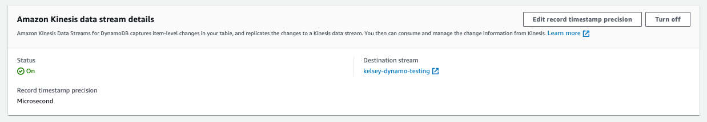
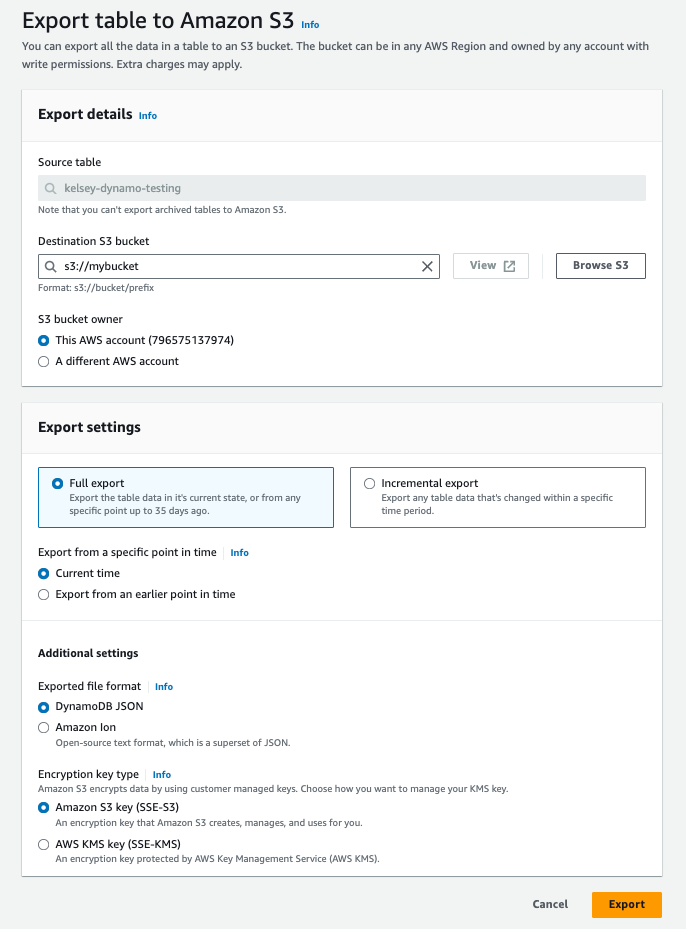
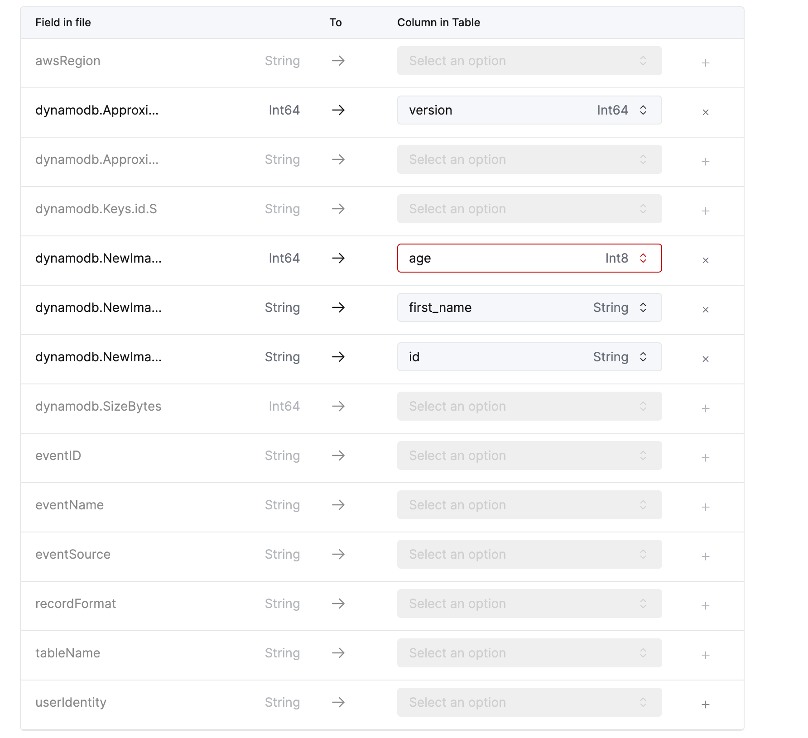

import CloudNotSupportedBadge from '@theme/badges/CloudNotSupportedBadge';
import ExperimentalBadge from '@theme/badges/ExperimentalBadge';

# DynamoDBからClickHouseへのCDC

このページでは、ClickPipesを使用してDynamoDBからClickHouseへのCDCを設定する方法について説明します。この統合には次の2つのコンポーネントがあります：
1. S3 ClickPipesを介した初期スナップショット
2. Kinesis ClickPipesを介したリアルタイム更新

データは`ReplacingMergeTree`に取り込まれます。このテーブルエンジンは、CDCシナリオで更新操作を適用するためによく使用されます。このパターンについて詳しくは、次のブログ記事をご覧ください：

* [Change Data Capture (CDC) with PostgreSQL and ClickHouse - Part 1](https://clickhouse.com/blog/clickhouse-postgresql-change-data-capture-cdc-part-1?loc=docs-rockest-migrations)
* [Change Data Capture (CDC) with PostgreSQL and ClickHouse - Part 2](https://clickhouse.com/blog/clickhouse-postgresql-change-data-capture-cdc-part-2?loc=docs-rockest-migrations)

## 1. Kinesis Streamの設定

まず、DynamoDBテーブルでKinesisストリームを有効にして、リアルタイムでの変更をキャプチャすることをお勧めします。スナップショットを作成する前にこの設定を行い、データの欠如を防ぎます。AWSのガイドは[こちら](https://docs.aws.amazon.com/amazondynamodb/latest/developerguide/kds.html)にあります。



## 2. スナップショットの作成

次に、DynamoDBテーブルのスナップショットを作成します。これはAWSのS3へのエクスポートを通じて行うことができます。AWSのガイドは[こちら](https://docs.aws.amazon.com/amazondynamodb/latest/developerguide/S3DataExport.HowItWorks.html)にあります。
**DynamoDBのJSON形式で「フルエクスポート」を行うことが望ましいです。**



## 3. スナップショットをClickHouseにロード

### 必要なテーブルの作成

DynamoDBからのスナップショットデータは以下のように見えます：
```json
{
  "age": {
    "N": "26"
  },
  "first_name": {
    "S": "sally"
  },
  "id": {
    "S": "0A556908-F72B-4BE6-9048-9E60715358D4"
  }
}
```

このデータがネストされた形式であることがわかります。ClickHouseにロードする前にデータをフラット化する必要があります。これはClickHouseの`JSONExtract`関数を使用してMaterialized Viewで行うことができます。

以下の3つのテーブルを作成します：
1. DynamoDBからの生データを保存するテーブル
2. 最終的にフラット化されたデータを保存するテーブル（宛先テーブル）
3. データをフラット化するためのMaterialized View

上記のDynamoDBデータに対するClickHouseテーブルは次のようになります：

```sql
/* スナップショットテーブル */
CREATE TABLE IF NOT EXISTS "default"."snapshot"
(
    `item` String
)
ORDER BY tuple();

/* 最終的なフラット化データ用テーブル */
CREATE MATERIALIZED VIEW IF NOT EXISTS "default"."snapshot_mv" TO "default"."destination" AS
SELECT
    JSONExtractString(item, 'id', 'S') AS id,
    JSONExtractInt(item, 'age', 'N') AS age,
    JSONExtractString(item, 'first_name', 'S') AS first_name
FROM "default"."snapshot";

/* 最終的なフラット化データ用テーブル */
CREATE TABLE IF NOT EXISTS "default"."destination" (
    "id" String,
    "first_name" String,
    "age" Int8,
    "version" Int64
) 
ENGINE ReplacingMergeTree("version")
ORDER BY id;
```

宛先テーブルには以下の要件があります：
- このテーブルは`ReplacingMergeTree`テーブルである必要がある
- テーブルは`version`カラムを持つ必要がある
  - 後のステップで、Kinesisストリームの`ApproximateCreationDateTime`フィールドを`version`カラムにマッピングします。
- テーブルはパーティションキーをソートキーとして使用する必要がある（`ORDER BY`で指定）
  - 同じソートキーを持つ行は`version`カラムに基づいて重複排除される

### スナップショットClickPipeの作成

次に、S3からClickHouseにスナップショットデータをロードするClickPipeを作成します。S3 ClickPipeガイドは[こちら](/docs/ja/integrations/data-ingestion/clickpipes/object-storage.md)ですが、以下の設定を使用してください：

- **Ingest path**: S3内のエクスポートされたjsonファイルのパスを見つける必要があります。パスは次のようになります：

```
https://{bucket}.s3.amazonaws.com/{prefix}/AWSDynamoDB/{export-id}/data/*
```
- **Format**: JSONEachRow
- **Table**: あなたのスナップショットテーブル（例：上記の`default.snapshot`）

作成が完了すると、データはスナップショットと宛先テーブルに入力され始めます。スナップショットのロードが完了するまで待つ必要はなく、次のステップに進むことができます。

## 4. Kinesis ClickPipeの作成

次に、Kinesisストリームからのリアルタイムの変更をキャプチャするためにKinesis ClickPipeを設定します。Kinesis ClickPipeガイドは[こちら](/docs/ja/integrations/data-ingestion/clickpipes/kinesis.md)ですが、以下の設定を使用してください：

- **Stream**: ステップ1で使用したKinesisストリーム
- **Table**: あなたの宛先テーブル（例：上記の`default.destination`）
- **Flatten object**: true
- **Column mappings**:
  - `ApproximateCreationDateTime`: `version`
  - 他のフィールドは以下のように適切な宛先カラムにマッピングしてください

 


## 5. クリーンアップ（オプション）

スナップショットClickPipeが終了したら、スナップショットテーブルとMaterialized Viewを削除できます。

```sql
DROP TABLE IF EXISTS "default"."snapshot";
DROP TABLE IF EXISTS "default"."snapshot_clickpipes_error";
DROP VIEW IF EXISTS "default"."snapshot_mv";
```
