# ClickHouseでのEMQX統合

## EMQXへの接続

[EMQX](https://www.emqx.com/en/try?product=enterprise) は、オープンソースのMQTTブローカーで、高性能のリアルタイムメッセージ処理エンジンを使用して、IoTデバイスのイベントストリーミングを大規模に実現します。最もスケーラブルなMQTTブローカーとして、EMQXはあらゆるデバイスをあらゆる規模で接続するのに役立ちます。あなたのIoTデータをどこにでも移動し、処理することができます。

[EMQX Cloud](https://www.emqx.com/en/try?product=cloud) は、[EMQ](https://www.emqx.com/en) によってホストされるIoTドメイン向けのMQTTメッセージングミドルウェア製品です。世界初の完全なMQTT 5.0クラウドメッセージングサービスとして、EMQX Cloudは、MQTTメッセージングサービスのための一括運用・保守の協調配置と独自の隔離された環境を提供します。万物インターネットの時代において、EMQX Cloudは、IoTドメイン用の業界アプリケーションを迅速に構築し、IoTデータを簡単に収集、伝送、計算、持続するのに役立ちます。

クラウドプロバイダーによって提供されるインフラストラクチャを使用して、EMQX Cloudは世界中の数十の国と地域にサービスを提供しており、5Gと万物インターネットアプリケーションに低コストで、安全でかつ信頼性の高いクラウドサービスを提供します。

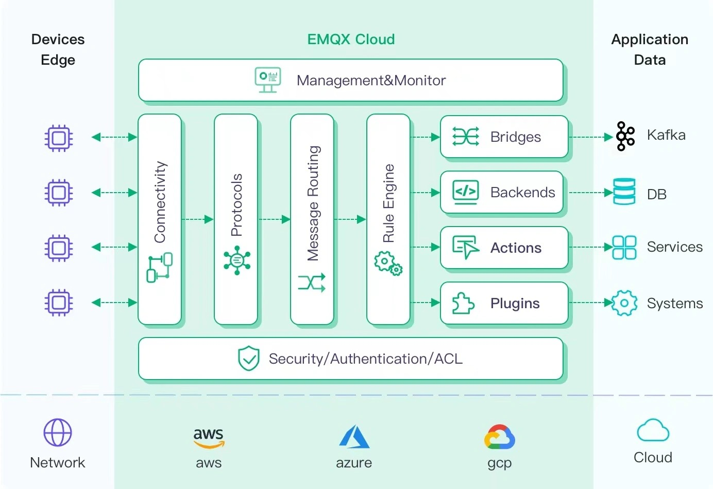

### 前提条件

* [MQTTプロトコル](https://mqtt.org/) に精通していること。これは非常に軽量のパブリッシュ/サブスクライブメッセージングトランスポートプロトコルです。
* EMQXまたはEMQX Cloudをリアルタイムメッセージ処理エンジンとして使用し、IoTデバイスのイベントストリーミングを大規模に実行していること。
* デバイスデータを保存するためにClickhouse Cloudインスタンスを用意していること。
* 私たちは、[MQTT X](https://mqttx.app/) をMQTTクライアントテストツールとして使用して、EMQX Cloudのデプロイメントに接続し、MQTTデータをパブリッシュします。他の方法でMQTTブローカーに接続することも可能です。

## ClickHouse Cloud サービスを取得する

このセットアップ中に、AWSのN. Virginia（us-east -1）にClickHouseインスタンスをデプロイし、EMQX Cloudインスタンスも同じ地域にデプロイしました。

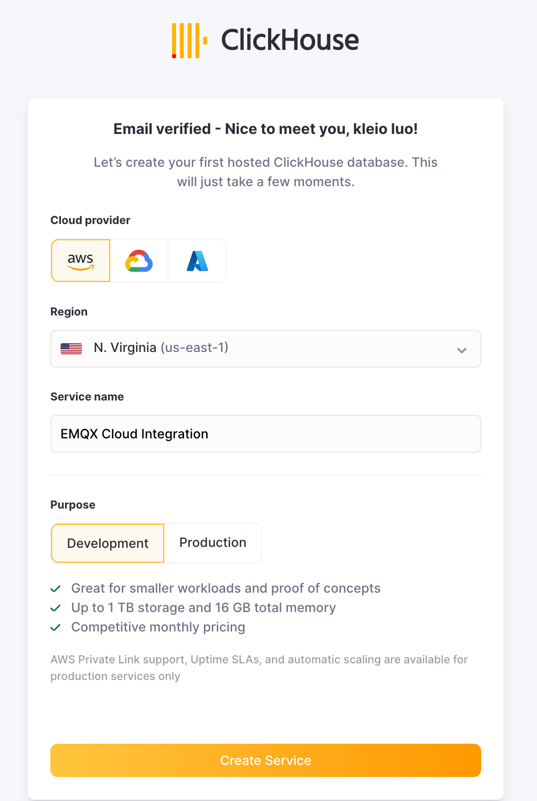

セットアッププロセス中にも接続設定に注意を払う必要があります。このチュートリアルでは「Anywhere」を選択しますが、特定の場所を申請した場合は、EMQX Cloudのデプロイメントから得た[NATゲートウェイ](https://docs.emqx.com/en/cloud/latest/vas/nat-gateway.html)のIPアドレスをホワイトリストに追加する必要があります。

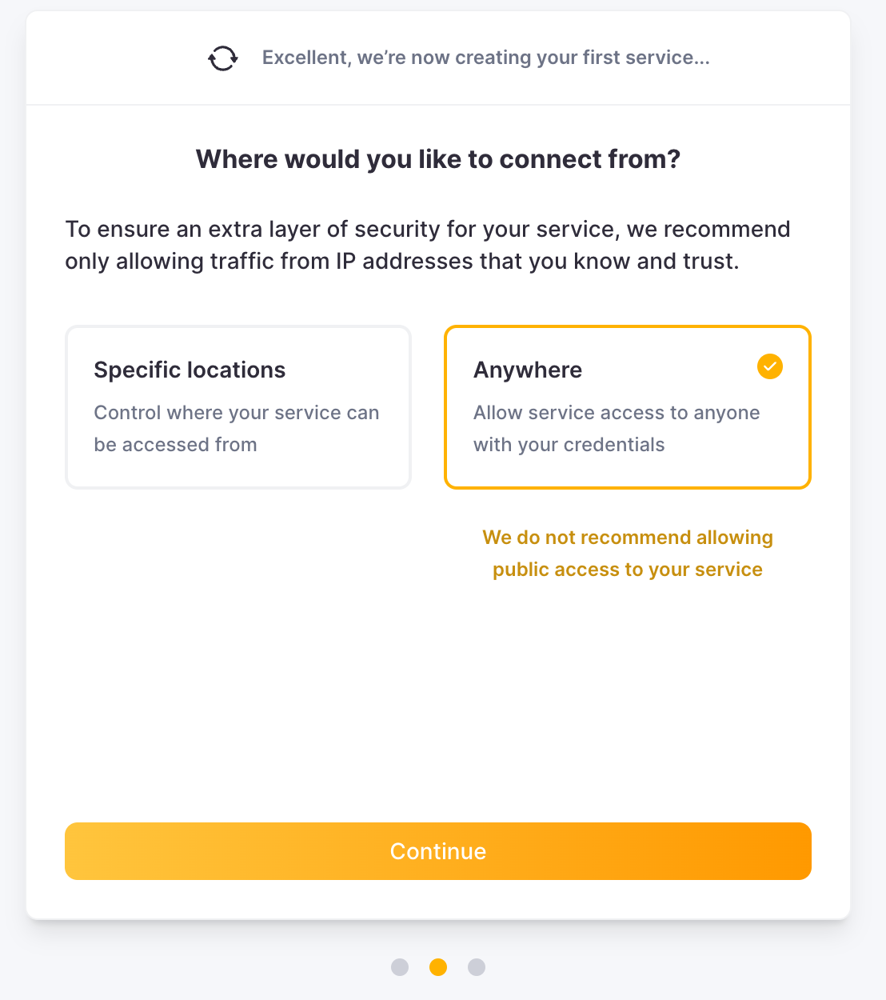

その後、将来使用するためにユーザー名とパスワードを保存する必要があります。

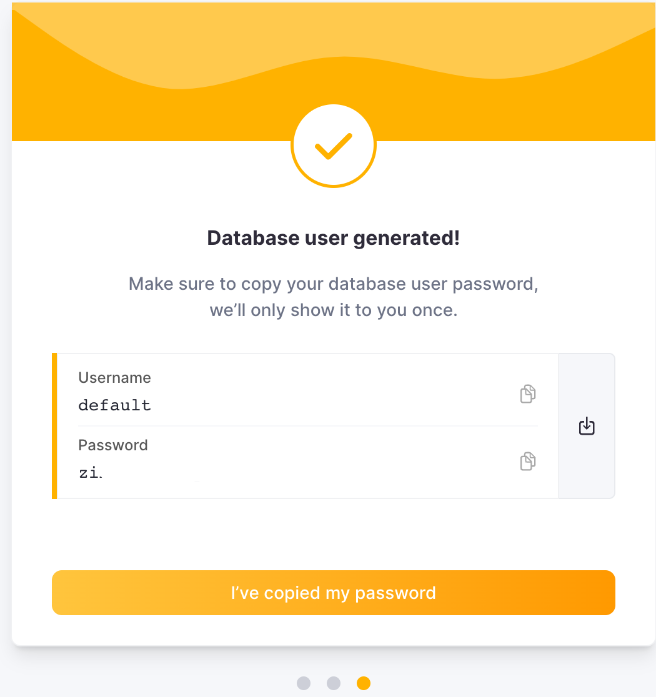

その後、実行中のClickHouseインスタンスを取得できます。「接続」をクリックしてClickHouse Cloudのインスタンス接続アドレスを取得します。

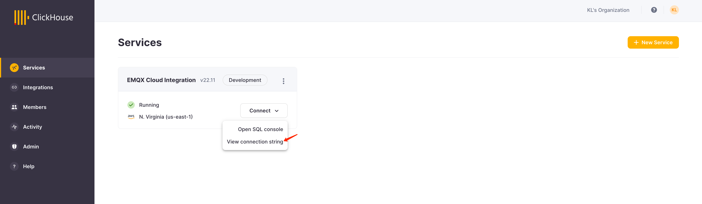

「SQLコンソールに接続」をクリックして、EMQX Cloudとの統合用にデータベースとテーブルを作成します。

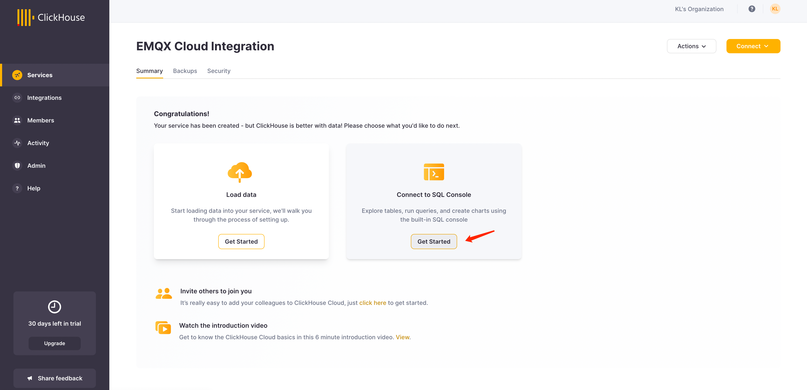

以下のSQLステートメントを参照するか、実際の状況に応じてSQLを変更できます。

```sql
CREATE TABLE emqx.temp_hum
(
   client_id String,
   timestamp DateTime,
   topic String,
   temp Float32,
   hum Float32
)
ENGINE = MergeTree()
PRIMARY KEY (client_id, timestamp)
```

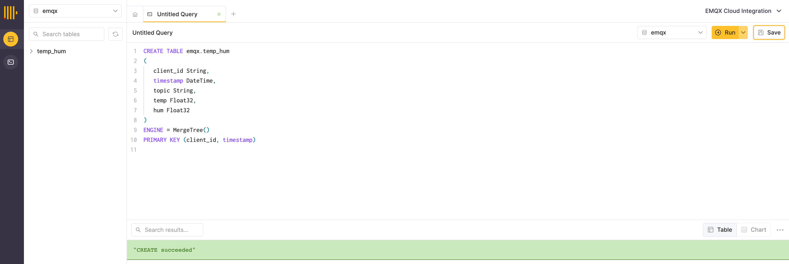

## EMQX CloudでのMQTTサービス作成

EMQX Cloudで専用のMQTTブローカーを作成するのは、数回のクリックで簡単に行えます。

### アカウントを取得する

EMQX Cloudは、標準デプロイメントおよびプロフェッショナルデプロイメントの両方でアカウントごとに14日間の無料トライアルを提供しています。

[EMQX Cloud サインアップ](https://accounts.emqx.com/signup?continue=https%3A%2F%2Fwww.emqx.com%2Fen%2Fcloud)ページからスタートし、フリートライアルを開始してアカウントを登録してください。

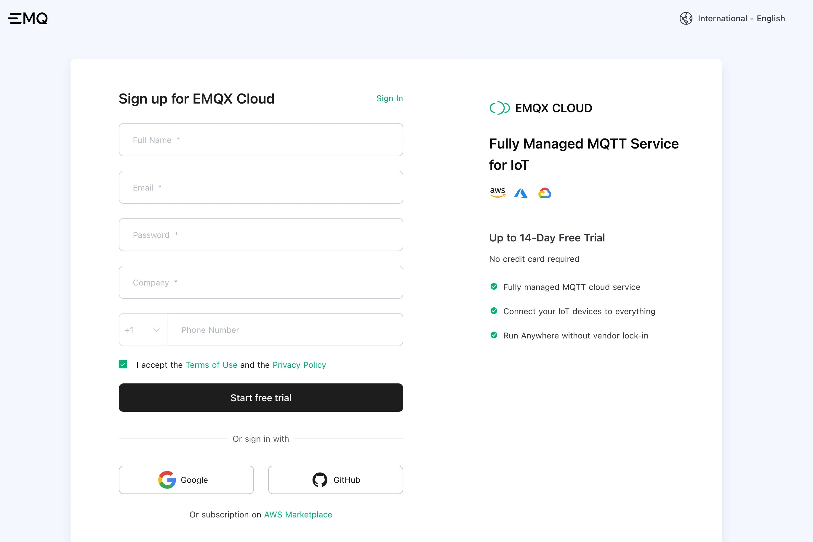

### MQTTクラスターを作成する

ログイン後、「Cloud Console」をアカウントメニューの下でクリックすると、新しいデプロイメントを作成するための緑色のボタンが表示されます。

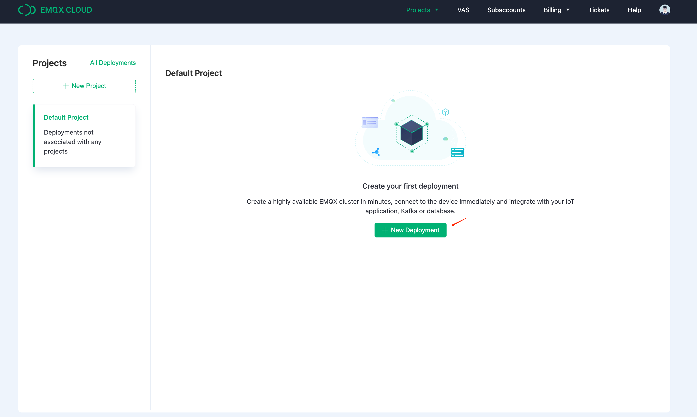

このチュートリアルでは、プロフェッショナルデプロイメントを使用します。プロバージョンのみがデータ統合機能を提供し、コード一本も書かずにMQTTデータを直接ClickHouseに送信することができます。

プロバージョンを選択し、『N. Virginia』地域を選択して『Create Now』をクリックします。数分で、完全に管理されたMQTTブローカーが得られます。

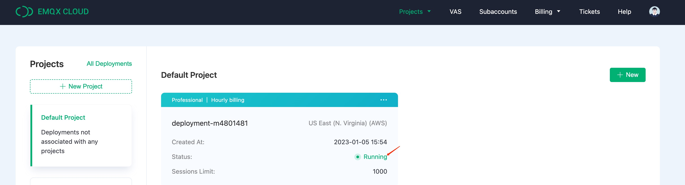

パネルをクリックしてクラスタービューに移動します。このダッシュボードでは、MQTTブローカーの概要を確認できます。


### クライアント資格情報を追加する

デフォルトでは、EMQX Cloudは匿名接続を許可していないため、クライアント資格情報を追加し、MQTTクライアントツールを使用してこのブローカーにデータを送信できるようにする必要があります。

左メニューの「Authentication & ACL」をクリックし、サブメニューで「Authentication」をクリックします。右の「Add」ボタンをクリックして、後でMQTT接続のためのユーザー名とパスワードを入力します。ここでは、ユーザー名とパスワードとして「emqx」と「xxxxxx」を使用します。

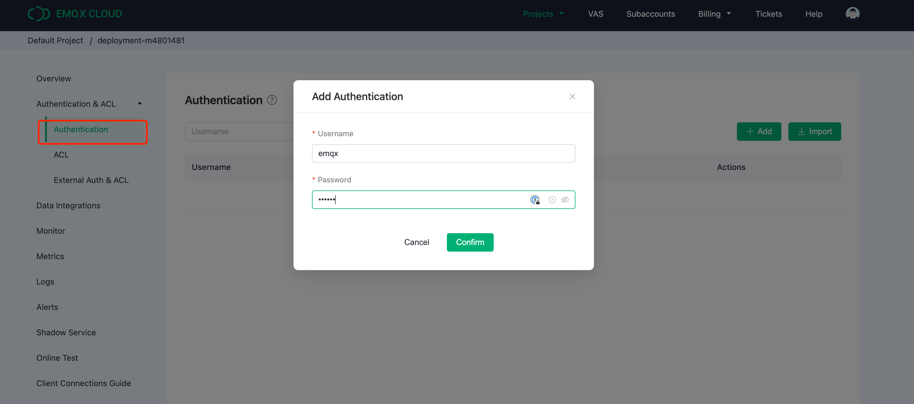

「確認」をクリックして、完全に管理されたMQTTブローカーの準備が整いました。

### NATゲートウェイを有効にする

ClickHouse統合の設定を開始する前に、まずNATゲートウェイを有効にする必要があります。デフォルトでは、MQTTブローカーはプライベートVPCにデプロイされており、パブリックネットワークを介してサードパーティシステムにデータを送信することはできません。

概要ページに戻り、ページの下部にあるNATゲートウェイウィジェットまでスクロールします。サブスクライブボタンをクリックし、指示に従ってください。NATゲートウェイは付加価値サービスですが、14日間の無料トライアルも提供しています。

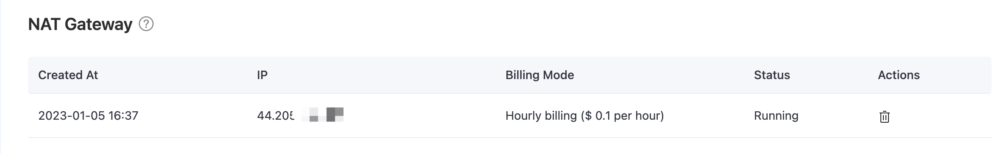

作成が完了すると、ウィジェットにパブリックIPアドレスが表示されます。ClickHouse Cloudのセットアップ中に「特定の場所から接続」を選択した場合は、このIPアドレスをホワイトリストに追加する必要があります。

## EMQX CloudとClickHouse Cloudの統合

[EMQX Cloud Data Integrations](https://docs.emqx.com/en/cloud/latest/rule_engine/introduction.html#general-flow) は、EMQXメッセージフローおよびデバイスイベントの処理と応答のルールを設定するために使用されます。データ統合は、明確で柔軟な「設定可能」なアーキテクチャソリューションを提供するだけでなく、開発プロセスを簡素化し、ユーザーの利便性を向上させ、ビジネスシステムとEMQX Cloud間の結合度を低減します。また、EMQX Cloudの専有能力のカスタマイズのための優れたインフラストラクチャを提供します。


EMQX Cloudは、人気のあるデータシステムとの30以上のネイティブ統合を提供しています。ClickHouseはその一つです。

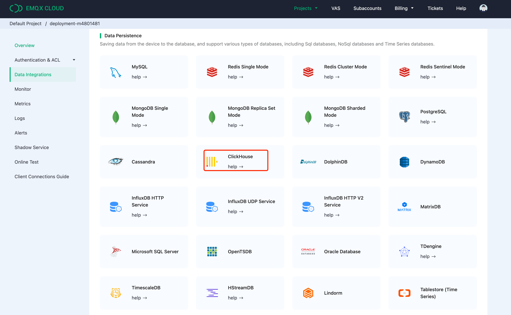

### ClickHouseリソースを作成する

左メニューの「Data Integrations」をクリックし、「View All Resources」をクリックします。ClickHouseをデータ保持セクションで見つけるか、ClickHouseを検索します。

ClickHouseカードをクリックして新しいリソースを作成します。

- ノート：このリソースに対するメモを追加します。
- サーバーアドレス：これはClickHouse Cloudサービスのアドレスです。ポートを忘れないようにしてください。
- データベース名：上記の手順で作成した「emqx」。
- ユーザー：ClickHouse Cloudサービス接続のためのユーザー名。
- キー：接続のためのパスワード。


### 新しいルールを作成する

リソースの作成中に、ポップアップが表示され、「New」をクリックするとルール作成ページに進みます。

EMQXは強力な[ルールエンジン](https://docs.emqx.com/en/cloud/latest/rule_engine/rules.html)を提供しており、生のMQTTメッセージをサードパーティシステムに送信する前に変換し、強化することができます。

このチュートリアルで使用するルールは次のとおりです：

```sql
SELECT
   clientid as client_id,
   (timestamp div 1000) as timestamp,
   topic as topic,
   payload.temp as temp,
   payload.hum as hum
FROM
"temp_hum/emqx"
```

これは「temp_hum/emqx」トピックからメッセージを読み取り、client_id、トピック、タイムスタンプ情報を追加することでJSONオブジェクトを強化します。

したがって、トピックに送信する生のJSONは次のとおりです：

```bash
{"temp": 28.5, "hum": 0.68}
```

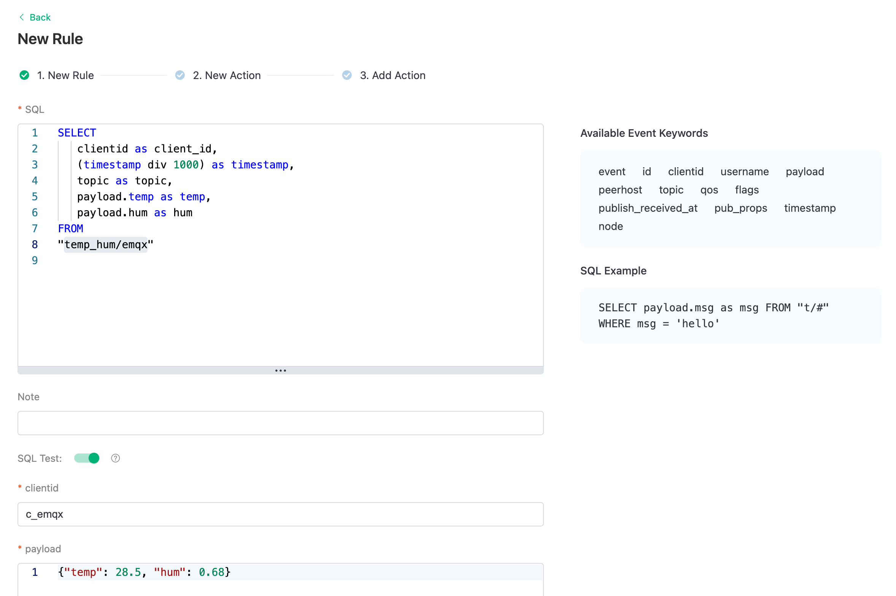

SQLテストを使用して、結果をテストおよび確認することができます。

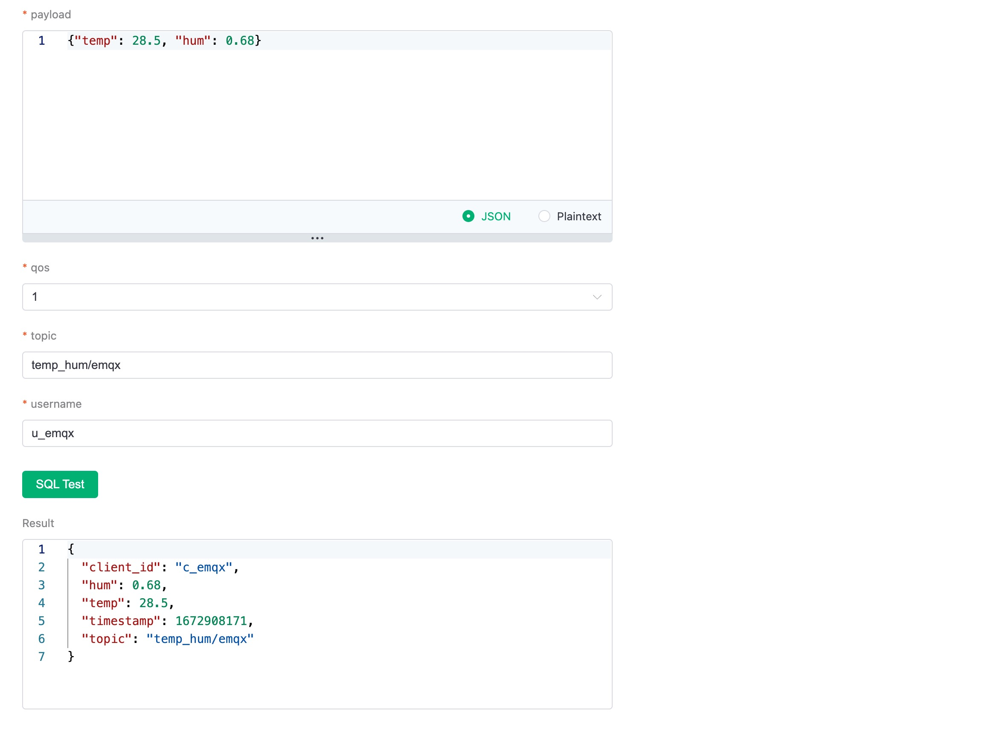

「NEXT」ボタンをクリックしてください。このステップでは、EMQX CloudにどのようにデータをClickHouseデータベースに挿入するかを伝えます。

### 応答アクションを追加する

リソースが一つだけの場合、「Resource」と「Action Type」を変更する必要はありません。
SQLテンプレートを設定するだけで済みます。このチュートリアルで使用する例は次のとおりです：

```bash
INSERT INTO temp_hum (client_id, timestamp, topic, temp, hum) VALUES ('${client_id}', ${timestamp}, '${topic}', ${temp}, ${hum})
```

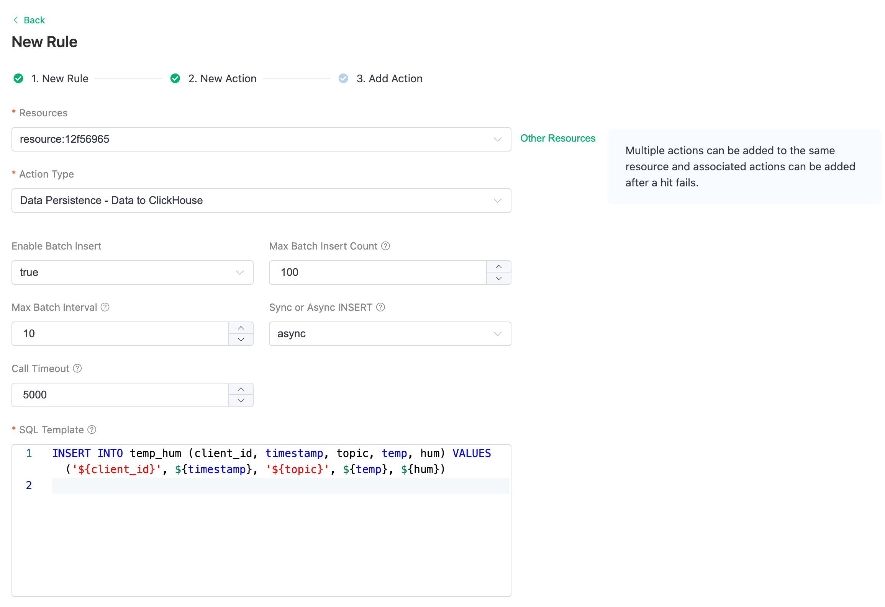

これはClickHouseにデータを挿入するためのテンプレートで、変数が使用されていることがわかります。

### ルールの詳細を確認する

「Confirm」と「View Details」をクリックしてください。これで全てが正常に設定されるはずです。ルール詳細ページからデータ統合の動作を確認できます。

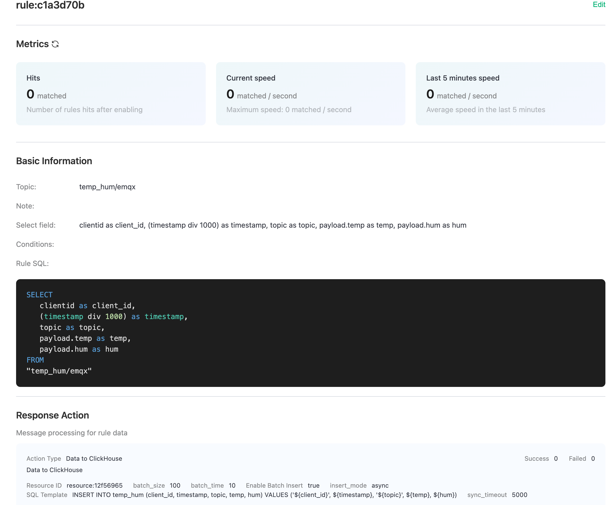

「temp_hum/emqx」トピックに送信されるすべてのMQTTメッセージは、ClickHouse Cloudデータベースに持続されます。

## ClickHouseへのデータ保存

温度と湿度のデータをシミュレートし、これらのデータをMQTT X経由でEMQX Cloudにレポートし、その後EMQX Cloud Data Integrationsを使用してデータをClickHouse Cloudに保存します。

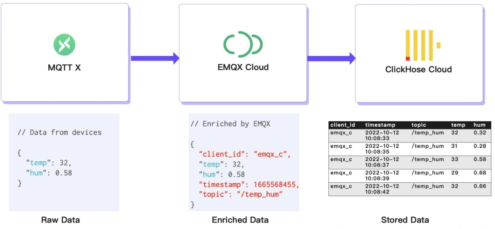

### EMQX CloudにMQTTメッセージを公開する

メッセージを公開するために任意のMQTTクライアントまたはSDKを使用できます。このチュートリアルでは、EMQによって提供されるユーザーフレンドリーなMQTTクライアントアプリケーションである[MQTT X](https://mqttx.app/)を使用します。

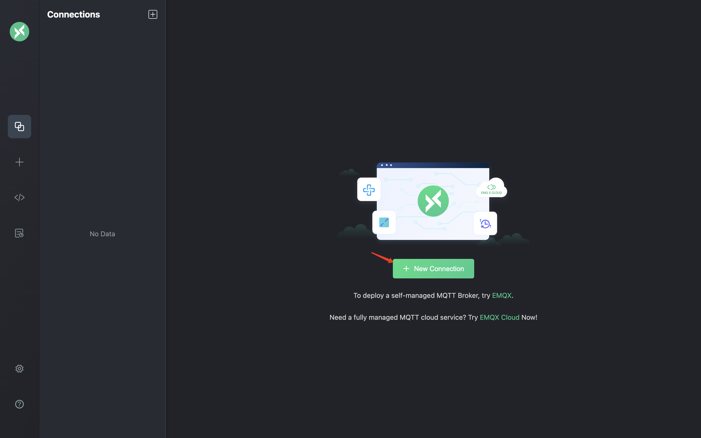

MQTTXで「New Connection」をクリックし、接続フォームを記入します：

- 名前：接続名。任意の名前を使用できます。
- ホスト：MQTTブローカーの接続アドレス。これはEMQX Cloudの概要ページから取得できます。
- ポート：MQTTブローカーの接続ポート。これはEMQX Cloudの概要ページから取得できます。
- ユーザー名/パスワード：上記で作成した資格情報を使用します。このチュートリアルでは「emqx」と「xxxxxx」であるはずです。

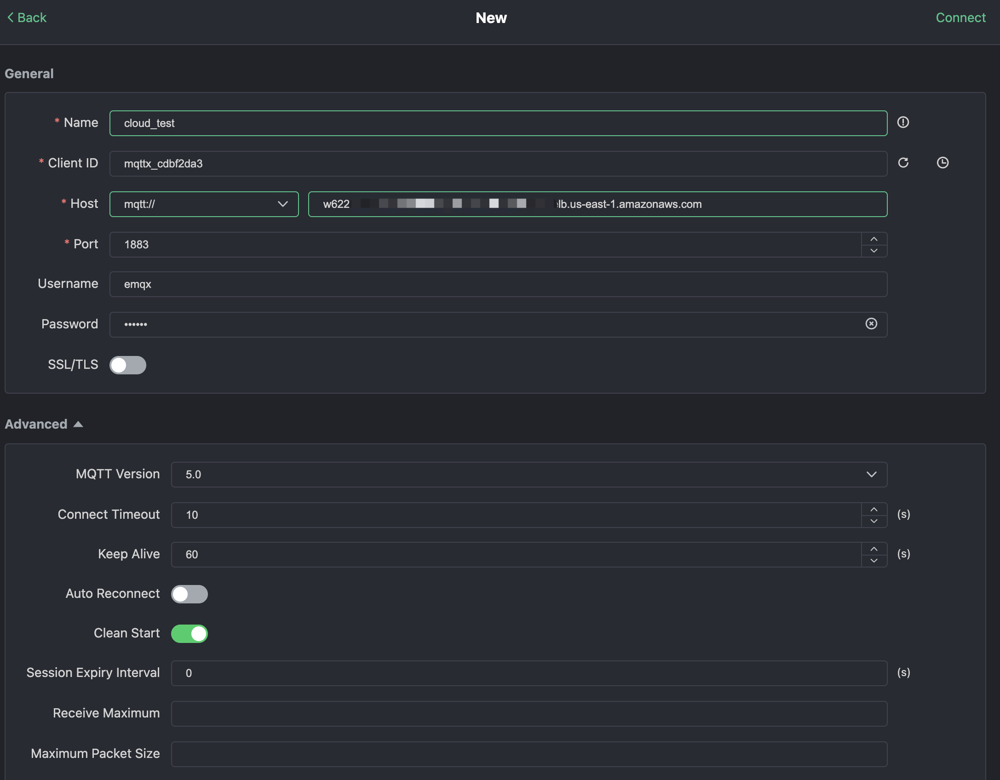

右上の「接続」ボタンをクリックし、接続が確立されるはずです。

このツールを使用してMQTTブローカーにメッセージを送信できます。
入力：
1. ペイロード形式を「JSON」に設定する。
2. トピックを「temp_hum/emqx」に設定する（ルールで設定したトピック）。
3. JSONボディ：

```bash
{"temp": 23.1, "hum": 0.68}
```

右の送信ボタンをクリックします。温度値を変更して、MQTTブローカーにより多くのデータを送信することができます。

EMQX Cloudに送信されるデータは、ルールエンジンによって処理され、自動的にClickHouse Cloudに挿入されるはずです。

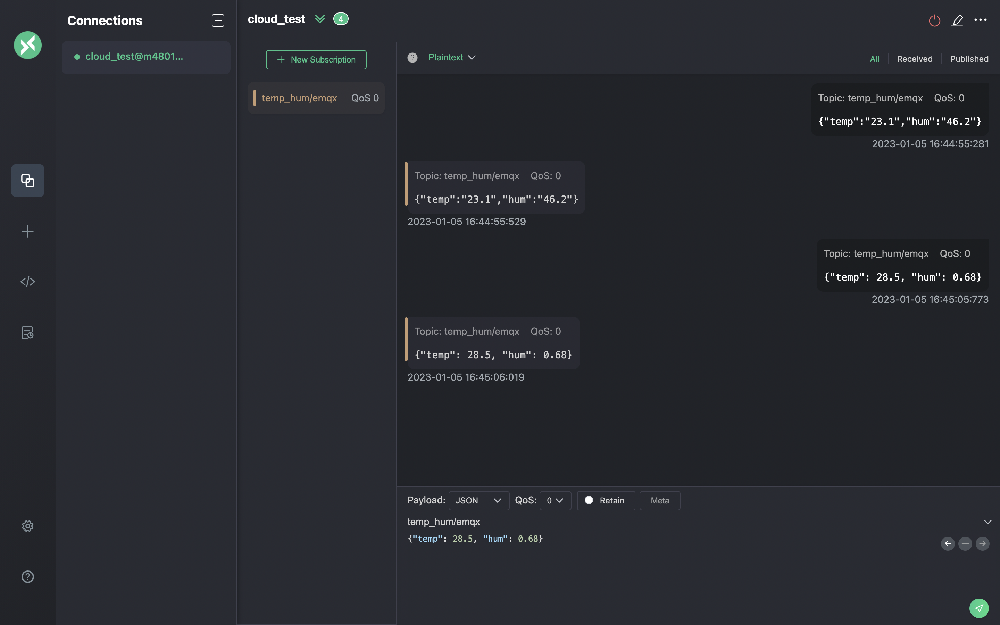

### ルール監視を確認する

ルール監視を確認し、成功数を追加します。

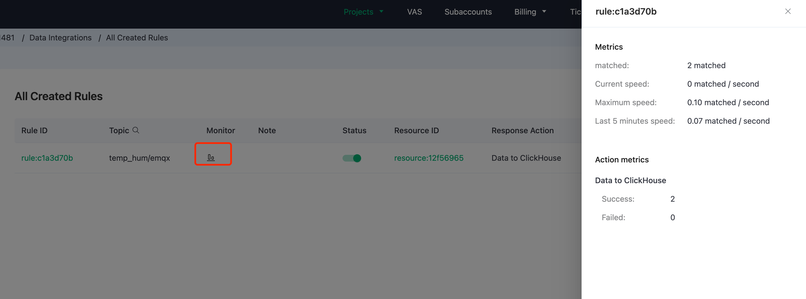

### 保存されたデータを確認する

ClickHouse Cloudでデータを確認する時が来ました。MQTTXを使用して送信したデータがEMQX Cloudに入り、ネイティブデータ統合の助けを借りてClickHouse Cloudのデータベースに保存されます。

ClickHouse CloudパネルのSQLコンソールに接続するか、任意のクライアントツールを使用してClickHouseからデータを取得できます。このチュートリアルではSQLコンソールを使用しました。
以下のSQLを実行して：

```bash
SELECT * FROM emqx.temp_hum;
```

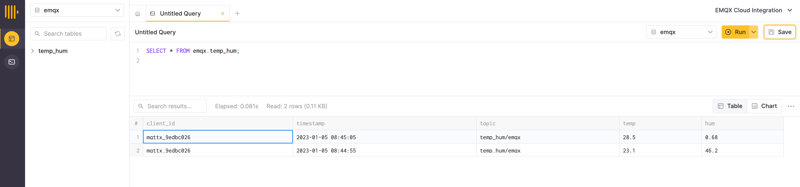

### まとめ

コードを書かずに、EMQX CloudからClickHouse CloudにMQTTデータを移動できました。EMQX CloudとClickHouse Cloudを使用すると、インフラを管理する必要がなくなり、ClickHouse Cloudに安全に保存されたデータを用いてあなたのIoTアプリケーションを書くことに専念できます。
