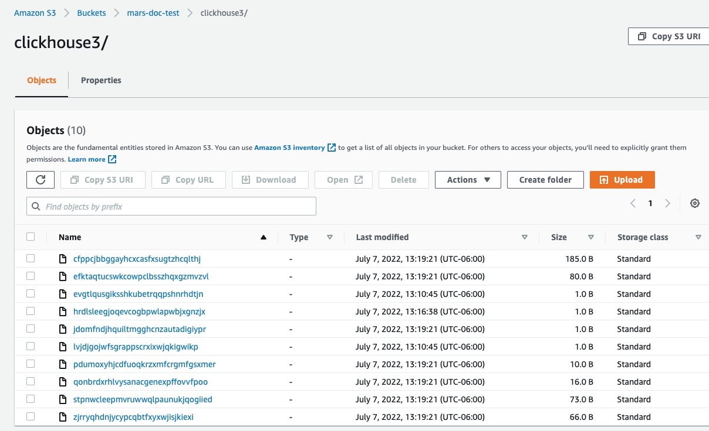
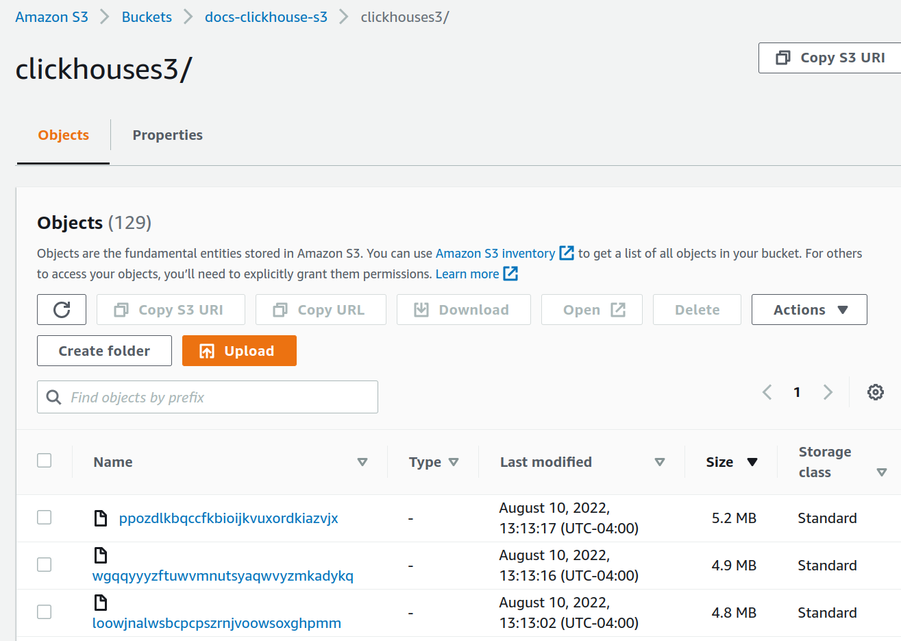
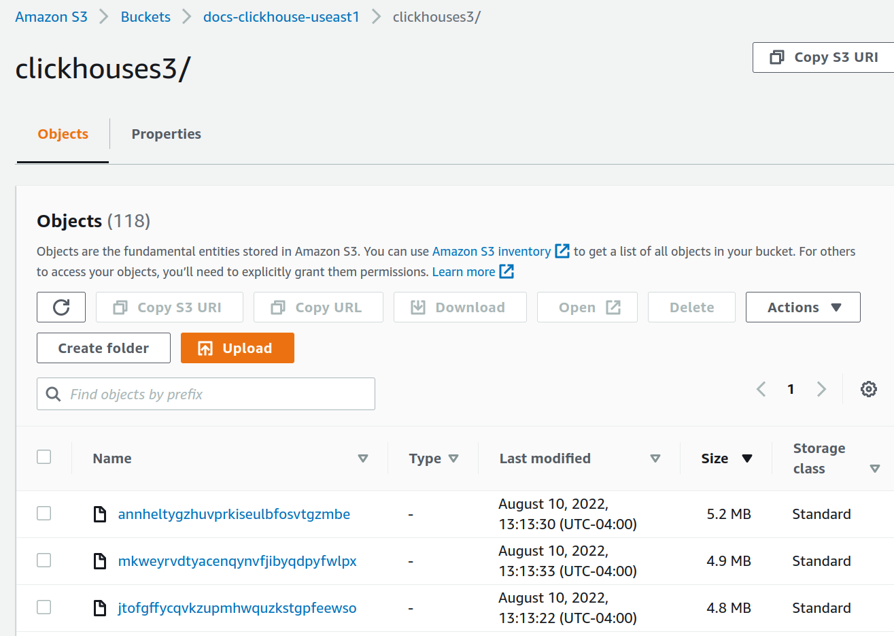

import BucketDetails from '@site/docs/ja/_snippets/_S3_authentication_and_bucket.md';

# S3とClickHouseの統合

S3からClickHouseにデータを挿入したり、S3をエクスポート先として使用したりできます。これにより「データレイク」アーキテクチャとの相互作用が可能になります。さらに、S3は「コールド」ストレージ階層を提供し、ストレージとコンピュートの分離を支援できます。以下のセクションでは、ニューヨーク市のタクシーデータセットを使用して、S3とClickHouse間でデータを移動するプロセスを示し、主要な構成パラメータを特定し、パフォーマンスを最適化するためのヒントを提供します。

## S3テーブル関数

`s3`テーブル関数を使用すると、S3互換ストレージからファイルを読み取ったり、ファイルを書き込んだりできます。構文の概要は次のとおりです：

```sql
s3(path, [aws_access_key_id, aws_secret_access_key,] [format, [structure, [compression]]])
```

ここで：

* path — ファイルのパスを含むバケットURL。このURLは、読み取り専用モードで次のワイルドカードに対応します：`*`、`?`、`{abc,def}`、`{N..M}`（ここで`N`と`M`は数字、`'abc'`と`'def'`は文字列です）。詳細は、[パスでのワイルドカード使用に関するドキュメント](/docs/ja/engines/table-engines/integrations/s3/#wildcards-in-path)を参照してください。
* format — ファイルの[フォーマット](/docs/ja/interfaces/formats.md/#formats)。
* structure — テーブルの構造。形式は`'column1_name column1_type, column2_name column2_type, ...'`。
* compression — パラメータはオプションです。サポートされる値は`none`、`gzip/gz`、`brotli/br`、`xz/LZMA`、`zstd/zst`です。デフォルトでは、ファイル拡張子によって圧縮を自動検出します。

パス式にワイルドカードを使用することで、複数のファイルを参照し、並列処理の可能性を開きます。

### 準備

S3ベースのデータセットと相互作用するために、標準の`MergeTree`テーブルを作成し、宛先とします。以下のステートメントでは、デフォルトデータベースに`trips`という名前のテーブルを作成します：

```sql
CREATE TABLE trips
(
    `trip_id` UInt32,
    `vendor_id` Enum8('1' = 1, '2' = 2, '3' = 3, '4' = 4, 'CMT' = 5, 'VTS' = 6, 'DDS' = 7, 'B02512' = 10, 'B02598' = 11, 'B02617' = 12, 'B02682' = 13, 'B02764' = 14, '' = 15),
    `pickup_date` Date,
    `pickup_datetime` DateTime,
    `dropoff_date` Date,
    `dropoff_datetime` DateTime,
    `store_and_fwd_flag` UInt8,
    `rate_code_id` UInt8,
    `pickup_longitude` Float64,
    `pickup_latitude` Float64,
    `dropoff_longitude` Float64,
    `dropoff_latitude` Float64,
    `passenger_count` UInt8,
    `trip_distance` Float64,
    `fare_amount` Float32,
    `extra` Float32,
    `mta_tax` Float32,
    `tip_amount` Float32,
    `tolls_amount` Float32,
    `ehail_fee` Float32,
    `improvement_surcharge` Float32,
    `total_amount` Float32,
    `payment_type` Enum8('UNK' = 0, 'CSH' = 1, 'CRE' = 2, 'NOC' = 3, 'DIS' = 4),
    `trip_type` UInt8,
    `pickup` FixedString(25),
    `dropoff` FixedString(25),
    `cab_type` Enum8('yellow' = 1, 'green' = 2, 'uber' = 3),
    `pickup_nyct2010_gid` Int8,
    `pickup_ctlabel` Float32,
    `pickup_borocode` Int8,
    `pickup_ct2010` String,
    `pickup_boroct2010` String,
    `pickup_cdeligibil` String,
    `pickup_ntacode` FixedString(4),
    `pickup_ntaname` String,
    `pickup_puma` UInt16,
    `dropoff_nyct2010_gid` UInt8,
    `dropoff_ctlabel` Float32,
    `dropoff_borocode` UInt8,
    `dropoff_ct2010` String,
    `dropoff_boroct2010` String,
    `dropoff_cdeligibil` String,
    `dropoff_ntacode` FixedString(4),
    `dropoff_ntaname` String,
    `dropoff_puma` UInt16
)
ENGINE = MergeTree
PARTITION BY toYYYYMM(pickup_date)
ORDER BY pickup_datetime
SETTINGS index_granularity = 8192
```

`pickup_date`フィールドで[パーティショニング](/docs/ja/engines/table-engines/mergetree-family/custom-partitioning-key.md/#custom-partitioning-key)を使用しています。通常、パーティションキーはデータ管理のためですが、後でこのキーを利用してS3への書き込みを並列化します。

私たちのタクシーデータセットの各エントリは、タクシーの旅を含んでいます。この匿名化されたデータは、約20MのレコードでS3バケットhttps://datasets-documentation.s3.eu-west-3.amazonaws.com/のフォルダ**nyc-taxi**に圧縮されています。データはTSV形式で、ファイルごとに約1Mの行が含まれています。

### S3からのデータ読み取り

ClickHouseに保持することなく、S3データをソースとしてクエリできます。以下のクエリでは、10行をサンプルします。このバケットへのアクセスは公開されているため、ここでは認証情報が不要です：

```sql
SELECT *
FROM s3('https://datasets-documentation.s3.eu-west-3.amazonaws.com/nyc-taxi/trips_*.gz', 'TabSeparatedWithNames')
LIMIT 10;
```

`TabSeparatedWithNames`形式では、最初の行にカラム名が含まれているため、カラムを列挙する必要はありません。`CSV`や`TSV`などの他の形式では、自動生成されたカラム（例：`c1`、`c2`、`c3`など）がこのクエリに対して返されます。

クエリはまた、バケットパスとファイル名に関する情報を提供する[仮想カラム](../sql-reference/table-functions/s3#virtual-columns)（`_path`や`_file`など）をサポートしています。例えば：

```sql
SELECT  _path, _file, trip_id
FROM s3('https://datasets-documentation.s3.eu-west-3.amazonaws.com/nyc-taxi/trips_0.gz', 'TabSeparatedWithNames')
LIMIT 5;
```

```response
┌─_path──────────────────────────────────────┬─_file──────┬────trip_id─┐
│ datasets-documentation/nyc-taxi/trips_0.gz │ trips_0.gz │ 1199999902 │
│ datasets-documentation/nyc-taxi/trips_0.gz │ trips_0.gz │ 1199999919 │
│ datasets-documentation/nyc-taxi/trips_0.gz │ trips_0.gz │ 1199999944 │
│ datasets-documentation/nyc-taxi/trips_0.gz │ trips_0.gz │ 1199999969 │
│ datasets-documentation/nyc-taxi/trips_0.gz │ trips_0.gz │ 1199999990 │
└────────────────────────────────────────────┴────────────┴────────────┘
```

このサンプルデータセットの行数を確認します。ワイルドカードを使用してファイルの拡張を行うため、全ての20ファイルを考慮します。このクエリは、ClickHouseインスタンスのコア数によっては約10秒間かかります：

```sql
SELECT count() AS count
FROM s3('https://datasets-documentation.s3.eu-west-3.amazonaws.com/nyc-taxi/trips_*.gz', 'TabSeparatedWithNames');
```

```response
┌────count─┐
│ 20000000 │
└──────────┘
```

データをサンプリングしたり、アドホックかつ探索的なクエリを実行するには便利ですが、S3から直接データを読み取るのは定期的に行うことではありません。本格的に取り組むときは、データをClickHouseの`MergeTree`テーブルにインポートします。

### clickhouse-localの使用

`clickhouse-local`プログラムを使用すると、ClickHouseサーバーをデプロイおよび構成することなく、ローカルファイルに対して高速処理を実行できます。`s3`テーブル関数を使用する任意のクエリは、このユーティリティを使用して実行できます。例えば：

```sql
clickhouse-local --query "SELECT * FROM s3('https://datasets-documentation.s3.eu-west-3.amazonaws.com/nyc-taxi/trips_*.gz', 'TabSeparatedWithNames') LIMIT 10"
```

### S3からのデータ挿入

ClickHouseの完全な機能を活用するために、次にデータを読み取り、インスタンスに挿入します。`s3`関数と単純な`INSERT`文を組み合わせてこれを実現します。ターゲットテーブルに必要な構造が提供されているため、カラムを列挙する必要はありません。この場合、カラムはテーブルDDL文で指定された順序で出現する必要があります：カラムは`SELECT`句での位置に基づいてマッピングされます。すべての1,000万行の挿入は、ClickHouseインスタンスに応じて数分かかることがあります。以下では、1,000,000行を挿入して迅速な応答を確保しています。必要に応じて`LIMIT`句やカラム選択を調整して、部分集合をインポートします：

```sql
INSERT INTO trips
   SELECT *
   FROM s3('https://datasets-documentation.s3.eu-west-3.amazonaws.com/nyc-taxi/trips_*.gz', 'TabSeparatedWithNames')
   LIMIT 1000000;
```

### ClickHouseローカルを使用したリモート挿入

ネットワークセキュリティポリシーによりClickHouseクラスタからの外部接続が制限されている場合、`clickhouse-local`を使用してS3データを挿入することが可能です。以下の例では、S3バケットから読み取り、`remote`関数を使用してClickHouseに挿入します：

```sql
clickhouse-local --query "INSERT INTO TABLE FUNCTION remote('localhost:9000', 'default.trips', 'username', 'password') (*) SELECT * FROM s3('https://datasets-documentation.s3.eu-west-3.amazonaws.com/nyc-taxi/trips_*.gz', 'TabSeparatedWithNames') LIMIT 10"
```

:::note
SSL接続でこれを実行するには、`remoteSecure`関数を利用してください。
:::

### データのエクスポート

`s3`テーブル関数を使用して、S3にファイルを書き込むことができます。これには適切な権限が必要です。リクエストで必要な資格情報を渡しますが、他のオプションについては[資格情報の管理](#managing-credentials)ページを参照してください。

以下の単純な例では、ソースではなく宛先としてテーブル関数を使用します。ここで、`trips`テーブルから10,000行をS3バケットに流し込み、`lz4`圧縮と`CSV`の出力形式を指定します：

```sql
INSERT INTO FUNCTION
   s3(
       'https://datasets-documentation.s3.eu-west-3.amazonaws.com/csv/trips.csv.lz4',
       's3_key',
       's3_secret',
       'CSV'
    )
SELECT *
FROM trips
LIMIT 10000;
```

ここでは、ファイルの形式が拡張子から推測されることに注意してください。また、`s3`関数内で列を指定する必要はありません - `SELECT`から推測できます。

### 大規模ファイルの分割

データを単一のファイルとしてエクスポートすることはあまり望ましくありません。ClickHouseを含むほとんどのツールは、並列処理の可能性があるため、複数のファイルに対する読み取りや書き込みでより高いスループットパフォーマンスを達成します。`INSERT`コマンドを複数回実行し、データのサブセットをターゲットにすることができます。ClickHouseは、`パーティション`キーを使用してファイルを自動的に分割する手段を提供します。

以下の例では、`rand()`関数の剰余を使用して10個のファイルを作成します。結果のパーティションIDがファイル名で参照されることに注目してください。これにより、数値サフィックスが付いた10個のファイルが作成されます。例：`trips_0.csv.lz4`、`trips_1.csv.lz4`など...：

```sql
INSERT INTO FUNCTION
   s3(
       'https://datasets-documentation.s3.eu-west-3.amazonaws.com/csv/trips_{_partition_id}.csv.lz4',
       's3_key',
       's3_secret',
       'CSV'
    )
    PARTITION BY rand() % 10
SELECT *
FROM trips
LIMIT 100000;
```

または、データのフィールドを参照することもできます。このデータセットでは、`payment_type`が5のカードのナチュラルなパーティションキーを提供します。

```sql
INSERT INTO FUNCTION
   s3(
       'https://datasets-documentation.s3.eu-west-3.amazonaws.com/csv/trips_{_partition_id}.csv.lz4',
       's3_key',
       's3_secret',
       'CSV'
    )
    PARTITION BY payment_type
SELECT *
FROM trips
LIMIT 100000;
```

### クラスターの利用

上記の関数はすべて単一ノードでの実行に制限されています。読み取り速度はCPUコアにリニアにスケールするため、他のリソース（通常はネットワーク）が飽和するまで縦方向にスケールできます。しかし、このアプローチには限界があります。`INSERT INTO SELECT`クエリを実行するときに分散テーブルに挿入することで、いくつかのリソースプレッシャーを軽減することができますが、データの読み取り、解析、処理を行うノードが単一のままです。この課題に対処し、読み取りを水平にスケールするために、[s3Cluster](/docs/ja/sql-reference/table-functions/s3Cluster.md)関数があります。

クエリを受信したノード（イニシエーターとして知られています）は、クラスタ内のすべてのノードとの接続を作成します。ファイルを読み取る必要があるかを決定するglobパターンが、一連のファイルに解決されます。イニシエーターはファイルをクラスタ内のノードに配布し、これらのノードはワーカーとして機能します。これらのワーカーは、読み取りが完了したら処理するファイルを要求します。このプロセスにより、読み取りを水平にスケールできるようになります。

`s3Cluster`関数は、単一ノードバリアントと同じ形式をとりますが、ワーカーノードを示すターゲットクラスタが必要です：

```
s3Cluster(cluster_name, source, [access_key_id, secret_access_key,] format, structure)
```

* `cluster_name` — リモートおよびローカルサーバーへのアドレスと接続パラメータのセットを構築するために使用されるクラスタの名前。
* `source` — ファイルまたは一連のファイルへのURL。読み取り専用モードで以下のワイルドカードをサポートします：*, ?, {'abc','def'} 及び {N..M}、N, M — 数字、abc, def — 文字列。詳細は[ワイルドカード使用のドキュメント](/docs/ja/engines/table-engines/integrations/s3.md/#wildcards-in-path)を参照してください。
* `access_key_id`及び`secret_access_key` — 指定されたエンドポイントで使用する資格情報を指定します。オプションです。
* `format` — ファイルの[フォーマット](/docs/ja/interfaces/formats.md/#formats)。
* `structure` — テーブルの構造。形式は'column1_name column1_type, column2_name column2_type, ...'です。

`s3`関数のように、バケットがセキュアではない、またはIAMロールを通じてセキュリティを定義している場合は、資格情報はオプションです。しかし、`s3Cluster`関数の場合、22.3.1ではリクエストに構造を指定する必要があります、つまりスキーマは推測されません。

この関数は、多くの場合、`INSERT INTO SELECT`の一部として使用されます。この場合、分散テーブルに挿入することが多いです。以下の簡単な例を示します。ここで`trips_all`は分散テーブルです。このテーブルがイベントクラスタを使用している間、読み取りと書き込みに使用されるノードの一貫性は要件ではありません：

```sql
INSERT INTO default.trips_all
   SELECT *
   FROM s3Cluster(
       'events',
       'https://datasets-documentation.s3.eu-west-3.amazonaws.com/nyc-taxi/trips_*.gz',
       'TabSeparatedWithNames'
    )
```

挿入はイニシエーターノードに対して行われます。つまり、読み取りは各ノードで行われますが、結果の行はイニシエーターにルーティングされ、分配されます。高スループットのシナリオでは、これがボトルネックとなる可能性があります。これに対処するために、`s3Cluster`関数のパラメータ[parallel_distributed_insert_select](/docs/ja/operations/settings/settings/#parallel_distributed_insert_select)を設定します。

## S3テーブルエンジン

`s3`関数は、S3に保存されたデータに対するアドホッククエリを可能にしますが、文法的に冗長です。`S3`テーブルエンジンを使用すると、バケットURLと資格情報を繰り返し指定する必要がありません。これを解決するために、ClickHouseはS3テーブルエンジンを提供します。

```sql
CREATE TABLE s3_engine_table (name String, value UInt32)
    ENGINE = S3(path, [aws_access_key_id, aws_secret_access_key,] format, [compression])
    [SETTINGS ...]
```

* `path` — バケットURLとファイルパス。読み取り専用モードで以下のワイルドカードをサポートします：*, ?, {abc,def}、{N..M}（N, M — 数字、'abc', 'def' — 文字列）。詳細は[ここ](/docs/ja/engines/table-engines/integrations/s3#wildcards-in-path)を参照してください。
* `format` — ファイルの[フォーマット](/docs/ja/interfaces/formats.md/#formats)。
* `aws_access_key_id`、`aws_secret_access_key` - AWSアカウントユーザー用の長期的な資格情報。これを使用してリクエストに認証できます。パラメータはオプションです。資格情報が指定されていない場合、構成ファイルの値が使用されます。詳細は、[資格情報の管理](#managing-credentials)を参照してください。
* `compression` — 圧縮タイプ。サポートされている値は、none、gzip/gz、brotli/br、xz/LZMA、zstd/zstです。パラメータはオプションです。デフォルトでは、ファイル拡張子により圧縮を自動検出します。

### データの読み取り

以下の例では、`https://datasets-documentation.s3.eu-west-3.amazonaws.com/nyc-taxi/`バケットにある最初の10個のTSVファイルを使用して`trips_raw`という名前のテーブルを作成します。それぞれのファイルには1M行が含まれています：

```sql
CREATE TABLE trips_raw
(
   `trip_id`               UInt32,
   `vendor_id`             Enum8('1' = 1, '2' = 2, '3' = 3, '4' = 4, 'CMT' = 5, 'VTS' = 6, 'DDS' = 7, 'B02512' = 10, 'B02598' = 11, 'B02617' = 12, 'B02682' = 13, 'B02764' = 14, '' = 15),
   `pickup_date`           Date,
   `pickup_datetime`       DateTime,
   `dropoff_date`          Date,
   `dropoff_datetime`      DateTime,
   `store_and_fwd_flag`    UInt8,
   `rate_code_id`          UInt8,
   `pickup_longitude`      Float64,
   `pickup_latitude`       Float64,
   `dropoff_longitude`     Float64,
   `dropoff_latitude`      Float64,
   `passenger_count`       UInt8,
   `trip_distance`         Float64,
   `fare_amount`           Float32,
   `extra`                 Float32,
   `mta_tax`               Float32,
   `tip_amount`            Float32,
   `tolls_amount`          Float32,
   `ehail_fee`             Float32,
   `improvement_surcharge` Float32,
   `total_amount`          Float32,
   `payment_type_`         Enum8('UNK' = 0, 'CSH' = 1, 'CRE' = 2, 'NOC' = 3, 'DIS' = 4),
   `trip_type`             UInt8,
   `pickup`                FixedString(25),
   `dropoff`               FixedString(25),
   `cab_type`              Enum8('yellow' = 1, 'green' = 2, 'uber' = 3),
   `pickup_nyct2010_gid`   Int8,
   `pickup_ctlabel`        Float32,
   `pickup_borocode`       Int8,
   `pickup_ct2010`         String,
   `pickup_boroct2010`     FixedString(7),
   `pickup_cdeligibil`     String,
   `pickup_ntacode`        FixedString(4),
   `pickup_ntaname`        String,
   `pickup_puma`           UInt16,
   `dropoff_nyct2010_gid`  UInt8,
   `dropoff_ctlabel`       Float32,
   `dropoff_borocode`      UInt8,
   `dropoff_ct2010`        String,
   `dropoff_boroct2010`    FixedString(7),
   `dropoff_cdeligibil`    String,
   `dropoff_ntacode`       FixedString(4),
   `dropoff_ntaname`       String、
   `dropoff_puma`          UInt16
) ENGINE = S3('https://datasets-documentation.s3.eu-west-3.amazonaws.com/nyc-taxi/trips_{0..9}.gz', 'TabSeparatedWithNames', 'gzip');
```

{0..9}パターンを使用して最初の10個のファイルに限定している点に注目してください。作成後は、他のテーブルと同様にこのテーブルをクエリできます：

```sql
SELECT DISTINCT(pickup_ntaname)
FROM trips_raw
LIMIT 10;
```

```response
┌─pickup_ntaname───────────────────────────────────┐
│ Lenox Hill-Roosevelt Island                      │
│ Airport                                          │
│ SoHo-TriBeCa-Civic Center-Little Italy           │
│ West Village                                     │
│ Chinatown                                        │
│ Hudson Yards-Chelsea-Flatiron-Union Square       │
│ Turtle Bay-East Midtown                          │
│ Upper West Side                                  │
│ Murray Hill-Kips Bay                             │
│ DUMBO-Vinegar Hill-Downtown Brooklyn-Boerum Hill │
└──────────────────────────────────────────────────┘
```

### データの挿入

`S3`テーブルエンジンは並列読み取りをサポートしています。書き込みは、テーブル定義にグロブパターンが含まれていない場合にのみサポートされます。したがって、上記のテーブルでは書込みはブロックされます。

書き込みを示すために、書き込み可能なS3バケットを指すテーブルを作成します：

```sql
CREATE TABLE trips_dest
(
   `trip_id`               UInt32,
   `pickup_date`           Date,
   `pickup_datetime`       DateTime,
   `dropoff_datetime`      DateTime,
   `tip_amount`            Float32,
   `total_amount`          Float32
) ENGINE = S3('<bucket path>/trips.bin', 'Native');
```

```sql
INSERT INTO trips_dest
   SELECT
      trip_id,
      pickup_date,
      pickup_datetime,
      dropoff_datetime,
      tip_amount,
      total_amount
   FROM trips
   LIMIT 10;
```

```sql
SELECT * FROM trips_dest LIMIT 5;
```

```response
┌────trip_id─┬─pickup_date─┬─────pickup_datetime─┬────dropoff_datetime─┬─tip_amount─┬─total_amount─┐
│ 1200018648 │  2015-07-01 │ 2015-07-01 00:00:16 │ 2015-07-01 00:02:57 │          0 │          7.3 │
│ 1201452450 │  2015-07-01 │ 2015-07-01 00:00:20 │ 2015-07-01 00:11:07 │       1.96 │        11.76 │
│ 1202368372 │  2015-07-01 │ 2015-07-01 00:00:40 │ 2015-07-01 00:05:46 │          0 │          7.3 │
│ 1200831168 │  2015-07-01 │ 2015-07-01 00:01:06 │ 2015-07-01 00:09:23 │          2 │         12.3 │
│ 1201362116 │  2015-07-01 │ 2015-07-01 00:01:07 │ 2015-07-01 00:03:31 │          0 │          5.3 │
└────────────┴─────────────┴─────────────────────┴─────────────────────┴────────────┴──────────────┘
```

行は新しいファイルにのみ挿入できます。マージサイクルやファイル分割操作はありません。一度書き込まれたファイルは、後続の挿入が失敗します。ユーザーには2つのオプションがあります：

* 設定` s3_create_new_file_on_insert=1`を指定します。これにより、各挿入時に新しいファイルが作成されます。数値サフィックスがファイルの末尾に付加され、各挿入操作で単調に増加します。上記の例では、後続の挿入はtrips_1.binファイルの作成を引き起こすでしょう。
* 設定`s3_truncate_on_insert=1`を指定します。これにより、ファイルが切り詰められ、完了後に新しく挿入された行のみが含まれます。

これらの設定はデフォルトで0に設定されており、いずれかを設定するようにしています。`s3_truncate_on_insert`が設定されている場合、優先されます。

`S3`テーブルエンジンに関するノート：

- 伝統的な`MergeTree`ファミリーテーブルとは異なり、`S3`テーブルを削除することは、基になるデータを削除しません。
- このテーブルタイプの完全な設定は[ここ](/docs/ja/engines/table-engines/integrations/s3.md/#settings)で見つけられます。
- このエンジンを使用する際には、以下の注意点があります：
    * ALTERクエリはサポートされていません
    * サンプル操作はサポートされていません
    * プライマリまたはスキップのインデックスの概念はありません。

## 資格情報の管理

前の例では、`s3`関数または`S3`テーブル定義で資格情報を渡しましたが、これは時折の使用には許容できますが、ユーザーはプロダクションでのより明示的でない認証メカニズムが求められます。これに対応して、ClickHouseは数つのオプションを提供します：

* 接続の詳細を**config.xml**または**conf.d**下の同等の構成ファイルに指定します。デビアンパッケージを使用してインストールした場合の例ファイルの内容を以下に示します。

    ```xml
    ubuntu@single-node-clickhouse:/etc/clickhouse-server/config.d$ cat s3.xml
    <clickhouse>
        <s3>
            <endpoint-name>
                <endpoint>https://dalem-files.s3.amazonaws.com/test/</endpoint>
                <access_key_id>key</access_key_id>
                <secret_access_key>secret</secret_access_key>
                <!-- <use_environment_credentials>false</use_environment_credentials> -->
                <!-- <header>Authorization: Bearer SOME-TOKEN</header> -->
            </endpoint-name>
        </s3>
    </clickhouse>
    ```

    これらの資格情報は、上記のエンドポイントが要求されたURLに対する完全なプレフィックス一致であるリクエストの場合に使用されます。また、例ではアクセストークンとしてのオルタナティブとしてアクセスキーとシークレットキーの代わりに、認証ヘッダーを宣言する能力があることに注意してください。サポートされている設定の完全なリストは[ここ](/docs/ja/engines/table-engines/integrations/s3.md/#settings)で見つけられます。

* 上記の例では、構成パラメータ`use_environment_credentials`の利用可能性を強調しています。この構成パラメータは、`s3`レベルでグローバルに設定することもできます：

    ```xml
    <clickhouse>
        <s3>
        <use_environment_credentials>true</use_environment_credentials>
        </s3>
    </clickhouse>
    ```

    この設定は、環境からS3資格情報を取得しようとすることを許可するため、IAMロールを通じてアクセスを許可します。具体的には、次の順序での取得が実行されます：

   * 環境変数`AWS_ACCESS_KEY_ID`、`AWS_SECRET_ACCESS_KEY`および`AWS_SESSION_TOKEN`の検索。
   * **$HOME/.aws**でのチェック実施。
   * AWSセキュリティトークンサービスを通じた一時的な資格情報の取得 - すなわち [AssumeRole](https://docs.aws.amazon.com/STS/latest/APIReference/API_AssumeRole.html) APIを通じて。
   * ECS環境変数`AWS_CONTAINER_CREDENTIALS_RELATIVE_URI`または`AWS_CONTAINER_CREDENTIALS_FULL_URI`と`AWS_ECS_CONTAINER_AUTHORIZATION_TOKEN`での資格情報のチェック。
   * [Amazon EC2インスタンスメタデータ](https://docs.aws.amazon.com/cli/latest/userguide/cli-configure-metadata.html)を通じた資格情報の取得、ただし[AWS_EC2_METADATA_DISABLED](https://docs.aws.amazon.com/cli/latest/userguide/cli-configure-envvars.html#envvars-list-AWS_EC2_METADATA_DISABLED)がtrueに設定されていない場合。
   * これらの設定は、プレフィックス一致ルールを使用して、特定のエンドポイント用に設定することもできます。

## パフォーマンス最適化 {#s3-optimizing-performance}

S3関数を使用した読み取りおよび挿入を最適化する方法については、[専用のパフォーマンスガイド](./performance.md)を参照してください。

### S3ストレージのチューニング

内部的に、ClickHouseのMergeTreeは、[`Wide`と`Compact`](/docs/ja/engines/table-engines/mergetree-family/mergetree.md/#mergetree-data-storage)という2つの主なストレージ形式を使用します。現在の実装は、（`min_bytes_for_wide_part`および`min_rows_for_wide_part`の設定により制御される）ClickHouseのデフォルトの動作を使用していますが、将来のリリースではS3の動作が変わることが予測されます。例えば、より大きなデフォルト値が設定され`Compact`フォーマットを推奨し、それによりファイルが少なくなることがあります。現在、S3ストレージを専用に使用している場合、ユーザーはこれらの設定を調整することを検討することができます。

## S3バックドMergeTree

`s3`関数と関連するテーブルエンジンを使用すると、ClickHouseの親しみやすい構文を使用してS3データをクエリすることができます。ただし、データ管理機能とパフォーマンスに関しては、制限があります。プライマリインデックスのサポートがない、キャッシュサポートがない、ファイルの挿入はユーザーが管理する必要があります。

ClickHouseは、S3が特にクエリパフォーマンスが重要でない「コールド」データのストレージソリューションとして魅力的であることを認識しており、ユーザーがストレージとコンピュートを分離したいと考えています。これを達成するために、S3をMergeTreeエンジンのストレージとして使用するサポートが提供されています。これにより、ユーザーはS3のスケーラビリティとコストメリット、そしてMergeTreeエンジンの挿入およびクエリパフォーマンスを活用できるようになります。

### ストレージ階層

ClickHouseストレージボリュームは、物理ディスクをMergeTreeテーブルエンジンから抽象化することができます。任意の単一のボリュームは、ディスクの順序付けされたセットで構成されることができます。これにより、データストレージに複数のブロックデバイスを使用する可能性があるだけでなく、S3などの他のストレージタイプも使用可能です。ClickHouseデータパーツは、ストレージポリシーに従ってボリューム間で移動およびフィルレートされることができ、ストレージ階層の概念が作成されます。

ストレージ階層アンロックは、通常、最も新しいデータが最もクエリされる必要があり、高性能なストレージ、例えばNVMe SSD上でのみ小量のスペースを要求するホット-コールドアーキテクチャを解放します。データが古くなるにつれて、クエリ時間のSLAが増加し、クエリの頻度が減少します。このデータのファットテールは、HDDやS3などのオブジェクトストレージのような、パフォーマンスの低いストレージに格納されることができます。

### ディスクの作成

S3バケットをディスクとして利用するために、まずClickHouse構成ファイル内で宣言する必要があります。config.xmlを拡張するか、またはpreferでplugin.dに新しいファイルを提供します。以下に示す例はS3ディスク宣言の例です：

```xml
<clickhouse>
    <storage_configuration>
        ...
        <disks>
            <s3>
                <type>s3</type>
                <endpoint>https://sample-bucket.s3.us-east-2.amazonaws.com/tables/</endpoint>
                <access_key_id>your_access_key_id</access_key_id>
                <secret_access_key>your_secret_access_key</secret_access_key>
                <region></region>
                <metadata_path>/var/lib/clickhouse/disks/s3/</metadata_path>
            </s3>
            <s3_cache>
                <type>cache</type>
                <disk>s3</disk>
                <path>/var/lib/clickhouse/disks/s3_cache/</path>
                <max_size>10Gi</max_size>
            </s3_cache>
        </disks>
        ...
    </storage_configuration>
</clickhouse>
```

このディスク宣言に関連する設定の完全なリストは[ここ](/docs/ja/engines/table-engines/mergetree-family/mergetree.md/#table_engine-mergetree-s3)で見つけられます。資格情報は、[資格情報の管理](#managing-credentials)で説明された同じアプローチを使用してここで管理できます。たとえば、上記の設定ブロックで`use_environment_credentials`をtrueに設定してIAMロールを使用することができます。

### ストレージポリシーの作成

設定が完了すると、この「ディスク」はポリシーで宣言されたストレージボリュームで使用できます。以下の例では、S3が唯一のストレージであると仮定しています。これは、データがTTLやフィルレートに基づいて移動される可能性のあるより複雑なホット-コールドアーキテクチャを無視します。

```xml
<clickhouse>
    <storage_configuration>
        <disks>
            <s3>
            ...
            </s3>
            <s3_cache>
            ...
            </s3_cache>
        </disks>
        <policies>
            <s3_main>
                <volumes>
                    <main>
                        <disk>s3</disk>
                    </main>
                </volumes>
            </s3_main>
        </policies>
    </storage_configuration>
</clickhouse>
```

### テーブルの作成

ディスクをwriteアクセスのあるバケットに設定していると仮定すると、以下の例のようにテーブルを作成できます。簡潔にするために、NYCタクシーのカラムの一部を使用し、データを直接S3バックドテーブルにストリームします：

```sql
CREATE TABLE trips_s3
(
   `trip_id` UInt32,
   `pickup_date` Date,
   `pickup_datetime` DateTime,
   `dropoff_datetime` DateTime,
   `pickup_longitude` Float64,
   `pickup_latitude` Float64,
   `dropoff_longitude` Float64,
   `dropoff_latitude` Float64,
   `passenger_count` UInt8,
   `trip_distance` Float64,
   `tip_amount` Float32,
   `total_amount` Float32,
   `payment_type` Enum8('UNK' = 0, 'CSH' = 1, 'CRE' = 2, 'NOC' = 3, 'DIS' = 4)
)
ENGINE = MergeTree
PARTITION BY toYYYYMM(pickup_date)
ORDER BY pickup_datetime
SETTINGS index_granularity = 8192, storage_policy='s3_main'
```

```sql
INSERT INTO trips_s3 SELECT trip_id, pickup_date, pickup_datetime, dropoff_datetime, pickup_longitude, pickup_latitude, dropoff_longitude, dropoff_latitude, passenger_count, trip_distance, tip_amount, total_amount, payment_type FROM s3('https://ch-nyc-taxi.s3.eu-west-3.amazonaws.com/tsv/trips_{0..9}.tsv.gz', 'TabSeparatedWithNames') LIMIT 1000000;
```
ハードウェアによりますが、1百万行の挿入は実行に数分かかる場合があります。進捗は `system.processes` テーブルで確認できます。行数を1千万まで増やし、一部のサンプルクエリを試してみてください。

```sql
SELECT passenger_count, avg(tip_amount) as avg_tip, avg(total_amount) as avg_amount FROM trips_s3 GROUP BY passenger_count;
```

### テーブルの変更

特定のテーブルのストレージポリシーを変更する必要がある場合もあります。これは可能ですが、制限があります。新しいターゲットポリシーは、前のポリシーのすべてのディスクとボリュームを含んでいる必要があります。つまり、ポリシー変更を満たすためにデータは移行されません。これらの制約を検証する際、ボリュームとディスクはその名前によって識別され、違反しようとするとエラーが発生します。しかし、以前の例を使用する場合、以下の変更は有効です。

```xml
<policies>
   <s3_main>
       <volumes>
           <main>
               <disk>s3</disk>
           </main>
       </volumes>
   </s3_main>
   <s3_tiered>
       <volumes>
           <hot>
               <disk>default</disk>
           </hot>
           <main>
               <disk>s3</disk>
           </main>
       </volumes>
       <move_factor>0.2</move_factor>
   </s3_tiered>
</policies>
```

```sql
ALTER TABLE trips_s3 MODIFY SETTING storage_policy='s3_tiered'
```

ここでは新しい `s3_tiered` ポリシーに既存のメインボリュームを再利用し、新しいホットボリュームを導入します。これは、パラメータ `<path>` を通じて設定された1つのディスクだけで構成されたデフォルトディスクを使用します。ボリューム名およびディスクは変更されないことに注意してください。新しい挿入はデフォルトディスクに配置され、これが move_factor * disk_size に達すると、データは S3 に移動されます。

### レプリケーションの取り扱い

S3ディスクを使用したレプリケーションは、`ReplicatedMergeTree` テーブルエンジンを使用して実現できます。[S3オブジェクトストレージを使用して2つのAWSリージョンで単一シャードをレプリケートする](#s3-multi-region)ガイドを参照してください。

### 読み取りと書き込み

以下のノートでは、ClickHouseとS3間のインタラクションの実装をカバーしています。通常は情報提供のみですが、[パフォーマンスの最適化](#s3-optimizing-performance)に役立つかもしれません：

* デフォルトでは、クエリ処理パイプラインの任意のステージで使用される最大クエリ処理スレッド数はコア数と等しいです。あるステージは他よりも並列化が容易なため、この値は上限を提供します。データがディスクからストリーミングされるため、複数のクエリステージが一度に実行されることがあり、クエリに使用されるスレッドの正確な数はこれを超える場合があります。設定 [max_threads](/docs/ja/operations/settings/settings.md/#settings-max_threads) を変更して調整できます。
* S3の読み取りはデフォルトで非同期です。この動作は `remote_filesystem_read_method` 設定によって決まります。デフォルト値は `threadpool` です。リクエストに応じて、ClickHouseはストライプでグラニュールを読み取ります。各ストライプは多数のカラムを含む可能性があります。スレッドはグラニュールに対してカラムを一つずつ読み込みます。これを同期的に行う代わりに、データの待機前にすべてのカラムをプリフェッチします。これは各カラムでの同期待機に比べて大幅なパフォーマンス向上をもたらします。ほとんどの場合、この設定を変更する必要はありません。[パフォーマンスの最適化](#s3-optimizing-performance)を参照してください。
* s3関数とテーブルの場合、並列ダウンロードは `max_download_threads` と `max_download_buffer_size` の値によって決定されます。ファイルが全スレッドを通じた合計バッファサイズより大きい場合のみ並列でダウンロードされます。これはバージョン > 22.3.1 でのみ利用可能です。
* 書き込みは並列で実行され、最大100の同時ファイル書き込みスレッドがあります。`max_insert_delayed_streams_for_parallel_write` はデフォルト値1000で、並列で書き込まれるS3ブロブの数を制御します。書き込まれる各ファイルに対してバッファが必要なため（約1MB）、この値を低メモリシナリオで低く設定するのが適切な場合があります。

## S3オブジェクトストレージをClickHouseディスクとして使用する {#configuring-s3-for-clickhouse-use}

バケットとIAMロールを作成するためのステップバイステップの指示が必要な場合は、**Create S3 buckets and an IAM role**を展開して指示に従ってください。

<BucketDetails />

### ClickHouseをS3バケットをディスクとして使用するように設定
以下の例は、サービスとしてインストールされたLinux Debパッケージに基づくデフォルトのClickHouseディレクトリを使用します。

1. ClickHouseの`config.d`ディレクトリに、新しいストレージ設定を格納するファイルを作成します。
```bash
vim /etc/clickhouse-server/config.d/storage_config.xml
```
2. 次のストレージ設定を追加します。先に取得したバケットパス、アクセスキーおよびシークレットキーを使用してください。
```xml
<clickhouse>
  <storage_configuration>
    <disks>
      <s3_disk>
        <type>s3</type>
        <endpoint>https://mars-doc-test.s3.amazonaws.com/clickhouse3/</endpoint>
        <access_key_id>ABC123</access_key_id>
        <secret_access_key>Abc+123</secret_access_key>
        <metadata_path>/var/lib/clickhouse/disks/s3_disk/</metadata_path>
      </s3_disk>
      <s3_cache>
        <type>cache</type>
        <disk>s3_disk</disk>
        <path>/var/lib/clickhouse/disks/s3_cache/</path>
        <max_size>10Gi</max_size>
      </s3_cache>
    </disks>
    <policies>
      <s3_main>
        <volumes>
          <main>
            <disk>s3_disk</disk>
          </main>
        </volumes>
      </s3_main>
    </policies>
  </storage_configuration>
</clickhouse>
```

:::note
`<disks>`タグ内の`s3_disk`および`s3_cache`タグは任意のラベルです。他のラベルに設定できますが、同じラベルを`<policies>`タグの下の`<disk>`タグに使用してディスクを参照する必要があります。
`<s3_main>`タグも任意であり、ClickHouseでリソースを作成する際の識別ストレージターゲットとして使用されるポリシー名です。

上記の設定はClickHouseバージョン22.8以降のものです。古いバージョンを使用している場合は[データの保存](docs/ja/operations/storing-data.md/#using-local-cache)ドキュメントを参照してください。

S3の使用に関する詳細は以下を参照してください：
統合ガイド：[S3バックドMergeTree](#s3-backed-mergetree)
:::

3. ファイルの所有者を`clickhouse`ユーザーとグループに更新します
```bash
chown clickhouse:clickhouse /etc/clickhouse-server/config.d/storage_config.xml
```
4. 変更が反映されるようにClickHouseインスタンスを再起動
```bash
service clickhouse-server restart
```

### テスト
1. ClickHouseクライアントでログインします。以下のように行います。
```bash
clickhouse-client --user default --password ClickHouse123!
```
2. 新しいS3ストレージポリシーを指定してテーブルを作成します
```sql
CREATE TABLE s3_table1
           (
               `id` UInt64,
               `column1` String
           )
           ENGINE = MergeTree
           ORDER BY id
           SETTINGS storage_policy = 's3_main';
```

3. 正しいポリシーでテーブルが作成されたことを確認します
```sql
SHOW CREATE TABLE s3_table1;
```
```response
┌─statement────────────────────────────────────────────────────
│ CREATE TABLE default.s3_table1
(
    `id` UInt64,
    `column1` String
)
ENGINE = MergeTree
ORDER BY id
SETTINGS storage_policy = 's3_main', index_granularity = 8192
└──────────────────────────────────────────────────────────────
```

4. テスト行をテーブルに挿入します
```sql
INSERT INTO s3_table1
           (id, column1)
           VALUES
           (1, 'abc'),
           (2, 'xyz');
```
```response
INSERT INTO s3_table1 (id, column1) FORMAT Values

Query id: 0265dd92-3890-4d56-9d12-71d4038b85d5

Ok.

2 rows in set. Elapsed: 0.337 sec.
```
5. 行を表示します
```sql
SELECT * FROM s3_table1;
```
```response
┌─id─┬─column1─┐
│  1 │ abc     │
│  2 │ xyz     │
└────┴─────────┘

2 rows in set. Elapsed: 0.284 sec.
```
6. AWSコンソールでバケットに移動し、新しいバケットとフォルダを選択してください。
以下のようなものが表示されるはずです：

  

## S3オブジェクトストレージを使用したAWSリージョン間での単一シャードのレプリケート {#s3-multi-region}

:::tip
オブジェクトストレージはClickHouse Cloudでデフォルトで使用されているため、ClickHouse Cloudを使用している場合、この手順に従う必要はありません。
:::

### 展開の計画
このチュートリアルは、AWS EC2に2つのClickHouseサーバーノードと3つのClickHouse Keeper ノードを展開することを対象としています。ClickHouseサーバーのデータストアはS3です。ディザスタリカバリーをサポートするため、2つのAWSリージョンが使用され、各リージョンにはClickHouseサーバーとS3バケットが配置されます。

ClickHouseのテーブルは2つのサーバー間、したがって2つのリージョン間でレプリケートされます。

### ソフトウェアのインストール

#### ClickHouseサーバーノード
ClickHouseサーバーノードでの展開手順を実行する際は、[インストール手順](/docs/ja/getting-started/install.md/#available-installation-options)を参照してください。

#### ClickHouseのデプロイ

ClickHouseを2つのホストにデプロイします。サンプル構成ではこれらは `chnode1`、 `chnode2` と命名されます。

`chnode1`を1つのAWSリージョンに、 `chnode2`を別のリージョンに配置します。

#### ClickHouse Keeperのデプロイ

ClickHouse Keeperを3つのホストにデプロイします。サンプル構成では、これらは `keepernode1`、 `keepernode2`、および `keepernode3` と命名されます。`keepernode1`は`chnode1`と同じリージョンに、`keepernode2`は`chnode2`と、`keepernode3`はどちらかのリージョンで異なるアベイラビリティゾーンにデプロイすることができます。

ClickHouse Keeperノードでの展開手順を実行する際は、[インストール手順](/docs/ja/getting-started/install.md/#install-standalone-clickhouse-keeper)を参照してください。

### S3バケットの作成

`chnode1`と`chnode2`を配置した各地域に2つのS3バケットを作成します。

バケットとIAMロールを作成するためのステップバイステップの指示が必要な場合は、**Create S3 buckets and an IAM role**を展開して指示に従ってください。

<BucketDetails />

設定ファイルはその後 `/etc/clickhouse-server/config.d/` に配置されます。一つのバケットのサンプル設定ファイルを以下に示します。他のバケットも類似しており、3行の異なる点があります：

```xml title="/etc/clickhouse-server/config.d/storage_config.xml"
<clickhouse>
  <storage_configuration>
     <disks>
        <s3_disk>
           <type>s3</type>
	<!--highlight-start-->
           <endpoint>https://docs-clickhouse-s3.s3.us-east-2.amazonaws.com/clickhouses3/</endpoint>
           <access_key_id>ABCDEFGHIJKLMNOPQRST</access_key_id>
           <secret_access_key>Tjdm4kf5snfkj303nfljnev79wkjn2l3knr81007</secret_access_key>
	<!--highlight-end-->
           <metadata_path>/var/lib/clickhouse/disks/s3_disk/</metadata_path>
        </s3_disk>

        <s3_cache>
           <type>cache</type>
           <disk>s3</disk>
           <path>/var/lib/clickhouse/disks/s3_cache/</path>
           <max_size>10Gi</max_size>
        </s3_cache>
     </disks>
        <policies>
            <s3_main>
                <volumes>
                    <main>
                        <disk>s3_disk</disk>
                    </main>
                </volumes>
            </s3_main>
    </policies>
   </storage_configuration>
</clickhouse>
```
:::note
このガイドの手順の多くでは、設定ファイルを `/etc/clickhouse-server/config.d/` に配置するよう求められます。これはLinuxシステムの設定オーバーライドファイルのデフォルトの場所です。このファイルをディレクトリに配置すると、ClickHouseは内容を使用してデフォルトの設定を上書きします。これらのファイルをオーバーライドディレクトリに置くことで、アップグレード中に設定を失うことを防ぐことができます。
:::

### ClickHouse Keeperの設定

ClickHouse Keeperを単独で（ClickHouseサーバーとは別に）実行する場合、設定は1つのXMLファイルです。このチュートリアルでは、そのファイルを `/etc/clickhouse-keeper/keeper_config.xml` としています。3つのKeeperサーバーは同じ設定を使用しますが、1つの設定だけが異なります；`<server_id>`です。

`server_id`は設定ファイルが使用されるホストに割り当てられるIDを示します。以下の例では、`server_id` は `3`であり、ファイルの下部にある`<raft_configuration>` セクションでは、サーバー3がホスト名`keepernode3`としてあります。これにより、ClickHouse Keeperプロセスはリーダーの選択およびその他のすべての活動時にどの他のサーバーに接続するかを知ります。

```xml title="/etc/clickhouse-keeper/keeper_config.xml"
<clickhouse>
    <logger>
        <level>trace</level>
        <log>/var/log/clickhouse-keeper/clickhouse-keeper.log</log>
        <errorlog>/var/log/clickhouse-keeper/clickhouse-keeper.err.log</errorlog>
        <size>1000M</size>
        <count>3</count>
    </logger>
    <listen_host>0.0.0.0</listen_host>
    <keeper_server>
        <tcp_port>9181</tcp_port>
<!--highlight-next-line-->
        <server_id>3</server_id>
        <log_storage_path>/var/lib/clickhouse/coordination/log</log_storage_path>
        <snapshot_storage_path>/var/lib/clickhouse/coordination/snapshots</snapshot_storage_path>

        <coordination_settings>
            <operation_timeout_ms>10000</operation_timeout_ms>
            <session_timeout_ms>30000</session_timeout_ms>
            <raft_logs_level>warning</raft_logs_level>
        </coordination_settings>

        <raft_configuration>
            <server>
                <id>1</id>
                <hostname>keepernode1</hostname>
                <port>9234</port>
            </server>
            <server>
                <id>2</id>
                <hostname>keepernode2</hostname>
                <port>9234</port>
            </server>
<!--highlight-start-->
            <server>
                <id>3</id>
                <hostname>keepernode3</hostname>
                <port>9234</port>
            </server>
<!--highlight-end-->
        </raft_configuration>
    </keeper_server>
</clickhouse>
```

設定ファイルをClickHouse Keeperにコピーして配置します（ `<server_id>` を設定するのを忘れないでください）：
```bash
sudo -u clickhouse \
  cp keeper.xml /etc/clickhouse-keeper/keeper.xml
```

### ClickHouseサーバーの設定

#### クラスターの定義

ClickHouseクラスターは、設定の `<remote_servers>` セクションで定義されます。このサンプルでは、`cluster_1S_2R`という1つのクラスターが定義されており、それは1つのシャードと2つのレプリカで構成されています。レプリカはホスト `chnode1` と `chnode2` に配置されています。

```xml title="/etc/clickhouse-server/config.d/remote-servers.xml"
<clickhouse>
    <remote_servers replace="true">
        <cluster_1S_2R>
            <shard>
                <replica>
                    <host>chnode1</host>
                    <port>9000</port>
                </replica>
                <replica>
                    <host>chnode2</host>
                    <port>9000</port>
                </replica>
            </shard>
        </cluster_1S_2R>
    </remote_servers>
</clickhouse>
```

クラスターを使用する際には、クラスター、シャード、レプリカの設定を埋め込むDDLクエリを作成するマクロを定義すると便利です。このサンプルでは、`shard` と `replica` の詳細を提供することなく、レプリケートされたテーブルエンジンを指定することができます。テーブルを作成した際に `system.tables` をクエリすることで、`shard`と`replica`マクロの使用方法を見ることができます。

```xml title="/etc/clickhouse-server/config.d/macros.xml"
<clickhouse>
    <distributed_ddl>
            <path>/clickhouse/task_queue/ddl</path>
    </distributed_ddl>
    <macros>
        <cluster>cluster_1S_2R</cluster>
        <shard>1</shard>
        <replica>replica_1</replica>
    </macros>
</clickhouse>
```
:::note
このマクロは `chnode1`用です。`chnode2` では `replica` を `replica_2` に設定してください。
:::

#### ゼロコピー レプリケーションの無効化

ClickHouseバージョン22.7以下では `allow_remote_fs_zero_copy_replication` 設定がデフォルトで `true` に設定されています。このディザスタリカバリーシナリオの場合、この設定は`false` に設定する必要があり、バージョン22.8およびそれ以降ではデフォルトで `false` に設定されています。

この設定は 1) この機能がまだプロダクションレディではない、2) ディザスタリカバリーシナリオではデータとメタデータの両方を複数の地域に保存しておく必要がある、という2つの理由から `false` にする必要があります。`allow_remote_fs_zero_copy_replication` を `false` に設定してください。

```xml title="/etc/clickhouse-server/config.d/remote-servers.xml"
<clickhouse>
   <merge_tree>
        <allow_remote_fs_zero_copy_replication>false</allow_remote_fs_zero_copy_replication>
   </merge_tree>
</clickhouse>
```

ClickHouse Keeper は ClickHouse ノード間のデータレプリケーションを調整します。ClickHouse ノードに ClickHouse Keeper ノードを知らせるために、各 ClickHouse ノードに設定ファイルを追加します。

```xml title="/etc/clickhouse-server/config.d/use_keeper.xml"
<clickhouse>
    <zookeeper>
        <node index="1">
            <host>keepernode1</host>
            <port>9181</port>
        </node>
        <node index="2">
            <host>keepernode2</host>
            <port>9181</port>
        </node>
        <node index="3">
            <host>keepernode3</host>
            <port>9181</port>
        </node>
    </zookeeper>
</clickhouse>
```

### ネットワークの設定

サーバーが通信できるように、またあなたがサーバーと通信できるように、AWSでのセキュリティ設定を行う際は[ネットワークポート](../../../guides/sre/network-ports.md) リストを参照してください。

すべてのサーバーは、他のサーバーとの通信とS3との通信を行うためにネットワーク接続をリッスンする必要があります。デフォルトでは、ClickHouseはループバックアドレスでのみリッスンするため、これを変更する必要があります。これは `/etc/clickhouse-server/config.d/` に設定されます。ここにClickHouseとClickHouse KeeperをすべてのIPv4インターフェース上でリッスンするように設定するサンプルを示します。詳細についてはドキュメントあるいはデフォルトの設定ファイル `/etc/clickhouse/config.xml` を参照してください。

```xml title="/etc/clickhouse-server/config.d/networking.xml"
<clickhouse>
    <listen_host>0.0.0.0</listen_host>
</clickhouse>
```

### サーバーの起動

#### ClickHouse Keeperの起動

各Keeperサーバーで以下のコマンドを実行します：

```bash
sudo systemctl enable clickhouse-keeper
sudo systemctl start clickhouse-keeper
sudo systemctl status clickhouse-keeper
```

#### ClickHouse Keeperの状態を確認

ClickHouse Keeperにコマンドを送信するには`netcat`を使用します。例えば、`mntr` はClickHouse Keeperクラスタの状態を返します。各Keeperノードでコマンドを実行すると、1つのノードがリーダーであり、他の2つがフォロワーであることがわかるでしょう：

```bash
echo mntr | nc localhost 9181
```
```response
zk_version	v22.7.2.15-stable-f843089624e8dd3ff7927b8a125cf3a7a769c069
zk_avg_latency	0
zk_max_latency	11
zk_min_latency	0
zk_packets_received	1783
zk_packets_sent	1783
# highlight-start
zk_num_alive_connections	2
zk_outstanding_requests	0
zk_server_state	leader
# highlight-end
zk_znode_count	135
zk_watch_count	8
zk_ephemerals_count	3
zk_approximate_data_size	42533
zk_key_arena_size	28672
zk_latest_snapshot_size	0
zk_open_file_descriptor_count	182
zk_max_file_descriptor_count	18446744073709551615
# highlight-start
zk_followers	2
zk_synced_followers	2
# highlight-end
```

#### ClickHouseサーバーの起動

各ClickHouseサーバーで
```
sudo service clickhouse-server start
```

#### ClickHouseサーバーの確認

[クラスター設定](#define-a-cluster)を追加することで、2つのClickHouseノードにレプリケートされた単一のシャードが定義されました。この確認ステップでは、ClickHouseが起動した際にクラスターが構築されたことを確認し、そのクラスターを使用してレプリケートされたテーブルを作成します。
- クラスターが存在することの確認：
  ```sql
  show clusters
  ```
  ```response
  ┌─cluster───────┐
  │ cluster_1S_2R │
  └───────────────┘

  1 row in set. Elapsed: 0.009 sec. `
  ```

- `ReplicatedMergeTree`テーブルエンジンを使用してテーブルを作成します：
  ```sql
  create table trips on cluster 'cluster_1S_2R' (
   `trip_id` UInt32,
   `pickup_date` Date,
   `pickup_datetime` DateTime,
   `dropoff_datetime` DateTime,
   `pickup_longitude` Float64,
   `pickup_latitude` Float64,
   `dropoff_longitude` Float64,
   `dropoff_latitude` Float64,
   `passenger_count` UInt8,
   `trip_distance` Float64,
   `tip_amount` Float32,
   `total_amount` Float32,
   `payment_type` Enum8('UNK' = 0, 'CSH' = 1, 'CRE' = 2, 'NOC' = 3, 'DIS' = 4))
  ENGINE = ReplicatedMergeTree
  PARTITION BY toYYYYMM(pickup_date)
  ORDER BY pickup_datetime
  SETTINGS index_granularity = 8192, storage_policy='s3_main'
  ```
  ```response
  ┌─host────┬─port─┬─status─┬─error─┬─num_hosts_remaining─┬─num_hosts_active─┐
  │ chnode1 │ 9000 │      0 │       │                   1 │                0 │
  │ chnode2 │ 9000 │      0 │       │                   0 │                0 │
  └─────────┴──────┴────────┴───────┴─────────────────────┴──────────────────┘
  ```
- 以前に定義したマクロの使用を理解する

  `shard` と `replica` のマクロは[以前に定義しました](#define-a-cluster)が、以下の行で各ClickHouseノード上でそれらの値がどのように置き換えられるかを見ることができます。また、`uuid` という値が使用されます；`uuid` はシステムによって生成されるのでマクロで定義されていません。
  ```sql
  SELECT create_table_query
  FROM system.tables
  WHERE name = 'trips'
  FORMAT Vertical
  ```
  ```response
  Query id: 4d326b66-0402-4c14-9c2f-212bedd282c0

  Row 1:
  ──────
  create_table_query: CREATE TABLE default.trips (`trip_id` UInt32, `pickup_date` Date, `pickup_datetime` DateTime, `dropoff_datetime` DateTime, `pickup_longitude` Float64, `pickup_latitude` Float64, `dropoff_longitude` Float64, `dropoff_latitude` Float64, `passenger_count` UInt8, `trip_distance` Float64, `tip_amount` Float32, `total_amount` Float32, `payment_type` Enum8('UNK' = 0, 'CSH' = 1, 'CRE' = 2, 'NOC' = 3, 'DIS' = 4))
  # highlight-next-line
  ENGINE = ReplicatedMergeTree('/clickhouse/tables/{uuid}/{shard}', '{replica}')
  PARTITION BY toYYYYMM(pickup_date) ORDER BY pickup_datetime SETTINGS index_granularity = 8192, storage_policy = 's3_main'

  1 row in set. Elapsed: 0.012 sec.
  ```
  :::note
  上記で示されている`clickhouse/tables/{uuid}/{shard}` というzookeeperパスをカスタマイズするには、`default_replica_path` および `default_replica_name` を設定できます。ドキュメントは[こちら](/docs/ja/operations/server-configuration-parameters/settings.md/#default_replica_path)です。
  :::

### テスト

これらのテストは、データが2つのサーバー間でレプリケーションされていることと、S3バケットに保存されていることを確認します。

- ニューヨーク市タクシーデータセットからデータを追加：
  ```sql
  INSERT INTO trips
  SELECT trip_id,
         pickup_date,
         pickup_datetime,
         dropoff_datetime,
         pickup_longitude,
         pickup_latitude,
         dropoff_longitude,
         dropoff_latitude,
         passenger_count,
         trip_distance,
         tip_amount,
         total_amount,
         payment_type
     FROM s3('https://ch-nyc-taxi.s3.eu-west-3.amazonaws.com/tsv/trips_{0..9}.tsv.gz', 'TabSeparatedWithNames') LIMIT 1000000;
  ```
- データがS3に保存されていることを確認。

  このクエリはディスク上のデータサイズと使用されるディスクを決定するポリシーを表示します。
  ```sql
  SELECT
      engine,
      data_paths,
      metadata_path,
      storage_policy,
      formatReadableSize(total_bytes)
  FROM system.tables
  WHERE name = 'trips'
  FORMAT Vertical
  ```
  ```response
  Query id: af7a3d1b-7730-49e0-9314-cc51c4cf053c

  Row 1:
  ──────
  engine:                          ReplicatedMergeTree
  data_paths:                      ['/var/lib/clickhouse/disks/s3_disk/store/551/551a859d-ec2d-4512-9554-3a4e60782853/']
  metadata_path:                   /var/lib/clickhouse/store/e18/e18d3538-4c43-43d9-b083-4d8e0f390cf7/trips.sql
  storage_policy:                  s3_main
  formatReadableSize(total_bytes): 36.42 MiB

  1 row in set. Elapsed: 0.009 sec.
  ```

  ローカルディスク上のデータサイズを確認します。上記の通り、ローカルディスク上の数百万行データのサイズは36.42 MiBです。これはS3上にあり、ローカルディスクにはないはずです。上記のクエリはまたローカルディスク上にデータおよびメタデータがどこに保存されているかを示しています。ローカルデータをチェックしてください：
  ```response
  root@chnode1:~# du -sh /var/lib/clickhouse/disks/s3_disk/store/551
  536K	/var/lib/clickhouse/disks/s3_disk/store/551
  ```

  各S3バケットのデータサイズを確認します（総量は表示されていませんが、挿入後にはどちらのバケットも約36 MiBを格納しています）：

  

  

## S3Express

[S3Express](https://aws.amazon.com/s3/storage-classes/express-one-zone/) はAmazon S3の新しい高性能な単一アベイラビリティゾーンストレージクラスです。

ClickHouseでS3Expressをテストした経験については、この[ブログ](https://aws.amazon.com/blogs/storage/clickhouse-cloud-amazon-s3-express-one-zone-making-a-blazing-fast-analytical-database-even-faster/) を参照できます。

:::note
S3Expressは単一AZ内にデータを保存します。したがって、AZ が停止した場合にはデータが利用できなくなります。
:::

### S3ディスク

S3Expressバケットをバックアップとするストレージでテーブルを作成するには、以下の手順が必要です：

1. `Directory`タイプのバケットを作成
2. 必要なすべての権限をS3ユーザーに付与する適切なバケットポリシーのインストール（例：`"Action": "s3express:*"` を使用して無制限のアクセスを許可）
3. ストレージポリシーを設定する際に`region`パラメータを指定

ストレージ設定は通常のS3と同様で、例としては次のようになります：

``` xml
<storage_configuration>
    <disks>
        <s3_express>
            <type>s3</type>
            <endpoint>https://my-test-bucket--eun1-az1--x-s3.s3express-eun1-az1.eu-north-1.amazonaws.com/store/</endpoint>
            <region>eu-north-1</region>
            <access_key_id>...</access_key_id>
            <secret_access_key>...</secret_access_key>
        </s3_express>
    </disks>
    <policies>
        <s3_express>
            <volumes>
                <main>
                    <disk>s3_express</disk>
                </main>
            </volumes>
        </s3_express>
    </policies>
</storage_configuration>
```

そして、新しいストレージでテーブルを作成します：

``` sql
CREATE TABLE t
(
    a UInt64,
    s String
)
ENGINE = MergeTree
ORDER BY a
SETTINGS storage_policy = 's3_express';
```

### S3ストレージ

S3ストレージも`Object URL`パスに対してのみサポートされています。例：

``` sql
select * from s3('https://test-bucket--eun1-az1--x-s3.s3express-eun1-az1.eu-north-1.amazonaws.com/file.csv', ...)
```

また、設定にバケットのリージョンを指定する必要があります：

``` xml
<s3>
    <perf-bucket-url>
        <endpoint>https://test-bucket--eun1-az1--x-s3.s3express-eun1-az1.eu-north-1.amazonaws.com</endpoint>
        <region>eu-north-1</region>
    </perf-bucket-url>
</s3>
```

### バックアップ

上記で作成したディスクにバックアップを保存することが可能です：

``` sql
BACKUP TABLE t TO Disk('s3_express', 't.zip')

┌─id───────────────────────────────────┬─status─────────┐
│ c61f65ac-0d76-4390-8317-504a30ba7595 │ BACKUP_CREATED │
└──────────────────────────────────────┴────────────────┘
```

``` sql
RESTORE TABLE t AS t_restored FROM Disk('s3_express', 't.zip')

┌─id───────────────────────────────────┬─status───┐
│ 4870e829-8d76-4171-ae59-cffaf58dea04 │ RESTORED │
└──────────────────────────────────────┴──────────┘
```
