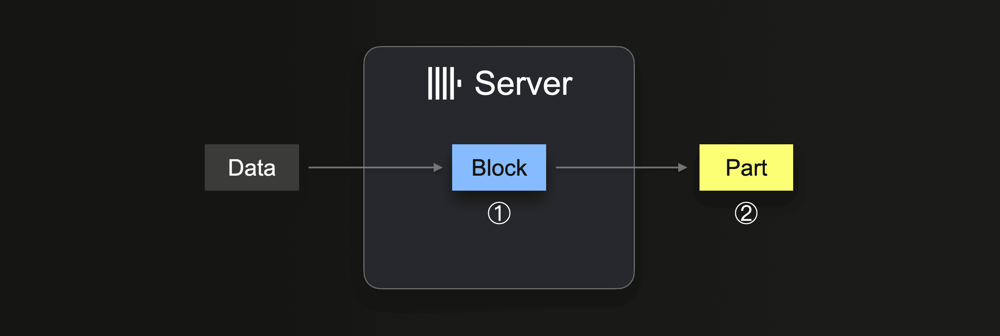
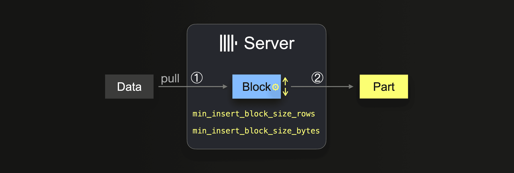
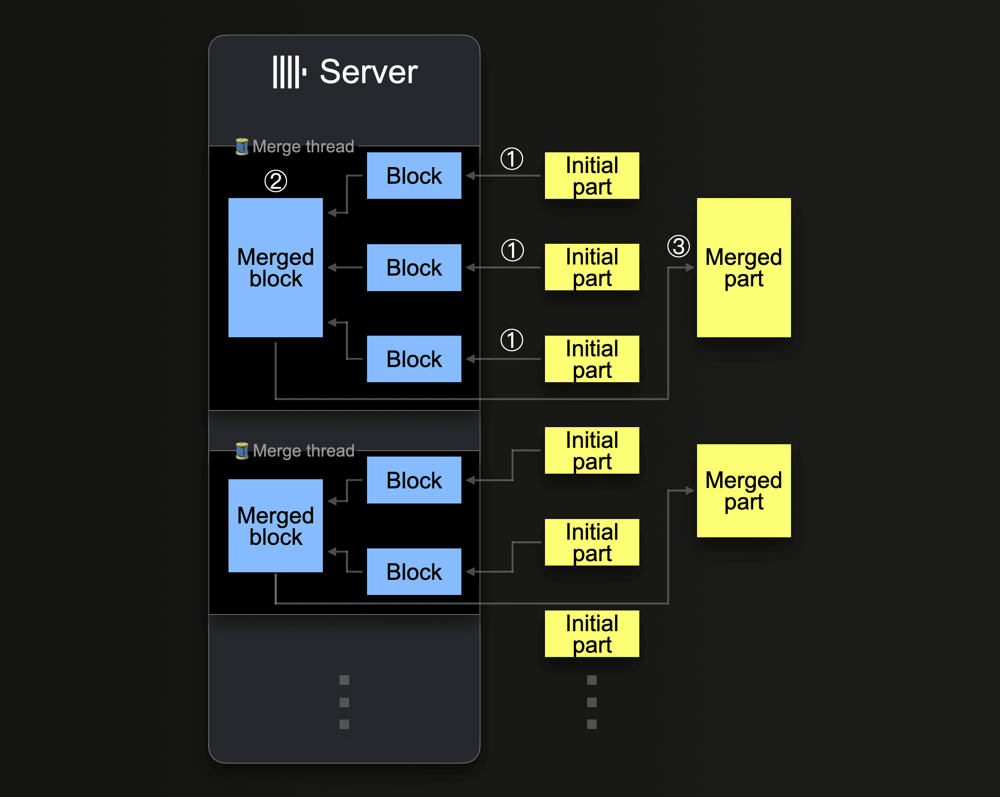
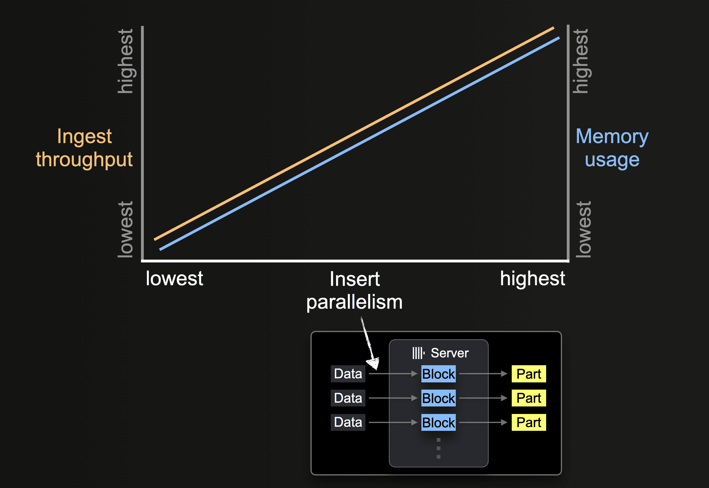
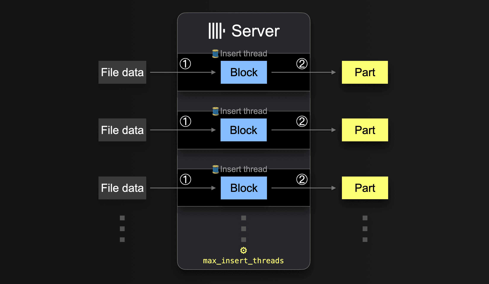
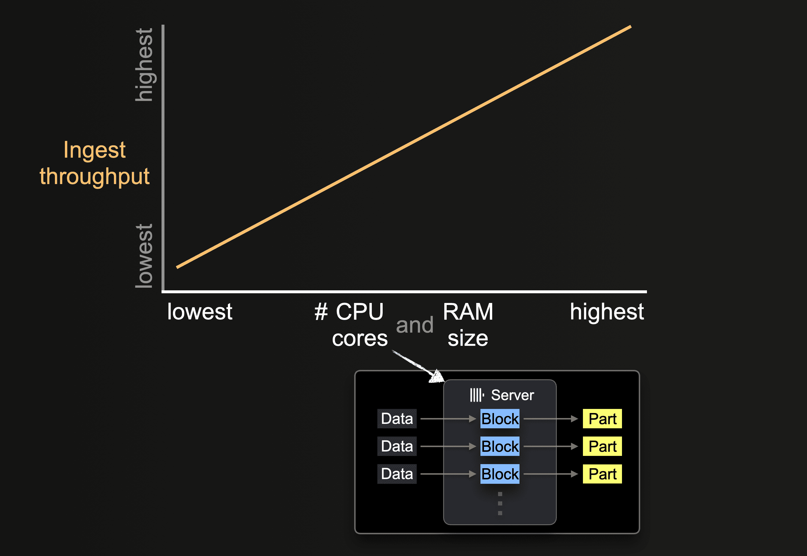
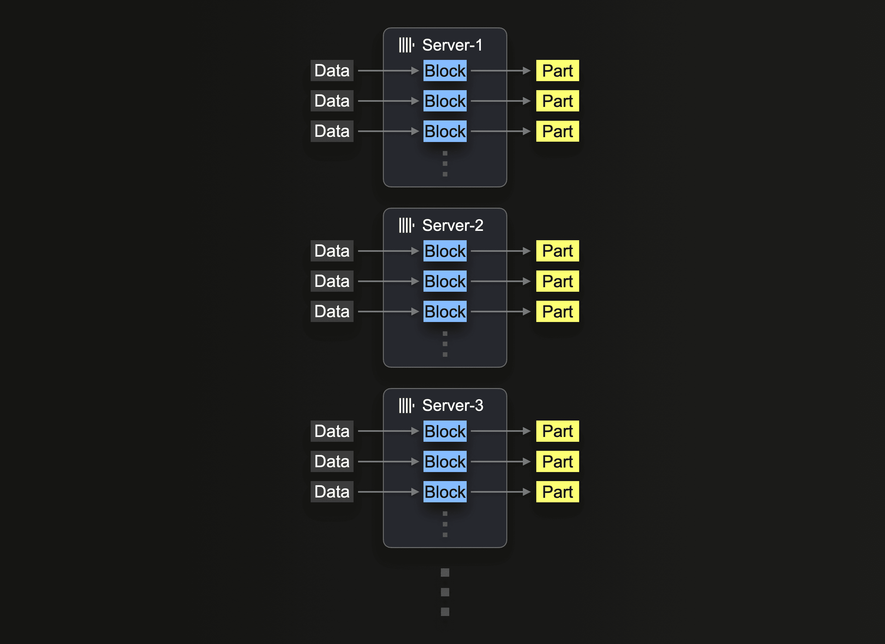

このセクションでは、[s3テーブル関数](/docs/ja/sql-reference/table-functions/s3)を使用してS3からデータを読み取ったり、挿入したりする際のパフォーマンス最適化に焦点を当てています。

:::info
**このガイドで説明するレッスンは、[GCS](/docs/ja/sql-reference/table-functions/gcs)や[Azure Blob Storage](/docs/ja/sql-reference/table-functions/azureBlobStorage)など独自のテーブル関数を持つ他のオブジェクトストレージ実装にも適用できます。**
:::

挿入パフォーマンスを向上させるためにスレッドやブロックサイズを調整する前に、S3挿入のメカニズムを理解することをお勧めします。挿入メカニズムに精通している場合や、いくつかのクイックヒントを知りたい場合は、以下の[例](/docs/ja/integrations/s3/performance#example-dataset)にスキップしてください。

## 挿入メカニズム（単一ノード）

ハードウェアのサイズに加えて、ClickHouseのデータ挿入メカニズム（単一ノード用）のパフォーマンスとリソース使用量に影響を与える主な要因は**挿入ブロックサイズ**と**挿入の並列度**です。

### 挿入ブロックサイズ



`INSERT INTO SELECT`を実行すると、ClickHouseはデータの一部を受け取り、① 各[パーティショニングキー](/docs/ja/engines/table-engines/mergetree-family/custom-partitioning-key)ごとにメモリ内挿入ブロックを少なくとも1つ形成します。ブロック内のデータがソートされ、テーブルエンジン特有の最適化が適用されます。データは圧縮された後、② データベースストレージに新しいデータ部分として書き込まれます。

挿入ブロックサイズは、ClickHouseサーバーの[ディスクファイルI/O使用量](https://en.wikipedia.org/wiki/Category:Disk_file_systems)とメモリ使用量の両方に影響します。より大きな挿入ブロックは、より多くのメモリを使用しますが、初期パーツの生成をより大きくし、減少させます。ClickHouseが大量のデータをロードする際に必要とするパーツが少なくなるほど、ディスクファイルI/Oと自動的に必要とされる[バックグラウンドマージの数](https://clickhouse.com/blog/supercharge-your-clickhouse-data-loads-part1#more-parts--more-background-part-merges)も少なくなります。

統合テーブルエンジンやテーブル関数との`INSERT INTO SELECT`クエリを使用すると、データはClickHouseサーバーによってプルされます：



データが完全にロードされるまでは、サーバーはループを実行します：

```bash
① 次のデータ部分をプルして解析し、メモリ内データブロック（各パーティショニングキー用）を形成します。

② ブロックを新しいパーツとしてストレージに書き込みます。

①に戻る
```

①では、サイズは挿入ブロックの大きさに依存し、これは2つの設定で制御できます：

- [`min_insert_block_size_rows`](https://clickhouse.com/docs/ja/operations/settings/settings#min-insert-block-size-rows)（デフォルト：`1048545`万行）
- [`min_insert_block_size_bytes`](https://clickhouse.com/docs/ja/operations/settings/settings#min-insert-block-size-bytes)（デフォルト：`256 MiB`）

指定された行数が挿入ブロックに集まるか、設定されたデータ量に達すると（どちらかが先に起こる）、そのブロックは新しいパーツに書き込まれるトリガーとなります。挿入ループはステップ①で続きます。

`min_insert_block_size_bytes`の値は非圧縮メモリ内ブロックサイズを示し（圧縮済みのディスクセットサイズではありません）、作成されたブロックとパーツが設定された行数やバイト数を必ずしも正確に含んでいるわけではありません。これはClickHouseがデータを行-[ブロック](https://clickhouse.com/docs/ja/operations/settings/settings#setting-max_block_size)単位でストリーミングし、[処理](https://clickhouse.com/company/events/query-performance-introspection)するため、これらの設定は最低限の閾値を指定します。

#### マージに注意する

設定された挿入ブロックサイズが小さいほど、大量のデータ負荷で生成される初期パーツは増え、データの取り込みと並行して実行されるバックグラウンドパーツマージが多くなるため、リソース競合（CPUとメモリ）が発生し、取り込み終了後に[健全な](/docs/ja/operations/settings/merge-tree-settings#parts-to-throw-insert)（3000）パーツ数に到達するまで追加の時間が必要になります。

:::important
ClickHouseのクエリパフォーマンスは、パーツ数が[推奨制限](/docs/ja/operations/settings/merge-tree-settings#parts-to-throw-insert)を超えると悪影響を受けます。
:::

ClickHouseは[マージパーツ](https://clickhouse.com/blog/asynchronous-data-inserts-in-clickhouse#data-needs-to-be-batched-for-optimal-performance)を継続的に実行し、[圧縮レベルに到達するまで](/docs/ja/operations/settings/merge-tree-settings#max-bytes-to-merge-at-max-space-in-pool)~150 GiBのサイズまでパーツを大きくしていきます。このダイアグラムは、ClickHouseサーバーがパーツをどのようにマージするかを示しています：



単一のClickHouseサーバーは、いくつかの[バックグラウンドマージスレッド](/docs/ja/operations/server-configuration-parameters/settings#background_pool_size)を使用して並行して[パーツマージ](https://clickhouse.com/blog/supercharge-your-clickhouse-data-loads-part1#more-parts--more-background-part-merges:~:text=to%20execute%20concurrent-,part%20merges,-.%20Each%20thread%20executes)を実行します。各スレッドはループを実行します：

```bash
① 次にどのパーツをマージするかを決定し、それらをメモリにブロックとしてロード。

② メモリ内のロードされたブロックを大きなブロックにマージ。

③ マージされたブロックを新しいディスクパーツに書き込みます。

①に戻る
```

[CPUコアとRAMサイズの増加](https://clickhouse.com/blog/supercharge-your-clickhouse-data-loads-part1#hardware-size)がバックグラウンドマージスループットを増加させることに注意してください。

大きなパーツにマージされたパーツは[非アクティブ](/docs/ja/operations/system-tables/parts)としてマークされ、最終的に[設定可能な](/docs/ja/operations/settings/merge-tree-settings#old-parts-lifetime)時間が経過した後に削除されます。時間とともに、マージされたパーツのツリーを作成します（そのため[`MergeTree`](/docs/ja/engines/table-engines/mergetree-family)テーブルと呼ばれます）。

### 挿入の並列性



ClickHouseサーバーはデータを並行して処理し、挿入できます。挿入の並列度は、ClickHouseサーバーの取り込みスループットとメモリ使用量に影響を及ぼします。データを並行してロードおよび処理するには、メインメモリが多く必要ですが、データが迅速に処理されるため、取り込みスループットが向上します。

s3のようなテーブル関数では、globパターンを使用して読み込むファイル名のセットを指定することができます。globパターンが複数のファイルに一致する場合、ClickHouseはこれらのファイルを並行して読み込み、それにあるデータをテーブルに挿入することで並行して挿入スレッドを利用できます（サーバー単位）：



すべてのデータがすべてのファイルから処理されるまで、各挿入スレッドはループを実行します：

```bash
① 未処理のファイルデータ（部分サイズは設定されたブロックサイズに基づいている）の次の部分を取得し、メモリ内データブロックを作成します。

② ブロックをストレージに新しいパーツとして書き込みます。

①に戻る。
```

このような並行挿入スレッドの数は、[`max_insert_threads`](https://clickhouse.com/docs/ja/operations/settings/settings#settings-max-insert-threads)設定で設定できます。デフォルト値は、オープンソースのClickHouseでは`1`、[ClickHouse Cloud](https://clickhouse.com/cloud)では`4`です。

大量のファイルがある場合、複数の挿入スレッドによる並行処理がうまく機能し、利用可能なCPUコアとネットワーク帯域幅（並行ファイルダウンロードのため）を完全に saturatすることができます。数個の大きなファイルだけをテーブルにロードするシナリオでは、ClickHouseは自動的に高いデータ処理の並列度を確立し、大きなファイル内の異なる範囲を並行して読むために挿入スレッドごとに追加のリーダースレッドを生成し、ネットワーク帯域幅の使用を最適化します。

s3関数とテーブルの場合、個々のファイルの並行ダウンロードは、[max_download_threads](https://clickhouse.com/codebrowser/ClickHouse/src/Core/Settings.h.html#DB::SettingsTraits::Data::max_download_threads)と[max_download_buffer_size](https://clickhouse.com/codebrowser/ClickHouse/src/Core/Settings.h.html#DB::SettingsTraits::Data::max_download_buffer_size)の値によって決定されます。ファイルは、そのサイズが`2 * max_download_buffer_size`を超える場合にのみ並行してダウンロードされます。デフォルトでは`max_download_buffer_size`デフォルトは10MiBに設定されています。一部のケースでは、このバッファサイズを50MB（`max_download_buffer_size=52428800`）に安全に増やすことができ、ファイルが単一スレッドによってダウンロードされることを確保します。これにより、各スレッドがS3コールに費やす時間を短縮し、S3待ち時間も短くなる可能性があります。また、並行読み取りに対してファイルが小さすぎる場合、スループットを向上させるためにClickHouseは自動的にデータを事前に読み込みし、こうしたファイルを非同期で事前読み込みすることでスループットを向上させます。

## パフォーマンスの測定

S3テーブル関数を使用したクエリのパフォーマンスを最適化する必要があります。これは、本番環境のデータに対してクエリを実行する場合、つまり、ClickHouseの計算のみが使用され、データがオリジナルの形式でS3に残る場合、およびClickHouse MergeTreeテーブルエンジンにS3からデータを挿入する場合です。指定がない限り、以下の推奨事項は両方のシナリオに適用されます。

## ハードウェアサイズの影響



利用可能なCPUコアの数とRAMサイズは、以下に影響を与えます：

- サポートされる[初期パーツサイズ](#insert-block-size)
- 可能な[挿入の並列度](#insert-parallelism)
- [バックグラウンドパーツマージ](https://clickhouse.com/blog/supercharge-your-clickhouse-data-loads-part1#more-parts--more-background-part-merges)のスループット

したがって、全体的な取り込みスループットに影響します。

## リージョンのローカリティ

バケットがClickHouseインスタンスと同じリージョンに配置されていることを確認してください。この単純な最適化により、特にAWSインフラストラクチャでClickHouseインスタンスをデプロイする場合、スループットパフォーマンスが劇的に向上する可能性があります。

## フォーマット

ClickHouseは、`s3`関数と`S3`エンジンを使用して、[サポートされているフォーマット](/docs/ja/interfaces/formats.md/#data-formatting)でS3バケットに格納されているファイルを読み取ることができます。生のファイルを読む場合、これらのフォーマットには異なる利点があります：

* Native、Parquet、CSVWithNames、TabSeparatedWithNamesのようなカラム名がエンコードされたフォーマットは、クエリがより簡素化されます。これにより、ユーザーが`s3`関数でカラム名を指定する必要がなくなります。カラム名によってこの情報が推測できるからです。
* フォーマットによって、読み取りと書き込みスループットに関してパフォーマンスが異なることがあります。NativeとParquetは、すでに列指向でよりコンパクトであるため、読み取りパフォーマンスに最適です。Nativeフォーマットは、ClickHouseがデータをメモリ内で格納する方法と一致するため、データをClickHouseにストリーミングする際の処理オーバーヘッドを削減するという利点もあります。
* 大きなファイルを読み取る際には、ブロックサイズが読み取りのレイテンシに影響を与えることがよくあります。特にデータをサンプリングする場合（例：最上位のN行を返す）などです。CSVやTSVのようなフォーマットでは、行セットを返すためにファイルを解析する必要があります。NativeやParquetのようなフォーマットは、その結果としてより高速にサンプリングを許可します。
* 各圧縮フォーマットは、圧縮レベル、速度、圧縮または解凍パフォーマンスを均衡させるという長所と短所を持ってきます。CSVやTSVのような生ファイルを圧縮する場合、lz4は最速の解凍パフォーマンスを提供し、圧縮レベルを犠牲にします。gzipは通常、圧縮を改善するが、若干の読み取り速度を犠牲にします。xzはさらに進んで最高の圧縮を提供し、圧縮と解凍のパフォーマンスが最も低下します。エクスポートする場合、gzとlz4は比較的同じ速度で圧縮します。これを接続速度と比較してください。圧縮や解凍の速度から得られる利点は、s3バケットへの接続が遅い場合には簡単に無効になります。
* NativeまたはParquetのようなフォーマットは通常、圧縮のオーバーヘッドを正当化するものではありません。データサイズの削減は、おそらく最小限のものであるため、これらのフォーマットは元来コンパクトです。特にs3がグローバルに利用可能で高帯域幅であるため、ネットワーク転送時間を十分にオフセットすることはほとんどありません。

## 例のデータセット

さらなる最適化を図るために、[Stack Overflowデータセットからの投稿](/docs/ja/data-modeling/schema-design#stack-overflow-dataset)を使用して、クエリと挿入パフォーマンスの両方を最適化します。

このデータセットは、2008年7月から2024年3月までの毎月の投稿に関する189のParquetファイルで構成されています。

我々は上記の[推奨事項](#formats)に従い、パフォーマンスの向上のためにParquetを使用し、バケットと同じ地域に配置されたClickHouseクラスタで全てのクエリを実行します。このクラスタには3つのノードがあり、それぞれ32GiBのRAMと8つのvCPUを持っています。

調整なしで、MergeTreeテーブルエンジンにこのデータセットを挿入し、最も多くの質問をしたユーザーを計算するクエリを実行するパフォーマンスを示します。これらのクエリは、意図的にデータ全体をスキャンする必要があります。

```sql
-- トップユーザー名
SELECT
    OwnerDisplayName,
    count() AS num_posts
FROM s3('https://datasets-documentation.s3.eu-west-3.amazonaws.com/stackoverflow/parquet/posts/by_month/*.parquet')
WHERE OwnerDisplayName NOT IN ('', 'anon')
GROUP BY OwnerDisplayName
ORDER BY num_posts DESC
LIMIT 5

┌─OwnerDisplayName─┬─num_posts─┐
│ user330315       │     10344 │
│ user4039065      │      5316 │
│ user149341       │      4102 │
│ user529758       │      3700 │
│ user3559349      │      3068 │
└──────────────────┴───────────┘

5 rows in set. Elapsed: 3.013 sec. Processed 59.82 million rows, 24.03 GB (19.86 million rows/s., 7.98 GB/s.)
Peak memory usage: 603.64 MiB.

-- postsテーブルにロード
INSERT INTO posts SELECT *
FROM s3('https://datasets-documentation.s3.eu-west-3.amazonaws.com/stackoverflow/parquet/posts/by_month/*.parquet')

0 rows in set. Elapsed: 191.692 sec. Processed 59.82 million rows, 24.03 GB (312.06 thousand rows/s., 125.37 MB/s.)
```

この例では数行しか返しません。`SELECT`クエリのパフォーマンスを測定する場合、大量のデータがクライアントに返されることを避けるためにクエリには[nullフォーマット](/docs/ja/interfaces/formats/#null)を利用するか、結果を[`Null`エンジン](/docs/ja/engines/table-engines/special/null.md)に直接送るべきです。これによりクライアントがデータで圧倒されることやネットワークの飽和を避けることができます。

:::info
クエリを読む時、初回のクエリは再実行された場合に比べて遅く見えることがよくあります。これはS3自身のキャッシングと[ClickHouseのスキーマ推測キャッシュ](/docs/ja/operations/system-tables/schema_inference_cache)の双方に起因します。これはファイルの推測されたスキーマを保存し、その結果、繰り返しアクセス時に推測ステップをスキップできるため、クエリ時間を短縮します。
:::

## 読み取り用のスレッドの使用

S3上での読み取りパフォーマンスは、ネットワーク帯域幅やローカルI/Oによって制限されていない限り、コア数に比例してスケールします。スレッド数を増やすことは、ユーザーが認識しておくべきメモリオーバーヘッドを持っています。以下の設定を調整することで、読み取りスループット性能が向上する可能性があります：

* 通常、`max_threads`のデフォルト値（コアの数）が十分です。クエリに使用されるメモリの量が多く、この量を削減する必要がある、または結果に`LIMIT`が低い場合、この値を低く設定することができます。メモリに余裕があるユーザーは、この値を増やして、より高い読み取りスループットの可能性を追求することが望ましいでしょう。通常、これはコア数の少ないマシン、つまり10未満の場合にのみ有益です。さらなる並列化の利益は、他のリソースがボトルネックとして作用するとされ、通常は減少します。例えば、ネットワークとCPUの競合です。
* 22.3.1以前のClickHouseのバージョンは、`s3`関数や`S3`テーブルエンジンを使用する際、複数のファイルにわたって読み取りを並列化しました。最適な読み取りパフォーマンスを達成するために、S3上でファイルをチャンクに分割し、読み取りにグロブパターンを使用する必要がありました。最新のバージョンは、ファイル内でのダウンロードを並列化します。
* 低スレッド数のシナリオでは、ユーザーは`remote_filesystem_read_method`を「read」に設定して、S3からファイルの同期読み取りを行うことで利益を得ることができます。
* s3関数とテーブルの場合、個別のファイルの並列ダウンロードは、`max_download_threads`と`max_download_buffer_size`の値によって決定されます。ファイルは、そのサイズが2 * `max_download_buffer_size`を超える場合にのみ並行してダウンロードされます。デフォルトでは、`max_download_buffer_size`のデフォルトは10MiBに設定されています。一部のケースでは、このバッファサイズを50 MB（`max_download_buffer_size=52428800`）に安全に増やすことができ、各ファイルが単一スレッドによってダウンロードされることを確保します。これにより、各スレッドがS3コールに費やす時間を短縮し、S3待ち時間も短くなる可能性があります。[このブログポスト](https://clickhouse.com/blog/clickhouse-1-trillion-row-challenge)を参考にしてください。

パフォーマンスを向上させるための変更を行う前に、適切に測定することを確認してください。S3 APIコールは遅延に敏感であり、クライアントのタイミングに影響を与える可能性があるため、パフォーマンス指標にはクエリログ、すなわち`system.query_log`を使用してください。

ここでのクエリを例に、`max_threads`を倍増して16に設定すると（デフォルトで`max_threads`はノードのコア数）、読み取りクエリ性能が2倍向上し、メモリが増える代わりに。さらなる`max_threads`の増加は減衰するリターンを示します。

```sql
SELECT
    OwnerDisplayName,
    count() AS num_posts
FROM s3('https://datasets-documentation.s3.eu-west-3.amazonaws.com/stackoverflow/parquet/posts/by_month/*.parquet')
WHERE OwnerDisplayName NOT IN ('', 'anon')
GROUP BY OwnerDisplayName
ORDER BY num_posts DESC
LIMIT 5
SETTINGS max_threads = 16

┌─OwnerDisplayName─┬─num_posts─┐
│ user330315       │     10344 │
│ user4039065      │      5316 │
│ user149341       │      4102 │
│ user529758       │      3700 │
│ user3559349      │      3068 │
└──────────────────┴───────────┘

5 rows in set. Elapsed: 1.505 sec. Processed 59.82 million rows, 24.03 GB (39.76 million rows/s., 15.97 GB/s.)
Peak memory usage: 178.58 MiB.

SETTINGS max_threads = 32

5 rows in set. Elapsed: 0.779 sec. Processed 59.82 million rows, 24.03 GB (76.81 million rows/s., 30.86 GB/s.)
Peak memory usage: 369.20 MiB.

SETTINGS max_threads = 64

5 rows in set. Elapsed: 0.674 sec. Processed 59.82 million rows, 24.03 GB (88.81 million rows/s., 35.68 GB/s.)
Peak memory usage: 639.99 MiB.
```

## 挿入用スレッドとブロックサイズの調整

最大の取り込み性能を達成するには、（1）挿入ブロックサイズを選択し、（2）利用可能なCPUコアとRAMに基づいて適切な挿入の並列度を選択する必要があります。まとめると：

- [挿入ブロックサイズを大きく設定するほど](#insert-block-size)、ClickHouseが作成するパーツが少なくなり、[ディスクファイル入出力](https://en.wikipedia.org/wiki/Category:Disk_file_systems)や[バックグラウンドマージ](https://clickhouse.com/blog/supercharge-your-clickhouse-data-loads-part1#more-parts--more-background-part-merges)が少なくなります。  
- [並行挿入スレッドの数を多く設定するほど](#insert-parallelism)、データはより迅速に処理されます。

これら2つの性能要因間には対立するトレードオフがあります（バックグラウンドパーツのマージともトレードオフがあります）。ClickHouseサーバーのメインメモリの量には制限があります。より大きなブロックはより多くのメインメモリを使用するため、利用可能な並行挿入スレッドの数を制限します。反対に、より多くの並行挿入スレッドはより多くのメインメモリを必要とし、メモリ内で同時に作成される挿入ブロックの数を制限します。さらに、挿入スレッドとバックグラウンドマージスレッド間のリソース競合が発生する可能性があります。高い数の配置された挿入スレッドは（1）マージする必要があるパーツを多く生成し、（2）バックグラウンドマージスレッドからCPUコアとメモリスペースを奪います。

[このブログポスト](https://clickhouse.com/blog/supercharge-your-clickhouse-data-loads-part2)を読むことをお勧めします。このパラメータの動作がどのように性能とリソースに影響を与えるかをより詳細に説明しています。チューニングが2つのパラメータの微妙なバランスを含むことがあることを示しています。この徹底的なテストは実用的でない場合があるため、まとめとして、次のことをお勧めします：

```bash
• max_insert_threads：挿入スレッドに利用可能なCPUコアの約半分を選択します（バックグラウンドマージ専用のコアを十分に残します）。

• peak_memory_usage_in_bytes：意図したピークメモリ使用量を選択します。それが単独の取り込みである場合はすべての利用可能なRAM、他の同時タスクのために半分またはそれ以下を選択します。

次に：
min_insert_block_size_bytes = peak_memory_usage_in_bytes / (~3 * max_insert_threads)
```

この計算式を使用するときは、`min_insert_block_size_rows`を0に設定して（行ベースの閾値を無効にするため）、最大スレッド数を選択した値に設定し、`min_insert_block_size_bytes`を上記の計算結果に基づいて設定します。

上記の計算式を使用して、Stack Overflowの例を取り上げます。

- `max_insert_threads=4`（ノードあたり8コア）
- `peak_memory_usage_in_bytes` - 32 GiB（ノードリソースの100%）または`34359738368`バイト
- `min_insert_block_size_bytes` = `34359738368/(3*4) = 2863311530`

```sql
INSERT INTO posts SELECT *
FROM s3('https://datasets-documentation.s3.eu-west-3.amazonaws.com/stackoverflow/parquet/posts/by_month/*.parquet') SETTINGS min_insert_block_size_rows=0, max_insert_threads=4, min_insert_block_size_bytes=2863311530

0 rows in set. Elapsed: 128.566 sec. Processed 59.82 million rows, 24.03 GB (465.28 thousand rows/s., 186.92 MB/s.)
```

示されているように、これらの設定を調整することで、挿入性能が33%を超えて向上しました。単一ノードのパフォーマンスをさらに向上させるために、他の設定を調整することをユーザーにお任せします。

## リソースとノードでのスケーリング

リソースとノードによるスケーリングは、読み取りおよび挿入クエリの両方に適用されます。

### 垂直スケーリング 

前の調整とクエリは、ClickHouse Cloudクラスター内の単一ノードしか使用していません。ユーザーには通常、ClickHouseのノードが複数利用可能です。ユーザーは最初に垂直スケーリングを行い、コア数に比例してS3スループットを向上させることをお勧めします。以前の挿入と読み取りクエリを再実行し、適切な設定でリソースを二倍にしてClickHouse Cloudノードを利用すると、どちらも約二倍速く実行されます。

```sql
INSERT INTO posts SELECT *
FROM s3('https://datasets-documentation.s3.eu-west-3.amazonaws.com/stackoverflow/parquet/posts/by_month/*.parquet') SETTINGS min_insert_block_size_rows=0, max_insert_threads=8, min_insert_block_size_bytes=2863311530

0 rows in set. Elapsed: 67.294 sec. Processed 59.82 million rows, 24.03 GB (888.93 thousand rows/s., 357.12 MB/s.)

SELECT
    OwnerDisplayName,
    count() AS num_posts
FROM s3('https://datasets-documentation.s3.eu-west-3.amazonaws.com/stackoverflow/parquet/posts/by_month/*.parquet')
WHERE OwnerDisplayName NOT IN ('', 'anon')
GROUP BY OwnerDisplayName
ORDER BY num_posts DESC
LIMIT 5
SETTINGS max_threads = 92

5 rows in set. Elapsed: 0.421 sec. Processed 59.82 million rows, 24.03 GB (142.08 million rows/s., 57.08 GB/s.)
```

:::note
個々のノードは、ネットワークやS3 GETリクエストによってもボトルネックとなり、垂直的なパフォーマンスのスケーリングを妨げる可能性があります。
:::

### 水平スケーリング

最終的に、ハードウェアの利用可能性やコスト効率により、水平スケーリングが必要になることがよくあります。ClickHouse Cloudでは、本番クラスターは少なくとも3つのノードがあります。挿入についても全てのノードを利用することをユーザーは検討するでしょう。

S3のリーディングの利用は、[クラスターの利用](./index.md#utilizing-clusters)で説明したように、`s3Cluster`関数を使用する必要があります。これにより、リーディングがノード間で分散されます。

クエリを最初に受け取ったサーバーは、最初にグロブパターンを解決し、処理を動的に自身と他のサーバーに分散させます。



以前のリードクエリを3つのノードに負荷を分散し、クエリを`s3Cluster`を使用するよう調整します。これはClickHouse Cloudで自動的に、`default`クラスターを参照することで行われます。

[クラスターの利用](#utilizing-clusters)に示されているように、この作業はファイルレベルで分散されます。利用者がこの機能を活用するには、ノード数を超えるファイルが十分に必要です。

```sql
SELECT
    OwnerDisplayName,
    count() AS num_posts
FROM s3Cluster('default', 'https://datasets-documentation.s3.eu-west-3.amazonaws.com/stackoverflow/parquet/posts/by_month/*.parquet')
WHERE OwnerDisplayName NOT IN ('', 'anon')
GROUP BY OwnerDisplayName
ORDER BY num_posts DESC
LIMIT 5
SETTINGS max_threads = 16

┌─OwnerDisplayName─┬─num_posts─┐
│ user330315       │     10344 │
│ user4039065      │      5316 │
│ user149341       │      4102 │
│ user529758       │      3700 │
│ user3559349      │      3068 │
└──────────────────┴───────────┘

5 rows in set. Elapsed: 0.622 sec. Processed 59.82 million rows, 24.03 GB (96.13 million rows/s., 38.62 GB/s.)
Peak memory usage: 176.74 MiB.
```

同様に、原挿入クエリを分散し、単一ノード用に以前見つけた設定を使用します：

```sql
INSERT INTO posts SELECT *
FROM s3Cluster('default', 'https://datasets-documentation.s3.eu-west-3.amazonaws.com/stackoverflow/parquet/posts/by_month/*.parquet') SETTINGS min_insert_block_size_rows=0, max_insert_threads=4, min_insert_block_size_bytes=2863311530

0 rows in set. Elapsed: 171.202 sec. Processed 59.82 million rows, 24.03 GB (349.41 thousand rows/s., 140.37 MB/s.)
```

読み込むファイルの数が性能向上を示しているが、挿入性能を示していないことが分かります。デフォルトでは、リーディングは`s3Cluster`を使用して分散されますが、挿入は初期ノードに対してのみ発生します。これは、ノードごとに挿入スレッドを生成することでネットワーク待ち時間のオーバーヘッドが削減され、計算領域が挿入プロセス専用に設定されるため、バックグラウンドマージの負荷も削減します。シナリオの高スループットでこのボトルネックが発生する可能性があります。これに対処するには、`s3cluster`関数のパラメーター`parallel_distributed_insert_select`を設定します。

これを`parallel_distributed_insert_select=2`に設定することで、`SELECT`と`INSERT`が、各ノードの分散エンジンの基礎テーブルから/に対して並行に実行されるようにします。

```sql
INSERT INTO posts
SELECT *
FROM s3Cluster('default', 'https://datasets-documentation.s3.eu-west-3.amazonaws.com/stackoverflow/parquet/posts/by_month/*.parquet')
SETTINGS parallel_distributed_insert_select = 2, min_insert_block_size_rows=0, max_insert_threads=4, min_insert_block_size_bytes=2863311530

0 rows in set. Elapsed: 54.571 sec. Processed 59.82 million rows, 24.03 GB (1.10 million rows/s., 440.38 MB/s.)
Peak memory usage: 11.75 GiB.
```

期待された通り、これにより挿入パフォーマンスが3倍向上します。

## さらなる調整

### 重複除去の無効化

挿入操作は、タイムアウトなどのエラーにより失敗することがあります。挿入が失敗すると、データが正常に挿入されたかどうかにかかわらず、クライアントによって再試行される可能性があります。分散配置（ClickHouse Cloudなど）では、ClickHouseはデータがすでに正常に挿入されたかどうかを確認し、挿入されたデータが重複としてマークされている場合、データを目的のテーブルに挿入しません。ただし、ユーザーには通常の挿入が行われたかのように成功状態を受け取ります。

この動作は挿入オーバーヘッドをもたらし、クライアントからデータをロードする際やバッチで意味がありますが、オブジェクトストレージからの`INSERT INTO SELECT`実行時には不要になることがあります。この機能を無効にすることで、性能を向上させることが示されます：

```sql
INSERT INTO posts
SETTINGS parallel_distributed_insert_select = 2, min_insert_block_size_rows = 0, max_insert_threads = 4, min_insert_block_size_bytes = 2863311530, insert_deduplicate = 0
SELECT *
FROM s3Cluster('default', 'https://datasets-documentation.s3.eu-west-3.amazonaws.com/stackoverflow/parquet/posts/by_month/*.parquet')
SETTINGS parallel_distributed_insert_select = 2, min_insert_block_size_rows = 0, max_insert_threads = 4, min_insert_block_size_bytes = 2863311530, insert_deduplicate = 0

0 rows in set. Elapsed: 52.992 sec. Processed 59.82 million rows, 24.03 GB (1.13 million rows/s., 453.50 MB/s.)
Peak memory usage: 26.57 GiB.
```

### 挿入時の最適化

ClickHouseの`optimize_on_insert`設定は、挿入プロセス中にデータ部分がマージされるかどうかを制御します。有効にすると（デフォルトでは`optimize_on_insert = 1`）、小さいパーツが挿入時により大きなものにマージされ、読み込みパフォーマンスが向上する大きなパ－ツにとりこまれます。ただし、これに付随する挿入プロセスのオーバーヘッドがある可能性があります。

この設定を無効にすると（`optimize_on_insert = 0`）、挿入時のマージをスキップすることで、データを更に迅速に書き込みます。特に頻繁な小挿入時には、マージプロセスはバックグラウンドにて後回しされ、より高い挿入性能が可能になりますが、一時的に小さいパーツが増加する可能性があり、バックグラウンドマージが完了するまではクエリが遅くなる可能性があります。これは、挿入性能が優先事項で、バックグラウンドのマージプロセスが後で効率的に最適化できる場合に最適な設定です。設定を無効にすることで挿入スループットを改善できることが示されています：

```sql
SELECT *
FROM s3Cluster('default', 'https://datasets-documentation.s3.eu-west-3.amazonaws.com/stackoverflow/parquet/posts/by_month/*.parquet')
SETTINGS parallel_distributed_insert_select = 2, min_insert_block_size_rows = 0, max_insert_threads = 4, min_insert_block_size_bytes = 2863311530, insert_deduplicate = 0, optimize_on_insert = 0

0 rows in set. Elapsed: 49.688 sec. Processed 59.82 million rows, 24.03 GB (1.20 million rows/s., 483.66 MB/s.)
```

## その他のメモ

* メモリが少ないシナリオでは、S3に挿入する場合、`max_insert_delayed_streams_for_parallel_write`を下げることを検討してください。
