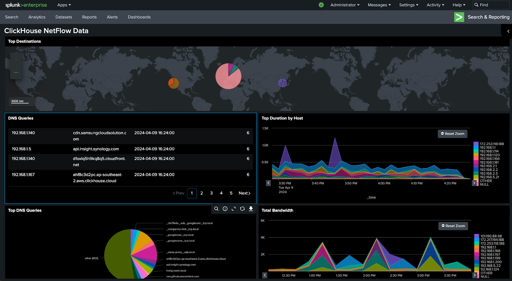
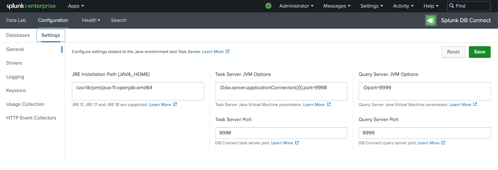
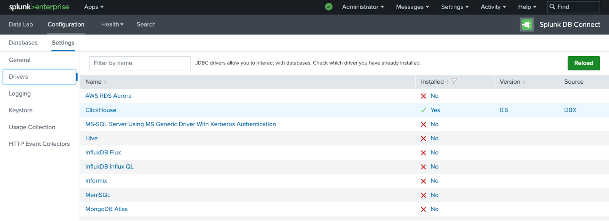
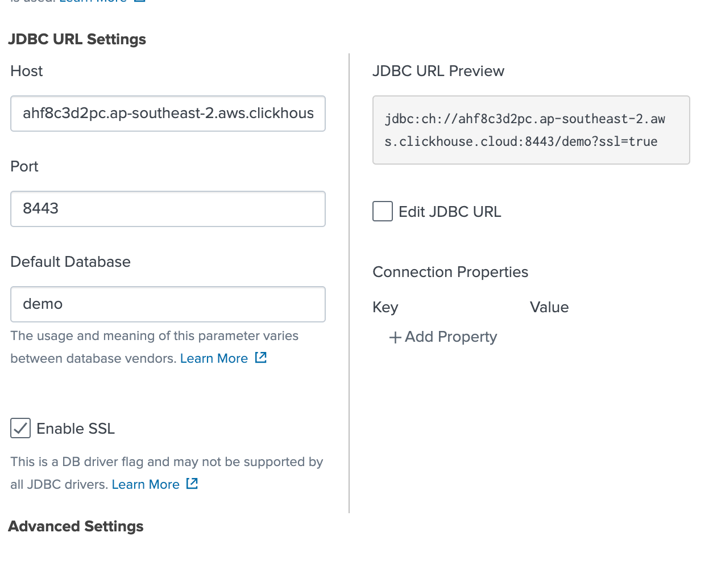
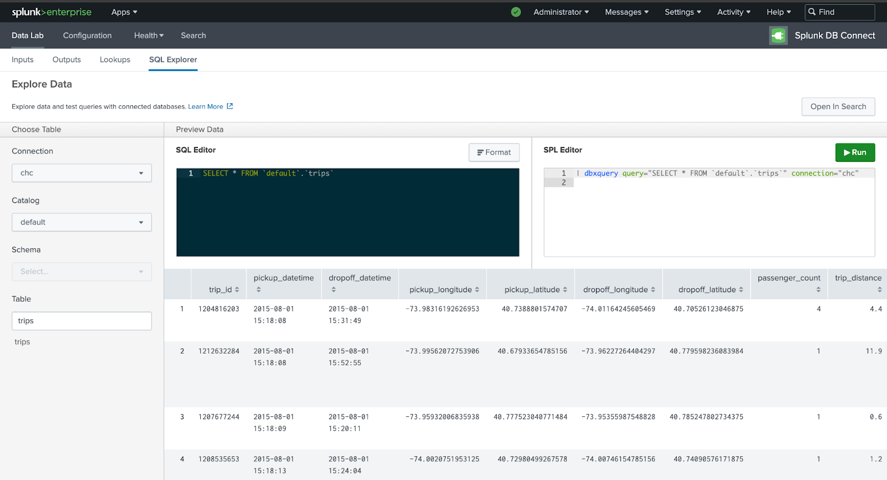
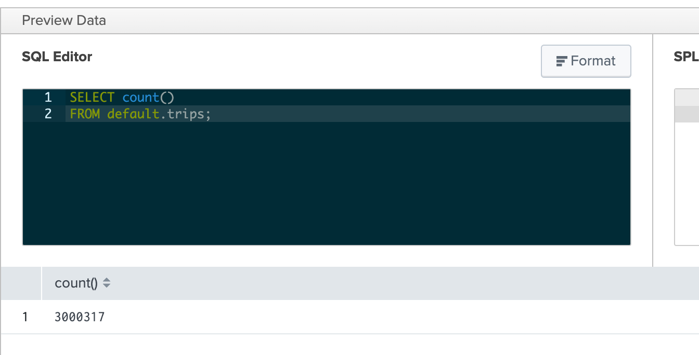
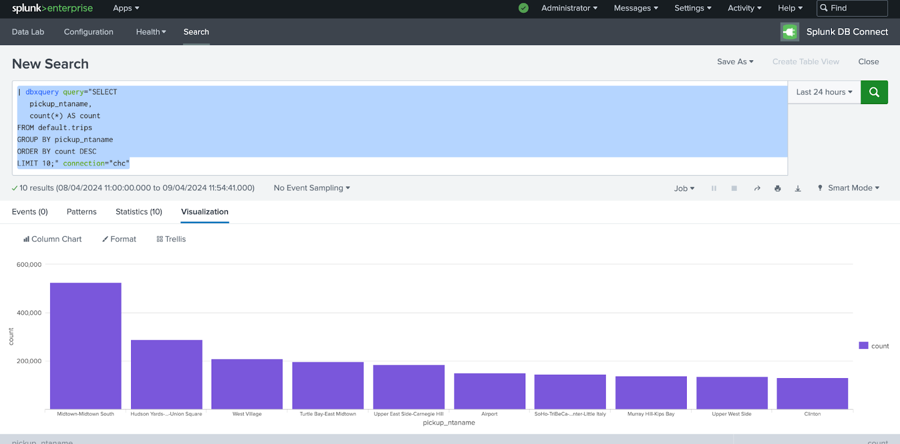
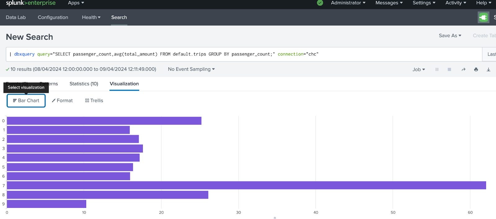
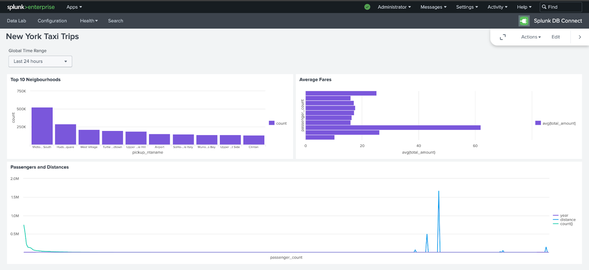

# SplunkをClickHouseに接続する

Splunkはセキュリティと可観測性のための人気のある技術です。また、強力な検索エンジンとダッシュボーディングエンジンでもあります。さまざまなユースケースに対応するための数百のSplunkアプリが利用可能です。

ClickHouseに特化した利用として、[Splunk DB Connect App](https://splunkbase.splunk.com/app/2686)を活用し、ClickHouse JDBCドライバーを使ってClickHouseのテーブルを直接クエリします。

この統合の理想的なユースケースは、ClickHouseをnetflow、AvroまたはProtobufバイナリデータ、DNS、VPCフローログ、その他のOTELログのような大規模データソースのために使用している場合です。これらのデータはSplunk上で検索やダッシュボード作成を行うためにチームと共有できます。このアプローチを使用することで、データはSplunkのインデックスレイヤーに取り込まれず、[Metabase](https://www.metabase.com/)や[Superset](https://superset.apache.org/)のような他のビジュアライゼーション統合と同様にClickHouseから直接クエリされます。

## 目標

このガイドでは、ClickHouse JDBCドライバーを使用してClickHouseをSplunkに接続します。ローカル版のSplunk Enterpriseをインストールしますが、データはインデックス化されません。代わりに、DB Connectクエリエンジンを通して検索機能を使用します。

このガイドを使用すると、ClickHouseに接続された以下のようなダッシュボードを作成できます：



:::note
このガイドでは[ニューヨーク市タクシーデータセット](https://clickhouse.com/docs/ja/getting-started/example-datasets/nyc-taxi)を使用します。他にも使用可能なデータセットは[当社のドキュメント](http://localhost:3000/docs/en/getting-started/example-datasets)にあります。
:::

## 前提条件

開始する前に必要なもの：
- 検索ヘッド機能を使用するためのSplunk Enterprise
- お使いのOSまたはコンテナにインストールされている[Java Runtime Environment (JRE)](https://docs.splunk.com/Documentation/DBX/3.16.0/DeployDBX/Prerequisites)
- [Splunk DB Connect](https://splunkbase.splunk.com/app/2686)
- Splunk Enterprise OSインスタンスへの管理者アクセスまたはSSHアクセス
- ClickHouse接続の詳細 (ClickHouse Cloudを使用している場合の詳細は[こちら](https://clickhouse.com/docs/ja/integrations/metabase#1-gather-your-connection-details)を参照)

## Splunk EnterpriseにDB Connectをインストールして設定する

まず、Splunk EnterpriseインスタンスにJava Runtime Environmentをインストールする必要があります。Dockerを使用している場合、`microdnf install java-11-openjdk`コマンドを使用できます。

`java_home`パスをメモしておきます：`java -XshowSettings:properties -version`。

Splunk EnterpriseにDB Connect Appがインストールされていることを確認してください。Splunk Web UIのAppsセクションにあります。
- Splunk WebにログインしてApps > Find More Appsに移動します。
- 検索ボックスを使用してDB Connectを見つけます。
- Splunk DB Connectの横の緑色の「Install」ボタンをクリックします。
- 「Restart Splunk」をクリックします。

DB Connect Appのインストールに問題がある場合は、[こちらのリンク](https://splunkbase.splunk.com/app/2686)を参照して追加の指示を得てください。

DB Connect Appがインストールされていることを確認したら、java_homeパスをConfiguration -> SettingsでDB Connect Appに追加し、保存をクリックしてリセットします。



## ClickHouse用のJDBCを設定する

[ClickHouse JDBCドライバー](https://github.com/ClickHouse/clickhouse-java)をDB Connect Driversフォルダにダウンロードします：

```
$SPLUNK_HOME/etc/apps/splunk_app_db_connect/drivers
```

次に、ClickHouse JDBC Driverクラスの詳細を追加するために、`$SPLUNK_HOME/etc/apps/splunk_app_db_connect/default/db_connection_types.conf`ファイルで接続タイプの設定を編集する必要があります。

ファイルに次のセクションを追加します：

```
[ClickHouse]
displayName = ClickHouse
serviceClass = com.splunk.dbx2.DefaultDBX2JDBC
jdbcUrlFormat = jdbc:ch://<host>:<port>/<database>
jdbcUrlSSLFormat = jdbc:ch://<host>:<port>/<database>?ssl=true
jdbcDriverClass = com.clickhouse.jdbc.ClickHouseDriver
ui_default_catalog = $database$
```

`$SPLUNK_HOME/bin/splunk restart`を使ってSplunkを再起動します。

DB Connect Appに戻り、Configuration > Settings > Driversに移動します。ClickHouseの横に緑色のチェックマークが表示されているはずです：



## Splunk SearchをClickHouseに接続する

DB Connect App Configuration -> Databases -> Identitiesに移動し、ClickHouseのIDを作成します。

Configuration -> Databases -> ConnectionsからClickHouseへの新しい接続を作成し、「New Connection」を選択します。


<br />

ClickHouseホストの詳細を追加し、「Enable SSL」にチェックを入れる：



接続を保存した後、SplunkにClickHouseに正常に接続されます！

:::note
エラーが発生した場合は、SplunkインスタンスのIPアドレスがClickHouse Cloud IPアクセスリストに追加されていることを確認してください。詳細は[こちらのドキュメント](https://clickhouse.com/docs/ja/cloud/security/setting-ip-filters)を参照ください。
:::

## SQLクエリを実行する

すべてが正常に動作するかテストするためにSQLクエリを実行します。

DB Connect AppのDataLabセクションからSQL Explorerで接続の詳細を選択します。このデモでは`trips`テーブルを使用します：



テーブル内のすべてのレコードのカウントを返すSQLクエリを`trips`テーブルで実行します：



クエリが成功した場合、結果が表示されるはずです。

## ダッシュボードを作成する

SQLと強力なSplunk Processing Language (SPL)を組み合わせたダッシュボードを作成しましょう。

先に進む前に、まず[DPL Safeguardsを非アクティブ化](https://docs.splunk.com/Documentation/Splunk/9.2.1/Security/SPLsafeguards?ref=hk#Deactivate_SPL_safeguards)する必要があります。

最も頻繁にピックアップされたトップ10の地域を示す次のクエリを実行します：

```sql
dbxquery query="SELECT pickup_ntaname, count(*) AS count
FROM default.trips GROUP BY pickup_ntaname
ORDER BY count DESC LIMIT 10;" connection="chc"
```

カラムチャートを作成するために可視化タブを選択します：



「Save As > Save to a Dashboard」をクリックしてダッシュボードを作成しましょう。

次に、乗客数に基づく平均料金を示すクエリを追加しましょう：

```sql
dbxquery query="SELECT passenger_count,avg(total_amount) 
FROM default.trips GROUP BY passenger_count;" connection="chc"
```

今回は、バーチャートの可視化を作成し、以前のダッシュボードに保存します。



最後に、乗客数と旅行距離の相関を示すもう一つのクエリを追加します：

```sql
dbxquery query="SELECT passenger_count, toYear(pickup_datetime) AS year,
round(trip_distance) AS distance, count(* FROM default.trips)
GROUP BY passenger_count, year, distance
ORDER BY year, count(*) DESC; " connection="chc"
```

最終的なダッシュボードは次のようになります：



## 時系列データ

Splunkには、ダッシュボードで時系列データの可視化とプレゼンテーションに使用できる数百の組み込み関数があります。この例では、時系列データで動作するクエリをSplunkで作成するために、SQL + SPLを組み合わせます。

```sql
dbxquery query="SELECT time, orig_h, duration 
FROM "demo"."conn" WHERE time >= now() - interval 1 HOURS" connection="chc"
| eval time = strptime(time, "%Y-%m-%d %H:%M:%S.%3Q")
| eval _time=time
| timechart avg(duration) as duration by orig_h
| eval duration=round(duration/60)
| sort - duration:
```

## 詳細を学ぶ

Splunk DB Connectおよびダッシュボード構築に関する詳細情報をお探しの場合、[Splunkのドキュメント](https://docs.splunk.com/Documentation)をご覧ください。
