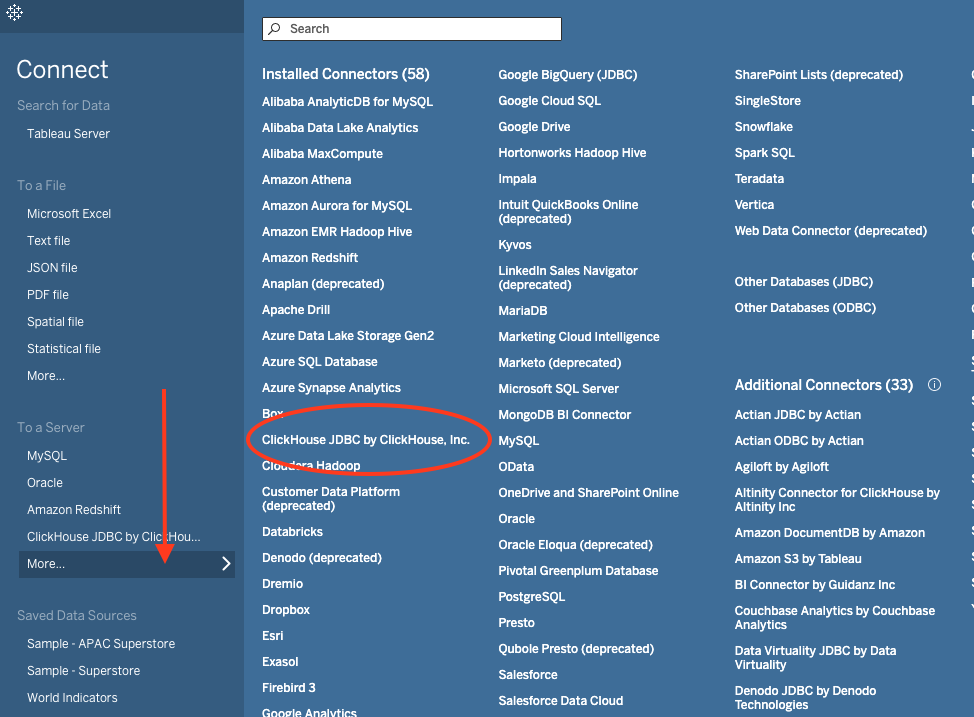
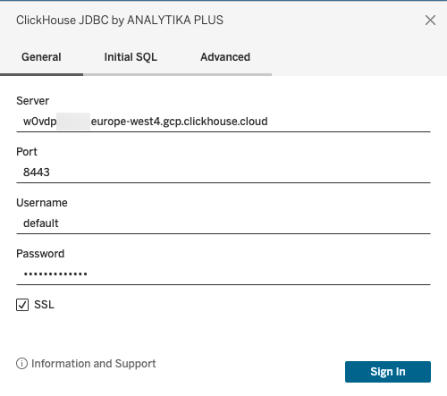
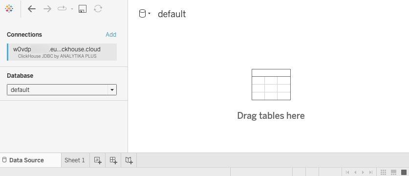
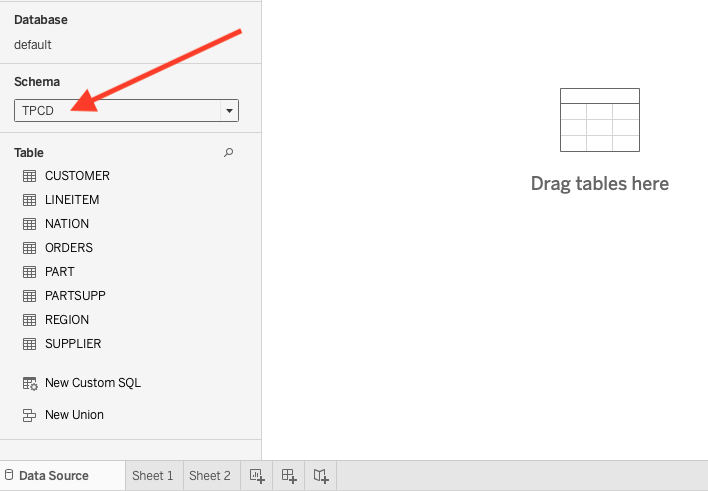
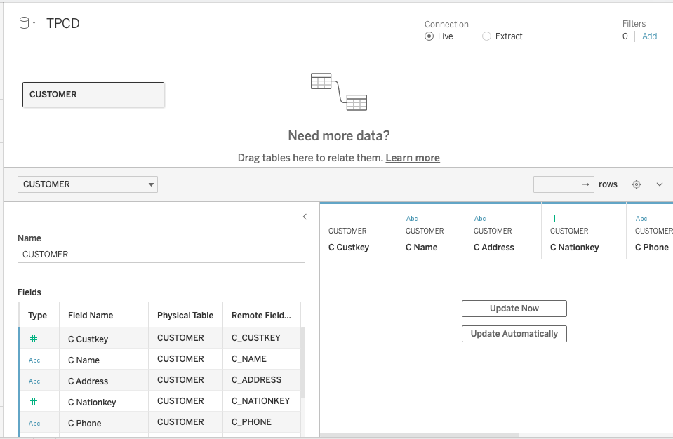
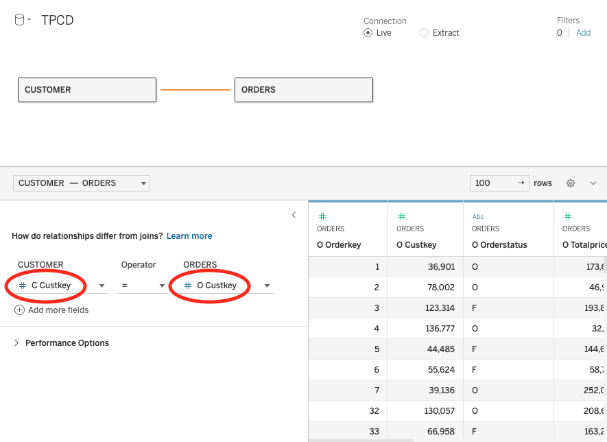
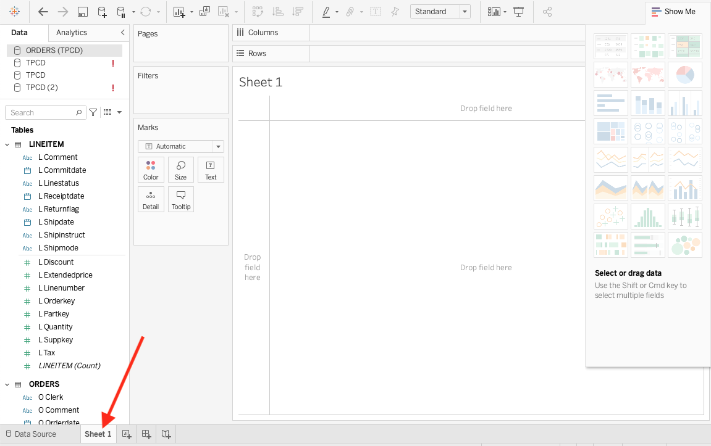
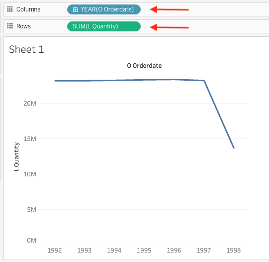
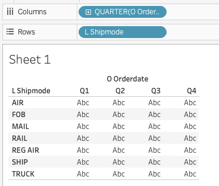
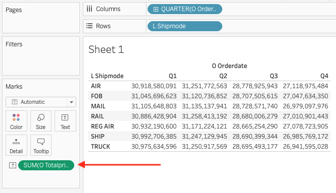

import ConnectionDetails from '@site/docs/ja/_snippets/_gather_your_details_http.mdx';

# Tableau と ClickHouse の接続

Tableau は ClickHouse のデータベースとテーブルをデータソースとして使用できます。これには、特別な JDBC ドライバーをダウンロードして、Tableau が見つけることができる特定の場所に保存する必要があります。

## 接続方法

1. 接続情報を収集します
<ConnectionDetails />

2. <a href="https://www.tableau.com/products/desktop/download" target="_blank">Tableau デスクトップ</a>をダウンロードしてインストールします。
3. 最新バージョンの<a href="https://github.com/analytikaplus/clickhouse-tableau-connector-jdbc/releases" target="_blank">clickhouse-tableau-connector-jdbc</a> TACO コネクタをダウンロードします。
4. TACO コネクタを次のフォルダに保存します（OS に基づく）：
    - macOS: `~/Documents/My Tableau Repository/Connectors`
    - Windows: `C:\Users[Windows User]\Documents\My Tableau Repository\Connectors`
5. `clickhouse-tableau-connector-jdbc` の指示に従って、対応するバージョンの<a href="https://github.com/ClickHouse/clickhouse-java/releases/" target="_blank">ClickHouse JDBC ドライバー</a> をダウンロードします。

:::note
必ず **clickhouse-jdbc-x.x.x-shaded.jar** JAR ファイルをダウンロードしてください。
:::

6. JDBC ドライバーを次のフォルダに保存します（OS に基づき、フォルダが存在しない場合は作成可能）：
    - macOS: `~/Library/Tableau/Drivers`
    - Windows: `C:\Program Files\Tableau\Drivers`
7. Tableau で ClickHouse データソースを設定し、データビジュアライゼーションを始めましょう！

## Tableau で ClickHouse データソースを設定

ドライバーとコネクタをマシン上の適切なフォルダに配置したので、ClickHouse の **TPCD** データベースに接続するデータソースを Tableau で定義する方法を見てみましょう。

1. Tableau を起動します。（すでに起動している場合は、再起動してください。）

2. 左側のメニューから、**To a Server** セクションの **More** をクリックします。すべてが正常に動作している場合、インストール済みコネクタのリストに **ClickHouse JDBC** が表示されるはずです：

    

3. **ClickHouse JDBC** をクリックすると、ダイアログウィンドウが表示されます。接続情報を入力してください：

    | 設定        | 値                                                  |
    | ----------- | --------------------------------------------------- |
    | サーバー      | **w0vdp\**\**.europe-west4.gcp.clickhouse.cloud** |
    | ポート       | **8443**                                          |
    | データベース | **default**                                       |
    | ユーザー名   | **default**                                       |
    | パスワード   | *\*****                                           |

:::note
ClickHouse cloud を使用する場合、安全な接続のために SSL チェックボックスを有効にする必要があります。
:::
 

設定は次のようになります：

:::note
私たちの ClickHouse データベースは **TPCD** と名付けられていますが、上記のダイアログでは **データベース** を **default** に設定し、次のステップで **スキーマ** に **TPCD** を選択する必要があります。（これはコネクタのバグによるものかもしれないので、この動作が変わる可能性がありますが、現在は **default** をデータベースとして使用しなければならない状況です。）
:::

4. **Sign In** ボタンをクリックすると、新しい Tableau ワークブックが表示されるはずです：

    

5. **スキーマ** ドロップダウンから **TPCD** を選択すると、**TPCD** 内のテーブルのリストが表示されます：

    

これで Tableau でのビジュアライゼーションの準備が整いました！

## Tableau でのビジュアライゼーション作成

Tableau で ClickHouse データソースを設定したので、データを可視化してみましょう...

1. **CUSTOMER** テーブルをワークブックにドラッグします。カラムは表示されますが、データテーブルは空のままです：

    

2. **Update Now** ボタンをクリックすると、**CUSTOMER** から 100 行がテーブルに反映されます。

3. **ORDERS** テーブルをワークブックにドラッグし、**Custkey** を両テーブル間のリレーションシップフィールドとして設定します：

    

4. これで **ORDERS** と **LINEITEM** テーブルがデータソースとして関連付けられ、データに関する質問を解決するためにこのリレーションシップを使用できます。ワークブック下部の **Sheet 1** タブを選択します。

    

5. 各年に注文された特定のアイテムの数量を知りたいとしましょう。**ORDERS** から **Orderdate** を **Columns** セクション（水平フィールド）にドラッグし、**LINEITEM** から **Quantity** を **Rows** にドラッグします。Tableau は以下の折れ線グラフを生成します：

    

あまり興味深い折れ線グラフではありませんが、データセットはスクリプトによって生成され、クエリパフォーマンステスト用に構築されたため、TCPD データのシミュレートされた注文には変化があまり見られません。

6. 四半期ごと、および出荷モード（空輸、郵送、船舶、トラックなど）ごとの平均注文金額（ドル）を知りたいとしましょう：

    - **New Worksheet** タブをクリックして新しいシートを作成
    - **ORDERS** から **OrderDate** を **Columns** にドラッグし、**Year** から **Quarter** に変更
    - **LINEITEM** から **Shipmode** を **Rows** にドラッグ

次のように表示されるはずです：

7. **Abc** の値は、メトリックをテーブルにドラッグするまでスペースを埋めるだけです。**ORDERS** から **Totalprice** をテーブルにドラッグします。デフォルトの計算は **SUM** され、**Totalpricess** が合計されます：

    

8. **SUM** をクリックして、**Measure** を **Average** に変更します。同じドロップダウンメニューから **Format** を選択し、**Numbers** を **Currency (Standard)** に変更します：

    

  よくできました！Tableau を ClickHouse に接続し、ClickHouse データを分析・可視化するための可能性の全世界を開かれました。

:::note
Tableau は素晴らしいツールであり、ClickHouse との接続がスムーズであることを私たちは喜んでいます！Tableau を初めて使用する方は、ダッシュボードとビジュアライゼーションの構築に関する<a href="https://help.tableau.com/current/pro/desktop/en-us/gettingstarted_overview.htm" target="_blank"  >ドキュメント</a>を参照してください。
:::

**まとめ:** Tableau を ClickHouse に接続するには、一般的な ODBC/JDBC ClickHouse ドライバーを使用することが可能です。しかし、このコネクタは接続設定プロセスを簡素化します。コネクタに問題がある場合は、<a href="https://github.com/ClickHouse/clickhouse-tableau-connector-jdbc/issues" target="_blank"  >GitHub</a>でお気軽にお問い合わせください。
