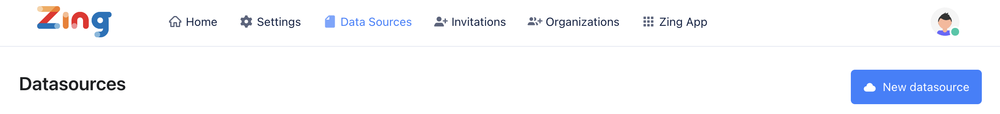
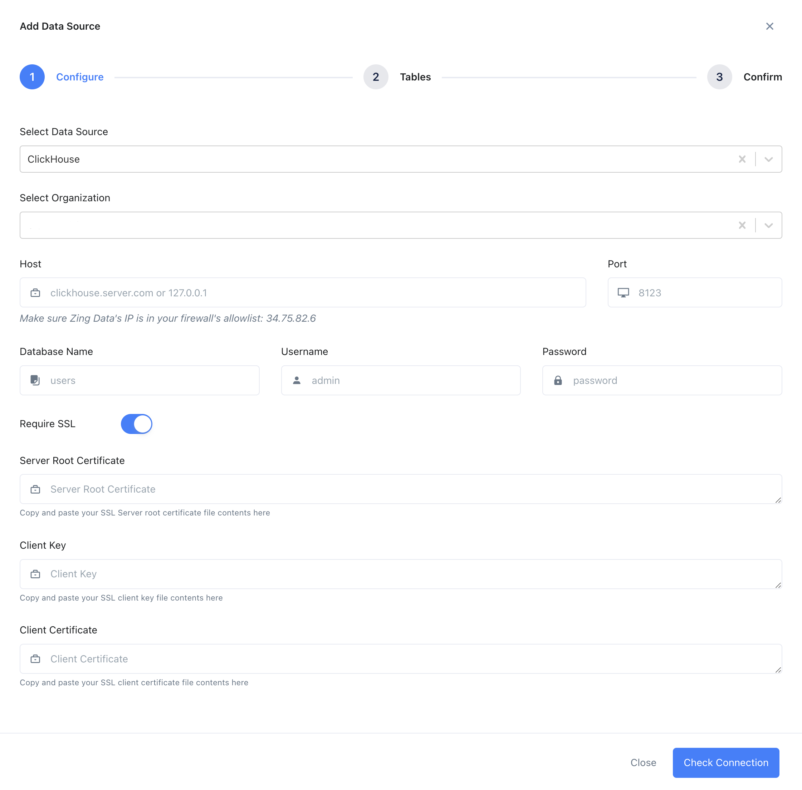
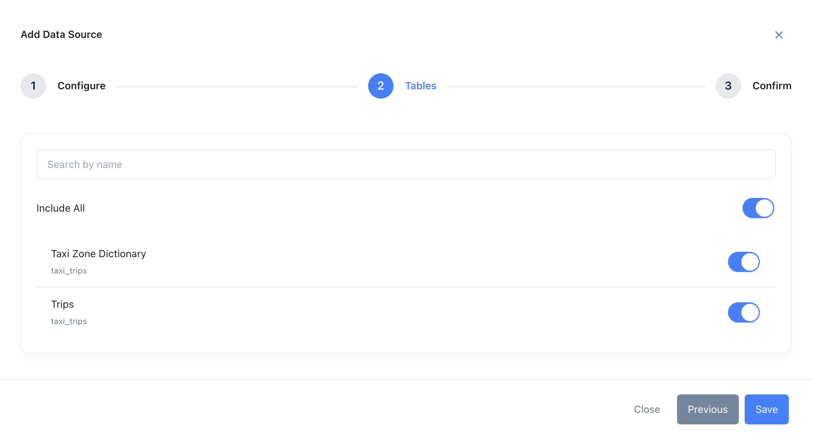
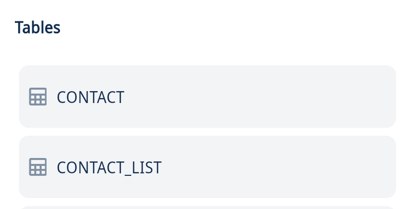
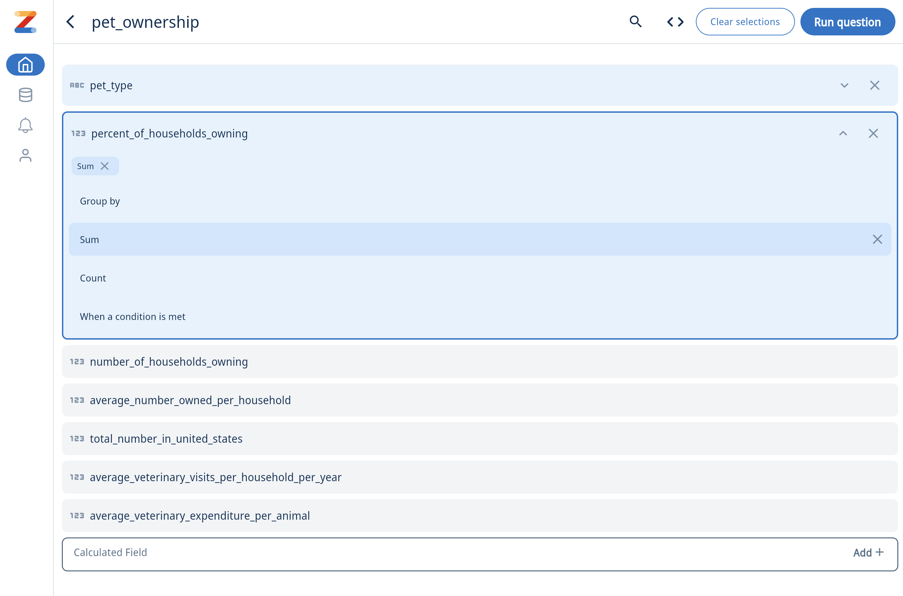
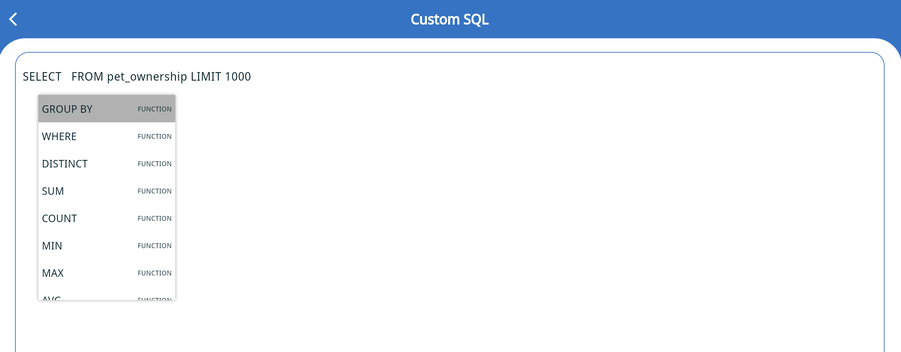
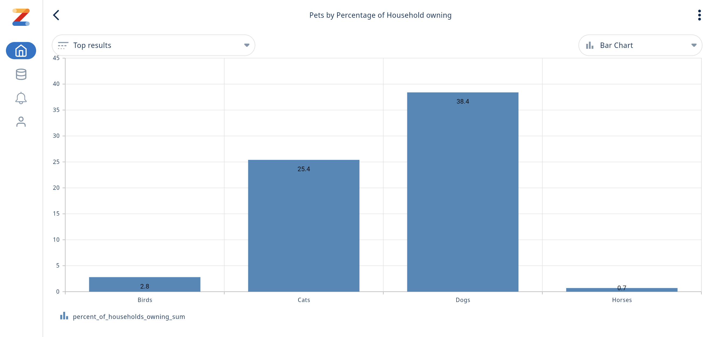
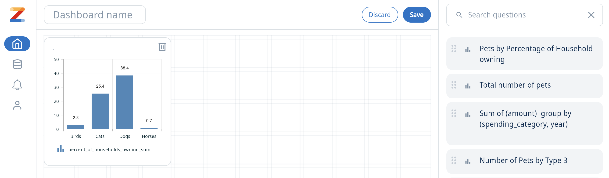

import ConnectionDetails from '@site/docs/ja/_snippets/_gather_your_details_http.mdx';

# Zing DataをClickHouseに接続する

<a href="https://www.zingdata.com/" target="_blank">Zing Data</a>は、データの探索と視覚化のためのプラットフォームです。Zing Dataは、ClickHouseが提供するJSドライバーを使用してClickHouseに接続します。

## 接続方法
1. 接続情報を集めます。
<ConnectionDetails />

2. Zing Dataをダウンロードまたは訪問します。

    * モバイルでZing Dataを使用するには、[Google Play Store](https://play.google.com/store/apps/details?id=com.getzingdata.android)または[Apple App Store](https://apps.apple.com/us/app/zing-data-collaborative-bi/id1563294091)からZing Dataアプリをダウンロードしてください。
    
    * ウェブでZing Dataを使用するには、[Zing Webコンソール](https://console.getzingdata.com/)を訪問し、アカウントを作成します。

3. データソースを追加する

    * Zing DataとClickHouseデータを操作するためには、**_データソース_**を定義する必要があります。Zing Dataのモバイルアプリメニューで**Sources**を選択し、**Add a Datasource**をクリックします。

    * ウェブでデータソースを追加するには、トップメニューの**Data Sources**をクリックし、**New Datasource**をクリックし、ドロップダウンメニューから**Clickhouse**を選択します。
    
      

4. 接続情報を入力し、**Check Connection**をクリックします。

    

5. 接続が成功すると、Zingはテーブル選択画面に進みます。必要なテーブルを選択して**Save**をクリックします。Zingがデータソースに接続できない場合、資格情報を確認して再試行するようメッセージが表示されます。資格情報を確認して再試行しても問題が解決しない場合は、<a id="contact_link" href="mailto:hello@getzingdata.com">ここからZingサポートに連絡</a>してください。

    

6. ClickHouseデータソースが追加されると、**Data Sources** / **Sources** タブの下で、Zing組織内のすべての人が利用可能になります。

## Zing Dataでのチャートとダッシュボードの作成

1. ClickHouseデータソースが追加された後、ウェブの**Zing App**をクリックするか、モバイルでデータソースをクリックしてチャートの作成を開始します。

2. チャートを作成するために、テーブルリストの中から任意のテーブルをクリックします。

  

3. 視覚的クエリ ビルダーを使用して、必要なフィールド、集計などを選び、**Run Question**をクリックします。

    

4. SQLに詳しい場合は、カスタムSQLを書くことでクエリを実行しチャートを作成することもできます。

    

    

5. チャートの例は以下のようになります。 質問は三点メニューを使って保存できます。チャートにコメントしたり、チームメンバーをタグ付けしたり、リアルタイムアラートを作成したり、チャートタイプを変更したりできます。

    

6. ダッシュボードはホーム画面の**Dashboards**の下にある「+」アイコンを使用して作成できます。既存の質問をドラッグして、ダッシュボードに表示することができます。

    

## 関連コンテンツ

- ブログ: [ClickHouseでデータを視覚化する - Zing Data](https://getzingdata.com/blog/zing-adds-support-for-clickhouse-as-a-data-source/)
- [ドキュメント](https://docs.getzingdata.com/docs/)
- [クイックスタート](https://getzingdata.com/quickstart/)
- ダッシュボード作成ガイド [Create Dashboards](https://getzingdata.com/blog/new-feature-create-multi-question-dashboards/)
