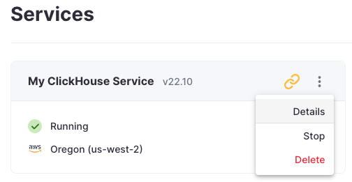
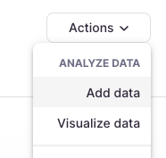
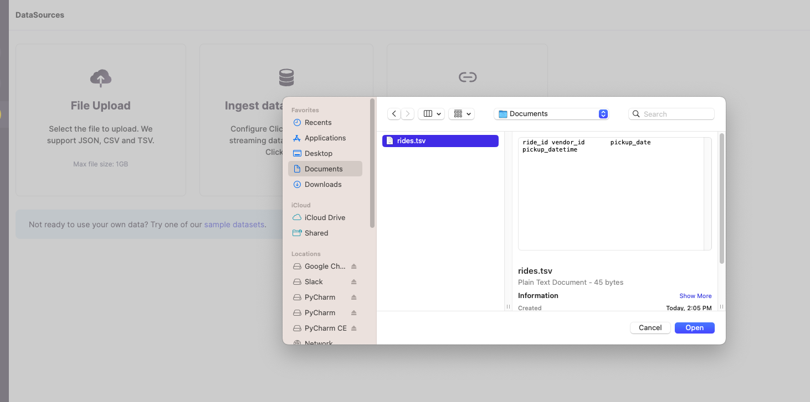
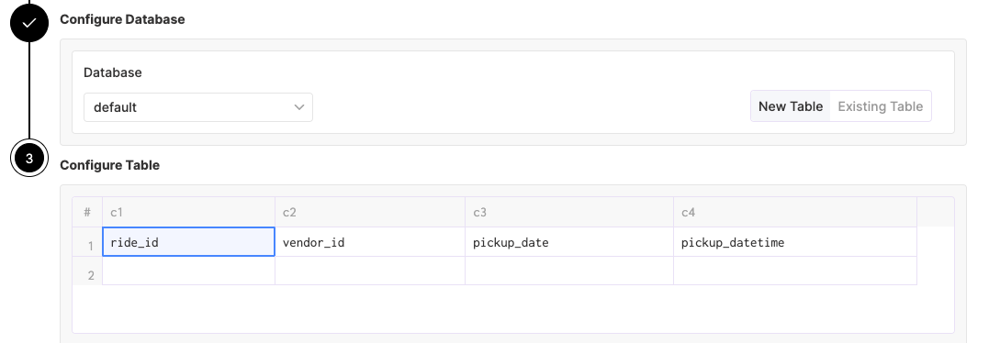
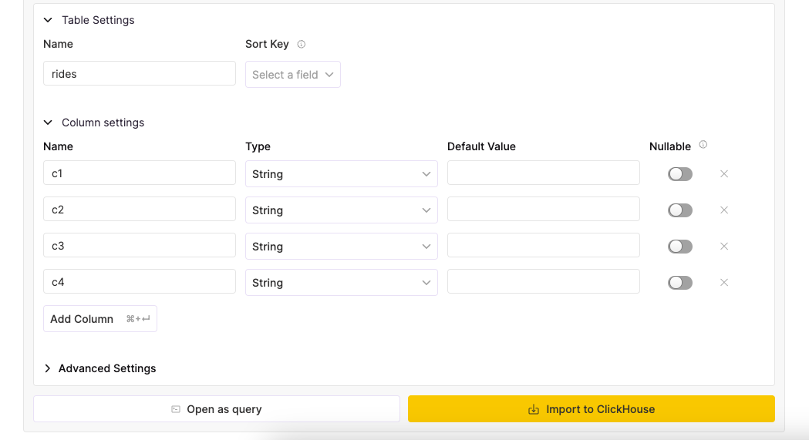

# CSVファイルのアップロード

ヘッダー行にカラム名を含むCSVまたはTSVファイルをアップロードすると、ClickHouseはカラムのデータ型を推測するために一連の行を事前処理し、その後新しいテーブルに行を挿入します。

1. **ClickHouse Cloud**サービスの**詳細**ページに移動します。

    

2. **アクション**ドロップダウンメニューから**データの読み込み**を選択します。

    

3. **データソース**ページで**ファイルアップロード**ボタンをクリックし、表示されるダイアログウィンドウでアップロードしたいファイルを選択します。**開く**をクリックして続行します（以下の例はmacOSですが、他のオペレーティングシステムでは異なる場合があります）。

    

4. ClickHouseが推測したデータ型が表示されます。

    

5. ***新しいテーブル名を入力***して、データを挿入する準備ができたら、**ClickHouseにインポート**ボタンをクリックします。

    

6. ClickHouseサービスに接続し、テーブルが正常に作成されたことを確認してください。データが準備完了です！ データを可視化したい場合は、簡単にClickHouseに接続できるいくつかの[BIツール](../data-visualization.md)をチェックしてください。
