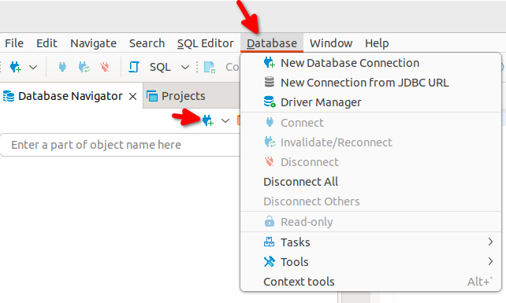
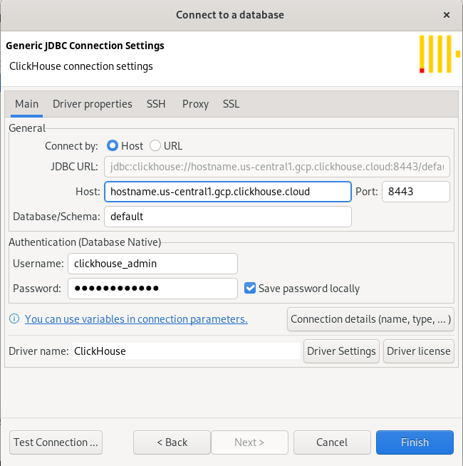
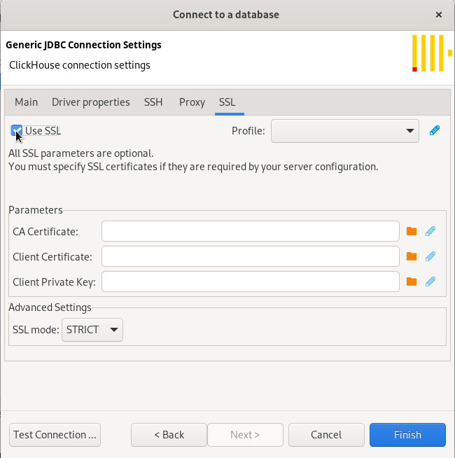
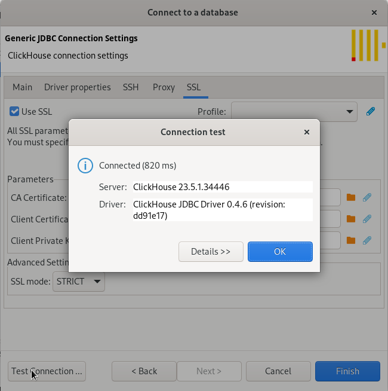
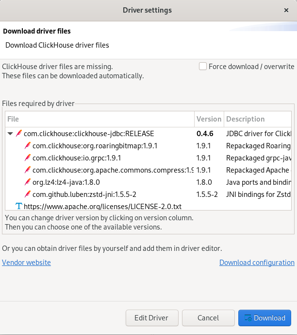
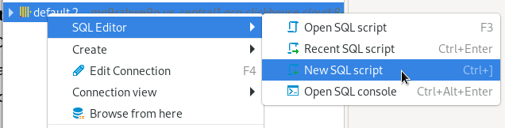
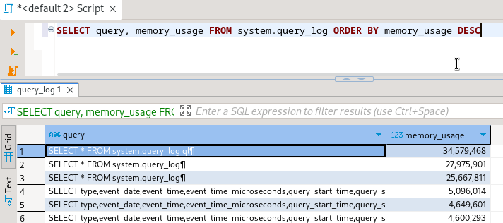

# DBeaverをClickHouseに接続する

DBeaverには複数の提供形態があります。このガイドでは、[DBeaver Community](https://dbeaver.io/)を使用します。さまざまな提供形態と機能については[こちら](https://dbeaver.com/edition/)をご覧ください。DBeaverはJDBCを使用してClickHouseに接続します。

:::note
ClickHouseの`Nullable`カラムのサポートを改善するため、DBeaverバージョン23.1.0以上を使用してください。
:::

## 1. ClickHouseの詳細を収集する

DBeaverはJDBCをHTTP(S)経由で使用してClickHouseに接続します。以下の情報が必要です：

- エンドポイント
- ポート番号
- ユーザー名
- パスワード

## 2. DBeaverをダウンロードする

DBeaverはhttps://dbeaver.io/download/ から入手できます。

## 3. データベースを追加する

- **Database > New Database Connection** メニューまたは **Database Navigator** 内の **New Database Connection** アイコンを使用して、**Connect to a database** ダイアログを表示します：

- **Analytical**を選択し、続けて**ClickHouse**を選択します：

- JDBC URLを構築します。**Main**タブでホスト、ポート、ユーザー名、パスワード、データベースを設定します：

- デフォルトでは、**SSL > Use SSL**プロパティは未設定になっています。ClickHouse CloudやHTTPポートでSSLを要求するサーバーに接続する場合は、**SSL > Use SSL**をオンにします：

- 接続をテストします：

もしDBeaverがClickHouseドライバがインストールされていないと検出した場合、ダウンロードを案内します：

- ドライバをダウンロードした後、再度**Test**接続を行います：

## 4. ClickHouseにクエリを実行する

クエリエディタを開いてクエリを実行します。

- 接続を右クリックして**SQL Editor > Open SQL Script**を選び、クエリエディタを開きます：

- `system.query_log`に対する例のクエリ：

  

## 次のステップ

DBeaverの機能について学ぶには[DBeaver wiki](https://github.com/dbeaver/dbeaver/wiki)を、ClickHouseの機能について学ぶには[ClickHouseのドキュメント](https://clickhouse.com/docs)をご覧ください。
