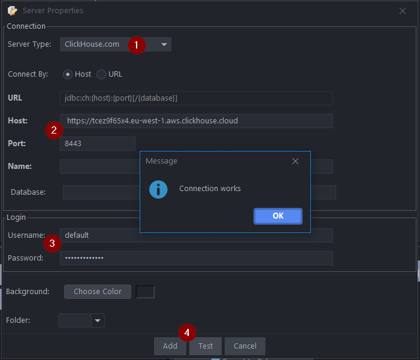
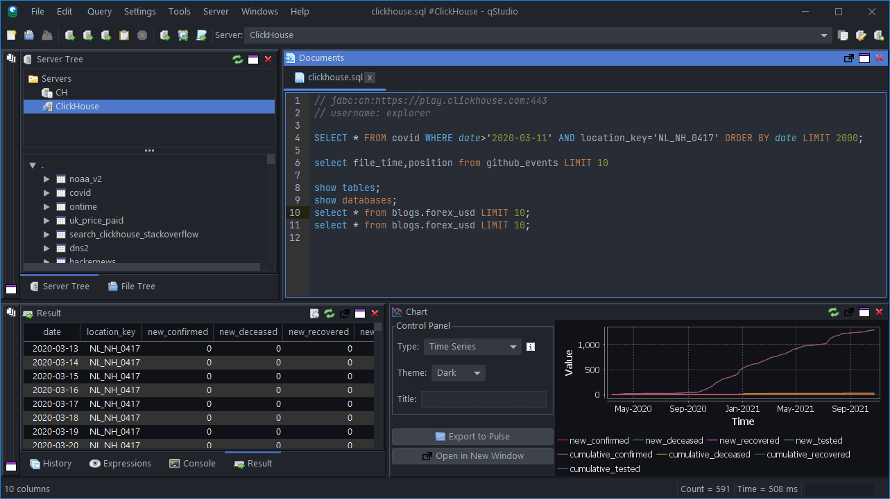

import ConnectionDetails from '@site/docs/ja/_snippets/_gather_your_details_http.mdx';

qStudioは無料のSQL GUIで、SQLスクリプトの実行、テーブルの簡単なブラウジング、結果のグラフ化やエクスポートが可能です。すべてのオペレーティングシステムで、すべてのデータベースで動作します。

# qStudioをClickHouseに接続する

qStudioはJDBCを使用してClickHouseに接続します。

## 1. ClickHouseの詳細情報を収集する

qStudioはJDBC over HTTP(S)を使ってClickHouseに接続します。必要な情報は次の通りです：

- エンドポイント
- ポート番号
- ユーザー名
- パスワード

<ConnectionDetails />

## 2. qStudioをダウンロードする

qStudioはhttps://www.timestored.com/qstudio/download/ で入手可能です。

## 3. データベースを追加する

- qStudioを初めて開くとき、メニューオプションの**Server->Add Server**やツールバーのサーバー追加ボタンをクリックしてください。
- 次に詳細を設定します：

1. サーバータイプ: Clickhouse.com
2. ホストには**https://**を必ず含めてください。
    ホスト: https://abc.def.clickhouse.cloud
    ポート: 8443
3. ユーザー名: default
    パスワード: XXXXXXXXXXX
4. 「追加」をクリック

qStudioがClickHouse JDBCドライバーがインストールされていないと判断した場合は、ダウンロードを促します：

## 4. ClickHouseにクエリを実行する

- クエリエディタを開いてクエリを実行します。クエリは次の方法で実行できます：
- Ctrl + e - ハイライトされたテキストを実行
- Ctrl + Enter - 現在の行を実行

- クエリの例：

  

## 次のステップ

QStudioの機能については[QStudio](https://www.timestored.com/qstudio)を参照し、ClickHouseの機能については[ClickHouseのドキュメント](https://clickhouse.com/docs)を参照してください。
