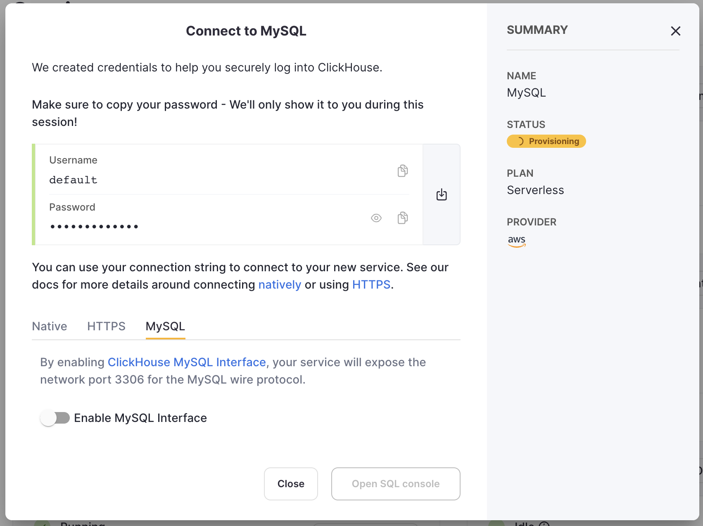
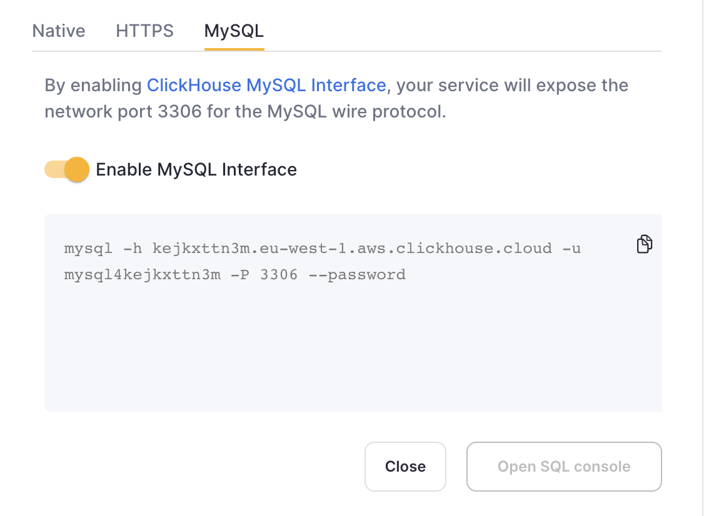
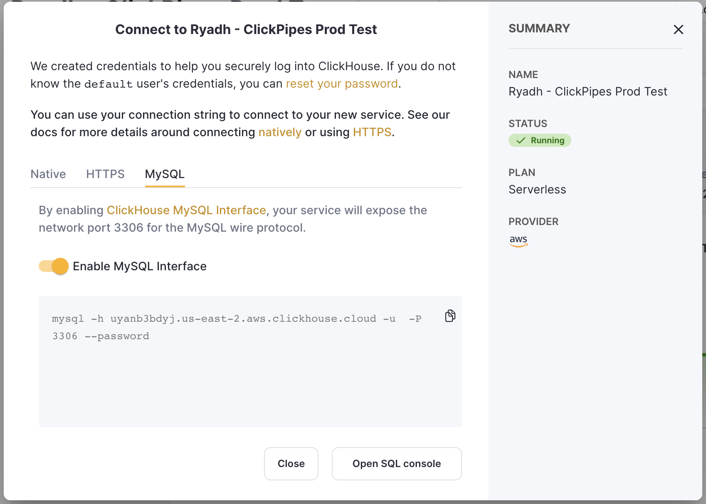

# MySQL インターフェース

ClickHouseは、MySQLのワイヤープロトコルをサポートしています。これにより、ネイティブなClickHouseコネクタを持たない一部のクライアントがMySQLプロトコルを利用でき、以下のBIツールで検証済みです:

- [Looker Studio](../integrations/data-visualization/looker-studio-and-clickhouse.md)
- [Tableau Online](../integrations/tableau-online)
- [QuickSight](../integrations/quicksight)

他の未検証のクライアントまたは統合を試みる場合、以下の制限があることをご了承ください:

- SSLの実装が完全に互換性がない可能性があり、[TLS SNI](https://www.cloudflare.com/learning/ssl/what-is-sni/)に関連した問題が発生する可能性があります。
- 特定のツールが必要とする方言の機能（例えば、MySQL特有の関数や設定）が未実装の場合があります。

ネイティブドライバが利用可能な場合（例: [DBeaver](../integrations/dbeaver)）、MySQLインターフェースの代わりにそちらを使用することを推奨します。また、多くのMySQL言語クライアントが問題なく動作するはずですが、MySQLインターフェースが既存のMySQLクエリを持つコードベースのドロップイン代替であることは保証されません。

特定のツールでネイティブClickHouseドライバが利用できず、MySQLインターフェースを通じて使用したいが、いくつかの非互換性が見つかった場合は、ClickHouseリポジトリで[問題を作成](https://github.com/ClickHouse/ClickHouse/issues)してください。

::::note
上記のBIツールのSQL方言をより良くサポートするために、ClickHouseのMySQLインターフェースは、設定[prefer_column_name_to_alias = 1](../operations/settings/settings.md#prefer-column-name-to-alias)でクエリを実行します。これはオフにすることができず、稀なケースでClickHouseの通常のクエリインターフェースとMySQLクエリインターフェースの間で異なる動作を引き起こす可能性があります。
::::

## ClickHouse CloudでのMySQLインターフェースの有効化

1. ClickHouse Cloudサービスを作成した後、クレデンシャル画面でMySQLタブを選択します。



2. 特定のサービス用にMySQLインターフェースを有効化するようにスイッチを切り替えます。これにより、このサービスに対してポート`3306`が公開され、独自のMySQLユーザー名を含むMySQL接続画面が表示されます。パスワードはサービスのデフォルトユーザーパスワードと同じになります。



既存のサービス用にMySQLインターフェースを有効化する場合:

1. サービスを`Running`状態にして、MySQLインターフェースを有効化したいサービスの"View connection string"ボタンをクリックします。


2. 特定のサービス用にMySQLインターフェースを有効化するようにスイッチを切り替えます。これにより、デフォルトのパスワードを入力するように促されます。


3. パスワードを入力すると、このサービスのMySQL接続文字列が表示されます。


## ClickHouse Cloudで複数のMySQLユーザーを作成する

デフォルトで、`mysql4<subdomain>` ユーザーが組み込まれており、このユーザーは`default`ユーザーと同じパスワードを使用します。`<subdomain>` の部分はClickHouse Cloudのホスト名の最初のセグメントです。この形式は、安全な接続を実装しているツールで[SNI情報がTLSハンドシェイクで提供されない場合](https://www.cloudflare.com/learning/ssl/what-is-sni)に必要となり、ユーザー名に追加のヒントがないと内部ルーティングを行うことができません（MySQLコンソールクライアントがそのようなツールのひとつです）。

このため、MySQLインターフェース用に新しいユーザーを作成する際には、`mysql4<subdomain>_<username>` 形式に従うことを_強く推奨_します。ここで`<subdomain>`はCloudサービスを識別するためのヒントで、`<username>`は任意の接尾語です。

:::tip
ClickHouse Cloudのホスト名が`foobar.us-east1.aws.clickhouse.cloud`の場合、`<subdomain>`部分は`foobar`に相当し、カスタムMySQLユーザー名は`mysql4foobar_team1`のようになります。
:::

MySQLインターフェースと共に使用するために追加のユーザーを作成できます。例えば、追加の設定を適用する必要がある場合などです。

1. オプション - カスタムユーザーに適用する[設定プロファイルを作成](https://clickhouse.com/docs/ja/sql-reference/statements/create/settings-profile)します。例えば、`my_custom_profile` を追加の設定と共に作成し、後で作成するユーザーに接続した際にデフォルトで適用されます：

    ```sql
    CREATE SETTINGS PROFILE my_custom_profile SETTINGS prefer_column_name_to_alias=1;
    ```

    `prefer_column_name_to_alias`は例として使用されています。ここに他の設定を使用できます。
2. 以下の形式を使用して[ユーザーを作成](https://clickhouse.com/docs/ja/sql-reference/statements/create/user)します：`mysql4<subdomain>_<username>`（[上記参照](#creating-multiple-mysql-users-in-clickhouse-cloud)）。パスワードはダブルSHA1形式である必要があります。例えば：

    ```sql
    CREATE USER mysql4foobar_team1 IDENTIFIED WITH double_sha1_password BY 'YourPassword42$';
    ```

    また、このユーザーのためにカスタムプロファイルを使用したい場合は：

    ```sql
    CREATE USER mysql4foobar_team1 IDENTIFIED WITH double_sha1_password BY 'YourPassword42$' SETTINGS PROFILE 'my_custom_profile';
    ```

    ここで`my_custom_profile`は先に作成したプロファイルの名前です。
3. 新しいユーザーに必要な権限を[付与](https://clickhouse.com/docs/ja/sql-reference/statements/grant)して、要求されたテーブルやデータベースと対話できるようにします。例えば、`system.query_log`へのアクセス権を付与したい場合：

    ```sql
    GRANT SELECT ON system.query_log TO mysql4foobar_team1;
    ```

4. 作成したユーザーを使用して、MySQLインターフェースと共にClickHouse Cloudサービスに接続します。

### ClickHouse Cloudでの複数のMySQLユーザーのトラブルシューティング

新しいMySQLユーザーを作成し、MySQL CLIクライアント経由で接続中に以下のエラーが表示された場合：

```
ERROR 2013 (HY000): Lost connection to MySQL server at 'reading authorization packet', system error: 54
```

このケースでは、ユーザー名が`mysql4<subdomain>_<username>`形式に従っていることを確認してください（[上記参照](#creating-multiple-mysql-users-in-clickhouse-cloud)）。

## セルフマネージドのClickHouseでMySQLインターフェースを有効化

サーバーの設定ファイルに[mysql_port](../operations/server-configuration-parameters/settings.md#mysql_port)設定を追加します。たとえば、`config.d/`[フォルダ](../operations/configuration-files)内に新しいXMLファイルにポートを定義できます：

``` xml
<clickhouse>
    <mysql_port>9004</mysql_port>
</clickhouse>
```

ClickHouseサーバーを起動し、次のようなMySQL互換プロトコルをリッスンしていることを示すログメッセージを探します：

```
{} <Information> Application: Listening for MySQL compatibility protocol: 127.0.0.1:9004
```

## MySQLをClickHouseに接続する

以下のコマンドは、MySQLクライアント`mysql`をClickHouseに接続する方法を示しています：

```bash
mysql --protocol tcp -h [hostname] -u [username] -P [port_number] [database_name]
```

例：

``` bash
$ mysql --protocol tcp -h 127.0.0.1 -u default -P 9004 default
```

接続が成功した場合の出力：

``` text
Welcome to the MySQL monitor.  Commands end with ; or \g.
Your MySQL connection id is 4
Server version: 20.2.1.1-ClickHouse

Copyright (c) 2000, 2019, Oracle and/or its affiliates. All rights reserved.

Oracle is a registered trademark of Oracle Corporation and/or its
affiliates. Other names may be trademarks of their respective
owners.

Type 'help;' or '\h' for help. Type '\c' to clear the current input statement.

mysql>
```

すべてのMySQLクライアントとの互換性のために、設定ファイルでユーザーパスワードを[ダブルSHA1](../operations/settings/settings-users.md#password_double_sha1_hex)で指定することをお勧めします。
ユーザーパスワードが[SHA256](../operations/settings/settings-users.md#password_sha256_hex)で指定されている場合、一部のクライアントは認証できません（mysqljsおよびコマンドラインツールの古いバージョンのMySQLおよびMariaDB）。

制限事項:

- プリペアドクエリはサポートされていません

- 一部のデータタイプは文字列として送信されます

長いクエリをキャンセルするには、`KILL QUERY connection_id`文を使用します（これは処理中に`KILL QUERY WHERE query_id = connection_id`に置き換えられます）。例：

``` bash
$ mysql --protocol tcp -h mysql_server -P 9004 default -u default --password=123 -e "KILL QUERY 123456;"
```
