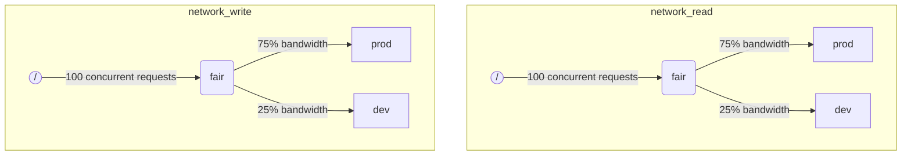

ClickHouseが複数のクエリを同時に実行する場合、それらは共有リソース（例：ディスク）を使用している可能性があります。スケジューリング制約とポリシーを適用することで、異なるワークロード間でリソースがどのように利用され共有されるのかを調整できます。各リソースにはスケジューリング階層を設定できます。階層のルートはリソースを表し、リーフはリソースキャパシティを超えたリクエストを保持するキューです。

:::note
現在、説明された方法を使用してスケジューリングできるのはリモートディスクIOのみです。CPUスケジューリングについては、スレッドプールと[`concurrent_threads_soft_limit_num`](server-configuration-parameters/settings.md#concurrent_threads_soft_limit_num)の設定を参照してください。柔軟なメモリ制限については[メモリオーバーコミット](settings/memory-overcommit.md)を参照してください。
:::

## ディスク設定 {#disk-config}

特定のディスクでIOスケジューリングを有効にするには、ストレージ設定で`read_resource`または`write_resource`を指定する必要があります。これにより、指定されたディスクでの読み取りおよび書き込みリクエストに対して、ClickHouseがどのリソースを使用するべきかを示します。ローカルSSDやHDDの場合、読み取りおよび書き込みリソースは同じリソース名を参照できます。リモートディスクの場合も同様に、複数の異なるディスクが同じリソースを参照することができ、「プロダクション」や「開発」ワークロード間でネットワーク帯域幅を適切に分配したい場合に便利です。

例：
```xml
<clickhouse>
    <storage_configuration>
        ...
        <disks>
            <s3>
                <type>s3</type>
                <endpoint>https://clickhouse-public-datasets.s3.amazonaws.com/my-bucket/root-path/</endpoint>
                <access_key_id>your_access_key_id</access_key_id>
                <secret_access_key>your_secret_access_key</secret_access_key>
                <read_resource>network_read</read_resource>
                <write_resource>network_write</write_resource>
            </s3>
        </disks>
        <policies>
            <s3_main>
                <volumes>
                    <main>
                        <disk>s3</disk>
                    </main>
                </volumes>
            </s3_main>
        </policies>
    </storage_configuration>
</clickhouse>
```

リソースで使用されるディスクを指定するもう一つの方法としてSQL構文があります：

```sql
CREATE RESOURCE resource_name (WRITE DISK disk1, READ DISK disk2)
```

リソースは、読み取りまたは書き込み、またはその両方のために任意の数のディスクに使用できます。すべてのディスクにリソースを使用することを表現する構文もあります：

```sql
CREATE RESOURCE all_io (READ ANY DISK, WRITE ANY DISK);
```

サーバーの構成オプションは、SQLによるリソースの定義方法よりも優先されることに注意してください。

## ワークロードマークアップ {#workload_markup}

クエリには設定`workload`を使用して異なるワークロードを識別するマークを付けることができます。`workload`が設定されていない場合、「default」の値が使用されます。設定プロファイルを使用して他の値を指定できることに注意してください。ユーザーからのすべてのクエリを`workload`設定の固定値でマークしたい場合、設定制約を使用して`workload`を一定にすることができます。

バックグラウンドアクティビティに対して`workload`設定を割り当てることも可能です。マージとマテーションにはそれぞれ`merge_workload`と`mutation_workload`のサーバー設定が使用されます。これらの値は、特定のテーブルに対して`merge_workload`と`mutation_workload`のMergeTree設定を使用してオーバーライドすることもできます。

ここで、「プロダクション」と「開発」という2つの異なるワークロードを持つシステムの例を考えてみましょう。

```sql
SELECT count() FROM my_table WHERE value = 42 SETTINGS workload = 'production'
SELECT count() FROM my_table WHERE value = 13 SETTINGS workload = 'development'
```

## リソースのスケジューリング階層 {#hierarchy}

スケジューリングサブシステムの観点から、リソースはスケジューリングノードの階層を表します。



**可能なノードタイプ：**
* `inflight_limit`（制約） - 同時に飛んでいるリクエストの数が`max_requests`を超えるか、またはその合計コストが`max_cost`を超える場合にブロックされます。唯一の子ノードを持たねばなりません。
* `bandwidth_limit`（制約） - 現在の帯域幅が`max_speed`（0は無制限を意味）またはバーストが`max_burst`（デフォルトは`max_speed`に等しい）を超える場合にブロックされます。唯一の子ノードを持たねばなりません。
* `fair`（ポリシー） - マックスミンフェアネスに従って次にサービスを提供するリクエストを子ノードから選択します。子ノードは`weight`（デフォルトは1）を指定できます。
* `priority`（ポリシー） - 静的な優先順位（値が低いほど優先順位が高い）に従って次にサービスを提供するリクエストを子ノードから選択します。子ノードは`priority`（デフォルトは0）を指定できます。
* `fifo`（キュー） - リソースキャパシティを超えたリクエストを保持できる階層のリーフ。

基礎となるリソースのフルキャパシティを使用するためには、`inflight_limit`を使用すべきです。`max_requests`や`max_cost`の値が低すぎると、リソースのフル利用がなされず、反対に値が高すぎるとスケジューラー内のキューが空になり、結果としてサブツリー内でポリシーが無視される（不公平または優先順位の無視）ことにつながります。一方で、リソースの過度の利用からの保護が必要な場合、`bandwidth_limit`を使用すべきです。これは、`duration`秒で消費されるリソース量が`max_burst + max_speed * duration`バイトを超えた場合にスロットリングを行います。同一リソース上にある2つの`bandwidth_limit`ノードを使用して、短期間のピーク帯域幅と長期間の平均帯域幅を制限することができます。

以下の例は、図に示されているIOスケジューリング階層を定義する方法の一例です：

```xml
<clickhouse>
    <resources>
        <network_read>
            <node path="/">
                <type>inflight_limit</type>
                <max_requests>100</max_requests>
            </node>
            <node path="/fair">
                <type>fair</type>
            </node>
            <node path="/fair/prod">
                <type>fifo</type>
                <weight>3</weight>
            </node>
            <node path="/fair/dev">
                <type>fifo</type>
            </node>
        </network_read>
        <network_write>
            <node path="/">
                <type>inflight_limit</type>
                <max_requests>100</max_requests>
            </node>
            <node path="/fair">
                <type>fair</type>
            </node>
            <node path="/fair/prod">
                <type>fifo</type>
                <weight>3</weight>
            </node>
            <node path="/fair/dev">
                <type>fifo</type>
            </node>
        </network_write>
    </resources>
</clickhouse>
```

## ワークロード分類子 {#workload_classifiers}

ワークロード分類子は、クエリで指定された`workload`から特定のリソースに使用するリーフキューへのマッピングを定義するために使用されます。現時点では、ワークロード分類は単純です：静的マッピングのみが使用可能です。

例：
```xml
<clickhouse>
    <workload_classifiers>
        <production>
            <network_read>/fair/prod</network_read>
            <network_write>/fair/prod</network_write>
        </production>
        <development>
            <network_read>/fair/dev</network_read>
            <network_write>/fair/dev</network_write>
        </development>
        <default>
            <network_read>/fair/dev</network_read>
            <network_write>/fair/dev</network_write>
        </default>
    </workload_classifiers>
</clickhouse>
```

## ワークロード階層（SQLのみ） {#workloads}

XMLでリソースと分類子を定義するのは難しいことがあります。ClickHouseはより便利なSQL構文を提供しています。`CREATE RESOURCE`で作成されたすべてのリソースは同じ構造の階層を共有しますが、いくつかの点で異なることがあります。`CREATE WORKLOAD`で作成された各ワークロードは、それぞれのリソースに対していくつかのスケジューリングノードを自動的に保持します。一つの親ワークロードの中に子ワークロードを作成することができます。以下は、上記のXML設定と全く同じ階層を定義する例です：

```sql
CREATE RESOURCE network_write (WRITE DISK s3)
CREATE RESOURCE network_read (READ DISK s3)
CREATE WORKLOAD all SETTINGS max_requests = 100
CREATE WORKLOAD development IN all
CREATE WORKLOAD production IN all SETTINGS weight = 3
```

子供のいないリーフワークロードの名前は、クエリ設定の`SETTINGS workload = 'name'`で使用できます。SQL構文を使用する際、ワークロード分類子も自動的に作成されることに注意してください。

ワークロードをカスタマイズするためには、以下の設定が使用できます：
* `priority` - 同階層のワークロードは、静的優先順位値に従ってサービスされます（値が低いほど優先順位が高い）。
* `weight` - 同階層のワークロードが同じ静的優先順位を持つ場合、リソースは重みに基づいて共有されます。
* `max_requests` - このワークロードでの同時リソースリクエストの数の制限。
* `max_cost` - このワークロードでの同時リソースリクエストの合計インフライトバイト数の制限。
* `max_speed` - このワークロードのバイト処理速度の制限（各リソースに対して独立しています）。
* `max_burst` - ワークロードがスロットリングされることなく処理できる最大バイト数（各リソースに対して独立しています）。

ワークロード設定は、適切なスケジューリングノードセットに変換されることに注意してください。詳細については、スケジューリングノードの[タイプとオプション](#hierarchy)の説明を参照してください。

異なるリソースに対して異なるワークロードの階層を指定する方法はありません。しかし、特定のリソースに対して異なるワークロード設定値を指定する方法はあります：

```sql
CREATE OR REPLACE WORKLOAD all SETTINGS max_requests = 100, max_speed = 1000000 FOR network_read, max_speed = 2000000 FOR network_write
```

また、ワークロードまたはリソースが他のワークロードから参照されている場合は削除できません。ワークロードの定義を更新するには、`CREATE OR REPLACE WORKLOAD`クエリを使用してください。

## ワークロードとリソースのストレージ {#workload_entity_storage}

すべてのワークロードとリソースの定義は、`CREATE WORKLOAD`および`CREATE RESOURCE`クエリの形式で永続的に保存されます。保存先はディスク上の`workload_path`またはZooKeeper上の`workload_zookeeper_path`です。ノード間での一貫性を達成するためにはZooKeeperストレージが推奨されます。代わりに`ON CLUSTER`句をディスクストレージと一緒に使用することも可能です。

## 参照先
 - [system.scheduler](/docs/ja/operations/system-tables/scheduler.md)
 - [system.workloads](/docs/ja/operations/system-tables/workloads.md)
 - [system.resources](/docs/ja/operations/system-tables/resources.md)
 - [merge_workload](/docs/ja/operations/settings/merge-tree-settings.md#merge_workload) MergeTree設定
 - [merge_workload](/docs/ja/operations/server-configuration-parameters/settings.md#merge_workload) グローバルサーバー設定
 - [mutation_workload](/docs/ja/operations/settings/merge-tree-settings.md#mutation_workload) MergeTree設定
 - [mutation_workload](/docs/ja/operations/server-configuration-parameters/settings.md#mutation_workload) グローバルサーバー設定
 - [workload_path](/docs/ja/operations/server-configuration-parameters/settings.md#workload_path) グローバルサーバー設定
 - [workload_zookeeper_path](/docs/ja/operations/server-configuration-parameters/settings.md#workload_zookeeper_path) グローバルサーバー設定
