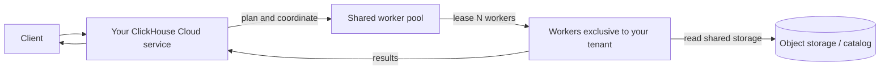
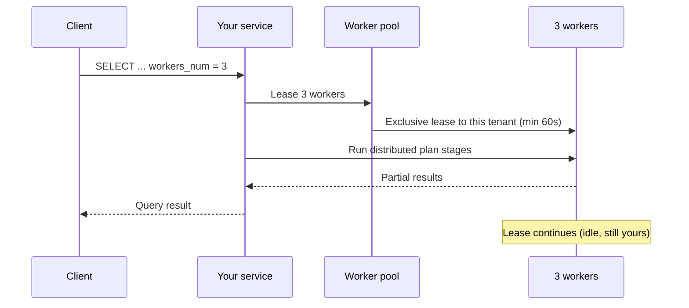
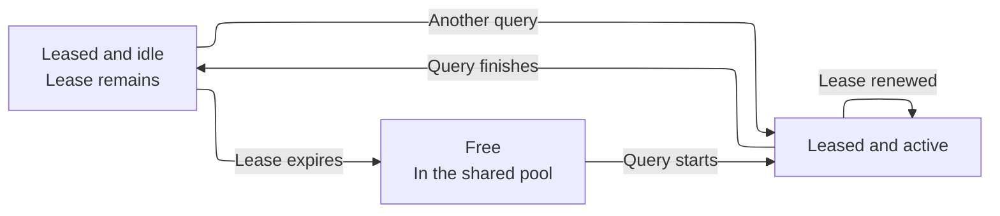
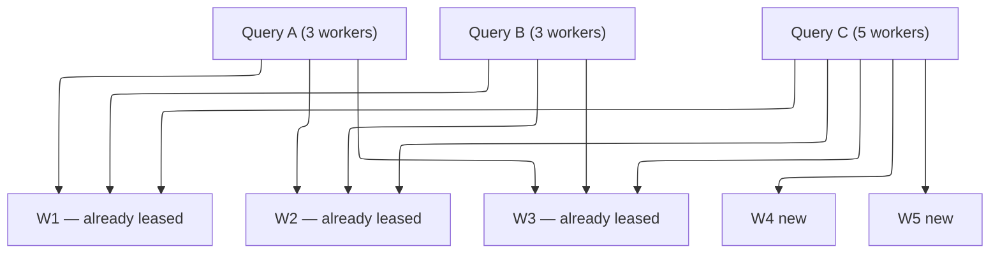

import { PrivatePreviewBadge } from "/snippets/ja/components/PrivatePreviewBadge/PrivatePreviewBadge.jsx";

<PrivatePreviewBadge />

<Note>
  On-Demand Compute はプライベートプレビュー段階です。ClickHouse Cloud の SLO や SLA の対象ではなく、既知および未知の制限が適用される場合があります。[制限事項](#limitations)を参照してください。

  [ウェイトリストに登録する](https://clickhouse.com/cloud/on-demand-compute-waitlist)。
</Note>

On-Demand Compute は、サービスのリサイズや別サービスのプロビジョニングを行わずに、サポート対象のワークロード向けの追加コンピュートをサービス (テナント) に提供する ClickHouse Cloud の機能です。この処理は、サービス自身のコンピュートの外にある ClickHouse のワーカー上で実行されます。ワーカーはテナント間で共有されるマネージドプールから供給されますが、各ワーカーが同時に割り当てられるテナントは 1 つだけです。

プライベートプレビュー期間中、On-Demand Compute は対象となる `SELECT` クエリをサポートします。設定を使用してクエリをオプトインすると、ClickHouse がプールからワーカーを割り当て、既存のサービスおよびエンドポイントを通じてそのクエリを実行します。バックグラウンド処理はこの機能全体には含まれますが、プライベートプレビューではサポートされません。

これは[コンピュート・コンピュート分離](/ja/products/cloud/features/infrastructure/warehouses)とは異なります。warehouse は、データを共有する複数のサービスを通じて、専用かつ長期間存続するコンピュートを提供します。一方 On-Demand Compute は、既存のサービスを通じて共有プールから一時的なワーカーを提供します。プライベートプレビュー期間中は、このコンピュートをクエリ単位でリクエストします。

## On-Demand Compute を使用するタイミング {#when-to-use-on-demand-compute}

プライベートプレビュー期間中は、プライマリサービスのコンピュート外で実行したい、対象となるコンピュート負荷の高い `SELECT` クエリに On-Demand Compute を使用してください。

* **アドホッククエリおよびアナリストによるクエリ:** コンピュート負荷の高い `SELECT` クエリを追加の worker で実行します。
* **重要度の低い読み取りワークロード:** 一部の読み取り処理をプライマリサービスからオフロードします。
* **データレイクへのクエリ:** サポートされている Apache Iceberg、Delta Lake、または `SharedMergeTree` のデータに対して、追加の worker でクエリを実行します。
* **一時的な追加コンピュート:** プライマリサービスのサイズを変更することなく、対象となるクエリ向けに worker をリクエストします。

プライベートプレビューでサポートされるのは `SELECT` クエリのみです。worker は `INSERT` クエリ、DDL、mutation、バックグラウンド処理を実行しません。

## 仕組み {#how-it-works}



1. 対象となる `SELECT` クエリを ClickHouse Cloud サービスに送信します。エンドポイント、認証、RBAC の設定を変更する必要はありません。
2. サービスは分散クエリプランを構築し、マネージドプールに対して指定された数の worker を要求します。
3. ClickHouse は利用可能な worker をサービスに割り当てます。
4. worker は分散プランナーによって割り当てられたプランのステージを実行し、サポートされているストレージからデータを読み取ります。
5. サービスがクエリ全体を調整し、結果をクライアントに返します。

プライベートプレビュー期間中、各 worker は `8 vCPUs` と `32 GiB` のメモリを備えています。クエリが要求する worker の数は、`distributed_plan_workers_num` で指定します。

## オンデマンドコンピュートの使用 {#using-on-demand-compute}

### Settings {#settings}

これらの設定は、クエリ単位、ユーザー単位、または settings profile に追加します。

| 設定                             | 必須値            | 目的                                                                               |
| ------------------------------ | -------------- | -------------------------------------------------------------------------------- |
| `make_distributed_plan`        | Yes            | 実験的な distributed query plan を有効にします。On-Demand Compute に必須です。                     |
| `distributed_plan_workers_num` | Yes            | このクエリ用にリースする worker 数。`0` (デフォルト) の場合、クエリは worker pool ではなく自身の service 上で実行されます。 |
| `enable_parallel_replicas`     | Yes (`0` に設定)  | 並列レプリカは distributed plan と併用できません。                                               |

<Tip>
  プレビュー期間中は、設定をクエリレベルで指定するか、別の設定を持つユーザーを作成してください。そうすれば、どのステートメントが On-Demand Compute を使用しているかが一目で分かり、並列レプリカを有効にする Cloud のデフォルトプロファイルを継承してしまうことも避けられます。
</Tip>

### 例 {#example}

```sql
SELECT
    sum(l_extendedprice * l_discount) AS revenue
FROM lineitem
WHERE
    l_shipdate >= DATE '1994-01-01'
    AND l_shipdate < DATE '1994-01-01' + INTERVAL 1 YEAR
    AND l_discount BETWEEN 0.06 - 0.01 AND 0.06 + 0.01
    AND l_quantity < 24
SETTINGS
    make_distributed_plan = 1,
    distributed_plan_workers_num = 3,
    enable_parallel_replicas = 0
```

このクエリは3つのワーカーをリクエストします。ClickHouseが実際に提供するワーカー数は、プライベートプレビューの上限と利用可能なプール容量によって決まります。

### worker のリース {#worker-leasing}

worker のリースは最低 60 秒間有効です。クエリの実行中、ClickHouse はリースを自動的に更新します。

クエリの完了後も、リースが期限切れになるまで worker はサービスに割り当てられたままです。リースが有効な間は、同じサービスの別の対象クエリがそれらの worker を再利用できるため、ClickHouse が新たに worker をリクエストする必要はありません。

リースが期限切れになると、ClickHouse は worker をサービスから解放し、終了させます。



クエリが完了した後も、3つのworkerはリースの有効期限が切れるまで、tenantにリースされたままアイドル状態で残ります。



これらの worker がリースされている間に別のクエリを送信すると、その worker をすぐに再利用できます (コールドスタートは発生しません) 。

リースの有効期限が切れると、ClickHouse は worker を pool に返却します。このとき worker は、別の tenant のために idle 状態で保持されるのではなく、終了されます。

### 同時実行クエリ {#concurrent-queries}

同一の ClickHouse Cloud サービスから実行される同時実行クエリは、割り当て済みの worker を共有できます。ClickHouse が追加の worker をリクエストするのは、あるクエリがサービスに既に割り当てられている数を超える worker を要求した場合のみです。

たとえば、2 つの同時実行クエリがそれぞれ 3 つの worker を要求する場合、これらは同じ 3 つの worker を共有できます。さらに別のクエリが 5 つの worker を要求した場合、ClickHouse は割り当て済みの 3 つの worker を利用しつつ、不足する 2 つを pool からリクエストします。

以下の例を参照してください:

```sql
SELECT ... SETTINGS make_distributed_plan = 1, distributed_plan_workers_num = 3, ...;
SELECT ... SETTINGS make_distributed_plan = 1, distributed_plan_workers_num = 3, ...;
```

これらは同じ3つのworkerを共有します。

3つ目の同時実行クエリが5つのworkerを要求した場合:

```sql
SELECT ... SETTINGS make_distributed_plan = 1, distributed_plan_workers_num = 5, ...;
```

そのクエリは、既存の3つのworkerと、新たにリースされた2つのworkerの上で実行されます。



### プールがリクエストを満たせない場合 {#pool-capacity}

プライベートプレビュー期間中、worker の可用性はベストエフォートです。リクエストした数より少ない worker しか利用できない場合、クエリは ClickHouse が割り当てられるだけの worker で実行されます。たとえば、5 つの worker をリクエストしても 3 つで実行されることがあります。

worker を 1 つもリースできない場合、クエリは失敗します:

```text
No stateless workers available for tenant 'bronzeaws-cm-72': the discovery service leased none.
```

クエリを再試行してください。それでも解消しない場合は、ClickHouse のアカウントチームにお問い合わせください。プレビュー用の pool が枯渇しているか、スケール設定が適切でない可能性があります。

## 監視 {#monitoring}

サービスの `system.query_log` を使用すると、クエリにいくつの worker が割り当てられたかを確認できます。

### 割り当てられたworker数 {#worker-provided}

```sql
SELECT
    ProfileEvents['StatelessWorkerRequested'],
    ProfileEvents['StatelessWorkerProvided']
FROM clusterAllReplicas(default, system.query_log)
WHERE query_id = '<YOUR_QUERY_ID>'
  AND type != 'QueryStart';
```

<Tip>
  オンデマンドクエリには `log_comment = 'on-demand'` (またはワークロード名) を設定しておくと、`Settings` をパースしなくてもフィルタリングできます。
</Tip>

## 利用可能なリージョン {#available-regions}

オンデマンドコンピュートの worker は、ClickHouse Cloud サービスと同じリージョンで実行されます。プライベートプレビュー期間中、この機能は当初、一部のクラウドプロバイダーおよびリージョンでのみ提供されます。ウェイトリストへの登録時に希望するプロバイダとリージョンを指定していただくと、ClickHouse が利用資格を確認します。

## 料金 {#pricing}

プライベートプレビュー期間中は On-Demand Compute を無料で利用できますが、使用量に上限が設けられています ([制限事項](#limitations)を参照) 。上限の引き上げが必要な場合は、ClickHouse のアカウントチームにお問い合わせください。

料金はプレビュー終了後に導入されます。プレビュー参加者には、この機能がベータに移行する前、および課金が開始される前に通知されます。

想定しているモデルは ClickHouse Cloud のコンピュートと同じで、スキャンしたデータ量や読み取り行数ではなく、使用したコンピュート (リースした worker の稼働時間) に対して課金されます。

## 制限事項 {#limitations}

プライベートプレビュー期間中は、以下の制限が適用されます。これ以外の制限が適用される場合もあります。予期しない動作が発生した場合は、ClickHouse Support または担当のアカウントチームにご報告ください。

* **`SELECT` クエリのみ。** worker は `INSERT` クエリ、mutation、DDL、バックグラウンド処理を実行しません。
* **サポートされるデータ。** プライベートプレビューでは Apache Iceberg、Delta Lake、`SharedMergeTree` をサポートします。
* **並列レプリカ。** 並列レプリカは無効にする必要があります。
* **worker のサイズ。** 各 worker は `8 vCPUs` と `32 GiB` のメモリを備えています。
* **worker の上限。** プライベートプレビュー期間中、1 クエリあたり最大 5 つの worker をリクエストできます。
* **プール容量。** worker の割り当てはベストエフォートです。リクエストした数より少ない worker しか割り当てられない場合があります。利用可能な worker がない場合、クエリは失敗します。
* **パフォーマンス。** パフォーマンスはクエリによって異なります。worker の割り当て、分散プランニング、plan ステージの転送によって latency が増加する可能性があります。クエリの形状によっては、プライマリ service で実行する場合よりも性能が低下することがあります。
* **クエリの互換性。** distributed planner はすべてのクエリプランをリモートで実行できるわけではありません。サポートされていないクエリでは `SUPPORT_IS_DISABLED` 例外が返される場合があります。

代表的な失敗例は次のとおりです。

| 領域                                                   | 発生する挙動                                                   |
| ---------------------------------------------------- | -------------------------------------------------------- |
| 並列レプリカ                                               | 拒否されます。上記の設定を無効にしてください。                                  |
| `PARTITION BY` を用いた window functions                 | planner が partition key によるシャッフルを行えるようになるまで、多くの場合拒否されます。 |
| `system` テーブルの読み取り                                   | 共有ストレージに基づいていません。                                        |
| 一部の形状の correlated subqueries                         | 拒否されるか、効率の低い形に書き換えられる場合があります。                            |
| projections、データ読み取り時の skip indexes、expression のコンパイル | 例外を返す代わりに、そのクエリでは無効化されます。                                |

## ロードマップ {#roadmap}

On-Demand Compute は基盤となる機能です。現在進行中、または次に予定している作業は以下のとおりです。

* 既知の制限 (`SUPPORT_IS_DISABLED` のギャップ) の解消。
* サイズの異なる worker の pool。
* stateful 実行と同等のクエリパフォーマンスの安定化。
* background merge のサポート。
* 料金体系。
* worker pool の autoscaler のキャリブレーション。
* Console でのメトリクスと監視。
* On-Demand Compute 専用の permission。

## Security {#security}

On-Demand Compute を利用しても、ClickHouse Cloud への接続方法は変わりません。クライアントはこれまでどおり service に対して認証を行います。worker がパブリックな query endpoint を公開することはありません。

On-Demand 専用のロールと permission はプレビューの対象外です ([Roadmap](#roadmap) を参照) 。それまでは、上記の設定で service 上の `SELECT` を実行できるユーザーであれば誰でも、プレビューの QUOTA の範囲内で worker を利用できます。

## よくある質問 {#faq}

<AccordionGroup>
  <Accordion title="On-Demand Compute はオープンソースですか？">
    いいえ。これは ClickHouse Cloud のアーキテクチャであり、ClickHouse server (distributed plan) 、data plane (worker プールとリース) 、control plane で構成されます。実験的な `make_distributed_plan` 設定は ClickHouse にも存在しますが、共有 worker プールと stateless な実行は Cloud 限定です。
  </Accordion>

  <Accordion title="プライベートプレビューに参加するには特定のバージョンが必要ですか？">
    はい。プライベートプレビューへの参加前に、お使いの service にアップグレードが必要かどうかを ClickHouse team が確認します。プレビュー期間中に追加のアップグレードが必要になる場合もあります。
  </Accordion>

  <Accordion title="料金はどのようになりますか？">
    プライベートプレビュー期間中は、プレビューの制限内であれば追加料金は発生しません。以降のリリース段階における料金は、課金開始前にお知らせします。なお、料金の考え方は ClickHouse Cloud と同じで、スキャンしたデータ量や読み取り行数ではなく、使用したコンピュートに対して課金します。正確な料率は GA またはベータの billing 開始前に公開されます。
  </Accordion>

  <Accordion title="production で使用できますか？">
    実際の workload を実行することは可能ですが、これはプライベートプレビューです。既知および未知の制限があり、worker プールの availability に関する SLO/SLA もありません。ClickHouse はアーリーアダプターの支援に注力していますが、production を保証するものではなく、あくまでプレビューとしてお取り扱いください。
  </Accordion>

  <Accordion title="service のオートスケーリングとはどう違いますか？">
    オートスケーリングは、プライマリ service に割り当てられたコンピュートを変更します。一方、プライベートプレビュー期間中の On-Demand Compute は、プライマリ service のサイズを変更することなく、対象となる `SELECT` クエリにマネージドプールの worker への一時的なアクセスを提供します。オートスケーリングが継続的な service の容量を管理するのに対し、On-Demand Compute は特定の workload に一時的なコンピュートを提供します。
  </Accordion>

  <Accordion title="warehouse や compute-compute separation とはどう違いますか？">
    compute-compute separation は、データを共有する複数の ClickHouse Cloud services によって専用のコンピュートを提供します。On-Demand Compute は、既存の service を通じてマネージドプールから一時的なコンピュートを提供します。プライベートプレビュー期間中、このコンピュートはクエリ単位で要求されます。より広範な capability としては、クエリ実行とバックグラウンド処理の両方をサポートすることを想定して設計されています。
  </Accordion>

  <Accordion title="質問はどこでできますか？">
    account team にお問い合わせください。On-Demand Compute のプロダクトマネージャーをご紹介します。
  </Accordion>

  <Accordion title="バグはどこに報告できますか？">
    サポートチケット (severity 3) を作成するか、プロダクトマネージャーに報告してください。その際、`query_id` と例外の全文を添えてください。
  </Accordion>

  <Accordion title="ClickHouse BYOC や ClickHouse Private で利用できますか？">
    いいえ。プライベートプレビューは ClickHouse BYOC および ClickHouse Private では利用できません。
  </Accordion>
</AccordionGroup>