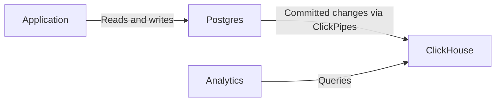

import { BetaBadge } from "/snippets/ja/components/BetaBadge/BetaBadge.jsx";

<BetaBadge link="https://clickhouse.com/cloud/postgres" galaxyTrack={true} galaxyEvent="docs.managed-postgres.overview-beta" />

ClickHouse Managed Postgres は、パフォーマンスとスケールを重視して設計された、エンタープライズ向けのマネージド Postgres サービスです。コンピュートと物理的に同じ場所に配置された NVMe ストレージを基盤としており、EBS のようなネットワーク接続型ストレージを使用する代替手段と比べて、ディスクI/Oが律速となるワークロードで最大 10 倍高速なパフォーマンスを実現します。

Citus Data、Heroku、Microsoft で世界最高水準の Postgres を提供してきた実績を持つ創業チームによる [Ubicloud](https://www.ubicloud.com/) との協業で構築された ClickHouse Managed Postgres は、急成長するアプリケーションでよく課題となる、インジェストや更新の遅延、低速なバキューム、テールレイテンシの増大、そしてディスク IOPS の制約によって引き起こされる WAL スパイクといったパフォーマンス上の問題を解決します。

## トランザクションにはPostgres、分析にはClickHouse {#transactions-and-analytics}

注文の作成、在庫の更新、ユーザーアカウントの管理といったトランザクション型のアプリケーションワークロード (OLTP) にはPostgresを使用します。Postgresはシステム・オブ・レコード (信頼できる記録元) であり、関連する変更をトランザクション内でまとめてコミットまたはロールバックできます。

アプリケーションで大規模なデータセットに対する分析も必要になった場合は、ClickHouseサービスを追加し、ClickPipesで両者を接続します。

1. アプリケーションは Postgres で運用データの読み書きを行い、関連する変更をトランザクションでまとめます。
2. [ClickPipes を設定](/ja/products/managed-postgres/clickhouse-integration)して、選択したテーブルを ClickHouse にコピーし、コミット済みの挿入・更新・削除をCDC (変更データキャプチャ) で継続的にレプリケーションします。
3. 分析クエリは ClickHouse で実行します。ClickHouse に直接接続することも、[`pg_clickhouse`](/ja/products/managed-postgres/extensions/pg_clickhouse/introduction) 拡張機能を使って Postgres から ClickHouse のテーブルをクエリすることもできます。

レプリケーションは非同期であるため、分析結果は Postgres でコミットされた変更よりも遅れる場合があります。2 つのデータベースはトランザクション境界が別々であり、CDC (変更データキャプチャ) も `pg_clickhouse` も Postgres と ClickHouse にまたがる共通のトランザクションは提供しません。最新のコミット済みアプリケーション状態を必要とする読み取りには、Postgres を使用してください。

まずは Postgres だけで始め、必要になった時点で ClickHouse を追加するという進め方も可能です。両方のサービスを試すには [ClickHouse Managed Postgres のクイックスタート](/ja/products/managed-postgres/quickstart)に従ってください。すでに Postgres サービス をお持ちの場合は、[分析機能の追加](/ja/products/managed-postgres/quickstart#part-2)から始めてください。

## NVMe による高性能 {#nvme-performance}

多くのマネージド Postgres サービスでは、Amazon EBS のようなネットワーク接続型ストレージを使用しているため、ディスクアクセスのたびにネットワーク往復が発生します。これによりミリ秒単位のレイテンシが生じ、IOPS も制限されるため、書き込み負荷の高いワークロードや I/O 集約型のワークロードではボトルネックになります。

ClickHouse Managed Postgres では、データベースと同じサーバーに物理的に接続された NVMe ストレージを使用します。このアーキテクチャ上の違いにより、次の利点が得られます。

* **ミリ秒ではなく、マイクロ秒レベルのディスクレイテンシ**
* **ネットワークのボトルネックなしで、持続 IOPS 上限が 10 倍***
* **同じコストで、ディスク I/O が律速となるワークロードで最大 10 倍高速なパフォーマンス**

Postgres ワークロードで主な制約がディスク IOPS とレイテンシにある場合、これによりインジェストの高速化、バキュームの迅速化、テールレイテンシの低減、そして高負荷時でもより安定したパフォーマンスが得られます。

<Note>
  NVMe ディスク上での Postgres の速度については、[パフォーマンスベンチマーク](https://clickhouse.com/blog/postgresbench)をご覧ください。
</Note>

AWS におけるローカル NVMe の上限については、[Memory optimized](https://docs.aws.amazon.com/ec2/latest/instancetypes/mo.html#mo_instance-store)、[Storage optimized](https://docs.aws.amazon.com/ec2/latest/instancetypes/so.html#so_instance-store)、[CPU optimized](https://docs.aws.amazon.com/ec2/latest/instancetypes/gp.html#gp_instance-store)をご覧ください。GCP については、[Local SSD disks](https://cloud.google.com/compute/docs/disks/local-ssd)をご覧ください。

## サポートされているクラウドプロバイダー {#supported-cloud-providers}

ClickHouse Managed Postgres は、以下のクラウドプロバイダーで利用できます。

| クラウドプロバイダー | 提供状況            |
| ---------- | --------------- |
| AWS        | Public Beta     |
| GCP        | Private Preview |

<Note>
  GCP 上の ClickHouse Managed Postgres は Private Preview の段階です。GCP Private Preview のウェイトリストへの登録は[こちら](https://clickhouse.com/cloud/postgres#gcp-waitlist)から行えます。詳細は[アナウンス](https://clickhouse.com/blog/postgres-managed-by-clickhouse-gcp-private-preview)をご覧ください。
</Note>

## ネイティブな ClickHouse 連携 {#clickhouse-integration}

ClickHouse Managed Postgres は ClickHouse とネイティブに連携しており、複雑な ETL パイプラインを使わずに、トランザクション処理と分析を一体化できます。

### Postgres から ClickHouse へのレプリケーション {#postgres-replication}

[ClickPipes の Postgres CDC (変更データキャプチャ) コネクタ](/ja/integrations/clickpipes/postgres/index)を使用すると、Postgres のデータを ClickHouse にレプリケートできます。このコネクタは、初期ロードと継続的な増分同期の両方に対応しており、毎月数百テラバイト規模の移行を行う数百社のエンタープライズ顧客の実運用で実証されています。

### pg_clickhouse: 統合クエリレイヤー {#pg-clickhouse}

すべてのClickHouse Managed Postgresインスタンスには [`pg_clickhouse`](https://github.com/ClickHouse/pg_clickhouse) 拡張機能が付属しており、PostgresからClickHouseに直接クエリを実行できます。これにより、アプリケーションは複数のデータベースに接続することなく、トランザクション処理と分析の両方に対する統合クエリレイヤーとしてPostgresを利用できます。

この拡張機能は、効率的に実行できるよう、フィルター、JOIN、セミジョイン、集計、関数を含む幅広いクエリをClickHouseにプッシュダウンできます。現時点では、TPC-Hの22クエリ中14クエリが完全にプッシュダウンされており、同じクエリを標準のPostgresで実行した場合と比べて、60倍を超えるパフォーマンス向上を実現しています。

## エンタープライズ向けの高い信頼性 {#enterprise-reliability}

ClickHouse Managed Postgres は、本番環境のワークロードに求められる信頼性とセキュリティ機能を備えています。

### 高可用性 {#high-availability}

クォーラムベースのレプリケーションを使用して、異なるアベイラビリティゾーンに最大 2 つのスタンバイレプリカを構成できます。これらのスタンバイは高可用性と自動フェイルオーバー専用であり、障害発生時にもデータベースが迅速に復旧できるようにします。読み取りをスケーリングするには、別途 [読み取りレプリカ](/ja/products/managed-postgres/read-replicas) をプロビジョニングできます。構成の詳細については、[高可用性](/ja/products/managed-postgres/high-availability) ページを参照してください。

### バックアップとリカバリ {#backups}

各インスタンスには自動バックアップが含まれており、フォークとポイントインタイム リカバリに対応しています。バックアップには、フルバックアップとオブジェクトストレージへの継続的な WAL アーカイブを処理する、広く使われているオープンソースツール [WAL-G](https://github.com/wal-g/wal-g) を採用しています。

### セキュリティとコンプライアンス {#security-compliance}

ClickHouse Managed Postgres は、ClickHouse Cloud と同等のセキュリティ基準を満たすよう設計されています。

* **認証**: SAML/SSO をサポート
* **ネットワークセキュリティ**: IP 許可リスト、保存時および転送時の暗号化 (TLS 1.3)
* **アクセス制御**: データベース管理のための superuser 権限へのフルアクセス

### オープンソースの基盤 {#open-source}

Postgres と ClickHouse はどちらも、大規模で活発なコミュニティに支えられたオープンソースのデータベースです。`pg_clickhouse` 拡張機能や、PeerDB を利用した CDC レプリケーションを含むインテグレーションの各コンポーネントも、同様にオープンソースです。この基盤により、ベンダーロックインを回避し、データスタックを全面的に管理しながら、長期的な柔軟性を確保できます。