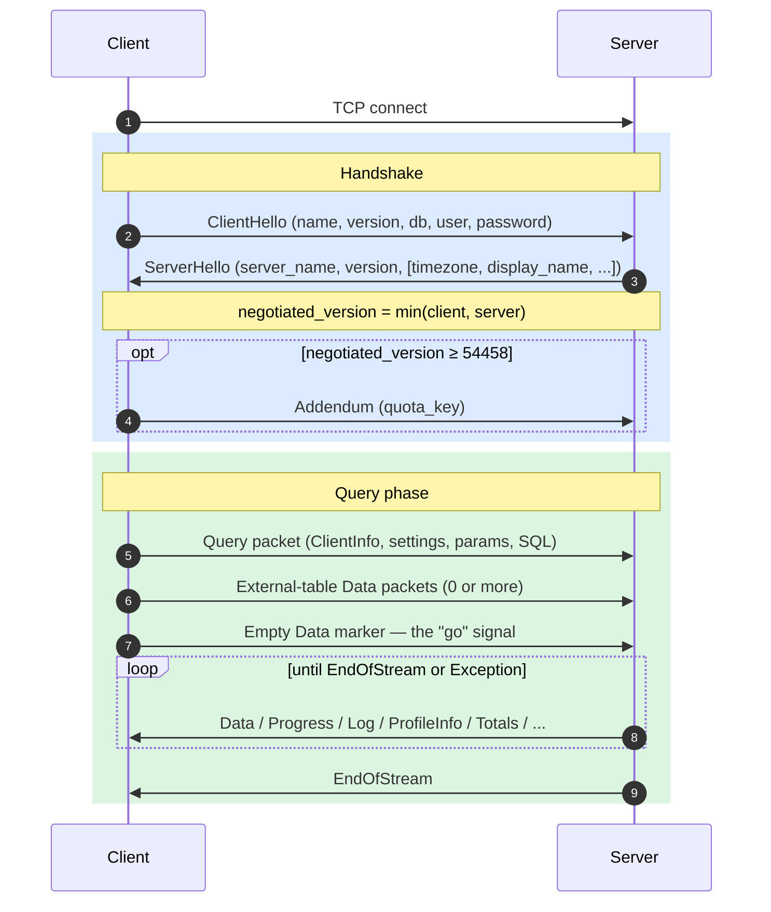
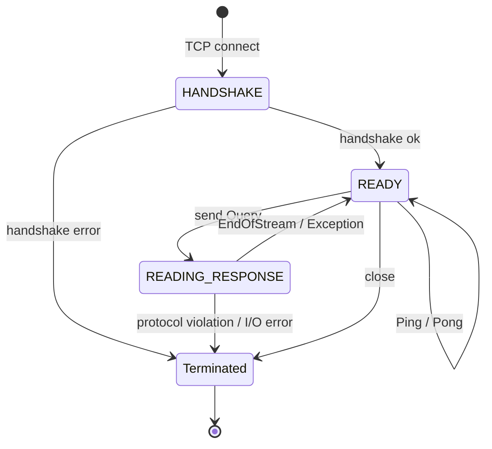
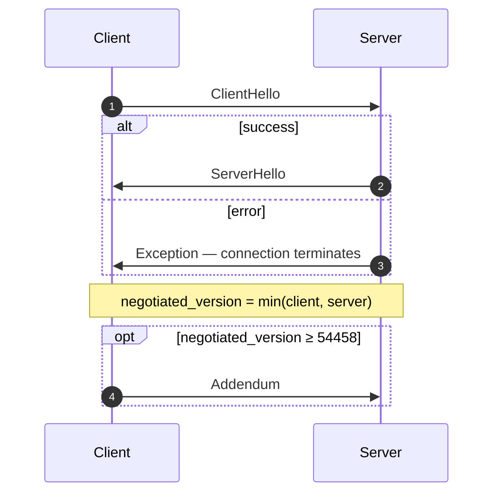
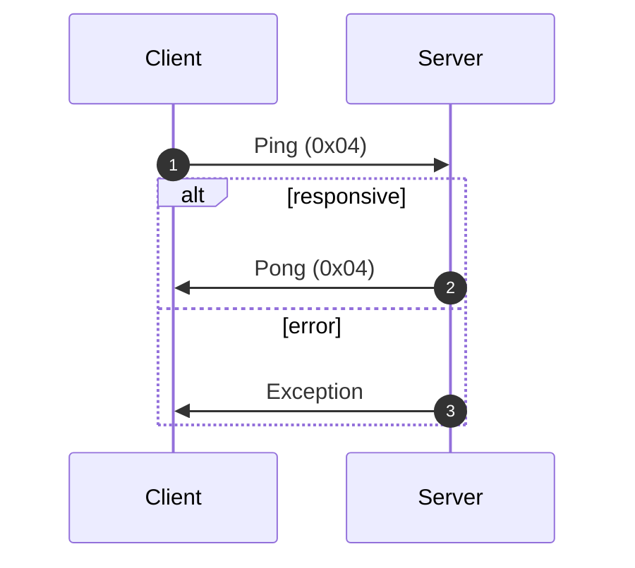
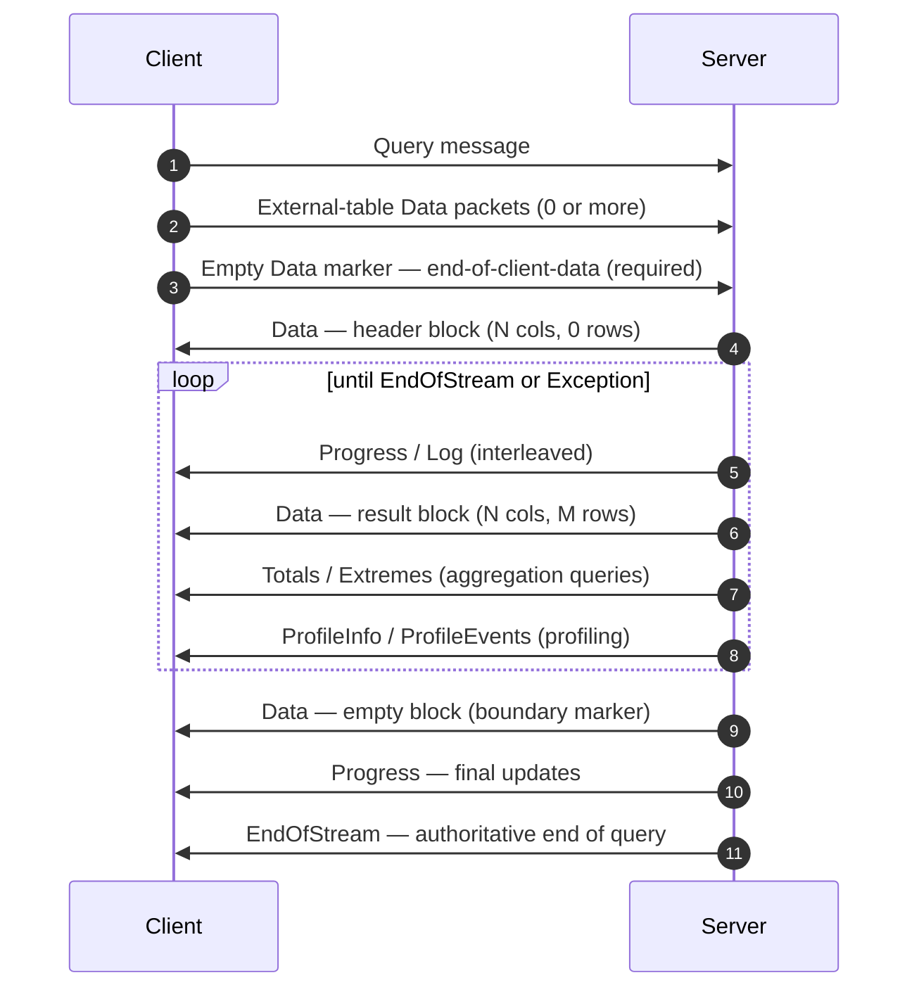
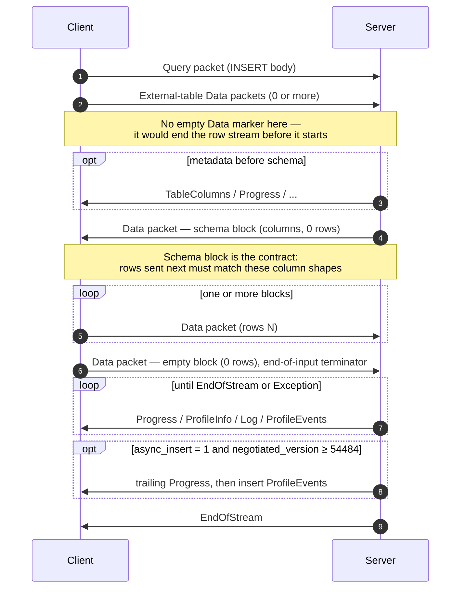
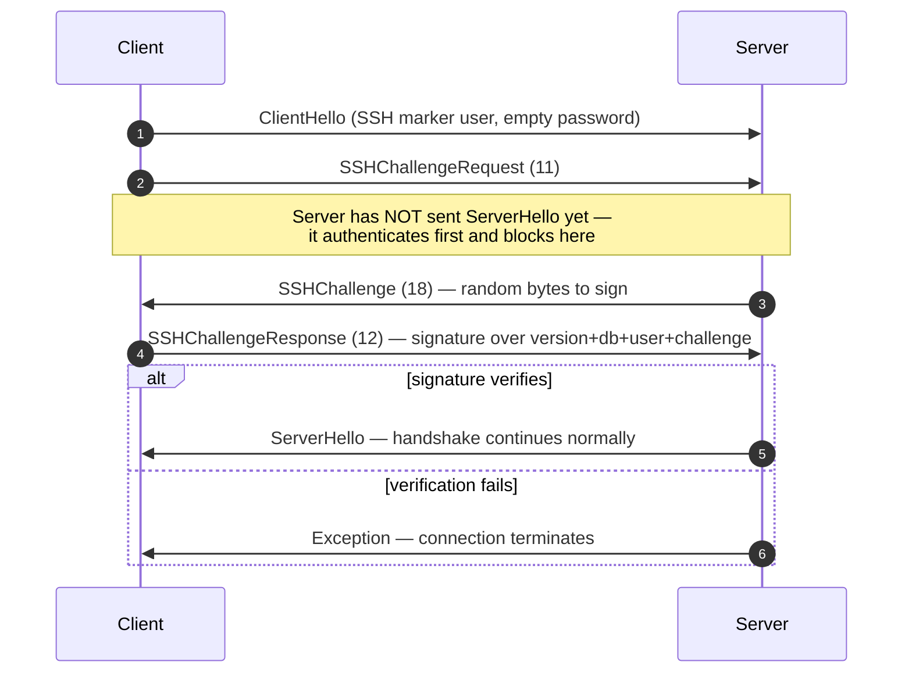

ネイティブプロトコルは、ClickHouse のクライアントとサーバーが TCP 上で通信する際に用いる、バイナリ形式かつコネクション指向のプロトコルです。SQL クエリ、結果データ、`INSERT` のペイロード、実行時のテレメトリー、エラー通知を伝送します。コマンドラインクライアント、C++ ドライバー、および大半のサードパーティ製ネイティブドライバーは、このプロトコルを使用しています。

このページでは、プロトコルそのもの、すなわちパケットのフレーミング、接続のステートマシン、バージョンネゴシエーション、および `Block` 以外のすべてのメッセージのボディについて説明します。`Data` 系パケット内部のバイト列 (`Block`、そのカラム、および型ごとのエンコーディング) は別個のトピックとして、[Native Format](/ja/resources/develop-contribute/native-protocol/format) 仕様で説明しています。

<Info>
  **対となる仕様**

  このページは 2 部構成の仕様の一方であり、対となる [Native Format](/ja/resources/develop-contribute/native-protocol/format) 仕様とあわせて公開されています。2 つの仕様の役割は明確に分かれており、このページはパケット層とトランスポート層を、Native Format 仕様は `Data` 系パケット内部のバイト列を扱います。
</Info>

プロトコル全体を通じて、いくつかの特性が共通して成り立ちます。プロトコルはバイナリかつ位置依存です。`BlockInfo` の内部を除いてフィールドタグは存在しないため、1 バイトでも位置がずれると、それ以降のすべてのデータが正しく解釈できなくなります。また、プロトコルはステートフルであり、各 TCP 接続は一度に 1 つのクエリしか処理しません。多重化はサポートされていません。固定長整数はリトルエンディアンで表現されます。

## 概要 {#overview}

| プロパティ     | 値                                                                                     |
| --------- | ------------------------------------------------------------------------------------- |
| トランスポート   | TCP (必要に応じて TLS でラップ可能)                                                               |
| バイト順序     | 固定長整数はリトルエンディアン                                                                       |
| エンコーディング  | バイナリかつ位置依存 (`BlockInfo` を除きフィールドタグなし)                                                 |
| 接続モデル     | ステートフル、同時に実行できるクエリは 1 つのみ、多重化なし                                                       |
| バージョニング   | ハンドシェイク時にネゴシエートされ、個々の機能の利用可否はバージョンによって決まる                                             |
| データフォーマット | すべての表形式データに [Native Format](/ja/resources/develop-contribute/native-protocol/format) を使用 |

wire 上のすべてのメッセージは、`VarUInt` 型のパケットタイプコードで始まり、その後にボディが続きます。ボディの構造は、そのコードとネゴシエートされたプロトコルバージョンによって決まります。

接続は 3 つのフェーズで進行します。最初に一回限りのハンドシェイクを行い、続いて `Ping` または `Query` のやり取りを任意の回数行い、最後に接続を閉じます。



ネイティブ TCP プロトコルは、SQL に `FORMAT` 句が指定されているかどうかにかかわらず、表形式のデータを常に Native フォーマットで送信します。`RowBinary`、`CSV`、`JSON` などへの再フォーマットはクライアント側の処理であり、Native ブロックをデコードした後に行われます。(HTTP インターフェイスは別のコードパスで処理され、こちらでは `FORMAT` 句が*実際に*反映されます。HTTP については本ドキュメントの対象外です。)

## セキュリティ {#security}

### トランスポートセキュリティ (TLS) {#transport-security}

TLS はプロトコルより下位のトランスポート層で動作します。TLS を有効にすると TCP ストリーム全体が暗号化されますが、プロトコルメッセージ自体は TLS を使用するかどうかにかかわらず、バイト単位で完全に同一です。

### 認証 {#authentication}

認証はハンドシェイク中の [`ClientHello`](#clienthello) メッセージで行われます。`user` フィールドと `password` フィールドは平文の文字列として送信されるため、転送時の認証情報はトランスポート層の暗号化 (TLS) によって保護する必要があります。

`user` フィールドが空の場合、サーバーはこれを設定済みのデフォルトセッションユーザーとして解釈します。デフォルトセッションユーザーは `default_session_user` サーバー設定 (デフォルト値は `default`) で指定され、`protocols` セクションでリスナーごとに上書きすることもできます。サーバーでデフォルトセッションユーザーが空に設定されている場合、またはサーバーのバージョンが 26.8 より前の場合、空の `user` フィールドは例外を返して拒否されます。なお、`clickhouse-client` が空のユーザー名を送信することはありません。クライアント側で `default` に置き換えて送信します。

SSH チャレンジレスポンス認証は、プロトコルバージョン 54466 以降で利用できます。詳しくは [SSH チャレンジレスポンス認証](#ssh-authentication) を参照してください。

### サーバー間通信用のシークレット {#inter-server-secret}

分散クエリ実行では、各サーバーは共有シークレットを知っていることを証明することで相互に認証します。その際、シークレット自体が wire 上に送出されることはありません。各 Query は、[`Query`](#query) のフィールド 4 に 32 バイトの SHA-256 `auth_hash` を保持します。この値はソルト、ノンス、設定済みのシークレット、およびクエリから計算され、受信側のサーバーが同じ計算を行って照合します。この仕組みが有効かどうかは、`INTERSERVER_SECRET` 機能 (v54441) によって決まります。外部クライアントは、このフィールドに常に空文字列を送信します。詳細は [Inter-server authentication](#inter-server-authentication) を参照してください。

## バージョニングと機能ゲート {#versioning-and-feature-gates}

### バージョンネゴシエーション {#version-negotiation}

クライアントとサーバーは、ハンドシェイク時にそれぞれがサポートする最大のプロトコルバージョンを宣言します。**ネゴシエート済みバージョン**は、両者のうち小さい方になります。

```text
negotiated_version = min(client_version, server_version)
```

以降のすべてのメッセージでは、ネゴシエートされたバージョンに応じて、wire 上にどのフィールドが含まれるかが決まります。

### 機能ゲート {#feature-gates}

各機能は、その機能を導入したプロトコルバージョンによって識別され、ネゴシエートされたバージョンがその番号以上である場合に**有効**になります。

<Warning>
  機能が有効な場合、そのフィールドは wire 上に**必ず**含まれている必要があります。プロトコルは厳密に位置依存であるため、機能ゲートで制御されるフィールドを省略すると、それ以降のすべてのフィールドについてバイトストリームが破損します。
</Warning>

### 機能一覧 {#feature-table}

| 機能                                                           | バージョン | 影響範囲                             | wire への影響                                                                                                                                                                                                                                                                                                                                                                                                                                                                                                       |
| ------------------------------------------------------------ | ----- | -------------------------------- | --------------------------------------------------------------------------------------------------------------------------------------------------------------------------------------------------------------------------------------------------------------------------------------------------------------------------------------------------------------------------------------------------------------------------------------------------------------------------------------------------------------- |
| BLOCK&#95;INFO                                               | all   | Block                            | すべての Block に BlockInfo プレフィックス (`is_overflows`, `bucket_number`) を追加します。                                                                                                                                                                                                                                                                                                                                                                                                                                        |
| CLIENT&#95;INFO                                              | 54032 | Query                            | Query ボディに ClientInfo ブロックを追加します。                                                                                                                                                                                                                                                                                                                                                                                                                                                                               |
| TIMEZONE                                                     | 54058 | ServerHello                      | ServerHello に `timezone` フィールドを追加します。                                                                                                                                                                                                                                                                                                                                                                                                                                                                           |
| QUOTA&#95;KEY&#95;IN&#95;CLIENT&#95;INFO                     | 54060 | ClientInfo                       | ClientInfo に `quota_key` フィールドを追加します。                                                                                                                                                                                                                                                                                                                                                                                                                                                                           |
| DISPLAY&#95;NAME                                             | 54372 | ServerHello                      | ServerHello に `display_name` フィールドを追加します。                                                                                                                                                                                                                                                                                                                                                                                                                                                                       |
| VERSION&#95;PATCH                                            | 54401 | ServerHello, ClientInfo          | 両方に `version_patch` フィールドを追加します。                                                                                                                                                                                                                                                                                                                                                                                                                                                                                |
| SERVER&#95;LOGS                                              | 54406 | Log                              | `send_logs_level` が設定されている場合、サーバーは Log パケットを送信します。                                                                                                                                                                                                                                                                                                                                                                                                                                                              |
| COLUMN&#95;DEFAULTS&#95;METADATA                             | 54410 | TableColumns                     | サーバーは、INSERT/input スキーマブロックの前に、カラムのデフォルト値メタデータを含む [`TableColumns`](#tablecolumns) パケット (type 11) を送信することがあります。送信されるのは、ネゴシエートされたバージョンが 54410 以上**かつ** `input_format_defaults_for_omitted_fields` が有効な場合に限られます。このバージョン未満ではこのパケットは一切送信されないため、クライアントはこれを待機してはいけません。                                                                                                                                                                                                                                                 |
| WRITE&#95;CLIENT&#95;INFO                                    | 54420 | Progress                         | Progress に `wrote_rows` と `wrote_bytes` を追加します。(名前とは異なり、ClientInfo ブロックの有無を制御するものでは**ありません**。それを制御するのは `CLIENT_INFO` (v54032) です。)                                                                                                                                                                                                                                                                                                                                                                              |
| SETTINGS&#95;SERIALIZED&#95;AS&#95;STRINGS                   | 54429 | Query (設定のエンコーディング)              | 常に送信される設定リストの**エンコード方法**を変更します。設定を送信するかどうかを制御するものでは**ありません**。v54429 以降では各設定を `(name, flags, value-as-string)` として書き込み、それより古いピアはフラグなしの `(name, type-specific-binary-value)` として書き込みます。[Setting](#setting) を参照してください。                                                                                                                                                                                                                                                                                             |
| INTERSERVER&#95;SECRET                                       | 54441 | Query                            | Query にサーバー間通信用の `auth_hash` フィールドを追加します。これは生のシークレットではなく、クラスターシークレットからソルト付きで計算した SHA-256 です。外部クライアントは空文字列を送信します。[サーバー間認証](#inter-server-authentication) を参照してください。                                                                                                                                                                                                                                                                                                                                              |
| OPEN&#95;TELEMETRY                                           | 54442 | ClientInfo                       | ClientInfo に OpenTelemetry のトレースコンテキストを追加します。                                                                                                                                                                                                                                                                                                                                                                                                                                                                   |
| DISTRIBUTED&#95;DEPTH                                        | 54448 | ClientInfo                       | ClientInfo に `distributed_depth` フィールドを追加します。                                                                                                                                                                                                                                                                                                                                                                                                                                                                   |
| INITIAL&#95;QUERY&#95;START&#95;TIME                         | 54449 | ClientInfo                       | `initial_time` フィールド (Int64、固定長) を追加します。                                                                                                                                                                                                                                                                                                                                                                                                                                                                        |
| PROFILE&#95;EVENTS                                           | 54451 | ProfileEvents                    | サーバーはクエリ実行中に ProfileEvents パケットを送信します。                                                                                                                                                                                                                                                                                                                                                                                                                                                                          |
| PARALLEL&#95;REPLICAS                                        | 54453 | ClientInfo                       | ClientInfo に並列レプリカの調整用フィールドを追加します。                                                                                                                                                                                                                                                                                                                                                                                                                                                                              |
| CUSTOM&#95;SERIALIZATION                                     | 54454 | Block (Column)                   | 各カラムの型文字列の後に `has_custom_serialization` バイトを追加します。                                                                                                                                                                                                                                                                                                                                                                                                                                                              |
| ADDENDUM                                                     | 54458 | Handshake                        | クライアントはハンドシェイク完了後に addendum (`quota_key`) を送信します。                                                                                                                                                                                                                                                                                                                                                                                                                                                               |
| PARAMETERS                                                   | 54459 | Query                            | Query ボディにパラメーターリストを追加します。                                                                                                                                                                                                                                                                                                                                                                                                                                                                                      |
| SERVER&#95;QUERY&#95;TIME&#95;IN&#95;PROGRESS                | 54460 | Progress                         | Progress に `elapsed_ns` フィールドを追加します。                                                                                                                                                                                                                                                                                                                                                                                                                                                                            |
| PASSWORD&#95;COMPLEXITY&#95;RULES                            | 54461 | ServerHello                      | ServerHello に、パスワードポリシーの正規表現パターンと、それに対応する説明メッセージのリストを追加します。                                                                                                                                                                                                                                                                                                                                                                                                                                                     |
| INTERSERVER&#95;SECRET&#95;V2                                | 54462 | ServerHello                      | ServerHello に 8 バイトの `UInt64` ノンスを追加します。サーバー間のクエリ署名に使用されるもので、外部クライアントはデコードしたうえで無視します。                                                                                                                                                                                                                                                                                                                                                                                                                           |
| TOTAL&#95;BYTES&#95;IN&#95;PROGRESS                          | 54463 | Progress                         | Progress の `total_rows` と `wrote_rows` の間に `total_bytes_to_read` (VarUInt) フィールドを追加します。                                                                                                                                                                                                                                                                                                                                                                                                                         |
| TIMEZONE&#95;UPDATES                                         | 54464 | TimezoneUpdate                   | `TimezoneUpdate` サーバーパケット (type 17) を追加します。ボディ: セッションのタイムゾーンを格納する単一の `String`。`input` テーブル関数のイニシエーターのみが、input スキーマブロックの直後に送信します。これにより、クライアントは送信する行をサーバーの `session_timezone` に基づいてパースします。[TimezoneUpdate](#timezoneupdate) を参照してください。                                                                                                                                                                                                                                                                            |
| SPARSE&#95;SERIALIZATION                                     | 54465 | Block (Column)                   | サーバーは `has_custom_serialization = 1` を設定し、スパースエンコードされたカラムを送信することがあります。wire フォーマット: 1 バイトの kind (0x01 = SPARSE)、次に EOG で終端される VarUInt オフセットストリーム、最後に内部型で密にエンコードされた非デフォルト値が続きます。[kind&#95;stack とスパースエンコーディング](/ja/resources/develop-contribute/native-protocol/format#kind-stack-and-sparse-encoding) を参照してください。                                                                                                                                                                                                    |
| SSH&#95;AUTHENTICATION                                       | 54466 | Auth flow                        | SSH チャレンジレスポンス認証を追加します。オプトイン方式で、クライアントが `" SSH KEY AUTHENTICATION " + <real_user>` 形式の `user` と空のパスワードを送信すると有効になります。[SSH チャレンジレスポンス認証](#ssh-authentication) を参照してください。                                                                                                                                                                                                                                                                                                                                          |
| TABLE&#95;READ&#95;ONLY&#95;CHECK                            | 54467 | TablesStatusResponse             | TablesStatusResponse の各テーブルの行に `is_readonly` フラグを追加します。`TablesStatusRequest` を発行しない外部クライアントでは、wire 上の変更はありません。                                                                                                                                                                                                                                                                                                                                                                                                  |
| SYSTEM&#95;KEYWORDS&#95;TABLE                                | 54468 | system tables                    | 標準の `clickhouse-client` がキーワードを補完できるよう、サーバーが `system.keywords` にデータを格納します。ネイティブプロトコルの wire に変更はありません。                                                                                                                                                                                                                                                                                                                                                                                                           |
| ROWS&#95;BEFORE&#95;AGGREGATION                              | 54469 | ProfileInfo                      | ProfileInfo の末尾に `applied_aggregation` (Bool) と `rows_before_aggregation` (VarUInt) をこの順序で追加します。                                                                                                                                                                                                                                                                                                                                                                                                                |
| CHUNKED&#95;PROTOCOL                                         | 54470 | Connection framing               | パケット単位の chunk フレーミングで、すべてのパケットボディをラップします。ネゴシエーションは Addendum で行われます。ServerHello は送受信の各方向に対するサーバーの希望を伝え、Addendum はクライアントの最終的な選択を伝えます。[chunk フレーミング](#chunked-framing) を参照してください。                                                                                                                                                                                                                                                                                                                                  |
| VERSIONED&#95;PARALLEL&#95;REPLICAS&#95;PROTOCOL             | 54471 | ServerHello, Addendum            | 双方が `VarUInt` の並列レプリカ協調プロトコルバージョンを交換します。ServerHello のフィールドは **`protocol_version` の直後** (`timezone` の前) に配置されます。Addendum のフィールドは chunked プロトコルの文字列の後に追加されます。現在の値: `8` (`DBMS_PARALLEL_REPLICAS_PROTOCOL_VERSION`) 。バージョン `8` では [`MergeTreeAllRangesAnnouncementResponse`](#mergetreeallrangesannouncementresponse) (クライアントパケット `14`) が追加されます。ネゴシエートされた並列レプリカバージョンが `≥ 8` の場合、イニシエーターは `Default` 以外のモードのフォロワーから届く各アナウンスに対し、そのストリームの正式なパーツリストで応答します。フォロワーはこの応答を受け取ってから読み取りリクエストを発行します。`8` 未満では、アナウンスは送りっぱなしになります。 |
| INTERSERVER&#95;EXTERNALLY&#95;GRANTED&#95;ROLES             | 54472 | Query                            | Query 本体の、設定の終端子と interserver シークレットのハッシュの間に `String external_roles` フィールドを追加します。外部クライアントは空のロールリスト (1 バイトの `0x00`、すなわち String エンベロープ内の VarUInt 0) を送信します。                                                                                                                                                                                                                                                                                                                                                       |
| V2&#95;DYNAMIC&#95;AND&#95;JSON&#95;SERIALIZATION            | 54473 | カラム本体                            | サーバーは `Dynamic` および `JSON` カラム型に対して V2 シリアライゼーションを出力する場合があります。このバージョンによって、これらの型が使用する `state_prefix` のバージョンが決まります。[バージョン付き型](/ja/resources/develop-contribute/native-protocol/format#versioned-types)を参照してください。                                                                                                                                                                                                                                                                                                     |
| SERVER&#95;SETTINGS                                          | 54474 | ServerHello                      | サーバーは、デフォルト以外の設定をリストとして ServerHello の末尾 (`nonce` の後) で通知します。フォーマット: 空のキーで終端される `(key, flags, value)` の三つ組で、Query パケットの設定リストと同じです。                                                                                                                                                                                                                                                                                                                                                                               |
| QUERY&#95;AND&#95;LINE&#95;NUMBERS                           | 54475 | ClientInfo                       | ClientInfo の末尾に `script_query_number` (VarUInt) と `script_line_number` (VarUInt) を追加します。clickhouse-client が複数ステートメントのスクリプトでエラー箇所を特定するために使用します。外部クライアントは `0, 0` を送信します。                                                                                                                                                                                                                                                                                                                                          |
| JWT&#95;IN&#95;INTERSERVER                                   | 54476 | ClientInfo                       | ClientInfo の末尾に JWT の有無を示す UInt8 と、省略可能な `String jwt` を追加します。外部クライアント (JWT なし) はバイト `0x00` を送信します。 (C++ では `DBMS_MIN_REVISON_WITH_JWT_IN_INTERSERVER` と表記されています。定数名にタイプミスがある点に注意してください。)                                                                                                                                                                                                                                                                                                                        |
| QUERY&#95;PLAN&#95;SERIALIZATION                             | 54477 | ServerHello, QueryPlan パケット      | ServerHello のサーバー設定の後に `VarUInt query_plan_serialization_version` を追加します。また、事前構築されたクエリプランをサーバー間で受け渡すための `ClientPacket::QueryPlan` (コード `13`) も導入されます。外部クライアントがこれを送信することはありません。クエリプランのシリアライゼーションバージョン `10` では、シリアライズされたプランの先頭に `VarUInt max_threads` と `Bool concurrency_control` が付加されます。いずれかがデフォルト以外の場合、イニシエーターはバージョン `10` 未満のピアに対して SQL 送信を使用し、ピアは送信されたクエリ設定からプランを構築します。                                                                                                                                      |
| PARALLEL&#95;BLOCK&#95;MARSHALLING                           | 54478 | Block (Column)                   | サーバーは並列処理のために、カラムを `ColumnBLOB` (インラインで圧縮) でラップする場合があります。これはクエリで圧縮が有効、かつ `rows > 1` の場合に限られ、それ以外の場合は通常のカラムの wire フォーマットが適用されます。送信する Query パケットで圧縮を一切有効にしないクライアントでは、wire 上の変化はありません。                                                                                                                                                                                                                                                                                                                             |
| VERSIONED&#95;CLUSTER&#95;FUNCTION&#95;PROTOCOL              | 54479 | ServerHello                      | ServerHello の末尾に `VarUInt cluster_function_protocol_version` を追加します。`*Cluster` テーブル関数 (`s3Cluster` など) で使用されます。現在の値: `8` (`DBMS_CLUSTER_PROCESSING_PROTOCOL_VERSION`) 。バージョン `7` は非公開リポジトリの機能 (Iceberg コンパクション) 用に予約されています。`8` では、サーバー間クラスター読み取りタスクのペイロード (`ReadTaskResponse` 本体。本ドキュメントでは仕様を定めていません。後述を参照) に、省略可能な `read_source_index` が追加されます。外部クライアントはデコードしたうえで無視します。                                                                                                                                        |
| OUT&#95;OF&#95;ORDER&#95;BUCKETS&#95;IN&#95;AGGREGATION      | 54480 | BlockInfo                        | BlockInfo のフィールドタグ付きストリームにフィールド 3 (`out_of_order_buckets: Vec<Int32>`) を追加します。`[VarUInt count][Int32]*count` としてデコードされます。外部クライアント自身がこれを出力することはありませんが、デコーダーはサーバーから送られた空でないリストをすべて読み取ります。                                                                                                                                                                                                                                                                                                                         |
| COMPRESSED&#95;LOGS&#95;PROFILE&#95;EVENTS&#95;COLUMNS       | 54481 | Log, ProfileEvents, TableColumns | サーバーは [`Log`](#log)、[`ProfileEvents`](#profileevents)、[`TableColumns`](#tablecolumns) のパケット本体を[圧縮フレーム](/ja/resources/develop-contribute/native-protocol/format#compression-frame)でラップする場合があります。このバージョンでは 3 つの本体すべてが同じ「圧縮可能な」出力経路を通り、クエリで `compression = true` が指定されている場合にのみ実際の圧縮フレームになります。送信する Query パケットで圧縮を一切有効にしないクライアントでは、wire 上の変化はありません。                                                                                                                                                                     |
| REPLICATED&#95;SERIALIZATION                                 | 54482 | Block (Column)                   | サーバーは kind&#95;stack `0x04 = REPLICATED` (繰り返し値向けの辞書形式のコンパクトな表現) を持つカラムを出力する場合があります。[kind&#95;stack とスパースエンコーディング](/ja/resources/develop-contribute/native-protocol/format#kind-stack-and-sparse-encoding)を参照してください。このバージョン未満では、ライターはこうしたカラムを展開してから送信していました。デコードはインデックス参照 (行ごとに `elements[indexes[i]]`) で行います。リーフ型に加え、`Nullable`/`Array`/`Tuple`/`Map`/`Nested`/`LowCardinality` の内部型がサポートされます。                                                                                                                    |
| NULLABLE&#95;SPARSE&#95;SERIALIZATION                        | 54483 | Block (Column)                   | スパースシリアライゼーションを `Nullable(T)` と組み合わせます。このバージョン未満では、ライターは Nullable カラムのスパースを展開してから送信していました。v54483 以降では、wire データは Nullable 上のスパースになります。[kind&#95;stack とスパースエンコーディング](/ja/resources/develop-contribute/native-protocol/format#kind-stack-and-sparse-encoding)を参照してください。                                                                                                                                                                                                                                              |
| PROGRESS&#95;IN&#95;ASYNC&#95;INSERT                         | 54484 | Progress (INSERT)                | **非同期** INSERT (`async_insert = 1`) では、挿入がフラッシュされると、サーバーは `EndOfStream` の前に追加の [`Progress`](#progress) パケットを送信し、続いてその挿入の `ProfileEvents` を送信します。これは*ネゴシエートされた*バージョンが 54484 以上の場合に限られ、それ未満ではサーバーはこの末尾の Progress を省略します。Progress の wire フォーマット自体は変わらず、新たに送信されるようになった点のみが異なります。実際には、この増分には経過時間が含まれ、書き込まれた行数のカウンターは付随する ProfileEvents で報告されます。途中に挟まる Progress をすでに読み捨てているクライアントであれば、フォーマットを変更する必要はなく、パケットが 1 つ増えることを許容するだけで済みます。                                                                                    |
| CLIENT&#95;AGENT&#95;IN&#95;CLIENT&#95;INFO                  | 54485 | ClientInfo                       | ClientInfo の末尾に `client_agent` `String` を追加します。公式クライアントは環境からエージェント識別子 (例: `claude-code`、`cursor`、`gemini-cli`、または `AGENT` 変数の値) を自動検出します。何も検出されなかった外部クライアントは空文字列を送信します。ネゴシエートされたバージョンが 54485 以上の場合は必須で、省略すると Query パケットの以降の部分がずれて正しく解釈されなくなります。                                                                                                                                                                                                                                                                 |
| INTERNAL&#95;QUERY&#95;FLAG                                  | 54486 | ClientInfo                       | ClientInfo の末尾に `is_internal` `UInt8` を追加します。サーバー内部のクエリ (ユーザーが発行したものではないクエリ) では `1` となり、この値はリモートクエリにも伝播されるため、それらの `system.query_log` の行は内部クエリとしてラベル付けされます。外部クライアントは `0` を送信します。ネゴシエートされたバージョンが 54486 以上の場合は必須で、省略すると Query パケットの以降の部分がずれて正しく解釈されなくなります。                                                                                                                                                                                                                                                         |
| INTERSERVER&#95;CURRENT&#95;ROLES                            | 54488 | ClientInfo                       | ClientInfo の末尾に省略可能な String リスト `current_roles` (`[UInt8 present]`、`1` の場合は続けて `[VarUInt count][String]*count`) を追加し、サーバー間クエリでは `auth_hash` の対象をシリアライズされたリストまで拡張します。イニシエーターのアクティブな (有効な) ロール名を伝えることで、セカンダリノードはユーザーのデフォルトロールにフォールバックすることなく、同じように行ポリシーを適用できます。値が設定されるのはサーバー間クエリで、かつ `push_external_roles_in_interserver_queries = 1` の場合のみです。外部クライアントは `0` (なし) を送信します。ネゴシエートされたバージョンが 54488 以上の場合は必須で、有無を示すバイトを省略すると Query パケットの以降の部分がずれて正しく解釈されなくなります。                                                          |
| CURRENT&#95;AGGREGATION&#95;VARIANT&#95;SELECTION&#95;METHOD | 54489 | 集約 (2 レベルのバケット)                  | 単一の `String` キーに対する集約方式は `enable_packed_string_keys_in_aggregation` に従います。このリビジョン未満のピアは常に packed 方式を使用し、この設定を認識しないため、そのピアと 2 レベルのバケットをやり取りすると、同じキーが異なるバケットに配置されてしまいます。そのためイニシエーターは、こうしたピアに対しては安全側に倒した動作をとり、そのピア向けの 2 レベル化のしきい値をゼロにしたうえで、単一レベルのブロックを自身で再バケット化します。方式は同一リリース内でも変わり得るため、比較にはピアのバージョンではなくリビジョンを使用します。ネイティブプロトコルの wire には変更はありません。                                                                                                                                                                    |
| HTTP&#95;HANDLER&#95;IN&#95;CLIENT&#95;INFO                  | 54490 | ClientInfo                       | ClientInfo の **HTTP** 分岐の `http_referer` の直後に、`http_handler_name` と `http_request_url` (いずれも `String`) を追加します。これらは一致した SQL 定義の HTTP ハンドラーの名前とリクエスト URL を伝えるもので、分散ハンドラークエリでもリモートシャード上の `currentHandler`/`currentRequestURL`、および `system.query_log` の `http_handler_name`/`http_request_url` カラムに値が設定されるようにします。`query_interface = HTTP` の場合にのみ書き込まれます (ハンドラー以外の HTTP クエリでは空文字列) 。ネゴシエートされたバージョンが 54490 以上の場合は必須で、省略すると Query パケットの以降の部分がずれて正しく解釈されなくなります。                                                         |
| QUANTILE&#95;DETERMINISTIC&#95;SKIP&#95;DEGREE               | 54491 | Block (Column)                   | `AggregateFunction(quantileDeterministic, ...)` (およびその `quantiles`/`median` 表記) のステートバージョンを `0` から `1` に引き上げ、シリアライズされた各ステートの末尾に `UInt8 skip_degree` を追加します。変更されるのはこの 1 つの集約関数のステートペイロードのみです。カラムのフレーミングは変わらず、他の集約関数もそれぞれ独自のバージョンを維持します。このリビジョン未満ではライターがバージョン `0` のステートを出力するため、古いピアには影響しません。                                                                                                                                                                                                                      |
| STRING&#95;WITH&#95;SIZE&#95;STREAM&#95;SERIALIZATION        | 54492 | Block (Column)                   | `String` カラムのレイアウトが、値ごとに長さを前置する形式から、累積バイトオフセットを別ストリームで持つ形式 (`Array` と同じオフセットレイアウト) に切り替わり、`[UInt64 × num_rows offsets][data blob]` としてそのまま送信されます。この動作はネゴシエートされたリビジョンによって決まり、54492 未満ではライターは値ごとの長さプレフィックスを使用します。wire 上にはこれを示すカラムごとのマーカーはなく、両ピアともリビジョンのみから判断します。[String カラムのレイアウト](/ja/resources/develop-contribute/native-protocol/format#string-type)を参照してください。                                                                                                                                                    |

## パケットエンベロープ {#packet-envelope}

wire 上のすべてのメッセージは、送信・受信のどちらの方向でも、同じ外側の構造を持ちます。

```text
[VarUInt: packet_type_code]    always encoded as VarUInt
[message body]                 format depends on packet_type_code
```

パケットタイプの一覧表は、[パケットタイプリファレンス](#packet-type-reference)にまとめています。

パケットタイプは固定幅のバイトではなく、`VarUInt` です。値が 128 未満であれば `VarUInt` でも同じ 1 バイトになりますが、将来パケットタイプが 128 以上になった場合にも互換性を保てるよう、実装では必ず `VarUInt` エンコーディングを使用してください。

[メッセージリファレンス](#message-reference)では、各パケットの**ボディ**(パケットタイプコードに続くバイト列)のみを記載しています。フィールド番号は、ボディの最初のフィールドを 1 として振られます。

### チャンク化フレーミング (v54470+) {#chunked-framing}

`CHUNKED_PROTOCOL` 機能が**ネゴシエート**されると ([ハンドシェイク](#handshake-phase)を参照) 、wire 上のすべてのパケットはチャンク化フレーミングでラップされます。このラップは**方向ごと**に適用されます。クライアント→サーバーとサーバー→クライアントはそれぞれ個別にネゴシエートされるため、方向によって異なるモード (チャンク化または非フレーム化) になることがあります。

パケットごとのワイヤレイアウト:

```text
<chunk>...   one or more chunks; their payloads concatenated form the whole packet
[u32 LE = 0] zero-size terminator marking end of packet
```

chunk ごとのワイヤレイアウト：

```text
[u32 LE: chunk_size]   chunk_size in [1, UINT32_MAX]
[chunk_size bytes]     packet bytes (see note below)
```

パケットタイプの `VarUInt` はチャンク化されたストリームの**内側**にあります。つまり、フレーミングの前に別途送信されるバイトではなく、パケットペイロードの先頭バイト (最初のchunkの先頭バイト) です。各パケットのchunkペイロードは、[パケットエンベロープ](#packet-envelope)で示した `[VarUInt packet_type_code][message body]` 全体です。クライアントがパケットタイプをチャンク化されたストリームの外側に置くと、ピアはそのタイプバイトを `u32` chunkサイズの先頭バイトとして読み取ってしまい、接続の同期が崩れます。

ライターのバッファがパケットの途中で満杯になると、1つのパケットが複数のchunkに分割されることがあります。分割位置は任意で、パケットタイプの `VarUInt` の途中で分割されることもあります。リーダーはchunkペイロードを連結し、末尾の4バイトのゼロを透過的なパケット境界として扱います。つまり、このゼロは消費されますが、パケットボディを読み取る側には渡されません。

ボディを持たないパケットもラップされます。`Ping` や `Pong` のような1バイトのパケットは、チャンク化がネゴシエートされると `[u32 size = 1][0x04][u32 0]` になります。このページの他の箇所にある「wire上で1バイト」という記述は、チャンク化前の形式を指しています。

**ネゴシエーション。** ServerHello と Addendum は、それぞれ方向ごとに1つずつ、計2つの `String` フィールドを持ちます。その値は `{"chunked", "notchunked", "chunked_optional", "notchunked_optional"}` のいずれかです。

* `chunked` / `notchunked` は厳格な指定です。その側は必ずそのモードを要求します。
* `_optional` バリアントは柔軟な指定です。相手側が選択したモードをどちらでも受け入れます。

各方向の合意値は、ペアごとに次のように決定されます。

| サーバー側の設定           | クライアント側の設定         | 合意値                                       |
| ------------------ | ------------------ | ----------------------------------------- |
| `*_optional`       | 任意の値               | CLIENT に従う (その `starts_with("chunked")`)  |
| 任意の値               | `*_optional`       | SERVER に従う                                |
| `chunked` (厳格)     | `chunked` (厳格)     | `chunked`                                 |
| `notchunked` (厳格)  | `notchunked` (厳格)  | `notchunked`                              |
| 厳格同士の不一致           | 厳格同士の不一致           | **プロトコルエラー** — 接続を必ず切断しなければなりません          |

クライアント側では、クライアントの SEND 設定がサーバーの RECV 設定と照合されてネゴシエートされます。逆方向も同様です。

**タイミング。** ネゴシエーション文字列は、フレーミングされていないwire上でやり取りされます (ClientHello → ServerHello (サーバーの設定)  → Addendum (クライアントがネゴシエートした値) ) 。フレーミングの切り替えは、Addendum がflushされた*後*に送信されるすべてのバイトに適用されます。Addendum 自体、ClientHello、ServerHello は常にフレーミングなしで送信されます。

## 接続のライフサイクル {#connection-lifecycle}

接続は常に、`HANDSHAKE`、`READY`、`READING_RESPONSE`、終了済みの 4 つの状態のうち、いずれか 1 つにあります。このプロトコルは多重化に対応していないため、クライアントが前のレスポンスを読み切る前に新しいリクエストを送信すると、wire 上でバイトが入り混じり、ストリームが破損します。

### 状態 {#states}



正常系の経路は `HANDSHAKE → READY → READING_RESPONSE → READY` と上から下へまっすぐ進みます。`Ping`/`Pong` は自己ループとなり、失敗時の遷移はすべて単一の終端状態である `Terminated` に集約されます。

| 状態                 | 説明                                                                                                                                                                                                                                                                                                                                                              |
| ------------------ | --------------------------------------------------------------------------------------------------------------------------------------------------------------------------------------------------------------------------------------------------------------------------------------------------------------------------------------------------------------- |
| `HANDSHAKE`        | TCP 接続が確立された直後の初期状態です。[ハンドシェイク](#handshake-phase) のメッセージのみが有効です。成功すると `READY` に遷移し、失敗すると接続が終了します。                                                                                                                                                                                                                                                               |
| `READY`            | アイドル状態です。クライアントは [Ping](#ping-phase) または [Query](#query-phase) を送信するか、接続を閉じることができます。接続は `READY` のまま無期限に維持できます (ただし `idle_connection_timeout` の制約を受けます。[接続の制限](#connection-limits) を参照)。この状態で `Data` (2) または `Scalar` (7) パケットを受信するとプロトコル違反となり、サーバーはパケットボディをデコードせず、事前に `Exception` パケットも送信せずに接続を終了します。ボディが未読のまま残るため、クライアント側では正常なクローズではなく TCP リセットとして観測される場合があります。 |
| `READING_RESPONSE` | クライアントが Query を送信すると、この状態に移行します。クライアントは `READY` に戻る前に、サーバーのレスポンスストリームを最後まで読み切る必要があります。この状態でクライアントからサーバーへ送信できるパケットは Cancel のみです (Cancel の仕様はこのページでは扱いません)。                                                                                                                                                                                                       |
| Terminated         | 以降、この接続は使用できません。クライアントは新しい TCP 接続を開き、ハンドシェイクからやり直す必要があります。                                                                                                                                                                                                                                                                                                      |

### ハンドシェイクフェーズ {#handshake-phase}

認証を行い、プロトコルバージョンをネゴシエートします。このフェーズは、各接続において他のどの処理よりも先に、1 回だけ実行されます。

TCP 接続が確立された直後で、まだメッセージは一切やり取りされていない状態です。処理の流れは次のとおりです。



1. クライアントは、自身がサポートする最大のプロトコルバージョンを指定して [`ClientHello`](#clienthello) を送信します。

2. クライアントはレスポンスを読み取り、パケットタイプに応じて処理を振り分けます。

   | パケットタイプ         | 動作                                                                                                           |
   | --------------- | ------------------------------------------------------------------------------------------------------------ |
   | `Hello` (0)     | [`ServerHello`](#serverhello) をデコードします。`negotiated_version = min(client_ver, server_ver)` を計算し、ステップ 3 に進みます。 |
   | `Exception` (2) | [`Exception`](#exception) をデコードします。エラーとして返し、接続を終了します。                                                        |
   | それ以外            | プロトコル違反です。接続を終了します。                                                                                          |

3. `negotiated_version ≥ 54458` (`ADDENDUM` 機能) の場合、クライアントは [`Addendum`](#addendum) を送信します。この判定は、クライアントが宣言したバージョンではなく、**ネゴシエート後**のバージョンに基づいて行われます。

成功した場合、接続は `READY` に遷移します。エラーが発生した場合は、接続が終了します。

### Ping フェーズ {#ping-phase}

TCP キープアライブとは独立した、アプリケーションレベルの死活確認です。Ping/Pong の往復が成功すれば、TCP 接続が双方向で有効であり、サーバーが応答可能であることを確認できます。Ping はステートレスで、どのクエリとも関連付けられないため、連続して送信される複数の Ping は互いに独立しています。

`READY` 状態から開始した場合のフローは次のとおりです。



1. クライアントは [`Ping`](#ping) を送信します。
2. クライアントはレスポンスを読み取ります。

   | パケットタイプ         | アクション                                        |
   | --------------- | -------------------------------------------- |
   | `Pong` (4)      | 接続の生存を確認し、`READY` に戻ります。                     |
   | `Exception` (2) | [`Exception`](#exception) をデコードし、エラーとして返します。 |
   | その他             | プロトコル違反として扱います。                              |

### クエリフェーズ {#query-phase}

クライアントが SQL ステートメントを送信すると、サーバーは結果ブロックと実行テレメトリーをストリーミングで返します。レスポンスは一連のパケットで構成され、最後は必ず 1 つの `EndOfStream` または `Exception` で終わります。

`READY` 状態から始まるフローは次のとおりです。



いずれかの時点でエラーが発生した場合、サーバーは `EndOfStream` の代わりに `Exception` を送信し、クエリはそこで終了します。

1. クライアントは、一意の `query_id` (通常は UUID) を付与した [`Query`](#query) を送信します。
2. クライアントは外部テーブルがあればそれらを送信し、続いて空の Data マーカーを送信します。空の Data パケットは `table_name = ""`、`num_columns = 0`、`num_rows = 0` です。サーバーはこのマーカーを受信するまでクエリの実行を開始しません。外部テーブルは、同じ `table_name` を持つ複数の `Data` パケットに分割して送信できます。この場合、最初のパケットでテーブルのスキーマが確定し、同じ名前を持つ以降のパケットはすべて、同じカラム名と型を同じ順序で含んでいる必要があります。そうでない場合、サーバーは `INCORRECT_DATA` でクエリを拒否します ([Data](#data) を参照) 。
3. クライアントは `READING_RESPONSE` に遷移し、書き込みバッファを flush します。
4. クライアントはループでレスポンスパケットを読み取り、種別に応じて処理を振り分けます。

   | パケットタイプ              | 処理                                                                                                      |
   | -------------------- | ------------------------------------------------------------------------------------------------------- |
   | `Data` (1)           | ブロックをデコードします。最初の Data はスキーマヘッダー、以降は結果ブロック (蓄積する) です。空のブロックは境界マーカーです。`num_rows == 0` はクエリの終了を意味**しません**。 |
   | `Progress` (3)       | 実行メトリクス。各パケットは前回からの**増分**なので、ローカルで累積します。                                                                |
   | `EndOfStream` (5)    | クエリ完了。ループを抜けて `READY` に戻ります。                                                                            |
   | `ProfileInfo` (6)    | 実行後のプロファイリングデータ。                                                                                        |
   | `Totals` (7)         | 集約の totals ブロック (Data と同じワイヤ形式) 。                                                                       |
   | `Extremes` (8)       | 最小値/最大値のブロック (Data と同じワイヤ形式) 。                                                                          |
   | `Log` (10)           | サーバーログの 1 行。                                                                                            |
   | `TableColumns` (11)  | カラムのデフォルト値に関するメタデータ。                                                                                    |
   | `ProfileEvents` (14) | パフォーマンスカウンター。                                                                                           |
   | `Exception` (2)      | デコードしてエラーとして返します。ループを抜けて `READY` に戻ります。                                                                 |
   | 上記以外                 | クエリフェーズ中には想定されていません。接続を終了します。                                                                           |

`EndOfStream` を受信した場合、または `Exception` を処理した場合、接続は `READY` に戻ります。プロトコル違反や I/O エラーが発生した場合は接続が終了します。

<Note>
  `num_rows == 0` のケースは、新たに実装する際につまずきやすいポイントです。行数ゼロのブロックは境界マーカーまたはスキーマヘッダーであり、ストリーム終了のシグナルではありません。レスポンスを終了させるのは `EndOfStream` または `Exception` だけです。
</Note>

### INSERT フェーズ {#insert-phase}

INSERT フェーズは、[クエリフェーズ](#query-phase)に 2 つのやり取りを加えたものです。クライアントが `INSERT` ステートメントを送信すると、サーバーはターゲットテーブルの構造を記述した**スキーマブロック**を返します。クライアントは行を格納した Data パケットをストリーミング送信し、最後に空の Data マーカーを送信します。サーバーは `EndOfStream` または `Exception` を返して処理を完了します。

`READY` 状態から開始し、SQL には `INSERT INTO <table> [(<cols>)] VALUES` 形式の `INSERT` を使用します。行データは Data パケットで送られるため、インラインの `VALUES (...)` リテラルは記述しません。処理の流れは次のとおりです。



1. クライアントは、`body` に INSERT SQL を設定した [`Query`](#query) を送信します。
2. クライアントは外部テーブルがあればそれを送信します (INSERT ではまれです) 。[クエリフェーズ](#query-phase)とは異なり、ここでは空の Data マーカーを**送信しません**。`INSERT` の `Query` パケットは保留中のデータを伴って送信されるため、データ終端を示す空のブロックの送信はステップ 5 まで遅延されます。スキーマブロックより前にこれを送信すると、サーバーはそれを行ストリームの終端と解釈して行なしで INSERT を完了し、その後に届く最初の実際の行パケットを、想定外のトップレベルパケットとして解析してしまいます。
3. クライアントは、スキーマ Data パケット (行数は 0 だが、完全なカラム構造 (名前と型) を持つ Block) を読み取るまで、メタデータパケット (TableColumns、Progress、ProfileInfo、Log、ProfileEvents) を読み捨てます。スキーマブロックは契約として機能し、クライアントが次に送信する行はこれらのカラムの形状に一致しなければなりません。
4. クライアントはデータブロックを送信します。各ブロックについて、まず `VarUInt(ClientPacket::Data = 2)`、次に空の外部テーブル名として `String("")`、最後に Block を書き込みます。カラム型は、スキーマブロックのカラムと位置ごとに一致している必要があります。
5. クライアントは入力の終端を示すターミネーターとして、空の Block (0 カラム、0 行) を持つ Data パケットを送信します。
6. クライアントは、`EndOfStream` (成功) または `Exception` (失敗) を受信するまでレスポンスストリームを読み取ります。

**非同期挿入 (v54484 以降) 。** クエリに `async_insert = 1` が指定されている場合、サーバーは行をキューに入れ、バッチの一部として flush します。ネゴシエートされたバージョンが 54484 (`PROGRESS_IN_ASYNC_INSERT`) 以上の場合、flush の完了後にサーバーは追加の [`Progress`](#progress) パケットを送出し、その直後に挿入の `ProfileEvents`、続いて `EndOfStream` を送出します。54484 未満では、サーバーはこの末尾の Progress を送出しません。このパケットは通常の `Progress` ですが、サーバーは書き込みカウントを反映する前にクエリパイプラインをリセットするため、実際の増分には経過時間しか含まれず、書き込まれた行数とバイト数の統計は付随する `ProfileEvents` を通じてクライアントに届きます。ステップ 6 で途中に挟まる Progress をすでに読み取っているクライアントであれば、パケットをもう 1 つ受け入れるだけで対応できます。

接続は、`EndOfStream` または処理済みの `Exception` を受信すると `READY` に戻ります。プロトコル違反や I/O エラーが発生した場合、接続は終了します。

## メッセージリファレンス {#message-reference}

フィールドはwire上の順序で記載しています。`Type` カラムでは次の表記を使用します。

* `VarUInt` — 可変長の符号なし整数 ([VarUInt](/ja/resources/develop-contribute/native-protocol/format#varuint) を参照) 。
* `String` — VarUInt のプレフィックスが付いたバイト列 ([String](/ja/resources/develop-contribute/native-protocol/format#string) を参照) 。
* `UInt8`、`Int32` など — 固定幅のリトルエンディアン整数。
* `Bool` — 1 バイトで、値は `0x00` または `0x01`。

`Role` カラムは、各フィールドを使用する側を示します。

* **client** — 外部クライアントが設定します。
* **inter-server** — サーバー間通信でのみ意味を持ちます。外部クライアントはデフォルト値を書き込みます。
* **universal** — 双方で使用されます。

これらのテーブルに記載しているのは各パケットのボディのみで、パケットタイプコードより後の部分が対象です。

### ClientHello (パケットタイプ 0) {#clienthello}

Client → Server。TCP 接続の確立直後に最初に送信されるメッセージです。

| # | フィールド                | 型       | ロール       | 説明                                                                                                                                      |
| - | -------------------- | ------- | --------- | --------------------------------------------------------------------------------------------------------------------------------------- |
| 1 | client&#95;name      | String  | universal | クライアント識別子 (例: `"clickhouse-client"`)                                                                                                    |
| 2 | version&#95;major    | VarUInt | universal | クライアントのメジャーバージョン                                                                                                                        |
| 3 | version&#95;minor    | VarUInt | universal | クライアントのマイナーバージョン                                                                                                                        |
| 4 | protocol&#95;version | VarUInt | universal | クライアントがサポートするプロトコルバージョンの最大値                                                                                                             |
| 5 | database             | String  | universal | デフォルトのデータベース名                                                                                                                           |
| 6 | user                 | String  | universal | 認証に使用するユーザー名。空の場合は、サーバーのデフォルトセッションユーザー (サーバー設定 `default_session_user`) が使用されます (26.8 より古いサーバーでは拒否されます) 。[認証](#authentication)を参照してください。 |
| 7 | password             | String  | universal | パスワード (平文)                                                                                                                              |

### ServerHello (パケットタイプ 0) {#serverhello}

Server → Client。認証に成功した場合に ClientHello への応答として送信されます。

| #  | フィールド                                          | 型         | ロール          | 条件                                                        | 説明                                                                                                                                                                                                                                                                          |
| -- | ---------------------------------------------- | --------- | ------------ | --------------------------------------------------------- | --------------------------------------------------------------------------------------------------------------------------------------------------------------------------------------------------------------------------------------------------------------------------- |
| 1  | server&#95;name                                | String    | universal    | 常時                                                        | サーバー識別子                                                                                                                                                                                                                                                                     |
| 2  | version&#95;major                              | VarUInt   | universal    | 常時                                                        | サーバーのメジャーバージョン                                                                                                                                                                                                                                                              |
| 3  | version&#95;minor                              | VarUInt   | universal    | 常時                                                        | サーバーのマイナーバージョン                                                                                                                                                                                                                                                              |
| 4  | protocol&#95;version                           | VarUInt   | universal    | 常時                                                        | サーバーのプロトコルバージョン                                                                                                                                                                                                                                                             |
| 4a | parallel&#95;replicas&#95;protocol&#95;version | VarUInt   | universal    | VERSIONED&#95;PARALLEL&#95;REPLICAS&#95;PROTOCOL (v54471) | サーバーの parallel-replicas 協調プロトコルのバージョン。**wire 上の位置: `protocol_version` の直後**、`timezone` の前。現在値: `8`。                                                                                                                                                                         |
| 5  | timezone                                       | String    | universal    | TIMEZONE (v54058)                                         | サーバーのタイムゾーン (例: `"UTC"`)                                                                                                                                                                                                                                                    |
| 6  | display&#95;name                               | String    | universal    | DISPLAY&#95;NAME (v54372)                                 | 人間が読める形式のサーバー名                                                                                                                                                                                                                                                              |
| 7  | version&#95;patch                              | VarUInt   | universal    | VERSION&#95;PATCH (v54401)                                | サーバーのパッチバージョン                                                                                                                                                                                                                                                               |
| 8  | proto&#95;send&#95;chunked&#95;srv             | String    | universal    | CHUNKED&#95;PROTOCOL (v54470)                             | サーバーが希望する送信方向の チャンク化。`"chunked"`、`"notchunked"`、`"chunked_optional"`、`"notchunked_optional"` のいずれか。[チャンク化フレーミング](#chunked-framing) を参照してください。**バージョンゲートはこちらの方が高いものの、wire 上では `password_complexity_rules` より前に配置されます。**                                               |
| 9  | proto&#95;recv&#95;chunked&#95;srv             | String    | universal    | CHUNKED&#95;PROTOCOL (v54470)                             | サーバーが希望する受信方向の チャンク化。取り得る値はフィールド 8 と同じです。                                                                                                                                                                                                                                |
| 10 | password&#95;complexity&#95;rules              | Rule[]    | universal    | PASSWORD&#95;COMPLEXITY&#95;RULES (v54461)                | サーバーのパスワードポリシー。`VarUInt count` の後に `count × Rule` が続きます。詳細は後述します。                                                                                                                                                                                                           |
| 11 | nonce                                          | UInt64    | inter-server | INTERSERVER&#95;SECRET&#95;V2 (v54462)                    | 8 バイト LE のランダムな nonce。サーバー間クエリ署名方式で使用されます。外部クライアントは (ストリームの位置を揃えるため) これをデコードしなければならず (MUST)、値は無視すべきです (SHOULD)。                                                                                                                                                             |
| 12 | server&#95;settings                            | Setting[] | universal    | SERVER&#95;SETTINGS (v54474)                              | サーバーがブロードキャストする、デフォルト以外の設定。形式: 0 個以上の `(String key, VarUInt flags, String value)` の三つ組が続き、空のキーで終端します。[Query パケットの設定リスト](#setting)と同じ形式です。                                                                                                                                   |
| 13 | query&#95;plan&#95;serialization&#95;version   | VarUInt   | universal    | QUERY&#95;PLAN&#95;SERIALIZATION (v54477)                 | サーバーがサポートするクエリプランのシリアル化バージョン。外部クライアントはデコードして無視します。                                                                                                                                                                                                                          |
| 14 | cluster&#95;function&#95;protocol&#95;version  | VarUInt   | universal    | VERSIONED&#95;CLUSTER&#95;FUNCTION&#95;PROTOCOL (v54479)  | サーバーの `*Cluster` テーブル関数のプロトコルバージョン。現在値: `8`。この値によって、サーバー間のクラスター読み取りタスクのペイロード (本仕様では規定しない `ReadTaskResponse` ボディ) に追加されるフィールドが決まります。バージョン `7` は非公開リポジトリの機能 (Iceberg のコンパクション) 用に予約されており、`8` では任意の `read_source_index` が追加されます。外部クライアントはクラスター読み取りに関与しないため、このフィールドはデコードして無視します。 |

**Rule** — `password_complexity_rules` の要素:

| # | フィールド   | 型      | 説明                                     |
| - | ------- | ------ | -------------------------------------- |
| 1 | pattern | String | 要件を満たすパスワードが一致すべき正規表現パターン。             |
| 2 | message | String | パスワードがこのルールを満たさない場合に表示される、人間が読める形式の説明。 |

このリストはサーバー運用者が設定したパスワードポリシーを反映したもので、あくまで参考情報です。サーバーはハンドシェイク中にこれらのルールを適用しません。パスワードの変更・設定機能を提供するクライアントは、要件を満たさないパスワードをサーバーに送信する前に、これらのルールを使ってエラーを検出できます。

<Note>
  悪意のあるサーバーや設定に誤りのあるサーバーによるリソースの過剰消費を防ぐため、デコードした `count` は最大 256 エントリ、各 `pattern` および `message` の String は最大 4096 バイトに制限してください。パスワードポリシーが設定されていないサーバーでは、通常 `count` は `0` (後続のペアなし) です。
</Note>

### Addendum (パケットタイプなし) {#addendum}

Client → Server。`ADDENDUM` (v54458) が有効な場合に送信されます。ハンドシェイクのやり取りが完了した直後に送信されます。これは独立したパケットタイプではなく、各フィールドはパケットタイプを示すバイトのプレフィックスを付けずに、生のまま wire 上に送出されます。

| # | フィールド                                          | 型       | ロール        | 条件                                                        | 説明                                                                                                                                 |
| - | ---------------------------------------------- | ------- | --------- | --------------------------------------------------------- | ---------------------------------------------------------------------------------------------------------------------------------- |
| 1 | quota&#95;key                                  | String  | universal | 常に                                                        | サーバー側のキー付きクォータで使用されるリソースクォータキー。キー付きクォータを使用しないクライアントは空文字列を送信します。                                                                    |
| 2 | proto&#95;send&#95;chunked                     | String  | universal | CHUNKED&#95;PROTOCOL (v54470)                             | クライアントがネゴシエートしたアウトバウンドの チャンク化方式 (`"chunked"` または `"notchunked"`) 。ServerHello の `proto_recv_chunked_srv` と照合して決定されます。            |
| 3 | proto&#95;recv&#95;chunked                     | String  | universal | CHUNKED&#95;PROTOCOL (v54470)                             | クライアントがネゴシエートしたインバウンドの チャンク化方式。`proto_send_chunked_srv` と照合して決定されます。                                                             |
| 4 | parallel&#95;replicas&#95;protocol&#95;version | VarUInt | universal | VERSIONED&#95;PARALLEL&#95;REPLICAS&#95;PROTOCOL (v54471) | クライアントがサポートする parallel-replicas 協調プロトコルのバージョン。分散クエリに参加しない外部クライアントであっても、サーバーの互換性チェックを通過できるよう、有効なバージョン (現在は `8`) を送信すべきです (SHOULD) 。 |

チャンク化フレーミングへの切り替えは、この Addendum が flush された*後*に適用されます。Addendum 自体はフレーミングされません。

### Ping (パケットタイプ 4) {#ping}

Client → Server。ボディはありません。チャンク化フレーミング適用前のパケットは、1 バイトの `0x04` のみで構成されます。チャンク化がネゴシエートされている場合、このバイトは 1 バイトのペイロードを持つ chunk として送信されます ([チャンク化フレーミング](#chunked-framing)を参照) 。

### Pong (パケットタイプ 4) {#pong}

Server → Client。ボディはありません。チャンク化フレーミングの適用前、このパケットは 1 バイトの `0x04` のみで構成されます。チャンク化がネゴシエートされている場合、このバイトが chunk の 1 バイトのペイロードになります ([チャンク化フレーミング](#chunked-framing)を参照) 。

### Exception (パケットタイプ 2) {#exception}

Server → Client。いずれかのフェーズでサーバー側にエラーが発生した際に送信されます。

| # | フィールド                     | 型      | ロール        | 説明                                      |
| - | ------------------------- | ------ | --------- | --------------------------------------- |
| 1 | code                      | Int32  | universal | エラーコード                                  |
| 2 | name                      | String | universal | 例外クラス (例: `"DB::Exception"`)            |
| 3 | message                   | String | universal | 人間が読める形式のエラーメッセージ                       |
| 4 | stack&#95;trace           | String | universal | サーバー側のスタックトレース                          |
| 5 | has&#95;nested (obsolete) | Bool   | universal | 互換性維持用の廃止されたバイト。サーバーは常に `false` を書き込みます |

### Query (パケットタイプ 1) {#query}

Client → Server。

| #  | フィールド              | 型           | ロール           | 条件                                                        | 説明                                                                                                                                                                                                                                                          |
| -- | ------------------ | ----------- | ------------ | --------------------------------------------------------- | ----------------------------------------------------------------------------------------------------------------------------------------------------------------------------------------------------------------------------------------------------------- |
| 1  | query&#95;id       | String      | universal    | 常に                                                        | 一意のクエリ識別子 (UUID)                                                                                                                                                                                                                                            |
| 2  | client&#95;info    | ClientInfo  | universal    | CLIENT&#95;INFO (v54032)                                  | [ClientInfo](#clientinfo) を参照                                                                                                                                                                                                                               |
| 3  | settings           | Setting[]   | universal    | 常に                                                        | [Setting](#setting) を参照。**常に存在します** (空のキーで終端)。バージョンによって切り替わるのは各設定の*エンコーディング*のみです。詳しくは [Setting](#setting) のエンコーディングに関する注記を参照してください。ネゴシエートされたバージョンが `54429` 未満の場合も、クライアントはこのフィールドを省略してはなりません。                                                                |
| 3a | external&#95;roles | String      | universal    | INTERSERVER&#95;EXTERNALLY&#95;GRANTED&#95;ROLES (v54472) | 外部から付与されたロール名のリストをシリアル化したもの。空のリストは、バイト `0x00` (VarUInt 0) を String エンベロープでラップしたものです (wire 上では `[VarUInt 1][0x00]`)。外部クライアントは常に空を送信します。                                                                                                                        |
| 4  | auth&#95;hash      | String      | inter-server | INTERSERVER&#95;SECRET (v54441)                           | サーバー間認証用のハッシュであり、生のクラスターシークレット**ではありません**。後述の [Inter-server authentication](#inter-server-authentication) を参照してください。外部クライアント (およびすべての `InitialQuery`) は空文字列を送信します。                                                                                          |
| 5  | stage              | VarUInt     | universal    | 常に                                                        | クエリ処理のステージ。`0` = FetchColumns、`1` = WithMergeableState、`2` = Complete、`3` = WithMergeableStateAfterAggregation、`4` = WithMergeableStateAfterAggregationAndLimit、`7` = QueryPlan。値 `3`/`4` は分散クエリで使用され、`7` はシリアル化されたクエリプランとともに送信されます。外部クライアントは通常 `2` を送信します。 |
| 6  | compression        | VarUInt     | universal    | 常に                                                        | 0 = 無効、1 = 有効                                                                                                                                                                                                                                               |
| 7  | query&#95;body     | String      | universal    | 常に                                                        | SQL テキスト                                                                                                                                                                                                                                                    |
| 8  | parameters         | Parameter[] | client       | PARAMETERS (v54459)                                       | [Parameter](#parameter) を参照。空のキーで終端します。                                                                                                                                                                                                                     |

### ClientInfo (Query に埋め込み) {#clientinfo}

Client → Server。Query ボディ (フィールド 2) に埋め込まれます。`CLIENT_INFO` (v54032) 以降で有効です。 (ClientInfo 内の一部のフィールドは、以下の各フィールドの説明に記載のとおり、さらに新しいバージョン以降でのみ有効です。)

| #  | フィールド                                 | 型                    | 役割        | 条件                                                       | 説明                                                                                                                                                                                                                                                                                                                                                                                                                                                                                                                                                                |
| -- | ------------------------------------- | -------------------- | --------- | -------------------------------------------------------- | ----------------------------------------------------------------------------------------------------------------------------------------------------------------------------------------------------------------------------------------------------------------------------------------------------------------------------------------------------------------------------------------------------------------------------------------------------------------------------------------------------------------------------------------------------------------- |
| 1  | query&#95;kind                        | UInt8                | universal | 常に                                                       | 0 = NoQuery、1 = InitialQuery、2 = SecondaryQuery。外部クライアントは `1` を送信します。                                                                                                                                                                                                                                                                                                                                                                                                                                                                                             |
| 2  | initial&#95;user                      | String               | universal | 常に                                                       | クエリを開始したユーザー                                                                                                                                                                                                                                                                                                                                                                                                                                                                                                                                                      |
| 3  | initial&#95;query&#95;id              | String               | universal | 常に                                                       | 元のクエリID                                                                                                                                                                                                                                                                                                                                                                                                                                                                                                                                                           |
| 4  | initial&#95;address                   | String               | universal | 常に                                                       | 発信元クライアントのソケットアドレス。サーバーがこの値を名前解決することはありません (ホスト名やサービス名のルックアップは行いません)。`SECONDARY_QUERY` の場合 (この値は保持され、`system.query_log` や Inter-server authentication などで使用されます)、受け付けられる書式は IPv4 の `a.b.c.d:port` または角括弧で囲んだ IPv6 の `[addr]:port` です。ホストは IP リテラル、ポートは `0..65535` の範囲の 10 進数でなければなりません。それ以外の形式 (例: `localhost:9000`、`host:http`、`:9000`、`/tmp/ch.sock` のような UNIX ソケットパスなど) は `INCORRECT_DATA` で拒否されます。`INITIAL_QUERY` の場合は、サーバーがこのフィールドを実際のピアアドレスで上書きするため、どのような値でも受け付けられます (単純な `ip:port` 形式でない値は、デフォルトの `0.0.0.0:0` に置き換えられます)。外部クライアントは自身の `ip:port` を送信してください。 |
| 5  | initial&#95;time                      | Int64                | クライアント    | INITIAL&#95;QUERY&#95;START&#95;TIME (v54449)            | クエリ開始時刻 (マイクロ秒) 。固定長8バイトで、VarUIntではありません                                                                                                                                                                                                                                                                                                                                                                                                                                                                                                                          |
| 6  | query&#95;interface                   | UInt8                | universal | 常に                                                       | 1 = TCP, 2 = HTTP                                                                                                                                                                                                                                                                                                                                                                                                                                                                                                                                                 |
| 7  | os&#95;user                           | String               | クライアント    | interface = TCP の場合                                      | OS のユーザー名                                                                                                                                                                                                                                                                                                                                                                                                                                                                                                                                                         |
| 8  | client&#95;hostname                   | String               | クライアント    | interface = TCP の場合                                      | クライアントマシンのホスト名                                                                                                                                                                                                                                                                                                                                                                                                                                                                                                                                                    |
| 9  | client&#95;name                       | String               | client    | interface = TCP の場合                                      | クライアントアプリケーション名                                                                                                                                                                                                                                                                                                                                                                                                                                                                                                                                                   |
| 10 | version&#95;major                     | VarUInt              | universal | インターフェイス = TCP の場合                                       | クライアントのメジャーバージョン                                                                                                                                                                                                                                                                                                                                                                                                                                                                                                                                                  |
| 11 | version&#95;minor                     | VarUInt              | universal | インターフェイス = TCP の場合                                       | クライアントのマイナーバージョン                                                                                                                                                                                                                                                                                                                                                                                                                                                                                                                                                  |
| 12 | protocol&#95;version                  | VarUInt              | universal | インターフェイス = TCP の場合                                       | 送信元クライアント自身の TCP プロトコルバージョン (`DBMS_TCP_PROTOCOL_VERSION`) であり、ネゴシエートされたバージョン**ではありません**。ピアのリビジョンによって決まるのは、どのフィールドが含まれるかだけです。この値はイニシエーターにコンパイル時に組み込まれたバージョンであるため、新しいクライアントが古いサーバーと通信する場合は、ネゴシエートされたリビジョン (サーバーのリビジョン) より大きくなることがあります。                                                                                                                                                                                                                                                                                                                              |
| 13 | quota&#95;key                         | String               | universal | QUOTA&#95;KEY&#95;IN&#95;CLIENT&#95;INFO (v54060)        | サーバー側のキー付きクォータで使用するリソースクォータキー。キー付きクォータを使用しないクライアントは空文字列を送信します。                                                                                                                                                                                                                                                                                                                                                                                                                                                                                                    |
| 14 | distributed&#95;depth                 | VarUInt              | サーバー間     | DISTRIBUTED&#95;DEPTH (v54448)                           | 分散クエリのネスト深度。外部クライアントは `0` を送信します。                                                                                                                                                                                                                                                                                                                                                                                                                                                                                                                                 |
| 15 | version&#95;patch                     | VarUInt              | universal | VERSION&#95;PATCH (v54401)、TCP のみ                        | クライアントのパッチバージョン                                                                                                                                                                                                                                                                                                                                                                                                                                                                                                                                                   |
| 16 | open&#95;telemetry                    |  (下記)                | クライアント    | OPEN&#95;TELEMETRY (v54442)                              | トレースコンテキスト。トレーシングを使用しないクライアントは `0` を送信します。                                                                                                                                                                                                                                                                                                                                                                                                                                                                                                                        |
| 17 | collaborate&#95;with&#95;initiator    | VarUInt              | サーバー間     | PARALLEL&#95;REPLICAS (v54453)                           | VarUInt で表した Bool 値です。外部クライアントは `0` を送信します。                                                                                                                                                                                                                                                                                                                                                                                                                                                                                                                       |
| 18 | count&#95;participating&#95;replicas  | VarUInt              | サーバー間     | PARALLEL&#95;REPLICAS (v54453)                           | 外部クライアントは `0` を送信します。                                                                                                                                                                                                                                                                                                                                                                                                                                                                                                                                             |
| 19 | number&#95;of&#95;current&#95;replica | VarUInt              | サーバー間     | PARALLEL&#95;REPLICAS (v54453)                           | 外部クライアントは `0` を送信します。                                                                                                                                                                                                                                                                                                                                                                                                                                                                                                                                             |
| 20 | script&#95;query&#95;number           | VarUInt              | クライアント    | QUERY&#95;AND&#95;LINE&#95;NUMBERS (v54475)              | 複数のステートメントを含むスクリプト内における、そのステートメントの位置 (1 始まり) 。外部クライアントは `0` を送信します。                                                                                                                                                                                                                                                                                                                                                                                                                                                                                               |
| 21 | script&#95;line&#95;number            | VarUInt              | クライアント    | QUERY&#95;AND&#95;LINE&#95;NUMBERS (v54475)              | 送信元スクリプト内の行番号 (1 始まり) 。外部クライアントは `0` を送信します。                                                                                                                                                                                                                                                                                                                                                                                                                                                                                                                      |
| 22 | jwt&#95;present                       | UInt8                | サーバー間     | JWT&#95;IN&#95;INTERSERVER (v54476)                      | `0` = JWT なし、`1` = 後続に JWT が続く。JWT 認証を使用しない外部クライアントは `0` を送信します。                                                                                                                                                                                                                                                                                                                                                                                                                                                                                                  |
| 23 | jwt                                   | String               | サーバー間     | JWT&#95;IN&#95;INTERSERVER (v54476)、jwt&#95;present=1の場合 | JWT Bearer トークン。フィールド 22 が `1` の場合のみ存在します。                                                                                                                                                                                                                                                                                                                                                                                                                                                                                                                        |
| 24 | client&#95;agent                      | String               | クライアント    | CLIENT&#95;AGENT&#95;IN&#95;CLIENT&#95;INFO (v54485)     | 末尾のフィールド。クライアントツール/エージェントの識別子で、環境から自動検出されます (例: `claude-code`、`cursor`、`gemini-cli`、または `AGENT` 環境変数) 。エージェントが検出されない外部クライアントは空文字列を送信します。ネゴシエートされたバージョンが 54485 以上の場合、通常の Query パスに含まれます (TCP に限らず、すべてのインターフェイスで送信されます) 。                                                                                                                                                                                                                                                                                                                                           |
| 25 | is&#95;internal                       | UInt8                | クライアント    | INTERNAL&#95;QUERY&#95;FLAG (v54486)                     | 末尾のフィールド。サーバー内部のクエリ (ユーザーが発行したものではないクエリ) の場合は `1` となります。この値はリモートクエリにも伝播され、`system.query_log` 上でそれらのクエリを内部クエリとして識別するために使われます。`query_kind` (フィールド 1) とは独立しています。外部クライアントは `0` を送信します。ネゴシエートされたバージョンが 54486 以上の場合に含まれます (TCP に限らず、すべてのインターフェイスで送信されます)。                                                                                                                                                                                                                                                                                                               |
| 26 | current&#95;roles                     | UInt8 [+ String リスト] | サーバー間     | INTERSERVER&#95;CURRENT&#95;ROLES (v54488)               | 末尾のフィールドです。`[UInt8 present]` の後に、`present = 1` の場合は、イニシエーターでアクティブ (有効) なロール名を格納した `[VarUInt count][String]*count` リストが続きます。これにより、セカンダリノードはユーザーのデフォルトロールではなく、イニシエーターのロールに基づいて行ポリシーを適用できます。値が設定されるのはサーバー間クエリで、かつ `push_external_roles_in_interserver_queries = 1` の場合のみです。それ以外の場合や外部クライアントでは `present = 0` となります。ネゴシエートされたバージョンが 54488 以上の場合、この存在フラグのバイトは必須です (TCP に限らず、すべてのインターフェイスで送信されます)。サーバー間クエリでは、シリアル化されたリストは `auth_hash` にも畳み込まれます ([Inter-server authentication](#inter-server-authentication) を参照)。                                                       |

<Info>
  **インターフェイスに依存するレイアウト (フィールド 7–12)**

  上記のフィールド 7–12 は **TCP** の場合の分岐です。`query_interface` (フィールド 6) が TCP **以外** の場合、これらのフィールドは別の wire レイアウトに*置き換えられ*ます。単に任意項目が省略されるのではないため、デコーダはフィールド 6 の値に応じて処理を分岐させる必要があります。

  * `query_interface = 2` (**HTTP**): 代わりに、サーバーが転送した HTTP リクエスト情報が書き込まれます。順に `http_method` (`UInt8`)、`http_user_agent` (`String`)、続いて `forwarded_for` (`String`、`X_FORWARDED_FOR_IN_CLIENT_INFO` v54443 以降)、`http_referer` (`String`、`REFERER_IN_CLIENT_INFO` v54447 以降)、最後に `http_handler_name` (`String`) と `http_request_url` (`String`) (いずれも `HTTP_HANDLER_IN_CLIENT_INFO` v54490 以降、この順序) です。`os_user`/`client_hostname`/`client_name`/`version_*`/`protocol_version` フィールドは含まれません。最後の 2 つは、マッチした SQL 定義の HTTP ハンドラー名とリクエスト URL を保持し、リモートの分片にも引き継がれるようにするためのものです (ハンドラーを経由しない HTTP クエリの場合は空になります)。
  * その他のインターフェイス: TCP フィールド (7–12) も HTTP フィールドも一切書き込まれず、ストリームはそのまま `quota_key` に進みます。

  この分岐の後、レイアウトは再び共通になります。すべてのインターフェイスで `quota_key` (フィールド 13) と `distributed_depth` (フィールド 14) が続き、その後の `version_patch` (フィールド 15) は TCP の場合にのみ書き込まれます。

  この分岐が特に問題となるのはサーバー間通信で、開始元のサーバーが元々 HTTP 経由で受け取ったクエリを転送するケースです。常に TCP フィールドを読み取るデコーダは、このようなパケットを誤って解釈し、`http_method` や `http_user_agent` を `quota_key` として扱ってしまいます。
</Info>

OpenTelemetry のエンコーディング (フィールド 16):

```text
[UInt8: has_trace]              0 = no trace data follows, 1 = trace data follows
If has_trace == 1:
  [16 bytes: trace_id]          byte-swapped per-8-bytes
  [8 bytes:  span_id]           byte-swapped
  [String:   trace_state]       W3C trace state
  [UInt8:    trace_flags]       W3C trace flags
```

### Inter-server authentication {#inter-server-authentication}

Query フィールド 4 (`auth_hash`) として wire 上で送信されるのは、共有クラスターシークレットそのものでは**ありません**。生のシークレットを送信すると、認証に失敗するうえにシークレットも漏洩してしまいます。そのため、サーバー間クライアントとして動作するサーバーは、ソルト付き SHA-256 ハッシュを用いて、シークレットを知っていることを証明します。

1. **サーバー間モードに入る。** 接続元のサーバーは、`ClientHello` 内でこのモードを通知します。具体的には、`user` フィールドにサーバー間マーカーを設定し、`password` を空にします。さらに、同じ `ClientHello` パケットの一部として、`user`/`password` フィールドの直後に 2 つの文字列を追加します。1 つはクラスター名、もう 1 つは新たに生成した 32 バイトの `salt` (ランダムな値の `encodeSHA256`) です。サーバーは `ServerHello` を送信する**前に**これら 2 つの文字列を読み取るため、クライアントはあらかじめ書き込んでおく必要があります。先に `ServerHello` を待つと、サーバーはこれらの文字列の読み取りでブロックされたままとなり、デッドロックが発生します。
2. **nonce を取得する。** `INTERSERVER_SECRET_V2` (v54462) がネゴシエートされている場合、`ServerHello` には 8 バイトの `UInt64` nonce が含まれます。
3. **ハッシュを計算する。** `InitialQuery` 以外のすべての Query パケットにおいて、クライアントは `encodeSHA256(salt + nonce + cluster_secret + query + query_id + initial_user + external_roles + current_roles)` (32 バイトのダイジェスト) をフィールド 4 に書き込みます。 (`nonce` は 10 進文字列で表現され、v54462 以上がネゴシエートされている場合にのみ含まれます。`external_roles` は、`INTERSERVER_EXTERNALLY_GRANTED_ROLES` (v54472) がネゴシエートされている場合にのみ追加されます。`current_roles` はシリアル化されたロール名のリスト (存在バイトを除いた `[VarUInt count][String]*count`) で、`INTERSERVER_CURRENT_ROLES` (v54488) がネゴシエートされ、かつリストが存在する場合にのみ追加されます。) `InitialQuery` の場合、またはクラスターシークレットが設定されていない場合は、代わりに空文字列を書き込みます。
4. **検証する。** サーバーはフィールド 4 を最大 32 バイトまで読み取り、自身が保持するクラスターシークレットを使って同じ連結からハッシュを再計算します。ダイジェストが一致しなければ、接続は拒否されます。

外部の (サーバー間通信を行わない) クライアントがこのモードに入ることはなく、`auth_hash` は常に空で送信されます。

### Setting {#setting}

Query ボディの設定リスト ([Query](#query) パケットのフィールド 3) 内にインラインでエンコードされます。このリストはネゴシエートされたバージョンに関係なく**常に存在**し、キーが空の Setting、つまり単一の `VarUInt 0` (後続するフラグや値はなし) で終端されます。ネゴシエートされたバージョンによって変わるのは各設定のエンコーディングのみで、これは `SETTINGS_SERIALIZED_AS_STRINGS` (v54429) によって切り替わります。

**v54429+ (`STRINGS_WITH_FLAGS`)&#x20;**&#x20;— 各設定は次の 3 つ組で構成されます:

| # | Field | Type    | ロール      | Description         |
| - | ----- | ------- | --------- | ------------------- |
| 1 | key   | String  | universal | 設定名。空の場合はリストの終端。    |
| 2 | flags | VarUInt | universal | メタデータのビットフラグ。後述を参照。 |
| 3 | value | String  | universal | 文字列としての設定値          |

`key` が空の場合、フィールド 2 と 3 は存在しません。

**54429 より前 (`BINARY`)&#x20;**&#x20;— 各設定は `[String key][type-specific binary value]` の形式です。`flags` フィールドは書き込まれ**ず**、値は 10 進数やテキストの文字列ではなく、その設定のネイティブなバイナリ形式 (固定幅の整数や長さプレフィックス付きの文字列など) でエンコードされます。この場合も、リストは空の `key` で終端されます。ネゴシエートされたバージョンが `54429` 未満の場合、クライアントは上記の 3 つ組ではなく、このバイナリ形式で読み書きする必要があります (ただし、ユーザー定義のカスタム設定は例外で、どちらのエンコーディングでも常に `flags` と文字列値を持ちます) 。

`flags` フィールドには次の値がまとめて格納されます:

* `0x01` — **Important**: この設定はクエリ結果に影響するため、古いピアが暗黙的に無視してはなりません。
* `0x02` — **Custom**: ユーザー定義のカスタム設定です。
* `0x0c` — 独立したフラグではなく、**2 ビットの tier** フィールドです: `0x00` = Production、`0x04` = Obsolete、`0x08` = Experimental、`0x0c` = Beta。必ず 2 ビットをまとめて (`flags & 0x0c`) 読み取ってください。`flags & 0x04` のような単純な判定では、Beta (`0x0c`) を Obsolete と誤判定してしまいます。
* `0x80` — **HotReload** (再起動せずに設定を再読み込み可能。flags の enum で定義されており、主に協調関連の設定で使われます) 。

### パラメータ {#parameter}

`SELECT {x:UInt64}` のようなパラメータ化クエリで使用するクエリパラメータです。`Custom` フラグ (`0x02`) を設定した [Setting](#setting) と同じ方法でエンコードされ、同様に空のキーで終端されます。

| # | フィールド | 型       | ロール    | 説明                                          |
| - | ----- | ------- | ------ | ------------------------------------------- |
| 1 | key   | String  | client | パラメータ名。空の場合はリストの終端を表します。                    |
| 2 | flags | VarUInt | client | 常に `0x02` (Custom)                          |
| 3 | value | String  | client | 文字列で表したパラメータ値。引用符で囲む方法については、以下の注記を参照してください。 |

<Note>
  パラメータ値は、生のリテラルではなく、値の SQL 表現です。String 型のパラメータは、あらかじめシングルクォートで囲んだ状態で渡す必要があります (例えば、`{name:String}` の値は `Alice` ではなく `'Alice'` です)。そうしないと、サーバーの値パーサーによって拒否されます。
</Note>

### Data (パケットタイプ 1 server→client, パケットタイプ 2 client→server) {#data}

双方向で使用されます。結果ブロック、INSERT データ、外部テーブル、およびデータ終端マーカーを伝送します。

wire 形式は双方向で共通であり、どちらの方向でも Block の前に `table_name` プレフィックスが付きます。異なるのはパケットタイプのバイトのみです。

```text
[VarUInt: packet_type]     1 (server→client) or 2 (client→server)
[String:  table_name]      External table name; empty in most cases
[Block]                    See the Native Format spec for the Block layout
```

| フィールド          | 型      | ロール       | 説明                                                                                                                                                                                                                                                                                                                                                                                                          |
| -------------- | ------ | --------- | ----------------------------------------------------------------------------------------------------------------------------------------------------------------------------------------------------------------------------------------------------------------------------------------------------------------------------------------------------------------------------------------------------------- |
| table&#95;name | String | universal | 外部テーブル名。通常は空文字列 (`""`) で、メインテーブル、クエリ結果、INSERT の行ストリームではこの値になります。`table_name` が空であることだけでは、データ終了マーカーには**なりません** (通常の INSERT 行パケットも `""` を持つため)。空でない名前は、1 つのクエリ内で複数のクライアント `Data` パケットにわたって繰り返し使用できます。ある名前を持つ最初のパケットが外部テーブルを作成し、そのスキーマをバインドします (カラムを持ち `num_rows = 0` のパケットもこれに該当します)。以降、同じ名前を持つ各パケットは、同じカラム名と型を同じ順序で宣言しなければなりません。サーバーはブロックヘッダーをバインド済みのスキーマと照合し、一致しない場合は `Exception` (`INCORRECT_DATA`) を返します。 |
| ブロックボディ        | —      | —         | [ブロックとカラムの構造](/ja/resources/develop-contribute/native-protocol/format#block-and-column-structure)を参照してください。                                                                                                                                                                                                                                                                                                    |

**データ終了マーカー**とは、`table_name` の値にかかわらず、Block が空 (カラム `0` 個、行 `0` 行) のパケットを指します。サーバーがクライアントの `Data` パケットを終端として扱うのは、デコードされたブロックが空 (`block.empty()`) の場合に限られます。`table_name = ""` であってもブロックが空でなければ、そのパケットは通常の行パケットであり、終端ではありません。つまり、INSERT の行ストリームは、空でない `Data` ブロックが続いた後、最後に 1 つの空の `Data` ブロックで終了する構成になります。

ブロックのバリアントとその意味については、[ブロックのバリアント](/ja/resources/develop-contribute/native-protocol/format#block-variants)を参照してください。

### Progress (パケットタイプ 3) {#progress}

Server → Client。クエリ実行中に定期的に送信されます。すべてのフィールドは VarUInt で、各パケットには累積の合計値ではなく、**直前の `Progress` パケット以降の増分**が格納されます。サーバーは送信前に自身のカウンターを読み取ってアトミックにゼロへリセットし、前回の送信からの経過時間を `elapsed_ns` として算出します。そのため、クライアントは累計値を得るために、受信したパケットを**ローカルで累積する必要があります**。パケットを絶対値として扱うと、2 つ目以降のパケットを受信した時点で進捗表示が逆戻りしたり、実際より少なく表示されたりします。

| # | フィールド           | 型       | ロール        | 条件                                                     | 説明                                                                          |
| - | --------------- | ------- | --------- | ------------------------------------------------------ | --------------------------------------------------------------------------- |
| 1 | rows            | VarUInt | universal | 常に                                                     | 直前のパケット以降に読み取られた行数(累計に加算)                                                   |
| 2 | bytes           | VarUInt | universal | 常に                                                     | 直前のパケット以降に読み取られたバイト数(累計に加算)                                                 |
| 3 | total&#95;rows  | VarUInt | universal | 常に                                                     | 読み取り対象の推定総行数の増分。累積すること(パケットによっては 0 の場合あり)                                   |
| 4 | total&#95;bytes | VarUInt | universal | TOTAL&#95;BYTES&#95;IN&#95;PROGRESS (v54463)           | 読み取り対象の推定総バイト数の増分。累積すること。wire 上では `total_rows` と `wrote_rows` の**間**に位置します。 |
| 5 | wrote&#95;rows  | VarUInt | universal | WRITE&#95;CLIENT&#95;INFO (v54420)                     | 直前のパケット以降に書き込まれた行数(INSERT 時)。累積すること                                         |
| 6 | wrote&#95;bytes | VarUInt | universal | WRITE&#95;CLIENT&#95;INFO (v54420)                     | 直前のパケット以降に書き込まれたバイト数(INSERT 時)。累積すること                                       |
| 7 | elapsed&#95;ns  | VarUInt | universal | SERVER&#95;QUERY&#95;TIME&#95;IN&#95;PROGRESS (v54460) | 直前のパケット以降の経過時間(ナノ秒)。クエリの総実行時間ではなく差分値。累積すること                                 |

### ProfileInfo (パケットタイプ 6) {#profileinfo}

サーバー → Client。クエリごとに 1 回、実行の終了間際に送信されます。

| # | フィールド                           | 型       | 役割        | 条件                                       | 説明                                                                                                                                                                                               |
| - | ------------------------------- | ------- | --------- | ---------------------------------------- | ------------------------------------------------------------------------------------------------------------------------------------------------------------------------------------------------ |
| 1 | rows                            | VarUInt | universal | 常に                                       | 処理された行の総数                                                                                                                                                                                        |
| 2 | blocks                          | VarUInt | universal | 常に                                       | 処理されたブロックの総数                                                                                                                                                                                     |
| 3 | bytes                           | VarUInt | universal | 常に                                       | 処理されたバイトの総数                                                                                                                                                                                      |
| 4 | applied&#95;limit               | Bool    | universal | 常に                                       | LIMIT 句が適用されたかどうか                                                                                                                                                                                |
| 5 | rows&#95;before&#95;limit       | VarUInt | universal | 常に                                       | LIMIT 適用前の行数                                                                                                                                                                                     |
| 6 | *obsolete*                      | Bool    | universal | 常に                                       | 互換性維持のための廃止されたバイトです。サーバーは常に `true` を書き込み、クライアントは読み取り時に破棄します。「`rows_before_limit` が計算済み」であることを示すフラグでは**ありません**。LIMIT に関する実際の状態は、フィールド 4 (`applied_limit`) とフィールド 5 の組み合わせで表されます。読み取ったうえで無視してください。 |
| 7 | applied&#95;aggregation         | Bool    | universal | ROWS&#95;BEFORE&#95;AGGREGATION (v54469) | GROUP BY が適用されたかどうか                                                                                                                                                                              |
| 8 | rows&#95;before&#95;aggregation | VarUInt | universal | ROWS&#95;BEFORE&#95;AGGREGATION (v54469) | 集約前の行数                                                                                                                                                                                           |

### Totals (パケットタイプ 7) {#totals}

サーバー → Client。`WITH TOTALS` を指定したクエリに対して送信されます。ワイヤ形式は [Data](#data) と同一で、`table_name` 文字列 (常に空) の後に Block が続きます。異なるのはパケットタイプのバイトだけです。

```text
[VarUInt: 7]                packet type
[String:  table_name]       always empty
[Block]                     see the Native Format spec
```

### Extremes (パケットタイプ 8) {#extremes}

サーバー → クライアント。`extremes` 設定が有効な場合に送信されます。ワイヤ形式は [Data](#data) と同一です。この Block は常に 2 行で構成され、行 0 には各カラムの最小値、行 1 には各カラムの最大値が格納されます。

```text
[VarUInt: 8]                packet type
[String:  table_name]       always empty
[Block]                     num_rows = 2
```

### Log (パケットタイプ 10) {#log}

サーバー → Client。クエリでログキューが有効になっている場合に送信されます(`send_logs_level` 設定で制御されます。[ログストリーミング](#log-streaming)を参照してください)。

エンベロープとボディのフォーマットは [Data](#data) と同じです。Block は `num_columns = 8` で固定されており、スキーマも事前に定義されています。各ログ行は 8 つのカラムすべてにわたる 1 行に対応し、1 つの Log パケットに複数の行を含めることができます。

```text
[VarUInt: 10]               packet type
[String:  table_name]       always empty
[Block]                     num_columns = 8, num_rows = number of log lines
```

以下の 8 つのカラムが、この順序で並びます。

| # | 名前                              | 型        | 説明                                                 |
| - | ------------------------------- | -------- | -------------------------------------------------- |
| 1 | event&#95;time                  | DateTime | イベントのタイムスタンプ (エポックからの秒数)                           |
| 2 | event&#95;time&#95;microseconds | UInt32   | マイクロ秒部分                                            |
| 3 | host&#95;name                   | String   | ログを出力したサーバーのホスト名                                   |
| 4 | query&#95;id                    | String   | ログが属するクエリの ID                                      |
| 5 | thread&#95;id                   | UInt64   | OS のスレッド ID                                        |
| 6 | priority                        | Int8     | ログレベル (Poco の優先度: 1 = Fatal、… 8 = Trace、9 = Test)  |
| 7 | source                          | String   | ロガー名                                               |
| 8 | text                            | String   | ログメッセージ本文                                          |

### ProfileEvents (パケットタイプ 14) {#profileevents}

サーバー → Client。クエリごとのパフォーマンスカウンターを送信します。

エンベロープとボディのフォーマットは [Data](#data) と同じです。Block は `num_columns = 6` に固定されており、スキーマもあらかじめ定義されています。1 つのイベントが 1 行に対応します。

```text
[VarUInt: 14]               packet type
[String:  table_name]       always empty
[Block]                     num_columns = 6, num_rows = number of events
```

6 つのカラム:

| # | 名前               | 型        | 説明                                                              |
| - | ---------------- | -------- | --------------------------------------------------------------- |
| 1 | host&#95;name    | String   | サーバーのホスト名                                                       |
| 2 | current&#95;time | DateTime | イベントのタイムスタンプ                                                    |
| 3 | thread&#95;id    | UInt64   | スレッド ID                                                         |
| 4 | type             | Enum8    | イベント種別: 1 = Increment (カウンター)、2 = Gauge。内部的には符号付き 1 バイトで格納されます。 |
| 5 | name             | String   | イベント名 (例: `"Query"`、`"NetworkReceiveBytes"`)                    |
| 6 | value            | Int64    | カウンター値または Gauge の計測値                                            |

<Note>
  `value` カラムの要素型はパケットによって異なります。古いサーバーは `UInt64` を、新しいサーバーは `Int64` を送信します。特定のビット幅を前提とせず、Block ヘッダーからカラムの型文字列を読み取ってください。
</Note>

### TableColumns (パケットタイプ 11) {#tablecolumns}

サーバー → Client。`COLUMN_DEFAULTS_METADATA` (v54410) で有効になります。サーバーは INSERT のスキーマBlockの前にこのパケットを送信し、カラムのデフォルト値に関するメタデータを伝えます。ただし、送信されるのは negotiated version が ≥ 54410 **かつ** `input_format_defaults_for_omitted_fields` 設定が有効な場合に限られます。54410 未満ではこのパケットが送信されることはないため、古いクライアントはこれを待っては**いけません**。この場合、スキーマ用の `Data` Blockが直接届きます。v54410 以降のクライアントは、どちらの順序にも対応できるようにしておく必要があります。つまり、任意で `TableColumns` が届き、その後にスキーマBlockが続きます。

| # | フィールド                   | 型      | 役割        | 説明                                                                              |
| - | ----------------------- | ------ | --------- | ------------------------------------------------------------------------------- |
| 1 | external&#95;table      | String | universal | 外部テーブル名。空の場合はメインテーブル。                                                           |
| 2 | columns&#95;description | String | universal | テキスト形式のカラム定義。例: `"id Int32, name String DEFAULT ''"`。自由形式のテキストのため、文字列としてパースします。 |

<Info>
  **v54481 以降の圧縮ボディ**

  negotiated version が ≥ 54481 (`COMPRESSED_LOGS_PROFILE_EVENTS_COLUMNS`) の場合、サーバーは**両方の**フィールドを、圧縮が任意で適用される同一の出力経路で書き込みます。そのため、クエリで `compression = true` が指定されていると、`TableColumns` のボディ全体 (`external_table` + `columns_description`) が [圧縮フレーム](/ja/resources/develop-contribute/native-protocol/format#compression-frame) 内に格納され、クライアントは対応する展開ストリームを介してこれを読み取ります。クエリで圧縮を使用しない場合、ボディは上の表に示すとおり、非圧縮のままワイヤー上を流れます。この点は `INSERT` のスキーマレスポンスで重要になります。`Log` と `ProfileEvents` では圧縮の扱いを切り替えても `TableColumns` では切り替えないクライアントは、クエリの圧縮が有効なときにレスポンスを誤って読み取ってしまいます。
</Info>

### TimezoneUpdate (パケットタイプ 17) {#timezoneupdate}

サーバー → Client 方向のパケットで、`TIMEZONE_UPDATES` (v54464) によって有効化されます。送信されるのは 1 か所のみで、`input` テーブル関数 (クライアントから行をストリーミングする `INSERT INTO <table> SELECT ... FROM input('<structure>')` 形式のクエリ) の初期化処理です。サーバーは入力スキーマの `Data` Block ([INSERT フェーズ](#insert-phase) を参照) を送信した直後に、クエリコンテキストの現在の `session_timezone` を格納した `TimezoneUpdate` を送出します。これにより、クライアントはこれから送信する行をサーバーと同じタイムゾーンでパースできます。クエリ途中で任意に実行された `SET session_timezone` による変更に対してサーバーがこのパケットを送出することは**なく**、後続の結果Blockのフォーマット方法をクライアントに伝える目的で送出することもありません。

| # | フィールド    | 型      | ロール       | 説明                                                   |
| - | -------- | ------ | --------- | ---------------------------------------------------- |
| 1 | timezone | String | universal | 新しいセッションのデフォルトタイムゾーン (例: `"UTC"`、`"Europe/Berlin"`)。 |

このパケットは、入力スキーマBlockの直後、かつクライアントが行Blockの送信を開始する前に 1 回だけ届きます。`TimezoneUpdate` を無視するデコーダであっても、wire 上の位置を揃えるために、末尾の `String` は必ず消費しなければなりません (MUST)。

### SSH チャレンジレスポンス認証 (パケットタイプ 11、12、18) {#ssh-authentication}

`SSH_AUTHENTICATION` (v54466) で有効化される機能で、オプトイン方式でのみ利用できます。ClientHello が `user = " SSH KEY AUTHENTICATION " + <real_user>` (先頭と末尾のスペースを含む) と `password = ""` を送信すると、接続は SSH フローに移行します。サーバーはプレフィックスを読み取り、それを除去して実際のユーザー名を復元したうえで、チャレンジレスポンス方式に切り替えます。

| パケット                 | コード | 方向              | ボディ                                                           |
| -------------------- | --- | --------------- | ------------------------------------------------------------- |
| SSHChallengeRequest  | 11  | Client → サーバー |  (ボディなし)                                                      |
| SSHChallenge         | 18  | サーバー → Client | `String challenge` — ランダムなバイト列。署名対象となる文字列を構成する部分の 1 つ (下記参照)  |
| SSHChallengeResponse | 12  | Client → サーバー | `String signature` — 生のチャレンジ**ではなく**、下記で定義する連結文字列に対する SSH 署名  |

このフローはパスワード認証の代わりに実行され、チャレンジレスポンスのやり取りは ServerHello より**前**に行われます。サーバーは認証が成功するまで Hello の応答を返しません。

1. クライアントは、SSH マーカーのプレフィックスと空のパスワードを含む ClientHello を送信します。

2. クライアントは `SSHChallengeRequest` (パケット 11) を送信します。この時点でサーバーはまだ ServerHello を送信して**いません**。サーバーは先に認証を処理するため、ここでこのパケットの到着を待ってブロックします。

3. サーバーは、ランダムなバイト列を含む `SSHChallenge` (パケット 18) で応答します。

4. クライアントは署名対象の文字列を組み立て、生のチャレンジではなく**その文字列**に署名したうえで、署名を含む `SSHChallengeResponse` (パケット 12) を送信します。署名対象のメッセージは、次の 4 つのパーツをこの順序どおりに、区切り文字なしでバイト単位で連結したものです。

   ```text
   to_sign = decimal(protocol_version) + default_database + user + challenge
   ```

   | パーツ                         | 取得元                                                                                                                                                |
   | --------------------------- | -------------------------------------------------------------------------------------------------------------------------------------------------- |
   | `decimal(protocol_version)` | クライアントのプロトコルバージョンを表す **10 進数の ASCII 文字列** (例: `"54466"`) 。VarUInt や固定長整数ではなく、バージョン番号を文字列にしたものです。サーバーは、`ClientHello` で受信したものと同じプロトコルバージョンを使って検証します。 |
   | `default_database`          | `ClientHello` の `database` フィールド (指定がない場合は空文字列) 。                                                                                                  |
   | `user`                      | **`" SSH KEY AUTHENTICATION "` マーカーのプレフィックスを除去した**実際のユーザー名。サーバーがプレフィックスを除去して復元する名前と同じものです。                                                         |
   | `challenge`                 | `SSHChallenge` パケットに含まれる生の `challenge` バイト列。                                                                                                       |

5. サーバーは同じ `decimal(protocol_version) + default_database + user + challenge` 文字列を再構築し、ユーザーの登録済み公開鍵で署名を検証します。検証に成功すると `ServerHello` (パスワードフローと同じ応答) を送信し、ハンドシェイクは通常どおり続行されます (Addendum など) 。失敗した場合は `Exception` を返して接続を終了します。生のチャレンジバイト列だけに署名したクライアントは、認証に失敗します。



<Note>
  これはパスワードによるハンドシェイクとは逆の順序です。パスワード認証では ClientHello の直後に ServerHello が送信されます。一方、SSH 認証では署名の検証が完了するまで ServerHello が保留されるため、ServerHello が現れる前に SSH のチャレンジレスポンスがハンドシェイクの途中に挟み込まれます。
</Note>

SSH 認証を使用しない外部クライアントが、パケット 11、12、18 を受け取ることはありません。ユーザーが username のプレフィックスによって明示的にオプトインしない限り、これらのパケットが wire 上を流れることはありません。

### MergeTreeAllRangesAnnouncementResponse (パケットタイプ 14) {#mergetreeallrangesannouncementresponse}

Client → サーバー、サーバー間専用。`parallel_replicas_protocol_version ≥ 8` の場合にのみ有効です ([VERSIONED&#95;PARALLEL&#95;REPLICAS&#95;PROTOCOL](#feature-table) を参照) 。外部クライアントがこのパケットを送信することはありません。

ネゴシエートされた parallel-replicas のバージョンが `≥ 8` の場合、フォロワーが送信する [`MergeTreeAllRangesAnnouncement`](#packet-type-reference) (パケットタイプ `15`、サーバー→client 方向) に対して、イニシエーターのリクエスト/レスポンスのサイクルが次のように変わります。

1. フォロワーが読み取りパイプラインを開き、`MergeTreeAllRangesAnnouncement` をイニシエーターに送信します。
2. **announcement の `mode` が `Default` 以外の場合に限り** (`WithOrder = 1` または `ReverseOrder = 2`。いずれも順序どおりの並列読み取りで使用されます) 、イニシエーターは `MergeTreeAllRangesAnnouncementResponse` で応答します。`mode = Default = 0` の場合、イニシエーターは応答せず、フォロワーも待機しません。`Default` モードでは `MergeTreeReadTaskRequest` のたびに範囲が割り当てられるため、事前にパーツ一覧を受け取る必要はありません。
3. フォロワーは (レスポンスが想定される場合) 最初の [`MergeTreeReadTaskRequest`](#packet-type-reference) (サーバーパケット `16`。フォロワーからイニシエーターへ送信され、イニシエーターはクライアントパケット `10` の `MergeTreeReadTaskResponse` で応答します) を発行する前に、レスポンスを受信するまでブロックします。その後、返されたパーツ一覧を使ってソースの構築対象をフィルタし、自身の `#split_i` ストリームが担当するパーツだけに絞り込みます。

バージョン `8` 未満では、モードにかかわらず announcement は fire-and-forget で送信され、フォロワーはローカルで認識しているすべてのパーツを対象にソースを構築します (レガシーの動作) 。

#### ボディ {#mergetreeallrangesannouncementresponse-body}

| # | フィールド         | 型                                                             | 説明                                                                                                                                                                                                                                                                                                                                                      |
| - | ------------- | ------------------------------------------------------------- | ------------------------------------------------------------------------------------------------------------------------------------------------------------------------------------------------------------------------------------------------------------------------------------------------------------------------------------------------------- |
| 1 | version       | Int64 (little-endian)                                         | 送信側の parallel-replicas プロトコルバージョン。受信側の TCP リビジョンが `≥ DBMS_MIN_REVISION_WITH_VERSIONED_PARALLEL_REPLICAS_PROTOCOL` (`54471`) の場合は `DBMS_PARALLEL_REPLICAS_PROTOCOL_VERSION` (現在は `8`) となり、それ以外の場合は `DBMS_MIN_SUPPORTED_PARALLEL_REPLICAS_PROTOCOL_VERSION` (`3`) にフォールバックします。受信側は `DBMS_MIN_SUPPORTED_PARALLEL_REPLICAS_PROTOCOL_VERSION` 未満の値をすべて拒否します。 |
| 2 | parts         | [RangesInDataPartsDescription](#rangesindatapartsdescription) | マージコーディネーターが announcement の対象ストリームに登録しているパーツの正規の集合。リストが空の場合は、そのストリームがマージコーディネーター上に存在しないことを意味します (例: フォロワーが、イニシエーターが作成した数を超える分割を announcement した場合) 。このとき、フォロワー側のそのストリーム用の pool は直ちに自身を完了済みとしてマークします。                                                                                                                                                    |
| 3 | stream&#95;id | String                                                        | このレスポンスが応答する announcement の `stream_id` をそのまま返します (分割トポロジーを使用している場合は、テーブル名に接尾辞 `#split_i` を付加した値) 。                                                                                                                                                                                                                                                     |

#### RangesInDataPartsDescription ボディ {#rangesindatapartsdescription}

| # | フィールド | 型                                                                              | 説明                                                            |
| - | ----- | ------------------------------------------------------------------------------ | ------------------------------------------------------------- |
| 1 | count | VarUInt                                                                        | 後に続くパーツディスクリプタの数。`100'000'000'000` を超える値は、デコーダが不正な形式として拒否します。 |
| 2 | parts | [RangesInDataPartDescription](#rangesindatapartdescription) を `count` 回繰り返したもの | ディスクリプタの並び。順序はマージコーディネーターへの登録順です。                             |

#### RangesInDataPartDescription ボディ {#rangesindatapartdescription}

| # | フィールド                          | 型                                       | ゲート                                                                  | 説明                                                                             |
| - | ------------------------------ | --------------------------------------- | -------------------------------------------------------------------- | ------------------------------------------------------------------------------ |
| 1 | info                           | [MergeTreePartInfo](#mergetreepartinfo) | universal                                                            | パーツのアイデンティティ (パーティション、ブロック範囲、レベル、ミューテーション) 。                                   |
| 2 | ranges                         | [MarkRanges](#markranges)               | universal                                                            | このストリームが処理対象にできる、`info` 内のマーク範囲。空リストの場合、パーツは登録済みですが、現時点では作業が割り当てられていないことを示します。 |
| 3 | rows                           | VarUInt                                 | universal                                                            | `ranges` に含まれる行の総数。                                                            |
| 4 | projection&#95;name            | String                                  | `DBMS_PARALLEL_REPLICAS_MIN_VERSION_WITH_PROJECTION` (PR v5)         | プライマリパーツの行では空。それ以外ではプロジェクション名。                                                 |
| 5 | min&#95;marks&#95;per&#95;task | VarUInt                                 | `DBMS_PARALLEL_REPLICAS_MIN_VERSION_WITH_MIN_MARKS_PER_TASK` (PR v6) | このパーツについて、フォロワーの pool が 1 つの読み取りタスクにまとめるマーク数の下限。                               |

#### MergeTreePartInfo ボディ {#mergetreepartinfo}

| # | フィールド                            | 型                      | 説明                                                                           |
| - | -------------------------------- | ---------------------- | ---------------------------------------------------------------------------- |
| 1 | version                          | Int64 (little-endian)  | 常に `DBMS_MERGE_TREE_PART_INFO_VERSION` (`1`)。デコーダはそれ以外の値を受け付けません。            |
| 2 | partition&#95;id                 | String                 | パーティション識別子 (例: パーティション化されていないテーブルでは `"all"`、それ以外ではパーティションキーのタプル式を文字列化した値)。   |
| 3 | min&#95;block                    | Int64 (little-endian)  | パーツのブロック範囲における最初のブロック番号。                                                     |
| 4 | max&#95;block                    | Int64 (little-endian)  | パーツのブロック範囲における最後のブロック番号 (この値を含む)。                                            |
| 5 | level                            | UInt32 (little-endian) | マージレベル。                                                                      |
| 6 | mutation                         | Int64 (little-endian)  | このパーツを生成したミューテーションのバージョン (ミューテーション未適用の場合は `0`)。                              |
| 7 | use&#95;legacy&#95;max&#95;level | Bool (text)            | 1 バイトの ASCII 文字 (`'1'` または `'0'`) としてエンコードされます。パーツ名フォーマットとの後方互換性を保つためのフラグです。 |

#### MarkRanges ボディ {#markranges}

| # | フィールド  | 型                                                             | 説明                                                   |
| - | ------ | ------------------------------------------------------------- | ---------------------------------------------------- |
| 1 | size   | UInt64 (リトルエンディアン)                                            | 後続するマーク範囲ペアの数。注: VarUInt では**なく**、リトルエンディアンの固定長整数です。 |
| 2 | ranges | `(UInt64 begin, UInt64 end)` を `size` 回繰り返したもの (各値はリトルエンディアン) | 半開区間 `[begin, end)` で表されるマークの範囲。                     |

## パケットタイプリファレンス {#packet-type-reference}

### Client → サーバー {#client-to-server}

| コード | 名前                                     | ボディフォーマット                                                                         | 説明                                                                                                                                                                                                                                            |
| --- | -------------------------------------- | --------------------------------------------------------------------------------- | --------------------------------------------------------------------------------------------------------------------------------------------------------------------------------------------------------------------------------------------- |
| 0   | Hello                                  | [ClientHello](#clienthello)                                                       | ハンドシェイクの開始                                                                                                                                                                                                                                    |
| 1   | Query                                  | [Query](#query)                                                                   | クエリ実行リクエスト                                                                                                                                                                                                                                    |
| 2   | Data                                   | [Data](#data)                                                                     | データBlock (INSERT データ、外部テーブル、データ終端マーカー)                                                                                                                                                                                                         |
| 3   | Cancel                                 |  (ボディなし)                                                                          | 実行中のクエリをキャンセル                                                                                                                                                                                                                                 |
| 4   | Ping                                   | [Ping](#ping)                                                                     | 死活確認                                                                                                                                                                                                                                          |
| 5   | TablesStatusRequest                    | 未規定                                                                               | テーブルステータスの確認                                                                                                                                                                                                                                  |
| 6   | KeepAlive                              | 未規定                                                                               | 接続のキープアライブ                                                                                                                                                                                                                                    |
| 7   | Scalar                                 | 未規定                                                                               | スカラーデータBlock                                                                                                                                                                                                                                   |
| 8   | IgnoredPartUUIDs                       | 未規定                                                                               | クエリから除外するパーツ                                                                                                                                                                                                                                  |
| 9   | ReadTaskResponse                       | 未規定                                                                               | S3 クラスターの読み取りタスクに対するレスポンス                                                                                                                                                                                                                     |
| 10  | MergeTreeReadTaskResponse              | 未規定                                                                               | 並列読み取りタスクに対するレスポンス                                                                                                                                                                                                                            |
| 11  | SSHChallengeRequest                    | [SSH 認証](#ssh-authentication)                                                     | SSH 認証チャレンジのリクエスト                                                                                                                                                                                                                             |
| 12  | SSHChallengeResponse                   | [SSH 認証](#ssh-authentication)                                                     | SSH 認証チャレンジへのレスポンス                                                                                                                                                                                                                            |
| 13  | QueryPlan                              | [QueryPlan](#queryplan)                                                           | クエリプラン                                                                                                                                                                                                                                        |
| 14  | MergeTreeAllRangesAnnouncementResponse | [MergeTreeAllRangesAnnouncementResponse](#mergetreeallrangesannouncementresponse) | フォロワーの [`MergeTreeAllRangesAnnouncement`](#packet-type-reference) に対するイニシエーターの応答 (`parallel_replicas_protocol_version ≥ 8` の場合のみ有効。[VERSIONED&#95;PARALLEL&#95;REPLICAS&#95;PROTOCOL](#feature-table) を参照) 。サーバー間専用であり、外部クライアントが送信することはありません。 |

### Server → Client {#server-to-client}

| コード | 名前                             | ボディフォーマット                         | 説明                      |
| --- | ------------------------------ | --------------------------------- | ----------------------- |
| 0   | Hello                          | [ServerHello](#serverhello)       | ハンドシェイクへのレスポンス          |
| 1   | Data                           | [Data](#data)                     | 結果のデータブロック              |
| 2   | Exception                      | [Exception](#exception)           | エラー                     |
| 3   | Progress                       | [Progress](#progress)             | クエリ実行の進捗                |
| 4   | Pong                           | [Pong](#pong)                     | 死活確認へのレスポンス             |
| 5   | EndOfStream                    | (ボディなし)                           | クエリ完了                   |
| 6   | ProfileInfo                    | [ProfileInfo](#profileinfo)       | 実行後のプロファイリングデータ         |
| 7   | Totals                         | [Totals](#totals)                 | GROUP BY WITH TOTALS の行 |
| 8   | Extremes                       | [Extremes](#extremes)             | 最小値/最大値 (2 行のブロック)      |
| 9   | TablesStatusResponse           | 未規定                               | テーブルステータスのレスポンス         |
| 10  | Log                            | [Log](#log)                       | クエリ実行のログ行               |
| 11  | TableColumns                   | [TableColumns](#tablecolumns)     | デフォルト値用のカラム定義           |
| 12  | PartUUIDs                      | 未規定                               | 一意なパーツ ID               |
| 13  | ReadTaskRequest                | 未規定                               | クラスターでの読み取りタスクのリクエスト    |
| 14  | ProfileEvents                  | [ProfileEvents](#profileevents)   | パフォーマンスカウンター            |
| 15  | MergeTreeAllRangesAnnouncement | 未規定                               | 並列読み取りの初期化              |
| 16  | MergeTreeReadTaskRequest       | 未規定                               | 並列読み取りタスクの割り当て          |
| 17  | TimezoneUpdate                 | [TimezoneUpdate](#timezoneupdate) | サーバーのタイムゾーン更新           |
| 18  | SSHChallenge                   | [SSH 認証](#ssh-authentication)     | SSH 認証チャレンジ             |

### QueryPlan {#queryplan}

`QueryPlan` は、サーバー間通信専用のクライアントパケットです。`stage` が `QueryPlan` (`7`) である [`Query`](#query) の後に送信され、シリアル化されたプランストリームを 1 つ含みます。

| # | フィールド                     | 型                  | ゲート               | 説明                                                                                          |
| - | ------------------------- | ------------------ | ----------------- | ------------------------------------------------------------------------------------------- |
| 1 | serialization&#95;version | VarUInt            | universal         | クエリプランのシリアル化バージョン。受信側が `ServerHello` で通知した `query_plan_serialization_version` 以下でなければなりません。 |
| 2 | max&#95;threads           | VarUInt            | シリアル化バージョン ≥ `10` | プラン単位のスレッド数上限。`0` の場合、プラン固有の上限はありません。                                                       |
| 3 | concurrency&#95;control   | Bool               | シリアル化バージョン ≥ `10` | プランを同時実行制御の対象とするかどうか。                                                                       |
| 4 | plan                      | バージョン付きクエリプランストリーム | universal         | シリアル化されたプランツリー、ステップの設定、ヘッダー、および準備済みの Set。内部レイアウトはクエリプランのシリアル化バージョンによって決まります。                |

バージョン `10` より前では、フィールド 2 と 3 は存在しません。いずれかの実行上限にデフォルト以外の値が設定されているイニシエーターは、この旧レイアウトで送信してはなりません。代わりに元の SQL クエリを送信し、旧バージョンの受信側がクエリ設定から上限値を再構築できるようにします。

## 設定 {#configuration}

このセクションでは、ネイティブプロトコルの接続の挙動を左右する調整項目について説明します。

* [トランスポート層の設定](#transport-layer-settings) — TCP ソケットオプションとタイムアウト。TCP 接続そのものの挙動に影響します。
* [アプリケーション層の設定](#application-layer-settings) — [Query パケットの設定リスト](#setting)で送信されるクエリ単位の調整項目。サーバーが wire 上で送信する内容や、そのフレーミング方法に影響します。
* [対象外の設定](#settings-out-of-scope) — プロトコル設定と混同されがちですが、実際には SQL の実行やストレージを制御する設定です。

以下のデフォルト値は最近のサーバーリリースに基づくものです。バージョンやデプロイメントによって異なる場合があります。

### トランスポート層の設定 {#transport-layer-settings}

#### ソケットオプション {#socket-options}

| オプション                     | デフォルト                          | 適用側 | 説明                                                                                                             |
| ------------------------- | ------------------------------ | --- | -------------------------------------------------------------------------------------------------------------- |
| `TCP_NODELAY`             | on                             | 両方  | Nagle アルゴリズムを無効化します。小さなパケットも即座に送信されます。                                                                         |
| `SO_KEEPALIVE`            | on (クライアント) 、OS のデフォルト (サーバー)  | 非対称 | カーネルレベルの TCP キープアライブプローブです。クライアントは `tcp_keep_alive_timeout > 0` の場合にこれを明示的に有効化します。サーバーは OS のデフォルト設定をそのまま使用します。 |
| `SO_RCVBUF` / `SO_SNDBUF` | OS のデフォルト                      | —   | ソケットのバッファサイズです。プロトコル側では調整しません。                                                                                 |

#### タイムアウト {#timeouts}

| 設定                                        | デフォルト | 単位  | 側      | 説明                                         |
| ----------------------------------------- | ----- | --- | ------ | ------------------------------------------ |
| `connect_timeout`                         | 10    | 秒   | クライアント | 最初の TCP 接続を確立する際のタイムアウトです。                 |
| `handshake_timeout_ms`                    | 10000 | ミリ秒 | クライアント | ハンドシェイク中に ServerHello を受信するまでのタイムアウトです。    |
| `send_timeout`                            | 300   | 秒   | 両方     | この時間内に 1 バイトも書き込めない場合、接続は例外をスローします。        |
| `receive_timeout`                         | 300   | 秒   | 両方     | この時間内に 1 バイトも読み取れない場合、接続は例外をスローします。        |
| `tcp_keep_alive_timeout`                  | 290   | 秒   | クライアント | OS が最初の TCP キープアライブプローブを送信するまでのアイドル時間です。   |
| `receive_data_timeout_ms`                 | 2000  | ミリ秒 | クライアント | レプリカから最初の Data パケットを受信するまでのタイムアウトです。       |
| `connect_timeout_with_failover_ms`        | 1000  | ミリ秒 | クライアント | レプリカを順に試行する際の、1 回の試行あたりの接続タイムアウトです。        |
| `connect_timeout_with_failover_secure_ms` | 1000  | ミリ秒 | クライアント | TLS 経由でレプリカを順に試行する際の、1 回の試行あたりの接続タイムアウトです。 |
| `hedged_connection_timeout_ms`            | 50    | ミリ秒 | クライアント | ヘッジリクエストにおける 1 回の試行あたりの接続タイムアウトです。         |
| `poll_interval`                           | 10    | 秒   | サーバー   | サーバーがアイドル接続とシャットダウンをチェックするループの実行間隔です。      |

各タイムアウトは次のような入れ子構造になっています。

```text
tcp_keep_alive_timeout (290s)
      < receive_timeout (300s)
      < idle_connection_timeout (3600s)
      < tcp_close_connection_after_queries_seconds (0 = unlimited by default)
```

最初に作動するのは OS のキープアライブで、カーネルレベルで応答のないピアを暗黙的に検出することがあります。次の防衛線となるのがアプリケーションの受信タイムアウトです。アイドルタイムアウトは最後の手段であり、長期間使用されていない接続を回収します。

#### 接続数の制限 {#connection-limits}

| 設定                                           | デフォルト   | 単位 | 適用側  | 説明                                   |
| -------------------------------------------- | ------- | -- | ---- | ------------------------------------ |
| `max_connections`                            | 4096    | 個数 | サーバー | 同時実行可能な TCP 接続の最大数。                  |
| `idle_connection_timeout`                    | 3600    | 秒  | サーバー | アイドル状態の接続を開いたままにできる最大時間。             |
| `tcp_close_connection_after_queries_num`     | 0 (無制限) | 個数 | サーバー | 接続が強制的に切断されるまでに、1 つの接続で実行できるクエリの最大数。 |
| `tcp_close_connection_after_queries_seconds` | 0 (無制限) | 秒  | サーバー | アクティビティの有無にかかわらず適用される、接続の合計存続期間の上限。  |

定期的にクエリを発行している接続は、無期限に維持されます。1 時間経過後に回収されるのはアイドル状態の接続のみで、デフォルトでは存続期間の上限は設定されていません。

### アプリケーション層の設定 {#application-layer-settings}

これらの設定は、[Query パケットの設定リスト](#setting)に含まれてクエリごとに送信されます。これらは、サーバーが wire 上で送信する内容や、そのフレーミング方法を変更します。

#### 圧縮 {#compression-settings}

| 設定                               | デフォルト    | 単位     | 説明                                                                                            |
| -------------------------------- | -------- | ------ | --------------------------------------------------------------------------------------------- |
| `network_compression_method`     | `"ZSTD"` | string | Query パケットの `compression` フラグがセットされている場合に使用される圧縮コーデック。値: `"LZ4"`、`"LZ4HC"`、`"ZSTD"`、`"NONE"`。 |
| `network_zstd_compression_level` | 3        | 1–15   | `network_compression_method == "ZSTD"` の場合の ZSTD 圧縮レベル。                                       |

[Query パケット](#query)の `compression` フラグ (フィールド 6) で圧縮のオン/オフを切り替えます。圧縮がオンの場合に使用するコーデックは、これらの設定で指定します。

#### ログストリーミング {#log-streaming}

| 設定                        | デフォルト     | 単位     | 説明                                                                                                    |
| ------------------------- | --------- | ------ | ----------------------------------------------------------------------------------------------------- |
| `send_logs_level`         | `"fatal"` | string | 送信する最小ログレベル。値: `"none"`、`"fatal"`、`"error"`、`"warning"`、`"information"`、`"debug"`、`"trace"`、`"test"`。 |
| `send_logs_source_regexp` | `""`      | string | ロガーのソースに適用する正規表現フィルタ。空の場合はすべてのソースが対象になります。                                                            |

`send_logs_level` を `"none"` 以外に設定すると、サーバーはクエリ実行中に [Log](#log) パケットを送信します。

#### 進捗レポート {#progress-reporting}

| 設定                  | デフォルト  | 単位    | 説明                          |
| ------------------- | ------ | ----- | --------------------------- |
| `interactive_delay` | 100000 | マイクロ秒 | 連続する Progress パケット間の目標最小間隔。 |

これは目標とする最小値であり、厳密な上限ではありません。クエリの処理が十分な速さで進まない場合、サーバーが Progress パケットを送信する頻度はこれより低くなることがあります。

#### 結果エンベロープ {#result-envelope}

| 設定                     | デフォルト     | 単位      | 説明                                                                                  |
| ---------------------- | --------- | ------- | ----------------------------------------------------------------------------------- |
| `extremes`             | false     | bool    | true の場合、サーバーはカラムごとの最小値・最大値を含む [Extremes](#extremes) パケットを送信します。                    |
| `max_result_rows`      | 0 (無制限)   | 件数      | 送信する行数の上限です。上限到達時の動作は `result_overflow_mode` で制御します。                                |
| `max_result_bytes`     | 0 (無制限)   | 非圧縮バイト数 | 非圧縮時のバイト量の上限です。上限到達時の動作は `result_overflow_mode` で制御します。                             |
| `result_overflow_mode` | `"throw"` | string  | `"throw"` の場合は Exception でストリームを終了し、`"break"` の場合は部分的な結果を送信した後に EndOfStream を送信します。 |

#### 非同期 INSERT {#async-insert}

| 設定                              | デフォルト | 単位      | 説明                                                                       |
| ------------------------------- | ----- | ------- | ------------------------------------------------------------------------ |
| `async_insert`                  | true  | bool    | true の場合、INSERT データはサーバー側でキューに格納され、バッチ処理されます。                            |
| `wait_for_async_insert`         | true  | bool    | true の場合 (`async_insert` が有効なとき) 、サーバーはキュー内のデータが flush されるまでレスポンスを返しません。 |
| `wait_for_async_insert_timeout` | 120   | seconds | サーバーがレスポンスを返すまでに flush を待機する最大時間です。                                      |

#### 分散トレーシング {#distributed-tracing}

| 設定                                      | デフォルト | 単位        | 説明                                               |
| --------------------------------------- | ----- | --------- | ------------------------------------------------ |
| `opentelemetry_start_trace_probability` | 0.0   | 確率 (0〜1)  | サーバー側でレスポンスのテレメトリーに OpenTelemetry コンテキストを付加する確率。 |

### 対象外の設定 {#settings-out-of-scope}

以下の設定はプロトコルレベルの設定と誤解されることがありますが、実際に制御するのは wire 上の挙動ではなく、SQL の実行、ストレージ、または CPU の使用です。プロトコル実装でこれらを特別に扱う必要はありません。

* `max_threads` — クエリ実行時の並列度。
* `max_memory_usage` — クエリごとのメモリ上限。
* `max_block_size`、`preferred_block_size_bytes` — クエリ処理中の内部的なブロックサイズ。wire ブロックはこれらの影響を受けません。
* `compile_expressions` — JIT コンパイル。影響するのは CPU のみです。
* `async_insert_max_data_size` — サーバー側のキューバッファ。
* `input_format_native_*` / `output_format_native_*` 系を**除く**、すべての `input_format_*` および `output_format_*` 設定 — `native` 以外の設定は、他のフォーマット (例：HTTP 経由で使用するもの) の選択や調整を行うものであり、ネイティブプロトコルの `Data` ブロックには影響しません。

ただし、`*_native_*` 設定は例外です。これらはネイティブ TCP の `Data` ブロック内のバイト列を変更するため、プロトコル実装で考慮する必要があります。`output_format_native_encode_types_in_binary_format` はカラムの `type` フィールドをテキスト形式の文字列からバイナリ型エンコーディングに切り替えます。`output_format_native_write_json_as_string` は `JSON` カラムを `String` として出力し、`output_format_native_use_flattened_dynamic_and_json_serialization` は FLATTENED 形式の `Dynamic`/`JSON` レイアウトを選択します。これらはパケットエンベロープではなくブロック本体に影響するため、[Native Format](/ja/resources/develop-contribute/native-protocol/format) の仕様で規定されています。詳しくは [カラムのワイヤレイアウト](/ja/resources/develop-contribute/native-protocol/format#column-wire-layout) および [バージョン付き型](/ja/resources/develop-contribute/native-protocol/format#versioned-types) を参照してください。

## 用語集 {#glossary}

**Cancel** — 実行中のクエリを中止するために、クライアントから送信されるパケット(タイプ 3)。このページでは詳細を規定していません。

**End-of-client-data marker** — 入力ストリームを閉じるためにクライアントが送信する空の Data パケット(0 カラム、0 行)。送信するタイミングはクエリの種類によって異なります。

* **通常のクエリ(`SELECT` など):** Query パケットと外部テーブルの Data パケット(存在する場合)の後に送信し、「外部データはこれ以上ない」ことを示します。これを受けて、サーバーがクエリの実行を開始します。
* **`INSERT`:** クライアントはスキーマ受信前のマーカーを送信**しません**。まずサーバーがスキーマブロックを送信し、続いてクライアントが行の Data ブロックをストリーミングし、最後に空の Data パケットを送信して行ストリームを終了します。スキーマブロックより前に空のマーカーを送信すると、直ちに行の終端と解釈され、データが失われます。

**Feature** — 特定のプロトコルバージョンで導入された wire フォーマットの変更。ネゴシエートされたバージョンがその機能のバージョン以上の場合に有効になります。[バージョニングとフィーチャーゲート](#versioning-and-feature-gates)を参照してください。

**Inter-server** — サーバー間の分散クエリでのみ意味を持つフィールドに付けられるロールラベル。外部クライアントはデフォルト値(通常は空文字列、0、または false)を書き込みます。

**Negotiated version** — ハンドシェイク時に算出される `min(client_version, server_version)`。接続が維持されている間、どの機能が有効になるかを決定します。

**パケット** — wire 上のメッセージ。VarUInt のパケットタイプコードと、それに続くボディで構成されます。ボディのフォーマットはタイプによって異なります。[パケットエンベロープ](#packet-envelope)を参照してください。

**パケット type code** — パケットの先頭にある VarUInt で、パケットのフォーマットを識別します。現在、値 0〜18 が割り当てられています。[パケットタイプリファレンス](#packet-type-reference)を参照してください。

**Response stream** — クエリの実行中にサーバーが送出する一連のパケット。長さは不定で、必ず 1 つの `EndOfStream`(成功)または `Exception`(失敗)で終了します。[クエリフェーズ](#query-phase)を参照してください。

**Schema block** — INSERT フェーズにおいて、クライアントがデータを送信する前に、想定されるカラムの構造を通知するためにサーバーが送信するヘッダーブロック(カラムを持つが行数が 0 の Block)。

**設定リスト** — Query ボディ内に含まれる `(key, flags, value)` タプルの列で、空のキーで終端されます。クエリ単位のアプリケーション層の設定を伝達します。[Setting](#setting)を参照してください。

**Stage** — [Query](#query) パケット内の VarUInt フィールド(フィールド 5)で、サーバーがクエリをどの段階まで実行するかを制御します。外部クライアントは通常 `2`(Complete)を送信し、分散クエリやシリアル化されたクエリプランではより大きい値を使用します。wire 上で取りうる値の一覧については、[Query](#query) のフィールド 5 を参照してください。

**Terminator** — ストリームを終了させるパケット。Query のレスポンスは `EndOfStream`(成功)または `Exception`(失敗)で終了し、クライアントの入力ストリームは空の Data マーカーで終了します。