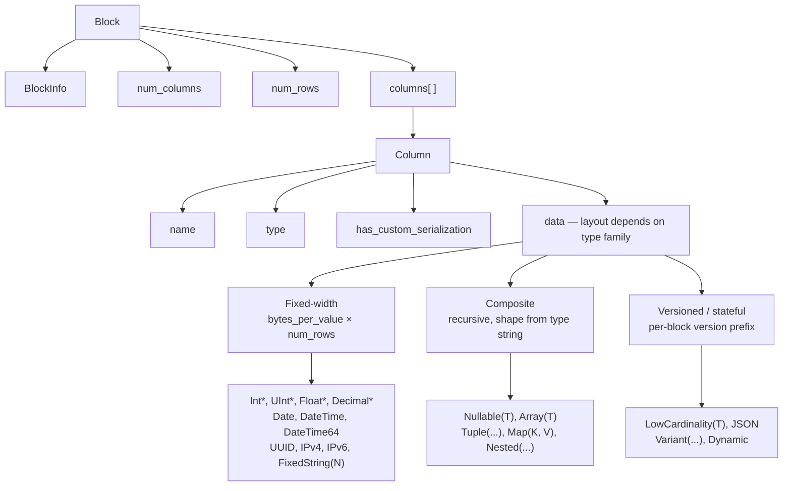
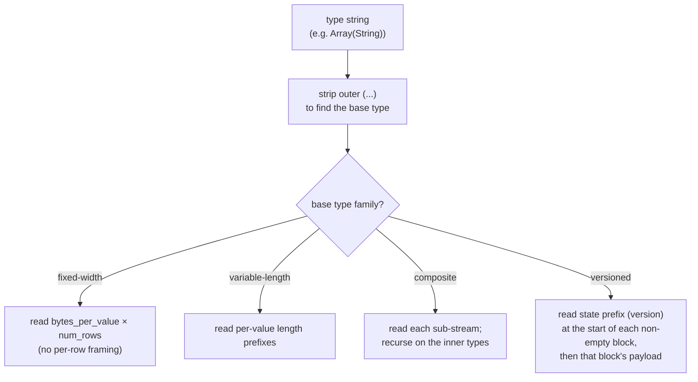
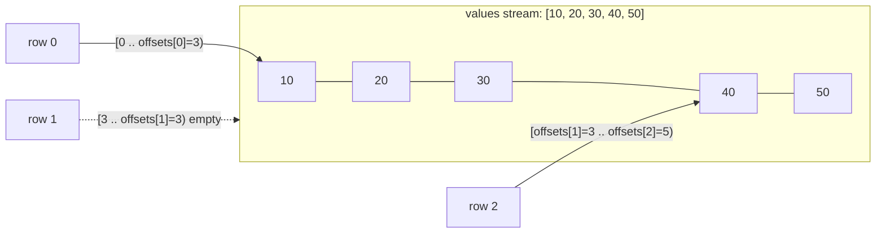
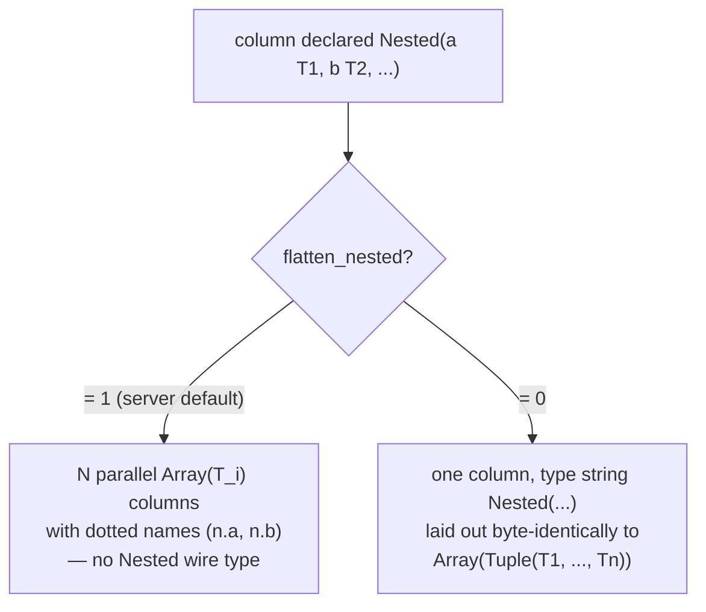
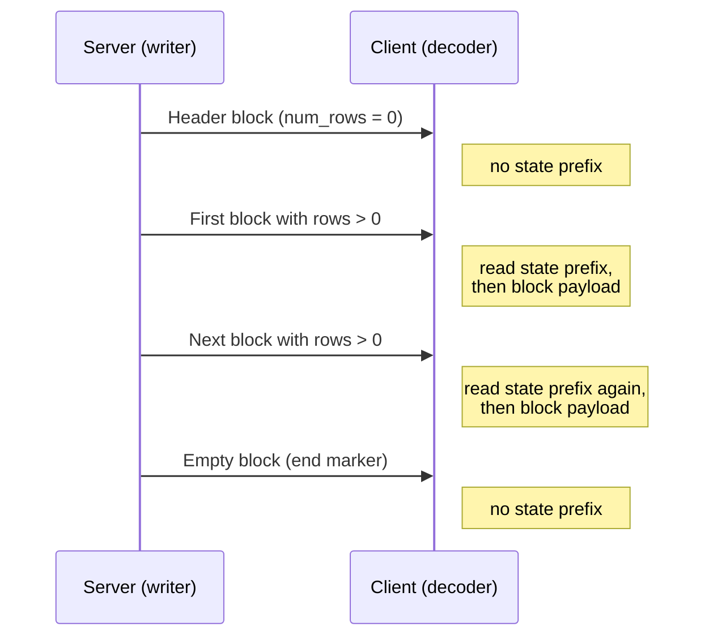
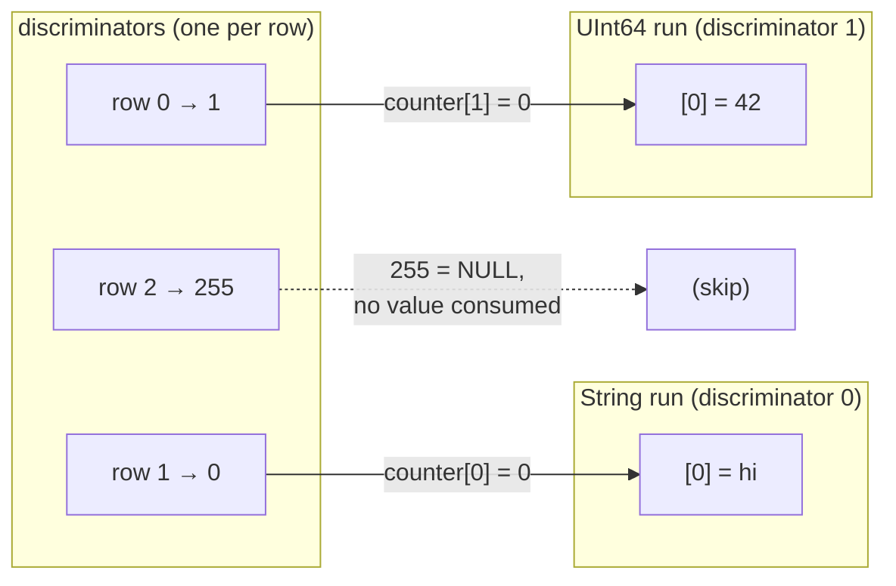
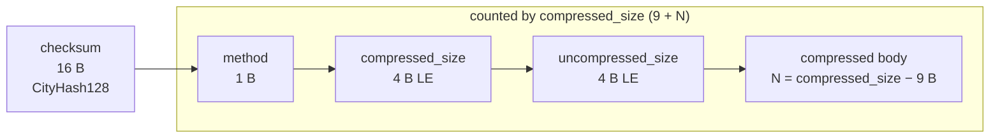

Native 형식은 ClickHouse가 테이블형 데이터를 전송할 때 사용하는 열 지향 wire 형식입니다. 이 형식은 다음과 같은 여러 위치에서 사용됩니다.

* [native TCP protocol](/ko/interfaces/specs/NativeProtocol)의 `Data`, `Totals`, `Extremes`, `Log`, `ProfileEvents` 패킷 본문 (`TableColumns` 패킷은 Native 블록이 **아닙니다**. 이 패킷은 2개의 바이너리 문자열을 담고 있으므로 해당 레이아웃은 [native protocol spec](/ko/interfaces/specs/NativeProtocol)에 속합니다.)
* HTTP를 통한 `SELECT ... FORMAT Native`의 출력
* `INTO OUTFILE ... FORMAT Native`로 작성된 파일 내보내기
* 서버 간 복제 payload

이 페이지에서는 블록 내부의 바이트, 즉 열 지향 payload와 이를 구성하는 컬럼별 데이터 타입 인코딩을 설명합니다. 패킷 프레이밍, connection 상태, 버전 협상은 [native protocol specification](/ko/interfaces/specs/NativeProtocol)에서 다룹니다.

모든 멀티바이트 정수 필드는 리틀 엔디언입니다. 부호 있는 정수는 2의 보수 표현을 사용합니다.

:::tip
`Native` 형식에 대한 사용자용 소개(`curl` 예시 포함)는 [Native format page](/ko/interfaces/formats/Native)를 참조하십시오. 이 문서는 더 낮은 수준의 wire 참고 사양입니다.
:::

<div id="overview">
  ## 개요
</div>

wire로 행을 전달하는 모든 것은 **블록**입니다. 즉, 컬럼별로 저장된 행들로 이루어진 자체 설명형 청크입니다. 먼저 컬럼 1의 모든 값이 나오고, 그다음 컬럼 2의 모든 값이 나오며, 이런 식으로 이어집니다. 블록에는 쿼리에서 참조하는 컬럼만 포함되며, 전체 테이블이 실리지는 않습니다.

컬럼의 `data`는 해당 유형이 속한 *패밀리*에 따라 배치됩니다. 디코더 복잡도가 낮은 것부터 높은 것 순으로, 패밀리는 다음과 같습니다:



* **고정 폭(Fixed-width)** 타입은 `data`를 행별 프레이밍 없이 `bytes_per_value × num_rows` 크기의 raw bytes로 배치합니다.
* **복합** 타입(`Nullable`, `Array`, `Tuple`, `Map`, `Nested`)은 타입 문자열로 완전히 유도할 수 있는 재귀적 구조를 가지며, 버전 접두사도 없고 블록 간 상태도 없습니다.
* **버전 포함 / 상태 유지** 타입(`LowCardinality`, `JSON`, `Variant`, `Dynamic`)은 비어 있지 않은 각 블록의 시작에 직렬화 버전/상태 접두사를 둡니다. `Native` wire에서는 이 접두사와 모든 딕셔너리가 **블록별**입니다 — 즉, 이 포맷은 블록 *간* 상태를 전달하지 않습니다(송신 측은 모든 블록마다 새로운 직렬화 상태를 만들고 `low_cardinality_max_dictionary_size = 0`으로 설정합니다). 블록 간 상태는 MergeTree의 온디스크 관련 사항이며, Native wire layout과는 무관합니다.

<div id="wire-primitives">
  ## wire 기본 타입
</div>

Native 형식은 다음 4가지 기본 인코딩을 기반으로 합니다.

| Primitive       | Size                 | Description                    |
| --------------- | -------------------- | ------------------------------ |
| VarUInt         | 1–10 B               | LEB-128 가변 길이 부호 없는 정수         |
| Fixed-width int | 1, 2, 4, 8, 16, 32 B | 리틀 엔디언, signed 값은 2의 보수 사용     |
| String          | variable             | VarUInt 길이 접두부 + 원시 바이트        |
| Bool            | 1 B                  | `0x00` = false, 0이 아닌 값 = true |

<div id="varuint">
  ### VarUInt
</div>

LEB-128 인코딩을 사용하는 가변 길이 부호 없는 정수입니다. 각 바이트는 0–6 위치에 7개의 데이터 비트와 7 위치에 1개의 연속 비트를 포함합니다. 뒤에 바이트가 더 있으면 연속 비트는 `1`이고, 마지막 바이트에서는 `0`입니다.

| 값 범위            | 바이트 수 |
| --------------- | ----- |
| 0 – 127         | 1     |
| 128 – 16383     | 2     |
| 16384 – 2097151 | 3     |
| 전체 UInt64 범위    | 최대 10 |

값 `300`을 인코딩한 예시는 다음과 같습니다:

```text
300 = 0b100101100

Byte 0: 0xAC = 0b10101100   (data: 0101100, continuation: 1)
Byte 1: 0x02 = 0b00000010   (data: 0000010, continuation: 0)
```

바이트 `0xAC 0x02`를 디코딩하면:

```text
Byte 0: data = 0x2C, continuation = 1 → accumulator = 0x2C, shift = 7
Byte 1: data = 0x02, continuation = 0 → accumulator = (0x02 << 7) | 0x2C = 300
```

<div id="fixed-width-integers">
  ### 고정 길이 정수
</div>

| 유형      | 바이트 | 인코딩                   |
| ------- | --- | --------------------- |
| UInt8   | 1   | 바이트 그대로               |
| UInt16  | 2   | 리틀 엔디언                |
| UInt32  | 4   | 리틀 엔디언                |
| UInt64  | 8   | 리틀 엔디언                |
| UInt128 | 16  | 리틀 엔디언                |
| UInt256 | 32  | 리틀 엔디언                |
| Int8    | 1   | 바이트 그대로, 2의 보수        |
| Int16   | 2   | 리틀 엔디언, 2의 보수         |
| Int32   | 4   | 리틀 엔디언, 2의 보수         |
| Int64   | 8   | 리틀 엔디언, 2의 보수         |
| Int128  | 16  | 리틀 엔디언, 2의 보수         |
| Int256  | 32  | 리틀 엔디언, 2의 보수         |
| Float32 | 4   | IEEE 754 단정밀도, 리틀 엔디언 |
| Float64 | 8   | IEEE 754 배정밀도, 리틀 엔디언 |

예를 들어 UInt32 값 `1`은 `01 00 00 00`으로 인코딩되며, Int32 값 `-1`은 `FF FF FF FF`로 인코딩됩니다.

<div id="string">
  ### String
</div>

길이 접두사가 있는 바이트 시퀀스:

```text
[VarUInt: byte_length] [byte_length bytes: raw value]
```

바이트 시퀀스는 유효한 UTF-8 형식일 필요가 없습니다. 빈 문자열은 단일 `0x00` 바이트로 인코딩되며, 문자열에는 내장 NUL을 포함해 모든 바이트 값이 들어갈 수 있습니다. 문자열 `"ab"`는 `02 61 62`로 인코딩됩니다. 디코딩하려면 VarUInt 길이(`2`)를 읽은 다음, 그 길이만큼 바이트를 읽습니다.

<div id="bool">
  ### Bool
</div>

1바이트입니다. `0x00`은 false이고, 0이 아닌 값은 모두 true입니다(정규 값은 `0x01`).

<div id="block-and-column-structure">
  ## Block과 컬럼 구조
</div>

<div id="block-wire-layout">
  ### 블록 wire layout
</div>

```text
[BlockInfo]               metadata (only on the TCP Data-packet path; see below)
[VarUInt: num_columns]    number of columns in this block
[VarUInt: num_rows]       number of rows in this block
[Column × num_columns]    column entries, omitted when num_columns = 0
```

`BlockInfo` 접두사의 포함 여부는 채널에 따라 달라집니다. 이는 writer가 *revision*을 매개변수로 사용하기 때문입니다(`client_protocol_version`이 출력에만 적용된다는 점을 포함한 전체 설명은 [Protocol revision and the Native format](#protocol-revision) 참조).

* **네이티브 TCP 프로토콜**에서는 server가 연결 시 협상된 revision(큰 값인 `DBMS_TCP_PROTOCOL_VERSION`, `src/Core/ProtocolDefines.h` 참조)으로 block을 기록합니다. `BlockInfo`는 해당 revision이 0보다 크면 항상 기록되며, 실제 connection에서는 언제나 이 조건을 만족합니다. 각 column의 `has_custom_serialization` 바이트([column wire layout](#column-wire-layout) 참조)는 revision `54454` 이상에서 기록됩니다.
* `Native` *출력 형식*(`HTTP`를 통한 `SELECT ... FORMAT Native`, `INTO OUTFILE ... FORMAT Native`, 그리고 `clickhouse-client`가 생성하는 `Native` 포맷)은 *기본적으로* revision `0`으로 직렬화됩니다. revision `0`에서는 `BlockInfo` 접두사와 `has_custom_serialization` 바이트가 모두 생략되므로, block은 `num_columns`, `num_rows`, 그리고 columns만으로 구성됩니다.

  HTTP에서는 이 revision이 고정되지 않습니다. 클라이언트는 `?client_protocol_version=<n>` 쿼리 매개변수로 이 값을 높일 수 있으며, server는 그 값을 응답의 직렬화 revision으로 사용합니다.

  값이 충분히 크면 HTTP 출력에도 TCP 경로와 동일하게 `BlockInfo` 접두사(revision이 `0`보다 크면 기록됨)와 `has_custom_serialization` 바이트(revision `54454` 이상에서 기록됨)가 포함됩니다. 따라서 클라이언트는 모든 HTTP `FORMAT Native` payload가 revision `0`이라고 가정해서는 안 됩니다.

즉, 이 절에서 `BlockInfo` 접두사로 시작하는 바이트 예시는 TCP Data-packet payload를 설명합니다. 같은 쿼리를 `FORMAT Native`로 실행하면, 옆에 표시된 더 짧은 형태가 생성됩니다.

<div id="blockinfo">
  ### BlockInfo
</div>

BlockInfo는 필드 시퀀스로 구성되며, 각 필드 앞에는 VarUInt 필드 ID가 오고 필드 ID가 `0`이면 종료됩니다. wire 형식은 **self-describing**하지 않습니다. 즉, 필드 ID 자체에는 값의 길이나 유형 정보가 포함되지 않으므로, reader는 마주칠 수 있는 각 필드 ID의 유형을 미리 알고 있어야 합니다. ClickHouse의 자체 reader는 인식할 수 없는 필드 ID를 데이터 손상으로 간주하고 예외(`UNKNOWN_BLOCK_INFO_FIELD`)를 발생시킵니다. 대신 순방향 호환성은 프로토콜 revision으로 처리됩니다. 송신자는 협상된 revision이 해당 필드의 최소 revision 이상일 때만 그 필드를 기록하므로, 구버전 수신기는 알지 못하는 필드를 보지 않습니다.

| 필드 ID | 필드                               | 유형       | 최소 revision | 설명                                                                     |
| ----- | -------------------------------- | -------- | ----------- | ---------------------------------------------------------------------- |
| 1     | is&#95;overflows                 | UInt8    | 0           | GROUP BY에서 생성된 오버플로우 블록입니다. 오버플로우 블록이 아니면 `0`입니다.                      |
| 2     | bucket&#95;number                | Int32    | 0           | 집계 버킷입니다. 버킷으로 나뉘지 않은 블록은 `-1`입니다.                                     |
| 3     | out&#95;of&#95;order&#95;buckets | Int32 목록 | 54480       | 분산 집계 중 지연된 버킷입니다. VarUInt 개수 뒤에 해당 개수만큼의 `Int32` 값이 이어지는 방식으로 인코딩됩니다. |
| 0     | (종료자)                            | —        | —           | BlockInfo의 끝입니다. 항상 필요합니다.                                             |

필드 `1`과 `2`의 최소 revision은 `0`이므로 `BlockInfo`가 기록될 때는 항상 포함됩니다. 필드 `3`은 revision `54480` 이상에서만 기록됩니다. 일반적인 경우(revision이 `54480` 미만) wire layout은 다음과 같습니다.

```text
[VarUInt: 1] [UInt8: is_overflows]
[VarUInt: 2] [Int32: bucket_number]
[VarUInt: 0]
```

<div id="column-wire-layout">
  ### 컬럼 wire 레이아웃
</div>

컬럼은 하나의 블록 안에 `num_columns`번 나타납니다.

| # | Field                            | Type                             | Condition                          | Description                                                                                                                                                                                   |
| - | -------------------------------- | -------------------------------- | ---------------------------------- | --------------------------------------------------------------------------------------------------------------------------------------------------------------------------------------------- |
| 1 | name                             | String                           | 항상                                 | 컬럼 이름                                                                                                                                                                                         |
| 2 | type                             | String *또는* 바이너리 타입 인코딩 | 항상                                 | 기본적으로 ClickHouse 타입 문자열(예: `"UInt64"`, `"Array(String)"`)입니다. `output_format_native_encode_types_in_binary_format = 1`인 경우에는 바이너리 타입 인코딩이 사용됩니다(아래 참고).                              |
| 3 | has&#95;custom&#95;serialization | UInt8                            | 기능 `CUSTOM_SERIALIZATION` (v54454) | `0` = 기본값, `1` = 사용자 지정 (`kind&#95;stack`이 뒤따름)                                                                                                                                               |
| 4 | kind&#95;stack                   | bytes                            | 필드 3 = `1`일 때                      | 기본 직렬화가 아닌 방식(희소 등)을 나타내는 UInt8 enum 바이트 1개입니다(아래 참고). 값이 `COMBINATION`이면 VarUInt 개수 값이 뒤따르고, 그 수만큼 추가 kind 바이트가 이어집니다. `Tuple`(및 요소 수준 직렬화 정보를 갖는 다른 복합 타입)의 경우 payload는 재귀적입니다 — 아래를 참조하세요. |
| 5 | data                             | bytes                            | 항상                                 | 모든 `num_rows` 행의 컬럼 값입니다. 레이아웃은 타입별로 다릅니다 — [데이터 타입](#data-types)을 참조하세요. 희소 컬럼은 아래를 참조하세요.                                                                                                   |

디코더는 `type` 타입 문자열을 기준으로 분기합니다. 타입 문자열에는 괄호 안의 매개변수가 포함되는 경우가 많으며, 디코더는 기본 타입을 찾기 위해 `(...)` 접미사를 제거한 다음 크기, scale 또는 내부 타입을 결정하기 위해 매개변수를 파싱합니다. 중첩 타입이 있는 매개변수 목록(예: `Array` 안의 `Tuple`)을 파싱할 때는 `,`로 단순 분할하지 말고, 괄호 중첩 깊이를 추적해 쉼표를 구분해야 합니다.

:::note 바이너리 타입 인코딩
`type` 필드는 기본 모드에서만 텍스트 `String`입니다. 쿼리 설정 `output_format_native_encode_types_in_binary_format = 1`이 설정되면 이 필드는 대신 **바이너리 타입 인코딩**이 됩니다. 이는 [데이터 타입 바이너리 인코딩](/ko/sql-reference/data-types/data-types-binary-encoding)에 문서화된 것과 동일한 태그 기반 인코딩이며, 펼쳐진 `Dynamic` 타입 목록도 각 타입 이름에 동일한 바이너리 인코딩을 사용합니다. 필드 2를 항상 길이 접두사가 있는 문자열로 읽는 디코더는 첫 번째 바이너리 타입 태그를 문자열 길이로 잘못 해석해 동기화가 어긋날 수 있으므로, 스트림이 어떤 모드를 사용하는지 알고 있어야 합니다.
:::



<div id="kind-stack-and-sparse-encoding">
  #### kind_stack 및 희소 인코딩
</div>

`kind_stack` 바이트는 컬럼별 비기본 직렬화를 나타냅니다.

| Byte   | Name                         | Meaning                                      | Wire impact on `data`                                 |
| ------ | ---------------------------- | -------------------------------------------- | ----------------------------------------------------- |
| `0x00` | DEFAULT                      | 기본 직렬화                                       | `has_custom = 0`과 동일                                  |
| `0x01` | SPARSE                       | 희소 직렬화 (v54465+)                             | 오프셋 스트림 + 비기본값, 아래 참조                                 |
| `0x02` | DETACHED                     | 병렬 block 마샬링(v54478+)에서 `ColumnBLOB`로 래핑된 컬럼 | 사전 마샬링된 blob: `VarUInt size` + 해당 크기만큼의 바이트, 아래 참조    |
| `0x03` | DETACHED&#95;OVER&#95;SPARSE | `ColumnBLOB`로 래핑된 희소 컬럼                      | `DETACHED`와 동일한 blob payload, 아래 참조                   |
| `0x04` | REPLICATED                   | 반복되는 값을 위한 딕셔너리 형식 (v54482+)                 | 인덱스 스트림 + 조밀한 요소 값, 아래 참조                             |
| `0x05` | COMBINATION                  | 다중 kind 스택                                   | 뒤에 VarUInt `count`와 추가 kind 바이트 `count`개가 이어짐 — 아래 참고 |

**`COMBINATION` payload는 다른 enum을 사용합니다.** 위 다섯 행은 *축약된* 1바이트 코드입니다. `COMBINATION` (`0x05`)은 여기에 해당하지 않는 모든 스택을 위한 일반 escape이며, 뒤에 `VarUInt` `count`와 이어서 1바이트 엔트리 `count`개가 옵니다. 이 엔트리들은 표의 축약 코드가 **아니라** 원시 `ISerialization::Kind` 값입니다.

| Byte   | Nested `Kind` |
| ------ | ------------- |
| `0x00` | DEFAULT       |
| `0x01` | SPARSE        |
| `0x02` | DETACHED      |
| `0x03` | REPLICATED    |

바이트 값은 축약 코드와 다릅니다. 중첩 enum에서는 `REPLICATED`가 `0x03`이지만 축약 코드에서는 `0x04`이고, `DETACHED_OVER_SPARSE` 엔트리는 없습니다. 이 조합은 `SPARSE`, `DETACHED`라는 두 개의 연속된 엔트리로 표현됩니다. 중첩 바이트에 대해 계속 축약 테이블을 사용하는 디코더는 `0x03`/`0x04`를 잘못 매핑하여 동기화가 어긋납니다.

`count`는 모든 스택의 시작에 오는 선행 `DEFAULT` 엔트리를 **포함한 전체 스택 길이**입니다. 축약 코드는 이미 모든 1엔트리 및 2엔트리 스택을 포괄하므로, `COMBINATION`의 `count`는 항상 최소 3입니다.

**`Tuple` 컬럼의 재귀적 `kind_stack`.** 위의 `kind_stack` payload는 한 컬럼 자체의 직렬화 정보에 해당하는 바이트(또는 `COMBINATION` 시퀀스)입니다. `Tuple`은 `SerializationInfoTuple`을 가지며, 먼저 tuple 자체의 *고유한* kind-stack payload를 기록한 다음 각 요소에 대해 순서대로 완전한 kind-stack payload를 하나씩 기록합니다. 디코더도 같은 재귀 구조로 이를 다시 읽습니다. 따라서 `Tuple(A, B, C)`의 field-4 바이트는 `[tuple_kind][A_kind][B_kind][C_kind]`이며, 어떤 요소가 다시 복합 타입이면 해당 요소의 payload도 재귀적입니다. `has_custom_serialization` 바이트(field 3)는 tuple 자체의 정보 *또는 어떤 요소의* 정보라도 비기본이면 설정되므로, 특수한 요소가 희소, 복제된, 또는 분리된 것뿐인 경우에도 `Tuple`은 여전히 kind-stack payload를 트리거합니다. `Tuple`에 대해 맨 앞의 enum 바이트 하나만 읽는 디코더는 너무 일찍 멈추며, 남은 요소 kind 바이트를 컬럼 데이터로 잘못 해석하게 됩니다.

**희소 wire 형식.** `kind_stack = 0x01`일 때 컬럼 `data`는 하나의 공유 TCP 스트림에 연달아 기록되는 두 개의 스트림으로 구성됩니다.

1. **오프셋 스트림** — `VarUInt` 시퀀스입니다. 각 값 `v`는 다음 중 하나입니다.
   * 위치 62의 상위 비트가 꺼진 `v`: `(v & 0x3FFFFFFFFFFFFFFF)`는 다음 명시적 비기본값 이전의 기본 위치 수입니다. 그 비기본 위치는 `cursor + group_size`이며, 여기서 `cursor`는 누적 위치입니다. 이후 `cursor`는 `group_size + 1`만큼 증가합니다.
   * 비트 62가 설정된 `v` (`END_OF_GRANULE_FLAG`): 플래그를 제거한 값은 마지막 비기본값 뒤에 오는 후행 기본 위치 수입니다. 이는 해당 block의 오프셋 스트림 끝을 나타냅니다.
2. **값 스트림** — 내부 타입에서 조밀하게 인코딩된 비기본값 `count`개이며, 여기서 `count`는 위에서 읽은 non-EOG `VarUInt`의 개수입니다.

디코더는 명시적으로 지정되지 않은 모든 위치를 내부 타입의 기본값(정수와 부동소수점은 `0`, `String`은 `""`, `Date`는 `0`일 등)으로 채워, `num_rows`개 항목으로 이루어진 밀집 컬럼을 재구성합니다.

희소 `Nullable(T)` 컬럼은 `Nullable(T)`의 기본값이 **NULL**이므로 특별한 경우입니다. 희소 인코딩에서는 일반적인 `Nullable` null-map 스트림을 완전히 생략합니다. 오프셋 스트림은 기본값이 아닌, 즉 non-NULL 위치를 식별하고, 값 스트림은 해당 non-NULL 값만 `T`로 조밀하게 저장하며, 명시적으로 지정되지 않은 모든 위치는 NULL로 재구성됩니다. 따라서 디코더는 값 스트림에서 null map을 *찾아서는 안 되며*, 빈 구간을 값이 있는 `0`으로 *채워서도 안 됩니다*; 대신 NULL로 채워야 합니다.

**복제된 wire 형식.** `kind_stack = 0x04`일 때 컬럼 `data`는 딕셔너리입니다. 즉, 고유한 요소 값 목록과 그 목록에 대한 행별 인덱스로 구성됩니다(`LowCardinality`와 동일한 lookup 구조). 내부 타입 자체가 versioned인 경우(예: `LowCardinality(T)`)에는 상태 접두사가 인덱스 스트림보다 **먼저** 기록됩니다. 즉, 복제된 직렬화는 `num_rows`를 기록하기 전에 prefix 단계를 내부 타입에 위임합니다. 접두사가 비어 있는 내부 타입(리프 타입과 일반 복합 타입)은 여기에서 바이트를 추가하지 않습니다.

```text
[inner type's state prefix]              empty for leaf inners; e.g. LowCardinality version (Int64 = 1)
[VarUInt num_rows]
[UInt8  size_of_indexes_type]            width of each index: 1, 2, 4, or 8 bytes
[indexes: num_rows × size_of_indexes_type bytes]
[VarUInt num_elements]
[elements: num_elements dense inner-type values]
```

디코더는 각 출력 행 `i`에 대해 `elements[indexes[i]]`를 선택해 밀집 컬럼을 재구성합니다. 복합 내부 타입은 재귀적으로 처리됩니다. 요소 목록은 먼저 내부 타입에서 구체화된 뒤 인덱싱됩니다. 지원되는 내부 타입에는 리프 타입, `Nullable(T)`, `Array(T)`, `Tuple(...)`, `Map(K, V)`, `Nested(...)`(각 필드는 `Array`처럼 확장됨), `LowCardinality(T)`(공유 딕셔너리는 유지되며 요소별 키만 인덱싱됨)가 포함됩니다.

**분리된 wire 형식.** `DETACHED` (`0x02`)와 `DETACHED_OVER_SPARSE` (`0x03`)는 실제로 wire를 통해 전송되며, 순수한 내부 표현만은 아닙니다. TCP 경로에서는 압축이 활성화되어 있고 협상된 revision이 `DBMS_MIN_REVISON_WITH_PARALLEL_BLOCK_MARSHALLING`(v54478) 이상이면, 컬럼은 다음 3단계를 거칩니다.

1. 각 적격 컬럼(`const`가 아니고, `Tuple`이 아니며, 행이 2개 이상인 block에 속한 컬럼)은 메인 스레드 밖에서 이미 마샬링되고 압축된 컬럼을 담는 `ColumnBLOB`으로 래핑됩니다.
2. `DETACHED`가 래핑된 컬럼의 kind 스택에 추가됩니다.
3. 컬럼 `data`는 `VarUInt` blob 크기를 기록한 뒤, 정확히 그 크기만큼의 blob 바이트를 씁니다.

래핑된 컬럼이 희소였다면 해당 스택은 `{DEFAULT, SPARSE, DETACHED}`이며, 이는 `DETACHED_OVER_SPARSE`로 직렬화됩니다. 이러한 컬럼을 디코딩하는 클라이언트는 blob 길이와 바이트를 읽은 다음 blob의 압축을 해제해 내부 컬럼 payload를 복원합니다(압축 아래의 [`ColumnBLOB` 참고](#compression-negotiation) 참조).

<div id="block-variants">
  ### 블록 변형
</div>

모든 Data 계열 패킷은 동일한 Block wire 형식을 사용합니다. 변형 간 차이는 컬럼 수와 행 수뿐입니다:

| Variant | num&#95;columns | num&#95;rows | Purpose                                   |
| ------- | --------------- | ------------ | ----------------------------------------- |
| 헤더 블록   | N &gt; 0        | 0            | 결과 스키마(컬럼 이름 + 타입)를 알립니다.                 |
| 결과 블록   | N &gt; 0        | M &gt; 0     | 실제 결과 행입니다.                               |
| 빈 블록    | 0               | 0            | 센티널 — 클라이언트 측에서는 입력의 끝, 서버 측에서는 경계 마커입니다. |

<div id="byte-level-examples">
  ### 바이트 수준 예시
</div>

이 절의 모든 예시는 **TCP Data-packet 경로**에서 가져온 것이므로 `BlockInfo` 접두사와 `has_custom_serialization` 바이트가 포함됩니다. `FORMAT Native`에서는 동일한 블록이 더 짧아지며, 도움이 되는 경우에는 이에 대응하는 짧은 형식도 함께 제시합니다.

빈 블록(`BlockInfo` 포함), 총 8바이트:

```text
01 00                   BlockInfo: field_id=1, is_overflows=0
02 FF FF FF FF          BlockInfo: field_id=2, bucket_number=-1
00                      BlockInfo terminator
00                      num_columns = 0
00                      num_rows = 0
```

`SELECT 1`에 대한 헤더 블록은 `UInt8` 유형의 `"1"`이라는 이름의 컬럼 1개와 0개의 행이 있음을 나타냅니다. 프로토콜 ≥ 54454에서는 `has_custom_serialization` 바이트가 포함됩니다:

```text
01 00                   BlockInfo: is_overflows = 0
02 FF FF FF FF          BlockInfo: bucket_number = -1
00                      BlockInfo terminator
01                      num_columns = 1
00                      num_rows = 0
01 "1"                  컬럼[0].name = "1"
05 "UInt8"              컬럼[0].type = "UInt8"
00                      컬럼[0].has_custom_serialization = 0
                        컬럼[0].data: no bytes (num_rows = 0)
```

동일한 쿼리의 결과 블록으로, 1개의 행이 있습니다:

```text
01 00                   BlockInfo: is_overflows = 0
02 FF FF FF FF          BlockInfo: bucket_number = -1
00                      BlockInfo terminator
01                      num_columns = 1
01                      num_rows = 1
01 "1"                  컬럼[0].name = "1"
05 "UInt8"              컬럼[0].type = "UInt8"
00                      컬럼[0].has_custom_serialization = 0
01                      컬럼[0].data: one UInt8 byte = 1
```

`FORMAT Native`(revision `0`)에서는 동일한 결과 블록에 `BlockInfo`와 `has_custom_serialization` 바이트가 없으며, `SELECT 1 FORMAT Native`는 11바이트입니다:

```text
01                      num_columns = 1
01                      num_rows = 1
01 "1"                  컬럼[0].name = "1"
05 "UInt8"              컬럼[0].type = "UInt8"
01                      컬럼[0].data: one UInt8 byte = 1
```

(헤더만 있는 블록처럼 0행인 결과는 `FORMAT Native`를 통해서는 바이트가 전혀 출력되지 않습니다. 출력 형식은 빈 블록을 내보내지 않기 때문입니다.)

<div id="protocol-revision">
  ## 프로토콜 revision과 Native 형식
</div>

Native 바이트 스트림의 형태는 무엇보다 writer와 reader가 사용하는 **protocol revision**에 따라 결정됩니다. revision은 바이트 자체에는 전혀 포함되지 않습니다. 즉, wire 상에 revision 필드는 없지만, 그럼에도 여러 기능이 아예 나타나는지 여부를 결정합니다. 따라서 decoder가 payload를 parse하려면, 먼저 해당 payload가 어떤 revision으로 기록되었는지 알아야 합니다. revision이 stream에 들어 있지 않으므로, reader와 writer는 다른 방식으로 이를 정해야 합니다.

이 값은 단일 `UInt64`이며, `NativeWriter`와 `NativeReader`는 모두 이를 생성자 인수로 받습니다. writer는 이를 `client_revision`이라고 부르고 reader는 `server_revision`이라고 부르지만, 실제로는 같은 숫자입니다. 이 release에서 인식하는 가장 최신 revision은 `DBMS_TCP_PROTOCOL_VERSION`입니다(`src/Core/ProtocolDefines.h` 참조).

<div id="what-the-revision-gates">
  ### revision이 제어하는 기능
</div>

각 기능은 `DBMS_MIN_REVISION_WITH_*` 임계값으로 제어됩니다. writer는 revision이 해당 임계값에 도달했을 때만 그 기능을 기록하고, reader도 정확히 같은 규칙으로 이를 확인하므로 양쪽이 일관되게 동작합니다. 한쪽이라도 revision을 잘못 지정하면 서로 어긋나게 됩니다. Native 형식에서 중요한 제어 항목은 다음과 같습니다.

| 기능                                  | 임계값 상수                                                             | revision | 임계값 미만일 때의 효과                                                                                                                                                              |
| ----------------------------------- | ------------------------------------------------------------------ | -------- | -------------------------------------------------------------------------------------------------------------------------------------------------------------------------- |
| `BlockInfo` 접두사                     | (임의의 값 `> 0`)                                                      | `1`      | [`BlockInfo`](#blockinfo) 접두사가 완전히 생략되며, 블록은 단순히 `num_columns`, `num_rows`, 컬럼으로만 구성됩니다.                                                                                   |
| `has_custom_serialization` 바이트      | `DBMS_MIN_REVISION_WITH_CUSTOM_SERIALIZATION`                      | `54454`  | 컬럼별 [`has_custom_serialization`](#column-wire-layout) 바이트가 생략되며, 모든 컬럼이 기본 직렬화를 사용합니다(희소, 복제된, 분리된 형식 없음).                                                       |
| `LowCardinality` on the wire        | `DBMS_MIN_REVISION_WITH_LOW_CARDINALITY_TYPE`                      | `54405`  | 특수한 경우로, 단순한 임계값 미만 규칙을 **따르지 않습니다**. `LowCardinality(T)`는 revision이 *0이 아니면서* `54405` 미만일 때만, 또는 별도로 제거를 강제한 경우에만 기본 타입 `T`로 축소됩니다. revision이 `0`이면 유지됩니다. 아래 참고를 확인하십시오. |
| V2 `Dynamic` / `JSON` serialization | `DBMS_MIN_REVISION_WITH_V2_DYNAMIC_AND_JSON_SERIALIZATION`         | `54473`  | `Dynamic` 및 `JSON`/`Object`는 V2 대신 V1 직렬화(`max_dynamic_*` 매개변수 포함)을 사용합니다.                                                                                       |
| 집계 함수 버전 관리                         | `DBMS_MIN_REVISION_WITH_AGGREGATE_FUNCTIONS_VERSIONING`            | `54452`  | `AggregateFunction` 상태가 내장 버전 없이 기록됩니다.                                                                                                                                    |
| `BlockInfo`의 `out_of_order_buckets` | `DBMS_MIN_REVISION_WITH_OUT_OF_ORDER_BUCKETS_IN_AGGREGATION`       | `54480`  | `BlockInfo` 필드 ID `3`이 기록되지 않습니다([BlockInfo](#blockinfo) 참고).                                                                                                              |
| 병렬 블록 마샬링 (`DETACHED`)              | `DBMS_MIN_REVISON_WITH_PARALLEL_BLOCK_MARSHALLING`                 | `54478`  | 컬럼이 `ColumnBLOB`으로 래핑되지 않으며, `DETACHED` / `DETACHED_OVER_SPARSE` kind가 나타나지 않습니다([kind&#95;stack](#kind-stack-and-sparse-encoding) 참고).                                    |
| `DateTime(tz)` 타입 매개변수              | `DBMS_MIN_REVISION_WITH_TIME_ZONE_PARAMETER_IN_DATETIME_DATA_TYPE` | `54337`  | 시간대 매개변수가 `type` 타입 문자열에서 제거되어 `DateTime('UTC')`가 단순한 `DateTime`으로 표시됩니다.                                                                                                  |

즉, revision `0`은 거의 모든 경우에 가장 보수적인 인코딩입니다. 스트림에는 `BlockInfo`가 없고, `has_custom_serialization` 바이트도 없으며, V1 `Dynamic`/`JSON`, 집계 함수 버전 정보 없음, 그리고 시간대 매개변수가 제거된 순수한 `DateTime`만 포함됩니다.

`LowCardinality`는 유일한 예외이며, 특히 중요합니다. writer의 검사식은 `remove_low_cardinality || (client_revision && client_revision < DBMS_MIN_REVISION_WITH_LOW_CARDINALITY_TYPE)`입니다. 여기서 핵심은 앞부분의 `client_revision &&`입니다. revision이 정확히 `0`이면 전체 조건이 단락 평가되어 false가 됩니다.

따라서 revision `0`에서는 — `FORMAT Native`의 기본값입니다 — `LowCardinality(T)`가 **제거되지 않습니다**. 해당 타입 문자열과 블록별 상태 접두사는 스트림에 그대로 남아 있고, revision-`0` reader는 이를 그대로 다시 읽습니다. 제거는 0이 아닌 revision이 `54405` 미만일 때만 적용되거나, revision과 관계없이 강제된 경우에만 적용됩니다.

이 강제 동작을 제어하는 것이 `remove_low_cardinality` 플래그입니다. `FORMAT Native` 출력에서는 이 값이 설정되지 않지만, 네이티브 TCP 경로에서는 `low_cardinality_allow_in_native_format = 0`일 때 설정됩니다(기본값 `1`). 즉, 이 설정은 네이티브 TCP 출력에는 영향을 주지만 `FORMAT Native`에는 아무 영향이 없습니다.

실무적으로 중요한 점은 다음과 같습니다. 기본 `FORMAT Native` 스트림에는 `LowCardinality`가 정상적으로 포함될 수 있으므로, revision `0`에서 없는 기능으로 간주해서는 안 됩니다.

<div id="revision-per-channel">
  ### 데이터가 이동하는 경로에 따라 revision이 결정되는 방식
</div>

동일한 Native 바이트는 네이티브 TCP 프로토콜, HTTP 요청 또는 디스크의 파일 등 서로 다른 경로로 이동할 수 있습니다. 각 경로는 저마다의 방식으로 revision을 설정합니다. 한 가지 주의할 점은 읽기 측과 쓰기 측이 별도로 설정되므로 서로 다른 revision이 될 수 있다는 것입니다.

<div id="revision-tcp">
  #### 네이티브 TCP 프로토콜 — 협상되며, 양방향 모두
</div>

[native TCP protocol](/ko/interfaces/specs/NativeProtocol)에서는 revision이 Hello 핸드셰이크에서 결정됩니다. 클라이언트는 `DBMS_TCP_PROTOCOL_VERSION`을 보내고, 서버는 자체 값을 돌려보냅니다. 그 이후부터는 각 측이 **상대방이 알린 revision으로** 직렬화합니다. 즉, 서버는 `client_tcp_protocol_version`으로 `NativeReader`/`NativeWriter`를 만들고, 클라이언트는 수신한 `server_revision`을 사용합니다. 명시적인 `min`은 없지만, 어느 쪽도 구현하지 않은 기능을 내보낼 수는 없으므로 각 방향은 사실상 두 피어 중 더 오래된 쪽에 의해 제한됩니다.

두 피어가 모두 동일한 최신 build인 경우, 두 방향은 같은 revision(`DBMS_TCP_PROTOCOL_VERSION`, `src/Core/ProtocolDefines.h` 참고)에 맞춰지며 모든 게이트가 활성화됩니다. 이것이 일반적인 경우이지만, 항상 그렇다고 보장되지는 않습니다. 버전이 섞여 있거나 타사 피어가 있는 경우에는 두 방향이 서로 다른 revision에 머물 수 있으므로, 게이트는 방향별로 해석해야 합니다. `BlockInfo`는 0이 아닌 모든 revision에서 존재하지만, 나머지 항목들은 `has_custom_serialization`을 포함해 해당 방향의 유효 revision이 각 임계값에 도달했을 때만 나타납니다. 예를 들어 `54454`보다 낮은 revision을 알리는 피어는 `has_custom_serialization` 바이트를 보내지도 받지도 않습니다.

<div id="revision-output">
  #### `FORMAT Native` 출력 — 기본 revision은 0이며, HTTP에서는 높일 수 있음
</div>

`Native` *출력* 포맷의 기본 revision은 **`0`**입니다. 여기에는 HTTP를 통한 `SELECT ... FORMAT Native`, `INTO OUTFILE ... FORMAT Native`, 그리고 `clickhouse-client`가 기록하는 `Native` 출력이 포함되며, 각 경우 모두 출력 팩토리가 `FormatSettings::client_protocol_version`을 그대로 `NativeWriter`에 전달합니다.

하지만 HTTP에서는 이 기본값만으로 끝나지 않습니다. 클라이언트는 `?client_protocol_version=<n>` 쿼리 매개변수로 이 값을 높일 수 있으며, HTTP 핸들러는 이를 SQL 설정이 아니라 예약된 매개변수로 처리합니다. 이 값은 쿼리 Context에 반영되고, 포맷 계층이 이를 `FormatSettings`에 복사합니다. 값을 충분히 높게 설정하면 HTTP `FORMAT Native` 출력도 TCP 경로와 마찬가지로 `BlockInfo` 접두어와 `has_custom_serialization` 바이트를 포함하기 시작합니다. 따라서 HTTP `FORMAT Native` payload가 항상 revision `0`이라고 가정해서는 안 됩니다. 파일 내보내기와 로컬 `clickhouse-client` 출력에는 이런 조정 수단이 없으므로 `0`으로 유지됩니다.

<div id="revision-input">
  #### `FORMAT Native` 입력 — 항상 revision 0
</div>

`Native` *입력* 포맷은 그 반대로 동작합니다. 즉, **revision `0`으로 하드코딩되어** `client_protocol_version`은 전혀 고려하지 않습니다. `INSERT ... FORMAT Native`의 본문(body)을 파싱하든 `Native` 파일을 읽든, `NativeReader`는 리터럴 `0`으로 생성되므로 `BlockInfo` 접두어(prefix)를 전혀 기대하지 않고, `has_custom_serialization` 바이트도 읽지 않으며, 항상 기본 serialization을 가정합니다.

따라서 `client_protocol_version`은 출력 전용입니다. `INSERT ... FORMAT Native` 요청에 높은 `?client_protocol_version=` 값(예: `DBMS_TCP_PROTOCOL_VERSION`)을 지정해도 본문을 읽는 방식에는 아무런 영향이 없습니다. 본문은 여전히 revision `0`이어야 합니다. `BlockInfo` 접두어(prefix)나 `has_custom_serialization` 바이트가 포함된 본문을 넣으면 reader의 동기화가 깨지고, 그 결과 성공적으로 삽입되는 대신 파싱 오류(`INCORRECT_DATA` 또는 `CANNOT_READ_ALL_DATA`)가 반환됩니다.

<div id="revision-round-trip">
  ### 라운드트립 시 영향
</div>

`FORMAT Native`에서는 양쪽 모두 revision `0`을 사용하는 것이 가장 안전하며, 이것이 기본값입니다. revision `0`에서 `SELECT ... FORMAT Native`로 기록한 데이터는 별다른 문제 없이 그대로 `INSERT ... FORMAT Native`로 다시 읽을 수 있습니다.

문제는 출력 revision을 의도적으로 높일 때 시작됩니다. `?client_protocol_version=<large>`를 사용한 `SELECT ... FORMAT Native`는 `BlockInfo`와 `has_custom_serialization` 바이트를 포함한 스트림을 생성하는데, revision-`0` 입력 경로에서는 이를 다시 읽을 수 없습니다. 이런 데이터의 라운드트립이 필요하다면, 데이터를 생성하는 `SELECT`에서 `client_protocol_version`을 지정하지 않거나, `FORMAT Native` 대신 각 방향에서 handshake로 협상된 revision을 사용하는 네이티브 TCP 프로토콜로 데이터를 전송하십시오.

| 채널                                                        | 쓰기 revision                         | 읽기 revision                            | `BlockInfo` / custom serialization                                   |
| --------------------------------------------------------- | ----------------------------------- | -------------------------------------- | -------------------------------------------------------------------- |
| Native TCP Data packet                                    | 상대 측이 알린 revision (방향별)             | 상대 측이 알린 revision (방향별)                | revision `> 0`이면 `BlockInfo`, `≥ 54454`이면 `has_custom_serialization` |
| HTTP를 통한 `SELECT ... FORMAT Native`                       | `client_protocol_version` (기본값 `0`) | n/a                                    | `client_protocol_version`을 높인 경우에만                                   |
| HTTP를 통한 `INSERT ... FORMAT Native`                       | n/a                                 | `0` (고정, `client_protocol_version` 무시) | 읽지 않음                                                                |
| `INTO OUTFILE` / 파일 / `clickhouse-client` `FORMAT Native` | `0`                                 | `0`                                    | 없음(단, `LowCardinality`는 유지됨 — 위 참고 사항 참조)                            |

:::note Protocol revision과 serialization version
protocol revision을 [serialization version](#serialization-version-concept)과 혼동하지 마십시오. 여기서 revision은 연결 또는 요청 전체에 적용되며 바이트 자체에는 나타나지 않습니다. serialization version은 컬럼별로 적용되고, [versioned types](#versioned-types)를 통해 전달되며, 비어 있지 않은 모든 block에 기록됩니다. revision은 해당 기능이 아예 존재하는지를 결정하고, versioned column 내부에서는 serialization version이 그 타입 인코딩의 어떤 변형이 뒤따를지를 결정합니다.
:::

<div id="data-types">
  ## 데이터 타입
</div>

이 섹션에서는 컬럼의 `data`에 대해 Native 형식이 담을 수 있는 타입의 wire 인코딩을 설명합니다. 타입은 디코더 복잡도가 증가하는 순서에 따라 4개의 계열로 그룹화됩니다. `AggregateFunction(func, ...)`와 `QBit(T, N[, stride])`는 유효한 `Native` 컬럼 타입이지만, 여기서 다루지 않는 함수별 또는 타입별 payload를 사용합니다. 따라서 원래 별칭으로 오해될 수 있는 위치에서 아래에 별도로 언급합니다.

| 계열            | 섹션                                 | 컬럼당 스트림 수 | 블록 간 상태                                           |
| ------------- | ---------------------------------- | --------- | ------------------------------------------------- |
| 고정 폭          | [고정 폭 타입](#fixed-width-types)      | 1개        | 없음                                                |
| 가변 길이         | [가변 길이 타입](#variable-length-types) | 1개        | 없음                                                |
| 복합(고정 shape)  | [복합 타입](#composite-types)          | 여러 개      | 없음                                                |
| 버전 지정 / 상태 유지 | [버전 지정 타입](#versioned-types)       | 여러 개      | Native wire에는 없음 — 블록별 상태 접두사가 있으며, 각 블록마다 새로 시작됨 |

<div id="fixed-width-types">
  ### 고정 폭 타입
</div>

각 값은 고정된 바이트 수를 차지합니다. `M`개 행으로 이루어진 컬럼은 wire 상에서 정확히 `bytes_per_row × M`바이트를 차지하며, 구분자나 padding 없이 연속해서 이어집니다.

| 타입 문자열              | 값당 바이트 수        | 논리 값                                                                                       | wire 인코딩                                   |
| ------------------- | --------------- | ------------------------------------------------------------------------------------------ | ------------------------------------------ |
| `UInt8`             | 1               | 부호 없는 8비트 정수                                                                               | 원시 바이트                                     |
| `UInt16`            | 2               | 부호 없는 16비트 정수                                                                              | 리틀 엔디언                                     |
| `UInt32`            | 4               | 부호 없는 32비트 정수                                                                              | 리틀 엔디언                                     |
| `UInt64`            | 8               | 부호 없는 64비트 정수                                                                              | 리틀 엔디언                                     |
| `UInt128`           | 16              | 부호 없는 128비트 정수                                                                             | 리틀 엔디언                                     |
| `UInt256`           | 32              | 부호 없는 256비트 정수                                                                             | 리틀 엔디언                                     |
| `Int8`              | 1               | 부호 있는 8비트 정수, 2의 보수                                                                        | 원시 바이트                                     |
| `Int16`             | 2               | 부호 있는 16비트 정수, 2의 보수                                                                       | 리틀 엔디언                                     |
| `Int32`             | 4               | 부호 있는 32비트 정수, 2의 보수                                                                       | 리틀 엔디언                                     |
| `Int64`             | 8               | 부호 있는 64비트 정수, 2의 보수                                                                       | 리틀 엔디언                                     |
| `Int128`            | 16              | 부호 있는 128비트 정수, 2의 보수                                                                      | 리틀 엔디언                                     |
| `Int256`            | 32              | 부호 있는 256비트 정수, 2의 보수                                                                      | 리틀 엔디언                                     |
| `Float32`           | 4               | IEEE 754 단정밀도                                                                              | 리틀 엔디언                                     |
| `Float64`           | 8               | IEEE 754 배정밀도                                                                              | 리틀 엔디언                                     |
| `BFloat16`          | 2               | IEEE 754 `Float32`의 상위 16비트                                                                | 리틀 엔디언                                     |
| `Bool`              | 1               | `0x00` = false, `0x01` = true                                                              | 원시 바이트                                     |
| `Date`              | 2               | `1970-01-01` 이후 경과한 일수                                                                     | 리틀 엔디언 UInt16                              |
| `Date32`            | 4               | `1970-01-01` 이후 경과한 일수 (부호 있음, 1970년 이전도 가능)                                               | 리틀 엔디언 Int32                               |
| `DateTime`          | 4               | 초 단위 Unix timestamp                                                                        | 리틀 엔디언 UInt32                              |
| `DateTime(tz)`      | 4               | `DateTime`와 동일하며, 시간대는 메타데이터입니다                                                            | 리틀 엔디언 UInt32                              |
| `DateTime64(s)`     | 8               | 스케일 `s`의 틱 (`epoch` 이후 10^-s초)                                                             | 리틀 엔디언 Int64                               |
| `DateTime64(s, tz)` | 8               | `DateTime64(s)`와 동일하며, 시간대는 메타데이터입니다                                                       | 리틀 엔디언 Int64                               |
| `Time`              | 4               | 초 단위의 부호 있는 시간 길이                                                                          | 리틀 엔디언 Int32                               |
| `Time64(s)`         | 8               | 스케일 `s`의 틱 단위 부호 있는 시간 길이                                                                  | 리틀 엔디언 Int64                               |
| `Interval<Unit>`    | 8               | 부호 있는 개수이며, 단위는 타입 문자열에 포함됩니다                                                              | 리틀 엔디언 Int64                               |
| `UUID`              | 16              | 128비트 식별자                                                                                  | 바이트 스왑된 LE UInt64 절반 2개 ([UUID](#uuid) 참고) |
| `IPv4`              | 4               | IPv4 주소                                                                                    | 리틀 엔디언 UInt32                              |
| `IPv6`              | 16              | IPv6 주소                                                                                    | 네트워크 바이트 순서, 스왑 없음                         |
| `Enum8`             | 1               | 부호 있는 8비트 정수(variant 인덱스)                                                                  | 원시 바이트                                     |
| `Enum16`            | 2               | 부호 있는 16비트 정수(variant 인덱스)                                                                 | 리틀 엔디언                                     |
| `Decimal(P, S)`     | 4 / 8 / 16 / 32 | 부호 있는 정수로 표현한 `value × 10^S`; 폭은 P에 따라 달라집니다 (≤9 → 4 B, ≤18 → 8 B, ≤38 → 16 B, ≤76 → 32 B) | 리틀 엔디언 부호 있는 정수                            |

<div id="integer-types">
  #### 정수 타입
</div>

`UInt8`–`UInt256` 및 `Int8`–`Int256`은 정수 값을 직접 바이너리로 인코딩한 형식입니다. 디코더는 `bytes_per_row × num_rows`바이트를 읽고 타입에 따라 해석합니다.

`[1, 256, 65536]` 값을 담고 있는 `UInt32` 컬럼:

```text
01 00 00 00              row 0: 1
00 01 00 00              row 1: 256
00 00 01 00              row 2: 65536
```

`[-1, 42]`를 담고 있는 `Int32` 컬럼:

```text
FF FF FF FF              row 0: -1
2A 00 00 00              row 1: 42
```

<div id="float32-and-float64">
  #### Float32 and Float64
</div>

표준 IEEE 754 이진 부동소수점 형식입니다. 4바이트 단정밀도(`binary32`)와 8바이트 배정밀도(`binary64`)이며, 각각 리틀 엔디언입니다. NaN, ±Infinity, ±0.0, 비정규 수는 모두 정규화 없이 그대로 다시 읽을 수 있습니다.

`Float32` 값 `1.5` (`0x3FC00000`):

```text
00 00 C0 3F              little-endian IEEE 754
```

`Float64` 값 `1.5` (`0x3FF8000000000000`):

```text
00 00 00 00 00 00 F8 3F  little-endian IEEE 754
```

<div id="bfloat16">
  #### BFloat16
</div>

brain-floating-point 포맷입니다. IEEE 754 `Float32`의 상위 16비트로, 부호 비트 1개, 지수 비트 8개, 가수 비트 7개로 구성됩니다. 각 값은 2바이트이며, 리틀 엔디언 방식으로 원시 16비트 패턴을 저장합니다. 수치 값을 복원하려면 패턴을 상위 절반에 배치하고 하위 절반을 0으로 채워(`bits << 16`을 `Float32`로 reinterpret) 다시 `Float32`로 확장하면 됩니다. 그러면 확장된 값은 `Float32`와 동일한 텍스트 포맷을 사용합니다.

`BFloat16` 값 `1.5`(`Float32` `0x3FC00000`의 상위 절반인 패턴 `0x3FC0`):

```text
C0 3F                    little-endian, widens to Float32 1.5
```

<div id="bool-type">
  #### Bool
</div>

`UInt8`와 wire 호환됩니다. 행당 1바이트이며, `0x00` = false, `0x01` = true입니다. wire 상의 타입 문자열은 문자 그대로 `Bool`(`UInt8` 아님)이므로, 타입 문자열을 기준으로 디스패치하는 decoder는 이를 별도로 인식해야 합니다.

`Bool` 컬럼 `[true, false, true]`:

```text
01 00 01
```

<div id="date-and-date32">
  #### Date와 Date32
</div>

둘 다 Unix epoch `1970-01-01`을 기준으로 날짜를 정수 일수로 인코딩합니다. 둘 다 시간 구성 요소는 포함하지 않습니다.

| 유형       | 바이트 | 인코딩           | 범위                          |
| -------- | --- | ------------- | --------------------------- |
| `Date`   | 2   | 리틀 엔디언 UInt16 | `1970-01-01` ~ `2149-06-06` |
| `Date32` | 4   | 리틀 엔디언 Int32  | 넓은 부호 있는 범위, 1970년 이전도 가능   |

`Date` 값 `1970-01-02` (1일):

```text
01 00                    UInt16 LE = 1
```

`Date32` 값 `1900-01-01` (-25567일):

```text
21 9C FF FF              Int32 LE = -25567
```

<div id="datetime">
  #### DateTime
</div>

`UInt32`와 wire 호환됩니다. 즉, 초 단위 Unix timestamp를 나타내며 4바이트 리틀 엔디언입니다. 이 유형은 `DateTime` 또는 `DateTime('Timezone')`로 표시될 수 있습니다. 시간대는 표시 방식에만 영향을 주며 wire 값 자체에는 포함되지 않습니다. 시간대 매개변수가 서로 다른 두 `DateTime` 컬럼은 동일한 시점에 대해 같은 바이트를 생성합니다. decoder는 `(...)` 매개변수 접미사를 제거한 뒤 해당 컬럼을 `UInt32`로 처리합니다.

`DateTime('UTC')` 값 `2024-03-15 14:30:00 UTC` (timestamp `1710513000`):

```text
68 5B F4 65              UInt32 LE = 1710513000
```

<div id="datetime64">
  #### DateTime64(scale[, timezone])
</div>

8바이트 리틀 엔디언 Int64이며, Unix epoch 이후의 시간을 `10^-scale`초 단위의 틱으로 나타냅니다. `scale` 매개변수(0–9)는 타입 문자열에 포함되며 시간 단위를 설정합니다:

| Scale | 틱 크기   | 일반 명칭 |
| ----- | ------ | ----- |
| 0     | 1초     | 초     |
| 3     | 1밀리초   | ms    |
| 6     | 1마이크로초 | µs    |
| 9     | 1나노초   | ns    |

이 유형은 `DateTime64(s)`(server 기본 시간대가 암시적으로 적용됨) 또는 `DateTime64(s, 'TimezoneName')`(명시적 시간대, 표시 전용) 형식으로 표시됩니다. 음수 값은 epoch 이전의 틱을 나타냅니다.

`DateTime64(3, 'UTC')` 값 `2024-01-15 12:30:45.123 UTC`(1705321845123 ms):

```text
83 51 1A 0D 8D 01 00 00  Int64 LE = 1705321845123
```

`DateTime64(0)` 값 `2024-01-15 12:30:45 UTC` (1705321845초):

```text
75 25 A5 65 00 00 00 00  Int64 LE = 1705321845
```

<div id="time-and-time64">
  #### Time 및 Time64(scale)
</div>

시점을 나타내는 것이 아니라 시계상의 경과 시간입니다. `Time`은 부호 있는 초 카운트로, 4바이트 리틀 엔디언 Int32입니다. `Time64(scale)`은 지정된 소수 scale(0–9)의 부호 있는 틱 카운트로, 8바이트 리틀 엔디언 Int64입니다 — wire shape은 `DateTime64`와 동일합니다.

텍스트 형식은 `[-]HH:MM:SS[.fraction]`이지만, `DateTime`과 달리 시간 field는 24시간 단위로 **순환되지 않습니다**. 즉, 전체 시간 수를 나타내며 23을 초과할 수 있습니다. 표시되는 값의 크기는 `999:59:59`(`3599999`초)로 제한되며, 이보다 큰 값은 소수 부분이 0으로 채워진 cap 값(`999:59:59.000`)으로 표시됩니다. `CAST`도 저장된 값을 이 범위로 제한하지만, 산술 연산으로는 범위를 벗어난 값이 생성될 수 있으며 이런 값은 표시할 때만 제한됩니다. 이 중 어느 것도 wire bytes에는 영향을 주지 않으며, wire bytes는 일반적인 부호 있는 정수입니다.

`Time` 값 `45296` (`12:34:56`):

```text
F0 B0 00 00              Int32 LE = 45296
```

`Time64(3)` 값 `45296789`틱 (`12:34:56.789`):

```text
95 2C B3 02 00 00 00 00  Int64 LE = 45296789
```

:::note
`Time` 및 `Time64`는 실험적 기능이며, server에서 `allow_experimental_time_time64_type = 1`을 설정해야 합니다.
:::

<div id="interval">
  #### 인터벌
</div>

`Interval<Unit>` — `IntervalSecond`, `IntervalMinute`, `IntervalHour`, `IntervalDay`, `IntervalWeek`, `IntervalMonth`, `IntervalQuarter`, `IntervalYear`, `IntervalNanosecond` 등입니다. 모든 단위는 동일한 wire 인코딩을 사용합니다. 즉, 개수는 부호 있는 8바이트 리틀 엔디언 Int64로 인코딩됩니다. 단위는 **오직** 타입 문자열에만 존재하며, wire 바이트나 텍스트 표현에는 아무 영향도 주지 않습니다. 텍스트 표현은 정수 그 자체입니다. 모든 단위는 하나의 디코더 경로에서 처리됩니다.

`IntervalDay` 값 `5`:

```text
05 00 00 00 00 00 00 00  Int64 LE = 5
```

<div id="uuid">
  #### UUID
</div>

값당 16바이트입니다. wire 인코딩은 **정규 16바이트의 빅 엔디언 표현이 아니며**, 각 8바이트 절반이 서로 독립적으로 바이트 역순으로 저장됩니다.

논리적 모델은 정규 텍스트 형식 `xxxxxxxx-xxxx-xxxx-xxxx-xxxxxxxxxxxx`의 128비트 식별자이며, 여기서 바이트는 관례적으로 빅 엔디언으로 표기됩니다. wire 모델은 이 16개의 정규 바이트를 두 개의 8바이트 절반으로 나눈 뒤, 각 절반을 리틀 엔디언으로 기록합니다.

* Wire bytes 0..7 = 정규 바이트 0..7을 역순으로 배치한 값입니다.
* Wire bytes 8..15 = 정규 바이트 8..15를 역순으로 배치한 값입니다.

UUID `550e8400-e29b-41d4-a716-446655440000`:

```text
Canonical bytes (16):    55 0E 84 00 E2 9B 41 D4  A7 16 44 66 55 44 00 00

Wire bytes:
D4 41 9B E2 00 84 0E 55  high half byte-reversed
00 00 44 55 66 44 16 A7  low half byte-reversed
```

nil UUID(모두 0)는 두 표현 모두에서 동일하게 나타납니다.

<div id="ipv4-and-ipv6">
  #### IPv4 및 IPv6
</div>

서로 관련되어 있지만 인코딩 방식이 다른 두 가지 주소 타입입니다.

`IPv4`는 4바이트이며, 정규 32비트 주소(`a.b.c.d`에서 얻는 값 `(a << 24) | (b << 16) | (c << 8) | d`)를 담는 리틀 엔디언 UInt32로 인코딩됩니다. wire bytes는 네트워크 바이트 순서를 역순으로 뒤집은 바이트입니다.

`192.168.1.10` (정규 32비트 값 `0xC0A8010A`):

```text
0A 01 A8 C0              Little-endian UInt32
```

`IPv6`는 16바이트이며, 스왑 없이 **network byte order 그대로** 기록됩니다 — `inet_pton(AF_INET6, ...)`와 동일한 바이트 순서입니다.

`2001:db8::1`:

```text
20 01 0D B8 00 00 00 00  network bytes 0..7
00 00 00 00 00 00 00 01  network bytes 8..15
```

이러한 비대칭성은 의도된 것입니다. IPv4는 산술 연산과 효율적인 범위 쿼리를 위해 `u32`로 저장되며, IPv6는 대부분의 네트워킹 API에서 일반적으로 사용하는 네트워크 바이트 순서 레이아웃을 유지합니다.

<div id="enum8-and-enum16">
  #### Enum8 and Enum16
</div>

각각 `Int8` 및 `Int16`과 wire 호환됩니다. 행당 1바이트 또는 2바이트를 사용하며, 16비트 형식은 2의 보수 리틀 엔디언을 사용합니다. 전체 값 매핑은 타입 문자열에 포함됩니다:

```text
Enum8('active' = 1, 'inactive' = 2, 'banned' = -1)
Enum16('a' = 1, 'b' = 30000)
```

디코더는 `(...)` 매개변수 접미사를 제거한 뒤 `Int8` / `Int16`으로 처리할 수 있습니다 — wire bytes는 단순히 정수 인덱스일 뿐입니다. 레이블을 표시하는 클라이언트는 타입 문자열에서 `'name' = value` 맵을 파싱해 컬럼과 함께 유지합니다. 정수만으로는 레이블을 복원할 수 없습니다. 텍스트 중심 출력에서는 인덱스가 아니라 레이블(`active`)을 렌더링하며, enum이 복합 타입 안에 중첩된 경우에는 작은따옴표로 감싼 (`'active'`) 형태로 표시합니다. 맵은 정수 컬럼만으로 복원할 수 없으므로, `Array(Enum8(...))` 또는 `Map(Enum16(...), V)`와 같은 중첩된 enum에서는 이를 유지해야 합니다.

`Enum8('active' = 1, 'inactive' = 2)` 컬럼 `[active, inactive, active]`:

```text
01 02 01
```

`Enum16(...)` 값 `30000`:

```text
30 75                    Int16 LE = 30000
```

<div id="decimal">
  #### Decimal(P, S)
</div>

10의 거듭제곱으로 스케일링된 부호 있는 정수입니다. 정수의 바이트 폭은 **정밀도** `P`로 결정되며, **스케일** `S`는 음의 지수(소수점 이하 자릿수)입니다. 이 둘은 모두 타입 문자열에 포함됩니다.

| 정밀도(P)      | 기반 정수  | 바이트 |
| ----------- | ------ | --- |
| 1 ≤ P ≤ 9   | Int32  | 4   |
| 10 ≤ P ≤ 18 | Int64  | 8   |
| 19 ≤ P ≤ 38 | Int128 | 16  |
| 39 ≤ P ≤ 76 | Int256 | 32  |

wire 인코딩은 리틀 엔디언 2의 보수 형식의 기반 정수이며, 논리적인 Decimal 값은 `wire_integer × 10^(-S)`입니다.

ClickHouse는 타입 선언 방식과 관계없이 항상 `Decimal(P, S)`를 출력합니다. `Decimal32(S)`, `Decimal64(S)` 등도 wire상에서는 모두 `Decimal(P, S)`로 정규화됩니다(`P`는 해당 폭의 자연스러운 최대값인 9, 18, 38, 76으로 설정됨). `Decimal(P, S)`만 인식하는 디코더는 server가 출력하는 모든 표기법을 처리할 수 있습니다.

`Decimal(9, 4)` 값 `123.4567` → 기반 정수 `1234567`:

```text
87 D6 12 00              Int32 LE = 1234567
```

`Decimal(18, 1)` 값 `-1.5` → 내부 정수 `-15`:

```text
F1 FF FF FF FF FF FF FF  Int64 LE = -15
```

`Decimal(38, 4)` 값 `123.4567` (총 16바이트):

```text
87 D6 12 00 00 00 00 00 00 00 00 00 00 00 00 00
```

<div id="nothing">
  #### Nothing
</div>

`Nothing` 유형은 어떤 값도 담지 않습니다. 실제로는 `Nullable(Nothing)`의 내부 유형으로만 나타납니다. 즉, 유효한 값이 값의 부재뿐인 `SELECT NULL` 같은 표현식에 대해 server가 반환하는 유형입니다. 개념적으로는 단위 유형(unit type)입니다.

wire 상에서는 **행당 정확히 1개의 플레이스홀더 바이트**를 차지합니다. server는 ASCII 문자 `'0'` (`0x30`)를 내보내지만, 역직렬화기는 해당 바이트를 무시합니다. 즉, 내용은 정의되지 않으며 디코더는 특정 값에 의존해서는 안 됩니다. 기록되는 바이트 수는 `num_rows × 1`이므로, 컬럼 헤더의 `num_rows`만으로 읽어야 할 양이 완전히 결정됩니다.

이처럼 행당 1바이트를 사용하는 방식은 Block의 불변 조건을 유지합니다. 모든 컬럼은 `num_rows`로부터 길이를 계산할 수 있으므로, 디코더는 셀별 길이 프리픽스 없이 앞으로 스캔할 수 있습니다. 바깥쪽 `Nullable`은 항상 모든 위치를 NULL로 보고하므로, 플레이스홀더는 실제로 검사되지 않습니다.

3개의 행이 있는 `Nullable(Nothing)` 컬럼(모두 NULL):

```text
01 01 01                 null map: 1, 1, 1 (three NULLs)
30 30 30                 Nothing placeholder bytes (one per row)
```

null-map prefix는 표준 `Nullable` 프레이밍입니다([Nullable](#nullable) 참조). 안쪽의 3바이트는 `Nothing` 페이로드이며, 디코더는 이를 건너뜁니다.

<div id="variable-length-types">
  ### 가변 길이 타입
</div>

각 값은 wire 상에서 자체 길이 정보를 함께 포함합니다.

<div id="string-type">
  #### String
</div>

타입 문자열: `String`. `String` 컬럼은 길이 접두사가 있는 바이트 시퀀스 `num_rows`개로 이루어집니다:

```text
[VarUInt: byte_length] [byte_length bytes: raw value]
[VarUInt: byte_length] [byte_length bytes: raw value]
...
```

행 사이에는 길이 프리픽스 외에 별도의 구분자가 없으며, 행 수준 상태도 없습니다. 빈 문자열은 `0x00` 바이트 1개로 표현됩니다. ClickHouse `String`은 텍스트 기반이 아니라 바이트 기반입니다. 즉, UTF-8 유효성은 강제되지 않으며 값에는 내장 NUL을 포함해 어떤 바이트든 들어갈 수 있습니다. UTF-8 string 유형을 대상으로 하는 디코더는 읽을 때 유효성을 검사하거나 호출자에게 raw bytes를 그대로 노출합니다. 컬럼이 차지하는 총 바이트 수는 모든 행에 대해 `Σ (varuint_size(len_i) + len_i)`입니다.

3개의 문자열 `["ab", "", "c"]`로 이루어진 컬럼(총 6바이트):

```text
02 61 62                 row 0: length 2, "ab"
00                       row 1: length 0, empty
01 63                    row 2: length 1, "c"
```

<div id="fixedstring">
  #### FixedString(N)
</div>

타입 문자열: `FixedString(N)`이며, 여기서 `N`은 양의 정수입니다(예: `FixedString(16)`). 이 컬럼은 길이 프리픽스나 구분자 없이 정확히 `N × num_rows`개의 raw bytes로 이루어집니다. 디코더는 타입 문자열에서 `N`을 파싱하고 각 행마다 그만큼의 바이트를 읽습니다.

SQL이 `N`바이트보다 짧은 값을 삽입할 때(예: `CAST('abc' AS FixedString(5))`), 서버는 선언된 길이에 맞도록 오른쪽에 NUL 바이트(`0x00`)를 패딩합니다. 이 패딩 바이트는 저장된 값의 일부이며 wire 상에서도 그대로 전송됩니다. 잘라내기는 클라이언트 측에서 처리해야 합니다. `String`과 마찬가지로 `FixedString(N)`은 텍스트형이라기보다 바이트 배열에 가까우며, 일반적으로 고정 폭 식별자, 주소 바이트 또는 hash 다이제스트에 사용됩니다.

`FixedString(3)` 값 2개 `["abc", "de\0"]`(총 6바이트):

```text
61 62 63                 row 0: 3 bytes, "abc"
64 65 00                 row 1: 3 bytes, "de" + NUL padding
```

비교 대상인 두 문자열 타입:

| 속성          | `String`          | `FixedString(N)` |
| ----------- | ----------------- | ---------------- |
| 행별 길이 접두사   | 예 (VarUInt)       | 아니요              |
| 행 크기        | 가변                | 정확히 `N`바이트       |
| 전체 컬럼 바이트 수 | 가변                | `N × num_rows`   |
| NUL 바이트 패딩  | 해당 없음             | 서버가 오른쪽을 패딩      |
| UTF-8 예상    | 일반적으로 예 (강제되지 않음) | 아니요 (원시 바이트로 처리) |
| 타입 매개변수     | None              | 정수 `N` 필요        |

<div id="composite-types">
  ### 복합 타입
</div>

복합 타입은 하나 이상의 내부 타입을 감싸며, **컬럼당 여러 스트림**이라는 공통 wire 모델을 공유합니다. 하나의 논리적 컬럼은 독립적으로 읽을 수 있는 2개 이상의 바이트 시퀀스로 인코딩된 후 이어 붙여집니다.

이들은 세 가지 구조적 속성을 공유합니다:

* **스키마마다 형태가 고정됩니다.** 구조는 디코드 시점의 타입 문자열만으로 완전히 결정됩니다. `Array(UInt32)`는 블록이 달라져도 항상 동일한 스트림 레이아웃을 가집니다.
* **자체 버전 접두사가 없습니다.** 복합 래퍼 자체는 버전 바이트를 추가하지 않으며, 해당 프레이밍(offsets, null-map, element streams)은 여러 ClickHouse 릴리스에 걸쳐 안정적입니다. 이는 *래퍼*에만 적용됩니다. 내부 버전이 지정된 타입에 대해서는 아래의 prefix 단계 참고 사항을 확인하십시오.
* **자체적인 블록 간 상태가 없습니다.** 래퍼의 프레이밍은 블록마다 완전히 self-describing하며, 블록 간 상태와 관련된 문제는 래퍼가 아니라 내부 버전이 지정된 타입에서 비롯됩니다.

복합 타입은 재귀적입니다. 즉, 내부 타입 자체도 복합 타입일 수 있습니다.

**데이터 스트림에 앞서는 prefix 단계.** 컬럼 읽기는 다음 순서의 두 단계로 이루어집니다. 먼저 **상태 접두사 단계**, 그다음 **데이터 스트림 단계**입니다. 복합 래퍼 자체에는 prefix 바이트가 없지만, 자체 데이터 스트림을 쓰기 전에 내부 serialization에 prefix 단계를 *위임*합니다. `SerializationArray`는 배열 오프셋를 쓰기 전에 내부 타입의 prefix 단계를 실행하며, `Tuple`, `Map`, `Nested`, `Nullable`도 요소 serialization을 통해 동일하게 동작합니다(`Nullable`은 null map보다 먼저 내부 prefix를 실행합니다).

따라서 복합 타입이 [versioned/stateful type](#versioned-types) (`LowCardinality`, `Variant`, `Dynamic`, `JSON`)을 감싸는 경우, 해당 내부 타입의 버전/상태 접두사가 래퍼의 오프셋와 element payload보다 *먼저* 출력됩니다. 예를 들어 `Array(LowCardinality(String))`의 레이아웃은 `[LowCardinality state prefix]` → `[array offsets]` → `[flattened LowCardinality element payload]`이며, offsets-first가 아닙니다.

내부 prefix 단계를 실행하기 전에 오프셋를 읽는 디코더는 `LowCardinality`, `Variant`, `Dynamic`, `JSON`을 포함하는 모든 복합 타입에서 동기화가 어긋나게 됩니다. 모든 내부 타입이 일반 리프이거나 다른 비-버전이 지정된 복합 타입이면 prefix 단계에서는 어떤 바이트도 출력되지 않으며, 아래의 offsets-first 설명이 그대로 적용됩니다.

<div id="nullable">
  #### Nullable(T)
</div>

타입 문자열: `Nullable(InnerType)`. 예시: `Nullable(UInt32)`, `Nullable(String)`, `Nullable(FixedString(16))`, `Nullable(DateTime('UTC'))`.

다른 복합 타입과 마찬가지로 `Nullable`은 null 맵을 기록하기 전에 [prefix 단계](#composite-types)를 내부 직렬화에 위임합니다. 즉, 내부 타입이 버전이 지정된이면 내부의 상태 접두사가 **먼저** 출력됩니다. 따라서 `Nullable(Tuple(LowCardinality(String)))`는 null 맵이 아니라 `LowCardinality` 상태 접두사로 시작합니다. 내부가 리프이거나 버전이 지정된가 아닌 다른 타입이면 prefix 단계에서는 어떤 바이트도 출력되지 않습니다.

wire 레이아웃은 내부 prefix 단계(내부가 버전이 지정된인 경우에만 존재함) 다음에 null 맵이 먼저 오는 두 개의 연결된 스트림이 이어지는 구조입니다:

```text
[inner type's state prefix]   empty for leaf/non-versioned inners; emitted first when the inner is versioned
[null-map stream]             num_rows × UInt8
[values stream]               inner type's encoding for num_rows values
```

null-map은 정확히 `num_rows`바이트이며, 각 행당 1바이트입니다:

| Byte value                  | Meaning                                             |
| --------------------------- | --------------------------------------------------- |
| `0x00`                      | 이 행에 값이 있습니다.                                       |
| non-zero (canonical `0x01`) | 값이 NULL입니다. values stream에서 해당 바이트는 플레이스홀더입니다. |

values stream에는 NULL 위치를 포함해 **모든** `num_rows`개 행에 대한 내부 유형의 표준 인코딩이 들어 있습니다. 디코더는 stream을 계속 진행하기 위해 NULL 위치의 플레이스홀더 바이트도 읽어야 하지만, 개별 값을 해석하기 전에 반드시 null-map을 확인해야 합니다. sender는 NULL 위치에 임의의 바이트를 쓸 수 있으므로, 디코더는 특정 플레이스홀더 값에 의존해서는 안 됩니다.

내부 유형 family별 플레이스홀더 값:

| Inner type family                               | Placeholder at null position |
| ----------------------------------------------- | ---------------------------- |
| Fixed-width (UInt/Int/Float/DateTime/UUID/etc.) | 유형의 너비만큼 0으로 초기화된 바이트        |
| `String`                                        | 빈 문자열 — `0x00` 바이트 1개        |
| `FixedString(N)`                                | `N`개의 0 바이트                  |
| `Array(T)`                                      | 빈 배열 — offsets가 0만큼 증가       |
| `Tuple(T1, T2, ...)`                            | 각 요소는 자체 플레이스홀더를 사용     |

`Nullable(T)`는 `Array`, `Tuple`, `Map`, `Nested` 내부에 올 수 있으며, `Array(Nullable(T))`와 `Tuple(Nullable(T1), T2)`가 일반적입니다. 널 허용은 자기 자신과 조합되지 않으므로 `Nullable(Nullable(T))`는 server에서 거부됩니다.

3개 행 `[5, NULL, 9]`을 가진 `Nullable(UInt8)`의 예시(총 6바이트):

```text
00 01 00                 null-map: present, null, present
05 00 09                 values:   5, placeholder, 9
```

`["hello", NULL, "world"]`의 3개 행을 포함하는 `Nullable(String)`(총 15바이트):

```text
00 01 00                 null-map
05 'h' 'e' 'l' 'l' 'o'   row 0: "hello"
00                       row 1: placeholder (empty string)
05 'w' 'o' 'r' 'l' 'd'   row 2: "world"
```

<div id="array">
  #### Array(T)
</div>

타입 문자열: `Array(InnerType)`. 예시: `Array(UInt32)`, `Array(String)`, `Array(Nullable(UInt32))`, `Array(Array(UInt8))`.

wire 레이아웃은 내부 [prefix 단계](#composite-types)(내부 타입이 버전이 지정된가 아닌 경우 비어 있음) 뒤에 이어지는 2개의 연결된 stream으로 구성되며, 먼저 오프셋가 옵니다:

```text
[inner type's state prefix]   empty for leaf/non-versioned inners; emitted first when the inner is versioned
[offsets stream]              num_rows × UInt64 LE
[values stream]               inner type's encoding for offsets[num_rows - 1] values
```

오프셋 스트림은 정확히 `num_rows`개의 리틀 엔디언 UInt64 값으로 구성되며, 각 값은 해당 행의 요소까지 기록한 뒤 values 스트림에서의 **누적 끝 위치**를 나타냅니다:

* 행 `N`의 요소 시작 인덱스 = `offsets[N - 1]` (`N == 0`일 때는 `0`)
* 행 `N`의 요소 끝 인덱스(미포함) = `offsets[N]`
* 행 `N`의 요소 개수 = `offsets[N] - offsets[N - 1]`

따라서 `offsets[num_rows - 1]`는 모든 행에 걸친 총 요소 개수이며, values 스트림에는 그 수만큼의 내부 값이 끝까지 이어 붙은 형태로 저장됩니다.

Offsets는 **단조 비감소**해야 합니다. 연속된 오프셋 값이 같으면 빈 행을 의미하며, 디코더는 단조 비감소하지 않은 오프셋를 손상된 데이터로 간주하고 거부해야 합니다. 빈 컬럼(`num_rows == 0`)은 0바이트를 기록하므로 오프셋 스트림도 values 스트림도 없습니다. 내부 타입은 다른 복합 타입을 포함해 어떤 타입이든 될 수 있습니다: `Array(Array(T))`, `Array(Tuple(...))`, `Array(Nullable(T))`는 모두 유효합니다.

행이 `[[10, 20, 30], [], [40, 50]]`인 `Array(UInt32)`(총 44바이트):

```text
Offsets (3 × UInt64 LE = 24 bytes):
03 00 00 00 00 00 00 00      offsets[0] = 3
03 00 00 00 00 00 00 00      offsets[1] = 3 (empty row)
05 00 00 00 00 00 00 00      offsets[2] = 5

Values (5 × UInt32 LE = 20 bytes):
0A 00 00 00                  10
14 00 00 00                  20
1E 00 00 00                  30
28 00 00 00                  40
32 00 00 00                  50
```

각 오프셋은 공유 값 스트림에서 해당 행이 차지하는 부분의 누적 *끝*을 나타내며, 시작점은 이전 오프셋입니다(0번째 행은 `0`). 연속된 오프셋이 같으면 빈 행입니다:



`Array(String)`에서 행이 `[["a", "bb"], []]`인 경우(총 20바이트):

```text
Offsets (2 × UInt64 LE = 16 bytes):
02 00 00 00 00 00 00 00      offsets[0] = 2
02 00 00 00 00 00 00 00      offsets[1] = 2 (empty row)

Values (2 strings, 4 bytes total):
01 'a'                       row's first string: "a"
02 'b' 'b'                   row's second string: "bb"
```

행이 `[[[1,2]], [], [[3], [4,5]]]`인 `Array(Array(UInt32))`는 동일한 형태로 중첩됩니다:

* 바깥쪽 오프셋: `[1, 1, 3]` — 0번 행에는 내부 배열이 1개, 1번 행에는 0개, 2번 행에는 2개가 있습니다.
* 가운데 `Array(UInt32)`는 오프셋 `[2, 3, 5]`로 3개의 행을 디코딩합니다.
* 가장 안쪽 `UInt32`는 5개의 값을 디코딩합니다: `[1, 2, 3, 4, 5]`.

총 24(바깥쪽 오프셋) + 24(중간 오프셋) + 20(값) = 68바이트가 됩니다.

<div id="tuple">
  #### Tuple(T1, T2, ...)
</div>

타입 문자열: `Tuple(T1, T2, ..., Tn)`. 예시: `Tuple(UInt32, String)`, `Tuple(Int32)`, `Tuple(Array(UInt32), String)`, `Tuple(UInt8, Tuple(Int32, String))`. ClickHouse는 `Tuple(a UInt32, b String)`를 통해 **이름이 지정된 Tuple**도 지원합니다. 이름은 메타데이터일 뿐이며 wire 형식에는 영향을 주지 않습니다.

wire 레이아웃은 요소들의 [prefix 단계](#composite-types)(버전이 지정된 각 요소는 선언 순서에 따라 자신의 상태 접두사를 추가하고, 버전이 지정되지 않은 요소는 비어 있음) 다음에, 선언 순서에 따라 각 요소 타입마다 하나씩인 *N*개의 스트림이 이어붙여지는 형식입니다:

```text
[element state prefixes]   in declaration order; empty unless an element type is versioned
[stream for T1]    inner T1's encoding for num_rows values
[stream for T2]    inner T2's encoding for num_rows values
 ...
[stream for Tn]    inner Tn's encoding for num_rows values
```

각 스트림은 정확히 `num_rows`개의 값을 인코딩합니다. 길이 접두사는 없고, offsets 스트림도 없으며, 스트림 사이를 구분하는 구분자도 없습니다. 빈 컬럼(`num_rows == 0`)은 스트림마다 0바이트를 기록합니다. 요소 타입은 다른 복합 타입을 포함해 어떤 타입이든 사용할 수 있습니다 — `Tuple(Tuple(...), ...)`, `Tuple(Array(...), ...)`, `Tuple(Nullable(T1), T2)`는 모두 유효합니다.

요소가 0개인 튜플 `Tuple()`도 유효합니다 — 이는 `SELECT tuple()` 또는 `CAST(x AS Tuple())` 같은 표현식에서 생성됩니다. 요소 스트림이 없기 때문에, 대신 [Nothing](#nothing)처럼 직렬화됩니다: **행마다 플레이스홀더 바이트 하나(`0x30`, ASCII `'0'`)**를 기록하며, 역직렬화기는 이를 버립니다. 행 수는 `Nothing`과 마찬가지로 블록 헤더에서 가져옵니다.

3개의 행 `(1,4), (2,5), (3,6)`이 있는 `Tuple(UInt8, UInt8)`:

```text
Element 0 stream (3 × UInt8 = 3 bytes):
01 02 03

Element 1 stream (3 × UInt8 = 3 bytes):
04 05 06
```

레이아웃은 **행 우선(row-major)** 방식이 아닙니다. raw bytes를 다시 읽으면 요소 0은 `[1, 2, 3]`, 요소 1은 `[4, 5, 6]`이 됩니다.

2개의 행 `(10, "a")`, `(20, "bb")`를 갖는 `Tuple(UInt32, String)`(총 13바이트):

```text
Element 0 stream (2 × UInt32 LE = 8 bytes):
0A 00 00 00                  10
14 00 00 00                  20

Element 1 stream (2 strings, 5 bytes total):
01 'a'                       "a"
02 'b' 'b'                   "bb"
```

<div id="map">
  #### Map(K, V)
</div>

타입 문자열: `Map(KeyType, ValueType)`. 예시: `Map(String, UInt32)`, `Map(String, Array(UInt32))`, `Map(UInt8, Tuple(Int32, String))`, `Map(Array(String), Int8)`. wire 형식은 어느 타입에도 제약을 두지 않으므로 `K`와 `V`는 복합 타입을 포함해 지원되는 모든 타입이 될 수 있습니다. (허용되는 키 타입에 대한 ClickHouse의 SQL 수준 규칙은 릴리스마다 달라져 왔으므로, 대상 server 버전의 SQL 문서를 참조하십시오.)

wire 레이아웃은 `Array(Tuple(K, V))`와 바이트 단위로 동일하므로, 내부 [prefix 단계](#composite-types)로 시작합니다(`K` 또는 `V`가 버전이 지정된가 아닌 한 비어 있음):

```text
[K/V state prefixes]   from the inner Tuple's prefix phase; empty unless K or V is versioned
[offsets stream]    num_rows × UInt64 LE                   ← from Array
[keys stream]       K's encoding for total_pairs values    ┐ from Tuple's
[values stream]     V's encoding for total_pairs values    ┘ per-element streams
```

`total_pairs = offsets[num_rows - 1]`인 경우입니다(또는 `num_rows == 0`이면 `0`). 오프셋 스트림은 [배열](#array)과 동일한 의미를 가집니다. 키와 값은 위치별로 대응되며, 쌍 `i`는 `(keys[i], values[i])`입니다.

ClickHouse에서 맵 컬럼의 인메모리 표현은 튜플 배열이며, 타입 시스템에서는 SQL 사용 편의성을 위해 이를 별도의 타입으로 노출합니다(`m['key']`, `mapKeys`, `mapValues`). wire 형식은 이 저장 표현을 그대로 직렬화한 것이므로, `Map`과 `Array(Tuple(K, V))`는 바이트 단위로 완전히 동일하게 호환됩니다.

Offsets는 단조 비감소하며, 키 스트림과 값 스트림에는 각각 정확히 `total_pairs`개의 값이 들어 있습니다. 빈 컬럼은 0바이트를 기록합니다. 하나의 행 안에서 키는 일반적으로 고유하지만, 이는 의미상의 규칙일 뿐 wire에서 강제되는 규칙은 아닙니다. wire 형식은 중복 키의 round-trip을 허용하며, 서버 측 의미는 Map 인식 함수가 해당 행을 소비할 때에만 중복을 해소합니다.

2개의 행 `{1:10, 2:20}`, `{3:30}`를 갖는 `Map(UInt8, UInt8)`(총 22바이트):

```text
Offsets (2 × UInt64 LE = 16 bytes):
02 00 00 00 00 00 00 00      offsets[0] = 2
03 00 00 00 00 00 00 00      offsets[1] = 3

Keys (3 × UInt8 = 3 bytes):
01 02 03                     keys: 1, 2, 3

Values (3 × UInt8 = 3 bytes):
0A 14 1E                     values: 10, 20, 30
```

키와 값은 교차해서 저장되지 않고 각각 별도의 스트림에 저장됩니다. 즉, 쌍 `i`는 `keys[i]`와 `values[i]`를 함께 읽어 재구성됩니다.

1개 행 `{'a':1, 'b':2}`이 있는 `Map(String, UInt32)`(총 20바이트):

```text
Offsets (1 × UInt64 LE = 8 bytes):
02 00 00 00 00 00 00 00      offsets[0] = 2

Keys (2 strings, 4 bytes total):
01 'a'                       "a"
01 'b'                       "b"

Values (2 × UInt32 LE = 8 bytes):
01 00 00 00                  1
02 00 00 00                  2
```

<div id="nested">
  #### Nested(name1 T1, name2 T2, ...)
</div>

`Nested`의 on-wire 표현은 서버 측 `flatten_nested` 설정에 따라 달라지며, 이에 따라 두 가지 경우로 나뉩니다.



**사례 A: `flatten_nested = 1` (서버 기본값).** 테이블이 기본 설정으로 생성된 경우, `Nested`는 **wire 타입이 아닙니다**. 서버는 해당 컬럼을 **점으로 구분된 이름**(`outer.field1`, `outer.field2` 등)을 가진 N개의 병렬 `Array(T_i)` 컬럼으로 저장하고 표시합니다. 포맷 계층에서는 달라질 것이 없습니다 — 점으로 구분된 각 컬럼은 일반적인 [배열](#array)입니다:

```text
DESCRIBE TABLE t   -- t has column n Nested(a UInt8, b String)
id     UInt8
n.a    Array(UInt8)
n.b    Array(String)
```

**케이스 B: `flatten_nested = 0`.** 테이블을 `flatten_nested = 0`으로 생성한 경우, 이 컬럼은 wire 상에서 타입 문자열 `Nested(name1 T1, name2 T2, ...)`을 갖는 단일 컬럼으로 나타나며, 타입 문자열 뒤의 레이아웃은 내부 [prefix 단계](#composite-types)를 포함해 **`Array(Tuple(T1, T2, ..., Tn))`와 바이트 단위로 완전히 동일합니다**. 따라서 버전이 지정된 field `T_i`는 오프셋보다 앞서 상태 접두사를 먼저 출력합니다. 아래 예시에서는 버전이 지정된 field를 사용하지 않으므로 prefix 단계는 비어 있습니다:

```text
Nested(a UInt8, b String) bytes (after type string):
  02 00 00 00 00 00 00 00       offsets[0] = 2
  03 00 00 00 00 00 00 00       offsets[1] = 3
  0A 14 1E                       UInt8 stream
  01 'x' 01 'y' 01 'z'           String stream

Array(Tuple(a UInt8, b String)) bytes (after type string):
  02 00 00 00 00 00 00 00       offsets[0] = 2
  03 00 00 00 00 00 00 00       offsets[1] = 3
  0A 14 1E                       UInt8 stream
  01 'x' 01 'y' 01 'z'           String stream
```

유일한 차이점은 타입 문자열 텍스트입니다. `Nested`는 필드 이름(`a`, `b`)을 유지하지만, `Array(Tuple)`는 이를 이름이 있는 슬롯으로 유지하지 않습니다.

Case B의 타입 문자열은 쉼표로 구분된 (name, type) 쌍의 목록입니다. 첫 번째 공백은 이름과 유형을 구분합니다. 유형 자체에는 추가 공백, 쉼표, 괄호가 포함될 수 있으므로, 파싱할 때는 `Tuple`에 사용하는 것과 동일한 깊이 인식 분할기가 필요합니다. wire 레이아웃:

```text
[offsets stream]    num_rows × UInt64 LE                       ← from Array
[field1 stream]     T1's encoding for total_elements values    ┐ from Tuple's
[field2 stream]     T2's encoding for total_elements values    │ per-element
 ...                                                            │ streams
[fieldn stream]     Tn's encoding for total_elements values    ┘
```

여기서 `total_elements = offsets[num_rows - 1]`입니다(`num_rows == 0`이면 `0`). 오프셋는 단조 비감소하며, 각 필드 스트림에는 정확히 `total_elements`개의 값이 들어 있습니다. 서버는 `INSERT` 시점에 단일 행 내 모든 필드의 요소 수가 같도록 강제합니다. 빈 컬럼은 0바이트를 기록합니다.

2개의 행 `[(10,'x'),(20,'y')]` 및 `[(30,'z')]`를 가진 `Nested(a UInt8, b String)`(타입 문자열 뒤 25바이트):

```text
Offsets (2 × UInt64 LE = 16 bytes):
02 00 00 00 00 00 00 00      offsets[0] = 2
03 00 00 00 00 00 00 00      offsets[1] = 3

Field 'a' stream (3 × UInt8 = 3 bytes):
0A 14 1E                     10, 20, 30

Field 'b' stream (3 strings, 6 bytes):
01 'x' 01 'y' 01 'z'         "x", "y", "z"
```

<div id="type-aliases">
  ### 타입 별칭
</div>

여러 타입은 순수한 별칭입니다. 서버는 컬럼 헤더에 별칭 이름을 보내지만, 그 뒤에 오는 바이트는 기반 타입의 바이트입니다. 디코더는 별칭을 해당 타입에 매핑하고 그 코덱을 재사용하므로 새로운 wire 형식이 추가되지는 않습니다.

지리 타입은 중첩된 배열과 튜플의 별칭입니다:

| 타입 문자열                       | 기반 wire 타입                |
| ---------------------------- | ------------------------- |
| `Point`                      | `Tuple(Float64, Float64)` |
| `Ring`, `LineString`         | `Array(Point)`            |
| `Polygon`, `MultiLineString` | `Array(Ring)`             |
| `MultiPolygon`               | `Array(Polygon)`          |

따라서 `Point` 컬럼은 정확히 `Tuple(Float64, Float64)`로 디코딩되며(`(1,2)`로 렌더링됨), `Ring`은 `Array(Tuple(Float64, Float64))`로 디코딩되고(`[(0,0),(1,1)]`), 나머지도 같은 방식으로 계층을 따라 올라갑니다.

`Geometry`도 별칭이지만, 중첩 배열이 아니라 [`Variant`](#variant)의 별칭입니다. payload는 위 6개의 geo 타입에 대한 variant입니다. 컬럼 헤더에는 타입 문자열 `Geometry`만 포함되며, variant가 **명시적으로** 풀어 써지지는 않습니다. 따라서 디코더가 이를 직접 확장해야 합니다. 다른 모든 `Variant`와 마찬가지로, 판별자는 geo 별칭의 정규 이름 정렬 순서를 따릅니다: `0` = `LineString`, `1` = `MultiLineString`, `2` = `MultiPolygon`, `3` = `Point`, `4` = `Polygon`, `5` = `Ring`. 이후 각 선택된 값은 위의 geo 별칭을 통해 디코딩됩니다(`NULL`은 `Variant`의 `NULL` 판별자 `255`를 사용함).

`SimpleAggregateFunction(func, T)`는 값 타입 `T`의 별칭입니다. 이미 최종 계산이 완료된 집계 값을 저장하므로, wire 형식과 렌더링은 정확히 `T`와 같습니다(`SimpleAggregateFunction(sum, UInt64)`는 `UInt64`로 디코딩됨). 이런 방식으로 별칭이 되는 것은 단일 값 타입 형태뿐이며, 기반 타입 자체는 복합 타입일 수 있습니다.

:::note
관련된 두 타입은 **별칭이 아닙니다**. 이들은 유효한 `Native` 컬럼 타입이므로, 예를 들어 클라이언트는 `-State` combinator나 분산 집계에서 `AggregateFunction` 컬럼을 받을 수 있습니다. 하지만 각각 이 페이지의 범위를 벗어나는 자체적인 특수 payload를 가집니다:

* `AggregateFunction(func, ...)`는 *중간* 집계 상태를 담습니다(최종 계산된 값이 아님). 해당 이진 레이아웃은 집계 함수와 버전에 따라 달라집니다.
* `QBit(T, N[, stride])`는 벡터 검색 workload를 위해 비트 평면이 전치된 벡터를 저장합니다. 이 타입의 on-wire stream 레이아웃(명시적인 `stride`를 갖는 group-major `FixedString` 비트 평면 stream이며, 이런 stream이 `element_size * (N / stride)`개 존재함)과 이진 타입 인코딩(`stride != N`일 때 태그 `0x36`, 또는 `0x37` `QBitWithStride`)은 [`QBit` 데이터 타입 페이지](/ko/sql-reference/data-types/qbit)와 [이진 타입 인코딩](/ko/sql-reference/data-types/data-types-binary-encoding) 참고 문서에 설명되어 있으므로, `Native` reader가 이를 C++ source에서 직접 복원할 필요는 없습니다.
  :::

<div id="versioned-types">
  ### 버전이 지정된 타입
</div>

버전이 지정된 타입은 뒤이어 오는 인코딩의 변형을 나타내는 on-wire 직렬화 버전 접두사를 포함합니다. 또한 (복합 타입처럼) 여러 스트림을 사용할 수도 있습니다. `Native` wire에서는 접두사와 딕셔너리가 모두 블록별로 적용되며, 이러한 타입은 블록 간 상태를 유지하지 않습니다(아래의 [블록별 접두사 참고](#serialization-version-concept)를 참조하십시오). 블록 간 직렬화 상태는 MergeTree 온디스크 스트림에만 존재합니다.

이러한 타입은 고정된 형태의 복합 타입보다 훨씬 더 복잡하므로, 단순한 분석 쿼리를 대상으로 하는 클라이언트는 이들에 대한 지원을 나중으로 미뤄도 됩니다.

<div id="serialization-version-concept">
  #### 직렬화 버전: 개념
</div>

**직렬화 버전**은 발신자가 사용 중인 타입 인코딩의 어떤 변형인지를 나타내는 타입별·컬럼별 on-wire 버전 번호입니다. 이 값은 컬럼의 상태 접두사에서 가장 먼저 오므로, 디코더는 이를 읽은 뒤 해당 컬럼의 나머지 부분에 맞는 올바른 파서로 분기합니다.

이는 프로토콜 버전과는 다릅니다.

| 차원       | 프로토콜 버전                 | 직렬화 버전(이 섹션)            |
| -------- | ----------------------- | ----------------------- |
| 범위       | 연결 전체                   | 타입별, 컬럼별                |
| 협상 여부    | 예, handshake 시          | 아니요 — 발신자가 기록하고 수신자가 읽음 |
| 제어 대상    | 어떤 packet 수준 기능이 활성화되는지 | 한 타입의 어떤 wire 변형인지      |
| 읽기 필수 여부 | 예                       | 예, 각 versioned 컬럼마다     |

대부분의 versioned 타입은 다른 상태 접두사 데이터보다 바로 앞에 버전을 리틀 엔디언 UInt64로 기록하며, 일부는 VarUInt 또는 UInt8을 사용합니다. 디코더는 먼저 버전을 읽고, 알 수 없는 값은 거부합니다. 더 높은 버전은 디코더가 이해하지 못하는 더 새로운 발신자 포맷을 뜻하며, 이를 잘못 parsing하면 그 뒤의 모든 바이트가 손상됩니다.

상태 접두사는 **행 수가 0보다 큰 모든 block의 시작 부분**에서, 해당 block의 payload 바로 앞에 기록됩니다.

Native writer와 reader는 block 간에 직렬화 상태를 **유지하지 않습니다**. `NativeWriter`는 새 serialize state를 생성하고, 기록하는 각각의 비어 있지 않은 컬럼 block마다 상태 접두사를 씁니다. `NativeReader`는 새 deserialize state를 생성하고, 읽는 각각의 비어 있지 않은 block마다 이를 읽습니다(둘 다 `rows == 0`이면 접두사를 완전히 건너뜁니다).

따라서 header block(rows = 0)과 빈 block은 아무것도 기록하지 않으며, 디코더는 비어 있지 않은 각 block의 시작에서 상태 접두사를 다시 읽어야 합니다. 접두사를 한 번만 읽고 이후 block을 payload만 있는 것으로 처리하는 디코더는 다음 block의 접두사를 데이터로 읽게 되어 동기화가 어긋납니다:



<div id="serialization-version-reference">
  #### 직렬화 버전 참고
</div>

| 유형                                                                           | 필드 너비     | 값   | 이름                                     | 의미                                                           |
| ---------------------------------------------------------------------------- | --------- | --- | -------------------------------------- | ------------------------------------------------------------ |
| **Object** (JSON의 기반)                                                        | UInt64 LE | `0` | `V1`                                   | 원래 인코딩입니다. `max_dynamic_paths` 매개변수와 동적 경로 목록을 포함합니다.        |
|                                                                              |           | `1` | `STRING`                               | 네이티브 포맷 호환 모드 — JSON 텍스트를 담은 단일 `String` 컬럼으로 Object를 전송합니다. |
|                                                                              |           | `2` | `V2`                                   | `max_dynamic_paths` 매개변수를 제외한 V1 레이아웃입니다.                    |
|                                                                              |           | `3` | `FLATTENED`                            | 네이티브 포맷 호환 모드 — 평탄화된 경로 표현입니다.                               |
|                                                                              |           | `4` | `V3`                                   | V2에 shared-data 직렬화 버전 하위 필드와 통계 플래그를 추가한 형식입니다.             |
| **Object shared data** (Object `V3`에서 사용되는 하위 스트림)                           | VarUInt   | `0` | `MAP`                                  | shared data를 `Map(String, String)`으로 인코딩한 형식입니다.             |
|                                                                              |           | `1` | `MAP_WITH_BUCKETS`                     | `MAP`과 동일하지만 스캔 효율을 위해 N개의 버킷으로 분할됩니다.                       |
|                                                                              |           | `2` | `ADVANCED`                             | 경로 / 마크 / 메타데이터별로 별도 스트림을 사용하는 compact granule 포맷입니다.        |
| **Dynamic**                                                                  | UInt64 LE | `1` | `V1`                                   | 원래 인코딩입니다. `max_dynamic_types`와 런타임 variant 타입 목록을 포함합니다.    |
|                                                                              |           | `2` | `V2`                                   | `max_dynamic_types` 매개변수를 제외한 V1입니다.                         |
|                                                                              |           | `3` | `FLATTENED`                            | 네이티브 포맷 호환 모드입니다.                                            |
|                                                                              |           | `4` | `V3`                                   | V2에 바이너리 인코딩된 variant 타입 이름과 빈 통계 지원을 추가한 형식입니다.             |
| **Variant** 판별자 모드                                                           | UInt64 LE | `0` | `BASIC`                                | 모든 행의 판별자를 그대로 기록합니다.                                        |
|                                                                              |           | `1` | `COMPACT`                              | granule의 모든 행이 하나의 판별자를 공유하면 단일 값과 granule marker만 기록합니다.    |
| **Variant** granule 포맷 (모드가 `COMPACT`인 경우)                                   | UInt8     | `0` | `PLAIN`                                | granule에 서로 다른 판별자가 있습니다.                                    |
|                                                                              |           | `1` | `COMPACT`                              | granule의 모든 행에 하나의 판별자가 있습니다.                                |
| **LowCardinality** 키 직렬화                                                     | Int64     | `1` | `sharedDictionariesWithAdditionalKeys` | 현재 정의된 유일한 버전입니다.                                            |
| **JSON-as-String** 폴백 (`output_format_native_write_json_as_string`이 활성화된 경우) | UInt64 LE | `1` | `JSONStringSerializationVersion`       | 이 접두사가 앞에 붙은 `String` 컬럼으로 JSON 컬럼이 전달됩니다.                   |

표에서 주목할 만한 몇 가지 사항은 다음과 같습니다.

* **값은 연속적이지 않습니다.** `Dynamic`은 `1`, `2`, `3`, `4`를 사용하며 `V3`는 `4`, `FLATTENED`는 `3`입니다. 숫자가 더 크다고 해서 반드시 더 최신 버전을 의미하는 것은 아닙니다.
* **일부 값은 네이티브 포맷 전용입니다.** `Object::STRING`, `Object::FLATTENED`, `Dynamic::FLATTENED`는 전체 Object/Dynamic을 구현하지 않은 클라이언트와의 네이티브 프로토콜 호환성을 위해 존재합니다. 이 값들은 MergeTree 온디스크 스토리지에는 나타나지 않습니다.
* **`V3`는 주로 온디스크용입니다.** 네이티브 TCP 프로토콜을 사용하는 클라이언트는 일반적으로 `V3`(값 `4`)보다 `FLATTENED`(값 `3`)를 보게 됩니다.

<div id="lowcardinality">
  #### LowCardinality(T)
</div>

가장 단순한 versioned 유형입니다. `N`개의 내부 값을 가진 컬럼을 고유 값으로 구성된 작은 딕셔너리와 해당 딕셔너리를 참조하는 `N`개의 인덱스로 대체합니다.

타입 문자열: `LowCardinality(InnerType)`. 예시: `LowCardinality(String)`, `LowCardinality(FixedString(4))`, `LowCardinality(Nullable(String))`.

```text
[per block with rows > 0]:
  [8 bytes:  Int64 LE state prefix = 1]             ← repeated at the start of every non-empty block
  [8 bytes:  UInt64 LE metadata]                    ← key type code (low byte) + flag bits
  [8 bytes:  UInt64 LE dict_size]                   ← number of dict entries (incl. placeholder slot)
  [N bytes:  dict values]                           ← inner type's encoding for dict_size values
  [8 bytes:  UInt64 LE keys_count]                  ← number of values at this recursive level (see below)
  [K bytes:  keys]                                  ← (1 << key_type_code) bytes per key
```

상태 접두사(Int64 LE = 1)는 유일하게 정의된 버전인 `sharedDictionariesWithAdditionalKeys`를 의미하며, 다른 값은 예약되어 있습니다.

블록별 메타데이터 UInt64는 비트필드입니다.

| Bit range    | Meaning                                                                                                                                                                                                                                                                                                          |
| ------------ | ---------------------------------------------------------------------------------------------------------------------------------------------------------------------------------------------------------------------------------------------------------------------------------------------------------------- |
| 0..7         | 키 타입 코드: `0` = UInt8, `1` = UInt16, `2` = UInt32, `3` = UInt64. `dict_size`개의 항목을 인덱싱할 수 있는 가장 작은 타입이 선택됩니다.                                                                                                                                                                                                     |
| 8 (`0x100`)  | `NeedGlobalDictionaryBit` — 블록 전체에서 공유되는 단일 딕셔너리입니다. **`Native` 포맷에서는 절대 설정되지 않습니다**. Native writer는 `low_cardinality_max_dictionary_size = 0`을 사용하며, Native reader는 이 비트를 거부합니다(`native_format`은 `INCORRECT_DATA` — &quot;cannot use global dictionary&quot;를 발생시킵니다). 이 비트는 wire가 아니라 MergeTree 디스크 스트림에 속합니다. |
| 9 (`0x200`)  | `HasAdditionalKeysBit` — 블록에 추가 딕셔너리 키가 포함되어 있을 때 설정됩니다(인덱스보다 먼저 기록됨). 비어 있지 않은 `Native` 블록에서는 항상 설정됩니다.                                                                                                                                                                                                         |
| 10 (`0x400`) | `NeedUpdateDictionary` — 블록에 딕셔너리 업데이트가 포함되어 있을 때 설정됩니다. 각 블록이 자체적으로 완결된 딕셔너리를 함께 전송하므로, 비어 있지 않은 `Native` 블록에서는 항상 설정됩니다.                                                                                                                                                                                       |

일반적인 쿼리 응답에서 컬럼당 데이터 블록이 하나라면 메타데이터는 `0x600`(HasAdditionalKeys + NeedUpdateDictionary)입니다.

dict 값은 내부 타입 T를 사용해 인코딩된 `dict_size`개의 값입니다. 딕셔너리는 특수 값을 위해 앞부분 슬롯을 예약합니다. 널 비허용 컬럼은 슬롯 하나를 예약하며(`dict[0]`에는 내부 타입의 기본값이 들어갑니다. 예: `String`의 경우 `""`), 실제 고유 값은 `dict[1]`부터 시작합니다.

`LowCardinality(Nullable(T))`의 경우에도 dict는 여전히 일반 T로 인코딩되며(null-map 스트림 없음), 대신 슬롯 **두 개**가 예약됩니다. `dict[0]`은 NULL 마커이고 `dict[1]`은 내부 타입의 기본값입니다(예: `String`의 경우 `""`). 실제 고유 값은 `dict[2]`부터 시작합니다. NULL 행의 키는 `dict[0]`을 가리키며, 해당 슬롯은 wire에서 내부 타입의 기본 바이트로 기록됩니다.

키는 dict를 가리키는 인덱스이며, 각 인덱스는 `1 << key_type_code`바이트(1, 2, 4 또는 8)이고, 값 `N`은 `dict[keys[N]]`로 복원됩니다.

`keys_count`는 반드시 블록의 행 수를 뜻하지 않으며, **현재 재귀 수준**의 `LowCardinality` 값 개수입니다. 최상위 `LowCardinality` 컬럼에서는 둘이 일치합니다. 하지만 `LowCardinality`가 복합 타입 아래에 있으면, 이 개수는 복합 타입이 아래로 전달하는 평탄화된 값 개수입니다. 예를 들어 총 5개의 원소를 담고 있는 3개 행의 `Array(LowCardinality(String))`에서는 `keys_count`가 `3`이 아니라 `5`입니다. `Map(K, LowCardinality(V))`에서는 전체 쌍의 개수이며, 다른 경우도 동일합니다. 디코더는 블록 행 수를 가정하지 말고 반드시 이 필드에서 `keys_count`를 읽어야 합니다. 이 평탄화된 개수가 0이면 — 예를 들어 모든 배열이 비어 있는 블록처럼 — `LowCardinality` 데이터 단계에는 **아무것도 기록되지 않습니다**. 즉, 뒤이어 메타데이터, 딕셔너리, `keys_count`는 없고, [복합 타입 접두사 단계](#composite-types)에서 출력된 상태 접두사만 존재합니다.

행 수가 0보다 큰 모든 블록은 시작 시 상태 접두사를 읽습니다 — header blocks(행 = 0)와 빈 블록은 아무것도 내보내지 않습니다. 블록 내부에서는 `keys_count`가 행 수와 같고, `dict_size`는 dict stream의 값 개수와 같으며, 각 키는 `1 << key_type_code`바이트에 들어갑니다.

:::note
`Native` 포맷에서는 각 블록이 **독립적인 블록 로컬 딕셔너리**를 담아 전송합니다 — 블록 간에 공유되는 딕셔너리 state는 없습니다. Native writer는 `low_cardinality_max_dictionary_size = 0`으로 설정하므로 `SerializationLowCardinality`는 공유 딕셔너리를 생성하지 않습니다. 따라서 비어 있지 않은 모든 블록은 `NeedGlobalDictionaryBit`가 설정되지 않은(메타데이터 `0x600`) 블록 로컬 추가 키로 자체 키를 기록하며, Native reader는 `native_format`이 true일 때 `NeedGlobalDictionaryBit`를 거부합니다. 그러므로 decoder는 블록마다 딕셔너리를 재설정하고 해당 블록에 있는 `dict_size` 항목을 읽어야 합니다. 이전 블록의 딕셔너리를 그대로 가져가면 다음 블록의 키를 잘못 읽게 됩니다. (블록 간 LC 딕셔너리 유지 여부는 Native wire layout이 아니라 MergeTree의 온디스크 관련 사항입니다.)
:::

값이 `['a', 'b', 'a', 'c', 'b']`인 `LowCardinality(String)`:

```text
01 00 00 00 00 00 00 00      state prefix Int64 = 1
00 06 00 00 00 00 00 00      metadata UInt64 = 0x600
04 00 00 00 00 00 00 00      dict_size = 4
00                           dict[0] = "" (placeholder)
01 'a'                       dict[1] = "a"
01 'b'                       dict[2] = "b"
01 'c'                       dict[3] = "c"
05 00 00 00 00 00 00 00      keys_count = 5
01 02 01 03 02               keys (UInt8): 1, 2, 1, 3, 2
```

재구성하면 `dict[1], dict[2], dict[1], dict[3], dict[2]` = `["a", "b", "a", "c", "b"]`입니다.

값이 `['a', NULL, '', 'b']`인 `LowCardinality(Nullable(String))`은 예약된 두 슬롯, 즉 NULL용 `dict[0]`과 빈 문자열 기본값용 `dict[1]`이 모두 사용됨을 보여줍니다:

```text
01 00 00 00 00 00 00 00      state prefix Int64 = 1
00 06 00 00 00 00 00 00      metadata UInt64 = 0x600
04 00 00 00 00 00 00 00      dict_size = 4
00                           dict[0] = "" → NULL marker
00                           dict[1] = "" → inner default value
01 'a'                       dict[2] = "a"
01 'b'                       dict[3] = "b"
04 00 00 00 00 00 00 00      keys_count = 4
02 00 01 03                  keys (UInt8): 2, 0, 1, 3
```

재구성된 결과: `dict[2]` = `"a"`, `dict[0]` = `NULL`, `dict[1]` = `""`, `dict[3]` = `"b"`, 즉 `["a", NULL, "", "b"]`입니다. `dict[0]`와 `dict[1]`은 모두 on the wire에서는 빈 바이트이며, `NULL` 여부는 바이트가 아니라 키가 슬롯 `0`을 가리키는지에 따라 결정됩니다.

<div id="json-tier-1-string-fallback">
  #### JSON (Tier 1: String 폴백)
</div>

ClickHouse의 `JSON` 타입에는 여러 wire 인코딩이 있습니다([serialization version 참고](#serialization-version-reference) 참조). Tier 1이 가장 단순합니다. 쿼리별 설정인 `output_format_native_write_json_as_string = 1`이 설정되면, server는 각 JSON 값을 직렬화된 텍스트로 평탄화하여 상태 접두사 마커가 있는 `String`으로 컬럼을 출력합니다.

타입 문자열: `JSON`.

```text
[8 bytes:  Int64 LE state prefix = 1]        ← JSONStringSerializationVersion
[per block with rows > 0]:
  [N bytes: String column encoding for num_rows JSON text values]
```

이 String 폴백의 상태 접두사 값은 `1`입니다. 다른 값은 서로 다른 `JSON`/`Object` 인코딩을 나타냅니다. `0` = V1, `2` = V2(네이티브 TCP 프로토콜의 기본값), `3` = FLATTENED, `4` = V3([serialization version 참고](#serialization-version-reference) 참조)입니다. 여기서 `1`이 아닌 값을 확인하는 디코더는 String 폴백을 보고 있는 것이 아닙니다. 이 접두사는 행 수가 0보다 큰 모든 block의 시작 부분에서 읽히며, 값 스트림은 `num_rows`개 행으로 이루어진 표준 [String](#string-type) 컬럼입니다.

`JSON` 값 `'{"a":1}'` (1개 행):

```text
01 00 00 00 00 00 00 00      state prefix Int64 = 1
07 7B 22 61 22 3A 31 7D      String: 7 bytes {"a":1}
```

값은 `{"a":1}`처럼 compact JSON 텍스트로 출력되며, 정수 값은 그대로 정수로 유지됩니다. 이 텍스트는 단순한 `String` 값일 뿐이므로, 클라이언트는 JSON을 불투명한 형태로 전달받지만 개별 경로와 해당 ClickHouse 타입까지는 복원하지 못합니다. 경로별 타입을 정확하게 보존하려면 아래의 Tier 2 인코딩이 필요합니다.

<div id="variant">
  #### Variant(T1, T2, ...)
</div>

판별자가 있는 유니온입니다. 각 행에는 variant type 중 정확히 하나의 값 또는 NULL이 저장됩니다. 모든 행에는 타입을 선택하는 1바이트 **전역 판별자**가 포함되며, 이후 타입별 값은 각 variant type마다 하나의 연속된 구간에 조밀하게 저장됩니다.

타입 문자열: `Variant(T1, T2, ...)`. server는 순서를 정규화합니다(variant type은 이름순으로 정렬됨). 따라서 수신된 타입 문자열에는 이미 **전역 판별자 순서**대로 타입이 나열되어 있습니다. 즉, 판별자 `0`은 첫 번째로 나열된 타입을 선택하고, `1`은 두 번째 타입을 선택합니다. `255` (`NULL_DISCRIMINATOR`)는 해당 행이 NULL임을 의미합니다. Variant 요소는 `Nullable`이 될 수 없습니다 — NULL은 판별자가 담당합니다. 예시: `Variant(String, UInt64)`, `Variant(Array(UInt8), String)`.

상태 접두사에는 `UInt64 LE` 판별자 모드가 포함됩니다. `0` = BASIC (모든 행의 판별자를 그대로 기록), `1` = COMPACT (run-length granule 인코딩). server는 기본적으로 네이티브 protocol에서 BASIC을 사용합니다(`use_compact_variant_discriminators_serialization = false`). 여기서는 BASIC만 지정합니다.

```text
[per block with rows > 0]:
  [8 bytes:  UInt64 LE discriminators mode = 0]    ← state prefix, repeated at the start of every non-empty block;
                                                     followed by each variant element's own state prefix
                                                     (empty for leaf types)
  [num_rows bytes: UInt8 discriminators]           ← one global discriminator per row; 255 = NULL
  [for each variant type i, in declared order]:
    [values for the rows whose discriminator == i] ← dense encoding in type i; count = #rows selecting i
```

재구성하려면 타입별 카운터를 각각 유지하면서 판별자를 왼쪽에서 오른쪽으로 따라가면 됩니다. 판별자가 `d`(≠ 255)인 행 `r`은 variant 타입 `d`의 값 run에서 인덱스 `counter[d]`에 있는 값을 가져오고, 이어서 `counter[d]`를 증가시킵니다. 판별자가 `255`인 행은 NULL이므로 어떤 run에서도 값을 소비하지 않으며, 따라서 타입별 카운터의 합은 non-NULL 행 수와 같습니다.

상태 접두사(모드 `UInt64`)는 행이 1개 이상인 모든 block의 시작에서 읽습니다. header와 빈 block은 아무것도 내보내지 않습니다. 각 non-NULL 판별자는 variant 타입의 개수보다 작고, variant 타입 `i`는 정확히 `count[i]`개의 행에 대해 디코딩됩니다.

:::note
그 자체로 stateful한 Variant 요소(`LowCardinality`, `Variant`, `Dynamic`, `JSON`)는 모드 `UInt64` 뒤의 요소별 상태 접두사 단계에서 자체 상태 접두사를 내보냅니다. 리프 타입과 단순 복합 타입(리프 타입으로 이루어진 `Array`, `Tuple`, `Map`)은 상태 접두사가 비어 있으므로 자유롭게 조합할 수 있습니다.
:::

값이 `[42, 'hi', NULL]`인 `Variant(String, UInt64)` (`String`이 `UInt64`보다 앞서도록 정규 순서로 정렬되므로 판별자 0 = String, 1 = UInt64):

```text
00 00 00 00 00 00 00 00      state prefix: UInt64 discriminators mode = 0 (BASIC)
01 00 FF                     discriminators (3 rows): 1 (UInt64), 0 (String), 255 (NULL)
02 68 69                     String run (1 value): len=2 "hi"
2A 00 00 00 00 00 00 00      UInt64 run (1 value): 42
```

재구성 결과: 행 0 = UInt64 run[0] = `42`; 행 1 = String run[0] = `"hi"`; 행 2 = NULL.

판별자 스트림은 인덱스입니다. 각 non-NULL 판별자는 해당 타입의 조밀한 run에서 다음 값을 가져오며, `255` (NULL)는 아무 값도 소모하지 않습니다. [Dynamic](#dynamic)도 같은 방식으로 순회하여 재구성되며, 차이점은 NULL 인코딩 방식뿐입니다:



<div id="dynamic">
  #### Dynamic
</div>

값 타입이 런타임에 결정되는 컬럼입니다. 각 행에는 런타임에 결정된 타입 집합 중 하나에 속하는 값 또는 NULL이 들어갑니다. `Variant`와 달리 타입 집합은 컬럼의 타입 문자열에 **포함되지 않고** 상태 접두사에 담깁니다.

타입 문자열: `Dynamic` 또는 `Dynamic(max_types=N)`입니다. `max_types` 매개변수는 컬럼이 추적하는 서로 다른 타입의 수의 상한을 정하지만, 아래의 wire 형식에는 영향을 주지 않습니다.

`Dynamic`에는 4가지 인코딩이 있습니다 — `V1 = 1`, `V2 = 2`, `FLATTENED = 3`, `V3 = 4`. 서버가 어떤 인코딩을 내보낼지는 채널과 쿼리 설정에 따라 달라집니다.

* `clickhouse-client` 및 HTTP `FORMAT Native`에서는 writer의 revision이 `0`이므로(`client_protocol_version`으로 높이지 않는 한) 기본값은 **V1**입니다.
* 협상된 revision을 사용하는 native TCP protocol에서는 기본값이 **V2**입니다. `Native` writer는 통계를 비활성화하므로, 기본 `V2` payload에는 variant별 통계가 포함되지 않습니다. 즉, 타입 목록 다음에 중첩된 `Variant` 접두사와 데이터가 바로 이어집니다. (variant별 통계는 MergeTree의 온디스크 관련 사항이며, Native wire의 일부가 아닙니다.)
* 쿼리 설정 `output_format_native_use_flattened_dynamic_and_json_serialization = 1`은 앞의 두 경우를 모두 재정의하여 revision과 관계없이 **FLATTENED (version 3)**를 내보냅니다.

:::note 범위
이 페이지는 **`FLATTENED`** 레이아웃만 규정합니다. 평탄화되지 않은 `V1`/`V2`/`V3` 바이너리 레이아웃은 내부/온디스크 표현(바이너리 인코딩된 타입 목록, variant별 통계)이며, 여기서는 **규정하지 않습니다**. 이 페이지를 사용해 `Dynamic`을 디코딩하려는 클라이언트는 `output_format_native_use_flattened_dynamic_and_json_serialization = 1`을 설정해 `FLATTENED`를 요청해야 합니다. 아래 레이아웃은 해당 설정을 전제로 합니다. 버전 바이트가 접두사의 맨 앞에 오므로, decoder는 실제로 받은 인코딩을 감지하고 `FLATTENED`만 구현한 경우 `V1`/`V2`/`V3`를 거부할 수 있습니다.
:::

해당 설정으로 선택되는 **FLATTENED (version 3)** 레이아웃:

```text
[per block with rows > 0]:
  [8 bytes:  UInt64 LE version = 3]                ← state prefix, repeated at the start of every non-empty block
  [VarUInt num_types]                              ← number of runtime types
  [num_types × type]                               ← type names, in wire order; each a String, or a binary
                                                     type encoding when output_format_native_encode_types_in_binary_format = 1
  [per type: its own state prefix]                 ← empty for leaf types; + indexes-type prefix (empty, integer)
  [num_rows × discriminator]                       ← width by num_types (UInt8 if ≤ 255, else UInt16/32/64);
                                                     NULL discriminator = num_types (one past the last type)
  [for each type i, in wire order]:
    [values for the rows whose discriminator == i] ← dense encoding in type i
```

판별자 너비는 `num_types`개의 타입과 NULL 슬롯까지 인덱싱할 수 있는 가장 작은 부호 없는 정수입니다 — `num_types ≤ 255`이면 `UInt8`, 그다음은 `UInt16`, `UInt32`, `UInt64`를 사용합니다. NULL은 판별자 값 `num_types` 자체이며, NULL이 고정값 `255`인 `Variant`와는 다릅니다. 재구성은 `Variant`와 동일한 조밀한 순회 방식입니다. 타입별 카운터를 유지하고, 판별자가 `d`인 행 `r`(≠ `num_types`)은 타입 `d`의 run에서 `counter[d]`번째 값을 가져옵니다.

상태 접두사(version + 타입 목록)는 행 수가 0보다 큰 모든 블록의 시작 부분에서 읽습니다. 헤더와 빈 블록은 아무것도 출력하지 않습니다.

:::note
직렬화가 상태 유지형인 런타임 타입(`LowCardinality`, `Variant`, `Dynamic`, `JSON`)은 타입 이름 목록 뒤에 중첩된 상태 접두사를 포함합니다.
:::

런타임 타입 목록은 일반적으로 `Variant` 정규화를 따릅니다 — 일반 Variant 슬롯은 `DataTypeVariant` (type-name) 순서로 기록되므로 wire 순서는 삽입 순서를 따르지 않습니다. 다만 **항상** 전역적으로 정렬되는 것은 아닙니다. 공유 Variant로 오버플로우된 타입(예: `Dynamic(max_types=N)`)은 일반 슬롯 뒤에 처음 나타난 순서대로 추가되므로, 목록의 끝부분에서는 type-name 순서가 깨질 수 있습니다. 따라서 decoder는 전송된 타입 목록을 판별자 할당의 기준으로 삼아야 하며, 자체적으로 다시 정렬해서는 안 됩니다. 행 `[42::UInt64, "hi", NULL]`의 경우 두 타입은 `String`과 `UInt64`이며, `"String"`이 `"UInt64"`보다 앞에 정렬되므로 판별자는 `0` = String, `1` = UInt64, `2` = NULL입니다:

```text
03 00 00 00 00 00 00 00      state prefix: UInt64 version = 3 (FLATTENED)
02                           VarUInt num_types = 2
06 53 74 72 69 6E 67         type[0] = "String"
06 55 49 6E 74 36 34         type[1] = "UInt64"
01 00 02                     discriminators (3 rows): 1 (UInt64), 0 (String), 2 (NULL)
02 68 69                     String run (type[0], 1 value): len=2 "hi"
2A 00 00 00 00 00 00 00      UInt64 run (type[1], 1 value): 42
```

복원 결과: 행 0 = UInt64 run[0] = `42`; 행 1 = String run[0] = `"hi"`; 행 2 = NULL입니다. 유형별 run은 타입 목록(`String`이 `UInt64`보다 먼저)과 같은 wire order를 따릅니다.

<div id="json-tier-2-flattened-object">
  #### JSON (Tier 2: FLATTENED Object)
</div>

더 풍부한 JSON 인코딩입니다. 모든 값을 텍스트로 평탄화하는 Tier 1과 달리, 이 방식에서는 컬럼이 JSON 경로별 하위 컬럼 하나씩으로 분할됩니다. 평탄화 직렬화 플래그가 켜진 상태에서 (`output_format_native_use_flattened_dynamic_and_json_serialization = 1`) Tier 1 폴백을 요청하지 않으면 (`output_format_native_write_json_as_string = 0`) 이 방식이 선택되며, 이 경우 서버는 직렬화 **버전 3**을 출력합니다.

경로에는 두 가지 종류가 있습니다:

* **Typed paths**는 타입 문자열에 선언되며, 예를 들어 `JSON(a UInt32, b String)`와 같습니다. 그리고 선언된 타입으로 디코딩됩니다. 점이 포함된 경로 이름은 타입 문자열에서 백틱으로 묶습니다.
* **Dynamic paths**는 런타임에 발견되며, 각각 [Dynamic](#dynamic) 컬럼으로 디코딩됩니다.

FLATTENED 모드에서는 **shared-data column이 없습니다**(이 오버플로우 저장소는 non-flat V2/V3 Object 인코딩에 속합니다). 모든 경로는 `num_rows`개의 값을 갖는 완전한 컬럼입니다.

```text
[per block with rows > 0]:
  -- 접두사 phase (repeated at the start of every non-empty block):
  [8 bytes:  UInt64 LE version = 3]                ← state 접두사
  [VarUInt num_dynamic_paths]
  [num_dynamic_paths × String]                     ← dynamic path names, in wire order
  [per typed path: its column's state 접두사]      ← empty for leaf types
  [per dynamic path: a Dynamic state 접두사]       ← version + type list (see Dynamic)
  -- data phase:
  [for each typed path:   its column's data]       ← num_rows values in the declared type
  [for each dynamic path: its Dynamic data]        ← num_rows values (discriminators + runs)
```

2단계 구조에 유의하십시오: **모든** 경로의 상태 접두사가 먼저 오고, 그다음 **모든** 경로 데이터가 옵니다. 따라서 동적 경로의 `Dynamic` 접두사(접두사 단계에서)는 해당 데이터(데이터 단계에서)와 분리됩니다. 상태 접두사는 행 수가 0보다 큰 모든 block의 시작 부분에서 읽히며, 모든 경로 컬럼(typed 또는 dynamic)에는 정확히 `num_rows`개의 값이 들어 있습니다. 행 `r`의 객체는 각 경로에서 인덱스 `r`의 값을 읽어 조합되며, 해당 행에서 `Dynamic` 판별자가 NULL인 동적 경로는 어떤 키도 추가하지 않습니다.

`JSON` 값 `{"a": 42, "b": "hi"}` (행 1개, 두 경로 모두 동적). JSON 정수는 `Int64`로 자동 추론됩니다:

```text
03 00 00 00 00 00 00 00      version = 3 (Object)
02                           num_dynamic_paths = 2
01 61                        path "a"
01 62                        path "b"
03 00 00 00 00 00 00 00 01 05 49 6E 74 36 34      "a" Dynamic prefix: version 3, 1 type, "Int64"
03 00 00 00 00 00 00 00 01 06 53 74 72 69 6E 67   "b" Dynamic prefix: version 3, 1 type, "String"
00 2A 00 00 00 00 00 00 00   "a" data: discriminator 0, Int64 42
00 02 68 69                  "b" data: discriminator 0, String "hi"
```

<div id="json-non-flat">
  #### JSON 비평탄화 (V2/V3)
</div>

비평탄화된 `Object` 인코딩(`V1`/`V2`/`V3`)은 MergeTree 온디스크 스토리지에서 사용되며, 평탄화 플래그가 꺼져 있을 때 서버가 wire로 내보내는 형식이기도 합니다 — `clickhouse-client` / HTTP `FORMAT Native`(revision `0`)에서는 `V1`, 네이티브 TCP protocol에서는 `V2`가 사용됩니다. 이들은 shared-data 컬럼을 포함하며, 이 페이지에서는 **다루지 않습니다**. 또한 이들은 Native wire를 통해 경로별 통계를 전달하지 **않습니다**. `NativeWriter`가 통계를 비활성화한 상태로 두기 때문에 `Object` 구조체 접두사에는 통계 섹션이 없고, 그 뒤의 바이트는 typed/dynamic/shared-data 접두사와 데이터로 바로 이어집니다. 통계는 이를 활성화한 MergeTree 온디스크 경로에서만 나타납니다. 이 페이지를 사용해 `JSON` 컬럼을 디코딩하려면 클라이언트는 문서화된 티어 중 하나를 선택해야 합니다. [String fallback](#json-tier-1-string-fallback)의 경우 `output_format_native_write_json_as_string = 1`로 설정하고, [FLATTENED Object](#json-tier-2-flattened-object) 레이아웃의 경우 `output_format_native_use_flattened_dynamic_and_json_serialization = 1`로 설정해야 합니다(`output_format_native_write_json_as_string = 0`과 함께).

<div id="compression-frame">
  ## 압축 프레임
</div>

ClickHouse는 내부 프레임 형식을 사용해 `Native` 스트림의 컬럼 데이터를 압축할 수 있습니다. 아래의 [프레임 레이아웃](#frame-format)은 **전송 방식과 무관**합니다. 즉, 동일한 프레임이 네이티브 TCP 프로토콜과 HTTP 모두에서 사용되지만, 압축을 요청하는 방식과 프레임 바깥을 감싸는 구조는 전송 방식에 따라 다릅니다.

* **네이티브 TCP 프로토콜.** 압축은 [Query 패킷](/ko/interfaces/specs/NativeProtocol#query)의 `compression` flag를 통해 쿼리별로 선택적으로 활성화됩니다. 활성화되면 각 `Data`, `Totals`, `Extremes`, `Log`, `ProfileEvents` 패킷의 본문, 즉 `table_name` 문자열 뒤에 오는 바이트가 프레임 형식으로 감싸집니다. 패킷 외피 자체와 패킷 유형 코드, `table_name` 문자열은 압축되지 않으며, 서버는 이를 원본 스트림에 그대로 기록합니다. `NativeWriter`가 출력하는 모든 내용은 압축된 스트림으로 들어가므로, `BlockInfo` 접두사는 차원 및 컬럼과 함께 프레임 내부의 첫 부분이 됩니다. 따라서 클라이언트는 `BlockInfo`를 읽기 전에 먼저 프레임의 압축을 해제해야 합니다.
* **HTTP.** `SELECT ... FORMAT Native&compress=1`은 전체 `FORMAT Native` 바이트 스트림을 동일한 프레임으로 감쌉니다(서버는 동일한 내부 `CompressedWriteBuffer`를 사용합니다). 또한 `?decompress=1`은 `Native` *input* body에서 동일한 프레임을 기대하며, 이에 대응하는 `CompressedReadBuffer`를 통해 이를 디코딩합니다. 이 경로에는 TCP 패킷 유형, `table_name`, 패킷 외피가 없습니다. 전체 압축 payload는 단지 프레임으로 감싼 `Native` blocks일 뿐입니다(`BlockInfo` 접두사는 협상된 revision이 `0`보다 큰 경우에만 존재하며, 이는 위의 비압축 레이아웃과 정확히 같습니다). 이 내부 `compress`/`decompress` 프레이밍은 HTTP 전송 압축(`Content-Encoding: gzip`/`zstd`, `enable_http_compression`으로 활성화됨)과는 별개입니다. HTTP 전송 압축은 HTTP 계층에서 응답을 감싸며, 아래 설명하는 프레임 형식과는 다릅니다.

따라서 비압축 `FORMAT Native` 레이아웃만 구현한 클라이언트라도, 압축된 HTTP `Native` 응답을 읽거나 `decompress=1` request body를 보내려면 여전히 이 프레임 계층을 추가해야 합니다.

<div id="frame-format">
  ### 프레임 형식
</div>

```text
[16 bytes: CityHash128 checksum over the 9-byte header + compressed body]
[1 byte:   method]                 ← 0x82 = LZ4, 0x90 = ZSTD, 0x02 = NONE
[4 bytes:  compressed_size LE u32] ← INCLUDES the 9-byte header, EXCLUDES the 16-byte checksum
[4 bytes:  uncompressed_size LE u32]
[N bytes:  compressed body]        ← N = compressed_size - 9
```

프레임의 전체 크기는 `16 + compressed_size` = `16 + 9 + body_size` = `25 + body_size`입니다. 여기서 두 길이 범위를 구분해야 합니다. checksum은 9바이트 헤더와 본문을 포함하지만, `compressed_size`는 헤더와 본문은 포함하되 checksum 자체는 **포함하지 않습니다**:



<div id="method-byte-values">
  ### 메서드 바이트 값
</div>

| 바이트    | 메서드  | 본문 인코딩                                                |
| ------ | ---- | ----------------------------------------------------- |
| `0x02` | NONE | 본문은 원시 바이트입니다(압축 없음). 프레임은 여전히 생성되며, 수신기가 체크섬을 검증합니다. |
| `0x82` | LZ4  | 본문은 **LZ4 블록 포맷**이며, *LZ4 프레임 형식은 아닙니다*. 매직 넘버는 없습니다. |
| `0x90` | ZSTD | 본문은 원시 zstd 단일 프레임 스트림입니다(표준 zstd 매직 넘버는 본문의 일부입니다).  |

<div id="checksum">
  ### 체크섬
</div>

ClickHouse는 최신 Google CityHash가 아니라 CityHash v1.0.2(기존 변형)를 사용합니다. 두 구현은 서로 다른 출력을 생성합니다.

체크섬은 9바이트 헤더(`method` + `compressed_size` + `uncompressed_size`)와 N바이트 body, 즉 체크섬과 프레임 끝 사이의 모든 바이트를 대상으로 계산됩니다. 16바이트 CityHash128 출력에서 처음 8바이트는 하위 절반(LE)이고, 다음 8바이트는 상위 절반(LE)입니다. decoder는 수신한 헤더와 body에 대해 CityHash128을 다시 계산하고, 그 결과를 맨 앞의 16바이트와 비교합니다. 일치하지 않으면 데이터가 손상된 것이므로 decoder는 실패합니다.

<div id="per-block-boundaries">
  ### 블록별 경계
</div>

Block의 압축된 payload는 **하나 이상의 frame으로 이루어진 스트림**이며, 반드시 단일 frame인 것은 아닙니다. 송신자는 직렬화된 block을 `CompressedWriteBuffer`를 통해 기록하고, 이 버퍼는 내부 buffer가 가득 차면(≈1 MB, `DBMS_DEFAULT_BUFFER_SIZE`) frame을 내보내며 block이 플러시될 때 마지막 frame을 내보냅니다. 따라서 작은 block은 frame 하나로 이루어지고, 큰 block은 연속된 여러 frame으로 이루어집니다.

이 불변 조건은 한 방향으로만 성립합니다. 송신자는 각 block의 끝에서 압축 buffer를 플러시하므로 **모든 block의 끝은 frame 경계와 일치합니다**. 하지만 그 반대는 성립하지 않습니다. block 중간에 buffer가 가득 차서 생성된 중간 frame 경계는 block의 *중간*에 위치하며, block 경계가 아닙니다. 따라서 decoder는 block이 끝나는 위치를 찾기 위해 block 자체의 차원(`num_columns`/`num_rows`)을 사용해야 하며, 각 frame이 완전한 block 하나라고 가정해서는 안 됩니다.

수신기는 frame을 스트리밍 방식으로 처리합니다. 먼저 16 + 9바이트를 읽고, 정확히 `compressed_size - 9` body 바이트를 읽은 다음, 이를 정확히 `uncompressed_size` 바이트로 압축 해제하여 그 바이트를 block decoder에 전달합니다. 그리고 decoder가 현재 frame에 들어 있는 것보다 더 많은 데이터를 필요로 하면 다음 frame을 가져옵니다. 송신자는 block마다 플러시하므로 block 하나가 완전히 디코딩되고 나면 frame buffer는 비어 있고, 다음 block은 새로운 frame에서 시작됩니다.

네이티브 TCP protocol에서는 packet envelope, 즉 packet-type VarUInt와 `table_name` 문자열이 압축된 payload 바깥의 **raw** 스트림에 기록되며, frame으로 구성되는 것은 block 본문(BlockInfo + columns)뿐입니다. HTTP `compress`/`decompress` 경로에는 이러한 envelope가 없습니다. 전체 스트림이 frame 처리된 block으로 이루어집니다.

<div id="compression-negotiation">
  ### 협상
</div>

네이티브 TCP 프로토콜에서는 압축이 연결 단위가 아니라 쿼리 단위로 적용됩니다. Query 패킷의 `compression: bool` 필드는 해당 쿼리 하나에 대해서만 압축을 요청합니다. 서버는 이 요청을 수용하여 쿼리 수명 동안 압축된 `Data`/`Totals`/`Extremes`/`Log`/`ProfileEvents` 본문을 전송합니다(`Log`/`ProfileEvents`는 v54481+에서만 해당). 또한 클라이언트의 *송신* Data 블록(외부 테이블, 빈 end-of-data marker, INSERT 행)도 같은 방식으로 프레이밍되기를 기대합니다. 동일한 연결의 후속 쿼리에서는 이 설정이 달라질 수 있습니다.

HTTP에서는 Query 패킷이 없습니다. `compress=1` 쿼리 매개변수는 해당 요청에 프레이밍된 출력을 선택하고, `decompress=1`은 요청 본문이 프레이밍되어 있음을 나타냅니다. `compress=1` 출력은 `network_compression_method`가 아니라 서버의 기본 코덱인 `LZ4`로 작성됩니다. `decompress=1` 리더는 각 프레임의 메서드 바이트에서 코덱을 가져오므로, 입력에서는 어떤 코덱이든 허용됩니다.

:::note
압축이 켜져 있으면 서버는 행이 1개를 초과하는 블록에 대해 컬럼을 병렬 block-marshalling / `ColumnBLOB` 경로(`PARALLEL_BLOCK_MARSHALLING`, v54478)로도 전달할 수 있습니다. INSERT 데이터를 압축하는 구현은 스트림 동기화 불일치를 방지하려면 해당 경로를 처리할 준비가 되어 있어야 하며(또는 명시적으로 제외해야 하며), 그렇지 않으면 스트림이 비동기화될 수 있습니다.
:::

<div id="glossary">
  ## 용어집
</div>

**Block** — Native 형식에서 데이터를 교환하는 단위입니다. 열 지향으로 저장되는, 자체 설명형 행 청크입니다. [block and column structure](#block-and-column-structure)를 참조하십시오.

**BlockInfo** — TCP Data 패킷 경로에서 Block 앞에 오는 메타데이터 헤더입니다(연결 revision이 0보다 클 때마다 기록됨). revision 조건에 따라 제어되며 field ID 태그가 붙은 field들의 시퀀스입니다. revision `0`으로 직렬화하는 `Native` 출력 형식에서는 생략됩니다. [BlockInfo](#blockinfo)를 참조하십시오.

**Column body** — 컬럼 헤더(name, type, has&#95;custom&#95;serialization 바이트) 다음에 오는, 실제 값을 담는 Column의 바이트입니다. 레이아웃은 타입마다 다릅니다. [column wire layout](#column-wire-layout)을 참조하십시오.

**Composite type** — 하나 이상의 내부 타입으로 구성되며, 컬럼마다 여러 stream으로 인코딩되는 타입입니다. wire 형식은 안정적이며 version이 없습니다. [composite types](#composite-types)를 참조하십시오.

**Dictionary (LowCardinality)** — `LowCardinality(T)` 컬럼이 정수 인덱스를 통해 참조하는 고유 값 배열입니다. [LowCardinality](#lowcardinality)를 참조하십시오.

**Empty block** — `num_columns = 0` 및 `num_rows = 0`인 Block입니다. 센티널로 사용되며, 클라이언트 측 입력 종료 마커이자 서버 측 stream 경계 마커입니다. [block variants](#block-variants)를 참조하십시오.

**Header block** — `num_columns > 0` 및 `num_rows = 0`인 Block으로, server가 쿼리 응답의 첫 번째 Data 패킷으로 전송합니다. 결과 schema를 알립니다. [block variants](#block-variants)를 참조하십시오.

**Inner type** — composite가 감싸는 타입입니다. `Array(UInt32)`의 내부 타입은 `UInt32`이고 `Nullable(T)`의 내부 타입은 `T`입니다.

**Offsets stream** — `Array`, `Map`, `Nested`가 행별 요소 경계를 구분하는 데 사용하는 누적 종료 위치 UInt64 배열입니다. [Array](#array)를 참조하십시오.

**Placeholder value** — `Nullable(T)` 컬럼의 values stream에서 null 위치에 기록되는 바이트입니다. decoder는 stream을 앞으로 진행하기 위해 이를 읽지만 내용은 무시합니다. [Nullable](#nullable)를 참조하십시오.

**Result block** — 실제 쿼리 결과 행을 담는 `num_rows > 0`인 Block입니다. [block variants](#block-variants)를 참조하십시오.

**Schema block** — header block의 동의어로, INSERT 단계를 설명할 때 사용됩니다. 여기서 schema block은 예상되는 컬럼 shape를 클라이언트에 알려줍니다.

**Serialization version** — versioned 타입이 뒤따르는 인코딩 변형을 선언하기 위해 사용하는 타입별 on-wire version 번호입니다. protocol version과는 다릅니다. [serialization version: concept](#serialization-version-concept)를 참조하십시오.

**State prefix** — versioned 타입에서 블록별 payload 앞에 오는 바이트입니다. serialization version과 (LowCardinality의 경우) 블록별 dictionary 메타데이터를 담습니다. `rows > 0`인 모든 블록의 시작 부분에서 출력되며, 블록 간에는 유지되지 않습니다.

**Stream** — 컬럼 body 안에서 하나의 논리적 하위 구성 요소(null-map, offsets 배열, values stream)를 인코딩하는 연속된 바이트 구간입니다. 다중 stream 타입은 컬럼마다 2개 이상의 stream을 이어 붙입니다.