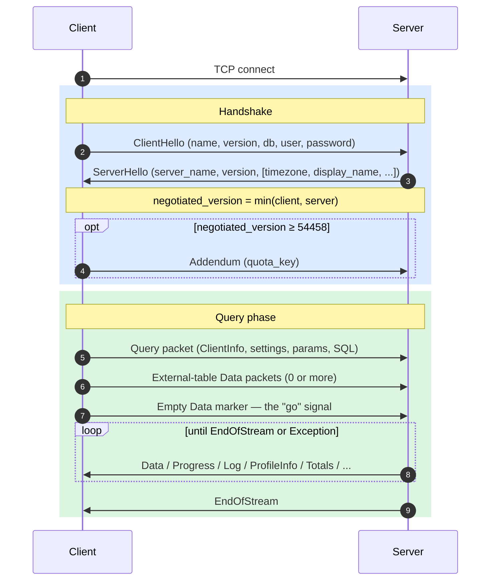
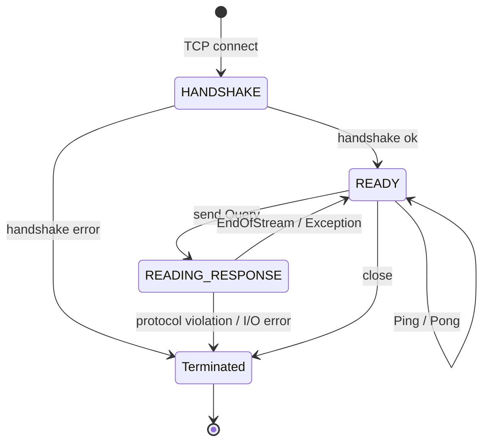
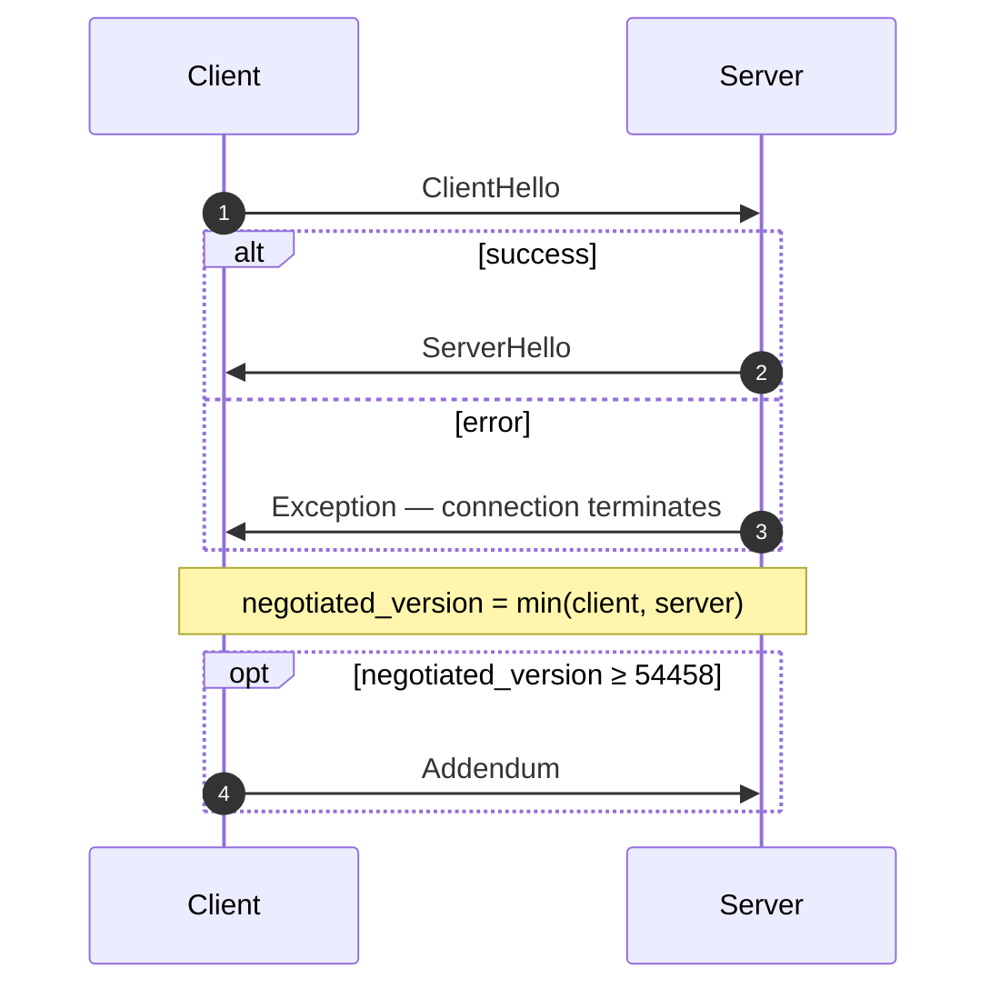
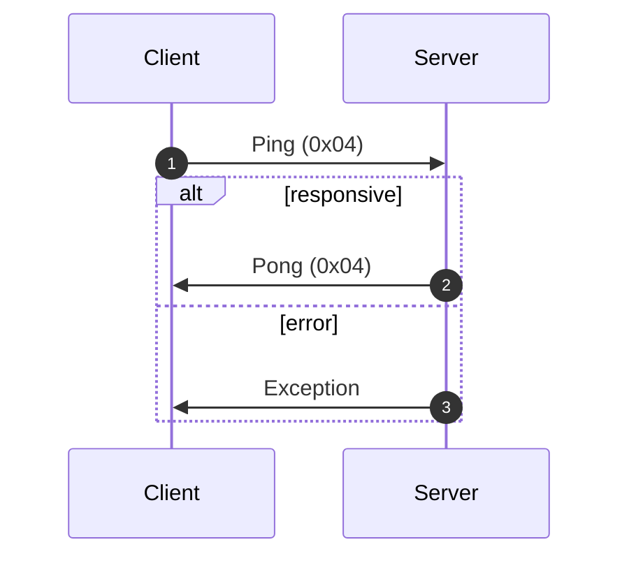
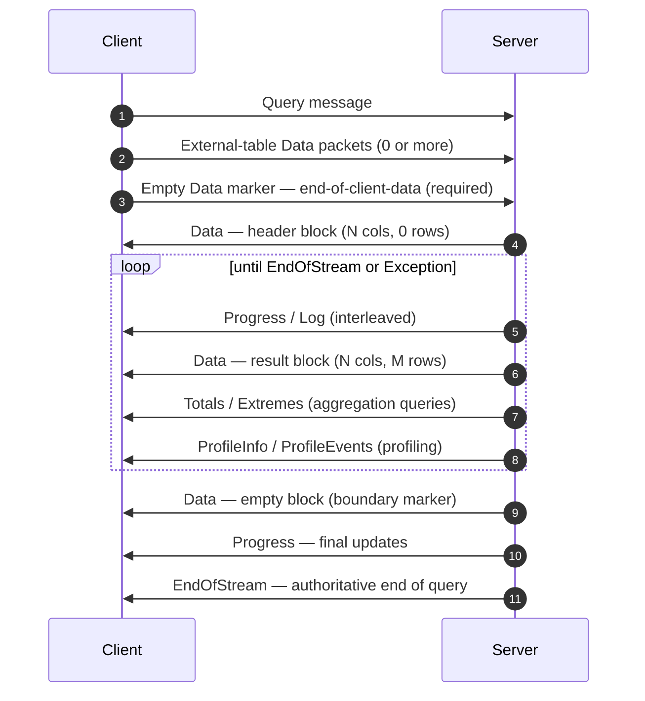
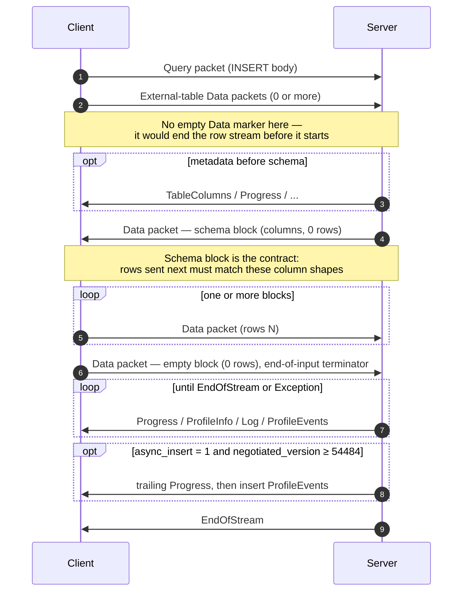
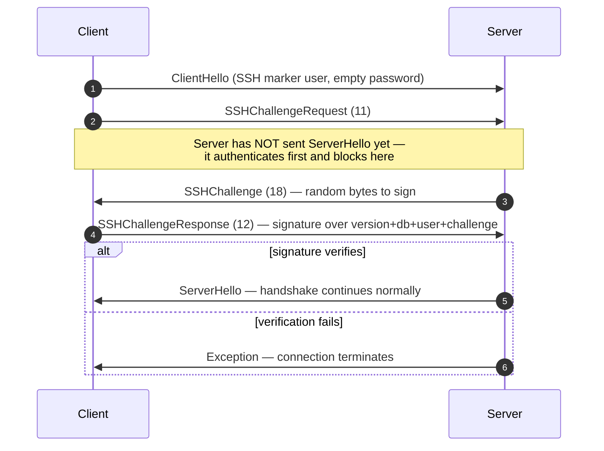

네이티브 프로토콜은 ClickHouse 클라이언트와 서버가 TCP를 통해 통신할 때 사용하는 바이너리 기반 연결 지향 프로토콜입니다. 이 프로토콜은 SQL 쿼리, 결과 데이터, `INSERT` 페이로드, 실행 텔레메트리, 그리고 오류 신호를 전달합니다. command-line client와 C++, 그리고 대부분의 타사 네이티브 드라이버에서 사용하는 프로토콜이기도 합니다.

이 페이지에서는 프로토콜 자체를 다룹니다. 구체적으로는 packet framing, connection state machine, 버전 협상, 그리고 `Block`이 아닌 모든 메시지의 본문을 설명합니다. `Data` 계열 packet 내부의 바이트(`Block`, 그 컬럼, 그리고 유형별 인코딩)는 별개의 주제이며, [Native 형식](/ko/interfaces/specs/NativeFormat) 명세에서 다룹니다.

:::note 함께 제공되는 명세
이 페이지는 한 쌍의 명세 중 하나이며, 함께 제공되는 [Native 형식](/ko/interfaces/specs/NativeFormat) 명세와 같이 게시됩니다. 두 명세는 역할이 명확히 나뉩니다. 이 페이지는 packet 및 전송 계층을 다루고, Native 형식 명세는 `Data` 계열 packet 내부의 바이트를 다룹니다.
:::

몇 가지 특성은 전체적으로 일관되게 적용됩니다. 이 프로토콜은 바이너리이면서 위치 기반이므로 `BlockInfo` 내부를 제외하면 필드 태그가 없습니다. 따라서 바이트 하나만 잘못 들어가도 그 뒤의 모든 내용이 역직렬화 불일치 상태가 됩니다. 또한 상태 유지형 프로토콜이며, 각 TCP 연결은 한 번에 하나의 쿼리만 처리합니다. 즉, 멀티플렉싱은 지원하지 않습니다. 고정 폭 정수는 리틀 엔디언입니다.

<div id="overview">
  ## 개요
</div>

| Property | Value                                                         |
| -------- | ------------------------------------------------------------- |
| 전송 방식    | TCP, 필요에 따라 TLS로 래핑 가능                                        |
| 바이트 순서   | 고정 길이 정수에는 리틀 엔디언 사용                                          |
| 인코딩      | 바이너리 및 위치 기반(`BlockInfo`를 제외하면 필드 태그 없음)                      |
| 연결 모델    | 상태 유지형, 한 번에 하나의 쿼리, 멀티플렉싱 없음                                 |
| 버전 관리    | 핸드셰이크 중 협상되며, 개별 기능은 버전에 따라 제어됩니다                             |
| 데이터 포맷   | 모든 테이블 형식 데이터에 [Native 형식](/ko/interfaces/specs/NativeFormat) 사용 |

wire 상의 모든 메시지는 `VarUInt` 패킷 유형 코드로 시작하며, 그 뒤에는 해당 코드와 협상된 프로토콜 버전에 따라 형태가 달라지는 본문이 이어집니다.

연결은 세 단계로 진행됩니다. 즉, 일회성 핸드셰이크를 수행한 뒤 `Ping` 또는 `Query` 교환을 여러 차례 처리하고, 마지막에 종료합니다:



네이티브 TCP 프로토콜은 SQL의 `FORMAT` 절과 관계없이 항상 Native 형식으로 테이블형 데이터를 전송합니다. 이를 `RowBinary`, `CSV`, `JSON` 등으로 다시 포맷하는 작업은 클라이언트가 Native 블록을 디코딩한 후 수행하는 역할입니다. (HTTP 인터페이스는 `FORMAT` 절을 실제로 따르는 별도의 코드 경로이지만, 여기서는 범위에 포함되지 않습니다.)

<div id="security">
  ## 보안
</div>

<div id="transport-security">
  ### 전송 보안(TLS)
</div>

TLS는 프로토콜보다 아래에 있는 전송 계층에서 동작합니다. TLS를 활성화하면 전체 TCP 스트림이 암호화되지만, TLS 사용 여부와 무관하게 프로토콜 메시지 자체는 바이트 수준까지 동일합니다.

<div id="authentication">
  ### 인증
</div>

인증은 핸드셰이크 과정에서 [`ClientHello`](#clienthello) 메시지로 수행됩니다. `user` 및 `password` 필드는 평문 문자열로 전송되므로, 전송 중 자격 증명은 전송 계층 암호화(TLS)로 보호됩니다.

SSH 챌린지-응답 인증은 프로토콜 버전 54466부터 사용할 수 있습니다 — 자세한 내용은 [SSH 챌린지-응답 인증](#ssh-authentication)을 참조하십시오.

<div id="inter-server-secret">
  ### 서버 간 시크릿
</div>

분산 쿼리 실행을 위해 서버는 공유 시크릿을 알고 있음을 증명하는 방식으로 서로를 인증하며, 시크릿 자체를 wire로 전송하지 않습니다. 각 Query는 salt, nonce, 설정된 시크릿, 그리고 쿼리를 바탕으로 계산한 32바이트 SHA-256 `auth_hash`를 [`Query`](#query) 필드 4에 담고 있으며, 수신 서버는 이를 다시 계산해 비교합니다. 이 동작은 `INTERSERVER_SECRET` 기능(v54441)으로 제어됩니다. 외부 클라이언트는 항상 여기에 빈 문자열을 보냅니다. 자세한 내용은 [서버 간 인증](#inter-server-authentication)을 참조하십시오.

<div id="versioning-and-feature-gates">
  ## 버전 관리와 기능 게이트
</div>

<div id="version-negotiation">
  ### 버전 협상
</div>

클라이언트와 서버는 핸드셰이크 중에 각각 지원하는 최대 프로토콜 버전을 선언합니다. **협상된 버전**은 두 버전 중 더 낮은 버전입니다:

```text
negotiated_version = min(client_version, server_version)
```

그 이후의 모든 메시지는 협상된 버전을 기준으로 wire상에 어떤 필드가 포함될지 결정합니다.

<div id="feature-gates">
  ### 기능 게이트
</div>

기능은 해당 기능이 도입된 프로토콜 버전으로 식별되며, 협상된 버전이 그 번호 이상이면 **활성** 상태가 됩니다.

:::warning
기능이 활성 상태이면 해당 필드는 wire에 **반드시** 포함되어야 합니다. 이 프로토콜은 필드 위치에 엄격히 의존하므로, 기능 게이트가 적용된 필드를 생략하면 그 뒤의 모든 필드에 대한 바이트 스트림이 손상됩니다.
:::

<div id="feature-table">
  ### 기능 표
</div>

| 기능                                                      | 버전    | 영향 대상                            | wire 영향                                                                                                                                                                                                                                                                                                                                                                                                                                                                                                                                  |
| ------------------------------------------------------- | ----- | -------------------------------- | ---------------------------------------------------------------------------------------------------------------------------------------------------------------------------------------------------------------------------------------------------------------------------------------------------------------------------------------------------------------------------------------------------------------------------------------------------------------------------------------------------------------------------------------- |
| BLOCK&#95;INFO                                          | all   | Block                            | 모든 Block에 BlockInfo 접두사(`is_overflows`, `bucket_number`)를 추가합니다.                                                                                                                                                                                                                                                                                                                                                                                                                                                                         |
| CLIENT&#95;INFO                                         | 54032 | Query                            | Query body에 ClientInfo block을 추가합니다.                                                                                                                                                                                                                                                                                                                                                                                                                                                                                                     |
| TIMEZONE                                                | 54058 | ServerHello                      | ServerHello에 `timezone` field를 추가합니다.                                                                                                                                                                                                                                                                                                                                                                                                                                                                                                    |
| QUOTA&#95;KEY&#95;IN&#95;CLIENT&#95;INFO                | 54060 | ClientInfo                       | ClientInfo에 `quota_key` field를 추가합니다.                                                                                                                                                                                                                                                                                                                                                                                                                                                                                                    |
| DISPLAY&#95;NAME                                        | 54372 | ServerHello                      | ServerHello에 `display_name` field를 추가합니다.                                                                                                                                                                                                                                                                                                                                                                                                                                                                                                |
| VERSION&#95;PATCH                                       | 54401 | ServerHello, ClientInfo          | 두 곳 모두에 `version_patch` field를 추가합니다.                                                                                                                                                                                                                                                                                                                                                                                                                                                                                                    |
| SERVER&#95;LOGS                                         | 54406 | Log                              | `send_logs_level`이 설정되면 server가 Log packet을 전송합니다.                                                                                                                                                                                                                                                                                                                                                                                                                                                                                       |
| COLUMN&#95;DEFAULTS&#95;METADATA                        | 54410 | TableColumns                     | Server는 INSERT/input schema block 전에 컬럼 기본값 메타데이터가 포함된 [`TableColumns`](#tablecolumns) packet(type 11)을 보낼 수 있습니다. 협상된 버전이 54410 이상이고 `input_format_defaults_for_omitted_fields`가 활성화된 경우에만 전송됩니다. 이 버전보다 낮으면 packet은 절대 전송되지 않으므로 클라이언트는 이를 기다리면 안 됩니다.                                                                                                                                                                                                                                                                                 |
| WRITE&#95;CLIENT&#95;INFO                               | 54420 | Progress                         | Progress에 `wrote_rows` 및 `wrote_bytes`를 추가합니다. (이름과는 달리, 이것은 ClientInfo block의 사용 여부를 제어하지 **않습니다** — 이를 제어하는 것은 `CLIENT_INFO`(v54032)입니다.)                                                                                                                                                                                                                                                                                                                                                                                              |
| SETTINGS&#95;SERIALIZED&#95;AS&#95;STRINGS              | 54429 | Query (settings encoding)        | 항상 존재하는 settings 목록의 인코딩 **방식**을 변경하며, settings를 전송할지 여부를 제어하지는 **않습니다**. v54429+에서는 각 setting을 `(name, flags, value-as-string)`으로 기록하고, 이전 peer는 flags 없이 `(name, type-specific-binary-value)`로 기록합니다. [Setting](#setting)을 참조하십시오.                                                                                                                                                                                                                                                                                                     |
| INTERSERVER&#95;SECRET                                  | 54441 | Query                            | Query에 서버 간 `auth_hash` field를 추가합니다 — 원시 시크릿이 아니라 cluster secret에 salt를 적용한 SHA-256입니다. 외부 클라이언트는 빈 문자열을 보냅니다. [Inter-server authentication](#inter-server-authentication)을 참조하십시오.                                                                                                                                                                                                                                                                                                                                                     |
| OPEN&#95;TELEMETRY                                      | 54442 | ClientInfo                       | ClientInfo에 OpenTelemetry trace context를 추가합니다.                                                                                                                                                                                                                                                                                                                                                                                                                                                                                          |
| DISTRIBUTED&#95;DEPTH                                   | 54448 | ClientInfo                       | ClientInfo에 `distributed_depth` field를 추가합니다.                                                                                                                                                                                                                                                                                                                                                                                                                                                                                            |
| INITIAL&#95;QUERY&#95;START&#95;TIME                    | 54449 | ClientInfo                       | `initial_time` field(Int64, 고정 폭)를 추가합니다.                                                                                                                                                                                                                                                                                                                                                                                                                                                                                                |
| PROFILE&#95;EVENTS                                      | 54451 | ProfileEvents                    | server가 쿼리 실행 중 ProfileEvents packet을 전송합니다.                                                                                                                                                                                                                                                                                                                                                                                                                                                                                             |
| PARALLEL&#95;REPLICAS                                   | 54453 | ClientInfo                       | ClientInfo에 병렬 레플리카 조정 field를 추가합니다.                                                                                                                                                                                                                                                                                                                                                                                                                                                                                                     |
| CUSTOM&#95;SERIALIZATION                                | 54454 | Block (Column)                   | 각 컬럼의 type string 뒤에 `has_custom_serialization` byte를 추가합니다.                                                                                                                                                                                                                                                                                                                                                                                                                                                                             |
| ADDENDUM                                                | 54458 | Handshake                        | 클라이언트는 handshake 교환 후 addendum(`quota_key`)을 전송합니다.                                                                                                                                                                                                                                                                                                                                                                                                                                                                                      |
| PARAMETERS                                              | 54459 | Query                            | Query body에 매개변수 목록을 추가합니다.                                                                                                                                                                                                                                                                                                                                                                                                                                                                                                              |
| SERVER&#95;QUERY&#95;TIME&#95;IN&#95;PROGRESS           | 54460 | Progress                         | Progress에 `elapsed_ns` field를 추가합니다.                                                                                                                                                                                                                                                                                                                                                                                                                                                                                                     |
| PASSWORD&#95;COMPLEXITY&#95;RULES                       | 54461 | ServerHello                      | ServerHello에 비밀번호 정책 regex 패턴 목록과 사람이 읽기 쉬운 메시지를 추가합니다.                                                                                                                                                                                                                                                                                                                                                                                                                                                                                  |
| INTERSERVER&#95;SECRET&#95;V2                           | 54462 | ServerHello                      | ServerHello에 8-byte `UInt64` nonce를 추가합니다. 서버 간 쿼리 서명에 사용되며, 외부 클라이언트는 이를 디코딩한 뒤 무시합니다.                                                                                                                                                                                                                                                                                                                                                                                                                                                  |
| TOTAL&#95;BYTES&#95;IN&#95;PROGRESS                     | 54463 | Progress                         | Progress에 `total_bytes_to_read`(VarUInt) field를 `total_rows`와 `wrote_rows` 사이에 추가합니다.                                                                                                                                                                                                                                                                                                                                                                                                                                                    |
| TIMEZONE&#95;UPDATES                                    | 54464 | TimezoneUpdate                   | `TimezoneUpdate` server packet(type 17)을 추가합니다. Body: session timezone을 담는 단일 `String`. `input` 테이블 함수 initializer에서만 input-schema block 바로 뒤에 전송되므로, 클라이언트는 자신이 보내는 행을 server의 `session_timezone`으로 파싱합니다. [TimezoneUpdate](#timezoneupdate)를 참조하십시오.                                                                                                                                                                                                                                                                                   |
| SPARSE&#95;SERIALIZATION                                | 54465 | Block (Column)                   | Server는 `has_custom_serialization = 1`을 설정하고 희소 인코딩된 컬럼을 전송할 수 있습니다. Wire 포맷: 1-byte kind(0x01 = SPARSE), 그다음 EOG로 종료되는 VarUInt offset stream, 그리고 내부 유형으로 조밀하게 인코딩된 non-default values입니다. [kind&#95;stack and sparse encoding](/ko/interfaces/specs/NativeFormat#kind-stack-and-sparse-encoding)을 참조하십시오.                                                                                                                                                                                                                                 |
| SSH&#95;AUTHENTICATION                                  | 54466 | Auth flow                        | SSH 챌린지-응답 인증을 추가합니다. 옵트인 방식: 이를 트리거하려면 클라이언트가 빈 password와 함께 `" SSH KEY AUTHENTICATION " + <real_user>` 형식의 `user`를 보냅니다. [SSH challenge-response authentication](#ssh-authentication)을 참조하십시오.                                                                                                                                                                                                                                                                                                                                         |
| TABLE&#95;READ&#95;ONLY&#95;CHECK                       | 54467 | TablesStatusResponse             | TablesStatusResponse에서 각 table 행에 `is_readonly` flag를 추가합니다. `TablesStatusRequest`를 보내지 않는 외부 클라이언트에는 wire 변경이 없습니다.                                                                                                                                                                                                                                                                                                                                                                                                                     |
| SYSTEM&#95;KEYWORDS&#95;TABLE                           | 54468 | system tables                    | canonical `clickhouse-client`가 keyword 자동 완성을 할 수 있도록 server가 `system.keywords`를 채웁니다. 네이티브 protocol의 wire 변경은 없습니다.                                                                                                                                                                                                                                                                                                                                                                                                                     |
| ROWS&#95;BEFORE&#95;AGGREGATION                         | 54469 | ProfileInfo                      | ProfileInfo의 끝부분에 `applied_aggregation`(Bool)과 `rows_before_aggregation`(VarUInt)을 이 순서대로 추가합니다.                                                                                                                                                                                                                                                                                                                                                                                                                                         |
| CHUNKED&#95;PROTOCOL                                    | 54470 | Connection framing               | packet별 청크 프레이밍이 모든 packet body를 감쌉니다. Addendum에서 협상됩니다. ServerHello는 각 방향에 대한 server의 선호도를 담고, Addendum은 클라이언트의 최종 선택을 담습니다. [chunked framing](#chunked-framing)을 참조하십시오.                                                                                                                                                                                                                                                                                                                                                               |
| VERSIONED&#95;PARALLEL&#95;REPLICAS&#95;PROTOCOL        | 54471 | ServerHello, Addendum            | 양측은 병렬 레플리카 조정 프로토콜 버전 `VarUInt`를 교환합니다. ServerHello의 필드는 **`protocol_version` 바로 뒤**(`timezone` 앞)에 위치합니다. Addendum의 필드는 chunked-protocol 문자열 뒤에 추가됩니다. 현재 값: `8` (`DBMS_PARALLEL_REPLICAS_PROTOCOL_VERSION`). 버전 `8`은 [`MergeTreeAllRangesAnnouncementResponse`](#mergetreeallrangesannouncementresponse) (클라이언트 패킷 `14`)를 추가합니다. 협상된 병렬 레플리카 버전이 `≥ 8`이면 initiator는 모든 비-`Default` 모드 팔로워 announcement에 대해 해당 stream의 authoritative parts 목록으로 응답하며, 팔로워는 읽기 요청을 보내기 전에 이를 기다립니다. `8` 미만에서는 announcement가 fire-and-forget 방식으로 처리됩니다. |
| INTERSERVER&#95;EXTERNALLY&#95;GRANTED&#95;ROLES        | 54472 | Query                            | Query body에 `String external_roles` 필드를 추가하며, settings terminator와 interserver-secret hash 사이에 위치합니다. 외부 클라이언트는 빈 role 목록(단일 바이트 `0x00`, 즉 String envelope 내부의 VarUInt 0)을 전송합니다.                                                                                                                                                                                                                                                                                                                                                        |
| V2&#95;DYNAMIC&#95;AND&#95;JSON&#95;SERIALIZATION       | 54473 | Column body                      | 서버는 `Dynamic` 및 `JSON` 컬럼 타입에 대해 V2 serialization을 사용할 수 있으며, 이는 어떤 `state_prefix` 버전을 사용할지를 결정합니다. [versioned types](/ko/interfaces/specs/NativeFormat#versioned-types)를 참조하십시오.                                                                                                                                                                                                                                                                                                                                                           |
| SERVER&#95;SETTINGS                                     | 54474 | ServerHello                      | 서버는 기본값이 아닌 설정을 `nonce` 뒤, ServerHello 끝부분에 목록으로 브로드캐스트합니다. 포맷: 빈 키로 종료되는 `(key, flags, value)` 삼중항 — Query 패킷의 settings 목록과 동일합니다.                                                                                                                                                                                                                                                                                                                                                                                                      |
| QUERY&#95;AND&#95;LINE&#95;NUMBERS                      | 54475 | ClientInfo                       | ClientInfo 끝부분에 `script_query_number` (VarUInt)와 `script_line_number` (VarUInt)를 추가합니다. clickhouse-client가 다중 구문 스크립트 오류의 위치를 식별하는 데 사용하며, 외부 클라이언트는 `0, 0`을 전송합니다.                                                                                                                                                                                                                                                                                                                                                                      |
| JWT&#95;IN&#95;INTERSERVER                              | 54476 | ClientInfo                       | ClientInfo 끝부분에 JWT 존재 여부를 나타내는 UInt8과 선택적 `String jwt`를 추가합니다. 외부 클라이언트(JWT 없음)는 바이트 `0x00`을 전송합니다. (C++에서는 `DBMS_MIN_REVISON_WITH_JWT_IN_INTERSERVER`로 표기되며, 상수 이름에 오타가 있다는 점에 유의하십시오.)                                                                                                                                                                                                                                                                                                                                                |
| QUERY&#95;PLAN&#95;SERIALIZATION                        | 54477 | ServerHello, QueryPlan packet    | ServerHello는 서버 settings 뒤에 `VarUInt query_plan_serialization_version`을 추가합니다. 또한 미리 생성된 쿼리 계획의 서버 간 전달을 위한 `ClientPacket::QueryPlan` (코드 `13`)을 도입합니다 — 외부 클라이언트는 이를 전송하지 않습니다.                                                                                                                                                                                                                                                                                                                                                         |
| PARALLEL&#95;BLOCK&#95;MARSHALLING                      | 54478 | Block (Column)                   | 서버는 병렬 처리를 위해 컬럼을 `ColumnBLOB`(인라인 compressed)으로 래핑할 수 있습니다. 이는 쿼리에서 compression이 활성화되어 있고 `rows > 1`인 경우에만 적용되며, 그렇지 않으면 일반 컬럼 wire 형식이 적용됩니다. 나가는 Query 패킷에서 compression을 활성화하지 않는 클라이언트는 wire 변경을 보지 않습니다.                                                                                                                                                                                                                                                                                                                            |
| VERSIONED&#95;CLUSTER&#95;FUNCTION&#95;PROTOCOL         | 54479 | ServerHello                      | ServerHello 끝부분에 `VarUInt cluster_function_protocol_version`을 추가합니다. `*Cluster` table function(`s3Cluster` 등)에 사용됩니다. 현재 값은 `8` (`DBMS_CLUSTER_PROCESSING_PROTOCOL_VERSION`)입니다. 버전 `7`은 private-repository 기능(Iceberg compaction)을 위해 예약되어 있으며, `8`은 서버 간 cluster read-task payload(`ReadTaskResponse` body, 여기서는 여전히 명세되지 않음 — 아래 참조)에 선택적 `read_source_index`를 추가합니다. 외부 클라이언트는 이를 디코드한 뒤 무시합니다.                                                                                                                                      |
| OUT&#95;OF&#95;ORDER&#95;BUCKETS&#95;IN&#95;AGGREGATION | 54480 | BlockInfo                        | BlockInfo의 field-tagged stream에 필드 3 (`out_of_order_buckets: Vec<Int32>`)을 추가합니다. `[VarUInt count][Int32]*count`로 디코드됩니다. 외부 클라이언트는 이를 직접 내보내지 않으며, 디코더는 서버가 보내는 비어 있지 않은 목록을 모두 읽습니다.                                                                                                                                                                                                                                                                                                                                                   |
| COMPRESSED&#95;LOGS&#95;PROFILE&#95;EVENTS&#95;COLUMNS  | 54481 | Log, ProfileEvents, TableColumns | 서버는 [`Log`](#log), [`ProfileEvents`](#profileevents), [`TableColumns`](#tablecolumns) 패킷 body를 [compression frame](/ko/interfaces/specs/NativeFormat#compression-frame)으로 래핑할 수 있습니다. 이 버전에서는 세 body가 모두 동일한 선택적 압축 출력 경로를 통해 전달되며, 쿼리에 `compression = true`가 설정된 경우에만 실제 compression frame이 됩니다. 나가는 Query 패킷에서 compression을 활성화하지 않는 클라이언트는 wire 변경을 보지 않습니다.                                                                                                                                                                             |
| REPLICATED&#95;SERIALIZATION                            | 54482 | Block (Column)                   | 서버는 kind&#95;stack `0x04 = REPLICATED`를 사용하는 컬럼을 내보낼 수 있습니다 — 반복되는 값에 대한 dictionary 스타일의 compact 형식입니다 — [kind&#95;stack and sparse encoding](/ko/interfaces/specs/NativeFormat#kind-stack-and-sparse-encoding)을 참조하십시오. 이 버전 미만에서는 writer가 전송 전에 이러한 컬럼을 펼쳐서 보냈습니다. 인덱스 조회(`elements[indexes[i]]`를 각 행에 적용)를 통해 디코드되며, leaf 타입과 `Nullable`/`Array`/`Tuple`/`Map`/`Nested`/`LowCardinality` inner를 지원합니다.                                                                                                                                   |
| NULLABLE&#95;SPARSE&#95;SERIALIZATION                   | 54483 | Block (Column)                   | 희소 serialization을 `Nullable(T)`와 조합합니다. 이 버전 미만에서는 writer가 전송 전에 Nullable 컬럼의 sparse 표현을 펼쳐서 보냈으며, v54483+에서는 wire 데이터가 sparse-over-Nullable입니다. [kind&#95;stack and sparse encoding](/ko/interfaces/specs/NativeFormat#kind-stack-and-sparse-encoding)을 참조하십시오.                                                                                                                                                                                                                                                                            |
| PROGRESS&#95;IN&#95;ASYNC&#95;INSERT                    | 54484 | Progress (INSERT)                | **비동기** INSERT(`async_insert = 1`)에서 삽입이 flush되면 서버는 `EndOfStream` 전에 추가 [`Progress`](#progress) 패킷 하나와 그 뒤에 삽입의 `ProfileEvents`를 전송합니다. 이는 *협상된* 버전이 54484 이상일 때만 적용되며, 그 미만에서는 서버가 이 후행 Progress를 생략합니다. Progress wire 형식 자체는 바뀌지 않으며, 새로 추가된 것은 전송 여부뿐입니다. 실제로 증가분에는 경과 시간이 담기며, 기록된 행 카운터는 함께 전송되는 ProfileEvents를 통해 보고됩니다. 이미 interleaved Progress를 처리하는 클라이언트는 포맷 변경 없이 패킷 하나가 더 올 수 있음을 허용하면 됩니다.                                                                                                                                 |
| CLIENT&#95;AGENT&#95;IN&#95;CLIENT&#95;INFO             | 54485 | ClientInfo                       | ClientInfo에 후행 `client_agent` `String`을 추가합니다. canonical client는 환경에서 agent 식별자를 자동으로 감지합니다(예: `claude-code`, `cursor`, `gemini-cli`, 또는 `AGENT` 변수 값). 감지된 값이 없는 외부 클라이언트는 빈 문자열을 전송합니다. 협상된 버전이 54485 이상이면 필수이며, 이를 생략하면 Query 패킷의 나머지 부분과 동기화가 어긋납니다.                                                                                                                                                                                                                                                                                 |
| INTERNAL&#95;QUERY&#95;FLAG                             | 54486 | ClientInfo                       | ClientInfo에 후행 `is_internal` `UInt8`을 추가합니다. 서버 내부 쿼리(사용자가 실행한 것이 아님)에는 `1`이 설정되며, 원격 쿼리에도 전파되어 해당 `system.query_log` 행이 internal로 표시됩니다. 외부 클라이언트는 `0`을 전송합니다. 협상된 버전이 54486 이상이면 필수이며, 이를 생략하면 Query 패킷의 나머지 부분과 동기화가 어긋납니다.                                                                                                                                                                                                                                                                                                           |

<div id="packet-envelope">
  ## 패킷 엔벨로프
</div>

wire 상의 모든 메시지는 송수신 양방향에서 동일한 외부 구조를 가집니다:

```text
[VarUInt: packet_type_code]    always encoded as VarUInt
[message body]                 format depends on packet_type_code
```

전체 패킷 유형 표는 [패킷 유형 참고](#packet-type-reference)에 있습니다.

패킷 유형은 고정 길이 바이트가 아니라 `VarUInt`입니다. 값이 128 미만이면 `VarUInt`는 동일한 1바이트를 생성하지만, 향후 패킷 유형이 128 이상이 되더라도 호환성을 유지할 수 있도록 구현에서는 반드시 `VarUInt` 인코딩을 사용해야 합니다.

[메시지 참고](#message-reference)에는 각 패킷의 **본문**만 문서화되어 있습니다 — 즉, 패킷 유형 코드 뒤에 오는 바이트입니다. 필드 번호는 첫 번째 본문 필드를 1로 하여 시작합니다.

<div id="chunked-framing">
  ### 청크 프레이밍 (v54470+)
</div>

`CHUNKED_PROTOCOL` 기능이 **협상**되면([핸드셰이크](#handshake-phase) 참조), wire 상의 모든 패킷은 청크 프레이밍으로 래핑됩니다. 이 래핑은 **방향별**로 적용됩니다. 즉, 클라이언트→서버와 서버→클라이언트는 각각 별도로 협상되며, 서로 다른 모드(청크 방식 또는 비프레이밍 방식)로 결정될 수 있습니다.

패킷별 wire layout:

```text
<chunk>...   one or more chunks; their payloads concatenated form the whole packet
[u32 LE = 0] zero-size terminator marking end of packet
```

청크별 wire 레이아웃:

```text
[u32 LE: chunk_size]   chunk_size in [1, UINT32_MAX]
[chunk_size bytes]     packet bytes (see note below)
```

패킷 유형 `VarUInt`는 청크된 스트림 **내부에** 있습니다. 즉, 프레이밍보다 앞서 별도의 바이트로 전송되는 것이 아니라 패킷 payload의 첫 번째 바이트(첫 번째 청크의 첫 번째 바이트)입니다. 각 패킷의 청크 payload는 [패킷 엔벌로프](#packet-envelope)의 전체 `[VarUInt packet_type_code][message body]`입니다. 패킷 유형을 청크된 스트림 바깥에 두는 클라이언트는 상대편이 그 유형 바이트를 `u32` 청크 크기의 첫 번째 바이트로 읽게 만들어 connection의 동기화를 잃게 합니다.

단일 패킷은 writer의 버퍼가 패킷 도중 가득 차면 여러 청크에 걸쳐 분할될 수 있습니다. 분할 지점은 패킷 유형의 `VarUInt` 내부를 포함해 어디든 될 수 있습니다. reader는 청크 payload를 이어 붙인 뒤, 마지막의 4바이트 0을 투명한 패킷 경계로 처리합니다. 즉, 이를 소비하지만 패킷 body를 읽는 쪽에는 노출하지 않습니다.

body가 없는 패킷도 여전히 래핑됩니다. `Ping` 또는 `Pong`처럼 1바이트짜리 패킷은 chunking이 협상되면 `[u32 size = 1][0x04][u32 0]`가 됩니다. 이 페이지의 다른 곳에 나오는 &quot;single byte on the wire&quot; 설명은 모두 청크 적용 전 형식을 가리킵니다.

**협상.** ServerHello와 Addendum은 각각 방향별로 하나씩, 총 2개의 `String` 필드를 가지며 값은 `{"chunked", "notchunked", "chunked_optional", "notchunked_optional"}`에서 선택됩니다.

* `chunked` / `notchunked`는 엄격합니다. 해당 방향은 정확히 그 모드를 요구합니다.
* `_optional` 변형은 유연합니다. 상대편이 선택한 모드를 그대로 받아들입니다.

각 방향의 합의 값은 쌍으로 비교해 다음과 같이 계산됩니다.

| Server pref         | Client pref         | Agreed                                        |
| ------------------- | ------------------- | --------------------------------------------- |
| `*_optional`        | anything            | CLIENT를 따름 (its `starts_with("chunked")`)     |
| anything            | `*_optional`        | SERVER를 따름                                    |
| `chunked` strict    | `chunked` strict    | `chunked`                                     |
| `notchunked` strict | `notchunked` strict | `notchunked`                                  |
| strict mismatch     | strict mismatch     | **protocol error** — connection을 반드시 종료해야 합니다 |

클라이언트 측에서는 클라이언트의 SEND 선호가 서버의 RECV 선호와 협상되고, 반대로도 동일하게 적용됩니다.

**시점.** 협상 문자열은 프레이밍되지 않은 wire를 통해 전달됩니다. ClientHello → ServerHello (server prefs) → Addendum (client&#39;s negotiated values). 프레이밍 전환은 Addendum이 플러시된 *이후* 전송되는 모든 바이트에 적용됩니다. Addendum 자체와 ClientHello, ServerHello는 항상 프레이밍되지 않습니다.

<div id="connection-lifecycle">
  ## 연결 수명 주기
</div>

연결은 어느 시점에서든 정확히 네 가지 상태 중 하나입니다: `HANDSHAKE`, `READY`, `READING_RESPONSE`, 또는 종료 상태입니다. 프로토콜은 멀티플렉싱을 지원하지 않으므로, 이전 응답을 모두 읽기 전에 클라이언트가 새 request를 보내면 wire 상의 바이트가 뒤섞여 stream이 손상됩니다.

<div id="states">
  ### 상태
</div>



정상 흐름은 `HANDSHAKE → READY → READING_RESPONSE → READY`로 곧게 이어지며, `Ping`/`Pong` 자체 루프와 모든 실패 분기는 하나의 `Terminated` 싱크로 수렴합니다.

| State              | Description                                                                                                                                                                                  |
| ------------------ | -------------------------------------------------------------------------------------------------------------------------------------------------------------------------------------------- |
| `HANDSHAKE`        | TCP 연결이 열린 직후의 초기 상태입니다. [handshake](#handshake-phase) 메시지만 유효합니다. 성공하면 `READY`로 전이되며, 실패하면 종료됩니다.                                                                                           |
| `READY`            | 유휴 상태입니다. 클라이언트는 [Ping](#ping-phase), [쿼리](#query-phase)를 보내거나 연결을 닫을 수 있습니다. 연결은 `READY` 상태로 무기한 유지될 수 있습니다(`idle_connection_timeout`의 적용을 받음, [connection limits](#connection-limits) 참조). |
| `READING_RESPONSE` | 클라이언트가 쿼리를 보내면 이 상태로 진입합니다. 클라이언트는 `READY`로 돌아가기 전에 서버의 응답 스트림을 끝까지 모두 읽어야 합니다. 이 상태에서 클라이언트→서버 방향으로 허용되는 유일한 패킷은 Cancel입니다(이 페이지에서는 지정하지 않음).                                               |
| Terminated         | 더 이상 사용할 수 없습니다. 클라이언트는 새 TCP 연결을 열고 handshake를 다시 시작해야 합니다.                                                                                                                                 |

<div id="handshake-phase">
  ### 핸드셰이크 단계
</div>

인증을 수행하고 프로토콜 버전을 협상합니다. 연결마다 정확히 한 번, 다른 어떤 작업보다 먼저 수행됩니다.

TCP 연결이 막 수립되었고 아직 어떤 메시지도 오가지 않았습니다. 흐름은 다음과 같습니다:



1. 클라이언트는 지원하는 최대 프로토콜 버전과 함께 [`ClientHello`](#clienthello)를 전송합니다.

2. 클라이언트는 응답을 읽고 패킷 유형에 따라 처리합니다:

   | 패킷 유형           | 작업                                                                                                            |
   | --------------- | ------------------------------------------------------------------------------------------------------------- |
   | `Hello` (0)     | [`ServerHello`](#serverhello)를 디코딩합니다. `negotiated_version = min(client_ver, server_ver)`를 계산합니다. 3단계로 진행합니다. |
   | `Exception` (2) | [`Exception`](#exception)을 디코딩합니다. 이를 오류로 반환하고 연결을 종료합니다.                                                     |
   | anything else   | 프로토콜 위반입니다. 연결을 종료합니다.                                                                                        |

3. `negotiated_version ≥ 54458`( `ADDENDUM` 기능)인 경우, 클라이언트는 [`Addendum`](#addendum)을 전송합니다. 이 결정은 클라이언트가 선언한 버전이 아니라 **협상된** 버전을 기준으로 합니다.

성공하면 연결은 `READY` 상태로 전환되며, 오류가 발생하면 종료됩니다.

<div id="ping-phase">
  ### Ping 단계
</div>

TCP keepalive와는 독립적인 애플리케이션 수준의 liveness 검사입니다. Ping/Pong 왕복이 성공하면 TCP 연결이 양방향 모두에서 살아 있으며 서버가 응답하고 있음을 확인할 수 있습니다. Ping은 무상태(stateless)이고 어떤 쿼리와도 연관되지 않으므로, 여러 개의 연속된 Ping은 서로 독립적입니다.

`READY`에서 시작하는 흐름은 다음과 같습니다:



1. 클라이언트가 [`Ping`](#ping)을 전송합니다.
2. 클라이언트가 응답을 읽습니다:

   | 패킷 유형           | 동작                                         |
   | --------------- | ------------------------------------------ |
   | `Pong` (4)      | 정상 상태가 확인됩니다. `READY` 상태로 돌아갑니다.           |
   | `Exception` (2) | [`Exception`](#exception)을 디코딩해 오류로 반환합니다. |
   | 그 외의 모든 경우      | 프로토콜 위반입니다.                                |

<div id="query-phase">
  ### 쿼리 단계
</div>

클라이언트는 SQL 문을 전송하고, 서버는 결과 블록과 실행 텔레메트리를 스트리밍하여 반환합니다. 응답은 정확히 하나의 `EndOfStream` 또는 `Exception`으로 끝나는 패킷 시퀀스입니다.

`READY`부터 흐름은 다음과 같습니다:



어느 시점에서든 오류가 발생하면 서버는 `EndOfStream` 대신 `Exception`을 보내며, 이로써 쿼리가 종료됩니다.

1. 클라이언트는 고유한 `query_id`(일반적으로 UUID)가 포함된 [`Query`](#query)를 보냅니다.
2. 클라이언트는 모든 external table을 보낸 다음 비어 있는 Data 마커를 보냅니다. 비어 있는 Data 패킷은 `table_name = ""`, `num_columns = 0`, `num_rows = 0`입니다. 서버는 이 마커를 받을 때까지 쿼리 실행을 시작하지 않습니다.
3. 클라이언트는 `READING_RESPONSE`로 전환하고 쓰기 버퍼를 플러시합니다.
4. 클라이언트는 루프에서 응답 패킷을 읽고, 유형에 따라 디스패치합니다:

   | 패킷 유형             | Action                                                                                                                        |
   | -------------------- | ----------------------------------------------------------------------------------------------------------------------------- |
   | `Data` (1)           | block을 디코드합니다. 첫 번째 Data는 schema 헤더이고, 그다음부터는 결과 block(누적 대상)이며, 빈 block은 경계 마커입니다. `num_rows == 0`은 쿼리 종료를 의미하는 것이 **아닙니다**. |
   | `Progress` (3)       | 실행 메트릭입니다. 각 패킷은 이전 패킷 이후의 **증가분**이므로 로컬에서 누적합니다.                                                                             |
   | `EndOfStream` (5)    | 쿼리가 완료되었습니다. 루프를 종료하고 `READY`로 돌아갑니다.                                                                                         |
   | `ProfileInfo` (6)    | 실행 후 profiling 데이터입니다.                                                                                                        |
   | `Totals` (7)         | 집계 합계 block입니다(Data와 동일한 wire 형식).                                                                                            |
   | `Extremes` (8)       | 최소/최대값 block입니다(Data와 동일한 wire 형식).                                                                                           |
   | `Log` (10)           | 서버 로그 한 줄입니다.                                                                                                                 |
   | `TableColumns` (11)  | 컬럼 기본값 metadata입니다.                                                                                                           |
   | `ProfileEvents` (14) | 성능 counters입니다.                                                                                                               |
   | `Exception` (2)      | 디코드한 뒤 오류로 반환합니다. 루프를 종료하고 `READY`로 돌아갑니다.                                                                                    |
   | anything else        | 쿼리 단계에서는 예기치 않은 경우입니다. 연결을 종료합니다.                                                                                             |

`EndOfStream` 또는 처리된 `Exception`이 발생하면 연결은 `READY`로 돌아갑니다. protocol 위반이나 I/O 오류가 발생하면 연결이 종료됩니다.

:::note
`num_rows == 0`인 경우는 새 구현에서 흔히 혼동하는 부분입니다. 행 수가 0인 block은 경계 마커이거나 schema 헤더이지, 스트림 종료 신호가 아닙니다. 응답은 `EndOfStream` 또는 `Exception`으로만 끝납니다.
:::

<div id="insert-phase">
  ### INSERT 단계
</div>

INSERT 단계는 [쿼리 단계](#query-phase)에 2번의 추가 교환이 더해진 것입니다. 클라이언트가 `INSERT` 구문을 전송하면 서버는 대상 테이블을 설명하는 **스키마 블록(schema block)** 으로 응답합니다. 그런 다음 클라이언트가 행이 담긴 Data packets를 스트리밍하고, 이어서 비어 있는 Data marker를 보냅니다. 마지막으로 서버는 `EndOfStream` 또는 `Exception`으로 마무리합니다.

`READY`부터 시작하면 SQL은 `INSERT INTO <table> [(<cols>)] VALUES` 형태의 `INSERT`이며, 행 데이터는 Data packets를 통해 전달되므로 인라인 `VALUES (...)` literal은 포함되지 않습니다. 흐름은 다음과 같습니다:



1. 클라이언트는 `body`를 INSERT SQL로 설정한 [`Query`](#query)를 전송합니다.
2. 클라이언트는 외부 테이블을 전송합니다(INSERT에서는 드문 경우입니다). [쿼리 단계](#query-phase)와 달리 여기서는 빈 Data marker를 **전송하지 않습니다**. `INSERT` `Query` packet은 대기 중인 데이터와 함께 전송되므로, 빈 데이터 종료 block은 5단계까지 미뤄집니다. 이를 schema block보다 먼저 전송하면 server가 이를 행 stream의 끝으로 해석하여 행 없이 INSERT를 완료하고, 이어서 첫 번째 실제 행 packet을 예상치 못한 최상위 packet으로 parse하게 됩니다.
3. 클라이언트는 schema Data packet을 읽을 때까지 metadata packet(TableColumns, Progress, ProfileInfo, Log, ProfileEvents)을 계속 읽습니다. 이 packet은 행 수는 0이지만 전체 컬럼 구조(이름과 타입)를 담고 있는 Block입니다. schema block은 일종의 계약입니다. 즉, 클라이언트가 다음에 전송하는 행은 이 컬럼 shape와 일치해야 합니다.
4. 클라이언트는 data block을 전송합니다. 각 block마다 `VarUInt(ClientPacket::Data = 2)`를 기록한 다음, 빈 외부 테이블 이름으로 `String("")`을 기록하고, 그다음 Block을 기록합니다. 컬럼 타입은 위치 기준으로 schema block의 컬럼과 일치해야 합니다.
5. 클라이언트는 입력 종료 terminator를 전송합니다. 즉, 빈 Block(0 columns, 0 rows)을 담은 Data packet입니다.
6. 클라이언트는 `EndOfStream`(성공) 또는 `Exception`(실패)에 도달할 때까지 response stream을 계속 읽습니다.

**비동기 INSERT (v54484+).** 쿼리에 `async_insert = 1`이 포함되면 server는 행을 큐에 넣고 batch의 일부로 플러시합니다. 협상된 버전이 54484 이상(`PROGRESS_IN_ASYNC_INSERT`)이면 플러시가 완료된 후 server는 추가 [`Progress`](#progress) packet을 하나 내보낸 뒤, 바로 insert의 `ProfileEvents`와 `EndOfStream`을 차례로 보냅니다. 54484 미만에서는 server가 이 마지막 Progress를 생략합니다. 이 packet은 일반적인 `Progress`입니다. server는 쓰기 count를 반영하기 전에 쿼리 pipeline을 재설정하므로, 실제로 이 증가분에는 경과 시간만 포함되고, 기록된 행 수와 바이트 통계는 함께 전송되는 `ProfileEvents`를 통해 클라이언트에 전달됩니다. 이미 6단계에서 섞여 들어오는 Progress를 모두 읽는 클라이언트라면 packet 하나를 추가로 처리할 수 있기만 하면 됩니다.

connection은 `EndOfStream` 또는 처리된 `Exception` 이후 `READY` 상태로 돌아갑니다. protocol violation과 I/O 오류가 발생하면 connection이 종료됩니다.

<div id="message-reference">
  ## 메시지 참고
</div>

필드는 wire 순서대로 나열됩니다. `Type` 컬럼은 다음 유형을 사용합니다:

* `VarUInt` — 가변 길이 부호 없는 정수([VarUInt](/ko/interfaces/specs/NativeFormat#varuint) 참조)
* `String` — VarUInt 길이 접두어가 붙은 바이트열([String](/ko/interfaces/specs/NativeFormat#string) 참조)
* `UInt8`, `Int32` 등 — 고정 폭 리틀 엔디언 정수
* `Bool` — `0x00` 또는 `0x01` 값을 갖는 1바이트

`Role` 컬럼은 각 필드를 누가 사용하는지 나타냅니다:

* **클라이언트** — 외부 클라이언트가 설정합니다.
* **서버 간** — 서버 간 통신에서만 의미가 있으며, 외부 클라이언트는 기본값을 씁니다.
* **공통** — 양쪽 모두에서 사용합니다.

이 표는 패킷 유형 코드 뒤에 오는 각 패킷의 본문만 문서화합니다.

<div id="clienthello">
  ### ClientHello (패킷 유형 0)
</div>

클라이언트 → 서버. TCP connection이 열린 직후 전송되는 첫 번째 메시지입니다.

| # | Field                | 유형      | 역할 | 설명                                  |
| - | -------------------- | ------- | -- | ----------------------------------- |
| 1 | client&#95;name      | String  | 공통 | 클라이언트 식별자(예: `"clickhouse-client"`) |
| 2 | version&#95;major    | VarUInt | 공통 | 클라이언트 major version                 |
| 3 | version&#95;minor    | VarUInt | 공통 | 클라이언트 minor version                 |
| 4 | protocol&#95;version | VarUInt | 공통 | 클라이언트가 지원하는 최대 protocol version     |
| 5 | database             | String  | 공통 | 기본 데이터베이스 이름                        |
| 6 | user                 | String  | 공통 | 인증에 사용하는 username                   |
| 7 | password             | String  | 공통 | 비밀번호(평문)                            |

<div id="serverhello">
  ### ServerHello (패킷 유형 0)
</div>

Server → Client. 인증이 성공했을 때 ClientHello에 대해 반환되는 응답입니다.

| #  | Field                                          | Type      | Role         | Condition                                                 | Description                                                                                                                                                                                                                                                                                  |
| -- | ---------------------------------------------- | --------- | ------------ | --------------------------------------------------------- | -------------------------------------------------------------------------------------------------------------------------------------------------------------------------------------------------------------------------------------------------------------------------------------------- |
| 1  | server&#95;name                                | String    | universal    | always                                                    | 서버 식별자                                                                                                                                                                                                                                                                                       |
| 2  | version&#95;major                              | VarUInt   | universal    | always                                                    | 서버 메이저 버전                                                                                                                                                                                                                                                                                    |
| 3  | version&#95;minor                              | VarUInt   | universal    | always                                                    | 서버 마이너 버전                                                                                                                                                                                                                                                                                    |
| 4  | protocol&#95;version                           | VarUInt   | universal    | always                                                    | 서버의 프로토콜 버전                                                                                                                                                                                                                                                                                  |
| 4a | parallel&#95;replicas&#95;protocol&#95;version | VarUInt   | universal    | VERSIONED&#95;PARALLEL&#95;REPLICAS&#95;PROTOCOL (v54471) | 서버의 병렬 레플리카 coordination 프로토콜 버전입니다. **Wire상 위치: `protocol_version` 바로 뒤**, `timezone` 앞입니다. 현재 값: `8`입니다.                                                                                                                                                                                   |
| 5  | timezone                                       | String    | universal    | TIMEZONE (v54058)                                         | 서버 시간대(예: `"UTC"`)                                                                                                                                                                                                                                                                           |
| 6  | display&#95;name                               | String    | universal    | DISPLAY&#95;NAME (v54372)                                 | 사람이 읽기 쉬운 서버 이름                                                                                                                                                                                                                                                                              |
| 7  | version&#95;patch                              | VarUInt   | universal    | VERSION&#95;PATCH (v54401)                                | 서버 패치 버전                                                                                                                                                                                                                                                                                     |
| 8  | proto&#95;send&#95;chunked&#95;srv             | String    | universal    | CHUNKED&#95;PROTOCOL (v54470)                             | 서버가 선호하는 Outbound 청킹 방식입니다. `"chunked"`, `"notchunked"`, `"chunked_optional"`, `"notchunked_optional"` 중 하나입니다. [청크 프레이밍](#chunked-framing)을 참조하십시오. **버전 게이트는 더 높지만 wire상에서는 `password_complexity_rules`보다 앞에 옵니다.**                                                                        |
| 9  | proto&#95;recv&#95;chunked&#95;srv             | String    | universal    | CHUNKED&#95;PROTOCOL (v54470)                             | 서버가 선호하는 Inbound 청킹 방식입니다. 가능한 값은 필드 8과 같습니다.                                                                                                                                                                                                                                                |
| 10 | password&#95;complexity&#95;rules              | Rule[]    | universal    | PASSWORD&#95;COMPLEXITY&#95;RULES (v54461)                | 서버의 password policy입니다. `VarUInt count` 다음에 `count × Rule`이 이어집니다. 아래를 참조하십시오.                                                                                                                                                                                                               |
| 11 | nonce                                          | UInt64    | inter-server | INTERSERVER&#95;SECRET&#95;V2 (v54462)                    | 8바이트 LE 랜덤 nonce입니다. 서버의 inter-server 쿼리 서명 scheme에서 사용됩니다. 외부 클라이언트는 스트림 정렬을 유지하기 위해 반드시 이 값을 디코딩해야 하며, 값 자체는 무시하는 것이 좋습니다.                                                                                                                                                                 |
| 12 | server&#95;settings                            | Setting[] | universal    | SERVER&#95;SETTINGS (v54474)                              | 서버의 비기본 설정 브로드캐스트입니다. 포맷: 빈 key로 종료되는 0개 이상의 `(String key, VarUInt flags, String value)` 3중항입니다. [Query 패킷의 설정 목록](#setting)과 동일합니다.                                                                                                                                                         |
| 13 | query&#95;plan&#95;serialization&#95;version   | VarUInt   | universal    | QUERY&#95;PLAN&#95;SERIALIZATION (v54477)                 | 서버가 지원하는 쿼리 계획 serialization 버전입니다. 외부 클라이언트는 디코딩한 뒤 무시합니다.                                                                                                                                                                                                                                  |
| 14 | cluster&#95;function&#95;protocol&#95;version  | VarUInt   | universal    | VERSIONED&#95;CLUSTER&#95;FUNCTION&#95;PROTOCOL (v54479)  | 서버의 `*Cluster` 테이블 함수 프로토콜 버전입니다. 현재 값: `8`입니다. 이 값은 서버 간 cluster 읽기 작업 payload(별도로 명시되지 않은 `ReadTaskResponse` 본문)에서 추가 필드를 제어합니다. 버전 `7`은 private-repository 기능(Iceberg compaction)용으로 예약되어 있으며, `8`에서는 선택적 `read_source_index`가 추가됩니다. 외부 클라이언트는 cluster 읽기에 참여하지 않으므로 이 필드는 디코딩한 뒤 무시합니다. |

**Rule** — `password_complexity_rules`의 요소:

| # | Field   | Type   | Description                                      |
| - | ------- | ------ | ------------------------------------------------ |
| 1 | pattern | String | 규정을 준수하는 password가 일치해야 하는 정규 표현식 패턴입니다.         |
| 2 | message | String | password가 이 규칙을 충족하지 못했을 때 표시되는 사람이 읽기 쉬운 설명입니다. |

이 목록은 서버 운영자의 password policy 구성을 반영하며, 순전히 참고용입니다. 서버는 handshake 중에 이 규칙을 강제하지 않습니다. password 변경/설정 기능을 제공하는 클라이언트는 규칙을 준수하지 않는 password를 서버로 round-trip하기 전에, 이 규칙을 사용해 오류를 미리 표시할 수 있습니다.

:::note
악의적이거나 잘못 구성된 서버로 인한 resource 사용을 제한하려면, 디코딩된 `count`는 최대 256개 항목으로 제한하고 각 `pattern` 및 `message` String은 4096바이트로 제한하십시오. `count`가 `0`인 경우(뒤따르는 쌍이 없음)는 password policy가 구성되지 않은 서버에서 일반적으로 나타나는 경우입니다.
:::

<div id="addendum">
  ### 부록 (패킷 유형 없음)
</div>

클라이언트 → 서버, `ADDENDUM`(v54458)로 제어됩니다. 핸드셰이크 교환이 완료된 직후 전송됩니다. 이는 별도의 패킷 유형이 아니며, 필드는 패킷 유형 바이트 접두사 없이 wire에 그대로 전송됩니다.

| # | Field                                          | Type    | Role | Condition                                                 | Description                                                                                                          |
| - | ---------------------------------------------- | ------- | ---- | --------------------------------------------------------- | -------------------------------------------------------------------------------------------------------------------- |
| 1 | quota&#95;key                                  | String  | 공통   | 항상                                                        | 서버 측 keyed quotas용 리소스 쿼터 키입니다. keyed quota를 사용하지 않는 클라이언트는 빈 문자열을 보냅니다.                                             |
| 2 | proto&#95;send&#95;chunked                     | String  | 공통   | CHUNKED&#95;PROTOCOL (v54470)                             | 클라이언트가 협상한 Outbound chunking입니다: `"chunked"` 또는 `"notchunked"`. ServerHello의 `proto_recv_chunked_srv`를 기준으로 계산됩니다.   |
| 3 | proto&#95;recv&#95;chunked                     | String  | 공통   | CHUNKED&#95;PROTOCOL (v54470)                             | 클라이언트가 협상한 Inbound chunking입니다. `proto_send_chunked_srv`를 기준으로 계산됩니다.                                                |
| 4 | parallel&#95;replicas&#95;protocol&#95;version | VarUInt | 공통   | VERSIONED&#95;PARALLEL&#95;REPLICAS&#95;PROTOCOL (v54471) | 클라이언트가 지원하는 병렬 레플리카 coordination 프로토콜 버전입니다. 분산 쿼리에 참여하지 않는 외부 클라이언트도 서버의 호환성 검사가 성공하도록 여전히 유효한 버전(현재 `8`)을 보내야 합니다. |

청크 프레이밍 전환은 이 Addendum이 플러시된 *후에* 적용되며, Addendum 자체는 프레이밍되지 않습니다.

<div id="ping">
  ### Ping (패킷 유형 4)
</div>

클라이언트 → 서버. 본문은 없으며, 청크 프레이밍 전에는 이 패킷이 단일 바이트 `0x04` 하나로 구성됩니다. 청킹이 협상되면 이 바이트는 청크의 1바이트 payload가 됩니다([청크 프레이밍](#chunked-framing) 참조).

<div id="pong">
  ### Pong (패킷 유형 4)
</div>

서버 → 클라이언트. 본문은 없으며, 청크 프레이밍 전에는 패킷이 단일 바이트 `0x04` 하나로만 구성됩니다. 청크 분할이 협상되면 이 바이트는 청크의 1바이트 payload가 됩니다([청크 프레이밍](#chunked-framing) 참조).

<div id="exception">
  ### Exception (패킷 유형 2)
</div>

서버 → 클라이언트. 서버가 어느 단계에서든 오류가 발생하면 전송됩니다.

| # | 필드                        | 유형     | 역할 | 설명                                            |
| - | ------------------------- | ------ | -- | --------------------------------------------- |
| 1 | code                      | Int32  | 공통 | 오류 코드                                         |
| 2 | name                      | String | 공통 | Exception 클래스(예: `"DB::Exception"`)           |
| 3 | message                   | String | 공통 | 사람이 읽을 수 있는 오류 메시지                            |
| 4 | stack&#95;trace           | String | 공통 | 서버 측 stack trace                              |
| 5 | has&#95;nested (obsolete) | Bool   | 공통 | 더 이상 사용되지 않는 호환성 바이트입니다. 서버는 항상 `false`로 씁니다. |

<div id="query">
  ### 쿼리 (패킷 유형 1)
</div>

클라이언트 → 서버.

| #  | 필드                 | 유형          | 역할    | 조건                                                        | 설명                                                                                                                                                                                                                                                                      |
| -- | ------------------ | ----------- | ----- | --------------------------------------------------------- | ----------------------------------------------------------------------------------------------------------------------------------------------------------------------------------------------------------------------------------------------------------------------- |
| 1  | query&#95;id       | String      | 공통    | 항상                                                        | 고유 쿼리 식별자(UUID)                                                                                                                                                                                                                                                         |
| 2  | client&#95;info    | ClientInfo  | 공통    | CLIENT&#95;INFO (v54032)                                  | [ClientInfo](#clientinfo) 참조                                                                                                                                                                                                                                            |
| 3  | settings           | Setting[]   | 공통    | 항상                                                        | [Setting](#setting) 참조. **항상 포함됩니다**(빈 키로 종료). 버전의 영향을 받는 것은 설정별 *인코딩*뿐입니다. [Setting](#setting)의 인코딩 참고 사항을 확인하십시오. 클라이언트는 협상된 버전이 `54429` 미만인 경우 이 필드를 생략해서는 안 됩니다.                                                                                                    |
| 3a | external&#95;roles | String      | 공통    | INTERSERVER&#95;EXTERNALLY&#95;GRANTED&#95;ROLES (v54472) | 외부에서 부여된 역할 이름 목록의 직렬화된 값입니다. 빈 목록은 String envelope로 감싼 바이트 `0x00`(VarUInt 0)입니다(`on the wire`에서는 `[VarUInt 1][0x00]`). 외부 클라이언트는 항상 빈 값을 전송합니다.                                                                                                                        |
| 4  | auth&#95;hash      | String      | 서버 간  | INTERSERVER&#95;SECRET (v54441)                           | 서버 간 인증 해시이며, 원시 클러스터 시크릿 자체는 **아닙니다**. 아래의 [Inter-server authentication](#inter-server-authentication)을 참조하십시오. 외부 클라이언트(및 모든 `InitialQuery`)는 빈 문자열을 전송합니다.                                                                                                           |
| 5  | stage              | VarUInt     | 공통    | 항상                                                        | 쿼리 처리 단계입니다. `0` = FetchColumns, `1` = WithMergeableState, `2` = Complete, `3` = WithMergeableStateAfterAggregation, `4` = WithMergeableStateAfterAggregationAndLimit, `7` = QueryPlan. 값 `3`/`4`는 분산 쿼리에서 사용되며, `7`은 직렬화된 쿼리 계획과 함께 사용됩니다. 외부 클라이언트는 일반적으로 `2`를 전송합니다. |
| 6  | compression        | VarUInt     | 공통    | 항상                                                        | 0 = 비활성화, 1 = 활성화                                                                                                                                                                                                                                                       |
| 7  | query&#95;body     | String      | 공통    | 항상                                                        | SQL 텍스트                                                                                                                                                                                                                                                                 |
| 8  | parameters         | Parameter[] | 클라이언트 | PARAMETERS (v54459)                                       | [Parameter](#parameter) 참조. 빈 키로 종료됩니다.                                                                                                                                                                                                                                 |

<div id="clientinfo">
  ### ClientInfo (Query에 내장)
</div>

Client → Server, Query body(field 2)에 내장됩니다. `CLIENT_INFO`(v54032)로 제어됩니다. (ClientInfo 내부의 일부 field는 아래의 각 field 설명에 명시된 대로 이후 버전에서 제어됩니다.)

| #  | 필드                                    | 유형      | 역할    | 조건                                                        | 설명                                                                                                                                                                                                                                                                                                                                                                                                                                                                                                                                                 |
| -- | ------------------------------------- | ------- | ----- | --------------------------------------------------------- | -------------------------------------------------------------------------------------------------------------------------------------------------------------------------------------------------------------------------------------------------------------------------------------------------------------------------------------------------------------------------------------------------------------------------------------------------------------------------------------------------------------------------------------------------- |
| 1  | query&#95;kind                        | UInt8   | 공통    | 항상                                                        | 0 = NoQuery, 1 = InitialQuery, 2 = SecondaryQuery입니다. 외부 클라이언트는 `1`을 전송합니다.                                                                                                                                                                                                                                                                                                                                                                                                                                                                        |
| 2  | initial&#95;user                      | String  | 공통    | 항상                                                        | 쿼리를 실행한 사용자                                                                                                                                                                                                                                                                                                                                                                                                                                                                                                                                        |
| 3  | initial&#95;query&#95;id              | String  | 공통    | 항상                                                        | 원본 쿼리 ID                                                                                                                                                                                                                                                                                                                                                                                                                                                                                                                                           |
| 4  | initial&#95;address                   | String  | 공통    | 항상                                                        | 쿼리를 시작한 클라이언트의 소켓 주소입니다. 서버는 이 값을 절대 확인(resolve)하지 않습니다(호스트명 또는 서비스 이름 조회 없음). `SECONDARY_QUERY`의 경우(이 값이 유지되어 `system.query_log` 및 서버 간 authentication 등에서 사용됨) 허용되는 형식은 IPv4 `a.b.c.d:port` 또는 대괄호로 감싼 IPv6 `[addr]:port`이며, host는 IP 리터럴이어야 하고 port는 `0..65535` 범위의 10진수여야 합니다. 다른 형식(예: `localhost:9000`, `host:http`, `:9000`, 또는 `/tmp/ch.sock` 같은 UNIX 소켓 경로)은 `INCORRECT_DATA`와 함께 거부됩니다. `INITIAL_QUERY`의 경우 서버가 이 field를 실제 피어 주소로 덮어쓰므로 어떤 값이든 허용됩니다(일반적인 `ip:port` 형식이 아닌 값은 기본값 `0.0.0.0:0`으로 대체됨). 외부 클라이언트는 자신의 `ip:port`를 보내야 합니다. |
| 5  | initial&#95;time                      | Int64   | 클라이언트 | INITIAL&#95;QUERY&#95;START&#95;TIME (v54449)             | 쿼리 시작 시간(마이크로초). 고정 길이 8바이트이며 VarUInt가 아닙니다.                                                                                                                                                                                                                                                                                                                                                                                                                                                                                                       |
| 6  | query&#95;interface                   | UInt8   | 공통    | 항상                                                        | 1 = TCP, 2 = HTTP                                                                                                                                                                                                                                                                                                                                                                                                                                                                                                                                  |
| 7  | os&#95;user                           | String  | 클라이언트 | interface = TCP인 경우                                       | OS 사용자명                                                                                                                                                                                                                                                                                                                                                                                                                                                                                                                                            |
| 8  | client&#95;hostname                   | String  | 클라이언트 | interface가 TCP인 경우                                        | 클라이언트 시스템의 호스트명                                                                                                                                                                                                                                                                                                                                                                                                                                                                                                                                    |
| 9  | client&#95;name                       | String  | 클라이언트 | interface가 TCP인 경우                                        | 클라이언트 애플리케이션 이름                                                                                                                                                                                                                                                                                                                                                                                                                                                                                                                                    |
| 10 | version&#95;major                     | VarUInt | 공통    | interface가 TCP인 경우                                        | 클라이언트 주 버전                                                                                                                                                                                                                                                                                                                                                                                                                                                                                                                                         |
| 11 | version&#95;minor                     | VarUInt | 공통    | interface = TCP인 경우                                       | 클라이언트 마이너 버전                                                                                                                                                                                                                                                                                                                                                                                                                                                                                                                                       |
| 12 | protocol&#95;version                  | VarUInt | 공통    | interface = TCP인 경우                                       | 요청을 시작한 클라이언트 자체의 TCP 프로토콜 버전(`DBMS_TCP_PROTOCOL_VERSION`)이며, 협상된 버전이 **아닙니다**. 상대편 revision은 어떤 필드가 포함되는지만 결정하며, 이 값은 시작 측에 컴파일되어 내장된 버전이므로, 더 새로운 클라이언트가 더 오래된 서버와 통신할 때는 협상된/server revision보다 더 높을 수 있습니다.                                                                                                                                                                                                                                                                                                                                     |
| 13 | quota&#95;key                         | String  | 공통    | QUOTA&#95;KEY&#95;IN&#95;CLIENT&#95;INFO (v54060)         | 서버 측 키 기반 쿼터에 사용하는 리소스 쿼터 키입니다. 키 기반 쿼터를 사용하지 않는 클라이언트는 빈 문자열을 전송합니다.                                                                                                                                                                                                                                                                                                                                                                                                                                                                              |
| 14 | distributed&#95;depth                 | VarUInt | 서버 간  | DISTRIBUTED&#95;DEPTH (v54448)                            | 분산 쿼리의 중첩 깊이입니다. 외부 클라이언트는 `0`을 전송합니다.                                                                                                                                                                                                                                                                                                                                                                                                                                                                                                             |
| 15 | version&#95;patch                     | VarUInt | 공통    | VERSION&#95;PATCH (v54401), TCP 전용                        | 클라이언트 패치 버전                                                                                                                                                                                                                                                                                                                                                                                                                                                                                                                                        |
| 16 | open&#95;telemetry                    | (아래 참조) | 클라이언트 | OPEN&#95;TELEMETRY (v54442)                               | 추적 컨텍스트입니다. tracing을 사용하지 않는 클라이언트는 `0`을 전송합니다.                                                                                                                                                                                                                                                                                                                                                                                                                                                                                                    |
| 17 | collaborate&#95;with&#95;initiator    | VarUInt | 서버 간  | PARALLEL&#95;REPLICAS (v54453)                            | VarUInt로 표현되는 Bool입니다. 외부 클라이언트는 `0`을 전송합니다.                                                                                                                                                                                                                                                                                                                                                                                                                                                                                                       |
| 18 | count&#95;participating&#95;replicas  | VarUInt | 서버 간  | PARALLEL&#95;REPLICAS (v54453)                            | 외부 클라이언트에서는 `0`을 보냅니다.                                                                                                                                                                                                                                                                                                                                                                                                                                                                                                                             |
| 19 | number&#95;of&#95;current&#95;replica | VarUInt | 서버 간  | PARALLEL&#95;REPLICAS (v54453)                            | 외부 클라이언트는 `0`을 전송합니다.                                                                                                                                                                                                                                                                                                                                                                                                                                                                                                                              |
| 20 | script&#95;query&#95;number           | VarUInt | 클라이언트 | QUERY&#95;AND&#95;LINE&#95;NUMBERS (v54475)               | 여러 statement로 이루어진 스크립트에서 1부터 시작하는 statement의 위치입니다. 외부 클라이언트는 `0`을 보냅니다.                                                                                                                                                                                                                                                                                                                                                                                                                                                                          |
| 21 | script&#95;line&#95;number            | VarUInt | 클라이언트 | QUERY&#95;AND&#95;LINE&#95;NUMBERS (v54475)               | 원본 스크립트에서 1부터 시작하는 줄 번호입니다. 외부 클라이언트는 `0`을 전송합니다.                                                                                                                                                                                                                                                                                                                                                                                                                                                                                                  |
| 22 | jwt&#95;present                       | UInt8   | 서버 간  | JWT&#95;IN&#95;INTERSERVER (v54476)                       | `0` = JWT 없음, `1` = JWT가 이어집니다. JWT 인증을 사용하지 않는 외부 클라이언트는 `0`을 전송합니다.                                                                                                                                                                                                                                                                                                                                                                                                                                                                              |
| 23 | jwt                                   | String  | 서버 간  | JWT&#95;IN&#95;INTERSERVER (v54476), jwt&#95;present=1일 때 | 필드 22가 `1`일 때만 존재하는 JWT Bearer token.                                                                                                                                                                                                                                                                                                                                                                                                                                                                                                              |
| 24 | client&#95;agent                      | String  | 클라이언트 | CLIENT&#95;AGENT&#95;IN&#95;CLIENT&#95;INFO (v54485)      | 후행 필드입니다. 환경에서 자동으로 감지되는 클라이언트 도구 또는 에이전트의 식별자입니다(예: `claude-code`, `cursor`, `gemini-cli` 또는 `AGENT` 환경 변수). 감지된 에이전트가 없는 외부 클라이언트는 빈 문자열을 전송합니다. 협상된 버전이 54485 이상이면 일반 Query 경로에 포함됩니다(TCP뿐만 아니라 모든 인터페이스에서 전송됨).                                                                                                                                                                                                                                                                                                                                |
| 25 | is&#95;internal                       | UInt8   | 클라이언트 | INTERNAL&#95;QUERY&#95;FLAG (v54486)                      | 후행 필드. 서버 내부 쿼리(사용자가 실행한 쿼리가 아님)인 경우 `1`이며, 원격 쿼리에도 전파되어 `system.query_log`에서 내부 쿼리로 레이블됩니다. `query_kind`(필드 1)와는 별개입니다. 외부 클라이언트는 `0`을 전송합니다. 협상된 버전이 54486 이상이면 이 필드가 존재합니다(TCP뿐 아니라 모든 인터페이스에서 전송됨).                                                                                                                                                                                                                                                                                                                                            |

:::note 인터페이스별 레이아웃(필드 7–12)
위의 필드 7–12는 **TCP** 브랜치입니다. `query_interface`(필드 6)가 **TCP**가 아니면 이 필드들은 다른 wire layout으로 *대체되며*, 단순히 선택적으로 생략되는 것이 아닙니다. 따라서 decoder는 필드 6을 기준으로 분기해야 합니다.

* `query_interface = 2` (**HTTP**): 서버가 전달한 HTTP request 정보가 대신 기록됩니다. 즉, `http_method` (`UInt8`), `http_user_agent` (`String`), 그리고 `forwarded_for` (`String`, `X_FORWARDED_FOR_IN_CLIENT_INFO` v54443일 때만 포함)와 `http_referer` (`String`, `REFERER_IN_CLIENT_INFO` v54447일 때만 포함)입니다. 이 경우 `os_user`/`client_hostname`/`client_name`/`version_*`/`protocol_version` 필드는 포함되지 않습니다.
* 그 밖의 인터페이스: TCP 필드(7–12)도 HTTP 필드도 전혀 기록되지 않으며, stream은 곧바로 `quota_key`로 이어집니다.

이 브랜치 이후에는 레이아웃이 다시 합쳐집니다. `quota_key`(필드 13)와 `distributed_depth`(필드 14)는 모든 인터페이스에서 뒤따르며, 이후 `version_patch`(필드 15)는 TCP에서만 기록됩니다.

이 브랜치는 주로 서버 간 트래픽에서 중요합니다. 시작 서버가 원래 HTTP로 들어온 쿼리를 전달하는 경우가 있기 때문입니다. TCP 필드를 항상 읽도록 구현된 decoder는 이런 packets를 잘못 읽어 `http_method`나 `http_user_agent`를 `quota_key`로 해석하게 됩니다.
:::

OpenTelemetry 인코딩(필드 16):

```text
[UInt8: has_trace]              0 = no trace data follows, 1 = trace data follows
If has_trace == 1:
  [16 bytes: trace_id]          byte-swapped per-8-bytes
  [8 bytes:  span_id]           byte-swapped
  [String:   trace_state]       W3C trace state
  [UInt8:    trace_flags]       W3C trace flags
```

<div id="inter-server-authentication">
  ### 서버 간 인증
</div>

Query 필드 4(`auth_hash`)는 전송 시 wire 상의 공유 클러스터 비밀값이 **아닙니다**. 원본 비밀값을 그대로 보내면 인증에 실패할 뿐 아니라 비밀값이 노출됩니다. 대신 서버 간 클라이언트로 동작하는 서버는 솔트가 적용된 SHA-256 해시를 사용해 비밀값을 알고 있음을 증명합니다.

1. **서버 간 모드로 전환합니다.** 연결을 시작하는 서버는 `ClientHello`에서 이를 알립니다. `user` 필드는 서버 간 마커이고 `password`는 비어 있습니다. 그런 다음 같은 `ClientHello` 패킷에서 `user`/`password` 필드 바로 뒤에 문자열 2개, 즉 클러스터 이름과 새로 생성한 32바이트 `salt`(임의 값에 `encodeSHA256`을 적용한 값)를 추가로 기록합니다. 서버는 `ServerHello`를 보내기 **전에** 이 두 문자열을 읽으므로, 클라이언트는 이를 미리 기록해야 합니다. 먼저 `ServerHello`를 기다리면 서버가 이 문자열들을 읽느라 대기하게 되어 교착 상태가 발생합니다.
2. **nonce를 받습니다.** `INTERSERVER_SECRET_V2`(v54462)가 협상되면 `ServerHello`에 8바이트 `UInt64` nonce가 포함됩니다.
3. **해시를 계산합니다.** 모든 비-`InitialQuery` Query 패킷에 대해 클라이언트는 필드 4에 `encodeSHA256(salt + nonce + cluster_secret + query + query_id + initial_user + external_roles)`를 기록합니다. 이는 32바이트 다이제스트입니다. (`nonce`는 10진수 문자열 형태이며, v54462 이상이 협상된 경우에만 포함됩니다. `external_roles`는 `INTERSERVER_EXTERNALLY_GRANTED_ROLES`(v54472)가 협상된 경우에만 추가됩니다.) `InitialQuery`이거나 클러스터 비밀값이 구성되지 않은 경우에는 대신 빈 문자열을 기록합니다.
4. **검증합니다.** 서버는 필드 4를 최대 32바이트로 읽고, 자체적으로 보관 중인 클러스터 비밀값을 사용해 동일한 연결 순서로 다시 계산합니다. 다이제스트가 다르면 연결은 거부됩니다.

외부(비-서버 간) 클라이언트는 이 모드로 들어가지 않으며 항상 빈 `auth_hash`를 보냅니다.

<div id="setting">
  ### 설정
</div>

Query 본문의 설정 목록([쿼리](#query) 패킷, 필드 3)에 인라인으로 인코딩됩니다. 이 목록은 협상된 버전과 관계없이 **항상 존재**하며, 빈 key를 가진 Setting으로 종료됩니다. 즉, 뒤에 flags나 value가 없이 단일 `VarUInt 0`으로 끝납니다. 개별 setting의 인코딩만 `SETTINGS_SERIALIZED_AS_STRINGS`(v54429)에 의해 제어되며, 협상된 버전에 따라 달라집니다.

**v54429+ (`STRINGS_WITH_FLAGS`)** — 각 setting은 다음과 같은 3개 항목으로 구성됩니다:

| # | Field | Type    | Role | Description                  |
| - | ----- | ------- | ---- | ---------------------------- |
| 1 | key   | String  | 공통   | 설정 이름입니다. 비어 있으면 목록의 끝입니다.   |
| 2 | flags | VarUInt | 공통   | 메타데이터 비트 플래그입니다. 아래를 참조하십시오. |
| 3 | value | String  | 공통   | 문자열 형태의 설정 값입니다.             |

`key`가 비어 있으면 필드 2와 3은 존재하지 않습니다.

**Pre-54429 (`BINARY`)** — 각 setting은 `[String key][type-specific binary value]` 형식입니다. `flags` 필드는 **기록되지 않으며**, 값은 10진수/텍스트 문자열이 아니라 setting의 네이티브 binary form(예: 고정 폭 정수 또는 길이 접두 문자열)으로 인코딩됩니다. 목록은 여전히 빈 `key`로 종료됩니다. 협상된 버전이 `54429` 미만인 클라이언트는 위의 3개 항목 형식이 아니라 이 binary form을 읽고 써야 합니다. (사용자 정의 custom setting은 예외입니다. 두 인코딩 모두에서 항상 `flags`와 문자열 값을 포함합니다.)

`flags` 필드에는 다음 내용이 들어 있습니다:

* `0x01` — **중요**: 이 설정은 쿼리 결과에 영향을 주므로, 이전 peer가 이를 조용히 무시해서는 안 됩니다.
* `0x02` — **사용자 지정**: 사용자 정의 custom setting입니다.
* `0x0c` — 독립적인 플래그가 아니라 **2비트 tier** 필드입니다: `0x00` = Production, `0x04` = Obsolete, `0x08` = Experimental, `0x0c` = 베타. 2비트 전체(`flags & 0x0c`)를 읽어야 합니다. 단순히 `flags & 0x04`로 검사하면 베타(`0x0c`)를 Obsolete로 잘못 분류하게 됩니다.
* `0x80` — **HotReload** (재시작 없이 구성 다시 로드. flags enum에 정의되어 있으며, 주로 coordination 설정에서 나타납니다).

<div id="parameter">
  ### 매개변수
</div>

`SELECT {x:UInt64}`와 같은 매개변수화된 쿼리에 사용되는 쿼리 매개변수입니다. `Custom` 플래그(`0x02`)가 설정된 [Setting](#setting)과 동일한 방식으로 인코딩되며, 마찬가지로 비어 있는 key로 종료됩니다.

| # | 필드    | 유형      | 역할    | 설명                                             |
| - | ----- | ------- | ----- | ---------------------------------------------- |
| 1 | key   | String  | 클라이언트 | 매개변수 이름입니다. 비어 있으면 목록의 끝을 의미합니다.               |
| 2 | flags | VarUInt | 클라이언트 | 항상 `0x02`(`Custom`)입니다.                        |
| 3 | value | String  | 클라이언트 | 문자열 형태의 매개변수 값입니다. 따옴표 처리에 대해서는 아래 참고를 확인하십시오. |

:::note
매개변수 값은 원시 리터럴이 아니라 값의 SQL 표현입니다. String 유형의 매개변수는 반드시 이미 작은따옴표로 감싼 상태로 전달해야 합니다(예: `{name:String}`의 값은 `Alice`가 아니라 `'Alice'`입니다). 그렇지 않으면 서버의 값 파서가 이를 거부합니다.
:::

<div id="data">
  ### 데이터 (패킷 유형 1 서버→클라이언트, 패킷 유형 2 클라이언트→서버)
</div>

양방향 모두에 사용됩니다. 결과 블록, INSERT 데이터, 외부 테이블(external tables), 데이터 종료 마커를 전달합니다.

wire 형식은 양방향에서 대칭적입니다 — 두 방향 모두 Block 앞에 `table_name` 접두사가 포함됩니다. 차이는 패킷 유형 바이트뿐입니다.

```text
[VarUInt: packet_type]     1 (server→client) or 2 (client→server)
[String:  table_name]      External table name; empty in most cases
[Block]                    See the Native Format spec for the Block layout
```

| 필드             | 유형     | 역할 | 설명                                                                                                                                                     |
| -------------- | ------ | -- | ------------------------------------------------------------------------------------------------------------------------------------------------------ |
| table&#95;name | String | 공통 | 외부 테이블 이름입니다. 빈 값(`""`)이 일반적이며, 주 테이블, 쿼리 결과, INSERT 행 스트림에서 사용됩니다. `table_name`만 비어 있다고 해서 **데이터 종료 마커**를 의미하는 것은 아닙니다(일반 INSERT 행 패킷에도 `""`가 포함됩니다). |
| Block body     | —      | —  | [Block &amp; column structure](/ko/interfaces/specs/NativeFormat#block-and-column-structure)를 참조하십시오.                                                     |

**데이터 종료 마커**는 `table_name`과 관계없이 Block이 비어 있는 패킷, 즉 `0`개의 컬럼과 `0`개의 행을 가진 패킷입니다. 서버는 디코딩된 block이 비어 있을 때(`block.empty()`)에만 클라이언트 `Data` 패킷을 종료자로 처리합니다. `table_name = ""`이고 비어 있지 않은 block을 가진 패킷은 종료자가 아니라 일반적인 행 패킷입니다. 따라서 INSERT 행 스트림은 비어 있지 않은 `Data` block들의 시퀀스와 이를 끝내는 1개의 빈 `Data` block으로 구성됩니다.

block의 변형과 그 의미는 [Block variants](/ko/interfaces/specs/NativeFormat#block-variants)에 설명되어 있습니다.

<div id="progress">
  ### Progress (패킷 유형 3)
</div>

서버 → 클라이언트. 쿼리 실행 중 주기적으로 전송됩니다. 모든 필드는 VarUInt이며, 각 패킷에는 누적 합계가 아니라 **이전 `Progress` 패킷 이후의 증가분**이 들어 있습니다. 전송 전에 서버는 카운터를 읽은 뒤 이를 원자적으로 0으로 재설정하고, `elapsed_ns`는 마지막 전송 이후 경과한 시간 차이로 계산합니다. 따라서 실행 중 합계를 얻으려면 클라이언트가 연속으로 수신한 패킷을 로컬에서 **반드시 누적해야 합니다**. 패킷을 절대값으로 처리하면 패킷이 2개 이상 도착했을 때 진행률 표시가 뒤로 튀거나 실제보다 적게 집계됩니다.

| # | 필드              | 유형      | 역할 | 조건                                                     | 설명                                                                                    |
| - | --------------- | ------- | -- | ------------------------------------------------------ | ------------------------------------------------------------------------------------- |
| 1 | rows            | VarUInt | 공통 | 항상                                                     | 이전 패킷 이후 읽은 행 수(실행 중 합계에 더함)                                                          |
| 2 | bytes           | VarUInt | 공통 | 항상                                                     | 이전 패킷 이후 읽은 바이트 수(실행 중 합계에 더함)                                                        |
| 3 | total&#95;rows  | VarUInt | 공통 | 항상                                                     | 읽을 것으로 추정되는 전체 행 수의 증가분입니다. 누적하십시오(특정 패킷에서는 0일 수 있음)                                  |
| 4 | total&#95;bytes | VarUInt | 공통 | TOTAL&#95;BYTES&#95;IN&#95;PROGRESS (v54463)           | 읽을 것으로 추정되는 전체 바이트 수의 증가분입니다. 누적하십시오. wire 상에서는 `total_rows`와 `wrote_rows` 사이에 위치합니다. |
| 5 | wrote&#95;rows  | VarUInt | 공통 | WRITE&#95;CLIENT&#95;INFO (v54420)                     | 이전 패킷 이후 기록한 행 수(INSERT용). 누적하십시오                                                     |
| 6 | wrote&#95;bytes | VarUInt | 공통 | WRITE&#95;CLIENT&#95;INFO (v54420)                     | 이전 패킷 이후 기록한 바이트 수(INSERT용). 누적하십시오                                                   |
| 7 | elapsed&#95;ns  | VarUInt | 공통 | SERVER&#95;QUERY&#95;TIME&#95;IN&#95;PROGRESS (v54460) | 이전 패킷 이후 경과한 나노초 수입니다(전체 쿼리 시간이 아니라 변화량임). 누적하십시오                                     |

<div id="profileinfo">
  ### ProfileInfo (패킷 유형 6)
</div>

Server → Client. 각 쿼리마다 한 번씩, 실행이 거의 끝날 무렵 전송됩니다.

| # | Field                           | 유형      | 역할 | Condition                                | Description                                                                                                                                                                                    |
| - | ------------------------------- | ------- | -- | ---------------------------------------- | ---------------------------------------------------------------------------------------------------------------------------------------------------------------------------------------------- |
| 1 | rows                            | VarUInt | 공통 | 항상                                       | 처리된 총 행 수                                                                                                                                                                                      |
| 2 | blocks                          | VarUInt | 공통 | 항상                                       | 처리된 총 블록 수                                                                                                                                                                                     |
| 3 | bytes                           | VarUInt | 공통 | 항상                                       | 처리된 총 바이트 수                                                                                                                                                                                    |
| 4 | applied&#95;limit               | Bool    | 공통 | 항상                                       | LIMIT 절 적용 여부                                                                                                                                                                                  |
| 5 | rows&#95;before&#95;limit       | VarUInt | 공통 | 항상                                       | LIMIT 적용 전 행 수                                                                                                                                                                                 |
| 6 | *obsolete*                      | Bool    | 공통 | 항상                                       | 폐기된 호환성 바이트입니다. 서버는 여기에 항상 `true`를 기록하고 클라이언트는 읽을 때 이를 버립니다. 이는 &quot;`rows_before_limit`가 계산되었음&quot;을 나타내는 플래그가 **아닙니다**. 의미 있는 LIMIT 상태는 필드 4(`applied_limit`)와 필드 5를 함께 봐야 합니다. 읽고 무시하십시오. |
| 7 | applied&#95;aggregation         | Bool    | 공통 | ROWS&#95;BEFORE&#95;AGGREGATION (v54469) | GROUP BY 적용 여부                                                                                                                                                                                 |
| 8 | rows&#95;before&#95;aggregation | VarUInt | 공통 | ROWS&#95;BEFORE&#95;AGGREGATION (v54469) | 집계 전 행 수                                                                                                                                                                                       |

<div id="totals">
  ### 합계 (패킷 유형 7)
</div>

서버 → 클라이언트. `WITH TOTALS`를 사용하는 쿼리에 대해 전송됩니다. wire 형식은 [데이터](#data)와 동일합니다. 즉, `table_name` 문자열(항상 비어 있음) 다음에 Block이 오며, 다른 점은 패킷 유형 바이트뿐입니다.

```text
[VarUInt: 7]                packet type
[String:  table_name]       always empty
[Block]                     see the Native Format spec
```

<div id="extremes">
  ### 극값 (패킷 유형 8)
</div>

서버 → 클라이언트. `extremes` 설정이 활성화되면 전송됩니다. wire 형식은 [데이터](#data)와 동일합니다. 이 블록에는 정확히 2개의 행이 있으며, 행 0에는 각 컬럼의 최솟값이, 행 1에는 최댓값이 들어 있습니다.

```text
[VarUInt: 8]                packet type
[String:  table_name]       always empty
[Block]                     num_rows = 2
```

<div id="log">
  ### Log (패킷 유형 10)
</div>

서버 → 클라이언트. 쿼리에 활성 로그 큐가 있을 때 전송됩니다(`send_logs_level` 설정; [로그 스트리밍](#log-streaming) 참조).

[데이터](#data)와 동일한 엔벌로프와 본문 포맷을 사용합니다. 블록은 고정된 `num_columns = 8`과 미리 정의된 스키마를 가집니다. 각 로그 라인은 8개 컬럼 전체에 걸친 하나의 행이며, 하나의 Log 패킷에 여러 행이 포함될 수 있습니다.

```text
[VarUInt: 10]               packet type
[String:  table_name]       always empty
[Block]                     num_columns = 8, num_rows = number of log lines
```

다음 8개 컬럼이 정확히 이 순서로 나열됩니다:

| # | Name                            | 유형       | 설명                                           |
| - | ------------------------------- | -------- | -------------------------------------------- |
| 1 | event&#95;time                  | DateTime | 이벤트 timestamp (epoch 이후 초)                   |
| 2 | event&#95;time&#95;microseconds | UInt32   | 마이크로초 구성 요소                                  |
| 3 | host&#95;name                   | String   | 로그를 내보낸 서버의 호스트명                             |
| 4 | query&#95;id                    | String   | 로그가 속한 쿼리 ID                                 |
| 5 | thread&#95;id                   | UInt64   | OS 스레드 ID                                    |
| 6 | priority                        | Int8     | 로그 레벨(Poco priority: 1 = Fatal, … 8 = Trace) |
| 7 | source                          | String   | 로거 이름                                        |
| 8 | text                            | String   | 로그 메시지 텍스트                                   |

<div id="profileevents">
  ### ProfileEvents (packet type 14)
</div>

Server → Client. 쿼리별 성능 카운터를 전달합니다.

[데이터](#data)와 동일한 엔벌로프 및 body 포맷을 사용합니다. 블록은 고정된 `num_columns = 6`과 미리 정의된 스키마(schema)를 가집니다. 각 이벤트는 한 행입니다.

```text
[VarUInt: 14]               packet type
[String:  table_name]       always empty
[Block]                     num_columns = 6, num_rows = number of events
```

6개의 컬럼:

| # | Name             | 유형       | 설명                                                                 |
| - | ---------------- | -------- | ------------------------------------------------------------------ |
| 1 | host&#95;name    | String   | 서버 호스트명                                                            |
| 2 | current&#95;time | DateTime | 이벤트 타임스탬프                                                          |
| 3 | thread&#95;id    | UInt64   | 스레드 ID                                                             |
| 4 | type             | Enum8    | 이벤트 유형: 1 = Increment (counter), 2 = Gauge. 기반 저장소는 부호 있는 1바이트입니다. |
| 5 | name             | String   | 이벤트 이름(예: `"Query"`, `"NetworkReceiveBytes"`)                      |
| 6 | value            | Int64    | Counter 값 또는 Gauge 값                                               |

:::note
`value` 컬럼의 타입은 패킷마다 고정되어 있지 않습니다 — 구버전 서버는 `UInt64`를 내보내고, 최신 서버는 `Int64`를 내보냅니다. 크기가 하나로 고정되어 있다고 가정하지 말고 block 헤더에서 컬럼의 타입 문자열을 읽으십시오.
:::

<div id="tablecolumns">
  ### TableColumns (패킷 유형 11)
</div>

Server → Client, `COLUMN_DEFAULTS_METADATA`(v54410)로 제어됩니다. server는 컬럼 기본값 metadata를 전달하기 위해 INSERT 스키마 블록 전에 이를 전송하지만, 협상된 version이 54410 이상이고 **그리고** `input_format_defaults_for_omitted_fields` 설정이 enabled된 경우에만 전송합니다. 54410 미만에서는 이 packet이 전송되지 않으므로, 구버전 클라이언트는 이를 **기다리지 않아야 합니다** — schema `Data` block이 바로 옵니다. v54410+ 클라이언트는 어느 순서에도 대응할 수 있어야 합니다. 즉, 선택적인 `TableColumns` 다음에 스키마 블록이 올 수 있습니다.

| # | 필드                      | 유형     | 역할 | 설명                                                                                      |
| - | ----------------------- | ------ | -- | --------------------------------------------------------------------------------------- |
| 1 | external&#95;table      | String | 공통 | 외부 table 이름입니다. 비어 있으면 main table입니다.                                                   |
| 2 | columns&#95;description | String | 공통 | 텍스트 형식의 컬럼 정의입니다. 예: `"id Int32, name String DEFAULT ''"`. 자유 형식 텍스트이므로 문자열로 parse하십시오. |

:::note v54481+의 compressed body
협상된 version이 54481 이상(`COMPRESSED_LOGS_PROFILE_EVENTS_COLUMNS`)이면 server는 **두** 필드를 모두 동일한 선택적 압축 output 경로로 기록합니다. 따라서 쿼리에 `compression = true`가 설정된 경우 `TableColumns` body 전체(`external_table` + `columns_description`)는 [compression frame](/ko/interfaces/specs/NativeFormat#compression-frame) 내부에 들어가며, 클라이언트는 이에 대응하는 압축 해제 stream을 통해 이를 읽습니다. 쿼리에 compression이 없으면 body는 위 표와 정확히 같은 형태로 압축되지 않은 상태로 wire에 기록됩니다. 이는 `INSERT` schema 응답에서 중요합니다. 쿼리 compression이 enabled된 상태에서 `Log`와 `ProfileEvents`에 대해서만 compression 처리를 전환하고 `TableColumns`에는 적용하지 않으면, 클라이언트가 응답을 잘못 읽게 됩니다.
:::

<div id="timezoneupdate">
  ### TimezoneUpdate (패킷 유형 17)
</div>

서버 → 클라이언트, `TIMEZONE_UPDATES`(v54464)로 제어됩니다. 정확히 한 곳에서만 전송됩니다. `input` 테이블 함수의 초기화 시점입니다(즉, `INSERT INTO <table> SELECT ... FROM input('<structure>')` 형식의 쿼리로, 클라이언트에서 행을 스트리밍하는 경우). 서버는 입력 스키마 `Data` 블록을 보낸 직후([INSERT 단계](#insert-phase) 참조) `TimezoneUpdate`를 전송하며, 쿼리 Context의 현재 `session_timezone`을 담아 보냅니다. 이렇게 하면 클라이언트가 곧 전송할 행을 동일한 시간대로 파싱할 수 있습니다. 서버는 쿼리 도중 임의로 수행되는 `SET session_timezone` 변경에 대해서는 이 패킷을 전송하지 않으며, 이후 결과 블록의 포맷 방법을 클라이언트에 알리기 위해서도 전송하지 않습니다.

| # | Field    | Type   | Role      | Description                                      |
| - | -------- | ------ | --------- | ------------------------------------------------ |
| 1 | timezone | String | universal | 새로운 세션 기본 시간대입니다(예: `"UTC"`, `"Europe/Berlin"`). |

이 패킷은 한 번만 도착하며, 입력 스키마 블록 바로 다음이자 클라이언트가 행 블록 전송을 시작하기 전에 도착합니다. `TimezoneUpdate`를 무시하는 decoder도 wire 정렬을 유지하려면 뒤따르는 `String`은 반드시 소비해야 합니다.

<div id="ssh-authentication">
  ### SSH 챌린지-응답 인증 (패킷 유형 11, 12, 18)
</div>

`SSH_AUTHENTICATION`(v54466)으로 제어되며, 명시적으로 활성화(opt-in)한 경우에만 사용됩니다. ClientHello가 `user = " SSH KEY AUTHENTICATION " + <real_user>`(앞뒤 공백 포함)와 `password = ""`를 보내면 connection이 SSH 흐름으로 전환됩니다. server는 접두사를 읽어 제거해 실제 사용자를 확인한 뒤, 챌린지-응답 방식으로 전환합니다.

| Packet               | Code | Direction  | Body                                                                             |
| -------------------- | ---- | ---------- | -------------------------------------------------------------------------------- |
| SSHChallengeRequest  | 11   | 클라이언트 → 서버 | (본문 없음)                                                                          |
| SSHChallenge         | 18   | 서버 → 클라이언트 | `String challenge` — 무작위 바이트. 서명할 문자열을 구성하는 요소 중 하나입니다(아래 참조).                   |
| SSHChallengeResponse | 12   | 클라이언트 → 서버 | `String signature` — 원시 challenge가 아니라, 아래에 정의된 concatenation에 대해 생성한 SSH 서명입니다. |

이 흐름은 password authentication 대신 사용되며, 챌린지-응답 교환은 ServerHello **이전**에 발생합니다. 즉, server는 인증이 성공할 때까지 Hello 응답을 미룹니다.

1. 클라이언트는 SSH 마커 접두사와 빈 password를 포함한 ClientHello를 보냅니다.

2. 클라이언트는 `SSHChallengeRequest`(패킷 11)를 보냅니다. 이 시점에는 server가 아직 ServerHello를 보내지 않았으며, 먼저 인증을 처리한 뒤 이 패킷이 오기를 기다리며 여기서 대기합니다.

3. server는 무작위 바이트가 담긴 `SSHChallenge`(패킷 18)로 응답합니다.

4. 클라이언트는 서명할 문자열을 구성하고, 원시 challenge가 아니라 **그 문자열**에 서명한 다음, 서명을 담은 `SSHChallengeResponse`(패킷 12)를 보냅니다. 서명되는 메시지는 아래 4개 부분을 정확히 이 순서대로, 구분자 없이 바이트 단위로 concatenation한 값입니다:

   ```text
   to_sign = decimal(protocol_version) + default_database + user + challenge
   ```

   | Part                        | Source                                                                                                                                                                          |
   | --------------------------- | ------------------------------------------------------------------------------------------------------------------------------------------------------------------------------- |
   | `decimal(protocol_version)` | 클라이언트의 protocol version을 **10진수 ASCII 문자열**로 표현한 값입니다(예: `"54466"`). 즉, 버전 번호를 문자열로 표현한 것이며 VarUInt나 고정 폭 정수가 아닙니다. server는 `ClientHello`에서 받은 동일한 protocol version을 사용해 검증합니다. |
   | `default_database`          | `ClientHello`의 `database` 필드입니다(없으면 빈 문자열).                                                                                                                                     |
   | `user`                      | **`" SSH KEY AUTHENTICATION "` 마커 접두사를 제거한** 실제 사용자 이름입니다. 즉, server가 접두사를 제거한 뒤 복원한 것과 동일한 이름입니다.                                                                              |
   | `challenge`                 | `SSHChallenge` 패킷의 원시 `challenge` 바이트입니다.                                                                                                                                       |

5. server는 사용자의 등록된 public key를 사용해 서명을 검증하며, 동일한 `decimal(protocol_version) + default_database + user + challenge` 문자열을 다시 구성합니다. 성공하면 `ServerHello`를 보냅니다. 이는 password 흐름과 동일한 응답이며, 이후 handshake는 정상적으로 계속됩니다(Addendum 등). 실패하면 `Exception`을 반환하고 connection을 종료합니다. 원시 challenge 바이트에만 서명하는 클라이언트는 인증에 실패합니다.



:::note
이는 `password` 핸드셰이크와 반대되는 흐름으로, `ServerHello`가 `ClientHello` 직후에 바로 이어집니다. SSH auth에서는 서명이 검증된 후에야 `ServerHello`가 전달되므로, `ServerHello`가 나타나기 전에 SSH 챌린지-응답이 핸드셰이크 과정에 끼어들어 수행됩니다.
:::

SSH auth를 사용하지 않는 외부 클라이언트는 패킷 11, 12, 18을 볼 일이 없습니다. 사용자가 사용자 이름 접두사를 통해 명시적으로 선택하지 않는 한, 이 패킷들은 wire에 나타나지 않습니다.

<div id="mergetreeallrangesannouncementresponse">
  ### MergeTreeAllRangesAnnouncementResponse (패킷 유형 14)
</div>

클라이언트 → 서버, 서버 간 전용입니다. `parallel_replicas_protocol_version ≥ 8`일 때만 사용됩니다([VERSIONED&#95;PARALLEL&#95;REPLICAS&#95;PROTOCOL](#feature-table) 참조). 외부 클라이언트는 이 패킷을 보내지 않습니다.

협상된 parallel-replicas 버전이 `≥ 8`이면, 팔로워의 [`MergeTreeAllRangesAnnouncement`](#packet-type-reference) (패킷 유형 `15`, server→client 방향)에 대한 이니시에이터의 요청/응답 흐름이 다음과 같이 바뀝니다.

1. 팔로워가 읽기 파이프라인을 열고 이니시에이터에 `MergeTreeAllRangesAnnouncement`를 보냅니다.
2. **`announcement`의 `mode`가 non-`Default`인 경우에만** (`WithOrder = 1` 또는 `ReverseOrder = 2`, 둘 다 순서 보장 병렬 읽기에 사용됨) 이니시에이터가 `MergeTreeAllRangesAnnouncementResponse`로 응답합니다. `mode = Default = 0`이면 이니시에이터는 응답하지 않으며 팔로워도 기다리지 않습니다. `Default` 모드에서는 각 `MergeTreeReadTaskRequest`와 함께 range가 할당되므로, 미리 파트 목록이 필요하지 않습니다.
3. 팔로워는 첫 번째 [`MergeTreeReadTaskRequest`](#packet-type-reference) (서버 패킷 `16` — follower→initiator로 전송되며, 이니시에이터는 `MergeTreeReadTaskResponse`(클라이언트 패킷 `10`)로 응답)를 보내기 전에, 응답이 예상되는 경우 해당 응답을 기다립니다. 그리고 반환된 파트 목록을 사용해 source 구성을 자신의 `#split_i` stream이 소유한 파트로 정확히 필터링합니다.

버전 `8` 미만에서는 mode와 관계없이 announcement가 fire-and-forget 방식으로 처리되며, 팔로워는 로컬에서 알고 있는 모든 파트에 대해 source를 구성합니다(기존 방식).

<div id="mergetreeallrangesannouncementresponse-body">
  #### 본문
</div>

| # | 필드            | 유형                                                            | 설명                                                                                                                                                                                                                                                                                                                                                    |
| - | ------------- | ------------------------------------------------------------- | ----------------------------------------------------------------------------------------------------------------------------------------------------------------------------------------------------------------------------------------------------------------------------------------------------------------------------------------------------- |
| 1 | version       | Int64 (리틀 엔디언)                                                | 발신자의 병렬 레플리카 protocol version입니다. 수신자의 TCP revision이 `DBMS_MIN_REVISION_WITH_VERSIONED_PARALLEL_REPLICAS_PROTOCOL` (`54471`) 이상이면 `DBMS_PARALLEL_REPLICAS_PROTOCOL_VERSION`(현재 `8`)과 같고, 그렇지 않으면 `DBMS_MIN_SUPPORTED_PARALLEL_REPLICAS_PROTOCOL_VERSION` (`3`)을 사용합니다. 수신기는 `DBMS_MIN_SUPPORTED_PARALLEL_REPLICAS_PROTOCOL_VERSION`보다 낮은 값은 모두 거부합니다. |
| 2 | parts         | [RangesInDataPartsDescription](#rangesindatapartsdescription) | coordinator가 해당 announcement의 stream에 대해 등록한 기준 파트 집합입니다. 빈 목록은 해당 stream이 coordinator에 존재하지 않음을 의미합니다(예: 팔로워가 initiator가 생성한 수보다 더 많은 split을 announcement한 경우). 이 경우 해당 stream에 대한 팔로워의 풀은 즉시 완료된 것으로 표시됩니다.                                                                                                                                         |
| 3 | stream&#95;id | String                                                        | 이 응답이 대응하는 announcement의 `stream_id`를 그대로 반환합니다(split 토폴로지를 사용하는 경우 테이블 이름 뒤에 `#split_i` suffix가 붙음).                                                                                                                                                                                                                                                 |

<div id="rangesindatapartsdescription">
  #### RangesInDataPartsDescription 본문
</div>

| # | 필드    | 유형                                                                                 | 설명                                                                        |
| - | ----- | ---------------------------------------------------------------------------------- | ------------------------------------------------------------------------- |
| 1 | count | VarUInt                                                                            | 뒤따르는 파트 디스크립터의 개수입니다. 디코더는 `100'000'000'000`을 초과하는 값을 잘못된 형식으로 판단해 거부합니다. |
| 2 | parts | [RangesInDataPartDescription](#rangesindatapartdescription) repeated `count` times | 디스크립터로, 코디네이터에 등록된 순서대로 나열됩니다.                                            |

<div id="rangesindatapartdescription">
  #### RangesInDataPartDescription 본문
</div>

| # | Field                          | 유형                                      | Gate                                                                 | Description                                                                  |
| - | ------------------------------ | --------------------------------------- | -------------------------------------------------------------------- | ---------------------------------------------------------------------------- |
| 1 | info                           | [MergeTreePartInfo](#mergetreepartinfo) | 공통                                                                   | 파트 아이덴티티(파티션, 블록 범위, 레벨, 뮤테이션)입니다.                                           |
| 2 | ranges                         | [MarkRanges](#markranges)               | 공통                                                                   | 이 스트림이 제공할 수 있는 `info` 내의 마크 범위입니다. 빈 목록은 파트가 등록되어 있지만 현재 할당된 작업이 없음을 의미합니다. |
| 3 | rows                           | VarUInt                                 | 공통                                                                   | `ranges`에 포함된 전체 행 수입니다.                                                     |
| 4 | projection&#95;name            | String                                  | `DBMS_PARALLEL_REPLICAS_MIN_VERSION_WITH_PROJECTION` (PR v5)         | 프라이머리 파트의 행이면 비어 있고, 그렇지 않으면 프로젝션 이름입니다.                                     |
| 5 | min&#95;marks&#95;per&#95;task | VarUInt                                 | `DBMS_PARALLEL_REPLICAS_MIN_VERSION_WITH_MIN_MARKS_PER_TASK` (PR v6) | 이 파트에 대해 팔로워의 풀이 단일 읽기 작업으로 배치해야 하는 마크 수의 하한입니다.                             |

<div id="mergetreepartinfo">
  #### MergeTreePartInfo body
</div>

| # | Field                            | Type            | Description                                                                  |
| - | -------------------------------- | --------------- | ---------------------------------------------------------------------------- |
| 1 | version                          | Int64 (리틀 엔디언)  | 항상 `DBMS_MERGE_TREE_PART_INFO_VERSION`(`1`)입니다. 디코더는 이외의 값은 모두 거부합니다.        |
| 2 | partition&#95;id                 | String          | 파티션 식별자입니다(예: 파티션되지 않은 테이블에서는 `"all"`이고, 또는 파티션 키 Tuple 표현식을 문자열로 변환한 값입니다). |
| 3 | min&#95;block                    | Int64 (리틀 엔디언)  | 파트의 블록 범위에서 첫 번째 블록 번호입니다.                                                   |
| 4 | max&#95;block                    | Int64 (리틀 엔디언)  | 파트의 블록 범위에서 마지막 블록 번호입니다(포함).                                                |
| 5 | level                            | UInt32 (리틀 엔디언) | 머지 수준입니다.                                                                    |
| 6 | mutation                         | Int64 (리틀 엔디언)  | 이 파트를 생성한 mutation 버전입니다(변경되지 않은 경우 `0`).                                    |
| 7 | use&#95;legacy&#95;max&#95;level | Bool (text)     | 단일 ASCII 바이트(`'1'` 또는 `'0'`)로 인코딩됩니다. 파트 이름 포맷의 이전 버전과의 호환성을 위한 플래그입니다.      |

<div id="markranges">
  #### MarkRanges 본문
</div>

| # | 필드     | 유형                                                  | 설명                                                              |
| - | ------ | --------------------------------------------------- | --------------------------------------------------------------- |
| 1 | size   | UInt64 (리틀 엔디언)                                     | 뒤따르는 mark-range 쌍의 개수입니다. 참고: 리틀 엔디언 고정 폭이며, VarUInt가 **아닙니다**. |
| 2 | ranges | `(UInt64 begin, UInt64 end)`의 `size`회 반복, 각각 리틀 엔디언 | 반열린 `[begin, end)` mark 인터벌입니다.                                 |

<div id="packet-type-reference">
  ## 패킷 유형 참고
</div>

<div id="client-to-server">
  ### 클라이언트 → 서버
</div>

| Code | Name                                   | Body format                                                                       | Description                                                                                                                                                                                                                                |
| ---- | -------------------------------------- | --------------------------------------------------------------------------------- | ------------------------------------------------------------------------------------------------------------------------------------------------------------------------------------------------------------------------------------------ |
| 0    | Hello                                  | [ClientHello](#clienthello)                                                       | 핸드셰이크 시작                                                                                                                                                                                                                                   |
| 1    | Query                                  | [Query](#query)                                                                   | 쿼리 실행 요청                                                                                                                                                                                                                                   |
| 2    | Data                                   | [Data](#data)                                                                     | 데이터 블록(INSERT 데이터, 외부 테이블, 데이터 종료 마커)                                                                                                                                                                                                      |
| 3    | Cancel                                 | (본문 없음)                                                                           | 실행 중인 쿼리 취소                                                                                                                                                                                                                                |
| 4    | Ping                                   | [Ping](#ping)                                                                     | liveness 점검                                                                                                                                                                                                                                |
| 5    | TablesStatusRequest                    | 지정되지 않음                                                                           | 테이블 상태 확인                                                                                                                                                                                                                                  |
| 6    | KeepAlive                              | 지정되지 않음                                                                           | 연결 유지                                                                                                                                                                                                                                      |
| 7    | Scalar                                 | 지정되지 않음                                                                           | 스칼라 데이터 블록                                                                                                                                                                                                                                 |
| 8    | IgnoredPartUUIDs                       | 지정되지 않음                                                                           | 쿼리에서 제외할 파트                                                                                                                                                                                                                                |
| 9    | ReadTaskResponse                       | 지정되지 않음                                                                           | S3 클러스터 읽기 응답                                                                                                                                                                                                                              |
| 10   | MergeTreeReadTaskResponse              | 지정되지 않음                                                                           | 병렬 읽기 작업 응답                                                                                                                                                                                                                                |
| 11   | SSHChallengeRequest                    | [SSH auth](#ssh-authentication)                                                   | SSH 인증 챌린지 요청                                                                                                                                                                                                                              |
| 12   | SSHChallengeResponse                   | [SSH auth](#ssh-authentication)                                                   | SSH 인증 챌린지 응답                                                                                                                                                                                                                              |
| 13   | QueryPlan                              | 지정되지 않음                                                                           | 쿼리 계획                                                                                                                                                                                                                                      |
| 14   | MergeTreeAllRangesAnnouncementResponse | [MergeTreeAllRangesAnnouncementResponse](#mergetreeallrangesannouncementresponse) | initiator가 팔로워의 [`MergeTreeAllRangesAnnouncement`](#packet-type-reference)에 보내는 응답(`parallel_replicas_protocol_version ≥ 8`에서만 사용 — [VERSIONED&#95;PARALLEL&#95;REPLICAS&#95;PROTOCOL](#feature-table) 참고). 서버 간 전용이며 외부 클라이언트는 전송하지 않습니다. |

<div id="server-to-client">
  ### 서버 → 클라이언트
</div>

| 코드 | 이름                             | 본문 형식                             | 설명                     |
| -- | ------------------------------ | --------------------------------- | ---------------------- |
| 0  | Hello                          | [ServerHello](#serverhello)       | 핸드셰이크 응답               |
| 1  | Data                           | [Data](#data)                     | 결과 데이터 블록              |
| 2  | Exception                      | [Exception](#exception)           | 오류                     |
| 3  | Progress                       | [Progress](#progress)             | 쿼리 실행 진행 상황            |
| 4  | Pong                           | [Pong](#pong)                     | 상태 확인 응답               |
| 5  | EndOfStream                    | (본문 없음)                           | 쿼리 완료                  |
| 6  | ProfileInfo                    | [ProfileInfo](#profileinfo)       | 실행 후 프로파일링 데이터         |
| 7  | Totals                         | [Totals](#totals)                 | GROUP BY WITH TOTALS 행 |
| 8  | Extremes                       | [Extremes](#extremes)             | 최소/최대 값(2행 블록)         |
| 9  | TablesStatusResponse           | 지정되지 않음                           | 테이블 상태 응답              |
| 10 | Log                            | [Log](#log)                       | 쿼리 실행 로그 항목            |
| 11 | TableColumns                   | [TableColumns](#tablecolumns)     | 기본값에 대한 컬럼 설명          |
| 12 | PartUUIDs                      | 지정되지 않음                           | 고유 파트 ID               |
| 13 | ReadTaskRequest                | 지정되지 않음                           | 클러스터 읽기 작업 요청          |
| 14 | ProfileEvents                  | [ProfileEvents](#profileevents)   | 성능 카운터                 |
| 15 | MergeTreeAllRangesAnnouncement | 지정되지 않음                           | 병렬 읽기 초기화              |
| 16 | MergeTreeReadTaskRequest       | 지정되지 않음                           | 병렬 읽기 작업 할당            |
| 17 | TimezoneUpdate                 | [TimezoneUpdate](#timezoneupdate) | 서버 시간대 업데이트            |
| 18 | SSHChallenge                   | [SSH auth](#ssh-authentication)   | SSH 인증 챌린지             |

<div id="configuration">
  ## 구성
</div>

이 섹션에서는 네이티브 프로토콜 연결의 동작을 좌우하는 조정 가능한 설정을 설명합니다:

* [전송 계층 설정](#transport-layer-settings) — TCP 소켓 옵션과 타임아웃으로, TCP 연결 자체의 동작 방식에 영향을 줍니다.
* [애플리케이션 계층 설정](#application-layer-settings) — [Query 패킷의 설정 목록](#setting)에 포함되어 전송되는 쿼리별 조정 설정으로, 서버가 wire 상으로 무엇을 보내는지 또는 그것이 어떻게 프레이밍되는지에 영향을 줍니다.
* [범위 외 설정](#settings-out-of-scope) — 프로토콜 설정과 자주 혼동되지만, 실제로는 SQL 실행이나 저장소를 제어하는 설정입니다.

아래 기본값은 최신 서버 릴리스를 기준으로 하며, 버전과 배포 환경에 따라 달라질 수 있습니다.

<div id="transport-layer-settings">
  ### 전송 계층 설정
</div>

<div id="socket-options">
  #### 소켓 옵션
</div>

| 옵션                        | 기본값                    | 측면  | 설명                                                                                                     |
| ------------------------- | ---------------------- | --- | ------------------------------------------------------------------------------------------------------ |
| `TCP_NODELAY`             | 활성화                    | 양쪽  | Nagle 알고리즘이 비활성화됩니다. 작은 패킷이 즉시 전송됩니다.                                                                  |
| `SO_KEEPALIVE`            | 활성화(클라이언트), OS 기본값(서버) | 비대칭 | 커널 수준의 TCP keepalive 프로브입니다. `tcp_keep_alive_timeout > 0`이면 클라이언트가 이를 명시적으로 활성화합니다. 서버는 OS 기본값을 상속합니다. |
| `SO_RCVBUF` / `SO_SNDBUF` | OS 기본값                 | —   | 소켓 버퍼 크기입니다. 프로토콜에서 이를 조정하지는 않습니다.                                                                     |

<div id="timeouts">
  #### 타임아웃
</div>

| 설정                                        | 기본값   | 단위  | 측     | 설명                                               |
| ----------------------------------------- | ----- | --- | ----- | ------------------------------------------------ |
| `connect_timeout`                         | 10    | 초   | 클라이언트 | 초기 TCP 연결을 설정할 때의 타임아웃입니다.                       |
| `handshake_timeout_ms`                    | 10000 | 밀리초 | 클라이언트 | 핸드셰이크 중 `ServerHello`를 수신할 때의 타임아웃입니다.           |
| `send_timeout`                            | 300   | 초   | 양쪽    | 이 시간 내에 바이트를 전혀 쓸 수 없으면 연결에서 예외가 발생합니다.          |
| `receive_timeout`                         | 300   | 초   | 양쪽    | 이 시간 내에 바이트를 전혀 읽을 수 없으면 연결에서 예외가 발생합니다.         |
| `tcp_keep_alive_timeout`                  | 290   | 초   | 클라이언트 | OS가 첫 번째 TCP keepalive probe를 보내기 전까지의 유휴 시간입니다. |
| `receive_data_timeout_ms`                 | 2000  | 밀리초 | 클라이언트 | 레플리카에서 첫 번째 데이터 패킷을 수신할 때의 타임아웃입니다.              |
| `connect_timeout_with_failover_ms`        | 1000  | 밀리초 | 클라이언트 | 레플리카를 순회할 때 각 시도에 적용되는 연결 타임아웃입니다.               |
| `connect_timeout_with_failover_secure_ms` | 1000  | 밀리초 | 클라이언트 | TLS를 통해 레플리카를 순회할 때 각 시도에 적용되는 연결 타임아웃입니다.       |
| `hedged_connection_timeout_ms`            | 50    | 밀리초 | 클라이언트 | 헤지드 요청에 대해 각 시도에 적용되는 연결 타임아웃입니다.                |
| `poll_interval`                           | 10    | 초   | 서버    | 서버의 유휴 연결 및 종료 확인 루프의 세분화 수준입니다.                 |

타임아웃은 다음과 같이 중첩됩니다:

```text
tcp_keep_alive_timeout (290s)
      < receive_timeout (300s)
      < idle_connection_timeout (3600s)
      < tcp_close_connection_after_queries_seconds (0 = unlimited by default)
```

OS keepalive가 먼저 동작하며, 커널 수준에서 응답이 끊긴 피어를 별다른 알림 없이 감지할 수 있습니다. 애플리케이션의 수신 timeout은 그다음 방어선입니다. idle timeout은 오랫동안 사용되지 않은 연결을 회수하는 최후의 수단입니다.

<div id="connection-limits">
  #### 연결 제한
</div>

| 설정                                           | 기본값     | 단위 | 측  | 설명                                    |
| -------------------------------------------- | ------- | -- | -- | ------------------------------------- |
| `max_connections`                            | 4096    | 개수 | 서버 | 동시에 유지할 수 있는 TCP 연결의 최대 수입니다.         |
| `idle_connection_timeout`                    | 3600    | 초  | 서버 | 유휴 상태의 연결을 열린 상태로 유지할 수 있는 최대 시간입니다.  |
| `tcp_close_connection_after_queries_num`     | 0 (무제한) | 개수 | 서버 | 강제 종료되기 전까지 연결당 허용되는 최대 쿼리 수입니다.      |
| `tcp_close_connection_after_queries_seconds` | 0 (무제한) | 초  | 서버 | 활동 여부와 관계없이 연결의 전체 수명에 적용되는 최대 시간입니다. |

정기적으로 쿼리를 실행하는 연결은 무기한 유지될 수 있습니다. 1시간 후에는 유휴 연결만 정리되며, 기본적으로 최대 연결 수명은 설정되어 있지 않습니다.

<div id="application-layer-settings">
  ### 애플리케이션 계층 설정
</div>

이 설정은 각 쿼리마다 [Query 패킷의 설정 목록](#setting)에 포함되어 전달됩니다. 이 설정은 서버가 wire로 전송하는 데이터나 그 데이터의 프레이밍 방식을 변경합니다.

<div id="compression-settings">
  #### 압축
</div>

| 설정                               | 기본값     | 단위     | 설명                                                                                             |
| -------------------------------- | ------- | ------ | ---------------------------------------------------------------------------------------------- |
| `network_compression_method`     | `"LZ4"` | string | Query 패킷의 `compression` 플래그가 설정되었을 때 사용되는 압축 코덱입니다. 값: `"LZ4"`, `"LZ4HC"`, `"ZSTD"`, `"NONE"`. |
| `network_zstd_compression_level` | 1       | 1–15   | `network_compression_method == "ZSTD"`일 때의 ZSTD 수준입니다.                                         |

[Query 패킷](#query)(필드 6)의 `compression` 플래그는 압축 사용 여부를 전환하며, 이 설정은 압축이 켜져 있을 때 사용할 코덱을 선택합니다.

<div id="log-streaming">
  #### 로그 스트리밍
</div>

| 설정                        | 기본값       | 단위     | 설명                                                                                                  |
| ------------------------- | --------- | ------ | --------------------------------------------------------------------------------------------------- |
| `send_logs_level`         | `"fatal"` | string | 최소 로그 레벨입니다. 값: `"none"`, `"fatal"`, `"error"`, `"warning"`, `"information"`, `"debug"`, `"trace"`. |
| `send_logs_source_regexp` | `""`      | string | 로거 소스에 대한 Regex 필터입니다. 비어 있으면 모든 소스가 통과합니다.                                                         |

`send_logs_level`을 `"none"` 이외의 값으로 설정하면 서버가 쿼리 실행 중 [Log](#log) packet을 전송합니다.

<div id="progress-reporting">
  #### Progress 보고
</div>

| 설정                  | 기본값    | 단위    | 설명                               |
| ------------------- | ------ | ----- | -------------------------------- |
| `interactive_delay` | 100000 | 마이크로초 | 연속된 Progress 패킷 사이의 목표 최소 간격입니다. |

이는 엄격한 최대값이 아니라 목표 최소값입니다. 쿼리가 작업을 충분히 빠르게 생성하지 못하면 서버가 Progress 패킷을 더 드물게 전송할 수 있습니다.

<div id="result-envelope">
  #### 결과 엔벌로프
</div>

| 설정                     | 기본값           | 단위                 | 설명                                                                               |
| ---------------------- | ------------- | ------------------ | -------------------------------------------------------------------------------- |
| `extremes`             | false         | bool               | true이면 서버가 컬럼별 최소/최대값이 포함된 [극값](#extremes) 패킷을 전송합니다.                            |
| `max_result_rows`      | 0 (unlimited) | count              | 전송되는 행 수의 상한입니다. 동작은 `result_overflow_mode`로 제어됩니다.                              |
| `max_result_bytes`     | 0 (unlimited) | uncompressed bytes | 비압축 바이트 용량의 상한입니다. 동작은 `result_overflow_mode`로 제어됩니다.                            |
| `result_overflow_mode` | `"throw"`     | string             | `"throw"`는 스트림을 Exception과 함께 종료합니다. `"break"`는 부분 결과를 전송한 다음 EndOfStream을 보냅니다. |

<div id="async-insert">
  #### 비동기 INSERT
</div>

| 설정                              | 기본값  | 단위      | 설명                                                                          |
| ------------------------------- | ---- | ------- | --------------------------------------------------------------------------- |
| `async_insert`                  | true | bool    | true이면 INSERT 데이터가 서버 측 큐에 저장되어 일괄 처리됩니다.                                   |
| `wait_for_async_insert`         | true | bool    | true이면(`async_insert`가 활성화된 경우) 큐에 저장된 데이터가 플러시될 때까지 서버가 응답을 반환하지 않고 대기합니다. |
| `wait_for_async_insert_timeout` | 120  | seconds | 반환 전에 서버가 플러시를 기다리는 최대 시간입니다.                                               |

<div id="distributed-tracing">
  #### 분산 추적
</div>

| 설정                                      | 기본값 | 단위     | 설명                                            |
| --------------------------------------- | --- | ------ | --------------------------------------------- |
| `opentelemetry_start_trace_probability` | 0.0 | 0–1 확률 | 응답 텔레메트리에 OpenTelemetry 컨텍스트를 첨부할 서버 측 확률입니다. |

<div id="settings-out-of-scope">
  ### 범위에서 제외되는 설정
</div>

이러한 설정은 때때로 프로토콜 수준 설정으로 오해되지만, wire 동작이 아니라 SQL 실행, 스토리지 또는 CPU 사용을 제어합니다. 프로토콜 구현에서 이를 특별히 처리할 필요는 없습니다.

* `max_threads` — 쿼리 실행 내부의 병렬성입니다.
* `max_memory_usage` — 쿼리별 메모리 상한입니다.
* `max_block_size`, `preferred_block_size_bytes` — 쿼리 처리 중 내부 블록 크기를 제어하며, wire 블록은 이 설정들과 무관합니다.
* `compile_expressions` — JIT 컴파일이며 CPU에만 영향을 줍니다.
* `async_insert_max_data_size` — 서버 측 큐 버퍼입니다.
* `input_format_*` 및 `output_format_*` 설정 전체 중 `input_format_native_*` / `output_format_native_*` 계열만 **제외** — 비-`native` 설정은 다른 포맷(예: HTTP 경유)을 선택하거나 조정할 뿐, 네이티브 프로토콜의 `Data` 블록은 변경하지 않습니다.

예외는 `*_native_*` 설정입니다. 이 설정은 네이티브 TCP `Data` 블록 내부의 바이트를 변경하므로, 프로토콜 구현에서 이를 고려해야 합니다. `output_format_native_encode_types_in_binary_format`은 컬럼 `type` 필드를 텍스트 문자열에서 바이너리 타입 인코딩으로 전환하고, `output_format_native_write_json_as_string`은 `JSON` 컬럼을 `String`으로 출력하며, `output_format_native_use_flattened_dynamic_and_json_serialization`은 FLATTENED `Dynamic`/`JSON` 레이아웃을 선택합니다. 이러한 설정은 패킷 엔벌로프가 아니라 블록 본문에 영향을 주므로 [Native 형식](/ko/interfaces/specs/NativeFormat) 사양에 정의되어 있습니다. 자세한 내용은 [컬럼 wire 레이아웃](/ko/interfaces/specs/NativeFormat#column-wire-layout) 및 [버전 지정 타입](/ko/interfaces/specs/NativeFormat#versioned-types)을 참조하십시오.

<div id="glossary">
  ## 용어집
</div>

**Cancel** — 클라이언트가 시작하는 패킷(유형 3)으로, 실행 중인 쿼리를 중단합니다. 이 페이지에서는 자세히 설명하지 않습니다.

**클라이언트 데이터 종료 마커** — 클라이언트가 입력 스트림을 닫기 위해 보내는 비어 있는 Data 패킷(0 컬럼, 0 행)입니다. 위치는 쿼리 종류에 따라 다릅니다.

* **일반 쿼리(`SELECT` 등):** &quot;더 이상 외부 데이터가 없음&quot;을 알리기 위해 Query 패킷과 모든 외부 테이블 Data 패킷 뒤에 전송됩니다. 그러면 서버가 실행을 시작합니다.
* **`INSERT`:** 클라이언트는 스키마 이전 마커를 **보내지 않습니다**. 먼저 서버가 스키마 블록을 보내고, 클라이언트가 행 Data 블록을 스트리밍한 다음, 마지막에 비어 있는 Data 패킷을 보내 행 스트림을 종료합니다. 스키마 블록 전에 비어 있는 마커를 보내면 즉시 행 종료로 해석되어 데이터가 손실됩니다.

**기능** — 특정 프로토콜 버전에서 도입된 wire-format 변경입니다. 협상된 버전이 해당 기능의 버전 이상이면 활성화됩니다. [버전 관리 및 feature gates](#versioning-and-feature-gates)를 참조하십시오.

**서버 간** — 서버 간 분산 쿼리에서만 의미가 있는 필드를 나타내는 역할 레이블입니다. 외부 클라이언트는 기본값(보통 빈 문자열, 0 또는 false)을 기록합니다.

**협상된 버전** — 핸드셰이크 중 계산되는 `min(client_version, server_version)`입니다. 연결 수명 동안 어떤 기능이 활성화되는지를 결정합니다.

**패킷** — wire 메시지입니다. VarUInt 패킷 유형 코드 뒤에, 유형에 따라 포맷이 달라지는 본문이 이어집니다. [packet 엔벌로프](#packet-envelope)를 참조하십시오.

**패킷 유형 코드** — 패킷 맨 앞의 VarUInt로, 해당 포맷을 식별합니다. 현재 0–18 값이 할당되어 있습니다. [패킷 유형 참고](#packet-type-reference)를 참조하십시오.

**응답 스트림** — 쿼리 중 서버가 내보내는 패킷 시퀀스입니다. 길이는 정해져 있지 않으며, 정확히 하나의 `EndOfStream`(성공) 또는 `Exception`(실패)으로 종료됩니다. [쿼리 단계](#query-phase)를 참조하십시오.

**스키마 블록** — 클라이언트가 데이터를 보내기 전에 예상되는 컬럼 형태를 알리기 위해 서버가 INSERT 단계 동안 보내는 header block(컬럼은 있지만 행은 0개인 Block)입니다.

**설정 목록** — Query 본문에 있는 `(key, flags, value)` 튜플 시퀀스로, 빈 key로 종료됩니다. 쿼리별 애플리케이션 계층 구성을 전달합니다. [Setting](#setting)을 참조하십시오.

**단계** — 서버가 쿼리를 어디까지 실행할지를 제어하는 [Query](#query) 패킷(필드 5)의 VarUInt 필드입니다. 외부 클라이언트는 일반적으로 `2`(Complete)를 보내며, 분산 쿼리와 직렬화된 쿼리 계획은 더 높은 값을 사용합니다. 전체 wire 값 집합은 [Query](#query) 필드 5를 참조하십시오.

**종결자** — 스트림을 끝내는 패킷입니다. Query 응답은 `EndOfStream`(성공) 또는 `Exception`(실패)에서 종료됩니다. 클라이언트의 입력 스트림은 비어 있는 Data 마커로 종료됩니다.