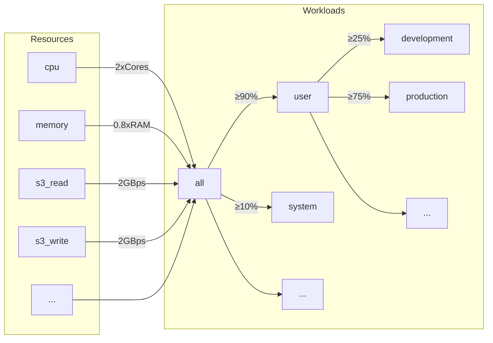
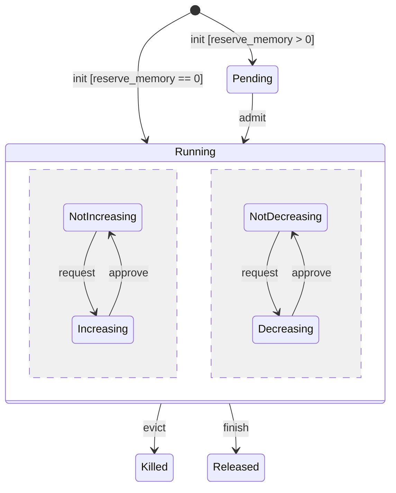
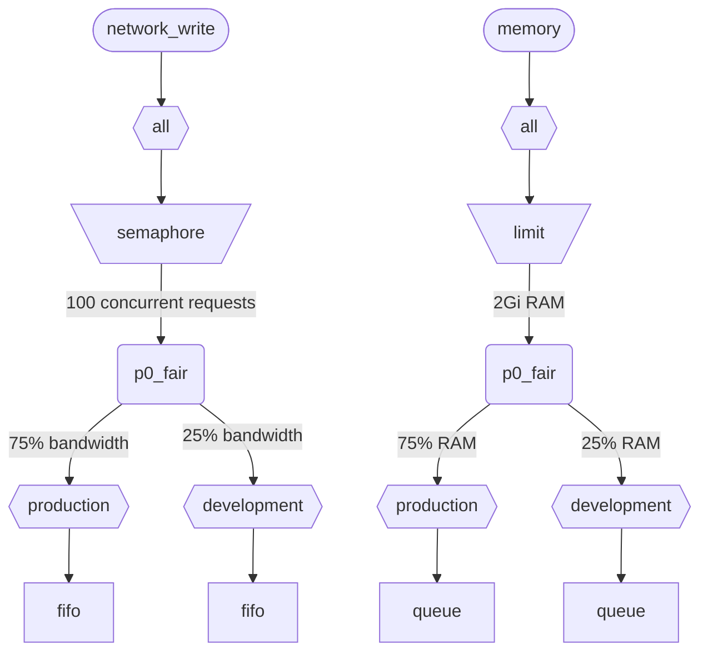

ClickHouse에서 여러 쿼리를 동시에 실행하면 공유 리소스(CPU, 메모리, IO)를 사용합니다. 스케줄링 제약 조건 및 정책을 적용하여 서로 다른 워크로드 간에 리소스가 사용되고 공유되는 방식을 제어할 수 있습니다. 모든 리소스에 공통으로 적용되는 스케줄링 계층 구조를 구성할 수 있습니다. 계층 구조의 루트는 공유 리소스를 나타내고, 리프는 특정 워크로드를 나타내며, 특정 쿼리와 백그라운드 작업의 리소스 요청 및 할당을 보유합니다.

<div id="resources">
  ## 자원
</div>

기본적으로 워크로드 스케줄링은 비활성화되어 있습니다. 이를 활성화하려면 스케줄링에 사용할 리소스와 최소 1개의 워크로드를 생성해야 합니다. 모든 자원은 서로 독립적이며, 어떤 조합으로도 사용할 수 있습니다.

CPU 스케줄링을 활성화하려면 MASTER 또는 WORKER 스레드용 CPU 자원을 생성해야 합니다(자세한 내용은 [CPU scheduling](#cpu_scheduling)을 참조하십시오):

```sql
CREATE RESOURCE cpu (MASTER THREAD, WORKER THREAD)
```

워크로드에서 메모리 예약을 활성화하려면 MEMORY 리소스를 생성해야 합니다(자세한 내용은 [메모리 예약](#memory-reservations)을 참조하세요):

```sql
CREATE RESOURCE memory (MEMORY RESERVATION)
```

쿼리 슬롯 스케줄링을 활성화하려면 QUERY 리소스를 생성해야 합니다 (자세한 내용은 [쿼리 슬롯 스케줄링](#query_scheduling)을 참조하십시오):

```sql
CREATE RESOURCE query (QUERY)
```

특정 디스크에서 IO scheduling을 활성화하려면 WRITE 및 READ 액세스용 읽기 및 쓰기 리소스를 생성해야 합니다:

```sql
CREATE RESOURCE resource_name (WRITE DISK disk_name, READ DISK disk_name)
-- or
CREATE RESOURCE read_resource_name (WRITE DISK write_disk_name)
CREATE RESOURCE write_resource_name (READ DISK read_disk_name)
```

리소스는 여러 개의 디스크에서 READ 전용, WRITE 전용 또는 READ와 WRITE 모두에 사용할 수 있습니다. 모든 디스크에 동일한 리소스를 사용할 수 있는 구문도 있습니다:

```sql
CREATE RESOURCE all_io (READ ANY DISK, WRITE ANY DISK);
```

리소스는 공유 모드에 따라 분류됩니다:

* **시간 공유 리소스** (CPU, IO, 쿼리 슬롯) - 스케줄링 계층 구조의 리프에서 큐에 들어간 리소스 요청을 관리합니다. 요청은 계층 구조에 정의된 정책과 제약 조건에 따라 스케줄링됩니다. 리소스 요청은 쿼리가 해당 리소스에 접근할 때 생성됩니다. 예를 들어, 쿼리가 디스크에서 데이터를 읽거나 처리 작업을 위해 CPU를 사용할 때, 수행된 작업의 각 quantum 또는 소켓을 통해 송수신된 바이트 수마다 리소스 요청이 생성됩니다.
* **공간 공유 리소스** (메모리) - 스케줄링 계층 구조의 리프에서 리소스 할당을 관리합니다. 할당은 실행 중이거나 대기 중일 수 있습니다. 대기 중인 할당은 충분한 공간이 확보되거나 다른 할당이 축출(종료)될 때까지 차단됩니다. 결정은 계층 구조에 정의된 한도와 정책에 기반합니다. 할당과 쿼리(또는 백그라운드 활동) 사이에는 일대일 대응 관계가 있습니다. 할당은 쿼리 실행이 시작될 때 생성되고 완료되면 해제됩니다. 실행 중인 할당은 크기가 동적으로 증가하거나 감소할 수 있습니다.

<div id="workloads">
  ## 워크로드 계층 구조
</div>

ClickHouse는 스케줄링 계층 구조를 정의할 수 있는 편리한 SQL 구문을 제공합니다. 모든 리소스는 공통 WORKLOAD 계층 구조 전반에 분산됩니다. 분산 규칙은 특정 리소스에 따라 일부 달라질 수 있지만, 계층 구조 자체는 동일합니다. 각 WORKLOAD는 모든 리소스에 필요한 스케줄링 노드를 유지합니다. 계층 구조를 구성하기 위해 어떤 워크로드 안에서도 하위 워크로드를 생성할 수 있습니다. ClickHouse는 워크로드 계층 구조에 특정하거나 사전 정의된 구조를 강제하지 않습니다.

다음은 모든 리소스를 &quot;user&quot; 및 &quot;system&quot; 워크로드로 나누고, 각각 90%와 10%를 보장하는 계층 구조의 예시입니다. 워크로드에 정의된 가중치는 max-min fairness에 사용되므로, 아래쪽에서의 최선 노력 보장만 제공할 뿐 위쪽에서의 제한이나 할당량을 의미하지는 않는다는 점에 유의하십시오. 모든 스케줄링은 각 호스트에서 독립적으로 수행되므로 `max_*` 설정에 정의된 제한은 호스트별로 적용됩니다. 워크로드 &quot;user&quot;는 자신의 리소스를 &quot;development&quot; 및 &quot;production&quot; 워크로드로 다시 나누며, &quot;production&quot;은 &quot;development&quot;보다 3배 더 많은 리소스를 가집니다:

```sql
CREATE RESOURCE cpu (MASTER THREAD, WORKER THREAD)
CREATE RESOURCE memory (MEMORY RESERVATION)
CREATE RESOURCE s3_read (READ DISK s3)
CREATE RESOURCE s3_write (WRITE DISK s3)
CREATE WORKLOAD all SETTINGS max_concurrent_threads_ratio_to_cores = 2, max_memory_ratio = 0.8, max_bytes_per_second = '2Gi'
CREATE WORKLOAD user IN all SETTINGS weight = 9
CREATE WORKLOAD system IN all
CREATE WORKLOAD development IN user
CREATE WORKLOAD production IN user SETTINGS weight = 3
```



자식이 없는 리프 워크로드의 이름은 쿼리 설정 `SETTINGS workload = 'name'`에 사용할 수 있습니다. 자세한 내용은 [워크로드 마크업](#workload-markup)을 참조하십시오.

워크로드를 사용자 지정하려면 다음 설정을 사용할 수 있습니다.

* `priority` - (시간 공유 전용) 형제 워크로드는 정적 값에 따라 처리됩니다(값이 낮을수록 우선순위가 높음). 선점에 영향을 줍니다.
* `precedence` - (공간 공유 전용) 형제 워크로드는 정적 값에 따라 허용됩니다(값이 낮을수록 precedence가 높음). 축출 및 admission에 영향을 줍니다.
* `weight` - 동일한 정적 priority 또는 precedence를 가진 형제 워크로드는 가중치에 따라 리소스를 공정하게 공유합니다. 선점, 축출, admission에 영향을 줍니다.
* `max_io_requests` - 이 워크로드에서 동시 IO 요청 수의 제한입니다.
* `max_bytes_inflight` - 이 워크로드에서 동시 요청의 총 inflight 바이트 제한입니다.
* `max_bytes_per_second` - 이 워크로드의 바이트 읽기 또는 쓰기 속도 제한입니다.
* `max_burst_bytes` - 워크로드가 throttled되지 않고 처리할 수 있는 최대 바이트 수입니다(각 리소스별로 독립적).
* `max_concurrent_threads` - 이 워크로드에서 쿼리에 사용할 스레드 수의 제한입니다.
* `max_concurrent_threads_ratio_to_cores` - `max_concurrent_threads`와 같지만, 사용 가능한 CPU 코어 수를 기준으로 정규화됩니다.
* `max_cpus` - 이 워크로드에서 쿼리를 처리하는 데 사용할 수 있는 CPU 코어 수의 제한입니다.
* `max_cpu_share` - `max_cpus`와 같지만, 사용 가능한 CPU 코어 수를 기준으로 정규화됩니다.
* `max_burst_cpu_seconds` - `max_cpus`로 인해 throttled되지 않고 워크로드가 소비할 수 있는 최대 CPU 초 수입니다.
* `max_memory` - 이 워크로드에 예약되는 총 메모리 제한입니다.

워크로드 설정을 통해 지정된 모든 제한은 각 리소스마다 서로 독립적입니다. 예를 들어 `max_bytes_per_second = '10Mi'`인 워크로드는 각 읽기 및 쓰기 리소스에 대해 각각 독립적으로 10 MB/s bandwidth 제한을 갖습니다. 읽기와 쓰기에 대한 공통 제한이 필요하면 READ 및 WRITE access에 동일한 리소스를 사용하는 것을 고려하십시오.

서로 다른 리소스에 대해 서로 다른 워크로드 계층을 지정하는 방법은 없습니다. 하지만 특정 리소스에 대해 서로 다른 워크로드 설정 값을 지정하는 방법은 있습니다:

```sql
CREATE OR REPLACE WORKLOAD all SETTINGS max_io_requests = 100, max_bytes_per_second = '1Mi' FOR network_read, max_bytes_per_second = '2Mi' FOR network_write
```

또한 다른 워크로드에서 참조하는 경우 워크로드 또는 리소스는 삭제할 수 없습니다. 워크로드 정의를 업데이트하려면 `CREATE OR REPLACE WORKLOAD` 쿼리를 사용하십시오.

:::note
워크로드 설정은 적절한 스케줄링 노드 집합으로 변환됩니다. 하위 수준의 자세한 내용은 스케줄링 노드 [타입 및 옵션](#hierarchy) 설명을 참조하십시오.
:::

<div id="workload-markup">
  ## 워크로드 마크업
</div>

서로 다른 워크로드를 구분하기 위해 쿼리에 `workload` 설정을 지정할 수 있습니다. `workload`가 설정되지 않으면 &quot;default&quot; 값이 사용됩니다. 설정 프로필을 사용해 다른 값을 지정할 수도 있습니다. 특정 사용자의 모든 쿼리에 고정된 `workload` 설정값이 적용되게 하려면 설정 제약 조건을 사용해 `workload`를 상수로 만들 수 있습니다.

:::warning
쿼리 설정 `workload`는 리프 워크로드(즉, 하위 워크로드가 없는 워크로드)만 참조할 수 있습니다.
:::

```sql
SELECT count() FROM my_table WHERE value = 42 SETTINGS workload = 'production'
SELECT count() FROM my_table WHERE value = 13 SETTINGS workload = 'development'
```

백그라운드 작업에 `workload` 설정을 지정할 수 있습니다. 머지와 뮤테이션에는 각각 `merge_workload` 및 `mutation_workload` server setting이 사용됩니다. 또한 특정 테이블에서는 `merge_workload` 및 `mutation_workload` MergeTree 설정을 사용해 이러한 값을 재정의할 수도 있습니다.

<div id="cpu_scheduling">
  ## CPU 스케줄링
</div>

워크로드에 대한 CPU 스케줄링을 활성화하려면 CPU 리소스를 생성하고 동시 실행 스레드 수 제한을 설정하십시오:

```sql
CREATE RESOURCE cpu (MASTER THREAD, WORKER THREAD)
CREATE WORKLOAD all SETTINGS max_concurrent_threads = 100
```

ClickHouse 서버가 [여러 스레드](/ko/operations/settings/settings.md#max_threads)를 사용해 동시에 많은 쿼리를 실행하는 동안 모든 CPU 슬롯이 사용 중이면 과부하 상태에 도달합니다. 과부하 상태에서는 해제되는 모든 CPU 슬롯이 스케줄링 정책에 따라 적절한 워크로드에 다시 배정됩니다. 동일한 워크로드를 공유하는 쿼리에는 슬롯이 라운드 로빈 방식으로 할당됩니다. 서로 다른 워크로드에 있는 쿼리에는 워크로드에 지정된 가중치, 우선순위, 제한에 따라 슬롯이 할당됩니다.

CPU 시간은 스레드가 블로킹되지 않은 상태에서 CPU 집약적인 작업을 수행할 때 소비됩니다. 스케줄링을 위해 스레드는 두 가지로 구분됩니다:

* Master thread — 쿼리 또는 머지나 mutation과 같은 백그라운드 작업에서 처음으로 실행을 시작하는 스레드입니다.
* Worker thread — master가 CPU 집약적인 작업을 수행하기 위해 추가로 생성할 수 있는 스레드입니다.

응답성을 높이기 위해 master 스레드와 worker 스레드에 별도의 리소스를 사용하는 것이 바람직할 수 있습니다. `max_threads` 쿼리 설정값을 크게 사용하면 많은 수의 worker 스레드가 CPU 리소스를 쉽게 독점할 수 있습니다. 그러면 들어오는 쿼리는 블로킹되어 CPU 슬롯을 기다려야 하고, 해당 쿼리의 master 스레드가 실행을 시작하지 못하게 됩니다. 이를 방지하려면 다음 구성을 사용할 수 있습니다:

```sql
CREATE RESOURCE worker_cpu (WORKER THREAD)
CREATE RESOURCE master_cpu (MASTER THREAD)
CREATE WORKLOAD all SETTINGS max_concurrent_threads = 100 FOR worker_cpu, max_concurrent_threads = 1000 FOR master_cpu
```

마스터 스레드와 워커 스레드에 각각 별도의 제한이 설정됩니다. 100개의 워커 CPU 슬롯이 모두 사용 중이더라도, 사용 가능한 마스터 CPU 슬롯이 있는 한 새로운 쿼리는 차단되지 않습니다. 이러한 쿼리는 스레드 1개로 실행을 시작합니다. 이후 워커 CPU 슬롯을 사용할 수 있게 되면, 해당 쿼리는 규모를 확장해 워커 스레드를 생성할 수 있습니다. 반면 이러한 방식은 전체 슬롯 수를 CPU 프로세서 수에 맞춰 제한하지 못하므로, 동시에 실행되는 스레드가 너무 많아지면 성능에 영향을 줍니다.

마스터 스레드의 동시성(Concurrency)을 제한하더라도 동시 쿼리 수가 제한되지는 않습니다. CPU 슬롯은 쿼리 실행 도중에 해제되었다가 다른 스레드가 다시 획득할 수 있습니다. 예를 들어, 동시 마스터 스레드 제한이 2여도 4개의 동시 쿼리가 모두 병렬로 실행될 수 있습니다. 이 경우 각 쿼리는 CPU 프로세서 1개의 50%를 사용하게 됩니다. 동시 쿼리 수를 제한하려면 별도의 로직을 사용해야 하며, 현재 워크로드에서는 이를 지원하지 않습니다.

워크로드에 대해서는 별도의 스레드 동시성 제한을 사용할 수 있습니다:

```sql
CREATE RESOURCE cpu (MASTER THREAD, WORKER THREAD)
CREATE WORKLOAD all
CREATE WORKLOAD admin IN all SETTINGS max_concurrent_threads = 10
CREATE WORKLOAD production IN all SETTINGS max_concurrent_threads = 100
CREATE WORKLOAD analytics IN production SETTINGS max_concurrent_threads = 60, weight = 9
CREATE WORKLOAD ingestion IN production
```

이 구성 예시는 관리자와 운영(production)에 대해 서로 독립된 CPU 슬롯 풀을 제공합니다. 운영 풀은 analytics와 수집이 함께 공유합니다. 또한 운영 풀이 과부하 상태일 때는 해제된 슬롯 10개 중 9개가 필요에 따라 분석용 쿼리에 다시 할당됩니다. 수집 쿼리는 과부하 기간 동안 10개 중 1개의 슬롯만 할당받습니다. 이는 사용자 대상 쿼리의 지연 시간을 줄이는 데 도움이 될 수 있습니다. Analytics에는 동시 실행 스레드 60개라는 자체 제한이 있으므로, 수집을 지원하기 위해 항상 최소 40개의 스레드가 남습니다. 과부하가 없으면 수집이 100개 스레드를 모두 사용할 수 있습니다.

쿼리를 CPU 스케줄링에서 제외하려면 쿼리 설정 [use&#95;concurrency&#95;control](/ko/operations/settings/settings.md/#use_concurrency_control)을 0으로 설정하십시오.

CPU 스케줄링은 아직 머지와 뮤테이션을 지원하지 않습니다.

워크로드에 공정한 할당을 제공하려면 쿼리 실행 중 선점(preemption)과 스케일 다운을 수행해야 합니다. 선점은 `cpu_slot_preemption` server setting으로 활성화됩니다. 이 설정이 활성화되면 모든 스레드는 주기적으로 CPU 슬롯을 갱신합니다(`cpu_slot_quantum_ns` server setting에 따름). CPU가 과부하 상태이면 이러한 갱신 과정에서 실행이 차단될 수 있습니다. 실행이 오랜 시간 차단되면(`cpu_slot_preemption_timeout_ms` server setting 참조) 쿼리가 스케일 다운되며, 동시에 실행되는 스레드 수가 동적으로 감소합니다. CPU time의 공정성은 워크로드 간에는 보장되지만, 동일한 워크로드 내의 쿼리 간에는 일부 예외적인 경우 보장되지 않을 수 있습니다.

:::warning
슬롯 스케줄링은 [쿼리 동시성](/ko/operations/settings/settings.md#max_threads)을 제어하는 방법을 제공하지만, server setting `cpu_slot_preemption`이 `true`로 설정되지 않으면 공정한 CPU time 할당은 보장되지 않습니다. 이 경우 공정성은 경쟁하는 워크로드 간 CPU 슬롯 할당 횟수를 기준으로 제공됩니다. 이는 CPU 초가 동일하게 배분된다는 뜻은 아닙니다. 선점이 없으면 CPU 슬롯을 무기한 점유할 수 있기 때문입니다. 스레드는 작업 시작 시 슬롯을 획득하고 작업이 끝나면 해제합니다.
:::

:::note
CPU 리소스를 선언하면 [`concurrent_threads_soft_limit_num`](server-configuration-parameters/settings.md#concurrent_threads_soft_limit_num) 및 [`concurrent_threads_soft_limit_ratio_to_cores`](server-configuration-parameters/settings.md#concurrent_threads_soft_limit_ratio_to_cores) 설정은 더 이상 적용되지 않습니다. 대신 특정 워크로드에 할당할 CPU 수를 제한하는 데 워크로드 설정 `max_concurrent_threads`를 사용합니다. 이전 동작과 동일하게 하려면 WORKER THREAD 리소스만 생성하고, 워크로드 `all`의 `max_concurrent_threads`를 `concurrent_threads_soft_limit_num`과 동일한 값으로 설정한 다음 `workload = "all"` 쿼리 설정을 사용하십시오. 이 구성은 [`concurrent_threads_scheduler`](server-configuration-parameters/settings.md#concurrent_threads_scheduler) 설정 값을 &quot;fair&#95;round&#95;robin&quot;으로 지정한 경우에 해당합니다.
:::

<div id="threads_vs_cpus">
  ## 스레드와 CPU
</div>

워크로드의 CPU 사용량을 제어하는 방법은 두 가지입니다.

* 스레드 수 제한: `max_concurrent_threads` 및 `max_concurrent_threads_ratio_to_cores`
* CPU 스로틀링: `max_cpus`, `max_cpu_share`, `max_burst_cpu_seconds`

:::warning
CPU 스로틀링 설정은 `cpu_slot_preemption` 서버 설정이 활성화된 경우에만 적용되며, 그렇지 않으면 무시됩니다.
:::

첫 번째 방법은 현재 서버 부하에 따라 쿼리에 대해 생성되는 스레드 수를 동적으로 제어할 수 있게 합니다. 즉, 사실상 `max_threads` 쿼리 설정이 지정하는 값을 낮추는 효과가 있습니다. 두 번째 방법은 토큰 버킷 알고리즘을 사용해 워크로드의 CPU 사용량을 스로틀링합니다. 스레드 수에 직접 영향을 주지는 않지만, 워크로드 내 모든 스레드의 총 CPU 사용량을 스로틀링합니다.

`max_cpus` 및 `max_burst_cpu_seconds`를 사용하는 토큰 버킷 스로틀링의 의미는 다음과 같습니다. 임의의 `delta`초 동안 워크로드 내 모든 쿼리의 총 CPU 사용량은 `max_cpus * delta + max_burst_cpu_seconds` CPU 초를 초과할 수 없습니다. 장기적으로는 평균 사용량이 `max_cpus`로 제한되지만, 단기적으로는 이 한도를 초과할 수 있습니다. 예를 들어 `max_burst_cpu_seconds = 60` 및 `max_cpus=0.001`인 경우, 스로틀링 없이 스레드 1개를 60초 동안 실행하거나, 스레드 2개를 30초 동안 실행하거나, 스레드 60개를 1초 동안 실행할 수 있습니다. `max_burst_cpu_seconds`의 기본값은 1초입니다. 값이 너무 낮으면 동시 실행 스레드가 많은 경우 허용된 `max_cpus` 코어를 충분히 활용하지 못할 수 있습니다.

CPU 슬롯을 점유하는 동안 스레드는 다음 세 가지 주요 상태 중 하나에 있을 수 있습니다.

* **Running:** 실제로 CPU 리소스를 소비하는 상태입니다. 이 상태에서 소비한 시간은 CPU 스로틀링에 반영됩니다.
* **Ready:** CPU를 사용할 수 있을 때까지 대기하는 상태입니다. 이 상태에서 소비한 시간은 CPU 스로틀링에 반영되지 않습니다.
* **Blocked:** IO 작업 또는 기타 블로킹 syscall(예: 뮤텍스를 기다리는 경우)을 수행하는 상태입니다. 이 상태에서 소비한 시간은 CPU 스로틀링에 반영되지 않습니다.

이제 CPU 스로틀링과 스레드 수 제한을 함께 사용하는 구성 예시를 살펴보겠습니다.

```sql
CREATE RESOURCE cpu (MASTER THREAD, WORKER THREAD)
CREATE WORKLOAD all SETTINGS max_concurrent_threads_ratio_to_cores = 2
CREATE WORKLOAD admin IN all SETTINGS max_concurrent_threads = 2, priority = -1
CREATE WORKLOAD production IN all SETTINGS weight = 4
CREATE WORKLOAD analytics IN production SETTINGS max_cpu_share = 0.7, weight = 3
CREATE WORKLOAD ingestion IN production
CREATE WORKLOAD development IN all SETTINGS max_cpu_share = 0.3
```

여기서는 모든 쿼리의 전체 스레드 수를 사용 가능한 CPU 수의 2배로 제한합니다. 관리자 워크로드는 사용 가능한 CPU 수와 관계없이 최대 2개의 스레드로만 제한됩니다. 관리자는 우선순위 -1(기본값 0보다 낮음)을 가지며, 필요할 경우 CPU 슬롯을 가장 먼저 할당받습니다. 관리자가 쿼리를 실행하지 않으면 CPU 리소스는 프로덕션과 개발 워크로드에 분배됩니다. CPU 시간의 보장 점유율은 가중치(4:1)를 기준으로 합니다. 즉, 프로덕션에는 최소 80%(필요한 경우), 개발에는 최소 20%(필요한 경우)가 할당됩니다. 가중치는 보장치를 결정하고, CPU 스로틀링은 한도를 결정합니다. 프로덕션은 제한이 없어 100%까지 사용할 수 있지만, 개발은 30% 제한이 있으며, 이 제한은 다른 워크로드의 쿼리가 없더라도 적용됩니다. 프로덕션 워크로드는 리프가 아니므로 해당 리소스는 가중치(3:1)에 따라 분석과 수집 사이에 분할됩니다. 즉, 분석은 최소 0.8 * 0.75 = 60%를 보장받고, `max_cpu_share`에 따라 전체 CPU 리소스의 70%를 상한으로 가집니다. 반면 수집은 최소 0.8 * 0.25 = 20%를 보장받으며, 상한은 없습니다.

:::note
ClickHouse 서버에서 CPU 활용률을 최대화하려면 루트 워크로드 `all`에 `max_cpus`와 `max_cpu_share`를 사용하지 마십시오. 대신 `max_concurrent_threads`를 더 큰 값으로 설정하십시오. 예를 들어 CPU가 8개인 시스템에서는 `max_concurrent_threads = 16`으로 설정하십시오. 이렇게 하면 8개의 스레드는 CPU 작업을 실행하고, 나머지 8개의 스레드는 I/O 작업을 처리할 수 있습니다. 추가 스레드는 CPU 압박을 만들어 스케줄링 규칙이 적용되도록 합니다. 반대로 `max_cpus = 8`로 설정하면 서버가 사용 가능한 8개의 CPU를 초과할 수 없으므로 CPU 압박이 절대 발생하지 않습니다.
:::

<div id="memory-reservations">
  ## 메모리 예약
</div>

:::note
메모리 예약 스케줄링은 실험적 기능입니다. `MEMORY RESERVATION` 리소스가 있을 때만 적용되며, SQL 인터페이스와 동작은 향후 릴리스에서 변경될 수 있습니다. 아직 머지 및 뮤테이션은 지원하지 않으며, 실행 중인 쿼리에 대한 축출은 best-effort 방식으로만 수행됩니다. 즉시 적용되지 않고 쿼리의 다음 메모리 동기화 지점에서 적용됩니다.
:::

워크로드에 메모리 예약을 활성화하려면 MEMORY RESERVATION 리소스를 생성하고, 워크로드 설정을 사용해 예약되는 총 메모리에 대해 하나 이상의 제한을 설정하십시오:

```sql
CREATE RESOURCE memory (MEMORY RESERVATION)
CREATE WORKLOAD all SETTINGS max_memory = '2Gi'
```

ClickHouse는 모든 쿼리와 백그라운드 작업의 메모리 할당을 추적합니다. 할당된 바이트 수는 스케줄링 계층 구조를 따라 루트까지 집계됩니다. 모든 쿼리에는 해당 쿼리가 속한 리프 워크로드에 대응하는 할당이 있습니다. 쿼리의 `reserve_memory` 설정이 0보다 크면 해당 할당은 `pending` 상태로 생성됩니다. `pending` 할당은 워크로드 계층 구조에서 요청된 메모리 양을 예약합니다. 사용 가능한 메모리가 충분하지 않으면, 충분한 메모리가 해제되거나 다른 할당이 제거(강제 종료)될 때까지 해당 할당은 `pending` 상태로 유지됩니다. 할당이 승인되면 `running` 상태가 됩니다. `running` 상태의 할당은 쿼리의 메모리 사용량에 따라 크기가 동적으로 증가하거나 감소할 수 있습니다. 할당의 수명 주기는 다음 상태 다이어그램으로 나타낼 수 있습니다.



리프 워크로드의 대기 중인 할당은 FIFO 순서에 따라 승인됩니다. 여러 워크로드에 대기 중인 할당이 있으면 precedence 및 weight 설정에 따라 승인됩니다. precedence가 더 높은 워크로드가 먼저 처리됩니다. 동일한 precedence를 가진 형제 워크로드는 max-min 공정 방식으로 weight에 따라 메모리를 공유합니다. 즉, 정규화된 메모리 사용량((현재 사용량 + 요청된 증가량) / weight)이 더 낮은 워크로드가 먼저 처리됩니다. 축출 시에는 반대 로직이 적용됩니다. 메모리를 해제해야 할 때는 precedence가 더 낮고 정규화된 메모리 사용량이 더 높은 워크로드부터 먼저 축출됩니다.

시간 공유 리소스는 priority를 사용하고, 공간 공유 리소스는 precedence를 사용한다는 점에 유의하십시오. 이 둘은 서로 독립적인 설정이므로 서로 다른 값으로 설정할 수 있습니다. 더 높은 priority는 비파괴적 선점(지연 또는 스로틀링)을 의미하는 반면, 더 높은 precedence는 파괴적 축출(오류와 함께 중단됨)을 의미할 수 있습니다. 예를 들어 워크로드는 CPU scheduling에 대해서는 높은 priority를 가질 수 있지만, 메모리 예약에 대해서는 동일한 precedence를 사용해 다른 워크로드를 축출하지 않고, 이미 수행된 작업이 손실되지 않도록 할 수 있습니다.

`max_memory` 제한이 있는 모든 워크로드는 해당 서브트리에서 할당된 총 메모리가 이 제한을 초과하지 않도록 보장합니다. 대기 중이거나 증가하는 할당으로 인해 제한을 초과하게 되면 메모리를 확보하기 위해 축출 절차가 시작됩니다. 축출 절차는 종료할 대상을 선택합니다. killer와 victim의 최소 공통 상위 워크로드는 다음 상황에서 축출을 방지합니다.

* 대기 중인 할당은 동일한 워크로드에서 실행 중인 할당을 축출할 수 없습니다. (killer와 victim 워크로드가 동일함).
* precedence가 더 낮은 대기 중인 할당은 precedence가 더 높은 워크로드를 절대 종료하지 않습니다.
* 대기 중인 할당은 동일한 precedence의 할당을 종료할 수 없습니다. 동일한 precedence의 실행 중인 할당은 정규화된 메모리 사용량에 따라 서로를 축출할 수 있다는 점에 유의하십시오.
  축출이 방지되거나 충분한 메모리를 확보하지 못하면 새 할당은 충분한 메모리가 확보될 때까지 차단됩니다. 이러한 규칙은 메모리 압박에 따라 과도한 쿼리를 큐에 대기시킬 수 있게 하며, MEMORY&#95;LIMIT&#95;EXCEEDED 오류를 방지하는 편리한 방법을 제공합니다.

:::note
워크로드 제한은 [max&#95;memory&#95;usage](/ko/operations/settings/settings.md#max_memory_usage) 쿼리 설정과 같은 다른 메모리 활용 제한 방식과는 독립적입니다. 메모리 활용을 더 효과적으로 제어하기 위해 함께 사용할 수 있습니다. 워크로드가 아니라 사용자 기준으로 독립적인 메모리 제한을 설정할 수도 있습니다. 이 방식은 유연성이 더 낮고 메모리 예약이나 대기 중인 쿼리의 큐잉과 같은 기능은 제공하지 않습니다. [Memory overcommit](settings/memory-overcommit.md)을 참조하십시오.
:::

워크로드 설정 `max_waiting_queries`는 해당 워크로드의 대기 중인 할당 수를 제한합니다. 제한에 도달하면 server는 `SERVER_OVERLOADED` 오류를 반환합니다. `max_waiting_queries`는 하위 워크로드에 상속되지 않으며 리프 워크로드에만 의미가 있다는 점에 유의하십시오.

메모리 예약 scheduling은 아직 머지와 뮤테이션에 대해서는 지원되지 않습니다.

`reserve_memory` 설정이 0보다 큰 쿼리만 메모리 예약을 기다리는 동안 차단될 수 있습니다. 그러나 `reserve_memory`가 0인 쿼리도 해당 워크로드의 메모리 사용량에 반영되며, 다른 대기 중이거나 증가하는 allocations를 위해 메모리를 확보해야 하는 경우 필요에 따라 축출될 수 있습니다. 적절한 워크로드 마크업이 없는 쿼리는 메모리 예약 scheduling의 적용 대상이 아니며 scheduler에 의해 축출될 수도 없습니다.

쿼리에 비탄력적 메모리 예약을 적용하려면 `reserve_memory`와 `max_memory_usage` 쿼리 설정을 모두 같은 값으로 지정하십시오. 이 경우 쿼리는 고정된 양의 메모리를 예약하며 allocation을 동적으로 늘릴 수 없습니다. 탄력적 메모리 예약은 메모리 압박이 없는 한 종료되지 않고 `reserve_memory`를 초과하여 `max_memory_usage`까지 늘릴 수 있습니다. 하지만 실제 활용량이 더 적더라도 `reserve_memory` 아래로 줄일 수는 없습니다.

구성 예시를 살펴보겠습니다:

```sql
CREATE RESOURCE memory (MEMORY RESERVATION)
CREATE WORKLOAD all SETTINGS max_memory = '10Gi'
CREATE WORKLOAD system IN all SETTINGS weight = 1
CREATE WORKLOAD user IN all SETTINGS weight = 9
CREATE WORKLOAD production IN user SETTINGS precedence = 1, weight = 3
CREATE WORKLOAD staging IN user SETTINGS precedence = 1, weight = 1
CREATE WORKLOAD testing IN user SETTINGS precedence = 2
```

이 예시에서는 모든 쿼리와 백그라운드 활동이 예약하는 총 메모리가 10 GiB를 초과할 수 없습니다. system 워크로드는 최소 1 GiB(10 GiB의 10%)를 보장받고, user 워크로드는 최소 9 GiB(10 GiB의 90%)를 보장받습니다. user 워크로드 내부에서는 production 및 staging 워크로드가 동일한 precedence 1을 가지며, weights(3 대 1)에 따라 메모리를 공유합니다. testing 워크로드의 precedence는 2이며, 이는 production 및 staging보다 낮습니다. 따라서 testing 워크로드는 production과 staging이 사용하지 않는 메모리만 사용할 수 있습니다.

메모리 압박이 발생하면 testing 워크로드의 메모리 할당이 먼저 회수됩니다. 이후 더 많은 메모리를 해제해야 하면, staging 워크로드의 메모리 할당이 보장량을 초과한 경우 production 워크로드의 메모리 할당보다 먼저 회수됩니다. production과 staging의 대기 중인 쿼리는 메모리를 확보하기 위해 testing 워크로드에서 실행 중인 메모리 할당을 회수할 수 있지만, precedence가 같으므로 서로의 메모리 할당을 회수할 수는 없습니다. 메모리 압박이 발생하면 이들은 큐에서 대기하게 되며, 이를 통해 동시에 실행되는 쿼리가 너무 많아 발생하는 MEMORY&#95;LIMIT&#95;EXCEEDED 오류를 시스템이 방지할 수 있습니다.

system 워크로드의 precedence는 0(default)이며, 이는 production, staging, testing 워크로드보다 높지만, 이들은 sibling 워크로드가 아닙니다. 최소 공통 조상은 워크로드 all이며, 그 두 children은 동일한 precedence를 가집니다. 따라서 대기 중인 system 워크로드는 이들 어느 쪽의 메모리 할당도 회수할 수 없고, 반대도 마찬가지입니다. 이를 통해 system 활동은 쉽게 회수되지 않도록 보장됩니다.

<div id="query_scheduling">
  ## 쿼리 슬롯 스케줄링
</div>

워크로드에서 쿼리 슬롯 스케줄링을 활성화하려면 QUERY 리소스를 생성하고 동시 실행 쿼리 수 또는 초당 쿼리 수의 제한을 설정합니다:

```sql
CREATE RESOURCE query (QUERY)
CREATE WORKLOAD all SETTINGS max_concurrent_queries = 100, max_queries_per_second = 10, max_burst_queries = 20
```

워크로드 설정 `max_concurrent_queries`는 지정된 워크로드에서 동시에 실행할 수 있는 동시 쿼리 수를 제한합니다. 이는 쿼리 [`max_concurrent_queries_for_all_users`](/ko/operations/settings/settings#max_concurrent_queries_for_all_users) 설정과 서버 [max&#95;concurrent&#95;queries](/ko/operations/server-configuration-parameters/settings#max_concurrent_queries) 설정에 해당합니다. Async insert 쿼리와 KILL 같은 일부 특정 쿼리는 이 제한에 포함되지 않습니다.

워크로드 설정 `max_queries_per_second`와 `max_burst_queries`는 토큰 버킷 throttler를 사용해 워크로드의 쿼리 수를 제한합니다. 이 설정은 임의의 시간 인터벌 `T` 동안 실행을 시작하는 새 쿼리 수가 `max_queries_per_second * T + max_burst_queries`를 초과하지 않도록 보장합니다.

워크로드 설정 `max_waiting_queries`는 워크로드의 대기 중인 쿼리 수를 제한합니다. 한도에 도달하면 서버는 `SERVER_OVERLOADED` 오류를 반환합니다. `max_waiting_queries`는 하위 워크로드에 상속되지 않으며, 리프 워크로드에서만 의미가 있습니다.

:::note
차단된 쿼리는 모든 제약 조건이 충족될 때까지 무기한 대기하며, 그전까지는 `SHOW PROCESSLIST`에 표시되지 않습니다.
:::

<div id="workload_entity_storage">
  ## 워크로드 및 리소스 저장소
</div>

모든 워크로드와 리소스의 정의는 `CREATE WORKLOAD` 및 `CREATE RESOURCE` 쿼리로 표현되며, `workload_path`의 디스크 또는 `workload_zookeeper_path`의 ZooKeeper에 영구적으로 저장됩니다. 노드 간 일관성을 유지하려면 ZooKeeper 저장소를 사용하는 것이 좋습니다. 또는 디스크 저장소와 함께 `ON CLUSTER` 절을 사용할 수도 있습니다.

<div id="config_based_workloads">
  ## 구성 기반 워크로드와 리소스
</div>

SQL 기반 정의 외에도 워크로드와 리소스는 서버 설정 파일에서 미리 정의할 수 있습니다. 이는 일부 제한은 인프라에 의해 정해지고, 다른 제한은 고객이 변경할 수 있는 클라우드 환경에서 유용합니다. 구성 기반 엔터티는 SQL로 정의된 엔터티보다 우선 적용되며, SQL 명령으로 수정하거나 삭제할 수 없습니다.

<div id="config_based_workloads_format">
  ### 구성 형식
</div>

```xml
<clickhouse>
    <resources_and_workloads>
        CREATE RESOURCE memory (MEMORY RESERVATION);
        CREATE RESOURCE s3disk_read (READ DISK s3);
        CREATE RESOURCE s3disk_write (WRITE DISK s3);
        CREATE WORKLOAD all SETTINGS max_memory = '2Gi', max_io_requests = 500 FOR s3disk_read, max_io_requests = 1000 FOR s3disk_write, max_bytes_per_second = '1280Mi' FOR s3disk_read, max_bytes_per_second = '3200Mi' FOR s3disk_write;
        CREATE WORKLOAD production IN all SETTINGS weight = 3;
    </resources_and_workloads>
</clickhouse>
```

이 구성은 `CREATE WORKLOAD` 및 `CREATE RESOURCE` SQL 문과 동일한 구문을 사용합니다. 모든 쿼리는 유효해야 합니다.

<div id="config_based_workloads_usage_recommendations">
  ### 사용 권장 사항
</div>

Cloud 환경에서는 일반적으로 다음과 같이 설정할 수 있습니다:

1. 인프라 한도를 설정하기 위해 구성에서 루트 워크로드와 네트워크 IO 리소스를 정의합니다
2. 이러한 한도를 강제하기 위해 `throw_on_unknown_workload`를 설정합니다
3. 모든 쿼리에 한도가 자동으로 적용되도록 `CREATE WORKLOAD default IN all`을 생성합니다 (`workload` 쿼리 설정의 기본값이 &#39;default&#39;이기 때문입니다)
4. 사용자가 구성된 계층 구조 내에서 추가 워크로드를 생성할 수 있도록 허용합니다

이렇게 하면 사용자별 스케줄링 정책에 대한 유연성은 유지하면서도 모든 백그라운드 작업과 쿼리가 인프라 제한을 준수하도록 할 수 있습니다.

또 다른 활용 사례는 이기종 클러스터의 서로 다른 노드에 서로 다른 구성을 적용하는 것입니다.

<div id="strict_resource_access">
  ## 엄격한 리소스 액세스
</div>

모든 쿼리가 리소스 스케줄링 정책을 따르도록 강제하는 서버 설정 `throw_on_unknown_workload`가 있습니다. 이 값을 `true`로 설정하면 모든 쿼리에서 유효한 `workload` 쿼리 설정을 사용해야 하며, 그렇지 않으면 `RESOURCE_ACCESS_DENIED` 예외가 발생합니다. 이 값을 `false`로 설정하면 해당 쿼리는 리소스 스케줄러를 사용하지 않으므로, 모든 `RESOURCE`에 무제한으로 액세스할 수 있습니다. 쿼리 설정 `use_concurrency_control = 0`을 사용하면 쿼리가 CPU 스케줄러를 우회하여 CPU에 무제한으로 액세스할 수 있습니다. CPU 스케줄링을 강제하려면 설정 제약을 만들어 `use_concurrency_control`이 읽기 전용의 고정값으로 유지되도록 하십시오.

:::note
`CREATE WORKLOAD default`가 실행되지 않았다면 `throw_on_unknown_workload`를 `true`로 설정하지 마십시오. 시작 중에 `workload`를 명시적으로 설정하지 않은 쿼리가 실행되면 서버 시작 문제로 이어질 수 있습니다.
:::

<div id="hierarchy">
  ### 스케줄링 노드 계층 구조
</div>

스케줄링 서브시스템에서는 각 리소스가 스케줄링 노드의 계층 구조로 표현됩니다. ClickHouse는 WORKLOAD 및 RESOURCE 정의를 바탕으로 필요한 모든 스케줄링 노드를 자동으로 생성합니다. 스케줄링 노드는 저수준 구현 세부 사항이며, [system.scheduler](/ko/operations/system-tables/scheduler.md) 테이블을 통해 확인할 수 있습니다.

```sql
CREATE RESOURCE network_write (WRITE DISK s3)
CREATE RESOURCE memory (MEMORY RESERVATION)
CREATE WORKLOAD all SETTINGS max_io_requests = 100, max_memory = '2Gi'
CREATE WORKLOAD development IN all
CREATE WORKLOAD production IN all SETTINGS weight = 3
```



**시간 공유 노드 타입:**

* `inflight_limit` (제약) - 진행 중인 동시 요청 수가 `max_requests`를 초과하거나 총 비용이 `max_cost`를 초과하면 차단합니다. 자식 노드는 1개만 있어야 합니다.
* `bandwidth_limit` (제약) - 현재 대역폭이 `max_speed`를 초과하거나(0은 무제한 의미) 버스트가 `max_burst`를 초과하면 차단합니다(`max_burst`의 기본값은 `max_speed`). 자식 노드는 1개만 있어야 합니다.
* `fair` (policy) - max-min fairness에 따라 자식 노드 중 하나에서 다음에 처리할 요청을 선택합니다. 자식 노드는 `weight`를 지정할 수 있습니다(기본값은 1).
* `priority` (policy) - 정적 우선순위에 따라 자식 노드 중 하나에서 다음에 처리할 요청을 선택합니다(값이 낮을수록 우선순위가 높음). 자식 노드는 `priority`를 지정해야 합니다(기본값은 0).
* `fifo` (큐) - 리소스 용량을 초과한 요청을 보관할 수 있는 계층 구조의 리프입니다.

**공간 공유 노드 타입:**

* `limit` - 자식의 총 할당량이 한도를 초과하지 않도록 보장하며, 필요하면 서브트리에서 eviction 절차를 시작합니다. 자식 노드는 1개만 있어야 합니다.
* `fair_allocation` - max-min fairness에 따라 eviction을 수행합니다. 대기 중인 할당은 실행 중인 할당을 evict하지 않습니다. 자식 노드는 `weight`를 지정할 수 있습니다(기본값은 1).
* `precedence_allocation` - 정적 precedence에 따라 eviction을 수행합니다(값이 낮을수록 precedence가 높음). precedence가 더 높은 대기 중인 할당은 precedence가 더 낮은 할당을 evict합니다. 자식 노드는 `precedence`를 지정해야 합니다(기본값은 0).
* `queue` - 실행 중인 할당과 대기 중인 할당을 보관할 수 있는 계층 구조의 리프입니다.

<div id="deprecated-configuration">
  ## 지원 중단 예정인 XML 구성
</div>

리소스가 어떤 디스크를 사용하는지 지정하는 또 다른 방법은 server의 `storage_configuration`입니다:

특정 디스크에 대해 IO 스케줄링을 활성화하려면 스토리지 구성에 `read_resource` 및/또는 `write_resource`를 지정해야 합니다. 그러면 지정된 디스크를 사용하는 모든 읽기 및 쓰기 요청에 어떤 리소스를 사용할지 ClickHouse에 알려줍니다. 읽기 리소스와 쓰기 리소스는 동일한 리소스 이름을 참조할 수 있으며, 이는 로컬 SSD 또는 HDD에 유용합니다. 여러 개의 서로 다른 디스크도 동일한 리소스를 참조할 수 있으며, 이는 원격 디스크에 유용합니다. 예를 들어 「production」 및 「development」 워크로드 간에 네트워크 대역폭을 공정하게 분배할 수 있게 하려는 경우에 유용합니다.

예시:

```xml
<clickhouse>
    <storage_configuration>
        ...
        <disks>
            <s3>
                <type>s3</type>
                <endpoint>https://clickhouse-public-datasets.s3.amazonaws.com/my-bucket/root-path/</endpoint>
                <access_key_id>your_access_key_id</access_key_id>
                <secret_access_key>your_secret_access_key</secret_access_key>
                <read_resource>network_read</read_resource>
                <write_resource>network_write</write_resource>
            </s3>
        </disks>
        <policies>
            <s3_main>
                <volumes>
                    <main>
                        <disk>s3</disk>
                    </main>
                </volumes>
            </s3_main>
        </policies>
    </storage_configuration>
</clickhouse>
```

서버 구성 옵션은 SQL로 리소스를 정의하는 방식보다 우선 적용된다는 점에 유의하십시오.

다음 예시는 위 그림에 표시된 IO 스케줄링 계층을 정의하는 방법을 보여줍니다:

```xml
<clickhouse>
    <resources>
        <network_read>
            <node path="/">
                <type>inflight_limit</type>
                <max_requests>100</max_requests>
            </node>
            <node path="/fair">
                <type>fair</type>
            </node>
            <node path="/fair/prod">
                <type>fifo</type>
                <weight>3</weight>
            </node>
            <node path="/fair/dev">
                <type>fifo</type>
            </node>
        </network_read>
        <network_write>
            <node path="/">
                <type>inflight_limit</type>
                <max_requests>100</max_requests>
            </node>
            <node path="/fair">
                <type>fair</type>
            </node>
            <node path="/fair/prod">
                <type>fifo</type>
                <weight>3</weight>
            </node>
            <node path="/fair/dev">
                <type>fifo</type>
            </node>
        </network_write>
    </resources>
</clickhouse>
```

기반이 되는 리소스의 전체 용량을 활용하려면 `inflight_limit`를 사용하는 것이 좋습니다. `max_requests` 또는 `max_cost` 값이 너무 낮으면 리소스 활용률이 충분히 올라가지 않을 수 있고, 반대로 값이 너무 높으면 스케줄러 내부의 큐가 비게 될 수 있습니다. 그러면 하위 트리에서 정책이 무시되어(불공정성이 발생하거나 우선순위가 무시됨) 결과적으로 적용되지 않을 수 있습니다. 반면 리소스가 과도하게 사용되지 않도록 보호하려면 `bandwidth_limit`를 사용해야 합니다. 이는 `duration`초 동안 소비된 리소스 양이 `max_burst + max_speed * duration`바이트를 초과하면 속도를 제한합니다. 동일한 리소스에 두 개의 `bandwidth_limit` node를 사용하면, 짧은 인터벌 동안의 최대 대역폭과 더 긴 구간에서의 평균 대역폭을 각각 제한할 수 있습니다.

<div id="workload-classifiers">
  ### 더 이상 권장되지 않는 워크로드 분류기
</div>

Workload 분류기는 쿼리에 지정된 `workload`를 특정 자원에 사용할 리프 큐로 매핑하는 데 사용됩니다. 현재 워크로드 분류는 단순하며 정적 매핑만 지원됩니다.

예시:

```xml
<clickhouse>
    <workload_classifiers>
        <production>
            <network_read>/fair/prod</network_read>
            <network_write>/fair/prod</network_write>
        </production>
        <development>
            <network_read>/fair/dev</network_read>
            <network_write>/fair/dev</network_write>
        </development>
        <default>
            <network_read>/fair/dev</network_read>
            <network_write>/fair/dev</network_write>
        </default>
    </workload_classifiers>
</clickhouse>
```

<div id="see-also">
  ## 관련 항목
</div>

* [system.scheduler](/ko/operations/system-tables/scheduler.md)
* [system.workloads](/ko/operations/system-tables/workloads.md)
* [system.resources](/ko/operations/system-tables/resources.md)
* [merge&#95;workload](/ko/operations/settings/merge-tree-settings.md#merge_workload) MergeTree 설정
* [merge&#95;workload](/ko/operations/server-configuration-parameters/settings.md#merge_workload) 전역 서버 설정
* [mutation&#95;workload](/ko/operations/settings/merge-tree-settings.md#mutation_workload) MergeTree 설정
* [mutation&#95;workload](/ko/operations/server-configuration-parameters/settings.md#mutation_workload) 전역 서버 설정
* [workload&#95;path](/ko/operations/server-configuration-parameters/settings.md#workload_path) 전역 서버 설정
* [workload&#95;zookeeper&#95;path](/ko/operations/server-configuration-parameters/settings.md#workload_zookeeper_path) 전역 서버 설정
* [cpu&#95;slot&#95;preemption](/ko/operations/server-configuration-parameters/settings.md#cpu_slot_preemption) 전역 서버 설정
* [cpu&#95;slot&#95;quantum&#95;ns](/ko/operations/server-configuration-parameters/settings.md#cpu_slot_quantum_ns) 전역 서버 설정
* [cpu&#95;slot&#95;preemption&#95;timeout&#95;ms](/ko/operations/server-configuration-parameters/settings.md#cpu_slot_preemption_timeout_ms) 전역 서버 설정