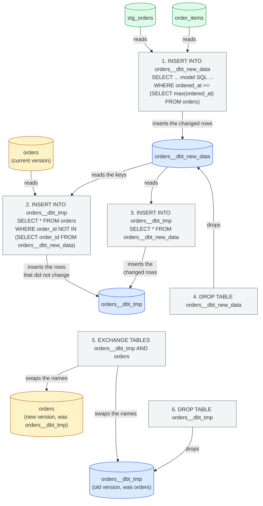
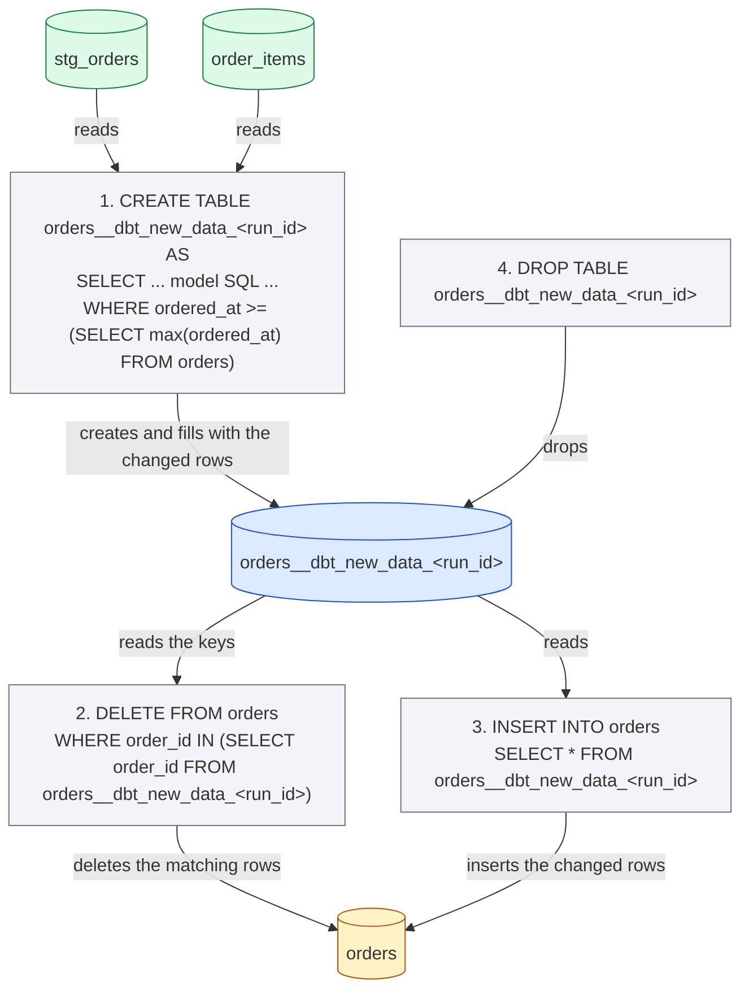
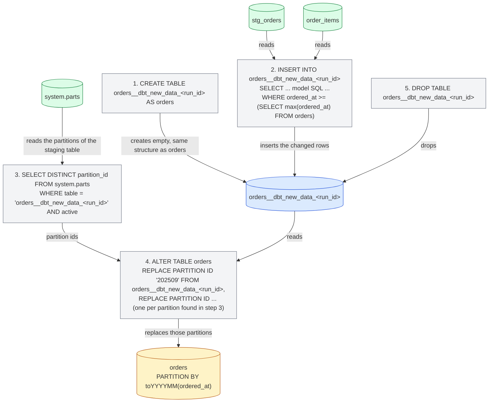

import { ClickHouseSupportedBadge } from "/snippets/ko/components/ClickHouseSupported/ClickHouseSupported.jsx";

<ClickHouseSupportedBadge />

이 가이드는 dbt Labs의 대표적인 샘플 프로젝트를 ClickHouse로 이식한 [Jaffle Shop for ClickHouse](https://github.com/ClickHouse/jaffle-shop-clickhouse) 프로젝트를 사용해 dbt의 ClickHouse 관련 측면을 살펴봅니다. 이미 정상적으로 빌드되는 프로젝트를 출발점으로 삼아 다음 내용을 다룹니다.

1. 프로젝트의 view와 테이블이 ClickHouse에 어떻게 생성되는지 이해합니다.
2. seed로 데이터를 로드하고 ClickHouse 타입과 테이블 layout을 제어합니다.
3. ClickHouse engine, sorting key, 파티셔닝을 사용해 테이블 model을 구성합니다.
4. 테이블을 incremental model로 전환하고 incremental strategy를 선택합니다.
5. snapshot을 생성합니다.
6. ClickHouse materialized view를 사용합니다.

이 가이드는 나머지 [문서](/ko/integrations/connectors/data-ingestion/etl-tools/dbt/index), [features and configurations](/ko/integrations/connectors/data-ingestion/etl-tools/dbt/features-and-configurations) 페이지, [materializations 참고](/ko/integrations/connectors/data-ingestion/etl-tools/dbt/materializations) 페이지와 함께 읽도록 구성되었습니다.

## 시작하기 전에 {#before-you-start}

먼저 [ClickHouse/jaffle-shop-clickhouse](https://github.com/ClickHouse/jaffle-shop-clickhouse)의 README를 따르십시오. 이 문서에서는 dbt Core 1.x, dbt OSS, dbt v2 또는 dbt 플랫폼으로 프로젝트를 설정하는 방법, 로컬 ClickHouse(docker) 또는 ClickHouse Cloud를 가리키도록 지정하는 방법, `dbt seed`로 샘플 데이터를 로드하는 방법, 첫 `dbt build`를 실행하는 방법을 설명합니다. `dbt build`가 성공적으로 완료되면 ClickHouse 전용 예시와 구성을 확인하기 위해 이 페이지로 돌아오십시오.

README의 단계를 마치면 ClickHouse에 다음 두 개의 데이터베이스가 생성되어 있어야 합니다:

* `raw`: `dbt seed`가 CSV 파일에서 로드한 6개의 원본 테이블(`raw_customers`, `raw_orders`, `raw_items`, `raw_products`, `raw_stores`, `raw_supplies`).
* `jaffle_shop`(프로필의 `schema`): 6개의 스테이징 뷰(`stg_*`)와 7개의 마트 테이블(`customers`, `orders`, `order_items`, `products`, `locations`, `supplies`, `metricflow_time_spine`).

프로필에서 다른 `schema`를 사용하는 경우, 아래 쿼리의 `jaffle_shop`을 해당 값으로 바꾸십시오.

<Note>
  **dbt Core 1.x, dbt OSS, dbt v2 및 dbt 플랫폼.** 이 가이드의 모든 명령어와 모델은 이들 모두에서 동일합니다. 예시는 `dbt-clickhouse` 1.10을 사용한 dbt Core 1.12와 dbt OSS 2.0으로 ClickHouse 26.8을 대상으로 테스트했으며, dbt v2는 동일한 어댑터로 동작하고 dbt 플랫폼은 dbt v2로 동작합니다. 여기에 표시된 콘솔 출력은 dbt Core 1.x의 것이며, 엔진별로 동작이 다른 몇 가지 부분은 별도로 언급합니다. v2 어댑터의 현재 상태는 [dbt OSS, dbt v2 및 dbt 플랫폼 페이지](/ko/integrations/connectors/data-ingestion/etl-tools/dbt/dbt-core-v2-fusion-and-platform)를 참조하고, dbt 플랫폼에서 시작하려면 dbt 문서의 [Connect ClickHouse](https://docs.getdbt.com/docs/platform/connect-data-platform/connect-clickhouse)를 참조하십시오.
</Note>

dbt 명령어가 아닌 모든 SQL 문은 ClickHouse에서 직접 실행하도록 작성되었습니다. 예를 들어 `clickhouse client`, ClickHouse Cloud SQL 콘솔 또는 원하는 SQL 클라이언트를 사용할 수 있습니다.

## 프로젝트가 머티리얼라이즈되는 방식 {#views-and-tables}

Jaffle Shop은 `dbt_project.yml`에서 materializations를 구성하며, staging 모델은 view로, marts는 table로 생성됩니다.

```yaml
models:
  jaffle_shop:
    staging:
      +materialized: view
    marts:
      +materialized: table
```

**view** 모델은 실행할 때마다 `CREATE OR REPLACE VIEW` 문으로 다시 생성됩니다. 데이터를 저장하지 않으므로 빌드 비용은 들지 않지만, 이 뷰를 조회하는 모든 쿼리는 모델의 SQL을 원본 테이블에 대해 실행합니다. ClickHouse는 모델의 컴파일된 SQL을 뷰 정의(view definition)에 보관합니다:

```sql
SHOW CREATE VIEW jaffle_shop.stg_orders;
```

```response
CREATE VIEW jaffle_shop.stg_orders
(
    `order_id` String,
    `location_id` String,
    `customer_id` String,
    ...
    `ordered_at` DateTime
)
AS WITH
    source AS
    (
        SELECT *
        FROM raw.raw_orders
    ),
    renamed AS
    (
        SELECT
            id AS order_id,
            store_id AS location_id,
            ...
            dateTrunc('day', ordered_at) AS ordered_at
        FROM source
    )
SELECT *
FROM renamed
```

**table** model은 실행할 때마다 처음부터 다시 생성됩니다. 어댑터가 새 테이블을 생성한 뒤, model의 SQL로 `INSERT INTO ... SELECT`를 실행하고 이를 이전 버전과 원자적으로 교환합니다. 쿼리 성능은 view보다 훨씬 뛰어나지만, 저장 공간을 차지하고 매번 전체 테이블을 재구성해야 한다는 비용이 따릅니다. dbt가 `orders` 마트를 위해 생성한 테이블을 살펴보십시오.

```sql
SHOW CREATE TABLE jaffle_shop.orders;
```

```response
CREATE TABLE jaffle_shop.orders
(
    `order_id` String,
    `location_id` String,
    `customer_id` String,
    ...
    `customer_order_number` UInt64
)
ENGINE = MergeTree
ORDER BY tuple()
SETTINGS replicated_deduplication_window = '0', index_granularity = 8192
```

여기서 ClickHouse에 특화된 부분은 두 가지입니다. 이 model은 테이블 엔진을 선언하지 않으므로 어댑터가 `MergeTree`를 사용하고, sorting key도 선언하지 않으므로 어댑터가 `ORDER BY tuple()`을 사용합니다. 즉, 데이터가 전혀 정렬되지 않습니다. 샘플 프로젝트에서는 문제가 없지만, 실제 table이라면 두 가지 모두 직접 지정하는 것이 좋으며, 다음 섹션에서 바로 그 작업을 진행합니다. 어댑터가 지원하는 모든 테이블 구성은 [materializations 페이지](/ko/integrations/connectors/data-ingestion/etl-tools/dbt/materializations)에서 확인할 수 있습니다.

## seed로 데이터 로드하기 {#seeds}

Jaffle Shop은 dbt [seeds](https://docs.getdbt.com/docs/build/seeds)를 사용해 `seeds/jaffle-data`의 CSV 파일에서 원시 데이터를 로드합니다. seed는 작고 정적인 참조 데이터(코드 테이블, 매핑)를 위한 기능이며, warehouse를 채우는 용도가 아닙니다. 이 프로젝트는 별도의 수집 도구 없이도 바로 시작할 수 있도록 편의상 seed를 사용하며, 그래서 `--vars '{"load_source_data": true}'`를 전달하지 않으면 seed가 비활성화되어 있습니다.

그럼에도 seed는 dbt가 ClickHouse 테이블을 어떻게 생성하는지 익히기에 좋은 출발점입니다. dbt는 각 CSV 컬럼의 컬럼 타입을 추론하며, 추론된 타입은 엔진에 따라 다릅니다:

| CSV 값                 | dbt v1     | v2 엔진           |
| --------------------- | ---------- | --------------- |
| `700`                 | `Int32`    | `Int64`         |
| `0.06`                | `Float32`  | `Float64`       |
| `2024-09-01T15:01:00` | `DateTime` | `DateTime64(6)` |
| `Philadelphia`        | `String`   | `String`        |

타입이 중요하다면 `column_types`로 명시적으로 지정하십시오. 이 프로젝트에서는 이미 `dbt_project.yml`에서 `raw_stores` seed의 `opened_at` 컬럼에 이를 적용하고 있습니다:

```yaml
seeds:
  jaffle_shop:
    +schema: raw
    jaffle-data:
      +enabled: "{{ var('load_source_data', false) }}"
      raw_stores:
        +column_types:
          opened_at: DateTime64(3)
```

seed는 ClickHouse 테이블 구성인 `engine`, `order_by`, `partition_by`도 지원합니다. 예를 들어 `raw_orders` seed를 주문 시각 기준으로 정렬하고 월별로 파티셔닝하려면, CSV 파일과 같은 위치에 속성 파일 `seeds/jaffle-data/_raw_orders.yml`을 추가하십시오:

```yaml
seeds:
  - name: raw_orders
    config:
      order_by: (ordered_at, id)
      partition_by: toYYYYMM(ordered_at)
```

<Note>
  이러한 ClickHouse seed 구성에는 `dbt_project.yml`의 `seeds:` 아래에 있는 `+order_by` 또는 `+engine` 키 대신 properties 파일을 사용하십시오. dbt Core 1.x는 두 형식 모두를 허용하지만, dbt v2는 properties 파일에서만 이를 인식하며 `dbt_project.yml`의 키는 `Unrecognized key ... Custom keys must go under +meta` 오류와 함께 거부합니다.
</Note>

해당 seed를 다시 로드하고 생성된 테이블을 확인하십시오:

```bash
dbt seed --select raw_orders --full-refresh --vars '{"load_source_data": true}'
```

```sql
SHOW CREATE TABLE raw.raw_orders;
```

```response
CREATE TABLE raw.raw_orders
(
    `id` String,
    `customer` String,
    `ordered_at` DateTime,
    `store_id` String,
    `subtotal` Int32,
    `tax_paid` Int32,
    `order_total` Int32
)
ENGINE = MergeTree
PARTITION BY toYYYYMM(ordered_at)
ORDER BY (ordered_at, id)
SETTINGS index_granularity = 8192
```

`dbt seed --full-refresh`는 테이블을 삭제한 뒤 재생성하므로, 이 가이드 뒷부분의 materialized view처럼 해당 테이블 데이터에 직접 의존하는 객체를 빌드하기 전에 실행하십시오.

## ClickHouse용 테이블 구성하기 {#table-configuration}

`orders` 마트는 시작점으로 삼기에 가장 적합합니다. `customers` 마트와 프로젝트의 메트릭이 이 마트를 조회하며, timestamp를 가진 이벤트 형태의 테이블이기 때문입니다. `models/marts/orders.sql` 상단에 `config` 블록을 추가하여 engine, sorting key, 파티셔닝 방식을 지정하십시오:

```sql
{{
    config(
        materialized='table',
        engine='MergeTree()',
        order_by='(ordered_at, order_id)',
        partition_by='toYYYYMM(ordered_at)'
    )
}}

with

orders as (

    select * from {{ ref('stg_orders') }}

),
...
```

model의 나머지 부분은 그대로 둡니다. `materialized='table'`은 `dbt_project.yml`에 marts용으로 이미 지정된 내용을 다시 명시하는 것으로, 이후 이 model을 incremental로 전환할 때도 model이 self-describing 상태를 유지하게 해줍니다. 이 model만 재구성하십시오:

```bash
dbt run --select orders
```

```response
1 of 1 START sql table model `jaffle_shop`.`orders` ............................ [RUN]
1 of 1 OK created sql table model `jaffle_shop`.`orders` ....................... [OK in 0.44s]
```

이제 테이블에 적절한 정렬 키(sorting key)가 지정되었고, 월별로 파티션이 하나씩 생성됩니다:

```sql
SHOW CREATE TABLE jaffle_shop.orders;
```

```response
CREATE TABLE jaffle_shop.orders
(
    ...
)
ENGINE = MergeTree
PARTITION BY toYYYYMM(ordered_at)
ORDER BY (ordered_at, order_id)
SETTINGS replicated_deduplication_window = '0', index_granularity = 8192
```

```sql
SELECT partition, sum(rows) AS rows
FROM system.parts
WHERE database = 'jaffle_shop' AND table = 'orders' AND active
GROUP BY partition
ORDER BY partition;
```

```response
┌─partition─┬─rows─┐
│ 202409    │ 1497 │
│ 202410    │ 1698 │
│ 202411    │ 2262 │
...
│ 202508    │ 9389 │
└───────────┴──────┘
```

`engine`, `order_by`, `partition_by` 외에도 table 모델은 `primary_key`, `ttl`, `settings`, `query_settings`, `projections`, `indexes`를 지원하며, 컬럼은 모델 컨트랙트를 통해 `codec`과 `ttl`을 지정할 수 있습니다. 이들 모두에 대한 자세한 설명은 [materializations 페이지](/ko/integrations/connectors/data-ingestion/etl-tools/dbt/materializations)에서 확인할 수 있습니다.

## incremental 모델 생성 {#incremental}

62,000행 정도라면 매 실행마다 `orders`를 처음부터 다시 구축해도 괜찮지만, 하루에 수백만 행씩 늘어나는 테이블에서는 그렇지 않습니다. dbt의 [incremental materialization](https://docs.getdbt.com/docs/build/incremental-models)은 마지막 실행 이후 변경된 행만 처리합니다. `orders` 모델을 변환하려면 다음 두 가지를 추가해야 합니다.

1. **`unique_key`**: 행을 식별하는 컬럼으로, 여기서는 `order_id`입니다. 어댑터는 이 값을 사용해 다시 처리되는 행을 중복으로 쌓지 않고 대체합니다.
2. **incremental 필터**: ``로 감싼 `where` 절로, 처리할 행만 선택합니다. 이 필터는 incremental 실행에서만 적용되며, 테이블을 처음 구축할 때(또는 `--full-refresh`로 재구성할 때)는 적용되지 않습니다. 주문 데이터에는 timestamp가 있으므로, 필터는 `{{ this }}` 변수로 참조한 테이블에 이미 존재하는 최신 값과 `ordered_at`을 비교합니다.

`config` 블록과 모델의 끝부분이 다음과 같이 되도록 `models/marts/orders.sql`을 수정하세요.

```sql
{{
    config(
        materialized='incremental',
        unique_key='order_id',
        engine='MergeTree()',
        order_by='(ordered_at, order_id)',
        partition_by='toYYYYMM(ordered_at)'
    )
}}

with

orders as (

    select * from {{ ref('stg_orders') }}

),

...

select * from customer_order_count



-- this filter will only be applied on an incremental run
where ordered_at >= (select max(ordered_at) from {{ this }})


```

`stg_orders`는 `ordered_at`을 일 단위로 잘라내므로 필터에 `>=`를 사용합니다. 실행할 때마다 가장 최근 하루 전체가 다시 처리되며, `unique_key` 덕분에 이미 로드된 행은 중복되지 않고 대체됩니다. 같은 날 뒤늦게 도착한 주문도 안전하게 처리할 수 있는 이유가 바로 이것입니다.

model을 실행하십시오. table이 이미 존재하므로 이 첫 실행부터 incremental 실행이 됩니다. 즉, 가장 최근 하루만 다시 처리됩니다.

```bash
dbt run --select orders
```

```response
1 of 1 START sql incremental model `jaffle_shop`.`orders` ...................... [RUN]
1 of 1 OK created sql incremental model `jaffle_shop`.`orders` ................. [OK in 0.94s]
```

이제 새로운 데이터를 추가해 보겠습니다. Jaffle Shop 데이터는 2025년 8월까지만 있으므로, 어제 재플을 주문한 신규 고객 Clicky McClickHouse를 추가합니다. raw 테이블에 고객, 주문, 그리고 해당 주문 항목을 삽입합니다:

```sql
INSERT INTO raw.raw_customers VALUES ('clicky-0001', 'Clicky McClickHouse');

INSERT INTO raw.raw_orders VALUES
    ('clicky-order-0001', 'clicky-0001', now() - INTERVAL 1 DAY,
     '4b6c2304-2b9e-41e4-942a-cf11a1819378', 1100, 66, 1166);

INSERT INTO raw.raw_items VALUES ('clicky-item-0001', 'clicky-order-0001', 'JAF-001');
```

매장 ID는 Philadelphia이고, 항목은 `nutellaphone who dis?` 재플이며 가격은 11.00, 세금은 Philadelphia의 6%이므로 프로젝트의 데이터 테스트는 여전히 통과합니다. `orders`보다 먼저 staging 뷰와 `order_items` 테이블이 새 행을 인식하도록 프로젝트 전체를 실행하십시오:

```bash
dbt run
```

```response
...
10 of 13 OK created sql table model `jaffle_shop`.`order_items` ................ [OK in 0.30s]
...
12 of 13 START sql incremental model `jaffle_shop`.`orders` .................... [RUN]
12 of 13 OK created sql incremental model `jaffle_shop`.`orders` ............... [OK in 0.73s]
13 of 13 START sql table model `jaffle_shop`.`customers` ....................... [RUN]
13 of 13 OK created sql table model `jaffle_shop`.`customers` .................. [OK in 0.28s]
```

새 주문이 incremental 테이블에 추가되었고, 이를 기반으로 다시 빌드된 `customers` 마트는 새 고객을 인식합니다:

```sql
SELECT order_id, customer_id, ordered_at, order_total, customer_order_number
FROM jaffle_shop.orders
WHERE customer_id = 'clicky-0001';
```

```response
┌─order_id──────────┬─customer_id─┬──────────ordered_at─┬─order_total─┬─customer_order_number─┐
│ clicky-order-0001 │ clicky-0001 │ 2026-09-14 00:00:00 │       11.66 │                     1 │
└───────────────────┴─────────────┴─────────────────────┴─────────────┴───────────────────────┘
```

```sql
SELECT customer_name, count_lifetime_orders, lifetime_spend, customer_type
FROM jaffle_shop.customers
WHERE customer_id = 'clicky-0001';
```

```response
┌─customer_name───────┬─count_lifetime_orders─┬─lifetime_spend─┬─customer_type─┐
│ Clicky McClickHouse │                     1 │          11.66 │ new           │
└─────────────────────┴───────────────────────┴────────────────┴───────────────┘
```

### Internals {#internals}

ClickHouse의 query log를 보면 어댑터가 incremental UPDATE를 위해 실행한 SQL 문을 확인할 수 있습니다:

```sql
SELECT event_time, written_rows, tables
FROM system.query_log
WHERE query_kind = 'Insert' AND type = 'QueryFinish'
  AND has(databases, 'jaffle_shop')
  AND event_time > now() - INTERVAL 15 MINUTE
ORDER BY event_time;
```

어댑터의 기본 incremental strategy는 다음과 같이 동작합니다. 이 섹션의 다이어그램에서 테이블에서 SQL 문으로 향하는 화살표는 해당 SQL 문이 그 테이블을 읽는다는 의미이고, SQL 문에서 테이블로 향하는 화살표는 해당 테이블에 쓰거나, 변경(mutate)하거나, 이름을 변경(rename)하거나, 삭제한다는 의미입니다:

1. `orders__dbt_new_data` 테이블이 생성되고, incremental filter를 포함한 model의 SQL 결과가 이 테이블에 삽입됩니다. 위 실행에서는 378개의 행이 기록되었습니다. 이미 로드되어 있던 최신 날짜의 주문 377건과 새로 추가된 주문 1건입니다.
2. `orders`와 동일한 구조(structure)의 `orders__dbt_tmp` 테이블이 생성되고, `order_id`가 `orders__dbt_new_data`에 없는 `orders`의 모든 행이 이 테이블로 복사됩니다.
3. `orders__dbt_new_data`의 모든 행이 `orders__dbt_tmp`에 삽입됩니다. 최신 날짜의 행을 중복시키지 않고 대체하는 역할을 하는 것이 바로 2단계와 3단계입니다.
4. `orders__dbt_new_data`가 삭제됩니다.
5. `orders__dbt_tmp`는 원자적(atomic) `EXCHANGE TABLES` SQL 문을 통해 `orders`와 스왑됩니다(중간에 `orders__dbt_backup`으로 이름을 변경하는 과정을 거칩니다). 따라서 이제 `orders`가 새 버전을 담게 됩니다.
6. 이전 버전은 삭제됩니다.



2단계에서 전체 테이블을 복사하므로, 매우 큰 모델에서는 이 전략의 비용이 테이블을 재구성하는 것과 맞먹습니다. [제한 사항](/ko/integrations/connectors/data-ingestion/etl-tools/dbt/index#limitations)을 참조하십시오. 아래 전략들은 이러한 복사를 피합니다.

### Append 전략 {#append-strategy}

`append` 전략은 모델이 선택한 행을 대상 테이블(target table)에 곧바로 삽입합니다. 임시 테이블을 만들지도, 데이터를 복사하지도 않으므로 증분 실행 중에서는 비용이 가장 저렴합니다. 그 대가로 중복 제거 역시 전혀 이루어지지 않습니다. 증분 filter가 이미 테이블에 있는 행을 선택하면 그 행은 두 번 들어갑니다. 변경되지 않는 이벤트성 데이터에 사용하고, filter가 실제로 새로운 행만 선택하도록 반드시 확인하십시오.

`ordered_at`을 일 단위로 자른 경우에는 filter를 `>`로 바꿔야 합니다. 모델을 다음과 같이 수정하십시오.

```sql
{{
    config(
        materialized='incremental',
        incremental_strategy='append',
        unique_key='order_id',
        engine='MergeTree()',
        order_by='(ordered_at, order_id)',
        partition_by='toYYYYMM(ordered_at)'
    )
}}

...



-- this filter will only be applied on an incremental run
where ordered_at > (select max(ordered_at) from {{ this }})


```

두 번째 신규 고객인 Danny DeBito를 추가합니다. 이 고객은 오늘 Brooklyn(세율 4%)에서 jaffle 1개와 coffee 1개를 주문했습니다:

```sql
INSERT INTO raw.raw_customers VALUES ('danny-0001', 'Danny DeBito');

INSERT INTO raw.raw_orders VALUES
    ('danny-order-0001', 'danny-0001', now(),
     '40e6ddd6-b8f6-4e17-8bd6-5e53966809d2', 1900, 76, 1976);

INSERT INTO raw.raw_items VALUES
    ('danny-item-0001', 'danny-order-0001', 'JAF-003'),
    ('danny-item-0002', 'danny-order-0001', 'BEV-004');
```

```bash
dbt run
```

```response
...
12 of 13 START sql incremental model `jaffle_shop`.`orders` .................... [RUN]
12 of 13 OK created sql incremental model `jaffle_shop`.`orders` ............... [OK in 0.11s]
...
```

incremental model은 이전 실행에 비해 훨씬 짧은 시간에 실행되었습니다. 두 신규 고객 모두 table에 주문이 정확히 하나씩 있습니다:

```sql
SELECT order_id, customer_id, ordered_at, order_total, is_food_order, is_drink_order
FROM jaffle_shop.orders
WHERE customer_id IN ('clicky-0001', 'danny-0001')
ORDER BY ordered_at;
```

```response
┌─order_id──────────┬─customer_id─┬──────────ordered_at─┬─order_total─┬─is_food_order─┬─is_drink_order─┐
│ clicky-order-0001 │ clicky-0001 │ 2026-09-14 00:00:00 │       11.66 │             1 │              0 │
│ danny-order-0001  │ danny-0001  │ 2026-09-15 00:00:00 │       19.76 │             1 │              1 │
└───────────────────┴─────────────┴─────────────────────┴─────────────┴───────────────┴────────────────┘
```

query log을 보면 차이가 분명히 드러납니다. 이번에 `orders`를 건드리는 SQL 문은 model의 SQL과 incremental filter가 포함된 `INSERT INTO jaffle_shop.orders ... SELECT ...` 하나뿐이며, 1개의 행만 기록되었습니다.

<Warning>
  `>`와 일 단위로 truncated된 timestamp를 사용하면, 마지막으로 적재된 주문과 같은 날 그보다 늦게 도착한 주문은 전혀 반영되지 않습니다. 실제 프로젝트에서 `append` strategy를 사용할 때는 full precision timestamp 또는 단조 증가하는 수집 시각을 기준으로 filter하십시오.
</Warning>

### Delete and insert 전략 {#delete-insert-strategy}

ClickHouse는 과거에 비동기 [뮤테이션](/ko/reference/statements/alter/index) 형태로만 업데이트와 삭제를 제한적으로 지원했습니다. 이 방식은 IO 부하가 매우 크므로 일반적으로 사용을 피해야 합니다. ClickHouse 22.8에서 [경량한 삭제](/ko/reference/statements/delete)가, ClickHouse 25.7에서 [경량 업데이트](/ko/reference/statements/update)가 도입되었습니다. 이를 통해 단일 삭제 또는 UPDATE SQL 문의 결과는 비동기적으로 구체화되더라도 사용자 관점에서는 즉시 반영된 것으로 확인됩니다.

`delete+insert` 전략은 경량한 삭제를 기반으로 하며, `incremental_strategy` 매개변수를 통해 구성합니다:

```sql
{{
    config(
        materialized='incremental',
        incremental_strategy='delete+insert',
        unique_key='order_id',
        engine='MergeTree()',
        order_by='(ordered_at, order_id)',
        partition_by='toYYYYMM(ordered_at)'
    )
}}
```

이 전략은 target table에 직접 작업을 수행하므로, 중간에 실패하면 incremental model의 데이터가 유효하지 않은 상태로 남을 가능성이 큽니다. 원자적 스왑이 없기 때문입니다. 요약하면 다음과 같습니다.

1. temporary table(`orders__dbt_new_data_<run_id>`)을 생성하고, model이 선택한 rows를 여기에 삽입합니다.
2. temporary table에 존재하는 모든 `order_id`에 대해 `orders`를 대상으로 `DELETE`를 실행합니다.
3. temporary table의 rows를 `orders`에 삽입합니다.
4. temporary table을 삭제합니다.



### Insert overwrite 전략 (실험적 기능) {#insert-overwrite-strategy}

`insert_overwrite` 전략은 파티션 전체를 교체하므로, `orders`의 월별 파티션과 같은 `partition_by` 구성이 필요합니다. 이 전략은 다음 단계를 수행합니다:

1. `orders`와 동일한 구조의 스테이징 테이블(`orders__dbt_new_data_<run_id>`)을 생성합니다.
2. model이 선택한 행만 스테이징 테이블에 삽입합니다.
3. `system.parts`에서 스테이징 테이블에 존재하는 파티션 목록을 조회합니다.
4. `ALTER TABLE ... REPLACE PARTITION ... FROM`을 사용해 스테이징 테이블의 해당 파티션만 `orders`에 정확히 교체합니다.
5. 스테이징 테이블을 삭제합니다.

이 접근 방식의 장점은 다음과 같습니다:

* 테이블 전체를 복사하지 않으므로 기본 전략보다 빠릅니다.
* INSERT 작업이 성공적으로 완료되기 전까지 원본 테이블을 수정하지 않으므로 다른 전략보다 안전합니다. 중간에 실패가 발생해도 원본 테이블은 그대로 유지됩니다.
* 「파티션 불변성(partition immutability)」이라는 데이터 엔지니어링 모범 사례를 구현하므로, 증분 및 병렬 데이터 처리, 롤백 등이 단순해집니다.



[머티리얼라이즈 페이지](/ko/integrations/connectors/data-ingestion/etl-tools/dbt/materializations#materialization-incremental)에서는 `microbatch` 전략과 `on_schema_change`를 비롯해 incremental 머티리얼라이즈의 나머지 옵션을 다룹니다.

## 스냅샷 생성 {#snapshot}

dbt [스냅샷](https://docs.getdbt.com/docs/build/snapshots)은 변경 가능한 테이블의 행이 시간에 따라 어떻게 변화하는지를 기록하므로, 분석가는 과거 임의 시점의 데이터 상태를 되짚어 볼 수 있습니다. 스냅샷은 [type-2 느리게 변화하는 차원(slowly changing dimensions)](https://en.wikipedia.org/wiki/Slowly_changing_dimension#Type_2:_add_new_row)을 구현하며, 행의 각 버전은 그 버전이 유효했던 인터벌과 함께 저장됩니다.

`customers` 마트가 좋은 후보입니다. 고객이 다시 주문할 때마다 `count_lifetime_orders`, `lifetime_spend`, `customer_type`이 모두 바뀌기 때문입니다. 계속 진행하기 전에 `orders` 모델을 [incremental 섹션](#incremental)의 기본 incremental strategy로 되돌리십시오(`incremental_strategy='append'`를 제거하고 필터를 다시 `>=`로 변경). 이렇게 하면 오늘 이후에 들어온 주문이 반영됩니다.

dbt 1.9부터 스냅샷은 YAML로 정의합니다. `snapshots/customers_snapshot.yml` 파일을 생성하세요:

```yaml
snapshots:
  - name: customers_snapshot
    relation: ref('customers')
    config:
      unique_key: customer_id
      strategy: check
      check_cols:
        - count_lifetime_orders
        - lifetime_spend
        - customer_type
```

`check` strategy는 실행할 때마다 current snapshot과 source 사이의 지정된 컬럼들을 비교하여, 그중 하나라도 변경되면 새로운 version을 기록합니다. model에 신뢰할 수 있는 &quot;최종 업데이트&quot; timestamp 컬럼이 있다면 `timestamp` strategy가 비용 면에서 더 유리합니다. 이때는 `strategy: timestamp`와 `updated_at: <column>`을 설정하십시오. Jaffle Shop의 `last_ordered_at`은 일 단위로 truncated되어 있어 같은 날 발생한 두 번째 주문을 감지하지 못하며, 이러한 이유로 이 예시에서는 `check`를 사용합니다.

첫 번째 snapshot을 생성합니다:

```bash
dbt snapshot
```

```response
1 of 1 START snapshot `jaffle_shop`.`customers_snapshot` ....................... [RUN]
1 of 1 OK snapshotted `jaffle_shop`.`customers_snapshot` ....................... [OK in 0.17s]
```

snapshot table은 model과 같은 위치에 생성됩니다. 이 프로젝트의 `generate_schema_name` macro는 production이 아닌 target에서 모든 릴레이션을 target schema에 배치하므로, snapshot에 지정한 `schema` config는 `prod` target에서만 적용됩니다. 이 table에는 고객당 하나의 행이 저장되며, dbt 관리용 컬럼인 `dbt_valid_from`과 `dbt_valid_to`가 포함됩니다. 행의 현재 version에서는 후자가 `NULL`입니다:

```sql
SELECT customer_id, count_lifetime_orders, lifetime_spend, customer_type, dbt_valid_from, dbt_valid_to
FROM jaffle_shop.customers_snapshot
WHERE customer_id IN ('clicky-0001', 'danny-0001')
ORDER BY customer_id, dbt_valid_from;
```

```response
┌─customer_id─┬─count_lifetime_orders─┬─lifetime_spend─┬─customer_type─┬──────dbt_valid_from─┬─dbt_valid_to─┐
│ clicky-0001 │                     1 │          11.66 │ new           │ 2026-09-15 01:15:32 │         ᴺᵁᴸᴸ │
│ danny-0001  │                     1 │          19.76 │ new           │ 2026-09-15 01:15:32 │         ᴺᵁᴸᴸ │
└─────────────┴───────────────────────┴────────────────┴───────────────┴─────────────────────┴──────────────┘
```

Clicky가 오늘 커피를 마시러 다시 찾아옵니다:

```sql
INSERT INTO raw.raw_orders VALUES
    ('clicky-order-0002', 'clicky-0001', now(),
     '4b6c2304-2b9e-41e4-942a-cf11a1819378', 600, 36, 636);

INSERT INTO raw.raw_items VALUES ('clicky-item-0002', 'clicky-order-0002', 'BEV-001');
```

`orders`와 `customers`에 새 주문이 반영되도록 model을 실행한 뒤, 두 번째 snapshot을 생성합니다:

```bash
dbt run
dbt snapshot
```

```response
1 of 1 START snapshot `jaffle_shop`.`customers_snapshot` ....................... [RUN]
1 of 1 OK snapshotted `jaffle_shop`.`customers_snapshot` ....................... [OK in 0.73s]
```

이제 snapshot에 Clicky의 행이 두 개 존재합니다. 첫 번째 버전은 `dbt_valid_to`가 설정되면서 닫혔고, 주문이 두 건인 `returning` 고객이 된 새 버전은 열려 있습니다. Danny는 변경되지 않았으므로 해당 행은 그대로 유지됩니다:

```sql
SELECT customer_id, count_lifetime_orders, lifetime_spend, customer_type, dbt_valid_from, dbt_valid_to
FROM jaffle_shop.customers_snapshot
WHERE customer_id IN ('clicky-0001', 'danny-0001')
ORDER BY customer_id, dbt_valid_from;
```

```response
┌─customer_id─┬─count_lifetime_orders─┬─lifetime_spend─┬─customer_type─┬──────dbt_valid_from─┬────────dbt_valid_to─┐
│ clicky-0001 │                     1 │          11.66 │ new           │ 2026-09-15 01:15:32 │ 2026-09-15 01:16:16 │
│ clicky-0001 │                     2 │          18.02 │ returning     │ 2026-09-15 01:16:16 │                ᴺᵁᴸᴸ │
│ danny-0001  │                     1 │          19.76 │ new           │ 2026-09-15 01:15:32 │                ᴺᵁᴸᴸ │
└─────────────┴───────────────────────┴────────────────┴───────────────┴─────────────────────┴─────────────────────┘
```

내부적으로 어댑터는 새 버전의 snapshot을 `customers_snapshot__snapshot_upsert` 테이블에 생성한 뒤 `EXCHANGE TABLES`로 스왑합니다(서버가 테이블 exchange를 지원하지 않으면 삭제 후 rename 방식을 사용합니다). 따라서 읽는 쪽에서는 이전 버전 또는 새 버전의 snapshot 중 하나만 보게 됩니다. 구성 관련 참고 정보는 [materializations 페이지의 snapshot 섹션](/ko/integrations/connectors/data-ingestion/etl-tools/dbt/materializations#snapshot)을 확인하십시오.

## materialized view 사용하기 {#materialized-views}

지금까지 다룬 방식은 모두 새로운 데이터를 모델에 반영하려면 `dbt run`을 실행해야 합니다. ClickHouse [materialized view](/ko/concepts/features/materialized-views/index)는 동작 방식이 다릅니다. materialized view는 일종의 insert trigger로, 원본 테이블에 삽입되는 모든 행 블록이 뷰의 `SELECT`를 거쳐 변환된 뒤 target table에 기록되며 별도의 스케줄링은 필요하지 않습니다. 어댑터는 `materialized_view` 머티리얼라이즈를 통해 이 기능을 제공합니다.

원시 주문 테이블에서 직접 읽어 매장별, 일자별 주문 수와 매출을 계산하는 `models/marts/daily_store_revenue.sql`을 생성하십시오.

```sql
{{
    config(
        materialized='materialized_view',
        engine='SummingMergeTree()',
        order_by='(order_date, store_id)'
    )
}}

select
    toDate(ordered_at) as order_date,
    store_id,
    count() as orders,
    sum(order_total) as revenue_cents
from {{ source('ecom', 'raw_orders') }}
group by order_date, store_id
```

`engine`과 `order_by`는 대상 테이블(target table)에 적용됩니다. `SummingMergeTree`는 파트를 머지할 때 동일한 정렬 키를 가진 행들의 숫자 컬럼 값을 합산하며, 이는 일별·매장별 집계에 꼭 필요한 동작입니다.

```bash
dbt run --select daily_store_revenue
```

```response
1 of 1 START sql materialized_view model `jaffle_shop`.`daily_store_revenue` ... [RUN]
1 of 1 OK created sql materialized_view model `jaffle_shop`.`daily_store_revenue`  [OK in 0.25s]
```

어댑터는 두 개의 객체를 생성했습니다. 하나는 model 이름을 그대로 사용한 target table이고, 다른 하나는 이름 뒤에 `_mv`가 붙은 materialized view 자체로, `TO` 절을 통해 target table을 가리킵니다. 기본 설정(`catchup=True`)에서는 target table에 기존 주문 데이터도 백필되었습니다:

```sql
SELECT name, engine
FROM system.tables
WHERE database = 'jaffle_shop' AND name LIKE 'daily_store_revenue%';
```

```response
┌─name───────────────────┬─engine───────────┐
│ daily_store_revenue    │ SummingMergeTree │
│ daily_store_revenue_mv │ MaterializedView │
└────────────────────────┴──────────────────┘
```

```sql
SHOW CREATE TABLE jaffle_shop.daily_store_revenue_mv;
```

```response
CREATE MATERIALIZED VIEW jaffle_shop.daily_store_revenue_mv TO jaffle_shop.daily_store_revenue
(
    `order_date` Date,
    `store_id` String,
    `orders` UInt64,
    `revenue_cents` Int64
)
AS SELECT
    toDate(ordered_at) AS order_date,
    store_id,
    count() AS orders,
    sum(order_total) AS revenue_cents
FROM raw.raw_orders
GROUP BY
    order_date,
    store_id
```

이제 Danny의 원본 주문을 하나 더 삽입하되, 이후에 dbt를 실행하지는 않습니다:

```sql
INSERT INTO raw.raw_orders VALUES
    ('danny-order-0002', 'danny-0001', now(),
     '40e6ddd6-b8f6-4e17-8bd6-5e53966809d2', 1400, 56, 1456);

INSERT INTO raw.raw_items VALUES ('danny-item-0003', 'danny-order-0002', 'JAF-004');
```

target table에는 이미 반영되어 있습니다. 이제 Brooklyn의 오늘 주문은 2건입니다:

```sql
SELECT order_date, store_id, sum(orders) AS orders, sum(revenue_cents) AS revenue_cents
FROM jaffle_shop.daily_store_revenue
WHERE order_date >= yesterday()
GROUP BY order_date, store_id
ORDER BY order_date, store_id;
```

```response
┌─order_date─┬─store_id─────────────────────────────┬─orders─┬─revenue_cents─┐
│ 2026-09-14 │ 4b6c2304-2b9e-41e4-942a-cf11a1819378 │      1 │          1166 │
│ 2026-09-15 │ 40e6ddd6-b8f6-4e17-8bd6-5e53966809d2 │      2 │          3432 │
│ 2026-09-15 │ 4b6c2304-2b9e-41e4-942a-cf11a1819378 │      1 │           636 │
└────────────┴──────────────────────────────────────┴────────┴───────────────┘
```

이 쿼리는 의도적으로 `sum()`과 `GROUP BY`로 집계합니다. `SummingMergeTree`는 파트가 백그라운드에서 머지될 때에만 동일한 키의 행을 합치므로, 그 전까지 Brooklyn 주문 두 건은 테이블에서 두 개의 행으로 남아 있습니다. summing 및 aggregating 엔진을 사용할 때는 항상 읽기 시점에 집계하거나 `FINAL`을 사용하십시오. 한편 `orders` incremental 모델에는 다음 `dbt run`이 실행되기 전까지 Danny의 주문이 한 건만 존재합니다.

이후 `dbt run`을 실행하면 target table과 그 데이터는 그대로 유지되고 view definition만 갱신되며, 변경 내용이 허용하는 경우에는 `ALTER TABLE ... MODIFY QUERY`가 사용됩니다. 따라서 해당 모델을 프로젝트에 그대로 두어도 안전합니다. `dbt run --full-refresh`는 target table을 재구성하고 다시 backfill합니다(`catchup`이 `False`인 경우는 제외). 나머지 내용은 [materialized views 페이지](/ko/integrations/connectors/data-ingestion/etl-tools/dbt/materialization-materialized-view)에서 다룹니다. `on_schema_change`를 통한 schema changes, `catchup`으로 backfill 비활성화, 갱신 가능 구체화 뷰, 여러 view가 동일한 target에 데이터를 공급하는 구성, target table을 별도의 모델로 정의하는 방법 등입니다.

## 추가 정보 {#further-information}

이 가이드는 dbt의 기본적인 내용만 다룹니다. ClickHouse에 특화되지 않은 내용은 모두 [dbt 문서](https://docs.getdbt.com/docs/introduction)를 참고하십시오. 어댑터의 경우 profile 설정과 전역 기능은 [features and configurations](/ko/integrations/connectors/data-ingestion/etl-tools/dbt/features-and-configurations) 페이지를, 위에서 사용한 모든 구성은 [materializations 페이지](/ko/integrations/connectors/data-ingestion/etl-tools/dbt/materializations)를, dbt OSS, dbt v2 또는 dbt 플랫폼을 사용한다면 [dbt OSS, dbt v2 및 dbt 플랫폼 페이지](/ko/integrations/connectors/data-ingestion/etl-tools/dbt/dbt-core-v2-fusion-and-platform)를 확인하십시오. [Jaffle Shop for ClickHouse](https://github.com/ClickHouse/jaffle-shop-clickhouse)에 새로운 예시를 기여해 주시면 언제든 환영합니다.