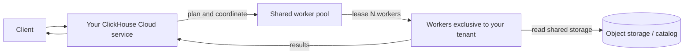
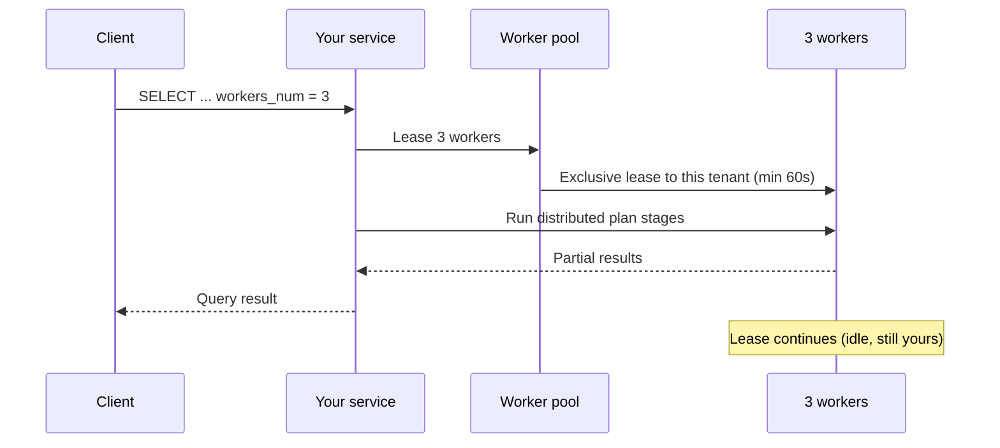
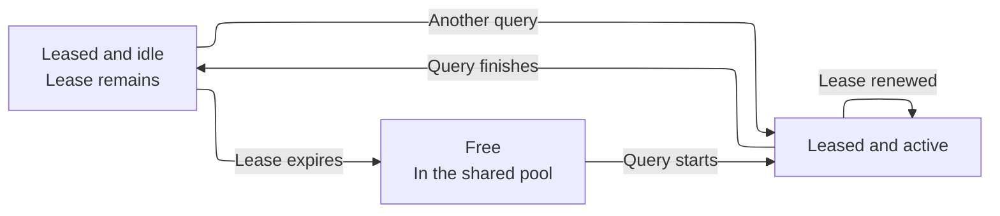
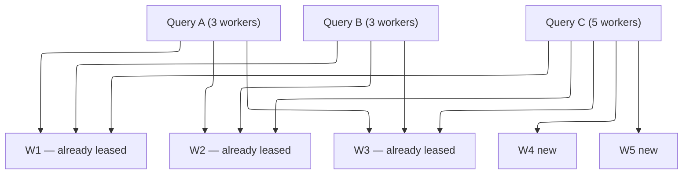

import { PrivatePreviewBadge } from "/snippets/ko/components/PrivatePreviewBadge/PrivatePreviewBadge.jsx";

<PrivatePreviewBadge />

<Note>
  On-Demand Compute는 비공개 프리뷰 단계입니다. ClickHouse Cloud의 SLO 또는 SLA가 적용되지 않으며, 알려진 제약과 알려지지 않은 제약이 있을 수 있습니다. [제한 사항](#limitations)을 참조하십시오.

  [대기 목록에 등록하십시오](https://clickhouse.com/cloud/on-demand-compute-waitlist).
</Note>

On-Demand Compute는 서비스 크기를 조정하거나 별도의 서비스를 프로비저닝하지 않고도 서비스(테넌트)에 지원 대상 워크로드용 추가 컴퓨트를 제공하는 ClickHouse Cloud 기능입니다. 이러한 작업은 해당 서비스 자체의 컴퓨트 외부에 있는 ClickHouse worker에서 실행됩니다. worker는 테넌트 간에 공유되는 관리형 풀에서 제공되지만, 각 worker는 한 번에 하나의 테넌트에만 할당됩니다.

비공개 프리뷰 기간에 On-Demand Compute는 조건을 충족하는 `SELECT` 쿼리를 지원합니다. 설정을 통해 쿼리를 대상에 포함시키면, ClickHouse가 풀에서 worker를 할당하여 기존 서비스와 엔드포인트를 통해 해당 쿼리를 실행합니다. 백그라운드 작업도 이 기능에 포함되지만, 비공개 프리뷰에서는 지원되지 않습니다.

이는 [컴퓨트-컴퓨트 분리](/ko/products/cloud/features/infrastructure/warehouses)와 다릅니다. warehouse는 데이터를 공유하는 여러 서비스를 통해 전용의 장기 지속 컴퓨트를 제공합니다. 반면 On-Demand Compute는 기존 서비스를 통해 공유 풀의 임시 worker를 제공합니다. 비공개 프리뷰 기간에는 쿼리 수준에서 이 컴퓨트를 요청합니다.

## On-Demand Compute를 사용해야 하는 경우 {#when-to-use-on-demand-compute}

비공개 프리뷰 기간에는 기본 서비스의 컴퓨트 외부에서 실행하려는, 지원 대상이면서 컴퓨트 사용량이 많은 `SELECT` 쿼리에 On-Demand Compute를 사용하십시오:

* **애드혹 및 분석가 쿼리:** 컴퓨트 사용량이 많은 `SELECT` 쿼리를 추가 worker에서 실행합니다.
* **중요도가 낮은 읽기 워크로드:** 일부 읽기 작업을 기본 서비스에서 분리합니다.
* **데이터 레이크 쿼리:** 지원되는 Apache Iceberg, Delta Lake 또는 `SharedMergeTree` 데이터를 추가 worker에서 쿼리합니다.
* **일시적인 추가 컴퓨트:** 기본 서비스의 크기를 조정하지 않고도 지원 대상 쿼리용 worker를 요청합니다.

비공개 프리뷰는 `SELECT` 쿼리만 지원합니다. worker는 `INSERT` 쿼리, DDL, 뮤테이션, 백그라운드 작업을 실행하지 않습니다.

## 작동 방식 {#how-it-works}



1. 조건을 충족하는 `SELECT` 쿼리를 ClickHouse Cloud 서비스로 전송합니다. endpoint, authentication, RBAC 구성은 변경되지 않습니다.
2. 서비스는 분산 쿼리 계획을 수립하고 관리형 풀에 지정된 수의 worker를 요청합니다.
3. ClickHouse가 사용 가능한 worker를 해당 서비스에 할당합니다.
4. worker는 분산 플래너가 할당한 계획 단계를 실행하며, 지원되는 스토리지에서 데이터를 읽습니다.
5. 서비스는 쿼리를 조율하고 결과를 클라이언트에 반환합니다.

비공개 프리뷰 기간 동안 각 worker는 `8 vCPUs`와 `32 GiB` 메모리를 사용합니다. 쿼리가 요청할 worker 수는 `distributed_plan_workers_num`으로 지정하십시오.

## 온디맨드 컴퓨트 사용 {#using-on-demand-compute}

### 설정 {#settings}

다음 설정을 쿼리, 사용자 또는 SETTINGS PROFILE에 추가하십시오.

| 설정                             | 필요한 값          | 목적                                                                           |
| ------------------------------ | -------------- | ---------------------------------------------------------------------------- |
| `make_distributed_plan`        | Yes            | 실험적 분산 쿼리 계획을 활성화합니다. On-Demand Compute에 필요합니다.                              |
| `distributed_plan_workers_num` | Yes            | 해당 쿼리에 임대할 worker 수입니다. 값이 `0`(기본값)이면 쿼리가 worker 풀이 아닌 사용자의 service에서 실행됩니다. |
| `enable_parallel_replicas`     | Yes (`0`으로 설정) | 병렬 레플리카는 분산 계획과 호환되지 않습니다.                                                   |

<Tip>
  프리뷰 기간에는 설정을 쿼리 수준에서 지정하거나, 설정이 다른 별도의 사용자를 생성하십시오. 이렇게 하면 어떤 SQL 문이 On-Demand Compute를 사용하는지 명확히 알 수 있고, 병렬 레플리카를 활성화하는 Cloud default profile을 상속받는 일도 방지할 수 있습니다.
</Tip>

### 예시 {#example}

```sql
SELECT
    sum(l_extendedprice * l_discount) AS revenue
FROM lineitem
WHERE
    l_shipdate >= DATE '1994-01-01'
    AND l_shipdate < DATE '1994-01-01' + INTERVAL 1 YEAR
    AND l_discount BETWEEN 0.06 - 0.01 AND 0.06 + 0.01
    AND l_quantity < 24
SETTINGS
    make_distributed_plan = 1,
    distributed_plan_workers_num = 3,
    enable_parallel_replicas = 0
```

이 쿼리는 워커 3개를 요청합니다. ClickHouse가 실제로 제공하는 워커 수는 프라이빗 프리뷰 제한과 사용 가능한 풀 용량에 따라 달라집니다.

### Worker 임대 {#worker-leasing}

worker 임대는 최소 60초 동안 유지됩니다. 쿼리가 실행되는 동안 ClickHouse는 임대를 자동으로 갱신합니다.

쿼리가 완료된 후에도 worker는 임대가 만료될 때까지 해당 service에 할당된 상태로 유지됩니다. 임대가 활성 상태인 동안에는 동일한 service의 다른 적격 쿼리가 해당 worker를 재사용할 수 있으므로, ClickHouse가 새 worker를 요청할 필요가 없습니다.

임대가 만료되면 ClickHouse는 service에서 worker를 해제한 후 종료합니다.



쿼리가 완료된 후에도 3개의 worker는 임대가 만료될 때까지 테넌트에 임대된 상태로 남아 있으며, 그동안 idle 상태가 됩니다.



해당 워커가 아직 임대된 상태에서 다른 쿼리를 전송하면 해당 워커를 즉시 재사용할 수 있습니다(콜드 스타트 없음).

임대가 만료되면 ClickHouse는 워커를 풀로 반환합니다(다른 테넌트를 위해 유휴 상태로 남겨 두지 않고 종료됩니다).

### 동시 쿼리 {#concurrent-queries}

동일한 ClickHouse Cloud 서비스에서 실행되는 동시 쿼리는 할당된 worker를 공유할 수 있습니다. ClickHouse는 쿼리가 서비스에 이미 할당된 worker 수보다 많은 worker를 필요로 할 때만 추가 worker를 요청합니다.

예를 들어, 두 개의 동시 쿼리가 각각 worker 3개를 요청하는 경우 동일한 worker 3개를 공유할 수 있습니다. 또 다른 쿼리가 worker 5개를 요청하면 ClickHouse는 이미 할당된 worker 3개를 사용하고 풀에서 2개를 추가로 요청할 수 있습니다.

아래 예시를 참조하십시오:

```sql
SELECT ... SETTINGS make_distributed_plan = 1, distributed_plan_workers_num = 3, ...;
SELECT ... SETTINGS make_distributed_plan = 1, distributed_plan_workers_num = 3, ...;
```

두 쿼리는 동일한 3개의 워커를 공유합니다.

세 번째 동시 쿼리가 워커 5개를 요청하면:

```sql
SELECT ... SETTINGS make_distributed_plan = 1, distributed_plan_workers_num = 5, ...;
```

해당 쿼리는 기존 워커 3개와 새로 임대된 워커 2개에서 실행됩니다.



### 풀이 요청을 충족할 수 없는 경우 {#pool-capacity}

비공개 프리뷰 기간 동안 worker 가용성은 최선 노력(best effort) 기준으로 제공됩니다. 요청한 수보다 사용 가능한 worker가 적으면 ClickHouse가 할당할 수 있는 worker만으로 쿼리가 실행됩니다. 예를 들어 worker 5개를 요청해도 3개로 실행될 수 있습니다.

임대할 수 있는 worker가 하나도 없으면 쿼리는 실패합니다:

```text
No stateless workers available for tenant 'bronzeaws-cm-72': the discovery service leased none.
```

쿼리를 다시 시도하십시오. 문제가 계속되면 ClickHouse 계정 담당 팀에 문의하십시오. 미리 보기 풀이 소진되었거나 규모가 잘못 설정되었을 수 있습니다.

## 모니터링 {#monitoring}

서비스의 `system.query_log`를 사용하여 해당 쿼리에 worker가 몇 개나 할당되었는지 확인하십시오.

### 할당된 worker 수 {#worker-provided}

```sql
SELECT
    ProfileEvents['StatelessWorkerRequested'],
    ProfileEvents['StatelessWorkerProvided']
FROM clusterAllReplicas(default, system.query_log)
WHERE query_id = '<YOUR_QUERY_ID>'
  AND type != 'QueryStart';
```

<Tip>
  On-Demand 쿼리에 `log_comment = 'on-demand'`(또는 워크로드 이름)를 설정하면 `Settings`를 파싱하지 않고도 해당 쿼리를 필터링할 수 있습니다.
</Tip>

## 사용 가능한 리전 {#available-regions}

On-Demand 컴퓨트 worker는 ClickHouse Cloud 서비스와 동일한 리전에서 실행됩니다. 비공개 프리뷰 기간에는 이 기능이 일부 클라우드 제공업체와 리전에서만 우선 제공됩니다. 대기 명단 신청 시 선호하는 제공업체와 리전을 지정하면 ClickHouse가 이를 바탕으로 사용 자격을 검토합니다.

## 가격 {#pricing}

비공개 프리뷰 기간 동안 On-Demand Compute는 무료로 제공되며, 사용량 한도가 적용됩니다([제한 사항](#limitations) 참조). 한도 상향이 필요한 경우 ClickHouse 계정 담당팀에 문의하십시오.

가격 정책은 프리뷰가 종료되는 시점에 도입됩니다. 프리뷰 참가자에게는 이 기능이 베타로 전환되기 전과 과금이 시작되기 전에 미리 안내가 제공됩니다.

적용 예정인 모델은 ClickHouse Cloud 컴퓨트와 동일합니다. 즉, 스캔한 데이터나 읽은 행 수가 아니라 실제로 사용한 컴퓨트(임대한 worker 시간)에 대해 비용을 지불합니다.

## 제한 사항 {#limitations}

비공개 프리뷰 기간에는 다음과 같은 제한 사항이 적용됩니다. 이 외의 제한 사항도 적용될 수 있습니다. 예기치 않은 동작이 발생하면 ClickHouse 지원팀 또는 담당 어카운트 팀에 보고하십시오.

* **`SELECT` 쿼리만 지원.** worker는 `INSERT` 쿼리, 뮤테이션, DDL, 백그라운드 작업을 실행하지 않습니다.
* **지원되는 데이터.** 비공개 프리뷰에서는 Apache Iceberg, Delta Lake, `SharedMergeTree`를 지원합니다.
* **병렬 레플리카.** 병렬 레플리카를 비활성화해야 합니다.
* **worker 크기.** 각 worker는 `8 vCPUs`와 `32 GiB` 메모리를 갖습니다.
* **worker 제한.** 비공개 프리뷰 기간에는 쿼리당 최대 5개의 worker를 요청할 수 있습니다.
* **풀 용량.** worker 확보는 최선 노력(best effort) 방식입니다. 쿼리가 요청한 수보다 적은 worker를 할당받을 수 있으며, 사용 가능한 worker가 없으면 쿼리는 실패합니다.
* **성능.** 성능은 쿼리에 따라 달라집니다. worker 할당, 분산 계획 수립, 계획 단계 전송으로 인해 지연 시간이 늘어날 수 있습니다. 일부 쿼리 형태는 기본 서비스에서 실행할 때보다 성능이 낮을 수 있습니다.
* **쿼리 호환성.** distributed planner가 모든 쿼리 계획을 원격으로 실행할 수 있는 것은 아닙니다. 지원되지 않는 쿼리는 `SUPPORT_IS_DISABLED` 예외를 반환할 수 있습니다.

대표적인 실패 사례는 다음과 같습니다:

| 영역                             | 발생하는 동작                                             |
| ------------------------------ | --------------------------------------------------- |
| 병렬 레플리카                        | 거부됨. 위의 설정을 비활성화하십시오.                               |
| `PARTITION BY`를 사용하는 윈도우 함수    | 플래너가 partition key 기준으로 셔플할 수 있게 되기 전까지는 대체로 거부됩니다. |
| `system` 테이블 읽기                | 공유 스토리지 기반이 아닙니다.                                   |
| 일부 형태의 상관 서브쿼리                 | 거부되거나 효율이 떨어지는 형태로 재작성될 수 있습니다.                     |
| 프로젝션, 데이터 읽기 시 스킵 인덱스, 표현식 컴파일 | 예외를 반환하지 않고 해당 쿼리에 대해서만 비활성화됩니다.                    |

## Roadmap {#roadmap}

On-Demand Compute는 시작에 불과합니다. 현재 진행 중이거나 다음으로 예정된 작업은 다음과 같습니다.

* 알려진 제약 사항 해소(`SUPPORT_IS_DISABLED` 관련 미지원 항목).
* 다양한 워커 크기의 풀 제공.
* 스테이트풀(stateful) 실행 대비 쿼리 성능 안정화.
* 백그라운드 머지 지원.
* 가격 정책.
* 워커 풀 자동 스케일러 보정.
* Console 메트릭 및 모니터링.
* On-Demand Compute 전용 권한.

## 보안 {#security}

On-Demand Compute를 사용해도 ClickHouse Cloud에 연결하는 방식은 달라지지 않습니다. 클라이언트는 여전히 서비스에 인증하며, 워커는 공개 query endpoint를 노출하지 않습니다.

On-Demand 전용 역할 및 권한은 프리뷰에 포함되지 않습니다([로드맵](#roadmap) 참조). 그때까지는 위 설정으로 서비스에서 `SELECT`를 실행할 수 있는 사용자라면 누구나 프리뷰 quota 범위 내에서 워커를 사용할 수 있습니다.

## FAQ {#faq}

<AccordionGroup>
  <Accordion title="On-Demand Compute는 오픈 소스인가요?">
    아니요. On-Demand Compute는 ClickHouse Cloud 아키텍처로, ClickHouse 서버(distributed plan), data plane(worker pool 및 lease), control plane으로 구성됩니다. 실험적 설정인 `make_distributed_plan`은 ClickHouse에도 존재하지만, 공유 worker pool과 stateless 실행은 Cloud에서만 제공됩니다.
  </Accordion>

  <Accordion title="private preview에 참여하려면 특정 버전이 필요한가요?">
    네. 참여 전에 서비스 업그레이드가 필요한지는 ClickHouse team에서 확인해 드립니다. preview 기간 중에도 추가 업그레이드가 필요할 수 있습니다.
  </Accordion>

  <Accordion title="가격은 어떻게 책정되나요?">
    private preview 기간에는 preview 한도 내에서 추가 비용이 발생하지 않습니다. 이후 릴리스 단계의 가격은 요금이 부과되기 전에 안내해 드립니다. 가격 정책은 ClickHouse Cloud와 동일한 철학을 따릅니다. 즉, 스캔한 데이터나 읽은 행 수가 아니라 사용한 컴퓨트에 대해 요금을 부과합니다. 정확한 요율은 GA 또는 베타 청구가 시작되기 전에 공개됩니다.
  </Accordion>

  <Accordion title="production 환경에서 사용할 수 있나요?">
    실제 workload를 실행할 수는 있지만, 이는 private preview입니다. 알려진 제약과 알려지지 않은 제약이 모두 존재하며, worker pool availability에 대한 SLO/SLA는 제공되지 않습니다. ClickHouse는 얼리 어답터 지원에 최선을 다하고 있으나, production 수준의 보장이 아닌 preview로 간주하시기 바랍니다.
  </Accordion>

  <Accordion title="서비스 자동 스케일링과는 어떻게 다른가요?">
    자동 스케일링은 기본 서비스에 할당된 컴퓨트를 변경합니다. private preview 기간에 On-Demand Compute는 기본 서비스의 크기를 변경하지 않고, 조건을 충족하는 `SELECT` 쿼리가 관리형 pool의 worker를 일시적으로 사용할 수 있게 합니다. 자동 스케일링이 지속적인 서비스 용량을 관리하는 반면, On-Demand Compute는 특정 workload에 일시적인 컴퓨트를 제공합니다.
  </Accordion>

  <Accordion title="warehouse 또는 컴퓨트-컴퓨트 분리와는 어떻게 다른가요?">
    컴퓨트-컴퓨트 분리는 데이터를 공유하는 여러 ClickHouse Cloud 서비스를 통해 전용 컴퓨트를 제공합니다. On-Demand Compute는 기존 서비스를 통해 관리형 pool에서 일시적인 컴퓨트를 제공합니다. private preview 기간에는 이 컴퓨트를 쿼리 단위로 요청합니다. 향후 확장된 기능은 쿼리 실행과 background operations를 모두 지원하도록 설계되어 있습니다.
  </Accordion>

  <Accordion title="질문은 어디에 할 수 있나요?">
    account team에 문의하시면 On-Demand Compute 담당 제품 관리자를 연결해 드립니다.
  </Accordion>

  <Accordion title="버그는 어디에 신고하나요?">
    지원 티켓(심각도 3)을 생성하거나 제품 관리자에게 보고하십시오. `query_id`와 전체 예외 내용을 함께 기재하십시오.
  </Accordion>

  <Accordion title="ClickHouse BYOC 또는 ClickHouse Private에서도 사용할 수 있나요?">
    아니요. private preview는 ClickHouse BYOC 또는 ClickHouse Private에서는 제공되지 않습니다.
  </Accordion>
</AccordionGroup>