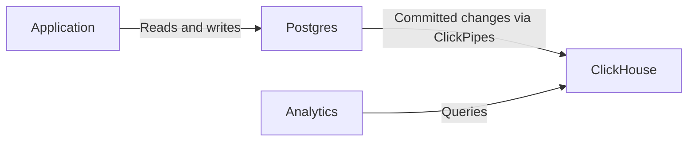

import { BetaBadge } from "/snippets/ko/components/BetaBadge/BetaBadge.jsx";

<BetaBadge link="https://clickhouse.com/cloud/postgres" galaxyTrack={true} galaxyEvent="docs.managed-postgres.overview-beta" />

ClickHouse Managed Postgres는 성능과 확장성을 위해 설계된 엔터프라이즈급 관리형 Postgres 서비스입니다. 컴퓨트와 물리적으로 동일한 위치에 배치된 NVMe 스토리지를 기반으로 하며, EBS와 같은 네트워크 연결 스토리지를 사용하는 대안과 비교해 디스크 입출력에 병목이 있는 워크로드에서 최대 10배 더 빠른 성능을 제공합니다.

Citus Data, Heroku, Microsoft에서 세계적 수준의 Postgres를 제공한 경험을 보유한 창립 팀의 [Ubicloud](https://www.ubicloud.com/)와 협력해 구축된 ClickHouse Managed Postgres는 빠르게 성장하는 애플리케이션이 흔히 겪는 성능 문제, 즉 느린 수집 및 업데이트, 지연되는 VACUUM 작업, 증가하는 테일 지연 시간, 그리고 제한된 디스크 IOPS로 인한 WAL 스파이크를 해결합니다.

## 트랜잭션에는 Postgres, 분석에는 ClickHouse {#transactions-and-analytics}

주문 생성, 재고 업데이트, 사용자 계정 관리와 같은 트랜잭션 애플리케이션 워크로드(OLTP)에는 Postgres를 사용하십시오. Postgres는 신뢰할 수 있는 기록 시스템(system of record)으로서, 연관된 변경 사항을 하나의 트랜잭션으로 함께 커밋하거나 롤백할 수 있습니다.

애플리케이션에서 대규모 데이터셋에 대한 분석까지 필요하다면, ClickHouse 서비스를 추가하고 ClickPipes로 두 시스템을 연결하십시오:

1. 애플리케이션은 트랜잭션으로 관련 변경 사항을 묶어 Postgres에서 운영 데이터를 읽고 씁니다.
2. [ClickPipes를 구성](/ko/products/managed-postgres/clickhouse-integration)하여 선택한 테이블을 ClickHouse로 복사하고, CDC(Change Data Capture)를 통해 커밋된 삽입, UPDATE, 삭제를 지속적으로 복제합니다.
3. ClickHouse에서 분석 쿼리를 실행합니다. ClickHouse에 직접 연결하거나, [`pg_clickhouse`](/ko/products/managed-postgres/extensions/pg_clickhouse/introduction) 확장 기능을 통해 Postgres에서 ClickHouse의 테이블을 쿼리할 수 있습니다.

복제는 비동기 방식이므로 분석 결과가 Postgres에 커밋된 변경 사항보다 지연될 수 있습니다. 두 데이터베이스는 트랜잭션 경계가 서로 분리되어 있으며, CDC와 `pg_clickhouse`는 Postgres와 ClickHouse에 걸친 공유 트랜잭션을 제공하지 않습니다. 최신 커밋된 애플리케이션 상태가 필요한 읽기에는 Postgres를 사용하십시오.

Postgres만으로 시작한 뒤 필요할 때 ClickHouse를 추가할 수 있습니다. 두 서비스를 모두 사용해 보려면 [ClickHouse Managed Postgres 빠른 시작](/ko/products/managed-postgres/quickstart)을 따라 진행하고, 이미 Postgres 서비스를 사용하고 있다면 [분석 기능 추가](/ko/products/managed-postgres/quickstart#part-2)로 바로 이동하십시오.

## NVMe 기반 성능 {#nvme-performance}

대부분의 관리형 Postgres 서비스는 Amazon EBS와 같은 네트워크 연결 스토리지를 사용하며, 디스크에 액세스할 때마다 네트워크 왕복 통신이 필요합니다. 이로 인해 밀리초 단위의 지연 시간이 발생하고 IOPS가 제한되어, 쓰기 비중이 높거나 I/O 집약적인 워크로드에서 병목이 생깁니다.

ClickHouse Managed Postgres는 데이터베이스와 동일한 서버에 물리적으로 연결된 NVMe 스토리지를 사용합니다. 이러한 아키텍처 차이로 다음과 같은 이점이 제공됩니다:

* **밀리초가 아닌 마이크로초 수준의 디스크 지연 시간**
* **네트워크 병목 없이 10배 높은 지속 IOPS 한도***
* **동일한 비용으로 디스크 입출력에 병목이 있는 워크로드에서 최대 10배 더 빠른 성능**

Postgres 워크로드가 주로 디스크 IOPS와 지연 시간 때문에 성능이 제한되는 경우, 이는 더 빠른 수집, 더 신속한 VACUUM, 더 낮은 테일 지연 시간, 그리고 부하 상황에서도 더 예측 가능한 성능으로 이어집니다.

<Note>
  NVMe 디스크에서 Postgres가 얼마나 빠른지 [성능 벤치마크](https://clickhouse.com/blog/postgresbench)에서 알아보십시오.
</Note>

AWS의 로컬 NVMe 한도는 [메모리 최적화](https://docs.aws.amazon.com/ec2/latest/instancetypes/mo.html#mo_instance-store), [스토리지 최적화](https://docs.aws.amazon.com/ec2/latest/instancetypes/so.html#so_instance-store), [CPU 최적화](https://docs.aws.amazon.com/ec2/latest/instancetypes/gp.html#gp_instance-store)를 참조하십시오. GCP는 [로컬 SSD 디스크](https://cloud.google.com/compute/docs/disks/local-ssd)를 참조하십시오.

## 지원되는 클라우드 제공업체 {#supported-cloud-providers}

ClickHouse Managed Postgres는 다음 클라우드 제공업체에서 사용할 수 있습니다:

| 클라우드 제공업체 | 제공 상태           |
| --------- | --------------- |
| AWS       | Public Beta     |
| GCP       | Private Preview |

<Note>
  GCP의 ClickHouse Managed Postgres는 Private Preview 단계입니다. GCP Private Preview 대기자 명단 신청은 [여기](https://clickhouse.com/cloud/postgres#gcp-waitlist)에서 할 수 있습니다. 자세한 내용은 [발표 글](https://clickhouse.com/blog/postgres-managed-by-clickhouse-gcp-private-preview)을 참조하십시오.
</Note>

## 네이티브 ClickHouse 통합 {#clickhouse-integration}

ClickHouse Managed Postgres는 ClickHouse와 네이티브로 통합되어 복잡한 ETL 파이프라인 없이 트랜잭션과 분석을 함께 활용할 수 있습니다.

### Postgres에서 ClickHouse로 복제 {#postgres-replication}

[ClickPipes의 Postgres CDC 커넥터](/ko/integrations/clickpipes/postgres/index)를 사용해 Postgres 데이터를 ClickHouse로 복제할 수 있습니다. 이 커넥터는 초기 적재와 지속적인 증분 동기화를 모두 처리하며, 매월 수백 테라바이트의 데이터를 이전하는 수백 곳의 기업 고객 환경에서 안정성이 검증되었습니다.

### pg_clickhouse: 통합 쿼리 레이어 {#pg-clickhouse}

모든 ClickHouse Managed Postgres 인스턴스에는 [`pg_clickhouse`](https://github.com/ClickHouse/pg_clickhouse) 확장 기능이 기본으로 포함되어 있으며, 이를 통해 Postgres에서 ClickHouse를 직접 쿼리할 수 있습니다. 애플리케이션은 여러 데이터베이스에 연결할 필요 없이 트랜잭션과 분석 워크로드 모두에 대해 Postgres를 통합 쿼리 레이어로 사용할 수 있습니다.

이 확장 기능은 효율적인 실행을 위해 필터, 조인, 세미 조인, 집계, 함수 등을 ClickHouse로 광범위하게 쿼리 pushdown할 수 있도록 지원합니다. 현재 22개의 TPC-H 쿼리 중 14개는 완전히 pushdown되며, 동일한 쿼리를 표준 Postgres에서 실행할 때보다 60배 이상의 성능 향상을 제공합니다.

## 엔터프라이즈급 안정성 {#enterprise-reliability}

ClickHouse Managed Postgres는 운영 환경의 워크로드에 필요한 안정성과 보안 기능을 제공합니다.

### 고가용성 {#high-availability}

쿼럼 기반 복제를 사용해 서로 다른 가용 영역에 최대 2개의 대기 레플리카를 구성할 수 있습니다. 이러한 대기 레플리카는 고가용성과 자동 장애 조치에 전용으로 사용되며, 장애 발생 시 데이터베이스를 신속하게 복구할 수 있도록 합니다. 읽기 스케일링을 위해서는 별도의 [읽기 레플리카](/ko/products/managed-postgres/read-replicas)를 프로비저닝할 수 있습니다. 구성에 대한 자세한 내용은 [고가용성](/ko/products/managed-postgres/high-availability) 페이지를 참조하십시오.

### 백업 및 복구 {#backups}

모든 인스턴스에는 포크와 시점 복구를 지원하는 자동 백업이 포함됩니다. 백업은 전체 백업과 객체 스토리지로의 연속적인 WAL 아카이빙을 처리하는 널리 알려진 오픈소스 도구인 [WAL-G](https://github.com/wal-g/wal-g)를 기반으로 수행됩니다.

### 보안 및 컴플라이언스 {#security-compliance}

ClickHouse Managed Postgres는 ClickHouse Cloud와 동일한 보안 표준을 충족하도록 설계되었습니다.

* **인증**: SAML/SSO 지원
* **네트워크 보안**: IP 허용 목록, 저장 시 암호화 및 전송 중 암호화(TLS 1.3)
* **액세스 제어**: 데이터베이스 관리를 위한 전체 슈퍼유저 권한

### 오픈 소스 기반 {#open-source}

Postgres와 ClickHouse는 모두 크고 활발한 커뮤니티를 갖춘 오픈 소스 데이터베이스입니다. `pg_clickhouse` 확장 기능과 PeerDB 기반의 CDC 복제를 비롯한 통합 구성 요소 역시 모두 오픈 소스입니다. 이러한 기반 덕분에 특정 벤더에 종속되지 않고 데이터 스택을 완전히 제어할 수 있으며, 장기적인 유연성도 확보할 수 있습니다.