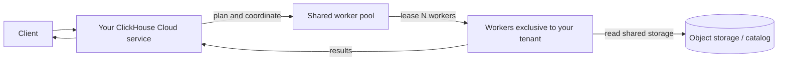
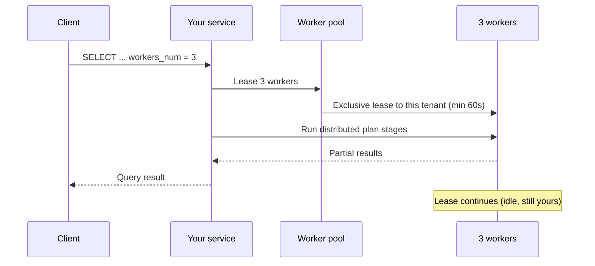
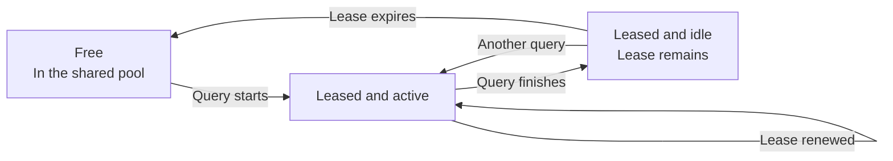
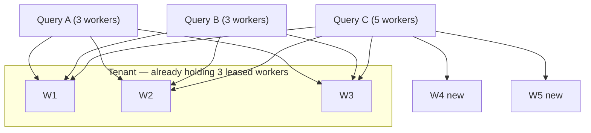

import { PrivatePreviewBadge } from "/snippets/components/PrivatePreviewBadge/PrivatePreviewBadge.jsx";

<PrivatePreviewBadge/>

<Note>
On-Demand Compute is in private preview. It is not covered by ClickHouse Cloud SLOs or SLAs, and known and unknown limitations may apply. See [Limitations](#limitations).

Join the waitlist.
</Note>

On-Demand Compute is a ClickHouse Cloud capability that gives a service (a tenant) additional compute for supported workloads, without requiring you to resize or provision another service. It runs this work on ClickHouse workers outside the service's own compute. Workers come from a managed pool shared across tenants, but each worker is assigned to only one tenant at a time.

During the private preview, On-Demand Compute supports eligible `SELECT` queries. You opt a query in using settings, and ClickHouse assigns workers from the pool to execute it through your existing service and endpoint. Background operations are part of the broader capability but are not supported in the private preview.

This differs from [compute-compute separation](/products/cloud/features/infrastructure/warehouses). A warehouse provides dedicated, long-lived compute through multiple services that share data. On-Demand Compute provides temporary workers from a shared pool through your existing service. During the private preview, you request this compute at the query level.

## When to use On-Demand Compute {#when-to-use-on-demand-compute}

During the private preview, use On-Demand Compute for eligible, compute-intensive `SELECT` queries that you want to run outside the primary service's compute:

- **Ad hoc and analyst queries:** Run compute-intensive `SELECT` queries on additional workers.
- **Non-critical read workloads:** Move selected reads off the primary service.
- **Data lake queries:** Query supported Apache Iceberg, Delta Lake, or `SharedMergeTree` data on additional workers.
- **Temporary additional compute:** Request workers for eligible queries without resizing the primary service.

The private preview supports `SELECT` queries only. Workers do not execute `INSERT` queries, DDL, mutations, or background operations.

## How it works {#how-it-works}



1. You send an eligible `SELECT` query to your ClickHouse Cloud service. Your endpoint, authentication, and RBAC configuration do not change.
2. The service builds a distributed query plan and requests the specified number of workers from the managed pool.
3. ClickHouse assigns available workers to your service.
4. The workers execute the plan stages assigned by the distributed planner and read data from supported storage.
5. Your service coordinates the query and returns the result to the client.

During the private preview, each worker has `8 vCPUs` and `32 GiB` of memory. Use `distributed_plan_workers_num` to specify how many workers the query requests.

## Using On-Demand Compute {#using-on-demand-compute}

### Settings {#settings}

Add these settings on the query, on the user, or in a settings profile.

| Setting | Required value | Purpose |
|---|---|---|
| `make_distributed_plan` | Yes | Enables the experimental distributed query plan. Required for On-Demand Compute. |
| `distributed_plan_workers_num` | Yes | Number of workers to lease for this query. If this is `0` (the default), the query runs on your service, not on the worker pool. |
| `enable_parallel_replicas` | Yes (set to `0`) | Parallel replicas are incompatible with the distributed plan. |

<Tip>
During the preview, set the settings at the query level, or create a separate user with different settings. That makes it obvious which statements use On-Demand Compute, and it avoids inheriting Cloud default profiles that enable parallel replicas.
</Tip>

### Example {#example}

```sql
SELECT
    sum(l_extendedprice * l_discount) AS revenue
FROM lineitem
WHERE
    l_shipdate >= DATE '1994-01-01'
    AND l_shipdate < DATE '1994-01-01' + INTERVAL 1 YEAR
    AND l_discount BETWEEN 0.06 - 0.01 AND 0.06 + 0.01
    AND l_quantity < 24
SETTINGS
    make_distributed_plan = 1,
    distributed_plan_workers_num = 3,
    enable_parallel_replicas = 0
```

This query requests three workers. The number of workers ClickHouse provides depends on the private-preview limit and available pool capacity.

### Worker leasing {#worker-leasing}

A worker lease lasts for at least 60 seconds. ClickHouse renews the lease automatically while a query is running.

After the query finishes, the workers remain assigned to the service until the lease expires. Another eligible query from the same service can reuse those workers while the lease remains active, so ClickHouse does not need to request new workers.

When the lease expires, ClickHouse releases the workers from the service and terminates them.



After the query finishes, the three workers stay leased to your tenant but idle until the lease expires.



If you send another query while those workers are still leased, they can be reused immediately (no cold start).

If the lease has expired, ClickHouse releases the workers back to the pool (they are terminated rather than left idle for another tenant).

### Concurrent queries {#concurrent-queries}

Concurrent queries from the same ClickHouse Cloud service can share assigned workers. ClickHouse requests additional workers only when a query asks for more workers than are already assigned to the service.

For example, if two concurrent queries each request three workers, they can share the same three workers. If another query requests five workers, ClickHouse can use the three assigned workers and request two more from the pool.

See the example below:

```sql
SELECT ... SETTINGS make_distributed_plan = 1, distributed_plan_workers_num = 3, ...;
SELECT ... SETTINGS make_distributed_plan = 1, distributed_plan_workers_num = 3, ...;
```

They share the same three workers.

If a third concurrent query asks for five workers:

```sql
SELECT ... SETTINGS make_distributed_plan = 1, distributed_plan_workers_num = 5, ...;
```

That query runs on the existing three workers plus two newly leased workers.



### When the pool cannot satisfy the request {#pool-capacity}

Worker availability is best effort during the private preview. If fewer workers are available than requested, the query runs with the workers ClickHouse can assign. For example, a request for five workers may run with three.

If no worker can be leased, the query fails:

```text
No stateless workers available for tenant 'bronzeaws-cm-72': the discovery service leased none.
```

Retry the query. If this persists, contact your ClickHouse account team — the preview pool may be exhausted or mis-scaled.

## Monitoring {#monitoring}

Use `system.query_log` on your service to know how many workers were allocated to your query.

### Number of allocated workers {#worker-provided}

```sql
SELECT
    ProfileEvents['StatelessWorkerRequested'],
    ProfileEvents['StatelessWorkerProvided']
FROM clusterAllReplicas(default, system.query_log)
WHERE query_id = '<YOUR_QUERY_ID>'
  AND type != 'QueryStart';
```

<Tip>
Set `log_comment = 'on-demand'` (or a workload name) on On-Demand queries so you can filter them without parsing `Settings`.
</Tip>

## Available regions {#available-regions}

On-Demand Compute is regional: workers run in the same region as your service.

| Cloud | Region | Notes |
|---|---|---|
| AWS | {/* e.g. us-east-1 */} | |
| AWS | {/* e.g. eu-west-1 */} | |

If your region is missing, request it on the waitlist.

## Pricing {#pricing}

During private preview, On-Demand Compute is free, with a usage cap (see [Limitations](#limitations)). Ask your ClickHouse account team if you need the cap raised.

Pricing will be introduced when the preview ends. Preview participants will be notified before the feature is promoted to beta and before any charges start.

The intended model is the same as ClickHouse Cloud compute: pay for compute you use (leased worker time), not for data scanned or rows read.

## Limitations {#limitations}

The following limitations apply during the private preview. Other limitations may apply. Report unexpected behavior to ClickHouse Support or your account team.

- **`SELECT` queries only.** Workers do not execute `INSERT` queries, mutations, DDL, or background operations.
- **Supported data.** The private preview supports Apache Iceberg, Delta Lake, and `SharedMergeTree`.
- **Parallel replicas.** Parallel replicas must be disabled.
- **Worker size.** Each worker has `8 vCPUs` and `32 GiB` of memory.
- **Worker limit.** Each query can request up to five workers during the private preview.
- **Pool capacity.** Worker availability is best effort. A query may receive fewer workers than requested. If no workers are available, the query fails.
- **Performance.** Performance varies by query. Worker assignment, distributed planning, and the transfer of plan stages can add latency. Some query shapes may perform worse than execution on the primary service.
- **Query compatibility.** The distributed planner cannot execute every query plan remotely. Unsupported queries may return a `SUPPORT_IS_DISABLED` exception.

Typical failures include the following:

| Area | What happens |
|---|---|
| Parallel replicas | Rejected; disable the settings above. |
| Window functions with `PARTITION BY` | Often rejected until the planner can shuffle by the partition key. |
| `system` table reads | They are not based on shared storage. |
| Correlated subqueries in some shapes | May be rejected or rewritten less efficiently. |
| Projections, skip indexes on data read, and expression compilation | Turned off for the query rather than returning an exception. |

## Roadmap {#roadmap}

On-Demand Compute is a foundation. Work in flight or next:

- Close known limitations (`SUPPORT_IS_DISABLED` gaps)
- Pools of different worker sizes
- Stabilize query performance compared with stateful execution
- Background merge support
- Pricing
- Worker-pool autoscaler calibration
- Console metrics and monitoring
- Dedicated permissions for On-Demand Compute

## Security {#security}

On-Demand Compute does not change how you connect to ClickHouse Cloud. Clients still authenticate to your service. Workers never expose a public query endpoint.

Dedicated On-Demand roles and permissions are not in the preview (see [Roadmap](#roadmap)). Until then, anyone who can run `SELECT` with the settings above on your service can use workers, subject to the preview quota.

## FAQ {#faq}

<AccordionGroup>

<Accordion title="Is On-Demand Compute open source?">
No. It is a ClickHouse Cloud architecture: ClickHouse server (distributed plan), data plane (worker pool and leases), and control plane. The experimental `make_distributed_plan` setting exists in ClickHouse, but the shared worker pool and stateless execution is Cloud-only.
</Accordion>

<Accordion title="Do I need a specific version to join the private preview?">
Yes. Your ClickHouse team will confirm whether your service requires an upgrade before joining the private preview. Additional upgrades may be required during the preview.
</Accordion>

<Accordion title="What will pricing look like?">
There is no additional charge during the private preview, subject to preview limits. Pricing for later release stages will be shared before any charges apply. That said, pricing holds the same philosophy as ClickHouse Cloud: charge for compute used, not for data scanned or rows read. Exact rates will be published before GA or beta billing starts.
</Accordion>

<Accordion title="Can I use this for production?">
You can run real workloads, but this is a private preview: there are known and unknown limitations, and there is no SLO/SLA for worker-pool availability. ClickHouse is committed to supporting early adopters; treat it as preview, not as a production guarantee.
</Accordion>

<Accordion title="How is this different from autoscaling my service?">
Autoscaling changes the compute assigned to your primary service. During the private preview, On-Demand Compute gives eligible `SELECT` queries temporary access to workers from a managed pool without changing the size of the primary service. Autoscaling manages ongoing service capacity, while On-Demand Compute provides temporary compute for specific workloads.
</Accordion>

<Accordion title="How is this different from a warehouse or compute-compute separation?">
Compute-compute separation provides dedicated compute through multiple ClickHouse Cloud services that share data. On-Demand Compute provides temporary compute from a managed pool through your existing service. During the private preview, this compute is requested at the query level. The broader capability is designed to support both query execution and background operations.
</Accordion>

<Accordion title="Where can I ask questions?">
Ask your account team; they will introduce you to the product manager for On-Demand Compute.
</Accordion>

<Accordion title="Where can I report bugs?">
Open a support ticket (severity 3) or report it to the product manager. Include `query_id` and the full exception.
</Accordion>

<Accordion title="Is this available in ClickHouse BYOC or ClickHouse Private?">
No. The private preview is not available in ClickHouse BYOC or ClickHouse Private.
</Accordion>

</AccordionGroup>
