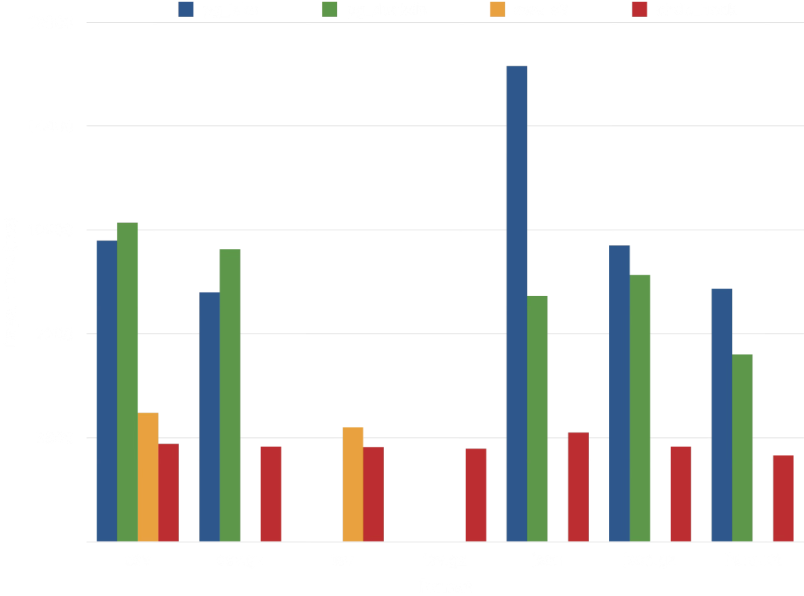
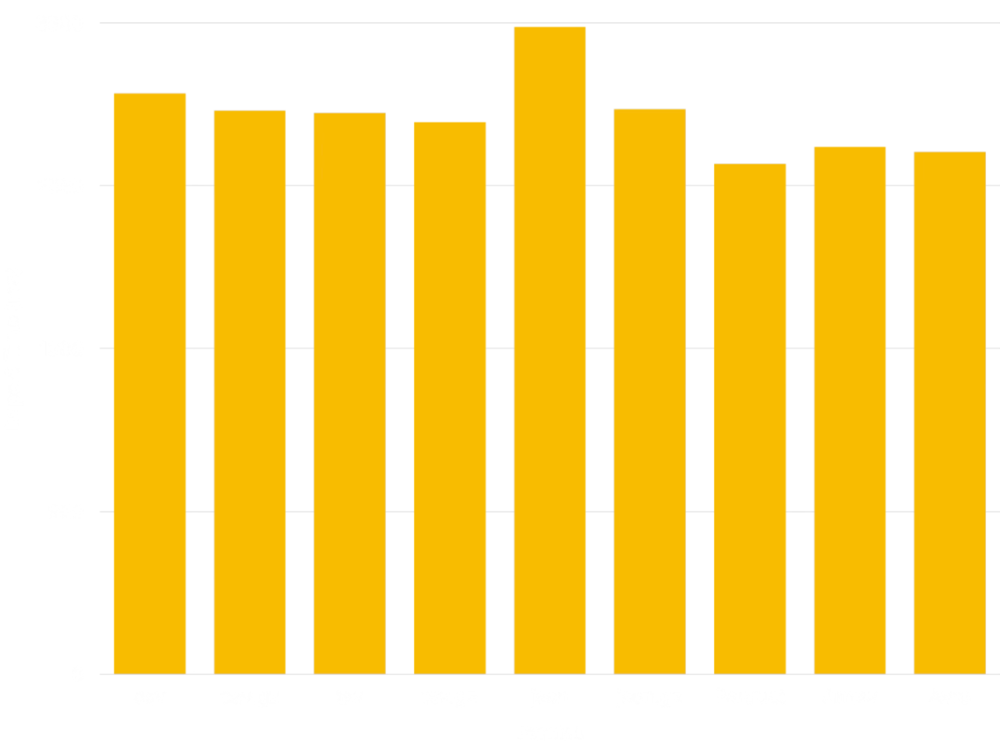

## Introduction {#introduction}

This library provides PostgreSQL extensions for executing [chDB] queries in
Postgres, and for copying data to and from a variety of formats anb object stores.

### chdb Extension {#chdb-extension}

The `chdb` extension runs [chDB] queries. The `chdb_query()` function executes
a single query. For example, this query:

```sql
SELECT * FROM chdb_query($$
  SELECT * FROM s3('s3://datasets-documentation/my-test-bucket-768/some_prefix/some_file_1.csv')
$$) AS (id int, months int, days int);
```

Outputs:

```
 id | months | days
----+--------+------
  1 |      2 |    3
  3 |      2 |    1
  4 |      5 |    6
(3 rows)
```

See the [chdb documentation](/products/managed-postgres/extensions/chdb/chdb)
for details.

### chdb_hook Module {#chdb_hook-module}

The `chdb_hook` module hooks into the [COPY] command to copy data to or from
an S3, GCS, Azure Blob, file, or http URL. This example loads records from
multiple CSV files on S3 in a single [COPY] command:

```sql
CREATE TABLE times (
    id     INT NOT NULL,
    months INT NOT NULL,
    days   INT NOT NULL
);

LOAD 'chdb_hook';
COPY times FROM 's3://datasets-documentation/my-test-bucket-768/{some,another}_prefix/some_file_{1..3}.csv';
```

After which the `times` table contains the records from each file it loaded:

```pgsql
# SELECT * FROM times;
 id | months | days
----+--------+------
  1 |      2 |    3
  3 |      2 |    1
  4 |      5 |    6
  1 |      2 |    3
  3 |      2 |    1
  4 |      5 |    6
  1 |      2 |    3
  3 |      2 |    1
  4 |      5 |    6
  1 |      2 |    3
  3 |      2 |    1
  4 |      5 |    6
  1 |      2 |    3
  3 |      2 |    1
  4 |      5 |    6
  1 |      2 |    3
  3 |      2 |    1
  4 |      5 |    6
(18 rows)
```

A [CREATE TABLE] may also derive its columns, and load its rows, from such a
URL:

```sql
CREATE TABLE reviews () WITH (
    copy_from = 'https://datasets-documentation.s3.eu-west-3.amazonaws.com/amazon_reviews/amazon_reviews_2015.snappy.parquet'
);
```

See the [chdb_hook documentation](/products/managed-postgres/extensions/chdb/chdb_hook)
for details.

## Benchmarking Formats {#benchmarking-formats}

A [benchmark] compare the performance of [chdb_hook] `COPY` to that of
[aws_s3], [pg_duckdb], and [pg_lake] for ca. 1m rows of [NYC Taxi dataset] in
a variety of formats.



Of the four extensions, [chdb] exhibits the most consistent performance.
[pg_duckdb] and [pg_lake], both backed by [DuckDB], take around 2-3x as long
to import data from CSV, JSON, and Parquet. Only [aws_s3] approaches
[chdb_hook]'s performance, but it supports a much more limited array of data
formats:

| Extension | Compression                          | Data Formats
| --------- | ------------------------------------ | -------------------------------- |
| aws_s3    | none                                 | Text (TSV), CSV, Postgres Binary |
| pg_lake   | gzip, zstd, snappy (Parquet only)    | CSV, JSON, Parquet               |
| pg_duckdb | gzip, zstd, snappy (Parquet only)    | CSV, JSON, Parquet               |
| chdb      | gzip, zstd, lz4, bz2, snappy, brotli | TSV, CSV, JSON, BSON, Prometheus, Protobuf, Avro, Parquet, Arrow, XML, CapnProto, Markdown, MsgPack, ORC, and [more][formats]! |

Additional benchmarking demonstrates relatively consistent performance
importing the [NYC Taxi dataset] in a variety of formats:



The benchmark uses the [JSONCompact] format for compatibility with the other
extensions; Other JSON formats, such as [JSONCompactEachRow], will more
closely approximate the performance of the other formats.

## Architecture {#architecture}

The chdb and chdb_hook extensions rely on a `chdb_helper` process to execute
[chDB] queries. The helper keeps the resource consumption of [chDB] separate
from the main Postgres process, an advantage for an occasionally-used workflow
such as loading data from a data lake.

```
                  +-------------+
                  |   helper    |
+----------+      |    app      |      +------+
| Postgres |      | +---------+ |      | chDB |
| Backend  |----->| |  chDB   | |----->| Data |
+----------+      | | Library | |      +------+
                  | +---------+ |
                  +-------------+
```

Unlike a background worker, the helper holds no Postgres shared memory and the
postmaster does not manage it. This isolates crashes from affecting Postgres.
A helper that dies triggers an error only in the backend that started it,
leaving other sessions untouched.

<Important>
For each query, the helper connects to a new temporary chDB database on disck
to execute it. As a consequence, each query currently runs in completae
isolation from all other queries. Don't create a table and expect to query it
in a subsequent query.
</Important>

## Dependencies {#dependencies}

The `chdb` extension requires PostgreSQL 15 or higher and the [chDB] library
v26.7.0 or greater (currently available only for Linux and macOS). The
simplest way to install it is via the [lib.chdb.io] shell script:

```sh
curl -sL https://lib.chdb.io | bash
```

To statically compile [chDB] into the helper app, set the following variables
before running the [Installation](#compile-from-source)
`make` commands.

```sh
export BUNDLE_LIBCHDB=1 LIBCHDB_BUILD=static
```

The `Makefile` will download the static `libchdb` library and compile it into
the app.

On Linux, you can also have the installation process download and install the
dynamic `libchdb` library by setting `export BUNDLE_LIBCHDB=1` before running
the [Installation](#compile-from-source) `make` commands.

### Compile from source {#compile-from-source}

To build chdb, just do this:

``` sh
make
make installcheck
make install
```

If you encounter an error such as:

```
"Makefile", line 8: Need an operator
```

You need to use GNU make, which may well be installed on your system as
`gmake`:

``` sh
gmake
gmake install
gmake installcheck
```

If you encounter an error such as:

```
make: pg_config: Command not found
```

Be sure that you have `pg_config` installed and in your path. If you used a
package management system such as RPM to install PostgreSQL, be sure that the
`-devel` package is also installed. If necessary tell the build process where
to find it:

``` sh
env PG_CONFIG=/path/to/pg_config make && make installcheck && make install
```

If you encounter an error such as:

```
chdb_helper.c:22:10: fatal error: 'chdb.h' file not found
```

You either need to install [chDB] or tell the compiler where to find it. If,
for example, you installed it via the [lib.chdb.io] shell script, point to
`/usr/local`:

``` sh
make CFLAGS=-I/usr/local/include \
     LDFLAGS=-L/usr/local/lib
```

If you encounter an error such as:

```
ERROR:  must be owner of database regression
```

You need to run the test suite using a super user, such as the default
"postgres" super user:

``` sh
make installcheck PGUSER=postgres
```

To install the extension in a custom prefix on PostgreSQL 18 or later, pass
the `prefix` argument to `install` (but no other `make` targets):

```sh
make install prefix=/usr/local/extras
```

Then ensure that the prefix is included in the following [`postgresql.conf`
parameters]:

```ini
extension_control_path = '/usr/local/extras/postgresql/share:$system'
dynamic_library_path   = '/usr/local/extras/postgresql/lib:$libdir'
```

## Authors {#authors}

* [David E. Wheeler](https://justatheory.com/)
* [serprex](https://github.com/serprex)

## Copyright {#copyright}

Copyright (c) 2026, ClickHouse

  [chDB]: https://clickhouse.com/chdb
    "chDB - fast, reliable, and scalable in-process database"
  [COPY]: https://www.postgresql.org/docs/current/sql-copy.html "Postgres Docs: COPY"
  [CREATE TABLE]: https://www.postgresql.org/docs/current/sql-createtable.html
    "Postgres Docs: CREATE TABLE"
  [lib.chdb.io]: https://lib.chdb.io "curl -sL https://lib.chdb.io | bash"
  [`postgresql.conf` parameters]: https://www.postgresql.org/docs/devel/runtime-config-client.html#RUNTIME-CONFIG-CLIENT-OTHER
  [chdb_hook]: https://pgxn.org/dist/chdb/doc/chdb_hook.html "chdb_hook Docs on PGXN"
  [aws_s3]: https://docs.aws.amazon.com/AmazonRDS/latest/UserGuide/USER_PostgreSQL.S3Import.html
    "Importing data from Amazon S3 into an RDS for PostgreSQL DB instance"
  [pg_duckdb]: https://github.com/duckdb/pg_duckdb "DuckDB-powered Postgres for high performance apps & analytics"
  [pg_lake]: https://github.com/Snowflake-Labs/pg_lake "pg_lake: Postgres with Iceberg and data lake access"
  [formats]: https://clickhouse.com/docs/reference/formats/index
    "ClickHouse Docs: Formats for input and output data"
  [NYC Taxi dataset]: https://clickhouse.com/docs/get-started/quickstarts/tutorial
    "ClickHouse Docs: Advanced tutorial"
  [benchmark]: https://github.com/ClickHouse/pg_chdb/tree/main/dev/benchmark
    "Postgres Lake Copy Benchmark"
