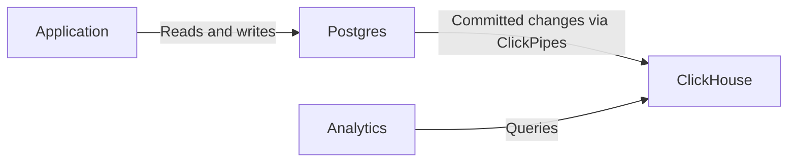

import { BetaBadge } from "/snippets/components/BetaBadge/BetaBadge.jsx";

<BetaBadge link="https://clickhouse.com/cloud/postgres" galaxyTrack={true} galaxyEvent="docs.managed-postgres.overview-beta" />

ClickHouse Managed Postgres is an enterprise-grade managed Postgres service built for performance and scale. Backed by NVMe storage that is physically collocated with compute, it delivers up to 10x faster performance for workloads that are disk-bound compared to alternatives using network-attached storage like EBS.

Built in partnership with [Ubicloud](https://www.ubicloud.com/), whose founding team has a track record of delivering world-class Postgres at Citus Data, Heroku, and Microsoft, ClickHouse Managed Postgres solves the performance challenges that fast-growing applications commonly face: slower ingestion and updates, slow vacuums, increased tail latency, and WAL spikes caused by limited disk IOPS.

## Postgres for transactions, ClickHouse for analytics {#transactions-and-analytics}

Use Postgres for transactional application workloads (OLTP), such as creating orders, updating inventory, and managing user accounts. Postgres is your system of record: related changes can commit or roll back together in a transaction.

When your application also needs analytics over large datasets, add a ClickHouse service and connect the two with ClickPipes:

1. Your application reads and writes operational data in Postgres, using transactions to group related changes.
2. [Configure ClickPipes](/products/managed-postgres/clickhouse-integration) to copy selected tables to ClickHouse and continuously replicate committed inserts, updates, and deletes using change data capture (CDC).
3. Run analytical queries in ClickHouse. You can connect to ClickHouse directly or query its tables from Postgres through the [`pg_clickhouse`](/products/managed-postgres/extensions/pg_clickhouse/introduction) extension.

Replication is asynchronous, so analytical results can lag behind committed Postgres changes. The two databases have separate transaction boundaries: CDC and `pg_clickhouse` do not provide a shared transaction across Postgres and ClickHouse. Reads that require the latest committed application state should use Postgres.

You can start with Postgres alone and add ClickHouse when you need it. Follow the [managed Postgres quickstart](/products/managed-postgres/quickstart) to try both services, or go directly to [adding analytics](/products/managed-postgres/quickstart#part-2) if you already have a Postgres service.

## NVMe-powered performance {#nvme-performance}

Most managed Postgres services use network-attached storage like Amazon EBS, which requires a network round trip for every disk access. This introduces latency measured in milliseconds and limits IOPS, creating bottlenecks for write-heavy or I/O-intensive workloads.

ClickHouse Managed Postgres uses NVMe storage that is physically attached to the same server as your database. This architectural difference delivers:

- **Microsecond-level disk latency** instead of milliseconds
- **10x sustained IOPS limits**\* without network bottlenecks
- **Up to 10x faster performance** for disk-bound workloads at the same cost

For Postgres workloads that are primarily throttled by disk IOPS and latency, this translates to faster ingestion, quicker vacuums, lower tail latency, and more predictable performance under load.

<Note>
Learn how fast Postgres is on NVMe disks from [performance benchmarks](https://clickhouse.com/blog/postgresbench).
</Note>

For local NVMe limits on AWS see [Memory optimized](https://docs.aws.amazon.com/ec2/latest/instancetypes/mo.html#mo_instance-store), [Storage optimized](https://docs.aws.amazon.com/ec2/latest/instancetypes/so.html#so_instance-store), [CPU optimized](https://docs.aws.amazon.com/ec2/latest/instancetypes/gp.html#gp_instance-store).

## Native ClickHouse integration {#clickhouse-integration}

ClickHouse Managed Postgres integrates natively with ClickHouse to bring transactions and analytics together without complex ETL pipelines.

### Postgres to ClickHouse replication {#postgres-replication}

Replicate your Postgres data to ClickHouse using the [Postgres CDC connector in ClickPipes](/integrations/clickpipes/postgres/index). The connector handles both initial load and continuous incremental sync, and is battle-tested by hundreds of enterprise customers moving hundreds of terabytes per month.

### pg_clickhouse: unified query layer {#pg-clickhouse}

Every ClickHouse Managed Postgres instance comes with the [`pg_clickhouse`](https://github.com/ClickHouse/pg_clickhouse) extension, which lets you query ClickHouse directly from Postgres. Your application can use Postgres as a unified query layer for both transactions and analytics, without needing to connect to multiple databases.

The extension provides comprehensive query pushdown to ClickHouse for efficient execution, including support for filters, joins, semi-joins, aggregations, and functions. Currently, 14 of 22 TPC-H queries are fully pushed down, delivering over 60X performance improvements compared to running the same queries in standard Postgres.

## Enterprise-grade reliability {#enterprise-reliability}

ClickHouse Managed Postgres provides the reliability and security features that production workloads require.

### High availability {#high-availability}

Configure up to two standby replicas across different availability zones using quorum-based replication. These standbys are dedicated to high availability and automatic failover, ensuring your database recovers quickly from failures. For read scaling, you can provision separate [read replicas](/products/managed-postgres/read-replicas). See the [High availability](/products/managed-postgres/high-availability) page for configuration details.

### Backups and recovery {#backups}

Every instance includes automatic backups that support forks and point-in-time recovery. Backups run on [WAL-G](https://github.com/wal-g/wal-g), a well-known open-source tool that handles full backups and continuous WAL archiving to object storage.

### Security and compliance {#security-compliance}

ClickHouse Managed Postgres is built to meet the same security standards as ClickHouse Cloud:

- **Authentication**: SAML/SSO support
- **Network security**: IP allow-listing, encryption at rest and in transit (TLS 1.3)
- **Access control**: Full superuser access for database administration

### Open source foundation {#open-source}

Both Postgres and ClickHouse are open-source databases with large, thriving communities. The integration components, including the `pg_clickhouse` extension and the CDC replication powered by PeerDB, are also open source. This foundation ensures no vendor lock-in, giving you full control and long-term flexibility over your data stack.
