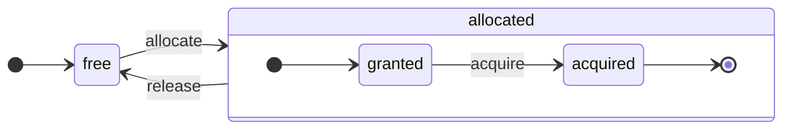

O ClickHouse é um SGBD verdadeiramente orientado a colunas. Os dados são armazenados em colunas e, durante a execução, em arrays (vetores ou fragmentos de colunas).
Sempre que possível, as operações são executadas sobre arrays, em vez de sobre valores individuais.
Isso é chamado de &quot;execução vetorizada de consultas&quot; e ajuda a reduzir o custo efetivo do processamento de dados.

Essa ideia não é nova.
Ela remonta ao `APL` (uma linguagem de programação, 1957) e a seus descendentes: `A +` (dialeto de APL), `J` (1990), `K` (1993) e `Q` (linguagem de programação da Kx Systems, 2003).
A programação com arrays é usada no processamento de dados científicos. Essa ideia também não é novidade em bancos de dados relacionais. Por exemplo, ela é usada no sistema `VectorWise` (também conhecido como Actian Vector Analytic Database, da Actian Corporation).

Há duas abordagens diferentes para acelerar o processamento de consultas: execução vetorizada de consultas e geração de código em tempo de execução. A segunda elimina toda a indireção e o despacho dinâmico. Nenhuma dessas abordagens é estritamente melhor que a outra. A geração de código em tempo de execução pode ser melhor quando combina muitas operações, aproveitando plenamente as unidades de execução da CPU e o pipeline. A execução vetorizada de consultas pode ser menos prática porque envolve vetores temporários que precisam ser gravados no cache e depois lidos de volta. Se os dados temporários não couberem no cache L2, isso se torna um problema. Por outro lado, a execução vetorizada de consultas aproveita com mais facilidade os recursos SIMD da CPU. Um [artigo de pesquisa](http://15721.courses.cs.cmu.edu/spring2016/papers/p5-sompolski.pdf) escrito por nossos amigos mostra que é melhor combinar as duas abordagens. O ClickHouse usa execução vetorizada de consultas e tem suporte inicial limitado para geração de código em tempo de execução.

  ## Colunas

A interface `IColumn` é usada para representar colunas na memória (na verdade, fragmentos de colunas). Essa interface fornece métodos auxiliares para implementar vários operadores relacionais. Quase todas as operações são imutáveis: não modificam a coluna original, mas criam uma nova coluna modificada. Por exemplo, o método `IColumn :: filter` aceita uma máscara de bytes para filtragem. Ele é usado pelos operadores relacionais `WHERE` e `HAVING`. Outros exemplos: o método `IColumn :: permute` para dar suporte a `ORDER BY` e o método `IColumn :: cut` para dar suporte a `LIMIT`.

Várias implementações de `IColumn` (`ColumnUInt8`, `ColumnString` e assim por diante) são responsáveis pelo layout de memória das colunas. Esse layout geralmente é um array contíguo. No caso de colunas do tipo inteiro, é apenas um array contíguo, como `std :: vector`. Para colunas `String` e `Array`, há dois vetores: um para todos os elementos do array, armazenados de forma contígua, e outro para os offsets até o início de cada array. Há também `ColumnConst`, que armazena apenas um valor na memória, mas se comporta como uma coluna.

  ## Field

Ainda assim, também é possível trabalhar com valores individuais. Para representar um valor individual, usa-se `Field`. `Field` é simplesmente uma união discriminada de `UInt64`, `Int64`, `Float64`, `String` e `Array`. `IColumn` tem o método `operator []` para obter o n-ésimo valor como um `Field` e o método `insert` para acrescentar um `Field` ao final de uma coluna. Esses métodos não são muito eficientes, porque exigem lidar com objetos `Field` temporários que representam valores individuais. Há métodos mais eficientes, como `insertFrom`, `insertRangeFrom` e assim por diante.

`Field` não tem informações suficientes sobre um tipo de dado específico de uma tabela. Por exemplo, `UInt8`, `UInt16`, `UInt32` e `UInt64` são todos representados como `UInt64` em um `Field`.

  ## Abstrações com vazamentos

`IColumn` tem métodos para transformações relacionais comuns de dados, mas eles não atendem a todas as necessidades. Por exemplo, `ColumnUInt64` não tem um método para calcular a soma de duas colunas, e `ColumnString` não tem um método para executar uma busca por substring. Essas inúmeras rotinas são implementadas fora de `IColumn`.

Várias funções em colunas podem ser implementadas de forma genérica, porém ineficiente, usando métodos de `IColumn` para extrair valores de `Field`, ou de forma especializada, usando o conhecimento do layout interno da memória dos dados em uma implementação específica de `IColumn`. Isso é feito convertendo funções para um tipo específico de `IColumn` e lidando diretamente com a representação interna. Por exemplo, `ColumnUInt64` tem o método `getData`, que retorna uma referência a um array interno; então, uma rotina separada lê ou preenche esse array diretamente. Temos &quot;abstrações com vazamentos&quot; para permitir especializações eficientes de várias rotinas.

  ## Tipos de dados

`IDataType` é responsável pela serialização e desserialização: pela leitura e gravação de fragmentos de colunas ou de valores individuais em formato binário ou textual. `IDataType` corresponde diretamente aos tipos de dados das tabelas. Por exemplo, existem `DataTypeUInt32`, `DataTypeDateTime`, `DataTypeString` e assim por diante.

`IDataType` e `IColumn` têm apenas uma relação tênue entre si. Diferentes tipos de dados podem ser representados na memória pelas mesmas implementações de `IColumn`. Por exemplo, `DataTypeUInt32` e `DataTypeDateTime` são ambos representados por `ColumnUInt32` ou `ColumnConstUInt32`. Além disso, um mesmo tipo de dados pode ser representado por diferentes implementações de `IColumn`. Por exemplo, `DataTypeUInt8` pode ser representado por `ColumnUInt8` ou `ColumnConstUInt8`.

`IDataType` armazena apenas metadados. Por exemplo, `DataTypeUInt8` não armazena absolutamente nada (exceto o ponteiro virtual `vptr`), e `DataTypeFixedString` armazena apenas `N` (o tamanho de strings de tamanho fixo).

`IDataType` tem métodos auxiliares para vários formatos de dados. Exemplos incluem métodos para serializar um valor com possível uso de aspas, para serializar um valor em JSON e para serializar um valor como parte do formato XML. Não há correspondência direta com os formatos de dados. Por exemplo, os diferentes formatos de dados `Pretty` e `TabSeparated` podem usar o mesmo método auxiliar `serializeTextEscaped` da interface `IDataType`.

  ## Block

Um `Block` é um contêiner que representa um subconjunto (fragmento) de uma tabela na memória. Ele é apenas um conjunto de triplas: `(IColumn, IDataType, column name)`. Durante a execução da consulta, os dados são processados em `Block`s. Se temos um `Block`, temos dados (no objeto `IColumn`), temos informações sobre seu tipo (em `IDataType`), que nos dizem como lidar com essa coluna, e temos o nome da coluna. Esse nome pode ser tanto o nome original da coluna da tabela quanto algum nome artificial atribuído para obter resultados temporários de cálculos.

Quando calculamos alguma função sobre colunas em um bloco, adicionamos outra coluna com o resultado ao bloco e não alteramos as colunas que são argumentos da função, porque as operações são imutáveis. Mais tarde, colunas desnecessárias podem ser removidas do bloco, mas não modificadas. Isso facilita a eliminação de subexpressões comuns.

Blocos são criados para cada fragmento de dados processado. Observe que, para o mesmo tipo de cálculo, os nomes e os tipos das colunas permanecem os mesmos em blocos diferentes, e apenas os dados das colunas mudam. É melhor separar os dados do bloco de seu cabeçalho, porque blocos pequenos têm alta sobrecarga de strings temporárias para copiar `shared_ptr`s e nomes de colunas.

  ## Processadores

Veja a descrição em [https://github.com/ClickHouse/ClickHouse/blob/master/src/Processors/IProcessor.h](https://github.com/ClickHouse/ClickHouse/blob/master/src/Processors/IProcessor.h).

  ## Formatos

Os formatos de dados são implementados por processadores.

  ## E/S

Para entrada/saída orientada a bytes, existem as classes abstratas `ReadBuffer` e `WriteBuffer`. Elas são usadas no lugar dos `iostream`s do C++. Não se preocupe: todo projeto maduro em C++ usa algo diferente de `iostream`s por bons motivos.

`ReadBuffer` e `WriteBuffer` são apenas um buffer contíguo e um cursor que aponta para uma posição nesse buffer. As implementações podem ou não ser donas da memória do buffer. Há um método virtual para preencher o buffer com os próximos dados (no caso de `ReadBuffer`) ou para descarregar o buffer em algum destino (no caso de `WriteBuffer`). Os métodos virtuais raramente são chamados.

As implementações de `ReadBuffer`/`WriteBuffer` são usadas para trabalhar com arquivos, descritores de arquivo e sockets de rede, para implementar compressão (`CompressedWriteBuffer` é inicializado com outro WriteBuffer e realiza a compressão antes de gravar os dados nele) e para outros fins — os nomes `ConcatReadBuffer`, `LimitReadBuffer` e `HashingWriteBuffer` falam por si.

Read/WriteBuffers lidam apenas com bytes. Há funções nos arquivos de cabeçalho `ReadHelpers` e `WriteHelpers` para ajudar na formatação da entrada/saída. Por exemplo, há helpers para gravar um número em formato decimal.

Vamos examinar o que acontece quando você quer gravar um conjunto de resultados no formato `JSON` em stdout.
Você tem um conjunto de resultados pronto para ser obtido de um `QueryPipeline` em modo pulling.
Primeiro, você cria um `WriteBufferFromFileDescriptor(STDOUT_FILENO)` para gravar bytes em stdout.
Em seguida, você conecta o resultado do query pipeline ao `JSONRowOutputFormat`, que é inicializado com esse `WriteBuffer`, para gravar linhas no formato `JSON` em stdout.
Isso pode ser feito por meio do método `complete`, que transforma um `QueryPipeline` em modo pulling em um `QueryPipeline` Completed.
Internamente, `JSONRowOutputFormat` gravará vários delimitadores JSON e chamará o método `IDataType::serializeTextJSON` com uma referência a `IColumn` e o número da linha como argumentos. Consequentemente, `IDataType::serializeTextJSON` chamará um método de `WriteHelpers.h`: por exemplo, `writeText` para tipos numéricos e `writeJSONString` para `DataTypeString`.

  ## Tabelas

A interface `IStorage` representa tabelas. Diferentes implementações dessa interface correspondem a diferentes motores de tabela. Alguns exemplos são `StorageMergeTree`, `StorageMemory` e assim por diante. Instâncias dessas classes são simplesmente tabelas.

Os principais métodos de `IStorage` são `read` e `write`, além de outros, como `alter`, `rename` e `drop`. O método `read` aceita os seguintes argumentos: um conjunto de colunas para ler de uma tabela, a consulta `AST` a ser considerada e o número desejado de streams. Ele retorna um `Pipe`.

Na maioria dos casos, o método `read` é responsável apenas por ler as colunas especificadas de uma tabela, e não por qualquer processamento adicional dos dados.
Todo o processamento subsequente dos dados é tratado por outra parte do pipeline, o que está fora da responsabilidade de `IStorage`.

Mas há exceções importantes:

* A consulta AST é passada para o método `read`, e o motor de tabela pode usá-la para determinar o uso de índices e ler menos dados da tabela.
* Às vezes, o motor de tabela pode processar os dados por conta própria até uma etapa específica. Por exemplo, `StorageDistributed` pode enviar uma consulta para servidores remotos, pedir que eles processem os dados até uma etapa em que os dados de diferentes servidores remotos possam ser mesclados e retornar esses dados pré-processados. O interpretador de consultas então conclui o processamento dos dados.

O método `read` da tabela pode retornar um `Pipe` composto por múltiplos `Processors`. Esses `Processors` podem ler de uma tabela em paralelo.
Em seguida, você pode conectar esses processadores a várias outras transformações (como avaliação de expressões ou filtragem), que podem ser calculadas de forma independente.
Depois, criar um `QueryPipeline` sobre eles e executá-lo por meio de `PipelineExecutor`.

Também existem `TableFunction`s. São funções que retornam um objeto `IStorage` temporário para uso na cláusula `FROM` de uma consulta.

Para ter uma ideia rápida de como implementar seu motor de tabela, observe algo simples, como `StorageMemory` ou `StorageTinyLog`.

> Como resultado do método `read`, `IStorage` retorna `QueryProcessingStage` — informações sobre quais partes da consulta já foram calculadas no armazenamento.

  ## Parsers

Um parser descendente recursivo escrito manualmente analisa uma consulta. Por exemplo, `ParserSelectQuery` simplesmente chama recursivamente os parsers correspondentes às várias partes da consulta. Os parsers criam uma `AST`. A `AST` é representada por nós, que são instâncias de `IAST`.

> Geradores de parsers não são usados por razões históricas.

  ## Interpretadores

Os interpretadores são responsáveis por criar o pipeline de execução da consulta a partir de uma AST. Há interpretadores simples, como `InterpreterExistsQuery` e `InterpreterDropQuery`, bem como o mais sofisticado `InterpreterSelectQuery`.

O pipeline de execução da consulta é uma combinação de processadores que podem consumir e produzir fragmentos (conjuntos de colunas com tipos específicos).
Um processador se comunica por meio de portas e pode ter várias portas de entrada e várias portas de saída.
Uma descrição mais detalhada pode ser encontrada em [src/Processors/IProcessor.h](https://github.com/ClickHouse/ClickHouse/blob/master/src/Processors/IProcessor.h).

Por exemplo, o resultado da interpretação da consulta `SELECT` é um `QueryPipeline` de &quot;pulling&quot;, que tem uma porta de saída especial para ler o conjunto de resultados.
O resultado da consulta `INSERT` é um `QueryPipeline` de &quot;pushing&quot;, com uma porta de entrada para escrever os dados da inserção.
E o resultado da interpretação da consulta `INSERT SELECT` é um `QueryPipeline` &quot;Completed&quot;, que não tem entradas nem saídas, mas copia dados de `SELECT` para `INSERT` simultaneamente.

`InterpreterSelectQuery` usa os mecanismos `ExpressionAnalyzer` e `ExpressionActions` para análise e transformação de consultas. É aqui que a maior parte das otimizações de consulta baseadas em regras é realizada. O `ExpressionAnalyzer` é bastante desorganizado e deveria ser reescrito: várias transformações e otimizações de consultas deveriam ser extraídas para classes separadas, para permitir transformações modulares da consulta.

Para resolver os problemas existentes nos interpretadores, foi desenvolvido um novo `InterpreterSelectQueryAnalyzer`. Esta é uma nova versão do `InterpreterSelectQuery`, que não usa o `ExpressionAnalyzer` e introduz uma camada adicional de abstração entre `AST` e `QueryPipeline`, chamada `QueryTree`. Ele está totalmente pronto para uso em produção, mas, por precaução, pode ser desativado definindo o valor da configuração `enable_analyzer` como `false`.

  ## Funções

Existem funções comuns e funções de agregação. Para as funções de agregação, veja a próxima seção.

As funções comuns não alteram o número de linhas — elas funcionam como se processassem cada linha de forma independente. Na prática, porém, as funções não são chamadas para linhas individuais, mas para `Blocks` de dados, para implementar a execução vetorizada de consultas.

Existem algumas funções diversas, como [blockSize](/pt-BR/sql-reference/functions/other-functions#blockSize), [rowNumberInBlock](/pt-BR/sql-reference/functions/other-functions#rowNumberInBlock) e [runningAccumulate](/pt-BR/sql-reference/functions/other-functions#runningAccumulate), que aproveitam o processamento em blocos e quebram a independência entre as linhas.

O ClickHouse tem tipagem forte, então não há conversão implícita de tipos. Se uma função não oferecer suporte a uma combinação específica de tipos, ela lança uma exceção. Mas as funções podem funcionar (ser sobrecarregadas) para muitas combinações diferentes de tipos. Por exemplo, a função `plus` (para implementar o operador `+`) funciona com qualquer combinação de tipos numéricos: `UInt8` + `Float32`, `UInt16` + `Int8` e assim por diante. Além disso, algumas funções variádicas podem aceitar qualquer número de argumentos, como a função `concat`.

Implementar uma função pode ser um pouco inconveniente, porque ela faz o despacho explícito dos tipos de dados compatíveis e das `IColumns` compatíveis. Por exemplo, a função `plus` tem código gerado pela instanciação de um template C++ para cada combinação de tipos numéricos e de argumentos à esquerda e à direita, constantes ou não.

Este é um excelente ponto para implementar geração de código em tempo de execução e evitar o inchaço do código de template. Além disso, isso possibilita adicionar funções fusionadas, como fused multiply-add, ou fazer várias comparações em uma única iteração do loop.

Devido à execução vetorizada de consultas, as funções não fazem curto-circuito. Por exemplo, se você escrever `WHERE f(x) AND g(y)`, ambos os lados serão calculados, mesmo nas linhas em que `f(x)` for zero (exceto quando `f(x)` for uma expressão constante igual a zero). Mas, se a seletividade da condição `f(x)` for alta e o cálculo de `f(x)` for muito mais barato que o de `g(y)`, é melhor implementar um cálculo em várias passagens. Primeiro, seria calculado `f(x)`; depois, as colunas seriam filtradas pelo resultado; e então `g(y)` seria calculado apenas para fragmentos menores e filtrados de dados.

  ## Funções de agregação

Funções de agregação são funções com estado. Elas acumulam os valores recebidos em algum estado e permitem obter resultados a partir dele. São gerenciadas pela interface `IAggregateFunction`. Os estados podem ser bastante simples (o estado de `AggregateFunctionCount` é apenas um valor `UInt64`) ou bem complexos (o estado de `AggregateFunctionUniqCombined` é uma combinação de um array linear, uma tabela hash e uma estrutura de dados probabilística `HyperLogLog`).

Os estados são alocados em `Arena` (um pool de memória) para lidar com múltiplos estados durante a execução de uma consulta `GROUP BY` de alta cardinalidade. Os estados podem ter construtor e destrutor não triviais: por exemplo, estados de agregação complexos podem alocar memória adicional por conta própria. Isso exige certa atenção à criação e destruição dos estados, bem como à transferência correta de sua propriedade e da ordem de destruição.

Os estados de agregação podem ser serializados e desserializados para serem transmitidos pela rede durante a execução distribuída de consultas ou gravados em disco quando não houver RAM suficiente. Eles podem até ser armazenados em uma tabela com `DataTypeAggregateFunction` para permitir a agregação incremental de dados.

> O formato dos dados serializados para estados de funções de agregação não é versionado no momento. Isso não é um problema se os estados de agregação forem armazenados apenas temporariamente. Mas temos o mecanismo de tabela `AggregatingMergeTree` para agregação incremental, e ele já é usado em produção. Por isso, a compatibilidade retroativa é necessária ao alterar, no futuro, o formato serializado de qualquer função de agregação.

  ## Servidor

O servidor implementa várias interfaces diferentes:

* Uma interface HTTP para quaisquer clientes de terceiros.
* Uma interface TCP para o cliente nativo do ClickHouse e para a comunicação entre servidores durante a execução distribuída de consultas.
* Uma interface para transferência de dados para replicação.

Internamente, ele é apenas um servidor multithread simples, sem corrotinas nem fibras. Como o servidor não foi projetado para processar uma alta taxa de consultas simples, mas sim uma taxa relativamente baixa de consultas complexas, cada consulta pode processar uma enorme quantidade de dados para analytics.

O servidor inicializa a classe `Context` com o ambiente necessário para a execução de consultas: a lista de bancos de dados disponíveis, usuários e permissões de acesso, configurações, clusters, a lista de processos, o log de consultas e assim por diante. Os Interpreters usam esse ambiente.

Mantemos total compatibilidade com versões anteriores e posteriores para o protocolo TCP do servidor: clientes antigos podem se comunicar com servidores novos, e clientes novos podem se comunicar com servidores antigos. Mas não queremos mantê-la para sempre, e removemos o suporte a versões antigas depois de cerca de um ano.

:::note
Para a maioria das aplicações externas, recomendamos usar a interface HTTP porque ela é simples e fácil de usar. O protocolo TCP é mais intimamente ligado às estruturas de dados internas: ele usa um formato interno para transmitir blocos de dados e um framing personalizado para dados comprimidos.
:::

  ## Configuração

O ClickHouse Server é baseado nas bibliotecas POCO C++ e usa `Poco::Util::AbstractConfiguration` para representar sua configuração. A configuração é mantida pela classe `Poco::Util::ServerApplication`, da qual a classe `DaemonBase` herda e da qual, por sua vez, a classe `DB::Server` herda, implementando o próprio clickhouse-server. Assim, a configuração pode ser acessada pelo método `ServerApplication::config()`.

A configuração é lida de vários arquivos (em formato XML ou YAML) e mesclada em uma única `AbstractConfiguration` pela classe `ConfigProcessor`. A configuração é carregada na inicialização do servidor e pode ser recarregada depois, caso um dos arquivos de configuração seja atualizado, removido ou adicionado. A classe `ConfigReloader` também é responsável pelo monitoramento periódico dessas mudanças e pelo procedimento de recarga. A consulta `SYSTEM RELOAD CONFIG` também aciona a recarga da configuração.

Para consultas e subsistemas que não sejam a configuração de `Server`, a configuração pode ser acessada usando o método `Context::getConfigRef()`. Todo subsistema capaz de recarregar sua configuração sem reiniciar o servidor deve se registrar no callback de recarga no método `Server::main()`. Observe que, se a configuração mais recente tiver um erro, a maioria dos subsistemas ignorará a nova configuração, registrará mensagens de aviso e continuará funcionando com a configuração carregada anteriormente. Devido à natureza de `AbstractConfiguration`, não é possível passar uma referência para uma seção específica, então normalmente `String config_prefix` é usado no lugar.

  ### Contexto

O ClickHouse gerencia as configurações por meio da hierarquia de contextos:

* **Contexto global** - configurações de todo o servidor definidas em arquivos de configuração
* **Contexto da sessão** - configurações da sessão do usuário provenientes de perfis, da configuração do usuário e de comandos SET
* **Contexto da consulta** - configurações no nível da consulta provenientes da cláusula SETTINGS
* **Contexto em segundo plano** - configurações de todo o servidor para operações em segundo plano (Mutate, Merge) definidas pelo perfil &#39;background&#39;

Ao agendar uma operação (consultas, mutações etc.), o servidor cria o contexto específico mesclando as configurações na seguinte ordem (as seções posteriores substituem as anteriores):

1. Padrões globais
2. Configuração global
3. Configurações de perfil (da seção `<profiles>`)
4. Configurações do usuário (da seção `<users>`)
5. Configurações da sessão (do comando SET)
6. Configurações da consulta (da cláusula SETTINGS)

:::note
As operações em segundo plano podem ser configuradas por meio das configurações globais e das configurações do perfil &#39;background&#39;; as configurações de sessão e de consulta não têm efeito nesse caso. Se nenhuma configuração explícita for fornecida, a configuração herdará as definições do contexto global. O nome de perfil padrão para essas operações é &#39;background&#39;, que pode ser substituído pela configuração de servidor `background_profile`.
:::

  ## Threads e jobs

Para executar consultas e realizar atividades paralelas, o ClickHouse aloca threads de um dos pools de threads para evitar a criação e destruição frequentes de threads. Existem alguns pools de threads, que são selecionados de acordo com a finalidade e a estrutura de um job:

* Pool do servidor para sessões de cliente de entrada.
* Global thread pool para jobs de uso geral, atividades em segundo plano e threads standalone.
* IO thread pool para jobs que ficam, em sua maior parte, bloqueados em alguma E/S e não são intensivos em CPU.
* Background pools para tarefas periódicas.
* Pools para tarefas preemptíveis que podem ser divididas em passos.

O pool do servidor é uma instância da classe `Poco::ThreadPool` definida no método `Server::main()`. Ele pode ter no máximo `max_connection` threads. Cada thread é dedicada a uma única conexão ativa.

O Global thread pool é a classe singleton `GlobalThreadPool`. Para alocar uma thread a partir dele, usa-se `ThreadFromGlobalPool`. Ele tem uma interface semelhante à de `std::thread`, mas obtém a thread do pool global e faz toda a inicialização necessária. Ele é configurado com as seguintes configurações:

* `max_thread_pool_size` - limite da quantidade de threads no pool.
* `max_thread_pool_free_size` - limite da quantidade de threads ociosas aguardando novos jobs.
* `thread_pool_queue_size` - limite da quantidade de jobs agendados.

O pool global é universal, e todos os pools descritos abaixo são implementados sobre ele. Isso pode ser entendido como uma hierarquia de pools. Qualquer pool especializado obtém suas threads do pool global usando a classe `ThreadPool`. Portanto, a principal finalidade de qualquer pool especializado é aplicar um limite ao número de jobs simultâneos e fazer o agendamento de jobs. Se houver mais jobs agendados do que threads em um pool, `ThreadPool` acumula os jobs em uma fila com prioridades. Cada job tem uma prioridade inteira. A prioridade padrão é zero. Todos os jobs com valores de prioridade mais altos são iniciados antes de qualquer job com valor de prioridade mais baixo. Mas não há diferença entre jobs que já estão em execução; portanto, a prioridade só importa quando o pool está sobrecarregado.

O IO thread pool é implementado como um `ThreadPool` simples acessível pelo método `IOThreadPool::get()`. Ele é configurado da mesma forma que o pool global com as configurações `max_io_thread_pool_size`, `max_io_thread_pool_free_size` e `io_thread_pool_queue_size`. A principal finalidade do IO thread pool é evitar a exaustão do pool global com jobs de E/S, o que poderia impedir que as consultas utilizem totalmente a CPU. O Backup para S3 realiza uma quantidade significativa de operações de E/S e, para evitar impacto nas consultas interativas, há um `BackupsIOThreadPool` separado configurado com as configurações `max_backups_io_thread_pool_size`, `max_backups_io_thread_pool_free_size` e `backups_io_thread_pool_queue_size`.

Para a execução de tarefas periódicas, existe a classe `BackgroundSchedulePool`. Você pode registrar tarefas usando objetos `BackgroundSchedulePool::TaskHolder`, e o pool garante que nenhuma tarefa execute dois jobs ao mesmo tempo. Ele também permite adiar a execução da tarefa para um instante específico no futuro ou desativar temporariamente a tarefa. O `Context` global fornece algumas instâncias dessa classe para diferentes finalidades. Para tarefas de uso geral, usa-se `Context::getSchedulePool()`.

Também existem pools de threads especializados para tarefas preemptíveis. Uma tarefa `IExecutableTask` desse tipo pode ser dividida em uma sequência ordenada de jobs, chamados passos. Para agendar essas tarefas de uma maneira que permita priorizar tarefas curtas em relação às longas, usa-se `MergeTreeBackgroundExecutor`. Como o nome sugere, ele é usado para operações em segundo plano relacionadas ao MergeTree, como merges, mutações, fetches e moves. As instâncias do pool estão disponíveis usando `Context::getCommonExecutor()` e outros métodos semelhantes.

Independentemente de qual pool seja usado para um job, no início é criada uma instância de `ThreadStatus` para esse job. Ela encapsula todas as informações por thread: id da thread, id da consulta, contadores de desempenho, consumo de recursos e muitos outros dados úteis. O job pode acessá-la por meio de um ponteiro local da thread com a chamada `CurrentThread::get()`, assim não precisamos passá-la para cada função.

Se a thread estiver relacionada à execução de consulta, então a coisa mais importante associada a `ThreadStatus` é o contexto da consulta `ContextPtr`. Toda consulta tem sua master thread no pool do servidor. A master thread faz essa associação mantendo um objeto `ThreadStatus::QueryScope query_scope(query_context)`. A master thread também cria um grupo de threads representado pelo objeto `ThreadGroupStatus`. Toda thread adicional que é alocada durante a execução dessa consulta é associada ao seu grupo de threads pela chamada `CurrentThread::attachTo(thread_group)`. Os grupos de threads são usados para agregar contadores de eventos de profile e rastrear o consumo de memória de todas as threads dedicadas a uma única tarefa (consulte as classes `MemoryTracker` e `ProfileEvents::Counters` para mais informações).

  ## Controle de concorrência

Uma consulta que pode ser paralelizada usa a configuração `max_threads` para limitar a si mesma. O valor padrão dessa configuração é escolhido de modo a permitir que uma única consulta utilize todos os núcleos de CPU da melhor forma possível. Mas e se houver várias consultas simultâneas e cada uma delas usar o valor padrão da configuração `max_threads`? Nesse caso, as consultas compartilharão os recursos de CPU. O sistema operacional garantirá a equidade alternando constantemente entre as threads, o que introduz alguma perda de desempenho. `ConcurrencyControl` ajuda a lidar com essa perda e a evitar a alocação de muitas threads. A configuração `concurrent_threads_soft_limit_num` é usada para limitar quantas threads simultâneas podem ser alocadas antes que algum tipo de pressão sobre a CPU seja aplicado.

É introduzido o conceito de `slot` de CPU. Um slot é uma unidade de concorrência: para executar uma thread, a consulta precisa adquirir um slot antecipadamente e liberá-lo quando a thread parar. O número de slots é limitado globalmente no servidor. Várias consultas simultâneas competem por slots de CPU se a demanda total exceder o número total de slots. `ConcurrencyControl` é responsável por resolver essa disputa fazendo o agendamento dos slots de CPU de forma justa.

Cada slot pode ser visto como uma máquina de estados independente com os seguintes estados:

* `free`: o slot está disponível para ser alocado por qualquer consulta.
* `granted`: o slot é `allocated` para uma consulta específica, mas ainda não foi adquirido por nenhuma thread.
* `acquired`: o slot é `allocated` para uma consulta específica e adquirido por uma thread.

Observe que um slot `allocated` pode estar em dois estados diferentes: `granted` e `acquired`. O primeiro é um estado de transição, que idealmente deve ser curto (do instante em que um slot é alocado para uma consulta até o momento em que o procedimento de aumento de escala é executado por qualquer thread dessa consulta).

A API de `ConcurrencyControl` consiste nas seguintes funções:

1. Criar uma alocação de recursos para uma consulta: `auto slots = ConcurrencyControl::instance().allocate(1, max_threads);`. Ela alocará no mínimo 1 e no máximo `max_threads` slots. Observe que o primeiro slot é concedido imediatamente, mas os slots restantes podem ser concedidos mais tarde. Assim, o limite é flexível, porque toda consulta obterá pelo menos uma thread.
2. Para cada thread, é preciso adquirir um slot de uma alocação: `while (auto slot = slots->tryAcquire()) spawnThread([slot = std::move(slot)] { ... });`.
3. Atualize a quantidade total de slots: `ConcurrencyControl::setMaxConcurrency(concurrent_threads_soft_limit_num)`. Isso pode ser feito em tempo de execução, sem reiniciar o servidor.

Essa API permite que consultas sejam iniciadas com pelo menos uma thread (sob pressão de CPU) e depois aumentem até `max_threads`.

  ## Execução distribuída de consultas

Os servidores em uma configuração de cluster são, em grande parte, independentes. Você pode criar uma tabela `Distributed` em um ou em todos os servidores de um cluster. A tabela `Distributed` não armazena dados por si só — ela apenas fornece uma &quot;visão&quot; de todas as tabelas locais em vários nós do cluster. Quando você faz um SELECT em uma tabela `Distributed`, ela reescreve essa consulta, escolhe os nós remotos de acordo com as configurações de balanceamento de carga e envia a consulta para eles. A tabela `Distributed` solicita que os servidores remotos processem a consulta apenas até a etapa em que os resultados intermediários de diferentes servidores possam ser mesclados. Em seguida, ela recebe esses resultados intermediários e os mescla. A tabela distribuída tenta distribuir o máximo de trabalho possível para os servidores remotos e evita enviar muitos dados intermediários pela rede.

As coisas ficam mais complicadas quando há subconsultas em cláusulas IN ou JOIN, e cada uma delas usa uma tabela `Distributed`. Temos estratégias diferentes para executar essas consultas.

Não há um plano de consulta global para a execução distribuída de consultas. Cada nó tem seu plano de consulta local para a parte do trabalho que lhe cabe. Temos apenas uma execução distribuída de consultas simples, em uma única passagem: enviamos consultas para nós remotos e depois mesclamos os resultados. Mas isso não é viável para consultas complexas com `GROUP BY` de alta cardinalidade ou com um grande volume de dados temporários para JOIN. Nesses casos, precisamos &quot;redistribuir&quot; os dados entre os servidores, o que exige coordenação adicional. O ClickHouse não oferece suporte a esse tipo de execução de consulta, e ainda precisamos evoluir nesse ponto.

  ## MergeTree

`MergeTree` é uma família de motores de armazenamento que oferece suporte à indexação por chave primária. A chave primária pode ser uma tupla arbitrária de colunas ou expressões. Os dados em uma tabela `MergeTree` são armazenados em &quot;partes&quot;. Cada parte armazena os dados na ordem da chave primária, portanto os dados são ordenados lexicograficamente pela tupla da chave primária. Todas as colunas da tabela são armazenadas em arquivos `column.bin` separados nessas partes. Os arquivos consistem em blocos comprimidos. Cada bloco normalmente varia de 64 KB a 1 MB de dados descomprimidos, dependendo do tamanho médio dos valores. Os blocos consistem em valores de coluna colocados de forma contígua, um após o outro. Os valores de coluna ficam na mesma ordem em cada coluna (a chave primária define a ordem), portanto, quando você percorre várias colunas, obtém os valores das linhas correspondentes.

A própria chave primária é &quot;esparsa&quot;. Ela não endereça cada linha individualmente, mas apenas alguns intervalos de dados. Um arquivo `primary.idx` separado contém o valor da chave primária para cada N-ésima linha, em que N é chamado de `index_granularity` (normalmente, N = 8192). Além disso, para cada coluna, temos arquivos `column.mrk` com &quot;marcas&quot;, que são offsets para cada N-ésima linha no arquivo de dados. Cada marca é um par: o offset no arquivo até o início do bloco comprimido e o offset no bloco descomprimido até o início dos dados. Normalmente, os blocos comprimidos são alinhados pelas marcas, e o offset no bloco descomprimido é zero. Os dados de `primary.idx` sempre residem na memória, e os dados dos arquivos `column.mrk` ficam em cache.

Quando vamos ler algo de uma parte no `MergeTree`, analisamos os dados de `primary.idx` e localizamos intervalos que podem conter os dados solicitados; em seguida, analisamos os dados de `column.mrk` e calculamos os offsets de onde começar a ler esses intervalos. Devido à natureza esparsa, pode haver leitura de dados em excesso. O ClickHouse não é adequado para uma alta carga de consultas pontuais simples, porque todo o intervalo com `index_granularity` linhas precisa ser lido para cada chave, e todo o bloco comprimido precisa ser descomprimido para cada coluna. Tornamos o índice esparso porque precisamos ser capazes de manter trilhões de linhas em um único servidor sem consumo perceptível de memória para o índice. Além disso, como a chave primária é esparsa, ela não é única: não consegue verificar a existência da chave na tabela no momento do INSERT. Você pode ter muitas linhas com a mesma chave em uma tabela.

Quando você faz `INSERT` de um conjunto de dados em `MergeTree`, esse conjunto é ordenado pela chave primária e forma uma nova parte. Há threads em segundo plano que selecionam periodicamente algumas partes e as mesclam em uma única parte ordenada para manter o número de partes relativamente baixo. É por isso que ele é chamado de `MergeTree`. É claro que a mesclagem leva à &quot;amplificação de escrita&quot;. Todas as partes são imutáveis: elas apenas são criadas e excluídas, mas não modificadas. Quando SELECT é executado, ele mantém um snapshot da tabela (um conjunto de partes). Após a mesclagem, também mantemos as partes antigas por algum tempo para facilitar a recuperação após falhas, de modo que, se percebermos que alguma parte mesclada provavelmente está corrompida, podemos substituí-la por suas partes de origem.

`MergeTree` não é uma árvore LSM porque não contém MEMTABLE nem LOG: os dados inseridos são gravados diretamente no sistema de arquivos. Esse comportamento torna o MergeTree muito mais adequado para inserir dados em batches. Portanto, inserir pequenas quantidades de linhas com frequência não é o ideal para o MergeTree. Por exemplo, algumas linhas por segundo é aceitável, mas fazer isso mil vezes por segundo não é o ideal para o MergeTree. No entanto, existe um modo de async insert para inserts pequenos a fim de contornar essa limitação. Fizemos dessa forma por uma questão de simplicidade e porque já estamos inserindo dados em batches em nossas aplicações

Existem motores MergeTree que fazem trabalho adicional durante as mesclagens em segundo plano. Exemplos são `CollapsingMergeTree` e `AggregatingMergeTree`. Isso pode ser visto como um suporte especial para atualizações. Tenha em mente que essas não são atualizações reais, porque os usuários geralmente não têm controle sobre o momento em que as mesclagens em segundo plano são executadas, e os dados em uma tabela `MergeTree` quase sempre são armazenados em mais de uma parte, não em uma forma completamente mesclada.

  ## Replicação

A replicação no ClickHouse pode ser configurada por tabela. É possível ter tabelas replicadas e não replicadas no mesmo servidor. Também é possível ter tabelas replicadas de maneiras diferentes, como uma tabela com replicação de dois fatores e outra com três fatores.

A replicação é implementada no mecanismo de armazenamento `ReplicatedMergeTree`. O caminho no `ZooKeeper` é especificado como um parâmetro do mecanismo de armazenamento. Todas as tabelas com o mesmo caminho no `ZooKeeper` tornam-se réplicas umas das outras: elas sincronizam seus dados e mantêm a consistência. Réplicas podem ser adicionadas e removidas dinamicamente simplesmente criando ou removendo uma tabela.

A replicação usa um esquema assíncrono multi-master. Você pode inserir dados em qualquer réplica que tenha uma sessão com o `ZooKeeper`, e os dados são replicados para todas as outras réplicas de forma assíncrona. Como o ClickHouse não oferece suporte a UPDATEs, a replicação é livre de conflitos. Como, por padrão, não há confirmação por quorum das inserções, dados recém-inseridos podem ser perdidos se um nó falhar. O quorum de inserção pode ser habilitado usando a configuração `insert_quorum`.

Os metadados da replicação são armazenados no ZooKeeper. Há um log de replicação que lista quais ações devem ser executadas. As ações incluem: obter uma parte, mesclar partes, remover uma partição, e assim por diante. Cada réplica copia o log de replicação para sua fila e então executa as ações dessa fila. Por exemplo, durante uma inserção, a ação &quot;obter a parte&quot; é criada no log, e cada réplica baixa essa parte. As mesclagens são coordenadas entre as réplicas para obter resultados byte a byte idênticos. Todas as partes são mescladas da mesma forma em todas as réplicas. Um dos líderes inicia primeiro uma nova mesclagem e grava ações de &quot;mesclar partes&quot; no log. Várias réplicas (ou até todas) podem ser líderes ao mesmo tempo. É possível impedir que uma réplica se torne líder usando a configuração `merge_tree` `replicated_can_become_leader`. Os líderes são responsáveis por agendar as mesclagens em segundo plano.

A replicação é física: apenas partes comprimidas são transferidas entre os nós, não consultas. As mesclagens são processadas em cada réplica de forma independente na maioria dos casos para reduzir os custos de rede, evitando a amplificação de tráfego. Grandes partes mescladas são enviadas pela rede apenas em casos de atraso significativo de replicação.

Além disso, cada réplica armazena seu estado no ZooKeeper como o conjunto de partes e seus checksum. Quando o estado no sistema de arquivos local diverge do estado de referência no ZooKeeper, a réplica restaura sua consistência baixando partes ausentes e corrompidas de outras réplicas. Quando há algum dado inesperado ou corrompido no sistema de arquivos local, o ClickHouse não o remove, mas o move para um diretório separado e o ignora.

:::note
O cluster ClickHouse consiste em shards independentes, e cada shard consiste em réplicas. O cluster **não é elástico**, portanto, após adicionar um novo shard, os dados não são rebalanceados entre os shards automaticamente. Em vez disso, pressupõe-se que a carga do cluster seja distribuída de forma desigual. Essa implementação oferece mais controle e funciona bem para clusters relativamente pequenos, como aqueles com dezenas de nós. Mas, para clusters com centenas de nós, como os que usamos em produção, essa abordagem se torna uma desvantagem significativa. Deveríamos implementar um mecanismo de tabela que abrangesse todo o cluster, com regiões replicadas dinamicamente que pudessem ser divididas e balanceadas automaticamente entre clusters.
:::