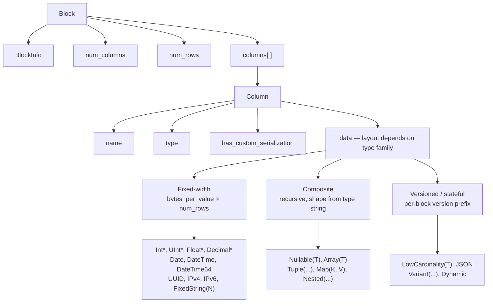
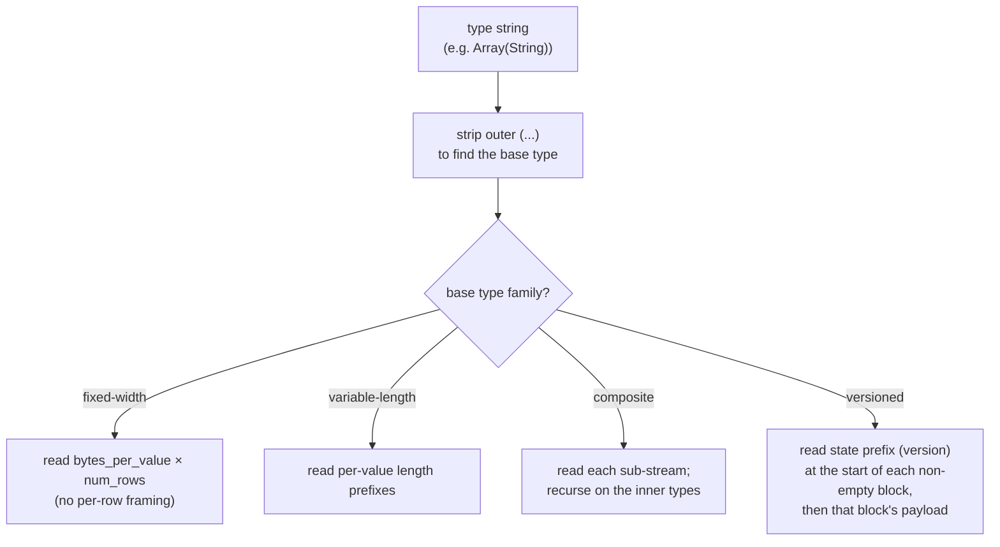
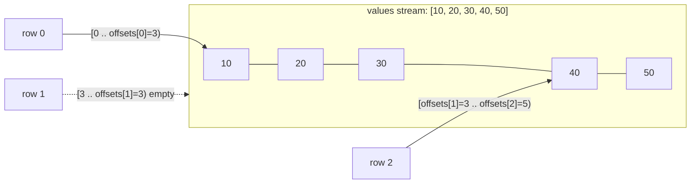
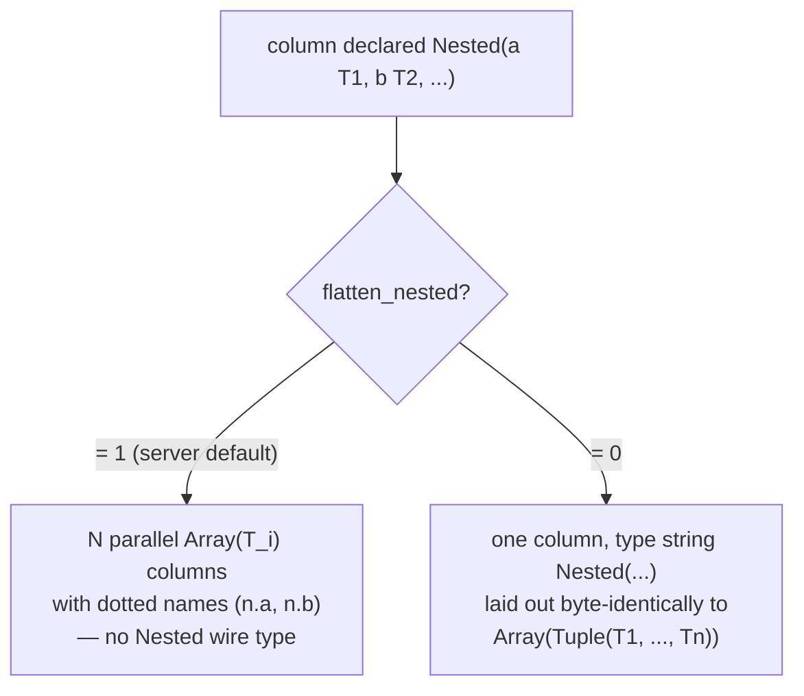
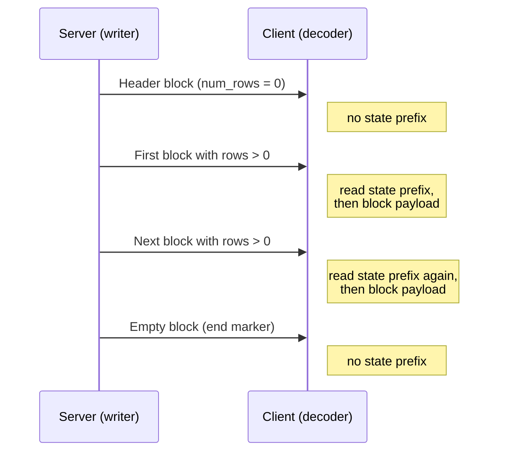
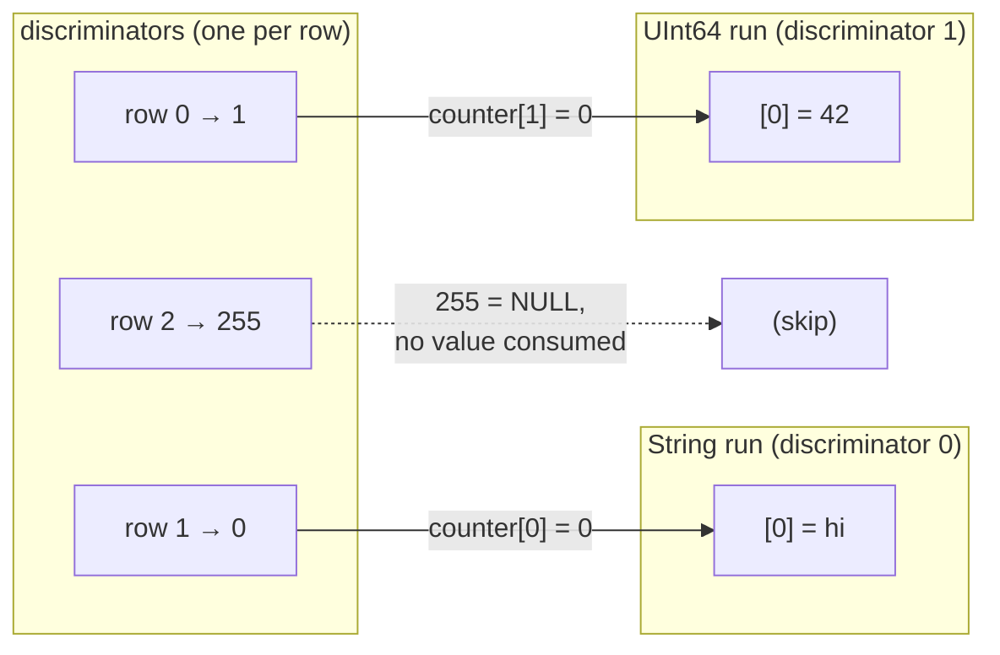
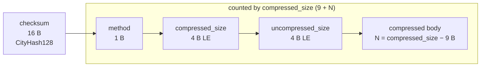

O formato Native é o formato colunar wire que o ClickHouse usa para transportar dados tabulares. Ele aparece em vários contextos:

* no corpo dos packets `Data`, `Totals`, `Extremes`, `Log` e `ProfileEvents` no [protocolo TCP nativo](/pt-BR/interfaces/specs/NativeProtocol) (o packet `TableColumns` **não** é um bloco Native — ele carrega duas binary strings, portanto seu layout pertence à [especificação do protocolo nativo](/pt-BR/interfaces/specs/NativeProtocol));
* na saída de `SELECT ... FORMAT Native` via HTTP;
* em exportações de arquivo gravadas com `INTO OUTFILE ... FORMAT Native`;
* em payloads de replicação entre servidores.

Esta página descreve os bytes dentro de um bloco — o payload colunar — e as codificações de tipo por coluna que o compõem. O framing dos packets, o estado da conexão e a negociação de versão pertencem à [especificação do protocolo nativo](/pt-BR/interfaces/specs/NativeProtocol).

Todos os campos inteiros com múltiplos bytes usam little-endian. Inteiros com sinal usam complemento de dois.

:::tip
Para uma introdução ao formato `Native` voltada ao usuário (com exemplos de `curl`), consulte a [página do formato Native](/pt-BR/interfaces/formats/Native). Esta especificação é a referência wire de nível mais baixo.
:::

<div id="overview">
  ## Visão geral
</div>

Tudo o que transporta linhas no wire é um **bloco**: um fragmento autodescritivo de linhas armazenado coluna por coluna. Todos os valores da coluna 1 vêm primeiro, depois todos os da coluna 2, e assim por diante. Um bloco transporta apenas as colunas que a consulta referencia, nunca a tabela completa.

O `data` de uma coluna é organizado de acordo com a *família* à qual seu tipo pertence. As famílias, em ordem crescente de complexidade do decodificador, são:



* Tipos de **largura fixa** organizam `data` como bytes brutos em `bytes_per_value × num_rows`, sem delimitação por linha.
* Tipos **compostos** (`Nullable`, `Array`, `Tuple`, `Map`, `Nested`) têm uma estrutura recursiva totalmente derivável da string do tipo, sem prefixo de versão e sem estado entre blocos.
* Tipos **versionados / com estado** (`LowCardinality`, `JSON`, `Variant`, `Dynamic`) começam cada bloco não vazio com um prefixo de versão de serialização/estado. No wire `Native`, esse prefixo e qualquer dicionário são **por bloco** — o formato não carrega estado *entre* blocos (o writer cria um novo estado de serialização para cada bloco e define `low_cardinality_max_dictionary_size = 0`). O estado entre blocos diz respeito ao MergeTree em disco, não ao wire layout do Native.

<div id="wire-primitives">
  ## Primitivos de wire
</div>

O formato Native se baseia em quatro codificações primitivas.

| Primitivo               | Tamanho              | Descrição                                                 |
| ----------------------- | -------------------- | --------------------------------------------------------- |
| VarUInt                 | 1–10 B               | Inteiro sem sinal de comprimento variável em LEB-128      |
| inteiro de largura fixa | 1, 2, 4, 8, 16, 32 B | little-endian, complemento de dois para valores com sinal |
| String                  | variável             | Prefixo de comprimento VarUInt + bytes brutos             |
| Bool                    | 1 B                  | `0x00` = false, diferente de zero = true                  |

<div id="varuint">
  ### VarUInt
</div>

Um inteiro sem sinal de tamanho variável usando a codificação LEB-128. Cada byte carrega 7 bits de dados nas posições 0–6 e 1 bit de continuação na posição 7. O bit de continuação é `1` quando há mais bytes a seguir e `0` no byte final.

| Intervalo de valores   | Bytes  |
| ---------------------- | ------ |
| 0 – 127                | 1      |
| 128 – 16383            | 2      |
| 16384 – 2097151        | 3      |
| até o limite de UInt64 | até 10 |

Codificando o valor `300`:

```text
300 = 0b100101100

Byte 0: 0xAC = 0b10101100   (data: 0101100, continuation: 1)
Byte 1: 0x02 = 0b00000010   (data: 0000010, continuation: 0)
```

Decodificando os bytes `0xAC 0x02`:

```text
Byte 0: data = 0x2C, continuation = 1 → accumulator = 0x2C, shift = 7
Byte 1: data = 0x02, continuation = 0 → accumulator = (0x02 << 7) | 0x2C = 300
```

<div id="fixed-width-integers">
  ### Inteiros de largura fixa
</div>

| Tipo    | Bytes | Codificação                                 |
| ------- | ----- | ------------------------------------------- |
| UInt8   | 1     | Byte bruto                                  |
| UInt16  | 2     | Little-endian                               |
| UInt32  | 4     | Little-endian                               |
| UInt64  | 8     | Little-endian                               |
| UInt128 | 16    | Little-endian                               |
| UInt256 | 32    | Little-endian                               |
| Int8    | 1     | Byte bruto, complemento de dois             |
| Int16   | 2     | Little-endian, complemento de dois          |
| Int32   | 4     | Little-endian, complemento de dois          |
| Int64   | 8     | Little-endian, complemento de dois          |
| Int128  | 16    | Little-endian, complemento de dois          |
| Int256  | 32    | Little-endian, complemento de dois          |
| Float32 | 4     | IEEE 754 de precisão simples, little-endian |
| Float64 | 8     | IEEE 754 de precisão dupla, little-endian   |

Por exemplo, o valor `1` do tipo UInt32 é codificado como `01 00 00 00`, e o valor `-1` do tipo Int32, como `FF FF FF FF`.

<div id="string">
  ### String
</div>

Uma sequência de bytes precedida por um prefixo de comprimento:

```text
[VarUInt: byte_length] [byte_length bytes: raw value]
```

A sequência de bytes não precisa ser um UTF-8 válido. Uma string vazia é codificada como um único byte `0x00`, e strings podem conter quaisquer valores de byte, incluindo NUL embutido. A string `"ab"` é codificada como `02 61 62`; para decodificá-la, leia o comprimento em VarUInt (`2`) e, em seguida, leia essa quantidade de bytes.

<div id="bool">
  ### Bool
</div>

Um único byte. `0x00` é false; qualquer valor diferente de zero é true (na forma canônica, `0x01`).

<div id="block-and-column-structure">
  ## Estrutura de blocos e colunas
</div>

<div id="block-wire-layout">
  ### Wire layout do bloco
</div>

```text
[BlockInfo]               metadata (only on the TCP Data-packet path; see below)
[VarUInt: num_columns]    number of columns in this block
[VarUInt: num_rows]       number of rows in this block
[Column × num_columns]    column entries, omitted when num_columns = 0
```

A presença do prefixo `BlockInfo` depende do canal, porque o gravador é parametrizado por uma *revisão* (veja [Revisão do protocolo e o formato Native](#protocol-revision) para a explicação completa, incluindo o fato de `client_protocol_version` ser usado apenas na saída):

* No **protocolo TCP nativo**, o servidor grava blocos na revisão negociada da conexão (um valor alto — `DBMS_TCP_PROTOCOL_VERSION`; veja `src/Core/ProtocolDefines.h`). `BlockInfo` é gravado sempre que essa revisão é maior que zero, o que sempre ocorre em uma conexão real. O byte `has_custom_serialization` em cada coluna (veja [wire layout da coluna](#column-wire-layout)) é gravado na revisão `54454` e superiores.
* O *formato de saída* `Native` — `SELECT ... FORMAT Native` por HTTP, `INTO OUTFILE ... FORMAT Native` e o formato `Native` produzido pelo `clickhouse-client` — serializa na revisão `0` *por padrão*. Na revisão `0`, tanto o prefixo `BlockInfo` quanto o byte `has_custom_serialization` são omitidos, então um bloco é apenas `num_columns`, `num_rows` e as colunas.

  Em HTTP, essa revisão não é fixa: um cliente pode aumentá-la com o parâmetro de consulta `?client_protocol_version=<n>`, e o servidor usa esse valor como revisão de serialização da resposta.

  Com um valor suficientemente alto, a saída HTTP inclui o prefixo `BlockInfo` (gravado sempre que a revisão é maior que `0`) e o byte `has_custom_serialization` (gravado na revisão `54454` e superiores), exatamente como no caminho TCP. Portanto, os clientes não devem presumir que todo payload HTTP `FORMAT Native` esteja na revisão `0`.

Em outras palavras, os exemplos de bytes nesta seção que começam com um prefixo `BlockInfo` descrevem o payload do pacote Data do TCP. A mesma consulta feita por `FORMAT Native` produz a forma mais curta mostrada ao lado deles.

<div id="blockinfo">
  ### BlockInfo
</div>

BlockInfo é uma sequência de campos, cada um precedido por um ID de campo VarUInt e terminada por um ID de campo igual a `0`. O formato wire **não** é autodescritivo: um ID de campo não codifica o comprimento nem o tipo do respectivo valor, portanto o leitor já precisa conhecer o tipo de cada ID de campo que possa encontrar. O próprio leitor do ClickHouse trata um ID de campo não reconhecido como corrupção e gera uma exceção (`UNKNOWN_BLOCK_INFO_FIELD`). A compatibilidade futura é tratada, em vez disso, pela revisão do protocolo: o remetente só grava um campo se a revisão negociada for pelo menos a revisão mínima desse campo, de modo que um receiver mais antigo nunca veja um campo que não conhece.

| Field ID | Field                            | Type           | Min revision | Description                                                                                                                          |
| -------- | -------------------------------- | -------------- | ------------ | ------------------------------------------------------------------------------------------------------------------------------------ |
| 1        | is&#95;overflows                 | UInt8          | 0            | Bloco de overflow de GROUP BY. `0` para blocos sem overflow.                                                                         |
| 2        | bucket&#95;number                | Int32          | 0            | Bucket de agregação. `-1` para blocos sem bucket.                                                                                    |
| 3        | out&#95;of&#95;order&#95;buckets | Lista de Int32 | 54480        | Buckets atrasados durante a agregação distribuída. Codificado como uma contagem VarUInt seguida dessa quantidade de valores `Int32`. |
| 0        | (terminador)                     | —              | —            | Fim de BlockInfo. Sempre obrigatório.                                                                                                |

Os campos `1` e `2` têm revisão mínima `0`, portanto estão presentes sempre que um `BlockInfo` é gravado. O campo `3` é gravado somente na revisão `54480` e posteriores. Layout wire para o caso comum (revisão abaixo de `54480`):

```text
[VarUInt: 1] [UInt8: is_overflows]
[VarUInt: 2] [Int32: bucket_number]
[VarUInt: 0]
```

<div id="column-wire-layout">
  ### Layout wire da coluna
</div>

Uma Column aparece `num_columns` vezes dentro de um Block.

| # | Field                            | Type                             | Condition                               | Description                                                                                                                                                                                                                                                                                                                               |
| - | -------------------------------- | -------------------------------- | --------------------------------------- | ----------------------------------------------------------------------------------------------------------------------------------------------------------------------------------------------------------------------------------------------------------------------------------------------------------------------------------------- |
| 1 | name                             | String                           | sempre                                  | Nome da coluna                                                                                                                                                                                                                                                                                                                            |
| 2 | type                             | String *ou* binary type encoding | sempre                                  | string do tipo do ClickHouse (por exemplo, `"UInt64"`, `"Array(String)"`) por padrão; uma codificação binária de tipo quando `output_format_native_encode_types_in_binary_format = 1` (veja a nota abaixo)                                                                                                                                |
| 3 | has&#95;custom&#95;serialization | UInt8                            | recurso `CUSTOM_SERIALIZATION` (v54454) | `0` = padrão, `1` = personalizado (`kind&#95;stack` vem em seguida)                                                                                                                                                                                                                                                                       |
| 4 | kind&#95;stack                   | bytes                            | quando o campo 3 = `1`                  | Um byte enum UInt8 (veja abaixo) que descreve a serialização não padrão (esparsa etc.). Para o valor `COMBINATION`, ele é seguido por uma contagem VarUInt mais essa quantidade de bytes kind adicionais. Para um `Tuple` (e outros compostos com informações de serialização no nível do elemento), o payload é recursivo — veja abaixo. |
| 5 | data                             | bytes                            | sempre                                  | Valores da coluna para todas as `num_rows` linhas. Layout por tipo — veja [tipos de dados](#data-types). Para colunas esparsas, veja abaixo.                                                                                                                                                                                              |

Um decodificador faz o despacho com base na string `type`. Strings de tipo frequentemente trazem parâmetros entre parênteses; o decodificador remove o sufixo `(...)` para encontrar o tipo básico e então analisa os parâmetros para decidir tamanho, escala ou tipo interno. Analisar uma lista de parâmetros com tipos aninhados (um `Tuple` dentro de um `Array`, por exemplo) exige uma separação por vírgulas sensível à profundidade, que acompanhe o aninhamento de parênteses em vez de um split ingênuo em `,`.

:::note Codificação binária de tipo
O campo `type` é um `String` textual apenas no modo padrão. Quando a configuração da consulta `output_format_native_encode_types_in_binary_format = 1` está definida, esse campo passa a ser, em vez disso, uma **codificação binária de tipo** — a mesma codificação baseada em tags documentada em [codificação binária de tipos de dados](/pt-BR/sql-reference/data-types/data-types-binary-encoding) — e listas achatadas de tipos `Dynamic` usam a mesma codificação binária para seus nomes de tipo individuais. Um decodificador que sempre lê o campo 2 como uma string com prefixo de comprimento trataria a primeira tag binária de tipo como um comprimento de string e perderia a sincronização, portanto ele precisa saber qual modo o stream usa.
:::



<div id="kind-stack-and-sparse-encoding">
  #### kind_stack e codificação esparsa
</div>

O byte `kind_stack` enumera uma serialização por coluna diferente da padrão:

| Byte   | Nome                         | Significado                                                                      | Impacto no wire de `data`                                                                |
| ------ | ---------------------------- | -------------------------------------------------------------------------------- | ---------------------------------------------------------------------------------------- |
| `0x00` | DEFAULT                      | Serialização padrão                                                              | Idêntico a `has_custom = 0`                                                              |
| `0x01` | SPARSE                       | Serialização esparsa (v54465+)                                                   | Fluxo de offsets + valores não padrão; veja abaixo                                       |
| `0x02` | DETACHED                     | Coluna encapsulada em um `ColumnBLOB` por marshaling paralelo de bloco (v54478+) | Blob pré-serializado: `VarUInt size` + essa quantidade de bytes; veja abaixo             |
| `0x03` | DETACHED&#95;OVER&#95;SPARSE | Uma coluna esparsa encapsulada em um `ColumnBLOB`                                | Mesmo payload de blob que `DETACHED`; veja abaixo                                        |
| `0x04` | REPLICATED                   | Forma de dicionário para valores repetidos (v54482+)                             | Fluxo de índices + valores densos de elementos; veja abaixo                              |
| `0x05` | COMBINATION                  | Pilha com vários tipos                                                           | Seguido por `count` como `VarUInt` e por mais `count` bytes de kind — veja a nota abaixo |

**O payload de `COMBINATION` usa um enum diferente.** As cinco linhas acima são códigos compactos de um byte. `COMBINATION` (`0x05`) é o escape geral para qualquer pilha não coberta por eles: ele é seguido por um `VarUInt` `count` e depois por `count` entradas de um byte. Essas entradas **não** são os códigos compactos da tabela — elas são os valores brutos de `ISerialization::Kind`:

| Byte   | `Kind` aninhado |
| ------ | --------------- |
| `0x00` | DEFAULT         |
| `0x01` | SPARSE          |
| `0x02` | DETACHED        |
| `0x03` | REPLICATED      |

Os valores dos bytes diferem dos códigos compactos: `REPLICATED` é `0x03` nesse enum aninhado, mas `0x04` como código compacto, e não há uma entrada `DETACHED_OVER_SPARSE` — essa combinação aparece como duas entradas consecutivas, `SPARSE` e `DETACHED`. Um decodificador que continuar usando a tabela compacta para os bytes aninhados fará o mapeamento incorreto de `0x03`/`0x04` e perderá a sincronização.

O `count` é o comprimento total da pilha **incluindo a entrada inicial `DEFAULT`** que inicia toda pilha. Os códigos compactos já cobrem todas as pilhas de uma e duas entradas, então um `COMBINATION` sempre tem `count` de pelo menos três.

**`kind_stack` recursivo para colunas `Tuple`.** O payload de `kind_stack` acima é o byte (ou a sequência `COMBINATION`) referente às informações de serialização da própria coluna. Um `Tuple` carrega um `SerializationInfoTuple`, que primeiro grava o payload da pilha de kinds do *próprio* tuple e depois grava um payload completo de pilha de kinds para *cada* elemento, em ordem; um decodificador lê de volta a mesma estrutura recursiva. Assim, para `Tuple(A, B, C)`, os bytes do campo 4 são `[tuple_kind][A_kind][B_kind][C_kind]`, e o payload de cada elemento é recursivo se esse elemento também for um tipo composto. O byte `has_custom_serialization` (campo 3) é definido sempre que a informação do próprio tuple *ou de qualquer elemento* é não padrão, então um `Tuple` cujo único elemento especial seja esparso, replicado ou detached ainda aciona o payload de kind-stack. Um decodificador que ler apenas o byte inicial do enum de um `Tuple` vai parar cedo demais e interpretar incorretamente os bytes de kind restantes dos elementos como dados da coluna.

**Formato wire esparso.** Quando `kind_stack = 0x01`, o `data` da coluna consiste em dois fluxos gravados em sequência no mesmo fluxo TCP compartilhado:

1. **Fluxo de offsets** — uma sequência de `VarUInt`s. Cada valor `v` é:
   * `v` com o bit alto na posição 62 limpo: `(v & 0x3FFFFFFFFFFFFFFF)` = o número de posições padrão antes do próximo valor explícito não padrão. Essa posição não padrão é `cursor + group_size`, em que `cursor` é a posição corrente; depois disso, `cursor` avança em `group_size + 1`.
   * `v` com o bit 62 definido (`END_OF_GRANULE_FLAG`): o valor com a flag limpa = o número de posições padrão no final após o último valor não padrão. Isso marca o fim do fluxo de offsets para o bloco.
2. **Fluxo de valores** — `count` valores não padrão codificados densamente no tipo interno, em que `count` é o número de `VarUInt`s não EOG lidos acima.

Um decodificador reconstrói uma coluna densa com `num_rows` entradas, preenchendo cada posição não explícita com o valor padrão do tipo interno (`0` para inteiros e números de ponto flutuante, `""` para `String`, `0` dias para `Date` e assim por diante).

Uma coluna esparsa `Nullable(T)` é um caso especial, porque o valor padrão de `Nullable(T)` é **NULL**. A codificação esparsa elimina completamente o fluxo usual de mapa de nulos de `Nullable`: o fluxo de offset identifica as posições não padrão — isto é, não `NULL` —, o fluxo de valores contém densamente em `T` apenas esses valores não `NULL`, e cada posição não explícita é reconstruída como NULL. Portanto, um decodificador *não* deve procurar um mapa de nulos no fluxo de valores e *não* deve preencher as lacunas com um `0` válido; ele as preenche com NULL.

**Formato wire replicado.** Quando `kind_stack = 0x04`, a coluna `data` é um dicionário: uma lista de valores de elementos distintos mais um índice por linha nessa lista (a mesma forma de lookup de `LowCardinality`). Quando o tipo interno é ele próprio versionado — por exemplo, `LowCardinality(T)` — seu prefixo de estado é escrito **primeiro**, antes do fluxo de índices: a serialização replicada delega a fase de prefixo ao tipo interno antes de escrever `num_rows`. Tipos internos com prefixo vazio (os tipos folha e os compostos simples) não contribuem com nenhum byte aqui.

```text
[inner type's state prefix]              empty for leaf inners; e.g. LowCardinality version (Int64 = 1)
[VarUInt num_rows]
[UInt8  size_of_indexes_type]            width of each index: 1, 2, 4, or 8 bytes
[indexes: num_rows × size_of_indexes_type bytes]
[VarUInt num_elements]
[elements: num_elements dense inner-type values]
```

Um decodificador reconstrói uma coluna densa selecionando `elements[indexes[i]]` para cada linha de saída `i`. Tipos internos compostos são processados recursivamente: a lista de elementos é materializada no tipo interno e depois indexada. Os tipos internos compatíveis incluem os tipos folha, `Nullable(T)`, `Array(T)`, `Tuple(...)`, `Map(K, V)`, `Nested(...)` (cada campo expandido como um `Array`) e `LowCardinality(T)` (o dicionário compartilhado é mantido; apenas as chaves por elemento são indexadas).

**Formato wire desanexado.** `DETACHED` (`0x02`) e `DETACHED_OVER_SPARSE` (`0x03`) *de fato* aparecem no wire — não são puramente internos. No caminho TCP, quando a compressão está habilitada e a revisão negociada é pelo menos `DBMS_MIN_REVISON_WITH_PARALLEL_BLOCK_MARSHALLING` (v54478), a coluna passa por três etapas:

1. Cada coluna elegível (não `const`, não `Tuple`, em um bloco com mais de uma linha) é encapsulada em um `ColumnBLOB` que contém a coluna já serializada e comprimida fora da thread principal.
2. `DETACHED` é acrescentado à pilha de kind da coluna encapsulada.
3. O `data` da coluna é gravado como um tamanho de blob `VarUInt`, seguido por exatamente essa quantidade de bytes do blob.

Se a coluna encapsulada era esparsa, sua pilha é `{DEFAULT, SPARSE, DETACHED}`, que é serializada como `DETACHED_OVER_SPARSE`. Um cliente que decodifica essa coluna lê o comprimento e os bytes do blob e, em seguida, descomprime o blob para recuperar o payload da coluna interna (consulte a [nota sobre `ColumnBLOB`](#compression-negotiation) em compressão).

<div id="block-variants">
  ### Variantes de bloco
</div>

Todos os pacotes da família Data compartilham o mesmo wire format de bloco. As variantes diferem apenas nas contagens de colunas e linhas:

| Variante           | num&#95;columns | num&#95;rows | Finalidade                                                                             |
| ------------------ | --------------- | ------------ | -------------------------------------------------------------------------------------- |
| Bloco de cabeçalho | N &gt; 0        | 0            | Anuncia o esquema do resultado (nomes das colunas + tipos).                            |
| Bloco de resultado | N &gt; 0        | M &gt; 0     | Linhas de resultado propriamente ditas.                                                |
| Bloco vazio        | 0               | 0            | Sentinela — fim da entrada no lado do cliente; marcador de limite no lado do servidor. |

<div id="byte-level-examples">
  ### Exemplos em nível de byte
</div>

Todos os exemplos desta seção são do **caminho do pacote Data via TCP**, portanto incluem o prefixo `BlockInfo` e o byte `has_custom_serialization`. Em `FORMAT Native`, os mesmos blocos são mais curtos — a forma curta equivalente é mostrada quando isso ajuda.

Um bloco vazio (com BlockInfo), 8 bytes no total:

```text
01 00                   BlockInfo: field_id=1, is_overflows=0
02 FF FF FF FF          BlockInfo: field_id=2, bucket_number=-1
00                      BlockInfo terminator
00                      num_columns = 0
00                      num_rows = 0
```

Um bloco de cabeçalho para `SELECT 1` indica uma coluna chamada `"1"` do tipo `UInt8`, com zero linhas. No protocolo ≥ 54454, o byte `has_custom_serialization` é incluído:

```text
01 00                   BlockInfo: is_overflows = 0
02 FF FF FF FF          BlockInfo: bucket_number = -1
00                      BlockInfo terminator
01                      num_columns = 1
00                      num_rows = 0
01 "1"                  Column[0].name = "1"
05 "UInt8"              Column[0].type = "UInt8"
00                      Column[0].has_custom_serialization = 0
                        Column[0].data: no bytes (num_rows = 0)
```

O bloco de resultado da mesma consulta, com uma linha:

```text
01 00                   BlockInfo: is_overflows = 0
02 FF FF FF FF          BlockInfo: bucket_number = -1
00                      BlockInfo terminator
01                      num_columns = 1
01                      num_rows = 1
01 "1"                  Column[0].name = "1"
05 "UInt8"              Column[0].type = "UInt8"
00                      Column[0].has_custom_serialization = 0
01                      Column[0].data: one UInt8 byte = 1
```

Por meio de `FORMAT Native` (revisão `0`), o mesmo bloco de resultado não inclui `BlockInfo` nem o byte `has_custom_serialization` — `SELECT 1 FORMAT Native` tem 11 bytes:

```text
01                      num_columns = 1
01                      num_rows = 1
01 "1"                  Column[0].name = "1"
05 "UInt8"              Column[0].type = "UInt8"
01                      Column[0].data: one UInt8 byte = 1
```

(Um resultado com zero linhas, como um bloco somente com cabeçalho, não produz byte nenhum em `FORMAT Native`: o formato de saída não emite blocos vazios.)

<div id="protocol-revision">
  ## Revisão do protocolo e o formato Native
</div>

Um fluxo de bytes Native é determinado, acima de tudo, pela **revisão do protocolo** que seu gravador e seu leitor utilizam. A revisão não aparece em nenhum lugar nos próprios bytes — não há campo de revisão on the wire —, mas ainda assim ela determina se vários recursos aparecem ou não. Por isso, um decodificador precisa saber com qual revisão um payload foi escrito antes de conseguir interpretá-lo. Como a revisão não está no fluxo, o leitor e o gravador precisam combiná-la de alguma outra forma.

Ela é um único `UInt64`, e tanto `NativeWriter` quanto `NativeReader` a recebem como argumento do construtor. O gravador a chama de `client_revision` e o leitor a chama de `server_revision`, mas é o mesmo número. A revisão mais recente que este lançamento reconhece é `DBMS_TCP_PROTOCOL_VERSION` (veja `src/Core/ProtocolDefines.h`).

<div id="what-the-revision-gates">
  ### O que a revisão determina
</div>

Cada recurso fica condicionado a um limite `DBMS_MIN_REVISION_WITH_*`. O gravador só emite o recurso quando sua revisão atinge esse limite, e o leitor só o procura sob exatamente a mesma regra, para que ambos permaneçam em sincronia — se a revisão estiver errada em qualquer um dos lados, eles se dessincronizam. Os limites que importam para o formato Native são:

| Recurso                                       | Constante de limite                                                | Revisão | Efeito quando abaixo do limite                                                                                                                                                                                                                                                            |
| --------------------------------------------- | ------------------------------------------------------------------ | ------- | ----------------------------------------------------------------------------------------------------------------------------------------------------------------------------------------------------------------------------------------------------------------------------------------- |
| Prefixo `BlockInfo`                           | (qualquer valor `> 0`)                                             | `1`     | O prefixo [`BlockInfo`](#blockinfo) é omitido por completo; um bloco é apenas `num_columns`, `num_rows`, colunas.                                                                                                                                                                         |
| Byte `has_custom_serialization`               | `DBMS_MIN_REVISION_WITH_CUSTOM_SERIALIZATION`                      | `54454` | O byte [`has_custom_serialization`](#column-wire-layout) por coluna é omitido; toda coluna usa a serialização padrão (sem formas esparsas, replicadas ou desanexadas).                                                                                                                    |
| `LowCardinality` on the wire                  | `DBMS_MIN_REVISION_WITH_LOW_CARDINALITY_TYPE`                      | `54405` | Caso especial — **não** segue a regra simples de “abaixo do limite”. `LowCardinality(T)` é reduzido ao tipo básico `T` somente quando a revisão é *diferente de zero* e menor que `54405`, ou quando a remoção é forçada separadamente. A revisão `0` o mantém. Veja a observação abaixo. |
| Serialização V2 de `Dynamic` / `JSON`         | `DBMS_MIN_REVISION_WITH_V2_DYNAMIC_AND_JSON_SERIALIZATION`         | `54473` | `Dynamic` e `JSON`/`Object` usam serialização V1 (com o parâmetro `max_dynamic_*`) em vez da V2.                                                                                                                                                                                          |
| Versionamento de funções de agregação         | `DBMS_MIN_REVISION_WITH_AGGREGATE_FUNCTIONS_VERSIONING`            | `54452` | O estado de `AggregateFunction` é gravado sem versão embutida.                                                                                                                                                                                                                            |
| `out_of_order_buckets` em `BlockInfo`         | `DBMS_MIN_REVISION_WITH_OUT_OF_ORDER_BUCKETS_IN_AGGREGATION`       | `54480` | O campo de `BlockInfo` com ID `3` não é gravado (veja [BlockInfo](#blockinfo)).                                                                                                                                                                                                           |
| Empacotamento paralelo de blocos (`DETACHED`) | `DBMS_MIN_REVISON_WITH_PARALLEL_BLOCK_MARSHALLING`                 | `54478` | As colunas nunca são encapsuladas em um `ColumnBLOB`; nenhum tipo `DETACHED` / `DETACHED_OVER_SPARSE` aparece (veja [kind&#95;stack](#kind-stack-and-sparse-encoding)).                                                                                                                   |
| Parâmetro de tipo `DateTime(tz)`              | `DBMS_MIN_REVISION_WITH_TIME_ZONE_PARAMETER_IN_DATETIME_DATA_TYPE` | `54337` | O parâmetro de timezone é removido da string `type` — `DateTime('UTC')` é anunciado apenas como `DateTime`.                                                                                                                                                                               |

Isso faz da revisão `0` a codificação mais conservadora para quase tudo: o fluxo não carrega `BlockInfo`, nem o byte `has_custom_serialization`, usa `Dynamic`/`JSON` V1, não inclui versão de função de agregação e traz um `DateTime` simples com o parâmetro de timezone removido.

`LowCardinality` é a única exceção — e uma exceção importante. A verificação do gravador é `remove_low_cardinality || (client_revision && client_revision < DBMS_MIN_REVISION_WITH_LOW_CARDINALITY_TYPE)`. O truque está no `client_revision &&` no início: quando a revisão é exatamente `0`, toda a condição entra em curto-circuito e resulta em falso.

Portanto, na revisão `0` — o padrão para `FORMAT Native` — `LowCardinality(T)` **não** é removido. Sua string de tipo e o prefixo de estado por bloco permanecem no fluxo, e o leitor da revisão `0` os lê de volta diretamente. A remoção só entra em ação em uma revisão diferente de zero abaixo de `54405`, ou quando é forçada independentemente da revisão.

Esse forçamento é feito pela flag `remove_low_cardinality`. A saída de `FORMAT Native` nunca a define, mas o caminho native TCP a define quando `low_cardinality_allow_in_native_format = 0` (o padrão é `1`). Em outras palavras, essa configuração altera a saída de native TCP, mas não faz nada para `FORMAT Native`.

Conclusão prática: um fluxo `FORMAT Native` padrão pode legitimamente conter `LowCardinality`, portanto não o trate como um recurso ausente na revisão `0`.

<div id="revision-per-channel">
  ### De onde vem a revisão, dependendo de como os dados trafegam
</div>

Os mesmos bytes Native podem trafegar por caminhos diferentes: o protocolo TCP nativo, uma requisição HTTP ou um arquivo no disco. Cada caminho define a revisão à sua maneira. Um ponto importante: o lado da leitura e o lado da gravação são configurados separadamente, então podem acabar com revisões diferentes.

<div id="revision-tcp">
  #### Protocolo TCP nativo — negociado, em ambas as direções
</div>

No [protocolo TCP nativo](/pt-BR/interfaces/specs/NativeProtocol), a revisão vem do handshake Hello. O cliente envia `DBMS_TCP_PROTOCOL_VERSION`, o servidor envia a sua própria de volta e, a partir daí, cada lado serializa na **revisão anunciada pelo outro lado**: o servidor constrói seu `NativeReader`/`NativeWriter` a partir de `client_tcp_protocol_version`, enquanto o cliente usa a `server_revision` que recebeu. Não há um `min` explícito, mas nenhum dos lados pode emitir um recurso que não implementou, então cada direção é efetivamente limitada pelo mais antigo dos dois peers.

Quando ambos os peers estão na mesma versão moderna, as duas direções chegam à mesma revisão (`DBMS_TCP_PROTOCOL_VERSION`, veja `src/Core/ProtocolDefines.h`) e todos os controles ficam ativados. Esse é o caso mais comum, mas não é garantido. Com peers de versões diferentes ou de terceiros, as duas direções podem ficar em revisões diferentes, então os controles precisam ser analisados por direção: `BlockInfo` está presente para qualquer revisão diferente de zero, mas o restante — incluindo `has_custom_serialization` — só aparece quando a revisão efetiva daquela direção atinge seus limiares. Um peer que anuncia uma revisão abaixo de `54454`, por exemplo, não envia nem recebe o byte `has_custom_serialization`.

<div id="revision-output">
  #### saída `FORMAT Native` — revisão 0 por padrão, com possibilidade de aumento via HTTP
</div>

O formato de *saída* `Native` usa por padrão a revisão **`0`**. Isso abrange `SELECT ... FORMAT Native` por HTTP, `INTO OUTFILE ... FORMAT Native` e a saída `Native` gravada pelo `clickhouse-client`; em cada caso, a fábrica de saída repassa `FormatSettings::client_protocol_version` diretamente ao `NativeWriter`.

Em HTTP, porém, esse padrão não é toda a história. Um cliente pode aumentá-lo com o parâmetro de consulta `?client_protocol_version=<n>`, que o handler HTTP trata como um parâmetro reservado, e não como uma configuração SQL: ele vai para o contexto da consulta, e a camada de formato o copia para `FormatSettings`. Se você definir um valor alto o suficiente, a saída HTTP `FORMAT Native` passará a incluir o prefixo `BlockInfo` e o byte `has_custom_serialization`, assim como no caminho TCP — portanto, não presuma que um payload HTTP `FORMAT Native` seja sempre revisão `0`. Exportações para arquivo e a saída local do `clickhouse-client` não têm esse tipo de ajuste e permanecem em `0`.

<div id="revision-input">
  #### Entrada `FORMAT Native` — sempre revisão 0
</div>

O formato de *entrada* `Native` funciona ao contrário: ele é **fixado na revisão `0`** e não considera `client_protocol_version` de forma alguma. Seja ao analisar o corpo de um `INSERT ... FORMAT Native` ou ao ler um arquivo `Native`, ele cria o `NativeReader` com um `0` literal; portanto, nunca espera um prefixo `BlockInfo`, nunca lê o byte `has_custom_serialization` e sempre assume a serialização padrão.

Assim, `client_protocol_version` afeta apenas a saída. Definir um `?client_protocol_version=` alto (por exemplo, `DBMS_TCP_PROTOCOL_VERSION`) em uma requisição `INSERT ... FORMAT Native` não muda em nada a forma como o corpo é lido — o corpo ainda precisa estar na revisão `0`. Se você fornecer um corpo que traga um prefixo `BlockInfo` ou um byte `has_custom_serialization`, o leitor perde a sincronização, e isso retorna como um erro de análise (`INCORRECT_DATA` ou `CANNOT_READ_ALL_DATA`), em vez de um insert bem-sucedido.

<div id="revision-round-trip">
  ### Implicações de ida e volta
</div>

Para `FORMAT Native`, a escolha mais segura é a revisão `0` nas duas pontas, que é o padrão. Os dados gravados por `SELECT ... FORMAT Native` na revisão `0` podem ser lidos de volta diretamente por `INSERT ... FORMAT Native` sem surpresas.

O problema só começa se você aumentar a revisão de saída de propósito. Um `SELECT ... FORMAT Native` feito com `?client_protocol_version=<large>` produz um fluxo que carrega bytes `BlockInfo` e `has_custom_serialization`, e o caminho de entrada da revisão `0` não consegue lê-los de volta. Se você precisar que esses dados façam ida e volta, ou deixe `client_protocol_version` de fora do `SELECT` que gera os dados, ou transfira os dados pelo protocolo TCP nativo — em que cada direção usa a revisão negociada no handshake — em vez de `FORMAT Native`.

| Canal                                                       | Revisão de gravação                              | Revisão de leitura                               | `BlockInfo` / serialização personalizada                                            |
| ----------------------------------------------------------- | ------------------------------------------------ | ------------------------------------------------ | ----------------------------------------------------------------------------------- |
| Pacote Data do TCP nativo                                   | Revisão anunciada pela outra ponta (por direção) | Revisão anunciada pela outra ponta (por direção) | `BlockInfo` sempre que a revisão for `> 0`; `has_custom_serialization` em `≥ 54454` |
| `SELECT ... FORMAT Native` via HTTP                         | `client_protocol_version` (padrão `0`)           | n/a                                              | Apenas se `client_protocol_version` for aumentado                                   |
| `INSERT ... FORMAT Native` via HTTP                         | n/a                                              | `0` (fixa, ignora `client_protocol_version`)     | Nunca lido                                                                          |
| `INTO OUTFILE` / file / `clickhouse-client` `FORMAT Native` | `0`                                              | `0`                                              | Ausente (mas `LowCardinality` é mantido — veja a observação acima)                  |

:::note Revisão de protocolo vs versão de serialização
Não confunda a revisão de protocolo com a [versão de serialização](#serialization-version-concept). A revisão aqui vale para toda a conexão ou requisição e nunca aparece nos bytes. A versão de serialização é por coluna, transportada por [tipos versionados](#versioned-types), e é gravada em cada bloco não vazio. A revisão decide se um recurso existe ou não; a versão de serialização, depois que você já está dentro de uma coluna versionada, escolhe qual variante da codificação desse tipo específico vem em seguida.
:::

<div id="data-types">
  ## Tipos de dados
</div>

Esta seção documenta a codificação wire dos tipos que o formato Native pode transportar no `data` de uma coluna, agrupados em quatro famílias com complexidade crescente de decodificação. Dois tipos — `AggregateFunction(func, ...)` e `QBit(T, N[, stride])` — são tipos de coluna `Native` válidos, mas têm payloads específicos da função ou do tipo que estão fora do escopo aqui; eles são destacados abaixo nos casos em que, de outra forma, poderiam ser confundidos com aliases.

| Família                 | Seção                                                   | Streams por coluna | Estado entre blocos                                                        |
| ----------------------- | ------------------------------------------------------- | ------------------ | -------------------------------------------------------------------------- |
| Largura fixa            | [Tipos de largura fixa](#fixed-width-types)             | Um                 | Nenhum                                                                     |
| Comprimento variável    | [Tipos de comprimento variável](#variable-length-types) | Um                 | Nenhum                                                                     |
| Composto (forma fixa)   | [Tipos compostos](#composite-types)                     | Múltiplos          | Nenhum                                                                     |
| Versionado / com estado | [Tipos versionados](#versioned-types)                   | Múltiplos          | Nenhum no wire Native — prefixo de estado por bloco, renovado a cada bloco |

<div id="fixed-width-types">
  ### Tipos de largura fixa
</div>

Cada valor ocupa um número constante de bytes. Uma coluna de `M` linhas ocupa exatamente `bytes_per_row × M` bytes on the wire, concatenados sem separadores nem padding.

| string do tipo      | Bytes por valor | Valor lógico                                                                                                | Codificação wire                                                     |
| ------------------- | --------------- | ----------------------------------------------------------------------------------------------------------- | -------------------------------------------------------------------- |
| `UInt8`             | 1               | Inteiro sem sinal de 8 bits                                                                                 | Byte bruto                                                           |
| `UInt16`            | 2               | Inteiro sem sinal de 16 bits                                                                                | Little-endian                                                        |
| `UInt32`            | 4               | Inteiro sem sinal de 32 bits                                                                                | Little-endian                                                        |
| `UInt64`            | 8               | Inteiro sem sinal de 64 bits                                                                                | Little-endian                                                        |
| `UInt128`           | 16              | Inteiro sem sinal de 128 bits                                                                               | Little-endian                                                        |
| `UInt256`           | 32              | Inteiro sem sinal de 256 bits                                                                               | Little-endian                                                        |
| `Int8`              | 1               | Inteiro com sinal de 8 bits, complemento de dois                                                            | Byte bruto                                                           |
| `Int16`             | 2               | Inteiro com sinal de 16 bits, complemento de dois                                                           | Little-endian                                                        |
| `Int32`             | 4               | Inteiro com sinal de 32 bits, complemento de dois                                                           | Little-endian                                                        |
| `Int64`             | 8               | Inteiro com sinal de 64 bits, complemento de dois                                                           | Little-endian                                                        |
| `Int128`            | 16              | Inteiro com sinal de 128 bits, complemento de dois                                                          | Little-endian                                                        |
| `Int256`            | 32              | Inteiro com sinal de 256 bits, complemento de dois                                                          | Little-endian                                                        |
| `Float32`           | 4               | IEEE 754 de precisão simples                                                                                | Little-endian                                                        |
| `Float64`           | 8               | IEEE 754 de precisão dupla                                                                                  | Little-endian                                                        |
| `BFloat16`          | 2               | 16 bits mais significativos de um IEEE 754 `Float32`                                                        | Little-endian                                                        |
| `Bool`              | 1               | `0x00` = false, `0x01` = true                                                                               | Byte bruto                                                           |
| `Date`              | 2               | Dias desde `1970-01-01`                                                                                     | Little-endian UInt16                                                 |
| `Date32`            | 4               | Dias desde `1970-01-01` (com sinal; pré-1970 ok)                                                            | Little-endian Int32                                                  |
| `DateTime`          | 4               | Unix timestamp em segundos                                                                                  | Little-endian UInt32                                                 |
| `DateTime(tz)`      | 4               | Igual a `DateTime`; o fuso horário é metadata                                                               | Little-endian UInt32                                                 |
| `DateTime64(s)`     | 8               | Ticks na escala `s` (10^-s segundos desde a epoch)                                                          | Little-endian Int64                                                  |
| `DateTime64(s, tz)` | 8               | Igual a `DateTime64(s)`; o fuso horário é metadata                                                          | Little-endian Int64                                                  |
| `Time`              | 4               | Duração com sinal em segundos                                                                               | Little-endian Int32                                                  |
| `Time64(s)`         | 8               | Duração com sinal em ticks na escala `s`                                                                    | Little-endian Int64                                                  |
| `Interval<Unit>`    | 8               | Contagem com sinal; a unidade está na string do tipo                                                        | Little-endian Int64                                                  |
| `UUID`              | 16              | Identificador de 128 bits                                                                                   | Duas metades LE UInt64 com bytes invertidos (consulte [UUID](#uuid)) |
| `IPv4`              | 4               | Endereço IPv4                                                                                               | Little-endian UInt32                                                 |
| `IPv6`              | 16              | Endereço IPv6                                                                                               | Ordem de bytes de rede, sem swap                                     |
| `Enum8`             | 1               | Com sinal de 8 bits (índice da variante)                                                                    | Byte bruto                                                           |
| `Enum16`            | 2               | Com sinal de 16 bits (índice da variante)                                                                   | Little-endian                                                        |
| `Decimal(P, S)`     | 4 / 8 / 16 / 32 | `value × 10^S` como inteiro com sinal; a largura depende de P (≤9 → 4 B, ≤18 → 8 B, ≤38 → 16 B, ≤76 → 32 B) | Inteiro com sinal little-endian                                      |

<div id="integer-types">
  #### Tipos inteiros
</div>

`UInt8`–`UInt256` e `Int8`–`Int256` são codificações binárias diretas de valores inteiros. Um decodificador lê `bytes_per_row × num_rows` bytes e os interpreta de acordo com o tipo.

Uma coluna `UInt32` contendo `[1, 256, 65536]`:

```text
01 00 00 00              row 0: 1
00 01 00 00              row 1: 256
00 00 01 00              row 2: 65536
```

Uma coluna `Int32` contendo `[-1, 42]`:

```text
FF FF FF FF              row 0: -1
2A 00 00 00              row 1: 42
```

<div id="float32-and-float64">
  #### Float32 e Float64
</div>

Números de ponto flutuante binários IEEE 754 padrão: 4 bytes de precisão simples (`binary32`) e 8 bytes de precisão dupla (`binary64`), ambos em little-endian. NaN, ±Infinity, ±0.0 e subnormais mantêm a integridade na ida e volta, sem normalização.

Valor `Float32` `1.5` (`0x3FC00000`):

```text
00 00 C0 3F              little-endian IEEE 754
```

`Float64` com valor `1.5` (`0x3FF8000000000000`):

```text
00 00 00 00 00 00 F8 3F  little-endian IEEE 754
```

<div id="bfloat16">
  #### BFloat16
</div>

O formato de ponto flutuante brain-float: os 16 bits mais altos de um IEEE 754 `Float32` — 1 bit de sinal, 8 bits de expoente, 7 bits de mantissa. Cada valor ocupa 2 bytes, little-endian, contendo o padrão bruto de 16 bits. Para recuperar o valor numérico, expanda-o de volta para `Float32` colocando o padrão na metade superior e zerando a metade inferior (`bits << 16` reinterpretado como `Float32`); o valor expandido então passa a compartilhar a formatação textual de `Float32`.

Valor `1.5` de `BFloat16` (padrão `0x3FC0`, a metade superior de `Float32` `0x3FC00000`):

```text
C0 3F                    little-endian, widens to Float32 1.5
```

<div id="bool-type">
  #### Bool
</div>

Compatível, no wire, com `UInt8`: 1 byte por linha, `0x00` = false, `0x01` = true. A string do tipo on the wire é literalmente `Bool` (não `UInt8`), portanto um decodificador que despacha com base na string do tipo deve reconhecê-lo separadamente.

Uma coluna `Bool` `[true, false, true]`:

```text
01 00 01
```

<div id="date-and-date32">
  #### Date e Date32
</div>

Ambos codificam datas como contagens inteiras de dias em relação à Unix epoch `1970-01-01`. Nenhum deles inclui um componente de tempo.

| Type     | Bytes | Encoding             | Range                                                      |
| -------- | ----- | -------------------- | ---------------------------------------------------------- |
| `Date`   | 2     | Little-endian UInt16 | `1970-01-01` a `2149-06-06`                                |
| `Date32` | 4     | Little-endian Int32  | ampla faixa com sinal; datas anteriores a 1970 são aceitas |

Valor `Date` `1970-01-02` (1 dia):

```text
01 00                    UInt16 LE = 1
```

`Date32` com valor `1900-01-01` (-25567 dias):

```text
21 9C FF FF              Int32 LE = -25567
```

<div id="datetime">
  #### DateTime
</div>

Compatível no wire com `UInt32`: um timestamp Unix em segundos, com 4 bytes little-endian. O tipo pode aparecer como `DateTime` ou `DateTime('Timezone')`; o fuso horário afeta apenas a exibição e não faz parte do valor no wire. Duas colunas `DateTime` com parâmetros de fuso horário diferentes produzem bytes idênticos para o mesmo instante. Um decodificador remove o sufixo de parâmetro `(...)` e processa a coluna como `UInt32`.

Valor `DateTime('UTC')` `2024-03-15 14:30:00 UTC` (timestamp `1710513000`):

```text
68 5B F4 65              UInt32 LE = 1710513000
```

<div id="datetime64">
  #### DateTime64(scale[, timezone])
</div>

8 bytes, Int64 little-endian representando ticks na escala de `10^-scale` segundos desde a Unix epoch. O parâmetro `scale` (0–9) fica na string do tipo e define a unidade de tempo:

| Scale | Tick size       | Common name |
| ----- | --------------- | ----------- |
| 0     | 1 segundo       | segundos    |
| 3     | 1 milissegundo  | ms          |
| 6     | 1 microssegundo | µs          |
| 9     | 1 nanossegundo  | ns          |

O tipo aparece como `DateTime64(s)` (fuso horário padrão implícito do servidor) ou `DateTime64(s, 'TimezoneName')` (fuso horário explícito, apenas para exibição). Valores negativos representam ticks anteriores à epoch.

Valor `DateTime64(3, 'UTC')` `2024-01-15 12:30:45.123 UTC` (1705321845123 ms):

```text
83 51 1A 0D 8D 01 00 00  Int64 LE = 1705321845123
```

Valor de `DateTime64(0)` `2024-01-15 12:30:45 UTC` (1705321845 s):

```text
75 25 A5 65 00 00 00 00  Int64 LE = 1705321845
```

<div id="time-and-time64">
  #### Time e Time64(scale)
</div>

Uma duração de tempo, e não um instante no tempo. `Time` é uma contagem assinada de segundos, em 4 bytes little-endian Int32; `Time64(scale)` é uma contagem assinada de ticks na escala decimal especificada (0–9), em 8 bytes little-endian Int64 — com o mesmo formato wire de `DateTime64`.

A forma textual é `[-]HH:MM:SS[.fraction]`, mas, ao contrário de `DateTime`, o campo de hora **não** volta ao início a cada período de 24 horas: ele representa a contagem total de horas e pode exceder 23. A magnitude exibida é limitada a `999:59:59` (`3599999` segundos); uma magnitude maior é exibida nesse limite com a fração zerada (`999:59:59.000`). `CAST` também limita o valor armazenado a esse intervalo, embora operações aritméticas possam produzir valores fora dele, que são limitados apenas na exibição. Nada disso afeta os wire bytes, que são apenas o inteiro assinado.

Valor `Time` `45296` (`12:34:56`):

```text
F0 B0 00 00              Int32 LE = 45296
```

`Time64(3)` com valor de `45296789` ticks (`12:34:56.789`):

```text
95 2C B3 02 00 00 00 00  Int64 LE = 45296789
```

:::note
`Time` e `Time64` são experimentais e exigem `allow_experimental_time_time64_type = 1` no servidor.
:::

<div id="interval">
  #### Interval
</div>

`Interval<Unit>` — `IntervalSecond`, `IntervalMinute`, `IntervalHour`, `IntervalDay`, `IntervalWeek`, `IntervalMonth`, `IntervalQuarter`, `IntervalYear`, `IntervalNanosecond` e assim por diante. Todas as unidades compartilham uma única codificação wire: a contagem como um Int64 little-endian com sinal de 8 bytes. A unidade existe **apenas** na string do tipo — ela não altera nem os wire bytes nem a forma textual, que é o inteiro sem adornos. Um único caminho de decodificação lida com todas as unidades.

Valor `5` de `IntervalDay`:

```text
05 00 00 00 00 00 00 00  Int64 LE = 5
```

<div id="uuid">
  #### UUID
</div>

16 bytes por valor. A codificação wire **não** usa os 16 bytes canônicos em big-endian — cada metade de 8 bytes tem a ordem dos bytes invertida de forma independente.

O modelo lógico é um identificador de 128 bits na forma de texto canônica `xxxxxxxx-xxxx-xxxx-xxxx-xxxxxxxxxxxx`, em que os bytes são convencionalmente escritos em big-endian. O modelo wire pega esses 16 bytes canônicos, divide-os em duas metades de 8 bytes e grava cada metade em little-endian:

* wire bytes 0..7 = bytes canônicos 0..7 em ordem inversa.
* wire bytes 8..15 = bytes canônicos 8..15 em ordem inversa.

UUID `550e8400-e29b-41d4-a716-446655440000`:

```text
Canonical bytes (16):    55 0E 84 00 E2 9B 41 D4  A7 16 44 66 55 44 00 00

Wire bytes:
D4 41 9B E2 00 84 0E 55  high half byte-reversed
00 00 44 55 66 44 16 A7  low half byte-reversed
```

O UUID nulo (composto apenas por zeros) aparece de forma idêntica em ambas as representações.

<div id="ipv4-and-ipv6">
  #### IPv4 e IPv6
</div>

Dois tipos de endereço relacionados, mas com codificações diferentes.

`IPv4` tem 4 bytes, codificado como um UInt32 little-endian que contém o endereço canônico de 32 bits (o valor `(a << 24) | (b << 16) | (c << 8) | d` de `a.b.c.d`). Os wire bytes são os bytes em ordem de rede na ordem inversa.

`192.168.1.10` (valor canônico de 32 bits `0xC0A8010A`):

```text
0A 01 A8 C0              Little-endian UInt32
```

`IPv6` tem 16 bytes, escritos **exatamente em ordem de bytes de rede** sem inversão — a mesma ordem de bytes de `inet_pton(AF_INET6, ...)`.

`2001:db8::1`:

```text
20 01 0D B8 00 00 00 00  network bytes 0..7
00 00 00 00 00 00 00 01  network bytes 8..15
```

A assimetria é deliberada: o IPv4 é armazenado como um `u32` para operações aritméticas e consultas compactas de intervalo, enquanto o IPv6 mantém o layout em ordem de rede comum à maioria das APIs de rede.

<div id="enum8-and-enum16">
  #### Enum8 and Enum16
</div>

Compatíveis, no wire, com `Int8` e `Int16`, respectivamente: 1 ou 2 bytes por linha, em complemento de dois little-endian para a variante de 16 bits. O mapeamento completo da variante fica na string do tipo:

```text
Enum8('active' = 1, 'inactive' = 2, 'banned' = -1)
Enum16('a' = 1, 'b' = 30000)
```

Um decodificador pode remover o sufixo de parâmetro `(...)` e tratar o valor como `Int8` / `Int16` — os wire bytes são apenas o índice inteiro. Um client que expõe o rótulo analisa o mapeamento `'name' = value` a partir da string do tipo e o mantém junto com a coluna: o inteiro, por si só, não recupera o rótulo. Uma saída orientada a texto renderiza o rótulo (`active`) em vez do índice, entre aspas simples (`'active'`) quando o enum está aninhado dentro de um tipo composto. Como o mapeamento não pode ser recuperado da coluna inteira, ele deve ser preservado para enums aninhados, como `Array(Enum8(...))` ou `Map(Enum16(...), V)`.

Uma coluna `Enum8('active' = 1, 'inactive' = 2)` `[active, inactive, active]`:

```text
01 02 01
```

Um valor `30000` de `Enum16(...)`:

```text
30 75                    Int16 LE = 30000
```

<div id="decimal">
  #### Decimal(P, S)
</div>

Um inteiro com sinal escalonado por uma potência de 10. A largura em bytes do inteiro é implícita pela **precisão** `P`; a **escala** `S` é o expoente negativo (o número de dígitos após o separador decimal). Ambos ficam na string do tipo.

| Precisão (P) | Inteiro subjacente | Bytes |
| ------------ | ------------------ | ----- |
| 1 ≤ P ≤ 9    | Int32              | 4     |
| 10 ≤ P ≤ 18  | Int64              | 8     |
| 19 ≤ P ≤ 38  | Int128             | 16    |
| 39 ≤ P ≤ 76  | Int256             | 32    |

A wire encoding é o inteiro subjacente em complemento de dois little-endian, e o valor decimal lógico é `wire_integer × 10^(-S)`.

O ClickHouse sempre emite `Decimal(P, S)`, independentemente de como o tipo foi declarado. `Decimal32(S)`, `Decimal64(S)` e assim por diante são sempre normalizados para `Decimal(P, S)` on the wire (com `P` definido para o máximo natural da largura: 9, 18, 38, 76). Um decodificador que reconhece apenas `Decimal(P, S)` cobre todas as formas que o servidor emite.

Valor `123.4567` de `Decimal(9, 4)` → inteiro subjacente `1234567`:

```text
87 D6 12 00              Int32 LE = 1234567
```

`Decimal(18, 1)` com valor `-1.5` → inteiro subjacente `-15`:

```text
F1 FF FF FF FF FF FF FF  Int64 LE = -15
```

`Decimal(38, 4)` com valor `123.4567` (16 bytes no total):

```text
87 D6 12 00 00 00 00 00 00 00 00 00 00 00 00 00
```

<div id="nothing">
  #### Nothing
</div>

O tipo `Nothing` não contém valores. Na prática, ele aparece apenas como o tipo interno de `Nullable(Nothing)` — o que o servidor retorna para uma expressão como `SELECT NULL`, cujo único valor válido é a ausência de valor. Conceitualmente, é um tipo unitário.

On the wire, ele ocupa exatamente **um placeholder byte por linha**. O servidor emite o caractere ASCII `'0'` (`0x30`), mas o desserializador ignora os bytes — o conteúdo é indefinido, e os decodificadores não devem depender de nenhum valor específico. O número de bytes gravados é `num_rows × 1`, portanto o `num_rows` do cabeçalho da coluna determina completamente quanto deve ser consumido.

Esse byte por linha mantém intacta a invariante do Block: cada coluna ocupa um comprimento derivável de `num_rows`, de modo que os decodificadores avancem sem prefixos de comprimento por célula. O `Nullable` externo sempre marca todas as posições como NULL, portanto os placeholders nunca são inspecionados.

Uma coluna `Nullable(Nothing)` com 3 linhas (todas NULL):

```text
01 01 01                 null map: 1, 1, 1 (three NULLs)
30 30 30                 Nothing placeholder bytes (one per row)
```

O prefixo do mapa de nulos é o framing padrão de `Nullable` (consulte [Nullable](#nullable)); os três bytes internos compõem o payload de `Nothing`, que o decodificador ignora.

<div id="variable-length-types">
  ### Tipos de comprimento variável
</div>

Cada valor carrega seu próprio comprimento na transmissão.

<div id="string-type">
  #### String
</div>

String do tipo: `String`. Uma coluna `String` é uma sequência de `num_rows` sequências de bytes com prefixo de comprimento:

```text
[VarUInt: byte_length] [byte_length bytes: raw value]
[VarUInt: byte_length] [byte_length bytes: raw value]
...
```

Não há separadores entre as linhas além dos prefixos de comprimento, nem estado em nível de linha. Uma string vazia é um único byte `0x00`. O `String` do ClickHouse é orientado a bytes, e não a texto: a validade de UTF-8 não é imposta, e um valor pode conter quaisquer bytes, incluindo NUL embutido. Um decodificador voltado para um tipo de string UTF-8 valida na leitura ou expõe bytes brutos ao chamador. O total de bytes consumidos pela coluna é `Σ (varuint_size(len_i) + len_i)` considerando todas as linhas.

Uma coluna com 3 strings `["ab", "", "c"]` (6 bytes no total):

```text
02 61 62                 row 0: length 2, "ab"
00                       row 1: length 0, empty
01 63                    row 2: length 1, "c"
```

<div id="fixedstring">
  #### FixedString(N)
</div>

String do tipo: `FixedString(N)`, em que `N` é um inteiro positivo (por exemplo, `FixedString(16)`). A coluna tem exatamente `N × num_rows` bytes brutos, sem prefixos de comprimento e sem separadores. Um decodificador analisa `N` a partir da string do tipo e consome essa quantidade de bytes por linha.

Quando o SQL insere um valor com menos de `N` bytes (por exemplo, `CAST('abc' AS FixedString(5))`), o servidor preenche à direita com bytes NUL (`0x00`) até o comprimento declarado. Esses bytes de preenchimento fazem parte do valor armazenado e são enviados exatamente assim no wire; removê-los é uma responsabilidade do cliente. Assim como `String`, `FixedString(N)` se parece mais com um array de bytes do que com texto — normalmente usado para identificadores de largura fixa, bytes de endereço ou hashes.

Dois valores `FixedString(3)` `["abc", "de\0"]` (6 bytes no total):

```text
61 62 63                 row 0: 3 bytes, "abc"
64 65 00                 row 1: 3 bytes, "de" + NUL padding
```

Comparação dos dois tipos de string:

| Propriedade                      | `String`                 | `FixedString(N)`                   |
| -------------------------------- | ------------------------ | ---------------------------------- |
| Prefixo de comprimento por linha | Sim (VarUInt)            | Não                                |
| Tamanho da linha                 | Variável                 | Exatamente `N` bytes               |
| Total de bytes da coluna         | Variável                 | `N × num_rows`                     |
| Preenchimento com bytes NUL      | n/a                      | Preenchido à direita pelo servidor |
| UTF-8 esperado                   | Em geral (não é exigido) | Não (tratado como bytes brutos)    |
| Parâmetro de tipo                | Nenhum                   | Inteiro `N` obrigatório            |

<div id="composite-types">
  ### Tipos compostos
</div>

Tipos compostos encapsulam um ou mais tipos internos e compartilham um modelo wire comum: **múltiplos streams por coluna**. Uma única coluna lógica é codificada como duas ou mais sequências de bytes lidas independentemente e concatenadas.

Eles compartilham três propriedades estruturais:

* **Forma fixa por schema.** A estrutura é determinada inteiramente pela string do tipo no momento da decodificação. `Array(UInt32)` sempre tem o mesmo layout de streams, de block para block.
* **Sem prefixo de versão próprio.** O wrapper composto em si não adiciona nenhum byte de versão; seu framing (offsets, mapa de nulos, streams de elementos) é estável entre lançamentos do ClickHouse. Isso se aplica apenas ao *wrapper* — veja a observação sobre a fase de prefixo abaixo para tipos internos versionados.
* **Sem estado entre blocks próprio.** O framing do wrapper é totalmente autodescritivo por block; qualquer questão de estado entre blocks vem de um tipo interno versionado, não do wrapper.

Os compostos são recursivos — um tipo interno pode, ele próprio, ser um composto.

**Fase de prefixo antes dos streams de dados.** A leitura de uma coluna ocorre em duas fases, nesta ordem: uma **fase de prefixo de estado** e depois a **fase de streams de dados**. Um wrapper composto não tem bytes de prefixo próprios, mas *delega* a fase de prefixo à sua serialização interna antes de gravar qualquer um de seus próprios streams de dados: `SerializationArray` executa a fase de prefixo de seu tipo interno antes que os offsets do array sejam gravados, e `Tuple`, `Map`, `Nested` e `Nullable` fazem o mesmo por meio de suas serializações de elementos (`Nullable` executa o prefixo interno antes de seu mapa de nulos).

Assim, quando um composto encapsula um [tipo versionado/com estado](#versioned-types) (`LowCardinality`, `Variant`, `Dynamic`, `JSON`), o prefixo de versão/estado desse tipo interno é emitido *primeiro*, antes dos offsets do wrapper e do payload dos elementos. Por exemplo, `Array(LowCardinality(String))` é organizado como `[prefixo de estado de LowCardinality]` → `[offsets do array]` → `[payload achatado dos elementos de LowCardinality]`, e não com os offsets primeiro.

Um decodificador que lê os offsets antes de executar a fase de prefixo interno perderá a sincronização em qualquer composto que contenha `LowCardinality`, `Variant`, `Dynamic` ou `JSON`. Quando todo tipo interno é um tipo simples ou outro composto não versionado, a fase de prefixo não emite bytes, e a descrição de offsets primeiro abaixo se aplica literalmente.

<div id="nullable">
  #### Nullable(T)
</div>

string do tipo: `Nullable(InnerType)`. Exemplos: `Nullable(UInt32)`, `Nullable(String)`, `Nullable(FixedString(16))`, `Nullable(DateTime('UTC'))`.

Assim como os outros tipos compostos, `Nullable` delega a [fase de prefixo](#composite-types) à serialização interna antes de gravar o mapa de nulos: quando o tipo interno é versionado, o prefixo de estado do tipo interno é emitido **primeiro**. Portanto, `Nullable(Tuple(LowCardinality(String)))` começa com o prefixo de estado de `LowCardinality`, não com o mapa de nulos. Quando o tipo interno é um leaf ou outro tipo não versionado, a fase de prefixo não emite nenhum byte.

O wire layout consiste na fase de prefixo interna (vazia, a menos que o tipo interno seja versionado), seguida por dois streams concatenados, com o mapa de nulos primeiro:

```text
[inner type's state prefix]   empty for leaf/non-versioned inners; emitted first when the inner is versioned
[null-map stream]             num_rows × UInt8
[values stream]               inner type's encoding for num_rows values
```

O null-map tem exatamente `num_rows` bytes, um por linha:

| Valor do byte                       | Significado                                                                        |
| ----------------------------------- | ---------------------------------------------------------------------------------- |
| `0x00`                              | O valor está presente nesta linha.                                                 |
| diferente de zero (canônico `0x01`) | O valor é NULL. Os bytes correspondentes no fluxo de valores são de preenchimento. |

O fluxo de valores contém a codificação padrão do tipo interno para **todas** as `num_rows` linhas, incluindo as posições nulas. Um decodificador ainda precisa ler os bytes de preenchimento nas posições nulas para avançar no fluxo, mas deve consultar o null-map antes de interpretar qualquer valor individual. Os remetentes podem gravar quaisquer bytes nas posições nulas, portanto os decodificadores não devem depender de um valor de preenchimento específico.

Valores de preenchimento por família de tipo interno:

| Família de tipo interno                          | Preenchimento na posição nula               |
| ------------------------------------------------ | ------------------------------------------- |
| largura fixa (UInt/Int/Float/DateTime/UUID/etc.) | Bytes zerados com a largura do tipo         |
| `String`                                         | String vazia — um único byte `0x00`         |
| `FixedString(N)`                                 | `N` bytes zero                              |
| `Array(T)`                                       | Array vazio — os offsets avançam em zero    |
| `Tuple(T1, T2, ...)`                             | Cada elemento usa seu próprio preenchimento |

`Nullable(T)` pode aparecer dentro de `Array`, `Tuple`, `Map` e `Nested` — `Array(Nullable(T))` e `Tuple(Nullable(T1), T2)` são comuns. A anulabilidade não se compõe consigo mesma: `Nullable(Nullable(T))` é rejeitado pelo servidor.

Um `Nullable(UInt8)` com três linhas `[5, NULL, 9]` (6 bytes no total):

```text
00 01 00                 null-map: present, null, present
05 00 09                 values:   5, placeholder, 9
```

Um `Nullable(String)` com três linhas `["hello", NULL, "world"]` (15 bytes ao todo):

```text
00 01 00                 null-map
05 'h' 'e' 'l' 'l' 'o'   row 0: "hello"
00                       row 1: placeholder (empty string)
05 'w' 'o' 'r' 'l' 'd'   row 2: "world"
```

<div id="array">
  #### Array(T)
</div>

String do tipo: `Array(InnerType)`. Exemplos: `Array(UInt32)`, `Array(String)`, `Array(Nullable(UInt32))`, `Array(Array(UInt8))`.

O wire layout é a [fase de prefixo](#composite-types) interna (vazia, a menos que o tipo interno seja versionado), seguida por dois streams concatenados, com offsets primeiro:

```text
[inner type's state prefix]   empty for leaf/non-versioned inners; emitted first when the inner is versioned
[offsets stream]              num_rows × UInt64 LE
[values stream]               inner type's encoding for offsets[num_rows - 1] values
```

O stream de offsets consiste em exatamente `num_rows` valores UInt64 em little-endian, cada um representando a **posição final cumulativa** no stream de valores após os elementos daquela linha:

* Índice inicial do elemento da linha `N` = `offsets[N - 1]` (ou `0` quando `N == 0`).
* Índice final do elemento (exclusive) da linha `N` = `offsets[N]`.
* Contagem de elementos da linha `N` = `offsets[N] - offsets[N - 1]`.

`offsets[num_rows - 1]` é, portanto, a contagem total de elementos em todas as linhas, e o stream de valores contém essa quantidade de valores internos concatenados em sequência.

Os offsets são **monótonos e não decrescentes**; offsets consecutivos iguais indicam uma linha vazia, e um decodificador deve rejeitar offsets não monotônicos como corrupção. Uma coluna vazia (`num_rows == 0`) grava zero bytes — sem stream de offsets e sem stream de valores. Os tipos internos podem ser de qualquer tipo, incluindo outros compostos: `Array(Array(T))`, `Array(Tuple(...))` e `Array(Nullable(T))` são todos válidos.

`Array(UInt32)` com linhas `[[10, 20, 30], [], [40, 50]]` (44 bytes no total):

```text
Offsets (3 × UInt64 LE = 24 bytes):
03 00 00 00 00 00 00 00      offsets[0] = 3
03 00 00 00 00 00 00 00      offsets[1] = 3 (empty row)
05 00 00 00 00 00 00 00      offsets[2] = 5

Values (5 × UInt32 LE = 20 bytes):
0A 00 00 00                  10
14 00 00 00                  20
1E 00 00 00                  30
28 00 00 00                  40
32 00 00 00                  50
```

Cada offset é o *fim* cumulativo da fatia de uma linha no stream compartilhado de valores; o início é o offset anterior (ou `0` para a linha 0). Offsets consecutivos iguais indicam uma linha vazia:



`Array(String)` com as linhas `[["a", "bb"], []]` (20 bytes no total):

```text
Offsets (2 × UInt64 LE = 16 bytes):
02 00 00 00 00 00 00 00      offsets[0] = 2
02 00 00 00 00 00 00 00      offsets[1] = 2 (empty row)

Values (2 strings, 4 bytes total):
01 'a'                       row's first string: "a"
02 'b' 'b'                   row's second string: "bb"
```

`Array(Array(UInt32))` com linhas `[[[1,2]], [], [[3], [4,5]]]` tem a seguinte estrutura aninhada:

* Offsets externos: `[1, 1, 3]` — a linha 0 tem 1 array interno, a linha 1 tem 0 e a linha 2 tem 2.
* O `Array(UInt32)` intermediário decodifica 3 linhas com offsets `[2, 3, 5]`.
* O `UInt32` mais interno decodifica 5 valores: `[1, 2, 3, 4, 5]`.

Isso resulta em 24 (offsets externos) + 24 (offsets intermediários) + 20 (valores) = 68 bytes.

<div id="tuple">
  #### Tuple(T1, T2, ...)
</div>

string do tipo: `Tuple(T1, T2, ..., Tn)`. Exemplos: `Tuple(UInt32, String)`, `Tuple(Int32)`, `Tuple(Array(UInt32), String)`, `Tuple(UInt8, Tuple(Int32, String))`. O ClickHouse também oferece suporte a **tuplas nomeadas** via `Tuple(a UInt32, b String)`; os nomes são apenas metadados e não afetam o formato wire.

O wire layout consiste na [fase de prefixo](#composite-types) dos elementos (cada elemento versionado contribui com seu prefixo de estado, na ordem de declaração; vazia para elementos não versionados), seguida de *N* streams concatenados, um para cada tipo de elemento, na ordem de declaração:

```text
[element state prefixes]   in declaration order; empty unless an element type is versioned
[stream for T1]    inner T1's encoding for num_rows values
[stream for T2]    inner T2's encoding for num_rows values
 ...
[stream for Tn]    inner Tn's encoding for num_rows values
```

Cada stream codifica exatamente `num_rows` valores. Não há prefixo de comprimento, nem stream de offsets, nem separadores entre os streams. Uma coluna vazia (`num_rows == 0`) escreve zero bytes por stream. Os tipos de elemento podem ser de qualquer tipo, incluindo outros compostos — `Tuple(Tuple(...), ...)`, `Tuple(Array(...), ...)` e `Tuple(Nullable(T1), T2)` são todos válidos.

A tupla de zero elementos `Tuple()` também é válida — ela surge de expressões como `SELECT tuple()` ou `CAST(x AS Tuple())`. Como não tem streams de elementos, ela é serializada como [Nothing](#nothing): **um byte placeholder (`0x30`, ASCII `'0'`) por linha**, que o desserializador descarta. A contagem de linhas vem do cabeçalho do bloco, exatamente como em `Nothing`.

`Tuple(UInt8, UInt8)` com 3 linhas `(1,4), (2,5), (3,6)`:

```text
Element 0 stream (3 × UInt8 = 3 bytes):
01 02 03

Element 1 stream (3 × UInt8 = 3 bytes):
04 05 06
```

O layout **não** é em ordem por linha: ao ler os bytes brutos, obtém-se `[1, 2, 3]` para o elemento 0 e `[4, 5, 6]` para o elemento 1.

`Tuple(UInt32, String)` com 2 linhas `(10, "a")`, `(20, "bb")` (13 bytes no total):

```text
Element 0 stream (2 × UInt32 LE = 8 bytes):
0A 00 00 00                  10
14 00 00 00                  20

Element 1 stream (2 strings, 5 bytes total):
01 'a'                       "a"
02 'b' 'b'                   "bb"
```

<div id="map">
  #### Map(K, V)
</div>

String do tipo: `Map(KeyType, ValueType)`. Exemplos: `Map(String, UInt32)`, `Map(String, Array(UInt32))`, `Map(UInt8, Tuple(Int32, String))`, `Map(Array(String), Int8)`. O formato wire não impõe restrições a nenhum dos tipos — tanto `K` quanto `V` podem ser qualquer tipo suportado, incluindo tipos compostos. (As regras do ClickHouse no nível de SQL para os tipos de chave aceitos variaram entre lançamentos; consulte a documentação SQL da versão do servidor em questão.)

O layout wire é idêntico, byte a byte, a `Array(Tuple(K, V))`, portanto começa com a [fase de prefixo](#composite-types) interna (vazia, a menos que `K` ou `V` seja versionado):

```text
[K/V state prefixes]   from the inner Tuple's prefix phase; empty unless K or V is versioned
[offsets stream]    num_rows × UInt64 LE                   ← from Array
[keys stream]       K's encoding for total_pairs values    ┐ from Tuple's
[values stream]     V's encoding for total_pairs values    ┘ per-element streams
```

em que `total_pairs = offsets[num_rows - 1]` (ou `0` quando `num_rows == 0`). O stream de offsets tem a mesma semântica de [Array](#array). As chaves estão alinhadas posicionalmente com os valores: o par `i` é `(keys[i], values[i])`.

A representação em memória de uma coluna Map no ClickHouse é um array de tuplas; o sistema de tipos a expõe como um tipo distinto por ergonomia em SQL (`m['key']`, `mapKeys`, `mapValues`). O wire format é uma serialização direta desse armazenamento, portanto `Map` e `Array(Tuple(K, V))` são intercambiáveis byte a byte.

Os offsets são monotônicos e não decrescentes, e os streams de chaves e valores contêm exatamente `total_pairs` valores. Uma coluna vazia grava zero bytes. Em uma mesma linha, as chaves normalmente são únicas, mas isso é uma regra semântica, não imposta pelo wire: o wire format permite o round-trip de chaves duplicadas, e a semântica do servidor resolve duplicatas apenas quando uma função compatível com Map consome a linha.

`Map(UInt8, UInt8)` com 2 linhas `{1:10, 2:20}`, `{3:30}` (22 bytes no total):

```text
Offsets (2 × UInt64 LE = 16 bytes):
02 00 00 00 00 00 00 00      offsets[0] = 2
03 00 00 00 00 00 00 00      offsets[1] = 3

Keys (3 × UInt8 = 3 bytes):
01 02 03                     keys: 1, 2, 3

Values (3 × UInt8 = 3 bytes):
0A 14 1E                     values: 10, 20, 30
```

Chaves e valores são armazenados em fluxos separados, não intercalados — o par `i` é reconstruído lendo `keys[i]` e `values[i]` em conjunto.

`Map(String, UInt32)` com 1 linha `{'a':1, 'b':2}` (20 bytes no total):

```text
Offsets (1 × UInt64 LE = 8 bytes):
02 00 00 00 00 00 00 00      offsets[0] = 2

Keys (2 strings, 4 bytes total):
01 'a'                       "a"
01 'b'                       "b"

Values (2 × UInt32 LE = 8 bytes):
01 00 00 00                  1
02 00 00 00                  2
```

<div id="nested">
  #### Nested(name1 T1, name2 T2, ...)
</div>

A representação on-wire de `Nested` depende da configuração `flatten_nested` do servidor, o que resulta em dois casos distintos.



**Caso A: `flatten_nested = 1` (padrão do servidor).** Quando a tabela é criada com as configurações padrão, `Nested` **não é um tipo wire**. O servidor armazena e apresenta a coluna como N colunas paralelas `Array(T_i)`, com **nomes separados por ponto** (`outer.field1`, `outer.field2` e assim por diante). Na camada de formato, não há nada de novo — cada coluna com ponto é um [Array](#array) comum:

```text
DESCRIBE TABLE t   -- t has column n Nested(a UInt8, b String)
id     UInt8
n.a    Array(UInt8)
n.b    Array(String)
```

**Caso B: `flatten_nested = 0`.** Quando a tabela é criada com `flatten_nested = 0`, a coluna aparece no wire como uma única coluna com string do tipo `Nested(name1 T1, name2 T2, ...)`, e seu layout após a string do tipo é **idêntico, byte a byte, a `Array(Tuple(T1, T2, ..., Tn))`** — incluindo a [fase de prefixo](#composite-types) interna; assim, qualquer campo versionado `T_i` emite primeiro seu prefixo de estado, antes dos offsets. O exemplo abaixo usa campos não versionados, portanto a fase de prefixo está vazia:

```text
Nested(a UInt8, b String) bytes (after type string):
  02 00 00 00 00 00 00 00       offsets[0] = 2
  03 00 00 00 00 00 00 00       offsets[1] = 3
  0A 14 1E                       UInt8 stream
  01 'x' 01 'y' 01 'z'           String stream

Array(Tuple(a UInt8, b String)) bytes (after type string):
  02 00 00 00 00 00 00 00       offsets[0] = 2
  03 00 00 00 00 00 00 00       offsets[1] = 3
  0A 14 1E                       UInt8 stream
  01 'x' 01 'y' 01 'z'           String stream
```

A única diferença está na string do tipo: `Nested` preserva os nomes dos campos (`a`, `b`), que `Array(Tuple)` não mantém como slots nomeados.

A string do tipo do Caso B é uma lista de pares (nome, tipo) separados por vírgulas. O primeiro espaço em branco separa um nome do seu tipo; o próprio tipo pode conter mais espaços em branco, vírgulas e parênteses, portanto o parsing exige o mesmo separador sensível à profundidade usado em `Tuple`. O wire layout:

```text
[offsets stream]    num_rows × UInt64 LE                       ← from Array
[field1 stream]     T1's encoding for total_elements values    ┐ from Tuple's
[field2 stream]     T2's encoding for total_elements values    │ per-element
 ...                                                            │ streams
[fieldn stream]     Tn's encoding for total_elements values    ┘
```

em que `total_elements = offsets[num_rows - 1]` (ou `0` quando `num_rows == 0`). Os offsets são monotônicos não decrescentes, e o fluxo de cada campo contém exatamente `total_elements` valores. O servidor impõe, no momento do INSERT, que, dentro de uma única linha, todos os campos tenham o mesmo número de elementos. Uma coluna vazia grava zero bytes.

`Nested(a UInt8, b String)` com 2 linhas `[(10,'x'),(20,'y')]` e `[(30,'z')]` (25 bytes após a string do tipo):

```text
Offsets (2 × UInt64 LE = 16 bytes):
02 00 00 00 00 00 00 00      offsets[0] = 2
03 00 00 00 00 00 00 00      offsets[1] = 3

Field 'a' stream (3 × UInt8 = 3 bytes):
0A 14 1E                     10, 20, 30

Field 'b' stream (3 strings, 6 bytes):
01 'x' 01 'y' 01 'z'         "x", "y", "z"
```

<div id="type-aliases">
  ### Aliases de tipo
</div>

Vários tipos são aliases puros: o servidor envia o nome do alias no cabeçalho da coluna, mas os bytes que vêm em seguida são os de um tipo subjacente. Um decodificador mapeia o alias para esse tipo e reutiliza seu codec — nenhum novo formato wire está envolvido.

Os tipos geográficos são aliases de arrays e tuplas aninhados:

| String do tipo               | Tipo wire subjacente      |
| ---------------------------- | ------------------------- |
| `Point`                      | `Tuple(Float64, Float64)` |
| `Ring`, `LineString`         | `Array(Point)`            |
| `Polygon`, `MultiLineString` | `Array(Ring)`             |
| `MultiPolygon`               | `Array(Polygon)`          |

Assim, uma coluna `Point` é decodificada exatamente como `Tuple(Float64, Float64)` (renderizada como `(1,2)`), um `Ring` como `Array(Tuple(Float64, Float64))` (`[(0,0),(1,1)]`) e assim por diante ao longo da hierarquia.

`Geometry` também é um alias, mas de um [`Variant`](#variant) em vez de um array aninhado: seu payload é a variante dos seis tipos geo acima. O cabeçalho da coluna traz apenas a string do tipo `Geometry` — ele **não** explicita a variante — portanto, um decodificador precisa expandi-la por conta própria. Como em qualquer `Variant`, os discriminadores seguem a ordem canônica dos aliases geo acima, ordenados por nome: `0` = `LineString`, `1` = `MultiLineString`, `2` = `MultiPolygon`, `3` = `Point`, `4` = `Polygon`, `5` = `Ring`. Cada valor selecionado é então decodificado por meio de seu alias geo correspondente acima (`NULL` usa o discriminador `NULL` de `Variant`, `255`).

`SimpleAggregateFunction(func, T)` é um alias para seu tipo de valor `T`. Ele armazena um valor agregado já finalizado, portanto sua forma wire e sua renderização são exatamente as de `T` (`SimpleAggregateFunction(sum, UInt64)` é decodificado como `UInt64`). Apenas a forma com tipo de valor único é um alias dessa maneira; o tipo subjacente pode, por si só, ser composto.

:::note
Dois tipos relacionados **não** são aliases. Eles são tipos de coluna `Native` válidos — um cliente pode receber uma coluna `AggregateFunction` de um combinador `-State` ou de uma agregação distribuída, por exemplo — mas cada um carrega seu próprio payload especializado, que está fora do escopo desta página:

* `AggregateFunction(func, ...)` contém um estado de agregação *intermediário* (não um valor finalizado); seu layout binário é específico da função de agregação e da versão.
* `QBit(T, N[, stride])` armazena um vetor com seus bit planes transpostos para workloads de busca vetorial; seu layout de stream on-wire (streams de bit-plane `FixedString` agrupados por grupo, `element_size * (N / stride)` deles com um `stride` explícito) e sua binary type encoding (tag `0x36`, ou `0x37` `QBitWithStride` quando `stride != N`) estão documentados na [página do tipo de dado `QBit`](/pt-BR/sql-reference/data-types/qbit) e na referência de [binary type encoding](/pt-BR/sql-reference/data-types/data-types-binary-encoding), para que um leitor `Native` não precise recuperá-los do código-fonte em C++.
  :::

<div id="versioned-types">
  ### Tipos versionados
</div>

Tipos versionados carregam um prefixo de versão de serialização on-wire que indica qual variante da codificação vem em seguida. Eles também podem usar vários fluxos (como os compostos). No wire `Native`, o prefixo e qualquer dicionário são por bloco — esses tipos não mantêm nenhum estado entre blocos (veja a [observação sobre o prefixo por bloco](#serialization-version-concept) abaixo); o estado de serialização entre blocos existe apenas no fluxo em disco do MergeTree.

Esses tipos são consideravelmente mais complexos do que os compostos de formato fixo, e um cliente voltado a consultas analíticas simples pode deixá-los para depois.

<div id="serialization-version-concept">
  #### Versão de serialização: conceito
</div>

Uma **versão de serialização** é um número de versão wire, por tipo e por coluna, que declara qual variante da codificação de um tipo o emissor está usando. Ela é o primeiro elemento no prefixo de estado da coluna, então o decodificador a lê e direciona o restante da coluna para o parser correto.

Ela é diferente da versão do protocolo:

| Dimensão            | Versão do protocolo                            | Versão de serialização (esta seção)  |
| ------------------- | ---------------------------------------------- | ------------------------------------ |
| Escopo              | Toda a conexão                                 | Por tipo, por coluna                 |
| Negociada           | Sim, no handshake                              | Não — o emissor grava, o receptor lê |
| Controla            | Quais recursos no nível de pacote estão ativos | Qual variante wire de um tipo        |
| Leitura obrigatória | Sim                                            | Sim, para cada coluna versionada     |

A maioria dos tipos versionados grava a versão como um UInt64 little-endian imediatamente antes de qualquer outro dado do prefixo de estado; alguns usam VarUInt ou UInt8. Um decodificador lê a versão primeiro e rejeita valores desconhecidos — uma versão mais alta implica um formato mais novo do emissor que o decodificador não entende, e interpretá-lo incorretamente corrompe cada byte subsequente.

O prefixo de estado é emitido no início de **todo bloco cuja contagem de linhas seja maior que zero**, imediatamente antes do payload desse bloco.

O Native writer e o leitor **não** mantêm estado de serialização entre blocos: `NativeWriter` cria um novo estado de serialize e grava um prefixo de estado para cada bloco de coluna não vazio que grava, e `NativeReader` cria um novo estado de deserialize e o lê para cada bloco não vazio que lê (ambos pulam o prefixo por completo quando `rows == 0`).

Blocos de cabeçalho (`rows = 0`) e blocos vazios, portanto, não emitem nada, e um decodificador precisa ler o prefixo de estado novamente no início de cada bloco não vazio. Um decodificador que lê o prefixo apenas uma vez e trata os blocos posteriores como contendo apenas payload lerá o prefixo do próximo bloco como dados e perderá o sincronismo:



<div id="serialization-version-reference">
  #### Referência da versão de serialização
</div>

| Tipo                                                                                                | Largura do campo | Valor | Nome                                   | Significado                                                                                                                 |
| --------------------------------------------------------------------------------------------------- | ---------------- | ----- | -------------------------------------- | --------------------------------------------------------------------------------------------------------------------------- |
| **Object** (base para JSON)                                                                         | UInt64 LE        | `0`   | `V1`                                   | Codificação original. Inclui o parâmetro `max_dynamic_paths` e uma lista de caminhos dinâmicos.                             |
|                                                                                                     |                  | `1`   | `STRING`                               | Modo de compatibilidade do formato nativo — Object transmitido como uma única coluna `String` contendo texto JSON.          |
|                                                                                                     |                  | `2`   | `V2`                                   | Layout V1 sem o parâmetro `max_dynamic_paths`.                                                                              |
|                                                                                                     |                  | `3`   | `FLATTENED`                            | Modo de compatibilidade do formato nativo — representação de caminhos achatada.                                             |
|                                                                                                     |                  | `4`   | `V3`                                   | V2 mais um subcampo da versão de serialização de shared-data e uma flag de estatísticas.                                    |
| **Dados compartilhados de Object** (subfluxo usado em `V3` de Object)                               | VarUInt          | `0`   | `MAP`                                  | Dados compartilhados codificados como `Map(String, String)`.                                                                |
|                                                                                                     |                  | `1`   | `MAP_WITH_BUCKETS`                     | Igual a `MAP`, mas dividido em N buckets para melhorar a eficiência da varredura.                                           |
|                                                                                                     |                  | `2`   | `ADVANCED`                             | Formato compacto de grânulo com streams separados para paths / marcas / metadados.                                          |
| **Dynamic**                                                                                         | UInt64 LE        | `1`   | `V1`                                   | Codificação original. Inclui `max_dynamic_types` e uma lista de tipos Variant em runtime.                                   |
|                                                                                                     |                  | `2`   | `V2`                                   | V1 sem o parâmetro `max_dynamic_types`.                                                                                     |
|                                                                                                     |                  | `3`   | `FLATTENED`                            | Modo de compatibilidade do formato nativo.                                                                                  |
|                                                                                                     |                  | `4`   | `V3`                                   | V2 mais nomes de tipos Variant codificados em binário e suporte a estatísticas vazias.                                      |
| **Variant** modo de discriminante                                                                   | UInt64 LE        | `0`   | `BASIC`                                | O discriminante de cada linha é gravado literalmente.                                                                       |
|                                                                                                     |                  | `1`   | `COMPACT`                              | Se todas as linhas em um grânulo compartilham o mesmo discriminante, apenas um único valor + marcador de grânulo é gravado. |
| **Variant** formato de grânulo (quando o modo é `COMPACT`)                                          | UInt8            | `0`   | `PLAIN`                                | O grânulo tem discriminantes heterogêneos.                                                                                  |
|                                                                                                     |                  | `1`   | `COMPACT`                              | O grânulo tem um discriminante único para todas as linhas.                                                                  |
| **LowCardinality** serialização de chave                                                            | Int64            | `1`   | `sharedDictionariesWithAdditionalKeys` | Única versão atualmente definida.                                                                                           |
| **Fallback de JSON-as-String** (quando `output_format_native_write_json_as_string` está habilitado) | UInt64 LE        | `1`   | `JSONStringSerializationVersion`       | A coluna JSON chega como uma coluna `String` precedida por esse prefixo.                                                    |

Alguns pontos importantes sobre a tabela:

* **Os valores não são contíguos.** `Dynamic` usa `1`, `2`, `3`, `4`, com `V3` em `4` e `FLATTENED` em `3`. Um número maior não é necessariamente mais recente.
* **Alguns valores existem apenas no formato nativo.** `Object::STRING`, `Object::FLATTENED` e `Dynamic::FLATTENED` existem para compatibilidade com o protocolo nativo em clientes que não implementam Object/Dynamic completo. Eles não aparecem no armazenamento em disco do MergeTree.
* **`V3` é usado principalmente em disco.** Clientes que consomem o protocolo TCP nativo normalmente veem `FLATTENED` (valor `3`) em vez de `V3` (valor `4`).

<div id="lowcardinality">
  #### LowCardinality(T)
</div>

O tipo versionado mais simples. Ele substitui uma coluna de `N` valores internos por um pequeno dicionário de valores únicos e `N` índices nesse dicionário.

String do tipo: `LowCardinality(InnerType)`. Exemplos: `LowCardinality(String)`, `LowCardinality(FixedString(4))`, `LowCardinality(Nullable(String))`.

```text
[per block with rows > 0]:
  [8 bytes:  Int64 LE state prefix = 1]             ← repeated at the start of every non-empty block
  [8 bytes:  UInt64 LE metadata]                    ← key type code (low byte) + flag bits
  [8 bytes:  UInt64 LE dict_size]                   ← number of dict entries (incl. placeholder slot)
  [N bytes:  dict values]                           ← inner type's encoding for dict_size values
  [8 bytes:  UInt64 LE keys_count]                  ← number of values at this recursive level (see below)
  [K bytes:  keys]                                  ← (1 << key_type_code) bytes per key
```

O prefixo de estado (Int64 LE = 1) é a única versão definida, `sharedDictionariesWithAdditionalKeys`; os demais valores são reservados.

Os metadados UInt64 por bloco são um campo de bits:

| Intervalo de bits | Significado                                                                                                                                                                                                                                                                                                                                                          |
| ----------------- | -------------------------------------------------------------------------------------------------------------------------------------------------------------------------------------------------------------------------------------------------------------------------------------------------------------------------------------------------------------------- |
| 0..7              | Código do tipo de chave: `0` = UInt8, `1` = UInt16, `2` = UInt32, `3` = UInt64. É escolhido o menor tipo capaz de indexar `dict_size` entradas.                                                                                                                                                                                                                      |
| 8 (`0x100`)       | `NeedGlobalDictionaryBit` — um único dicionário compartilhado entre blocos. **Nunca definido no formato `Native`**: o Native writer usa `low_cardinality_max_dictionary_size = 0`, e o Native reader rejeita esse bit (`native_format` gera `INCORRECT_DATA` — &quot;cannot use global dictionary&quot;). Ele pertence ao stream em disco do MergeTree, não ao wire. |
| 9 (`0x200`)       | `HasAdditionalKeysBit` — definido quando o bloco carrega chaves adicionais do dicionário (gravadas antes dos índices). Sempre definido para um bloco `Native` não vazio.                                                                                                                                                                                             |
| 10 (`0x400`)      | `NeedUpdateDictionary` — definido quando o bloco carrega uma atualização do dicionário. Sempre definido para um bloco `Native` não vazio, já que cada bloco envia seu próprio dicionário autocontido.                                                                                                                                                                |

Para uma resposta de consulta típica com um único bloco de dados por coluna, os metadados são `0x600` (HasAdditionalKeys + NeedUpdateDictionary).

Os valores de `dict` são `dict_size` valores codificados usando o tipo interno T. O dicionário reserva slots iniciais para valores especiais: uma coluna não anulável reserva um (`dict[0]` contém o valor padrão do tipo interno, por exemplo `""` para `String`), e os valores distintos reais começam em `dict[1]`.

Para `LowCardinality(Nullable(T))`, `dict` ainda é codificado como T simples (sem stream de mapa de null), mas **dois** slots são reservados: `dict[0]` é o marcador NULL e `dict[1]` é o valor padrão do tipo interno (por exemplo `""` para `String`); os valores distintos reais começam em `dict[2]`. A chave de uma linha NULL aponta para `dict[0]`, e esse slot é gravado no wire como os bytes padrão do tipo interno.

As chaves são índices em `dict`; cada índice tem `1 << key_type_code` bytes (1, 2, 4 ou 8), e o valor `N` é reconstruído como `dict[keys[N]]`.

`keys_count` é o número de valores `LowCardinality` no **nível recursivo atual**, não necessariamente a contagem de linhas do bloco. Para uma coluna `LowCardinality` de nível superior, os dois coincidem. Mas, quando `LowCardinality` está sob um tipo composto, a contagem é o número de valores achatados que o tipo composto repassa: para `Array(LowCardinality(String))` com três linhas contendo cinco elementos no total, `keys_count` é `5`, não `3`; para `Map(K, LowCardinality(V))`, é a contagem total de pares, e assim por diante. Um decodificador deve obter `keys_count` deste campo, em vez de assumir a contagem de linhas do bloco. Quando essa contagem achatada é zero — por exemplo, em um bloco cujos arrays estão todos vazios — a fase de dados de `LowCardinality` não grava **nada**: apenas o prefixo de estado (emitido na [fase de prefixo de tipos compostos](#composite-types)) está presente, sem metadados, dicionário ou `keys_count` em seguida.

O prefixo de estado é lido no início de cada bloco cuja contagem de linhas é maior que zero — blocos de cabeçalho (`rows = 0`) e blocos vazios não emitem nada. Dentro de um bloco, `keys_count` é igual à contagem de linhas, `dict_size` é igual ao número de valores no fluxo do dicionário, e cada chave cabe em `1 << key_type_code` bytes.

:::note
No formato `Native`, cada bloco transporta um **dicionário autocontido e local ao bloco** — não há estado de dicionário entre blocos. O Native writer define `low_cardinality_max_dictionary_size = 0`, portanto `SerializationLowCardinality` nunca cria um dicionário compartilhado: cada bloco não vazio grava suas chaves como chaves adicionais locais ao bloco, com `NeedGlobalDictionaryBit` desativado (metadados `0x600`), e o Native reader rejeita `NeedGlobalDictionaryBit` quando `native_format` é true. Portanto, um decodificador deve redefinir o dicionário a cada bloco e ler as entradas `dict_size` presentes nesse bloco; manter um dicionário de um bloco anterior faria com que as chaves do próximo bloco fossem lidas incorretamente. (Persistir um dicionário LC entre blocos é uma questão de armazenamento em disco do MergeTree, não do wire layout do Native.)
:::

`LowCardinality(String)` com os valores `['a', 'b', 'a', 'c', 'b']`:

```text
01 00 00 00 00 00 00 00      state prefix Int64 = 1
00 06 00 00 00 00 00 00      metadata UInt64 = 0x600
04 00 00 00 00 00 00 00      dict_size = 4
00                           dict[0] = "" (placeholder)
01 'a'                       dict[1] = "a"
01 'b'                       dict[2] = "b"
01 'c'                       dict[3] = "c"
05 00 00 00 00 00 00 00      keys_count = 5
01 02 01 03 02               keys (UInt8): 1, 2, 1, 3, 2
```

Reconstruído: `dict[1], dict[2], dict[1], dict[3], dict[2]` = `["a", "b", "a", "c", "b"]`.

`LowCardinality(Nullable(String))` com valores `['a', NULL, '', 'b']` mostra ambos os slots reservados — `dict[0]` para NULL e `dict[1]` para o valor padrão de string vazia:

```text
01 00 00 00 00 00 00 00      state prefix Int64 = 1
00 06 00 00 00 00 00 00      metadata UInt64 = 0x600
04 00 00 00 00 00 00 00      dict_size = 4
00                           dict[0] = "" → NULL marker
00                           dict[1] = "" → inner default value
01 'a'                       dict[2] = "a"
01 'b'                       dict[3] = "b"
04 00 00 00 00 00 00 00      keys_count = 4
02 00 01 03                  keys (UInt8): 2, 0, 1, 3
```

Reconstruído: `dict[2]` = `"a"`, `dict[0]` = `NULL`, `dict[1]` = `""`, `dict[3]` = `"b"`, isto é, `["a", NULL, "", "b"]`. Tanto `dict[0]` quanto `dict[1]` são bytes vazios on the wire; o fato de ser nulo vem da chave apontando para a posição `0`, não dos bytes.

<div id="json-tier-1-string-fallback">
  #### JSON (Tier 1: fallback String)
</div>

O tipo `JSON` do ClickHouse tem várias codificações wire (consulte [a referência da versão de serialização](#serialization-version-reference)). O Tier 1 é o mais simples: quando a configuração por consulta `output_format_native_write_json_as_string = 1` está definida, o servidor converte cada valor JSON em seu texto serializado e emite a coluna como uma `String` com um marcador de prefixo de estado.

String do tipo: `JSON`.

```text
[8 bytes:  Int64 LE state prefix = 1]        ← JSONStringSerializationVersion
[per block with rows > 0]:
  [N bytes: String column encoding for num_rows JSON text values]
```

O valor do prefixo de estado é `1` para este fallback String. Os outros valores indicam diferentes codificações de `JSON`/`Object`: `0` = V1, `2` = V2 (o padrão no protocolo TCP nativo), `3` = FLATTENED, `4` = V3 (consulte [a referência da versão de serialização](#serialization-version-reference)). Um decodificador que encontrar aqui um valor diferente de `1` não está lendo o fallback String. O prefixo é lido no início de cada bloco com linhas &gt; 0, e o fluxo de valores é uma coluna [String](#string-type) padrão para `num_rows` linhas.

Valor `JSON` `'{"a":1}'` (uma linha):

```text
01 00 00 00 00 00 00 00      state prefix Int64 = 1
07 7B 22 61 22 3A 31 7D      String: 7 bytes {"a":1}
```

O valor é emitido como texto JSON compacto — `{"a":1}` —, com o inteiro mantido como inteiro. O texto é apenas um valor `String`, portanto o cliente recebe o JSON para transporte opaco, mas não recupera os caminhos individuais nem seus tipos no ClickHouse; a tipagem fiel por caminho requer a codificação de nível 2 abaixo.

<div id="variant">
  #### Variant(T1, T2, ...)
</div>

Uma união discriminada: cada linha contém um valor de exatamente um dos tipos da Variant, ou NULL. Cada linha carrega um **discriminante global** de um byte que seleciona seu tipo, e os valores de cada tipo são então armazenados de forma densa, em uma sequência contígua por tipo da Variant.

String do tipo: `Variant(T1, T2, ...)`. O servidor coloca a ordem na forma canônica (os tipos da Variant são ordenados por nome), portanto a string do tipo recebida já lista os tipos na **ordem do discriminante global**: o discriminante `0` seleciona o primeiro tipo listado, `1` o segundo, e assim por diante. `255` (`NULL_DISCRIMINATOR`) significa que a linha é NULL. Elementos de Variant nunca são `Nullable` — o NULL é função do discriminante. Exemplos: `Variant(String, UInt64)`, `Variant(Array(UInt8), String)`.

O prefixo de estado carrega um modo de discriminante `UInt64 LE`: `0` = BASIC (o discriminante de cada linha é escrito literalmente), `1` = COMPACT (codificação de grânulo por run-length encoding). O servidor usa BASIC no protocolo nativo por padrão (`use_compact_variant_discriminators_serialization = false`); apenas BASIC é especificado aqui.

```text
[per block with rows > 0]:
  [8 bytes:  UInt64 LE discriminators mode = 0]    ← state prefix, repeated at the start of every non-empty block;
                                                     followed by each variant element's own state prefix
                                                     (empty for leaf types)
  [num_rows bytes: UInt8 discriminators]           ← one global discriminator per row; 255 = NULL
  [for each variant type i, in declared order]:
    [values for the rows whose discriminator == i] ← dense encoding in type i; count = #rows selecting i
```

Para reconstruir, percorra os discriminadores da esquerda para a direita, mantendo um contador acumulado por tipo. A linha `r` com discriminador `d` (≠ 255) recebe o valor no índice `counter[d]` da sequência de valores do tipo `d` do Variant; em seguida, `counter[d]` é incrementado. Linhas com discriminador `255` são NULL e não consomem nenhum valor de nenhuma sequência, portanto a soma dos contadores por tipo é igual ao número de linhas não NULL.

O prefixo de estado (o modo `UInt64`) é lido no início de cada bloco com linhas &gt; 0; o header e os blocos vazios não emitem nada. Cada discriminador não NULL é menor que o número de tipos do Variant, e o tipo `i` do Variant é decodificado para exatamente `count[i]` linhas.

:::note
Elementos de Variant que são, eles próprios, stateful (`LowCardinality`, `Variant`, `Dynamic`, `JSON`) emitem seu próprio prefixo de estado na fase de prefixo de estado por elemento, após o modo `UInt64`. Tipos folha e os compostos simples (`Array`, `Tuple`, `Map` de tipos folha) têm prefixos de estado vazios e podem ser compostos livremente.
:::

`Variant(String, UInt64)` com valores `[42, 'hi', NULL]` (a ordem canônica classifica `String` antes de `UInt64`, então discriminador 0 = String, 1 = UInt64):

```text
00 00 00 00 00 00 00 00      state prefix: UInt64 discriminators mode = 0 (BASIC)
01 00 FF                     discriminators (3 rows): 1 (UInt64), 0 (String), 255 (NULL)
02 68 69                     String run (1 value): len=2 "hi"
2A 00 00 00 00 00 00 00      UInt64 run (1 value): 42
```

Reconstruído: linha 0 = UInt64 run[0] = `42`; linha 1 = String run[0] = `"hi"`; linha 2 = NULL.

O fluxo do discriminador é o índice; cada discriminador não NULL extrai o próximo valor da sequência densa do seu tipo, enquanto `255` (NULL) não consome nada. Esse mesmo percurso reconstrói [Dynamic](#dynamic), que difere apenas na forma como NULL é codificado:



<div id="dynamic">
  #### Dynamic
</div>

Uma coluna cujo tipo de valor é descoberto em tempo de execução: cada linha contém um valor de um conjunto de tipos determinado em tempo de execução, ou NULL. Diferentemente de `Variant`, o conjunto de tipos **não** está na string do tipo da coluna — ele é transportado no prefixo de estado.

String do tipo: `Dynamic` ou `Dynamic(max_types=N)`. O parâmetro `max_types` limita quantos tipos distintos a coluna acompanha, mas não afeta o wire format abaixo.

`Dynamic` tem quatro codificações — `V1 = 1`, `V2 = 2`, `FLATTENED = 3`, `V3 = 4`. Qual delas o servidor emite depende do canal e das configurações da consulta:

* Em `clickhouse-client` e HTTP `FORMAT Native`, a revisão do writer é `0` (a menos que seja aumentada com `client_protocol_version`), portanto o padrão é **V1**.
* No protocolo TCP nativo, na revisão negociada, o padrão é **V2**. O writer `Native` mantém as estatísticas desabilitadas, então um payload `V2` padrão não traz estatísticas por variante — após a lista de tipos, vêm diretamente o prefixo e os dados aninhados de `Variant`. (As estatísticas por variante são uma questão de armazenamento em disco do MergeTree, não fazem parte do wire Native.)
* A configuração de consulta `output_format_native_use_flattened_dynamic_and_json_serialization = 1` substitui ambos e emite **FLATTENED (versão 3)** independentemente da revisão.

:::note Escopo
Esta página especifica apenas o layout **`FLATTENED`**. Os layouts binários não planos `V1`/`V2`/`V3` são a representação interna/em disco (listas de tipos codificadas em binário, estatísticas por variante) e **não** são especificados aqui. Um client que queira decodificar `Dynamic` usando esta página deve solicitar `FLATTENED` definindo `output_format_native_use_flattened_dynamic_and_json_serialization = 1`; o layout abaixo pressupõe essa configuração. Como o byte de versão vem no início do prefixo, um decodificador pode detectar a codificação real recebida e rejeitar `V1`/`V2`/`V3` se implementar apenas `FLATTENED`.
:::

O layout **FLATTENED (versão 3)** selecionado por essa configuração:

```text
[per block with rows > 0]:
  [8 bytes:  UInt64 LE version = 3]                ← state prefix, repeated at the start of every non-empty block
  [VarUInt num_types]                              ← number of runtime types
  [num_types × type]                               ← type names, in wire order; each a String, or a binary
                                                     type encoding when output_format_native_encode_types_in_binary_format = 1
  [per type: its own state prefix]                 ← empty for leaf types; + indexes-type prefix (empty, integer)
  [num_rows × discriminator]                       ← width by num_types (UInt8 if ≤ 255, else UInt16/32/64);
                                                     NULL discriminator = num_types (one past the last type)
  [for each type i, in wire order]:
    [values for the rows whose discriminator == i] ← dense encoding in type i
```

A largura do discriminador é o menor inteiro sem sinal capaz de indexar `num_types` tipos mais o slot NULL — `UInt8` para `num_types ≤ 255`, depois `UInt16`, `UInt32`, `UInt64`. NULL é o próprio valor do discriminador `num_types`, o que difere de `Variant`, em que NULL é o valor fixo `255`. A reconstrução segue a mesma varredura densa de `Variant`: mantenha um contador por tipo, e a linha `r` com discriminador `d` (≠ `num_types`) recebe o valor `counter[d]` da execução do tipo `d`.

O prefixo de estado (versão + lista de tipos) é lido no início de cada bloco com linhas &gt; 0; o header e os blocos vazios não emitem nada.

:::note
Tipos em tempo de execução cuja serialização mantém estado (`LowCardinality`, `Variant`, `Dynamic`, `JSON`) carregam prefixos de estado aninhados após a lista de nomes de tipos.
:::

A lista de tipos do runtime normalmente segue a canonicalização de `Variant` — os slots regulares da variante são escritos na ordem de `DataTypeVariant` (nome do tipo), portanto a ordem no wire não segue a ordem de inserção. No entanto, ela **nem sempre** é globalmente ordenada: tipos que tiveram overflow para a variante compartilhada (por exemplo, em `Dynamic(max_types=N)`) são acrescentados após os slots regulares na ordem em que apareceram pela primeira vez, de modo que a parte final da lista pode quebrar a ordem por nome de tipo. Portanto, um decodificador deve tratar a lista de tipos transmitida como a referência definitiva para a atribuição do discriminador e não deve reordená-la por conta própria. Para as linhas `[42::UInt64, "hi", NULL]`, os dois tipos são `String` e `UInt64`, e `"String"` vem antes de `"UInt64"` na ordenação, portanto os discriminadores são `0` = String, `1` = UInt64, `2` = NULL:

```text
03 00 00 00 00 00 00 00      state prefix: UInt64 version = 3 (FLATTENED)
02                           VarUInt num_types = 2
06 53 74 72 69 6E 67         type[0] = "String"
06 55 49 6E 74 36 34         type[1] = "UInt64"
01 00 02                     discriminators (3 rows): 1 (UInt64), 0 (String), 2 (NULL)
02 68 69                     String run (type[0], 1 value): len=2 "hi"
2A 00 00 00 00 00 00 00      UInt64 run (type[1], 1 value): 42
```

Reconstruído: linha 0 = UInt64 run[0] = `42`; linha 1 = String run[0] = `"hi"`; linha 2 = NULL. As execuções por tipo seguem a mesma ordem no wire da lista de tipos (`String` antes de `UInt64`).

<div id="json-tier-2-flattened-object">
  #### JSON (Tier 2: FLATTENED Object)
</div>

A codificação JSON mais rica: em vez de achatar cada valor em texto (Tier 1), a coluna é dividida em uma subcoluna por caminho JSON. Ela é selecionada ao **não** solicitar o fallback do Tier 1 (`output_format_native_write_json_as_string = 0`) enquanto a flag de serialização flattened está ativada (`output_format_native_use_flattened_dynamic_and_json_serialization = 1`); o servidor então emite a **versão 3** da serialização.

Há dois tipos de caminho:

* **Caminhos tipados** são declarados na string do tipo, por exemplo `JSON(a UInt32, b String)`, e decodificados no tipo declarado. Um nome de caminho que contém pontos é colocado entre aspas graves na string do tipo.
* **Caminhos dinâmicos** são descobertos em tempo de execução, e cada um é decodificado como uma coluna [Dynamic](#dynamic).

No modo FLATTENED, **não há coluna shared-data** (esse armazenamento de overflow pertence às codificações Object V2/V3 não achatadas). Cada caminho é uma coluna completa com valores `num_rows`.

```text
[per block with rows > 0]:
  -- prefix phase (repeated at the start of every non-empty block):
  [8 bytes:  UInt64 LE version = 3]                ← state prefix
  [VarUInt num_dynamic_paths]
  [num_dynamic_paths × String]                     ← dynamic path names, in wire order
  [per typed path: its column's state prefix]      ← empty for leaf types
  [per dynamic path: a Dynamic state prefix]       ← version + type list (see Dynamic)
  -- data phase:
  [for each typed path:   its column's data]       ← num_rows values in the declared type
  [for each dynamic path: its Dynamic data]        ← num_rows values (discriminators + runs)
```

Observe a estrutura em duas fases: **todos** os prefixos de estado dos paths vêm primeiro, depois **todos** os dados dos paths. O prefixo `Dynamic` de um path dinâmico (na fase de prefixo) fica, portanto, separado dos seus dados (na fase de dados). O prefixo de estado é lido no início de cada bloco com linhas &gt; 0, e cada coluna de path (tipada ou dinâmica) contém exatamente `num_rows` valores. O objeto da linha `r` é montado lendo o valor de cada path no índice `r`; um path dinâmico cujo discriminador `Dynamic` é NULL nessa linha não contribui com nenhuma chave.

Valor `JSON` `{"a": 42, "b": "hi"}` (uma linha, ambos os paths dinâmicos). Um inteiro JSON é inferido como `Int64`:

```text
03 00 00 00 00 00 00 00      version = 3 (Object)
02                           num_dynamic_paths = 2
01 61                        path "a"
01 62                        path "b"
03 00 00 00 00 00 00 00 01 05 49 6E 74 36 34      "a" Dynamic prefix: version 3, 1 type, "Int64"
03 00 00 00 00 00 00 00 01 06 53 74 72 69 6E 67   "b" Dynamic prefix: version 3, 1 type, "String"
00 2A 00 00 00 00 00 00 00   "a" data: discriminator 0, Int64 42
00 02 68 69                  "b" data: discriminator 0, String "hi"
```

<div id="json-non-flat">
  #### JSON não achatado (V2/V3)
</div>

As codificações `Object` não achatadas (`V1`/`V2`/`V3`) são usadas no armazenamento em disco do MergeTree e são o que o servidor emite pelo wire quando a flag flattened está desativada — `V1` via `clickhouse-client` / HTTP `FORMAT Native` (revision `0`), `V2` pelo protocolo TCP nativo. Elas incluem uma coluna shared-data e **não** são especificadas nesta página. Observe que elas **não** transportam estatísticas por path no wire Native: `NativeWriter` mantém as estatísticas desabilitadas, portanto o prefixo de estrutura de `Object` não tem seção de estatísticas, e os bytes depois dele são diretamente os prefixos e dados typed/dynamic/shared-data. As estatísticas aparecem apenas nos paths em disco do MergeTree que as habilitam. Para decodificar uma coluna `JSON` com esta página, um cliente deve selecionar um dos níveis documentados: defina `output_format_native_write_json_as_string = 1` para o [fallback String](#json-tier-1-string-fallback), ou `output_format_native_use_flattened_dynamic_and_json_serialization = 1` (com `output_format_native_write_json_as_string = 0`) para o layout [FLATTENED Object](#json-tier-2-flattened-object).

<div id="compression-frame">
  ## Frame de compressão
</div>

O ClickHouse pode comprimir os dados das colunas de um fluxo `Native` com um formato de frame interno. O [layout do frame](#frame-format) abaixo é **independente do transporte** — os mesmos frames aparecem tanto no protocolo TCP nativo quanto em HTTP —, mas a forma de solicitar a compressão e o que envolve os frames varia conforme o transporte.

* **Protocolo TCP nativo.** A compressão é opcional por consulta, via flag `compression` no [pacote Query](/pt-BR/interfaces/specs/NativeProtocol#query). Quando está ativa, o corpo de cada pacote `Data`, `Totals`, `Extremes`, `Log` e `ProfileEvents` — os bytes após a string `table_name` — é envolvido pelo formato de frame. O próprio envelope do pacote, o código do tipo de pacote e a string `table_name` **não** são comprimidos; o servidor os grava no fluxo bruto. Tudo o que o `NativeWriter` emite vai para o fluxo comprimido, portanto o prefixo `BlockInfo` é a primeira coisa dentro do frame, junto com as dimensões e as colunas. Portanto, um cliente precisa descomprimir o frame antes de poder ler `BlockInfo`.
* **HTTP.** `SELECT ... FORMAT Native&compress=1` envolve todo o fluxo de bytes de `FORMAT Native` nos mesmos frames (o servidor usa o mesmo `CompressedWriteBuffer` interno), e `?decompress=1` espera os mesmos frames em um corpo de *entrada* `Native`, decodificando-os por meio do `CompressedReadBuffer` correspondente. Não há tipo de pacote TCP, `table_name` nem envelope de pacote nesse caminho: toda a carga útil comprimida consiste apenas em blocos `Native` com frame (um prefixo `BlockInfo` está presente somente se a revisão negociada for maior que `0`, exatamente como no layout não comprimido acima). Esse enquadramento interno de `compress`/`decompress` é diferente da compressão de transporte HTTP (`Content-Encoding: gzip`/`zstd`, habilitada por `enable_http_compression`), que envolve a resposta na camada HTTP e não corresponde ao formato de frame abaixo.

Assim, um cliente que implementou apenas o layout não comprimido de `FORMAT Native` ainda precisa adicionar essa camada de frame para ler uma resposta HTTP `Native` comprimida ou para enviar um corpo da requisição `decompress=1`.

<div id="frame-format">
  ### Formato do frame
</div>

```text
[16 bytes: CityHash128 checksum over the 9-byte header + compressed body]
[1 byte:   method]                 ← 0x82 = LZ4, 0x90 = ZSTD, 0x02 = NONE
[4 bytes:  compressed_size LE u32] ← INCLUDES the 9-byte header, EXCLUDES the 16-byte checksum
[4 bytes:  uncompressed_size LE u32]
[N bytes:  compressed body]        ← N = compressed_size - 9
```

O tamanho total do frame é `16 + compressed_size` = `16 + 9 + body_size` = `25 + body_size`. Observe as duas partes: o checksum cobre o cabeçalho de 9 bytes mais o corpo, enquanto `compressed_size` conta o cabeçalho mais o corpo, mas **não** o próprio checksum:



<div id="method-byte-values">
  ### Valores de byte do método
</div>

| Byte   | Método | Codificação do corpo                                                                                        |
| ------ | ------ | ----------------------------------------------------------------------------------------------------------- |
| `0x02` | NONE   | O corpo consiste em bytes brutos (sem compressão). O frame ainda é emitido; o receptor verifica o checksum. |
| `0x82` | LZ4    | O corpo está no **formato de bloco LZ4** — *não* no formato de frame LZ4. Sem número mágico.                |
| `0x90` | ZSTD   | O corpo é um stream zstd bruto de um único frame (o número mágico padrão do zstd faz parte do corpo).       |

<div id="checksum">
  ### Checksum
</div>

O ClickHouse usa CityHash v1.0.2 (a variante histórica), **não** o Google CityHash moderno; os dois produzem saídas diferentes.

O checksum é calculado sobre os 9 bytes do cabeçalho (method + compressed&#95;size + uncompressed&#95;size), mais os N bytes do corpo — tudo entre o checksum e o fim do frame. Os primeiros 8 bytes da saída de 16 bytes do CityHash128 correspondem à metade baixa (LE), e os 8 bytes seguintes, à metade alta (LE). Um decodificador recalcula o CityHash128 sobre o cabeçalho e o corpo recebidos e compara o resultado com os 16 bytes iniciais; se houver divergência, isso indica corrupção, e o decodificador falha.

<div id="per-block-boundaries">
  ### Limites por bloco
</div>

A carga útil comprimida de um `Block` é um **fluxo de um ou mais frames**, não necessariamente um único frame. O remetente grava o bloco serializado por meio de um `CompressedWriteBuffer` que emite um frame sempre que seu buffer interno enche (≈1 MB, `DBMS_DEFAULT_BUFFER_SIZE`) e um frame final quando o bloco é descarregado. Portanto, um bloco pequeno corresponde a um frame; um bloco grande corresponde a vários frames consecutivos.

Essa propriedade vale em apenas uma direção: como o remetente descarrega o buffer comprimido no fim de cada bloco, **todo fim de bloco coincide com um limite de frame** — mas o inverso não é verdadeiro. Um limite de frame intermediário, emitido quando o buffer enche no meio do bloco, cai no *meio* de um bloco e não é um limite de bloco. Portanto, um decodificador deve usar as dimensões do próprio bloco (`num_columns`/`num_rows`) para determinar onde um bloco termina; ele não deve presumir que cada frame seja um bloco completo.

Um receptor processa os frames em fluxo: lê 16 + 9 bytes, lê exatamente `compressed_size - 9` bytes de corpo, descomprime para exatamente `uncompressed_size` bytes e fornece esses bytes ao decodificador de blocos; quando o decodificador precisa de mais bytes do que o frame atual contém, ele lê o próximo frame. Como o remetente descarrega por bloco, depois que um bloco é totalmente decodificado o buffer do frame fica vazio e o próximo bloco começa em um novo frame.

No protocolo TCP nativo, o envelope do pacote — o VarUInt do tipo de pacote e a string `table_name` — é gravado no fluxo **bruto**, fora da carga útil comprimida; apenas o corpo do bloco (BlockInfo + colunas) é dividido em frames. O caminho HTTP `compress`/`decompress` não tem esse envelope: todo o fluxo é composto por blocos divididos em frames.

<div id="compression-negotiation">
  ### Negociação
</div>

No protocolo TCP nativo, a compressão é por consulta, não por conexão. O campo `compression: bool` do pacote Query a solicita para essa única consulta. O servidor atende à solicitação e emite corpos `Data`/`Totals`/`Extremes`/`Log`/`ProfileEvents` comprimidos durante todo o ciclo de vida da consulta (`Log`/`ProfileEvents` apenas na v54481+). Ele também espera que os blocos de `Data` enviados pelo cliente — tabelas externas, o marcador vazio de fim de dados e linhas de INSERT — usem o mesmo enquadramento. Consultas subsequentes na mesma conexão podem ser diferentes.

No HTTP, não há pacote Query: o parâmetro de consulta `compress=1` seleciona uma saída em frames para essa requisição, e `decompress=1` declara que o corpo da requisição está em frames. A saída de `compress=1` é gravada com o codec padrão do servidor (`LZ4`) em vez de `network_compression_method`; o leitor de `decompress=1` obtém o codec a partir do byte de método de cada frame, portanto qualquer codec é aceito na entrada.

:::note
Com a compressão ativada, o servidor também pode rotear colunas pelo caminho paralelo de serialização de blocos / `ColumnBLOB` (`PARALLEL_BLOCK_MARSHALLING`, v54478) para blocos com mais de uma linha. Uma implementação que comprime dados de INSERT deve estar preparada para lidar com esse caminho (ou desativá-lo explicitamente) para evitar um fluxo dessincronizado.
:::

<div id="glossary">
  ## Glossário
</div>

**Bloco** — a unidade de troca de dados no formato Native. Um bloco autodescritivo de linhas armazenadas em formato colunar. Veja [estrutura de bloco e coluna](#block-and-column-structure).

**BlockInfo** — o cabeçalho de metadados que precede um Bloco no caminho do pacote Data sobre TCP (gravado sempre que a revisão da conexão for maior que zero). Uma sequência de campos controlados por revisão e identificados por IDs de campo. Omitido pelo formato de saída `Native`, que serializa na revisão `0`. Veja [BlockInfo](#blockinfo).

**Corpo da coluna** — os bytes de uma coluna que contêm os valores reais, após o cabeçalho da coluna (name, type, byte has&#95;custom&#95;serialization). O layout é específico do tipo. Veja [layout wire da coluna](#column-wire-layout).

**Tipo composto** — um tipo construído a partir de um ou mais tipos internos, codificado como múltiplos fluxos por coluna. O wire format é estável e não versionado. Veja [tipos compostos](#composite-types).

**Dicionário (LowCardinality)** — o array de valores únicos ao qual uma coluna `LowCardinality(T)` faz referência por meio de índices inteiros. Veja [LowCardinality](#lowcardinality).

**Bloco vazio** — um Bloco com `num_columns = 0` e `num_rows = 0`. Usado como sentinela: um marcador de fim de entrada no lado do cliente e um marcador de limite de fluxo no lado do servidor. Veja [variantes de bloco](#block-variants).

**Bloco de cabeçalho** — um Bloco com `num_columns > 0` e `num_rows = 0`, enviado pelo servidor como o primeiro pacote Data de uma resposta de consulta. Indica o esquema do resultado. Veja [variantes de bloco](#block-variants).

**Tipo interno** — o tipo que um tipo composto encapsula. `Array(UInt32)` tem tipo interno `UInt32`; o tipo interno de `Nullable(T)` é `T`.

**Fluxo de offsets** — o array UInt64 de posições finais cumulativas que `Array`, `Map` e `Nested` usam para delimitar os limites dos elementos por linha. Veja [Array](#array).

**Valor placeholder** — os bytes gravados nas posições nulas no fluxo de valores de uma coluna `Nullable(T)`. O decoder os lê para avançar o fluxo, mas ignora seu conteúdo. Veja [Nullable](#nullable).

**Bloco de resultado** — um Bloco com `num_rows > 0` que carrega as linhas reais do resultado da consulta. Veja [variantes de bloco](#block-variants).

**Bloco de esquema** — um sinônimo de bloco de cabeçalho, usado ao descrever a fase de INSERT, em que o bloco de esquema informa ao client as estruturas de coluna esperadas.

**Versão de serialização** — um número de versão por tipo na representação wire, usado por tipos versionados para declarar qual variante da codificação vem a seguir. Distinto da versão do protocolo. Veja [versão de serialização: conceito](#serialization-version-concept).

**Prefixo de estado** — os bytes que precedem o payload por bloco de um tipo versionado. Carrega a versão de serialização e (para LowCardinality) metadados de dicionário por bloco. Emitido no início de cada bloco com rows &gt; 0; não é mantido entre blocos.

**Fluxo** — uma sequência contígua de bytes dentro do corpo de uma coluna, codificando um subcomponente lógico (um mapa de nulos, um array de offsets, um fluxo de valores). Tipos com múltiplos fluxos concatenam dois ou mais fluxos por coluna.