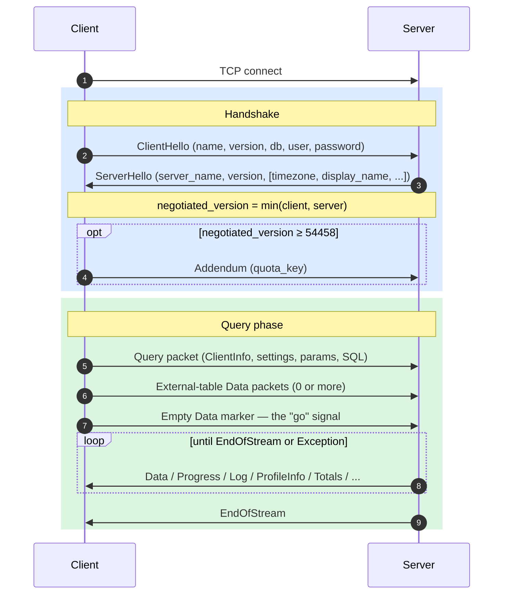
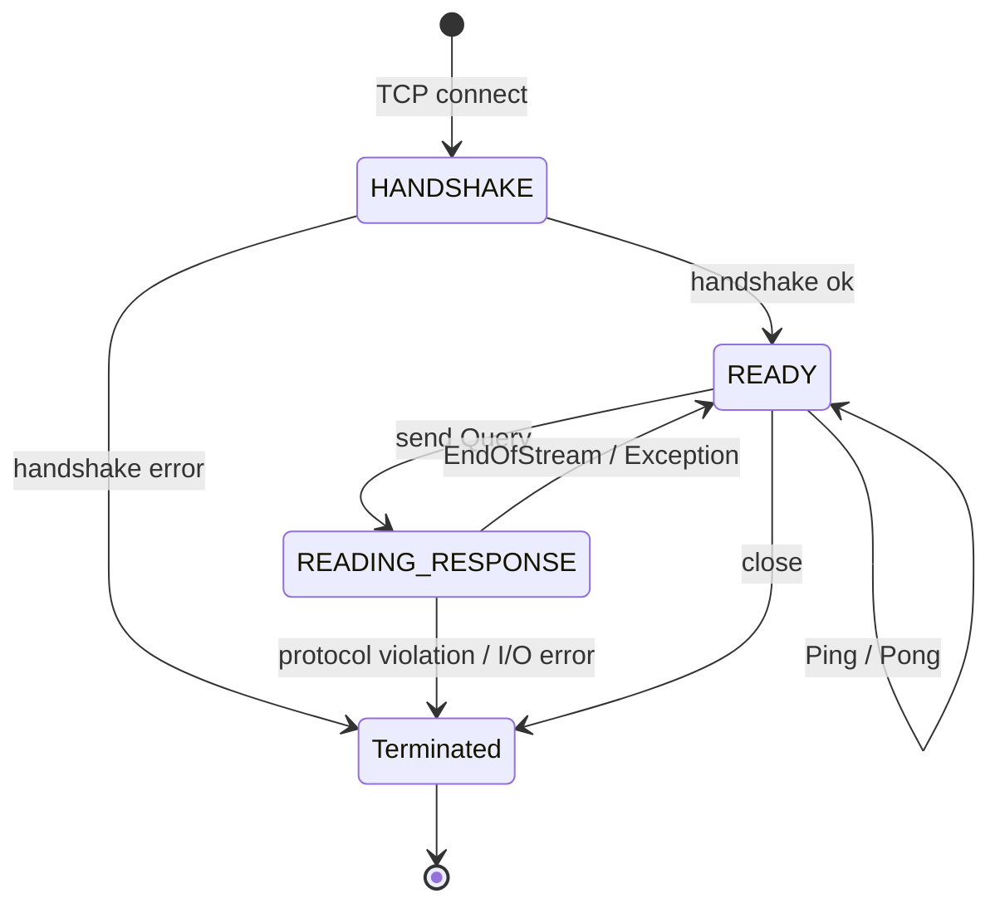
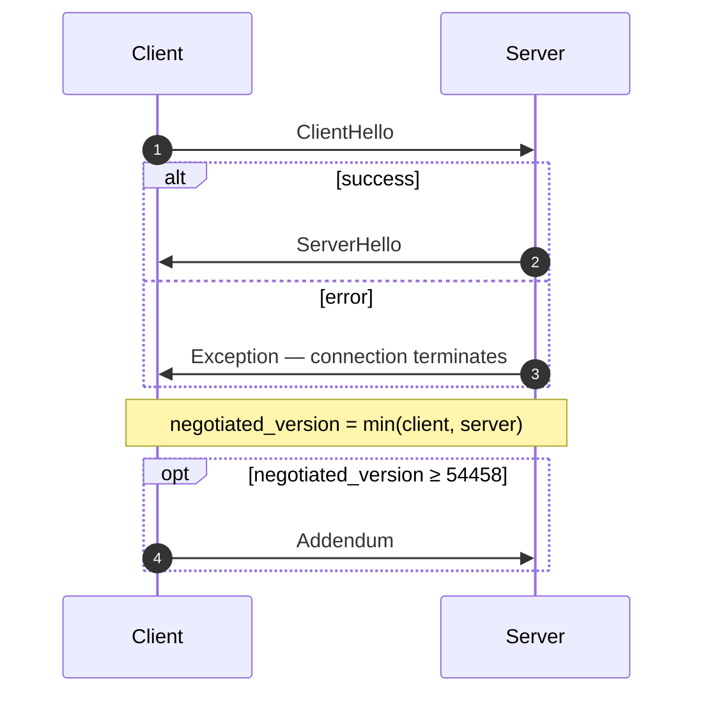
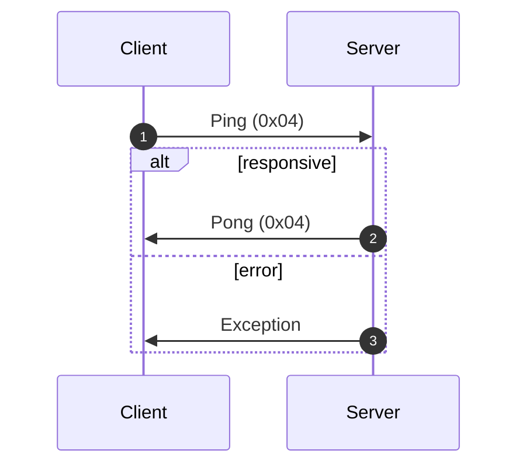
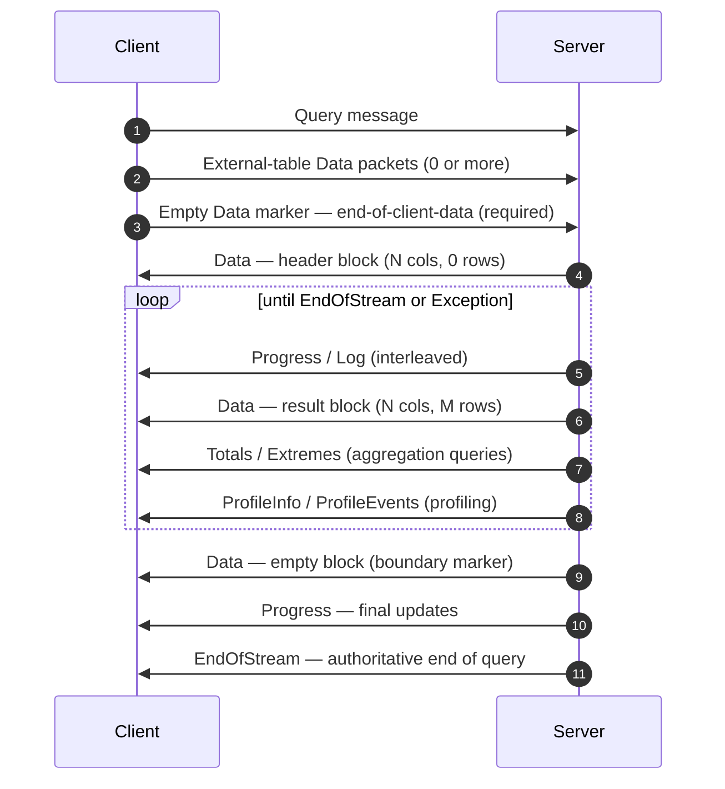
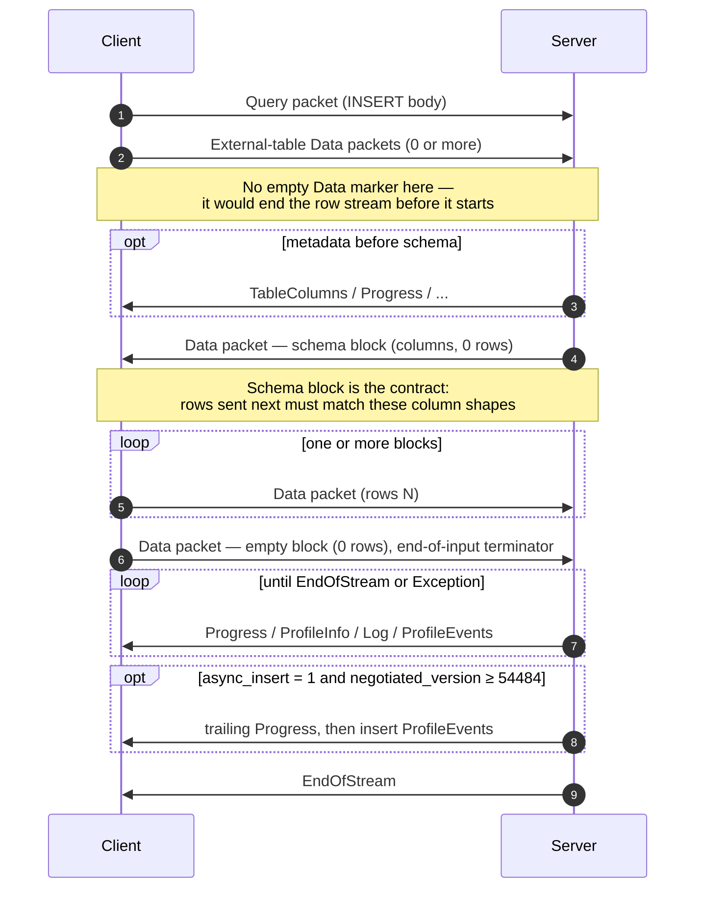
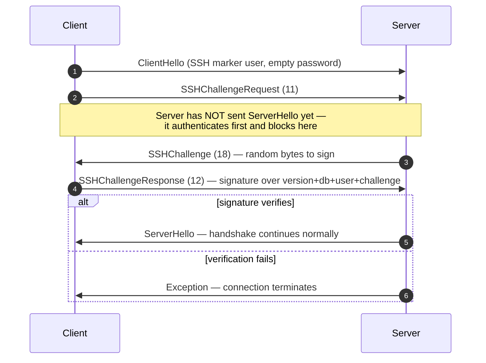

O protocolo nativo é o protocolo binário orientado à conexão que clientes e servidores ClickHouse usam via TCP. Ele transporta consultas SQL, dados de resultado, payloads de `INSERT`, telemetria de execução e sinais de erro. É o protocolo usado pelo cliente de linha de comando, pelo driver em C++ e pela maioria dos drivers nativos de terceiros.

Esta página aborda o protocolo em si: enquadramento de pacotes, a máquina de estados da conexão, negociação de versão e o corpo de toda mensagem que não seja `Block`. Os bytes dentro dos pacotes da família `Data` (o `Block`, suas colunas e as codificações por tipo) são uma preocupação separada, documentada na especificação [Native Format](/pt-BR/interfaces/specs/NativeFormat).

:::note Especificação complementar
Esta página é uma das duas partes de um conjunto e é publicada junto com a especificação complementar [Native Format](/pt-BR/interfaces/specs/NativeFormat). As duas especificações dividem o trabalho com clareza: esta página cobre a camada de pacotes e transporte; a especificação Native Format cobre os bytes dentro dos pacotes da família `Data`.
:::

Algumas propriedades valem para todo o protocolo. O protocolo é binário e posicional: não há tags de campo, exceto dentro de `BlockInfo`, portanto um único byte fora do lugar dessincroniza tudo o que vem a seguir. Ele mantém estado, e cada conexão TCP processa uma consulta por vez — não há multiplexing. Inteiros de largura fixa usam little-endian.

<div id="overview">
  ## Visão geral
</div>

| Propriedade       | Valor                                                                           |
| ----------------- | ------------------------------------------------------------------------------- |
| Transporte        | TCP, opcionalmente encapsulado em TLS                                           |
| Ordem de bytes    | Little-endian para inteiros de largura fixa                                     |
| Codificação       | Binária e posicional (sem marcadores de campo, exceto em `BlockInfo`)           |
| Modelo de conexão | Com manutenção de estado, uma consulta por vez, sem multiplexação               |
| Versionamento     | Negociado durante o handshake; recursos específicos dependem da versão          |
| Formato de dados  | O [Native Format](/pt-BR/interfaces/specs/NativeFormat) para todos os dados tabulares |

Cada mensagem na wire começa com um código de tipo de pacote `VarUInt`, seguido por um corpo cujo formato depende desse código e da versão negociada do protocolo.

Uma conexão passa por três fases — um handshake único, depois qualquer quantidade de trocas `Ping` ou `Query` e, por fim, o encerramento:



O protocolo TCP nativo sempre transporta dados tabulares no formato Native, independentemente de qualquer cláusula `FORMAT` no SQL. Reformatar para `RowBinary`, `CSV`, `JSON` e assim por diante é responsabilidade do cliente, depois que ele decodifica os blocos Native. (A interface HTTP segue um caminho de código diferente e *de fato* respeita a cláusula `FORMAT`; HTTP está fora do escopo aqui.)

<div id="security">
  ## Segurança
</div>

<div id="transport-security">
  ### Segurança de transporte (TLS)
</div>

O TLS opera na camada de transporte, abaixo do protocolo. Quando está habilitado, todo o tráfego TCP é criptografado, e as mensagens do protocolo são idênticas byte a byte, com ou sem TLS.

<div id="authentication">
  ### Autenticação
</div>

A autenticação acontece durante o handshake, na mensagem [`ClientHello`](#clienthello). Os campos `user` e `password` são transmitidos como strings em texto simples, portanto a criptografia no nível de transporte (TLS) é a responsável por proteger as credenciais em trânsito.

A autenticação SSH challenge-response está disponível a partir da versão 54466 do protocolo — consulte [autenticação SSH challenge-response](#ssh-authentication).

<div id="inter-server-secret">
  ### Segredo entre servidores
</div>

Para a execução distribuída de consultas, os servidores se autenticam mutuamente comprovando que conhecem um segredo compartilhado — sem expor o segredo no wire. Cada Query carrega um `auth_hash` SHA-256 de 32 bytes no campo 4 de [`Query`](#query), calculado com base em um salt, um nonce, o segredo configurado e a consulta, que o servidor de destino recalcula e compara. Isso é controlado pela funcionalidade `INTERSERVER_SECRET` (v54441). Clientes externos sempre enviam uma string vazia nesse campo. Consulte [Autenticação entre servidores](#inter-server-authentication).

<div id="versioning-and-feature-gates">
  ## Versionamento e feature gates
</div>

<div id="version-negotiation">
  ### Negociação de versão
</div>

Tanto o cliente quanto o servidor declaram, durante o handshake, a versão máxima do protocolo que suportam. A **versão negociada** é a menor das duas:

```text
negotiated_version = min(client_version, server_version)
```

Cada mensagem depois disso usa a versão negociada para decidir quais campos estão presentes no wire.

<div id="feature-gates">
  ### Feature gates
</div>

Uma funcionalidade é identificada pela versão do protocolo que a introduziu e fica **ativa** quando a versão negociada é maior ou igual a esse número.

:::warning
Quando uma funcionalidade está ativa, seus campos **devem** estar presentes na transmissão. O protocolo é estritamente posicional, portanto omitir um campo condicionado por feature gate corrompe o fluxo de bytes de todos os campos seguintes.
:::

<div id="feature-table">
  ### Tabela de funcionalidades
</div>

| Funcionalidade                                          | Versão | Afeta                            | Impacto no wire                                                                                                                                                                                                                                                                                                                                                                                                                                                                                                                                                                                                                                                                                                                                                                            |
| ------------------------------------------------------- | ------ | -------------------------------- | ------------------------------------------------------------------------------------------------------------------------------------------------------------------------------------------------------------------------------------------------------------------------------------------------------------------------------------------------------------------------------------------------------------------------------------------------------------------------------------------------------------------------------------------------------------------------------------------------------------------------------------------------------------------------------------------------------------------------------------------------------------------------------------------ |
| BLOCK&#95;INFO                                          | all    | Block                            | Adiciona o prefixo BlockInfo (`is_overflows`, `bucket_number`) a cada Block.                                                                                                                                                                                                                                                                                                                                                                                                                                                                                                                                                                                                                                                                                                               |
| CLIENT&#95;INFO                                         | 54032  | Query                            | Adiciona o bloco ClientInfo ao corpo de Query.                                                                                                                                                                                                                                                                                                                                                                                                                                                                                                                                                                                                                                                                                                                                             |
| TIMEZONE                                                | 54058  | ServerHello                      | Adiciona o campo `timezone` a ServerHello.                                                                                                                                                                                                                                                                                                                                                                                                                                                                                                                                                                                                                                                                                                                                                 |
| QUOTA&#95;KEY&#95;IN&#95;CLIENT&#95;INFO                | 54060  | ClientInfo                       | Adiciona o campo `quota_key` a ClientInfo.                                                                                                                                                                                                                                                                                                                                                                                                                                                                                                                                                                                                                                                                                                                                                 |
| DISPLAY&#95;NAME                                        | 54372  | ServerHello                      | Adiciona o campo `display_name` a ServerHello.                                                                                                                                                                                                                                                                                                                                                                                                                                                                                                                                                                                                                                                                                                                                             |
| VERSION&#95;PATCH                                       | 54401  | ServerHello, ClientInfo          | Adiciona o campo `version_patch` a ambos.                                                                                                                                                                                                                                                                                                                                                                                                                                                                                                                                                                                                                                                                                                                                                  |
| SERVER&#95;LOGS                                         | 54406  | Log                              | O servidor emite pacotes Log quando `send_logs_level` está definido.                                                                                                                                                                                                                                                                                                                                                                                                                                                                                                                                                                                                                                                                                                                       |
| COLUMN&#95;DEFAULTS&#95;METADATA                        | 54410  | TableColumns                     | O servidor pode enviar o pacote [`TableColumns`](#tablecolumns) (tipo 11) com metadados de valores padrão de colunas antes do bloco de esquema de INSERT/entrada. Enviado somente quando a versão negociada ≥ 54410 **e** `input_format_defaults_for_omitted_fields` está habilitado. Abaixo dessa versão, o pacote nunca é enviado; os clientes não devem esperar por ele.                                                                                                                                                                                                                                                                                                                                                                                                                |
| WRITE&#95;CLIENT&#95;INFO                               | 54420  | Progress                         | Adiciona `wrote_rows` e `wrote_bytes` a Progress. (Apesar do nome, isso **não** controla o bloco ClientInfo — isso é feito por `CLIENT_INFO` (v54032).)                                                                                                                                                                                                                                                                                                                                                                                                                                                                                                                                                                                                                                    |
| SETTINGS&#95;SERIALIZED&#95;AS&#95;STRINGS              | 54429  | Query (codificação de settings)  | Altera **como** a lista de settings, sempre presente, é codificada; **não** controla se os settings são enviados. v54429+ grava cada setting como `(name, flags, value-as-string)`; peers mais antigos gravam `(name, type-specific-binary-value)` sem flags. Veja [Setting](#setting).                                                                                                                                                                                                                                                                                                                                                                                                                                                                                                    |
| INTERSERVER&#95;SECRET                                  | 54441  | Query                            | Adiciona o campo inter-server `auth_hash` a Query — um SHA-256 com salt sobre o Secret do cluster, não o Secret bruto. Clientes externos enviam uma string vazia. Veja [Inter-server authentication](#inter-server-authentication).                                                                                                                                                                                                                                                                                                                                                                                                                                                                                                                                                        |
| OPEN&#95;TELEMETRY                                      | 54442  | ClientInfo                       | Adiciona o contexto de trace do OpenTelemetry a ClientInfo.                                                                                                                                                                                                                                                                                                                                                                                                                                                                                                                                                                                                                                                                                                                                |
| DISTRIBUTED&#95;DEPTH                                   | 54448  | ClientInfo                       | Adiciona o campo `distributed_depth` a ClientInfo.                                                                                                                                                                                                                                                                                                                                                                                                                                                                                                                                                                                                                                                                                                                                         |
| INITIAL&#95;QUERY&#95;START&#95;TIME                    | 54449  | ClientInfo                       | Adiciona o campo `initial_time` (Int64, largura fixa).                                                                                                                                                                                                                                                                                                                                                                                                                                                                                                                                                                                                                                                                                                                                     |
| PROFILE&#95;EVENTS                                      | 54451  | ProfileEvents                    | O servidor emite pacotes ProfileEvents durante a execução da consulta.                                                                                                                                                                                                                                                                                                                                                                                                                                                                                                                                                                                                                                                                                                                     |
| PARALLEL&#95;REPLICAS                                   | 54453  | ClientInfo                       | Adiciona campos de coordenação de réplicas paralelas a ClientInfo.                                                                                                                                                                                                                                                                                                                                                                                                                                                                                                                                                                                                                                                                                                                         |
| CUSTOM&#95;SERIALIZATION                                | 54454  | Block (Column)                   | Adiciona o byte `has_custom_serialization` após a string de tipo de cada coluna.                                                                                                                                                                                                                                                                                                                                                                                                                                                                                                                                                                                                                                                                                                           |
| ADDENDUM                                                | 54458  | Handshake                        | O cliente envia um addendum (`quota_key`) após a troca de handshake.                                                                                                                                                                                                                                                                                                                                                                                                                                                                                                                                                                                                                                                                                                                       |
| PARAMETERS                                              | 54459  | Query                            | Adiciona a lista de parâmetros ao corpo de Query.                                                                                                                                                                                                                                                                                                                                                                                                                                                                                                                                                                                                                                                                                                                                          |
| SERVER&#95;QUERY&#95;TIME&#95;IN&#95;PROGRESS           | 54460  | Progress                         | Adiciona o campo `elapsed_ns` a Progress.                                                                                                                                                                                                                                                                                                                                                                                                                                                                                                                                                                                                                                                                                                                                                  |
| PASSWORD&#95;COMPLEXITY&#95;RULES                       | 54461  | ServerHello                      | Adiciona uma lista de padrões regex de política de senha e mensagens legíveis por pessoas a ServerHello.                                                                                                                                                                                                                                                                                                                                                                                                                                                                                                                                                                                                                                                                                   |
| INTERSERVER&#95;SECRET&#95;V2                           | 54462  | ServerHello                      | Adiciona um nonce `UInt64` de 8 bytes a ServerHello. Usado para assinatura de consultas inter-server; clientes externos o decodificam e ignoram.                                                                                                                                                                                                                                                                                                                                                                                                                                                                                                                                                                                                                                           |
| TOTAL&#95;BYTES&#95;IN&#95;PROGRESS                     | 54463  | Progress                         | Adiciona o campo `total_bytes_to_read` (VarUInt) a Progress, entre `total_rows` e `wrote_rows`.                                                                                                                                                                                                                                                                                                                                                                                                                                                                                                                                                                                                                                                                                            |
| TIMEZONE&#95;UPDATES                                    | 54464  | TimezoneUpdate                   | Adiciona o pacote de servidor `TimezoneUpdate` (tipo 17). Corpo: um único `String` que carrega a session timezone. Enviado somente pelo inicializador da table function `input`, logo após o bloco de esquema de entrada, para que o cliente interprete as linhas que envia com a `session_timezone` do servidor. Veja [TimezoneUpdate](#timezoneupdate).                                                                                                                                                                                                                                                                                                                                                                                                                                  |
| SPARSE&#95;SERIALIZATION                                | 54465  | Block (Column)                   | O servidor pode definir `has_custom_serialization = 1` e emitir uma coluna codificada de forma esparsa. Formato wire: kind de 1 byte (0x01 = SPARSE), seguido por um stream de offsets VarUInt terminado por EOG, e então os valores não padrão codificados densamente no tipo interno. Veja [kind&#95;stack and sparse encoding](/pt-BR/interfaces/specs/NativeFormat#kind-stack-and-sparse-encoding).                                                                                                                                                                                                                                                                                                                                                                                          |
| SSH&#95;AUTHENTICATION                                  | 54466  | Auth flow                        | Adiciona autenticação challenge-response por SSH. Opt-in: o cliente envia um `user` na forma `" SSH KEY AUTHENTICATION " + <real_user>` com senha vazia para acioná-la. Veja [SSH challenge-response authentication](#ssh-authentication).                                                                                                                                                                                                                                                                                                                                                                                                                                                                                                                                                 |
| TABLE&#95;READ&#95;ONLY&#95;CHECK                       | 54467  | TablesStatusResponse             | Adiciona uma flag `is_readonly` à linha de cada table em TablesStatusResponse. Clientes externos que não emitem `TablesStatusRequest` não veem nenhuma alteração no wire.                                                                                                                                                                                                                                                                                                                                                                                                                                                                                                                                                                                                                  |
| SYSTEM&#95;KEYWORDS&#95;TABLE                           | 54468  | system tables                    | O servidor preenche `system.keywords` para que o `clickhouse-client` canônico possa autocompletar palavras-chave. Nenhuma alteração no wire do protocolo nativo.                                                                                                                                                                                                                                                                                                                                                                                                                                                                                                                                                                                                                           |
| ROWS&#95;BEFORE&#95;AGGREGATION                         | 54469  | ProfileInfo                      | Adiciona `applied_aggregation` (Bool) e `rows_before_aggregation` (VarUInt) a ProfileInfo, nessa ordem, no final.                                                                                                                                                                                                                                                                                                                                                                                                                                                                                                                                                                                                                                                                          |
| CHUNKED&#95;PROTOCOL                                    | 54470  | Connection framing               | O enquadramento por fragmentos por pacote encapsula cada corpo de pacote. Negociado em Addendum. ServerHello carrega a preferência do servidor para cada direção; Addendum carrega a escolha final do cliente. Veja [chunked framing](#chunked-framing).                                                                                                                                                                                                                                                                                                                                                                                                                                                                                                                                   |
| VERSIONED&#95;PARALLEL&#95;REPLICAS&#95;PROTOCOL        | 54471  | ServerHello, Addendum            | Ambos os lados trocam uma versão `VarUInt` do protocolo de coordenação de réplicas paralelas. O campo de ServerHello fica **imediatamente após `protocol_version`** (antes de `timezone`). O campo de Addendum é acrescentado após as strings do protocolo em chunks. Valor atual: `8` (`DBMS_PARALLEL_REPLICAS_PROTOCOL_VERSION`). A versão `8` adiciona [`MergeTreeAllRangesAnnouncementResponse`](#mergetreeallrangesannouncementresponse) (pacote de cliente `14`): quando a versão negociada de réplicas paralelas é `≥ 8`, o iniciador responde a cada announcement de seguidor em modo diferente de `Default` com a lista autoritativa de parts desse stream, e o seguidor espera por ela antes de emitir solicitações de leitura. Abaixo de `8`, o announcement é fire-and-forget. |
| INTERSERVER&#95;EXTERNALLY&#95;GRANTED&#95;ROLES        | 54472  | Query                            | Adiciona um campo `String external_roles` ao corpo de Query, entre o terminador de settings e o hash do segredo interserver. Clientes externos enviam uma lista de roles vazia (um único byte `0x00`, isto é, VarUInt 0 dentro de um envelope String).                                                                                                                                                                                                                                                                                                                                                                                                                                                                                                                                     |
| V2&#95;DYNAMIC&#95;AND&#95;JSON&#95;SERIALIZATION       | 54473  | Column body                      | O servidor pode emitir serialização V2 para tipos de coluna `Dynamic` e `JSON` — isso determina qual versão de `state_prefix` eles usam. Veja [versioned types](/pt-BR/interfaces/specs/NativeFormat#versioned-types).                                                                                                                                                                                                                                                                                                                                                                                                                                                                                                                                                                           |
| SERVER&#95;SETTINGS                                     | 54474  | ServerHello                      | O servidor transmite suas settings não padrão como uma lista no final de ServerHello, após `nonce`. Formato: triplas `(key, flags, value)` terminadas por uma chave vazia — igual à lista de settings do pacote Query.                                                                                                                                                                                                                                                                                                                                                                                                                                                                                                                                                                     |
| QUERY&#95;AND&#95;LINE&#95;NUMBERS                      | 54475  | ClientInfo                       | Adiciona `script_query_number` (VarUInt) e `script_line_number` (VarUInt) ao final de ClientInfo. Usado pelo clickhouse-client para atribuição de erros em scripts com múltiplas instruções; clientes externos enviam `0, 0`.                                                                                                                                                                                                                                                                                                                                                                                                                                                                                                                                                              |
| JWT&#95;IN&#95;INTERSERVER                              | 54476  | ClientInfo                       | Adiciona um indicador UInt8 de presença de JWT + `String jwt` opcional ao final de ClientInfo. Clientes externos (sem JWT) enviam o byte `0x00`. (Escrito como `DBMS_MIN_REVISON_WITH_JWT_IN_INTERSERVER` em C++ — observe o erro de digitação no nome da constante.)                                                                                                                                                                                                                                                                                                                                                                                                                                                                                                                      |
| QUERY&#95;PLAN&#95;SERIALIZATION                        | 54477  | ServerHello, QueryPlan packet    | ServerHello acrescenta `VarUInt query_plan_serialization_version` após as settings do servidor. Também introduz `ClientPacket::QueryPlan` (código `13`) para entrega interserver de planos de consulta pré-construídos — clientes externos nunca enviam.                                                                                                                                                                                                                                                                                                                                                                                                                                                                                                                                   |
| PARALLEL&#95;BLOCK&#95;MARSHALLING                      | 54478  | Block (Column)                   | O servidor pode encapsular colunas em `ColumnBLOB` (comprimido inline) para processamento paralelo. Isso depende de a consulta ter compressão habilitada E `rows > 1`; caso contrário, aplica-se o formato wire normal da coluna. Clientes que nunca habilitam compressão em pacotes Query de saída não veem nenhuma mudança no wire.                                                                                                                                                                                                                                                                                                                                                                                                                                                      |
| VERSIONED&#95;CLUSTER&#95;FUNCTION&#95;PROTOCOL         | 54479  | ServerHello                      | Adiciona `VarUInt cluster_function_protocol_version` ao final de ServerHello. Usado para funções de tabela `*Cluster` (`s3Cluster`, etc.). Valor atual: `8` (`DBMS_CLUSTER_PROCESSING_PROTOCOL_VERSION`); a versão `7` é reservada para um recurso de repositório privado (compactação Iceberg), e a `8` adiciona um `read_source_index` opcional à carga útil interserver de tarefa de leitura do cluster (o corpo de `ReadTaskResponse`, que continua não especificado aqui — veja abaixo). Clientes externos decodificam e ignoram.                                                                                                                                                                                                                                                     |
| OUT&#95;OF&#95;ORDER&#95;BUCKETS&#95;IN&#95;AGGREGATION | 54480  | BlockInfo                        | Adiciona o campo 3 (`out_of_order_buckets: Vec<Int32>`) ao stream com tags de campo de BlockInfo. Decodificado como `[VarUInt count][Int32]*count`. Clientes externos não emitem isso por conta própria; o decodificador lê qualquer lista não vazia que o servidor enviar.                                                                                                                                                                                                                                                                                                                                                                                                                                                                                                                |
| COMPRESSED&#95;LOGS&#95;PROFILE&#95;EVENTS&#95;COLUMNS  | 54481  | Log, ProfileEvents, TableColumns | O servidor pode encapsular os corpos dos pacotes [`Log`](#log), [`ProfileEvents`](#profileevents) e [`TableColumns`](#tablecolumns) no [compression frame](/pt-BR/interfaces/specs/NativeFormat#compression-frame). Nesta versão, os corpos dos três trafegam pelo mesmo caminho de saída opcionalmente comprimido, que só se torna um compression frame de fato quando a consulta tem `compression = true`. Clientes que nunca habilitam compressão em pacotes Query de saída não veem nenhuma mudança no wire.                                                                                                                                                                                                                                                                                 |
| REPLICATED&#95;SERIALIZATION                            | 54482  | Block (Column)                   | O servidor pode emitir colunas com kind&#95;stack `0x04 = REPLICATED` — uma forma compacta no estilo dicionário para valores repetidos — veja [kind&#95;stack and sparse encoding](/pt-BR/interfaces/specs/NativeFormat#kind-stack-and-sparse-encoding). Abaixo desta versão, o writer expandia essas colunas antes de enviá-las. Decodificado via busca por índice (`elements[indexes[i]]` por linha); tipos folha mais internos `Nullable`/`Array`/`Tuple`/`Map`/`Nested`/`LowCardinality` são suportados.                                                                                                                                                                                                                                                                                     |
| NULLABLE&#95;SPARSE&#95;SERIALIZATION                   | 54483  | Block (Column)                   | Combina serialização esparsa com `Nullable(T)`. Abaixo desta versão, o writer expandia sparse para colunas Nullable antes de enviar; em v54483+, os dados no wire são sparse-over-Nullable. Veja [kind&#95;stack and sparse encoding](/pt-BR/interfaces/specs/NativeFormat#kind-stack-and-sparse-encoding).                                                                                                                                                                                                                                                                                                                                                                                                                                                                                      |
| PROGRESS&#95;IN&#95;ASYNC&#95;INSERT                    | 54484  | Progress (INSERT)                | Em um INSERT **assíncrono** (`async_insert = 1`), depois que o insert é descarregado, o servidor envia um pacote [`Progress`](#progress) extra e, em seguida, o `ProfileEvents` do insert, antes de `EndOfStream`. Isso depende da versão *negociada* ≥ 54484; abaixo disso, o servidor omite esse Progress final. O formato wire de Progress permanece inalterado — apenas a emissão é nova. Na prática, o incremento carrega o tempo decorrido; os contadores de linhas gravadas são informados pelo ProfileEvents correspondente. Um cliente que já consome Progress intercalado não precisa de mudança de formato, apenas tolerar mais um pacote.                                                                                                                                      |
| CLIENT&#95;AGENT&#95;IN&#95;CLIENT&#95;INFO             | 54485  | ClientInfo                       | Adiciona uma `String` `client_agent` ao final de ClientInfo. O cliente canônico detecta automaticamente um identificador de agent a partir do ambiente (por exemplo, `claude-code`, `cursor`, `gemini-cli` ou o valor da variável `AGENT`); um cliente externo sem nada detectado envia uma string vazia. Obrigatório quando a versão negociada for ≥ 54485 — omiti-lo dessincroniza o restante do pacote Query.                                                                                                                                                                                                                                                                                                                                                                           |
| INTERNAL&#95;QUERY&#95;FLAG                             | 54486  | ClientInfo                       | Adiciona um `UInt8` `is_internal` ao final de ClientInfo. `1` para uma consulta interna do servidor (não emitida por usuário), propagada para consultas remotas para que suas linhas em `system.query_log` sejam marcadas como internas; clientes externos enviam `0`. Obrigatório quando a versão negociada for ≥ 54486 — omiti-lo dessincroniza o restante do pacote Query.                                                                                                                                                                                                                                                                                                                                                                                                              |

<div id="packet-envelope">
  ## Envelope do pacote
</div>

Todas as mensagens no wire compartilham a mesma estrutura externa, em ambas as direções:

```text
[VarUInt: packet_type_code]    always encoded as VarUInt
[message body]                 format depends on packet_type_code
```

As tabelas completas de tipos de pacote estão na [referência de tipos de pacote](#packet-type-reference).

O tipo de pacote é um `VarUInt`, não um byte de largura fixa. Para valores abaixo de 128, um `VarUInt` produz o mesmo byte único, mas as implementações devem usar a codificação em `VarUInt` para continuarem compatíveis caso tipos de pacote futuros atinjam 128 ou mais.

A [referência de mensagens](#message-reference) documenta apenas o **corpo** de cada pacote — os bytes após o código do tipo de pacote. A numeração dos campos começa em 1, com o primeiro campo do corpo.

<div id="chunked-framing">
  ### Enquadramento por fragmentos (v54470+)
</div>

Quando o recurso `CHUNKED_PROTOCOL` é **negociado** (consulte [o handshake](#handshake-phase)), cada pacote no wire é encapsulado com enquadramento por fragmentos. Esse encapsulamento é **por direção**: cliente→servidor e servidor→cliente são negociados separadamente e podem acabar em modos diferentes (com fragmentos versus sem enquadramento).

Layout no wire por pacote:

```text
<chunk>...   one or more chunks; their payloads concatenated form the whole packet
[u32 LE = 0] zero-size terminator marking end of packet
```

layout no wire por fragmento:

```text
[u32 LE: chunk_size]   chunk_size in [1, UINT32_MAX]
[chunk_size bytes]     packet bytes (see note below)
```

O tipo de pacote `VarUInt` está **dentro** do fluxo em fragmentos: ele é o primeiro byte do payload do pacote (o primeiro byte do primeiro fragmento), não um byte separado enviado antes do framing. O payload em fragmentos de cada pacote é o `[VarUInt packet_type_code][corpo da mensagem]` completo do [envelope do pacote](#packet-envelope). Um client que deixa o tipo de pacote fora do fluxo em fragmentos faz o par ler esse byte de tipo como o primeiro byte do tamanho do fragmento `u32`, dessincronizando a conexão.

Um único pacote pode ser dividido em vários fragmentos se o buffer de escrita encher no meio do pacote; a divisão pode ocorrer em qualquer ponto, inclusive dentro do `VarUInt` do tipo de pacote. O leitor concatena os payloads dos fragmentos e trata o zero final de 4 bytes como um delimitador de pacote transparente — ele o consome, mas não o expõe ao que estiver lendo os corpos dos pacotes.

Pacotes sem corpo ainda são encapsulados: um pacote de um único byte, como `Ping` ou `Pong`, torna-se `[u32 size = 1][0x04][u32 0]` depois que a fragmentação é negociada. Qualquer descrição de “single byte on the wire” em outra parte desta página se refere à forma anterior à fragmentação.

**Negociação.** `ServerHello` e `Addendum` carregam, cada um, dois campos `String`, um por direção, com valores extraídos de `{"chunked", "notchunked", "chunked_optional", "notchunked_optional"}`:

* `chunked` / `notchunked` são estritos: esse lado exige exatamente esse modo.
* As variantes `_optional` são flexíveis: aceitam qualquer modo que o outro lado escolher.

O valor acordado para cada direção é calculado em pares:

| Preferência do servidor   | Preferência do client     | Acordado                                             |
| ------------------------- | ------------------------- | ---------------------------------------------------- |
| `*_optional`              | qualquer valor            | seguir o CLIENT (seu `starts_with("chunked")`)       |
| qualquer valor            | `*_optional`              | seguir o SERVER                                      |
| `chunked` estrito         | `chunked` estrito         | `chunked`                                            |
| `notchunked` estrito      | `notchunked` estrito      | `notchunked`                                         |
| incompatibilidade estrita | incompatibilidade estrita | **erro de protocolo** — a conexão DEVE ser encerrada |

No lado do client, a preferência de ENVIO do client é negociada com a preferência de RECEBIMENTO do servidor, e vice-versa.

**Tempo.** As strings de negociação trafegam na wire sem framing: `ClientHello` → `ServerHello` (preferências do servidor) → `Addendum` (valores negociados do client). A mudança de framing se aplica a todos os bytes enviados *após* o `Addendum` ser enviado. O próprio `Addendum`, o `ClientHello` e o `ServerHello` estão sempre sem framing.

<div id="connection-lifecycle">
  ## Ciclo de vida da conexão
</div>

A qualquer momento, uma conexão está em exatamente um de quatro estados: `HANDSHAKE`, `READY`, `READING_RESPONSE` ou encerrada. Como o protocolo não faz multiplexação, um cliente que envia uma nova requisição antes de consumir totalmente a resposta anterior intercala bytes na transmissão e corrompe o fluxo.

<div id="states">
  ### Estados
</div>



O caminho principal segue em linha reta — `HANDSHAKE → READY → READING_RESPONSE → READY` — com o loop de `Ping`/`Pong` e toda aresta de falha convergindo para o único destino `Terminated`.

| State              | Description                                                                                                                                                                                                                                      |
| ------------------ | ------------------------------------------------------------------------------------------------------------------------------------------------------------------------------------------------------------------------------------------------ |
| `HANDSHAKE`        | Estado inicial após a abertura da conexão TCP. Somente mensagens de [handshake](#handshake-phase) são válidas. Transita para `READY` em caso de sucesso ou é encerrado em caso de falha.                                                         |
| `READY`            | Ocioso. O cliente pode enviar [Ping](#ping-phase), [consulta](#query-phase) ou encerrar. A conexão pode permanecer em `READY` indefinidamente (sujeita a `idle_connection_timeout`; consulte [limites de conexão](#connection-limits)).          |
| `READING_RESPONSE` | Estado acessado quando o cliente envia uma consulta. O cliente deve consumir completamente o fluxo de resposta do servidor antes de retornar a `READY`. O único pacote cliente→servidor permitido aqui é Cancel (não especificado nesta página). |
| Terminated         | Não pode mais ser usado. O cliente deve abrir uma nova conexão TCP e reiniciar o handshake.                                                                                                                                                      |

<div id="handshake-phase">
  ### Fase de handshake
</div>

Autentica e negocia a versão do protocolo. Ocorre exatamente uma vez por conexão, antes de qualquer outra coisa.

A conexão TCP acabou de ser aberta e nenhuma mensagem foi trocada. O fluxo:



1. O cliente envia [`ClientHello`](#clienthello) com a maior versão de protocolo que ele suporta.

2. O cliente lê a resposta e processa conforme o tipo de pacote:

   | Tipo de pacote  | Ação                                                                                                                            |
   | --------------- | ------------------------------------------------------------------------------------------------------------------------------- |
   | `Hello` (0)     | Decodifique [`ServerHello`](#serverhello). Calcule `negotiated_version = min(client_ver, server_ver)`. Prossiga para o passo 3. |
   | `Exception` (2) | Decodifique [`Exception`](#exception). Retorne o erro e encerre a conexão.                                                      |
   | qualquer outro  | Violação de protocolo. Encerre a conexão.                                                                                       |

3. Se `negotiated_version ≥ 54458` (o recurso `ADDENDUM`), o cliente envia um [`Addendum`](#addendum). Essa decisão se baseia na versão **negociada**, e não na versão declarada pelo cliente.

Em caso de sucesso, a conexão passa para `READY`; em caso de erro, ela é encerrada.

<div id="ping-phase">
  ### Fase de Ping
</div>

Uma verificação de liveness no nível da aplicação, independente do keepalive do TCP. Um round-trip de Ping/Pong bem-sucedido confirma que a conexão TCP está ativa em ambas as direções e que o servidor está respondendo. Ping é sem estado e não está correlacionado a nenhuma consulta, portanto vários Pings sequenciais são independentes.

Partindo de `READY`, o fluxo é:



1. O cliente envia [`Ping`](#ping).
2. O cliente lê a resposta:

   | Tipo de pacote  | Ação                                                       |
   | --------------- | ---------------------------------------------------------- |
   | `Pong` (4)      | Conexão ativa confirmada. Volte para `READY`.              |
   | `Exception` (2) | Decodifique [`Exception`](#exception) e retorne como erro. |
   | qualquer outro  | Violação de protocolo.                                     |

<div id="query-phase">
  ### Fase de consulta
</div>

O cliente envia uma instrução SQL; o servidor transmite os blocos de resultado e a telemetria de execução em fluxo. A resposta é uma sequência de pacotes encerrada por exatamente um `EndOfStream` ou `Exception`.

Partindo de `READY`, o fluxo é:



Se ocorrer um erro em qualquer ponto, o servidor envia uma `Exception` em vez de `EndOfStream`, o que encerra a consulta.

1. O cliente envia [`Query`](#query) com um `query_id` exclusivo (normalmente um UUID).
2. O cliente envia quaisquer tabelas externas e, em seguida, o marcador Data vazio. O pacote Data vazio tem `table_name = ""`, `num_columns = 0`, `num_rows = 0`. O servidor não começa a executar a consulta até receber esse marcador.
3. O cliente passa para `READING_RESPONSE` e descarrega seu buffer de gravação.
4. O cliente lê os pacotes de resposta em loop, despachando por tipo:

   | Packet type          | Action                                                                                                                                                                                                   |
   | -------------------- | -------------------------------------------------------------------------------------------------------------------------------------------------------------------------------------------------------- |
   | `Data` (1)           | Decodifique o bloco. O primeiro Data é o cabeçalho do esquema; os seguintes são blocos de resultado (acumule-os); um bloco vazio é um marcador de limite. `num_rows == 0` **não** indica fim da consulta. |
   | `Progress` (3)       | Métricas de execução. Cada pacote é um **incremento** em relação ao anterior — acumule localmente.                                                                                                       |
   | `EndOfStream` (5)    | Consulta concluída. Saia do loop e retorne para `READY`.                                                                                                                                                 |
   | `ProfileInfo` (6)    | Dados de profiling pós-execução.                                                                                                                                                                         |
   | `Totals` (7)         | bloco de totais da aggregation (mesmo wire format de Data).                                                                                                                                              |
   | `Extremes` (8)       | bloco de valores mínimos/máximos (mesmo wire format de Data).                                                                                                                                            |
   | `Log` (10)           | Linha de log do servidor.                                                                                                                                                                                |
   | `TableColumns` (11)  | Metadados de valores padrão das colunas.                                                                                                                                                                 |
   | `ProfileEvents` (14) | Contadores de desempenho.                                                                                                                                                                                |
   | `Exception` (2)      | Decodifique e retorne como erro. Saia do loop e retorne para `READY`.                                                                                                                                    |
   | anything else        | Inesperado durante a fase de consulta. Encerre a conexão.                                                                                                                                                |

Em `EndOfStream` ou em uma `Exception` tratada, a conexão retorna para `READY`. Uma violação de protocolo ou erro de E/S a encerra.

:::note
O caso `num_rows == 0` costuma confundir novas implementações. Um bloco com zero linhas é um marcador de limite ou cabeçalho de esquema, não um sinal de fim de stream. Somente `EndOfStream` ou `Exception` encerra a resposta.
:::

<div id="insert-phase">
  ### Fase de INSERT
</div>

A fase de INSERT é a [fase de consulta](#query-phase) com duas trocas de mensagens adicionais. O cliente envia uma instrução `INSERT`; o servidor responde com um **bloco de esquema** que descreve a tabela de destino; o cliente envia pacotes Data com as linhas e, em seguida, o marcador Data vazio; o servidor finaliza com `EndOfStream` ou `Exception`.

Partindo de `READY`, o SQL é um `INSERT` no formato `INSERT INTO <table> [(<cols>)] VALUES` — sem o literal `VALUES (...)` inline, já que os dados das linhas fluem por meio de pacotes Data. O fluxo:



1. O cliente envia [`Query`](#query) com `body` definido como o SQL de INSERT.
2. O cliente envia quaisquer tabelas externas (raro em INSERT). Diferentemente da [fase de consulta](#query-phase), ele **não** envia aqui um marcador Data vazio. O pacote `Query` de `INSERT` é enviado com dados pendentes, então o bloco vazio de fim de dados é adiado para a etapa 5; enviá-lo antes do bloco de esquema faria o servidor interpretá-lo como o fim do fluxo de linhas, concluir o INSERT sem linhas e depois analisar o primeiro pacote de linha real como um pacote de nível superior solto.
3. O cliente consome os pacotes de metadados (TableColumns, Progress, ProfileInfo, Log, ProfileEvents) até ler o pacote Data de esquema — um bloco com 0 linhas, mas com a estrutura completa das colunas (nomes e tipos). O bloco de esquema é o contrato: as linhas que o cliente envia em seguida devem corresponder a essas definições de coluna.
4. O cliente envia bloco(s) de dados. Para cada bloco, ele grava `VarUInt(ClientPacket::Data = 2)`, depois `String("")` para o nome vazio da tabela externa e, em seguida, o bloco. Os tipos de coluna devem estar alinhados com as colunas do bloco de esquema por posição.
5. O cliente envia o terminador de fim de entrada: um pacote Data com um bloco vazio (0 colunas, 0 linhas).
6. O cliente consome o fluxo de resposta até `EndOfStream` (sucesso) ou `Exception` (falha).

**INSERT assíncrono (v54484+).** Quando a consulta inclui `async_insert = 1`, o servidor enfileira as linhas e faz o flush delas como parte de um lote. Na versão negociada ≥ 54484 (`PROGRESS_IN_ASYNC_INSERT`), assim que o flush é concluído, o servidor emite um pacote extra [`Progress`](#progress), imediatamente seguido pelos `ProfileEvents` do insert e então por `EndOfStream`. Abaixo de 54484, o servidor omite esse Progress final. O pacote é um `Progress` comum; como o servidor redefine o pipeline da consulta antes de incorporar as contagens de gravação, na prática o incremento carrega apenas o tempo decorrido, e as estatísticas de linhas e bytes gravados chegam ao cliente por meio dos `ProfileEvents` correspondentes. Um cliente que já consome Progress intercalado na etapa 6 só precisa aceitar mais um pacote.

A conexão retorna para `READY` em `EndOfStream` ou em uma `Exception` tratada. Violações de protocolo e erros de E/S a encerram.

<div id="message-reference">
  ## Referência de mensagens
</div>

Os campos são listados em wire order. A coluna `Type` usa:

* `VarUInt` — inteiro sem sinal de comprimento variável (consulte [VarUInt](/pt-BR/interfaces/specs/NativeFormat#varuint)).
* `String` — bytes com prefixo `VarUInt` (consulte [String](/pt-BR/interfaces/specs/NativeFormat#string)).
* `UInt8`, `Int32` e assim por diante — inteiros little-endian de largura fixa.
* `Bool` — um único byte, `0x00` ou `0x01`.

A coluna `Role` indica quem usa cada campo:

* **client** — definido por clientes externos.
* **inter-server** — relevante apenas para comunicação entre servidores; clientes externos gravam um valor padrão.
* **universal** — usado por ambos.

Estas tabelas documentam apenas o body de cada pacote, após o código do packet type.

<div id="clienthello">
  ### ClientHello (tipo de pacote 0)
</div>

Cliente → servidor. A primeira mensagem após a abertura da conexão TCP.

| # | Campo                | Tipo    | Papel     | Descrição                                                     |
| - | -------------------- | ------- | --------- | ------------------------------------------------------------- |
| 1 | client&#95;name      | String  | universal | Identificador do cliente (por exemplo, `"clickhouse-client"`) |
| 2 | version&#95;major    | VarUInt | universal | Versão principal do cliente                                   |
| 3 | version&#95;minor    | VarUInt | universal | Versão secundária do cliente                                  |
| 4 | protocol&#95;version | VarUInt | universal | Versão máxima do protocolo suportada pelo cliente             |
| 5 | database             | String  | universal | Nome do banco de dados padrão                                 |
| 6 | user                 | String  | universal | Nome de usuário para autenticação                             |
| 7 | password             | String  | universal | Senha (em texto simples)                                      |

<div id="serverhello">
  ### ServerHello (tipo de pacote 0)
</div>

Servidor → Cliente. A resposta a ClientHello em caso de autenticação bem-sucedida.

| #  | Campo                                          | Tipo      | Papel        | Condição                                                  | Descrição                                                                                                                                                                                                                                                                                                                                                                                                                                                                         |
| -- | ---------------------------------------------- | --------- | ------------ | --------------------------------------------------------- | --------------------------------------------------------------------------------------------------------------------------------------------------------------------------------------------------------------------------------------------------------------------------------------------------------------------------------------------------------------------------------------------------------------------------------------------------------------------------------- |
| 1  | server&#95;name                                | String    | universal    | sempre                                                    | Identificador do servidor                                                                                                                                                                                                                                                                                                                                                                                                                                                         |
| 2  | version&#95;major                              | VarUInt   | universal    | sempre                                                    | Versão principal do servidor                                                                                                                                                                                                                                                                                                                                                                                                                                                      |
| 3  | version&#95;minor                              | VarUInt   | universal    | sempre                                                    | Versão secundária do servidor                                                                                                                                                                                                                                                                                                                                                                                                                                                     |
| 4  | protocol&#95;version                           | VarUInt   | universal    | sempre                                                    | Versão do protocolo do servidor                                                                                                                                                                                                                                                                                                                                                                                                                                                   |
| 4a | parallel&#95;replicas&#95;protocol&#95;version | VarUInt   | universal    | VERSIONED&#95;PARALLEL&#95;REPLICAS&#95;PROTOCOL (v54471) | Versão do protocolo de coordination de réplicas paralelas do servidor. **Posição no wire: imediatamente após `protocol_version`**, antes de `timezone`. Atual: `8`.                                                                                                                                                                                                                                                                                                               |
| 5  | timezone                                       | String    | universal    | TIMEZONE (v54058)                                         | Fuso horário do servidor (por exemplo, `"UTC"`)                                                                                                                                                                                                                                                                                                                                                                                                                                   |
| 6  | display&#95;name                               | String    | universal    | DISPLAY&#95;NAME (v54372)                                 | Nome do servidor legível por humanos                                                                                                                                                                                                                                                                                                                                                                                                                                              |
| 7  | version&#95;patch                              | VarUInt   | universal    | VERSION&#95;PATCH (v54401)                                | Versão de patch do servidor                                                                                                                                                                                                                                                                                                                                                                                                                                                       |
| 8  | proto&#95;send&#95;chunked&#95;srv             | String    | universal    | CHUNKED&#95;PROTOCOL (v54470)                             | chunking de saída preferido do servidor. Um de `"chunked"`, `"notchunked"`, `"chunked_optional"`, `"notchunked_optional"`. Consulte [enquadramento por fragmentos](#chunked-framing). **Fica ANTES de `password_complexity_rules` no wire, embora seu controle de versão seja mais alto.**                                                                                                                                                                                        |
| 9  | proto&#95;recv&#95;chunked&#95;srv             | String    | universal    | CHUNKED&#95;PROTOCOL (v54470)                             | chunking de entrada preferido do servidor. Mesmo conjunto de valores do campo 8.                                                                                                                                                                                                                                                                                                                                                                                                  |
| 10 | password&#95;complexity&#95;rules              | Rule[]    | universal    | PASSWORD&#95;COMPLEXITY&#95;RULES (v54461)                | Política de senha do servidor. `VarUInt count` seguido por `count × Rule`. Veja abaixo.                                                                                                                                                                                                                                                                                                                                                                                           |
| 11 | nonce                                          | UInt64    | inter-server | INTERSERVER&#95;SECRET&#95;V2 (v54462)                    | Nonce aleatório LE de 8 bytes. O scheme de assinatura de consultas interserver do servidor o utiliza. Clientes externos DEVEM decodificá-lo (para manter o stream alinhado) e DEVEM ignorar o valor.                                                                                                                                                                                                                                                                              |
| 12 | server&#95;settings                            | Setting[] | universal    | SERVER&#95;SETTINGS (v54474)                              | Settings não `default` transmitidas pelo servidor. Formato: zero ou mais triplas `(String key, VarUInt flags, String value)`, terminadas por uma key vazia. Igual à [settings list do Query pacote](#setting).                                                                                                                                                                                                                                                                    |
| 13 | query&#95;plan&#95;serialization&#95;version   | VarUInt   | universal    | QUERY&#95;PLAN&#95;SERIALIZATION (v54477)                 | serialization version do plano de consulta compatível com o servidor. Clientes externos decodificam e ignoram.                                                                                                                                                                                                                                                                                                                                                                    |
| 14 | cluster&#95;function&#95;protocol&#95;version  | VarUInt   | universal    | VERSIONED&#95;CLUSTER&#95;FUNCTION&#95;PROTOCOL (v54479)  | Versão do protocolo da table function `*Cluster` do servidor. Atual: `8`. O valor controla campos aditivos no payload inter-server de tarefa de leitura de cluster (o corpo `ReadTaskResponse`, que de outra forma não é especificado); a versão `7` é reservada para um feature de repositório privado (compaction de Iceberg), e `8` adiciona um `read_source_index` opcional. Clientes externos não participam de leituras de cluster — eles decodificam e ignoram este campo. |

**Rule** — um elemento de `password_complexity_rules`:

| # | Campo   | Tipo   | Descrição                                                                  |
| - | ------- | ------ | -------------------------------------------------------------------------- |
| 1 | pattern | String | Expressão regular que uma senha compatível deve corresponder.              |
| 2 | message | String | Explicação legível por humanos exibida quando uma senha falha nesta regra. |

A lista reflete a configuração da política de senha do operator do servidor e é puramente consultiva — o servidor não aplica essas regras durante o handshake. Um cliente que expõe funcionalidade de alteração/definição de senha pode usar as regras para sinalizar erros antes de fazer o round-trip de uma senha fora de conformidade para o servidor.

:::note
Para limitar o uso de resource contra um servidor hostil ou mal configurado, limite o `count` decodificado a 256 entries e cada String `pattern` e `message` a 4096 bytes. Um `count` de `0` (sem pares subsequentes) é o caso mais comum para servidores sem política de senha configurada.
:::

<div id="addendum">
  ### Adendo (sem tipo de pacote)
</div>

Cliente → servidor, condicionado a `ADDENDUM` (v54458). Enviado imediatamente após a conclusão da troca de `handshake`. Não é um tipo de pacote distinto — os campos vão para o wire brutos, sem prefixo de byte de tipo de pacote.

| # | Campo                                          | Type    | Papel     | Condição                                                  | Descrição                                                                                                                                                                                                                                                                         |
| - | ---------------------------------------------- | ------- | --------- | --------------------------------------------------------- | --------------------------------------------------------------------------------------------------------------------------------------------------------------------------------------------------------------------------------------------------------------------------------- |
| 1 | quota&#95;key                                  | String  | universal | sempre                                                    | Chave de quota de recursos para quotas com chave no servidor. Clientes que não usam quota com chave enviam uma string vazia.                                                                                                                                                      |
| 2 | proto&#95;send&#95;chunked                     | String  | universal | CHUNKED&#95;PROTOCOL (v54470)                             | Chunking de saída negociado pelo cliente: `"chunked"` ou `"notchunked"`. Calculado com base em `proto_recv_chunked_srv` de ServerHello.                                                                                                                                           |
| 3 | proto&#95;recv&#95;chunked                     | String  | universal | CHUNKED&#95;PROTOCOL (v54470)                             | Chunking de entrada negociado pelo cliente. Calculado com base em `proto_send_chunked_srv`.                                                                                                                                                                                       |
| 4 | parallel&#95;replicas&#95;protocol&#95;version | VarUInt | universal | VERSIONED&#95;PARALLEL&#95;REPLICAS&#95;PROTOCOL (v54471) | Versão do protocolo de coordenação de réplicas paralelas suportada pelo cliente. Clientes externos que não participam de consultas distribuídas AINDA ASSIM DEVEM enviar uma versão válida (a `8` atual) para que a verificação de compatibilidade do servidor seja bem-sucedida. |

A alternância de framing com chunking se aplica *depois* que este Adendo é enviado — o próprio Adendo não usa framing.

<div id="ping">
  ### Ping (tipo de pacote 4)
</div>

Cliente → Servidor. Sem corpo — o pacote consiste em um único byte `0x04` antes do enquadramento por fragmentos; quando o chunking é negociado, o byte passa a compor o payload de um fragmento de um byte (consulte [enquadramento por fragmentos](#chunked-framing)).

<div id="pong">
  ### Pong (tipo de pacote 4)
</div>

Servidor → Cliente. Sem corpo — o pacote é um único byte `0x04` antes do enquadramento por fragmentos; quando o chunking é negociado, o byte passa a ser o payload de um fragmento de um byte (consulte [enquadramento por fragmentos](#chunked-framing)).

<div id="exception">
  ### Exception (tipo de pacote 2)
</div>

Servidor → Cliente. Enviado quando ocorre um erro no servidor durante qualquer fase.

| # | Campo                     | Tipo   | Papel     | Descrição                                                                   |
| - | ------------------------- | ------ | --------- | --------------------------------------------------------------------------- |
| 1 | code                      | Int32  | universal | Código de erro                                                              |
| 2 | name                      | String | universal | Classe da Exception (por exemplo, `"DB::Exception"`)                        |
| 3 | message                   | String | universal | Mensagem de erro legível por humanos                                        |
| 4 | stack&#95;trace           | String | universal | stack trace do servidor                                                     |
| 5 | has&#95;nested (obsoleto) | Bool   | universal | Byte de compatibilidade obsoleto. Sempre gravado como `false` pelo servidor |

<div id="query">
  ### Query (tipo de pacote 1)
</div>

Cliente → servidor.

| #  | Campo              | Tipo        | Papel        | Condição                                                  | Descrição                                                                                                                                                                                                                                                                                                                                                         |
| -- | ------------------ | ----------- | ------------ | --------------------------------------------------------- | ----------------------------------------------------------------------------------------------------------------------------------------------------------------------------------------------------------------------------------------------------------------------------------------------------------------------------------------------------------------- |
| 1  | query&#95;id       | String      | universal    | sempre                                                    | Identificador único da consulta (UUID)                                                                                                                                                                                                                                                                                                                            |
| 2  | client&#95;info    | ClientInfo  | universal    | CLIENT&#95;INFO (v54032)                                  | Veja [ClientInfo](#clientinfo)                                                                                                                                                                                                                                                                                                                                    |
| 3  | settings           | Setting[]   | universal    | sempre                                                    | Veja [Setting](#setting). **Sempre presente** (terminado por uma chave vazia); apenas a *codificação* de cada configuração depende da versão — veja a nota sobre codificação em [Setting](#setting). Um cliente não deve omitir esse campo para versões negociadas abaixo de `54429`.                                                                             |
| 3a | external&#95;roles | String      | universal    | INTERSERVER&#95;EXTERNALLY&#95;GRANTED&#95;ROLES (v54472) | Lista serializada de nomes de papéis concedidos externamente. Lista vazia = byte `0x00` (VarUInt 0) encapsulado em uma String (`[VarUInt 1][0x00]` no wire). Clientes externos sempre enviam vazio.                                                                                                                                                               |
| 4  | auth&#95;hash      | String      | inter-server | INTERSERVER&#95;SECRET (v54441)                           | Hash de autenticação entre servidores — **não** o Secret bruto do cluster. Veja [Inter-server authentication](#inter-server-authentication) abaixo. Clientes externos (e qualquer `InitialQuery`) enviam uma string vazia.                                                                                                                                        |
| 5  | stage              | VarUInt     | universal    | sempre                                                    | Estágio de processamento da consulta. `0` = FetchColumns, `1` = WithMergeableState, `2` = Complete, `3` = WithMergeableStateAfterAggregation, `4` = WithMergeableStateAfterAggregationAndLimit, `7` = QueryPlan. Os valores `3`/`4` aparecem em consultas distribuídas; `7` acompanha um plano de consulta serializado. Clientes externos normalmente enviam `2`. |
| 6  | compression        | VarUInt     | universal    | sempre                                                    | 0 = desabilitado, 1 = habilitado                                                                                                                                                                                                                                                                                                                                  |
| 7  | query&#95;body     | String      | universal    | sempre                                                    | Texto SQL                                                                                                                                                                                                                                                                                                                                                         |
| 8  | parameters         | Parameter[] | client       | PARAMETERS (v54459)                                       | Veja [Parameter](#parameter). Terminado por chave vazia.                                                                                                                                                                                                                                                                                                          |

<div id="clientinfo">
  ### ClientInfo (embutido em Query)
</div>

Cliente → Servidor, embutido no corpo de Query (campo 2). Condicionado a `CLIENT_INFO` (v54032). (Alguns campos dentro de ClientInfo são condicionados a versões posteriores, conforme indicado abaixo em cada campo.)

| #  | Campo                                 | Tipo     | Papel            | Condição                                                  | Descrição                                                                                                                                                                                                                                                                                                                                                                                                                                                                                                                                                                                                                                                                                                                                                                                                                                                       |
| -- | ------------------------------------- | -------- | ---------------- | --------------------------------------------------------- | --------------------------------------------------------------------------------------------------------------------------------------------------------------------------------------------------------------------------------------------------------------------------------------------------------------------------------------------------------------------------------------------------------------------------------------------------------------------------------------------------------------------------------------------------------------------------------------------------------------------------------------------------------------------------------------------------------------------------------------------------------------------------------------------------------------------------------------------------------------- |
| 1  | query&#95;kind                        | UInt8    | universal        | sempre                                                    | 0 = NoQuery, 1 = InitialQuery, 2 = SecondaryQuery. Clientes externos enviam `1`.                                                                                                                                                                                                                                                                                                                                                                                                                                                                                                                                                                                                                                                                                                                                                                                |
| 2  | initial&#95;user                      | String   | universal        | sempre                                                    | Usuário que iniciou a consulta                                                                                                                                                                                                                                                                                                                                                                                                                                                                                                                                                                                                                                                                                                                                                                                                                                  |
| 3  | initial&#95;query&#95;id              | String   | universal        | sempre                                                    | ID original da consulta                                                                                                                                                                                                                                                                                                                                                                                                                                                                                                                                                                                                                                                                                                                                                                                                                                         |
| 4  | initial&#95;address                   | String   | universal        | sempre                                                    | Endereço de socket do cliente de origem. O servidor nunca resolve esse valor (sem busca de hostname ou nome de serviço). Para uma `SECONDARY_QUERY` (em que o valor é mantido e usado, por exemplo, em `system.query_log` e na autenticação inter-server), a gramática aceita é IPv4 `a.b.c.d:port` ou IPv6 entre colchetes `[addr]:port`, em que o host é um IP literal e a porta é um número decimal em `0..65535`; outros formatos (por exemplo, `localhost:9000`, `host:http`, `:9000` ou um caminho de socket UNIX como `/tmp/ch.sock`) são rejeitados com `INCORRECT_DATA`. Para uma `INITIAL_QUERY`, o servidor sobrescreve esse campo com o endereço real do peer, portanto qualquer valor é aceito (um valor que não esteja no formato simples `ip:port` é substituído pelo padrão `0.0.0.0:0`). Clientes externos devem enviar seu próprio `ip:port`. |
| 5  | initial&#95;time                      | Int64    | cliente          | INITIAL&#95;QUERY&#95;START&#95;TIME (v54449)             | Hora de início da consulta (microssegundos). 8 bytes de largura fixa, não VarUInt                                                                                                                                                                                                                                                                                                                                                                                                                                                                                                                                                                                                                                                                                                                                                                               |
| 6  | query&#95;interface                   | UInt8    | universal        | sempre                                                    | 1 = TCP, 2 = HTTP                                                                                                                                                                                                                                                                                                                                                                                                                                                                                                                                                                                                                                                                                                                                                                                                                                               |
| 7  | os&#95;user                           | String   | cliente          | se a interface = TCP                                      | nome de usuário do sistema operacional                                                                                                                                                                                                                                                                                                                                                                                                                                                                                                                                                                                                                                                                                                                                                                                                                          |
| 8  | client&#95;hostname                   | String   | cliente          | se interface = TCP                                        | Hostname da máquina cliente                                                                                                                                                                                                                                                                                                                                                                                                                                                                                                                                                                                                                                                                                                                                                                                                                                     |
| 9  | client&#95;name                       | String   | client           | se interface = TCP                                        | Nome da aplicação client                                                                                                                                                                                                                                                                                                                                                                                                                                                                                                                                                                                                                                                                                                                                                                                                                                        |
| 10 | version&#95;major                     | VarUInt  | universal        | se interface = TCP                                        | Versão principal do cliente                                                                                                                                                                                                                                                                                                                                                                                                                                                                                                                                                                                                                                                                                                                                                                                                                                     |
| 11 | version&#95;minor                     | VarUInt  | universal        | se interface = TCP                                        | Versão secundária do cliente                                                                                                                                                                                                                                                                                                                                                                                                                                                                                                                                                                                                                                                                                                                                                                                                                                    |
| 12 | protocol&#95;version                  | VarUInt  | universal        | se interface = TCP                                        | A versão do protocolo TCP do próprio cliente de origem (`DBMS_TCP_PROTOCOL_VERSION`), **não** a versão negociada. A revisão do peer apenas determina quais campos estão presentes; esse valor é a versão embutida em tempo de compilação do iniciador, portanto, em um cliente mais novo se comunicando com um servidor mais antigo, ele pode ser maior do que a revisão negociada/do servidor.                                                                                                                                                                                                                                                                                                                                                                                                                                                                 |
| 13 | quota&#95;key                         | String   | universal        | QUOTA&#95;KEY&#95;IN&#95;CLIENT&#95;INFO (v54060)         | Chave de quota de recurso para quotas com chave no servidor. Clientes que não usam uma quota com chave enviam uma string vazia.                                                                                                                                                                                                                                                                                                                                                                                                                                                                                                                                                                                                                                                                                                                                 |
| 14 | distributed&#95;depth                 | VarUInt  | inter-servidor   | DISTRIBUTED&#95;DEPTH (v54448)                            | Profundidade do aninhamento da consulta distribuída. Clientes externos enviam `0`.                                                                                                                                                                                                                                                                                                                                                                                                                                                                                                                                                                                                                                                                                                                                                                              |
| 15 | version&#95;patch                     | VarUInt  | universal        | VERSION&#95;PATCH (v54401), somente TCP                   | Versão do patch do cliente                                                                                                                                                                                                                                                                                                                                                                                                                                                                                                                                                                                                                                                                                                                                                                                                                                      |
| 16 | open&#95;telemetry                    | (abaixo) | cliente          | OPEN&#95;TELEMETRY (v54442)                               | Contexto de rastreamento. Clientes que não usam rastreamento enviam `0`.                                                                                                                                                                                                                                                                                                                                                                                                                                                                                                                                                                                                                                                                                                                                                                                        |
| 17 | collaborate&#95;with&#95;initiator    | VarUInt  | entre servidores | PARALLEL&#95;REPLICAS (v54453)                            | Bool como VarUInt. Clientes externos enviam `0`.                                                                                                                                                                                                                                                                                                                                                                                                                                                                                                                                                                                                                                                                                                                                                                                                                |
| 18 | count&#95;participating&#95;replicas  | VarUInt  | entre servidores | PARALLEL&#95;REPLICAS (v54453)                            | Clientes externos enviam `0`.                                                                                                                                                                                                                                                                                                                                                                                                                                                                                                                                                                                                                                                                                                                                                                                                                                   |
| 19 | number&#95;of&#95;current&#95;replica | VarUInt  | entre servidores | PARALLEL&#95;REPLICAS (v54453)                            | Clientes externos enviam `0`.                                                                                                                                                                                                                                                                                                                                                                                                                                                                                                                                                                                                                                                                                                                                                                                                                                   |
| 20 | script&#95;query&#95;number           | VarUInt  | client           | QUERY&#95;AND&#95;LINE&#95;NUMBERS (v54475)               | Posição da instrução, indexada a partir de 1, em um script com várias instruções. Clientes externos enviam `0`.                                                                                                                                                                                                                                                                                                                                                                                                                                                                                                                                                                                                                                                                                                                                                 |
| 21 | script&#95;line&#95;number            | VarUInt  | client           | QUERY&#95;AND&#95;LINE&#95;NUMBERS (v54475)               | Número da linha, com indexação iniciada em 1, no script de origem. Clientes externos enviam `0`.                                                                                                                                                                                                                                                                                                                                                                                                                                                                                                                                                                                                                                                                                                                                                                |
| 22 | jwt&#95;present                       | UInt8    | interservidor    | JWT&#95;IN&#95;INTERSERVER (v54476)                       | `0` = sem JWT; `1` = JWT na sequência. Clientes externos sem autenticação via JWT enviam `0`.                                                                                                                                                                                                                                                                                                                                                                                                                                                                                                                                                                                                                                                                                                                                                                   |
| 23 | jwt                                   | String   | inter-server     | JWT&#95;IN&#95;INTERSERVER (v54476), se jwt&#95;present=1 | token Bearer JWT, presente apenas quando o campo 22 = `1`.                                                                                                                                                                                                                                                                                                                                                                                                                                                                                                                                                                                                                                                                                                                                                                                                      |
| 24 | client&#95;agent                      | String   | cliente          | CLIENT&#95;AGENT&#95;IN&#95;CLIENT&#95;INFO (v54485)      | Campo final. Identificador da ferramenta ou do agente cliente, detectado automaticamente no ambiente (por exemplo, `claude-code`, `cursor`, `gemini-cli` ou a variável de ambiente `AGENT`). Clientes externos sem agente detectado enviam uma string vazia. Presente no caminho normal de Query quando a versão negociada é ≥ 54485 (enviado em todas as interfaces, não apenas via TCP).                                                                                                                                                                                                                                                                                                                                                                                                                                                                      |
| 25 | is&#95;internal                       | UInt8    | cliente          | INTERNAL&#95;QUERY&#95;FLAG (v54486)                      | Campo final. `1` para uma consulta interna do servidor (não iniciada pelo usuário), propagada para consultas remotas para marcá-las como internas em `system.query_log`; independente de `query_kind` (campo 1). Clientes externos enviam `0`. Presente quando a versão negociada for ≥ 54486 (enviado em todas as interfaces, não apenas na TCP).                                                                                                                                                                                                                                                                                                                                                                                                                                                                                                              |

:::note Layout dependente da interface (campos 7–12)
Os campos 7–12 acima correspondem ao ramo **TCP**. Quando `query_interface` (campo 6) **não** é TCP, esses campos são *substituídos* por um `wire layout` diferente — não se trata apenas de omissões opcionais, portanto um decodificador deve bifurcar com base no campo 6.

* `query_interface = 2` (**HTTP**): em vez disso, são gravadas as informações da requisição HTTP encaminhada pelo servidor — `http_method` (`UInt8`), `http_user_agent` (`String`), depois `forwarded_for` (`String`, controlado por `X_FORWARDED_FOR_IN_CLIENT_INFO` v54443) e `http_referer` (`String`, controlado por `REFERER_IN_CLIENT_INFO` v54447). Nenhum dos campos `os_user`/`client_hostname`/`client_name`/`version_*`/`protocol_version` está presente.
* Qualquer outra interface: nenhum dos campos TCP (7–12) nem dos campos HTTP é gravado; o fluxo continua diretamente com `quota_key`.

Após esse ramo, o layout volta a convergir: `quota_key` (campo 13) e `distributed_depth` (campo 14) aparecem em seguida para todas as interfaces, e `version_patch` (campo 15) é gravado apenas para TCP.

Esse ramo é importante principalmente para tráfego inter-server, em que o servidor que iniciou a consulta encaminha uma consulta que chegou originalmente por HTTP. Um decodificador que sempre lê os campos TCP interpretará esses pacotes incorretamente — tratando `http_method` ou `http_user_agent` como `quota_key`.
:::

Codificação OpenTelemetry (campo 16):

```text
[UInt8: has_trace]              0 = no trace data follows, 1 = trace data follows
If has_trace == 1:
  [16 bytes: trace_id]          byte-swapped per-8-bytes
  [8 bytes:  span_id]           byte-swapped
  [String:   trace_state]       W3C trace state
  [UInt8:    trace_flags]       W3C trace flags
```

<div id="inter-server-authentication">
  ### Autenticação entre servidores
</div>

O campo 4 de Query (`auth_hash`) **não** é o segredo compartilhado do cluster na transmissão. Enviar o segredo em bruto faria a autenticação falhar e também o exporia. Em vez disso, um servidor atuando como cliente entre servidores prova que conhece o segredo com um hash SHA-256 com salt:

1. **Entre no modo entre servidores.** O servidor que está se conectando sinaliza isso em `ClientHello`: o campo `user` é o marcador entre servidores e `password` está vazio. Em seguida, ele acrescenta mais duas strings — o nome do cluster e um `salt` de 32 bytes recém-gerado (`encodeSHA256` de um valor aleatório) — imediatamente após os campos `user`/`password`, como parte do mesmo pacote `ClientHello`. O servidor lê essas duas strings **antes** de enviar `ServerHello`, então um cliente precisa gravá-las de antemão; esperar `ServerHello` primeiro causa deadlock, porque o servidor fica bloqueado lendo essas strings.
2. **Obtenha o nonce.** `ServerHello` carrega um nonce `UInt64` de 8 bytes quando `INTERSERVER_SECRET_V2` (v54462) é negociado.
3. **Calcule o hash.** Para cada pacote Query que não seja `InitialQuery`, o cliente grava `encodeSHA256(salt + nonce + cluster_secret + query + query_id + initial_user + external_roles)` no campo 4 — um digest de 32 bytes. (`nonce` está em sua forma de string decimal, presente apenas quando negociado ≥ v54462; `external_roles` é acrescentado apenas quando `INTERSERVER_EXTERNALLY_GRANTED_ROLES` (v54472) é negociado.) Para um `InitialQuery`, ou quando nenhum segredo de cluster está configurado, o cliente grava uma string vazia.
4. **Verifique.** O servidor lê o campo 4 com um limite máximo de 32 bytes e recompõe a mesma concatenação usando sua própria cópia do segredo do cluster; a conexão é rejeitada se os digests forem diferentes.

Clientes externos (não entre servidores) nunca entram nesse modo e sempre enviam `auth_hash` vazio.

<div id="setting">
  ### Configuração
</div>

Codificada inline na lista de settings do corpo de Query (o pacote [Query](#query), campo 3). A lista está **sempre presente**, independentemente da versão negociada, e termina com uma Setting com `key` vazia — um único `VarUInt 0`, sem `flags` nem `value` em seguida. Apenas a codificação de cada configuração depende da versão negociada, controlada por `SETTINGS_SERIALIZED_AS_STRINGS` (v54429).

**v54429+ (`STRINGS_WITH_FLAGS`)** — cada configuração é a tripla mostrada aqui:

| # | Campo | Tipo    | Função    | Descrição                                   |
| - | ----- | ------- | --------- | ------------------------------------------- |
| 1 | key   | String  | universal | Nome da configuração. Vazio = fim da lista. |
| 2 | flags | VarUInt | universal | Flags de bits de metadados; veja abaixo.    |
| 3 | value | String  | universal | Valor da configuração como string           |

Os campos 2 e 3 estão ausentes quando `key` está vazia.

**Pré-54429 (`BINARY`)** — cada configuração é `[String key][type-specific binary value]`: o campo `flags` **não** é gravado, e o valor é codificado na forma binária nativa da configuração (por exemplo, um inteiro de largura fixa ou uma string com prefixo de comprimento), em vez de como uma string decimal/textual. A lista ainda termina com uma `key` vazia. Um client voltado para uma versão negociada inferior a `54429` deve ler e gravar essa forma binária, não a tripla acima. (As configurações personalizadas definidas pelo usuário são a exceção: elas sempre incluem `flags` e um valor em string, em ambas as codificações.)

O campo `flags` compacta:

* `0x01` — **Important**: a configuração afeta os resultados da consulta e não deve ser ignorada silenciosamente por peers mais antigos.
* `0x02` — **Custom**: uma configuração personalizada definida pelo usuário.
* `0x0c` — um campo de **tier** de 2 bits, não uma flag independente: `0x00` = Production, `0x04` = Obsolete, `0x08` = Experimental, `0x0c` = Beta. Leia os 2 bits completos (`flags & 0x0c`) — um teste ingênuo com `flags & 0x04` classificaria incorretamente Beta (`0x0c`) como Obsolete.
* `0x80` — **HotReload** (recarregamento de config sem reinício; definido no enum de flags, encontrado principalmente em configurações de coordination).

<div id="parameter">
  ### Parâmetro
</div>

Parâmetros de consulta, para consultas parametrizadas como `SELECT {x:UInt64}`. Codificados da mesma forma que uma [Configuração](#setting) com a flag `Custom` (`0x02`) ativada e finalizados com uma chave vazia da mesma maneira.

| # | Campo | Tipo    | Papel   | Descrição                                                             |
| - | ----- | ------- | ------- | --------------------------------------------------------------------- |
| 1 | key   | String  | cliente | Nome do parâmetro. Vazio = fim da lista.                              |
| 2 | flags | VarUInt | cliente | Sempre `0x02` (Custom)                                                |
| 3 | value | String  | cliente | Valor do parâmetro como string. Veja a observação abaixo sobre aspas. |

:::note
O valor do parâmetro é a representação SQL do valor, não um literal puro. Parâmetros do tipo string devem ser passados já entre aspas simples (por exemplo, o valor de `{name:String}` é `'Alice'`, não `Alice`); caso contrário, o analisador de valores do servidor os rejeitará.
:::

<div id="data">
  ### Data (tipo de pacote 1 servidor→cliente, tipo de pacote 2 cliente→servidor)
</div>

Ambas as direções. Transporta blocos de resultado, dados de INSERT, tabelas externas e marcadores de fim de dados.

O wire format é simétrico — ambas as direções incluem um prefixo `table_name` antes do bloco. Apenas o byte do tipo de pacote muda.

```text
[VarUInt: packet_type]     1 (server→client) or 2 (client→server)
[String:  table_name]      External table name; empty in most cases
[Block]                    See the Native Format spec for the Block layout
```

| Campo          | Tipo   | Papel     | Descrição                                                                                                                                                                                                                                                                   |
| -------------- | ------ | --------- | --------------------------------------------------------------------------------------------------------------------------------------------------------------------------------------------------------------------------------------------------------------------------- |
| table&#95;name | String | universal | Nome da tabela externa. Vazio (`""`) é o caso mais comum — para a tabela principal, os resultados da consulta e o fluxo de linhas do INSERT. `table_name` vazio, por si só, **não** é o marcador de fim de dados (pacotes de linha normais de INSERT também carregam `""`). |
| Corpo do bloco | —      | —         | Veja [Estrutura de bloco e coluna](/pt-BR/interfaces/specs/NativeFormat#block-and-column-structure).                                                                                                                                                                              |

O **marcador de fim de dados** é um pacote cujo bloco está vazio — `0` colunas e `0` linhas — independentemente de `table_name`. O servidor trata um pacote `Data` do cliente como terminador somente quando o bloco decodificado está vazio (`block.empty()`); um pacote com `table_name = ""` e um bloco não vazio é um pacote de linha normal, não um terminador. Portanto, um fluxo de linhas de INSERT é uma sequência de blocos `Data` não vazios, seguida por um bloco `Data` vazio que o encerra.

As variantes de bloco e seus significados estão documentados em [Variantes de bloco](/pt-BR/interfaces/specs/NativeFormat#block-variants).

<div id="progress">
  ### Progress (tipo de pacote 3)
</div>

Servidor → Cliente. Enviado periodicamente durante a execução da consulta. Todos os campos são VarUInt, e cada pacote traz **incrementos em relação ao pacote `Progress` anterior**, não totais cumulativos. Antes de enviar, o servidor lê seus contadores, zera-os atomicamente e calcula `elapsed_ns` como o delta de tempo desde o último envio. Portanto, um cliente **deve acumular** localmente os pacotes sucessivos para obter totais acumulados — tratar um pacote como um valor absoluto faz a exibição do progresso voltar para trás ou subcontar quando mais de um pacote chega.

| # | Campo           | Tipo    | Papel     | Condição                                               | Descrição                                                                                                         |
| - | --------------- | ------- | --------- | ------------------------------------------------------ | ----------------------------------------------------------------------------------------------------------------- |
| 1 | rows            | VarUInt | universal | sempre                                                 | Linhas lidas desde o pacote anterior (some ao total acumulado)                                                    |
| 2 | bytes           | VarUInt | universal | sempre                                                 | Bytes lidos desde o pacote anterior (some ao total acumulado)                                                     |
| 3 | total&#95;rows  | VarUInt | universal | sempre                                                 | Incremento no total estimado de linhas a serem lidas; acumule (pode ser 0 em um determinado pacote)               |
| 4 | total&#95;bytes | VarUInt | universal | TOTAL&#95;BYTES&#95;IN&#95;PROGRESS (v54463)           | Incremento no total estimado de bytes a serem lidos; acumule. Fica ENTRE `total_rows` e `wrote_rows` on the wire. |
| 5 | wrote&#95;rows  | VarUInt | universal | WRITE&#95;CLIENT&#95;INFO (v54420)                     | Linhas gravadas desde o pacote anterior (para INSERT); acumule                                                    |
| 6 | wrote&#95;bytes | VarUInt | universal | WRITE&#95;CLIENT&#95;INFO (v54420)                     | Bytes gravados desde o pacote anterior (para INSERT); acumule                                                     |
| 7 | elapsed&#95;ns  | VarUInt | universal | SERVER&#95;QUERY&#95;TIME&#95;IN&#95;PROGRESS (v54460) | Nanosegundos decorridos desde o pacote anterior (um delta, não o tempo total da consulta); acumule                |

<div id="profileinfo">
  ### ProfileInfo (tipo de pacote 6)
</div>

Servidor → Cliente. Enviado uma vez por consulta, próximo ao fim da execução.

| # | Campo                           | Tipo    | Papel     | Condição                                 | Descrição                                                                                                                                                                                                                                                                                     |
| - | ------------------------------- | ------- | --------- | ---------------------------------------- | --------------------------------------------------------------------------------------------------------------------------------------------------------------------------------------------------------------------------------------------------------------------------------------------- |
| 1 | rows                            | VarUInt | universal | sempre                                   | Total de linhas processadas                                                                                                                                                                                                                                                                   |
| 2 | blocks                          | VarUInt | universal | sempre                                   | Total de blocos processados                                                                                                                                                                                                                                                                   |
| 3 | bytes                           | VarUInt | universal | sempre                                   | Total de bytes processados                                                                                                                                                                                                                                                                    |
| 4 | applied&#95;limit               | Bool    | universal | sempre                                   | Indica se uma cláusula LIMIT foi aplicada                                                                                                                                                                                                                                                     |
| 5 | rows&#95;before&#95;limit       | VarUInt | universal | sempre                                   | Contagem de linhas antes de LIMIT                                                                                                                                                                                                                                                             |
| 6 | *obsolete*                      | Bool    | universal | sempre                                   | Byte de compatibilidade obsoleto. O servidor sempre grava `true` aqui, e o cliente o descarta na leitura; **não** é um sinalizador de que &quot;`rows_before_limit` foi calculado&quot;. O estado de limite relevante é o campo 4 (`applied_limit`) em conjunto com o campo 5. Leia e ignore. |
| 7 | applied&#95;aggregation         | Bool    | universal | ROWS&#95;BEFORE&#95;AGGREGATION (v54469) | Indica se GROUP BY foi aplicado                                                                                                                                                                                                                                                               |
| 8 | rows&#95;before&#95;aggregation | VarUInt | universal | ROWS&#95;BEFORE&#95;AGGREGATION (v54469) | Contagem de linhas antes da agregação                                                                                                                                                                                                                                                         |

<div id="totals">
  ### Totais (tipo de pacote 7)
</div>

Servidor → Cliente. Enviado para consultas com `WITH TOTALS`. O formato wire é idêntico ao de [Data](#data): uma string `table_name` (sempre vazia), seguida por um bloco. A única diferença é o byte do tipo de pacote.

```text
[VarUInt: 7]                packet type
[String:  table_name]       always empty
[Block]                     see the Native Format spec
```

<div id="extremes">
  ### Extremes (tipo de pacote 8)
</div>

Servidor → Cliente. Enviado quando a configuração `extremes` está habilitada. O formato wire é idêntico a [Data](#data). O bloco tem exatamente 2 linhas: a linha 0 contém o valor mínimo de cada coluna, e a linha 1, o valor máximo.

```text
[VarUInt: 8]                packet type
[String:  table_name]       always empty
[Block]                     num_rows = 2
```

<div id="log">
  ### Log (tipo de pacote 10)
</div>

Servidor → Cliente. Enviado quando a consulta tem uma fila de logs ativa (a configuração `send_logs_level`; veja [log streaming](#log-streaming)).

Mesmo formato de envelope e corpo que [Data](#data). O bloco tem `num_columns = 8` fixo e um esquema predefinido. Cada linha de log corresponde a uma linha nas 8 colunas, e um único pacote Log pode transportar muitas linhas.

```text
[VarUInt: 10]               packet type
[String:  table_name]       always empty
[Block]                     num_columns = 8, num_rows = number of log lines
```

As 8 colunas, nesta ordem exata:

| # | Nome                            | Tipo     | Descrição                                                 |
| - | ------------------------------- | -------- | --------------------------------------------------------- |
| 1 | event&#95;time                  | DateTime | Timestamp do evento (segundos desde a epoch)              |
| 2 | event&#95;time&#95;microseconds | UInt32   | Componente de microssegundos                              |
| 3 | host&#95;name                   | String   | Hostname do servidor que emite o log                      |
| 4 | query&#95;id                    | String   | ID da consulta à qual o log pertence                      |
| 5 | thread&#95;id                   | UInt64   | ID da thread do sistema operacional                       |
| 6 | priority                        | Int8     | Nível de log (prioridade do Poco: 1 = Fatal, … 8 = Trace) |
| 7 | source                          | String   | Nome do logger                                            |
| 8 | text                            | String   | Texto da mensagem de log                                  |

<div id="profileevents">
  ### ProfileEvents (packet type 14)
</div>

Servidor → Cliente. Contém contadores de desempenho por consulta.

Mesmo formato de envelope e corpo que [Data](#data). O bloco tem `num_columns = 6` fixo e um esquema predefinido. Cada evento é uma linha.

```text
[VarUInt: 14]               packet type
[String:  table_name]       always empty
[Block]                     num_columns = 6, num_rows = number of events
```

As 6 colunas:

| # | Nome             | Tipo     | Descrição                                                                                             |
| - | ---------------- | -------- | ----------------------------------------------------------------------------------------------------- |
| 1 | host&#95;name    | String   | Hostname do servidor                                                                                  |
| 2 | current&#95;time | DateTime | Timestamp do evento                                                                                   |
| 3 | thread&#95;id    | UInt64   | ID da thread                                                                                          |
| 4 | type             | Enum8    | Tipo de evento: 1 = Increment (counter), 2 = Gauge. O armazenamento subjacente usa um byte com sinal. |
| 5 | name             | String   | Nome do evento (por exemplo, `"Query"`, `"NetworkReceiveBytes"`)                                      |
| 6 | value            | Int64    | Valor do contador ou leitura do gauge                                                                 |

:::note
O tipo de elemento da coluna `value` não é fixo entre os pacotes — servidores mais antigos emitem `UInt64`, e os mais novos, `Int64`. Leia a string do tipo da coluna no cabeçalho do bloco, em vez de assumir uma largura fixa.
:::

<div id="tablecolumns">
  ### TableColumns (tipo de pacote 11)
</div>

Servidor → Cliente, controlado por `COLUMN_DEFAULTS_METADATA` (v54410). O servidor o envia antes do bloco de esquema `INSERT` para incluir os metadados de valores padrão das colunas, mas somente quando a versão negociada é ≥ 54410 **e** a configuração `input_format_defaults_for_omitted_fields` está habilitada. Abaixo de 54410, o pacote nunca é enviado, portanto um cliente mais antigo **não** deve esperar por ele — o bloco de esquema `Data` vem diretamente. Um cliente v54410+ deve estar preparado para qualquer uma das duas ordens: um `TableColumns` opcional e, em seguida, o bloco de esquema.

| # | Campo                   | Tipo   | Função    | Descrição                                                                                                                                |
| - | ----------------------- | ------ | --------- | ---------------------------------------------------------------------------------------------------------------------------------------- |
| 1 | external&#95;table      | String | universal | Nome da tabela externa. Vazio = tabela principal.                                                                                        |
| 2 | columns&#95;description | String | universal | Definições textuais das colunas, por exemplo, `"id Int32, name String DEFAULT ''"`. Texto de formato livre — interprete como uma string. |

:::note Corpo comprimido a partir da v54481
Na versão negociada ≥ 54481 (`COMPRESSED_LOGS_PROFILE_EVENTS_COLUMNS`), o servidor grava **ambos** os campos pelo mesmo caminho de saída com compressão opcional, então, quando a consulta usa `compression = true`, todo o corpo de `TableColumns` (`external_table` + `columns_description`) fica dentro do [frame de compressão](/pt-BR/interfaces/specs/NativeFormat#compression-frame); o cliente o lê pelo fluxo descomprimido correspondente. Quando a consulta não usa compressão, o corpo é transmitido sem compressão exatamente como mostrado na tabela acima. Isso é importante para respostas de esquema `INSERT`: um cliente que mude o tratamento de compressão para `Log` e `ProfileEvents`, mas não para `TableColumns`, lerá a resposta incorretamente quando a compressão da consulta estiver habilitada.
:::

<div id="timezoneupdate">
  ### TimezoneUpdate (tipo de pacote 17)
</div>

Servidor → Cliente, controlado por `TIMEZONE_UPDATES` (v54464). Enviado em exatamente um ponto: na inicialização da table function `input` (uma consulta no formato `INSERT INTO <table> SELECT ... FROM input('<structure>')`, que transmite linhas do cliente para o servidor). Logo após o servidor enviar o bloco `Data` do esquema de entrada (consulte a [fase INSERT](#insert-phase)), ele emite `TimezoneUpdate` com o `session_timezone` atual do contexto da consulta, para que o cliente analise as linhas que está prestes a enviar usando o mesmo fuso horário. O servidor **não** emite esse pacote para alterações arbitrárias de `SET session_timezone` no meio da consulta, nem para informar ao cliente como formatar blocos de resultado posteriores.

| # | Field    | Type   | Role      | Description                                                                     |
| - | -------- | ------ | --------- | ------------------------------------------------------------------------------- |
| 1 | timezone | String | universal | O novo fuso horário padrão da sessão (por exemplo, `"UTC"`, `"Europe/Berlin"`). |

O pacote chega uma única vez, imediatamente após o bloco de esquema de entrada e antes de o cliente começar a enviar blocos de linhas. Um decoder que ignore `TimezoneUpdate` AINDA DEVE consumir a `String` final para manter o wire alinhado.

<div id="ssh-authentication">
  ### Autenticação SSH por challenge-response (tipos de pacote 11, 12, 18)
</div>

Controlada por `SSH_AUTHENTICATION` (v54466) e disponível somente mediante ativação explícita. Uma conexão entra no fluxo SSH quando `ClientHello` envia `user = " SSH KEY AUTHENTICATION " + <real_user>` (com os espaços no início e no fim) e `password = ""`. O servidor lê o prefixo, remove-o para recuperar o usuário real e passa para challenge-response.

| Pacote               | Código | Direção            | Corpo                                                                                                     |
| -------------------- | ------ | ------------------ | --------------------------------------------------------------------------------------------------------- |
| SSHChallengeRequest  | 11     | Cliente → Servidor | (sem corpo)                                                                                               |
| SSHChallenge         | 18     | Servidor → Cliente | `String challenge` — bytes aleatórios; um dos componentes da string que será assinada (veja abaixo)       |
| SSHChallengeResponse | 12     | Cliente → Servidor | `String signature` — assinatura SSH sobre a concatenação definida abaixo, **não** sobre o challenge bruto |

Esse fluxo é usado no lugar da autenticação por senha, e a troca de challenge-response acontece **antes** de `ServerHello` — o servidor adia sua resposta `Hello` até que a autenticação seja concluída com sucesso:

1. O cliente envia `ClientHello` com o prefixo marcador SSH e uma senha vazia.

2. O cliente envia `SSHChallengeRequest` (pacote 11). O servidor **ainda não** enviou `ServerHello` — ele processa a autenticação primeiro e fica bloqueado aqui aguardando esse pacote.

3. O servidor responde com `SSHChallenge` contendo bytes aleatórios (pacote 18).

4. O cliente monta a string a ser assinada e assina **essa string**, não o challenge bruto; em seguida, envia `SSHChallengeResponse` (pacote 12) com a assinatura. A mensagem assinada é a concatenação byte a byte, sem separadores, de quatro partes nesta ordem exata:

   ```text
   to_sign = decimal(protocol_version) + default_database + user + challenge
   ```

   | Parte                       | Origem                                                                                                                                                                                                                                                                |
   | --------------------------- | --------------------------------------------------------------------------------------------------------------------------------------------------------------------------------------------------------------------------------------------------------------------- |
   | `decimal(protocol_version)` | A versão de protocolo do cliente como uma **string ASCII decimal** (por exemplo, `"54466"`) — o número da versão como string, não como `VarUInt` nem como inteiro de largura fixa. O servidor valida usando a mesma versão de protocolo que recebeu em `ClientHello`. |
   | `default_database`          | O campo `database` de `ClientHello` (string vazia, se não houver).                                                                                                                                                                                                    |
   | `user`                      | O nome do usuário real **com o prefixo marcador `" SSH KEY AUTHENTICATION "` removido** — o mesmo nome que o servidor recupera após remover o prefixo.                                                                                                                |
   | `challenge`                 | Os bytes brutos de `challenge` do pacote `SSHChallenge`.                                                                                                                                                                                                              |

5. O servidor verifica a assinatura com base na chave pública registrada do usuário, reconstruindo a mesma string `decimal(protocol_version) + default_database + user + challenge`. Em caso de sucesso, ele envia `ServerHello` — a mesma resposta do fluxo por senha — e o handshake continua normalmente (Adendo etc.); em caso de falha, retorna uma `Exception` e encerra a conexão. Um cliente que assinar apenas os bytes brutos do challenge falhará na autenticação.



:::note
Este é o oposto do handshake de senha, em que `ServerHello` vem imediatamente após `ClientHello`. Na autenticação SSH, `ServerHello` só é enviado depois que a assinatura é verificada, de modo que o challenge-response do SSH é intercalado ao handshake antes que qualquer `ServerHello` apareça.
:::

Clientes externos que não usam autenticação SSH nunca veem os pacotes 11, 12 ou 18 — eles não aparecem no wire, a menos que o usuário opte explicitamente por isso por meio do prefixo do nome de usuário.

<div id="mergetreeallrangesannouncementresponse">
  ### MergeTreeAllRangesAnnouncementResponse (tipo de pacote 14)
</div>

Cliente → Servidor, apenas entre servidores. Controlado por `parallel_replicas_protocol_version ≥ 8` (consulte [VERSIONED&#95;PARALLEL&#95;REPLICAS&#95;PROTOCOL](#feature-table)). Clientes externos nunca enviam este pacote.

Quando a versão negociada de réplicas paralelas é `≥ 8`, o ciclo de solicitação/resposta do iniciador para o [`MergeTreeAllRangesAnnouncement`](#packet-type-reference) de um seguidor (tipo de pacote `15`, na direção servidor→cliente) muda:

1. Um seguidor abre seu pipeline de leitura e envia `MergeTreeAllRangesAnnouncement` ao iniciador.
2. **Somente quando o `mode` do anúncio não é `Default`** (`WithOrder = 1` ou `ReverseOrder = 2`, ambos usados para leituras paralelas em ordem) o iniciador responde com `MergeTreeAllRangesAnnouncementResponse`. Para `mode = Default = 0`, o iniciador permanece em silêncio e o seguidor não espera — o modo `Default` distribui intervalos a cada `MergeTreeReadTaskRequest` e nunca precisa da lista antecipada de partes.
3. O seguidor fica bloqueado aguardando a resposta (quando esperada) antes de emitir sua primeira [`MergeTreeReadTaskRequest`](#packet-type-reference) (pacote do servidor `16` — enviado do seguidor para o iniciador; o iniciador responde com `MergeTreeReadTaskResponse`, pacote do cliente `10`), usando a lista de partes retornada para filtrar a construção das fontes exatamente para as partes que pertencem ao seu stream `#split_i`.

Abaixo da versão `8`, o anúncio é fire-and-forget independentemente do modo, e o seguidor constrói fontes sobre todas as partes conhecidas localmente (o comportamento legado).

<div id="mergetreeallrangesannouncementresponse-body">
  #### Corpo
</div>

| # | Campo         | Tipo                                                          | Descrição                                                                                                                                                                                                                                                                                                                                                                                                                                             |
| - | ------------- | ------------------------------------------------------------- | ----------------------------------------------------------------------------------------------------------------------------------------------------------------------------------------------------------------------------------------------------------------------------------------------------------------------------------------------------------------------------------------------------------------------------------------------------- |
| 1 | version       | Int64 (little-endian)                                         | A versão do protocolo de réplicas paralelas do remetente. É igual a `DBMS_PARALLEL_REPLICAS_PROTOCOL_VERSION` (atualmente `8`) quando a revisão TCP do destinatário é `≥ DBMS_MIN_REVISION_WITH_VERSIONED_PARALLEL_REPLICAS_PROTOCOL` (`54471`); caso contrário, retorna para `DBMS_MIN_SUPPORTED_PARALLEL_REPLICAS_PROTOCOL_VERSION` (`3`). O destinatário rejeita qualquer valor abaixo de `DBMS_MIN_SUPPORTED_PARALLEL_REPLICAS_PROTOCOL_VERSION`. |
| 2 | parts         | [RangesInDataPartsDescription](#rangesindatapartsdescription) | Conjunto autoritativo de partes que o coordenador registrou para o stream do anúncio. Uma lista vazia significa que o stream não existe no coordenador (por exemplo, o seguidor anunciou mais splits do que o iniciador criou); o pool do seguidor para esse stream é marcado imediatamente como concluído.                                                                                                                                           |
| 3 | stream&#95;id | String                                                        | Repete o `stream_id` do anúncio ao qual esta resposta se refere (nome da tabela mais o sufixo `#split_i` quando a topologia com split está em uso).                                                                                                                                                                                                                                                                                                   |

<div id="rangesindatapartsdescription">
  #### corpo de RangesInDataPartsDescription
</div>

| # | Campo | Tipo                                                                               | Descrição                                                                                                              |
| - | ----- | ---------------------------------------------------------------------------------- | ---------------------------------------------------------------------------------------------------------------------- |
| 1 | count | VarUInt                                                                            | Número de descritores de partes a seguir. O decodificador rejeita valores acima de `100'000'000'000` como malformados. |
| 2 | parts | [RangesInDataPartDescription](#rangesindatapartdescription) repetido `count` vezes | Os descritores, na ordem de registro do coordenador.                                                                   |

<div id="rangesindatapartdescription">
  #### Corpo de RangesInDataPartDescription
</div>

| # | Campo                          | Tipo                                    | Gate                                                                 | Descrição                                                                                                                                                                    |
| - | ------------------------------ | --------------------------------------- | -------------------------------------------------------------------- | ---------------------------------------------------------------------------------------------------------------------------------------------------------------------------- |
| 1 | info                           | [MergeTreePartInfo](#mergetreepartinfo) | universal                                                            | Identidade da parte (partição, intervalo de blocos, nível, mutação).                                                                                                         |
| 2 | ranges                         | [MarkRanges](#markranges)               | universal                                                            | Intervalos de marcas dentro de `info` que este fluxo pode fornecer. Uma lista vazia significa que a parte está registrada, mas no momento não tem nenhum trabalho atribuído. |
| 3 | rows                           | VarUInt                                 | universal                                                            | Total de linhas abrangidas por `ranges`.                                                                                                                                     |
| 4 | projection&#95;name            | String                                  | `DBMS_PARALLEL_REPLICAS_MIN_VERSION_WITH_PROJECTION` (PR v5)         | Vazio para linhas da parte principal; caso contrário, o nome da projeção.                                                                                                    |
| 5 | min&#95;marks&#95;per&#95;task | VarUInt                                 | `DBMS_PARALLEL_REPLICAS_MIN_VERSION_WITH_MIN_MARKS_PER_TASK` (PR v6) | Limite inferior de marcas que o pool do seguidor deve agrupar em uma única tarefa de leitura para esta parte.                                                                |

<div id="mergetreepartinfo">
  #### Corpo de MergeTreePartInfo
</div>

| # | Campo                            | Tipo                   | Descrição                                                                                                                                                   |
| - | -------------------------------- | ---------------------- | ----------------------------------------------------------------------------------------------------------------------------------------------------------- |
| 1 | version                          | Int64 (little-endian)  | Sempre `DBMS_MERGE_TREE_PART_INFO_VERSION` (`1`). O decodificador rejeita qualquer outro valor.                                                             |
| 2 | partition&#95;id                 | String                 | Identificador da partição (por exemplo, `"all"` para tabelas sem particionamento, ou o valor da expressão Tuple da chave de partição convertido em string). |
| 3 | min&#95;block                    | Int64 (little-endian)  | Primeiro número de bloco no intervalo de blocos da parte.                                                                                                   |
| 4 | max&#95;block                    | Int64 (little-endian)  | Último número de bloco no intervalo de blocos da parte (inclusive).                                                                                         |
| 5 | level                            | UInt32 (little-endian) | Nível de merge.                                                                                                                                             |
| 6 | mutation                         | Int64 (little-endian)  | Versão da mutação que produziu esta parte (`0` para sem mutação).                                                                                           |
| 7 | use&#95;legacy&#95;max&#95;level | Bool (text)            | Codificado como um único byte ASCII (`'1'` ou `'0'`) — indicador de compatibilidade histórica para o formato do nome da parte.                              |

<div id="markranges">
  #### Corpo de MarkRanges
</div>

| # | Campo  | Tipo                                                                         | Descrição                                                                                                   |
| - | ------ | ---------------------------------------------------------------------------- | ----------------------------------------------------------------------------------------------------------- |
| 1 | size   | UInt64 (little-endian)                                                       | Número de pares de intervalos de marcas na sequência. Nota: little-endian de largura fixa, **não** VarUInt. |
| 2 | ranges | `size` repetições de `(UInt64 begin, UInt64 end)`, cada uma em little-endian | Intervalos de marcas semiabertos `[begin, end)`.                                                            |

<div id="packet-type-reference">
  ## Referência de tipos de pacote
</div>

<div id="client-to-server">
  ### Cliente → Servidor
</div>

| Código | Nome                                   | Formato do corpo                                                                  | Descrição                                                                                                                                                                                                                                                                                          |
| ------ | -------------------------------------- | --------------------------------------------------------------------------------- | -------------------------------------------------------------------------------------------------------------------------------------------------------------------------------------------------------------------------------------------------------------------------------------------------- |
| 0      | Hello                                  | [ClientHello](#clienthello)                                                       | Início do handshake                                                                                                                                                                                                                                                                                |
| 1      | Query                                  | [Query](#query)                                                                   | Solicitação de execução de consulta                                                                                                                                                                                                                                                                |
| 2      | Data                                   | [Data](#data)                                                                     | Bloco de dados (inserção de dados, tabelas externas, marcador de fim dos dados)                                                                                                                                                                                                                    |
| 3      | Cancel                                 | (sem corpo)                                                                       | Cancelar consulta em execução                                                                                                                                                                                                                                                                      |
| 4      | Ping                                   | [Ping](#ping)                                                                     | Verificação de atividade                                                                                                                                                                                                                                                                            |
| 5      | TablesStatusRequest                    | não especificado                                                                  | Verificação do status da tabela                                                                                                                                                                                                                                                                    |
| 6      | KeepAlive                              | não especificado                                                                  | Manutenção da conexão keepalive                                                                                                                                                                                                                                                                    |
| 7      | Scalar                                 | não especificado                                                                  | Bloco de dados escalar                                                                                                                                                                                                                                                                             |
| 8      | IgnoredPartUUIDs                       | não especificado                                                                  | Partes a excluir da consulta                                                                                                                                                                                                                                                                       |
| 9      | ReadTaskResponse                       | não especificado                                                                  | Resposta de leitura do cluster S3                                                                                                                                                                                                                                                                  |
| 10     | MergeTreeReadTaskResponse              | não especificado                                                                  | Resposta da tarefa de leitura paralela                                                                                                                                                                                                                                                             |
| 11     | SSHChallengeRequest                    | [autenticação SSH](#ssh-authentication)                                           | Solicitação do desafio de autenticação SSH                                                                                                                                                                                                                                                         |
| 12     | SSHChallengeResponse                   | [autenticação SSH](#ssh-authentication)                                           | Resposta ao desafio de autenticação SSH                                                                                                                                                                                                                                                            |
| 13     | QueryPlan                              | não especificado                                                                  | Plano de consulta                                                                                                                                                                                                                                                                                  |
| 14     | MergeTreeAllRangesAnnouncementResponse | [MergeTreeAllRangesAnnouncementResponse](#mergetreeallrangesannouncementresponse) | Resposta do iniciador ao [`MergeTreeAllRangesAnnouncement`](#packet-type-reference) de um seguidor (condicionado a `parallel_replicas_protocol_version ≥ 8` — consulte [VERSIONED&#95;PARALLEL&#95;REPLICAS&#95;PROTOCOL](#feature-table)). Somente inter-server — clientes externos nunca enviam. |

<div id="server-to-client">
  ### Servidor → Cliente
</div>

| Código | Nome                           | Formato do corpo                  | Descrição                                   |
| ------ | ------------------------------ | --------------------------------- | ------------------------------------------- |
| 0      | Hello                          | [ServerHello](#serverhello)       | Resposta do handshake                       |
| 1      | Data                           | [Data](#data)                     | Bloco de dados do resultado                 |
| 2      | Exception                      | [Exception](#exception)           | Erro                                        |
| 3      | Progress                       | [Progress](#progress)             | Progresso da execução da consulta           |
| 4      | Pong                           | [Pong](#pong)                     | Resposta de verificação de atividade        |
| 5      | EndOfStream                    | (sem corpo)                       | Consulta concluída                          |
| 6      | ProfileInfo                    | [ProfileInfo](#profileinfo)       | Dados de profiling pós-execução             |
| 7      | Totals                         | [Totals](#totals)                 | linha de GROUP BY WITH TOTALS               |
| 8      | Extremes                       | [Extremes](#extremes)             | Valores mín./máx. (bloco de 2 linhas)       |
| 9      | TablesStatusResponse           | não especificado                  | Resposta de status da tabela                |
| 10     | Log                            | [Log](#log)                       | Linhas de log da execução da consulta       |
| 11     | TableColumns                   | [TableColumns](#tablecolumns)     | Descrições de colunas para valores padrão   |
| 12     | PartUUIDs                      | não especificado                  | IDs exclusivos de partes                    |
| 13     | ReadTaskRequest                | não especificado                  | Solicitação de tarefa de leitura do cluster |
| 14     | ProfileEvents                  | [ProfileEvents](#profileevents)   | Contadores de desempenho                    |
| 15     | MergeTreeAllRangesAnnouncement | não especificado                  | Inicialização da leitura paralela           |
| 16     | MergeTreeReadTaskRequest       | não especificado                  | Atribuição de tarefa de leitura paralela    |
| 17     | TimezoneUpdate                 | [TimezoneUpdate](#timezoneupdate) | Atualização do fuso horário do servidor     |
| 18     | SSHChallenge                   | [SSH auth](#ssh-authentication)   | Desafio de autenticação SSH                 |

<div id="configuration">
  ## Configuração
</div>

Esta seção aborda os ajustes que moldam as conexões do protocolo nativo:

* [Configurações da camada de transporte](#transport-layer-settings) — opções de socket TCP e timeouts, que afetam o comportamento da própria conexão TCP.
* [Configurações da camada de aplicação](#application-layer-settings) — ajustes por consulta enviados na [lista de configurações do pacote Query](#setting), que afetam o que o servidor envia no wire ou como isso é estruturado.
* [Configurações fora do escopo](#settings-out-of-scope) — configurações frequentemente confundidas com configurações do protocolo, mas que na verdade controlam a execução de SQL ou o armazenamento.

Os padrões abaixo refletem um lançamento recente do servidor; eles podem variar entre versões e implantações.

<div id="transport-layer-settings">
  ### Configurações da camada de transporte
</div>

<div id="socket-options">
  #### Opções de socket
</div>

| Opção                     | Padrão                                     | Lado        | Descrição                                                                                                                                             |
| ------------------------- | ------------------------------------------ | ----------- | ----------------------------------------------------------------------------------------------------------------------------------------------------- |
| `TCP_NODELAY`             | ativado                                    | ambos       | Algoritmo de Nagle desativado. Pacotes pequenos são enviados imediatamente.                                                                           |
| `SO_KEEPALIVE`            | ativado (cliente), padrão do SO (servidor) | assimétrico | Sondas de keepalive TCP no nível do kernel. O cliente ativa isso explicitamente quando `tcp_keep_alive_timeout > 0`. O servidor herda o padrão do SO. |
| `SO_RCVBUF` / `SO_SNDBUF` | padrões do SO                              | —           | Tamanhos do buffer do socket. Não são ajustados pelo protocolo.                                                                                       |

<div id="timeouts">
  #### Timeouts
</div>

| Setting                                   | Default | Unit          | Side     | Description                                                                          |
| ----------------------------------------- | ------- | ------------- | -------- | ------------------------------------------------------------------------------------ |
| `connect_timeout`                         | 10      | segundos      | cliente  | Timeout para estabelecer a conexão TCP inicial.                                      |
| `handshake_timeout_ms`                    | 10000   | milissegundos | cliente  | Timeout para receber `ServerHello` durante o handshake.                              |
| `send_timeout`                            | 300     | segundos      | ambos    | Se nenhum byte puder ser gravado dentro deste intervalo, a conexão gera uma exceção. |
| `receive_timeout`                         | 300     | segundos      | ambos    | Se nenhum byte puder ser lido dentro deste intervalo, a conexão gera uma exceção.    |
| `tcp_keep_alive_timeout`                  | 290     | segundos      | cliente  | Tempo de ociosidade antes de o SO enviar a primeira sondagem de keepalive TCP.       |
| `receive_data_timeout_ms`                 | 2000    | milissegundos | cliente  | Timeout para receber o primeiro pacote Data de uma réplica.                          |
| `connect_timeout_with_failover_ms`        | 1000    | milissegundos | cliente  | Timeout de conexão por tentativa ao percorrer as réplicas.                           |
| `connect_timeout_with_failover_secure_ms` | 1000    | milissegundos | cliente  | Timeout de conexão por tentativa ao percorrer as réplicas via TLS.                   |
| `hedged_connection_timeout_ms`            | 50      | milissegundos | cliente  | Timeout de conexão por tentativa para hedged requests.                               |
| `poll_interval`                           | 10      | segundos      | servidor | Granularidade do loop de verificação de conexões ociosas e desligamento do servidor. |

Os timeouts se encadeiam assim:

```text
tcp_keep_alive_timeout (290s)
      < receive_timeout (300s)
      < idle_connection_timeout (3600s)
      < tcp_close_connection_after_queries_seconds (0 = unlimited by default)
```

O keepalive do SO entra em ação primeiro e pode detectar pares inativos silenciosamente no nível do kernel. O timeout de recebimento da aplicação é a próxima linha de defesa. O timeout de inatividade é o último recurso, eliminando conexões sem uso há muito tempo.

<div id="connection-limits">
  #### Limites de conexão
</div>

| Configuração                                 | Padrão        | Unidade  | Lado     | Descrição                                                              |
| -------------------------------------------- | ------------- | -------- | -------- | ---------------------------------------------------------------------- |
| `max_connections`                            | 4096          | contagem | servidor | Número máximo de conexões TCP simultâneas.                             |
| `idle_connection_timeout`                    | 3600          | segundos | servidor | Tempo máximo que uma conexão ociosa pode permanecer aberta.            |
| `tcp_close_connection_after_queries_num`     | 0 (ilimitado) | contagem | servidor | Número máximo de consultas por conexão antes do encerramento forçado.  |
| `tcp_close_connection_after_queries_seconds` | 0 (ilimitado) | segundos | servidor | Ciclo de vida total máximo da conexão, independentemente da atividade. |

Uma conexão que executa consultas regularmente pode permanecer ativa indefinidamente. Apenas conexões ociosas são encerradas após uma hora, e não há um ciclo de vida máximo padrão.

<div id="application-layer-settings">
  ### Configurações da camada de aplicação
</div>

Essas configurações são transmitidas em cada consulta na [lista de settings do Query packet](#setting). Elas alteram o que o servidor envia no wire ou a forma como isso é estruturado.

<div id="compression-settings">
  #### Compressão
</div>

| Configuração                     | Padrão  | Unidade | Descrição                                                                                                                            |
| -------------------------------- | ------- | ------- | ------------------------------------------------------------------------------------------------------------------------------------ |
| `network_compression_method`     | `"LZ4"` | string  | codec de compressão usado quando a flag `compression` do pacote Query está ativada. Valores: `"LZ4"`, `"LZ4HC"`, `"ZSTD"`, `"NONE"`. |
| `network_zstd_compression_level` | 1       | 1–15    | Nível de ZSTD quando `network_compression_method == "ZSTD"`.                                                                         |

A flag `compression` no [pacote Query](#query) (campo 6) ativa ou desativa a compressão; estas configurações definem qual codec é usado quando ela está ativada.

<div id="log-streaming">
  #### Streaming de logs
</div>

| Configuração              | Padrão    | Unidade | Descrição                                                                                                         |
| ------------------------- | --------- | ------- | ----------------------------------------------------------------------------------------------------------------- |
| `send_logs_level`         | `"fatal"` | string  | Nível mínimo de log. Valores: `"none"`, `"fatal"`, `"error"`, `"warning"`, `"information"`, `"debug"`, `"trace"`. |
| `send_logs_source_regexp` | `""`      | string  | Filtro Regex para a origem do logger. Vazio = todas as origens são aceitas.                                       |

Definir `send_logs_level` como qualquer valor diferente de `"none"` faz o servidor emitir pacotes [Log](#log) durante a execução da consulta.

<div id="progress-reporting">
  #### Relatório de progresso
</div>

| Configuração        | Padrão | Unidade        | Descrição                                                      |
| ------------------- | ------ | -------------- | -------------------------------------------------------------- |
| `interactive_delay` | 100000 | microssegundos | Intervalo mínimo desejado entre pacotes Progress consecutivos. |

Este é um mínimo desejado, não um máximo rígido: o servidor pode enviar pacotes Progress com menos frequência quando a consulta não estiver gerando trabalho com rapidez suficiente.

<div id="result-envelope">
  #### Envelope de resultado
</div>

| Setting                | Default       | Unit                  | Description                                                                                             |
| ---------------------- | ------------- | --------------------- | ------------------------------------------------------------------------------------------------------- |
| `extremes`             | false         | bool                  | Quando true, o servidor envia um pacote [Extremes](#extremes) com valores mínimo/máximo por coluna.     |
| `max_result_rows`      | 0 (ilimitado) | contagem              | Limite de linhas transmitidas. O comportamento é controlado por `result_overflow_mode`.                 |
| `max_result_bytes`     | 0 (ilimitado) | bytes não comprimidos | Limite para o volume de bytes não comprimidos. O comportamento é controlado por `result_overflow_mode`. |
| `result_overflow_mode` | `"throw"`     | string                | `"throw"` encerra o fluxo com Exception; `"break"` envia resultados parciais seguidos de EndOfStream.   |

<div id="async-insert">
  #### INSERT assíncrono
</div>

| Setting                         | Padrão | Unit     | Descrição                                                                                                                      |
| ------------------------------- | ------ | -------- | ------------------------------------------------------------------------------------------------------------------------------ |
| `async_insert`                  | true   | bool     | Quando true, os dados de INSERT são enfileirados no servidor e agrupados em lotes.                                             |
| `wait_for_async_insert`         | true   | bool     | Quando true (com `async_insert` ativado), o servidor mantém a resposta em espera até que os dados enfileirados sejam gravados. |
| `wait_for_async_insert_timeout` | 120    | segundos | Tempo máximo que o servidor aguarda uma gravação antes de retornar.                                                            |

<div id="distributed-tracing">
  #### Rastreamento distribuído
</div>

| Configuração                            | Padrão | Unidade           | Descrição                                                                                   |
| --------------------------------------- | ------ | ----------------- | ------------------------------------------------------------------------------------------- |
| `opentelemetry_start_trace_probability` | 0.0    | probabilidade 0–1 | Probabilidade, no servidor, de anexar o contexto do OpenTelemetry à telemetria da resposta. |

<div id="settings-out-of-scope">
  ### Configurações fora do escopo
</div>

Às vezes, essas configurações são confundidas com configurações no nível do protocolo, mas controlam a execução de SQL, o armazenamento ou o uso de CPU, e não o comportamento no wire. Uma implementação de protocolo não precisa tratá-las de forma especial.

* `max_threads` — paralelismo na execução da consulta.
* `max_memory_usage` — limite de memória por consulta.
* `max_block_size`, `preferred_block_size_bytes` — dimensionamento interno de blocos durante o processamento da consulta; os blocos no wire são independentes dessas configurações.
* `compile_expressions` — compilação JIT; apenas CPU.
* `async_insert_max_data_size` — buffer da fila no servidor.
* Todas as configurações `input_format_*` e `output_format_*` **exceto** a família `input_format_native_*` / `output_format_native_*` — as que não são `native` selecionam ou ajustam outros formatos (por exemplo, via HTTP) e não alteram os blocos `Data` do protocolo nativo.

As configurações `*_native_*` são a exceção: elas alteram os bytes dentro dos blocos `Data` do TCP nativo, portanto uma implementação de protocolo deve levá-las em conta. `output_format_native_encode_types_in_binary_format` muda o campo `type` da coluna de uma string textual para uma codificação binária de tipo, `output_format_native_write_json_as_string` emite colunas `JSON` como `String`, e `output_format_native_use_flattened_dynamic_and_json_serialization` seleciona o layout FLATTENED de `Dynamic`/`JSON`. Como elas afetam o corpo do bloco, e não o envelope do pacote, elas são especificadas na especificação de [Formato nativo](/pt-BR/interfaces/specs/NativeFormat) — consulte [wire layout da coluna](/pt-BR/interfaces/specs/NativeFormat#column-wire-layout) e [tipos versionados](/pt-BR/interfaces/specs/NativeFormat#versioned-types).

<div id="glossary">
  ## Glossário
</div>

**Cancel** — um pacote iniciado pelo cliente (tipo 3) que aborta uma consulta em execução. Não é especificado em detalhes nesta página.

**Marcador de fim dos dados do cliente** — um pacote Data vazio (0 colunas, 0 linhas) que o cliente envia para encerrar um stream de entrada. Sua posição varia conforme o tipo de consulta:

* **Consulta normal (`SELECT`, etc.):** enviado após o pacote Query e quaisquer pacotes Data de tabela externa para sinalizar &quot;não há mais dados externos&quot;. O servidor então começa a executar.
* **`INSERT`:** o cliente **não** envia um marcador antes do esquema. O servidor envia primeiro o bloco de esquema, o cliente transmite em stream seus blocos Data de linhas e só então envia o pacote Data vazio para encerrar o stream de linhas. Enviar um marcador vazio antes do bloco de esquema faria com que ele fosse interpretado como um fim imediato das linhas, e os dados seriam perdidos.

**Recurso** — uma alteração no formato wire introduzida em uma versão específica do protocolo. Fica ativo quando a versão negociada é igual ou superior à versão do recurso. Veja [versionamento e feature gates](#versioning-and-feature-gates).

**Inter-server** — um rótulo de função para um campo que só é significativo em consultas distribuídas de servidor para servidor. Clientes externos escrevem um valor padrão (geralmente string vazia, 0 ou false).

**Versão negociada** — `min(client_version, server_version)`, calculada durante o handshake. Determina quais recursos ficam ativos durante o ciclo de vida da conexão.

**Pacote** — uma mensagem wire: um código de tipo de pacote VarUInt seguido de um corpo cujo formato depende do tipo. Veja [envelope do pacote](#packet-envelope).

**Código de tipo de pacote** — o VarUInt inicial de um pacote que identifica seu formato. Os valores 0–18 estão atualmente atribuídos. Veja a [referência de tipos de pacote](#packet-type-reference).

**Stream de resposta** — a sequência de pacotes que o servidor emite durante uma consulta. Tem comprimento indefinido e é encerrado por exatamente um `EndOfStream` (sucesso) ou `Exception` (falha). Veja a [fase de consulta](#query-phase).

**Bloco de esquema** — o bloco de cabeçalho (um Block com colunas, mas 0 linhas) que o servidor envia durante a fase de INSERT para informar os formatos de coluna esperados antes de o cliente enviar os dados.

**Lista de settings** — uma sequência de tuplas `(key, flags, value)` no corpo de Query, terminada por uma key vazia. Carrega a configuração por consulta na camada de aplicação. Veja [Setting](#setting).

**Estágio** — um campo VarUInt no pacote [Query](#query) (campo 5) que controla até onde o servidor executa a consulta. Clientes externos normalmente enviam `2` (Complete); consultas distribuídas e planos de consulta serializados usam os valores mais altos. Veja o campo 5 de [Query](#query) para o conjunto completo de valores wire.

**Terminador** — um pacote que encerra um stream. A resposta de Query termina em `EndOfStream` (sucesso) ou `Exception` (falha). O stream de entrada do cliente termina no marcador Data vazio.