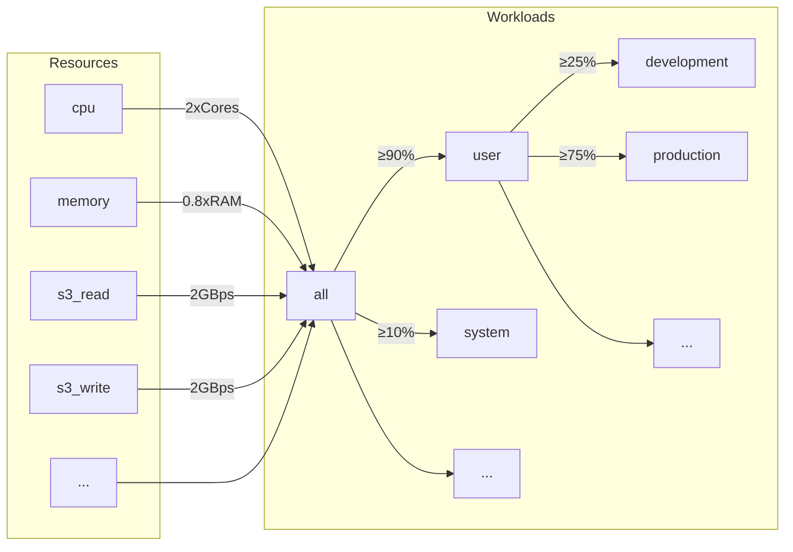
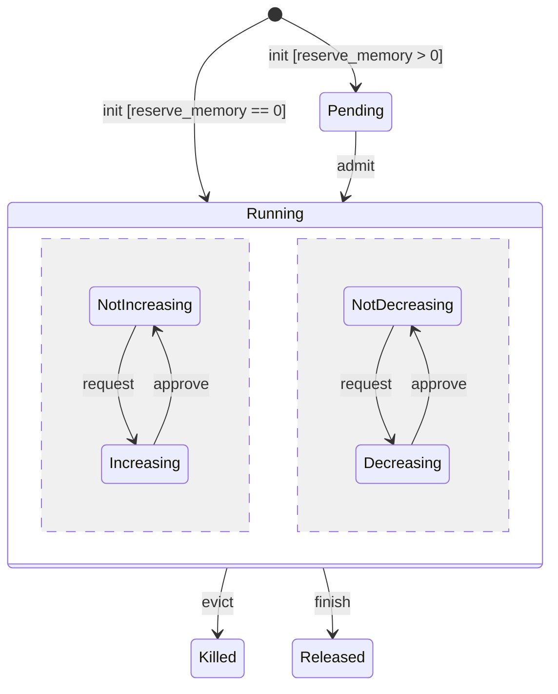
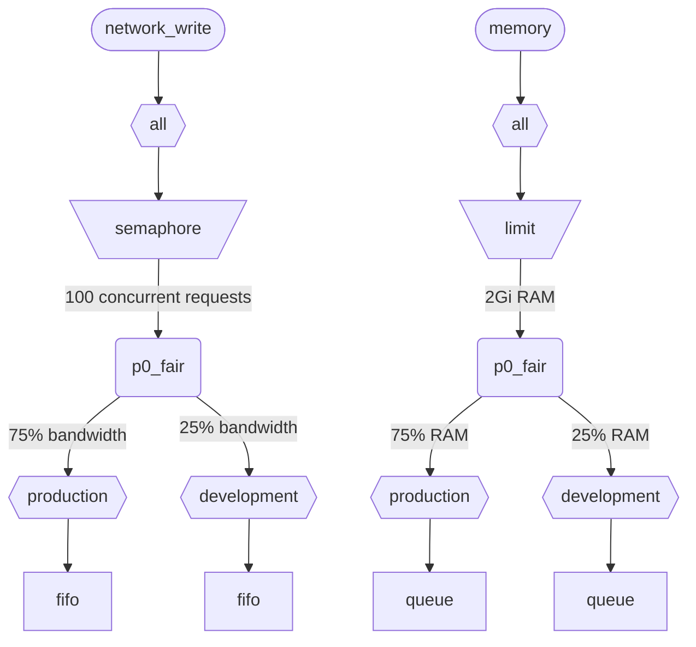

Quando o ClickHouse executa várias consultas simultaneamente, elas usam recursos compartilhados (CPU, memória e E/S). Restrições e políticas de agendamento podem ser aplicadas para regular como esses recursos são utilizados e compartilhados entre diferentes cargas de trabalho. Para todos os recursos, é possível configurar uma hierarquia de agendamento comum. A raiz dessa hierarquia representa os recursos compartilhados, enquanto as folhas correspondem a cargas de trabalho específicas, contendo requisições de recursos e alocações de consultas específicas e atividades em segundo plano.

<div id="resources">
  ## Recursos
</div>

Por padrão, o agendamento de cargas de trabalho está desativado. Para ativá-lo, é preciso criar recursos que serão usados no agendamento e pelo menos uma carga de trabalho. Todos os recursos são independentes e podem ser usados em qualquer combinação.

Para ativar o agendamento de CPU, é preciso criar um recurso de CPU para threads MASTER ou WORKER (consulte [agendamento de CPU](#cpu_scheduling) para mais detalhes):

```sql
CREATE RESOURCE cpu (MASTER THREAD, WORKER THREAD)
```

Para habilitar a reserva de memória para workloads, é necessário criar o recurso MEMORY (consulte [Memory reservations](#memory-reservations) para mais detalhes):

```sql
CREATE RESOURCE memory (MEMORY RESERVATION)
```

Para ativar o agendamento de slots de consulta, é necessário criar um recurso QUERY (consulte [Agendamento de slots de consulta](#query_scheduling) para mais detalhes):

```sql
CREATE RESOURCE query (QUERY)
```

Para habilitar o escalonamento de E/S para um disco específico, você precisa criar recursos de leitura e de escrita para os acessos WRITE e READ:

```sql
CREATE RESOURCE resource_name (WRITE DISK disk_name, READ DISK disk_name)
-- or
CREATE RESOURCE read_resource_name (WRITE DISK write_disk_name)
CREATE RESOURCE write_resource_name (READ DISK read_disk_name)
```

Um recurso pode ser usado para qualquer quantidade de disks, para READ, WRITE ou ambos, READ e WRITE. Há uma sintaxe que permite usar um recurso para todos os disks:

```sql
CREATE RESOURCE all_io (READ ANY DISK, WRITE ANY DISK);
```

Os recursos são classificados por modo de compartilhamento:

* **Recursos compartilhados no tempo** (CPU, E/S, slots de consulta) - gerenciam solicitações de recursos que são enfileiradas nos nós folha da hierarquia de agendamento. As solicitações são agendadas de acordo com as políticas e restrições definidas pela hierarquia. As solicitações de recursos são criadas quando uma consulta acessa o recurso correspondente. Por exemplo, quando uma consulta lê dados do disco ou usa a CPU para processamento, são criadas solicitações de recursos para cada quantum de trabalho executado ou para a quantidade de bytes enviados ou recebidos por um socket.
* **Recursos compartilhados por espaço** (Memória) - gerenciam alocações de recursos nos nós folha da hierarquia de agendamento. As alocações podem estar em execução ou pendentes. As alocações pendentes ficam bloqueadas até que espaço suficiente seja liberado ou outra alocação seja removida (interrompida). As decisões se baseiam nos limites e nas políticas definidos pela hierarquia. Há uma correspondência direta entre alocações e consultas (ou atividades em segundo plano). Uma alocação é criada quando uma consulta inicia a execução e é liberada quando ela termina. As alocações em execução podem aumentar ou diminuir de tamanho dinamicamente.

<div id="workloads">
  ## Hierarquia de workloads
</div>

O ClickHouse fornece uma sintaxe SQL prática para definir a hierarquia de agendamento. Todos os recursos são distribuídos em uma hierarquia comum de WORKLOAD. As regras de distribuição podem ser alteradas em alguns aspectos para recursos específicos, mas a hierarquia permanece a mesma. Cada WORKLOAD mantém os nós de agendamento necessários para cada recurso. É possível criar um workload filho dentro de qualquer workload, formando a hierarquia. O ClickHouse não impõe nenhuma estrutura específica nem predefinida para a hierarquia de workloads.

Veja a seguir um exemplo de hierarquia que divide todos os recursos entre os workloads &quot;user&quot; e &quot;system&quot;, com garantias correspondentes de 90% e 10%. Observe que os pesos definidos para workloads são usados para max-min fairness e, portanto, fornecem apenas uma garantia de melhor esforço como piso (não um limite ou cota como teto). Todo o agendamento é feito em cada host de forma independente e, portanto, os limites definidos pelas configurações `max_*` são por host. O workload &quot;user&quot; subdivide seus recursos entre os workloads &quot;development&quot; e &quot;production&quot;, sendo que &quot;production&quot; tem 3 vezes mais recursos do que &quot;development&quot;:

```sql
CREATE RESOURCE cpu (MASTER THREAD, WORKER THREAD)
CREATE RESOURCE memory (MEMORY RESERVATION)
CREATE RESOURCE s3_read (READ DISK s3)
CREATE RESOURCE s3_write (WRITE DISK s3)
CREATE WORKLOAD all SETTINGS max_concurrent_threads_ratio_to_cores = 2, max_memory_ratio = 0.8, max_bytes_per_second = '2Gi'
CREATE WORKLOAD user IN all SETTINGS weight = 9
CREATE WORKLOAD system IN all
CREATE WORKLOAD development IN user
CREATE WORKLOAD production IN user SETTINGS weight = 3
```



O nome de uma carga de trabalho folha sem filhos pode ser usado nas configurações de consulta `SETTINGS workload = 'name'`. Veja [Marcação de carga de trabalho](#workload-markup) para mais detalhes.

Para personalizar a carga de trabalho, as seguintes configurações podem ser usadas:

* `priority` - (somente time-shared) cargas de trabalho irmãs são atendidas de acordo com valores estáticos (um valor menor significa prioridade mais alta). Controla a preempção.
* `precedence` - (somente space-shared) cargas de trabalho irmãs são admitidas de acordo com valores estáticos (um valor menor significa precedência mais alta). Controla a evicção e a admissão.
* `weight` - cargas de trabalho irmãs com a mesma prioridade ou precedência estática compartilham recursos de forma justa, de acordo com os pesos. Afeta a preempção, a evicção e a admissão.
* `max_io_requests` - o limite para o número de solicitações de E/S concorrentes nesta carga de trabalho.
* `max_bytes_inflight` - o limite para o total de bytes em trânsito para solicitações concorrentes nesta carga de trabalho.
* `max_bytes_per_second` - o limite para a taxa de leitura ou gravação em bytes desta carga de trabalho.
* `max_burst_bytes` - o número máximo de bytes que podem ser processados pela carga de trabalho sem sofrer limitação (para cada recurso, de forma independente).
* `max_concurrent_threads` - o limite para o número de threads para consultas nesta carga de trabalho.
* `max_concurrent_threads_ratio_to_cores` - o mesmo que `max_concurrent_threads`, mas normalizado para o número de núcleos de CPU disponíveis.
* `max_cpus` - o limite para o número de núcleos de CPU para atender consultas nesta carga de trabalho.
* `max_cpu_share` - o mesmo que `max_cpus`, mas normalizado para o número de núcleos de CPU disponíveis.
* `max_burst_cpu_seconds` - o número máximo de segundos de CPU que podem ser consumidos pela carga de trabalho sem sofrer limitação devido a `max_cpus`.
* `max_memory` - o limite para a memória total reservada para esta carga de trabalho.

Todos os limites especificados por meio das configurações de carga de trabalho são independentes para cada recurso. Por exemplo, uma carga de trabalho com `max_bytes_per_second = '10Mi'` terá um limite de largura de banda de 10 MB/s para cada recurso de leitura e gravação, de forma independente. Se for necessário um limite comum para leitura e gravação, considere usar o mesmo recurso para acesso READ e WRITE.

Não há como especificar hierarquias diferentes de cargas de trabalho para recursos diferentes. Mas há uma forma de especificar um valor diferente de configuração de carga de trabalho para um recurso específico:

```sql
CREATE OR REPLACE WORKLOAD all SETTINGS max_io_requests = 100, max_bytes_per_second = '1Mi' FOR network_read, max_bytes_per_second = '2Mi' FOR network_write
```

Observe também que um workload ou resource não pode ser removido se for referenciado por outro workload. Para atualizar a definição de um workload, use a consulta `CREATE OR REPLACE WORKLOAD`.

:::note
As configurações de workload são convertidas em um conjunto apropriado de nós de escalonamento. Para detalhes de baixo nível, consulte a descrição dos [tipos e opções](#hierarchy) de nós de escalonamento.
:::

<div id="workload-markup">
  ## Marcação de carga de trabalho
</div>

As consultas podem ser marcadas com a configuração `workload` para distinguir diferentes cargas de trabalho. Se `workload` não estiver definida, o valor &quot;default&quot; será usado. Observe que é possível especificar outro valor usando perfis de configurações. Restrições de configuração podem ser usadas para tornar `workload` constante, caso você queira que todas as consultas de um usuário sejam marcadas com um valor fixo para a configuração `workload`.

:::warning
A configuração `workload` da consulta só pode se referir a cargas de trabalho folha (ou seja, cargas de trabalho sem filhos).
:::

```sql
SELECT count() FROM my_table WHERE value = 42 SETTINGS workload = 'production'
SELECT count() FROM my_table WHERE value = 13 SETTINGS workload = 'development'
```

É possível atribuir uma configuração de `workload` para atividades em segundo plano. Merges e mutações usam, respectivamente, as configurações de servidor `merge_workload` e `mutation_workload`. Esses valores também podem ser substituídos para tabelas específicas usando as configurações do MergeTree `merge_workload` e `mutation_workload`.

<div id="cpu_scheduling">
  ## Agendamento de CPU
</div>

Para ativar o agendamento de CPU para workloads, crie um recurso de CPU e defina um limite para o número de threads simultâneas:

```sql
CREATE RESOURCE cpu (MASTER THREAD, WORKER THREAD)
CREATE WORKLOAD all SETTINGS max_concurrent_threads = 100
```

Quando o servidor ClickHouse executa muitas consultas simultâneas com [múltiplas threads](/pt-BR/operations/settings/settings.md#max_threads) e todos os slots de CPU estão em uso, entra em estado de sobrecarga. Nesse estado, cada slot de CPU liberado é reagendado para o workload apropriado, de acordo com as políticas de agendamento. Para consultas que compartilham o mesmo workload, os slots são alocados em round-robin. Para consultas em workloads separados, os slots são alocados de acordo com os pesos, as prioridades e os limites especificados para os workloads.

O tempo de CPU é consumido pelas threads quando elas não estão bloqueadas e executam tarefas intensivas de CPU. Para fins de agendamento, distinguem-se dois tipos de threads:

* Master thread — a primeira thread que começa a trabalhar em uma consulta ou em uma atividade em segundo plano, como uma merge ou uma mutation.
* Worker thread — as threads adicionais que a master pode criar para executar tarefas intensivas de CPU.

Pode ser desejável usar recursos separados para master threads e worker threads para obter melhor capacidade de resposta. Um grande número de worker threads pode facilmente monopolizar os recursos de CPU quando são usados valores altos na configuração de consulta `max_threads`. Nesse caso, as consultas de entrada teriam de ficar bloqueadas e aguardar um slot de CPU para que suas master threads possam iniciar a execução. Para evitar isso, a configuração a seguir pode ser usada:

```sql
CREATE RESOURCE worker_cpu (WORKER THREAD)
CREATE RESOURCE master_cpu (MASTER THREAD)
CREATE WORKLOAD all SETTINGS max_concurrent_threads = 100 FOR worker_cpu, max_concurrent_threads = 1000 FOR master_cpu
```

Isso criará limites separados para threads mestre e worker. Mesmo que todos os 100 slots de CPU de worker estejam ocupados, novas consultas não serão bloqueadas até que haja slots de CPU mestre disponíveis. Elas iniciarão a execução com uma thread. Mais tarde, se slots de CPU de worker ficarem disponíveis, essas consultas poderão aumentar de escala e criar suas threads de worker. Por outro lado, essa abordagem não vincula o número total de slots ao número de processadores de CPU, e executar threads concorrentes demais afetará o desempenho.

Limitar a concorrência das threads mestre não limitará o número de consultas concorrentes. Os slots de CPU podem ser liberados no meio da execução da consulta e readquiridos por outras threads. Por exemplo, 4 consultas concorrentes com um limite de 2 threads mestre concorrentes poderiam ser executadas em paralelo. Nesse caso, cada consulta receberá 50% de um processador de CPU. Uma lógica separada deve ser usada para limitar o número de consultas concorrentes, e isso atualmente não é compatível com workloads.

Limites separados de concorrência de threads podem ser usados para workloads:

```sql
CREATE RESOURCE cpu (MASTER THREAD, WORKER THREAD)
CREATE WORKLOAD all
CREATE WORKLOAD admin IN all SETTINGS max_concurrent_threads = 10
CREATE WORKLOAD production IN all SETTINGS max_concurrent_threads = 100
CREATE WORKLOAD analytics IN production SETTINGS max_concurrent_threads = 60, weight = 9
CREATE WORKLOAD ingestion IN production
```

Este exemplo de configuração fornece pools independentes de slots de CPU para admin e produção. O pool de produção é compartilhado entre analytics e ingestão. Além disso, se o pool de produção ficar sobrecarregado, 9 em cada 10 slots liberados serão realocados para consultas analíticas, se necessário. As consultas de ingestão receberão apenas 1 em cada 10 slots durante períodos de sobrecarga. Isso pode melhorar a latência das consultas voltadas ao usuário. Analytics tem seu próprio limite de 60 threads concorrentes, sempre deixando pelo menos 40 threads para dar suporte à ingestão. Quando não há sobrecarga, a ingestão pode usar todas as 100 threads.

Para excluir uma consulta do agendamento de CPU, defina a configuração de consulta [use&#95;concurrency&#95;control](/pt-BR/operations/settings/settings.md/#use_concurrency_control) como 0.

O agendamento de CPU ainda não é compatível com merges e mutações.

Para fornecer alocações justas para o workload, é necessário realizar preempção e redução de escala durante a execução da consulta. A preempção é habilitada pela configuração de servidor `cpu_slot_preemption`. Se ela estiver habilitada, cada thread renovará seu slot de CPU periodicamente (de acordo com a configuração de servidor `cpu_slot_quantum_ns`). Essa renovação pode bloquear a execução se a CPU estiver sobrecarregada. Quando a execução fica bloqueada por um período prolongado (consulte a configuração de servidor `cpu_slot_preemption_timeout_ms`), a consulta reduz sua escala e o número de threads executadas simultaneamente diminui dinamicamente. Observe que a equidade do tempo de CPU é garantida entre workloads, mas, entre consultas dentro do mesmo workload, isso pode ser violado em alguns casos extremos.

:::warning
O agendamento de slots oferece uma forma de controlar a [concorrência de consultas](/pt-BR/operations/settings/settings.md#max_threads), mas não garante uma alocação justa do tempo de CPU, a menos que a configuração de servidor `cpu_slot_preemption` esteja definida como `true`; caso contrário, a equidade é fornecida com base no número de alocações de slots de CPU entre workloads concorrentes. Isso não implica uma quantidade igual de segundos de CPU porque, sem preempção, um slot de CPU pode ser mantido indefinidamente. Uma thread adquire um slot no início e o libera quando o trabalho é concluído.
:::

:::note
Declarar o recurso de CPU desabilita o efeito das configurações [`concurrent_threads_soft_limit_num`](server-configuration-parameters/settings.md#concurrent_threads_soft_limit_num) e [`concurrent_threads_soft_limit_ratio_to_cores`](server-configuration-parameters/settings.md#concurrent_threads_soft_limit_ratio_to_cores). Em vez disso, a workload setting `max_concurrent_threads` é usada para limitar o número de CPUs alocadas a uma workload específica. Para obter o comportamento anterior, crie apenas o recurso WORKER THREAD, defina `max_concurrent_threads` para a workload `all` com o mesmo valor de `concurrent_threads_soft_limit_num` e use a configuração de consulta `workload = "all"`. Essa configuração corresponde à configuração [`concurrent_threads_scheduler`](server-configuration-parameters/settings.md#concurrent_threads_scheduler) definida com o valor &quot;fair&#95;round&#95;robin&quot;.
:::

<div id="threads_vs_cpus">
  ## Threads vs. CPUs
</div>

Há duas maneiras de controlar o consumo de CPU de uma carga de trabalho:

* Limite do número de threads: `max_concurrent_threads` e `max_concurrent_threads_ratio_to_cores`
* Limitação de CPU: `max_cpus`, `max_cpu_share` e `max_burst_cpu_seconds`

:::warning
As configurações de limitação de CPU só ficam ativas se a configuração de servidor `cpu_slot_preemption` estiver habilitada; caso contrário, são ignoradas.
:::

A primeira permite controlar dinamicamente quantas threads são criadas para uma consulta, dependendo da carga atual do servidor. Na prática, ela reduz o que a configuração de consulta `max_threads` determina. A segunda limita o consumo de CPU da carga de trabalho usando o algoritmo token bucket. Ela não afeta diretamente o número de threads, mas limita o consumo total de CPU de todas as threads na carga de trabalho.

A limitação com token bucket usando `max_cpus` e `max_burst_cpu_seconds` significa o seguinte. Durante qualquer intervalo de `delta` segundos, o consumo total de CPU por todas as consultas na carga de trabalho não pode ser maior que `max_cpus * delta + max_burst_cpu_seconds` segundos de CPU. Isso limita o consumo médio a `max_cpus` no longo prazo, mas esse limite pode ser excedido no curto prazo. Por exemplo, com `max_burst_cpu_seconds = 60` e `max_cpus=0.001`, é permitido executar 1 thread por 60 segundos, ou 2 threads por 30 segundos, ou 60 threads por 1 segundo sem sofrer limitação. O valor padrão de `max_burst_cpu_seconds` é 1 segundo. Valores menores podem levar à subutilização dos núcleos permitidos por `max_cpus`, quando há muitas threads concorrentes.

Enquanto ocupa um slot de CPU, uma thread pode estar em um de três estados principais:

* **Em execução:** Consumindo efetivamente recurso de CPU. O tempo gasto nesse estado é contabilizado pela limitação de CPU.
* **Pronto:** Aguardando uma CPU ficar disponível. O tempo gasto nesse estado não é contabilizado pela limitação de CPU.
* **Bloqueado:** Executando operações de E/S ou outras chamadas de sistema bloqueantes (por exemplo, aguardando um mutex). O tempo gasto nesse estado não é contabilizado pela limitação de CPU.

Vamos considerar um exemplo de configuração que combina limitação de CPU e limites de número de threads:

```sql
CREATE RESOURCE cpu (MASTER THREAD, WORKER THREAD)
CREATE WORKLOAD all SETTINGS max_concurrent_threads_ratio_to_cores = 2
CREATE WORKLOAD admin IN all SETTINGS max_concurrent_threads = 2, priority = -1
CREATE WORKLOAD production IN all SETTINGS weight = 4
CREATE WORKLOAD analytics IN production SETTINGS max_cpu_share = 0.7, weight = 3
CREATE WORKLOAD ingestion IN production
CREATE WORKLOAD development IN all SETTINGS max_cpu_share = 0.3
```

Aqui, limitamos o número total de threads de todas as consultas a 2x o número de CPUs disponíveis. A carga de trabalho Admin é limitada a no máximo duas threads, independentemente do número de CPUs disponíveis. Admin tem prioridade -1 (inferior ao `default` 0) e recebe primeiro qualquer slot de CPU, se necessário. Quando o Admin não executa consultas, os recursos de CPU são divididos entre as cargas de trabalho de produção e desenvolvimento. As parcelas garantidas de tempo de CPU são baseadas em pesos (4 para 1): pelo menos 80% vão para produção (se necessário) e pelo menos 20% vão para desenvolvimento (se necessário). Enquanto os pesos definem garantias, a limitação de CPU define os limites: produção não tem limite e pode consumir 100%, enquanto desenvolvimento tem um limite de 30%, aplicado mesmo que não haja consultas de outras cargas de trabalho. A carga de trabalho de produção não é um nó folha, então seus recursos são divididos entre analytics e ingestão de acordo com os pesos (3 para 1). Isso significa que analytics tem uma garantia de pelo menos 0,8 * 0,75 = 60% e, com base em `max_cpu_share`, tem um limite de 70% dos recursos totais de CPU. Já a ingestão fica com uma garantia de pelo menos 0,8 * 0,25 = 20%, sem limite superior.

:::note
Se você quiser maximizar a utilização de CPU no seu servidor ClickHouse, evite usar `max_cpus` e `max_cpu_share` para a carga de trabalho raiz `all`. Em vez disso, defina um valor mais alto para `max_concurrent_threads`. Por exemplo, em um sistema com 8 CPUs, defina `max_concurrent_threads = 16`. Isso permite que 8 threads executem tarefas de CPU enquanto outras 8 podem lidar com operações de E/S. Threads adicionais criarão pressão sobre a CPU, garantindo que as regras de scheduling sejam aplicadas. Em contraste, definir `max_cpus = 8` nunca criará pressão sobre a CPU, porque o servidor não pode exceder as 8 CPUs disponíveis.
:::

<div id="memory-reservations">
  ## Reservas de memória
</div>

:::note
O agendamento de reserva de memória é experimental. Ele só passa a valer quando existe um recurso `MEMORY RESERVATION`, e sua interface SQL e seu comportamento podem mudar em lançamentos futuros. Ele ainda não tem suporte para merges e mutações, e a remoção de uma consulta em execução é feita em regime de melhor esforço: ela passa a valer no próximo ponto de sincronização de memória da consulta, em vez de ocorrer instantaneamente.
:::

Para habilitar reservas de memória para workloads, crie o recurso `MEMORY RESERVATION` e defina pelo menos um limite para o total de memória reservada usando as configurações de workload:

```sql
CREATE RESOURCE memory (MEMORY RESERVATION)
CREATE WORKLOAD all SETTINGS max_memory = '2Gi'
```

O ClickHouse rastreia as alocações de memória de todas as consultas e atividades em segundo plano. A quantidade de bytes alocados é agregada ao longo da hierarquia de agendamento até a raiz. Toda consulta tem uma alocação associada na carga de trabalho folha à qual pertence. Se uma consulta tiver a configuração `reserve_memory` maior que zero, a alocação será criada em estado pendente. A alocação pendente reserva a quantidade de memória solicitada na hierarquia de cargas de trabalho. Se não houver memória disponível suficiente, a alocação permanecerá pendente até que memória suficiente seja liberada ou outras alocações sejam removidas (interrompidas). Quando a alocação é admitida, ela passa para o estado de execução. Uma alocação em execução pode aumentar ou diminuir de tamanho dinamicamente, de acordo com o consumo de memória da consulta. O ciclo de vida da alocação pode ser representado pelo seguinte diagrama de estados:



As alocações pendentes de uma carga de trabalho folha são admitidas de acordo com a ordem FIFO. Quando várias cargas de trabalho têm alocações pendentes, elas são admitidas de acordo com as configurações de precedência e peso. As cargas de trabalho com maior precedência são atendidas primeiro. Cargas de trabalho irmãs com a mesma precedência compartilham a memória de acordo com os pesos de forma justa no modelo max-min, o que significa que a carga de trabalho com menor uso de memória normalizado (uso atual mais o aumento solicitado dividido pelo peso) é atendida primeiro. A lógica inversa é aplicada durante a evicção. Quando é necessário liberar memória, as cargas de trabalho com menor precedência e maior uso de memória normalizado são evictadas primeiro.

Observe que recursos time-shared usam prioridade, enquanto recursos space-shared usam precedência. Essas configurações são independentes e podem ser definidas com valores diferentes. Maior prioridade implica preempção não destrutiva (atraso ou throttling), enquanto maior precedência pode implicar evicção destrutiva (interrupção com erro). Uma carga de trabalho pode ter alta prioridade para agendamento de CPU, mas a mesma precedência para reserva de memória, para evitar evictar outras cargas de trabalho e perder o trabalho que elas já realizaram.

Toda carga de trabalho com um limite `max_memory` garante que a memória total alocada em sua subárvore não exceda esse limite. Se uma alocação pendente ou em crescimento exceder o limite, o procedimento de evicção será iniciado para liberar memória. O procedimento de evicção seleciona uma vítima para ser interrompida. A carga de trabalho ancestral comum mais baixa entre quem interrompe e a vítima impede a evicção nas seguintes situações:

* A alocação pendente não pode evictar alocações em execução na mesma carga de trabalho. (As cargas de trabalho de quem interrompe e da vítima coincidem).
* A alocação pendente de menor precedência nunca interrompe uma carga de trabalho de maior precedência.
* A alocação pendente não pode interromper uma alocação com a mesma precedência. Observe que alocações em execução com a mesma precedência podem evictar umas às outras com base no uso de memória normalizado.
  Se a evicção for impedida ou não liberar memória suficiente, a nova alocação será bloqueada até que memória suficiente seja liberada. Essas regras permitem o enfileiramento de consultas excessivas com base na pressão de memória e fornecem uma forma conveniente de evitar erros MEMORY&#95;LIMIT&#95;EXCEEDED.

:::note
Os limites da carga de trabalho são independentes de outras formas de limitar o consumo de memória, como a configuração de consulta [max&#95;memory&#95;usage](/pt-BR/operations/settings/settings.md#max_memory_usage). Eles podem ser usados em conjunto para obter um controle melhor sobre o consumo de memória. É possível definir limites de memória independentes com base em usuários (não em cargas de trabalho). Isso é menos flexível e não oferece recursos como reserva de memória e enfileiramento de consultas pendentes. Consulte [Memory overcommit](settings/memory-overcommit.md)
:::

A configuração de carga de trabalho `max_waiting_queries` limita o número de alocações pendentes da carga de trabalho. Quando o limite é atingido, o servidor retorna um erro `SERVER_OVERLOADED`. Observe que `max_waiting_queries` não é herdado pelas cargas de trabalho filhas e só faz sentido para cargas de trabalho folha.

O agendamento de reserva de memória ainda não é compatível com merges e mutações.

Somente consultas com a configuração `reserve_memory` maior que zero estão sujeitas a bloqueio enquanto aguardam a reserva de memória. No entanto, consultas com `reserve_memory` igual a zero também são contabilizadas no consumo de memória do seu workload e podem ser removidas, se necessário, para liberar memória para outras alocações pendentes ou em crescimento. Consultas sem a devida marcação de workload não estão sujeitas ao agendamento da reserva de memória e não podem ser removidas pelo scheduler.

Para fornecer uma reserva de memória não elástica para uma consulta, defina as configurações de consulta `reserve_memory` e `max_memory_usage` com o mesmo valor. Nesse caso, a consulta reservará uma quantidade fixa de memória e não poderá aumentar sua alocação dinamicamente. Observe que a reserva elástica de memória pode ser aumentada acima de `reserve_memory` até `max_memory_usage` sem ser interrompida, a menos que haja pressão de memória. Mas ela não pode ser reduzida abaixo de `reserve_memory`, mesmo quando o consumo real for menor.

Vamos considerar um exemplo de configuração:

```sql
CREATE RESOURCE memory (MEMORY RESERVATION)
CREATE WORKLOAD all SETTINGS max_memory = '10Gi'
CREATE WORKLOAD system IN all SETTINGS weight = 1
CREATE WORKLOAD user IN all SETTINGS weight = 9
CREATE WORKLOAD production IN user SETTINGS precedence = 1, weight = 3
CREATE WORKLOAD staging IN user SETTINGS precedence = 1, weight = 1
CREATE WORKLOAD testing IN user SETTINGS precedence = 2
```

Neste exemplo, a memória total reservada por todas as consultas e atividades em segundo plano não pode exceder 10 GiB. A carga de trabalho do sistema tem garantia de pelo menos 1 GiB (10% de 10 GiB), enquanto a carga de trabalho do usuário tem garantia de pelo menos 9 GiB (90% de 10 GiB). Dentro da carga de trabalho do usuário, as cargas de trabalho de produção e staging compartilham memória de acordo com os pesos (3 para 1), com precedência igual a 1. A carga de trabalho de teste tem precedência 2, inferior à de produção e staging. Portanto, a carga de trabalho de teste só pode usar memória que não esteja sendo usada por produção e staging.

Se houver pressão de memória, as alocações da carga de trabalho de teste serão removidas primeiro. Depois, se for necessário liberar mais memória, as alocações da carga de trabalho de staging serão removidas antes das alocações da carga de trabalho de produção, se excederem suas garantias. Observe que consultas pendentes em produção e staging podem remover alocações em execução na carga de trabalho de teste para liberar memória, mas não podem remover umas às outras porque têm a mesma precedência. Em caso de pressão de memória, elas ficarão esperando em filas, o que permite ao sistema evitar erros MEMORY&#95;LIMIT&#95;EXCEEDED causados por consultas demais executadas de forma concorrente.

Observe que a carga de trabalho do sistema tem precedência 0 (padrão), que é maior que a das cargas de trabalho de produção, staging e teste, mas elas não são cargas de trabalho irmãs. O ancestral comum mais próximo é a carga de trabalho all, cujos dois filhos têm a mesma precedência. Portanto, uma carga de trabalho do sistema pendente não pode remover nenhuma delas, e vice-versa. Isso garante que as atividades do sistema não sejam removidas com facilidade.

<div id="query_scheduling">
  ## Agendamento de slots de consulta
</div>

Para habilitar o agendamento de slots de consulta para cargas de trabalho, crie o recurso QUERY e defina um limite para o número de consultas simultâneas ou de consultas por segundo:

```sql
CREATE RESOURCE query (QUERY)
CREATE WORKLOAD all SETTINGS max_concurrent_queries = 100, max_queries_per_second = 10, max_burst_queries = 20
```

A configuração da carga de trabalho `max_concurrent_queries` limita o número de consultas concorrentes que podem ser executadas simultaneamente para uma determinada carga de trabalho. Ela é análoga à configuração de consulta [`max_concurrent_queries_for_all_users`](/pt-BR/operations/settings/settings#max_concurrent_queries_for_all_users) e à configuração do servidor [max&#95;concurrent&#95;queries](/pt-BR/operations/server-configuration-parameters/settings#max_concurrent_queries). Consultas de async insert e algumas consultas específicas, como KILL, não são contabilizadas nesse limite.

As configurações da carga de trabalho `max_queries_per_second` e `max_burst_queries` limitam o número de consultas da carga de trabalho usando um limitador do tipo token bucket. Isso garante que, durante qualquer intervalo de tempo `T`, não mais de `max_queries_per_second * T + max_burst_queries` novas consultas iniciarão a execução.

A configuração da carga de trabalho `max_waiting_queries` limita o número de consultas em espera da carga de trabalho. Quando o limite é atingido, o servidor retorna um erro `SERVER_OVERLOADED`. Observe que `max_waiting_queries` não é herdada por cargas de trabalho filhas e só faz sentido para cargas de trabalho folha.

:::note
As consultas bloqueadas esperarão indefinidamente e não aparecerão em `SHOW PROCESSLIST` até que todas as restrições sejam atendidas.
:::

<div id="workload_entity_storage">
  ## Armazenamento de workloads e recursos
</div>

As definições de todos os workloads e recursos, na forma de consultas `CREATE WORKLOAD` e `CREATE RESOURCE`, são armazenadas de forma persistente no disk em `workload_path` ou no ZooKeeper em `workload_zookeeper_path`. Recomenda-se o armazenamento no ZooKeeper para garantir consistência entre os nós. Como alternativa, a cláusula `ON CLUSTER` pode ser usada em conjunto com o armazenamento em disk.

<div id="config_based_workloads">
  ## Cargas de trabalho e recursos baseados em configuração
</div>

Além das definições baseadas em SQL, as cargas de trabalho e os recursos podem ser predefinidos no arquivo de configuração do servidor. Isso é útil em ambientes de nuvem, em que algumas limitações são ditadas pela infraestrutura, enquanto outros limites podem ser alterados pelos clientes. As entidades baseadas em configuração têm prioridade sobre as definidas em SQL e não podem ser modificadas nem excluídas por meio de comandos SQL.

<div id="config_based_workloads_format">
  ### Formato da configuração
</div>

```xml
<clickhouse>
    <resources_and_workloads>
        CREATE RESOURCE memory (MEMORY RESERVATION);
        CREATE RESOURCE s3disk_read (READ DISK s3);
        CREATE RESOURCE s3disk_write (WRITE DISK s3);
        CREATE WORKLOAD all SETTINGS max_memory = '2Gi', max_io_requests = 500 FOR s3disk_read, max_io_requests = 1000 FOR s3disk_write, max_bytes_per_second = '1280Mi' FOR s3disk_read, max_bytes_per_second = '3200Mi' FOR s3disk_write;
        CREATE WORKLOAD production IN all SETTINGS weight = 3;
    </resources_and_workloads>
</clickhouse>
```

A configuração usa a mesma sintaxe SQL das instruções `CREATE WORKLOAD` e `CREATE RESOURCE`. Todas as consultas devem ser válidas.

<div id="config_based_workloads_usage_recommendations">
  ### Recomendações de uso
</div>

Para ambientes em nuvem, uma configuração típica pode incluir:

1. Definir o workload raiz e os recursos de E/S de rede na configuração para estabelecer limites de infraestrutura
2. Definir `throw_on_unknown_workload` para fazer cumprir esses limites
3. Criar um `CREATE WORKLOAD default IN all` para aplicar automaticamente limites a todas as consultas (já que o valor padrão da configuração de consulta `workload` é &#39;default&#39;)
4. Permitir que os usuários criem workloads adicionais dentro da hierarquia configurada

Isso garante que todas as atividades em segundo plano e consultas respeitem as limitações da infraestrutura, ao mesmo tempo que ainda permite flexibilidade para políticas de escalonamento específicas de cada usuário.

Outro caso de uso é ter configurações diferentes para nós distintos em um cluster heterogêneo.

<div id="strict_resource_access">
  ## Acesso estrito a recursos
</div>

Para garantir que todas as consultas sigam as políticas de agendamento de recursos, existe a configuração do servidor `throw_on_unknown_workload`. Se ela estiver definida como `true`, toda consulta deverá usar uma configuração de consulta `workload` válida; caso contrário, a exceção `RESOURCE_ACCESS_DENIED` será lançada. Se ela estiver definida como `false`, essa consulta não usará o scheduler de recursos, ou seja, terá acesso ilimitado a qualquer `RESOURCE`. A configuração de consulta &#39;use&#95;concurrency&#95;control = 0&#39; permite que a consulta contorne o scheduler de CPU e tenha acesso ilimitado à CPU. Para impor o agendamento de CPU, crie uma restrição de configuração para manter &#39;use&#95;concurrency&#95;control&#39; como um valor constante somente leitura.

:::note
Não defina `throw_on_unknown_workload` como `true` a menos que `CREATE WORKLOAD default` tenha sido executado. Isso pode causar problemas na inicialização do servidor se uma consulta sem a configuração explícita `workload` for executada durante a inicialização.
:::

<div id="hierarchy">
  ### Hierarquia de scheduling nodes
</div>

Na perspectiva do subsistema de scheduling, cada recurso representa uma hierarquia de scheduling nodes. O ClickHouse cria automaticamente todos os scheduling nodes necessários a partir das definições de WORKLOAD e RESOURCE. Scheduling nodes são detalhes de implementação de baixo nível, acessíveis por meio da tabela [system.scheduler](/pt-BR/operations/system-tables/scheduler.md).

```sql
CREATE RESOURCE network_write (WRITE DISK s3)
CREATE RESOURCE memory (MEMORY RESERVATION)
CREATE WORKLOAD all SETTINGS max_io_requests = 100, max_memory = '2Gi'
CREATE WORKLOAD development IN all
CREATE WORKLOAD production IN all SETTINGS weight = 3
```



**Tipos de nó com compartilhamento por tempo:**

* `inflight_limit` (restrição) - bloqueia se o número de requisições simultâneas em andamento exceder `max_requests` ou se o custo total delas exceder `max_cost`; deve ter um único nó filho.
* `bandwidth_limit` (restrição) - bloqueia se a largura de banda atual exceder `max_speed` (0 significa ilimitada) ou se o burst exceder `max_burst` (por padrão, é igual a `max_speed`); deve ter um único nó filho.
* `fair` (política) - seleciona a próxima requisição a ser atendida de um de seus nós filhos de acordo com a equidade max-min; os nós filhos podem especificar `weight` (o padrão é 1).
* `priority` (política) - seleciona a próxima requisição a ser atendida de um de seus nós filhos de acordo com prioridades estáticas (valor menor significa prioridade mais alta); os nós filhos devem especificar `priority` (o padrão é 0).
* `fifo` (fila) - folha da hierarquia capaz de manter requisições que excedem a capacidade do recurso.

**Tipos de nó com compartilhamento por espaço:**

* `limit` - garante que a alocação total do nó filho nunca exceda um limite, iniciando o procedimento de evicção em uma subárvore, se necessário; deve ter um único nó filho.
* `fair_allocation` - aplica a evicção de acordo com a equidade max-min; uma alocação pendente nunca remove uma alocação em execução; os nós filhos podem especificar `weight` (o padrão é 1).
* `precedence_allocation` - aplica a evicção de acordo com precedência estática (valor menor significa precedência mais alta); uma alocação pendente com precedência mais alta remove alocações de precedência mais baixa; os nós filhos devem especificar `precedence` (o padrão é 0).
* `queue` - folha da hierarquia capaz de manter alocações em execução e pendentes.

<div id="deprecated-configuration">
  ## Configuração XML obsoleta
</div>

Uma forma alternativa de definir quais discos são usados por um recurso é o `storage_configuration` do servidor:

Para habilitar o agendamento de E/S para um disco específico, você precisa especificar `read_resource` e/ou `write_resource` na configuração de armazenamento. Isso informa ao ClickHouse qual recurso deve ser usado para cada solicitação de leitura e escrita no disco especificado. Os recursos de leitura e escrita podem apontar para o mesmo nome de recurso, o que é útil para SSDs locais ou HDDs. Vários discos diferentes também podem apontar para o mesmo recurso, o que é útil para discos remotos, caso você queira permitir uma divisão justa da largura de banda da rede entre, por exemplo, workloads de &quot;produção&quot; e &quot;desenvolvimento&quot;.

Exemplo:

```xml
<clickhouse>
    <storage_configuration>
        ...
        <disks>
            <s3>
                <type>s3</type>
                <endpoint>https://clickhouse-public-datasets.s3.amazonaws.com/my-bucket/root-path/</endpoint>
                <access_key_id>your_access_key_id</access_key_id>
                <secret_access_key>your_secret_access_key</secret_access_key>
                <read_resource>network_read</read_resource>
                <write_resource>network_write</write_resource>
            </s3>
        </disks>
        <policies>
            <s3_main>
                <volumes>
                    <main>
                        <disk>s3</disk>
                    </main>
                </volumes>
            </s3_main>
        </policies>
    </storage_configuration>
</clickhouse>
```

Observe que as opções de configuração do servidor têm prioridade sobre a forma SQL de definir recursos.

O exemplo a seguir mostra como definir as hierarquias de agendamento de E/S mostradas na imagem acima:

```xml
<clickhouse>
    <resources>
        <network_read>
            <node path="/">
                <type>inflight_limit</type>
                <max_requests>100</max_requests>
            </node>
            <node path="/fair">
                <type>fair</type>
            </node>
            <node path="/fair/prod">
                <type>fifo</type>
                <weight>3</weight>
            </node>
            <node path="/fair/dev">
                <type>fifo</type>
            </node>
        </network_read>
        <network_write>
            <node path="/">
                <type>inflight_limit</type>
                <max_requests>100</max_requests>
            </node>
            <node path="/fair">
                <type>fair</type>
            </node>
            <node path="/fair/prod">
                <type>fifo</type>
                <weight>3</weight>
            </node>
            <node path="/fair/dev">
                <type>fifo</type>
            </node>
        </network_write>
    </resources>
</clickhouse>
```

Para conseguir usar toda a capacidade do recurso subjacente, você deve usar `inflight_limit`. Observe que um valor baixo de `max_requests` ou `max_cost` pode levar à subutilização do recurso, enquanto valores altos demais podem levar a filas vazias dentro do scheduler, o que, por sua vez, pode fazer com que as políticas sejam ignoradas (falta de equidade ou desconsideração de prioridades) na subárvore. Por outro lado, se você quiser proteger os recursos contra utilização excessiva, deve usar `bandwidth_limit`. Ele limita a taxa quando a quantidade de recurso consumida em `duration` segundos excede `max_burst + max_speed * duration` bytes. Dois nós `bandwidth_limit` no mesmo recurso podem ser usados para limitar a largura de banda de pico durante intervalos curtos e a largura de banda média durante intervalos mais longos.

<div id="workload-classifiers">
  ### Classificadores de workload descontinuados
</div>

Os classificadores de workload são usados para definir o mapeamento entre o `workload` especificado em uma consulta e as filas folha que devem ser usadas para recursos específicos. No momento, a classificação de workload é simples: apenas o mapeamento estático está disponível.

Exemplo:

```xml
<clickhouse>
    <workload_classifiers>
        <production>
            <network_read>/fair/prod</network_read>
            <network_write>/fair/prod</network_write>
        </production>
        <development>
            <network_read>/fair/dev</network_read>
            <network_write>/fair/dev</network_write>
        </development>
        <default>
            <network_read>/fair/dev</network_read>
            <network_write>/fair/dev</network_write>
        </default>
    </workload_classifiers>
</clickhouse>
```

<div id="see-also">
  ## Veja também
</div>

* [system.scheduler](/pt-BR/operations/system-tables/scheduler.md)
* [system.workloads](/pt-BR/operations/system-tables/workloads.md)
* [system.resources](/pt-BR/operations/system-tables/resources.md)
* [merge&#95;workload](/pt-BR/operations/settings/merge-tree-settings.md#merge_workload) configuração do mecanismo MergeTree
* [merge&#95;workload](/pt-BR/operations/server-configuration-parameters/settings.md#merge_workload) configuração global do servidor
* [mutation&#95;workload](/pt-BR/operations/settings/merge-tree-settings.md#mutation_workload) configuração do mecanismo MergeTree
* [mutation&#95;workload](/pt-BR/operations/server-configuration-parameters/settings.md#mutation_workload) configuração global do servidor
* [workload&#95;path](/pt-BR/operations/server-configuration-parameters/settings.md#workload_path) configuração global do servidor
* [workload&#95;zookeeper&#95;path](/pt-BR/operations/server-configuration-parameters/settings.md#workload_zookeeper_path) configuração global do servidor
* [cpu&#95;slot&#95;preemption](/pt-BR/operations/server-configuration-parameters/settings.md#cpu_slot_preemption) configuração global do servidor
* [cpu&#95;slot&#95;quantum&#95;ns](/pt-BR/operations/server-configuration-parameters/settings.md#cpu_slot_quantum_ns) configuração global do servidor
* [cpu&#95;slot&#95;preemption&#95;timeout&#95;ms](/pt-BR/operations/server-configuration-parameters/settings.md#cpu_slot_preemption_timeout_ms) configuração global do servidor