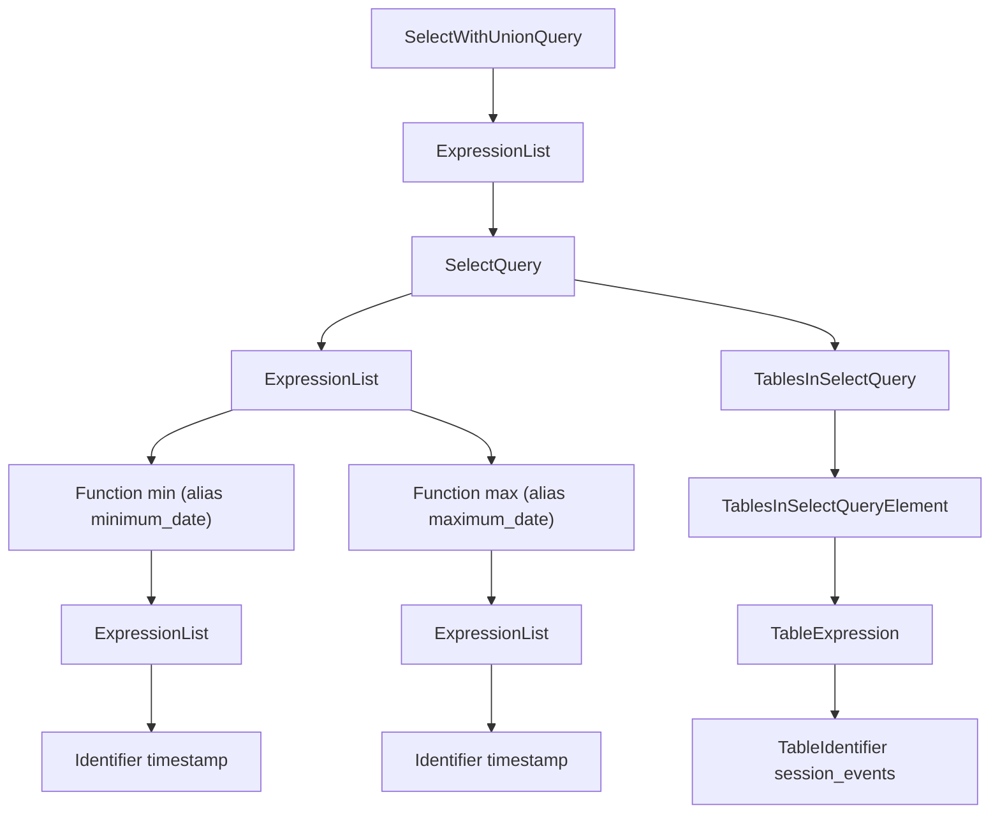

import { Image } from "/snippets/pt-BR/components/Image.jsx";

O ClickHouse processa consultas com extrema rapidez, mas a execução de uma consulta não é tão simples assim. Vamos tentar entender como uma consulta `SELECT` é executada. Para ilustrar isso, vamos adicionar alguns dados a uma tabela no ClickHouse:

```sql
CREATE TABLE session_events(
   clientId UUID,
   sessionId UUID,
   pageId UUID,
   timestamp DateTime,
   type String
) ORDER BY (timestamp);

INSERT INTO session_events SELECT * FROM generateRandom('clientId UUID,
   sessionId UUID,
   pageId UUID,
   timestamp DateTime,
   type Enum(\'type1\', \'type2\')', 1, 10, 2) LIMIT 1000;
```

Agora que temos alguns dados no ClickHouse, queremos executar algumas consultas e entender como elas são executadas. A execução de uma consulta é dividida em várias etapas. Cada etapa da execução da consulta pode ser analisada e ter problemas investigados usando a consulta `EXPLAIN` correspondente. Essas etapas estão resumidas no gráfico abaixo:

<Image img="/images/guides/developer/analyzer1.webp" alt="Etapas da consulta EXPLAIN" size="md" />

Vamos ver cada elemento em ação durante a execução da consulta. Vamos usar algumas consultas e depois examiná-las com a instrução `EXPLAIN`.

<div id="parser">
  ## Parser
</div>

O objetivo de um parser é transformar o texto da consulta em uma AST (árvore sintática abstrata). Este passo pode ser visualizado usando `EXPLAIN AST`:

```sql
EXPLAIN AST SELECT min(timestamp) AS minimum_date, max(timestamp) AS maximum_date FROM session_events;
```

```response
┌─explain────────────────────────────────────────────┐
│ SelectWithUnionQuery (children 1)                  │
│  ExpressionList (children 1)                       │
│   SelectQuery (children 2)                         │
│    ExpressionList (children 2)                     │
│     Function min (alias minimum_date) (children 1) │
│      ExpressionList (children 1)                   │
│       Identifier timestamp                         │
│     Function max (alias maximum_date) (children 1) │
│      ExpressionList (children 1)                   │
│       Identifier timestamp                         │
│    TablesInSelectQuery (children 1)                │
│     TablesInSelectQueryElement (children 1)        │
│      TableExpression (children 1)                  │
│       TableIdentifier session_events               │
└────────────────────────────────────────────────────┘
```

A saída é uma Árvore Sintática Abstrata que pode ser visualizada como mostrado abaixo:


Cada nó tem filhos correspondentes, e a árvore como um todo representa a estrutura geral da sua consulta. Trata-se de uma estrutura lógica que ajuda no processamento de uma consulta. Do ponto de vista do usuário final (a menos que haja interesse na execução de consultas), ela não é tão útil; essa ferramenta é usada principalmente por desenvolvedores.

<div id="analyzer">
  ## Analisador
</div>

Atualmente, o ClickHouse tem duas arquiteturas para o Analisador. Você pode usar a arquitetura antiga definindo: `enable_analyzer=0`. A arquitetura atual vem habilitada por padrão desde o ClickHouse `24.3`. Vamos descrever aqui apenas a arquitetura atual, já que a antiga foi descontinuada e é mantida apenas para compatibilidade retroativa.

<Note>
  A arquitetura atual deve nos oferecer uma base melhor para aprimorar o desempenho do ClickHouse. No entanto, como é um componente fundamental das etapas de processamento de consultas, ela também pode ter um impacto negativo em algumas consultas, e há [incompatibilidades conhecidas](/pt-BR/guides/clickhouse/performance-and-monitoring/analyzer#known-incompatibilities). Você pode voltar para a arquitetura antiga alterando a configuração `enable_analyzer` no nível da consulta ou do usuário.
</Note>

O analisador é uma etapa importante da execução da consulta. Ele recebe uma AST e a transforma em uma árvore de consulta. O principal benefício de uma árvore de consulta em relação a uma AST é que muitos componentes passam a ser resolvidos, como o armazenamento, por exemplo. Também sabemos de qual tabela ler, os aliases são resolvidos, e a árvore conhece os diferentes tipos de dados usados. Com todos esses benefícios, o analisador pode aplicar otimizações. Essas otimizações funcionam por meio de &quot;passes&quot;. Cada pass procura otimizações diferentes. Você pode ver todos os passes [aqui](https://github.com/ClickHouse/ClickHouse/blob/76578ebf92af3be917cd2e0e17fea2965716d958/src/Analyzer/QueryTreePassManager.cpp#L249); vamos ver isso na prática com nossa consulta anterior:

```sql
EXPLAIN QUERY TREE passes=0 SELECT min(timestamp) AS minimum_date, max(timestamp) AS maximum_date FROM session_events SETTINGS allow_experimental_analyzer=1;
```

```response
┌─explain────────────────────────────────────────────────────────────────────────────────┐
│ QUERY id: 0                                                                            │
│   PROJECTION                                                                           │
│     LIST id: 1, nodes: 2                                                               │
│       FUNCTION id: 2, alias: minimum_date, function_name: min, function_type: ordinary │
│         ARGUMENTS                                                                      │
│           LIST id: 3, nodes: 1                                                         │
│             IDENTIFIER id: 4, identifier: timestamp                                    │
│       FUNCTION id: 5, alias: maximum_date, function_name: max, function_type: ordinary │
│         ARGUMENTS                                                                      │
│           LIST id: 6, nodes: 1                                                         │
│             IDENTIFIER id: 7, identifier: timestamp                                    │
│   JOIN TREE                                                                            │
│     IDENTIFIER id: 8, identifier: session_events                                       │
│   SETTINGS allow_experimental_analyzer=1                                               │
└────────────────────────────────────────────────────────────────────────────────────────┘
```

```sql
EXPLAIN QUERY TREE passes=20 SELECT min(timestamp) AS minimum_date, max(timestamp) AS maximum_date FROM session_events SETTINGS allow_experimental_analyzer=1;
```

```response
┌─explain───────────────────────────────────────────────────────────────────────────────────┐
│ QUERY id: 0                                                                               │
│   PROJECTION COLUMNS                                                                      │
│     minimum_date DateTime                                                                 │
│     maximum_date DateTime                                                                 │
│   PROJECTION                                                                              │
│     LIST id: 1, nodes: 2                                                                  │
│       FUNCTION id: 2, function_name: min, function_type: aggregate, result_type: DateTime │
│         ARGUMENTS                                                                         │
│           LIST id: 3, nodes: 1                                                            │
│             COLUMN id: 4, column_name: timestamp, result_type: DateTime, source_id: 5     │
│       FUNCTION id: 6, function_name: max, function_type: aggregate, result_type: DateTime │
│         ARGUMENTS                                                                         │
│           LIST id: 7, nodes: 1                                                            │
│             COLUMN id: 4, column_name: timestamp, result_type: DateTime, source_id: 5     │
│   JOIN TREE                                                                               │
│     TABLE id: 5, alias: __table1, table_name: default.session_events                      │
│   SETTINGS allow_experimental_analyzer=1                                                  │
└───────────────────────────────────────────────────────────────────────────────────────────┘
```

Entre as duas execuções, é possível observar a resolução dos aliases e das projeções.

<div id="planner">
  ## Planejador
</div>

O planejador recebe uma árvore de consulta e, a partir dela, gera um plano de consulta. A árvore de consulta nos diz o que queremos fazer com uma consulta específica, e o plano de consulta nos diz como isso será feito. Otimizações adicionais também são aplicadas como parte do plano de consulta. Você pode usar `EXPLAIN PLAN` ou `EXPLAIN` para ver o plano de consulta (`EXPLAIN` executa `EXPLAIN PLAN`).

```sql
EXPLAIN PLAN WITH
   (
       SELECT count(*)
       FROM session_events
   ) AS total_rows
SELECT type, min(timestamp) AS minimum_date, max(timestamp) AS maximum_date, count(*) /total_rows * 100 AS percentage FROM session_events GROUP BY type
```

```response
┌─explain──────────────────────────────────────────┐
│ Expression ((Projection + Before ORDER BY))      │
│   Aggregating                                    │
│     Expression (Before GROUP BY)                 │
│       ReadFromMergeTree (default.session_events) │
└──────────────────────────────────────────────────┘
```

Embora isso já nos dê algumas informações, podemos obter mais. Por exemplo, talvez queiramos saber o nome da coluna para a qual precisamos das projeções. Você pode adicionar o cabeçalho à consulta:

```SQL
EXPLAIN header = 1
WITH (
       SELECT count(*)
       FROM session_events
   ) AS total_rows
SELECT
   type,
   min(timestamp) AS minimum_date,
   max(timestamp) AS maximum_date,
   (count(*) / total_rows) * 100 AS percentage
FROM session_events
GROUP BY type
```

```response
┌─explain──────────────────────────────────────────┐
│ Expression ((Projection + Before ORDER BY))      │
│ Header: type String                              │
│         minimum_date DateTime                    │
│         maximum_date DateTime                    │
│         percentage Nullable(Float64)             │
│   Aggregating                                    │
│   Header: type String                            │
│           min(timestamp) DateTime                │
│           max(timestamp) DateTime                │
│           count() UInt64                         │
│     Expression (Before GROUP BY)                 │
│     Header: timestamp DateTime                   │
│             type String                          │
│       ReadFromMergeTree (default.session_events) │
│       Header: timestamp DateTime                 │
│               type String                        │
└──────────────────────────────────────────────────┘
```

Agora você já sabe os nomes das colunas que precisam ser criadas para a última projeção (`minimum_date`, `maximum_date` e `percentage`), mas talvez também queira ver os detalhes de todas as ações que precisam ser executadas. Você pode fazer isso definindo `actions=1`.

```sql
EXPLAIN actions = 1
WITH (
       SELECT count(*)
       FROM session_events
   ) AS total_rows
SELECT
   type,
   min(timestamp) AS minimum_date,
   max(timestamp) AS maximum_date,
   (count(*) / total_rows) * 100 AS percentage
FROM session_events
GROUP BY type
```

```response
┌─explain────────────────────────────────────────────────────────────────────────────────────────────────────────────────────────────────────┐
│ Expression ((Projection + Before ORDER BY))                                                                                                │
│ Actions: INPUT :: 0 -> type String : 0                                                                                                     │
│          INPUT : 1 -> min(timestamp) DateTime : 1                                                                                          │
│          INPUT : 2 -> max(timestamp) DateTime : 2                                                                                          │
│          INPUT : 3 -> count() UInt64 : 3                                                                                                   │
│          COLUMN Const(Nullable(UInt64)) -> total_rows Nullable(UInt64) : 4                                                                 │
│          COLUMN Const(UInt8) -> 100 UInt8 : 5                                                                                              │
│          ALIAS min(timestamp) :: 1 -> minimum_date DateTime : 6                                                                            │
│          ALIAS max(timestamp) :: 2 -> maximum_date DateTime : 1                                                                            │
│          FUNCTION divide(count() :: 3, total_rows :: 4) -> divide(count(), total_rows) Nullable(Float64) : 2                               │
│          FUNCTION multiply(divide(count(), total_rows) :: 2, 100 :: 5) -> multiply(divide(count(), total_rows), 100) Nullable(Float64) : 4 │
│          ALIAS multiply(divide(count(), total_rows), 100) :: 4 -> percentage Nullable(Float64) : 5                                         │
│ Positions: 0 6 1 5                                                                                                                         │
│   Aggregating                                                                                                                              │
│   Keys: type                                                                                                                               │
│   Aggregates:                                                                                                                              │
│       min(timestamp)                                                                                                                       │
│         Function: min(DateTime) → DateTime                                                                                                 │
│         Arguments: timestamp                                                                                                               │
│       max(timestamp)                                                                                                                       │
│         Function: max(DateTime) → DateTime                                                                                                 │
│         Arguments: timestamp                                                                                                               │
│       count()                                                                                                                              │
│         Function: count() → UInt64                                                                                                         │
│         Arguments: none                                                                                                                    │
│   Skip merging: 0                                                                                                                          │
│     Expression (Before GROUP BY)                                                                                                           │
│     Actions: INPUT :: 0 -> timestamp DateTime : 0                                                                                          │
│              INPUT :: 1 -> type String : 1                                                                                                 │
│     Positions: 0 1                                                                                                                         │
│       ReadFromMergeTree (default.session_events)                                                                                           │
│       ReadType: Default                                                                                                                    │
│       Parts: 1                                                                                                                             │
│       Granules: 1                                                                                                                          │
└────────────────────────────────────────────────────────────────────────────────────────────────────────────────────────────────────────────┘
```

Agora você pode ver todas as entradas, funções, aliases e tipos de dados em uso. Você pode ver algumas das otimizações que o planejador vai aplicar [aqui](https://github.com/ClickHouse/ClickHouse/blob/master/src/Processors/QueryPlan/Optimizations/Optimizations.h).

<div id="query-pipeline">
  ## Pipeline de consulta
</div>

Um pipeline de consulta é gerado a partir do plano de consulta. O pipeline de consulta é muito semelhante ao plano de consulta, com a diferença de que não é uma árvore, mas um grafo. Ele mostra como o ClickHouse executará uma consulta e quais recursos serão utilizados. Analisar o pipeline de consulta é muito útil para identificar onde está o gargalo em termos de entradas/saídas. Vamos usar nossa consulta anterior e observar a execução do pipeline de consulta:

```sql
EXPLAIN PIPELINE
WITH (
       SELECT count(*)
       FROM session_events
   ) AS total_rows
SELECT
   type,
   min(timestamp) AS minimum_date,
   max(timestamp) AS maximum_date,
   (count(*) / total_rows) * 100 AS percentage
FROM session_events
GROUP BY type;
```

```response
┌─explain────────────────────────────────────────────────────────────────────┐
│ (Expression)                                                               │
│ ExpressionTransform × 2                                                    │
│   (Aggregating)                                                            │
│   Resize 1 → 2                                                             │
│     AggregatingTransform                                                   │
│       (Expression)                                                         │
│       ExpressionTransform                                                  │
│         (ReadFromMergeTree)                                                │
│         MergeTreeSelect(pool: PrefetchedReadPool, algorithm: Thread) 0 → 1 │
└────────────────────────────────────────────────────────────────────────────┘
```

Dentro dos parênteses está o passo do plano de consulta e, ao lado, o processor. São informações muito úteis, mas como se trata de um grafo, seria interessante visualizá-lo como tal. Temos uma configuração `graph` que podemos definir como 1 e especificar o formato de saída como TSV:

```sql
EXPLAIN PIPELINE graph=1 WITH
   (
       SELECT count(*)
       FROM session_events
   ) AS total_rows
SELECT type, min(timestamp) AS minimum_date, max(timestamp) AS maximum_date, count(*) /total_rows * 100 AS percentage FROM session_events GROUP BY type FORMAT TSV;
```

```response
digraph
{
 rankdir="LR";
 { node [shape = rect]
   subgraph cluster_0 {
     label ="Expression";
     style=filled;
     color=lightgrey;
     node [style=filled,color=white];
     { rank = same;
       n5 [label="ExpressionTransform × 2"];
     }
   }
   subgraph cluster_1 {
     label ="Aggregating";
     style=filled;
     color=lightgrey;
     node [style=filled,color=white];
     { rank = same;
       n3 [label="AggregatingTransform"];
       n4 [label="Resize"];
     }
   }
   subgraph cluster_2 {
     label ="Expression";
     style=filled;
     color=lightgrey;
     node [style=filled,color=white];
     { rank = same;
       n2 [label="ExpressionTransform"];
     }
   }
   subgraph cluster_3 {
     label ="ReadFromMergeTree";
     style=filled;
     color=lightgrey;
     node [style=filled,color=white];
     { rank = same;
       n1 [label="MergeTreeSelect(pool: PrefetchedReadPool, algorithm: Thread)"];
     }
   }
 }
 n3 -> n4 [label=""];
 n4 -> n5 [label="× 2"];
 n2 -> n3 [label=""];
 n1 -> n2 [label=""];
}
```

Em seguida, você pode copiar essa saída e colá-la [aqui](https://dreampuf.github.io/GraphvizOnline) para gerar o seguinte grafo:

<Image img="/images/guides/developer/analyzer3.webp" alt="Saída do grafo" size="md" />

Um retângulo branco corresponde a um nó do pipeline, o retângulo cinza corresponde às etapas do plano de consulta, e o `x` seguido de um número corresponde à quantidade de entradas/saídas em uso. Caso não queira visualizá-los no formato compacto, você sempre pode adicionar `compact=0`:

```sql
EXPLAIN PIPELINE graph = 1, compact = 0
WITH (
       SELECT count(*)
       FROM session_events
   ) AS total_rows
SELECT
   type,
   min(timestamp) AS minimum_date,
   max(timestamp) AS maximum_date,
   (count(*) / total_rows) * 100 AS percentage
FROM session_events
GROUP BY type
FORMAT TSV
```

```response
digraph
{
 rankdir="LR";
 { node [shape = rect]
   n0[label="MergeTreeSelect(pool: PrefetchedReadPool, algorithm: Thread)"];
   n1[label="ExpressionTransform"];
   n2[label="AggregatingTransform"];
   n3[label="Resize"];
   n4[label="ExpressionTransform"];
   n5[label="ExpressionTransform"];
 }
 n0 -> n1;
 n1 -> n2;
 n2 -> n3;
 n3 -> n4;
 n3 -> n5;
}
```

<Image img="/images/guides/developer/analyzer4.webp" alt="Saída compacta do grafo" size="md" />

Por que o ClickHouse não lê os dados da tabela usando várias threads? Vamos tentar adicionar mais dados à nossa tabela:

```sql
INSERT INTO session_events SELECT * FROM generateRandom('clientId UUID,
   sessionId UUID,
   pageId UUID,
   timestamp DateTime,
   type Enum(\'type1\', \'type2\')', 1, 10, 2) LIMIT 1000000;
```

Agora vamos executar a consulta `EXPLAIN` novamente:

```sql
EXPLAIN PIPELINE graph = 1, compact = 0
WITH (
       SELECT count(*)
       FROM session_events
   ) AS total_rows
SELECT
   type,
   min(timestamp) AS minimum_date,
   max(timestamp) AS maximum_date,
   (count(*) / total_rows) * 100 AS percentage
FROM session_events
GROUP BY type
FORMAT TSV
```

```response
digraph
{
  rankdir="LR";
  { node [shape = rect]
    n0[label="MergeTreeSelect(pool: PrefetchedReadPool, algorithm: Thread)"];
    n1[label="MergeTreeSelect(pool: PrefetchedReadPool, algorithm: Thread)"];
    n2[label="ExpressionTransform"];
    n3[label="ExpressionTransform"];
    n4[label="StrictResize"];
    n5[label="AggregatingTransform"];
    n6[label="AggregatingTransform"];
    n7[label="Resize"];
    n8[label="ExpressionTransform"];
    n9[label="ExpressionTransform"];
  }
  n0 -> n2;
  n1 -> n3;
  n2 -> n4;
  n3 -> n4;
  n4 -> n5;
  n4 -> n6;
  n5 -> n7;
  n6 -> n7;
  n7 -> n8;
  n7 -> n9;
}
```

<Image img="/images/guides/developer/analyzer5.webp" alt="Saída do grafo em paralelo" size="md" />

Assim, o executor decidiu não paralelizar as operações porque o volume de dados não era grande o suficiente. Ao adicionar mais linhas, o executor passou a usar várias threads, como mostrado no grafo.

<div id="executor">
  ## Executor
</div>

Por fim, a última etapa da execução da consulta é realizada pelo executor. Ele recebe o pipeline da consulta e o executa. Há diferentes tipos de executores, dependendo de você estar fazendo um `SELECT`, um `INSERT` ou um `INSERT SELECT`.