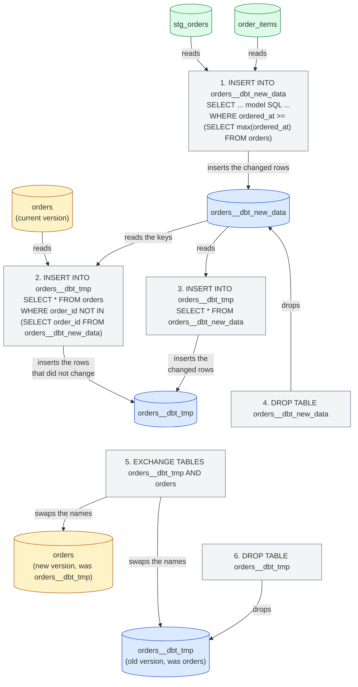
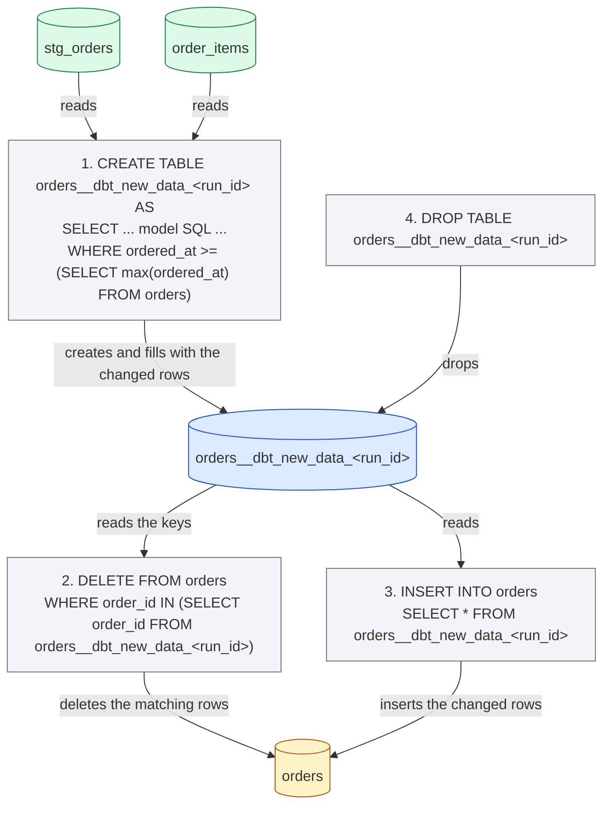
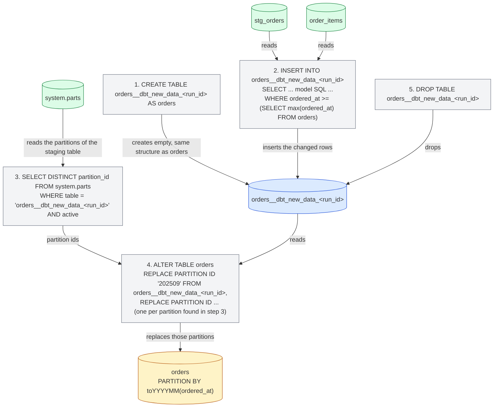

import { ClickHouseSupportedBadge } from "/snippets/pt-BR/components/ClickHouseSupported/ClickHouseSupported.jsx";

<ClickHouseSupportedBadge />

Este guia aborda os aspectos específicos do ClickHouse no dbt usando o projeto [Jaffle Shop for ClickHouse](https://github.com/ClickHouse/jaffle-shop-clickhouse), a adaptação para ClickHouse do clássico projeto de exemplo da dbt Labs. Partindo de um projeto que já é compilado com sucesso, ele mostra como:

1. Entender como as views e tabelas do projeto são materializadas no ClickHouse.
2. Carregar dados com seeds e controlar os tipos do ClickHouse e o layout da tabela.
3. Configurar um modelo de tabela com um motor do ClickHouse, sorting key e partitioning.
4. Transformar uma tabela em um modelo incremental e escolher uma incremental strategy.
5. Criar um snapshot.
6. Usar visões materializadas do ClickHouse.

Ele foi elaborado para ser lido junto com o restante da [documentação](/pt-BR/integrations/connectors/data-ingestion/etl-tools/dbt/index), a página de [features and configurations](/pt-BR/integrations/connectors/data-ingestion/etl-tools/dbt/features-and-configurations) e a [referência de materializations](/pt-BR/integrations/connectors/data-ingestion/etl-tools/dbt/materializations).

## Antes de começar {#before-you-start}

Siga primeiro o README de [ClickHouse/jaffle-shop-clickhouse](https://github.com/ClickHouse/jaffle-shop-clickhouse). Ele explica como configurar o projeto com dbt Core 1.x, dbt OSS, dbt v2 ou a plataforma dbt, como apontá-lo para um ClickHouse local (docker) ou para o ClickHouse Cloud, como carregar os dados de exemplo com `dbt seed` e como executar o primeiro `dbt build`. Depois que o `dbt build` for concluído com sucesso, volte para cá para ver os exemplos e as configurações específicas do ClickHouse.

Após as etapas do README, você deverá ter dois bancos de dados no ClickHouse:

* `raw`: as seis tabelas de origem carregadas a partir de CSV files pelo `dbt seed` (`raw_customers`, `raw_orders`, `raw_items`, `raw_products`, `raw_stores`, `raw_supplies`).
* `jaffle_shop` (o `schema` do seu profile): seis views de staging (`stg_*`) e sete tabelas de mart (`customers`, `orders`, `order_items`, `products`, `locations`, `supplies`, `metricflow_time_spine`).

Se o seu profile usar um `schema` diferente, substitua `jaffle_shop` nas consultas abaixo pelo seu valor.

<Note>
  **dbt Core 1.x, dbt OSS, dbt v2 e a plataforma dbt.** Todos os comandos e models deste guia são idênticos em todos eles. Os exemplos foram testados com dbt Core 1.12 e `dbt-clickhouse` 1.10, e com dbt OSS 2.0, no ClickHouse 26.8; o dbt v2 executa o mesmo adapter, e a plataforma dbt executa o dbt v2. A saída de console exibida é do dbt Core 1.x, e os poucos pontos em que os motores se comportam de maneira diferente estão indicados. Consulte a [página do dbt OSS, dbt v2 e plataforma dbt](/pt-BR/integrations/connectors/data-ingestion/etl-tools/dbt/dbt-core-v2-fusion-and-platform) para saber o status atual do adapter v2 e [Connect ClickHouse](https://docs.getdbt.com/docs/platform/connect-data-platform/connect-clickhouse) na documentação do dbt para começar a usar a plataforma dbt.
</Note>

Todas as instruções SQL que não são comandos dbt devem ser executadas diretamente no ClickHouse, por exemplo com o `clickhouse client`, com o SQL console do ClickHouse Cloud ou com o cliente SQL de sua preferência.

## Como o projeto é materializado {#views-and-tables}

O Jaffle Shop configura suas materializations no `dbt_project.yml`: os models de staging são views e os marts são tables.

```yaml
models:
  jaffle_shop:
    staging:
      +materialized: view
    marts:
      +materialized: table
```

Um model do tipo **view** é reconstruído com um statement `CREATE OR REPLACE VIEW` a cada execução. Ele não armazena dados, portanto seu build não tem custo algum, mas toda consulta sobre ele executa o SQL do model nas source tables. O ClickHouse mantém o SQL compilado do model na view definition:

```sql
SHOW CREATE VIEW jaffle_shop.stg_orders;
```

```response
CREATE VIEW jaffle_shop.stg_orders
(
    `order_id` String,
    `location_id` String,
    `customer_id` String,
    ...
    `ordered_at` DateTime
)
AS WITH
    source AS
    (
        SELECT *
        FROM raw.raw_orders
    ),
    renamed AS
    (
        SELECT
            id AS order_id,
            store_id AS location_id,
            ...
            dateTrunc('day', ordered_at) AS ordered_at
        FROM source
    )
SELECT *
FROM renamed
```

Um model do tipo **table** é reconstruído do zero a cada execução: o adapter cria uma nova table, executa um `INSERT INTO ... SELECT` com o SQL do model e a troca atomicamente pela versão anterior. O desempenho das consultas é muito melhor do que o de uma view, ao custo de armazenamento e da reconstrução da table inteira a cada execução. Veja a table que o dbt criou para o mart `orders`:

```sql
SHOW CREATE TABLE jaffle_shop.orders;
```

```response
CREATE TABLE jaffle_shop.orders
(
    `order_id` String,
    `location_id` String,
    `customer_id` String,
    ...
    `customer_order_number` UInt64
)
ENGINE = MergeTree
ORDER BY tuple()
SETTINGS replicated_deduplication_window = '0', index_granularity = 8192
```

Duas coisas aqui são específicas do ClickHouse. O model não declara um motor de tabela, então o adapter usa `MergeTree`, e também não declara uma sorting key, então o adapter usa `ORDER BY tuple()`, ou seja, os dados não são ordenados de forma alguma. Isso é aceitável para um projeto de exemplo, mas, em uma table real, você vai querer definir ambos — que é justamente o que as próximas seções fazem. A [página de materializations](/pt-BR/integrations/connectors/data-ingestion/etl-tools/dbt/materializations) lista todas as configurações de table compatíveis com o adapter.

## Carregando dados com seeds {#seeds}

O Jaffle Shop usa [seeds](https://docs.getdbt.com/docs/build/seeds) do dbt para carregar seus dados brutos a partir dos arquivos CSV em `seeds/jaffle-data`. Os seeds servem para dados de referência pequenos e estáticos (tabelas de códigos, mapeamentos), e não para carregar um data warehouse; o projeto os utiliza por conveniência, para que você possa começar sem precisar de outra ferramenta de ingestão — e é por isso que os seeds ficam desabilitados a menos que você passe `--vars '{"load_source_data": true}'`.

Mesmo assim, os seeds são um bom ponto de partida para entender como o dbt cria tabelas no ClickHouse. O dbt infere um tipo de coluna para cada coluna do CSV, e os tipos inferidos variam entre os motores:

| Valor do CSV          | dbt v1     | motor v2        |
| --------------------- | ---------- | --------------- |
| `700`                 | `Int32`    | `Int64`         |
| `0.06`                | `Float32`  | `Float64`       |
| `2024-09-01T15:01:00` | `DateTime` | `DateTime64(6)` |
| `Philadelphia`        | `String`   | `String`        |

Quando o tipo importa, defina-o explicitamente com `column_types`. O projeto já faz isso para a coluna `opened_at` do seed `raw_stores` em `dbt_project.yml`:

```yaml
seeds:
  jaffle_shop:
    +schema: raw
    jaffle-data:
      +enabled: "{{ var('load_source_data', false) }}"
      raw_stores:
        +column_types:
          opened_at: DateTime64(3)
```

Os seeds também aceitam as configurações de tabela do ClickHouse `engine`, `order_by` e `partition_by`. Por exemplo, para ordenar o seed `raw_orders` pelo horário do pedido e particioná-lo por mês, adicione um arquivo de propriedades junto aos CSVs, `seeds/jaffle-data/_raw_orders.yml`:

```yaml
seeds:
  - name: raw_orders
    config:
      order_by: (ordered_at, id)
      partition_by: toYYYYMM(ordered_at)
```

<Note>
  Use um arquivo de propriedades para essas configurações de seed do ClickHouse em vez das chaves `+order_by` ou `+engine` sob `seeds:` no `dbt_project.yml`. O dbt Core 1.x aceita ambas as formas, mas o dbt v2 só as reconhece em um arquivo de propriedades e rejeita as chaves do `dbt_project.yml` com `Unrecognized key ... Custom keys must go under +meta`.
</Note>

Recarregue esse seed e verifique a tabela que ele gerou:

```bash
dbt seed --select raw_orders --full-refresh --vars '{"load_source_data": true}'
```

```sql
SHOW CREATE TABLE raw.raw_orders;
```

```response
CREATE TABLE raw.raw_orders
(
    `id` String,
    `customer` String,
    `ordered_at` DateTime,
    `store_id` String,
    `subtotal` Int32,
    `tax_paid` Int32,
    `order_total` Int32
)
ENGINE = MergeTree
PARTITION BY toYYYYMM(ordered_at)
ORDER BY (ordered_at, id)
SETTINGS index_granularity = 8192
```

`dbt seed --full-refresh` remove e recria a tabela, portanto execute-o antes de criar qualquer objeto que dependa diretamente dos dados da tabela, como a visão materializada apresentada mais adiante neste guia.

## Configurando uma tabela para o ClickHouse {#table-configuration}

O mart `orders` é o ponto de partida natural: ele é consultado pelo mart `customers` e pelas métricas do projeto, além de ser uma tabela em estilo de eventos com um timestamp. Adicione um bloco `config` no início de `models/marts/orders.sql` para escolher o motor, a chave de ordenação e um esquema de particionamento:

```sql
{{
    config(
        materialized='table',
        engine='MergeTree()',
        order_by='(ordered_at, order_id)',
        partition_by='toYYYYMM(ordered_at)'
    )
}}

with

orders as (

    select * from {{ ref('stg_orders') }}

),
...
```

O restante do model permanece como está. `materialized='table'` repete o que o `dbt_project.yml` já define para as marts, o que mantém o model autodescritivo quando você o alterar para incremental mais adiante. Reconstrua apenas este model:

```bash
dbt run --select orders
```

```response
1 of 1 START sql table model `jaffle_shop`.`orders` ............................ [RUN]
1 of 1 OK created sql table model `jaffle_shop`.`orders` ....................... [OK in 0.44s]
```

A tabela agora possui uma sorting key adequada e uma partição por mês:

```sql
SHOW CREATE TABLE jaffle_shop.orders;
```

```response
CREATE TABLE jaffle_shop.orders
(
    ...
)
ENGINE = MergeTree
PARTITION BY toYYYYMM(ordered_at)
ORDER BY (ordered_at, order_id)
SETTINGS replicated_deduplication_window = '0', index_granularity = 8192
```

```sql
SELECT partition, sum(rows) AS rows
FROM system.parts
WHERE database = 'jaffle_shop' AND table = 'orders' AND active
GROUP BY partition
ORDER BY partition;
```

```response
┌─partition─┬─rows─┐
│ 202409    │ 1497 │
│ 202410    │ 1698 │
│ 202411    │ 2262 │
...
│ 202508    │ 9389 │
└───────────┴──────┘
```

Além de `engine`, `order_by` e `partition_by`, os models de tabela aceitam `primary_key`, `ttl`, `settings`, `query_settings`, `projections` e `indexes`, e as colunas podem levar `codec` e `ttl` por meio de um contrato de model. Todos eles estão descritos na [página de materializations](/pt-BR/integrations/connectors/data-ingestion/etl-tools/dbt/materializations).

## Criando um modelo incremental {#incremental}

Reconstruir `orders` do zero a cada execução é aceitável para 62.000 linhas, mas não para uma tabela que cresce milhões de linhas por dia. A [materialização incremental](https://docs.getdbt.com/docs/build/incremental-models) do dbt processa apenas as linhas que mudaram desde a última execução. Converter o modelo `orders` exige duas adições:

1. **`unique_key`**: a coluna que identifica uma linha, aqui `order_id`. O adapter a usa para substituir as linhas processadas novamente, em vez de duplicá-las.
2. **Um filtro incremental**: uma cláusula `where` envolvida por `` que seleciona apenas as linhas a processar. Ela é aplicada nas execuções incrementais, mas não quando a tabela é criada pela primeira vez (ou reconstruída com `--full-refresh`). Os pedidos possuem um timestamp, portanto o filtro compara `ordered_at` com o valor mais recente já presente na tabela, referenciado pela variável `{{ this }}`.

Atualize `models/marts/orders.sql` para que o bloco `config` e o final do modelo fiquem assim:

```sql
{{
    config(
        materialized='incremental',
        unique_key='order_id',
        engine='MergeTree()',
        order_by='(ordered_at, order_id)',
        partition_by='toYYYYMM(ordered_at)'
    )
}}

with

orders as (

    select * from {{ ref('stg_orders') }}

),

...

select * from customer_order_count



-- this filter will only be applied on an incremental run
where ordered_at >= (select max(ordered_at) from {{ this }})


```

`stg_orders` trunca `ordered_at` para o dia, então o filtro usa `>=`: em cada execução, todo o dia mais recente é processado novamente e, graças a `unique_key`, as linhas já carregadas são substituídas em vez de duplicadas. É isso que torna a abordagem segura para pedidos que chegam mais tarde no mesmo dia.

Execute o model. A table já existe, portanto esta primeira execução já é incremental: apenas o dia mais recente é reprocessado.

```bash
dbt run --select orders
```

```response
1 of 1 START sql incremental model `jaffle_shop`.`orders` ...................... [RUN]
1 of 1 OK created sql incremental model `jaffle_shop`.`orders` ................. [OK in 0.94s]
```

Agora adicione alguns dados novos. Os dados da Jaffle Shop terminam em agosto de 2025, então vamos incluir um novo cliente, Clicky McClickHouse, que pediu um jaffle ontem. Insira um cliente, um pedido e o item desse pedido nas tabelas raw:

```sql
INSERT INTO raw.raw_customers VALUES ('clicky-0001', 'Clicky McClickHouse');

INSERT INTO raw.raw_orders VALUES
    ('clicky-order-0001', 'clicky-0001', now() - INTERVAL 1 DAY,
     '4b6c2304-2b9e-41e4-942a-cf11a1819378', 1100, 66, 1166);

INSERT INTO raw.raw_items VALUES ('clicky-item-0001', 'clicky-order-0001', 'JAF-001');
```

O id da loja é Philadelphia, o item é um jaffle `nutellaphone who dis?` a 11,00 e o imposto é o de Philadelphia, de 6%, portanto os testes de dados do projeto continuam passando. Execute o projeto inteiro para que as views de staging e a tabela `order_items` vejam as novas linhas antes de `orders`:

```bash
dbt run
```

```response
...
10 of 13 OK created sql table model `jaffle_shop`.`order_items` ................ [OK in 0.30s]
...
12 of 13 START sql incremental model `jaffle_shop`.`orders` .................... [RUN]
12 of 13 OK created sql incremental model `jaffle_shop`.`orders` ............... [OK in 0.73s]
13 of 13 START sql table model `jaffle_shop`.`customers` ....................... [RUN]
13 of 13 OK created sql table model `jaffle_shop`.`customers` .................. [OK in 0.28s]
```

O novo pedido está na tabela incremental e o mart `customers`, reconstruído a partir dela, já reconhece o novo cliente:

```sql
SELECT order_id, customer_id, ordered_at, order_total, customer_order_number
FROM jaffle_shop.orders
WHERE customer_id = 'clicky-0001';
```

```response
┌─order_id──────────┬─customer_id─┬──────────ordered_at─┬─order_total─┬─customer_order_number─┐
│ clicky-order-0001 │ clicky-0001 │ 2026-09-14 00:00:00 │       11.66 │                     1 │
└───────────────────┴─────────────┴─────────────────────┴─────────────┴───────────────────────┘
```

```sql
SELECT customer_name, count_lifetime_orders, lifetime_spend, customer_type
FROM jaffle_shop.customers
WHERE customer_id = 'clicky-0001';
```

```response
┌─customer_name───────┬─count_lifetime_orders─┬─lifetime_spend─┬─customer_type─┐
│ Clicky McClickHouse │                     1 │          11.66 │ new           │
└─────────────────────┴───────────────────────┴────────────────┴───────────────┘
```

### Internals {#internals}

O query log do ClickHouse mostra as instruções que o adapter executou para a atualização incremental:

```sql
SELECT event_time, written_rows, tables
FROM system.query_log
WHERE query_kind = 'Insert' AND type = 'QueryFinish'
  AND has(databases, 'jaffle_shop')
  AND event_time > now() - INTERVAL 15 MINUTE
ORDER BY event_time;
```

A estratégia incremental padrão do adapter funciona da seguinte forma. Nos diagramas desta seção, uma seta de uma table para um statement significa que o statement lê essa table; uma seta de um statement para uma table significa que ele grava, aplica mutação, renomeia ou faz drop nela:

1. Uma table `orders__dbt_new_data` é criada e o SQL do model, incluindo o filter incremental, é inserido nela. Na execução acima, 378 rows foram gravadas: os 377 pedidos do dia mais recente já carregados mais o novo.
2. Uma table `orders__dbt_tmp` é criada com a mesma structure de `orders`, e todas as rows de `orders` cujo `order_id` não está em `orders__dbt_new_data` são copiadas para ela.
3. Todas as rows de `orders__dbt_new_data` são inseridas em `orders__dbt_tmp`. São os passos 2 e 3 que substituem as rows do dia mais recente em vez de duplicá-las.
4. É feito drop de `orders__dbt_new_data`.
5. `orders__dbt_tmp` é trocada com `orders` por meio de um statement atômico `EXCHANGE TABLES` (com um rename intermediário para `orders__dbt_backup`), de modo que `orders` passa a conter a nova versão.
6. É feito drop da versão antiga.



O passo 2 copia a tabela inteira, portanto essa estratégia é tão custosa quanto reconstruir a tabela em modelos muito grandes; consulte as [limitações](/pt-BR/integrations/connectors/data-ingestion/etl-tools/dbt/index#limitations). As estratégias abaixo evitam essa cópia.

### Estratégia append {#append-strategy}

A estratégia `append` insere as linhas selecionadas pelo model diretamente na target table. Nenhuma temporary table é criada e nada é copiado, portanto é o mais barato que uma execução incremental pode ser. Em troca, nada é deduplicado: se o filter incremental selecionar uma linha que já está na table, ela aparecerá duas vezes. Use-a para dados imutáveis, no estilo de eventos, e garanta que o filter selecione apenas linhas genuinamente novas.

Com o `ordered_at` truncado por dia, isso significa mudar o filter para `>`. Altere o model:

```sql
{{
    config(
        materialized='incremental',
        incremental_strategy='append',
        unique_key='order_id',
        engine='MergeTree()',
        order_by='(ordered_at, order_id)',
        partition_by='toYYYYMM(ordered_at)'
    )
}}

...



-- this filter will only be applied on an incremental run
where ordered_at > (select max(ordered_at) from {{ this }})


```

Adicione um segundo cliente novo, Danny DeBito, com um pedido feito hoje no Brooklyn (4% de imposto) contendo um jaffle e um café:

```sql
INSERT INTO raw.raw_customers VALUES ('danny-0001', 'Danny DeBito');

INSERT INTO raw.raw_orders VALUES
    ('danny-order-0001', 'danny-0001', now(),
     '40e6ddd6-b8f6-4e17-8bd6-5e53966809d2', 1900, 76, 1976);

INSERT INTO raw.raw_items VALUES
    ('danny-item-0001', 'danny-order-0001', 'JAF-003'),
    ('danny-item-0002', 'danny-order-0001', 'BEV-004');
```

```bash
dbt run
```

```response
...
12 of 13 START sql incremental model `jaffle_shop`.`orders` .................... [RUN]
12 of 13 OK created sql incremental model `jaffle_shop`.`orders` ............... [OK in 0.11s]
...
```

O modelo incremental foi executado em uma fração do tempo da execução anterior. Os dois novos clientes têm exatamente um pedido na tabela:

```sql
SELECT order_id, customer_id, ordered_at, order_total, is_food_order, is_drink_order
FROM jaffle_shop.orders
WHERE customer_id IN ('clicky-0001', 'danny-0001')
ORDER BY ordered_at;
```

```response
┌─order_id──────────┬─customer_id─┬──────────ordered_at─┬─order_total─┬─is_food_order─┬─is_drink_order─┐
│ clicky-order-0001 │ clicky-0001 │ 2026-09-14 00:00:00 │       11.66 │             1 │              0 │
│ danny-order-0001  │ danny-0001  │ 2026-09-15 00:00:00 │       19.76 │             1 │              1 │
└───────────────────┴─────────────┴─────────────────────┴─────────────┴───────────────┴────────────────┘
```

O query log confirma a diferença: desta vez, o único statement que toca `orders` é um único `INSERT INTO jaffle_shop.orders ... SELECT ...` com o SQL do model e o filter incremental, e ele gravou apenas uma linha.

<Warning>
  Com `>` e um timestamp truncado por dia, um pedido que chega mais tarde no mesmo dia do pedido carregado mais recente nunca é capturado. Em um projeto real, aplique o filter sobre um timestamp com full precision ou sobre um horário de ingestão monotonicamente crescente ao usar a strategy `append`.
</Warning>

### Estratégia de delete e insert {#delete-insert-strategy}

Historicamente, o ClickHouse ofereceu suporte apenas limitado a atualizações e exclusões, na forma de [mutações](/pt-BR/reference/statements/alter/index) assíncronas. Elas podem consumir muita E/S e, de modo geral, devem ser evitadas. O ClickHouse 22.8 introduziu as [exclusões leves](/pt-BR/reference/statements/delete) e o ClickHouse 25.7 introduziu as [atualizações leves](/pt-BR/reference/statements/update). Com elas, o efeito de uma única instrução de exclusão ou atualização fica visível imediatamente da perspectiva do usuário, ainda que seja materializado de forma assíncrona.

A estratégia `delete+insert` se baseia em exclusões leves e é configurada por meio do parâmetro `incremental_strategy`:

```sql
{{
    config(
        materialized='incremental',
        incremental_strategy='delete+insert',
        unique_key='order_id',
        engine='MergeTree()',
        order_by='(ordered_at, order_id)',
        partition_by='toYYYYMM(ordered_at)'
    )
}}
```

Ela atua diretamente na target table, portanto, se algo falhar no meio do processo, os dados do incremental model provavelmente ficarão em um estado inválido: não há swap atômico. Em resumo:

1. Uma temporary table (`orders__dbt_new_data_<run_id>`) é criada e as rows selecionadas pelo model são inseridas nela.
2. Um `DELETE` é executado em `orders` para cada `order_id` presente na temporary table.
3. As rows da temporary table são inseridas em `orders`.
4. A temporary table é removida.



### Estratégia insert overwrite (experimental) {#insert-overwrite-strategy}

A estratégia `insert_overwrite` substitui partições inteiras, portanto exige uma configuração `partition_by`, como a mensal em `orders`. Ela executa os seguintes passos:

1. Cria uma staging table (`orders__dbt_new_data_<run_id>`) com a mesma estrutura de `orders`.
2. Insere na staging table apenas as linhas selecionadas pelo modelo.
3. Lista as partições presentes na staging table a partir de `system.parts`.
4. Substitui exatamente essas partições em `orders` com `ALTER TABLE ... REPLACE PARTITION ... FROM` a staging table.
5. Remove a staging table.

Essa abordagem tem as seguintes vantagens:

* É mais rápida que a estratégia padrão, pois não copia a tabela inteira.
* É mais segura que as outras estratégias, pois não modifica a tabela original até que a operação INSERT seja concluída com sucesso: em caso de falha intermediária, a tabela original permanece intacta.
* Implementa a boa prática de engenharia de dados de &quot;imutabilidade de partições&quot;, que simplifica o processamento incremental e paralelo de dados, rollbacks etc.



A [página de materializations](/pt-BR/integrations/connectors/data-ingestion/etl-tools/dbt/materializations#materialization-incremental) aborda as demais opções da materialization incremental, incluindo a strategy `microbatch` e o `on_schema_change`.

## Criando um snapshot {#snapshot}

Os [snapshots](https://docs.getdbt.com/docs/build/snapshots) do dbt registram como as linhas de uma tabela mutável mudam ao longo do tempo, permitindo que analistas consultem o estado dos dados em qualquer momento do passado. Eles implementam [dimensões de variação lenta do tipo 2](https://en.wikipedia.org/wiki/Slowly_changing_dimension#Type_2:_add_new_row): cada versão de uma linha é armazenada com o intervalo durante o qual ela foi válida.

O mart `customers` é um bom candidate: `count_lifetime_orders`, `lifetime_spend` e `customer_type` mudam sempre que um cliente faz um novo pedido. Antes de continuar, volte o model `orders` para a incremental strategy padrão da [seção incremental](#incremental) (remova `incremental_strategy='append'` e altere o filter de volta para `>=`), para que os pedidos feitos mais tarde no dia de hoje sejam capturados.

Desde o dbt 1.9, os snapshots são definidos em YAML. Crie `snapshots/customers_snapshot.yml`:

```yaml
snapshots:
  - name: customers_snapshot
    relation: ref('customers')
    config:
      unique_key: customer_id
      strategy: check
      check_cols:
        - count_lifetime_orders
        - lifetime_spend
        - customer_type
```

A strategy `check` compara as colunas listadas entre o current snapshot e o source a cada execução e registra uma nova version sempre que alguma delas mudar. Se o seu model tiver uma coluna de timestamp confiável de &quot;última atualização&quot;, a strategy `timestamp` é mais econômica: defina `strategy: timestamp` e `updated_at: <column>`. O `last_ordered_at` do Jaffle Shop é truncado para o dia, portanto não detectaria um segundo pedido no mesmo dia — e é por isso que este exemplo usa `check`.

Crie o primeiro snapshot:

```bash
dbt snapshot
```

```response
1 of 1 START snapshot `jaffle_shop`.`customers_snapshot` ....................... [RUN]
1 of 1 OK snapshotted `jaffle_shop`.`customers_snapshot` ....................... [OK in 0.17s]
```

A tabela de snapshot é criada junto aos models. A macro `generate_schema_name` do projeto coloca cada relation no schema de destino para targets que não sejam de production, portanto uma config `schema` no snapshot só teria efeito com o target `prod`. Ela contém uma linha por cliente, com as colunas de controle do dbt `dbt_valid_from` e `dbt_valid_to`; esta última é `NULL` para a versão atual de uma linha:

```sql
SELECT customer_id, count_lifetime_orders, lifetime_spend, customer_type, dbt_valid_from, dbt_valid_to
FROM jaffle_shop.customers_snapshot
WHERE customer_id IN ('clicky-0001', 'danny-0001')
ORDER BY customer_id, dbt_valid_from;
```

```response
┌─customer_id─┬─count_lifetime_orders─┬─lifetime_spend─┬─customer_type─┬──────dbt_valid_from─┬─dbt_valid_to─┐
│ clicky-0001 │                     1 │          11.66 │ new           │ 2026-09-15 01:15:32 │         ᴺᵁᴸᴸ │
│ danny-0001  │                     1 │          19.76 │ new           │ 2026-09-15 01:15:32 │         ᴺᵁᴸᴸ │
└─────────────┴───────────────────────┴────────────────┴───────────────┴─────────────────────┴──────────────┘
```

Hoje o Clicky volta para tomar um café:

```sql
INSERT INTO raw.raw_orders VALUES
    ('clicky-order-0002', 'clicky-0001', now(),
     '4b6c2304-2b9e-41e4-942a-cf11a1819378', 600, 36, 636);

INSERT INTO raw.raw_items VALUES ('clicky-item-0002', 'clicky-order-0002', 'BEV-001');
```

Execute os models para que `orders` e `customers` reflitam o novo pedido e, em seguida, crie um segundo snapshot:

```bash
dbt run
dbt snapshot
```

```response
1 of 1 START snapshot `jaffle_shop`.`customers_snapshot` ....................... [RUN]
1 of 1 OK snapshotted `jaffle_shop`.`customers_snapshot` ....................... [OK in 0.73s]
```

Clicky agora tem duas linhas no snapshot. A primeira versão foi fechada com a definição do seu `dbt_valid_to`, e a nova versão, agora um cliente `returning` com dois pedidos, está aberta. Danny não mudou, portanto sua linha permanece intacta:

```sql
SELECT customer_id, count_lifetime_orders, lifetime_spend, customer_type, dbt_valid_from, dbt_valid_to
FROM jaffle_shop.customers_snapshot
WHERE customer_id IN ('clicky-0001', 'danny-0001')
ORDER BY customer_id, dbt_valid_from;
```

```response
┌─customer_id─┬─count_lifetime_orders─┬─lifetime_spend─┬─customer_type─┬──────dbt_valid_from─┬────────dbt_valid_to─┐
│ clicky-0001 │                     1 │          11.66 │ new           │ 2026-09-15 01:15:32 │ 2026-09-15 01:16:16 │
│ clicky-0001 │                     2 │          18.02 │ returning     │ 2026-09-15 01:16:16 │                ᴺᵁᴸᴸ │
│ danny-0001  │                     1 │          19.76 │ new           │ 2026-09-15 01:15:32 │                ᴺᵁᴸᴸ │
└─────────────┴───────────────────────┴────────────────┴───────────────┴─────────────────────┴─────────────────────┘
```

Internamente, o adapter constrói a nova versão do snapshot em uma table `customers_snapshot__snapshot_upsert` e a coloca em uso com `EXCHANGE TABLES` (ou por meio de um drop e rename, nos casos em que o servidor não consegue trocar tables), de modo que os leitores veem ou a versão anterior ou a nova versão do snapshot. Consulte a [seção sobre snapshot na página de materializations](/pt-BR/integrations/connectors/data-ingestion/etl-tools/dbt/materializations#snapshot) para a referência de configuração.

## Usando visões materializadas {#materialized-views}

Tudo o que vimos até aqui exige um `dbt run` para trazer novos dados para os models. As [visões materializadas](/pt-BR/concepts/features/materialized-views/index) do ClickHouse funcionam de outra forma: elas são gatilhos de insert. Cada bloco de linhas inserido na tabela de origem é transformado pelo `SELECT` da view e gravado em uma tabela de destino, sem nenhum agendamento envolvido. O adapter as expõe por meio da materialization `materialized_view`.

Crie `models/marts/daily_store_revenue.sql` com o número de pedidos e a receita por loja e por dia, lendo diretamente da tabela de pedidos brutos:

```sql
{{
    config(
        materialized='materialized_view',
        engine='SummingMergeTree()',
        order_by='(order_date, store_id)'
    )
}}

select
    toDate(ordered_at) as order_date,
    store_id,
    count() as orders,
    sum(order_total) as revenue_cents
from {{ source('ecom', 'raw_orders') }}
group by order_date, store_id
```

O `engine` e o `order_by` se aplicam à tabela de destino. O `SummingMergeTree` soma as colunas numéricas das linhas que compartilham a mesma sorting key ao mesclar partes, que é exatamente o que uma agregação por dia e por loja precisa.

```bash
dbt run --select daily_store_revenue
```

```response
1 of 1 START sql materialized_view model `jaffle_shop`.`daily_store_revenue` ... [RUN]
1 of 1 OK created sql materialized_view model `jaffle_shop`.`daily_store_revenue`  [OK in 0.25s]
```

O adapter criou dois objetos: a target table, nomeada a partir do model, e a própria visão materializada com o suffix `_mv`, apontando para a target table por meio de uma cláusula `TO`. Por padrão (`catchup=True`), a target table também recebeu o backfill dos pedidos existentes:

```sql
SELECT name, engine
FROM system.tables
WHERE database = 'jaffle_shop' AND name LIKE 'daily_store_revenue%';
```

```response
┌─name───────────────────┬─engine───────────┐
│ daily_store_revenue    │ SummingMergeTree │
│ daily_store_revenue_mv │ MaterializedView │
└────────────────────────┴──────────────────┘
```

```sql
SHOW CREATE TABLE jaffle_shop.daily_store_revenue_mv;
```

```response
CREATE MATERIALIZED VIEW jaffle_shop.daily_store_revenue_mv TO jaffle_shop.daily_store_revenue
(
    `order_date` Date,
    `store_id` String,
    `orders` UInt64,
    `revenue_cents` Int64
)
AS SELECT
    toDate(ordered_at) AS order_date,
    store_id,
    count() AS orders,
    sum(order_total) AS revenue_cents
FROM raw.raw_orders
GROUP BY
    order_date,
    store_id
```

Agora insira outro pedido bruto para o Danny, sem executar o dbt em seguida:

```sql
INSERT INTO raw.raw_orders VALUES
    ('danny-order-0002', 'danny-0001', now(),
     '40e6ddd6-b8f6-4e17-8bd6-5e53966809d2', 1400, 56, 1456);

INSERT INTO raw.raw_items VALUES ('danny-item-0003', 'danny-order-0002', 'JAF-004');
```

A target table já reflete isso. Brooklyn agora tem dois pedidos hoje:

```sql
SELECT order_date, store_id, sum(orders) AS orders, sum(revenue_cents) AS revenue_cents
FROM jaffle_shop.daily_store_revenue
WHERE order_date >= yesterday()
GROUP BY order_date, store_id
ORDER BY order_date, store_id;
```

```response
┌─order_date─┬─store_id─────────────────────────────┬─orders─┬─revenue_cents─┐
│ 2026-09-14 │ 4b6c2304-2b9e-41e4-942a-cf11a1819378 │      1 │          1166 │
│ 2026-09-15 │ 40e6ddd6-b8f6-4e17-8bd6-5e53966809d2 │      2 │          3432 │
│ 2026-09-15 │ 4b6c2304-2b9e-41e4-942a-cf11a1819378 │      1 │           636 │
└────────────┴──────────────────────────────────────┴────────┴───────────────┘
```

A consulta agrega com `sum()` e `GROUP BY` de propósito: o `SummingMergeTree` só colapsa linhas com a mesma chave quando as partes são mescladas em segundo plano, portanto, até que isso aconteça, os dois pedidos de Brooklyn são duas linhas na tabela. Sempre agregue na leitura (ou use `FINAL`) com motores de soma e agregação. Enquanto isso, o model incremental `orders` continua com um único pedido para Danny até o próximo `dbt run`.

Execuções posteriores de `dbt run` preservam a target table e seus dados e apenas atualizam a view definition, com `ALTER TABLE ... MODIFY QUERY` quando a mudança permite, de modo que é seguro manter o model no projeto. O `dbt run --full-refresh` reconstrói a target table e faz o backfill novamente (a menos que `catchup` seja `False`). A [página de visões materializadas](/pt-BR/integrations/connectors/data-ingestion/etl-tools/dbt/materialization-materialized-view) cobre o restante: schema changes com `on_schema_change`, desativação do backfill com `catchup`, visões materializadas atualizáveis, várias views alimentando o mesmo target e a definição da target table como um model próprio.

## Mais informações {#further-information}

Este guia apenas arranha a superfície do dbt. A [documentação do dbt](https://docs.getdbt.com/docs/introduction) é a referência para tudo que não seja específico do ClickHouse. Quanto ao adapter, consulte a página [features and configurations](/pt-BR/integrations/connectors/data-ingestion/etl-tools/dbt/features-and-configurations) para configurações de profile e features globais, a [página de materializations](/pt-BR/integrations/connectors/data-ingestion/etl-tools/dbt/materializations) para cada configuration usada acima e a [página do dbt OSS, dbt v2 e plataforma dbt](/pt-BR/integrations/connectors/data-ingestion/etl-tools/dbt/dbt-core-v2-fusion-and-platform) caso você utilize o dbt OSS, o dbt v2 ou a plataforma dbt. Contribuições com novos exemplos para o [Jaffle Shop for ClickHouse](https://github.com/ClickHouse/jaffle-shop-clickhouse) são bem-vindas.